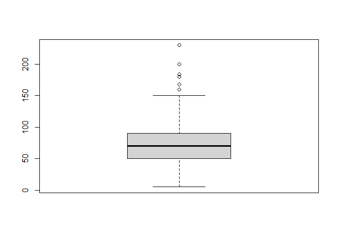
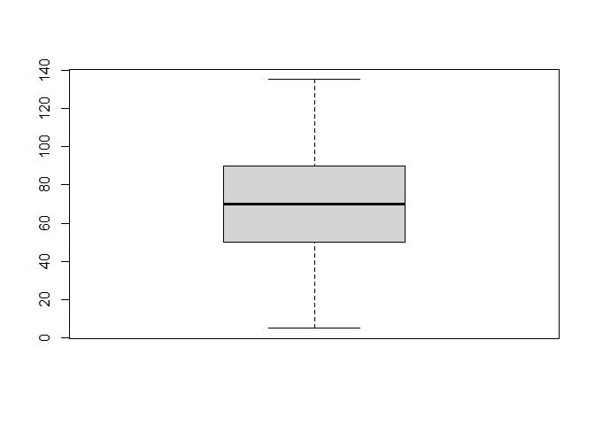
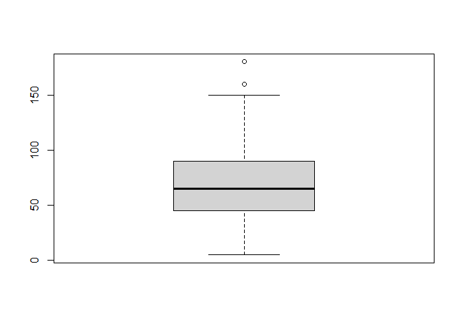

Untitled
================

``` r
getwd()
```

    ## [1] "C:/Users/Cristobal/Desktop/Minería de D"

``` r
wd = setwd("C:/Users/Cristobal/Desktop/Minería de D")


Pokemon = read.csv("pokemon.csv")
Pokemon
```

    ##      X.                      Name   Type.1   Type.2 Total  HP Attack Defense
    ## 1     1                 Bulbasaur    Grass   Poison   318  45     49      49
    ## 2     2                   Ivysaur    Grass   Poison   405  60     62      63
    ## 3     3                  Venusaur    Grass   Poison   525  80     82      83
    ## 4     3     VenusaurMega Venusaur    Grass   Poison   625  80    100     123
    ## 5     4                Charmander     Fire            309  39     52      43
    ## 6     5                Charmeleon     Fire            405  58     64      58
    ## 7     6                 Charizard     Fire   Flying   534  78     84      78
    ## 8     6 CharizardMega Charizard X     Fire   Dragon   634  78    130     111
    ## 9     6 CharizardMega Charizard Y     Fire   Flying   634  78    104      78
    ## 10    7                  Squirtle    Water            314  44     48      65
    ## 11    8                 Wartortle    Water            405  59     63      80
    ## 12    9                 Blastoise    Water            530  79     83     100
    ## 13    9   BlastoiseMega Blastoise    Water            630  79    103     120
    ## 14   10                  Caterpie      Bug            195  45     30      35
    ## 15   11                   Metapod      Bug            205  50     20      55
    ## 16   12                Butterfree      Bug   Flying   395  60     45      50
    ## 17   13                    Weedle      Bug   Poison   195  40     35      30
    ## 18   14                    Kakuna      Bug   Poison   205  45     25      50
    ## 19   15                  Beedrill      Bug   Poison   395  65     90      40
    ## 20   15     BeedrillMega Beedrill      Bug   Poison   495  65    150      40
    ## 21   16                    Pidgey   Normal   Flying   251  40     45      40
    ## 22   17                 Pidgeotto   Normal   Flying   349  63     60      55
    ## 23   18                   Pidgeot   Normal   Flying   479  83     80      75
    ## 24   18       PidgeotMega Pidgeot   Normal   Flying   579  83     80      80
    ## 25   19                   Rattata   Normal            253  30     56      35
    ## 26   20                  Raticate   Normal            413  55     81      60
    ## 27   21                   Spearow   Normal   Flying   262  40     60      30
    ## 28   22                    Fearow   Normal   Flying   442  65     90      65
    ## 29   23                     Ekans   Poison            288  35     60      44
    ## 30   24                     Arbok   Poison            438  60     85      69
    ## 31   25                   Pikachu Electric            320  35     55      40
    ## 32   26                    Raichu Electric            485  60     90      55
    ## 33   27                 Sandshrew   Ground            300  50     75      85
    ## 34   28                 Sandslash   Ground            450  75    100     110
    ## 35   29                Nidoranâ\231\200   Poison            275  55     47      52
    ## 36   30                  Nidorina   Poison            365  70     62      67
    ## 37   31                 Nidoqueen   Poison   Ground   505  90     92      87
    ## 38   32                Nidoranâ\231‚   Poison            273  46     57      40
    ## 39   33                  Nidorino   Poison            365  61     72      57
    ## 40   34                  Nidoking   Poison   Ground   505  81    102      77
    ## 41   35                  Clefairy    Fairy            323  70     45      48
    ## 42   36                  Clefable    Fairy            483  95     70      73
    ## 43   37                    Vulpix     Fire            299  38     41      40
    ## 44   38                 Ninetales     Fire            505  73     76      75
    ## 45   39                Jigglypuff   Normal    Fairy   270 115     45      20
    ## 46   40                Wigglytuff   Normal    Fairy   435 140     70      45
    ## 47   41                     Zubat   Poison   Flying   245  40     45      35
    ## 48   42                    Golbat   Poison   Flying   455  75     80      70
    ## 49   43                    Oddish    Grass   Poison   320  45     50      55
    ## 50   44                     Gloom    Grass   Poison   395  60     65      70
    ## 51   45                 Vileplume    Grass   Poison   490  75     80      85
    ## 52   46                     Paras      Bug    Grass   285  35     70      55
    ## 53   47                  Parasect      Bug    Grass   405  60     95      80
    ## 54   48                   Venonat      Bug   Poison   305  60     55      50
    ## 55   49                  Venomoth      Bug   Poison   450  70     65      60
    ## 56   50                   Diglett   Ground            265  10     55      25
    ## 57   51                   Dugtrio   Ground            405  35     80      50
    ## 58   52                    Meowth   Normal            290  40     45      35
    ## 59   53                   Persian   Normal            440  65     70      60
    ## 60   54                   Psyduck    Water            320  50     52      48
    ## 61   55                   Golduck    Water            500  80     82      78
    ## 62   56                    Mankey Fighting            305  40     80      35
    ## 63   57                  Primeape Fighting            455  65    105      60
    ## 64   58                 Growlithe     Fire            350  55     70      45
    ## 65   59                  Arcanine     Fire            555  90    110      80
    ## 66   60                   Poliwag    Water            300  40     50      40
    ## 67   61                 Poliwhirl    Water            385  65     65      65
    ## 68   62                 Poliwrath    Water Fighting   510  90     95      95
    ## 69   63                      Abra  Psychic            310  25     20      15
    ## 70   64                   Kadabra  Psychic            400  40     35      30
    ## 71   65                  Alakazam  Psychic            500  55     50      45
    ## 72   65     AlakazamMega Alakazam  Psychic            590  55     50      65
    ## 73   66                    Machop Fighting            305  70     80      50
    ## 74   67                   Machoke Fighting            405  80    100      70
    ## 75   68                   Machamp Fighting            505  90    130      80
    ## 76   69                Bellsprout    Grass   Poison   300  50     75      35
    ## 77   70                Weepinbell    Grass   Poison   390  65     90      50
    ## 78   71                Victreebel    Grass   Poison   490  80    105      65
    ## 79   72                 Tentacool    Water   Poison   335  40     40      35
    ## 80   73                Tentacruel    Water   Poison   515  80     70      65
    ## 81   74                   Geodude     Rock   Ground   300  40     80     100
    ## 82   75                  Graveler     Rock   Ground   390  55     95     115
    ## 83   76                     Golem     Rock   Ground   495  80    120     130
    ## 84   77                    Ponyta     Fire            410  50     85      55
    ## 85   78                  Rapidash     Fire            500  65    100      70
    ## 86   79                  Slowpoke    Water  Psychic   315  90     65      65
    ## 87   80                   Slowbro    Water  Psychic   490  95     75     110
    ## 88   80       SlowbroMega Slowbro    Water  Psychic   590  95     75     180
    ## 89   81                 Magnemite Electric    Steel   325  25     35      70
    ## 90   82                  Magneton Electric    Steel   465  50     60      95
    ## 91   83                Farfetch'd   Normal   Flying   352  52     65      55
    ## 92   84                     Doduo   Normal   Flying   310  35     85      45
    ## 93   85                    Dodrio   Normal   Flying   460  60    110      70
    ## 94   86                      Seel    Water            325  65     45      55
    ## 95   87                   Dewgong    Water      Ice   475  90     70      80
    ## 96   88                    Grimer   Poison            325  80     80      50
    ## 97   89                       Muk   Poison            500 105    105      75
    ## 98   90                  Shellder    Water            305  30     65     100
    ## 99   91                  Cloyster    Water      Ice   525  50     95     180
    ## 100  92                    Gastly    Ghost   Poison   310  30     35      30
    ## 101  93                   Haunter    Ghost   Poison   405  45     50      45
    ## 102  94                    Gengar    Ghost   Poison   500  60     65      60
    ## 103  94         GengarMega Gengar    Ghost   Poison   600  60     65      80
    ## 104  95                      Onix     Rock   Ground   385  35     45     160
    ## 105  96                   Drowzee  Psychic            328  60     48      45
    ## 106  97                     Hypno  Psychic            483  85     73      70
    ## 107  98                    Krabby    Water            325  30    105      90
    ## 108  99                   Kingler    Water            475  55    130     115
    ## 109 100                   Voltorb Electric            330  40     30      50
    ## 110 101                 Electrode Electric            480  60     50      70
    ## 111 102                 Exeggcute    Grass  Psychic   325  60     40      80
    ## 112 103                 Exeggutor    Grass  Psychic   520  95     95      85
    ## 113 104                    Cubone   Ground            320  50     50      95
    ## 114 105                   Marowak   Ground            425  60     80     110
    ## 115 106                 Hitmonlee Fighting            455  50    120      53
    ## 116 107                Hitmonchan Fighting            455  50    105      79
    ## 117 108                 Lickitung   Normal            385  90     55      75
    ## 118 109                   Koffing   Poison            340  40     65      95
    ## 119 110                   Weezing   Poison            490  65     90     120
    ## 120 111                   Rhyhorn   Ground     Rock   345  80     85      95
    ## 121 112                    Rhydon   Ground     Rock   485 105    130     120
    ## 122 113                   Chansey   Normal            450 250      5       5
    ## 123 114                   Tangela    Grass            435  65     55     115
    ## 124 115                Kangaskhan   Normal            490 105     95      80
    ## 125 115 KangaskhanMega Kangaskhan   Normal            590 105    125     100
    ## 126 116                    Horsea    Water            295  30     40      70
    ## 127 117                    Seadra    Water            440  55     65      95
    ## 128 118                   Goldeen    Water            320  45     67      60
    ## 129 119                   Seaking    Water            450  80     92      65
    ## 130 120                    Staryu    Water            340  30     45      55
    ## 131 121                   Starmie    Water  Psychic   520  60     75      85
    ## 132 122                  Mr. Mime  Psychic    Fairy   460  40     45      65
    ## 133 123                   Scyther      Bug   Flying   500  70    110      80
    ## 134 124                      Jynx      Ice  Psychic   455  65     50      35
    ## 135 125                Electabuzz Electric            490  65     83      57
    ## 136 126                    Magmar     Fire            495  65     95      57
    ## 137 127                    Pinsir      Bug            500  65    125     100
    ## 138 127         PinsirMega Pinsir      Bug   Flying   600  65    155     120
    ## 139 128                    Tauros   Normal            490  75    100      95
    ## 140 129                  Magikarp    Water            200  20     10      55
    ## 141 130                  Gyarados    Water   Flying   540  95    125      79
    ## 142 130     GyaradosMega Gyarados    Water     Dark   640  95    155     109
    ## 143 131                    Lapras    Water      Ice   535 130     85      80
    ## 144 132                     Ditto   Normal            288  48     48      48
    ## 145 133                     Eevee   Normal            325  55     55      50
    ## 146 134                  Vaporeon    Water            525 130     65      60
    ## 147 135                   Jolteon Electric            525  65     65      60
    ## 148 136                   Flareon     Fire            525  65    130      60
    ## 149 137                   Porygon   Normal            395  65     60      70
    ## 150 138                   Omanyte     Rock    Water   355  35     40     100
    ## 151 139                   Omastar     Rock    Water   495  70     60     125
    ## 152 140                    Kabuto     Rock    Water   355  30     80      90
    ## 153 141                  Kabutops     Rock    Water   495  60    115     105
    ## 154 142                Aerodactyl     Rock   Flying   515  80    105      65
    ## 155 142 AerodactylMega Aerodactyl     Rock   Flying   615  80    135      85
    ## 156 143                   Snorlax   Normal            540 160    110      65
    ## 157 144                  Articuno      Ice   Flying   580  90     85     100
    ## 158 145                    Zapdos Electric   Flying   580  90     90      85
    ## 159 146                   Moltres     Fire   Flying   580  90    100      90
    ## 160 147                   Dratini   Dragon            300  41     64      45
    ## 161 148                 Dragonair   Dragon            420  61     84      65
    ## 162 149                 Dragonite   Dragon   Flying   600  91    134      95
    ## 163 150                    Mewtwo  Psychic            680 106    110      90
    ## 164 150       MewtwoMega Mewtwo X  Psychic Fighting   780 106    190     100
    ## 165 150       MewtwoMega Mewtwo Y  Psychic            780 106    150      70
    ## 166 151                       Mew  Psychic            600 100    100     100
    ## 167 152                 Chikorita    Grass            318  45     49      65
    ## 168 153                   Bayleef    Grass            405  60     62      80
    ## 169 154                  Meganium    Grass            525  80     82     100
    ## 170 155                 Cyndaquil     Fire            309  39     52      43
    ## 171 156                   Quilava     Fire            405  58     64      58
    ## 172 157                Typhlosion     Fire            534  78     84      78
    ## 173 158                  Totodile    Water            314  50     65      64
    ## 174 159                  Croconaw    Water            405  65     80      80
    ## 175 160                Feraligatr    Water            530  85    105     100
    ## 176 161                   Sentret   Normal            215  35     46      34
    ## 177 162                    Furret   Normal            415  85     76      64
    ## 178 163                  Hoothoot   Normal   Flying   262  60     30      30
    ## 179 164                   Noctowl   Normal   Flying   442 100     50      50
    ## 180 165                    Ledyba      Bug   Flying   265  40     20      30
    ## 181 166                    Ledian      Bug   Flying   390  55     35      50
    ## 182 167                  Spinarak      Bug   Poison   250  40     60      40
    ## 183 168                   Ariados      Bug   Poison   390  70     90      70
    ## 184 169                    Crobat   Poison   Flying   535  85     90      80
    ## 185 170                  Chinchou    Water Electric   330  75     38      38
    ## 186 171                   Lanturn    Water Electric   460 125     58      58
    ## 187 172                     Pichu Electric            205  20     40      15
    ## 188 173                    Cleffa    Fairy            218  50     25      28
    ## 189 174                 Igglybuff   Normal    Fairy   210  90     30      15
    ## 190 175                    Togepi    Fairy            245  35     20      65
    ## 191 176                   Togetic    Fairy   Flying   405  55     40      85
    ## 192 177                      Natu  Psychic   Flying   320  40     50      45
    ## 193 178                      Xatu  Psychic   Flying   470  65     75      70
    ## 194 179                    Mareep Electric            280  55     40      40
    ## 195 180                   Flaaffy Electric            365  70     55      55
    ## 196 181                  Ampharos Electric            510  90     75      85
    ## 197 181     AmpharosMega Ampharos Electric   Dragon   610  90     95     105
    ## 198 182                 Bellossom    Grass            490  75     80      95
    ## 199 183                    Marill    Water    Fairy   250  70     20      50
    ## 200 184                 Azumarill    Water    Fairy   420 100     50      80
    ## 201 185                 Sudowoodo     Rock            410  70    100     115
    ## 202 186                  Politoed    Water            500  90     75      75
    ## 203 187                    Hoppip    Grass   Flying   250  35     35      40
    ## 204 188                  Skiploom    Grass   Flying   340  55     45      50
    ## 205 189                  Jumpluff    Grass   Flying   460  75     55      70
    ## 206 190                     Aipom   Normal            360  55     70      55
    ## 207 191                   Sunkern    Grass            180  30     30      30
    ## 208 192                  Sunflora    Grass            425  75     75      55
    ## 209 193                     Yanma      Bug   Flying   390  65     65      45
    ## 210 194                    Wooper    Water   Ground   210  55     45      45
    ## 211 195                  Quagsire    Water   Ground   430  95     85      85
    ## 212 196                    Espeon  Psychic            525  65     65      60
    ## 213 197                   Umbreon     Dark            525  95     65     110
    ## 214 198                   Murkrow     Dark   Flying   405  60     85      42
    ## 215 199                  Slowking    Water  Psychic   490  95     75      80
    ## 216 200                Misdreavus    Ghost            435  60     60      60
    ## 217 201                     Unown  Psychic            336  48     72      48
    ## 218 202                 Wobbuffet  Psychic            405 190     33      58
    ## 219 203                 Girafarig   Normal  Psychic   455  70     80      65
    ## 220 204                    Pineco      Bug            290  50     65      90
    ## 221 205                Forretress      Bug    Steel   465  75     90     140
    ## 222 206                 Dunsparce   Normal            415 100     70      70
    ## 223 207                    Gligar   Ground   Flying   430  65     75     105
    ## 224 208                   Steelix    Steel   Ground   510  75     85     200
    ## 225 208       SteelixMega Steelix    Steel   Ground   610  75    125     230
    ## 226 209                  Snubbull    Fairy            300  60     80      50
    ## 227 210                  Granbull    Fairy            450  90    120      75
    ## 228 211                  Qwilfish    Water   Poison   430  65     95      75
    ## 229 212                    Scizor      Bug    Steel   500  70    130     100
    ## 230 212         ScizorMega Scizor      Bug    Steel   600  70    150     140
    ## 231 213                   Shuckle      Bug     Rock   505  20     10     230
    ## 232 214                 Heracross      Bug Fighting   500  80    125      75
    ## 233 214   HeracrossMega Heracross      Bug Fighting   600  80    185     115
    ## 234 215                   Sneasel     Dark      Ice   430  55     95      55
    ## 235 216                 Teddiursa   Normal            330  60     80      50
    ## 236 217                  Ursaring   Normal            500  90    130      75
    ## 237 218                    Slugma     Fire            250  40     40      40
    ## 238 219                  Magcargo     Fire     Rock   410  50     50     120
    ## 239 220                    Swinub      Ice   Ground   250  50     50      40
    ## 240 221                 Piloswine      Ice   Ground   450 100    100      80
    ## 241 222                   Corsola    Water     Rock   380  55     55      85
    ## 242 223                  Remoraid    Water            300  35     65      35
    ## 243 224                 Octillery    Water            480  75    105      75
    ## 244 225                  Delibird      Ice   Flying   330  45     55      45
    ## 245 226                   Mantine    Water   Flying   465  65     40      70
    ## 246 227                  Skarmory    Steel   Flying   465  65     80     140
    ## 247 228                  Houndour     Dark     Fire   330  45     60      30
    ## 248 229                  Houndoom     Dark     Fire   500  75     90      50
    ## 249 229     HoundoomMega Houndoom     Dark     Fire   600  75     90      90
    ## 250 230                   Kingdra    Water   Dragon   540  75     95      95
    ## 251 231                    Phanpy   Ground            330  90     60      60
    ## 252 232                   Donphan   Ground            500  90    120     120
    ## 253 233                  Porygon2   Normal            515  85     80      90
    ## 254 234                  Stantler   Normal            465  73     95      62
    ## 255 235                  Smeargle   Normal            250  55     20      35
    ## 256 236                   Tyrogue Fighting            210  35     35      35
    ## 257 237                 Hitmontop Fighting            455  50     95      95
    ## 258 238                  Smoochum      Ice  Psychic   305  45     30      15
    ## 259 239                    Elekid Electric            360  45     63      37
    ## 260 240                     Magby     Fire            365  45     75      37
    ## 261 241                   Miltank   Normal            490  95     80     105
    ## 262 242                   Blissey   Normal            540 255     10      10
    ## 263 243                    Raikou Electric            580  90     85      75
    ## 264 244                     Entei     Fire            580 115    115      85
    ## 265 245                   Suicune    Water            580 100     75     115
    ## 266 246                  Larvitar     Rock   Ground   300  50     64      50
    ## 267 247                   Pupitar     Rock   Ground   410  70     84      70
    ## 268 248                 Tyranitar     Rock     Dark   600 100    134     110
    ## 269 248   TyranitarMega Tyranitar     Rock     Dark   700 100    164     150
    ## 270 249                     Lugia  Psychic   Flying   680 106     90     130
    ## 271 250                     Ho-oh     Fire   Flying   680 106    130      90
    ## 272 251                    Celebi  Psychic    Grass   600 100    100     100
    ## 273 252                   Treecko    Grass            310  40     45      35
    ## 274 253                   Grovyle    Grass            405  50     65      45
    ## 275 254                  Sceptile    Grass            530  70     85      65
    ## 276 254     SceptileMega Sceptile    Grass   Dragon   630  70    110      75
    ## 277 255                   Torchic     Fire            310  45     60      40
    ## 278 256                 Combusken     Fire Fighting   405  60     85      60
    ## 279 257                  Blaziken     Fire Fighting   530  80    120      70
    ## 280 257     BlazikenMega Blaziken     Fire Fighting   630  80    160      80
    ## 281 258                    Mudkip    Water            310  50     70      50
    ## 282 259                 Marshtomp    Water   Ground   405  70     85      70
    ## 283 260                  Swampert    Water   Ground   535 100    110      90
    ## 284 260     SwampertMega Swampert    Water   Ground   635 100    150     110
    ## 285 261                 Poochyena     Dark            220  35     55      35
    ## 286 262                 Mightyena     Dark            420  70     90      70
    ## 287 263                 Zigzagoon   Normal            240  38     30      41
    ## 288 264                   Linoone   Normal            420  78     70      61
    ## 289 265                   Wurmple      Bug            195  45     45      35
    ## 290 266                   Silcoon      Bug            205  50     35      55
    ## 291 267                 Beautifly      Bug   Flying   395  60     70      50
    ## 292 268                   Cascoon      Bug            205  50     35      55
    ## 293 269                    Dustox      Bug   Poison   385  60     50      70
    ## 294 270                     Lotad    Water    Grass   220  40     30      30
    ## 295 271                    Lombre    Water    Grass   340  60     50      50
    ## 296 272                  Ludicolo    Water    Grass   480  80     70      70
    ## 297 273                    Seedot    Grass            220  40     40      50
    ## 298 274                   Nuzleaf    Grass     Dark   340  70     70      40
    ## 299 275                   Shiftry    Grass     Dark   480  90    100      60
    ## 300 276                   Taillow   Normal   Flying   270  40     55      30
    ## 301 277                   Swellow   Normal   Flying   430  60     85      60
    ## 302 278                   Wingull    Water   Flying   270  40     30      30
    ## 303 279                  Pelipper    Water   Flying   430  60     50     100
    ## 304 280                     Ralts  Psychic    Fairy   198  28     25      25
    ## 305 281                    Kirlia  Psychic    Fairy   278  38     35      35
    ## 306 282                 Gardevoir  Psychic    Fairy   518  68     65      65
    ## 307 282   GardevoirMega Gardevoir  Psychic    Fairy   618  68     85      65
    ## 308 283                   Surskit      Bug    Water   269  40     30      32
    ## 309 284                Masquerain      Bug   Flying   414  70     60      62
    ## 310 285                 Shroomish    Grass            295  60     40      60
    ## 311 286                   Breloom    Grass Fighting   460  60    130      80
    ## 312 287                   Slakoth   Normal            280  60     60      60
    ## 313 288                  Vigoroth   Normal            440  80     80      80
    ## 314 289                   Slaking   Normal            670 150    160     100
    ## 315 290                   Nincada      Bug   Ground   266  31     45      90
    ## 316 291                   Ninjask      Bug   Flying   456  61     90      45
    ## 317 292                  Shedinja      Bug    Ghost   236   1     90      45
    ## 318 293                   Whismur   Normal            240  64     51      23
    ## 319 294                   Loudred   Normal            360  84     71      43
    ## 320 295                   Exploud   Normal            490 104     91      63
    ## 321 296                  Makuhita Fighting            237  72     60      30
    ## 322 297                  Hariyama Fighting            474 144    120      60
    ## 323 298                   Azurill   Normal    Fairy   190  50     20      40
    ## 324 299                  Nosepass     Rock            375  30     45     135
    ## 325 300                    Skitty   Normal            260  50     45      45
    ## 326 301                  Delcatty   Normal            380  70     65      65
    ## 327 302                   Sableye     Dark    Ghost   380  50     75      75
    ## 328 302       SableyeMega Sableye     Dark    Ghost   480  50     85     125
    ## 329 303                    Mawile    Steel    Fairy   380  50     85      85
    ## 330 303         MawileMega Mawile    Steel    Fairy   480  50    105     125
    ## 331 304                      Aron    Steel     Rock   330  50     70     100
    ## 332 305                    Lairon    Steel     Rock   430  60     90     140
    ## 333 306                    Aggron    Steel     Rock   530  70    110     180
    ## 334 306         AggronMega Aggron    Steel            630  70    140     230
    ## 335 307                  Meditite Fighting  Psychic   280  30     40      55
    ## 336 308                  Medicham Fighting  Psychic   410  60     60      75
    ## 337 308     MedichamMega Medicham Fighting  Psychic   510  60    100      85
    ## 338 309                 Electrike Electric            295  40     45      40
    ## 339 310                 Manectric Electric            475  70     75      60
    ## 340 310   ManectricMega Manectric Electric            575  70     75      80
    ## 341 311                    Plusle Electric            405  60     50      40
    ## 342 312                     Minun Electric            405  60     40      50
    ## 343 313                   Volbeat      Bug            400  65     73      55
    ## 344 314                  Illumise      Bug            400  65     47      55
    ## 345 315                   Roselia    Grass   Poison   400  50     60      45
    ## 346 316                    Gulpin   Poison            302  70     43      53
    ## 347 317                    Swalot   Poison            467 100     73      83
    ## 348 318                  Carvanha    Water     Dark   305  45     90      20
    ## 349 319                  Sharpedo    Water     Dark   460  70    120      40
    ## 350 319     SharpedoMega Sharpedo    Water     Dark   560  70    140      70
    ## 351 320                   Wailmer    Water            400 130     70      35
    ## 352 321                   Wailord    Water            500 170     90      45
    ## 353 322                     Numel     Fire   Ground   305  60     60      40
    ## 354 323                  Camerupt     Fire   Ground   460  70    100      70
    ## 355 323     CameruptMega Camerupt     Fire   Ground   560  70    120     100
    ## 356 324                   Torkoal     Fire            470  70     85     140
    ## 357 325                    Spoink  Psychic            330  60     25      35
    ## 358 326                   Grumpig  Psychic            470  80     45      65
    ## 359 327                    Spinda   Normal            360  60     60      60
    ## 360 328                  Trapinch   Ground            290  45    100      45
    ## 361 329                   Vibrava   Ground   Dragon   340  50     70      50
    ## 362 330                    Flygon   Ground   Dragon   520  80    100      80
    ## 363 331                    Cacnea    Grass            335  50     85      40
    ## 364 332                  Cacturne    Grass     Dark   475  70    115      60
    ## 365 333                    Swablu   Normal   Flying   310  45     40      60
    ## 366 334                   Altaria   Dragon   Flying   490  75     70      90
    ## 367 334       AltariaMega Altaria   Dragon    Fairy   590  75    110     110
    ## 368 335                  Zangoose   Normal            458  73    115      60
    ## 369 336                   Seviper   Poison            458  73    100      60
    ## 370 337                  Lunatone     Rock  Psychic   440  70     55      65
    ## 371 338                   Solrock     Rock  Psychic   440  70     95      85
    ## 372 339                  Barboach    Water   Ground   288  50     48      43
    ## 373 340                  Whiscash    Water   Ground   468 110     78      73
    ## 374 341                  Corphish    Water            308  43     80      65
    ## 375 342                 Crawdaunt    Water     Dark   468  63    120      85
    ## 376 343                    Baltoy   Ground  Psychic   300  40     40      55
    ## 377 344                   Claydol   Ground  Psychic   500  60     70     105
    ## 378 345                    Lileep     Rock    Grass   355  66     41      77
    ## 379 346                   Cradily     Rock    Grass   495  86     81      97
    ## 380 347                   Anorith     Rock      Bug   355  45     95      50
    ## 381 348                   Armaldo     Rock      Bug   495  75    125     100
    ## 382 349                    Feebas    Water            200  20     15      20
    ## 383 350                   Milotic    Water            540  95     60      79
    ## 384 351                  Castform   Normal            420  70     70      70
    ## 385 352                   Kecleon   Normal            440  60     90      70
    ## 386 353                   Shuppet    Ghost            295  44     75      35
    ## 387 354                   Banette    Ghost            455  64    115      65
    ## 388 354       BanetteMega Banette    Ghost            555  64    165      75
    ## 389 355                   Duskull    Ghost            295  20     40      90
    ## 390 356                  Dusclops    Ghost            455  40     70     130
    ## 391 357                   Tropius    Grass   Flying   460  99     68      83
    ## 392 358                  Chimecho  Psychic            425  65     50      70
    ## 393 359                     Absol     Dark            465  65    130      60
    ## 394 359           AbsolMega Absol     Dark            565  65    150      60
    ## 395 360                    Wynaut  Psychic            260  95     23      48
    ## 396 361                   Snorunt      Ice            300  50     50      50
    ## 397 362                    Glalie      Ice            480  80     80      80
    ## 398 362         GlalieMega Glalie      Ice            580  80    120      80
    ## 399 363                    Spheal      Ice    Water   290  70     40      50
    ## 400 364                    Sealeo      Ice    Water   410  90     60      70
    ## 401 365                   Walrein      Ice    Water   530 110     80      90
    ## 402 366                  Clamperl    Water            345  35     64      85
    ## 403 367                   Huntail    Water            485  55    104     105
    ## 404 368                  Gorebyss    Water            485  55     84     105
    ## 405 369                 Relicanth    Water     Rock   485 100     90     130
    ## 406 370                   Luvdisc    Water            330  43     30      55
    ## 407 371                     Bagon   Dragon            300  45     75      60
    ## 408 372                   Shelgon   Dragon            420  65     95     100
    ## 409 373                 Salamence   Dragon   Flying   600  95    135      80
    ## 410 373   SalamenceMega Salamence   Dragon   Flying   700  95    145     130
    ## 411 374                    Beldum    Steel  Psychic   300  40     55      80
    ## 412 375                    Metang    Steel  Psychic   420  60     75     100
    ## 413 376                 Metagross    Steel  Psychic   600  80    135     130
    ## 414 376   MetagrossMega Metagross    Steel  Psychic   700  80    145     150
    ## 415 377                  Regirock     Rock            580  80    100     200
    ## 416 378                    Regice      Ice            580  80     50     100
    ## 417 379                 Registeel    Steel            580  80     75     150
    ## 418 380                    Latias   Dragon  Psychic   600  80     80      90
    ## 419 380         LatiasMega Latias   Dragon  Psychic   700  80    100     120
    ## 420 381                    Latios   Dragon  Psychic   600  80     90      80
    ## 421 381         LatiosMega Latios   Dragon  Psychic   700  80    130     100
    ## 422 382                    Kyogre    Water            670 100    100      90
    ## 423 382       KyogrePrimal Kyogre    Water            770 100    150      90
    ## 424 383                   Groudon   Ground            670 100    150     140
    ## 425 383     GroudonPrimal Groudon   Ground     Fire   770 100    180     160
    ## 426 384                  Rayquaza   Dragon   Flying   680 105    150      90
    ## 427 384     RayquazaMega Rayquaza   Dragon   Flying   780 105    180     100
    ## 428 385                   Jirachi    Steel  Psychic   600 100    100     100
    ## 429 386        DeoxysNormal Forme  Psychic            600  50    150      50
    ## 430 386        DeoxysAttack Forme  Psychic            600  50    180      20
    ## 431 386       DeoxysDefense Forme  Psychic            600  50     70     160
    ## 432 386         DeoxysSpeed Forme  Psychic            600  50     95      90
    ## 433 387                   Turtwig    Grass            318  55     68      64
    ## 434 388                    Grotle    Grass            405  75     89      85
    ## 435 389                  Torterra    Grass   Ground   525  95    109     105
    ## 436 390                  Chimchar     Fire            309  44     58      44
    ## 437 391                  Monferno     Fire Fighting   405  64     78      52
    ## 438 392                 Infernape     Fire Fighting   534  76    104      71
    ## 439 393                    Piplup    Water            314  53     51      53
    ## 440 394                  Prinplup    Water            405  64     66      68
    ## 441 395                  Empoleon    Water    Steel   530  84     86      88
    ## 442 396                    Starly   Normal   Flying   245  40     55      30
    ## 443 397                  Staravia   Normal   Flying   340  55     75      50
    ## 444 398                 Staraptor   Normal   Flying   485  85    120      70
    ## 445 399                    Bidoof   Normal            250  59     45      40
    ## 446 400                   Bibarel   Normal    Water   410  79     85      60
    ## 447 401                 Kricketot      Bug            194  37     25      41
    ## 448 402                Kricketune      Bug            384  77     85      51
    ## 449 403                     Shinx Electric            263  45     65      34
    ## 450 404                     Luxio Electric            363  60     85      49
    ## 451 405                    Luxray Electric            523  80    120      79
    ## 452 406                     Budew    Grass   Poison   280  40     30      35
    ## 453 407                  Roserade    Grass   Poison   515  60     70      65
    ## 454 408                  Cranidos     Rock            350  67    125      40
    ## 455 409                 Rampardos     Rock            495  97    165      60
    ## 456 410                  Shieldon     Rock    Steel   350  30     42     118
    ## 457 411                 Bastiodon     Rock    Steel   495  60     52     168
    ## 458 412                     Burmy      Bug            224  40     29      45
    ## 459 413       WormadamPlant Cloak      Bug    Grass   424  60     59      85
    ## 460 413       WormadamSandy Cloak      Bug   Ground   424  60     79     105
    ## 461 413       WormadamTrash Cloak      Bug    Steel   424  60     69      95
    ## 462 414                    Mothim      Bug   Flying   424  70     94      50
    ## 463 415                    Combee      Bug   Flying   244  30     30      42
    ## 464 416                 Vespiquen      Bug   Flying   474  70     80     102
    ## 465 417                 Pachirisu Electric            405  60     45      70
    ## 466 418                    Buizel    Water            330  55     65      35
    ## 467 419                  Floatzel    Water            495  85    105      55
    ## 468 420                   Cherubi    Grass            275  45     35      45
    ## 469 421                   Cherrim    Grass            450  70     60      70
    ## 470 422                   Shellos    Water            325  76     48      48
    ## 471 423                 Gastrodon    Water   Ground   475 111     83      68
    ## 472 424                   Ambipom   Normal            482  75    100      66
    ## 473 425                  Drifloon    Ghost   Flying   348  90     50      34
    ## 474 426                  Drifblim    Ghost   Flying   498 150     80      44
    ## 475 427                   Buneary   Normal            350  55     66      44
    ## 476 428                   Lopunny   Normal            480  65     76      84
    ## 477 428       LopunnyMega Lopunny   Normal Fighting   580  65    136      94
    ## 478 429                 Mismagius    Ghost            495  60     60      60
    ## 479 430                 Honchkrow     Dark   Flying   505 100    125      52
    ## 480 431                   Glameow   Normal            310  49     55      42
    ## 481 432                   Purugly   Normal            452  71     82      64
    ## 482 433                 Chingling  Psychic            285  45     30      50
    ## 483 434                    Stunky   Poison     Dark   329  63     63      47
    ## 484 435                  Skuntank   Poison     Dark   479 103     93      67
    ## 485 436                   Bronzor    Steel  Psychic   300  57     24      86
    ## 486 437                  Bronzong    Steel  Psychic   500  67     89     116
    ## 487 438                    Bonsly     Rock            290  50     80      95
    ## 488 439                  Mime Jr.  Psychic    Fairy   310  20     25      45
    ## 489 440                   Happiny   Normal            220 100      5       5
    ## 490 441                    Chatot   Normal   Flying   411  76     65      45
    ## 491 442                 Spiritomb    Ghost     Dark   485  50     92     108
    ## 492 443                     Gible   Dragon   Ground   300  58     70      45
    ## 493 444                    Gabite   Dragon   Ground   410  68     90      65
    ## 494 445                  Garchomp   Dragon   Ground   600 108    130      95
    ## 495 445     GarchompMega Garchomp   Dragon   Ground   700 108    170     115
    ## 496 446                  Munchlax   Normal            390 135     85      40
    ## 497 447                     Riolu Fighting            285  40     70      40
    ## 498 448                   Lucario Fighting    Steel   525  70    110      70
    ## 499 448       LucarioMega Lucario Fighting    Steel   625  70    145      88
    ## 500 449                Hippopotas   Ground            330  68     72      78
    ## 501 450                 Hippowdon   Ground            525 108    112     118
    ## 502 451                   Skorupi   Poison      Bug   330  40     50      90
    ## 503 452                   Drapion   Poison     Dark   500  70     90     110
    ## 504 453                  Croagunk   Poison Fighting   300  48     61      40
    ## 505 454                 Toxicroak   Poison Fighting   490  83    106      65
    ## 506 455                 Carnivine    Grass            454  74    100      72
    ## 507 456                   Finneon    Water            330  49     49      56
    ## 508 457                  Lumineon    Water            460  69     69      76
    ## 509 458                   Mantyke    Water   Flying   345  45     20      50
    ## 510 459                    Snover    Grass      Ice   334  60     62      50
    ## 511 460                 Abomasnow    Grass      Ice   494  90     92      75
    ## 512 460   AbomasnowMega Abomasnow    Grass      Ice   594  90    132     105
    ## 513 461                   Weavile     Dark      Ice   510  70    120      65
    ## 514 462                 Magnezone Electric    Steel   535  70     70     115
    ## 515 463                Lickilicky   Normal            515 110     85      95
    ## 516 464                 Rhyperior   Ground     Rock   535 115    140     130
    ## 517 465                 Tangrowth    Grass            535 100    100     125
    ## 518 466                Electivire Electric            540  75    123      67
    ## 519 467                 Magmortar     Fire            540  75     95      67
    ## 520 468                  Togekiss    Fairy   Flying   545  85     50      95
    ## 521 469                   Yanmega      Bug   Flying   515  86     76      86
    ## 522 470                   Leafeon    Grass            525  65    110     130
    ## 523 471                   Glaceon      Ice            525  65     60     110
    ## 524 472                   Gliscor   Ground   Flying   510  75     95     125
    ## 525 473                 Mamoswine      Ice   Ground   530 110    130      80
    ## 526 474                 Porygon-Z   Normal            535  85     80      70
    ## 527 475                   Gallade  Psychic Fighting   518  68    125      65
    ## 528 475       GalladeMega Gallade  Psychic Fighting   618  68    165      95
    ## 529 476                 Probopass     Rock    Steel   525  60     55     145
    ## 530 477                  Dusknoir    Ghost            525  45    100     135
    ## 531 478                  Froslass      Ice    Ghost   480  70     80      70
    ## 532 479                     Rotom Electric    Ghost   440  50     50      77
    ## 533 479           RotomHeat Rotom Electric     Fire   520  50     65     107
    ## 534 479           RotomWash Rotom Electric    Water   520  50     65     107
    ## 535 479          RotomFrost Rotom Electric      Ice   520  50     65     107
    ## 536 479            RotomFan Rotom Electric   Flying   520  50     65     107
    ## 537 479            RotomMow Rotom Electric    Grass   520  50     65     107
    ## 538 480                      Uxie  Psychic            580  75     75     130
    ## 539 481                   Mesprit  Psychic            580  80    105     105
    ## 540 482                     Azelf  Psychic            580  75    125      70
    ## 541 483                    Dialga    Steel   Dragon   680 100    120     120
    ## 542 484                    Palkia    Water   Dragon   680  90    120     100
    ## 543 485                   Heatran     Fire    Steel   600  91     90     106
    ## 544 486                 Regigigas   Normal            670 110    160     110
    ## 545 487     GiratinaAltered Forme    Ghost   Dragon   680 150    100     120
    ## 546 487      GiratinaOrigin Forme    Ghost   Dragon   680 150    120     100
    ## 547 488                 Cresselia  Psychic            600 120     70     120
    ## 548 489                    Phione    Water            480  80     80      80
    ## 549 490                   Manaphy    Water            600 100    100     100
    ## 550 491                   Darkrai     Dark            600  70     90      90
    ## 551 492         ShayminLand Forme    Grass            600 100    100     100
    ## 552 492          ShayminSky Forme    Grass   Flying   600 100    103      75
    ## 553 493                    Arceus   Normal            720 120    120     120
    ## 554 494                   Victini  Psychic     Fire   600 100    100     100
    ## 555 495                     Snivy    Grass            308  45     45      55
    ## 556 496                   Servine    Grass            413  60     60      75
    ## 557 497                 Serperior    Grass            528  75     75      95
    ## 558 498                     Tepig     Fire            308  65     63      45
    ## 559 499                   Pignite     Fire Fighting   418  90     93      55
    ## 560 500                    Emboar     Fire Fighting   528 110    123      65
    ## 561 501                  Oshawott    Water            308  55     55      45
    ## 562 502                    Dewott    Water            413  75     75      60
    ## 563 503                  Samurott    Water            528  95    100      85
    ## 564 504                    Patrat   Normal            255  45     55      39
    ## 565 505                   Watchog   Normal            420  60     85      69
    ## 566 506                  Lillipup   Normal            275  45     60      45
    ## 567 507                   Herdier   Normal            370  65     80      65
    ## 568 508                 Stoutland   Normal            500  85    110      90
    ## 569 509                  Purrloin     Dark            281  41     50      37
    ## 570 510                   Liepard     Dark            446  64     88      50
    ## 571 511                   Pansage    Grass            316  50     53      48
    ## 572 512                  Simisage    Grass            498  75     98      63
    ## 573 513                   Pansear     Fire            316  50     53      48
    ## 574 514                  Simisear     Fire            498  75     98      63
    ## 575 515                   Panpour    Water            316  50     53      48
    ## 576 516                  Simipour    Water            498  75     98      63
    ## 577 517                     Munna  Psychic            292  76     25      45
    ## 578 518                  Musharna  Psychic            487 116     55      85
    ## 579 519                    Pidove   Normal   Flying   264  50     55      50
    ## 580 520                 Tranquill   Normal   Flying   358  62     77      62
    ## 581 521                  Unfezant   Normal   Flying   488  80    115      80
    ## 582 522                   Blitzle Electric            295  45     60      32
    ## 583 523                 Zebstrika Electric            497  75    100      63
    ## 584 524                Roggenrola     Rock            280  55     75      85
    ## 585 525                   Boldore     Rock            390  70    105     105
    ## 586 526                  Gigalith     Rock            515  85    135     130
    ## 587 527                    Woobat  Psychic   Flying   313  55     45      43
    ## 588 528                   Swoobat  Psychic   Flying   425  67     57      55
    ## 589 529                   Drilbur   Ground            328  60     85      40
    ## 590 530                 Excadrill   Ground    Steel   508 110    135      60
    ## 591 531                    Audino   Normal            445 103     60      86
    ## 592 531         AudinoMega Audino   Normal    Fairy   545 103     60     126
    ## 593 532                   Timburr Fighting            305  75     80      55
    ## 594 533                   Gurdurr Fighting            405  85    105      85
    ## 595 534                Conkeldurr Fighting            505 105    140      95
    ## 596 535                   Tympole    Water            294  50     50      40
    ## 597 536                 Palpitoad    Water   Ground   384  75     65      55
    ## 598 537                Seismitoad    Water   Ground   509 105     95      75
    ## 599 538                     Throh Fighting            465 120    100      85
    ## 600 539                      Sawk Fighting            465  75    125      75
    ## 601 540                  Sewaddle      Bug    Grass   310  45     53      70
    ## 602 541                  Swadloon      Bug    Grass   380  55     63      90
    ## 603 542                  Leavanny      Bug    Grass   500  75    103      80
    ## 604 543                  Venipede      Bug   Poison   260  30     45      59
    ## 605 544                Whirlipede      Bug   Poison   360  40     55      99
    ## 606 545                 Scolipede      Bug   Poison   485  60    100      89
    ## 607 546                  Cottonee    Grass    Fairy   280  40     27      60
    ## 608 547                Whimsicott    Grass    Fairy   480  60     67      85
    ## 609 548                   Petilil    Grass            280  45     35      50
    ## 610 549                 Lilligant    Grass            480  70     60      75
    ## 611 550                  Basculin    Water            460  70     92      65
    ## 612 551                   Sandile   Ground     Dark   292  50     72      35
    ## 613 552                  Krokorok   Ground     Dark   351  60     82      45
    ## 614 553                Krookodile   Ground     Dark   519  95    117      80
    ## 615 554                  Darumaka     Fire            315  70     90      45
    ## 616 555   DarmanitanStandard Mode     Fire            480 105    140      55
    ## 617 555        DarmanitanZen Mode     Fire  Psychic   540 105     30     105
    ## 618 556                  Maractus    Grass            461  75     86      67
    ## 619 557                   Dwebble      Bug     Rock   325  50     65      85
    ## 620 558                   Crustle      Bug     Rock   475  70     95     125
    ## 621 559                   Scraggy     Dark Fighting   348  50     75      70
    ## 622 560                   Scrafty     Dark Fighting   488  65     90     115
    ## 623 561                  Sigilyph  Psychic   Flying   490  72     58      80
    ## 624 562                    Yamask    Ghost            303  38     30      85
    ## 625 563                Cofagrigus    Ghost            483  58     50     145
    ## 626 564                  Tirtouga    Water     Rock   355  54     78     103
    ## 627 565                Carracosta    Water     Rock   495  74    108     133
    ## 628 566                    Archen     Rock   Flying   401  55    112      45
    ## 629 567                  Archeops     Rock   Flying   567  75    140      65
    ## 630 568                  Trubbish   Poison            329  50     50      62
    ## 631 569                  Garbodor   Poison            474  80     95      82
    ## 632 570                     Zorua     Dark            330  40     65      40
    ## 633 571                   Zoroark     Dark            510  60    105      60
    ## 634 572                  Minccino   Normal            300  55     50      40
    ## 635 573                  Cinccino   Normal            470  75     95      60
    ## 636 574                   Gothita  Psychic            290  45     30      50
    ## 637 575                 Gothorita  Psychic            390  60     45      70
    ## 638 576                Gothitelle  Psychic            490  70     55      95
    ## 639 577                   Solosis  Psychic            290  45     30      40
    ## 640 578                   Duosion  Psychic            370  65     40      50
    ## 641 579                 Reuniclus  Psychic            490 110     65      75
    ## 642 580                  Ducklett    Water   Flying   305  62     44      50
    ## 643 581                    Swanna    Water   Flying   473  75     87      63
    ## 644 582                 Vanillite      Ice            305  36     50      50
    ## 645 583                 Vanillish      Ice            395  51     65      65
    ## 646 584                 Vanilluxe      Ice            535  71     95      85
    ## 647 585                  Deerling   Normal    Grass   335  60     60      50
    ## 648 586                  Sawsbuck   Normal    Grass   475  80    100      70
    ## 649 587                    Emolga Electric   Flying   428  55     75      60
    ## 650 588                Karrablast      Bug            315  50     75      45
    ## 651 589                Escavalier      Bug    Steel   495  70    135     105
    ## 652 590                   Foongus    Grass   Poison   294  69     55      45
    ## 653 591                 Amoonguss    Grass   Poison   464 114     85      70
    ## 654 592                  Frillish    Water    Ghost   335  55     40      50
    ## 655 593                 Jellicent    Water    Ghost   480 100     60      70
    ## 656 594                 Alomomola    Water            470 165     75      80
    ## 657 595                    Joltik      Bug Electric   319  50     47      50
    ## 658 596                Galvantula      Bug Electric   472  70     77      60
    ## 659 597                 Ferroseed    Grass    Steel   305  44     50      91
    ## 660 598                Ferrothorn    Grass    Steel   489  74     94     131
    ## 661 599                     Klink    Steel            300  40     55      70
    ## 662 600                     Klang    Steel            440  60     80      95
    ## 663 601                 Klinklang    Steel            520  60    100     115
    ## 664 602                    Tynamo Electric            275  35     55      40
    ## 665 603                 Eelektrik Electric            405  65     85      70
    ## 666 604                Eelektross Electric            515  85    115      80
    ## 667 605                    Elgyem  Psychic            335  55     55      55
    ## 668 606                  Beheeyem  Psychic            485  75     75      75
    ## 669 607                   Litwick    Ghost     Fire   275  50     30      55
    ## 670 608                   Lampent    Ghost     Fire   370  60     40      60
    ## 671 609                Chandelure    Ghost     Fire   520  60     55      90
    ## 672 610                      Axew   Dragon            320  46     87      60
    ## 673 611                   Fraxure   Dragon            410  66    117      70
    ## 674 612                   Haxorus   Dragon            540  76    147      90
    ## 675 613                   Cubchoo      Ice            305  55     70      40
    ## 676 614                   Beartic      Ice            485  95    110      80
    ## 677 615                 Cryogonal      Ice            485  70     50      30
    ## 678 616                   Shelmet      Bug            305  50     40      85
    ## 679 617                  Accelgor      Bug            495  80     70      40
    ## 680 618                  Stunfisk   Ground Electric   471 109     66      84
    ## 681 619                   Mienfoo Fighting            350  45     85      50
    ## 682 620                  Mienshao Fighting            510  65    125      60
    ## 683 621                 Druddigon   Dragon            485  77    120      90
    ## 684 622                    Golett   Ground    Ghost   303  59     74      50
    ## 685 623                    Golurk   Ground    Ghost   483  89    124      80
    ## 686 624                  Pawniard     Dark    Steel   340  45     85      70
    ## 687 625                   Bisharp     Dark    Steel   490  65    125     100
    ## 688 626                Bouffalant   Normal            490  95    110      95
    ## 689 627                   Rufflet   Normal   Flying   350  70     83      50
    ## 690 628                  Braviary   Normal   Flying   510 100    123      75
    ## 691 629                   Vullaby     Dark   Flying   370  70     55      75
    ## 692 630                 Mandibuzz     Dark   Flying   510 110     65     105
    ## 693 631                   Heatmor     Fire            484  85     97      66
    ## 694 632                    Durant      Bug    Steel   484  58    109     112
    ## 695 633                     Deino     Dark   Dragon   300  52     65      50
    ## 696 634                  Zweilous     Dark   Dragon   420  72     85      70
    ## 697 635                 Hydreigon     Dark   Dragon   600  92    105      90
    ## 698 636                  Larvesta      Bug     Fire   360  55     85      55
    ## 699 637                 Volcarona      Bug     Fire   550  85     60      65
    ## 700 638                  Cobalion    Steel Fighting   580  91     90     129
    ## 701 639                 Terrakion     Rock Fighting   580  91    129      90
    ## 702 640                  Virizion    Grass Fighting   580  91     90      72
    ## 703 641   TornadusIncarnate Forme   Flying            580  79    115      70
    ## 704 641     TornadusTherian Forme   Flying            580  79    100      80
    ## 705 642  ThundurusIncarnate Forme Electric   Flying   580  79    115      70
    ## 706 642    ThundurusTherian Forme Electric   Flying   580  79    105      70
    ## 707 643                  Reshiram   Dragon     Fire   680 100    120     100
    ## 708 644                    Zekrom   Dragon Electric   680 100    150     120
    ## 709 645   LandorusIncarnate Forme   Ground   Flying   600  89    125      90
    ## 710 645     LandorusTherian Forme   Ground   Flying   600  89    145      90
    ## 711 646                    Kyurem   Dragon      Ice   660 125    130      90
    ## 712 646        KyuremBlack Kyurem   Dragon      Ice   700 125    170     100
    ## 713 646        KyuremWhite Kyurem   Dragon      Ice   700 125    120      90
    ## 714 647      KeldeoOrdinary Forme    Water Fighting   580  91     72      90
    ## 715 647      KeldeoResolute Forme    Water Fighting   580  91     72      90
    ## 716 648        MeloettaAria Forme   Normal  Psychic   600 100     77      77
    ## 717 648   MeloettaPirouette Forme   Normal Fighting   600 100    128      90
    ## 718 649                  Genesect      Bug    Steel   600  71    120      95
    ## 719 650                   Chespin    Grass            313  56     61      65
    ## 720 651                 Quilladin    Grass            405  61     78      95
    ## 721 652                Chesnaught    Grass Fighting   530  88    107     122
    ## 722 653                  Fennekin     Fire            307  40     45      40
    ## 723 654                   Braixen     Fire            409  59     59      58
    ## 724 655                   Delphox     Fire  Psychic   534  75     69      72
    ## 725 656                   Froakie    Water            314  41     56      40
    ## 726 657                 Frogadier    Water            405  54     63      52
    ## 727 658                  Greninja    Water     Dark   530  72     95      67
    ## 728 659                  Bunnelby   Normal            237  38     36      38
    ## 729 660                 Diggersby   Normal   Ground   423  85     56      77
    ## 730 661                Fletchling   Normal   Flying   278  45     50      43
    ## 731 662               Fletchinder     Fire   Flying   382  62     73      55
    ## 732 663                Talonflame     Fire   Flying   499  78     81      71
    ## 733 664                Scatterbug      Bug            200  38     35      40
    ## 734 665                    Spewpa      Bug            213  45     22      60
    ## 735 666                  Vivillon      Bug   Flying   411  80     52      50
    ## 736 667                    Litleo     Fire   Normal   369  62     50      58
    ## 737 668                    Pyroar     Fire   Normal   507  86     68      72
    ## 738 669                 Flabébé    Fairy            303  44     38      39
    ## 739 670                   Floette    Fairy            371  54     45      47
    ## 740 671                   Florges    Fairy            552  78     65      68
    ## 741 672                    Skiddo    Grass            350  66     65      48
    ## 742 673                    Gogoat    Grass            531 123    100      62
    ## 743 674                   Pancham Fighting            348  67     82      62
    ## 744 675                   Pangoro Fighting     Dark   495  95    124      78
    ## 745 676                   Furfrou   Normal            472  75     80      60
    ## 746 677                    Espurr  Psychic            355  62     48      54
    ## 747 678              MeowsticMale  Psychic            466  74     48      76
    ## 748 678            MeowsticFemale  Psychic            466  74     48      76
    ## 749 679                   Honedge    Steel    Ghost   325  45     80     100
    ## 750 680                  Doublade    Steel    Ghost   448  59    110     150
    ## 751 681      AegislashBlade Forme    Steel    Ghost   520  60    150      50
    ## 752 681     AegislashShield Forme    Steel    Ghost   520  60     50     150
    ## 753 682                  Spritzee    Fairy            341  78     52      60
    ## 754 683                Aromatisse    Fairy            462 101     72      72
    ## 755 684                   Swirlix    Fairy            341  62     48      66
    ## 756 685                  Slurpuff    Fairy            480  82     80      86
    ## 757 686                     Inkay     Dark  Psychic   288  53     54      53
    ## 758 687                   Malamar     Dark  Psychic   482  86     92      88
    ## 759 688                   Binacle     Rock    Water   306  42     52      67
    ## 760 689                Barbaracle     Rock    Water   500  72    105     115
    ## 761 690                    Skrelp   Poison    Water   320  50     60      60
    ## 762 691                  Dragalge   Poison   Dragon   494  65     75      90
    ## 763 692                 Clauncher    Water            330  50     53      62
    ## 764 693                 Clawitzer    Water            500  71     73      88
    ## 765 694                Helioptile Electric   Normal   289  44     38      33
    ## 766 695                 Heliolisk Electric   Normal   481  62     55      52
    ## 767 696                    Tyrunt     Rock   Dragon   362  58     89      77
    ## 768 697                 Tyrantrum     Rock   Dragon   521  82    121     119
    ## 769 698                    Amaura     Rock      Ice   362  77     59      50
    ## 770 699                   Aurorus     Rock      Ice   521 123     77      72
    ## 771 700                   Sylveon    Fairy            525  95     65      65
    ## 772 701                  Hawlucha Fighting   Flying   500  78     92      75
    ## 773 702                   Dedenne Electric    Fairy   431  67     58      57
    ## 774 703                   Carbink     Rock    Fairy   500  50     50     150
    ## 775 704                     Goomy   Dragon            300  45     50      35
    ## 776 705                   Sliggoo   Dragon            452  68     75      53
    ## 777 706                    Goodra   Dragon            600  90    100      70
    ## 778 707                    Klefki    Steel    Fairy   470  57     80      91
    ## 779 708                  Phantump    Ghost    Grass   309  43     70      48
    ## 780 709                 Trevenant    Ghost    Grass   474  85    110      76
    ## 781 710     PumpkabooAverage Size    Ghost    Grass   335  49     66      70
    ## 782 710       PumpkabooSmall Size    Ghost    Grass   335  44     66      70
    ## 783 710       PumpkabooLarge Size    Ghost    Grass   335  54     66      70
    ## 784 710       PumpkabooSuper Size    Ghost    Grass   335  59     66      70
    ## 785 711     GourgeistAverage Size    Ghost    Grass   494  65     90     122
    ## 786 711       GourgeistSmall Size    Ghost    Grass   494  55     85     122
    ## 787 711       GourgeistLarge Size    Ghost    Grass   494  75     95     122
    ## 788 711       GourgeistSuper Size    Ghost    Grass   494  85    100     122
    ## 789 712                  Bergmite      Ice            304  55     69      85
    ## 790 713                   Avalugg      Ice            514  95    117     184
    ## 791 714                    Noibat   Flying   Dragon   245  40     30      35
    ## 792 715                   Noivern   Flying   Dragon   535  85     70      80
    ## 793 716                   Xerneas    Fairy            680 126    131      95
    ## 794 717                   Yveltal     Dark   Flying   680 126    131      95
    ## 795 718          Zygarde50% Forme   Dragon   Ground   600 108    100     121
    ## 796 719                   Diancie     Rock    Fairy   600  50    100     150
    ## 797 719       DiancieMega Diancie     Rock    Fairy   700  50    160     110
    ## 798 720       HoopaHoopa Confined  Psychic    Ghost   600  80    110      60
    ## 799 720        HoopaHoopa Unbound  Psychic     Dark   680  80    160      60
    ## 800 721                 Volcanion     Fire    Water   600  80    110     120
    ##     Sp..Atk Sp..Def Speed Generation Legendary
    ## 1        65      65    45          1     False
    ## 2        80      80    60          1     False
    ## 3       100     100    80          1     False
    ## 4       122     120    80          1     False
    ## 5        60      50    65          1     False
    ## 6        80      65    80          1     False
    ## 7       109      85   100          1     False
    ## 8       130      85   100          1     False
    ## 9       159     115   100          1     False
    ## 10       50      64    43          1     False
    ## 11       65      80    58          1     False
    ## 12       85     105    78          1     False
    ## 13      135     115    78          1     False
    ## 14       20      20    45          1     False
    ## 15       25      25    30          1     False
    ## 16       90      80    70          1     False
    ## 17       20      20    50          1     False
    ## 18       25      25    35          1     False
    ## 19       45      80    75          1     False
    ## 20       15      80   145          1     False
    ## 21       35      35    56          1     False
    ## 22       50      50    71          1     False
    ## 23       70      70   101          1     False
    ## 24      135      80   121          1     False
    ## 25       25      35    72          1     False
    ## 26       50      70    97          1     False
    ## 27       31      31    70          1     False
    ## 28       61      61   100          1     False
    ## 29       40      54    55          1     False
    ## 30       65      79    80          1     False
    ## 31       50      50    90          1     False
    ## 32       90      80   110          1     False
    ## 33       20      30    40          1     False
    ## 34       45      55    65          1     False
    ## 35       40      40    41          1     False
    ## 36       55      55    56          1     False
    ## 37       75      85    76          1     False
    ## 38       40      40    50          1     False
    ## 39       55      55    65          1     False
    ## 40       85      75    85          1     False
    ## 41       60      65    35          1     False
    ## 42       95      90    60          1     False
    ## 43       50      65    65          1     False
    ## 44       81     100   100          1     False
    ## 45       45      25    20          1     False
    ## 46       85      50    45          1     False
    ## 47       30      40    55          1     False
    ## 48       65      75    90          1     False
    ## 49       75      65    30          1     False
    ## 50       85      75    40          1     False
    ## 51      110      90    50          1     False
    ## 52       45      55    25          1     False
    ## 53       60      80    30          1     False
    ## 54       40      55    45          1     False
    ## 55       90      75    90          1     False
    ## 56       35      45    95          1     False
    ## 57       50      70   120          1     False
    ## 58       40      40    90          1     False
    ## 59       65      65   115          1     False
    ## 60       65      50    55          1     False
    ## 61       95      80    85          1     False
    ## 62       35      45    70          1     False
    ## 63       60      70    95          1     False
    ## 64       70      50    60          1     False
    ## 65      100      80    95          1     False
    ## 66       40      40    90          1     False
    ## 67       50      50    90          1     False
    ## 68       70      90    70          1     False
    ## 69      105      55    90          1     False
    ## 70      120      70   105          1     False
    ## 71      135      95   120          1     False
    ## 72      175      95   150          1     False
    ## 73       35      35    35          1     False
    ## 74       50      60    45          1     False
    ## 75       65      85    55          1     False
    ## 76       70      30    40          1     False
    ## 77       85      45    55          1     False
    ## 78      100      70    70          1     False
    ## 79       50     100    70          1     False
    ## 80       80     120   100          1     False
    ## 81       30      30    20          1     False
    ## 82       45      45    35          1     False
    ## 83       55      65    45          1     False
    ## 84       65      65    90          1     False
    ## 85       80      80   105          1     False
    ## 86       40      40    15          1     False
    ## 87      100      80    30          1     False
    ## 88      130      80    30          1     False
    ## 89       95      55    45          1     False
    ## 90      120      70    70          1     False
    ## 91       58      62    60          1     False
    ## 92       35      35    75          1     False
    ## 93       60      60   100          1     False
    ## 94       45      70    45          1     False
    ## 95       70      95    70          1     False
    ## 96       40      50    25          1     False
    ## 97       65     100    50          1     False
    ## 98       45      25    40          1     False
    ## 99       85      45    70          1     False
    ## 100     100      35    80          1     False
    ## 101     115      55    95          1     False
    ## 102     130      75   110          1     False
    ## 103     170      95   130          1     False
    ## 104      30      45    70          1     False
    ## 105      43      90    42          1     False
    ## 106      73     115    67          1     False
    ## 107      25      25    50          1     False
    ## 108      50      50    75          1     False
    ## 109      55      55   100          1     False
    ## 110      80      80   140          1     False
    ## 111      60      45    40          1     False
    ## 112     125      65    55          1     False
    ## 113      40      50    35          1     False
    ## 114      50      80    45          1     False
    ## 115      35     110    87          1     False
    ## 116      35     110    76          1     False
    ## 117      60      75    30          1     False
    ## 118      60      45    35          1     False
    ## 119      85      70    60          1     False
    ## 120      30      30    25          1     False
    ## 121      45      45    40          1     False
    ## 122      35     105    50          1     False
    ## 123     100      40    60          1     False
    ## 124      40      80    90          1     False
    ## 125      60     100   100          1     False
    ## 126      70      25    60          1     False
    ## 127      95      45    85          1     False
    ## 128      35      50    63          1     False
    ## 129      65      80    68          1     False
    ## 130      70      55    85          1     False
    ## 131     100      85   115          1     False
    ## 132     100     120    90          1     False
    ## 133      55      80   105          1     False
    ## 134     115      95    95          1     False
    ## 135      95      85   105          1     False
    ## 136     100      85    93          1     False
    ## 137      55      70    85          1     False
    ## 138      65      90   105          1     False
    ## 139      40      70   110          1     False
    ## 140      15      20    80          1     False
    ## 141      60     100    81          1     False
    ## 142      70     130    81          1     False
    ## 143      85      95    60          1     False
    ## 144      48      48    48          1     False
    ## 145      45      65    55          1     False
    ## 146     110      95    65          1     False
    ## 147     110      95   130          1     False
    ## 148      95     110    65          1     False
    ## 149      85      75    40          1     False
    ## 150      90      55    35          1     False
    ## 151     115      70    55          1     False
    ## 152      55      45    55          1     False
    ## 153      65      70    80          1     False
    ## 154      60      75   130          1     False
    ## 155      70      95   150          1     False
    ## 156      65     110    30          1     False
    ## 157      95     125    85          1      True
    ## 158     125      90   100          1      True
    ## 159     125      85    90          1      True
    ## 160      50      50    50          1     False
    ## 161      70      70    70          1     False
    ## 162     100     100    80          1     False
    ## 163     154      90   130          1      True
    ## 164     154     100   130          1      True
    ## 165     194     120   140          1      True
    ## 166     100     100   100          1     False
    ## 167      49      65    45          2     False
    ## 168      63      80    60          2     False
    ## 169      83     100    80          2     False
    ## 170      60      50    65          2     False
    ## 171      80      65    80          2     False
    ## 172     109      85   100          2     False
    ## 173      44      48    43          2     False
    ## 174      59      63    58          2     False
    ## 175      79      83    78          2     False
    ## 176      35      45    20          2     False
    ## 177      45      55    90          2     False
    ## 178      36      56    50          2     False
    ## 179      76      96    70          2     False
    ## 180      40      80    55          2     False
    ## 181      55     110    85          2     False
    ## 182      40      40    30          2     False
    ## 183      60      60    40          2     False
    ## 184      70      80   130          2     False
    ## 185      56      56    67          2     False
    ## 186      76      76    67          2     False
    ## 187      35      35    60          2     False
    ## 188      45      55    15          2     False
    ## 189      40      20    15          2     False
    ## 190      40      65    20          2     False
    ## 191      80     105    40          2     False
    ## 192      70      45    70          2     False
    ## 193      95      70    95          2     False
    ## 194      65      45    35          2     False
    ## 195      80      60    45          2     False
    ## 196     115      90    55          2     False
    ## 197     165     110    45          2     False
    ## 198      90     100    50          2     False
    ## 199      20      50    40          2     False
    ## 200      60      80    50          2     False
    ## 201      30      65    30          2     False
    ## 202      90     100    70          2     False
    ## 203      35      55    50          2     False
    ## 204      45      65    80          2     False
    ## 205      55      95   110          2     False
    ## 206      40      55    85          2     False
    ## 207      30      30    30          2     False
    ## 208     105      85    30          2     False
    ## 209      75      45    95          2     False
    ## 210      25      25    15          2     False
    ## 211      65      65    35          2     False
    ## 212     130      95   110          2     False
    ## 213      60     130    65          2     False
    ## 214      85      42    91          2     False
    ## 215     100     110    30          2     False
    ## 216      85      85    85          2     False
    ## 217      72      48    48          2     False
    ## 218      33      58    33          2     False
    ## 219      90      65    85          2     False
    ## 220      35      35    15          2     False
    ## 221      60      60    40          2     False
    ## 222      65      65    45          2     False
    ## 223      35      65    85          2     False
    ## 224      55      65    30          2     False
    ## 225      55      95    30          2     False
    ## 226      40      40    30          2     False
    ## 227      60      60    45          2     False
    ## 228      55      55    85          2     False
    ## 229      55      80    65          2     False
    ## 230      65     100    75          2     False
    ## 231      10     230     5          2     False
    ## 232      40      95    85          2     False
    ## 233      40     105    75          2     False
    ## 234      35      75   115          2     False
    ## 235      50      50    40          2     False
    ## 236      75      75    55          2     False
    ## 237      70      40    20          2     False
    ## 238      80      80    30          2     False
    ## 239      30      30    50          2     False
    ## 240      60      60    50          2     False
    ## 241      65      85    35          2     False
    ## 242      65      35    65          2     False
    ## 243     105      75    45          2     False
    ## 244      65      45    75          2     False
    ## 245      80     140    70          2     False
    ## 246      40      70    70          2     False
    ## 247      80      50    65          2     False
    ## 248     110      80    95          2     False
    ## 249     140      90   115          2     False
    ## 250      95      95    85          2     False
    ## 251      40      40    40          2     False
    ## 252      60      60    50          2     False
    ## 253     105      95    60          2     False
    ## 254      85      65    85          2     False
    ## 255      20      45    75          2     False
    ## 256      35      35    35          2     False
    ## 257      35     110    70          2     False
    ## 258      85      65    65          2     False
    ## 259      65      55    95          2     False
    ## 260      70      55    83          2     False
    ## 261      40      70   100          2     False
    ## 262      75     135    55          2     False
    ## 263     115     100   115          2      True
    ## 264      90      75   100          2      True
    ## 265      90     115    85          2      True
    ## 266      45      50    41          2     False
    ## 267      65      70    51          2     False
    ## 268      95     100    61          2     False
    ## 269      95     120    71          2     False
    ## 270      90     154   110          2      True
    ## 271     110     154    90          2      True
    ## 272     100     100   100          2     False
    ## 273      65      55    70          3     False
    ## 274      85      65    95          3     False
    ## 275     105      85   120          3     False
    ## 276     145      85   145          3     False
    ## 277      70      50    45          3     False
    ## 278      85      60    55          3     False
    ## 279     110      70    80          3     False
    ## 280     130      80   100          3     False
    ## 281      50      50    40          3     False
    ## 282      60      70    50          3     False
    ## 283      85      90    60          3     False
    ## 284      95     110    70          3     False
    ## 285      30      30    35          3     False
    ## 286      60      60    70          3     False
    ## 287      30      41    60          3     False
    ## 288      50      61   100          3     False
    ## 289      20      30    20          3     False
    ## 290      25      25    15          3     False
    ## 291     100      50    65          3     False
    ## 292      25      25    15          3     False
    ## 293      50      90    65          3     False
    ## 294      40      50    30          3     False
    ## 295      60      70    50          3     False
    ## 296      90     100    70          3     False
    ## 297      30      30    30          3     False
    ## 298      60      40    60          3     False
    ## 299      90      60    80          3     False
    ## 300      30      30    85          3     False
    ## 301      50      50   125          3     False
    ## 302      55      30    85          3     False
    ## 303      85      70    65          3     False
    ## 304      45      35    40          3     False
    ## 305      65      55    50          3     False
    ## 306     125     115    80          3     False
    ## 307     165     135   100          3     False
    ## 308      50      52    65          3     False
    ## 309      80      82    60          3     False
    ## 310      40      60    35          3     False
    ## 311      60      60    70          3     False
    ## 312      35      35    30          3     False
    ## 313      55      55    90          3     False
    ## 314      95      65   100          3     False
    ## 315      30      30    40          3     False
    ## 316      50      50   160          3     False
    ## 317      30      30    40          3     False
    ## 318      51      23    28          3     False
    ## 319      71      43    48          3     False
    ## 320      91      73    68          3     False
    ## 321      20      30    25          3     False
    ## 322      40      60    50          3     False
    ## 323      20      40    20          3     False
    ## 324      45      90    30          3     False
    ## 325      35      35    50          3     False
    ## 326      55      55    70          3     False
    ## 327      65      65    50          3     False
    ## 328      85     115    20          3     False
    ## 329      55      55    50          3     False
    ## 330      55      95    50          3     False
    ## 331      40      40    30          3     False
    ## 332      50      50    40          3     False
    ## 333      60      60    50          3     False
    ## 334      60      80    50          3     False
    ## 335      40      55    60          3     False
    ## 336      60      75    80          3     False
    ## 337      80      85   100          3     False
    ## 338      65      40    65          3     False
    ## 339     105      60   105          3     False
    ## 340     135      80   135          3     False
    ## 341      85      75    95          3     False
    ## 342      75      85    95          3     False
    ## 343      47      75    85          3     False
    ## 344      73      75    85          3     False
    ## 345     100      80    65          3     False
    ## 346      43      53    40          3     False
    ## 347      73      83    55          3     False
    ## 348      65      20    65          3     False
    ## 349      95      40    95          3     False
    ## 350     110      65   105          3     False
    ## 351      70      35    60          3     False
    ## 352      90      45    60          3     False
    ## 353      65      45    35          3     False
    ## 354     105      75    40          3     False
    ## 355     145     105    20          3     False
    ## 356      85      70    20          3     False
    ## 357      70      80    60          3     False
    ## 358      90     110    80          3     False
    ## 359      60      60    60          3     False
    ## 360      45      45    10          3     False
    ## 361      50      50    70          3     False
    ## 362      80      80   100          3     False
    ## 363      85      40    35          3     False
    ## 364     115      60    55          3     False
    ## 365      40      75    50          3     False
    ## 366      70     105    80          3     False
    ## 367     110     105    80          3     False
    ## 368      60      60    90          3     False
    ## 369     100      60    65          3     False
    ## 370      95      85    70          3     False
    ## 371      55      65    70          3     False
    ## 372      46      41    60          3     False
    ## 373      76      71    60          3     False
    ## 374      50      35    35          3     False
    ## 375      90      55    55          3     False
    ## 376      40      70    55          3     False
    ## 377      70     120    75          3     False
    ## 378      61      87    23          3     False
    ## 379      81     107    43          3     False
    ## 380      40      50    75          3     False
    ## 381      70      80    45          3     False
    ## 382      10      55    80          3     False
    ## 383     100     125    81          3     False
    ## 384      70      70    70          3     False
    ## 385      60     120    40          3     False
    ## 386      63      33    45          3     False
    ## 387      83      63    65          3     False
    ## 388      93      83    75          3     False
    ## 389      30      90    25          3     False
    ## 390      60     130    25          3     False
    ## 391      72      87    51          3     False
    ## 392      95      80    65          3     False
    ## 393      75      60    75          3     False
    ## 394     115      60   115          3     False
    ## 395      23      48    23          3     False
    ## 396      50      50    50          3     False
    ## 397      80      80    80          3     False
    ## 398     120      80   100          3     False
    ## 399      55      50    25          3     False
    ## 400      75      70    45          3     False
    ## 401      95      90    65          3     False
    ## 402      74      55    32          3     False
    ## 403      94      75    52          3     False
    ## 404     114      75    52          3     False
    ## 405      45      65    55          3     False
    ## 406      40      65    97          3     False
    ## 407      40      30    50          3     False
    ## 408      60      50    50          3     False
    ## 409     110      80   100          3     False
    ## 410     120      90   120          3     False
    ## 411      35      60    30          3     False
    ## 412      55      80    50          3     False
    ## 413      95      90    70          3     False
    ## 414     105     110   110          3     False
    ## 415      50     100    50          3      True
    ## 416     100     200    50          3      True
    ## 417      75     150    50          3      True
    ## 418     110     130   110          3      True
    ## 419     140     150   110          3      True
    ## 420     130     110   110          3      True
    ## 421     160     120   110          3      True
    ## 422     150     140    90          3      True
    ## 423     180     160    90          3      True
    ## 424     100      90    90          3      True
    ## 425     150      90    90          3      True
    ## 426     150      90    95          3      True
    ## 427     180     100   115          3      True
    ## 428     100     100   100          3      True
    ## 429     150      50   150          3      True
    ## 430     180      20   150          3      True
    ## 431      70     160    90          3      True
    ## 432      95      90   180          3      True
    ## 433      45      55    31          4     False
    ## 434      55      65    36          4     False
    ## 435      75      85    56          4     False
    ## 436      58      44    61          4     False
    ## 437      78      52    81          4     False
    ## 438     104      71   108          4     False
    ## 439      61      56    40          4     False
    ## 440      81      76    50          4     False
    ## 441     111     101    60          4     False
    ## 442      30      30    60          4     False
    ## 443      40      40    80          4     False
    ## 444      50      60   100          4     False
    ## 445      35      40    31          4     False
    ## 446      55      60    71          4     False
    ## 447      25      41    25          4     False
    ## 448      55      51    65          4     False
    ## 449      40      34    45          4     False
    ## 450      60      49    60          4     False
    ## 451      95      79    70          4     False
    ## 452      50      70    55          4     False
    ## 453     125     105    90          4     False
    ## 454      30      30    58          4     False
    ## 455      65      50    58          4     False
    ## 456      42      88    30          4     False
    ## 457      47     138    30          4     False
    ## 458      29      45    36          4     False
    ## 459      79     105    36          4     False
    ## 460      59      85    36          4     False
    ## 461      69      95    36          4     False
    ## 462      94      50    66          4     False
    ## 463      30      42    70          4     False
    ## 464      80     102    40          4     False
    ## 465      45      90    95          4     False
    ## 466      60      30    85          4     False
    ## 467      85      50   115          4     False
    ## 468      62      53    35          4     False
    ## 469      87      78    85          4     False
    ## 470      57      62    34          4     False
    ## 471      92      82    39          4     False
    ## 472      60      66   115          4     False
    ## 473      60      44    70          4     False
    ## 474      90      54    80          4     False
    ## 475      44      56    85          4     False
    ## 476      54      96   105          4     False
    ## 477      54      96   135          4     False
    ## 478     105     105   105          4     False
    ## 479     105      52    71          4     False
    ## 480      42      37    85          4     False
    ## 481      64      59   112          4     False
    ## 482      65      50    45          4     False
    ## 483      41      41    74          4     False
    ## 484      71      61    84          4     False
    ## 485      24      86    23          4     False
    ## 486      79     116    33          4     False
    ## 487      10      45    10          4     False
    ## 488      70      90    60          4     False
    ## 489      15      65    30          4     False
    ## 490      92      42    91          4     False
    ## 491      92     108    35          4     False
    ## 492      40      45    42          4     False
    ## 493      50      55    82          4     False
    ## 494      80      85   102          4     False
    ## 495     120      95    92          4     False
    ## 496      40      85     5          4     False
    ## 497      35      40    60          4     False
    ## 498     115      70    90          4     False
    ## 499     140      70   112          4     False
    ## 500      38      42    32          4     False
    ## 501      68      72    47          4     False
    ## 502      30      55    65          4     False
    ## 503      60      75    95          4     False
    ## 504      61      40    50          4     False
    ## 505      86      65    85          4     False
    ## 506      90      72    46          4     False
    ## 507      49      61    66          4     False
    ## 508      69      86    91          4     False
    ## 509      60     120    50          4     False
    ## 510      62      60    40          4     False
    ## 511      92      85    60          4     False
    ## 512     132     105    30          4     False
    ## 513      45      85   125          4     False
    ## 514     130      90    60          4     False
    ## 515      80      95    50          4     False
    ## 516      55      55    40          4     False
    ## 517     110      50    50          4     False
    ## 518      95      85    95          4     False
    ## 519     125      95    83          4     False
    ## 520     120     115    80          4     False
    ## 521     116      56    95          4     False
    ## 522      60      65    95          4     False
    ## 523     130      95    65          4     False
    ## 524      45      75    95          4     False
    ## 525      70      60    80          4     False
    ## 526     135      75    90          4     False
    ## 527      65     115    80          4     False
    ## 528      65     115   110          4     False
    ## 529      75     150    40          4     False
    ## 530      65     135    45          4     False
    ## 531      80      70   110          4     False
    ## 532      95      77    91          4     False
    ## 533     105     107    86          4     False
    ## 534     105     107    86          4     False
    ## 535     105     107    86          4     False
    ## 536     105     107    86          4     False
    ## 537     105     107    86          4     False
    ## 538      75     130    95          4      True
    ## 539     105     105    80          4      True
    ## 540     125      70   115          4      True
    ## 541     150     100    90          4      True
    ## 542     150     120   100          4      True
    ## 543     130     106    77          4      True
    ## 544      80     110   100          4      True
    ## 545     100     120    90          4      True
    ## 546     120     100    90          4      True
    ## 547      75     130    85          4     False
    ## 548      80      80    80          4     False
    ## 549     100     100   100          4     False
    ## 550     135      90   125          4      True
    ## 551     100     100   100          4      True
    ## 552     120      75   127          4      True
    ## 553     120     120   120          4      True
    ## 554     100     100   100          5      True
    ## 555      45      55    63          5     False
    ## 556      60      75    83          5     False
    ## 557      75      95   113          5     False
    ## 558      45      45    45          5     False
    ## 559      70      55    55          5     False
    ## 560     100      65    65          5     False
    ## 561      63      45    45          5     False
    ## 562      83      60    60          5     False
    ## 563     108      70    70          5     False
    ## 564      35      39    42          5     False
    ## 565      60      69    77          5     False
    ## 566      25      45    55          5     False
    ## 567      35      65    60          5     False
    ## 568      45      90    80          5     False
    ## 569      50      37    66          5     False
    ## 570      88      50   106          5     False
    ## 571      53      48    64          5     False
    ## 572      98      63   101          5     False
    ## 573      53      48    64          5     False
    ## 574      98      63   101          5     False
    ## 575      53      48    64          5     False
    ## 576      98      63   101          5     False
    ## 577      67      55    24          5     False
    ## 578     107      95    29          5     False
    ## 579      36      30    43          5     False
    ## 580      50      42    65          5     False
    ## 581      65      55    93          5     False
    ## 582      50      32    76          5     False
    ## 583      80      63   116          5     False
    ## 584      25      25    15          5     False
    ## 585      50      40    20          5     False
    ## 586      60      80    25          5     False
    ## 587      55      43    72          5     False
    ## 588      77      55   114          5     False
    ## 589      30      45    68          5     False
    ## 590      50      65    88          5     False
    ## 591      60      86    50          5     False
    ## 592      80     126    50          5     False
    ## 593      25      35    35          5     False
    ## 594      40      50    40          5     False
    ## 595      55      65    45          5     False
    ## 596      50      40    64          5     False
    ## 597      65      55    69          5     False
    ## 598      85      75    74          5     False
    ## 599      30      85    45          5     False
    ## 600      30      75    85          5     False
    ## 601      40      60    42          5     False
    ## 602      50      80    42          5     False
    ## 603      70      80    92          5     False
    ## 604      30      39    57          5     False
    ## 605      40      79    47          5     False
    ## 606      55      69   112          5     False
    ## 607      37      50    66          5     False
    ## 608      77      75   116          5     False
    ## 609      70      50    30          5     False
    ## 610     110      75    90          5     False
    ## 611      80      55    98          5     False
    ## 612      35      35    65          5     False
    ## 613      45      45    74          5     False
    ## 614      65      70    92          5     False
    ## 615      15      45    50          5     False
    ## 616      30      55    95          5     False
    ## 617     140     105    55          5     False
    ## 618     106      67    60          5     False
    ## 619      35      35    55          5     False
    ## 620      65      75    45          5     False
    ## 621      35      70    48          5     False
    ## 622      45     115    58          5     False
    ## 623     103      80    97          5     False
    ## 624      55      65    30          5     False
    ## 625      95     105    30          5     False
    ## 626      53      45    22          5     False
    ## 627      83      65    32          5     False
    ## 628      74      45    70          5     False
    ## 629     112      65   110          5     False
    ## 630      40      62    65          5     False
    ## 631      60      82    75          5     False
    ## 632      80      40    65          5     False
    ## 633     120      60   105          5     False
    ## 634      40      40    75          5     False
    ## 635      65      60   115          5     False
    ## 636      55      65    45          5     False
    ## 637      75      85    55          5     False
    ## 638      95     110    65          5     False
    ## 639     105      50    20          5     False
    ## 640     125      60    30          5     False
    ## 641     125      85    30          5     False
    ## 642      44      50    55          5     False
    ## 643      87      63    98          5     False
    ## 644      65      60    44          5     False
    ## 645      80      75    59          5     False
    ## 646     110      95    79          5     False
    ## 647      40      50    75          5     False
    ## 648      60      70    95          5     False
    ## 649      75      60   103          5     False
    ## 650      40      45    60          5     False
    ## 651      60     105    20          5     False
    ## 652      55      55    15          5     False
    ## 653      85      80    30          5     False
    ## 654      65      85    40          5     False
    ## 655      85     105    60          5     False
    ## 656      40      45    65          5     False
    ## 657      57      50    65          5     False
    ## 658      97      60   108          5     False
    ## 659      24      86    10          5     False
    ## 660      54     116    20          5     False
    ## 661      45      60    30          5     False
    ## 662      70      85    50          5     False
    ## 663      70      85    90          5     False
    ## 664      45      40    60          5     False
    ## 665      75      70    40          5     False
    ## 666     105      80    50          5     False
    ## 667      85      55    30          5     False
    ## 668     125      95    40          5     False
    ## 669      65      55    20          5     False
    ## 670      95      60    55          5     False
    ## 671     145      90    80          5     False
    ## 672      30      40    57          5     False
    ## 673      40      50    67          5     False
    ## 674      60      70    97          5     False
    ## 675      60      40    40          5     False
    ## 676      70      80    50          5     False
    ## 677      95     135   105          5     False
    ## 678      40      65    25          5     False
    ## 679     100      60   145          5     False
    ## 680      81      99    32          5     False
    ## 681      55      50    65          5     False
    ## 682      95      60   105          5     False
    ## 683      60      90    48          5     False
    ## 684      35      50    35          5     False
    ## 685      55      80    55          5     False
    ## 686      40      40    60          5     False
    ## 687      60      70    70          5     False
    ## 688      40      95    55          5     False
    ## 689      37      50    60          5     False
    ## 690      57      75    80          5     False
    ## 691      45      65    60          5     False
    ## 692      55      95    80          5     False
    ## 693     105      66    65          5     False
    ## 694      48      48   109          5     False
    ## 695      45      50    38          5     False
    ## 696      65      70    58          5     False
    ## 697     125      90    98          5     False
    ## 698      50      55    60          5     False
    ## 699     135     105   100          5     False
    ## 700      90      72   108          5      True
    ## 701      72      90   108          5      True
    ## 702      90     129   108          5      True
    ## 703     125      80   111          5      True
    ## 704     110      90   121          5      True
    ## 705     125      80   111          5      True
    ## 706     145      80   101          5      True
    ## 707     150     120    90          5      True
    ## 708     120     100    90          5      True
    ## 709     115      80   101          5      True
    ## 710     105      80    91          5      True
    ## 711     130      90    95          5      True
    ## 712     120      90    95          5      True
    ## 713     170     100    95          5      True
    ## 714     129      90   108          5     False
    ## 715     129      90   108          5     False
    ## 716     128     128    90          5     False
    ## 717      77      77   128          5     False
    ## 718     120      95    99          5     False
    ## 719      48      45    38          6     False
    ## 720      56      58    57          6     False
    ## 721      74      75    64          6     False
    ## 722      62      60    60          6     False
    ## 723      90      70    73          6     False
    ## 724     114     100   104          6     False
    ## 725      62      44    71          6     False
    ## 726      83      56    97          6     False
    ## 727     103      71   122          6     False
    ## 728      32      36    57          6     False
    ## 729      50      77    78          6     False
    ## 730      40      38    62          6     False
    ## 731      56      52    84          6     False
    ## 732      74      69   126          6     False
    ## 733      27      25    35          6     False
    ## 734      27      30    29          6     False
    ## 735      90      50    89          6     False
    ## 736      73      54    72          6     False
    ## 737     109      66   106          6     False
    ## 738      61      79    42          6     False
    ## 739      75      98    52          6     False
    ## 740     112     154    75          6     False
    ## 741      62      57    52          6     False
    ## 742      97      81    68          6     False
    ## 743      46      48    43          6     False
    ## 744      69      71    58          6     False
    ## 745      65      90   102          6     False
    ## 746      63      60    68          6     False
    ## 747      83      81   104          6     False
    ## 748      83      81   104          6     False
    ## 749      35      37    28          6     False
    ## 750      45      49    35          6     False
    ## 751     150      50    60          6     False
    ## 752      50     150    60          6     False
    ## 753      63      65    23          6     False
    ## 754      99      89    29          6     False
    ## 755      59      57    49          6     False
    ## 756      85      75    72          6     False
    ## 757      37      46    45          6     False
    ## 758      68      75    73          6     False
    ## 759      39      56    50          6     False
    ## 760      54      86    68          6     False
    ## 761      60      60    30          6     False
    ## 762      97     123    44          6     False
    ## 763      58      63    44          6     False
    ## 764     120      89    59          6     False
    ## 765      61      43    70          6     False
    ## 766     109      94   109          6     False
    ## 767      45      45    48          6     False
    ## 768      69      59    71          6     False
    ## 769      67      63    46          6     False
    ## 770      99      92    58          6     False
    ## 771     110     130    60          6     False
    ## 772      74      63   118          6     False
    ## 773      81      67   101          6     False
    ## 774      50     150    50          6     False
    ## 775      55      75    40          6     False
    ## 776      83     113    60          6     False
    ## 777     110     150    80          6     False
    ## 778      80      87    75          6     False
    ## 779      50      60    38          6     False
    ## 780      65      82    56          6     False
    ## 781      44      55    51          6     False
    ## 782      44      55    56          6     False
    ## 783      44      55    46          6     False
    ## 784      44      55    41          6     False
    ## 785      58      75    84          6     False
    ## 786      58      75    99          6     False
    ## 787      58      75    69          6     False
    ## 788      58      75    54          6     False
    ## 789      32      35    28          6     False
    ## 790      44      46    28          6     False
    ## 791      45      40    55          6     False
    ## 792      97      80   123          6     False
    ## 793     131      98    99          6      True
    ## 794     131      98    99          6      True
    ## 795      81      95    95          6      True
    ## 796     100     150    50          6      True
    ## 797     160     110   110          6      True
    ## 798     150     130    70          6      True
    ## 799     170     130    80          6      True
    ## 800     130      90    70          6      True

``` r
Poke123 = filter(Pokemon, Pokemon$Generation %in% c(1, 2, 3))
Poke123
```

    ## Time Series:
    ## Start = 1 
    ## End = 800 
    ## Frequency = 1 
    ##       [,1]   [,2] [,3] [,4]   [,5]  [,6]  [,7]  [,8]  [,9] [,10] [,11] [,12]
    ##   1     NA     NA   NA   NA     NA    NA    NA    NA    NA    NA    NA    NA
    ##   2     NA     NA   NA   NA     NA    NA    NA    NA    NA    NA    NA    NA
    ##   3     NA     NA   NA   NA     NA    NA    NA    NA    NA    NA    NA    NA
    ##   4     NA     NA   NA   NA     NA    NA    NA    NA    NA    NA    NA    NA
    ##   5     NA     NA   NA   NA     NA    NA    NA    NA    NA    NA    NA    NA
    ##   6     NA     NA   NA   NA     NA    NA    NA    NA    NA    NA    NA    NA
    ##   7     NA     NA   NA   NA     NA    NA    NA    NA    NA    NA    NA    NA
    ##   8     NA     NA   NA   NA     NA    NA    NA    NA    NA    NA    NA    NA
    ##   9     NA     NA   NA   NA     NA    NA    NA    NA    NA    NA    NA    NA
    ##  10     NA     NA   NA   NA     NA    NA    NA    NA    NA    NA    NA    NA
    ##  11     NA     NA   NA   NA     NA    NA    NA    NA    NA    NA    NA    NA
    ##  12     NA     NA   NA   NA     NA    NA    NA    NA    NA    NA    NA    NA
    ##  13     NA     NA   NA   NA     NA    NA    NA    NA    NA    NA    NA    NA
    ##  14     NA     NA   NA   NA     NA    NA    NA    NA    NA    NA    NA    NA
    ##  15     NA     NA   NA   NA     NA    NA    NA    NA    NA    NA    NA    NA
    ##  16     NA     NA   NA   NA     NA    NA    NA    NA    NA    NA    NA    NA
    ##  17     NA     NA   NA   NA     NA    NA    NA    NA    NA    NA    NA    NA
    ##  18     NA     NA   NA   NA     NA    NA    NA    NA    NA    NA    NA    NA
    ##  19     NA     NA   NA   NA     NA    NA    NA    NA    NA    NA    NA    NA
    ##  20     NA     NA   NA   NA     NA    NA    NA    NA    NA    NA    NA    NA
    ##  21     NA     NA   NA   NA     NA    NA    NA    NA    NA    NA    NA    NA
    ##  22     NA     NA   NA   NA     NA    NA    NA    NA    NA    NA    NA    NA
    ##  23     NA     NA   NA   NA     NA    NA    NA    NA    NA    NA    NA    NA
    ##  24     NA     NA   NA   NA     NA    NA    NA    NA    NA    NA    NA    NA
    ##  25     NA     NA   NA   NA     NA    NA    NA    NA    NA    NA    NA    NA
    ##  26     NA     NA   NA   NA     NA    NA    NA    NA    NA    NA    NA    NA
    ##  27     NA     NA   NA   NA     NA    NA    NA    NA    NA    NA    NA    NA
    ##  28     NA     NA   NA   NA     NA    NA    NA    NA    NA    NA    NA    NA
    ##  29     NA     NA   NA   NA     NA    NA    NA    NA    NA    NA    NA    NA
    ##  30     NA     NA   NA   NA     NA    NA    NA    NA    NA    NA    NA    NA
    ##  31     NA     NA   NA   NA     NA    NA    NA    NA    NA    NA    NA    NA
    ##  32     NA     NA   NA   NA     NA    NA    NA    NA    NA    NA    NA    NA
    ##  33     NA     NA   NA   NA     NA    NA    NA    NA    NA    NA    NA    NA
    ##  34     NA     NA   NA   NA     NA    NA    NA    NA    NA    NA    NA    NA
    ##  35     NA     NA   NA   NA     NA    NA    NA    NA    NA    NA    NA    NA
    ##  36     NA     NA   NA   NA     NA    NA    NA    NA    NA    NA    NA    NA
    ##  37     NA     NA   NA   NA     NA    NA    NA    NA    NA    NA    NA    NA
    ##  38     NA     NA   NA   NA     NA    NA    NA    NA    NA    NA    NA    NA
    ##  39     NA     NA   NA   NA     NA    NA    NA    NA    NA    NA    NA    NA
    ##  40     NA     NA   NA   NA     NA    NA    NA    NA    NA    NA    NA    NA
    ##  41     NA     NA   NA   NA     NA    NA    NA    NA    NA    NA    NA    NA
    ##  42     NA     NA   NA   NA     NA    NA    NA    NA    NA    NA    NA    NA
    ##  43     NA     NA   NA   NA     NA    NA    NA    NA    NA    NA    NA    NA
    ##  44     NA     NA   NA   NA     NA    NA    NA    NA    NA    NA    NA    NA
    ##  45     NA     NA   NA   NA     NA    NA    NA    NA    NA    NA    NA    NA
    ##  46     NA     NA   NA   NA     NA    NA    NA    NA    NA    NA    NA    NA
    ##  47     NA     NA   NA   NA     NA    NA    NA    NA    NA    NA    NA    NA
    ##  48     NA     NA   NA   NA     NA    NA    NA    NA    NA    NA    NA    NA
    ##  49     NA     NA   NA   NA     NA    NA    NA    NA    NA    NA    NA    NA
    ##  50     NA     NA   NA   NA     NA    NA    NA    NA    NA    NA    NA    NA
    ##  51     NA     NA   NA   NA     NA    NA    NA    NA    NA    NA    NA    NA
    ##  52     NA     NA   NA   NA     NA    NA    NA    NA    NA    NA    NA    NA
    ##  53     NA     NA   NA   NA     NA    NA    NA    NA    NA    NA    NA    NA
    ##  54     NA     NA   NA   NA     NA    NA    NA    NA    NA    NA    NA    NA
    ##  55     NA     NA   NA   NA     NA    NA    NA    NA    NA    NA    NA    NA
    ##  56     NA     NA   NA   NA     NA    NA    NA    NA    NA    NA    NA    NA
    ##  57     NA     NA   NA   NA     NA    NA    NA    NA    NA    NA    NA    NA
    ##  58     NA     NA   NA   NA     NA    NA    NA    NA    NA    NA    NA    NA
    ##  59     NA     NA   NA   NA     NA    NA    NA    NA    NA    NA    NA    NA
    ##  60     NA     NA   NA   NA     NA    NA    NA    NA    NA    NA    NA    NA
    ##  61     NA     NA   NA   NA     NA    NA    NA    NA    NA    NA    NA    NA
    ##  62     NA     NA   NA   NA     NA    NA    NA    NA    NA    NA    NA    NA
    ##  63     NA     NA   NA   NA     NA    NA    NA    NA    NA    NA    NA    NA
    ##  64     NA     NA   NA   NA     NA    NA    NA    NA    NA    NA    NA    NA
    ##  65     NA     NA   NA   NA     NA    NA    NA    NA    NA    NA    NA    NA
    ##  66     NA     NA   NA   NA     NA    NA    NA    NA    NA    NA    NA    NA
    ##  67     NA     NA   NA   NA     NA    NA    NA    NA    NA    NA    NA    NA
    ##  68     NA     NA   NA   NA     NA    NA    NA    NA    NA    NA    NA    NA
    ##  69     NA     NA   NA   NA     NA    NA    NA    NA    NA    NA    NA    NA
    ##  70     NA     NA   NA   NA     NA    NA    NA    NA    NA    NA    NA    NA
    ##  71     NA     NA   NA   NA     NA    NA    NA    NA    NA    NA    NA    NA
    ##  72     NA     NA   NA   NA     NA    NA    NA    NA    NA    NA    NA    NA
    ##  73     NA     NA   NA   NA     NA    NA    NA    NA    NA    NA    NA    NA
    ##  74     NA     NA   NA   NA     NA    NA    NA    NA    NA    NA    NA    NA
    ##  75     NA     NA   NA   NA     NA    NA    NA    NA    NA    NA    NA    NA
    ##  76     NA     NA   NA   NA     NA    NA    NA    NA    NA    NA    NA    NA
    ##  77     NA     NA   NA   NA     NA    NA    NA    NA    NA    NA    NA    NA
    ##  78     NA     NA   NA   NA     NA    NA    NA    NA    NA    NA    NA    NA
    ##  79     NA     NA   NA   NA     NA    NA    NA    NA    NA    NA    NA    NA
    ##  80     NA     NA   NA   NA     NA    NA    NA    NA    NA    NA    NA    NA
    ##  81     NA     NA   NA   NA     NA    NA    NA    NA    NA    NA    NA    NA
    ##  82     NA     NA   NA   NA     NA    NA    NA    NA    NA    NA    NA    NA
    ##  83     NA     NA   NA   NA     NA    NA    NA    NA    NA    NA    NA    NA
    ##  84     NA     NA   NA   NA     NA    NA    NA    NA    NA    NA    NA    NA
    ##  85     NA     NA   NA   NA     NA    NA    NA    NA    NA    NA    NA    NA
    ##  86     NA     NA   NA   NA     NA    NA    NA    NA    NA    NA    NA    NA
    ##  87     NA     NA   NA   NA     NA    NA    NA    NA    NA    NA    NA    NA
    ##  88     NA     NA   NA   NA     NA    NA    NA    NA    NA    NA    NA    NA
    ##  89     NA     NA   NA   NA     NA    NA    NA    NA    NA    NA    NA    NA
    ##  90     NA     NA   NA   NA     NA    NA    NA    NA    NA    NA    NA    NA
    ##  91     NA     NA   NA   NA     NA    NA    NA    NA    NA    NA    NA    NA
    ##  92     NA     NA   NA   NA     NA    NA    NA    NA    NA    NA    NA    NA
    ##  93     NA     NA   NA   NA     NA    NA    NA    NA    NA    NA    NA    NA
    ##  94     NA     NA   NA   NA     NA    NA    NA    NA    NA    NA    NA    NA
    ##  95     NA     NA   NA   NA     NA    NA    NA    NA    NA    NA    NA    NA
    ##  96     NA     NA   NA   NA     NA    NA    NA    NA    NA    NA    NA    NA
    ##  97     NA     NA   NA   NA     NA    NA    NA    NA    NA    NA    NA    NA
    ##  98     NA     NA   NA   NA     NA    NA    NA    NA    NA    NA    NA    NA
    ##  99     NA     NA   NA   NA     NA    NA    NA    NA    NA    NA    NA    NA
    ## 100     NA     NA   NA   NA     NA    NA    NA    NA    NA    NA    NA    NA
    ## 101     NA     NA   NA   NA     NA    NA    NA    NA    NA    NA    NA    NA
    ## 102     NA     NA   NA   NA     NA    NA    NA    NA    NA    NA    NA    NA
    ## 103     NA     NA   NA   NA     NA    NA    NA    NA    NA    NA    NA    NA
    ## 104     NA     NA   NA   NA     NA    NA    NA    NA    NA    NA    NA    NA
    ## 105     NA     NA   NA   NA     NA    NA    NA    NA    NA    NA    NA    NA
    ## 106     NA     NA   NA   NA     NA    NA    NA    NA    NA    NA    NA    NA
    ## 107     NA     NA   NA   NA     NA    NA    NA    NA    NA    NA    NA    NA
    ## 108     NA     NA   NA   NA     NA    NA    NA    NA    NA    NA    NA    NA
    ## 109     NA     NA   NA   NA     NA    NA    NA    NA    NA    NA    NA    NA
    ## 110     NA     NA   NA   NA     NA    NA    NA    NA    NA    NA    NA    NA
    ## 111     NA     NA   NA   NA     NA    NA    NA    NA    NA    NA    NA    NA
    ## 112     NA     NA   NA   NA     NA    NA    NA    NA    NA    NA    NA    NA
    ## 113     NA     NA   NA   NA     NA    NA    NA    NA    NA    NA    NA    NA
    ## 114     NA     NA   NA   NA     NA    NA    NA    NA    NA    NA    NA    NA
    ## 115     NA     NA   NA   NA     NA    NA    NA    NA    NA    NA    NA    NA
    ## 116     NA     NA   NA   NA     NA    NA    NA    NA    NA    NA    NA    NA
    ## 117     NA     NA   NA   NA     NA    NA    NA    NA    NA    NA    NA    NA
    ## 118     NA     NA   NA   NA     NA    NA    NA    NA    NA    NA    NA    NA
    ## 119     NA     NA   NA   NA     NA    NA    NA    NA    NA    NA    NA    NA
    ## 120     NA     NA   NA   NA     NA    NA    NA    NA    NA    NA    NA    NA
    ## 121     NA     NA   NA   NA     NA    NA    NA    NA    NA    NA    NA    NA
    ## 122     NA     NA   NA   NA     NA    NA    NA    NA    NA    NA    NA    NA
    ## 123     NA     NA   NA   NA     NA    NA    NA    NA    NA    NA    NA    NA
    ## 124     NA     NA   NA   NA     NA    NA    NA    NA    NA    NA    NA    NA
    ## 125     NA     NA   NA   NA     NA    NA    NA    NA    NA    NA    NA    NA
    ## 126     NA     NA   NA   NA     NA    NA    NA    NA    NA    NA    NA    NA
    ## 127     NA     NA   NA   NA     NA    NA    NA    NA    NA    NA    NA    NA
    ## 128     NA     NA   NA   NA     NA    NA    NA    NA    NA    NA    NA    NA
    ## 129     NA     NA   NA   NA     NA    NA    NA    NA    NA    NA    NA    NA
    ## 130     NA     NA   NA   NA     NA    NA    NA    NA    NA    NA    NA    NA
    ## 131     NA     NA   NA   NA     NA    NA    NA    NA    NA    NA    NA    NA
    ## 132     NA     NA   NA   NA     NA    NA    NA    NA    NA    NA    NA    NA
    ## 133     NA     NA   NA   NA     NA    NA    NA    NA    NA    NA    NA    NA
    ## 134     NA     NA   NA   NA     NA    NA    NA    NA    NA    NA    NA    NA
    ## 135     NA     NA   NA   NA     NA    NA    NA    NA    NA    NA    NA    NA
    ## 136     NA     NA   NA   NA     NA    NA    NA    NA    NA    NA    NA    NA
    ## 137     NA     NA   NA   NA     NA    NA    NA    NA    NA    NA    NA    NA
    ## 138     NA     NA   NA   NA     NA    NA    NA    NA    NA    NA    NA    NA
    ## 139     NA     NA   NA   NA     NA    NA    NA    NA    NA    NA    NA    NA
    ## 140     NA     NA   NA   NA     NA    NA    NA    NA    NA    NA    NA    NA
    ## 141     NA     NA   NA   NA     NA    NA    NA    NA    NA    NA    NA    NA
    ## 142     NA     NA   NA   NA     NA    NA    NA    NA    NA    NA    NA    NA
    ## 143     NA     NA   NA   NA     NA    NA    NA    NA    NA    NA    NA    NA
    ## 144     NA     NA   NA   NA     NA    NA    NA    NA    NA    NA    NA    NA
    ## 145     NA     NA   NA   NA     NA    NA    NA    NA    NA    NA    NA    NA
    ## 146     NA     NA   NA   NA     NA    NA    NA    NA    NA    NA    NA    NA
    ## 147     NA     NA   NA   NA     NA    NA    NA    NA    NA    NA    NA    NA
    ## 148     NA     NA   NA   NA     NA    NA    NA    NA    NA    NA    NA    NA
    ## 149     NA     NA   NA   NA     NA    NA    NA    NA    NA    NA    NA    NA
    ## 150     NA     NA   NA   NA     NA    NA    NA    NA    NA    NA    NA    NA
    ## 151     NA     NA   NA   NA     NA    NA    NA    NA    NA    NA    NA    NA
    ## 152     NA     NA   NA   NA     NA    NA    NA    NA    NA    NA    NA    NA
    ## 153     NA     NA   NA   NA     NA    NA    NA    NA    NA    NA    NA    NA
    ## 154     NA     NA   NA   NA     NA    NA    NA    NA    NA    NA    NA    NA
    ## 155     NA     NA   NA   NA     NA    NA    NA    NA    NA    NA    NA    NA
    ## 156     NA     NA   NA   NA     NA    NA    NA    NA    NA    NA    NA    NA
    ## 157     NA     NA   NA   NA     NA    NA    NA    NA    NA    NA    NA    NA
    ## 158     NA     NA   NA   NA     NA    NA    NA    NA    NA    NA    NA    NA
    ## 159     NA     NA   NA   NA     NA    NA    NA    NA    NA    NA    NA    NA
    ## 160     NA     NA   NA   NA     NA    NA    NA    NA    NA    NA    NA    NA
    ## 161     NA     NA   NA   NA     NA    NA    NA    NA    NA    NA    NA    NA
    ## 162     NA     NA   NA   NA     NA    NA    NA    NA    NA    NA    NA    NA
    ## 163     NA     NA   NA   NA     NA    NA    NA    NA    NA    NA    NA    NA
    ## 164     NA     NA   NA   NA     NA    NA    NA    NA    NA    NA    NA    NA
    ## 165     NA     NA   NA   NA     NA    NA    NA    NA    NA    NA    NA    NA
    ## 166     NA     NA   NA   NA     NA    NA    NA    NA    NA    NA    NA    NA
    ## 167     NA     NA   NA   NA     NA    NA    NA    NA    NA    NA    NA    NA
    ## 168     NA     NA   NA   NA     NA    NA    NA    NA    NA    NA    NA    NA
    ## 169     NA     NA   NA   NA     NA    NA    NA    NA    NA    NA    NA    NA
    ## 170     NA     NA   NA   NA     NA    NA    NA    NA    NA    NA    NA    NA
    ## 171     NA     NA   NA   NA     NA    NA    NA    NA    NA    NA    NA    NA
    ## 172     NA     NA   NA   NA     NA    NA    NA    NA    NA    NA    NA    NA
    ## 173     NA     NA   NA   NA     NA    NA    NA    NA    NA    NA    NA    NA
    ## 174     NA     NA   NA   NA     NA    NA    NA    NA    NA    NA    NA    NA
    ## 175     NA     NA   NA   NA     NA    NA    NA    NA    NA    NA    NA    NA
    ## 176     NA     NA   NA   NA     NA    NA    NA    NA    NA    NA    NA    NA
    ## 177     NA     NA   NA   NA     NA    NA    NA    NA    NA    NA    NA    NA
    ## 178     NA     NA   NA   NA     NA    NA    NA    NA    NA    NA    NA    NA
    ## 179     NA     NA   NA   NA     NA    NA    NA    NA    NA    NA    NA    NA
    ## 180     NA     NA   NA   NA     NA    NA    NA    NA    NA    NA    NA    NA
    ## 181     NA     NA   NA   NA     NA    NA    NA    NA    NA    NA    NA    NA
    ## 182     NA     NA   NA   NA     NA    NA    NA    NA    NA    NA    NA    NA
    ## 183     NA     NA   NA   NA     NA    NA    NA    NA    NA    NA    NA    NA
    ## 184     NA     NA   NA   NA     NA    NA    NA    NA    NA    NA    NA    NA
    ## 185     NA     NA   NA   NA     NA    NA    NA    NA    NA    NA    NA    NA
    ## 186     NA     NA   NA   NA     NA    NA    NA    NA    NA    NA    NA    NA
    ## 187     NA     NA   NA   NA     NA    NA    NA    NA    NA    NA    NA    NA
    ## 188     NA     NA   NA   NA     NA    NA    NA    NA    NA    NA    NA    NA
    ## 189     NA     NA   NA   NA     NA    NA    NA    NA    NA    NA    NA    NA
    ## 190     NA     NA   NA   NA     NA    NA    NA    NA    NA    NA    NA    NA
    ## 191     NA     NA   NA   NA     NA    NA    NA    NA    NA    NA    NA    NA
    ## 192     NA     NA   NA   NA     NA    NA    NA    NA    NA    NA    NA    NA
    ## 193     NA     NA   NA   NA     NA    NA    NA    NA    NA    NA    NA    NA
    ## 194     NA     NA   NA   NA     NA    NA    NA    NA    NA    NA    NA    NA
    ## 195     NA     NA   NA   NA     NA    NA    NA    NA    NA    NA    NA    NA
    ## 196     NA     NA   NA   NA     NA    NA    NA    NA    NA    NA    NA    NA
    ## 197     NA     NA   NA   NA     NA    NA    NA    NA    NA    NA    NA    NA
    ## 198     NA     NA   NA   NA     NA    NA    NA    NA    NA    NA    NA    NA
    ## 199     NA     NA   NA   NA     NA    NA    NA    NA    NA    NA    NA    NA
    ## 200     NA     NA   NA   NA     NA    NA    NA    NA    NA    NA    NA    NA
    ## 201     NA     NA   NA   NA     NA    NA    NA    NA    NA    NA    NA    NA
    ## 202     NA     NA   NA   NA     NA    NA    NA    NA    NA    NA    NA    NA
    ## 203     NA     NA   NA   NA     NA    NA    NA    NA    NA    NA    NA    NA
    ## 204     NA     NA   NA   NA     NA    NA    NA    NA    NA    NA    NA    NA
    ## 205     NA     NA   NA   NA     NA    NA    NA    NA    NA    NA    NA    NA
    ## 206     NA     NA   NA   NA     NA    NA    NA    NA    NA    NA    NA    NA
    ## 207     NA     NA   NA   NA     NA    NA    NA    NA    NA    NA    NA    NA
    ## 208     NA     NA   NA   NA     NA    NA    NA    NA    NA    NA    NA    NA
    ## 209     NA     NA   NA   NA     NA    NA    NA    NA    NA    NA    NA    NA
    ## 210     NA     NA   NA   NA     NA    NA    NA    NA    NA    NA    NA    NA
    ## 211     NA     NA   NA   NA     NA    NA    NA    NA    NA    NA    NA    NA
    ## 212     NA     NA   NA   NA     NA    NA    NA    NA    NA    NA    NA    NA
    ## 213     NA     NA   NA   NA     NA    NA    NA    NA    NA    NA    NA    NA
    ## 214     NA     NA   NA   NA     NA    NA    NA    NA    NA    NA    NA    NA
    ## 215     NA     NA   NA   NA     NA    NA    NA    NA    NA    NA    NA    NA
    ## 216     NA     NA   NA   NA     NA    NA    NA    NA    NA    NA    NA    NA
    ## 217     NA     NA   NA   NA     NA    NA    NA    NA    NA    NA    NA    NA
    ## 218     NA     NA   NA   NA     NA    NA    NA    NA    NA    NA    NA    NA
    ## 219     NA     NA   NA   NA     NA    NA    NA    NA    NA    NA    NA    NA
    ## 220     NA     NA   NA   NA     NA    NA    NA    NA    NA    NA    NA    NA
    ## 221     NA     NA   NA   NA     NA    NA    NA    NA    NA    NA    NA    NA
    ## 222     NA     NA   NA   NA     NA    NA    NA    NA    NA    NA    NA    NA
    ## 223     NA     NA   NA   NA     NA    NA    NA    NA    NA    NA    NA    NA
    ## 224     NA     NA   NA   NA     NA    NA    NA    NA    NA    NA    NA    NA
    ## 225     NA     NA   NA   NA     NA    NA    NA    NA    NA    NA    NA    NA
    ## 226     NA     NA   NA   NA     NA    NA    NA    NA    NA    NA    NA    NA
    ## 227     NA     NA   NA   NA     NA    NA    NA    NA    NA    NA    NA    NA
    ## 228     NA     NA   NA   NA     NA    NA    NA    NA    NA    NA    NA    NA
    ## 229     NA     NA   NA   NA     NA    NA    NA    NA    NA    NA    NA    NA
    ## 230     NA     NA   NA   NA     NA    NA    NA    NA    NA    NA    NA    NA
    ## 231     NA     NA   NA   NA     NA    NA    NA    NA    NA    NA    NA    NA
    ## 232     NA     NA   NA   NA     NA    NA    NA    NA    NA    NA    NA    NA
    ## 233     NA     NA   NA   NA     NA    NA    NA    NA    NA    NA    NA    NA
    ## 234     NA     NA   NA   NA     NA    NA    NA    NA    NA    NA    NA    NA
    ## 235     NA     NA   NA   NA     NA    NA    NA    NA    NA    NA    NA    NA
    ## 236     NA     NA   NA   NA     NA    NA    NA    NA    NA    NA    NA    NA
    ## 237     NA     NA   NA   NA     NA    NA    NA    NA    NA    NA    NA    NA
    ## 238     NA     NA   NA   NA     NA    NA    NA    NA    NA    NA    NA    NA
    ## 239     NA     NA   NA   NA     NA    NA    NA    NA    NA    NA    NA    NA
    ## 240     NA     NA   NA   NA     NA    NA    NA    NA    NA    NA    NA    NA
    ## 241     NA     NA   NA   NA     NA    NA    NA    NA    NA    NA    NA    NA
    ## 242     NA     NA   NA   NA     NA    NA    NA    NA    NA    NA    NA    NA
    ## 243     NA     NA   NA   NA     NA    NA    NA    NA    NA    NA    NA    NA
    ## 244     NA     NA   NA   NA     NA    NA    NA    NA    NA    NA    NA    NA
    ## 245     NA     NA   NA   NA     NA    NA    NA    NA    NA    NA    NA    NA
    ## 246     NA     NA   NA   NA     NA    NA    NA    NA    NA    NA    NA    NA
    ## 247     NA     NA   NA   NA     NA    NA    NA    NA    NA    NA    NA    NA
    ## 248     NA     NA   NA   NA     NA    NA    NA    NA    NA    NA    NA    NA
    ## 249     NA     NA   NA   NA     NA    NA    NA    NA    NA    NA    NA    NA
    ## 250     NA     NA   NA   NA     NA    NA    NA    NA    NA    NA    NA    NA
    ## 251     NA     NA   NA   NA     NA    NA    NA    NA    NA    NA    NA    NA
    ## 252     NA     NA   NA   NA     NA    NA    NA    NA    NA    NA    NA    NA
    ## 253     NA     NA   NA   NA     NA    NA    NA    NA    NA    NA    NA    NA
    ## 254     NA     NA   NA   NA     NA    NA    NA    NA    NA    NA    NA    NA
    ## 255     NA     NA   NA   NA     NA    NA    NA    NA    NA    NA    NA    NA
    ## 256     NA     NA   NA   NA     NA    NA    NA    NA    NA    NA    NA    NA
    ## 257     NA     NA   NA   NA     NA    NA    NA    NA    NA    NA    NA    NA
    ## 258     NA     NA   NA   NA     NA    NA    NA    NA    NA    NA    NA    NA
    ## 259     NA     NA   NA   NA     NA    NA    NA    NA    NA    NA    NA    NA
    ## 260     NA     NA   NA   NA     NA    NA    NA    NA    NA    NA    NA    NA
    ## 261     NA     NA   NA   NA     NA    NA    NA    NA    NA    NA    NA    NA
    ## 262     NA     NA   NA   NA     NA    NA    NA    NA    NA    NA    NA    NA
    ## 263     NA     NA   NA   NA     NA    NA    NA    NA    NA    NA    NA    NA
    ## 264     NA     NA   NA   NA     NA    NA    NA    NA    NA    NA    NA    NA
    ## 265     NA     NA   NA   NA     NA    NA    NA    NA    NA    NA    NA    NA
    ## 266     NA     NA   NA   NA     NA    NA    NA    NA    NA    NA    NA    NA
    ## 267     NA     NA   NA   NA     NA    NA    NA    NA    NA    NA    NA    NA
    ## 268     NA     NA   NA   NA     NA    NA    NA    NA    NA    NA    NA    NA
    ## 269     NA     NA   NA   NA     NA    NA    NA    NA    NA    NA    NA    NA
    ## 270     NA     NA   NA   NA     NA    NA    NA    NA    NA    NA    NA    NA
    ## 271     NA     NA   NA   NA     NA    NA    NA    NA    NA    NA    NA    NA
    ## 272     NA     NA   NA   NA     NA    NA    NA    NA    NA    NA    NA    NA
    ## 273     NA     NA   NA   NA     NA    NA    NA    NA    NA    NA    NA    NA
    ## 274     NA     NA   NA   NA     NA    NA    NA    NA    NA    NA    NA    NA
    ## 275     NA     NA   NA   NA     NA    NA    NA    NA    NA    NA    NA    NA
    ## 276     NA     NA   NA   NA     NA    NA    NA    NA    NA    NA    NA    NA
    ## 277     NA     NA   NA   NA     NA    NA    NA    NA    NA    NA    NA    NA
    ## 278     NA     NA   NA   NA     NA    NA    NA    NA    NA    NA    NA    NA
    ## 279     NA     NA   NA   NA     NA    NA    NA    NA    NA    NA    NA    NA
    ## 280     NA     NA   NA   NA     NA    NA    NA    NA    NA    NA    NA    NA
    ## 281     NA     NA   NA   NA     NA    NA    NA    NA    NA    NA    NA    NA
    ## 282     NA     NA   NA   NA     NA    NA    NA    NA    NA    NA    NA    NA
    ## 283     NA     NA   NA   NA     NA    NA    NA    NA    NA    NA    NA    NA
    ## 284     NA     NA   NA   NA     NA    NA    NA    NA    NA    NA    NA    NA
    ## 285     NA     NA   NA   NA     NA    NA    NA    NA    NA    NA    NA    NA
    ## 286     NA     NA   NA   NA     NA    NA    NA    NA    NA    NA    NA    NA
    ## 287     NA     NA   NA   NA     NA    NA    NA    NA    NA    NA    NA    NA
    ## 288     NA     NA   NA   NA     NA    NA    NA    NA    NA    NA    NA    NA
    ## 289     NA     NA   NA   NA     NA    NA    NA    NA    NA    NA    NA    NA
    ## 290     NA     NA   NA   NA     NA    NA    NA    NA    NA    NA    NA    NA
    ## 291     NA     NA   NA   NA     NA    NA    NA    NA    NA    NA    NA    NA
    ## 292     NA     NA   NA   NA     NA    NA    NA    NA    NA    NA    NA    NA
    ## 293     NA     NA   NA   NA     NA    NA    NA    NA    NA    NA    NA    NA
    ## 294     NA     NA   NA   NA     NA    NA    NA    NA    NA    NA    NA    NA
    ## 295     NA     NA   NA   NA     NA    NA    NA    NA    NA    NA    NA    NA
    ## 296     NA     NA   NA   NA     NA    NA    NA    NA    NA    NA    NA    NA
    ## 297     NA     NA   NA   NA     NA    NA    NA    NA    NA    NA    NA    NA
    ## 298     NA     NA   NA   NA     NA    NA    NA    NA    NA    NA    NA    NA
    ## 299     NA     NA   NA   NA     NA    NA    NA    NA    NA    NA    NA    NA
    ## 300     NA     NA   NA   NA     NA    NA    NA    NA    NA    NA    NA    NA
    ## 301     NA     NA   NA   NA     NA    NA    NA    NA    NA    NA    NA    NA
    ## 302     NA     NA   NA   NA     NA    NA    NA    NA    NA    NA    NA    NA
    ## 303     NA     NA   NA   NA     NA    NA    NA    NA    NA    NA    NA    NA
    ## 304     NA     NA   NA   NA     NA    NA    NA    NA    NA    NA    NA    NA
    ## 305     NA     NA   NA   NA     NA    NA    NA    NA    NA    NA    NA    NA
    ## 306     NA     NA   NA   NA     NA    NA    NA    NA    NA    NA    NA    NA
    ## 307     NA     NA   NA   NA     NA    NA    NA    NA    NA    NA    NA    NA
    ## 308     NA     NA   NA   NA     NA    NA    NA    NA    NA    NA    NA    NA
    ## 309     NA     NA   NA   NA     NA    NA    NA    NA    NA    NA    NA    NA
    ## 310     NA     NA   NA   NA     NA    NA    NA    NA    NA    NA    NA    NA
    ## 311     NA     NA   NA   NA     NA    NA    NA    NA    NA    NA    NA    NA
    ## 312     NA     NA   NA   NA     NA    NA    NA    NA    NA    NA    NA    NA
    ## 313     NA     NA   NA   NA     NA    NA    NA    NA    NA    NA    NA    NA
    ## 314     NA     NA   NA   NA     NA    NA    NA    NA    NA    NA    NA    NA
    ## 315     NA     NA   NA   NA     NA    NA    NA    NA    NA    NA    NA    NA
    ## 316     NA     NA   NA   NA     NA    NA    NA    NA    NA    NA    NA    NA
    ## 317     NA     NA   NA   NA     NA    NA    NA    NA    NA    NA    NA    NA
    ## 318     NA     NA   NA   NA     NA    NA    NA    NA    NA    NA    NA    NA
    ## 319     NA     NA   NA   NA     NA    NA    NA    NA    NA    NA    NA    NA
    ## 320     NA     NA   NA   NA     NA    NA    NA    NA    NA    NA    NA    NA
    ## 321     NA     NA   NA   NA     NA    NA    NA    NA    NA    NA    NA    NA
    ## 322     NA     NA   NA   NA     NA    NA    NA    NA    NA    NA    NA    NA
    ## 323     NA     NA   NA   NA     NA    NA    NA    NA    NA    NA    NA    NA
    ## 324     NA     NA   NA   NA     NA    NA    NA    NA    NA    NA    NA    NA
    ## 325     NA     NA   NA   NA     NA    NA    NA    NA    NA    NA    NA    NA
    ## 326     NA     NA   NA   NA     NA    NA    NA    NA    NA    NA    NA    NA
    ## 327     NA     NA   NA   NA     NA    NA    NA    NA    NA    NA    NA    NA
    ## 328     NA     NA   NA   NA     NA    NA    NA    NA    NA    NA    NA    NA
    ## 329     NA     NA   NA   NA     NA    NA    NA    NA    NA    NA    NA    NA
    ## 330     NA     NA   NA   NA     NA    NA    NA    NA    NA    NA    NA    NA
    ## 331     NA     NA   NA   NA     NA    NA    NA    NA    NA    NA    NA    NA
    ## 332     NA     NA   NA   NA     NA    NA    NA    NA    NA    NA    NA    NA
    ## 333     NA     NA   NA   NA     NA    NA    NA    NA    NA    NA    NA    NA
    ## 334     NA     NA   NA   NA     NA    NA    NA    NA    NA    NA    NA    NA
    ## 335     NA     NA   NA   NA     NA    NA    NA    NA    NA    NA    NA    NA
    ## 336     NA     NA   NA   NA     NA    NA    NA    NA    NA    NA    NA    NA
    ## 337     NA     NA   NA   NA     NA    NA    NA    NA    NA    NA    NA    NA
    ## 338     NA     NA   NA   NA     NA    NA    NA    NA    NA    NA    NA    NA
    ## 339     NA     NA   NA   NA     NA    NA    NA    NA    NA    NA    NA    NA
    ## 340     NA     NA   NA   NA     NA    NA    NA    NA    NA    NA    NA    NA
    ## 341     NA     NA   NA   NA     NA    NA    NA    NA    NA    NA    NA    NA
    ## 342     NA     NA   NA   NA     NA    NA    NA    NA    NA    NA    NA    NA
    ## 343     NA     NA   NA   NA     NA    NA    NA    NA    NA    NA    NA    NA
    ## 344     NA     NA   NA   NA     NA    NA    NA    NA    NA    NA    NA    NA
    ## 345     NA     NA   NA   NA     NA    NA    NA    NA    NA    NA    NA    NA
    ## 346     NA     NA   NA   NA     NA    NA    NA    NA    NA    NA    NA    NA
    ## 347     NA     NA   NA   NA     NA    NA    NA    NA    NA    NA    NA    NA
    ## 348     NA     NA   NA   NA     NA    NA    NA    NA    NA    NA    NA    NA
    ## 349     NA     NA   NA   NA     NA    NA    NA    NA    NA    NA    NA    NA
    ## 350     NA     NA   NA   NA     NA    NA    NA    NA    NA    NA    NA    NA
    ## 351     NA     NA   NA   NA     NA    NA    NA    NA    NA    NA    NA    NA
    ## 352     NA     NA   NA   NA     NA    NA    NA    NA    NA    NA    NA    NA
    ## 353     NA     NA   NA   NA     NA    NA    NA    NA    NA    NA    NA    NA
    ## 354     NA     NA   NA   NA     NA    NA    NA    NA    NA    NA    NA    NA
    ## 355     NA     NA   NA   NA     NA    NA    NA    NA    NA    NA    NA    NA
    ## 356     NA     NA   NA   NA     NA    NA    NA    NA    NA    NA    NA    NA
    ## 357     NA     NA   NA   NA     NA    NA    NA    NA    NA    NA    NA    NA
    ## 358     NA     NA   NA   NA     NA    NA    NA    NA    NA    NA    NA    NA
    ## 359     NA     NA   NA   NA     NA    NA    NA    NA    NA    NA    NA    NA
    ## 360     NA     NA   NA   NA     NA    NA    NA    NA    NA    NA    NA    NA
    ## 361     NA     NA   NA   NA     NA    NA    NA    NA    NA    NA    NA    NA
    ## 362     NA     NA   NA   NA     NA    NA    NA    NA    NA    NA    NA    NA
    ## 363     NA     NA   NA   NA     NA    NA    NA    NA    NA    NA    NA    NA
    ## 364     NA     NA   NA   NA     NA    NA    NA    NA    NA    NA    NA    NA
    ## 365     NA     NA   NA   NA     NA    NA    NA    NA    NA    NA    NA    NA
    ## 366     NA     NA   NA   NA     NA    NA    NA    NA    NA    NA    NA    NA
    ## 367     NA     NA   NA   NA     NA    NA    NA    NA    NA    NA    NA    NA
    ## 368     NA     NA   NA   NA     NA    NA    NA    NA    NA    NA    NA    NA
    ## 369     NA     NA   NA   NA     NA    NA    NA    NA    NA    NA    NA    NA
    ## 370     NA     NA   NA   NA     NA    NA    NA    NA    NA    NA    NA    NA
    ## 371     NA     NA   NA   NA     NA    NA    NA    NA    NA    NA    NA    NA
    ## 372     NA     NA   NA   NA     NA    NA    NA    NA    NA    NA    NA    NA
    ## 373     NA     NA   NA   NA     NA    NA    NA    NA    NA    NA    NA    NA
    ## 374     NA     NA   NA   NA     NA    NA    NA    NA    NA    NA    NA    NA
    ## 375     NA     NA   NA   NA     NA    NA    NA    NA    NA    NA    NA    NA
    ## 376     NA     NA   NA   NA     NA    NA    NA    NA    NA    NA    NA    NA
    ## 377     NA     NA   NA   NA     NA    NA    NA    NA    NA    NA    NA    NA
    ## 378     NA     NA   NA   NA     NA    NA    NA    NA    NA    NA    NA    NA
    ## 379     NA     NA   NA   NA     NA    NA    NA    NA    NA    NA    NA    NA
    ## 380     NA     NA   NA   NA     NA    NA    NA    NA    NA    NA    NA    NA
    ## 381     NA     NA   NA   NA     NA    NA    NA    NA    NA    NA    NA    NA
    ## 382     NA     NA   NA   NA     NA    NA    NA    NA    NA    NA    NA    NA
    ## 383     NA     NA   NA   NA     NA    NA    NA    NA    NA    NA    NA    NA
    ## 384     NA     NA   NA   NA     NA    NA    NA    NA    NA    NA    NA    NA
    ## 385     NA     NA   NA   NA     NA    NA    NA    NA    NA    NA    NA    NA
    ## 386     NA     NA   NA   NA     NA    NA    NA    NA    NA    NA    NA    NA
    ## 387     NA     NA   NA   NA     NA    NA    NA    NA    NA    NA    NA    NA
    ## 388     NA     NA   NA   NA     NA    NA    NA    NA    NA    NA    NA    NA
    ## 389     NA     NA   NA   NA     NA    NA    NA    NA    NA    NA    NA    NA
    ## 390     NA     NA   NA   NA     NA    NA    NA    NA    NA    NA    NA    NA
    ## 391     NA     NA   NA   NA     NA    NA    NA    NA    NA    NA    NA    NA
    ## 392     NA     NA   NA   NA     NA    NA    NA    NA    NA    NA    NA    NA
    ## 393     NA     NA   NA   NA     NA    NA    NA    NA    NA    NA    NA    NA
    ## 394     NA     NA   NA   NA     NA    NA    NA    NA    NA    NA    NA    NA
    ## 395     NA     NA   NA   NA     NA    NA    NA    NA    NA    NA    NA    NA
    ## 396     NA     NA   NA   NA     NA    NA    NA    NA    NA    NA    NA    NA
    ## 397     NA     NA   NA   NA     NA    NA    NA    NA    NA    NA    NA    NA
    ## 398     NA     NA   NA   NA     NA    NA    NA    NA    NA    NA    NA    NA
    ## 399     NA     NA   NA   NA     NA    NA    NA    NA    NA    NA    NA    NA
    ## 400 228011 165661 4421 2653 194737 30801 35725 33251 32770 32248 29942  1993
    ## 401     NA     NA   NA   NA     NA    NA    NA    NA    NA    NA    NA    NA
    ## 402     NA     NA   NA   NA     NA    NA    NA    NA    NA    NA    NA    NA
    ## 403     NA     NA   NA   NA     NA    NA    NA    NA    NA    NA    NA    NA
    ## 404     NA     NA   NA   NA     NA    NA    NA    NA    NA    NA    NA    NA
    ## 405     NA     NA   NA   NA     NA    NA    NA    NA    NA    NA    NA    NA
    ## 406     NA     NA   NA   NA     NA    NA    NA    NA    NA    NA    NA    NA
    ## 407     NA     NA   NA   NA     NA    NA    NA    NA    NA    NA    NA    NA
    ## 408     NA     NA   NA   NA     NA    NA    NA    NA    NA    NA    NA    NA
    ## 409     NA     NA   NA   NA     NA    NA    NA    NA    NA    NA    NA    NA
    ## 410     NA     NA   NA   NA     NA    NA    NA    NA    NA    NA    NA    NA
    ## 411     NA     NA   NA   NA     NA    NA    NA    NA    NA    NA    NA    NA
    ## 412     NA     NA   NA   NA     NA    NA    NA    NA    NA    NA    NA    NA
    ## 413     NA     NA   NA   NA     NA    NA    NA    NA    NA    NA    NA    NA
    ## 414     NA     NA   NA   NA     NA    NA    NA    NA    NA    NA    NA    NA
    ## 415     NA     NA   NA   NA     NA    NA    NA    NA    NA    NA    NA    NA
    ## 416     NA     NA   NA   NA     NA    NA    NA    NA    NA    NA    NA    NA
    ## 417     NA     NA   NA   NA     NA    NA    NA    NA    NA    NA    NA    NA
    ## 418     NA     NA   NA   NA     NA    NA    NA    NA    NA    NA    NA    NA
    ## 419     NA     NA   NA   NA     NA    NA    NA    NA    NA    NA    NA    NA
    ## 420     NA     NA   NA   NA     NA    NA    NA    NA    NA    NA    NA    NA
    ## 421     NA     NA   NA   NA     NA    NA    NA    NA    NA    NA    NA    NA
    ## 422     NA     NA   NA   NA     NA    NA    NA    NA    NA    NA    NA    NA
    ## 423     NA     NA   NA   NA     NA    NA    NA    NA    NA    NA    NA    NA
    ## 424     NA     NA   NA   NA     NA    NA    NA    NA    NA    NA    NA    NA
    ## 425     NA     NA   NA   NA     NA    NA    NA    NA    NA    NA    NA    NA
    ## 426     NA     NA   NA   NA     NA    NA    NA    NA    NA    NA    NA    NA
    ## 427     NA     NA   NA   NA     NA    NA    NA    NA    NA    NA    NA    NA
    ## 428     NA     NA   NA   NA     NA    NA    NA    NA    NA    NA    NA    NA
    ## 429     NA     NA   NA   NA     NA    NA    NA    NA    NA    NA    NA    NA
    ## 430     NA     NA   NA   NA     NA    NA    NA    NA    NA    NA    NA    NA
    ## 431     NA     NA   NA   NA     NA    NA    NA    NA    NA    NA    NA    NA
    ## 432     NA     NA   NA   NA     NA    NA    NA    NA    NA    NA    NA    NA
    ## 433     NA     NA   NA   NA     NA    NA    NA    NA    NA    NA    NA    NA
    ## 434     NA     NA   NA   NA     NA    NA    NA    NA    NA    NA    NA    NA
    ## 435     NA     NA   NA   NA     NA    NA    NA    NA    NA    NA    NA    NA
    ## 436     NA     NA   NA   NA     NA    NA    NA    NA    NA    NA    NA    NA
    ## 437     NA     NA   NA   NA     NA    NA    NA    NA    NA    NA    NA    NA
    ## 438     NA     NA   NA   NA     NA    NA    NA    NA    NA    NA    NA    NA
    ## 439     NA     NA   NA   NA     NA    NA    NA    NA    NA    NA    NA    NA
    ## 440     NA     NA   NA   NA     NA    NA    NA    NA    NA    NA    NA    NA
    ## 441     NA     NA   NA   NA     NA    NA    NA    NA    NA    NA    NA    NA
    ## 442     NA     NA   NA   NA     NA    NA    NA    NA    NA    NA    NA    NA
    ## 443     NA     NA   NA   NA     NA    NA    NA    NA    NA    NA    NA    NA
    ## 444     NA     NA   NA   NA     NA    NA    NA    NA    NA    NA    NA    NA
    ## 445     NA     NA   NA   NA     NA    NA    NA    NA    NA    NA    NA    NA
    ## 446     NA     NA   NA   NA     NA    NA    NA    NA    NA    NA    NA    NA
    ## 447     NA     NA   NA   NA     NA    NA    NA    NA    NA    NA    NA    NA
    ## 448     NA     NA   NA   NA     NA    NA    NA    NA    NA    NA    NA    NA
    ## 449     NA     NA   NA   NA     NA    NA    NA    NA    NA    NA    NA    NA
    ## 450     NA     NA   NA   NA     NA    NA    NA    NA    NA    NA    NA    NA
    ## 451     NA     NA   NA   NA     NA    NA    NA    NA    NA    NA    NA    NA
    ## 452     NA     NA   NA   NA     NA    NA    NA    NA    NA    NA    NA    NA
    ## 453     NA     NA   NA   NA     NA    NA    NA    NA    NA    NA    NA    NA
    ## 454     NA     NA   NA   NA     NA    NA    NA    NA    NA    NA    NA    NA
    ## 455     NA     NA   NA   NA     NA    NA    NA    NA    NA    NA    NA    NA
    ## 456     NA     NA   NA   NA     NA    NA    NA    NA    NA    NA    NA    NA
    ## 457     NA     NA   NA   NA     NA    NA    NA    NA    NA    NA    NA    NA
    ## 458     NA     NA   NA   NA     NA    NA    NA    NA    NA    NA    NA    NA
    ## 459     NA     NA   NA   NA     NA    NA    NA    NA    NA    NA    NA    NA
    ## 460     NA     NA   NA   NA     NA    NA    NA    NA    NA    NA    NA    NA
    ## 461     NA     NA   NA   NA     NA    NA    NA    NA    NA    NA    NA    NA
    ## 462     NA     NA   NA   NA     NA    NA    NA    NA    NA    NA    NA    NA
    ## 463     NA     NA   NA   NA     NA    NA    NA    NA    NA    NA    NA    NA
    ## 464     NA     NA   NA   NA     NA    NA    NA    NA    NA    NA    NA    NA
    ## 465     NA     NA   NA   NA     NA    NA    NA    NA    NA    NA    NA    NA
    ## 466     NA     NA   NA   NA     NA    NA    NA    NA    NA    NA    NA    NA
    ## 467     NA     NA   NA   NA     NA    NA    NA    NA    NA    NA    NA    NA
    ## 468     NA     NA   NA   NA     NA    NA    NA    NA    NA    NA    NA    NA
    ## 469     NA     NA   NA   NA     NA    NA    NA    NA    NA    NA    NA    NA
    ## 470     NA     NA   NA   NA     NA    NA    NA    NA    NA    NA    NA    NA
    ## 471     NA     NA   NA   NA     NA    NA    NA    NA    NA    NA    NA    NA
    ## 472     NA     NA   NA   NA     NA    NA    NA    NA    NA    NA    NA    NA
    ## 473     NA     NA   NA   NA     NA    NA    NA    NA    NA    NA    NA    NA
    ## 474     NA     NA   NA   NA     NA    NA    NA    NA    NA    NA    NA    NA
    ## 475     NA     NA   NA   NA     NA    NA    NA    NA    NA    NA    NA    NA
    ## 476     NA     NA   NA   NA     NA    NA    NA    NA    NA    NA    NA    NA
    ## 477     NA     NA   NA   NA     NA    NA    NA    NA    NA    NA    NA    NA
    ## 478     NA     NA   NA   NA     NA    NA    NA    NA    NA    NA    NA    NA
    ## 479     NA     NA   NA   NA     NA    NA    NA    NA    NA    NA    NA    NA
    ## 480     NA     NA   NA   NA     NA    NA    NA    NA    NA    NA    NA    NA
    ## 481     NA     NA   NA   NA     NA    NA    NA    NA    NA    NA    NA    NA
    ## 482     NA     NA   NA   NA     NA    NA    NA    NA    NA    NA    NA    NA
    ## 483     NA     NA   NA   NA     NA    NA    NA    NA    NA    NA    NA    NA
    ## 484     NA     NA   NA   NA     NA    NA    NA    NA    NA    NA    NA    NA
    ## 485     NA     NA   NA   NA     NA    NA    NA    NA    NA    NA    NA    NA
    ## 486     NA     NA   NA   NA     NA    NA    NA    NA    NA    NA    NA    NA
    ## 487     NA     NA   NA   NA     NA    NA    NA    NA    NA    NA    NA    NA
    ## 488     NA     NA   NA   NA     NA    NA    NA    NA    NA    NA    NA    NA
    ## 489     NA     NA   NA   NA     NA    NA    NA    NA    NA    NA    NA    NA
    ## 490     NA     NA   NA   NA     NA    NA    NA    NA    NA    NA    NA    NA
    ## 491     NA     NA   NA   NA     NA    NA    NA    NA    NA    NA    NA    NA
    ## 492     NA     NA   NA   NA     NA    NA    NA    NA    NA    NA    NA    NA
    ## 493     NA     NA   NA   NA     NA    NA    NA    NA    NA    NA    NA    NA
    ## 494     NA     NA   NA   NA     NA    NA    NA    NA    NA    NA    NA    NA
    ## 495     NA     NA   NA   NA     NA    NA    NA    NA    NA    NA    NA    NA
    ## 496     NA     NA   NA   NA     NA    NA    NA    NA    NA    NA    NA    NA
    ## 497     NA     NA   NA   NA     NA    NA    NA    NA    NA    NA    NA    NA
    ## 498     NA     NA   NA   NA     NA    NA    NA    NA    NA    NA    NA    NA
    ## 499     NA     NA   NA   NA     NA    NA    NA    NA    NA    NA    NA    NA
    ## 500     NA     NA   NA   NA     NA    NA    NA    NA    NA    NA    NA    NA
    ## 501     NA     NA   NA   NA     NA    NA    NA    NA    NA    NA    NA    NA
    ## 502     NA     NA   NA   NA     NA    NA    NA    NA    NA    NA    NA    NA
    ## 503     NA     NA   NA   NA     NA    NA    NA    NA    NA    NA    NA    NA
    ## 504     NA     NA   NA   NA     NA    NA    NA    NA    NA    NA    NA    NA
    ## 505     NA     NA   NA   NA     NA    NA    NA    NA    NA    NA    NA    NA
    ## 506     NA     NA   NA   NA     NA    NA    NA    NA    NA    NA    NA    NA
    ## 507     NA     NA   NA   NA     NA    NA    NA    NA    NA    NA    NA    NA
    ## 508     NA     NA   NA   NA     NA    NA    NA    NA    NA    NA    NA    NA
    ## 509     NA     NA   NA   NA     NA    NA    NA    NA    NA    NA    NA    NA
    ## 510     NA     NA   NA   NA     NA    NA    NA    NA    NA    NA    NA    NA
    ## 511     NA     NA   NA   NA     NA    NA    NA    NA    NA    NA    NA    NA
    ## 512     NA     NA   NA   NA     NA    NA    NA    NA    NA    NA    NA    NA
    ## 513     NA     NA   NA   NA     NA    NA    NA    NA    NA    NA    NA    NA
    ## 514     NA     NA   NA   NA     NA    NA    NA    NA    NA    NA    NA    NA
    ## 515     NA     NA   NA   NA     NA    NA    NA    NA    NA    NA    NA    NA
    ## 516     NA     NA   NA   NA     NA    NA    NA    NA    NA    NA    NA    NA
    ## 517     NA     NA   NA   NA     NA    NA    NA    NA    NA    NA    NA    NA
    ## 518     NA     NA   NA   NA     NA    NA    NA    NA    NA    NA    NA    NA
    ## 519     NA     NA   NA   NA     NA    NA    NA    NA    NA    NA    NA    NA
    ## 520     NA     NA   NA   NA     NA    NA    NA    NA    NA    NA    NA    NA
    ## 521     NA     NA   NA   NA     NA    NA    NA    NA    NA    NA    NA    NA
    ## 522     NA     NA   NA   NA     NA    NA    NA    NA    NA    NA    NA    NA
    ## 523     NA     NA   NA   NA     NA    NA    NA    NA    NA    NA    NA    NA
    ## 524     NA     NA   NA   NA     NA    NA    NA    NA    NA    NA    NA    NA
    ## 525     NA     NA   NA   NA     NA    NA    NA    NA    NA    NA    NA    NA
    ## 526     NA     NA   NA   NA     NA    NA    NA    NA    NA    NA    NA    NA
    ## 527     NA     NA   NA   NA     NA    NA    NA    NA    NA    NA    NA    NA
    ## 528     NA     NA   NA   NA     NA    NA    NA    NA    NA    NA    NA    NA
    ## 529     NA     NA   NA   NA     NA    NA    NA    NA    NA    NA    NA    NA
    ## 530     NA     NA   NA   NA     NA    NA    NA    NA    NA    NA    NA    NA
    ## 531     NA     NA   NA   NA     NA    NA    NA    NA    NA    NA    NA    NA
    ## 532     NA     NA   NA   NA     NA    NA    NA    NA    NA    NA    NA    NA
    ## 533     NA     NA   NA   NA     NA    NA    NA    NA    NA    NA    NA    NA
    ## 534     NA     NA   NA   NA     NA    NA    NA    NA    NA    NA    NA    NA
    ## 535     NA     NA   NA   NA     NA    NA    NA    NA    NA    NA    NA    NA
    ## 536     NA     NA   NA   NA     NA    NA    NA    NA    NA    NA    NA    NA
    ## 537     NA     NA   NA   NA     NA    NA    NA    NA    NA    NA    NA    NA
    ## 538     NA     NA   NA   NA     NA    NA    NA    NA    NA    NA    NA    NA
    ## 539     NA     NA   NA   NA     NA    NA    NA    NA    NA    NA    NA    NA
    ## 540     NA     NA   NA   NA     NA    NA    NA    NA    NA    NA    NA    NA
    ## 541     NA     NA   NA   NA     NA    NA    NA    NA    NA    NA    NA    NA
    ## 542     NA     NA   NA   NA     NA    NA    NA    NA    NA    NA    NA    NA
    ## 543     NA     NA   NA   NA     NA    NA    NA    NA    NA    NA    NA    NA
    ## 544     NA     NA   NA   NA     NA    NA    NA    NA    NA    NA    NA    NA
    ## 545     NA     NA   NA   NA     NA    NA    NA    NA    NA    NA    NA    NA
    ## 546     NA     NA   NA   NA     NA    NA    NA    NA    NA    NA    NA    NA
    ## 547     NA     NA   NA   NA     NA    NA    NA    NA    NA    NA    NA    NA
    ## 548     NA     NA   NA   NA     NA    NA    NA    NA    NA    NA    NA    NA
    ## 549     NA     NA   NA   NA     NA    NA    NA    NA    NA    NA    NA    NA
    ## 550     NA     NA   NA   NA     NA    NA    NA    NA    NA    NA    NA    NA
    ## 551     NA     NA   NA   NA     NA    NA    NA    NA    NA    NA    NA    NA
    ## 552     NA     NA   NA   NA     NA    NA    NA    NA    NA    NA    NA    NA
    ## 553     NA     NA   NA   NA     NA    NA    NA    NA    NA    NA    NA    NA
    ## 554     NA     NA   NA   NA     NA    NA    NA    NA    NA    NA    NA    NA
    ## 555     NA     NA   NA   NA     NA    NA    NA    NA    NA    NA    NA    NA
    ## 556     NA     NA   NA   NA     NA    NA    NA    NA    NA    NA    NA    NA
    ## 557     NA     NA   NA   NA     NA    NA    NA    NA    NA    NA    NA    NA
    ## 558     NA     NA   NA   NA     NA    NA    NA    NA    NA    NA    NA    NA
    ## 559     NA     NA   NA   NA     NA    NA    NA    NA    NA    NA    NA    NA
    ## 560     NA     NA   NA   NA     NA    NA    NA    NA    NA    NA    NA    NA
    ## 561     NA     NA   NA   NA     NA    NA    NA    NA    NA    NA    NA    NA
    ## 562     NA     NA   NA   NA     NA    NA    NA    NA    NA    NA    NA    NA
    ## 563     NA     NA   NA   NA     NA    NA    NA    NA    NA    NA    NA    NA
    ## 564     NA     NA   NA   NA     NA    NA    NA    NA    NA    NA    NA    NA
    ## 565     NA     NA   NA   NA     NA    NA    NA    NA    NA    NA    NA    NA
    ## 566     NA     NA   NA   NA     NA    NA    NA    NA    NA    NA    NA    NA
    ## 567     NA     NA   NA   NA     NA    NA    NA    NA    NA    NA    NA    NA
    ## 568     NA     NA   NA   NA     NA    NA    NA    NA    NA    NA    NA    NA
    ## 569     NA     NA   NA   NA     NA    NA    NA    NA    NA    NA    NA    NA
    ## 570     NA     NA   NA   NA     NA    NA    NA    NA    NA    NA    NA    NA
    ## 571     NA     NA   NA   NA     NA    NA    NA    NA    NA    NA    NA    NA
    ## 572     NA     NA   NA   NA     NA    NA    NA    NA    NA    NA    NA    NA
    ## 573     NA     NA   NA   NA     NA    NA    NA    NA    NA    NA    NA    NA
    ## 574     NA     NA   NA   NA     NA    NA    NA    NA    NA    NA    NA    NA
    ## 575     NA     NA   NA   NA     NA    NA    NA    NA    NA    NA    NA    NA
    ## 576     NA     NA   NA   NA     NA    NA    NA    NA    NA    NA    NA    NA
    ## 577     NA     NA   NA   NA     NA    NA    NA    NA    NA    NA    NA    NA
    ## 578     NA     NA   NA   NA     NA    NA    NA    NA    NA    NA    NA    NA
    ## 579     NA     NA   NA   NA     NA    NA    NA    NA    NA    NA    NA    NA
    ## 580     NA     NA   NA   NA     NA    NA    NA    NA    NA    NA    NA    NA
    ## 581     NA     NA   NA   NA     NA    NA    NA    NA    NA    NA    NA    NA
    ## 582     NA     NA   NA   NA     NA    NA    NA    NA    NA    NA    NA    NA
    ## 583     NA     NA   NA   NA     NA    NA    NA    NA    NA    NA    NA    NA
    ## 584     NA     NA   NA   NA     NA    NA    NA    NA    NA    NA    NA    NA
    ## 585     NA     NA   NA   NA     NA    NA    NA    NA    NA    NA    NA    NA
    ## 586     NA     NA   NA   NA     NA    NA    NA    NA    NA    NA    NA    NA
    ## 587     NA     NA   NA   NA     NA    NA    NA    NA    NA    NA    NA    NA
    ## 588     NA     NA   NA   NA     NA    NA    NA    NA    NA    NA    NA    NA
    ## 589     NA     NA   NA   NA     NA    NA    NA    NA    NA    NA    NA    NA
    ## 590     NA     NA   NA   NA     NA    NA    NA    NA    NA    NA    NA    NA
    ## 591     NA     NA   NA   NA     NA    NA    NA    NA    NA    NA    NA    NA
    ## 592     NA     NA   NA   NA     NA    NA    NA    NA    NA    NA    NA    NA
    ## 593     NA     NA   NA   NA     NA    NA    NA    NA    NA    NA    NA    NA
    ## 594     NA     NA   NA   NA     NA    NA    NA    NA    NA    NA    NA    NA
    ## 595     NA     NA   NA   NA     NA    NA    NA    NA    NA    NA    NA    NA
    ## 596     NA     NA   NA   NA     NA    NA    NA    NA    NA    NA    NA    NA
    ## 597     NA     NA   NA   NA     NA    NA    NA    NA    NA    NA    NA    NA
    ## 598     NA     NA   NA   NA     NA    NA    NA    NA    NA    NA    NA    NA
    ## 599     NA     NA   NA   NA     NA    NA    NA    NA    NA    NA    NA    NA
    ## 600     NA     NA   NA   NA     NA    NA    NA    NA    NA    NA    NA    NA
    ## 601     NA     NA   NA   NA     NA    NA    NA    NA    NA    NA    NA    NA
    ## 602     NA     NA   NA   NA     NA    NA    NA    NA    NA    NA    NA    NA
    ## 603     NA     NA   NA   NA     NA    NA    NA    NA    NA    NA    NA    NA
    ## 604     NA     NA   NA   NA     NA    NA    NA    NA    NA    NA    NA    NA
    ## 605     NA     NA   NA   NA     NA    NA    NA    NA    NA    NA    NA    NA
    ## 606     NA     NA   NA   NA     NA    NA    NA    NA    NA    NA    NA    NA
    ## 607     NA     NA   NA   NA     NA    NA    NA    NA    NA    NA    NA    NA
    ## 608     NA     NA   NA   NA     NA    NA    NA    NA    NA    NA    NA    NA
    ## 609     NA     NA   NA   NA     NA    NA    NA    NA    NA    NA    NA    NA
    ## 610     NA     NA   NA   NA     NA    NA    NA    NA    NA    NA    NA    NA
    ## 611     NA     NA   NA   NA     NA    NA    NA    NA    NA    NA    NA    NA
    ## 612     NA     NA   NA   NA     NA    NA    NA    NA    NA    NA    NA    NA
    ## 613     NA     NA   NA   NA     NA    NA    NA    NA    NA    NA    NA    NA
    ## 614     NA     NA   NA   NA     NA    NA    NA    NA    NA    NA    NA    NA
    ## 615     NA     NA   NA   NA     NA    NA    NA    NA    NA    NA    NA    NA
    ## 616     NA     NA   NA   NA     NA    NA    NA    NA    NA    NA    NA    NA
    ## 617     NA     NA   NA   NA     NA    NA    NA    NA    NA    NA    NA    NA
    ## 618     NA     NA   NA   NA     NA    NA    NA    NA    NA    NA    NA    NA
    ## 619     NA     NA   NA   NA     NA    NA    NA    NA    NA    NA    NA    NA
    ## 620     NA     NA   NA   NA     NA    NA    NA    NA    NA    NA    NA    NA
    ## 621     NA     NA   NA   NA     NA    NA    NA    NA    NA    NA    NA    NA
    ## 622     NA     NA   NA   NA     NA    NA    NA    NA    NA    NA    NA    NA
    ## 623     NA     NA   NA   NA     NA    NA    NA    NA    NA    NA    NA    NA
    ## 624     NA     NA   NA   NA     NA    NA    NA    NA    NA    NA    NA    NA
    ## 625     NA     NA   NA   NA     NA    NA    NA    NA    NA    NA    NA    NA
    ## 626     NA     NA   NA   NA     NA    NA    NA    NA    NA    NA    NA    NA
    ## 627     NA     NA   NA   NA     NA    NA    NA    NA    NA    NA    NA    NA
    ## 628     NA     NA   NA   NA     NA    NA    NA    NA    NA    NA    NA    NA
    ## 629     NA     NA   NA   NA     NA    NA    NA    NA    NA    NA    NA    NA
    ## 630     NA     NA   NA   NA     NA    NA    NA    NA    NA    NA    NA    NA
    ## 631     NA     NA   NA   NA     NA    NA    NA    NA    NA    NA    NA    NA
    ## 632     NA     NA   NA   NA     NA    NA    NA    NA    NA    NA    NA    NA
    ## 633     NA     NA   NA   NA     NA    NA    NA    NA    NA    NA    NA    NA
    ## 634     NA     NA   NA   NA     NA    NA    NA    NA    NA    NA    NA    NA
    ## 635     NA     NA   NA   NA     NA    NA    NA    NA    NA    NA    NA    NA
    ## 636     NA     NA   NA   NA     NA    NA    NA    NA    NA    NA    NA    NA
    ## 637     NA     NA   NA   NA     NA    NA    NA    NA    NA    NA    NA    NA
    ## 638     NA     NA   NA   NA     NA    NA    NA    NA    NA    NA    NA    NA
    ## 639     NA     NA   NA   NA     NA    NA    NA    NA    NA    NA    NA    NA
    ## 640     NA     NA   NA   NA     NA    NA    NA    NA    NA    NA    NA    NA
    ## 641     NA     NA   NA   NA     NA    NA    NA    NA    NA    NA    NA    NA
    ## 642     NA     NA   NA   NA     NA    NA    NA    NA    NA    NA    NA    NA
    ## 643     NA     NA   NA   NA     NA    NA    NA    NA    NA    NA    NA    NA
    ## 644     NA     NA   NA   NA     NA    NA    NA    NA    NA    NA    NA    NA
    ## 645     NA     NA   NA   NA     NA    NA    NA    NA    NA    NA    NA    NA
    ## 646     NA     NA   NA   NA     NA    NA    NA    NA    NA    NA    NA    NA
    ## 647     NA     NA   NA   NA     NA    NA    NA    NA    NA    NA    NA    NA
    ## 648     NA     NA   NA   NA     NA    NA    NA    NA    NA    NA    NA    NA
    ## 649     NA     NA   NA   NA     NA    NA    NA    NA    NA    NA    NA    NA
    ## 650     NA     NA   NA   NA     NA    NA    NA    NA    NA    NA    NA    NA
    ## 651     NA     NA   NA   NA     NA    NA    NA    NA    NA    NA    NA    NA
    ## 652     NA     NA   NA   NA     NA    NA    NA    NA    NA    NA    NA    NA
    ## 653     NA     NA   NA   NA     NA    NA    NA    NA    NA    NA    NA    NA
    ## 654     NA     NA   NA   NA     NA    NA    NA    NA    NA    NA    NA    NA
    ## 655     NA     NA   NA   NA     NA    NA    NA    NA    NA    NA    NA    NA
    ## 656     NA     NA   NA   NA     NA    NA    NA    NA    NA    NA    NA    NA
    ## 657     NA     NA   NA   NA     NA    NA    NA    NA    NA    NA    NA    NA
    ## 658     NA     NA   NA   NA     NA    NA    NA    NA    NA    NA    NA    NA
    ## 659     NA     NA   NA   NA     NA    NA    NA    NA    NA    NA    NA    NA
    ## 660     NA     NA   NA   NA     NA    NA    NA    NA    NA    NA    NA    NA
    ## 661     NA     NA   NA   NA     NA    NA    NA    NA    NA    NA    NA    NA
    ## 662     NA     NA   NA   NA     NA    NA    NA    NA    NA    NA    NA    NA
    ## 663     NA     NA   NA   NA     NA    NA    NA    NA    NA    NA    NA    NA
    ## 664     NA     NA   NA   NA     NA    NA    NA    NA    NA    NA    NA    NA
    ## 665     NA     NA   NA   NA     NA    NA    NA    NA    NA    NA    NA    NA
    ## 666     NA     NA   NA   NA     NA    NA    NA    NA    NA    NA    NA    NA
    ## 667     NA     NA   NA   NA     NA    NA    NA    NA    NA    NA    NA    NA
    ## 668     NA     NA   NA   NA     NA    NA    NA    NA    NA    NA    NA    NA
    ## 669     NA     NA   NA   NA     NA    NA    NA    NA    NA    NA    NA    NA
    ## 670     NA     NA   NA   NA     NA    NA    NA    NA    NA    NA    NA    NA
    ## 671     NA     NA   NA   NA     NA    NA    NA    NA    NA    NA    NA    NA
    ## 672     NA     NA   NA   NA     NA    NA    NA    NA    NA    NA    NA    NA
    ## 673     NA     NA   NA   NA     NA    NA    NA    NA    NA    NA    NA    NA
    ## 674     NA     NA   NA   NA     NA    NA    NA    NA    NA    NA    NA    NA
    ## 675     NA     NA   NA   NA     NA    NA    NA    NA    NA    NA    NA    NA
    ## 676     NA     NA   NA   NA     NA    NA    NA    NA    NA    NA    NA    NA
    ## 677     NA     NA   NA   NA     NA    NA    NA    NA    NA    NA    NA    NA
    ## 678     NA     NA   NA   NA     NA    NA    NA    NA    NA    NA    NA    NA
    ## 679     NA     NA   NA   NA     NA    NA    NA    NA    NA    NA    NA    NA
    ## 680     NA     NA   NA   NA     NA    NA    NA    NA    NA    NA    NA    NA
    ## 681     NA     NA   NA   NA     NA    NA    NA    NA    NA    NA    NA    NA
    ## 682     NA     NA   NA   NA     NA    NA    NA    NA    NA    NA    NA    NA
    ## 683     NA     NA   NA   NA     NA    NA    NA    NA    NA    NA    NA    NA
    ## 684     NA     NA   NA   NA     NA    NA    NA    NA    NA    NA    NA    NA
    ## 685     NA     NA   NA   NA     NA    NA    NA    NA    NA    NA    NA    NA
    ## 686     NA     NA   NA   NA     NA    NA    NA    NA    NA    NA    NA    NA
    ## 687     NA     NA   NA   NA     NA    NA    NA    NA    NA    NA    NA    NA
    ## 688     NA     NA   NA   NA     NA    NA    NA    NA    NA    NA    NA    NA
    ## 689     NA     NA   NA   NA     NA    NA    NA    NA    NA    NA    NA    NA
    ## 690     NA     NA   NA   NA     NA    NA    NA    NA    NA    NA    NA    NA
    ## 691     NA     NA   NA   NA     NA    NA    NA    NA    NA    NA    NA    NA
    ## 692     NA     NA   NA   NA     NA    NA    NA    NA    NA    NA    NA    NA
    ## 693     NA     NA   NA   NA     NA    NA    NA    NA    NA    NA    NA    NA
    ## 694     NA     NA   NA   NA     NA    NA    NA    NA    NA    NA    NA    NA
    ## 695     NA     NA   NA   NA     NA    NA    NA    NA    NA    NA    NA    NA
    ## 696     NA     NA   NA   NA     NA    NA    NA    NA    NA    NA    NA    NA
    ## 697     NA     NA   NA   NA     NA    NA    NA    NA    NA    NA    NA    NA
    ## 698     NA     NA   NA   NA     NA    NA    NA    NA    NA    NA    NA    NA
    ## 699     NA     NA   NA   NA     NA    NA    NA    NA    NA    NA    NA    NA
    ## 700     NA     NA   NA   NA     NA    NA    NA    NA    NA    NA    NA    NA
    ## 701     NA     NA   NA   NA     NA    NA    NA    NA    NA    NA    NA    NA
    ## 702     NA     NA   NA   NA     NA    NA    NA    NA    NA    NA    NA    NA
    ## 703     NA     NA   NA   NA     NA    NA    NA    NA    NA    NA    NA    NA
    ## 704     NA     NA   NA   NA     NA    NA    NA    NA    NA    NA    NA    NA
    ## 705     NA     NA   NA   NA     NA    NA    NA    NA    NA    NA    NA    NA
    ## 706     NA     NA   NA   NA     NA    NA    NA    NA    NA    NA    NA    NA
    ## 707     NA     NA   NA   NA     NA    NA    NA    NA    NA    NA    NA    NA
    ## 708     NA     NA   NA   NA     NA    NA    NA    NA    NA    NA    NA    NA
    ## 709     NA     NA   NA   NA     NA    NA    NA    NA    NA    NA    NA    NA
    ## 710     NA     NA   NA   NA     NA    NA    NA    NA    NA    NA    NA    NA
    ## 711     NA     NA   NA   NA     NA    NA    NA    NA    NA    NA    NA    NA
    ## 712     NA     NA   NA   NA     NA    NA    NA    NA    NA    NA    NA    NA
    ## 713     NA     NA   NA   NA     NA    NA    NA    NA    NA    NA    NA    NA
    ## 714     NA     NA   NA   NA     NA    NA    NA    NA    NA    NA    NA    NA
    ## 715     NA     NA   NA   NA     NA    NA    NA    NA    NA    NA    NA    NA
    ## 716     NA     NA   NA   NA     NA    NA    NA    NA    NA    NA    NA    NA
    ## 717     NA     NA   NA   NA     NA    NA    NA    NA    NA    NA    NA    NA
    ## 718     NA     NA   NA   NA     NA    NA    NA    NA    NA    NA    NA    NA
    ## 719     NA     NA   NA   NA     NA    NA    NA    NA    NA    NA    NA    NA
    ## 720     NA     NA   NA   NA     NA    NA    NA    NA    NA    NA    NA    NA
    ## 721     NA     NA   NA   NA     NA    NA    NA    NA    NA    NA    NA    NA
    ## 722     NA     NA   NA   NA     NA    NA    NA    NA    NA    NA    NA    NA
    ## 723     NA     NA   NA   NA     NA    NA    NA    NA    NA    NA    NA    NA
    ## 724     NA     NA   NA   NA     NA    NA    NA    NA    NA    NA    NA    NA
    ## 725     NA     NA   NA   NA     NA    NA    NA    NA    NA    NA    NA    NA
    ## 726     NA     NA   NA   NA     NA    NA    NA    NA    NA    NA    NA    NA
    ## 727     NA     NA   NA   NA     NA    NA    NA    NA    NA    NA    NA    NA
    ## 728     NA     NA   NA   NA     NA    NA    NA    NA    NA    NA    NA    NA
    ## 729     NA     NA   NA   NA     NA    NA    NA    NA    NA    NA    NA    NA
    ## 730     NA     NA   NA   NA     NA    NA    NA    NA    NA    NA    NA    NA
    ## 731     NA     NA   NA   NA     NA    NA    NA    NA    NA    NA    NA    NA
    ## 732     NA     NA   NA   NA     NA    NA    NA    NA    NA    NA    NA    NA
    ## 733     NA     NA   NA   NA     NA    NA    NA    NA    NA    NA    NA    NA
    ## 734     NA     NA   NA   NA     NA    NA    NA    NA    NA    NA    NA    NA
    ## 735     NA     NA   NA   NA     NA    NA    NA    NA    NA    NA    NA    NA
    ## 736     NA     NA   NA   NA     NA    NA    NA    NA    NA    NA    NA    NA
    ## 737     NA     NA   NA   NA     NA    NA    NA    NA    NA    NA    NA    NA
    ## 738     NA     NA   NA   NA     NA    NA    NA    NA    NA    NA    NA    NA
    ## 739     NA     NA   NA   NA     NA    NA    NA    NA    NA    NA    NA    NA
    ## 740     NA     NA   NA   NA     NA    NA    NA    NA    NA    NA    NA    NA
    ## 741     NA     NA   NA   NA     NA    NA    NA    NA    NA    NA    NA    NA
    ## 742     NA     NA   NA   NA     NA    NA    NA    NA    NA    NA    NA    NA
    ## 743     NA     NA   NA   NA     NA    NA    NA    NA    NA    NA    NA    NA
    ## 744     NA     NA   NA   NA     NA    NA    NA    NA    NA    NA    NA    NA
    ## 745     NA     NA   NA   NA     NA    NA    NA    NA    NA    NA    NA    NA
    ## 746     NA     NA   NA   NA     NA    NA    NA    NA    NA    NA    NA    NA
    ## 747     NA     NA   NA   NA     NA    NA    NA    NA    NA    NA    NA    NA
    ## 748     NA     NA   NA   NA     NA    NA    NA    NA    NA    NA    NA    NA
    ## 749     NA     NA   NA   NA     NA    NA    NA    NA    NA    NA    NA    NA
    ## 750     NA     NA   NA   NA     NA    NA    NA    NA    NA    NA    NA    NA
    ## 751     NA     NA   NA   NA     NA    NA    NA    NA    NA    NA    NA    NA
    ## 752     NA     NA   NA   NA     NA    NA    NA    NA    NA    NA    NA    NA
    ## 753     NA     NA   NA   NA     NA    NA    NA    NA    NA    NA    NA    NA
    ## 754     NA     NA   NA   NA     NA    NA    NA    NA    NA    NA    NA    NA
    ## 755     NA     NA   NA   NA     NA    NA    NA    NA    NA    NA    NA    NA
    ## 756     NA     NA   NA   NA     NA    NA    NA    NA    NA    NA    NA    NA
    ## 757     NA     NA   NA   NA     NA    NA    NA    NA    NA    NA    NA    NA
    ## 758     NA     NA   NA   NA     NA    NA    NA    NA    NA    NA    NA    NA
    ## 759     NA     NA   NA   NA     NA    NA    NA    NA    NA    NA    NA    NA
    ## 760     NA     NA   NA   NA     NA    NA    NA    NA    NA    NA    NA    NA
    ## 761     NA     NA   NA   NA     NA    NA    NA    NA    NA    NA    NA    NA
    ## 762     NA     NA   NA   NA     NA    NA    NA    NA    NA    NA    NA    NA
    ## 763     NA     NA   NA   NA     NA    NA    NA    NA    NA    NA    NA    NA
    ## 764     NA     NA   NA   NA     NA    NA    NA    NA    NA    NA    NA    NA
    ## 765     NA     NA   NA   NA     NA    NA    NA    NA    NA    NA    NA    NA
    ## 766     NA     NA   NA   NA     NA    NA    NA    NA    NA    NA    NA    NA
    ## 767     NA     NA   NA   NA     NA    NA    NA    NA    NA    NA    NA    NA
    ## 768     NA     NA   NA   NA     NA    NA    NA    NA    NA    NA    NA    NA
    ## 769     NA     NA   NA   NA     NA    NA    NA    NA    NA    NA    NA    NA
    ## 770     NA     NA   NA   NA     NA    NA    NA    NA    NA    NA    NA    NA
    ## 771     NA     NA   NA   NA     NA    NA    NA    NA    NA    NA    NA    NA
    ## 772     NA     NA   NA   NA     NA    NA    NA    NA    NA    NA    NA    NA
    ## 773     NA     NA   NA   NA     NA    NA    NA    NA    NA    NA    NA    NA
    ## 774     NA     NA   NA   NA     NA    NA    NA    NA    NA    NA    NA    NA
    ## 775     NA     NA   NA   NA     NA    NA    NA    NA    NA    NA    NA    NA
    ## 776     NA     NA   NA   NA     NA    NA    NA    NA    NA    NA    NA    NA
    ## 777     NA     NA   NA   NA     NA    NA    NA    NA    NA    NA    NA    NA
    ## 778     NA     NA   NA   NA     NA    NA    NA    NA    NA    NA    NA    NA
    ## 779     NA     NA   NA   NA     NA    NA    NA    NA    NA    NA    NA    NA
    ## 780     NA     NA   NA   NA     NA    NA    NA    NA    NA    NA    NA    NA
    ## 781     NA     NA   NA   NA     NA    NA    NA    NA    NA    NA    NA    NA
    ## 782     NA     NA   NA   NA     NA    NA    NA    NA    NA    NA    NA    NA
    ## 783     NA     NA   NA   NA     NA    NA    NA    NA    NA    NA    NA    NA
    ## 784     NA     NA   NA   NA     NA    NA    NA    NA    NA    NA    NA    NA
    ## 785     NA     NA   NA   NA     NA    NA    NA    NA    NA    NA    NA    NA
    ## 786     NA     NA   NA   NA     NA    NA    NA    NA    NA    NA    NA    NA
    ## 787     NA     NA   NA   NA     NA    NA    NA    NA    NA    NA    NA    NA
    ## 788     NA     NA   NA   NA     NA    NA    NA    NA    NA    NA    NA    NA
    ## 789     NA     NA   NA   NA     NA    NA    NA    NA    NA    NA    NA    NA
    ## 790     NA     NA   NA   NA     NA    NA    NA    NA    NA    NA    NA    NA
    ## 791     NA     NA   NA   NA     NA    NA    NA    NA    NA    NA    NA    NA
    ## 792     NA     NA   NA   NA     NA    NA    NA    NA    NA    NA    NA    NA
    ## 793     NA     NA   NA   NA     NA    NA    NA    NA    NA    NA    NA    NA
    ## 794     NA     NA   NA   NA     NA    NA    NA    NA    NA    NA    NA    NA
    ## 795     NA     NA   NA   NA     NA    NA    NA    NA    NA    NA    NA    NA
    ## 796     NA     NA   NA   NA     NA    NA    NA    NA    NA    NA    NA    NA
    ## 797     NA     NA   NA   NA     NA    NA    NA    NA    NA    NA    NA    NA
    ## 798     NA     NA   NA   NA     NA    NA    NA    NA    NA    NA    NA    NA
    ## 799     NA     NA   NA   NA     NA    NA    NA    NA    NA    NA    NA    NA
    ## 800     NA     NA   NA   NA     NA    NA    NA    NA    NA    NA    NA    NA
    ##     [,13]
    ##   1    NA
    ##   2    NA
    ##   3    NA
    ##   4    NA
    ##   5    NA
    ##   6    NA
    ##   7    NA
    ##   8    NA
    ##   9    NA
    ##  10    NA
    ##  11    NA
    ##  12    NA
    ##  13    NA
    ##  14    NA
    ##  15    NA
    ##  16    NA
    ##  17    NA
    ##  18    NA
    ##  19    NA
    ##  20    NA
    ##  21    NA
    ##  22    NA
    ##  23    NA
    ##  24    NA
    ##  25    NA
    ##  26    NA
    ##  27    NA
    ##  28    NA
    ##  29    NA
    ##  30    NA
    ##  31    NA
    ##  32    NA
    ##  33    NA
    ##  34    NA
    ##  35    NA
    ##  36    NA
    ##  37    NA
    ##  38    NA
    ##  39    NA
    ##  40    NA
    ##  41    NA
    ##  42    NA
    ##  43    NA
    ##  44    NA
    ##  45    NA
    ##  46    NA
    ##  47    NA
    ##  48    NA
    ##  49    NA
    ##  50    NA
    ##  51    NA
    ##  52    NA
    ##  53    NA
    ##  54    NA
    ##  55    NA
    ##  56    NA
    ##  57    NA
    ##  58    NA
    ##  59    NA
    ##  60    NA
    ##  61    NA
    ##  62    NA
    ##  63    NA
    ##  64    NA
    ##  65    NA
    ##  66    NA
    ##  67    NA
    ##  68    NA
    ##  69    NA
    ##  70    NA
    ##  71    NA
    ##  72    NA
    ##  73    NA
    ##  74    NA
    ##  75    NA
    ##  76    NA
    ##  77    NA
    ##  78    NA
    ##  79    NA
    ##  80    NA
    ##  81    NA
    ##  82    NA
    ##  83    NA
    ##  84    NA
    ##  85    NA
    ##  86    NA
    ##  87    NA
    ##  88    NA
    ##  89    NA
    ##  90    NA
    ##  91    NA
    ##  92    NA
    ##  93    NA
    ##  94    NA
    ##  95    NA
    ##  96    NA
    ##  97    NA
    ##  98    NA
    ##  99    NA
    ## 100    NA
    ## 101    NA
    ## 102    NA
    ## 103    NA
    ## 104    NA
    ## 105    NA
    ## 106    NA
    ## 107    NA
    ## 108    NA
    ## 109    NA
    ## 110    NA
    ## 111    NA
    ## 112    NA
    ## 113    NA
    ## 114    NA
    ## 115    NA
    ## 116    NA
    ## 117    NA
    ## 118    NA
    ## 119    NA
    ## 120    NA
    ## 121    NA
    ## 122    NA
    ## 123    NA
    ## 124    NA
    ## 125    NA
    ## 126    NA
    ## 127    NA
    ## 128    NA
    ## 129    NA
    ## 130    NA
    ## 131    NA
    ## 132    NA
    ## 133    NA
    ## 134    NA
    ## 135    NA
    ## 136    NA
    ## 137    NA
    ## 138    NA
    ## 139    NA
    ## 140    NA
    ## 141    NA
    ## 142    NA
    ## 143    NA
    ## 144    NA
    ## 145    NA
    ## 146    NA
    ## 147    NA
    ## 148    NA
    ## 149    NA
    ## 150    NA
    ## 151    NA
    ## 152    NA
    ## 153    NA
    ## 154    NA
    ## 155    NA
    ## 156    NA
    ## 157    NA
    ## 158    NA
    ## 159    NA
    ## 160    NA
    ## 161    NA
    ## 162    NA
    ## 163    NA
    ## 164    NA
    ## 165    NA
    ## 166    NA
    ## 167    NA
    ## 168    NA
    ## 169    NA
    ## 170    NA
    ## 171    NA
    ## 172    NA
    ## 173    NA
    ## 174    NA
    ## 175    NA
    ## 176    NA
    ## 177    NA
    ## 178    NA
    ## 179    NA
    ## 180    NA
    ## 181    NA
    ## 182    NA
    ## 183    NA
    ## 184    NA
    ## 185    NA
    ## 186    NA
    ## 187    NA
    ## 188    NA
    ## 189    NA
    ## 190    NA
    ## 191    NA
    ## 192    NA
    ## 193    NA
    ## 194    NA
    ## 195    NA
    ## 196    NA
    ## 197    NA
    ## 198    NA
    ## 199    NA
    ## 200    NA
    ## 201    NA
    ## 202    NA
    ## 203    NA
    ## 204    NA
    ## 205    NA
    ## 206    NA
    ## 207    NA
    ## 208    NA
    ## 209    NA
    ## 210    NA
    ## 211    NA
    ## 212    NA
    ## 213    NA
    ## 214    NA
    ## 215    NA
    ## 216    NA
    ## 217    NA
    ## 218    NA
    ## 219    NA
    ## 220    NA
    ## 221    NA
    ## 222    NA
    ## 223    NA
    ## 224    NA
    ## 225    NA
    ## 226    NA
    ## 227    NA
    ## 228    NA
    ## 229    NA
    ## 230    NA
    ## 231    NA
    ## 232    NA
    ## 233    NA
    ## 234    NA
    ## 235    NA
    ## 236    NA
    ## 237    NA
    ## 238    NA
    ## 239    NA
    ## 240    NA
    ## 241    NA
    ## 242    NA
    ## 243    NA
    ## 244    NA
    ## 245    NA
    ## 246    NA
    ## 247    NA
    ## 248    NA
    ## 249    NA
    ## 250    NA
    ## 251    NA
    ## 252    NA
    ## 253    NA
    ## 254    NA
    ## 255    NA
    ## 256    NA
    ## 257    NA
    ## 258    NA
    ## 259    NA
    ## 260    NA
    ## 261    NA
    ## 262    NA
    ## 263    NA
    ## 264    NA
    ## 265    NA
    ## 266    NA
    ## 267    NA
    ## 268    NA
    ## 269    NA
    ## 270    NA
    ## 271    NA
    ## 272    NA
    ## 273    NA
    ## 274    NA
    ## 275    NA
    ## 276    NA
    ## 277    NA
    ## 278    NA
    ## 279    NA
    ## 280    NA
    ## 281    NA
    ## 282    NA
    ## 283    NA
    ## 284    NA
    ## 285    NA
    ## 286    NA
    ## 287    NA
    ## 288    NA
    ## 289    NA
    ## 290    NA
    ## 291    NA
    ## 292    NA
    ## 293    NA
    ## 294    NA
    ## 295    NA
    ## 296    NA
    ## 297    NA
    ## 298    NA
    ## 299    NA
    ## 300    NA
    ## 301    NA
    ## 302    NA
    ## 303    NA
    ## 304    NA
    ## 305    NA
    ## 306    NA
    ## 307    NA
    ## 308    NA
    ## 309    NA
    ## 310    NA
    ## 311    NA
    ## 312    NA
    ## 313    NA
    ## 314    NA
    ## 315    NA
    ## 316    NA
    ## 317    NA
    ## 318    NA
    ## 319    NA
    ## 320    NA
    ## 321    NA
    ## 322    NA
    ## 323    NA
    ## 324    NA
    ## 325    NA
    ## 326    NA
    ## 327    NA
    ## 328    NA
    ## 329    NA
    ## 330    NA
    ## 331    NA
    ## 332    NA
    ## 333    NA
    ## 334    NA
    ## 335    NA
    ## 336    NA
    ## 337    NA
    ## 338    NA
    ## 339    NA
    ## 340    NA
    ## 341    NA
    ## 342    NA
    ## 343    NA
    ## 344    NA
    ## 345    NA
    ## 346    NA
    ## 347    NA
    ## 348    NA
    ## 349    NA
    ## 350    NA
    ## 351    NA
    ## 352    NA
    ## 353    NA
    ## 354    NA
    ## 355    NA
    ## 356    NA
    ## 357    NA
    ## 358    NA
    ## 359    NA
    ## 360    NA
    ## 361    NA
    ## 362    NA
    ## 363    NA
    ## 364    NA
    ## 365    NA
    ## 366    NA
    ## 367    NA
    ## 368    NA
    ## 369    NA
    ## 370    NA
    ## 371    NA
    ## 372    NA
    ## 373    NA
    ## 374    NA
    ## 375    NA
    ## 376    NA
    ## 377    NA
    ## 378    NA
    ## 379    NA
    ## 380    NA
    ## 381    NA
    ## 382    NA
    ## 383    NA
    ## 384    NA
    ## 385    NA
    ## 386    NA
    ## 387    NA
    ## 388    NA
    ## 389    NA
    ## 390    NA
    ## 391    NA
    ## 392    NA
    ## 393    NA
    ## 394    NA
    ## 395    NA
    ## 396    NA
    ## 397    NA
    ## 398    NA
    ## 399    NA
    ## 400   486
    ## 401    NA
    ## 402    NA
    ## 403    NA
    ## 404    NA
    ## 405    NA
    ## 406    NA
    ## 407    NA
    ## 408    NA
    ## 409    NA
    ## 410    NA
    ## 411    NA
    ## 412    NA
    ## 413    NA
    ## 414    NA
    ## 415    NA
    ## 416    NA
    ## 417    NA
    ## 418    NA
    ## 419    NA
    ## 420    NA
    ## 421    NA
    ## 422    NA
    ## 423    NA
    ## 424    NA
    ## 425    NA
    ## 426    NA
    ## 427    NA
    ## 428    NA
    ## 429    NA
    ## 430    NA
    ## 431    NA
    ## 432    NA
    ## 433    NA
    ## 434    NA
    ## 435    NA
    ## 436    NA
    ## 437    NA
    ## 438    NA
    ## 439    NA
    ## 440    NA
    ## 441    NA
    ## 442    NA
    ## 443    NA
    ## 444    NA
    ## 445    NA
    ## 446    NA
    ## 447    NA
    ## 448    NA
    ## 449    NA
    ## 450    NA
    ## 451    NA
    ## 452    NA
    ## 453    NA
    ## 454    NA
    ## 455    NA
    ## 456    NA
    ## 457    NA
    ## 458    NA
    ## 459    NA
    ## 460    NA
    ## 461    NA
    ## 462    NA
    ## 463    NA
    ## 464    NA
    ## 465    NA
    ## 466    NA
    ## 467    NA
    ## 468    NA
    ## 469    NA
    ## 470    NA
    ## 471    NA
    ## 472    NA
    ## 473    NA
    ## 474    NA
    ## 475    NA
    ## 476    NA
    ## 477    NA
    ## 478    NA
    ## 479    NA
    ## 480    NA
    ## 481    NA
    ## 482    NA
    ## 483    NA
    ## 484    NA
    ## 485    NA
    ## 486    NA
    ## 487    NA
    ## 488    NA
    ## 489    NA
    ## 490    NA
    ## 491    NA
    ## 492    NA
    ## 493    NA
    ## 494    NA
    ## 495    NA
    ## 496    NA
    ## 497    NA
    ## 498    NA
    ## 499    NA
    ## 500    NA
    ## 501    NA
    ## 502    NA
    ## 503    NA
    ## 504    NA
    ## 505    NA
    ## 506    NA
    ## 507    NA
    ## 508    NA
    ## 509    NA
    ## 510    NA
    ## 511    NA
    ## 512    NA
    ## 513    NA
    ## 514    NA
    ## 515    NA
    ## 516    NA
    ## 517    NA
    ## 518    NA
    ## 519    NA
    ## 520    NA
    ## 521    NA
    ## 522    NA
    ## 523    NA
    ## 524    NA
    ## 525    NA
    ## 526    NA
    ## 527    NA
    ## 528    NA
    ## 529    NA
    ## 530    NA
    ## 531    NA
    ## 532    NA
    ## 533    NA
    ## 534    NA
    ## 535    NA
    ## 536    NA
    ## 537    NA
    ## 538    NA
    ## 539    NA
    ## 540    NA
    ## 541    NA
    ## 542    NA
    ## 543    NA
    ## 544    NA
    ## 545    NA
    ## 546    NA
    ## 547    NA
    ## 548    NA
    ## 549    NA
    ## 550    NA
    ## 551    NA
    ## 552    NA
    ## 553    NA
    ## 554    NA
    ## 555    NA
    ## 556    NA
    ## 557    NA
    ## 558    NA
    ## 559    NA
    ## 560    NA
    ## 561    NA
    ## 562    NA
    ## 563    NA
    ## 564    NA
    ## 565    NA
    ## 566    NA
    ## 567    NA
    ## 568    NA
    ## 569    NA
    ## 570    NA
    ## 571    NA
    ## 572    NA
    ## 573    NA
    ## 574    NA
    ## 575    NA
    ## 576    NA
    ## 577    NA
    ## 578    NA
    ## 579    NA
    ## 580    NA
    ## 581    NA
    ## 582    NA
    ## 583    NA
    ## 584    NA
    ## 585    NA
    ## 586    NA
    ## 587    NA
    ## 588    NA
    ## 589    NA
    ## 590    NA
    ## 591    NA
    ## 592    NA
    ## 593    NA
    ## 594    NA
    ## 595    NA
    ## 596    NA
    ## 597    NA
    ## 598    NA
    ## 599    NA
    ## 600    NA
    ## 601    NA
    ## 602    NA
    ## 603    NA
    ## 604    NA
    ## 605    NA
    ## 606    NA
    ## 607    NA
    ## 608    NA
    ## 609    NA
    ## 610    NA
    ## 611    NA
    ## 612    NA
    ## 613    NA
    ## 614    NA
    ## 615    NA
    ## 616    NA
    ## 617    NA
    ## 618    NA
    ## 619    NA
    ## 620    NA
    ## 621    NA
    ## 622    NA
    ## 623    NA
    ## 624    NA
    ## 625    NA
    ## 626    NA
    ## 627    NA
    ## 628    NA
    ## 629    NA
    ## 630    NA
    ## 631    NA
    ## 632    NA
    ## 633    NA
    ## 634    NA
    ## 635    NA
    ## 636    NA
    ## 637    NA
    ## 638    NA
    ## 639    NA
    ## 640    NA
    ## 641    NA
    ## 642    NA
    ## 643    NA
    ## 644    NA
    ## 645    NA
    ## 646    NA
    ## 647    NA
    ## 648    NA
    ## 649    NA
    ## 650    NA
    ## 651    NA
    ## 652    NA
    ## 653    NA
    ## 654    NA
    ## 655    NA
    ## 656    NA
    ## 657    NA
    ## 658    NA
    ## 659    NA
    ## 660    NA
    ## 661    NA
    ## 662    NA
    ## 663    NA
    ## 664    NA
    ## 665    NA
    ## 666    NA
    ## 667    NA
    ## 668    NA
    ## 669    NA
    ## 670    NA
    ## 671    NA
    ## 672    NA
    ## 673    NA
    ## 674    NA
    ## 675    NA
    ## 676    NA
    ## 677    NA
    ## 678    NA
    ## 679    NA
    ## 680    NA
    ## 681    NA
    ## 682    NA
    ## 683    NA
    ## 684    NA
    ## 685    NA
    ## 686    NA
    ## 687    NA
    ## 688    NA
    ## 689    NA
    ## 690    NA
    ## 691    NA
    ## 692    NA
    ## 693    NA
    ## 694    NA
    ## 695    NA
    ## 696    NA
    ## 697    NA
    ## 698    NA
    ## 699    NA
    ## 700    NA
    ## 701    NA
    ## 702    NA
    ## 703    NA
    ## 704    NA
    ## 705    NA
    ## 706    NA
    ## 707    NA
    ## 708    NA
    ## 709    NA
    ## 710    NA
    ## 711    NA
    ## 712    NA
    ## 713    NA
    ## 714    NA
    ## 715    NA
    ## 716    NA
    ## 717    NA
    ## 718    NA
    ## 719    NA
    ## 720    NA
    ## 721    NA
    ## 722    NA
    ## 723    NA
    ## 724    NA
    ## 725    NA
    ## 726    NA
    ## 727    NA
    ## 728    NA
    ## 729    NA
    ## 730    NA
    ## 731    NA
    ## 732    NA
    ## 733    NA
    ## 734    NA
    ## 735    NA
    ## 736    NA
    ## 737    NA
    ## 738    NA
    ## 739    NA
    ## 740    NA
    ## 741    NA
    ## 742    NA
    ## 743    NA
    ## 744    NA
    ## 745    NA
    ## 746    NA
    ## 747    NA
    ## 748    NA
    ## 749    NA
    ## 750    NA
    ## 751    NA
    ## 752    NA
    ## 753    NA
    ## 754    NA
    ## 755    NA
    ## 756    NA
    ## 757    NA
    ## 758    NA
    ## 759    NA
    ## 760    NA
    ## 761    NA
    ## 762    NA
    ## 763    NA
    ## 764    NA
    ## 765    NA
    ## 766    NA
    ## 767    NA
    ## 768    NA
    ## 769    NA
    ## 770    NA
    ## 771    NA
    ## 772    NA
    ## 773    NA
    ## 774    NA
    ## 775    NA
    ## 776    NA
    ## 777    NA
    ## 778    NA
    ## 779    NA
    ## 780    NA
    ## 781    NA
    ## 782    NA
    ## 783    NA
    ## 784    NA
    ## 785    NA
    ## 786    NA
    ## 787    NA
    ## 788    NA
    ## 789    NA
    ## 790    NA
    ## 791    NA
    ## 792    NA
    ## 793    NA
    ## 794    NA
    ## 795    NA
    ## 796    NA
    ## 797    NA
    ## 798    NA
    ## 799    NA
    ## 800    NA

``` r
attach(Pokemon)
Def = boxplot(Defense, horizontal = FALSE)
```

<!-- -->

``` r
stats_def = boxplot.stats(Defense)

Def
```

    ## $stats
    ##      [,1]
    ## [1,]    5
    ## [2,]   50
    ## [3,]   70
    ## [4,]   90
    ## [5,]  150
    ## attr(,"class")
    ##         1 
    ## "integer" 
    ## 
    ## $n
    ## [1] 800
    ## 
    ## $conf
    ##          [,1]
    ## [1,] 67.76554
    ## [2,] 72.23446
    ## 
    ## $out
    ##  [1] 180 180 160 200 230 230 180 230 200 160 160 168 184
    ## 
    ## $group
    ##  [1] 1 1 1 1 1 1 1 1 1 1 1 1 1
    ## 
    ## $names
    ## [1] "1"

``` r
Pokemon1 <- Defense[Defense < 140]
length(Defense) - length(Pokemon1)
```

    ## [1] 28

``` r
boxplot(Pokemon1, horizontal =FALSE)
```

<!-- -->

``` r
Def_out <- filter(Pokemon, Pokemon$Defense > 145)

Def_out
```

    ## Time Series:
    ## Start = 1 
    ## End = 800 
    ## Frequency = 1 
    ##     [,1] [,2] [,3] [,4] [,5] [,6] [,7] [,8] [,9] [,10] [,11] [,12] [,13]
    ##   1   NA   NA   NA   NA   NA   NA   NA   NA   NA    NA    NA    NA    NA
    ##   2   NA   NA   NA   NA   NA   NA   NA   NA   NA    NA    NA    NA    NA
    ##   3   NA   NA   NA   NA   NA   NA   NA   NA   NA    NA    NA    NA    NA
    ##   4   NA   NA   NA   NA   NA   NA   NA   NA   NA    NA    NA    NA    NA
    ##   5   NA   NA   NA   NA   NA   NA   NA   NA   NA    NA    NA    NA    NA
    ##   6   NA   NA   NA   NA   NA   NA   NA   NA   NA    NA    NA    NA    NA
    ##   7   NA   NA   NA   NA   NA   NA   NA   NA   NA    NA    NA    NA    NA
    ##   8   NA   NA   NA   NA   NA   NA   NA   NA   NA    NA    NA    NA    NA
    ##   9   NA   NA   NA   NA   NA   NA   NA   NA   NA    NA    NA    NA    NA
    ##  10   NA   NA   NA   NA   NA   NA   NA   NA   NA    NA    NA    NA    NA
    ##  11   NA   NA   NA   NA   NA   NA   NA   NA   NA    NA    NA    NA    NA
    ##  12   NA   NA   NA   NA   NA   NA   NA   NA   NA    NA    NA    NA    NA
    ##  13   NA   NA   NA   NA   NA   NA   NA   NA   NA    NA    NA    NA    NA
    ##  14   NA   NA   NA   NA   NA   NA   NA   NA   NA    NA    NA    NA    NA
    ##  15   NA   NA   NA   NA   NA   NA   NA   NA   NA    NA    NA    NA    NA
    ##  16   NA   NA   NA   NA   NA   NA   NA   NA   NA    NA    NA    NA    NA
    ##  17   NA   NA   NA   NA   NA   NA   NA   NA   NA    NA    NA    NA    NA
    ##  18   NA   NA   NA   NA   NA   NA   NA   NA   NA    NA    NA    NA    NA
    ##  19   NA   NA   NA   NA   NA   NA   NA   NA   NA    NA    NA    NA    NA
    ##  20   NA   NA   NA   NA   NA   NA   NA   NA   NA    NA    NA    NA    NA
    ##  21   NA   NA   NA   NA   NA   NA   NA   NA   NA    NA    NA    NA    NA
    ##  22   NA   NA   NA   NA   NA   NA   NA   NA   NA    NA    NA    NA    NA
    ##  23   NA   NA   NA   NA   NA   NA   NA   NA   NA    NA    NA    NA    NA
    ##  24   NA   NA   NA   NA   NA   NA   NA   NA   NA    NA    NA    NA    NA
    ##  25   NA   NA   NA   NA   NA   NA   NA   NA   NA    NA    NA    NA    NA
    ##  26   NA   NA   NA   NA   NA   NA   NA   NA   NA    NA    NA    NA    NA
    ##  27   NA   NA   NA   NA   NA   NA   NA   NA   NA    NA    NA    NA    NA
    ##  28   NA   NA   NA   NA   NA   NA   NA   NA   NA    NA    NA    NA    NA
    ##  29   NA   NA   NA   NA   NA   NA   NA   NA   NA    NA    NA    NA    NA
    ##  30   NA   NA   NA   NA   NA   NA   NA   NA   NA    NA    NA    NA    NA
    ##  31   NA   NA   NA   NA   NA   NA   NA   NA   NA    NA    NA    NA    NA
    ##  32   NA   NA   NA   NA   NA   NA   NA   NA   NA    NA    NA    NA    NA
    ##  33   NA   NA   NA   NA   NA   NA   NA   NA   NA    NA    NA    NA    NA
    ##  34   NA   NA   NA   NA   NA   NA   NA   NA   NA    NA    NA    NA    NA
    ##  35   NA   NA   NA   NA   NA   NA   NA   NA   NA    NA    NA    NA    NA
    ##  36   NA   NA   NA   NA   NA   NA   NA   NA   NA    NA    NA    NA    NA
    ##  37   NA   NA   NA   NA   NA   NA   NA   NA   NA    NA    NA    NA    NA
    ##  38   NA   NA   NA   NA   NA   NA   NA   NA   NA    NA    NA    NA    NA
    ##  39   NA   NA   NA   NA   NA   NA   NA   NA   NA    NA    NA    NA    NA
    ##  40   NA   NA   NA   NA   NA   NA   NA   NA   NA    NA    NA    NA    NA
    ##  41   NA   NA   NA   NA   NA   NA   NA   NA   NA    NA    NA    NA    NA
    ##  42   NA   NA   NA   NA   NA   NA   NA   NA   NA    NA    NA    NA    NA
    ##  43   NA   NA   NA   NA   NA   NA   NA   NA   NA    NA    NA    NA    NA
    ##  44   NA   NA   NA   NA   NA   NA   NA   NA   NA    NA    NA    NA    NA
    ##  45   NA   NA   NA   NA   NA   NA   NA   NA   NA    NA    NA    NA    NA
    ##  46   NA   NA   NA   NA   NA   NA   NA   NA   NA    NA    NA    NA    NA
    ##  47   NA   NA   NA   NA   NA   NA   NA   NA   NA    NA    NA    NA    NA
    ##  48   NA   NA   NA   NA   NA   NA   NA   NA   NA    NA    NA    NA    NA
    ##  49   NA   NA   NA   NA   NA   NA   NA   NA   NA    NA    NA    NA    NA
    ##  50   NA   NA   NA   NA   NA   NA   NA   NA   NA    NA    NA    NA    NA
    ##  51   NA   NA   NA   NA   NA   NA   NA   NA   NA    NA    NA    NA    NA
    ##  52   NA   NA   NA   NA   NA   NA   NA   NA   NA    NA    NA    NA    NA
    ##  53   NA   NA   NA   NA   NA   NA   NA   NA   NA    NA    NA    NA    NA
    ##  54   NA   NA   NA   NA   NA   NA   NA   NA   NA    NA    NA    NA    NA
    ##  55   NA   NA   NA   NA   NA   NA   NA   NA   NA    NA    NA    NA    NA
    ##  56   NA   NA   NA   NA   NA   NA   NA   NA   NA    NA    NA    NA    NA
    ##  57   NA   NA   NA   NA   NA   NA   NA   NA   NA    NA    NA    NA    NA
    ##  58   NA   NA   NA   NA   NA   NA   NA   NA   NA    NA    NA    NA    NA
    ##  59   NA   NA   NA   NA   NA   NA   NA   NA   NA    NA    NA    NA    NA
    ##  60   NA   NA   NA   NA   NA   NA   NA   NA   NA    NA    NA    NA    NA
    ##  61   NA   NA   NA   NA   NA   NA   NA   NA   NA    NA    NA    NA    NA
    ##  62   NA   NA   NA   NA   NA   NA   NA   NA   NA    NA    NA    NA    NA
    ##  63   NA   NA   NA   NA   NA   NA   NA   NA   NA    NA    NA    NA    NA
    ##  64   NA   NA   NA   NA   NA   NA   NA   NA   NA    NA    NA    NA    NA
    ##  65   NA   NA   NA   NA   NA   NA   NA   NA   NA    NA    NA    NA    NA
    ##  66   NA   NA   NA   NA   NA   NA   NA   NA   NA    NA    NA    NA    NA
    ##  67   NA   NA   NA   NA   NA   NA   NA   NA   NA    NA    NA    NA    NA
    ##  68   NA   NA   NA   NA   NA   NA   NA   NA   NA    NA    NA    NA    NA
    ##  69   NA   NA   NA   NA   NA   NA   NA   NA   NA    NA    NA    NA    NA
    ##  70   NA   NA   NA   NA   NA   NA   NA   NA   NA    NA    NA    NA    NA
    ##  71   NA   NA   NA   NA   NA   NA   NA   NA   NA    NA    NA    NA    NA
    ##  72   NA   NA   NA   NA   NA   NA   NA   NA   NA    NA    NA    NA    NA
    ##  73   NA   NA   NA   NA   NA   NA   NA   NA   NA    NA    NA    NA    NA
    ##  74   NA   NA   NA   NA   NA   NA   NA   NA   NA    NA    NA    NA    NA
    ##  75   NA   NA   NA   NA   NA   NA   NA   NA   NA    NA    NA    NA    NA
    ##  76   NA   NA   NA   NA   NA   NA   NA   NA   NA    NA    NA    NA    NA
    ##  77   NA   NA   NA   NA   NA   NA   NA   NA   NA    NA    NA    NA    NA
    ##  78   NA   NA   NA   NA   NA   NA   NA   NA   NA    NA    NA    NA    NA
    ##  79   NA   NA   NA   NA   NA   NA   NA   NA   NA    NA    NA    NA    NA
    ##  80   NA   NA   NA   NA   NA   NA   NA   NA   NA    NA    NA    NA    NA
    ##  81   NA   NA   NA   NA   NA   NA   NA   NA   NA    NA    NA    NA    NA
    ##  82   NA   NA   NA   NA   NA   NA   NA   NA   NA    NA    NA    NA    NA
    ##  83   NA   NA   NA   NA   NA   NA   NA   NA   NA    NA    NA    NA    NA
    ##  84   NA   NA   NA   NA   NA   NA   NA   NA   NA    NA    NA    NA    NA
    ##  85   NA   NA   NA   NA   NA   NA   NA   NA   NA    NA    NA    NA    NA
    ##  86   NA   NA   NA   NA   NA   NA   NA   NA   NA    NA    NA    NA    NA
    ##  87   NA   NA   NA   NA   NA   NA   NA   NA   NA    NA    NA    NA    NA
    ##  88   NA   NA   NA   NA   NA   NA   NA   NA   NA    NA    NA    NA    NA
    ##  89   NA   NA   NA   NA   NA   NA   NA   NA   NA    NA    NA    NA    NA
    ##  90   NA   NA   NA   NA   NA   NA   NA   NA   NA    NA    NA    NA    NA
    ##  91   NA   NA   NA   NA   NA   NA   NA   NA   NA    NA    NA    NA    NA
    ##  92   NA   NA   NA   NA   NA   NA   NA   NA   NA    NA    NA    NA    NA
    ##  93   NA   NA   NA   NA   NA   NA   NA   NA   NA    NA    NA    NA    NA
    ##  94   NA   NA   NA   NA   NA   NA   NA   NA   NA    NA    NA    NA    NA
    ##  95   NA   NA   NA   NA   NA   NA   NA   NA   NA    NA    NA    NA    NA
    ##  96   NA   NA   NA   NA   NA   NA   NA   NA   NA    NA    NA    NA    NA
    ##  97   NA   NA   NA   NA   NA   NA   NA   NA   NA    NA    NA    NA    NA
    ##  98   NA   NA   NA   NA   NA   NA   NA   NA   NA    NA    NA    NA    NA
    ##  99   NA   NA   NA   NA   NA   NA   NA   NA   NA    NA    NA    NA    NA
    ## 100   NA   NA   NA   NA   NA   NA   NA   NA   NA    NA    NA    NA    NA
    ## 101   NA   NA   NA   NA   NA   NA   NA   NA   NA    NA    NA    NA    NA
    ## 102   NA   NA   NA   NA   NA   NA   NA   NA   NA    NA    NA    NA    NA
    ## 103   NA   NA   NA   NA   NA   NA   NA   NA   NA    NA    NA    NA    NA
    ## 104   NA   NA   NA   NA   NA   NA   NA   NA   NA    NA    NA    NA    NA
    ## 105   NA   NA   NA   NA   NA   NA   NA   NA   NA    NA    NA    NA    NA
    ## 106   NA   NA   NA   NA   NA   NA   NA   NA   NA    NA    NA    NA    NA
    ## 107   NA   NA   NA   NA   NA   NA   NA   NA   NA    NA    NA    NA    NA
    ## 108   NA   NA   NA   NA   NA   NA   NA   NA   NA    NA    NA    NA    NA
    ## 109   NA   NA   NA   NA   NA   NA   NA   NA   NA    NA    NA    NA    NA
    ## 110   NA   NA   NA   NA   NA   NA   NA   NA   NA    NA    NA    NA    NA
    ## 111   NA   NA   NA   NA   NA   NA   NA   NA   NA    NA    NA    NA    NA
    ## 112   NA   NA   NA   NA   NA   NA   NA   NA   NA    NA    NA    NA    NA
    ## 113   NA   NA   NA   NA   NA   NA   NA   NA   NA    NA    NA    NA    NA
    ## 114   NA   NA   NA   NA   NA   NA   NA   NA   NA    NA    NA    NA    NA
    ## 115   NA   NA   NA   NA   NA   NA   NA   NA   NA    NA    NA    NA    NA
    ## 116   NA   NA   NA   NA   NA   NA   NA   NA   NA    NA    NA    NA    NA
    ## 117   NA   NA   NA   NA   NA   NA   NA   NA   NA    NA    NA    NA    NA
    ## 118   NA   NA   NA   NA   NA   NA   NA   NA   NA    NA    NA    NA    NA
    ## 119   NA   NA   NA   NA   NA   NA   NA   NA   NA    NA    NA    NA    NA
    ## 120   NA   NA   NA   NA   NA   NA   NA   NA   NA    NA    NA    NA    NA
    ## 121   NA   NA   NA   NA   NA   NA   NA   NA   NA    NA    NA    NA    NA
    ## 122   NA   NA   NA   NA   NA   NA   NA   NA   NA    NA    NA    NA    NA
    ## 123   NA   NA   NA   NA   NA   NA   NA   NA   NA    NA    NA    NA    NA
    ## 124   NA   NA   NA   NA   NA   NA   NA   NA   NA    NA    NA    NA    NA
    ## 125   NA   NA   NA   NA   NA   NA   NA   NA   NA    NA    NA    NA    NA
    ## 126   NA   NA   NA   NA   NA   NA   NA   NA   NA    NA    NA    NA    NA
    ## 127   NA   NA   NA   NA   NA   NA   NA   NA   NA    NA    NA    NA    NA
    ## 128   NA   NA   NA   NA   NA   NA   NA   NA   NA    NA    NA    NA    NA
    ## 129   NA   NA   NA   NA   NA   NA   NA   NA   NA    NA    NA    NA    NA
    ## 130   NA   NA   NA   NA   NA   NA   NA   NA   NA    NA    NA    NA    NA
    ## 131   NA   NA   NA   NA   NA   NA   NA   NA   NA    NA    NA    NA    NA
    ## 132   NA   NA   NA   NA   NA   NA   NA   NA   NA    NA    NA    NA    NA
    ## 133   NA   NA   NA   NA   NA   NA   NA   NA   NA    NA    NA    NA    NA
    ## 134   NA   NA   NA   NA   NA   NA   NA   NA   NA    NA    NA    NA    NA
    ## 135   NA   NA   NA   NA   NA   NA   NA   NA   NA    NA    NA    NA    NA
    ## 136   NA   NA   NA   NA   NA   NA   NA   NA   NA    NA    NA    NA    NA
    ## 137   NA   NA   NA   NA   NA   NA   NA   NA   NA    NA    NA    NA    NA
    ## 138   NA   NA   NA   NA   NA   NA   NA   NA   NA    NA    NA    NA    NA
    ## 139   NA   NA   NA   NA   NA   NA   NA   NA   NA    NA    NA    NA    NA
    ## 140   NA   NA   NA   NA   NA   NA   NA   NA   NA    NA    NA    NA    NA
    ## 141   NA   NA   NA   NA   NA   NA   NA   NA   NA    NA    NA    NA    NA
    ## 142   NA   NA   NA   NA   NA   NA   NA   NA   NA    NA    NA    NA    NA
    ## 143   NA   NA   NA   NA   NA   NA   NA   NA   NA    NA    NA    NA    NA
    ## 144   NA   NA   NA   NA   NA   NA   NA   NA   NA    NA    NA    NA    NA
    ## 145   NA   NA   NA   NA   NA   NA   NA   NA   NA    NA    NA    NA    NA
    ## 146   NA   NA   NA   NA   NA   NA   NA   NA   NA    NA    NA    NA    NA
    ## 147   NA   NA   NA   NA   NA   NA   NA   NA   NA    NA    NA    NA    NA
    ## 148   NA   NA   NA   NA   NA   NA   NA   NA   NA    NA    NA    NA    NA
    ## 149   NA   NA   NA   NA   NA   NA   NA   NA   NA    NA    NA    NA    NA
    ## 150   NA   NA   NA   NA   NA   NA   NA   NA   NA    NA    NA    NA    NA
    ## 151   NA   NA   NA   NA   NA   NA   NA   NA   NA    NA    NA    NA    NA
    ## 152   NA   NA   NA   NA   NA   NA   NA   NA   NA    NA    NA    NA    NA
    ## 153   NA   NA   NA   NA   NA   NA   NA   NA   NA    NA    NA    NA    NA
    ## 154   NA   NA   NA   NA   NA   NA   NA   NA   NA    NA    NA    NA    NA
    ## 155   NA   NA   NA   NA   NA   NA   NA   NA   NA    NA    NA    NA    NA
    ## 156   NA   NA   NA   NA   NA   NA   NA   NA   NA    NA    NA    NA    NA
    ## 157   NA   NA   NA   NA   NA   NA   NA   NA   NA    NA    NA    NA    NA
    ## 158   NA   NA   NA   NA   NA   NA   NA   NA   NA    NA    NA    NA    NA
    ## 159   NA   NA   NA   NA   NA   NA   NA   NA   NA    NA    NA    NA    NA
    ## 160   NA   NA   NA   NA   NA   NA   NA   NA   NA    NA    NA    NA    NA
    ## 161   NA   NA   NA   NA   NA   NA   NA   NA   NA    NA    NA    NA    NA
    ## 162   NA   NA   NA   NA   NA   NA   NA   NA   NA    NA    NA    NA    NA
    ## 163   NA   NA   NA   NA   NA   NA   NA   NA   NA    NA    NA    NA    NA
    ## 164   NA   NA   NA   NA   NA   NA   NA   NA   NA    NA    NA    NA    NA
    ## 165   NA   NA   NA   NA   NA   NA   NA   NA   NA    NA    NA    NA    NA
    ## 166   NA   NA   NA   NA   NA   NA   NA   NA   NA    NA    NA    NA    NA
    ## 167   NA   NA   NA   NA   NA   NA   NA   NA   NA    NA    NA    NA    NA
    ## 168   NA   NA   NA   NA   NA   NA   NA   NA   NA    NA    NA    NA    NA
    ## 169   NA   NA   NA   NA   NA   NA   NA   NA   NA    NA    NA    NA    NA
    ## 170   NA   NA   NA   NA   NA   NA   NA   NA   NA    NA    NA    NA    NA
    ## 171   NA   NA   NA   NA   NA   NA   NA   NA   NA    NA    NA    NA    NA
    ## 172   NA   NA   NA   NA   NA   NA   NA   NA   NA    NA    NA    NA    NA
    ## 173   NA   NA   NA   NA   NA   NA   NA   NA   NA    NA    NA    NA    NA
    ## 174   NA   NA   NA   NA   NA   NA   NA   NA   NA    NA    NA    NA    NA
    ## 175   NA   NA   NA   NA   NA   NA   NA   NA   NA    NA    NA    NA    NA
    ## 176   NA   NA   NA   NA   NA   NA   NA   NA   NA    NA    NA    NA    NA
    ## 177   NA   NA   NA   NA   NA   NA   NA   NA   NA    NA    NA    NA    NA
    ## 178   NA   NA   NA   NA   NA   NA   NA   NA   NA    NA    NA    NA    NA
    ## 179   NA   NA   NA   NA   NA   NA   NA   NA   NA    NA    NA    NA    NA
    ## 180   NA   NA   NA   NA   NA   NA   NA   NA   NA    NA    NA    NA    NA
    ## 181   NA   NA   NA   NA   NA   NA   NA   NA   NA    NA    NA    NA    NA
    ## 182   NA   NA   NA   NA   NA   NA   NA   NA   NA    NA    NA    NA    NA
    ## 183   NA   NA   NA   NA   NA   NA   NA   NA   NA    NA    NA    NA    NA
    ## 184   NA   NA   NA   NA   NA   NA   NA   NA   NA    NA    NA    NA    NA
    ## 185   NA   NA   NA   NA   NA   NA   NA   NA   NA    NA    NA    NA    NA
    ## 186   NA   NA   NA   NA   NA   NA   NA   NA   NA    NA    NA    NA    NA
    ## 187   NA   NA   NA   NA   NA   NA   NA   NA   NA    NA    NA    NA    NA
    ## 188   NA   NA   NA   NA   NA   NA   NA   NA   NA    NA    NA    NA    NA
    ## 189   NA   NA   NA   NA   NA   NA   NA   NA   NA    NA    NA    NA    NA
    ## 190   NA   NA   NA   NA   NA   NA   NA   NA   NA    NA    NA    NA    NA
    ## 191   NA   NA   NA   NA   NA   NA   NA   NA   NA    NA    NA    NA    NA
    ## 192   NA   NA   NA   NA   NA   NA   NA   NA   NA    NA    NA    NA    NA
    ## 193   NA   NA   NA   NA   NA   NA   NA   NA   NA    NA    NA    NA    NA
    ## 194   NA   NA   NA   NA   NA   NA   NA   NA   NA    NA    NA    NA    NA
    ## 195   NA   NA   NA   NA   NA   NA   NA   NA   NA    NA    NA    NA    NA
    ## 196   NA   NA   NA   NA   NA   NA   NA   NA   NA    NA    NA    NA    NA
    ## 197   NA   NA   NA   NA   NA   NA   NA   NA   NA    NA    NA    NA    NA
    ## 198   NA   NA   NA   NA   NA   NA   NA   NA   NA    NA    NA    NA    NA
    ## 199   NA   NA   NA   NA   NA   NA   NA   NA   NA    NA    NA    NA    NA
    ## 200   NA   NA   NA   NA   NA   NA   NA   NA   NA    NA    NA    NA    NA
    ## 201   NA   NA   NA   NA   NA   NA   NA   NA   NA    NA    NA    NA    NA
    ## 202   NA   NA   NA   NA   NA   NA   NA   NA   NA    NA    NA    NA    NA
    ## 203   NA   NA   NA   NA   NA   NA   NA   NA   NA    NA    NA    NA    NA
    ## 204   NA   NA   NA   NA   NA   NA   NA   NA   NA    NA    NA    NA    NA
    ## 205   NA   NA   NA   NA   NA   NA   NA   NA   NA    NA    NA    NA    NA
    ## 206   NA   NA   NA   NA   NA   NA   NA   NA   NA    NA    NA    NA    NA
    ## 207   NA   NA   NA   NA   NA   NA   NA   NA   NA    NA    NA    NA    NA
    ## 208   NA   NA   NA   NA   NA   NA   NA   NA   NA    NA    NA    NA    NA
    ## 209   NA   NA   NA   NA   NA   NA   NA   NA   NA    NA    NA    NA    NA
    ## 210   NA   NA   NA   NA   NA   NA   NA   NA   NA    NA    NA    NA    NA
    ## 211   NA   NA   NA   NA   NA   NA   NA   NA   NA    NA    NA    NA    NA
    ## 212   NA   NA   NA   NA   NA   NA   NA   NA   NA    NA    NA    NA    NA
    ## 213   NA   NA   NA   NA   NA   NA   NA   NA   NA    NA    NA    NA    NA
    ## 214   NA   NA   NA   NA   NA   NA   NA   NA   NA    NA    NA    NA    NA
    ## 215   NA   NA   NA   NA   NA   NA   NA   NA   NA    NA    NA    NA    NA
    ## 216   NA   NA   NA   NA   NA   NA   NA   NA   NA    NA    NA    NA    NA
    ## 217   NA   NA   NA   NA   NA   NA   NA   NA   NA    NA    NA    NA    NA
    ## 218   NA   NA   NA   NA   NA   NA   NA   NA   NA    NA    NA    NA    NA
    ## 219   NA   NA   NA   NA   NA   NA   NA   NA   NA    NA    NA    NA    NA
    ## 220   NA   NA   NA   NA   NA   NA   NA   NA   NA    NA    NA    NA    NA
    ## 221   NA   NA   NA   NA   NA   NA   NA   NA   NA    NA    NA    NA    NA
    ## 222   NA   NA   NA   NA   NA   NA   NA   NA   NA    NA    NA    NA    NA
    ## 223   NA   NA   NA   NA   NA   NA   NA   NA   NA    NA    NA    NA    NA
    ## 224   NA   NA   NA   NA   NA   NA   NA   NA   NA    NA    NA    NA    NA
    ## 225   NA   NA   NA   NA   NA   NA   NA   NA   NA    NA    NA    NA    NA
    ## 226   NA   NA   NA   NA   NA   NA   NA   NA   NA    NA    NA    NA    NA
    ## 227   NA   NA   NA   NA   NA   NA   NA   NA   NA    NA    NA    NA    NA
    ## 228   NA   NA   NA   NA   NA   NA   NA   NA   NA    NA    NA    NA    NA
    ## 229   NA   NA   NA   NA   NA   NA   NA   NA   NA    NA    NA    NA    NA
    ## 230   NA   NA   NA   NA   NA   NA   NA   NA   NA    NA    NA    NA    NA
    ## 231   NA   NA   NA   NA   NA   NA   NA   NA   NA    NA    NA    NA    NA
    ## 232   NA   NA   NA   NA   NA   NA   NA   NA   NA    NA    NA    NA    NA
    ## 233   NA   NA   NA   NA   NA   NA   NA   NA   NA    NA    NA    NA    NA
    ## 234   NA   NA   NA   NA   NA   NA   NA   NA   NA    NA    NA    NA    NA
    ## 235   NA   NA   NA   NA   NA   NA   NA   NA   NA    NA    NA    NA    NA
    ## 236   NA   NA   NA   NA   NA   NA   NA   NA   NA    NA    NA    NA    NA
    ## 237   NA   NA   NA   NA   NA   NA   NA   NA   NA    NA    NA    NA    NA
    ## 238   NA   NA   NA   NA   NA   NA   NA   NA   NA    NA    NA    NA    NA
    ## 239   NA   NA   NA   NA   NA   NA   NA   NA   NA    NA    NA    NA    NA
    ## 240   NA   NA   NA   NA   NA   NA   NA   NA   NA    NA    NA    NA    NA
    ## 241   NA   NA   NA   NA   NA   NA   NA   NA   NA    NA    NA    NA    NA
    ## 242   NA   NA   NA   NA   NA   NA   NA   NA   NA    NA    NA    NA    NA
    ## 243   NA   NA   NA   NA   NA   NA   NA   NA   NA    NA    NA    NA    NA
    ## 244   NA   NA   NA   NA   NA   NA   NA   NA   NA    NA    NA    NA    NA
    ## 245   NA   NA   NA   NA   NA   NA   NA   NA   NA    NA    NA    NA    NA
    ## 246   NA   NA   NA   NA   NA   NA   NA   NA   NA    NA    NA    NA    NA
    ## 247   NA   NA   NA   NA   NA   NA   NA   NA   NA    NA    NA    NA    NA
    ## 248   NA   NA   NA   NA   NA   NA   NA   NA   NA    NA    NA    NA    NA
    ## 249   NA   NA   NA   NA   NA   NA   NA   NA   NA    NA    NA    NA    NA
    ## 250   NA   NA   NA   NA   NA   NA   NA   NA   NA    NA    NA    NA    NA
    ## 251   NA   NA   NA   NA   NA   NA   NA   NA   NA    NA    NA    NA    NA
    ## 252   NA   NA   NA   NA   NA   NA   NA   NA   NA    NA    NA    NA    NA
    ## 253   NA   NA   NA   NA   NA   NA   NA   NA   NA    NA    NA    NA    NA
    ## 254   NA   NA   NA   NA   NA   NA   NA   NA   NA    NA    NA    NA    NA
    ## 255   NA   NA   NA   NA   NA   NA   NA   NA   NA    NA    NA    NA    NA
    ## 256   NA   NA   NA   NA   NA   NA   NA   NA   NA    NA    NA    NA    NA
    ## 257   NA   NA   NA   NA   NA   NA   NA   NA   NA    NA    NA    NA    NA
    ## 258   NA   NA   NA   NA   NA   NA   NA   NA   NA    NA    NA    NA    NA
    ## 259   NA   NA   NA   NA   NA   NA   NA   NA   NA    NA    NA    NA    NA
    ## 260   NA   NA   NA   NA   NA   NA   NA   NA   NA    NA    NA    NA    NA
    ## 261   NA   NA   NA   NA   NA   NA   NA   NA   NA    NA    NA    NA    NA
    ## 262   NA   NA   NA   NA   NA   NA   NA   NA   NA    NA    NA    NA    NA
    ## 263   NA   NA   NA   NA   NA   NA   NA   NA   NA    NA    NA    NA    NA
    ## 264   NA   NA   NA   NA   NA   NA   NA   NA   NA    NA    NA    NA    NA
    ## 265   NA   NA   NA   NA   NA   NA   NA   NA   NA    NA    NA    NA    NA
    ## 266   NA   NA   NA   NA   NA   NA   NA   NA   NA    NA    NA    NA    NA
    ## 267   NA   NA   NA   NA   NA   NA   NA   NA   NA    NA    NA    NA    NA
    ## 268   NA   NA   NA   NA   NA   NA   NA   NA   NA    NA    NA    NA    NA
    ## 269   NA   NA   NA   NA   NA   NA   NA   NA   NA    NA    NA    NA    NA
    ## 270   NA   NA   NA   NA   NA   NA   NA   NA   NA    NA    NA    NA    NA
    ## 271   NA   NA   NA   NA   NA   NA   NA   NA   NA    NA    NA    NA    NA
    ## 272   NA   NA   NA   NA   NA   NA   NA   NA   NA    NA    NA    NA    NA
    ## 273   NA   NA   NA   NA   NA   NA   NA   NA   NA    NA    NA    NA    NA
    ## 274   NA   NA   NA   NA   NA   NA   NA   NA   NA    NA    NA    NA    NA
    ## 275   NA   NA   NA   NA   NA   NA   NA   NA   NA    NA    NA    NA    NA
    ## 276   NA   NA   NA   NA   NA   NA   NA   NA   NA    NA    NA    NA    NA
    ## 277   NA   NA   NA   NA   NA   NA   NA   NA   NA    NA    NA    NA    NA
    ## 278   NA   NA   NA   NA   NA   NA   NA   NA   NA    NA    NA    NA    NA
    ## 279   NA   NA   NA   NA   NA   NA   NA   NA   NA    NA    NA    NA    NA
    ## 280   NA   NA   NA   NA   NA   NA   NA   NA   NA    NA    NA    NA    NA
    ## 281   NA   NA   NA   NA   NA   NA   NA   NA   NA    NA    NA    NA    NA
    ## 282   NA   NA   NA   NA   NA   NA   NA   NA   NA    NA    NA    NA    NA
    ## 283   NA   NA   NA   NA   NA   NA   NA   NA   NA    NA    NA    NA    NA
    ## 284   NA   NA   NA   NA   NA   NA   NA   NA   NA    NA    NA    NA    NA
    ## 285   NA   NA   NA   NA   NA   NA   NA   NA   NA    NA    NA    NA    NA
    ## 286   NA   NA   NA   NA   NA   NA   NA   NA   NA    NA    NA    NA    NA
    ## 287   NA   NA   NA   NA   NA   NA   NA   NA   NA    NA    NA    NA    NA
    ## 288   NA   NA   NA   NA   NA   NA   NA   NA   NA    NA    NA    NA    NA
    ## 289   NA   NA   NA   NA   NA   NA   NA   NA   NA    NA    NA    NA    NA
    ## 290   NA   NA   NA   NA   NA   NA   NA   NA   NA    NA    NA    NA    NA
    ## 291   NA   NA   NA   NA   NA   NA   NA   NA   NA    NA    NA    NA    NA
    ## 292   NA   NA   NA   NA   NA   NA   NA   NA   NA    NA    NA    NA    NA
    ## 293   NA   NA   NA   NA   NA   NA   NA   NA   NA    NA    NA    NA    NA
    ## 294   NA   NA   NA   NA   NA   NA   NA   NA   NA    NA    NA    NA    NA
    ## 295   NA   NA   NA   NA   NA   NA   NA   NA   NA    NA    NA    NA    NA
    ## 296   NA   NA   NA   NA   NA   NA   NA   NA   NA    NA    NA    NA    NA
    ## 297   NA   NA   NA   NA   NA   NA   NA   NA   NA    NA    NA    NA    NA
    ## 298   NA   NA   NA   NA   NA   NA   NA   NA   NA    NA    NA    NA    NA
    ## 299   NA   NA   NA   NA   NA   NA   NA   NA   NA    NA    NA    NA    NA
    ## 300   NA   NA   NA   NA   NA   NA   NA   NA   NA    NA    NA    NA    NA
    ## 301   NA   NA   NA   NA   NA   NA   NA   NA   NA    NA    NA    NA    NA
    ## 302   NA   NA   NA   NA   NA   NA   NA   NA   NA    NA    NA    NA    NA
    ## 303   NA   NA   NA   NA   NA   NA   NA   NA   NA    NA    NA    NA    NA
    ## 304   NA   NA   NA   NA   NA   NA   NA   NA   NA    NA    NA    NA    NA
    ## 305   NA   NA   NA   NA   NA   NA   NA   NA   NA    NA    NA    NA    NA
    ## 306   NA   NA   NA   NA   NA   NA   NA   NA   NA    NA    NA    NA    NA
    ## 307   NA   NA   NA   NA   NA   NA   NA   NA   NA    NA    NA    NA    NA
    ## 308   NA   NA   NA   NA   NA   NA   NA   NA   NA    NA    NA    NA    NA
    ## 309   NA   NA   NA   NA   NA   NA   NA   NA   NA    NA    NA    NA    NA
    ## 310   NA   NA   NA   NA   NA   NA   NA   NA   NA    NA    NA    NA    NA
    ## 311   NA   NA   NA   NA   NA   NA   NA   NA   NA    NA    NA    NA    NA
    ## 312   NA   NA   NA   NA   NA   NA   NA   NA   NA    NA    NA    NA    NA
    ## 313   NA   NA   NA   NA   NA   NA   NA   NA   NA    NA    NA    NA    NA
    ## 314   NA   NA   NA   NA   NA   NA   NA   NA   NA    NA    NA    NA    NA
    ## 315   NA   NA   NA   NA   NA   NA   NA   NA   NA    NA    NA    NA    NA
    ## 316   NA   NA   NA   NA   NA   NA   NA   NA   NA    NA    NA    NA    NA
    ## 317   NA   NA   NA   NA   NA   NA   NA   NA   NA    NA    NA    NA    NA
    ## 318   NA   NA   NA   NA   NA   NA   NA   NA   NA    NA    NA    NA    NA
    ## 319   NA   NA   NA   NA   NA   NA   NA   NA   NA    NA    NA    NA    NA
    ## 320   NA   NA   NA   NA   NA   NA   NA   NA   NA    NA    NA    NA    NA
    ## 321   NA   NA   NA   NA   NA   NA   NA   NA   NA    NA    NA    NA    NA
    ## 322   NA   NA   NA   NA   NA   NA   NA   NA   NA    NA    NA    NA    NA
    ## 323   NA   NA   NA   NA   NA   NA   NA   NA   NA    NA    NA    NA    NA
    ## 324   NA   NA   NA   NA   NA   NA   NA   NA   NA    NA    NA    NA    NA
    ## 325   NA   NA   NA   NA   NA   NA   NA   NA   NA    NA    NA    NA    NA
    ## 326   NA   NA   NA   NA   NA   NA   NA   NA   NA    NA    NA    NA    NA
    ## 327   NA   NA   NA   NA   NA   NA   NA   NA   NA    NA    NA    NA    NA
    ## 328   NA   NA   NA   NA   NA   NA   NA   NA   NA    NA    NA    NA    NA
    ## 329   NA   NA   NA   NA   NA   NA   NA   NA   NA    NA    NA    NA    NA
    ## 330   NA   NA   NA   NA   NA   NA   NA   NA   NA    NA    NA    NA    NA
    ## 331   NA   NA   NA   NA   NA   NA   NA   NA   NA    NA    NA    NA    NA
    ## 332   NA   NA   NA   NA   NA   NA   NA   NA   NA    NA    NA    NA    NA
    ## 333   NA   NA   NA   NA   NA   NA   NA   NA   NA    NA    NA    NA    NA
    ## 334   NA   NA   NA   NA   NA   NA   NA   NA   NA    NA    NA    NA    NA
    ## 335   NA   NA   NA   NA   NA   NA   NA   NA   NA    NA    NA    NA    NA
    ## 336   NA   NA   NA   NA   NA   NA   NA   NA   NA    NA    NA    NA    NA
    ## 337   NA   NA   NA   NA   NA   NA   NA   NA   NA    NA    NA    NA    NA
    ## 338   NA   NA   NA   NA   NA   NA   NA   NA   NA    NA    NA    NA    NA
    ## 339   NA   NA   NA   NA   NA   NA   NA   NA   NA    NA    NA    NA    NA
    ## 340   NA   NA   NA   NA   NA   NA   NA   NA   NA    NA    NA    NA    NA
    ## 341   NA   NA   NA   NA   NA   NA   NA   NA   NA    NA    NA    NA    NA
    ## 342   NA   NA   NA   NA   NA   NA   NA   NA   NA    NA    NA    NA    NA
    ## 343   NA   NA   NA   NA   NA   NA   NA   NA   NA    NA    NA    NA    NA
    ## 344   NA   NA   NA   NA   NA   NA   NA   NA   NA    NA    NA    NA    NA
    ## 345   NA   NA   NA   NA   NA   NA   NA   NA   NA    NA    NA    NA    NA
    ## 346   NA   NA   NA   NA   NA   NA   NA   NA   NA    NA    NA    NA    NA
    ## 347   NA   NA   NA   NA   NA   NA   NA   NA   NA    NA    NA    NA    NA
    ## 348   NA   NA   NA   NA   NA   NA   NA   NA   NA    NA    NA    NA    NA
    ## 349   NA   NA   NA   NA   NA   NA   NA   NA   NA    NA    NA    NA    NA
    ## 350   NA   NA   NA   NA   NA   NA   NA   NA   NA    NA    NA    NA    NA
    ## 351   NA   NA   NA   NA   NA   NA   NA   NA   NA    NA    NA    NA    NA
    ## 352   NA   NA   NA   NA   NA   NA   NA   NA   NA    NA    NA    NA    NA
    ## 353   NA   NA   NA   NA   NA   NA   NA   NA   NA    NA    NA    NA    NA
    ## 354   NA   NA   NA   NA   NA   NA   NA   NA   NA    NA    NA    NA    NA
    ## 355   NA   NA   NA   NA   NA   NA   NA   NA   NA    NA    NA    NA    NA
    ## 356   NA   NA   NA   NA   NA   NA   NA   NA   NA    NA    NA    NA    NA
    ## 357   NA   NA   NA   NA   NA   NA   NA   NA   NA    NA    NA    NA    NA
    ## 358   NA   NA   NA   NA   NA   NA   NA   NA   NA    NA    NA    NA    NA
    ## 359   NA   NA   NA   NA   NA   NA   NA   NA   NA    NA    NA    NA    NA
    ## 360   NA   NA   NA   NA   NA   NA   NA   NA   NA    NA    NA    NA    NA
    ## 361   NA   NA   NA   NA   NA   NA   NA   NA   NA    NA    NA    NA    NA
    ## 362   NA   NA   NA   NA   NA   NA   NA   NA   NA    NA    NA    NA    NA
    ## 363   NA   NA   NA   NA   NA   NA   NA   NA   NA    NA    NA    NA    NA
    ## 364   NA   NA   NA   NA   NA   NA   NA   NA   NA    NA    NA    NA    NA
    ## 365   NA   NA   NA   NA   NA   NA   NA   NA   NA    NA    NA    NA    NA
    ## 366   NA   NA   NA   NA   NA   NA   NA   NA   NA    NA    NA    NA    NA
    ## 367   NA   NA   NA   NA   NA   NA   NA   NA   NA    NA    NA    NA    NA
    ## 368   NA   NA   NA   NA   NA   NA   NA   NA   NA    NA    NA    NA    NA
    ## 369   NA   NA   NA   NA   NA   NA   NA   NA   NA    NA    NA    NA    NA
    ## 370   NA   NA   NA   NA   NA   NA   NA   NA   NA    NA    NA    NA    NA
    ## 371   NA   NA   NA   NA   NA   NA   NA   NA   NA    NA    NA    NA    NA
    ## 372   NA   NA   NA   NA   NA   NA   NA   NA   NA    NA    NA    NA    NA
    ## 373   NA   NA   NA   NA   NA   NA   NA   NA   NA    NA    NA    NA    NA
    ## 374   NA   NA   NA   NA   NA   NA   NA   NA   NA    NA    NA    NA    NA
    ## 375   NA   NA   NA   NA   NA   NA   NA   NA   NA    NA    NA    NA    NA
    ## 376   NA   NA   NA   NA   NA   NA   NA   NA   NA    NA    NA    NA    NA
    ## 377   NA   NA   NA   NA   NA   NA   NA   NA   NA    NA    NA    NA    NA
    ## 378   NA   NA   NA   NA   NA   NA   NA   NA   NA    NA    NA    NA    NA
    ## 379   NA   NA   NA   NA   NA   NA   NA   NA   NA    NA    NA    NA    NA
    ## 380   NA   NA   NA   NA   NA   NA   NA   NA   NA    NA    NA    NA    NA
    ## 381   NA   NA   NA   NA   NA   NA   NA   NA   NA    NA    NA    NA    NA
    ## 382   NA   NA   NA   NA   NA   NA   NA   NA   NA    NA    NA    NA    NA
    ## 383   NA   NA   NA   NA   NA   NA   NA   NA   NA    NA    NA    NA    NA
    ## 384   NA   NA   NA   NA   NA   NA   NA   NA   NA    NA    NA    NA    NA
    ## 385   NA   NA   NA   NA   NA   NA   NA   NA   NA    NA    NA    NA    NA
    ## 386   NA   NA   NA   NA   NA   NA   NA   NA   NA    NA    NA    NA    NA
    ## 387   NA   NA   NA   NA   NA   NA   NA   NA   NA    NA    NA    NA    NA
    ## 388   NA   NA   NA   NA   NA   NA   NA   NA   NA    NA    NA    NA    NA
    ## 389   NA   NA   NA   NA   NA   NA   NA   NA   NA    NA    NA    NA    NA
    ## 390   NA   NA   NA   NA   NA   NA   NA   NA   NA    NA    NA    NA    NA
    ## 391   NA   NA   NA   NA   NA   NA   NA   NA   NA    NA    NA    NA    NA
    ## 392   NA   NA   NA   NA   NA   NA   NA   NA   NA    NA    NA    NA    NA
    ## 393   NA   NA   NA   NA   NA   NA   NA   NA   NA    NA    NA    NA    NA
    ## 394   NA   NA   NA   NA   NA   NA   NA   NA   NA    NA    NA    NA    NA
    ## 395   NA   NA   NA   NA   NA   NA   NA   NA   NA    NA    NA    NA    NA
    ## 396   NA   NA   NA   NA   NA   NA   NA   NA   NA    NA    NA    NA    NA
    ## 397   NA   NA   NA   NA   NA   NA   NA   NA   NA    NA    NA    NA    NA
    ## 398   NA   NA   NA   NA   NA   NA   NA   NA   NA    NA    NA    NA    NA
    ## 399   NA   NA   NA   NA   NA   NA   NA   NA   NA    NA    NA    NA    NA
    ## 400 6955 8137  199  116 8422 1314 1423 1225 1645  1379  1436    65    22
    ## 401   NA   NA   NA   NA   NA   NA   NA   NA   NA    NA    NA    NA    NA
    ## 402   NA   NA   NA   NA   NA   NA   NA   NA   NA    NA    NA    NA    NA
    ## 403   NA   NA   NA   NA   NA   NA   NA   NA   NA    NA    NA    NA    NA
    ## 404   NA   NA   NA   NA   NA   NA   NA   NA   NA    NA    NA    NA    NA
    ## 405   NA   NA   NA   NA   NA   NA   NA   NA   NA    NA    NA    NA    NA
    ## 406   NA   NA   NA   NA   NA   NA   NA   NA   NA    NA    NA    NA    NA
    ## 407   NA   NA   NA   NA   NA   NA   NA   NA   NA    NA    NA    NA    NA
    ## 408   NA   NA   NA   NA   NA   NA   NA   NA   NA    NA    NA    NA    NA
    ## 409   NA   NA   NA   NA   NA   NA   NA   NA   NA    NA    NA    NA    NA
    ## 410   NA   NA   NA   NA   NA   NA   NA   NA   NA    NA    NA    NA    NA
    ## 411   NA   NA   NA   NA   NA   NA   NA   NA   NA    NA    NA    NA    NA
    ## 412   NA   NA   NA   NA   NA   NA   NA   NA   NA    NA    NA    NA    NA
    ## 413   NA   NA   NA   NA   NA   NA   NA   NA   NA    NA    NA    NA    NA
    ## 414   NA   NA   NA   NA   NA   NA   NA   NA   NA    NA    NA    NA    NA
    ## 415   NA   NA   NA   NA   NA   NA   NA   NA   NA    NA    NA    NA    NA
    ## 416   NA   NA   NA   NA   NA   NA   NA   NA   NA    NA    NA    NA    NA
    ## 417   NA   NA   NA   NA   NA   NA   NA   NA   NA    NA    NA    NA    NA
    ## 418   NA   NA   NA   NA   NA   NA   NA   NA   NA    NA    NA    NA    NA
    ## 419   NA   NA   NA   NA   NA   NA   NA   NA   NA    NA    NA    NA    NA
    ## 420   NA   NA   NA   NA   NA   NA   NA   NA   NA    NA    NA    NA    NA
    ## 421   NA   NA   NA   NA   NA   NA   NA   NA   NA    NA    NA    NA    NA
    ## 422   NA   NA   NA   NA   NA   NA   NA   NA   NA    NA    NA    NA    NA
    ## 423   NA   NA   NA   NA   NA   NA   NA   NA   NA    NA    NA    NA    NA
    ## 424   NA   NA   NA   NA   NA   NA   NA   NA   NA    NA    NA    NA    NA
    ## 425   NA   NA   NA   NA   NA   NA   NA   NA   NA    NA    NA    NA    NA
    ## 426   NA   NA   NA   NA   NA   NA   NA   NA   NA    NA    NA    NA    NA
    ## 427   NA   NA   NA   NA   NA   NA   NA   NA   NA    NA    NA    NA    NA
    ## 428   NA   NA   NA   NA   NA   NA   NA   NA   NA    NA    NA    NA    NA
    ## 429   NA   NA   NA   NA   NA   NA   NA   NA   NA    NA    NA    NA    NA
    ## 430   NA   NA   NA   NA   NA   NA   NA   NA   NA    NA    NA    NA    NA
    ## 431   NA   NA   NA   NA   NA   NA   NA   NA   NA    NA    NA    NA    NA
    ## 432   NA   NA   NA   NA   NA   NA   NA   NA   NA    NA    NA    NA    NA
    ## 433   NA   NA   NA   NA   NA   NA   NA   NA   NA    NA    NA    NA    NA
    ## 434   NA   NA   NA   NA   NA   NA   NA   NA   NA    NA    NA    NA    NA
    ## 435   NA   NA   NA   NA   NA   NA   NA   NA   NA    NA    NA    NA    NA
    ## 436   NA   NA   NA   NA   NA   NA   NA   NA   NA    NA    NA    NA    NA
    ## 437   NA   NA   NA   NA   NA   NA   NA   NA   NA    NA    NA    NA    NA
    ## 438   NA   NA   NA   NA   NA   NA   NA   NA   NA    NA    NA    NA    NA
    ## 439   NA   NA   NA   NA   NA   NA   NA   NA   NA    NA    NA    NA    NA
    ## 440   NA   NA   NA   NA   NA   NA   NA   NA   NA    NA    NA    NA    NA
    ## 441   NA   NA   NA   NA   NA   NA   NA   NA   NA    NA    NA    NA    NA
    ## 442   NA   NA   NA   NA   NA   NA   NA   NA   NA    NA    NA    NA    NA
    ## 443   NA   NA   NA   NA   NA   NA   NA   NA   NA    NA    NA    NA    NA
    ## 444   NA   NA   NA   NA   NA   NA   NA   NA   NA    NA    NA    NA    NA
    ## 445   NA   NA   NA   NA   NA   NA   NA   NA   NA    NA    NA    NA    NA
    ## 446   NA   NA   NA   NA   NA   NA   NA   NA   NA    NA    NA    NA    NA
    ## 447   NA   NA   NA   NA   NA   NA   NA   NA   NA    NA    NA    NA    NA
    ## 448   NA   NA   NA   NA   NA   NA   NA   NA   NA    NA    NA    NA    NA
    ## 449   NA   NA   NA   NA   NA   NA   NA   NA   NA    NA    NA    NA    NA
    ## 450   NA   NA   NA   NA   NA   NA   NA   NA   NA    NA    NA    NA    NA
    ## 451   NA   NA   NA   NA   NA   NA   NA   NA   NA    NA    NA    NA    NA
    ## 452   NA   NA   NA   NA   NA   NA   NA   NA   NA    NA    NA    NA    NA
    ## 453   NA   NA   NA   NA   NA   NA   NA   NA   NA    NA    NA    NA    NA
    ## 454   NA   NA   NA   NA   NA   NA   NA   NA   NA    NA    NA    NA    NA
    ## 455   NA   NA   NA   NA   NA   NA   NA   NA   NA    NA    NA    NA    NA
    ## 456   NA   NA   NA   NA   NA   NA   NA   NA   NA    NA    NA    NA    NA
    ## 457   NA   NA   NA   NA   NA   NA   NA   NA   NA    NA    NA    NA    NA
    ## 458   NA   NA   NA   NA   NA   NA   NA   NA   NA    NA    NA    NA    NA
    ## 459   NA   NA   NA   NA   NA   NA   NA   NA   NA    NA    NA    NA    NA
    ## 460   NA   NA   NA   NA   NA   NA   NA   NA   NA    NA    NA    NA    NA
    ## 461   NA   NA   NA   NA   NA   NA   NA   NA   NA    NA    NA    NA    NA
    ## 462   NA   NA   NA   NA   NA   NA   NA   NA   NA    NA    NA    NA    NA
    ## 463   NA   NA   NA   NA   NA   NA   NA   NA   NA    NA    NA    NA    NA
    ## 464   NA   NA   NA   NA   NA   NA   NA   NA   NA    NA    NA    NA    NA
    ## 465   NA   NA   NA   NA   NA   NA   NA   NA   NA    NA    NA    NA    NA
    ## 466   NA   NA   NA   NA   NA   NA   NA   NA   NA    NA    NA    NA    NA
    ## 467   NA   NA   NA   NA   NA   NA   NA   NA   NA    NA    NA    NA    NA
    ## 468   NA   NA   NA   NA   NA   NA   NA   NA   NA    NA    NA    NA    NA
    ## 469   NA   NA   NA   NA   NA   NA   NA   NA   NA    NA    NA    NA    NA
    ## 470   NA   NA   NA   NA   NA   NA   NA   NA   NA    NA    NA    NA    NA
    ## 471   NA   NA   NA   NA   NA   NA   NA   NA   NA    NA    NA    NA    NA
    ## 472   NA   NA   NA   NA   NA   NA   NA   NA   NA    NA    NA    NA    NA
    ## 473   NA   NA   NA   NA   NA   NA   NA   NA   NA    NA    NA    NA    NA
    ## 474   NA   NA   NA   NA   NA   NA   NA   NA   NA    NA    NA    NA    NA
    ## 475   NA   NA   NA   NA   NA   NA   NA   NA   NA    NA    NA    NA    NA
    ## 476   NA   NA   NA   NA   NA   NA   NA   NA   NA    NA    NA    NA    NA
    ## 477   NA   NA   NA   NA   NA   NA   NA   NA   NA    NA    NA    NA    NA
    ## 478   NA   NA   NA   NA   NA   NA   NA   NA   NA    NA    NA    NA    NA
    ## 479   NA   NA   NA   NA   NA   NA   NA   NA   NA    NA    NA    NA    NA
    ## 480   NA   NA   NA   NA   NA   NA   NA   NA   NA    NA    NA    NA    NA
    ## 481   NA   NA   NA   NA   NA   NA   NA   NA   NA    NA    NA    NA    NA
    ## 482   NA   NA   NA   NA   NA   NA   NA   NA   NA    NA    NA    NA    NA
    ## 483   NA   NA   NA   NA   NA   NA   NA   NA   NA    NA    NA    NA    NA
    ## 484   NA   NA   NA   NA   NA   NA   NA   NA   NA    NA    NA    NA    NA
    ## 485   NA   NA   NA   NA   NA   NA   NA   NA   NA    NA    NA    NA    NA
    ## 486   NA   NA   NA   NA   NA   NA   NA   NA   NA    NA    NA    NA    NA
    ## 487   NA   NA   NA   NA   NA   NA   NA   NA   NA    NA    NA    NA    NA
    ## 488   NA   NA   NA   NA   NA   NA   NA   NA   NA    NA    NA    NA    NA
    ## 489   NA   NA   NA   NA   NA   NA   NA   NA   NA    NA    NA    NA    NA
    ## 490   NA   NA   NA   NA   NA   NA   NA   NA   NA    NA    NA    NA    NA
    ## 491   NA   NA   NA   NA   NA   NA   NA   NA   NA    NA    NA    NA    NA
    ## 492   NA   NA   NA   NA   NA   NA   NA   NA   NA    NA    NA    NA    NA
    ## 493   NA   NA   NA   NA   NA   NA   NA   NA   NA    NA    NA    NA    NA
    ## 494   NA   NA   NA   NA   NA   NA   NA   NA   NA    NA    NA    NA    NA
    ## 495   NA   NA   NA   NA   NA   NA   NA   NA   NA    NA    NA    NA    NA
    ## 496   NA   NA   NA   NA   NA   NA   NA   NA   NA    NA    NA    NA    NA
    ## 497   NA   NA   NA   NA   NA   NA   NA   NA   NA    NA    NA    NA    NA
    ## 498   NA   NA   NA   NA   NA   NA   NA   NA   NA    NA    NA    NA    NA
    ## 499   NA   NA   NA   NA   NA   NA   NA   NA   NA    NA    NA    NA    NA
    ## 500   NA   NA   NA   NA   NA   NA   NA   NA   NA    NA    NA    NA    NA
    ## 501   NA   NA   NA   NA   NA   NA   NA   NA   NA    NA    NA    NA    NA
    ## 502   NA   NA   NA   NA   NA   NA   NA   NA   NA    NA    NA    NA    NA
    ## 503   NA   NA   NA   NA   NA   NA   NA   NA   NA    NA    NA    NA    NA
    ## 504   NA   NA   NA   NA   NA   NA   NA   NA   NA    NA    NA    NA    NA
    ## 505   NA   NA   NA   NA   NA   NA   NA   NA   NA    NA    NA    NA    NA
    ## 506   NA   NA   NA   NA   NA   NA   NA   NA   NA    NA    NA    NA    NA
    ## 507   NA   NA   NA   NA   NA   NA   NA   NA   NA    NA    NA    NA    NA
    ## 508   NA   NA   NA   NA   NA   NA   NA   NA   NA    NA    NA    NA    NA
    ## 509   NA   NA   NA   NA   NA   NA   NA   NA   NA    NA    NA    NA    NA
    ## 510   NA   NA   NA   NA   NA   NA   NA   NA   NA    NA    NA    NA    NA
    ## 511   NA   NA   NA   NA   NA   NA   NA   NA   NA    NA    NA    NA    NA
    ## 512   NA   NA   NA   NA   NA   NA   NA   NA   NA    NA    NA    NA    NA
    ## 513   NA   NA   NA   NA   NA   NA   NA   NA   NA    NA    NA    NA    NA
    ## 514   NA   NA   NA   NA   NA   NA   NA   NA   NA    NA    NA    NA    NA
    ## 515   NA   NA   NA   NA   NA   NA   NA   NA   NA    NA    NA    NA    NA
    ## 516   NA   NA   NA   NA   NA   NA   NA   NA   NA    NA    NA    NA    NA
    ## 517   NA   NA   NA   NA   NA   NA   NA   NA   NA    NA    NA    NA    NA
    ## 518   NA   NA   NA   NA   NA   NA   NA   NA   NA    NA    NA    NA    NA
    ## 519   NA   NA   NA   NA   NA   NA   NA   NA   NA    NA    NA    NA    NA
    ## 520   NA   NA   NA   NA   NA   NA   NA   NA   NA    NA    NA    NA    NA
    ## 521   NA   NA   NA   NA   NA   NA   NA   NA   NA    NA    NA    NA    NA
    ## 522   NA   NA   NA   NA   NA   NA   NA   NA   NA    NA    NA    NA    NA
    ## 523   NA   NA   NA   NA   NA   NA   NA   NA   NA    NA    NA    NA    NA
    ## 524   NA   NA   NA   NA   NA   NA   NA   NA   NA    NA    NA    NA    NA
    ## 525   NA   NA   NA   NA   NA   NA   NA   NA   NA    NA    NA    NA    NA
    ## 526   NA   NA   NA   NA   NA   NA   NA   NA   NA    NA    NA    NA    NA
    ## 527   NA   NA   NA   NA   NA   NA   NA   NA   NA    NA    NA    NA    NA
    ## 528   NA   NA   NA   NA   NA   NA   NA   NA   NA    NA    NA    NA    NA
    ## 529   NA   NA   NA   NA   NA   NA   NA   NA   NA    NA    NA    NA    NA
    ## 530   NA   NA   NA   NA   NA   NA   NA   NA   NA    NA    NA    NA    NA
    ## 531   NA   NA   NA   NA   NA   NA   NA   NA   NA    NA    NA    NA    NA
    ## 532   NA   NA   NA   NA   NA   NA   NA   NA   NA    NA    NA    NA    NA
    ## 533   NA   NA   NA   NA   NA   NA   NA   NA   NA    NA    NA    NA    NA
    ## 534   NA   NA   NA   NA   NA   NA   NA   NA   NA    NA    NA    NA    NA
    ## 535   NA   NA   NA   NA   NA   NA   NA   NA   NA    NA    NA    NA    NA
    ## 536   NA   NA   NA   NA   NA   NA   NA   NA   NA    NA    NA    NA    NA
    ## 537   NA   NA   NA   NA   NA   NA   NA   NA   NA    NA    NA    NA    NA
    ## 538   NA   NA   NA   NA   NA   NA   NA   NA   NA    NA    NA    NA    NA
    ## 539   NA   NA   NA   NA   NA   NA   NA   NA   NA    NA    NA    NA    NA
    ## 540   NA   NA   NA   NA   NA   NA   NA   NA   NA    NA    NA    NA    NA
    ## 541   NA   NA   NA   NA   NA   NA   NA   NA   NA    NA    NA    NA    NA
    ## 542   NA   NA   NA   NA   NA   NA   NA   NA   NA    NA    NA    NA    NA
    ## 543   NA   NA   NA   NA   NA   NA   NA   NA   NA    NA    NA    NA    NA
    ## 544   NA   NA   NA   NA   NA   NA   NA   NA   NA    NA    NA    NA    NA
    ## 545   NA   NA   NA   NA   NA   NA   NA   NA   NA    NA    NA    NA    NA
    ## 546   NA   NA   NA   NA   NA   NA   NA   NA   NA    NA    NA    NA    NA
    ## 547   NA   NA   NA   NA   NA   NA   NA   NA   NA    NA    NA    NA    NA
    ## 548   NA   NA   NA   NA   NA   NA   NA   NA   NA    NA    NA    NA    NA
    ## 549   NA   NA   NA   NA   NA   NA   NA   NA   NA    NA    NA    NA    NA
    ## 550   NA   NA   NA   NA   NA   NA   NA   NA   NA    NA    NA    NA    NA
    ## 551   NA   NA   NA   NA   NA   NA   NA   NA   NA    NA    NA    NA    NA
    ## 552   NA   NA   NA   NA   NA   NA   NA   NA   NA    NA    NA    NA    NA
    ## 553   NA   NA   NA   NA   NA   NA   NA   NA   NA    NA    NA    NA    NA
    ## 554   NA   NA   NA   NA   NA   NA   NA   NA   NA    NA    NA    NA    NA
    ## 555   NA   NA   NA   NA   NA   NA   NA   NA   NA    NA    NA    NA    NA
    ## 556   NA   NA   NA   NA   NA   NA   NA   NA   NA    NA    NA    NA    NA
    ## 557   NA   NA   NA   NA   NA   NA   NA   NA   NA    NA    NA    NA    NA
    ## 558   NA   NA   NA   NA   NA   NA   NA   NA   NA    NA    NA    NA    NA
    ## 559   NA   NA   NA   NA   NA   NA   NA   NA   NA    NA    NA    NA    NA
    ## 560   NA   NA   NA   NA   NA   NA   NA   NA   NA    NA    NA    NA    NA
    ## 561   NA   NA   NA   NA   NA   NA   NA   NA   NA    NA    NA    NA    NA
    ## 562   NA   NA   NA   NA   NA   NA   NA   NA   NA    NA    NA    NA    NA
    ## 563   NA   NA   NA   NA   NA   NA   NA   NA   NA    NA    NA    NA    NA
    ## 564   NA   NA   NA   NA   NA   NA   NA   NA   NA    NA    NA    NA    NA
    ## 565   NA   NA   NA   NA   NA   NA   NA   NA   NA    NA    NA    NA    NA
    ## 566   NA   NA   NA   NA   NA   NA   NA   NA   NA    NA    NA    NA    NA
    ## 567   NA   NA   NA   NA   NA   NA   NA   NA   NA    NA    NA    NA    NA
    ## 568   NA   NA   NA   NA   NA   NA   NA   NA   NA    NA    NA    NA    NA
    ## 569   NA   NA   NA   NA   NA   NA   NA   NA   NA    NA    NA    NA    NA
    ## 570   NA   NA   NA   NA   NA   NA   NA   NA   NA    NA    NA    NA    NA
    ## 571   NA   NA   NA   NA   NA   NA   NA   NA   NA    NA    NA    NA    NA
    ## 572   NA   NA   NA   NA   NA   NA   NA   NA   NA    NA    NA    NA    NA
    ## 573   NA   NA   NA   NA   NA   NA   NA   NA   NA    NA    NA    NA    NA
    ## 574   NA   NA   NA   NA   NA   NA   NA   NA   NA    NA    NA    NA    NA
    ## 575   NA   NA   NA   NA   NA   NA   NA   NA   NA    NA    NA    NA    NA
    ## 576   NA   NA   NA   NA   NA   NA   NA   NA   NA    NA    NA    NA    NA
    ## 577   NA   NA   NA   NA   NA   NA   NA   NA   NA    NA    NA    NA    NA
    ## 578   NA   NA   NA   NA   NA   NA   NA   NA   NA    NA    NA    NA    NA
    ## 579   NA   NA   NA   NA   NA   NA   NA   NA   NA    NA    NA    NA    NA
    ## 580   NA   NA   NA   NA   NA   NA   NA   NA   NA    NA    NA    NA    NA
    ## 581   NA   NA   NA   NA   NA   NA   NA   NA   NA    NA    NA    NA    NA
    ## 582   NA   NA   NA   NA   NA   NA   NA   NA   NA    NA    NA    NA    NA
    ## 583   NA   NA   NA   NA   NA   NA   NA   NA   NA    NA    NA    NA    NA
    ## 584   NA   NA   NA   NA   NA   NA   NA   NA   NA    NA    NA    NA    NA
    ## 585   NA   NA   NA   NA   NA   NA   NA   NA   NA    NA    NA    NA    NA
    ## 586   NA   NA   NA   NA   NA   NA   NA   NA   NA    NA    NA    NA    NA
    ## 587   NA   NA   NA   NA   NA   NA   NA   NA   NA    NA    NA    NA    NA
    ## 588   NA   NA   NA   NA   NA   NA   NA   NA   NA    NA    NA    NA    NA
    ## 589   NA   NA   NA   NA   NA   NA   NA   NA   NA    NA    NA    NA    NA
    ## 590   NA   NA   NA   NA   NA   NA   NA   NA   NA    NA    NA    NA    NA
    ## 591   NA   NA   NA   NA   NA   NA   NA   NA   NA    NA    NA    NA    NA
    ## 592   NA   NA   NA   NA   NA   NA   NA   NA   NA    NA    NA    NA    NA
    ## 593   NA   NA   NA   NA   NA   NA   NA   NA   NA    NA    NA    NA    NA
    ## 594   NA   NA   NA   NA   NA   NA   NA   NA   NA    NA    NA    NA    NA
    ## 595   NA   NA   NA   NA   NA   NA   NA   NA   NA    NA    NA    NA    NA
    ## 596   NA   NA   NA   NA   NA   NA   NA   NA   NA    NA    NA    NA    NA
    ## 597   NA   NA   NA   NA   NA   NA   NA   NA   NA    NA    NA    NA    NA
    ## 598   NA   NA   NA   NA   NA   NA   NA   NA   NA    NA    NA    NA    NA
    ## 599   NA   NA   NA   NA   NA   NA   NA   NA   NA    NA    NA    NA    NA
    ## 600   NA   NA   NA   NA   NA   NA   NA   NA   NA    NA    NA    NA    NA
    ## 601   NA   NA   NA   NA   NA   NA   NA   NA   NA    NA    NA    NA    NA
    ## 602   NA   NA   NA   NA   NA   NA   NA   NA   NA    NA    NA    NA    NA
    ## 603   NA   NA   NA   NA   NA   NA   NA   NA   NA    NA    NA    NA    NA
    ## 604   NA   NA   NA   NA   NA   NA   NA   NA   NA    NA    NA    NA    NA
    ## 605   NA   NA   NA   NA   NA   NA   NA   NA   NA    NA    NA    NA    NA
    ## 606   NA   NA   NA   NA   NA   NA   NA   NA   NA    NA    NA    NA    NA
    ## 607   NA   NA   NA   NA   NA   NA   NA   NA   NA    NA    NA    NA    NA
    ## 608   NA   NA   NA   NA   NA   NA   NA   NA   NA    NA    NA    NA    NA
    ## 609   NA   NA   NA   NA   NA   NA   NA   NA   NA    NA    NA    NA    NA
    ## 610   NA   NA   NA   NA   NA   NA   NA   NA   NA    NA    NA    NA    NA
    ## 611   NA   NA   NA   NA   NA   NA   NA   NA   NA    NA    NA    NA    NA
    ## 612   NA   NA   NA   NA   NA   NA   NA   NA   NA    NA    NA    NA    NA
    ## 613   NA   NA   NA   NA   NA   NA   NA   NA   NA    NA    NA    NA    NA
    ## 614   NA   NA   NA   NA   NA   NA   NA   NA   NA    NA    NA    NA    NA
    ## 615   NA   NA   NA   NA   NA   NA   NA   NA   NA    NA    NA    NA    NA
    ## 616   NA   NA   NA   NA   NA   NA   NA   NA   NA    NA    NA    NA    NA
    ## 617   NA   NA   NA   NA   NA   NA   NA   NA   NA    NA    NA    NA    NA
    ## 618   NA   NA   NA   NA   NA   NA   NA   NA   NA    NA    NA    NA    NA
    ## 619   NA   NA   NA   NA   NA   NA   NA   NA   NA    NA    NA    NA    NA
    ## 620   NA   NA   NA   NA   NA   NA   NA   NA   NA    NA    NA    NA    NA
    ## 621   NA   NA   NA   NA   NA   NA   NA   NA   NA    NA    NA    NA    NA
    ## 622   NA   NA   NA   NA   NA   NA   NA   NA   NA    NA    NA    NA    NA
    ## 623   NA   NA   NA   NA   NA   NA   NA   NA   NA    NA    NA    NA    NA
    ## 624   NA   NA   NA   NA   NA   NA   NA   NA   NA    NA    NA    NA    NA
    ## 625   NA   NA   NA   NA   NA   NA   NA   NA   NA    NA    NA    NA    NA
    ## 626   NA   NA   NA   NA   NA   NA   NA   NA   NA    NA    NA    NA    NA
    ## 627   NA   NA   NA   NA   NA   NA   NA   NA   NA    NA    NA    NA    NA
    ## 628   NA   NA   NA   NA   NA   NA   NA   NA   NA    NA    NA    NA    NA
    ## 629   NA   NA   NA   NA   NA   NA   NA   NA   NA    NA    NA    NA    NA
    ## 630   NA   NA   NA   NA   NA   NA   NA   NA   NA    NA    NA    NA    NA
    ## 631   NA   NA   NA   NA   NA   NA   NA   NA   NA    NA    NA    NA    NA
    ## 632   NA   NA   NA   NA   NA   NA   NA   NA   NA    NA    NA    NA    NA
    ## 633   NA   NA   NA   NA   NA   NA   NA   NA   NA    NA    NA    NA    NA
    ## 634   NA   NA   NA   NA   NA   NA   NA   NA   NA    NA    NA    NA    NA
    ## 635   NA   NA   NA   NA   NA   NA   NA   NA   NA    NA    NA    NA    NA
    ## 636   NA   NA   NA   NA   NA   NA   NA   NA   NA    NA    NA    NA    NA
    ## 637   NA   NA   NA   NA   NA   NA   NA   NA   NA    NA    NA    NA    NA
    ## 638   NA   NA   NA   NA   NA   NA   NA   NA   NA    NA    NA    NA    NA
    ## 639   NA   NA   NA   NA   NA   NA   NA   NA   NA    NA    NA    NA    NA
    ## 640   NA   NA   NA   NA   NA   NA   NA   NA   NA    NA    NA    NA    NA
    ## 641   NA   NA   NA   NA   NA   NA   NA   NA   NA    NA    NA    NA    NA
    ## 642   NA   NA   NA   NA   NA   NA   NA   NA   NA    NA    NA    NA    NA
    ## 643   NA   NA   NA   NA   NA   NA   NA   NA   NA    NA    NA    NA    NA
    ## 644   NA   NA   NA   NA   NA   NA   NA   NA   NA    NA    NA    NA    NA
    ## 645   NA   NA   NA   NA   NA   NA   NA   NA   NA    NA    NA    NA    NA
    ## 646   NA   NA   NA   NA   NA   NA   NA   NA   NA    NA    NA    NA    NA
    ## 647   NA   NA   NA   NA   NA   NA   NA   NA   NA    NA    NA    NA    NA
    ## 648   NA   NA   NA   NA   NA   NA   NA   NA   NA    NA    NA    NA    NA
    ## 649   NA   NA   NA   NA   NA   NA   NA   NA   NA    NA    NA    NA    NA
    ## 650   NA   NA   NA   NA   NA   NA   NA   NA   NA    NA    NA    NA    NA
    ## 651   NA   NA   NA   NA   NA   NA   NA   NA   NA    NA    NA    NA    NA
    ## 652   NA   NA   NA   NA   NA   NA   NA   NA   NA    NA    NA    NA    NA
    ## 653   NA   NA   NA   NA   NA   NA   NA   NA   NA    NA    NA    NA    NA
    ## 654   NA   NA   NA   NA   NA   NA   NA   NA   NA    NA    NA    NA    NA
    ## 655   NA   NA   NA   NA   NA   NA   NA   NA   NA    NA    NA    NA    NA
    ## 656   NA   NA   NA   NA   NA   NA   NA   NA   NA    NA    NA    NA    NA
    ## 657   NA   NA   NA   NA   NA   NA   NA   NA   NA    NA    NA    NA    NA
    ## 658   NA   NA   NA   NA   NA   NA   NA   NA   NA    NA    NA    NA    NA
    ## 659   NA   NA   NA   NA   NA   NA   NA   NA   NA    NA    NA    NA    NA
    ## 660   NA   NA   NA   NA   NA   NA   NA   NA   NA    NA    NA    NA    NA
    ## 661   NA   NA   NA   NA   NA   NA   NA   NA   NA    NA    NA    NA    NA
    ## 662   NA   NA   NA   NA   NA   NA   NA   NA   NA    NA    NA    NA    NA
    ## 663   NA   NA   NA   NA   NA   NA   NA   NA   NA    NA    NA    NA    NA
    ## 664   NA   NA   NA   NA   NA   NA   NA   NA   NA    NA    NA    NA    NA
    ## 665   NA   NA   NA   NA   NA   NA   NA   NA   NA    NA    NA    NA    NA
    ## 666   NA   NA   NA   NA   NA   NA   NA   NA   NA    NA    NA    NA    NA
    ## 667   NA   NA   NA   NA   NA   NA   NA   NA   NA    NA    NA    NA    NA
    ## 668   NA   NA   NA   NA   NA   NA   NA   NA   NA    NA    NA    NA    NA
    ## 669   NA   NA   NA   NA   NA   NA   NA   NA   NA    NA    NA    NA    NA
    ## 670   NA   NA   NA   NA   NA   NA   NA   NA   NA    NA    NA    NA    NA
    ## 671   NA   NA   NA   NA   NA   NA   NA   NA   NA    NA    NA    NA    NA
    ## 672   NA   NA   NA   NA   NA   NA   NA   NA   NA    NA    NA    NA    NA
    ## 673   NA   NA   NA   NA   NA   NA   NA   NA   NA    NA    NA    NA    NA
    ## 674   NA   NA   NA   NA   NA   NA   NA   NA   NA    NA    NA    NA    NA
    ## 675   NA   NA   NA   NA   NA   NA   NA   NA   NA    NA    NA    NA    NA
    ## 676   NA   NA   NA   NA   NA   NA   NA   NA   NA    NA    NA    NA    NA
    ## 677   NA   NA   NA   NA   NA   NA   NA   NA   NA    NA    NA    NA    NA
    ## 678   NA   NA   NA   NA   NA   NA   NA   NA   NA    NA    NA    NA    NA
    ## 679   NA   NA   NA   NA   NA   NA   NA   NA   NA    NA    NA    NA    NA
    ## 680   NA   NA   NA   NA   NA   NA   NA   NA   NA    NA    NA    NA    NA
    ## 681   NA   NA   NA   NA   NA   NA   NA   NA   NA    NA    NA    NA    NA
    ## 682   NA   NA   NA   NA   NA   NA   NA   NA   NA    NA    NA    NA    NA
    ## 683   NA   NA   NA   NA   NA   NA   NA   NA   NA    NA    NA    NA    NA
    ## 684   NA   NA   NA   NA   NA   NA   NA   NA   NA    NA    NA    NA    NA
    ## 685   NA   NA   NA   NA   NA   NA   NA   NA   NA    NA    NA    NA    NA
    ## 686   NA   NA   NA   NA   NA   NA   NA   NA   NA    NA    NA    NA    NA
    ## 687   NA   NA   NA   NA   NA   NA   NA   NA   NA    NA    NA    NA    NA
    ## 688   NA   NA   NA   NA   NA   NA   NA   NA   NA    NA    NA    NA    NA
    ## 689   NA   NA   NA   NA   NA   NA   NA   NA   NA    NA    NA    NA    NA
    ## 690   NA   NA   NA   NA   NA   NA   NA   NA   NA    NA    NA    NA    NA
    ## 691   NA   NA   NA   NA   NA   NA   NA   NA   NA    NA    NA    NA    NA
    ## 692   NA   NA   NA   NA   NA   NA   NA   NA   NA    NA    NA    NA    NA
    ## 693   NA   NA   NA   NA   NA   NA   NA   NA   NA    NA    NA    NA    NA
    ## 694   NA   NA   NA   NA   NA   NA   NA   NA   NA    NA    NA    NA    NA
    ## 695   NA   NA   NA   NA   NA   NA   NA   NA   NA    NA    NA    NA    NA
    ## 696   NA   NA   NA   NA   NA   NA   NA   NA   NA    NA    NA    NA    NA
    ## 697   NA   NA   NA   NA   NA   NA   NA   NA   NA    NA    NA    NA    NA
    ## 698   NA   NA   NA   NA   NA   NA   NA   NA   NA    NA    NA    NA    NA
    ## 699   NA   NA   NA   NA   NA   NA   NA   NA   NA    NA    NA    NA    NA
    ## 700   NA   NA   NA   NA   NA   NA   NA   NA   NA    NA    NA    NA    NA
    ## 701   NA   NA   NA   NA   NA   NA   NA   NA   NA    NA    NA    NA    NA
    ## 702   NA   NA   NA   NA   NA   NA   NA   NA   NA    NA    NA    NA    NA
    ## 703   NA   NA   NA   NA   NA   NA   NA   NA   NA    NA    NA    NA    NA
    ## 704   NA   NA   NA   NA   NA   NA   NA   NA   NA    NA    NA    NA    NA
    ## 705   NA   NA   NA   NA   NA   NA   NA   NA   NA    NA    NA    NA    NA
    ## 706   NA   NA   NA   NA   NA   NA   NA   NA   NA    NA    NA    NA    NA
    ## 707   NA   NA   NA   NA   NA   NA   NA   NA   NA    NA    NA    NA    NA
    ## 708   NA   NA   NA   NA   NA   NA   NA   NA   NA    NA    NA    NA    NA
    ## 709   NA   NA   NA   NA   NA   NA   NA   NA   NA    NA    NA    NA    NA
    ## 710   NA   NA   NA   NA   NA   NA   NA   NA   NA    NA    NA    NA    NA
    ## 711   NA   NA   NA   NA   NA   NA   NA   NA   NA    NA    NA    NA    NA
    ## 712   NA   NA   NA   NA   NA   NA   NA   NA   NA    NA    NA    NA    NA
    ## 713   NA   NA   NA   NA   NA   NA   NA   NA   NA    NA    NA    NA    NA
    ## 714   NA   NA   NA   NA   NA   NA   NA   NA   NA    NA    NA    NA    NA
    ## 715   NA   NA   NA   NA   NA   NA   NA   NA   NA    NA    NA    NA    NA
    ## 716   NA   NA   NA   NA   NA   NA   NA   NA   NA    NA    NA    NA    NA
    ## 717   NA   NA   NA   NA   NA   NA   NA   NA   NA    NA    NA    NA    NA
    ## 718   NA   NA   NA   NA   NA   NA   NA   NA   NA    NA    NA    NA    NA
    ## 719   NA   NA   NA   NA   NA   NA   NA   NA   NA    NA    NA    NA    NA
    ## 720   NA   NA   NA   NA   NA   NA   NA   NA   NA    NA    NA    NA    NA
    ## 721   NA   NA   NA   NA   NA   NA   NA   NA   NA    NA    NA    NA    NA
    ## 722   NA   NA   NA   NA   NA   NA   NA   NA   NA    NA    NA    NA    NA
    ## 723   NA   NA   NA   NA   NA   NA   NA   NA   NA    NA    NA    NA    NA
    ## 724   NA   NA   NA   NA   NA   NA   NA   NA   NA    NA    NA    NA    NA
    ## 725   NA   NA   NA   NA   NA   NA   NA   NA   NA    NA    NA    NA    NA
    ## 726   NA   NA   NA   NA   NA   NA   NA   NA   NA    NA    NA    NA    NA
    ## 727   NA   NA   NA   NA   NA   NA   NA   NA   NA    NA    NA    NA    NA
    ## 728   NA   NA   NA   NA   NA   NA   NA   NA   NA    NA    NA    NA    NA
    ## 729   NA   NA   NA   NA   NA   NA   NA   NA   NA    NA    NA    NA    NA
    ## 730   NA   NA   NA   NA   NA   NA   NA   NA   NA    NA    NA    NA    NA
    ## 731   NA   NA   NA   NA   NA   NA   NA   NA   NA    NA    NA    NA    NA
    ## 732   NA   NA   NA   NA   NA   NA   NA   NA   NA    NA    NA    NA    NA
    ## 733   NA   NA   NA   NA   NA   NA   NA   NA   NA    NA    NA    NA    NA
    ## 734   NA   NA   NA   NA   NA   NA   NA   NA   NA    NA    NA    NA    NA
    ## 735   NA   NA   NA   NA   NA   NA   NA   NA   NA    NA    NA    NA    NA
    ## 736   NA   NA   NA   NA   NA   NA   NA   NA   NA    NA    NA    NA    NA
    ## 737   NA   NA   NA   NA   NA   NA   NA   NA   NA    NA    NA    NA    NA
    ## 738   NA   NA   NA   NA   NA   NA   NA   NA   NA    NA    NA    NA    NA
    ## 739   NA   NA   NA   NA   NA   NA   NA   NA   NA    NA    NA    NA    NA
    ## 740   NA   NA   NA   NA   NA   NA   NA   NA   NA    NA    NA    NA    NA
    ## 741   NA   NA   NA   NA   NA   NA   NA   NA   NA    NA    NA    NA    NA
    ## 742   NA   NA   NA   NA   NA   NA   NA   NA   NA    NA    NA    NA    NA
    ## 743   NA   NA   NA   NA   NA   NA   NA   NA   NA    NA    NA    NA    NA
    ## 744   NA   NA   NA   NA   NA   NA   NA   NA   NA    NA    NA    NA    NA
    ## 745   NA   NA   NA   NA   NA   NA   NA   NA   NA    NA    NA    NA    NA
    ## 746   NA   NA   NA   NA   NA   NA   NA   NA   NA    NA    NA    NA    NA
    ## 747   NA   NA   NA   NA   NA   NA   NA   NA   NA    NA    NA    NA    NA
    ## 748   NA   NA   NA   NA   NA   NA   NA   NA   NA    NA    NA    NA    NA
    ## 749   NA   NA   NA   NA   NA   NA   NA   NA   NA    NA    NA    NA    NA
    ## 750   NA   NA   NA   NA   NA   NA   NA   NA   NA    NA    NA    NA    NA
    ## 751   NA   NA   NA   NA   NA   NA   NA   NA   NA    NA    NA    NA    NA
    ## 752   NA   NA   NA   NA   NA   NA   NA   NA   NA    NA    NA    NA    NA
    ## 753   NA   NA   NA   NA   NA   NA   NA   NA   NA    NA    NA    NA    NA
    ## 754   NA   NA   NA   NA   NA   NA   NA   NA   NA    NA    NA    NA    NA
    ## 755   NA   NA   NA   NA   NA   NA   NA   NA   NA    NA    NA    NA    NA
    ## 756   NA   NA   NA   NA   NA   NA   NA   NA   NA    NA    NA    NA    NA
    ## 757   NA   NA   NA   NA   NA   NA   NA   NA   NA    NA    NA    NA    NA
    ## 758   NA   NA   NA   NA   NA   NA   NA   NA   NA    NA    NA    NA    NA
    ## 759   NA   NA   NA   NA   NA   NA   NA   NA   NA    NA    NA    NA    NA
    ## 760   NA   NA   NA   NA   NA   NA   NA   NA   NA    NA    NA    NA    NA
    ## 761   NA   NA   NA   NA   NA   NA   NA   NA   NA    NA    NA    NA    NA
    ## 762   NA   NA   NA   NA   NA   NA   NA   NA   NA    NA    NA    NA    NA
    ## 763   NA   NA   NA   NA   NA   NA   NA   NA   NA    NA    NA    NA    NA
    ## 764   NA   NA   NA   NA   NA   NA   NA   NA   NA    NA    NA    NA    NA
    ## 765   NA   NA   NA   NA   NA   NA   NA   NA   NA    NA    NA    NA    NA
    ## 766   NA   NA   NA   NA   NA   NA   NA   NA   NA    NA    NA    NA    NA
    ## 767   NA   NA   NA   NA   NA   NA   NA   NA   NA    NA    NA    NA    NA
    ## 768   NA   NA   NA   NA   NA   NA   NA   NA   NA    NA    NA    NA    NA
    ## 769   NA   NA   NA   NA   NA   NA   NA   NA   NA    NA    NA    NA    NA
    ## 770   NA   NA   NA   NA   NA   NA   NA   NA   NA    NA    NA    NA    NA
    ## 771   NA   NA   NA   NA   NA   NA   NA   NA   NA    NA    NA    NA    NA
    ## 772   NA   NA   NA   NA   NA   NA   NA   NA   NA    NA    NA    NA    NA
    ## 773   NA   NA   NA   NA   NA   NA   NA   NA   NA    NA    NA    NA    NA
    ## 774   NA   NA   NA   NA   NA   NA   NA   NA   NA    NA    NA    NA    NA
    ## 775   NA   NA   NA   NA   NA   NA   NA   NA   NA    NA    NA    NA    NA
    ## 776   NA   NA   NA   NA   NA   NA   NA   NA   NA    NA    NA    NA    NA
    ## 777   NA   NA   NA   NA   NA   NA   NA   NA   NA    NA    NA    NA    NA
    ## 778   NA   NA   NA   NA   NA   NA   NA   NA   NA    NA    NA    NA    NA
    ## 779   NA   NA   NA   NA   NA   NA   NA   NA   NA    NA    NA    NA    NA
    ## 780   NA   NA   NA   NA   NA   NA   NA   NA   NA    NA    NA    NA    NA
    ## 781   NA   NA   NA   NA   NA   NA   NA   NA   NA    NA    NA    NA    NA
    ## 782   NA   NA   NA   NA   NA   NA   NA   NA   NA    NA    NA    NA    NA
    ## 783   NA   NA   NA   NA   NA   NA   NA   NA   NA    NA    NA    NA    NA
    ## 784   NA   NA   NA   NA   NA   NA   NA   NA   NA    NA    NA    NA    NA
    ## 785   NA   NA   NA   NA   NA   NA   NA   NA   NA    NA    NA    NA    NA
    ## 786   NA   NA   NA   NA   NA   NA   NA   NA   NA    NA    NA    NA    NA
    ## 787   NA   NA   NA   NA   NA   NA   NA   NA   NA    NA    NA    NA    NA
    ## 788   NA   NA   NA   NA   NA   NA   NA   NA   NA    NA    NA    NA    NA
    ## 789   NA   NA   NA   NA   NA   NA   NA   NA   NA    NA    NA    NA    NA
    ## 790   NA   NA   NA   NA   NA   NA   NA   NA   NA    NA    NA    NA    NA
    ## 791   NA   NA   NA   NA   NA   NA   NA   NA   NA    NA    NA    NA    NA
    ## 792   NA   NA   NA   NA   NA   NA   NA   NA   NA    NA    NA    NA    NA
    ## 793   NA   NA   NA   NA   NA   NA   NA   NA   NA    NA    NA    NA    NA
    ## 794   NA   NA   NA   NA   NA   NA   NA   NA   NA    NA    NA    NA    NA
    ## 795   NA   NA   NA   NA   NA   NA   NA   NA   NA    NA    NA    NA    NA
    ## 796   NA   NA   NA   NA   NA   NA   NA   NA   NA    NA    NA    NA    NA
    ## 797   NA   NA   NA   NA   NA   NA   NA   NA   NA    NA    NA    NA    NA
    ## 798   NA   NA   NA   NA   NA   NA   NA   NA   NA    NA    NA    NA    NA
    ## 799   NA   NA   NA   NA   NA   NA   NA   NA   NA    NA    NA    NA    NA
    ## 800   NA   NA   NA   NA   NA   NA   NA   NA   NA    NA    NA    NA    NA

``` r
SPD = boxplot(Pokemon$Speed, horizontal = FALSE)
```

<!-- -->

``` r
SPD <- filter(Pokemon, Pokemon$Speed < 60)

SPD ## Pokemon más lentos
```

    ## Time Series:
    ## Start = 1 
    ## End = 800 
    ## Frequency = 1 
    ##       [,1]   [,2] [,3] [,4]   [,5]  [,6]  [,7]  [,8]  [,9] [,10] [,11] [,12]
    ##   1     NA     NA   NA   NA     NA    NA    NA    NA    NA    NA    NA    NA
    ##   2     NA     NA   NA   NA     NA    NA    NA    NA    NA    NA    NA    NA
    ##   3     NA     NA   NA   NA     NA    NA    NA    NA    NA    NA    NA    NA
    ##   4     NA     NA   NA   NA     NA    NA    NA    NA    NA    NA    NA    NA
    ##   5     NA     NA   NA   NA     NA    NA    NA    NA    NA    NA    NA    NA
    ##   6     NA     NA   NA   NA     NA    NA    NA    NA    NA    NA    NA    NA
    ##   7     NA     NA   NA   NA     NA    NA    NA    NA    NA    NA    NA    NA
    ##   8     NA     NA   NA   NA     NA    NA    NA    NA    NA    NA    NA    NA
    ##   9     NA     NA   NA   NA     NA    NA    NA    NA    NA    NA    NA    NA
    ##  10     NA     NA   NA   NA     NA    NA    NA    NA    NA    NA    NA    NA
    ##  11     NA     NA   NA   NA     NA    NA    NA    NA    NA    NA    NA    NA
    ##  12     NA     NA   NA   NA     NA    NA    NA    NA    NA    NA    NA    NA
    ##  13     NA     NA   NA   NA     NA    NA    NA    NA    NA    NA    NA    NA
    ##  14     NA     NA   NA   NA     NA    NA    NA    NA    NA    NA    NA    NA
    ##  15     NA     NA   NA   NA     NA    NA    NA    NA    NA    NA    NA    NA
    ##  16     NA     NA   NA   NA     NA    NA    NA    NA    NA    NA    NA    NA
    ##  17     NA     NA   NA   NA     NA    NA    NA    NA    NA    NA    NA    NA
    ##  18     NA     NA   NA   NA     NA    NA    NA    NA    NA    NA    NA    NA
    ##  19     NA     NA   NA   NA     NA    NA    NA    NA    NA    NA    NA    NA
    ##  20     NA     NA   NA   NA     NA    NA    NA    NA    NA    NA    NA    NA
    ##  21     NA     NA   NA   NA     NA    NA    NA    NA    NA    NA    NA    NA
    ##  22     NA     NA   NA   NA     NA    NA    NA    NA    NA    NA    NA    NA
    ##  23     NA     NA   NA   NA     NA    NA    NA    NA    NA    NA    NA    NA
    ##  24     NA     NA   NA   NA     NA    NA    NA    NA    NA    NA    NA    NA
    ##  25     NA     NA   NA   NA     NA    NA    NA    NA    NA    NA    NA    NA
    ##  26     NA     NA   NA   NA     NA    NA    NA    NA    NA    NA    NA    NA
    ##  27     NA     NA   NA   NA     NA    NA    NA    NA    NA    NA    NA    NA
    ##  28     NA     NA   NA   NA     NA    NA    NA    NA    NA    NA    NA    NA
    ##  29     NA     NA   NA   NA     NA    NA    NA    NA    NA    NA    NA    NA
    ##  30     NA     NA   NA   NA     NA    NA    NA    NA    NA    NA    NA    NA
    ##  31     NA     NA   NA   NA     NA    NA    NA    NA    NA    NA    NA    NA
    ##  32     NA     NA   NA   NA     NA    NA    NA    NA    NA    NA    NA    NA
    ##  33     NA     NA   NA   NA     NA    NA    NA    NA    NA    NA    NA    NA
    ##  34     NA     NA   NA   NA     NA    NA    NA    NA    NA    NA    NA    NA
    ##  35     NA     NA   NA   NA     NA    NA    NA    NA    NA    NA    NA    NA
    ##  36     NA     NA   NA   NA     NA    NA    NA    NA    NA    NA    NA    NA
    ##  37     NA     NA   NA   NA     NA    NA    NA    NA    NA    NA    NA    NA
    ##  38     NA     NA   NA   NA     NA    NA    NA    NA    NA    NA    NA    NA
    ##  39     NA     NA   NA   NA     NA    NA    NA    NA    NA    NA    NA    NA
    ##  40     NA     NA   NA   NA     NA    NA    NA    NA    NA    NA    NA    NA
    ##  41     NA     NA   NA   NA     NA    NA    NA    NA    NA    NA    NA    NA
    ##  42     NA     NA   NA   NA     NA    NA    NA    NA    NA    NA    NA    NA
    ##  43     NA     NA   NA   NA     NA    NA    NA    NA    NA    NA    NA    NA
    ##  44     NA     NA   NA   NA     NA    NA    NA    NA    NA    NA    NA    NA
    ##  45     NA     NA   NA   NA     NA    NA    NA    NA    NA    NA    NA    NA
    ##  46     NA     NA   NA   NA     NA    NA    NA    NA    NA    NA    NA    NA
    ##  47     NA     NA   NA   NA     NA    NA    NA    NA    NA    NA    NA    NA
    ##  48     NA     NA   NA   NA     NA    NA    NA    NA    NA    NA    NA    NA
    ##  49     NA     NA   NA   NA     NA    NA    NA    NA    NA    NA    NA    NA
    ##  50     NA     NA   NA   NA     NA    NA    NA    NA    NA    NA    NA    NA
    ##  51     NA     NA   NA   NA     NA    NA    NA    NA    NA    NA    NA    NA
    ##  52     NA     NA   NA   NA     NA    NA    NA    NA    NA    NA    NA    NA
    ##  53     NA     NA   NA   NA     NA    NA    NA    NA    NA    NA    NA    NA
    ##  54     NA     NA   NA   NA     NA    NA    NA    NA    NA    NA    NA    NA
    ##  55     NA     NA   NA   NA     NA    NA    NA    NA    NA    NA    NA    NA
    ##  56     NA     NA   NA   NA     NA    NA    NA    NA    NA    NA    NA    NA
    ##  57     NA     NA   NA   NA     NA    NA    NA    NA    NA    NA    NA    NA
    ##  58     NA     NA   NA   NA     NA    NA    NA    NA    NA    NA    NA    NA
    ##  59     NA     NA   NA   NA     NA    NA    NA    NA    NA    NA    NA    NA
    ##  60     NA     NA   NA   NA     NA    NA    NA    NA    NA    NA    NA    NA
    ##  61     NA     NA   NA   NA     NA    NA    NA    NA    NA    NA    NA    NA
    ##  62     NA     NA   NA   NA     NA    NA    NA    NA    NA    NA    NA    NA
    ##  63     NA     NA   NA   NA     NA    NA    NA    NA    NA    NA    NA    NA
    ##  64     NA     NA   NA   NA     NA    NA    NA    NA    NA    NA    NA    NA
    ##  65     NA     NA   NA   NA     NA    NA    NA    NA    NA    NA    NA    NA
    ##  66     NA     NA   NA   NA     NA    NA    NA    NA    NA    NA    NA    NA
    ##  67     NA     NA   NA   NA     NA    NA    NA    NA    NA    NA    NA    NA
    ##  68     NA     NA   NA   NA     NA    NA    NA    NA    NA    NA    NA    NA
    ##  69     NA     NA   NA   NA     NA    NA    NA    NA    NA    NA    NA    NA
    ##  70     NA     NA   NA   NA     NA    NA    NA    NA    NA    NA    NA    NA
    ##  71     NA     NA   NA   NA     NA    NA    NA    NA    NA    NA    NA    NA
    ##  72     NA     NA   NA   NA     NA    NA    NA    NA    NA    NA    NA    NA
    ##  73     NA     NA   NA   NA     NA    NA    NA    NA    NA    NA    NA    NA
    ##  74     NA     NA   NA   NA     NA    NA    NA    NA    NA    NA    NA    NA
    ##  75     NA     NA   NA   NA     NA    NA    NA    NA    NA    NA    NA    NA
    ##  76     NA     NA   NA   NA     NA    NA    NA    NA    NA    NA    NA    NA
    ##  77     NA     NA   NA   NA     NA    NA    NA    NA    NA    NA    NA    NA
    ##  78     NA     NA   NA   NA     NA    NA    NA    NA    NA    NA    NA    NA
    ##  79     NA     NA   NA   NA     NA    NA    NA    NA    NA    NA    NA    NA
    ##  80     NA     NA   NA   NA     NA    NA    NA    NA    NA    NA    NA    NA
    ##  81     NA     NA   NA   NA     NA    NA    NA    NA    NA    NA    NA    NA
    ##  82     NA     NA   NA   NA     NA    NA    NA    NA    NA    NA    NA    NA
    ##  83     NA     NA   NA   NA     NA    NA    NA    NA    NA    NA    NA    NA
    ##  84     NA     NA   NA   NA     NA    NA    NA    NA    NA    NA    NA    NA
    ##  85     NA     NA   NA   NA     NA    NA    NA    NA    NA    NA    NA    NA
    ##  86     NA     NA   NA   NA     NA    NA    NA    NA    NA    NA    NA    NA
    ##  87     NA     NA   NA   NA     NA    NA    NA    NA    NA    NA    NA    NA
    ##  88     NA     NA   NA   NA     NA    NA    NA    NA    NA    NA    NA    NA
    ##  89     NA     NA   NA   NA     NA    NA    NA    NA    NA    NA    NA    NA
    ##  90     NA     NA   NA   NA     NA    NA    NA    NA    NA    NA    NA    NA
    ##  91     NA     NA   NA   NA     NA    NA    NA    NA    NA    NA    NA    NA
    ##  92     NA     NA   NA   NA     NA    NA    NA    NA    NA    NA    NA    NA
    ##  93     NA     NA   NA   NA     NA    NA    NA    NA    NA    NA    NA    NA
    ##  94     NA     NA   NA   NA     NA    NA    NA    NA    NA    NA    NA    NA
    ##  95     NA     NA   NA   NA     NA    NA    NA    NA    NA    NA    NA    NA
    ##  96     NA     NA   NA   NA     NA    NA    NA    NA    NA    NA    NA    NA
    ##  97     NA     NA   NA   NA     NA    NA    NA    NA    NA    NA    NA    NA
    ##  98     NA     NA   NA   NA     NA    NA    NA    NA    NA    NA    NA    NA
    ##  99     NA     NA   NA   NA     NA    NA    NA    NA    NA    NA    NA    NA
    ## 100     NA     NA   NA   NA     NA    NA    NA    NA    NA    NA    NA    NA
    ## 101     NA     NA   NA   NA     NA    NA    NA    NA    NA    NA    NA    NA
    ## 102     NA     NA   NA   NA     NA    NA    NA    NA    NA    NA    NA    NA
    ## 103     NA     NA   NA   NA     NA    NA    NA    NA    NA    NA    NA    NA
    ## 104     NA     NA   NA   NA     NA    NA    NA    NA    NA    NA    NA    NA
    ## 105     NA     NA   NA   NA     NA    NA    NA    NA    NA    NA    NA    NA
    ## 106     NA     NA   NA   NA     NA    NA    NA    NA    NA    NA    NA    NA
    ## 107     NA     NA   NA   NA     NA    NA    NA    NA    NA    NA    NA    NA
    ## 108     NA     NA   NA   NA     NA    NA    NA    NA    NA    NA    NA    NA
    ## 109     NA     NA   NA   NA     NA    NA    NA    NA    NA    NA    NA    NA
    ## 110     NA     NA   NA   NA     NA    NA    NA    NA    NA    NA    NA    NA
    ## 111     NA     NA   NA   NA     NA    NA    NA    NA    NA    NA    NA    NA
    ## 112     NA     NA   NA   NA     NA    NA    NA    NA    NA    NA    NA    NA
    ## 113     NA     NA   NA   NA     NA    NA    NA    NA    NA    NA    NA    NA
    ## 114     NA     NA   NA   NA     NA    NA    NA    NA    NA    NA    NA    NA
    ## 115     NA     NA   NA   NA     NA    NA    NA    NA    NA    NA    NA    NA
    ## 116     NA     NA   NA   NA     NA    NA    NA    NA    NA    NA    NA    NA
    ## 117     NA     NA   NA   NA     NA    NA    NA    NA    NA    NA    NA    NA
    ## 118     NA     NA   NA   NA     NA    NA    NA    NA    NA    NA    NA    NA
    ## 119     NA     NA   NA   NA     NA    NA    NA    NA    NA    NA    NA    NA
    ## 120     NA     NA   NA   NA     NA    NA    NA    NA    NA    NA    NA    NA
    ## 121     NA     NA   NA   NA     NA    NA    NA    NA    NA    NA    NA    NA
    ## 122     NA     NA   NA   NA     NA    NA    NA    NA    NA    NA    NA    NA
    ## 123     NA     NA   NA   NA     NA    NA    NA    NA    NA    NA    NA    NA
    ## 124     NA     NA   NA   NA     NA    NA    NA    NA    NA    NA    NA    NA
    ## 125     NA     NA   NA   NA     NA    NA    NA    NA    NA    NA    NA    NA
    ## 126     NA     NA   NA   NA     NA    NA    NA    NA    NA    NA    NA    NA
    ## 127     NA     NA   NA   NA     NA    NA    NA    NA    NA    NA    NA    NA
    ## 128     NA     NA   NA   NA     NA    NA    NA    NA    NA    NA    NA    NA
    ## 129     NA     NA   NA   NA     NA    NA    NA    NA    NA    NA    NA    NA
    ## 130     NA     NA   NA   NA     NA    NA    NA    NA    NA    NA    NA    NA
    ## 131     NA     NA   NA   NA     NA    NA    NA    NA    NA    NA    NA    NA
    ## 132     NA     NA   NA   NA     NA    NA    NA    NA    NA    NA    NA    NA
    ## 133     NA     NA   NA   NA     NA    NA    NA    NA    NA    NA    NA    NA
    ## 134     NA     NA   NA   NA     NA    NA    NA    NA    NA    NA    NA    NA
    ## 135     NA     NA   NA   NA     NA    NA    NA    NA    NA    NA    NA    NA
    ## 136     NA     NA   NA   NA     NA    NA    NA    NA    NA    NA    NA    NA
    ## 137     NA     NA   NA   NA     NA    NA    NA    NA    NA    NA    NA    NA
    ## 138     NA     NA   NA   NA     NA    NA    NA    NA    NA    NA    NA    NA
    ## 139     NA     NA   NA   NA     NA    NA    NA    NA    NA    NA    NA    NA
    ## 140     NA     NA   NA   NA     NA    NA    NA    NA    NA    NA    NA    NA
    ## 141     NA     NA   NA   NA     NA    NA    NA    NA    NA    NA    NA    NA
    ## 142     NA     NA   NA   NA     NA    NA    NA    NA    NA    NA    NA    NA
    ## 143     NA     NA   NA   NA     NA    NA    NA    NA    NA    NA    NA    NA
    ## 144     NA     NA   NA   NA     NA    NA    NA    NA    NA    NA    NA    NA
    ## 145     NA     NA   NA   NA     NA    NA    NA    NA    NA    NA    NA    NA
    ## 146     NA     NA   NA   NA     NA    NA    NA    NA    NA    NA    NA    NA
    ## 147     NA     NA   NA   NA     NA    NA    NA    NA    NA    NA    NA    NA
    ## 148     NA     NA   NA   NA     NA    NA    NA    NA    NA    NA    NA    NA
    ## 149     NA     NA   NA   NA     NA    NA    NA    NA    NA    NA    NA    NA
    ## 150     NA     NA   NA   NA     NA    NA    NA    NA    NA    NA    NA    NA
    ## 151     NA     NA   NA   NA     NA    NA    NA    NA    NA    NA    NA    NA
    ## 152     NA     NA   NA   NA     NA    NA    NA    NA    NA    NA    NA    NA
    ## 153     NA     NA   NA   NA     NA    NA    NA    NA    NA    NA    NA    NA
    ## 154     NA     NA   NA   NA     NA    NA    NA    NA    NA    NA    NA    NA
    ## 155     NA     NA   NA   NA     NA    NA    NA    NA    NA    NA    NA    NA
    ## 156     NA     NA   NA   NA     NA    NA    NA    NA    NA    NA    NA    NA
    ## 157     NA     NA   NA   NA     NA    NA    NA    NA    NA    NA    NA    NA
    ## 158     NA     NA   NA   NA     NA    NA    NA    NA    NA    NA    NA    NA
    ## 159     NA     NA   NA   NA     NA    NA    NA    NA    NA    NA    NA    NA
    ## 160     NA     NA   NA   NA     NA    NA    NA    NA    NA    NA    NA    NA
    ## 161     NA     NA   NA   NA     NA    NA    NA    NA    NA    NA    NA    NA
    ## 162     NA     NA   NA   NA     NA    NA    NA    NA    NA    NA    NA    NA
    ## 163     NA     NA   NA   NA     NA    NA    NA    NA    NA    NA    NA    NA
    ## 164     NA     NA   NA   NA     NA    NA    NA    NA    NA    NA    NA    NA
    ## 165     NA     NA   NA   NA     NA    NA    NA    NA    NA    NA    NA    NA
    ## 166     NA     NA   NA   NA     NA    NA    NA    NA    NA    NA    NA    NA
    ## 167     NA     NA   NA   NA     NA    NA    NA    NA    NA    NA    NA    NA
    ## 168     NA     NA   NA   NA     NA    NA    NA    NA    NA    NA    NA    NA
    ## 169     NA     NA   NA   NA     NA    NA    NA    NA    NA    NA    NA    NA
    ## 170     NA     NA   NA   NA     NA    NA    NA    NA    NA    NA    NA    NA
    ## 171     NA     NA   NA   NA     NA    NA    NA    NA    NA    NA    NA    NA
    ## 172     NA     NA   NA   NA     NA    NA    NA    NA    NA    NA    NA    NA
    ## 173     NA     NA   NA   NA     NA    NA    NA    NA    NA    NA    NA    NA
    ## 174     NA     NA   NA   NA     NA    NA    NA    NA    NA    NA    NA    NA
    ## 175     NA     NA   NA   NA     NA    NA    NA    NA    NA    NA    NA    NA
    ## 176     NA     NA   NA   NA     NA    NA    NA    NA    NA    NA    NA    NA
    ## 177     NA     NA   NA   NA     NA    NA    NA    NA    NA    NA    NA    NA
    ## 178     NA     NA   NA   NA     NA    NA    NA    NA    NA    NA    NA    NA
    ## 179     NA     NA   NA   NA     NA    NA    NA    NA    NA    NA    NA    NA
    ## 180     NA     NA   NA   NA     NA    NA    NA    NA    NA    NA    NA    NA
    ## 181     NA     NA   NA   NA     NA    NA    NA    NA    NA    NA    NA    NA
    ## 182     NA     NA   NA   NA     NA    NA    NA    NA    NA    NA    NA    NA
    ## 183     NA     NA   NA   NA     NA    NA    NA    NA    NA    NA    NA    NA
    ## 184     NA     NA   NA   NA     NA    NA    NA    NA    NA    NA    NA    NA
    ## 185     NA     NA   NA   NA     NA    NA    NA    NA    NA    NA    NA    NA
    ## 186     NA     NA   NA   NA     NA    NA    NA    NA    NA    NA    NA    NA
    ## 187     NA     NA   NA   NA     NA    NA    NA    NA    NA    NA    NA    NA
    ## 188     NA     NA   NA   NA     NA    NA    NA    NA    NA    NA    NA    NA
    ## 189     NA     NA   NA   NA     NA    NA    NA    NA    NA    NA    NA    NA
    ## 190     NA     NA   NA   NA     NA    NA    NA    NA    NA    NA    NA    NA
    ## 191     NA     NA   NA   NA     NA    NA    NA    NA    NA    NA    NA    NA
    ## 192     NA     NA   NA   NA     NA    NA    NA    NA    NA    NA    NA    NA
    ## 193     NA     NA   NA   NA     NA    NA    NA    NA    NA    NA    NA    NA
    ## 194     NA     NA   NA   NA     NA    NA    NA    NA    NA    NA    NA    NA
    ## 195     NA     NA   NA   NA     NA    NA    NA    NA    NA    NA    NA    NA
    ## 196     NA     NA   NA   NA     NA    NA    NA    NA    NA    NA    NA    NA
    ## 197     NA     NA   NA   NA     NA    NA    NA    NA    NA    NA    NA    NA
    ## 198     NA     NA   NA   NA     NA    NA    NA    NA    NA    NA    NA    NA
    ## 199     NA     NA   NA   NA     NA    NA    NA    NA    NA    NA    NA    NA
    ## 200     NA     NA   NA   NA     NA    NA    NA    NA    NA    NA    NA    NA
    ## 201     NA     NA   NA   NA     NA    NA    NA    NA    NA    NA    NA    NA
    ## 202     NA     NA   NA   NA     NA    NA    NA    NA    NA    NA    NA    NA
    ## 203     NA     NA   NA   NA     NA    NA    NA    NA    NA    NA    NA    NA
    ## 204     NA     NA   NA   NA     NA    NA    NA    NA    NA    NA    NA    NA
    ## 205     NA     NA   NA   NA     NA    NA    NA    NA    NA    NA    NA    NA
    ## 206     NA     NA   NA   NA     NA    NA    NA    NA    NA    NA    NA    NA
    ## 207     NA     NA   NA   NA     NA    NA    NA    NA    NA    NA    NA    NA
    ## 208     NA     NA   NA   NA     NA    NA    NA    NA    NA    NA    NA    NA
    ## 209     NA     NA   NA   NA     NA    NA    NA    NA    NA    NA    NA    NA
    ## 210     NA     NA   NA   NA     NA    NA    NA    NA    NA    NA    NA    NA
    ## 211     NA     NA   NA   NA     NA    NA    NA    NA    NA    NA    NA    NA
    ## 212     NA     NA   NA   NA     NA    NA    NA    NA    NA    NA    NA    NA
    ## 213     NA     NA   NA   NA     NA    NA    NA    NA    NA    NA    NA    NA
    ## 214     NA     NA   NA   NA     NA    NA    NA    NA    NA    NA    NA    NA
    ## 215     NA     NA   NA   NA     NA    NA    NA    NA    NA    NA    NA    NA
    ## 216     NA     NA   NA   NA     NA    NA    NA    NA    NA    NA    NA    NA
    ## 217     NA     NA   NA   NA     NA    NA    NA    NA    NA    NA    NA    NA
    ## 218     NA     NA   NA   NA     NA    NA    NA    NA    NA    NA    NA    NA
    ## 219     NA     NA   NA   NA     NA    NA    NA    NA    NA    NA    NA    NA
    ## 220     NA     NA   NA   NA     NA    NA    NA    NA    NA    NA    NA    NA
    ## 221     NA     NA   NA   NA     NA    NA    NA    NA    NA    NA    NA    NA
    ## 222     NA     NA   NA   NA     NA    NA    NA    NA    NA    NA    NA    NA
    ## 223     NA     NA   NA   NA     NA    NA    NA    NA    NA    NA    NA    NA
    ## 224     NA     NA   NA   NA     NA    NA    NA    NA    NA    NA    NA    NA
    ## 225     NA     NA   NA   NA     NA    NA    NA    NA    NA    NA    NA    NA
    ## 226     NA     NA   NA   NA     NA    NA    NA    NA    NA    NA    NA    NA
    ## 227     NA     NA   NA   NA     NA    NA    NA    NA    NA    NA    NA    NA
    ## 228     NA     NA   NA   NA     NA    NA    NA    NA    NA    NA    NA    NA
    ## 229     NA     NA   NA   NA     NA    NA    NA    NA    NA    NA    NA    NA
    ## 230     NA     NA   NA   NA     NA    NA    NA    NA    NA    NA    NA    NA
    ## 231     NA     NA   NA   NA     NA    NA    NA    NA    NA    NA    NA    NA
    ## 232     NA     NA   NA   NA     NA    NA    NA    NA    NA    NA    NA    NA
    ## 233     NA     NA   NA   NA     NA    NA    NA    NA    NA    NA    NA    NA
    ## 234     NA     NA   NA   NA     NA    NA    NA    NA    NA    NA    NA    NA
    ## 235     NA     NA   NA   NA     NA    NA    NA    NA    NA    NA    NA    NA
    ## 236     NA     NA   NA   NA     NA    NA    NA    NA    NA    NA    NA    NA
    ## 237     NA     NA   NA   NA     NA    NA    NA    NA    NA    NA    NA    NA
    ## 238     NA     NA   NA   NA     NA    NA    NA    NA    NA    NA    NA    NA
    ## 239     NA     NA   NA   NA     NA    NA    NA    NA    NA    NA    NA    NA
    ## 240     NA     NA   NA   NA     NA    NA    NA    NA    NA    NA    NA    NA
    ## 241     NA     NA   NA   NA     NA    NA    NA    NA    NA    NA    NA    NA
    ## 242     NA     NA   NA   NA     NA    NA    NA    NA    NA    NA    NA    NA
    ## 243     NA     NA   NA   NA     NA    NA    NA    NA    NA    NA    NA    NA
    ## 244     NA     NA   NA   NA     NA    NA    NA    NA    NA    NA    NA    NA
    ## 245     NA     NA   NA   NA     NA    NA    NA    NA    NA    NA    NA    NA
    ## 246     NA     NA   NA   NA     NA    NA    NA    NA    NA    NA    NA    NA
    ## 247     NA     NA   NA   NA     NA    NA    NA    NA    NA    NA    NA    NA
    ## 248     NA     NA   NA   NA     NA    NA    NA    NA    NA    NA    NA    NA
    ## 249     NA     NA   NA   NA     NA    NA    NA    NA    NA    NA    NA    NA
    ## 250     NA     NA   NA   NA     NA    NA    NA    NA    NA    NA    NA    NA
    ## 251     NA     NA   NA   NA     NA    NA    NA    NA    NA    NA    NA    NA
    ## 252     NA     NA   NA   NA     NA    NA    NA    NA    NA    NA    NA    NA
    ## 253     NA     NA   NA   NA     NA    NA    NA    NA    NA    NA    NA    NA
    ## 254     NA     NA   NA   NA     NA    NA    NA    NA    NA    NA    NA    NA
    ## 255     NA     NA   NA   NA     NA    NA    NA    NA    NA    NA    NA    NA
    ## 256     NA     NA   NA   NA     NA    NA    NA    NA    NA    NA    NA    NA
    ## 257     NA     NA   NA   NA     NA    NA    NA    NA    NA    NA    NA    NA
    ## 258     NA     NA   NA   NA     NA    NA    NA    NA    NA    NA    NA    NA
    ## 259     NA     NA   NA   NA     NA    NA    NA    NA    NA    NA    NA    NA
    ## 260     NA     NA   NA   NA     NA    NA    NA    NA    NA    NA    NA    NA
    ## 261     NA     NA   NA   NA     NA    NA    NA    NA    NA    NA    NA    NA
    ## 262     NA     NA   NA   NA     NA    NA    NA    NA    NA    NA    NA    NA
    ## 263     NA     NA   NA   NA     NA    NA    NA    NA    NA    NA    NA    NA
    ## 264     NA     NA   NA   NA     NA    NA    NA    NA    NA    NA    NA    NA
    ## 265     NA     NA   NA   NA     NA    NA    NA    NA    NA    NA    NA    NA
    ## 266     NA     NA   NA   NA     NA    NA    NA    NA    NA    NA    NA    NA
    ## 267     NA     NA   NA   NA     NA    NA    NA    NA    NA    NA    NA    NA
    ## 268     NA     NA   NA   NA     NA    NA    NA    NA    NA    NA    NA    NA
    ## 269     NA     NA   NA   NA     NA    NA    NA    NA    NA    NA    NA    NA
    ## 270     NA     NA   NA   NA     NA    NA    NA    NA    NA    NA    NA    NA
    ## 271     NA     NA   NA   NA     NA    NA    NA    NA    NA    NA    NA    NA
    ## 272     NA     NA   NA   NA     NA    NA    NA    NA    NA    NA    NA    NA
    ## 273     NA     NA   NA   NA     NA    NA    NA    NA    NA    NA    NA    NA
    ## 274     NA     NA   NA   NA     NA    NA    NA    NA    NA    NA    NA    NA
    ## 275     NA     NA   NA   NA     NA    NA    NA    NA    NA    NA    NA    NA
    ## 276     NA     NA   NA   NA     NA    NA    NA    NA    NA    NA    NA    NA
    ## 277     NA     NA   NA   NA     NA    NA    NA    NA    NA    NA    NA    NA
    ## 278     NA     NA   NA   NA     NA    NA    NA    NA    NA    NA    NA    NA
    ## 279     NA     NA   NA   NA     NA    NA    NA    NA    NA    NA    NA    NA
    ## 280     NA     NA   NA   NA     NA    NA    NA    NA    NA    NA    NA    NA
    ## 281     NA     NA   NA   NA     NA    NA    NA    NA    NA    NA    NA    NA
    ## 282     NA     NA   NA   NA     NA    NA    NA    NA    NA    NA    NA    NA
    ## 283     NA     NA   NA   NA     NA    NA    NA    NA    NA    NA    NA    NA
    ## 284     NA     NA   NA   NA     NA    NA    NA    NA    NA    NA    NA    NA
    ## 285     NA     NA   NA   NA     NA    NA    NA    NA    NA    NA    NA    NA
    ## 286     NA     NA   NA   NA     NA    NA    NA    NA    NA    NA    NA    NA
    ## 287     NA     NA   NA   NA     NA    NA    NA    NA    NA    NA    NA    NA
    ## 288     NA     NA   NA   NA     NA    NA    NA    NA    NA    NA    NA    NA
    ## 289     NA     NA   NA   NA     NA    NA    NA    NA    NA    NA    NA    NA
    ## 290     NA     NA   NA   NA     NA    NA    NA    NA    NA    NA    NA    NA
    ## 291     NA     NA   NA   NA     NA    NA    NA    NA    NA    NA    NA    NA
    ## 292     NA     NA   NA   NA     NA    NA    NA    NA    NA    NA    NA    NA
    ## 293     NA     NA   NA   NA     NA    NA    NA    NA    NA    NA    NA    NA
    ## 294     NA     NA   NA   NA     NA    NA    NA    NA    NA    NA    NA    NA
    ## 295     NA     NA   NA   NA     NA    NA    NA    NA    NA    NA    NA    NA
    ## 296     NA     NA   NA   NA     NA    NA    NA    NA    NA    NA    NA    NA
    ## 297     NA     NA   NA   NA     NA    NA    NA    NA    NA    NA    NA    NA
    ## 298     NA     NA   NA   NA     NA    NA    NA    NA    NA    NA    NA    NA
    ## 299     NA     NA   NA   NA     NA    NA    NA    NA    NA    NA    NA    NA
    ## 300     NA     NA   NA   NA     NA    NA    NA    NA    NA    NA    NA    NA
    ## 301     NA     NA   NA   NA     NA    NA    NA    NA    NA    NA    NA    NA
    ## 302     NA     NA   NA   NA     NA    NA    NA    NA    NA    NA    NA    NA
    ## 303     NA     NA   NA   NA     NA    NA    NA    NA    NA    NA    NA    NA
    ## 304     NA     NA   NA   NA     NA    NA    NA    NA    NA    NA    NA    NA
    ## 305     NA     NA   NA   NA     NA    NA    NA    NA    NA    NA    NA    NA
    ## 306     NA     NA   NA   NA     NA    NA    NA    NA    NA    NA    NA    NA
    ## 307     NA     NA   NA   NA     NA    NA    NA    NA    NA    NA    NA    NA
    ## 308     NA     NA   NA   NA     NA    NA    NA    NA    NA    NA    NA    NA
    ## 309     NA     NA   NA   NA     NA    NA    NA    NA    NA    NA    NA    NA
    ## 310     NA     NA   NA   NA     NA    NA    NA    NA    NA    NA    NA    NA
    ## 311     NA     NA   NA   NA     NA    NA    NA    NA    NA    NA    NA    NA
    ## 312     NA     NA   NA   NA     NA    NA    NA    NA    NA    NA    NA    NA
    ## 313     NA     NA   NA   NA     NA    NA    NA    NA    NA    NA    NA    NA
    ## 314     NA     NA   NA   NA     NA    NA    NA    NA    NA    NA    NA    NA
    ## 315     NA     NA   NA   NA     NA    NA    NA    NA    NA    NA    NA    NA
    ## 316     NA     NA   NA   NA     NA    NA    NA    NA    NA    NA    NA    NA
    ## 317     NA     NA   NA   NA     NA    NA    NA    NA    NA    NA    NA    NA
    ## 318     NA     NA   NA   NA     NA    NA    NA    NA    NA    NA    NA    NA
    ## 319     NA     NA   NA   NA     NA    NA    NA    NA    NA    NA    NA    NA
    ## 320     NA     NA   NA   NA     NA    NA    NA    NA    NA    NA    NA    NA
    ## 321     NA     NA   NA   NA     NA    NA    NA    NA    NA    NA    NA    NA
    ## 322     NA     NA   NA   NA     NA    NA    NA    NA    NA    NA    NA    NA
    ## 323     NA     NA   NA   NA     NA    NA    NA    NA    NA    NA    NA    NA
    ## 324     NA     NA   NA   NA     NA    NA    NA    NA    NA    NA    NA    NA
    ## 325     NA     NA   NA   NA     NA    NA    NA    NA    NA    NA    NA    NA
    ## 326     NA     NA   NA   NA     NA    NA    NA    NA    NA    NA    NA    NA
    ## 327     NA     NA   NA   NA     NA    NA    NA    NA    NA    NA    NA    NA
    ## 328     NA     NA   NA   NA     NA    NA    NA    NA    NA    NA    NA    NA
    ## 329     NA     NA   NA   NA     NA    NA    NA    NA    NA    NA    NA    NA
    ## 330     NA     NA   NA   NA     NA    NA    NA    NA    NA    NA    NA    NA
    ## 331     NA     NA   NA   NA     NA    NA    NA    NA    NA    NA    NA    NA
    ## 332     NA     NA   NA   NA     NA    NA    NA    NA    NA    NA    NA    NA
    ## 333     NA     NA   NA   NA     NA    NA    NA    NA    NA    NA    NA    NA
    ## 334     NA     NA   NA   NA     NA    NA    NA    NA    NA    NA    NA    NA
    ## 335     NA     NA   NA   NA     NA    NA    NA    NA    NA    NA    NA    NA
    ## 336     NA     NA   NA   NA     NA    NA    NA    NA    NA    NA    NA    NA
    ## 337     NA     NA   NA   NA     NA    NA    NA    NA    NA    NA    NA    NA
    ## 338     NA     NA   NA   NA     NA    NA    NA    NA    NA    NA    NA    NA
    ## 339     NA     NA   NA   NA     NA    NA    NA    NA    NA    NA    NA    NA
    ## 340     NA     NA   NA   NA     NA    NA    NA    NA    NA    NA    NA    NA
    ## 341     NA     NA   NA   NA     NA    NA    NA    NA    NA    NA    NA    NA
    ## 342     NA     NA   NA   NA     NA    NA    NA    NA    NA    NA    NA    NA
    ## 343     NA     NA   NA   NA     NA    NA    NA    NA    NA    NA    NA    NA
    ## 344     NA     NA   NA   NA     NA    NA    NA    NA    NA    NA    NA    NA
    ## 345     NA     NA   NA   NA     NA    NA    NA    NA    NA    NA    NA    NA
    ## 346     NA     NA   NA   NA     NA    NA    NA    NA    NA    NA    NA    NA
    ## 347     NA     NA   NA   NA     NA    NA    NA    NA    NA    NA    NA    NA
    ## 348     NA     NA   NA   NA     NA    NA    NA    NA    NA    NA    NA    NA
    ## 349     NA     NA   NA   NA     NA    NA    NA    NA    NA    NA    NA    NA
    ## 350     NA     NA   NA   NA     NA    NA    NA    NA    NA    NA    NA    NA
    ## 351     NA     NA   NA   NA     NA    NA    NA    NA    NA    NA    NA    NA
    ## 352     NA     NA   NA   NA     NA    NA    NA    NA    NA    NA    NA    NA
    ## 353     NA     NA   NA   NA     NA    NA    NA    NA    NA    NA    NA    NA
    ## 354     NA     NA   NA   NA     NA    NA    NA    NA    NA    NA    NA    NA
    ## 355     NA     NA   NA   NA     NA    NA    NA    NA    NA    NA    NA    NA
    ## 356     NA     NA   NA   NA     NA    NA    NA    NA    NA    NA    NA    NA
    ## 357     NA     NA   NA   NA     NA    NA    NA    NA    NA    NA    NA    NA
    ## 358     NA     NA   NA   NA     NA    NA    NA    NA    NA    NA    NA    NA
    ## 359     NA     NA   NA   NA     NA    NA    NA    NA    NA    NA    NA    NA
    ## 360     NA     NA   NA   NA     NA    NA    NA    NA    NA    NA    NA    NA
    ## 361     NA     NA   NA   NA     NA    NA    NA    NA    NA    NA    NA    NA
    ## 362     NA     NA   NA   NA     NA    NA    NA    NA    NA    NA    NA    NA
    ## 363     NA     NA   NA   NA     NA    NA    NA    NA    NA    NA    NA    NA
    ## 364     NA     NA   NA   NA     NA    NA    NA    NA    NA    NA    NA    NA
    ## 365     NA     NA   NA   NA     NA    NA    NA    NA    NA    NA    NA    NA
    ## 366     NA     NA   NA   NA     NA    NA    NA    NA    NA    NA    NA    NA
    ## 367     NA     NA   NA   NA     NA    NA    NA    NA    NA    NA    NA    NA
    ## 368     NA     NA   NA   NA     NA    NA    NA    NA    NA    NA    NA    NA
    ## 369     NA     NA   NA   NA     NA    NA    NA    NA    NA    NA    NA    NA
    ## 370     NA     NA   NA   NA     NA    NA    NA    NA    NA    NA    NA    NA
    ## 371     NA     NA   NA   NA     NA    NA    NA    NA    NA    NA    NA    NA
    ## 372     NA     NA   NA   NA     NA    NA    NA    NA    NA    NA    NA    NA
    ## 373     NA     NA   NA   NA     NA    NA    NA    NA    NA    NA    NA    NA
    ## 374     NA     NA   NA   NA     NA    NA    NA    NA    NA    NA    NA    NA
    ## 375     NA     NA   NA   NA     NA    NA    NA    NA    NA    NA    NA    NA
    ## 376     NA     NA   NA   NA     NA    NA    NA    NA    NA    NA    NA    NA
    ## 377     NA     NA   NA   NA     NA    NA    NA    NA    NA    NA    NA    NA
    ## 378     NA     NA   NA   NA     NA    NA    NA    NA    NA    NA    NA    NA
    ## 379     NA     NA   NA   NA     NA    NA    NA    NA    NA    NA    NA    NA
    ## 380     NA     NA   NA   NA     NA    NA    NA    NA    NA    NA    NA    NA
    ## 381     NA     NA   NA   NA     NA    NA    NA    NA    NA    NA    NA    NA
    ## 382     NA     NA   NA   NA     NA    NA    NA    NA    NA    NA    NA    NA
    ## 383     NA     NA   NA   NA     NA    NA    NA    NA    NA    NA    NA    NA
    ## 384     NA     NA   NA   NA     NA    NA    NA    NA    NA    NA    NA    NA
    ## 385     NA     NA   NA   NA     NA    NA    NA    NA    NA    NA    NA    NA
    ## 386     NA     NA   NA   NA     NA    NA    NA    NA    NA    NA    NA    NA
    ## 387     NA     NA   NA   NA     NA    NA    NA    NA    NA    NA    NA    NA
    ## 388     NA     NA   NA   NA     NA    NA    NA    NA    NA    NA    NA    NA
    ## 389     NA     NA   NA   NA     NA    NA    NA    NA    NA    NA    NA    NA
    ## 390     NA     NA   NA   NA     NA    NA    NA    NA    NA    NA    NA    NA
    ## 391     NA     NA   NA   NA     NA    NA    NA    NA    NA    NA    NA    NA
    ## 392     NA     NA   NA   NA     NA    NA    NA    NA    NA    NA    NA    NA
    ## 393     NA     NA   NA   NA     NA    NA    NA    NA    NA    NA    NA    NA
    ## 394     NA     NA   NA   NA     NA    NA    NA    NA    NA    NA    NA    NA
    ## 395     NA     NA   NA   NA     NA    NA    NA    NA    NA    NA    NA    NA
    ## 396     NA     NA   NA   NA     NA    NA    NA    NA    NA    NA    NA    NA
    ## 397     NA     NA   NA   NA     NA    NA    NA    NA    NA    NA    NA    NA
    ## 398     NA     NA   NA   NA     NA    NA    NA    NA    NA    NA    NA    NA
    ## 399     NA     NA   NA   NA     NA    NA    NA    NA    NA    NA    NA    NA
    ## 400 116282 127584 3373 1829 138380 22431 25656 23276 22800 22418 21799  1071
    ## 401     NA     NA   NA   NA     NA    NA    NA    NA    NA    NA    NA    NA
    ## 402     NA     NA   NA   NA     NA    NA    NA    NA    NA    NA    NA    NA
    ## 403     NA     NA   NA   NA     NA    NA    NA    NA    NA    NA    NA    NA
    ## 404     NA     NA   NA   NA     NA    NA    NA    NA    NA    NA    NA    NA
    ## 405     NA     NA   NA   NA     NA    NA    NA    NA    NA    NA    NA    NA
    ## 406     NA     NA   NA   NA     NA    NA    NA    NA    NA    NA    NA    NA
    ## 407     NA     NA   NA   NA     NA    NA    NA    NA    NA    NA    NA    NA
    ## 408     NA     NA   NA   NA     NA    NA    NA    NA    NA    NA    NA    NA
    ## 409     NA     NA   NA   NA     NA    NA    NA    NA    NA    NA    NA    NA
    ## 410     NA     NA   NA   NA     NA    NA    NA    NA    NA    NA    NA    NA
    ## 411     NA     NA   NA   NA     NA    NA    NA    NA    NA    NA    NA    NA
    ## 412     NA     NA   NA   NA     NA    NA    NA    NA    NA    NA    NA    NA
    ## 413     NA     NA   NA   NA     NA    NA    NA    NA    NA    NA    NA    NA
    ## 414     NA     NA   NA   NA     NA    NA    NA    NA    NA    NA    NA    NA
    ## 415     NA     NA   NA   NA     NA    NA    NA    NA    NA    NA    NA    NA
    ## 416     NA     NA   NA   NA     NA    NA    NA    NA    NA    NA    NA    NA
    ## 417     NA     NA   NA   NA     NA    NA    NA    NA    NA    NA    NA    NA
    ## 418     NA     NA   NA   NA     NA    NA    NA    NA    NA    NA    NA    NA
    ## 419     NA     NA   NA   NA     NA    NA    NA    NA    NA    NA    NA    NA
    ## 420     NA     NA   NA   NA     NA    NA    NA    NA    NA    NA    NA    NA
    ## 421     NA     NA   NA   NA     NA    NA    NA    NA    NA    NA    NA    NA
    ## 422     NA     NA   NA   NA     NA    NA    NA    NA    NA    NA    NA    NA
    ## 423     NA     NA   NA   NA     NA    NA    NA    NA    NA    NA    NA    NA
    ## 424     NA     NA   NA   NA     NA    NA    NA    NA    NA    NA    NA    NA
    ## 425     NA     NA   NA   NA     NA    NA    NA    NA    NA    NA    NA    NA
    ## 426     NA     NA   NA   NA     NA    NA    NA    NA    NA    NA    NA    NA
    ## 427     NA     NA   NA   NA     NA    NA    NA    NA    NA    NA    NA    NA
    ## 428     NA     NA   NA   NA     NA    NA    NA    NA    NA    NA    NA    NA
    ## 429     NA     NA   NA   NA     NA    NA    NA    NA    NA    NA    NA    NA
    ## 430     NA     NA   NA   NA     NA    NA    NA    NA    NA    NA    NA    NA
    ## 431     NA     NA   NA   NA     NA    NA    NA    NA    NA    NA    NA    NA
    ## 432     NA     NA   NA   NA     NA    NA    NA    NA    NA    NA    NA    NA
    ## 433     NA     NA   NA   NA     NA    NA    NA    NA    NA    NA    NA    NA
    ## 434     NA     NA   NA   NA     NA    NA    NA    NA    NA    NA    NA    NA
    ## 435     NA     NA   NA   NA     NA    NA    NA    NA    NA    NA    NA    NA
    ## 436     NA     NA   NA   NA     NA    NA    NA    NA    NA    NA    NA    NA
    ## 437     NA     NA   NA   NA     NA    NA    NA    NA    NA    NA    NA    NA
    ## 438     NA     NA   NA   NA     NA    NA    NA    NA    NA    NA    NA    NA
    ## 439     NA     NA   NA   NA     NA    NA    NA    NA    NA    NA    NA    NA
    ## 440     NA     NA   NA   NA     NA    NA    NA    NA    NA    NA    NA    NA
    ## 441     NA     NA   NA   NA     NA    NA    NA    NA    NA    NA    NA    NA
    ## 442     NA     NA   NA   NA     NA    NA    NA    NA    NA    NA    NA    NA
    ## 443     NA     NA   NA   NA     NA    NA    NA    NA    NA    NA    NA    NA
    ## 444     NA     NA   NA   NA     NA    NA    NA    NA    NA    NA    NA    NA
    ## 445     NA     NA   NA   NA     NA    NA    NA    NA    NA    NA    NA    NA
    ## 446     NA     NA   NA   NA     NA    NA    NA    NA    NA    NA    NA    NA
    ## 447     NA     NA   NA   NA     NA    NA    NA    NA    NA    NA    NA    NA
    ## 448     NA     NA   NA   NA     NA    NA    NA    NA    NA    NA    NA    NA
    ## 449     NA     NA   NA   NA     NA    NA    NA    NA    NA    NA    NA    NA
    ## 450     NA     NA   NA   NA     NA    NA    NA    NA    NA    NA    NA    NA
    ## 451     NA     NA   NA   NA     NA    NA    NA    NA    NA    NA    NA    NA
    ## 452     NA     NA   NA   NA     NA    NA    NA    NA    NA    NA    NA    NA
    ## 453     NA     NA   NA   NA     NA    NA    NA    NA    NA    NA    NA    NA
    ## 454     NA     NA   NA   NA     NA    NA    NA    NA    NA    NA    NA    NA
    ## 455     NA     NA   NA   NA     NA    NA    NA    NA    NA    NA    NA    NA
    ## 456     NA     NA   NA   NA     NA    NA    NA    NA    NA    NA    NA    NA
    ## 457     NA     NA   NA   NA     NA    NA    NA    NA    NA    NA    NA    NA
    ## 458     NA     NA   NA   NA     NA    NA    NA    NA    NA    NA    NA    NA
    ## 459     NA     NA   NA   NA     NA    NA    NA    NA    NA    NA    NA    NA
    ## 460     NA     NA   NA   NA     NA    NA    NA    NA    NA    NA    NA    NA
    ## 461     NA     NA   NA   NA     NA    NA    NA    NA    NA    NA    NA    NA
    ## 462     NA     NA   NA   NA     NA    NA    NA    NA    NA    NA    NA    NA
    ## 463     NA     NA   NA   NA     NA    NA    NA    NA    NA    NA    NA    NA
    ## 464     NA     NA   NA   NA     NA    NA    NA    NA    NA    NA    NA    NA
    ## 465     NA     NA   NA   NA     NA    NA    NA    NA    NA    NA    NA    NA
    ## 466     NA     NA   NA   NA     NA    NA    NA    NA    NA    NA    NA    NA
    ## 467     NA     NA   NA   NA     NA    NA    NA    NA    NA    NA    NA    NA
    ## 468     NA     NA   NA   NA     NA    NA    NA    NA    NA    NA    NA    NA
    ## 469     NA     NA   NA   NA     NA    NA    NA    NA    NA    NA    NA    NA
    ## 470     NA     NA   NA   NA     NA    NA    NA    NA    NA    NA    NA    NA
    ## 471     NA     NA   NA   NA     NA    NA    NA    NA    NA    NA    NA    NA
    ## 472     NA     NA   NA   NA     NA    NA    NA    NA    NA    NA    NA    NA
    ## 473     NA     NA   NA   NA     NA    NA    NA    NA    NA    NA    NA    NA
    ## 474     NA     NA   NA   NA     NA    NA    NA    NA    NA    NA    NA    NA
    ## 475     NA     NA   NA   NA     NA    NA    NA    NA    NA    NA    NA    NA
    ## 476     NA     NA   NA   NA     NA    NA    NA    NA    NA    NA    NA    NA
    ## 477     NA     NA   NA   NA     NA    NA    NA    NA    NA    NA    NA    NA
    ## 478     NA     NA   NA   NA     NA    NA    NA    NA    NA    NA    NA    NA
    ## 479     NA     NA   NA   NA     NA    NA    NA    NA    NA    NA    NA    NA
    ## 480     NA     NA   NA   NA     NA    NA    NA    NA    NA    NA    NA    NA
    ## 481     NA     NA   NA   NA     NA    NA    NA    NA    NA    NA    NA    NA
    ## 482     NA     NA   NA   NA     NA    NA    NA    NA    NA    NA    NA    NA
    ## 483     NA     NA   NA   NA     NA    NA    NA    NA    NA    NA    NA    NA
    ## 484     NA     NA   NA   NA     NA    NA    NA    NA    NA    NA    NA    NA
    ## 485     NA     NA   NA   NA     NA    NA    NA    NA    NA    NA    NA    NA
    ## 486     NA     NA   NA   NA     NA    NA    NA    NA    NA    NA    NA    NA
    ## 487     NA     NA   NA   NA     NA    NA    NA    NA    NA    NA    NA    NA
    ## 488     NA     NA   NA   NA     NA    NA    NA    NA    NA    NA    NA    NA
    ## 489     NA     NA   NA   NA     NA    NA    NA    NA    NA    NA    NA    NA
    ## 490     NA     NA   NA   NA     NA    NA    NA    NA    NA    NA    NA    NA
    ## 491     NA     NA   NA   NA     NA    NA    NA    NA    NA    NA    NA    NA
    ## 492     NA     NA   NA   NA     NA    NA    NA    NA    NA    NA    NA    NA
    ## 493     NA     NA   NA   NA     NA    NA    NA    NA    NA    NA    NA    NA
    ## 494     NA     NA   NA   NA     NA    NA    NA    NA    NA    NA    NA    NA
    ## 495     NA     NA   NA   NA     NA    NA    NA    NA    NA    NA    NA    NA
    ## 496     NA     NA   NA   NA     NA    NA    NA    NA    NA    NA    NA    NA
    ## 497     NA     NA   NA   NA     NA    NA    NA    NA    NA    NA    NA    NA
    ## 498     NA     NA   NA   NA     NA    NA    NA    NA    NA    NA    NA    NA
    ## 499     NA     NA   NA   NA     NA    NA    NA    NA    NA    NA    NA    NA
    ## 500     NA     NA   NA   NA     NA    NA    NA    NA    NA    NA    NA    NA
    ## 501     NA     NA   NA   NA     NA    NA    NA    NA    NA    NA    NA    NA
    ## 502     NA     NA   NA   NA     NA    NA    NA    NA    NA    NA    NA    NA
    ## 503     NA     NA   NA   NA     NA    NA    NA    NA    NA    NA    NA    NA
    ## 504     NA     NA   NA   NA     NA    NA    NA    NA    NA    NA    NA    NA
    ## 505     NA     NA   NA   NA     NA    NA    NA    NA    NA    NA    NA    NA
    ## 506     NA     NA   NA   NA     NA    NA    NA    NA    NA    NA    NA    NA
    ## 507     NA     NA   NA   NA     NA    NA    NA    NA    NA    NA    NA    NA
    ## 508     NA     NA   NA   NA     NA    NA    NA    NA    NA    NA    NA    NA
    ## 509     NA     NA   NA   NA     NA    NA    NA    NA    NA    NA    NA    NA
    ## 510     NA     NA   NA   NA     NA    NA    NA    NA    NA    NA    NA    NA
    ## 511     NA     NA   NA   NA     NA    NA    NA    NA    NA    NA    NA    NA
    ## 512     NA     NA   NA   NA     NA    NA    NA    NA    NA    NA    NA    NA
    ## 513     NA     NA   NA   NA     NA    NA    NA    NA    NA    NA    NA    NA
    ## 514     NA     NA   NA   NA     NA    NA    NA    NA    NA    NA    NA    NA
    ## 515     NA     NA   NA   NA     NA    NA    NA    NA    NA    NA    NA    NA
    ## 516     NA     NA   NA   NA     NA    NA    NA    NA    NA    NA    NA    NA
    ## 517     NA     NA   NA   NA     NA    NA    NA    NA    NA    NA    NA    NA
    ## 518     NA     NA   NA   NA     NA    NA    NA    NA    NA    NA    NA    NA
    ## 519     NA     NA   NA   NA     NA    NA    NA    NA    NA    NA    NA    NA
    ## 520     NA     NA   NA   NA     NA    NA    NA    NA    NA    NA    NA    NA
    ## 521     NA     NA   NA   NA     NA    NA    NA    NA    NA    NA    NA    NA
    ## 522     NA     NA   NA   NA     NA    NA    NA    NA    NA    NA    NA    NA
    ## 523     NA     NA   NA   NA     NA    NA    NA    NA    NA    NA    NA    NA
    ## 524     NA     NA   NA   NA     NA    NA    NA    NA    NA    NA    NA    NA
    ## 525     NA     NA   NA   NA     NA    NA    NA    NA    NA    NA    NA    NA
    ## 526     NA     NA   NA   NA     NA    NA    NA    NA    NA    NA    NA    NA
    ## 527     NA     NA   NA   NA     NA    NA    NA    NA    NA    NA    NA    NA
    ## 528     NA     NA   NA   NA     NA    NA    NA    NA    NA    NA    NA    NA
    ## 529     NA     NA   NA   NA     NA    NA    NA    NA    NA    NA    NA    NA
    ## 530     NA     NA   NA   NA     NA    NA    NA    NA    NA    NA    NA    NA
    ## 531     NA     NA   NA   NA     NA    NA    NA    NA    NA    NA    NA    NA
    ## 532     NA     NA   NA   NA     NA    NA    NA    NA    NA    NA    NA    NA
    ## 533     NA     NA   NA   NA     NA    NA    NA    NA    NA    NA    NA    NA
    ## 534     NA     NA   NA   NA     NA    NA    NA    NA    NA    NA    NA    NA
    ## 535     NA     NA   NA   NA     NA    NA    NA    NA    NA    NA    NA    NA
    ## 536     NA     NA   NA   NA     NA    NA    NA    NA    NA    NA    NA    NA
    ## 537     NA     NA   NA   NA     NA    NA    NA    NA    NA    NA    NA    NA
    ## 538     NA     NA   NA   NA     NA    NA    NA    NA    NA    NA    NA    NA
    ## 539     NA     NA   NA   NA     NA    NA    NA    NA    NA    NA    NA    NA
    ## 540     NA     NA   NA   NA     NA    NA    NA    NA    NA    NA    NA    NA
    ## 541     NA     NA   NA   NA     NA    NA    NA    NA    NA    NA    NA    NA
    ## 542     NA     NA   NA   NA     NA    NA    NA    NA    NA    NA    NA    NA
    ## 543     NA     NA   NA   NA     NA    NA    NA    NA    NA    NA    NA    NA
    ## 544     NA     NA   NA   NA     NA    NA    NA    NA    NA    NA    NA    NA
    ## 545     NA     NA   NA   NA     NA    NA    NA    NA    NA    NA    NA    NA
    ## 546     NA     NA   NA   NA     NA    NA    NA    NA    NA    NA    NA    NA
    ## 547     NA     NA   NA   NA     NA    NA    NA    NA    NA    NA    NA    NA
    ## 548     NA     NA   NA   NA     NA    NA    NA    NA    NA    NA    NA    NA
    ## 549     NA     NA   NA   NA     NA    NA    NA    NA    NA    NA    NA    NA
    ## 550     NA     NA   NA   NA     NA    NA    NA    NA    NA    NA    NA    NA
    ## 551     NA     NA   NA   NA     NA    NA    NA    NA    NA    NA    NA    NA
    ## 552     NA     NA   NA   NA     NA    NA    NA    NA    NA    NA    NA    NA
    ## 553     NA     NA   NA   NA     NA    NA    NA    NA    NA    NA    NA    NA
    ## 554     NA     NA   NA   NA     NA    NA    NA    NA    NA    NA    NA    NA
    ## 555     NA     NA   NA   NA     NA    NA    NA    NA    NA    NA    NA    NA
    ## 556     NA     NA   NA   NA     NA    NA    NA    NA    NA    NA    NA    NA
    ## 557     NA     NA   NA   NA     NA    NA    NA    NA    NA    NA    NA    NA
    ## 558     NA     NA   NA   NA     NA    NA    NA    NA    NA    NA    NA    NA
    ## 559     NA     NA   NA   NA     NA    NA    NA    NA    NA    NA    NA    NA
    ## 560     NA     NA   NA   NA     NA    NA    NA    NA    NA    NA    NA    NA
    ## 561     NA     NA   NA   NA     NA    NA    NA    NA    NA    NA    NA    NA
    ## 562     NA     NA   NA   NA     NA    NA    NA    NA    NA    NA    NA    NA
    ## 563     NA     NA   NA   NA     NA    NA    NA    NA    NA    NA    NA    NA
    ## 564     NA     NA   NA   NA     NA    NA    NA    NA    NA    NA    NA    NA
    ## 565     NA     NA   NA   NA     NA    NA    NA    NA    NA    NA    NA    NA
    ## 566     NA     NA   NA   NA     NA    NA    NA    NA    NA    NA    NA    NA
    ## 567     NA     NA   NA   NA     NA    NA    NA    NA    NA    NA    NA    NA
    ## 568     NA     NA   NA   NA     NA    NA    NA    NA    NA    NA    NA    NA
    ## 569     NA     NA   NA   NA     NA    NA    NA    NA    NA    NA    NA    NA
    ## 570     NA     NA   NA   NA     NA    NA    NA    NA    NA    NA    NA    NA
    ## 571     NA     NA   NA   NA     NA    NA    NA    NA    NA    NA    NA    NA
    ## 572     NA     NA   NA   NA     NA    NA    NA    NA    NA    NA    NA    NA
    ## 573     NA     NA   NA   NA     NA    NA    NA    NA    NA    NA    NA    NA
    ## 574     NA     NA   NA   NA     NA    NA    NA    NA    NA    NA    NA    NA
    ## 575     NA     NA   NA   NA     NA    NA    NA    NA    NA    NA    NA    NA
    ## 576     NA     NA   NA   NA     NA    NA    NA    NA    NA    NA    NA    NA
    ## 577     NA     NA   NA   NA     NA    NA    NA    NA    NA    NA    NA    NA
    ## 578     NA     NA   NA   NA     NA    NA    NA    NA    NA    NA    NA    NA
    ## 579     NA     NA   NA   NA     NA    NA    NA    NA    NA    NA    NA    NA
    ## 580     NA     NA   NA   NA     NA    NA    NA    NA    NA    NA    NA    NA
    ## 581     NA     NA   NA   NA     NA    NA    NA    NA    NA    NA    NA    NA
    ## 582     NA     NA   NA   NA     NA    NA    NA    NA    NA    NA    NA    NA
    ## 583     NA     NA   NA   NA     NA    NA    NA    NA    NA    NA    NA    NA
    ## 584     NA     NA   NA   NA     NA    NA    NA    NA    NA    NA    NA    NA
    ## 585     NA     NA   NA   NA     NA    NA    NA    NA    NA    NA    NA    NA
    ## 586     NA     NA   NA   NA     NA    NA    NA    NA    NA    NA    NA    NA
    ## 587     NA     NA   NA   NA     NA    NA    NA    NA    NA    NA    NA    NA
    ## 588     NA     NA   NA   NA     NA    NA    NA    NA    NA    NA    NA    NA
    ## 589     NA     NA   NA   NA     NA    NA    NA    NA    NA    NA    NA    NA
    ## 590     NA     NA   NA   NA     NA    NA    NA    NA    NA    NA    NA    NA
    ## 591     NA     NA   NA   NA     NA    NA    NA    NA    NA    NA    NA    NA
    ## 592     NA     NA   NA   NA     NA    NA    NA    NA    NA    NA    NA    NA
    ## 593     NA     NA   NA   NA     NA    NA    NA    NA    NA    NA    NA    NA
    ## 594     NA     NA   NA   NA     NA    NA    NA    NA    NA    NA    NA    NA
    ## 595     NA     NA   NA   NA     NA    NA    NA    NA    NA    NA    NA    NA
    ## 596     NA     NA   NA   NA     NA    NA    NA    NA    NA    NA    NA    NA
    ## 597     NA     NA   NA   NA     NA    NA    NA    NA    NA    NA    NA    NA
    ## 598     NA     NA   NA   NA     NA    NA    NA    NA    NA    NA    NA    NA
    ## 599     NA     NA   NA   NA     NA    NA    NA    NA    NA    NA    NA    NA
    ## 600     NA     NA   NA   NA     NA    NA    NA    NA    NA    NA    NA    NA
    ## 601     NA     NA   NA   NA     NA    NA    NA    NA    NA    NA    NA    NA
    ## 602     NA     NA   NA   NA     NA    NA    NA    NA    NA    NA    NA    NA
    ## 603     NA     NA   NA   NA     NA    NA    NA    NA    NA    NA    NA    NA
    ## 604     NA     NA   NA   NA     NA    NA    NA    NA    NA    NA    NA    NA
    ## 605     NA     NA   NA   NA     NA    NA    NA    NA    NA    NA    NA    NA
    ## 606     NA     NA   NA   NA     NA    NA    NA    NA    NA    NA    NA    NA
    ## 607     NA     NA   NA   NA     NA    NA    NA    NA    NA    NA    NA    NA
    ## 608     NA     NA   NA   NA     NA    NA    NA    NA    NA    NA    NA    NA
    ## 609     NA     NA   NA   NA     NA    NA    NA    NA    NA    NA    NA    NA
    ## 610     NA     NA   NA   NA     NA    NA    NA    NA    NA    NA    NA    NA
    ## 611     NA     NA   NA   NA     NA    NA    NA    NA    NA    NA    NA    NA
    ## 612     NA     NA   NA   NA     NA    NA    NA    NA    NA    NA    NA    NA
    ## 613     NA     NA   NA   NA     NA    NA    NA    NA    NA    NA    NA    NA
    ## 614     NA     NA   NA   NA     NA    NA    NA    NA    NA    NA    NA    NA
    ## 615     NA     NA   NA   NA     NA    NA    NA    NA    NA    NA    NA    NA
    ## 616     NA     NA   NA   NA     NA    NA    NA    NA    NA    NA    NA    NA
    ## 617     NA     NA   NA   NA     NA    NA    NA    NA    NA    NA    NA    NA
    ## 618     NA     NA   NA   NA     NA    NA    NA    NA    NA    NA    NA    NA
    ## 619     NA     NA   NA   NA     NA    NA    NA    NA    NA    NA    NA    NA
    ## 620     NA     NA   NA   NA     NA    NA    NA    NA    NA    NA    NA    NA
    ## 621     NA     NA   NA   NA     NA    NA    NA    NA    NA    NA    NA    NA
    ## 622     NA     NA   NA   NA     NA    NA    NA    NA    NA    NA    NA    NA
    ## 623     NA     NA   NA   NA     NA    NA    NA    NA    NA    NA    NA    NA
    ## 624     NA     NA   NA   NA     NA    NA    NA    NA    NA    NA    NA    NA
    ## 625     NA     NA   NA   NA     NA    NA    NA    NA    NA    NA    NA    NA
    ## 626     NA     NA   NA   NA     NA    NA    NA    NA    NA    NA    NA    NA
    ## 627     NA     NA   NA   NA     NA    NA    NA    NA    NA    NA    NA    NA
    ## 628     NA     NA   NA   NA     NA    NA    NA    NA    NA    NA    NA    NA
    ## 629     NA     NA   NA   NA     NA    NA    NA    NA    NA    NA    NA    NA
    ## 630     NA     NA   NA   NA     NA    NA    NA    NA    NA    NA    NA    NA
    ## 631     NA     NA   NA   NA     NA    NA    NA    NA    NA    NA    NA    NA
    ## 632     NA     NA   NA   NA     NA    NA    NA    NA    NA    NA    NA    NA
    ## 633     NA     NA   NA   NA     NA    NA    NA    NA    NA    NA    NA    NA
    ## 634     NA     NA   NA   NA     NA    NA    NA    NA    NA    NA    NA    NA
    ## 635     NA     NA   NA   NA     NA    NA    NA    NA    NA    NA    NA    NA
    ## 636     NA     NA   NA   NA     NA    NA    NA    NA    NA    NA    NA    NA
    ## 637     NA     NA   NA   NA     NA    NA    NA    NA    NA    NA    NA    NA
    ## 638     NA     NA   NA   NA     NA    NA    NA    NA    NA    NA    NA    NA
    ## 639     NA     NA   NA   NA     NA    NA    NA    NA    NA    NA    NA    NA
    ## 640     NA     NA   NA   NA     NA    NA    NA    NA    NA    NA    NA    NA
    ## 641     NA     NA   NA   NA     NA    NA    NA    NA    NA    NA    NA    NA
    ## 642     NA     NA   NA   NA     NA    NA    NA    NA    NA    NA    NA    NA
    ## 643     NA     NA   NA   NA     NA    NA    NA    NA    NA    NA    NA    NA
    ## 644     NA     NA   NA   NA     NA    NA    NA    NA    NA    NA    NA    NA
    ## 645     NA     NA   NA   NA     NA    NA    NA    NA    NA    NA    NA    NA
    ## 646     NA     NA   NA   NA     NA    NA    NA    NA    NA    NA    NA    NA
    ## 647     NA     NA   NA   NA     NA    NA    NA    NA    NA    NA    NA    NA
    ## 648     NA     NA   NA   NA     NA    NA    NA    NA    NA    NA    NA    NA
    ## 649     NA     NA   NA   NA     NA    NA    NA    NA    NA    NA    NA    NA
    ## 650     NA     NA   NA   NA     NA    NA    NA    NA    NA    NA    NA    NA
    ## 651     NA     NA   NA   NA     NA    NA    NA    NA    NA    NA    NA    NA
    ## 652     NA     NA   NA   NA     NA    NA    NA    NA    NA    NA    NA    NA
    ## 653     NA     NA   NA   NA     NA    NA    NA    NA    NA    NA    NA    NA
    ## 654     NA     NA   NA   NA     NA    NA    NA    NA    NA    NA    NA    NA
    ## 655     NA     NA   NA   NA     NA    NA    NA    NA    NA    NA    NA    NA
    ## 656     NA     NA   NA   NA     NA    NA    NA    NA    NA    NA    NA    NA
    ## 657     NA     NA   NA   NA     NA    NA    NA    NA    NA    NA    NA    NA
    ## 658     NA     NA   NA   NA     NA    NA    NA    NA    NA    NA    NA    NA
    ## 659     NA     NA   NA   NA     NA    NA    NA    NA    NA    NA    NA    NA
    ## 660     NA     NA   NA   NA     NA    NA    NA    NA    NA    NA    NA    NA
    ## 661     NA     NA   NA   NA     NA    NA    NA    NA    NA    NA    NA    NA
    ## 662     NA     NA   NA   NA     NA    NA    NA    NA    NA    NA    NA    NA
    ## 663     NA     NA   NA   NA     NA    NA    NA    NA    NA    NA    NA    NA
    ## 664     NA     NA   NA   NA     NA    NA    NA    NA    NA    NA    NA    NA
    ## 665     NA     NA   NA   NA     NA    NA    NA    NA    NA    NA    NA    NA
    ## 666     NA     NA   NA   NA     NA    NA    NA    NA    NA    NA    NA    NA
    ## 667     NA     NA   NA   NA     NA    NA    NA    NA    NA    NA    NA    NA
    ## 668     NA     NA   NA   NA     NA    NA    NA    NA    NA    NA    NA    NA
    ## 669     NA     NA   NA   NA     NA    NA    NA    NA    NA    NA    NA    NA
    ## 670     NA     NA   NA   NA     NA    NA    NA    NA    NA    NA    NA    NA
    ## 671     NA     NA   NA   NA     NA    NA    NA    NA    NA    NA    NA    NA
    ## 672     NA     NA   NA   NA     NA    NA    NA    NA    NA    NA    NA    NA
    ## 673     NA     NA   NA   NA     NA    NA    NA    NA    NA    NA    NA    NA
    ## 674     NA     NA   NA   NA     NA    NA    NA    NA    NA    NA    NA    NA
    ## 675     NA     NA   NA   NA     NA    NA    NA    NA    NA    NA    NA    NA
    ## 676     NA     NA   NA   NA     NA    NA    NA    NA    NA    NA    NA    NA
    ## 677     NA     NA   NA   NA     NA    NA    NA    NA    NA    NA    NA    NA
    ## 678     NA     NA   NA   NA     NA    NA    NA    NA    NA    NA    NA    NA
    ## 679     NA     NA   NA   NA     NA    NA    NA    NA    NA    NA    NA    NA
    ## 680     NA     NA   NA   NA     NA    NA    NA    NA    NA    NA    NA    NA
    ## 681     NA     NA   NA   NA     NA    NA    NA    NA    NA    NA    NA    NA
    ## 682     NA     NA   NA   NA     NA    NA    NA    NA    NA    NA    NA    NA
    ## 683     NA     NA   NA   NA     NA    NA    NA    NA    NA    NA    NA    NA
    ## 684     NA     NA   NA   NA     NA    NA    NA    NA    NA    NA    NA    NA
    ## 685     NA     NA   NA   NA     NA    NA    NA    NA    NA    NA    NA    NA
    ## 686     NA     NA   NA   NA     NA    NA    NA    NA    NA    NA    NA    NA
    ## 687     NA     NA   NA   NA     NA    NA    NA    NA    NA    NA    NA    NA
    ## 688     NA     NA   NA   NA     NA    NA    NA    NA    NA    NA    NA    NA
    ## 689     NA     NA   NA   NA     NA    NA    NA    NA    NA    NA    NA    NA
    ## 690     NA     NA   NA   NA     NA    NA    NA    NA    NA    NA    NA    NA
    ## 691     NA     NA   NA   NA     NA    NA    NA    NA    NA    NA    NA    NA
    ## 692     NA     NA   NA   NA     NA    NA    NA    NA    NA    NA    NA    NA
    ## 693     NA     NA   NA   NA     NA    NA    NA    NA    NA    NA    NA    NA
    ## 694     NA     NA   NA   NA     NA    NA    NA    NA    NA    NA    NA    NA
    ## 695     NA     NA   NA   NA     NA    NA    NA    NA    NA    NA    NA    NA
    ## 696     NA     NA   NA   NA     NA    NA    NA    NA    NA    NA    NA    NA
    ## 697     NA     NA   NA   NA     NA    NA    NA    NA    NA    NA    NA    NA
    ## 698     NA     NA   NA   NA     NA    NA    NA    NA    NA    NA    NA    NA
    ## 699     NA     NA   NA   NA     NA    NA    NA    NA    NA    NA    NA    NA
    ## 700     NA     NA   NA   NA     NA    NA    NA    NA    NA    NA    NA    NA
    ## 701     NA     NA   NA   NA     NA    NA    NA    NA    NA    NA    NA    NA
    ## 702     NA     NA   NA   NA     NA    NA    NA    NA    NA    NA    NA    NA
    ## 703     NA     NA   NA   NA     NA    NA    NA    NA    NA    NA    NA    NA
    ## 704     NA     NA   NA   NA     NA    NA    NA    NA    NA    NA    NA    NA
    ## 705     NA     NA   NA   NA     NA    NA    NA    NA    NA    NA    NA    NA
    ## 706     NA     NA   NA   NA     NA    NA    NA    NA    NA    NA    NA    NA
    ## 707     NA     NA   NA   NA     NA    NA    NA    NA    NA    NA    NA    NA
    ## 708     NA     NA   NA   NA     NA    NA    NA    NA    NA    NA    NA    NA
    ## 709     NA     NA   NA   NA     NA    NA    NA    NA    NA    NA    NA    NA
    ## 710     NA     NA   NA   NA     NA    NA    NA    NA    NA    NA    NA    NA
    ## 711     NA     NA   NA   NA     NA    NA    NA    NA    NA    NA    NA    NA
    ## 712     NA     NA   NA   NA     NA    NA    NA    NA    NA    NA    NA    NA
    ## 713     NA     NA   NA   NA     NA    NA    NA    NA    NA    NA    NA    NA
    ## 714     NA     NA   NA   NA     NA    NA    NA    NA    NA    NA    NA    NA
    ## 715     NA     NA   NA   NA     NA    NA    NA    NA    NA    NA    NA    NA
    ## 716     NA     NA   NA   NA     NA    NA    NA    NA    NA    NA    NA    NA
    ## 717     NA     NA   NA   NA     NA    NA    NA    NA    NA    NA    NA    NA
    ## 718     NA     NA   NA   NA     NA    NA    NA    NA    NA    NA    NA    NA
    ## 719     NA     NA   NA   NA     NA    NA    NA    NA    NA    NA    NA    NA
    ## 720     NA     NA   NA   NA     NA    NA    NA    NA    NA    NA    NA    NA
    ## 721     NA     NA   NA   NA     NA    NA    NA    NA    NA    NA    NA    NA
    ## 722     NA     NA   NA   NA     NA    NA    NA    NA    NA    NA    NA    NA
    ## 723     NA     NA   NA   NA     NA    NA    NA    NA    NA    NA    NA    NA
    ## 724     NA     NA   NA   NA     NA    NA    NA    NA    NA    NA    NA    NA
    ## 725     NA     NA   NA   NA     NA    NA    NA    NA    NA    NA    NA    NA
    ## 726     NA     NA   NA   NA     NA    NA    NA    NA    NA    NA    NA    NA
    ## 727     NA     NA   NA   NA     NA    NA    NA    NA    NA    NA    NA    NA
    ## 728     NA     NA   NA   NA     NA    NA    NA    NA    NA    NA    NA    NA
    ## 729     NA     NA   NA   NA     NA    NA    NA    NA    NA    NA    NA    NA
    ## 730     NA     NA   NA   NA     NA    NA    NA    NA    NA    NA    NA    NA
    ## 731     NA     NA   NA   NA     NA    NA    NA    NA    NA    NA    NA    NA
    ## 732     NA     NA   NA   NA     NA    NA    NA    NA    NA    NA    NA    NA
    ## 733     NA     NA   NA   NA     NA    NA    NA    NA    NA    NA    NA    NA
    ## 734     NA     NA   NA   NA     NA    NA    NA    NA    NA    NA    NA    NA
    ## 735     NA     NA   NA   NA     NA    NA    NA    NA    NA    NA    NA    NA
    ## 736     NA     NA   NA   NA     NA    NA    NA    NA    NA    NA    NA    NA
    ## 737     NA     NA   NA   NA     NA    NA    NA    NA    NA    NA    NA    NA
    ## 738     NA     NA   NA   NA     NA    NA    NA    NA    NA    NA    NA    NA
    ## 739     NA     NA   NA   NA     NA    NA    NA    NA    NA    NA    NA    NA
    ## 740     NA     NA   NA   NA     NA    NA    NA    NA    NA    NA    NA    NA
    ## 741     NA     NA   NA   NA     NA    NA    NA    NA    NA    NA    NA    NA
    ## 742     NA     NA   NA   NA     NA    NA    NA    NA    NA    NA    NA    NA
    ## 743     NA     NA   NA   NA     NA    NA    NA    NA    NA    NA    NA    NA
    ## 744     NA     NA   NA   NA     NA    NA    NA    NA    NA    NA    NA    NA
    ## 745     NA     NA   NA   NA     NA    NA    NA    NA    NA    NA    NA    NA
    ## 746     NA     NA   NA   NA     NA    NA    NA    NA    NA    NA    NA    NA
    ## 747     NA     NA   NA   NA     NA    NA    NA    NA    NA    NA    NA    NA
    ## 748     NA     NA   NA   NA     NA    NA    NA    NA    NA    NA    NA    NA
    ## 749     NA     NA   NA   NA     NA    NA    NA    NA    NA    NA    NA    NA
    ## 750     NA     NA   NA   NA     NA    NA    NA    NA    NA    NA    NA    NA
    ## 751     NA     NA   NA   NA     NA    NA    NA    NA    NA    NA    NA    NA
    ## 752     NA     NA   NA   NA     NA    NA    NA    NA    NA    NA    NA    NA
    ## 753     NA     NA   NA   NA     NA    NA    NA    NA    NA    NA    NA    NA
    ## 754     NA     NA   NA   NA     NA    NA    NA    NA    NA    NA    NA    NA
    ## 755     NA     NA   NA   NA     NA    NA    NA    NA    NA    NA    NA    NA
    ## 756     NA     NA   NA   NA     NA    NA    NA    NA    NA    NA    NA    NA
    ## 757     NA     NA   NA   NA     NA    NA    NA    NA    NA    NA    NA    NA
    ## 758     NA     NA   NA   NA     NA    NA    NA    NA    NA    NA    NA    NA
    ## 759     NA     NA   NA   NA     NA    NA    NA    NA    NA    NA    NA    NA
    ## 760     NA     NA   NA   NA     NA    NA    NA    NA    NA    NA    NA    NA
    ## 761     NA     NA   NA   NA     NA    NA    NA    NA    NA    NA    NA    NA
    ## 762     NA     NA   NA   NA     NA    NA    NA    NA    NA    NA    NA    NA
    ## 763     NA     NA   NA   NA     NA    NA    NA    NA    NA    NA    NA    NA
    ## 764     NA     NA   NA   NA     NA    NA    NA    NA    NA    NA    NA    NA
    ## 765     NA     NA   NA   NA     NA    NA    NA    NA    NA    NA    NA    NA
    ## 766     NA     NA   NA   NA     NA    NA    NA    NA    NA    NA    NA    NA
    ## 767     NA     NA   NA   NA     NA    NA    NA    NA    NA    NA    NA    NA
    ## 768     NA     NA   NA   NA     NA    NA    NA    NA    NA    NA    NA    NA
    ## 769     NA     NA   NA   NA     NA    NA    NA    NA    NA    NA    NA    NA
    ## 770     NA     NA   NA   NA     NA    NA    NA    NA    NA    NA    NA    NA
    ## 771     NA     NA   NA   NA     NA    NA    NA    NA    NA    NA    NA    NA
    ## 772     NA     NA   NA   NA     NA    NA    NA    NA    NA    NA    NA    NA
    ## 773     NA     NA   NA   NA     NA    NA    NA    NA    NA    NA    NA    NA
    ## 774     NA     NA   NA   NA     NA    NA    NA    NA    NA    NA    NA    NA
    ## 775     NA     NA   NA   NA     NA    NA    NA    NA    NA    NA    NA    NA
    ## 776     NA     NA   NA   NA     NA    NA    NA    NA    NA    NA    NA    NA
    ## 777     NA     NA   NA   NA     NA    NA    NA    NA    NA    NA    NA    NA
    ## 778     NA     NA   NA   NA     NA    NA    NA    NA    NA    NA    NA    NA
    ## 779     NA     NA   NA   NA     NA    NA    NA    NA    NA    NA    NA    NA
    ## 780     NA     NA   NA   NA     NA    NA    NA    NA    NA    NA    NA    NA
    ## 781     NA     NA   NA   NA     NA    NA    NA    NA    NA    NA    NA    NA
    ## 782     NA     NA   NA   NA     NA    NA    NA    NA    NA    NA    NA    NA
    ## 783     NA     NA   NA   NA     NA    NA    NA    NA    NA    NA    NA    NA
    ## 784     NA     NA   NA   NA     NA    NA    NA    NA    NA    NA    NA    NA
    ## 785     NA     NA   NA   NA     NA    NA    NA    NA    NA    NA    NA    NA
    ## 786     NA     NA   NA   NA     NA    NA    NA    NA    NA    NA    NA    NA
    ## 787     NA     NA   NA   NA     NA    NA    NA    NA    NA    NA    NA    NA
    ## 788     NA     NA   NA   NA     NA    NA    NA    NA    NA    NA    NA    NA
    ## 789     NA     NA   NA   NA     NA    NA    NA    NA    NA    NA    NA    NA
    ## 790     NA     NA   NA   NA     NA    NA    NA    NA    NA    NA    NA    NA
    ## 791     NA     NA   NA   NA     NA    NA    NA    NA    NA    NA    NA    NA
    ## 792     NA     NA   NA   NA     NA    NA    NA    NA    NA    NA    NA    NA
    ## 793     NA     NA   NA   NA     NA    NA    NA    NA    NA    NA    NA    NA
    ## 794     NA     NA   NA   NA     NA    NA    NA    NA    NA    NA    NA    NA
    ## 795     NA     NA   NA   NA     NA    NA    NA    NA    NA    NA    NA    NA
    ## 796     NA     NA   NA   NA     NA    NA    NA    NA    NA    NA    NA    NA
    ## 797     NA     NA   NA   NA     NA    NA    NA    NA    NA    NA    NA    NA
    ## 798     NA     NA   NA   NA     NA    NA    NA    NA    NA    NA    NA    NA
    ## 799     NA     NA   NA   NA     NA    NA    NA    NA    NA    NA    NA    NA
    ## 800     NA     NA   NA   NA     NA    NA    NA    NA    NA    NA    NA    NA
    ##     [,13]
    ##   1    NA
    ##   2    NA
    ##   3    NA
    ##   4    NA
    ##   5    NA
    ##   6    NA
    ##   7    NA
    ##   8    NA
    ##   9    NA
    ##  10    NA
    ##  11    NA
    ##  12    NA
    ##  13    NA
    ##  14    NA
    ##  15    NA
    ##  16    NA
    ##  17    NA
    ##  18    NA
    ##  19    NA
    ##  20    NA
    ##  21    NA
    ##  22    NA
    ##  23    NA
    ##  24    NA
    ##  25    NA
    ##  26    NA
    ##  27    NA
    ##  28    NA
    ##  29    NA
    ##  30    NA
    ##  31    NA
    ##  32    NA
    ##  33    NA
    ##  34    NA
    ##  35    NA
    ##  36    NA
    ##  37    NA
    ##  38    NA
    ##  39    NA
    ##  40    NA
    ##  41    NA
    ##  42    NA
    ##  43    NA
    ##  44    NA
    ##  45    NA
    ##  46    NA
    ##  47    NA
    ##  48    NA
    ##  49    NA
    ##  50    NA
    ##  51    NA
    ##  52    NA
    ##  53    NA
    ##  54    NA
    ##  55    NA
    ##  56    NA
    ##  57    NA
    ##  58    NA
    ##  59    NA
    ##  60    NA
    ##  61    NA
    ##  62    NA
    ##  63    NA
    ##  64    NA
    ##  65    NA
    ##  66    NA
    ##  67    NA
    ##  68    NA
    ##  69    NA
    ##  70    NA
    ##  71    NA
    ##  72    NA
    ##  73    NA
    ##  74    NA
    ##  75    NA
    ##  76    NA
    ##  77    NA
    ##  78    NA
    ##  79    NA
    ##  80    NA
    ##  81    NA
    ##  82    NA
    ##  83    NA
    ##  84    NA
    ##  85    NA
    ##  86    NA
    ##  87    NA
    ##  88    NA
    ##  89    NA
    ##  90    NA
    ##  91    NA
    ##  92    NA
    ##  93    NA
    ##  94    NA
    ##  95    NA
    ##  96    NA
    ##  97    NA
    ##  98    NA
    ##  99    NA
    ## 100    NA
    ## 101    NA
    ## 102    NA
    ## 103    NA
    ## 104    NA
    ## 105    NA
    ## 106    NA
    ## 107    NA
    ## 108    NA
    ## 109    NA
    ## 110    NA
    ## 111    NA
    ## 112    NA
    ## 113    NA
    ## 114    NA
    ## 115    NA
    ## 116    NA
    ## 117    NA
    ## 118    NA
    ## 119    NA
    ## 120    NA
    ## 121    NA
    ## 122    NA
    ## 123    NA
    ## 124    NA
    ## 125    NA
    ## 126    NA
    ## 127    NA
    ## 128    NA
    ## 129    NA
    ## 130    NA
    ## 131    NA
    ## 132    NA
    ## 133    NA
    ## 134    NA
    ## 135    NA
    ## 136    NA
    ## 137    NA
    ## 138    NA
    ## 139    NA
    ## 140    NA
    ## 141    NA
    ## 142    NA
    ## 143    NA
    ## 144    NA
    ## 145    NA
    ## 146    NA
    ## 147    NA
    ## 148    NA
    ## 149    NA
    ## 150    NA
    ## 151    NA
    ## 152    NA
    ## 153    NA
    ## 154    NA
    ## 155    NA
    ## 156    NA
    ## 157    NA
    ## 158    NA
    ## 159    NA
    ## 160    NA
    ## 161    NA
    ## 162    NA
    ## 163    NA
    ## 164    NA
    ## 165    NA
    ## 166    NA
    ## 167    NA
    ## 168    NA
    ## 169    NA
    ## 170    NA
    ## 171    NA
    ## 172    NA
    ## 173    NA
    ## 174    NA
    ## 175    NA
    ## 176    NA
    ## 177    NA
    ## 178    NA
    ## 179    NA
    ## 180    NA
    ## 181    NA
    ## 182    NA
    ## 183    NA
    ## 184    NA
    ## 185    NA
    ## 186    NA
    ## 187    NA
    ## 188    NA
    ## 189    NA
    ## 190    NA
    ## 191    NA
    ## 192    NA
    ## 193    NA
    ## 194    NA
    ## 195    NA
    ## 196    NA
    ## 197    NA
    ## 198    NA
    ## 199    NA
    ## 200    NA
    ## 201    NA
    ## 202    NA
    ## 203    NA
    ## 204    NA
    ## 205    NA
    ## 206    NA
    ## 207    NA
    ## 208    NA
    ## 209    NA
    ## 210    NA
    ## 211    NA
    ## 212    NA
    ## 213    NA
    ## 214    NA
    ## 215    NA
    ## 216    NA
    ## 217    NA
    ## 218    NA
    ## 219    NA
    ## 220    NA
    ## 221    NA
    ## 222    NA
    ## 223    NA
    ## 224    NA
    ## 225    NA
    ## 226    NA
    ## 227    NA
    ## 228    NA
    ## 229    NA
    ## 230    NA
    ## 231    NA
    ## 232    NA
    ## 233    NA
    ## 234    NA
    ## 235    NA
    ## 236    NA
    ## 237    NA
    ## 238    NA
    ## 239    NA
    ## 240    NA
    ## 241    NA
    ## 242    NA
    ## 243    NA
    ## 244    NA
    ## 245    NA
    ## 246    NA
    ## 247    NA
    ## 248    NA
    ## 249    NA
    ## 250    NA
    ## 251    NA
    ## 252    NA
    ## 253    NA
    ## 254    NA
    ## 255    NA
    ## 256    NA
    ## 257    NA
    ## 258    NA
    ## 259    NA
    ## 260    NA
    ## 261    NA
    ## 262    NA
    ## 263    NA
    ## 264    NA
    ## 265    NA
    ## 266    NA
    ## 267    NA
    ## 268    NA
    ## 269    NA
    ## 270    NA
    ## 271    NA
    ## 272    NA
    ## 273    NA
    ## 274    NA
    ## 275    NA
    ## 276    NA
    ## 277    NA
    ## 278    NA
    ## 279    NA
    ## 280    NA
    ## 281    NA
    ## 282    NA
    ## 283    NA
    ## 284    NA
    ## 285    NA
    ## 286    NA
    ## 287    NA
    ## 288    NA
    ## 289    NA
    ## 290    NA
    ## 291    NA
    ## 292    NA
    ## 293    NA
    ## 294    NA
    ## 295    NA
    ## 296    NA
    ## 297    NA
    ## 298    NA
    ## 299    NA
    ## 300    NA
    ## 301    NA
    ## 302    NA
    ## 303    NA
    ## 304    NA
    ## 305    NA
    ## 306    NA
    ## 307    NA
    ## 308    NA
    ## 309    NA
    ## 310    NA
    ## 311    NA
    ## 312    NA
    ## 313    NA
    ## 314    NA
    ## 315    NA
    ## 316    NA
    ## 317    NA
    ## 318    NA
    ## 319    NA
    ## 320    NA
    ## 321    NA
    ## 322    NA
    ## 323    NA
    ## 324    NA
    ## 325    NA
    ## 326    NA
    ## 327    NA
    ## 328    NA
    ## 329    NA
    ## 330    NA
    ## 331    NA
    ## 332    NA
    ## 333    NA
    ## 334    NA
    ## 335    NA
    ## 336    NA
    ## 337    NA
    ## 338    NA
    ## 339    NA
    ## 340    NA
    ## 341    NA
    ## 342    NA
    ## 343    NA
    ## 344    NA
    ## 345    NA
    ## 346    NA
    ## 347    NA
    ## 348    NA
    ## 349    NA
    ## 350    NA
    ## 351    NA
    ## 352    NA
    ## 353    NA
    ## 354    NA
    ## 355    NA
    ## 356    NA
    ## 357    NA
    ## 358    NA
    ## 359    NA
    ## 360    NA
    ## 361    NA
    ## 362    NA
    ## 363    NA
    ## 364    NA
    ## 365    NA
    ## 366    NA
    ## 367    NA
    ## 368    NA
    ## 369    NA
    ## 370    NA
    ## 371    NA
    ## 372    NA
    ## 373    NA
    ## 374    NA
    ## 375    NA
    ## 376    NA
    ## 377    NA
    ## 378    NA
    ## 379    NA
    ## 380    NA
    ## 381    NA
    ## 382    NA
    ## 383    NA
    ## 384    NA
    ## 385    NA
    ## 386    NA
    ## 387    NA
    ## 388    NA
    ## 389    NA
    ## 390    NA
    ## 391    NA
    ## 392    NA
    ## 393    NA
    ## 394    NA
    ## 395    NA
    ## 396    NA
    ## 397    NA
    ## 398    NA
    ## 399    NA
    ## 400   343
    ## 401    NA
    ## 402    NA
    ## 403    NA
    ## 404    NA
    ## 405    NA
    ## 406    NA
    ## 407    NA
    ## 408    NA
    ## 409    NA
    ## 410    NA
    ## 411    NA
    ## 412    NA
    ## 413    NA
    ## 414    NA
    ## 415    NA
    ## 416    NA
    ## 417    NA
    ## 418    NA
    ## 419    NA
    ## 420    NA
    ## 421    NA
    ## 422    NA
    ## 423    NA
    ## 424    NA
    ## 425    NA
    ## 426    NA
    ## 427    NA
    ## 428    NA
    ## 429    NA
    ## 430    NA
    ## 431    NA
    ## 432    NA
    ## 433    NA
    ## 434    NA
    ## 435    NA
    ## 436    NA
    ## 437    NA
    ## 438    NA
    ## 439    NA
    ## 440    NA
    ## 441    NA
    ## 442    NA
    ## 443    NA
    ## 444    NA
    ## 445    NA
    ## 446    NA
    ## 447    NA
    ## 448    NA
    ## 449    NA
    ## 450    NA
    ## 451    NA
    ## 452    NA
    ## 453    NA
    ## 454    NA
    ## 455    NA
    ## 456    NA
    ## 457    NA
    ## 458    NA
    ## 459    NA
    ## 460    NA
    ## 461    NA
    ## 462    NA
    ## 463    NA
    ## 464    NA
    ## 465    NA
    ## 466    NA
    ## 467    NA
    ## 468    NA
    ## 469    NA
    ## 470    NA
    ## 471    NA
    ## 472    NA
    ## 473    NA
    ## 474    NA
    ## 475    NA
    ## 476    NA
    ## 477    NA
    ## 478    NA
    ## 479    NA
    ## 480    NA
    ## 481    NA
    ## 482    NA
    ## 483    NA
    ## 484    NA
    ## 485    NA
    ## 486    NA
    ## 487    NA
    ## 488    NA
    ## 489    NA
    ## 490    NA
    ## 491    NA
    ## 492    NA
    ## 493    NA
    ## 494    NA
    ## 495    NA
    ## 496    NA
    ## 497    NA
    ## 498    NA
    ## 499    NA
    ## 500    NA
    ## 501    NA
    ## 502    NA
    ## 503    NA
    ## 504    NA
    ## 505    NA
    ## 506    NA
    ## 507    NA
    ## 508    NA
    ## 509    NA
    ## 510    NA
    ## 511    NA
    ## 512    NA
    ## 513    NA
    ## 514    NA
    ## 515    NA
    ## 516    NA
    ## 517    NA
    ## 518    NA
    ## 519    NA
    ## 520    NA
    ## 521    NA
    ## 522    NA
    ## 523    NA
    ## 524    NA
    ## 525    NA
    ## 526    NA
    ## 527    NA
    ## 528    NA
    ## 529    NA
    ## 530    NA
    ## 531    NA
    ## 532    NA
    ## 533    NA
    ## 534    NA
    ## 535    NA
    ## 536    NA
    ## 537    NA
    ## 538    NA
    ## 539    NA
    ## 540    NA
    ## 541    NA
    ## 542    NA
    ## 543    NA
    ## 544    NA
    ## 545    NA
    ## 546    NA
    ## 547    NA
    ## 548    NA
    ## 549    NA
    ## 550    NA
    ## 551    NA
    ## 552    NA
    ## 553    NA
    ## 554    NA
    ## 555    NA
    ## 556    NA
    ## 557    NA
    ## 558    NA
    ## 559    NA
    ## 560    NA
    ## 561    NA
    ## 562    NA
    ## 563    NA
    ## 564    NA
    ## 565    NA
    ## 566    NA
    ## 567    NA
    ## 568    NA
    ## 569    NA
    ## 570    NA
    ## 571    NA
    ## 572    NA
    ## 573    NA
    ## 574    NA
    ## 575    NA
    ## 576    NA
    ## 577    NA
    ## 578    NA
    ## 579    NA
    ## 580    NA
    ## 581    NA
    ## 582    NA
    ## 583    NA
    ## 584    NA
    ## 585    NA
    ## 586    NA
    ## 587    NA
    ## 588    NA
    ## 589    NA
    ## 590    NA
    ## 591    NA
    ## 592    NA
    ## 593    NA
    ## 594    NA
    ## 595    NA
    ## 596    NA
    ## 597    NA
    ## 598    NA
    ## 599    NA
    ## 600    NA
    ## 601    NA
    ## 602    NA
    ## 603    NA
    ## 604    NA
    ## 605    NA
    ## 606    NA
    ## 607    NA
    ## 608    NA
    ## 609    NA
    ## 610    NA
    ## 611    NA
    ## 612    NA
    ## 613    NA
    ## 614    NA
    ## 615    NA
    ## 616    NA
    ## 617    NA
    ## 618    NA
    ## 619    NA
    ## 620    NA
    ## 621    NA
    ## 622    NA
    ## 623    NA
    ## 624    NA
    ## 625    NA
    ## 626    NA
    ## 627    NA
    ## 628    NA
    ## 629    NA
    ## 630    NA
    ## 631    NA
    ## 632    NA
    ## 633    NA
    ## 634    NA
    ## 635    NA
    ## 636    NA
    ## 637    NA
    ## 638    NA
    ## 639    NA
    ## 640    NA
    ## 641    NA
    ## 642    NA
    ## 643    NA
    ## 644    NA
    ## 645    NA
    ## 646    NA
    ## 647    NA
    ## 648    NA
    ## 649    NA
    ## 650    NA
    ## 651    NA
    ## 652    NA
    ## 653    NA
    ## 654    NA
    ## 655    NA
    ## 656    NA
    ## 657    NA
    ## 658    NA
    ## 659    NA
    ## 660    NA
    ## 661    NA
    ## 662    NA
    ## 663    NA
    ## 664    NA
    ## 665    NA
    ## 666    NA
    ## 667    NA
    ## 668    NA
    ## 669    NA
    ## 670    NA
    ## 671    NA
    ## 672    NA
    ## 673    NA
    ## 674    NA
    ## 675    NA
    ## 676    NA
    ## 677    NA
    ## 678    NA
    ## 679    NA
    ## 680    NA
    ## 681    NA
    ## 682    NA
    ## 683    NA
    ## 684    NA
    ## 685    NA
    ## 686    NA
    ## 687    NA
    ## 688    NA
    ## 689    NA
    ## 690    NA
    ## 691    NA
    ## 692    NA
    ## 693    NA
    ## 694    NA
    ## 695    NA
    ## 696    NA
    ## 697    NA
    ## 698    NA
    ## 699    NA
    ## 700    NA
    ## 701    NA
    ## 702    NA
    ## 703    NA
    ## 704    NA
    ## 705    NA
    ## 706    NA
    ## 707    NA
    ## 708    NA
    ## 709    NA
    ## 710    NA
    ## 711    NA
    ## 712    NA
    ## 713    NA
    ## 714    NA
    ## 715    NA
    ## 716    NA
    ## 717    NA
    ## 718    NA
    ## 719    NA
    ## 720    NA
    ## 721    NA
    ## 722    NA
    ## 723    NA
    ## 724    NA
    ## 725    NA
    ## 726    NA
    ## 727    NA
    ## 728    NA
    ## 729    NA
    ## 730    NA
    ## 731    NA
    ## 732    NA
    ## 733    NA
    ## 734    NA
    ## 735    NA
    ## 736    NA
    ## 737    NA
    ## 738    NA
    ## 739    NA
    ## 740    NA
    ## 741    NA
    ## 742    NA
    ## 743    NA
    ## 744    NA
    ## 745    NA
    ## 746    NA
    ## 747    NA
    ## 748    NA
    ## 749    NA
    ## 750    NA
    ## 751    NA
    ## 752    NA
    ## 753    NA
    ## 754    NA
    ## 755    NA
    ## 756    NA
    ## 757    NA
    ## 758    NA
    ## 759    NA
    ## 760    NA
    ## 761    NA
    ## 762    NA
    ## 763    NA
    ## 764    NA
    ## 765    NA
    ## 766    NA
    ## 767    NA
    ## 768    NA
    ## 769    NA
    ## 770    NA
    ## 771    NA
    ## 772    NA
    ## 773    NA
    ## 774    NA
    ## 775    NA
    ## 776    NA
    ## 777    NA
    ## 778    NA
    ## 779    NA
    ## 780    NA
    ## 781    NA
    ## 782    NA
    ## 783    NA
    ## 784    NA
    ## 785    NA
    ## 786    NA
    ## 787    NA
    ## 788    NA
    ## 789    NA
    ## 790    NA
    ## 791    NA
    ## 792    NA
    ## 793    NA
    ## 794    NA
    ## 795    NA
    ## 796    NA
    ## 797    NA
    ## 798    NA
    ## 799    NA
    ## 800    NA

``` r
##Caso 3 :
wd = setwd("C:/Users/Cristobal/Desktop/Minería de D")


Titanic = read.csv("titanic.csv")
Titanic
```

    ##      AGE        WORKCLASS  FNLWGT    EDUCATION EDUCATION.NUM
    ## 1     49          Private  323798 Some-college            10
    ## 2     29          Private  203833    Bachelors            13
    ## 3     46        Local-gov  172822      HS-grad             9
    ## 4     17          Private   47425         11th             7
    ## 5     49          Private  166789      HS-grad             9
    ## 6     28          Private  150309      HS-grad             9
    ## 7     36                ?  200904   Assoc-acdm            12
    ## 8     21        State-gov  164922 Some-college            10
    ## 9     23          Private  197387      5th-6th             3
    ## 10    57          Private   41762      HS-grad             9
    ## 11    34        State-gov  259705 Some-college            10
    ## 12    60          Private  191446      HS-grad             9
    ## 13    45          Private  247043         11th             7
    ## 14    44 Self-emp-not-inc   90021      HS-grad             9
    ## 15    40          Private  150471   Assoc-acdm            12
    ## 16    21          Private  186849      HS-grad             9
    ## 17    73                ?  123345      HS-grad             9
    ## 18    36          Private  374983         11th             7
    ## 19    54 Self-emp-not-inc  392286   Assoc-acdm            12
    ## 20    19                ?   43739      HS-grad             9
    ## 21    37          Private  294919 Some-college            10
    ## 22    46          Private  109089      HS-grad             9
    ## 23    28     Self-emp-inc  204247    Bachelors            13
    ## 24    27          Private  369522      HS-grad             9
    ## 25    45          Private  428350      HS-grad             9
    ## 26    52          Private   74660      Masters            14
    ## 27    37          Private  260093      HS-grad             9
    ## 28    30          Private  423770 Some-college            10
    ## 29    29          Private  271466    Assoc-voc            11
    ## 30    42        Local-gov  111252      Masters            14
    ## 31    40          Private  149466      HS-grad             9
    ## 32    17          Private  167658         12th             8
    ## 33    72                ?  173427      HS-grad             9
    ## 34    47          Private  176140      HS-grad             9
    ## 35    24          Private   51973    Bachelors            13
    ## 36    35        Local-gov  223242    Bachelors            13
    ## 37    41          Private  204415    Bachelors            13
    ## 38    54        Local-gov  168553    Bachelors            13
    ## 39    56          Private  251836      5th-6th             3
    ## 40    47 Self-emp-not-inc  159869      HS-grad             9
    ## 41    53 Self-emp-not-inc  162576      7th-8th             4
    ## 42    25                ?  344719      HS-grad             9
    ## 43    23          Private  202989      HS-grad             9
    ## 44    58          Private   94345      HS-grad             9
    ## 45    52          Private  139176      HS-grad             9
    ## 46    18                ?  252046      HS-grad             9
    ## 47    36          Private  183612      HS-grad             9
    ## 48    21        State-gov  110946      HS-grad             9
    ## 49    45          Private  295046      HS-grad             9
    ## 50    26      Federal-gov   76900    Bachelors            13
    ## 51    29          Private   77009         11th             7
    ## 52    60          Private  101198    Assoc-voc            11
    ## 53    43          Private  226902      HS-grad             9
    ## 54    56          Private  213105      HS-grad             9
    ## 55    28          Private  263728    Bachelors            13
    ## 56    19          Private  164123         11th             7
    ## 57    31        Local-gov  189843      HS-grad             9
    ## 58    53          Private  195638      HS-grad             9
    ## 59    47     Self-emp-inc  101926    Bachelors            13
    ## 60    55        State-gov  146326      Masters            14
    ## 61    37 Self-emp-not-inc  410919      HS-grad             9
    ## 62    60          Private  160625 Some-college            10
    ## 63    27          Private  293828      HS-grad             9
    ## 64    24          Private  448026    Bachelors            13
    ## 65    63 Self-emp-not-inc   26904      HS-grad             9
    ## 66    61          Private  146788      7th-8th             4
    ## 67    17                ?  304873         10th             6
    ## 68    45          Private  140644    Doctorate            16
    ## 69    28          Private  376302      HS-grad             9
    ## 70    58          Private  119751      HS-grad             9
    ## 71    45          Private  120724      Masters            14
    ## 72    47 Self-emp-not-inc  213745 Some-college            10
    ## 73    34          Private   56026      HS-grad             9
    ## 74    40          Private   42703    Assoc-voc            11
    ## 75    28          Private  270366         10th             6
    ## 76    22          Private  396895      5th-6th             3
    ## 77    31          Private  219318      HS-grad             9
    ## 78    46      Federal-gov   31141 Some-college            10
    ## 79    33          Private  201988      Masters            14
    ## 80    25          Private  248990         10th             6
    ## 81    46          Private  384795    Bachelors            13
    ## 82    37          Private  208358      HS-grad             9
    ## 83    90          Private   90523      HS-grad             9
    ## 84    23        Local-gov  210029 Some-college            10
    ## 85    28          Private  261725      HS-grad             9
    ## 86    41          Private  320744      HS-grad             9
    ## 87    59          Private  530099 Some-college            10
    ## 88    72                ?  113044      HS-grad             9
    ## 89    49 Self-emp-not-inc  179048      HS-grad             9
    ## 90    31          Private  298871    Doctorate            16
    ## 91    58        Local-gov  368797      Masters            14
    ## 92    60          Private  162347  Prof-school            15
    ## 93    57          Private  161964      HS-grad             9
    ## 94    33          Private  176992 Some-college            10
    ## 95    42          Private  125280    Bachelors            13
    ## 96    48        State-gov  148306      Masters            14
    ## 97    44          Private  232421      HS-grad             9
    ## 98    42          Private  175935      HS-grad             9
    ## 99    32 Self-emp-not-inc  116834      HS-grad             9
    ## 100   27        State-gov  206889   Assoc-acdm            12
    ## 101   60        Local-gov  124987    Bachelors            13
    ## 102   36        State-gov   97136    Bachelors            13
    ## 103   55        Local-gov  135439    Bachelors            13
    ## 104   24      Federal-gov  210736      HS-grad             9
    ## 105   61          Private  213321      HS-grad             9
    ## 106   24          Private  248533 Some-college            10
    ## 107   24          Private  303296 Some-college            10
    ## 108   37 Self-emp-not-inc  198841         11th             7
    ## 109   48          Private  245948      HS-grad             9
    ## 110   32          Private  203674   Assoc-acdm            12
    ## 111   24          Private   96178    Bachelors            13
    ## 112   51 Self-emp-not-inc   78631 Some-college            10
    ## 113   44          Private   98211    Bachelors            13
    ## 114   43          Private  159549      HS-grad             9
    ## 115   58          Private   83542      HS-grad             9
    ## 116   20                ?  200061 Some-college            10
    ## 117   43          Private  186188 Some-college            10
    ## 118   22          Private  127768 Some-college            10
    ## 119   39          Private   82540 Some-college            10
    ## 120   32          Private  191856      Masters            14
    ## 121   40          Private  207025      HS-grad             9
    ## 122   23          Private  386705 Some-college            10
    ## 123   69                ?  159077         11th             7
    ## 124   51          Private  145409      HS-grad             9
    ## 125   21                ?  148509 Some-college            10
    ## 126   90                ?  313986      HS-grad             9
    ## 127   27          Private  122922    Bachelors            13
    ## 128   51                ?   76437 Some-college            10
    ## 129   47          Private  183013      HS-grad             9
    ## 130   59          Private  182460      HS-grad             9
    ## 131   51          Private  280278         10th             6
    ## 132   25          Private  367306 Some-college            10
    ## 133   28        Local-gov  336543   Assoc-acdm            12
    ## 134   60                ?  141580      HS-grad             9
    ## 135   37          Private   67433      HS-grad             9
    ## 136   40          Private  198316         10th             6
    ## 137   48 Self-emp-not-inc  197702 Some-college            10
    ## 138   21          Private  141453      HS-grad             9
    ## 139   35 Self-emp-not-inc  230268 Some-college            10
    ## 140   21          Private   40767 Some-college            10
    ## 141   22          Private  130724 Some-college            10
    ## 142   36          Private  141420    Bachelors            13
    ## 143   50          Private  104501      HS-grad             9
    ## 144   69          Private  200560    Bachelors            13
    ## 145   44          Private  456236      Masters            14
    ## 146   35          Private  376455 Some-college            10
    ## 147   38          Private  607848    Bachelors            13
    ## 148   23        State-gov  136075    Bachelors            13
    ## 149   19      Without-pay   43887      HS-grad             9
    ## 150   32          Private  194740    Bachelors            13
    ## 151   44          Private  408531      HS-grad             9
    ## 152   39          Private  324420      1st-4th             2
    ## 153   47          Private  191411      Masters            14
    ## 154   53          Private   95540 Some-college            10
    ## 155   34 Self-emp-not-inc  246439      HS-grad             9
    ## 156   24          Private  556660      HS-grad             9
    ## 157   54     Self-emp-inc  298215    Bachelors            13
    ## 158   31 Self-emp-not-inc  203463    Bachelors            13
    ## 159   42          Private  303388 Some-college            10
    ## 160   22          Private  275385 Some-college            10
    ## 161   32          Private  183356      HS-grad             9
    ## 162   32          Private  222548      HS-grad             9
    ## 163   40          Private  375603      HS-grad             9
    ## 164   33          Private   59944      HS-grad             9
    ## 165   30          Private   63861   Assoc-acdm            12
    ## 166   33          Private  220362    Assoc-voc            11
    ## 167   39          Private   49020    Bachelors            13
    ## 168   49 Self-emp-not-inc  181547   Assoc-acdm            12
    ## 169   31          Private  117507      HS-grad             9
    ## 170   34          Private  244064      HS-grad             9
    ## 171   36          Private  188571      HS-grad             9
    ## 172   18          Private   71792      HS-grad             9
    ## 173   23        Local-gov  212803    Bachelors            13
    ## 174   30          Private  144064      HS-grad             9
    ## 175   26          Private  358975 Some-college            10
    ## 176   19          Private  264390 Some-college            10
    ## 177   23          Private  189830 Some-college            10
    ## 178   24          Private  151443      HS-grad             9
    ## 179   24          Private  275884      HS-grad             9
    ## 180   43      Federal-gov   72887    Bachelors            13
    ## 181   33          Private  184306      HS-grad             9
    ## 182   43          Private  196545    Bachelors            13
    ## 183   43          Private  237993 Some-college            10
    ## 184   42 Self-emp-not-inc  177937    Bachelors            13
    ## 185   50 Self-emp-not-inc  197054  Prof-school            15
    ## 186   30          Private  140869      HS-grad             9
    ## 187   42        State-gov  136996 Some-college            10
    ## 188   32          Private  133861    Bachelors            13
    ## 189   26          Private  167106      HS-grad             9
    ## 190   38 Self-emp-not-inc  280169    Bachelors            13
    ## 191   56 Self-emp-not-inc  233312      Masters            14
    ## 192   35          Private  301862      HS-grad             9
    ## 193   66          Private  244661    Bachelors            13
    ## 194   53          Private  424079      Masters            14
    ## 195   30          Private  341187      7th-8th             4
    ## 196   43      Federal-gov  114537    Bachelors            13
    ## 197   32          Private  168443      Masters            14
    ## 198   58 Self-emp-not-inc  118253      HS-grad             9
    ## 199   54     Self-emp-inc  304570    Bachelors            13
    ## 200   25          Private   27678 Some-college            10
    ## 201   43          Private  193882 Some-college            10
    ## 202   30 Self-emp-not-inc  609789    Assoc-voc            11
    ## 203   49     Self-emp-inc  246891    Bachelors            13
    ## 204   46          Private  353824   Assoc-acdm            12
    ## 205   40     Self-emp-inc   92036    Bachelors            13
    ## 206   37        State-gov  151322    Bachelors            13
    ## 207   48 Self-emp-not-inc  121124 Some-college            10
    ## 208   57      Federal-gov   97837 Some-college            10
    ## 209   39          Private   99527      HS-grad             9
    ## 210   58          Private  136951    Bachelors            13
    ## 211   45        State-gov  208049      HS-grad             9
    ## 212   21          Private  294789 Some-college            10
    ## 213   72     Self-emp-inc  473748 Some-college            10
    ## 214   34        State-gov  366198    Doctorate            16
    ## 215   18          Private  232024         11th             7
    ## 216   32      Federal-gov   83413    Bachelors            13
    ## 217   55     Self-emp-inc  182273 Some-college            10
    ## 218   24          Private  112706    Assoc-voc            11
    ## 219   49          Private  268022    Bachelors            13
    ## 220   31          Private  164870         11th             7
    ## 221   23          Private   73514      HS-grad             9
    ## 222   45          Private  114797      HS-grad             9
    ## 223   41          Private  184846 Some-college            10
    ## 224   27          Private  125298 Some-college            10
    ## 225   45          Private  513660    Bachelors            13
    ## 226   37        Local-gov  180342    Bachelors            13
    ## 227   49 Self-emp-not-inc  349986    Bachelors            13
    ## 228   41          Private   31221      HS-grad             9
    ## 229   61          Private  132972          9th             5
    ## 230   33          Private  217460   Assoc-acdm            12
    ## 231   35          Private  101709      HS-grad             9
    ## 232   43          Private  240124    Assoc-voc            11
    ## 233   28          Private  452808         10th             6
    ## 234   62          Private  345780    Assoc-voc            11
    ## 235   54          Private   90363   Assoc-acdm            12
    ## 236   28     Self-emp-inc  114053 Some-college            10
    ## 237   34          Private  261799    Assoc-voc            11
    ## 238   57 Self-emp-not-inc  327901         10th             6
    ## 239   23          Private  209034      HS-grad             9
    ## 240   31 Self-emp-not-inc  119411      HS-grad             9
    ## 241   53          Private  104413      HS-grad             9
    ## 242   23          Private  240049    Preschool             1
    ## 243   19 Self-emp-not-inc  116385         11th             7
    ## 244   22                ?  199426 Some-college            10
    ## 245   24          Private   86745    Bachelors            13
    ## 246   26          Private  213081      HS-grad             9
    ## 247   56          Private  219426         10th             6
    ## 248   51          Private  154949      HS-grad             9
    ## 249   57          Private  199934    Bachelors            13
    ## 250   59          Private  167963      HS-grad             9
    ## 251   20                ?  348148         11th             7
    ## 252   53        Local-gov  321770      HS-grad             9
    ## 253   29          Private  232784   Assoc-acdm            12
    ## 254   41          Private  244945 Some-college            10
    ## 255   31          Private  111567          9th             5
    ## 256   45          Private  145636      Masters            14
    ## 257   19          Private  188669 Some-college            10
    ## 258   27          Private  176972    Assoc-voc            11
    ## 259   21          Private  206008 Some-college            10
    ## 260   30          Private  176175    Assoc-voc            11
    ## 261   43          Private  114351      HS-grad             9
    ## 262   54          Private  346014 Some-college            10
    ## 263   29          Private  290740   Assoc-acdm            12
    ## 264   41          Private   79797      HS-grad             9
    ## 265   21          Private  231866    Assoc-voc            11
    ## 266   64 Self-emp-not-inc  178472          9th             5
    ## 267   28          Private  230743   Assoc-acdm            12
    ## 268   37          Private  160035 Some-college            10
    ## 269   67                ?  132057      HS-grad             9
    ## 270   34          Private   28053    Bachelors            13
    ## 271   20          Private  138768      HS-grad             9
    ## 272   36 Self-emp-not-inc   89622      HS-grad             9
    ## 273   22          Private  227994 Some-college            10
    ## 274   25          Private  120268    Bachelors            13
    ## 275   42          Private   42346      HS-grad             9
    ## 276   44                ?  195488         12th             8
    ## 277   53          Private  288353    Bachelors            13
    ## 278   31          Private  206046      HS-grad             9
    ## 279   31          Private  341672 Some-college            10
    ## 280   63                ?  445168    Bachelors            13
    ## 281   28          Private  171067      HS-grad             9
    ## 282   41          Private   24763      HS-grad             9
    ## 283   36          Private   58343    Bachelors            13
    ## 284   30 Self-emp-not-inc  455995         11th             7
    ## 285   48          Private  102092      HS-grad             9
    ## 286   47          Private  357848      HS-grad             9
    ## 287   22          Private  254547 Some-college            10
    ## 288   43          Private  170230      Masters            14
    ## 289   27          Private  107812    Bachelors            13
    ## 290   35          Private  187329    Bachelors            13
    ## 291   36          Private  248445      HS-grad             9
    ## 292   63     Self-emp-inc  272425    Assoc-voc            11
    ## 293   28          Private  197484      HS-grad             9
    ## 294   40          Private  145178 Some-college            10
    ## 295   30          Private  261023 Some-college            10
    ## 296   41          Private  407425         12th             8
    ## 297   34          Private  353213   Assoc-acdm            12
    ## 298   43          Private  173316 Some-college            10
    ## 299   48          Private   26490    Bachelors            13
    ## 300   34          Private  183778      HS-grad             9
    ## 301   46        State-gov  192779   Assoc-acdm            12
    ## 302   47          Private   22900      HS-grad             9
    ## 303   46          Private  321327 Some-college            10
    ## 304   51          Private   89652      HS-grad             9
    ## 305   46          Private   75256      HS-grad             9
    ## 306   64        Local-gov   50442          9th             5
    ## 307   19          Private  159796 Some-college            10
    ## 308   47          Private   89146      HS-grad             9
    ## 309   59          Private  155976      HS-grad             9
    ## 310   43          Private  143582      5th-6th             3
    ## 311   22          Private  140001    Bachelors            13
    ## 312   62          Private   73292 Some-college            10
    ## 313   65                ?  123484      HS-grad             9
    ## 314   51          Private  177669 Some-college            10
    ## 315   33          Private  117779      HS-grad             9
    ## 316   36        State-gov  345712      HS-grad             9
    ## 317   19          Private  201743 Some-college            10
    ## 318   36          Private  250791      HS-grad             9
    ## 319   42 Self-emp-not-inc  174216  Prof-school            15
    ## 320   41          Private  179580 Some-college            10
    ## 321   23          Private  216867 Some-college            10
    ## 322   60          Private  198727      HS-grad             9
    ## 323   37        Local-gov  144322    Assoc-voc            11
    ## 324   46        State-gov  119904  Prof-school            15
    ## 325   50      Federal-gov   65160    Bachelors            13
    ## 326   72          Private  107814      Masters            14
    ## 327   38          Private  152237    Bachelors            13
    ## 328   18                ?   25837         11th             7
    ## 329   21                ?  220115 Some-college            10
    ## 330   47          Private  179955 Some-college            10
    ## 331   28          Private  218887      HS-grad             9
    ## 332   24          Private   59146      HS-grad             9
    ## 333   20          Private  113511         11th             7
    ## 334   25          Private  193051    Bachelors            13
    ## 335   47          Private   73394 Some-college            10
    ## 336   33          Private   99339   Assoc-acdm            12
    ## 337   39 Self-emp-not-inc  178948      HS-grad             9
    ## 338   35          Private  170617      HS-grad             9
    ## 339   51          Private   84399      HS-grad             9
    ## 340   51          Private  269080      7th-8th             4
    ## 341   61          Private  716416 Some-college            10
    ## 342   33          Private  159574      7th-8th             4
    ## 343   23          Private  227915      HS-grad             9
    ## 344   44          Private  291568      HS-grad             9
    ## 345   26          Private  195734      HS-grad             9
    ## 346   55          Private  256526      HS-grad             9
    ## 347   28          Private  185647 Some-college            10
    ## 348   51          Private  175246      HS-grad             9
    ## 349   52          Private  101752    Assoc-voc            11
    ## 350   23          Private  336360      7th-8th             4
    ## 351   22          Private  233955    Bachelors            13
    ## 352   47          Private   46044      Masters            14
    ## 353   42          Private  258589      HS-grad             9
    ## 354   28          Private   27044   Assoc-acdm            12
    ## 355   63     Self-emp-inc   80572    Bachelors            13
    ## 356   28          Private  111900   Assoc-acdm            12
    ## 357   28          Private  271572          9th             5
    ## 358   28          Private  149769      HS-grad             9
    ## 359   30          Private  117747      HS-grad             9
    ## 360   42     Self-emp-inc  277256    Doctorate            16
    ## 361   58          Private   87329         11th             7
    ## 362   35        State-gov  190895      HS-grad             9
    ## 363   57                ?  199114         10th             6
    ## 364   20          Private  182661 Some-college            10
    ## 365   63                ?  149698 Some-college            10
    ## 366   49          Private  261688      HS-grad             9
    ## 367   33          Private  164748    Bachelors            13
    ## 368   47          Private  192053      HS-grad             9
    ## 369   27          Private   57052      HS-grad             9
    ## 370   64        State-gov  104361 Some-college            10
    ## 371   54          Private  145419      HS-grad             9
    ## 372   20          Private  256504 Some-college            10
    ## 373   31          Private  132996      HS-grad             9
    ## 374   20          Private   70076 Some-college            10
    ## 375   17          Private   52967         10th             6
    ## 376   34          Private  150324    Bachelors            13
    ## 377   50          Private  278188      HS-grad             9
    ## 378   46          Private   56482 Some-college            10
    ## 379   34          Private  100950    Assoc-voc            11
    ## 380   45          Private   34419    Bachelors            13
    ## 381   32 Self-emp-not-inc   62165    Bachelors            13
    ## 382   49          Private  165134    Assoc-voc            11
    ## 383   18     Never-worked  206359         10th             6
    ## 384   22          Private  276133      HS-grad             9
    ## 385   35          Private  135162 Some-college            10
    ## 386   40          Private   90222 Some-college            10
    ## 387   64          Private  180401         10th             6
    ## 388   49          Private  234320      7th-8th             4
    ## 389   32          Private  106437      HS-grad             9
    ## 390   62          Private  159841      HS-grad             9
    ## 391   58     Self-emp-inc   89922    Assoc-voc            11
    ## 392   31          Private  197886 Some-college            10
    ## 393   23          Private  129345 Some-college            10
    ## 394   33          Private  373662      1st-4th             2
    ## 395   28          Private  191342 Some-college            10
    ## 396   25          Private  120238         11th             7
    ## 397   61 Self-emp-not-inc   84409    Doctorate            16
    ## 398   38          Private  175972 Some-college            10
    ## 399   37     Self-emp-inc   57424    Bachelors            13
    ## 400   46          Private  134727         11th             7
    ## 401   56        Local-gov  242670 Some-college            10
    ## 402   52          Private  133403 Some-college            10
    ## 403   39          Private  188069          9th             5
    ## 404   28          Private  198258    Assoc-voc            11
    ## 405   67          Private  336163      HS-grad             9
    ## 406   18          Private  214617 Some-college            10
    ## 407   28                ?  161290 Some-college            10
    ## 408   59          Private  182062    Bachelors            13
    ## 409   36          Private   66304    Bachelors            13
    ## 410   26      Federal-gov  169101 Some-college            10
    ## 411   31        State-gov   63704    Bachelors            13
    ## 412   20          Private  298635 Some-college            10
    ## 413   57          Private   78707      HS-grad             9
    ## 414   34          Private  202822      Masters            14
    ## 415   37     Self-emp-inc   98389      HS-grad             9
    ## 416   21          Private  161210      HS-grad             9
    ## 417   44          Private  203897    Bachelors            13
    ## 418   65          Private  109351          9th             5
    ## 419   32          Private  283268         10th             6
    ## 420   18          Private  301867      HS-grad             9
    ## 421   20          Private  234663      HS-grad             9
    ## 422   44          Private  247880    Assoc-voc            11
    ## 423   46          Private   83082   Assoc-acdm            12
    ## 424   58     Self-emp-inc  229498 Some-college            10
    ## 425   42          Private   33002      HS-grad             9
    ## 426   37          Private  329980      Masters            14
    ## 427   51     Self-emp-inc  213296      HS-grad             9
    ## 428   39          Private   24342    Bachelors            13
    ## 429   20                ?  236523         10th             6
    ## 430   39          Private   36376 Some-college            10
    ## 431   29          Private   55390   Assoc-acdm            12
    ## 432   40 Self-emp-not-inc  277488      HS-grad             9
    ## 433   29          Private  233421    Bachelors            13
    ## 434   28 Self-emp-not-inc  195607      HS-grad             9
    ## 435   57          Private  375868      Masters            14
    ## 436   51                ?  130667      HS-grad             9
    ## 437   37        State-gov  191841    Bachelors            13
    ## 438   52          Private  270728      7th-8th             4
    ## 439   61                ?  158712      HS-grad             9
    ## 440   70          Private  216390          9th             5
    ## 441   34          Private  110476      HS-grad             9
    ## 442   29          Private  144592    Bachelors            13
    ## 443   48          Private  105808          9th             5
    ## 444   53          Private  167170      HS-grad             9
    ## 445   25        State-gov  117833 Some-college            10
    ## 446   58          Private  374108 Some-college            10
    ## 447   35 Self-emp-not-inc  115618      HS-grad             9
    ## 448   33          Private  174789 Some-college            10
    ## 449   23      Federal-gov   41432    Bachelors            13
    ## 450   46          Private  192835 Some-college            10
    ## 451   31          Private  594187      HS-grad             9
    ## 452   35          Private  140915    Bachelors            13
    ## 453   54          Private  292673      1st-4th             2
    ## 454   30                ?  203834    Bachelors            13
    ## 455   46          Private  336984      HS-grad             9
    ## 456   30          Private  115426    Bachelors            13
    ## 457   43     Self-emp-inc   82488    Bachelors            13
    ## 458   42     Self-emp-inc  191196    Bachelors            13
    ## 459   36          Private   35429 Some-college            10
    ## 460   33     Self-emp-inc  374905      HS-grad             9
    ## 461   23          Private   81281 Some-college            10
    ## 462   52          Private  139347      HS-grad             9
    ## 463   27          Private  129528 Some-college            10
    ## 464   19 Self-emp-not-inc   47176 Some-college            10
    ## 465   40          Private  139193      HS-grad             9
    ## 466   23          Private  156807          9th             5
    ## 467   59          Private  294395      Masters            14
    ## 468   26          Private  167350      HS-grad             9
    ## 469   37          Private  126708      HS-grad             9
    ## 470   25          Private  163620      HS-grad             9
    ## 471   37          Private  434097   Assoc-acdm            12
    ## 472   21                ?   85733 Some-college            10
    ## 473   40      Federal-gov   26358   Assoc-acdm            12
    ## 474   34          Private  176117 Some-college            10
    ## 475   41          Private  162140      HS-grad             9
    ## 476   55          Private  349910      HS-grad             9
    ## 477   31          Private  403468 Some-college            10
    ## 478   21          Private  296158      HS-grad             9
    ## 479   53          Private  117496          9th             5
    ## 480   47          Private  180277      HS-grad             9
    ## 481   33        State-gov   79580    Bachelors            13
    ## 482   18                ?  157131      HS-grad             9
    ## 483   46          Private   84402    Bachelors            13
    ## 484   32          Private  330715      HS-grad             9
    ## 485   38 Self-emp-not-inc   41591    Bachelors            13
    ## 486   42          Private   79036      HS-grad             9
    ## 487   68          Private  171933      7th-8th             4
    ## 488   47          Private  386136   Assoc-acdm            12
    ## 489   60          Private   40856    Assoc-voc            11
    ## 490   45 Self-emp-not-inc  216402  Prof-school            15
    ## 491   57 Self-emp-not-inc  192869      HS-grad             9
    ## 492   19          Private  246226      HS-grad             9
    ## 493   39          Private  235259 Some-college            10
    ## 494   31          Private  226443 Some-college            10
    ## 495   38          Private  498785      HS-grad             9
    ## 496   49 Self-emp-not-inc  199326 Some-college            10
    ## 497   29                ?  208406      HS-grad             9
    ## 498   20          Private  197496 Some-college            10
    ## 499   41          Private  120277    Bachelors            13
    ## 500   52          Private  386397    Bachelors            13
    ## 501   36      Federal-gov   51089    Bachelors            13
    ## 502   59     Self-emp-inc  133201      5th-6th             3
    ## 503   24          Private  234640      HS-grad             9
    ## 504   46 Self-emp-not-inc   43348  Prof-school            15
    ## 505   22          Private  326334 Some-college            10
    ## 506   19          Private  333953         12th             8
    ## 507   55      Federal-gov  145401    Bachelors            13
    ## 508   22          Private  147655 Some-college            10
    ## 509   23          Private  233711      HS-grad             9
    ## 510   26          Private   57600    Bachelors            13
    ## 511   50 Self-emp-not-inc  172281      HS-grad             9
    ## 512   32     Self-emp-inc  343872 Some-college            10
    ## 513   58          Private   98725    Doctorate            16
    ## 514   46          Private  405309      HS-grad             9
    ## 515   25          Private  167835    Bachelors            13
    ## 516   31          Private   83425 Some-college            10
    ## 517   42          Private  236110      5th-6th             3
    ## 518   44          Private  192976      HS-grad             9
    ## 519   44          Private  151089      Masters            14
    ## 520   22          Private  390817      5th-6th             3
    ## 521   33          Private  174201      HS-grad             9
    ## 522   33          Private  169496    Bachelors            13
    ## 523   20          Private   41432 Some-college            10
    ## 524   23          Private  126346          9th             5
    ## 525   46          Private  345073      HS-grad             9
    ## 526   35          Private  190728      HS-grad             9
    ## 527   31          Private  156464    Bachelors            13
    ## 528   51        Local-gov   96678      Masters            14
    ## 529   21     Self-emp-inc  265116 Some-college            10
    ## 530   50 Self-emp-not-inc   44368      HS-grad             9
    ## 531   19          Private  140985 Some-college            10
    ## 532   46        State-gov  327786    Assoc-voc            11
    ## 533   46          Private   55720      Masters            14
    ## 534   25          Private  273876    Bachelors            13
    ## 535   50          Private  124094      HS-grad             9
    ## 536   28          Private  115945    Doctorate            16
    ## 537   18          Private  155752      HS-grad             9
    ## 538   29                ?   65372 Some-college            10
    ## 539   38        Local-gov  147258      HS-grad             9
    ## 540   52          Private  141301      HS-grad             9
    ## 541   41          Private   66118    Bachelors            13
    ## 542   38          Private  233194      HS-grad             9
    ## 543   17                ?  371316         10th             6
    ## 544   41          Private  347653  Prof-school            15
    ## 545   35          Private   65876      HS-grad             9
    ## 546   38          Private  161066      HS-grad             9
    ## 547   27          Private  336951      HS-grad             9
    ## 548   27          Private  367390 Some-college            10
    ## 549   69                ?  337720      HS-grad             9
    ## 550   18          Private   98044         11th             7
    ## 551   34          Private  111415      HS-grad             9
    ## 552   32          Private  177675      HS-grad             9
    ## 553   20                ?  200967 Some-college            10
    ## 554   36        State-gov  116554    Bachelors            13
    ## 555   18          Private  201613         12th             8
    ## 556   62          Private  213321      HS-grad             9
    ## 557   21          Private  252253 Some-college            10
    ## 558   41        State-gov   73199    Bachelors            13
    ## 559   30          Private  316471    Bachelors            13
    ## 560   18        Local-gov  152182         10th             6
    ## 561   24          Private  121313 Some-college            10
    ## 562   43        Local-gov  160574    Bachelors            13
    ## 563   46        State-gov  162852      HS-grad             9
    ## 564   59          Private   95283      1st-4th             2
    ## 565   56          Private  208451    Bachelors            13
    ## 566   65                ?   37170      7th-8th             4
    ## 567   24          Private  104146    Bachelors            13
    ## 568   45          Private  234652      5th-6th             3
    ## 569   55          Private  229029    Bachelors            13
    ## 570   32          Private  235124 Some-college            10
    ## 571   51      Federal-gov  254211      Masters            14
    ## 572   21          Private  245572          9th             5
    ## 573   42          Private  173704 Some-college            10
    ## 574   22          Private  291386 Some-college            10
    ## 575   44          Private  130126  Prof-school            15
    ## 576   36          Private   58337         10th             6
    ## 577   51          Private   82578      Masters            14
    ## 578   72          Private  192732      HS-grad             9
    ## 579   20          Private   68358 Some-college            10
    ## 580   33          Private  171216    Bachelors            13
    ## 581   33          Private 1161363 Some-college            10
    ## 582   62          Private  176839    Bachelors            13
    ## 583   47          Private  180551 Some-college            10
    ## 584   66                ?   68219          9th             5
    ## 585   33          Private  205469 Some-college            10
    ## 586   45          Private  187370      Masters            14
    ## 587   54          Private  146310      HS-grad             9
    ## 588   59          Private   46466      HS-grad             9
    ## 589   23          Private  238092    Bachelors            13
    ## 590   29          Private  103628 Some-college            10
    ## 591   67          Private  288371      HS-grad             9
    ## 592   43          Private  273230 Some-college            10
    ## 593   37          Private  200374    Bachelors            13
    ## 594   50          Private  279461 Some-college            10
    ## 595   38 Self-emp-not-inc  175732      HS-grad             9
    ## 596   53        Local-gov  287192      1st-4th             2
    ## 597   25          Private  282063      7th-8th             4
    ## 598   47          Private  212120    Bachelors            13
    ## 599   27          Private  302422      HS-grad             9
    ## 600   47        Local-gov  198660    Bachelors            13
    ## 601   22          Private  107882      HS-grad             9
    ## 602   37          Private   73715 Some-college            10
    ## 603   34          Private  164190 Some-college            10
    ## 604   20                ?  150084 Some-college            10
    ## 605   45          Private  187581 Some-college            10
    ## 606   37          Private  279029    Bachelors            13
    ## 607   38      Federal-gov  190895    Bachelors            13
    ## 608   43 Self-emp-not-inc  396758    Bachelors            13
    ## 609   35          Private  341643    Bachelors            13
    ## 610   28          Private  138692    Bachelors            13
    ## 611   65                ?  327154      HS-grad             9
    ## 612   41          Private  106900    Bachelors            13
    ## 613   40          Private  287008  Prof-school            15
    ## 614   29 Self-emp-not-inc  110663      HS-grad             9
    ## 615   69        Local-gov   61958      HS-grad             9
    ## 616   50        State-gov   45961    Bachelors            13
    ## 617   30          Private  262994 Some-college            10
    ## 618   55        Local-gov  173296      Masters            14
    ## 619   37          Private  222450         11th             7
    ## 620   36          Private  190759    Bachelors            13
    ## 621   22          Private  412156 Some-college            10
    ## 622   51          Private   94432      HS-grad             9
    ## 623   32          Private  170154   Assoc-acdm            12
    ## 624   32          Private  440129 Some-college            10
    ## 625   23          Private  205939      HS-grad             9
    ## 626   19          Private  185097      HS-grad             9
    ## 627   38          Private  270985 Some-college            10
    ## 628   55 Self-emp-not-inc  189721      HS-grad             9
    ## 629   44          Private  174373   Assoc-acdm            12
    ## 630   61                ?  232618  Prof-school            15
    ## 631   34          Private  231238      HS-grad             9
    ## 632   17          Private  347322         10th             6
    ## 633   34          Private  198634    Assoc-voc            11
    ## 634   74        State-gov  117017 Some-college            10
    ## 635   49        Local-gov  116163    Bachelors            13
    ## 636   42          Private  282062          9th             5
    ## 637   32          Private  199963         11th             7
    ## 638   25          Private  295919   Assoc-acdm            12
    ## 639   41          Private  154076 Some-college            10
    ## 640   46          Private  276087      HS-grad             9
    ## 641   58 Self-emp-not-inc  204021      HS-grad             9
    ## 642   65          Private   31924 Some-college            10
    ## 643   67 Self-emp-not-inc  268514    Bachelors            13
    ## 644   27          Private  165412      HS-grad             9
    ## 645   43        State-gov  241506    Bachelors            13
    ## 646   60          Private  245062      HS-grad             9
    ## 647   17          Private  232900         11th             7
    ## 648   21                ?   72953 Some-college            10
    ## 649   37          Private  252947    Bachelors            13
    ## 650   72                ?   96867      5th-6th             3
    ## 651   42          Private   37937    Bachelors            13
    ## 652   39     Self-emp-inc  329980    Bachelors            13
    ## 653   49     Self-emp-inc  191277 Some-college            10
    ## 654   52     Self-emp-inc  101017      HS-grad             9
    ## 655   43 Self-emp-not-inc  198096      Masters            14
    ## 656   44          Private  184378    Assoc-voc            11
    ## 657   38          Private  133454   Assoc-acdm            12
    ## 658   22          Private  313873         11th             7
    ## 659   90          Private  171956 Some-college            10
    ## 660   38        Local-gov  116608      HS-grad             9
    ## 661   28          Private  192384 Some-college            10
    ## 662   33          Private  163392      HS-grad             9
    ## 663   37          Private  175232      Masters            14
    ## 664   43          Private  180599      HS-grad             9
    ## 665   46          Private  207301      HS-grad             9
    ## 666   59          Private  142182      HS-grad             9
    ## 667   52 Self-emp-not-inc  194791 Some-college            10
    ## 668   37          Private  224566      HS-grad             9
    ## 669   69        Local-gov  197288      HS-grad             9
    ## 670   39          Private  318416         10th             6
    ## 671   36          Private   29814         11th             7
    ## 672   21 Self-emp-not-inc  103277         12th             8
    ## 673   30          Private  118861 Some-college            10
    ## 674   36          Private  256636      HS-grad             9
    ## 675   27          Private  267147      HS-grad             9
    ## 676   78 Self-emp-not-inc  316261    Bachelors            13
    ## 677   39          Private  355468      HS-grad             9
    ## 678   25          Private  208117    Bachelors            13
    ## 679   51          Private  106819      7th-8th             4
    ## 680   58          Private  280309   Assoc-acdm            12
    ## 681   45        Local-gov  144940      Masters            14
    ## 682   64                ?   50171      HS-grad             9
    ## 683   41          Private  199018  Prof-school            15
    ## 684   50          Private  144968      HS-grad             9
    ## 685   45     Self-emp-inc  191776      Masters            14
    ## 686   46        State-gov   27802   Assoc-acdm            12
    ## 687   22          Private  207782   Assoc-acdm            12
    ## 688   33          Private  131776    Bachelors            13
    ## 689   22          Private  136824         11th             7
    ## 690   36      Federal-gov   67317      HS-grad             9
    ## 691   36          Private   35309    Bachelors            13
    ## 692   25          Private  295108      HS-grad             9
    ## 693   46          Private  328216      HS-grad             9
    ## 694   41          Private  255044    Bachelors            13
    ## 695   28                ?  205562      Masters            14
    ## 696   20          Private  185554 Some-college            10
    ## 697   35      Federal-gov   38905 Some-college            10
    ## 698   28          Private  209205    Bachelors            13
    ## 699   20          Private  143062 Some-college            10
    ## 700   43                ?  214541      HS-grad             9
    ## 701   42          Private   92288      Masters            14
    ## 702   42          Private  341757 Some-college            10
    ## 703   33          Private  136331      HS-grad             9
    ## 704   35          Private  142282 Some-college            10
    ## 705   39          Private  286789    Doctorate            16
    ## 706   17          Private  294485         10th             6
    ## 707   44          Private  115323      Masters            14
    ## 708   58 Self-emp-not-inc  163047    Bachelors            13
    ## 709   25        Local-gov  182380      HS-grad             9
    ## 710   26          Private  154571 Some-college            10
    ## 711   53 Self-emp-not-inc  159876      HS-grad             9
    ## 712   33          Private  609789   Assoc-acdm            12
    ## 713   59          Private  279232         10th             6
    ## 714   25          Private  207875      7th-8th             4
    ## 715   21          Private  305874 Some-college            10
    ## 716   23        Local-gov   40021 Some-college            10
    ## 717   41 Self-emp-not-inc  408498      HS-grad             9
    ## 718   18          Private  333611      5th-6th             3
    ## 719   45        State-gov  103406    Bachelors            13
    ## 720   36          Private  350783      HS-grad             9
    ## 721   31          Private  136398    Doctorate            16
    ## 722   27          Private  183802      HS-grad             9
    ## 723   61          Private  357437      HS-grad             9
    ## 724   41          Private   36699 Some-college            10
    ## 725   38          Private  169104      Masters            14
    ## 726   40          Private  175686 Some-college            10
    ## 727   82          Private  147729      5th-6th             3
    ## 728   44          Private  148138    Doctorate            16
    ## 729   24          Private  119704      HS-grad             9
    ## 730   39          Private  322143         12th             8
    ## 731   46          Private  173613      HS-grad             9
    ## 732   41          Private  288568      HS-grad             9
    ## 733   46      Federal-gov   80057      HS-grad             9
    ## 734   19                ?   37085 Some-college            10
    ## 735   44          Private  173981      HS-grad             9
    ## 736   66        Local-gov  188220      HS-grad             9
    ## 737   31          Private  291052 Some-college            10
    ## 738   34          Private  228873    Doctorate            16
    ## 739   51 Self-emp-not-inc  135102      HS-grad             9
    ## 740   28          Private   37821    Assoc-voc            11
    ## 741   17          Private  126779         11th             7
    ## 742   22          Private  189203    Bachelors            13
    ## 743   23          Private  220168      HS-grad             9
    ## 744   51          Private  410114      Masters            14
    ## 745   38          Private  187870    Bachelors            13
    ## 746   52        Local-gov  255927 Some-college            10
    ## 747   44          Private  277647      HS-grad             9
    ## 748   47          Private  146497 Some-college            10
    ## 749   19          Private  389755      HS-grad             9
    ## 750   48          Private  141944      HS-grad             9
    ## 751   47          Private  312088      HS-grad             9
    ## 752   32        Local-gov  178109      HS-grad             9
    ## 753   19                ?  158603         10th             6
    ## 754   22          Private  214731         10th             6
    ## 755   52        State-gov  254285    Bachelors            13
    ## 756   42          Private  177989      HS-grad             9
    ## 757   26          Private  120268      HS-grad             9
    ## 758   28          Private  163772      HS-grad             9
    ## 759   32     Self-emp-inc  111746 Some-college            10
    ## 760   30     Never-worked  176673      HS-grad             9
    ## 761   58          Private   33350      HS-grad             9
    ## 762   27        Local-gov  151626      HS-grad             9
    ## 763   62        Local-gov  164518      HS-grad             9
    ## 764   32          Private  207284      HS-grad             9
    ## 765   70 Self-emp-not-inc  172370  Prof-school            15
    ## 766   40          Private  111483      Masters            14
    ## 767   24          Private   42401    Bachelors            13
    ## 768   24          Private  395297 Some-college            10
    ## 769   37          Private  143771      HS-grad             9
    ## 770   39          Private   46028 Some-college            10
    ## 771   50        State-gov  198103    Bachelors            13
    ## 772   45                ?   51164 Some-college            10
    ## 773   30          Private  194901         11th             7
    ## 774   41          Private   43945      7th-8th             4
    ## 775   30                ?  197827 Some-college            10
    ## 776   21          Private   64520      HS-grad             9
    ## 777   26          Private  153434      HS-grad             9
    ## 778   40          Private  326310 Some-college            10
    ## 779   20          Private  306639 Some-college            10
    ## 780   35          Private  225750    Bachelors            13
    ## 781   57          Private  201112   Assoc-acdm            12
    ## 782   53                ?  123011      HS-grad             9
    ## 783   39          Private  176186 Some-college            10
    ## 784   37 Self-emp-not-inc  168496      HS-grad             9
    ## 785   56          Private  398067      HS-grad             9
    ## 786   48 Self-emp-not-inc  246891  Prof-school            15
    ## 787   32     Self-emp-inc  345489 Some-college            10
    ## 788   80 Self-emp-not-inc   26865      7th-8th             4
    ## 789   39          Private   48093      HS-grad             9
    ## 790   28          Private  319768      Masters            14
    ## 791   28          Private  403671      HS-grad             9
    ## 792   60 Self-emp-not-inc  525878      HS-grad             9
    ## 793   36          Private  358682    Bachelors            13
    ## 794   61          Private  129246         10th             6
    ## 795   23 Self-emp-not-inc  258298    Bachelors            13
    ## 796   28          Private   33895    Bachelors            13
    ## 797   36          Private   36423      HS-grad             9
    ## 798   22          Private  109039      HS-grad             9
    ## 799   38                ?  338212 Some-college            10
    ## 800   68          Private  144137 Some-college            10
    ## 801   43 Self-emp-not-inc   99220    Bachelors            13
    ## 802   38          Private  391040    Assoc-voc            11
    ## 803   61                ?  124648         10th             6
    ## 804   67 Self-emp-not-inc  105907      1st-4th             2
    ## 805   33          Private  195488      HS-grad             9
    ## 806   70     Self-emp-inc  131699    Bachelors            13
    ## 807   64                ?  207321 Some-college            10
    ## 808   23          Private  125491 Some-college            10
    ## 809   32          Private  131425    Bachelors            13
    ## 810   27        State-gov  230922      Masters            14
    ## 811   40          Private   73025      HS-grad             9
    ## 812   59        Local-gov  140478      Masters            14
    ## 813   54        State-gov  312897    Doctorate            16
    ## 814   40          Private  244172      HS-grad             9
    ## 815   56 Self-emp-not-inc  140558      HS-grad             9
    ## 816   47          Private  102771      7th-8th             4
    ## 817   49     Self-emp-inc  289707      HS-grad             9
    ## 818   32          Private  171637 Some-college            10
    ## 819   36          Private  181721         10th             6
    ## 820   27          Private   47907    Bachelors            13
    ## 821   24          Private  145964    Bachelors            13
    ## 822   41        State-gov  342834 Some-college            10
    ## 823   32          Private  190511 Some-college            10
    ## 824   45          Private  277434   Assoc-acdm            12
    ## 825   29          Private  242597    Bachelors            13
    ## 826   47 Self-emp-not-inc  236111 Some-college            10
    ## 827   46        Local-gov  183168    Bachelors            13
    ## 828   19                ?  119234 Some-college            10
    ## 829   22          Private  106843         10th             6
    ## 830   64                ?  146272 Some-college            10
    ## 831   44        Local-gov  177240  Prof-school            15
    ## 832   50          Private   41890      HS-grad             9
    ## 833   47 Self-emp-not-inc  102583    Bachelors            13
    ## 834   51      Federal-gov   97934    Bachelors            13
    ## 835   38          Private  127601 Some-college            10
    ## 836   57 Self-emp-not-inc   27385    Bachelors            13
    ## 837   33 Self-emp-not-inc  235271 Some-college            10
    ## 838   32          Private   79586    Bachelors            13
    ## 839   30          Private  143392    Bachelors            13
    ## 840   20                ?  401690      HS-grad             9
    ## 841   48          Private  273435      HS-grad             9
    ## 842   61 Self-emp-not-inc  268797      HS-grad             9
    ## 843   35          Private  218955    Bachelors            13
    ## 844   46          Private  376789      HS-grad             9
    ## 845   43          Private  184321         10th             6
    ## 846   28          Private   44216      HS-grad             9
    ## 847   78          Private  105586      5th-6th             3
    ## 848   27          Private  255582      HS-grad             9
    ## 849   44     Self-emp-inc  220230      HS-grad             9
    ## 850   44          Private  162184 Some-college            10
    ## 851   37        Local-gov  593246    Bachelors            13
    ## 852   32          Private   53277      Masters            14
    ## 853   50          Private  178530  Prof-school            15
    ## 854   25          Private  243560      HS-grad             9
    ## 855   36 Self-emp-not-inc  241998 Some-college            10
    ## 856   54        Local-gov  182543 Some-college            10
    ## 857   48          Private  174386      Masters            14
    ## 858   42        State-gov  345969    Bachelors            13
    ## 859   36          Private  348022         10th             6
    ## 860   34          Private  216864      HS-grad             9
    ## 861   40          Private  189666      HS-grad             9
    ## 862   54          Private  213092      HS-grad             9
    ## 863   66      Federal-gov   38621    Assoc-voc            11
    ## 864   24          Private   69045 Some-college            10
    ## 865   44          Private  115562 Some-college            10
    ## 866   28        Local-gov  175262   Assoc-acdm            12
    ## 867   40     Self-emp-inc  301007    Bachelors            13
    ## 868   29          Private  150717    Assoc-voc            11
    ## 869   27          Private  377680    Assoc-voc            11
    ## 870   62                ?  182687 Some-college            10
    ## 871   34          Private  279015 Some-college            10
    ## 872   48 Self-emp-not-inc  247294      HS-grad             9
    ## 873   49          Private  315984      HS-grad             9
    ## 874   61     Self-emp-inc  227232    Bachelors            13
    ## 875   25 Self-emp-not-inc  245369      HS-grad             9
    ## 876   44          Private  442035 Some-college            10
    ## 877   36        Local-gov   51424      HS-grad             9
    ## 878   18          Private  214617 Some-college            10
    ## 879   65 Self-emp-not-inc   78875 Some-college            10
    ## 880   65                ?  240857    Bachelors            13
    ## 881   38          Private  172755      HS-grad             9
    ## 882   23          Private  359759      HS-grad             9
    ## 883   35          Private   38948 Some-college            10
    ## 884   26          Private  421561         11th             7
    ## 885   24          Private  118657         12th             8
    ## 886   55          Private   24694 Some-college            10
    ## 887   18          Private  301762      HS-grad             9
    ## 888   68          Private  194746    Doctorate            16
    ## 889   41          Private  106627   Assoc-acdm            12
    ## 890   38          Private  177121 Some-college            10
    ## 891   30          Private  226665    Bachelors            13
    ## 892   33          Private  164190    Assoc-voc            11
    ## 893   48          Private   83444      HS-grad             9
    ## 894   55        Local-gov  173090      Masters            14
    ## 895   43          Private  241928      HS-grad             9
    ## 896   35          Private   82552      HS-grad             9
    ## 897   19          Private  175081          9th             5
    ## 898   28          Private  336951      HS-grad             9
    ## 899   32 Self-emp-not-inc  190290      HS-grad             9
    ## 900   53          Private  208321      HS-grad             9
    ## 901   42                ?  257780         11th             7
    ## 902   45     Self-emp-inc  108100    Bachelors            13
    ## 903   58 Self-emp-not-inc   99141      HS-grad             9
    ## 904   25          Private  231638      HS-grad             9
    ## 905   40          Private   72887    Assoc-voc            11
    ## 906   47          Private  304857      Masters            14
    ## 907   53          Private  152810      Masters            14
    ## 908   59          Private  102193      HS-grad             9
    ## 909   26          Private  233777      HS-grad             9
    ## 910   51 Self-emp-not-inc  199005    Bachelors            13
    ## 911   49          Private  165468      HS-grad             9
    ## 912   54 Self-emp-not-inc  117674 Some-college            10
    ## 913   25     Self-emp-inc  163039   Assoc-acdm            12
    ## 914   19          Private  168294      HS-grad             9
    ## 915   35          Private  379959      HS-grad             9
    ## 916   27          Private  107458    Bachelors            13
    ## 917   50 Self-emp-not-inc  143730    Bachelors            13
    ## 918   28          Private   39232    Bachelors            13
    ## 919   23          Private  203715      HS-grad             9
    ## 920   36          Private  114059    Bachelors            13
    ## 921   60                ?  139391      HS-grad             9
    ## 922   36          Private  116608      HS-grad             9
    ## 923   19          Private  190817 Some-college            10
    ## 924   35 Self-emp-not-inc  188563      HS-grad             9
    ## 925   22          Private  361138      HS-grad             9
    ## 926   23          Private  197666 Some-college            10
    ## 927   33      Federal-gov  391122      HS-grad             9
    ## 928   53          Private   47396      HS-grad             9
    ## 929   23          Private   42706 Some-college            10
    ## 930   45          Private   34419 Some-college            10
    ## 931   40          Private  102606      Masters            14
    ## 932   32          Private  321313      Masters            14
    ## 933   38          Private  224584 Some-college            10
    ## 934   43          Private  208613  Prof-school            15
    ## 935   31          Private   61308         10th             6
    ## 936   31          Private  269654    Bachelors            13
    ## 937   23          Private  117606    Bachelors            13
    ## 938   42        State-gov  105804         11th             7
    ## 939   63                ?  319121         11th             7
    ## 940   29        Local-gov  302422    Assoc-voc            11
    ## 941   56          Private  117881         11th             7
    ## 942   37          Private  267085 Some-college            10
    ## 943   30          Private  145231   Assoc-acdm            12
    ## 944   19 Self-emp-not-inc   36012 Some-college            10
    ## 945   60          Private  174486      HS-grad             9
    ## 946   30     Self-emp-inc  443546    Assoc-voc            11
    ## 947   35        Local-gov  387777   Assoc-acdm            12
    ## 948   30        Local-gov  168387    Bachelors            13
    ## 949   26          Private  177951      HS-grad             9
    ## 950   34          Private  150154      HS-grad             9
    ## 951   60          Private   24872 Some-college            10
    ## 952   55          Private  124137      HS-grad             9
    ## 953   32          Private  237478         11th             7
    ## 954   34 Self-emp-not-inc  123429      HS-grad             9
    ## 955   19          Private  157605      HS-grad             9
    ## 956   43          Private  281422   Assoc-acdm            12
    ## 957   46        Local-gov  141944    Bachelors            13
    ## 958   23        Local-gov  162551    Bachelors            13
    ## 959   26          Private  189185      HS-grad             9
    ## 960   37          Private  236328         10th             6
    ## 961   32          Private  158242    Bachelors            13
    ## 962   36          Private   80743      HS-grad             9
    ## 963   36          Private  199439      Masters            14
    ## 964   46          Private   90758      Masters            14
    ## 965   38          Private  128033 Some-college            10
    ## 966   24        Local-gov  249101      HS-grad             9
    ## 967   25          Private  154863      HS-grad             9
    ## 968   29          Private  236436      HS-grad             9
    ## 969   44          Private  107218    Bachelors            13
    ## 970   36          Private  287658      HS-grad             9
    ## 971   40          Private   83859      HS-grad             9
    ## 972   33          Private  256062 Some-college            10
    ## 973   61      Federal-gov  151369  Prof-school            15
    ## 974   33          Private  123157      HS-grad             9
    ## 975   61          Private  241013      7th-8th             4
    ## 976   28          Private  168514   Assoc-acdm            12
    ## 977   35          Private  174856      HS-grad             9
    ## 978   46          Private  305160      1st-4th             2
    ## 979   32 Self-emp-not-inc  182926      Masters            14
    ## 980   56          Private  112840      HS-grad             9
    ## 981   29          Private  178244      HS-grad             9
    ## 982   19          Private  184710 Some-college            10
    ## 983   57          Private  130714      1st-4th             2
    ## 984   31          Private  375680    Bachelors            13
    ## 985   28        Local-gov  191177      Masters            14
    ## 986   52          Private  177995      1st-4th             2
    ## 987   20          Private   51816      HS-grad             9
    ## 988   17          Private  168807      7th-8th             4
    ## 989   49          Private  133917    Assoc-voc            11
    ## 990   30                ?  361817      HS-grad             9
    ## 991   84     Self-emp-inc  172907 Some-college            10
    ## 992   51          Private  196501    Bachelors            13
    ## 993   27          Private  269444      HS-grad             9
    ## 994   31          Private  373432          9th             5
    ## 995   51        Local-gov  152754    Bachelors            13
    ## 996   25          Private  172581    Bachelors            13
    ## 997   24          Private  199011      HS-grad             9
    ## 998   21          Private  301408 Some-college            10
    ## 999   34          Private  204470      Masters            14
    ## 1000  34          Private  226443      HS-grad             9
    ## 1001  43 Self-emp-not-inc  110355      HS-grad             9
    ## 1002  48          Private  345831      HS-grad             9
    ## 1003  72        Local-gov  259762      HS-grad             9
    ## 1004  33          Private  160614 Some-college            10
    ## 1005  30 Self-emp-not-inc  164190  Prof-school            15
    ## 1006  31          Private  130021      HS-grad             9
    ## 1007  35          Private  320305      HS-grad             9
    ## 1008  24          Private  186452      HS-grad             9
    ## 1009  34          Private  110554      HS-grad             9
    ## 1010  23          Private  378546 Some-college            10
    ## 1011  34     Self-emp-inc  177675 Some-college            10
    ## 1012  20          Private  148940      HS-grad             9
    ## 1013  21          Private  206492      HS-grad             9
    ## 1014  22          Private  115244   Assoc-acdm            12
    ## 1015  23          Private  210797 Some-college            10
    ## 1016  46          Private  423222 Some-college            10
    ## 1017  38          Private  187748    Bachelors            13
    ## 1018  23          Private   45834    Bachelors            13
    ## 1019  22          Private  239954 Some-college            10
    ## 1020  41          Private  425049      HS-grad             9
    ## 1021  28                ?  290267    Bachelors            13
    ## 1022  36          Private  129573   Assoc-acdm            12
    ## 1023  31          Private  195750      1st-4th             2
    ## 1024  22          Private  192017      HS-grad             9
    ## 1025  23          Private  118693    Assoc-voc            11
    ## 1026  48 Self-emp-not-inc  167918      Masters            14
    ## 1027  33          Private  403468      HS-grad             9
    ## 1028  45        Local-gov  160187      HS-grad             9
    ## 1029  37          Private   99270      HS-grad             9
    ## 1030  47        State-gov  207120    Assoc-voc            11
    ## 1031  25          Private  108658      HS-grad             9
    ## 1032  22        State-gov  178818 Some-college            10
    ## 1033  47      Federal-gov  117628      HS-grad             9
    ## 1034  29          Private  193152      HS-grad             9
    ## 1035  60          Private  125019    Bachelors            13
    ## 1036  20          Private   66917         11th             7
    ## 1037  36          Private  164898      HS-grad             9
    ## 1038  43          Private  159549 Some-college            10
    ## 1039  58          Private  349910      HS-grad             9
    ## 1040  51          Private  169364 Some-college            10
    ## 1041  50        Local-gov  254148 Some-college            10
    ## 1042  40        State-gov  140108          9th             5
    ## 1043  41          Private  599629 Some-college            10
    ## 1044  21          Private   82847 Some-college            10
    ## 1045  23        Local-gov  210781    Bachelors            13
    ## 1046  40          Private  115161      HS-grad             9
    ## 1047  50          Private   88842    Bachelors            13
    ## 1048  30          Private  229051          9th             5
    ## 1049  38          Private  234807    Bachelors            13
    ## 1050  59          Private  157303 Some-college            10
    ## 1051  42 Self-emp-not-inc   93099 Some-college            10
    ## 1052  45 Self-emp-not-inc   49595 Some-college            10
    ## 1053  40          Private  205047      HS-grad             9
    ## 1054  44          Private   32000 Some-college            10
    ## 1055  24          Private  462820    Bachelors            13
    ## 1056  40        Local-gov   63042    Bachelors            13
    ## 1057  53          Private   83434    Bachelors            13
    ## 1058  30          Private  198183    Assoc-voc            11
    ## 1059  19                ?   47713 Some-college            10
    ## 1060  23        Local-gov  157331    Bachelors            13
    ## 1061  37          Private  123833 Some-college            10
    ## 1062  35          Private  267866      HS-grad             9
    ## 1063  21          Private  253583      HS-grad             9
    ## 1064  21          Private  136873 Some-college            10
    ## 1065  53          Private  177916    Bachelors            13
    ## 1066  25          Private  169905    Assoc-voc            11
    ## 1067  27          Private  390657      HS-grad             9
    ## 1068  24          Private  353010    Bachelors            13
    ## 1069  56 Self-emp-not-inc  200235 Some-college            10
    ## 1070  52 Self-emp-not-inc  199265      HS-grad             9
    ## 1071  22          Private   48988 Some-college            10
    ## 1072  38          Private  359001    Assoc-voc            11
    ## 1073  36        Local-gov   52532    Doctorate            16
    ## 1074  45          Private  273435      HS-grad             9
    ## 1075  46     Self-emp-inc  326048 Some-college            10
    ## 1076  26          Private  456618 Some-college            10
    ## 1077  42 Self-emp-not-inc  140474   Assoc-acdm            12
    ## 1078  55          Private   82098      HS-grad             9
    ## 1079  40 Self-emp-not-inc  209833 Some-college            10
    ## 1080  22          Private   91842 Some-college            10
    ## 1081  27          Private  213152 Some-college            10
    ## 1082  45          Private  151518      HS-grad             9
    ## 1083  36          Private  163278      Masters            14
    ## 1084  18          Private  131033         11th             7
    ## 1085  20          Private  219211 Some-college            10
    ## 1086  43 Self-emp-not-inc  163108 Some-college            10
    ## 1087  50      Federal-gov  339905 Some-college            10
    ## 1088  32 Self-emp-not-inc   39369    Bachelors            13
    ## 1089  40          Private  121772    Assoc-voc            11
    ## 1090  51        Local-gov  155118      Masters            14
    ## 1091  38 Self-emp-not-inc  164526  Prof-school            15
    ## 1092  19          Private  104844 Some-college            10
    ## 1093  48          Private   54744      HS-grad             9
    ## 1094  33          Private  857532         12th             8
    ## 1095  23          Private  143062      HS-grad             9
    ## 1096  53          Private  470368   Assoc-acdm            12
    ## 1097  54          Private  143822 Some-college            10
    ## 1098  33          Private  192644      HS-grad             9
    ## 1099  37          Private  758700          9th             5
    ## 1100  49          Private  274720      HS-grad             9
    ## 1101  26          Private  178140    Bachelors            13
    ## 1102  38     Self-emp-inc  196373      HS-grad             9
    ## 1103  17          Private  191260          9th             5
    ## 1104  19          Private  316868 Some-college            10
    ## 1105  68          Private  201732 Some-college            10
    ## 1106  18          Private  184016      HS-grad             9
    ## 1107  41      Federal-gov  153132    Bachelors            13
    ## 1108  25          Private  108301      HS-grad             9
    ## 1109  43 Self-emp-not-inc   35034    Bachelors            13
    ## 1110  33          Private   97939   Assoc-acdm            12
    ## 1111  49          Private  169180      7th-8th             4
    ## 1112  66                ?   37331      HS-grad             9
    ## 1113  31          Private  168521    Bachelors            13
    ## 1114  23          Private  309580      Masters            14
    ## 1115  48          Private   80430         11th             7
    ## 1116  46          Private  102771      Masters            14
    ## 1117  56          Private  189975 Some-college            10
    ## 1118  76          Private  199949    Bachelors            13
    ## 1119  24          Private  410439 Some-college            10
    ## 1120  41          Private  102332      HS-grad             9
    ## 1121  27          Private  517000    Bachelors            13
    ## 1122  50 Self-emp-not-inc   27539 Some-college            10
    ## 1123  35          Private  159179 Some-college            10
    ## 1124  33                ?  186824 Some-college            10
    ## 1125  21          Private  243368    Preschool             1
    ## 1126  19          Private  196857 Some-college            10
    ## 1127  50          Private  196232      HS-grad             9
    ## 1128  31          Private  119422      HS-grad             9
    ## 1129  34          Private  110622    Bachelors            13
    ## 1130  27          Private  140863      HS-grad             9
    ## 1131  75                ?   36243    Doctorate            16
    ## 1132  21          Private  204641 Some-college            10
    ## 1133  59          Private  147989      HS-grad             9
    ## 1134  25          Private  234665    Assoc-voc            11
    ## 1135  36          Private   33394    Bachelors            13
    ## 1136  48          Private  108557    Bachelors            13
    ## 1137  43          Private   34007      HS-grad             9
    ## 1138  45          Private  219632      HS-grad             9
    ## 1139  42          Private  341178      5th-6th             3
    ## 1140  29 Self-emp-not-inc  189346 Some-college            10
    ## 1141  54                ?  155755      HS-grad             9
    ## 1142  43          Private  118308    Bachelors            13
    ## 1143  53          Private  111939    Bachelors            13
    ## 1144  27                ?  182386         11th             7
    ## 1145  90          Private   87372  Prof-school            15
    ## 1146  39          Private  456922    Bachelors            13
    ## 1147  18     Self-emp-inc  117372         11th             7
    ## 1148  32          Private  194426    Bachelors            13
    ## 1149  35          Private  347491    Assoc-voc            11
    ## 1150  36          Private   95336      HS-grad             9
    ## 1151  30          Private  169841      HS-grad             9
    ## 1152  63          Private  145212      HS-grad             9
    ## 1153  24          Private  379418 Some-college            10
    ## 1154  39          Private  135020      HS-grad             9
    ## 1155  32          Private  167531  Prof-school            15
    ## 1156  45          Private   75673    Assoc-voc            11
    ## 1157  54          Private  135388      HS-grad             9
    ## 1158  30          Private  175931 Some-college            10
    ## 1159  35          Private  195516      7th-8th             4
    ## 1160  39          Private   99065    Bachelors            13
    ## 1161  49          Private   31264      HS-grad             9
    ## 1162  29          Private  142760      HS-grad             9
    ## 1163  31          Private  231263    Bachelors            13
    ## 1164  63     Self-emp-inc  189253 Some-college            10
    ## 1165  49          Private  199029    Bachelors            13
    ## 1166  24          Private   49218      HS-grad             9
    ## 1167  28          Private  133043      HS-grad             9
    ## 1168  45        Local-gov  162187      HS-grad             9
    ## 1169  33                ?  160776    Assoc-voc            11
    ## 1170  21          Private  143062      HS-grad             9
    ## 1171  29          Private  188401      HS-grad             9
    ## 1172  19          Private   70982    Assoc-voc            11
    ## 1173  47 Self-emp-not-inc  243631    Bachelors            13
    ## 1174  51          Private  155408      HS-grad             9
    ## 1175  66          Private  284021      HS-grad             9
    ## 1176  26          Private   31290      HS-grad             9
    ## 1177  25          Private  256263   Assoc-acdm            12
    ## 1178  19          Private  208366      HS-grad             9
    ## 1179  24          Private  161092 Some-college            10
    ## 1180  45        Local-gov  374450      HS-grad             9
    ## 1181  47          Private  131002    Bachelors            13
    ## 1182  34          Private  124569 Some-college            10
    ## 1183  61        Local-gov  177189    Bachelors            13
    ## 1184  28          Private  249362         11th             7
    ## 1185  29          Private  102345    Assoc-voc            11
    ## 1186  40          Private  323790 Some-college            10
    ## 1187  19          Private  475028      HS-grad             9
    ## 1188  50        Local-gov  124076    Bachelors            13
    ## 1189  40          Private  183404 Some-college            10
    ## 1190  55        State-gov  296991  Prof-school            15
    ## 1191  62 Self-emp-not-inc   26857      7th-8th             4
    ## 1192  31          Private  194293 Some-college            10
    ## 1193  67          Private  217028      Masters            14
    ## 1194  51          Private  204447 Some-college            10
    ## 1195  23          Private  636017 Some-college            10
    ## 1196  65          Private  222810    Assoc-voc            11
    ## 1197  38          Private  165472    Bachelors            13
    ## 1198  42        State-gov  102343  Prof-school            15
    ## 1199  31          Private  451744      HS-grad             9
    ## 1200  56          Private  187295    Bachelors            13
    ## 1201  30 Self-emp-not-inc  278522         11th             7
    ## 1202  20          Private   26842 Some-college            10
    ## 1203  43          Private  129573      HS-grad             9
    ## 1204  26          Private  371556 Some-college            10
    ## 1205  27          Private  189589 Some-college            10
    ## 1206  28          Private   31778    Bachelors            13
    ## 1207  18          Private   28648         11th             7
    ## 1208  35          Private   81232    Bachelors            13
    ## 1209  27          Private  169958      5th-6th             3
    ## 1210  58          Private  175127      HS-grad             9
    ## 1211  52          Private  202956      7th-8th             4
    ## 1212  29          Private  106179    Bachelors            13
    ## 1213  28                ?   30237 Some-college            10
    ## 1214  67          Private  140849      HS-grad             9
    ## 1215  72          Private  497280          9th             5
    ## 1216  62                ?   68461    Doctorate            16
    ## 1217  30 Self-emp-not-inc  196342 Some-college            10
    ## 1218  46        Local-gov  267952    Assoc-voc            11
    ## 1219  36          Private  189382      HS-grad             9
    ## 1220  26        State-gov   53903      HS-grad             9
    ## 1221  31        Local-gov   50442 Some-college            10
    ## 1222  52          Private   99185      HS-grad             9
    ## 1223  52                ?  159755    Assoc-voc            11
    ## 1224  38          Private   52738 Some-college            10
    ## 1225  39          Private  421633 Some-college            10
    ## 1226  19          Private  223648         11th             7
    ## 1227  49          Private  116143      HS-grad             9
    ## 1228  53 Self-emp-not-inc   34973 Some-college            10
    ## 1229  31          Private   37546    Bachelors            13
    ## 1230  27          Private  335764         11th             7
    ## 1231  17          Private  342752         11th             7
    ## 1232  18                ?  165532         12th             8
    ## 1233  52          Private  204584    Bachelors            13
    ## 1234  17          Private  178953         12th             8
    ## 1235  26          Private  156805 Some-college            10
    ## 1236  26          Private  152129         12th             8
    ## 1237  61          Private  183355         11th             7
    ## 1238  51          Private  210736         10th             6
    ## 1239  43        State-gov  261929    Doctorate            16
    ## 1240  61          Private   85548 Some-college            10
    ## 1241  46     Self-emp-inc  116338      Masters            14
    ## 1242  25          Private  323229    Bachelors            13
    ## 1243  40          Private  145160 Some-college            10
    ## 1244  32          Private  177531         10th             6
    ## 1245  48 Self-emp-not-inc  397466 Some-college            10
    ## 1246  19                ?  133983 Some-college            10
    ## 1247  48          Private  185041      7th-8th             4
    ## 1248  36          Private  437909      HS-grad             9
    ## 1249  23          Private  695136      HS-grad             9
    ## 1250  30          Private  347166    Bachelors            13
    ## 1251  34          Private  190385      Masters            14
    ## 1252  44        Local-gov   60735    Bachelors            13
    ## 1253  34        Local-gov  284843      HS-grad             9
    ## 1254  51          Private   41806         11th             7
    ## 1255  41 Self-emp-not-inc  223763      Masters            14
    ## 1256  20          Private   24896      HS-grad             9
    ## 1257  39          Private   33975 Some-college            10
    ## 1258  50                ?  222381 Some-college            10
    ## 1259  31          Private  174201   Assoc-acdm            12
    ## 1260  38          Private  241962      HS-grad             9
    ## 1261  36          Private  185360      HS-grad             9
    ## 1262  25                ?  161235    Assoc-voc            11
    ## 1263  51        Local-gov  146325    Doctorate            16
    ## 1264  45          Private  329603    Doctorate            16
    ## 1265  49          Private  136455    Bachelors            13
    ## 1266  29     Self-emp-inc  124950    Bachelors            13
    ## 1267  39 Self-emp-not-inc  247975 Some-college            10
    ## 1268  40          Private  139193      HS-grad             9
    ## 1269  26      Federal-gov  276075 Some-college            10
    ## 1270  59          Private  188041      HS-grad             9
    ## 1271  34 Self-emp-not-inc  345705      HS-grad             9
    ## 1272  26          Private  149734      HS-grad             9
    ## 1273  22          Private  124940 Some-college            10
    ## 1274  22          Private   88126    Bachelors            13
    ## 1275  22          Private   64292 Some-college            10
    ## 1276  49 Self-emp-not-inc  162856 Some-college            10
    ## 1277  26          Private   76996 Some-college            10
    ## 1278  47          Private  358465 Some-college            10
    ## 1279  36        Local-gov  359001 Some-college            10
    ## 1280  37          Private  147258          9th             5
    ## 1281  34          Private  177675    Bachelors            13
    ## 1282  58          Private  136841    Bachelors            13
    ## 1283  27          Private  160178 Some-college            10
    ## 1284  30          Private  263150      HS-grad             9
    ## 1285  47          Private  144351      HS-grad             9
    ## 1286  28          Private  214385    Assoc-voc            11
    ## 1287  25          Private  123586 Some-college            10
    ## 1288  22          Private  333158      HS-grad             9
    ## 1289  48 Self-emp-not-inc  139212 Some-college            10
    ## 1290  53          Private  137428      7th-8th             4
    ## 1291  38          Private  239755         11th             7
    ## 1292  48                ?  184682      HS-grad             9
    ## 1293  39          Private  255027    Assoc-voc            11
    ## 1294  46          Private  175262   Assoc-acdm            12
    ## 1295  35          Private  265662    Bachelors            13
    ## 1296  36          Private  182074 Some-college            10
    ## 1297  27          Private  188941 Some-college            10
    ## 1298  33        Local-gov   83671    Bachelors            13
    ## 1299  38          Private  376025      7th-8th             4
    ## 1300  45 Self-emp-not-inc  256866 Some-college            10
    ## 1301  25          Private  443855      HS-grad             9
    ## 1302  37        Local-gov  218490      HS-grad             9
    ## 1303  17          Private  143791         10th             6
    ## 1304  47        Local-gov  148995      HS-grad             9
    ## 1305  42        State-gov  333530 Some-college            10
    ## 1306  25          Private  155320    Bachelors            13
    ## 1307  36      Federal-gov  128884      HS-grad             9
    ## 1308  30          Private  144593      HS-grad             9
    ## 1309  25          Private   76978      HS-grad             9
    ## 1310  22          Private   60783         10th             6
    ## 1311  24          Private   51799      HS-grad             9
    ## 1312  30          Private  206325         11th             7
    ## 1313  60 Self-emp-not-inc   44915      Masters            14
    ## 1314  17          Private  260797         10th             6
    ## 1315  31          Private  234500    Bachelors            13
    ## 1316  36          Private   61178         11th             7
    ## 1317  48          Private  180695 Some-college            10
    ## 1318  35 Self-emp-not-inc  189878      Masters            14
    ## 1319  24          Private  172612      HS-grad             9
    ## 1320  31          Private  258849    Assoc-voc            11
    ## 1321  36          Private  111268   Assoc-acdm            12
    ## 1322  61          Private  202952         10th             6
    ## 1323  38          Private  266325    Bachelors            13
    ## 1324  47          Private  194698      HS-grad             9
    ## 1325  26          Private  306225    Bachelors            13
    ## 1326  51          Private  207449    Bachelors            13
    ## 1327  37          Private  356824      HS-grad             9
    ## 1328  17          Private   38611         11th             7
    ## 1329  63          Private  180911         11th             7
    ## 1330  27        Local-gov  236472    Bachelors            13
    ## 1331  43                ?  200508    Bachelors            13
    ## 1332  46          Private  364913         11th             7
    ## 1333  73                ?   89852      1st-4th             2
    ## 1334  34        State-gov  216283    Bachelors            13
    ## 1335  33          Private  183845      HS-grad             9
    ## 1336  28        Local-gov  250135      Masters            14
    ## 1337  68                ?  141181          9th             5
    ## 1338  19          Private  194905 Some-college            10
    ## 1339  37          Private  137229    Assoc-voc            11
    ## 1340  19          Private  138153 Some-college            10
    ## 1341  34          Private   25322    Bachelors            13
    ## 1342  37 Self-emp-not-inc  245372    Bachelors            13
    ## 1343  23          Private  174461      HS-grad             9
    ## 1344  43          Private  118536      HS-grad             9
    ## 1345  39          Private  169249      HS-grad             9
    ## 1346  47          Private  278322 Some-college            10
    ## 1347  27          Private  177072      HS-grad             9
    ## 1348  25          Private  236977      HS-grad             9
    ## 1349  46          Private  239439      HS-grad             9
    ## 1350  67     Self-emp-inc  106175    Bachelors            13
    ## 1351  26          Private  245029    Bachelors            13
    ## 1352  48          Private  175221      HS-grad             9
    ## 1353  53          Private  311269      HS-grad             9
    ## 1354  22          Private  205940    Bachelors            13
    ## 1355  27          Private  214702  Prof-school            15
    ## 1356  35          Private  144937      HS-grad             9
    ## 1357  47 Self-emp-not-inc  159726      HS-grad             9
    ## 1358  52          Private  230657      HS-grad             9
    ## 1359  29          Private  201954    Bachelors            13
    ## 1360  69 Self-emp-not-inc  204645 Some-college            10
    ## 1361  29          Private  152461    Bachelors            13
    ## 1362  42          Private  219591    Bachelors            13
    ## 1363  40          Private  206049 Some-college            10
    ## 1364  50          Private   34067    Assoc-voc            11
    ## 1365  45      Federal-gov  170915      HS-grad             9
    ## 1366  56          Private  197114      HS-grad             9
    ## 1367  19                ?  258026      HS-grad             9
    ## 1368  49     Self-emp-inc  246739 Some-college            10
    ## 1369  32          Private  349365 Some-college            10
    ## 1370  43          Private  173728    Bachelors            13
    ## 1371  35          Private  214896      HS-grad             9
    ## 1372  65 Self-emp-not-inc   99359  Prof-school            15
    ## 1373  27          Private  278617 Some-college            10
    ## 1374  51     Self-emp-inc   54342  Prof-school            15
    ## 1375  19        State-gov  149528 Some-college            10
    ## 1376  28          Private  147560 Some-college            10
    ## 1377  53          Private  260106      HS-grad             9
    ## 1378  29          Private  105598 Some-college            10
    ## 1379  25          Private  239461      Masters            14
    ## 1380  41          Private  138975    Bachelors            13
    ## 1381  39          Private  214117 Some-college            10
    ## 1382  29          Private  178649      HS-grad             9
    ## 1383  60          Private  167670    Bachelors            13
    ## 1384  42          Private  117319      HS-grad             9
    ## 1385  36 Self-emp-not-inc  280169 Some-college            10
    ## 1386  38          Private  247111      HS-grad             9
    ## 1387  33        Local-gov  152351 Some-college            10
    ## 1388  38          Private  272950 Some-college            10
    ## 1389  27                ?  291547    Bachelors            13
    ## 1390  53          Private  147476      HS-grad             9
    ## 1391  41          Private  163258    Bachelors            13
    ## 1392  32                ?  158784      7th-8th             4
    ## 1393  31          Private   60229      HS-grad             9
    ## 1394  17                ?  112942         10th             6
    ## 1395  52          Private  173987         10th             6
    ## 1396  71                ?  116165 Some-college            10
    ## 1397  59          Private  368005         11th             7
    ## 1398  51          Private  101432      HS-grad             9
    ## 1399  47          Private  431245      7th-8th             4
    ## 1400  61          Private  243283      HS-grad             9
    ## 1401  58                ?   97969      1st-4th             2
    ## 1402  22          Private  235733      HS-grad             9
    ## 1403  37        Local-gov   51158 Some-college            10
    ## 1404  28 Self-emp-not-inc  190836      HS-grad             9
    ## 1405  78                ?  135839      HS-grad             9
    ## 1406  90          Private   87285      HS-grad             9
    ## 1407  33          Private  188352      Masters            14
    ## 1408  45          Private  266860    Bachelors            13
    ## 1409  23          Private  182117 Some-college            10
    ## 1410  29          Private  391867    Assoc-voc            11
    ## 1411  39          Private  143445      HS-grad             9
    ## 1412  61          Private  232308      HS-grad             9
    ## 1413  39      Federal-gov  257175    Bachelors            13
    ## 1414  23          Private  174626      HS-grad             9
    ## 1415  47 Self-emp-not-inc   33300   Assoc-acdm            12
    ## 1416  38 Self-emp-not-inc  255503         11th             7
    ## 1417  43                ?   35523   Assoc-acdm            12
    ## 1418  28          Private  187479 Some-college            10
    ## 1419  28          Private  148429      HS-grad             9
    ## 1420  27          Private  329426    Bachelors            13
    ## 1421  36          Private  361888 Some-college            10
    ## 1422  63        Local-gov  109849    Bachelors            13
    ## 1423  47     Self-emp-inc  156728      HS-grad             9
    ## 1424  64        Local-gov  199298      5th-6th             3
    ## 1425  44        Local-gov  254146      Masters            14
    ## 1426  17          Private  202521         10th             6
    ## 1427  54        Local-gov  185846      Masters            14
    ## 1428  36          Private  176101 Some-college            10
    ## 1429  50          Private  150876      HS-grad             9
    ## 1430  35          Private  176756         12th             8
    ## 1431  70          Private   77219      HS-grad             9
    ## 1432  56          Private  100776      HS-grad             9
    ## 1433  57          Private  145189 Some-college            10
    ## 1434  22                ?   32732 Some-college            10
    ## 1435  72     Self-emp-inc  172407  Prof-school            15
    ## 1436  48 Self-emp-not-inc  213140      7th-8th             4
    ## 1437  90        Local-gov  214594      7th-8th             4
    ## 1438  41          Private  324629    Bachelors            13
    ## 1439  43          Private  416338    Bachelors            13
    ## 1440  38 Self-emp-not-inc  120985      HS-grad             9
    ## 1441  50          Private  187830    Bachelors            13
    ## 1442  38          Private  295127 Some-college            10
    ## 1443  23          Private  186014 Some-college            10
    ## 1444  44          Private  170924 Some-college            10
    ## 1445  21          Private   83580 Some-college            10
    ## 1446  42        Local-gov   99554 Some-college            10
    ## 1447  21          Private  363192    Assoc-voc            11
    ## 1448  20        State-gov   30796 Some-college            10
    ## 1449  45      Federal-gov  235891   Assoc-acdm            12
    ## 1450  56                ?  119254         10th             6
    ## 1451  37        State-gov   74163    Bachelors            13
    ## 1452  42 Self-emp-not-inc   99185 Some-college            10
    ## 1453  37          Private   48093    Bachelors            13
    ## 1454  24          Private  206827 Some-college            10
    ## 1455  61                ?  347089      HS-grad             9
    ## 1456  44          Private  353396    Bachelors            13
    ## 1457  62      Federal-gov  224277 Some-college            10
    ## 1458  29          Private  237865      Masters            14
    ## 1459  35          Private   35945    Bachelors            13
    ## 1460  23          Private  352207    Assoc-voc            11
    ## 1461  39          Private  348960      HS-grad             9
    ## 1462  33          Private   96128         11th             7
    ## 1463  35        State-gov  197495 Some-college            10
    ## 1464  46          Private  358533 Some-college            10
    ## 1465  48          Private   47343      Masters            14
    ## 1466  25          Private   98283    Bachelors            13
    ## 1467  58          Private  151910      HS-grad             9
    ## 1468  56     Self-emp-inc  216636         12th             8
    ## 1469  42          Private  141186 Some-college            10
    ## 1470  19          Private  386378 Some-college            10
    ## 1471  19          Private  117444      HS-grad             9
    ## 1472  59 Self-emp-not-inc  357943    Bachelors            13
    ## 1473  29          Private  183639      HS-grad             9
    ## 1474  50          Private  175029      HS-grad             9
    ## 1475  19 Self-emp-not-inc  194205 Some-college            10
    ## 1476  62        Local-gov  114060      HS-grad             9
    ## 1477  68        Local-gov  233954      Masters            14
    ## 1478  43     Self-emp-inc  175715      HS-grad             9
    ## 1479  44      Federal-gov  243636    Assoc-voc            11
    ## 1480  42          Private  197583   Assoc-acdm            12
    ## 1481  28          Private  129460    Assoc-voc            11
    ## 1482  45          Private  164210 Some-college            10
    ## 1483  17          Private  266072         10th             6
    ## 1484  63                ?  156799      HS-grad             9
    ## 1485  37          Private  200863 Some-college            10
    ## 1486  45          Private  178922      HS-grad             9
    ## 1487  37 Self-emp-not-inc  268598    Bachelors            13
    ## 1488  50          Private  421561 Some-college            10
    ## 1489  30          Private  154297         10th             6
    ## 1490  61          Private  176839      HS-grad             9
    ## 1491  40          Private  222011      Masters            14
    ## 1492  32          Private  115989         11th             7
    ## 1493  34          Private  157747 Some-college            10
    ## 1494  33          Private  287878 Some-college            10
    ## 1495  24     Self-emp-inc  189148 Some-college            10
    ## 1496  22          Private   56582      HS-grad             9
    ## 1497  25          Private  237065 Some-college            10
    ## 1498  46          Private  166809      HS-grad             9
    ## 1499  25     Self-emp-inc  454934 Some-college            10
    ## 1500  37        Local-gov  189878 Some-college            10
    ## 1501  24          Private  203027   Assoc-acdm            12
    ## 1502  76          Private   70697      7th-8th             4
    ## 1503  19          Private  219300 Some-college            10
    ## 1504  48          Private  173938      HS-grad             9
    ## 1505  55          Private  199067         11th             7
    ## 1506  33        State-gov  150570      HS-grad             9
    ## 1507  39          Private  257942    Bachelors            13
    ## 1508  59                ?  184948    Assoc-voc            11
    ## 1509  24        Local-gov  126613    Bachelors            13
    ## 1510  47          Private  303637      HS-grad             9
    ## 1511  30          Private  179112    Bachelors            13
    ## 1512  52     Self-emp-inc   81436  Prof-school            15
    ## 1513  46 Self-emp-not-inc  122206      HS-grad             9
    ## 1514  42          Private  139126      HS-grad             9
    ## 1515  32        State-gov  171111    Bachelors            13
    ## 1516  38                ?   75024      7th-8th             4
    ## 1517  61                ?  202106      HS-grad             9
    ## 1518  25                ?  200681 Some-college            10
    ## 1519  22        State-gov  292933    Bachelors            13
    ## 1520  29          Private  263005      Masters            14
    ## 1521  49      Federal-gov  311671 Some-college            10
    ## 1522  63          Private  294009    Bachelors            13
    ## 1523  51          Private  234057      HS-grad             9
    ## 1524  20        State-gov  200819      HS-grad             9
    ## 1525  37 Self-emp-not-inc  111129 Some-college            10
    ## 1526  27          Private   42696      HS-grad             9
    ## 1527  28 Self-emp-not-inc  398918    Bachelors            13
    ## 1528  34        State-gov  355700      HS-grad             9
    ## 1529  40          Private  289748    Bachelors            13
    ## 1530  53          Private  152657         10th             6
    ## 1531  59          Private  165922    Bachelors            13
    ## 1532  41     Self-emp-inc  299813          9th             5
    ## 1533  39     Self-emp-inc  116358    Bachelors            13
    ## 1534  28          Private  253814      HS-grad             9
    ## 1535  20                ?  287681 Some-college            10
    ## 1536  62                ?  191118 Some-college            10
    ## 1537  58 Self-emp-not-inc  165315      HS-grad             9
    ## 1538  22          Private  228306 Some-college            10
    ## 1539  52          Private  159908         12th             8
    ## 1540  38          Private   78247 Some-college            10
    ## 1541  35 Self-emp-not-inc  381931      HS-grad             9
    ## 1542  53 Self-emp-not-inc  302847      HS-grad             9
    ## 1543  52          Private  180142      Masters            14
    ## 1544  23          Private  128604      HS-grad             9
    ## 1545  64          Private  144182      HS-grad             9
    ## 1546  35          Private   98389         11th             7
    ## 1547  29          Private  272913      HS-grad             9
    ## 1548  40      Federal-gov  171231    Bachelors            13
    ## 1549  39 Self-emp-not-inc  174308      HS-grad             9
    ## 1550  42          Private  183319      5th-6th             3
    ## 1551  63          Private  264968    Bachelors            13
    ## 1552  28          Private  189346      HS-grad             9
    ## 1553  42          Private  132633      HS-grad             9
    ## 1554  37        State-gov  160402    Bachelors            13
    ## 1555  25                ?   47011    Bachelors            13
    ## 1556  56        Local-gov  264436 Some-college            10
    ## 1557  37      Federal-gov  448337      HS-grad             9
    ## 1558  25          Private  125491 Some-college            10
    ## 1559  19                ?  423863 Some-college            10
    ## 1560  42        State-gov  155657      HS-grad             9
    ## 1561  41          Private  340148 Some-college            10
    ## 1562  51          Private  226735      HS-grad             9
    ## 1563  21          Private   27049      HS-grad             9
    ## 1564  37 Self-emp-not-inc   80324      HS-grad             9
    ## 1565  22          Private  349368 Some-college            10
    ## 1566  48          Private  112906      Masters            14
    ## 1567  25          Private  188488      HS-grad             9
    ## 1568  26     Self-emp-inc  109240    Bachelors            13
    ## 1569  19                ?  181265 Some-college            10
    ## 1570  49          Private  452402 Some-college            10
    ## 1571  55          Private  156430    Bachelors            13
    ## 1572  46          Private  148738      HS-grad             9
    ## 1573  43          Private   81243    Bachelors            13
    ## 1574  28          Private  191027   Assoc-acdm            12
    ## 1575  29 Self-emp-not-inc  394927 Some-college            10
    ## 1576  23          Private  200677         10th             6
    ## 1577  31          Private  202729      HS-grad             9
    ## 1578  19                ?   62534    Bachelors            13
    ## 1579  42          Private  376072      HS-grad             9
    ## 1580  34     Self-emp-inc   29254 Some-college            10
    ## 1581  38          Private  218729      HS-grad             9
    ## 1582  33          Private  126950      HS-grad             9
    ## 1583  45          Private  301802    Bachelors            13
    ## 1584  24                ?  151153 Some-college            10
    ## 1585  23          Private  267471         12th             8
    ## 1586  49          Private  179869      HS-grad             9
    ## 1587  46          Private  171550      HS-grad             9
    ## 1588  49          Private  195956    Bachelors            13
    ## 1589  31          Private   77634    Assoc-voc            11
    ## 1590  37 Self-emp-not-inc  137527    Doctorate            16
    ## 1591  61          Private   73809 Some-college            10
    ## 1592  32        Local-gov  186784    Bachelors            13
    ## 1593  21          Private  376929      5th-6th             3
    ## 1594  29          Private  251694    Bachelors            13
    ## 1595  52          Private  147876    Bachelors            13
    ## 1596  40          Private  235786 Some-college            10
    ## 1597  33                ?  289046      HS-grad             9
    ## 1598  27          Private   32519 Some-college            10
    ## 1599  30          Private  111415      HS-grad             9
    ## 1600  24          Private   72143    Bachelors            13
    ## 1601  22                ?  211968 Some-college            10
    ## 1602  19                ?  166018 Some-college            10
    ## 1603  43          Private   59107      HS-grad             9
    ## 1604  43          Private  105119      HS-grad             9
    ## 1605  18          Private   39529         12th             8
    ## 1606  40                ?  170649 Some-college            10
    ## 1607  45          Private  178319    Bachelors            13
    ## 1608  44          Private  127592    Bachelors            13
    ## 1609  28          Private   37359    Bachelors            13
    ## 1610  37 Self-emp-not-inc  352882      HS-grad             9
    ## 1611  50     Self-emp-inc  160151 Some-college            10
    ## 1612  37          Private  409189      HS-grad             9
    ## 1613  21          Private  304302      HS-grad             9
    ## 1614  47          Private  161311      HS-grad             9
    ## 1615  51          Private  146767    Bachelors            13
    ## 1616  22          Private   81145      HS-grad             9
    ## 1617  58          Private  320102    Doctorate            16
    ## 1618  37          Private  176293 Some-college            10
    ## 1619  29          Private  244566      HS-grad             9
    ## 1620  45          Private   33794      Masters            14
    ## 1621  37          Private  219546    Assoc-voc            11
    ## 1622  76                ?  135039      HS-grad             9
    ## 1623  41          Private  242586      HS-grad             9
    ## 1624  50          Private  118565         11th             7
    ## 1625  36        State-gov  212143    Bachelors            13
    ## 1626  58          Private  212864      HS-grad             9
    ## 1627  42     Self-emp-inc  277488  Prof-school            15
    ## 1628  25          Private  138765    Bachelors            13
    ## 1629  37          Private  127772    Bachelors            13
    ## 1630  90          Private   47929      HS-grad             9
    ## 1631  29          Private  192384      HS-grad             9
    ## 1632  36      Federal-gov  210945 Some-college            10
    ## 1633  47          Private  162034    Bachelors            13
    ## 1634  49          Private   32212      HS-grad             9
    ## 1635  27          Private  411950    Bachelors            13
    ## 1636  60        Local-gov  232769         11th             7
    ## 1637  44          Private   45093      HS-grad             9
    ## 1638  22          Private  211968    Bachelors            13
    ## 1639  45          Private   88500 Some-college            10
    ## 1640  76          Private   98695 Some-college            10
    ## 1641  36          Private  185203      HS-grad             9
    ## 1642  39          Private  160120 Some-college            10
    ## 1643  31          Private  182177    Bachelors            13
    ## 1644  25          Private  184303 Some-college            10
    ## 1645  50          Private  140516      HS-grad             9
    ## 1646  19          Private  278480 Some-college            10
    ## 1647  59      Federal-gov   61298    Bachelors            13
    ## 1648  25          Private  141706 Some-college            10
    ## 1649  65                ?  273569      HS-grad             9
    ## 1650  37     Self-emp-inc  175360      HS-grad             9
    ## 1651  67     Self-emp-inc  111321    Bachelors            13
    ## 1652  19          Private   92863      HS-grad             9
    ## 1653  33          Private  157747          9th             5
    ## 1654  41          Private  116797      HS-grad             9
    ## 1655  29          Private  207064      HS-grad             9
    ## 1656  70     Self-emp-inc  188260      HS-grad             9
    ## 1657  30        Local-gov  235271    Bachelors            13
    ## 1658  51          Private   95128      HS-grad             9
    ## 1659  57          Private  249977    Assoc-voc            11
    ## 1660  57          Private  114495      HS-grad             9
    ## 1661  24          Private  117767   Assoc-acdm            12
    ## 1662  43          Private  197810      Masters            14
    ## 1663  25          Private  143267      HS-grad             9
    ## 1664  30          Private  291951      HS-grad             9
    ## 1665  35          Private  140474 Some-college            10
    ## 1666  54 Self-emp-not-inc   71344      Masters            14
    ## 1667  28          Private  308995 Some-college            10
    ## 1668  21          Private  195199      HS-grad             9
    ## 1669  51          Private  206775 Some-college            10
    ## 1670  30          Private  208043    Bachelors            13
    ## 1671  37          Private  188774    Bachelors            13
    ## 1672  46          Private  105444    Bachelors            13
    ## 1673  22          Private  147397    Bachelors            13
    ## 1674  19          Private  279968 Some-college            10
    ## 1675  49          Private   39986          9th             5
    ## 1676  50 Self-emp-not-inc  186565    Bachelors            13
    ## 1677  34          Private   70466    Assoc-voc            11
    ## 1678  31          Private  329874 Some-college            10
    ## 1679  25          Private  250038    Assoc-voc            11
    ## 1680  51        Local-gov  193720      HS-grad             9
    ## 1681  29          Private  632593      HS-grad             9
    ## 1682  38 Self-emp-not-inc  140583      Masters            14
    ## 1683  40 Self-emp-not-inc  230478   Assoc-acdm            12
    ## 1684  30          Private  347132 Some-college            10
    ## 1685  83     Self-emp-inc  153183    Bachelors            13
    ## 1686  46     Self-emp-inc  201865  Prof-school            15
    ## 1687  24          Private  196280    Bachelors            13
    ## 1688  46          Private  551962      HS-grad             9
    ## 1689  59          Private  109015      HS-grad             9
    ## 1690  20          Private  166527 Some-college            10
    ## 1691  33          Private   53042         12th             8
    ## 1692  38          Private  199816      HS-grad             9
    ## 1693  35          Private   89559 Some-college            10
    ## 1694  34        Local-gov  429897    Bachelors            13
    ## 1695  52          Private  164530         11th             7
    ## 1696  46        Local-gov  175428      Masters            14
    ## 1697  51          Private   71046 Some-college            10
    ## 1698  25          Private  180778      HS-grad             9
    ## 1699  37        State-gov  136137 Some-college            10
    ## 1700  39          Private  179271 Some-college            10
    ## 1701  37          Private   77820    Bachelors            13
    ## 1702  41          Private  212894      5th-6th             3
    ## 1703  25          Private  195481      HS-grad             9
    ## 1704  17          Private  198606         11th             7
    ## 1705  32          Private  235862 Some-college            10
    ## 1706  46          Private   99086 Some-college            10
    ## 1707  41          Private   70092 Some-college            10
    ## 1708  31          Private  209101  Prof-school            15
    ## 1709  35          Private  289106   Assoc-acdm            12
    ## 1710  26        Local-gov   27834    Bachelors            13
    ## 1711  48     Self-emp-inc  155664  Prof-school            15
    ## 1712  35          Private  234271 Some-college            10
    ## 1713  30          Private  156464      Masters            14
    ## 1714  38 Self-emp-not-inc  257250      HS-grad             9
    ## 1715  56          Private  165315         10th             6
    ## 1716  55          Private   83401      5th-6th             3
    ## 1717  55      Federal-gov  321333 Some-college            10
    ## 1718  31          Private  363130      HS-grad             9
    ## 1719  38          Private  318610 Some-college            10
    ## 1720  27          Private  102889 Some-college            10
    ## 1721  21          Private  235442      HS-grad             9
    ## 1722  24          Private  132327 Some-college            10
    ## 1723  30                ?  205418      HS-grad             9
    ## 1724  57          Private  159319      Masters            14
    ## 1725  51          Private  120173    Assoc-voc            11
    ## 1726  63                ?  106648      HS-grad             9
    ## 1727  22          Private   35663      HS-grad             9
    ## 1728  60 Self-emp-not-inc   89884      HS-grad             9
    ## 1729  23          Private  117789    Bachelors            13
    ## 1730  40          Private   53835    Bachelors            13
    ## 1731  39          Private  204527    Doctorate            16
    ## 1732  19                ?  105460 Some-college            10
    ## 1733  26          Private   53833      HS-grad             9
    ## 1734  33          Private   97521      HS-grad             9
    ## 1735  38          Private  220585      HS-grad             9
    ## 1736  28          Private  188171   Assoc-acdm            12
    ## 1737  59 Self-emp-not-inc  188003    Bachelors            13
    ## 1738  39          Private  301568 Some-college            10
    ## 1739  35          Private  106028      HS-grad             9
    ## 1740  21          Private  238068      HS-grad             9
    ## 1741  21          Private   30619 Some-college            10
    ## 1742  74                ?   33114         10th             6
    ## 1743  48          Private  236858         11th             7
    ## 1744  48          Private  101299   Assoc-acdm            12
    ## 1745  24          Private  258730      HS-grad             9
    ## 1746  25        Local-gov  176162    Assoc-voc            11
    ## 1747  34          Private  182926      HS-grad             9
    ## 1748  55        Local-gov  209535      Masters            14
    ## 1749  49        Local-gov  119904    Bachelors            13
    ## 1750  43        Local-gov  216116      Masters            14
    ## 1751  41          Private  353541      HS-grad             9
    ## 1752  36          Private  156780      HS-grad             9
    ## 1753  41          Private  121055      HS-grad             9
    ## 1754  41          Private  201981      HS-grad             9
    ## 1755  23                ?   32897   Assoc-acdm            12
    ## 1756  45          Private  199590      5th-6th             3
    ## 1757  45          Private   28119      HS-grad             9
    ## 1758  56          Private  149686          9th             5
    ## 1759  44     Self-emp-inc   56651 Some-college            10
    ## 1760  40          Private  204046         10th             6
    ## 1761  66          Private  169804    Bachelors            13
    ## 1762  58      Federal-gov  244830    Bachelors            13
    ## 1763  28        State-gov  225904  Prof-school            15
    ## 1764  38          Private  108140    Bachelors            13
    ## 1765  42 Self-emp-not-inc  185129  Prof-school            15
    ## 1766  75                ?  260543         10th             6
    ## 1767  30          Private  132601    Bachelors            13
    ## 1768  33 Self-emp-not-inc  422960 Some-college            10
    ## 1769  46        State-gov  298786 Some-college            10
    ## 1770  36          Private  306567      HS-grad             9
    ## 1771  30                ?   97281 Some-college            10
    ## 1772  36        Local-gov  171482 Some-college            10
    ## 1773  63                ?  301611      HS-grad             9
    ## 1774  58 Self-emp-not-inc  130714      Masters            14
    ## 1775  18          Private  112974         11th             7
    ## 1776  23          Private  171705      HS-grad             9
    ## 1777  43          Private  114580 Some-college            10
    ## 1778  18                ?  297396      HS-grad             9
    ## 1779  25          Private  201579          9th             5
    ## 1780  53          Private  162381      1st-4th             2
    ## 1781  33                ?   49593 Some-college            10
    ## 1782  31          Private  345122  Prof-school            15
    ## 1783  57          Private  353881      HS-grad             9
    ## 1784  53          Private  208302         10th             6
    ## 1785  39          Private  164866      HS-grad             9
    ## 1786  32      Federal-gov  566117 Some-college            10
    ## 1787  54      Federal-gov   35576 Some-college            10
    ## 1788  23          Private  260019      7th-8th             4
    ## 1789  53        Local-gov  137250      Masters            14
    ## 1790  47     Self-emp-inc  212120      HS-grad             9
    ## 1791  41          Private  394669    Bachelors            13
    ## 1792  20          Private  217467 Some-college            10
    ## 1793  24          Private  227594 Some-college            10
    ## 1794  36          Private  133655      HS-grad             9
    ## 1795  41          Private   30759      7th-8th             4
    ## 1796  22          Private  401690 Some-college            10
    ## 1797  26          Private  180246 Some-college            10
    ## 1798  35          Private  186009      HS-grad             9
    ## 1799  34          Private  153942    Assoc-voc            11
    ## 1800  58          Private  235624    Assoc-voc            11
    ## 1801  41          Private   45156      HS-grad             9
    ## 1802  26          Private  170786 Some-college            10
    ## 1803  38      Federal-gov  205852      HS-grad             9
    ## 1804  47          Private  379118      HS-grad             9
    ## 1805  58 Self-emp-not-inc  203039          9th             5
    ## 1806  51          Private  107123      7th-8th             4
    ## 1807  17                ?   48751         11th             7
    ## 1808  22          Private  235853          9th             5
    ## 1809  58          Private  163113      HS-grad             9
    ## 1810  38      Federal-gov  125933      Masters            14
    ## 1811  47        Local-gov  148576  Prof-school            15
    ## 1812  38          Private   69306 Some-college            10
    ## 1813  30          Private  124020      HS-grad             9
    ## 1814  43        Local-gov  108945    Bachelors            13
    ## 1815  58          Private  215190         11th             7
    ## 1816  31          Private  209448         10th             6
    ## 1817  67          Private  134906      HS-grad             9
    ## 1818  52          Private  193116         10th             6
    ## 1819  20          Private   82777 Some-college            10
    ## 1820  35                ?  226379      HS-grad             9
    ## 1821  33          Private  188467      HS-grad             9
    ## 1822  39          Private   78171 Some-college            10
    ## 1823  31     Self-emp-inc  467108    Bachelors            13
    ## 1824  50      Federal-gov  159670      HS-grad             9
    ## 1825  27          Private  136448    Bachelors            13
    ## 1826  17          Private  198830         11th             7
    ## 1827  30          Private  236861      HS-grad             9
    ## 1828  36          Private   33001      HS-grad             9
    ## 1829  35        Local-gov  102938      HS-grad             9
    ## 1830  22                ?  287988 Some-college            10
    ## 1831  27          Private  372500      5th-6th             3
    ## 1832  54          Private  425804 Some-college            10
    ## 1833  40 Self-emp-not-inc   27242      HS-grad             9
    ## 1834  43          Private  293305    Bachelors            13
    ## 1835  52                ?  108211      7th-8th             4
    ## 1836  39      Federal-gov  232036 Some-college            10
    ## 1837  18     Never-worked  157131         11th             7
    ## 1838  50     Self-emp-inc  287598 Some-college            10
    ## 1839  71      Federal-gov  149386      HS-grad             9
    ## 1840  19          Private  136306         11th             7
    ## 1841  53          Private   79324      HS-grad             9
    ## 1842  41 Self-emp-not-inc  153132  Prof-school            15
    ## 1843  54                ?  187221      7th-8th             4
    ## 1844  55          Private  171015      HS-grad             9
    ## 1845  21                ?  155697          9th             5
    ## 1846  46          Private  185847      HS-grad             9
    ## 1847  30          Private   96287      Masters            14
    ## 1848  39 Self-emp-not-inc   29874 Some-college            10
    ## 1849  44          Private   68729 Some-college            10
    ## 1850  19          Private  277974 Some-college            10
    ## 1851  38          Private  338320    Bachelors            13
    ## 1852  30          Private   75167    Bachelors            13
    ## 1853  60          Private   85413      HS-grad             9
    ## 1854  30          Private  182771    Bachelors            13
    ## 1855  47          Private  197702 Some-college            10
    ## 1856  69          Private  145656 Some-college            10
    ## 1857  26          Private  256737         11th             7
    ## 1858  34                ?  346762         11th             7
    ## 1859  51          Private  313146      HS-grad             9
    ## 1860  55        Local-gov  159028      HS-grad             9
    ## 1861  26          Private  122999      Masters            14
    ## 1862  58        Local-gov  294313 Some-college            10
    ## 1863  63        Local-gov   41161      HS-grad             9
    ## 1864  21          Private  256240         11th             7
    ## 1865  51          Private   87205    Bachelors            13
    ## 1866  19          Private  218956      HS-grad             9
    ## 1867  45 Self-emp-not-inc  123681    Bachelors            13
    ## 1868  51          Private  302579      HS-grad             9
    ## 1869  32          Private   46746 Some-college            10
    ## 1870  42 Self-emp-not-inc   24763    Doctorate            16
    ## 1871  17          Private  112291         11th             7
    ## 1872  35          Private  178948      Masters            14
    ## 1873  45          Private  337825      HS-grad             9
    ## 1874  35                ?  257250      HS-grad             9
    ## 1875  52        Local-gov   43909      HS-grad             9
    ## 1876  47          Private  140664    Bachelors            13
    ## 1877  67          Private  197816 Some-college            10
    ## 1878  34          Private  117963  Prof-school            15
    ## 1879  63                ?  198559      HS-grad             9
    ## 1880  24          Private   88126      HS-grad             9
    ## 1881  46          Private  173613      HS-grad             9
    ## 1882  47          Private   70943      HS-grad             9
    ## 1883  26        Local-gov  206721    Bachelors            13
    ## 1884  20                ?  214635 Some-college            10
    ## 1885  31 Self-emp-not-inc  113364      HS-grad             9
    ## 1886  30          Private  137076      HS-grad             9
    ## 1887  37          Private  301070      HS-grad             9
    ## 1888  42          Private   32981      HS-grad             9
    ## 1889  42          Private  142756 Some-college            10
    ## 1890  17          Private  205726         11th             7
    ## 1891  80          Private  173488 Some-college            10
    ## 1892  37          Private  171150    Bachelors            13
    ## 1893  38          Private  166585      HS-grad             9
    ## 1894  20          Private   39764      HS-grad             9
    ## 1895  21          Private  257781 Some-college            10
    ## 1896  29          Private  201022    Bachelors            13
    ## 1897  50          Private  124963    Bachelors            13
    ## 1898  70 Self-emp-not-inc  280639      HS-grad             9
    ## 1899  40          Private   77357  Prof-school            15
    ## 1900  34          Private  204052      HS-grad             9
    ## 1901  35          Private  181020      HS-grad             9
    ## 1902  29          Private  176683    Bachelors            13
    ## 1903  84        Local-gov  135839    Assoc-voc            11
    ## 1904  34          Private  258170      HS-grad             9
    ## 1905  25          Private  188119      HS-grad             9
    ## 1906  64     Self-emp-inc  179436    Bachelors            13
    ## 1907  34                ?  353881    Assoc-voc            11
    ## 1908  61                ?   69285      HS-grad             9
    ## 1909  48          Private  234504      HS-grad             9
    ## 1910  25          Private  206600         12th             8
    ## 1911  36          Private   89718      HS-grad             9
    ## 1912  54          Private   28518      HS-grad             9
    ## 1913  51 Self-emp-not-inc  168539   Assoc-acdm            12
    ## 1914  55          Private   52953      HS-grad             9
    ## 1915  33        State-gov  220066    Doctorate            16
    ## 1916  53      Federal-gov  266598      HS-grad             9
    ## 1917  45          Private   88265      HS-grad             9
    ## 1918  59          Private  236731      7th-8th             4
    ## 1919  41          Private  223934   Assoc-acdm            12
    ## 1920  28          Private  410351 Some-college            10
    ## 1921  45 Self-emp-not-inc   32172 Some-college            10
    ## 1922  45      Federal-gov  179638      Masters            14
    ## 1923  60          Private  187458      7th-8th             4
    ## 1924  20          Private  190273         12th             8
    ## 1925  23          Private  217169    Bachelors            13
    ## 1926  43          Private  112763      HS-grad             9
    ## 1927  35          Private  589809 Some-college            10
    ## 1928  37          Private  194630      HS-grad             9
    ## 1929  30      Federal-gov  164552    Bachelors            13
    ## 1930  61        Local-gov  115023      HS-grad             9
    ## 1931  29          Private   40083    Doctorate            16
    ## 1932  46          Private  188027 Some-college            10
    ## 1933  44          Private  157614      HS-grad             9
    ## 1934  50          Private  257933 Some-college            10
    ## 1935  20          Private  285295 Some-college            10
    ## 1936  20          Private  406641 Some-college            10
    ## 1937  36          Private  111545      HS-grad             9
    ## 1938  20      Federal-gov  147352      HS-grad             9
    ## 1939  19          Private  165505 Some-college            10
    ## 1940  34 Self-emp-not-inc  289731         11th             7
    ## 1941  52        State-gov  338816      Masters            14
    ## 1942  40 Self-emp-not-inc  406811 Some-college            10
    ## 1943  20          Private  138938 Some-college            10
    ## 1944  23          Private  386019          9th             5
    ## 1945  52          Private  102828      HS-grad             9
    ## 1946  33          Private  392812    Bachelors            13
    ## 1947  33          Private  121488    Bachelors            13
    ## 1948  27          Private  200641         10th             6
    ## 1949  19          Private  311974      1st-4th             2
    ## 1950  43          Private  174051    Bachelors            13
    ## 1951  42          Private  132481   Assoc-acdm            12
    ## 1952  33     Self-emp-inc  155781 Some-college            10
    ## 1953  27          Private  195681 Some-college            10
    ## 1954  33          Private  104525      HS-grad             9
    ## 1955  27          Private  391468         11th             7
    ## 1956  61          Private   97030 Some-college            10
    ## 1957  45          Private  288437      HS-grad             9
    ## 1958  66          Private   29431      HS-grad             9
    ## 1959  29 Self-emp-not-inc  178564    Bachelors            13
    ## 1960  23          Private  237432    Bachelors            13
    ## 1961  90          Private  250832         10th             6
    ## 1962  33          Private  168782    Assoc-voc            11
    ## 1963  33          Private   55291      Masters            14
    ## 1964  39          Private   87556      Masters            14
    ## 1965  25          Private  221757      HS-grad             9
    ## 1966  38          Private  162322    Assoc-voc            11
    ## 1967  48          Private  114561    Bachelors            13
    ## 1968  40          Private   88368 Some-college            10
    ## 1969  31          Private  241885      HS-grad             9
    ## 1970  59          Private  145574         11th             7
    ## 1971  58          Private  141807      5th-6th             3
    ## 1972  36 Self-emp-not-inc  135416 Some-college            10
    ## 1973  22          Private   85389      HS-grad             9
    ## 1974  23          Private  380544 Some-college            10
    ## 1975  21          Private   51047      HS-grad             9
    ## 1976  76          Private  278938    Bachelors            13
    ## 1977  67 Self-emp-not-inc  431426   Assoc-acdm            12
    ## 1978  27          Private  249315      HS-grad             9
    ## 1979  20          Private  130959 Some-college            10
    ## 1980  47          Private   39530      HS-grad             9
    ## 1981  56          Private   89922      HS-grad             9
    ## 1982  25          Private  231638 Some-college            10
    ## 1983  36        Local-gov  312785    Bachelors            13
    ## 1984  49          Private   91251      HS-grad             9
    ## 1985  46      Federal-gov   33794    Bachelors            13
    ## 1986  31          Private  196025    Doctorate            16
    ## 1987  39          Private  132879 Some-college            10
    ## 1988  55     Self-emp-inc   67433      HS-grad             9
    ## 1989  56          Private  231781      HS-grad             9
    ## 1990  30          Private  149531      HS-grad             9
    ## 1991  21          Private  263641      HS-grad             9
    ## 1992  48      Federal-gov  166634    Bachelors            13
    ## 1993  20          Private  221955      5th-6th             3
    ## 1994  59          Private  359292      1st-4th             2
    ## 1995  47 Self-emp-not-inc  265097      HS-grad             9
    ## 1996  23          Private  163665      HS-grad             9
    ## 1997  33          Private  163110      HS-grad             9
    ## 1998  27          Private  207352    Bachelors            13
    ## 1999  35          Private  330664 Some-college            10
    ## 2000  28          Private  185647 Some-college            10
    ## 2001  67     Self-emp-inc  116986         12th             8
    ## 2002  37          Private  148143      HS-grad             9
    ## 2003  48        Local-gov  148121    Bachelors            13
    ## 2004  41          Private  343121      HS-grad             9
    ## 2005  36          Private  211022    Assoc-voc            11
    ## 2006  35        State-gov  216035      HS-grad             9
    ## 2007  50        Local-gov  320386   Assoc-acdm            12
    ## 2008  68        Local-gov  144761      HS-grad             9
    ## 2009  36          Private  174308         11th             7
    ## 2010  41          Private  310255      HS-grad             9
    ## 2011  19          Private   42069      HS-grad             9
    ## 2012  39          Private  103925    Bachelors            13
    ## 2013  52          Private  139671 Some-college            10
    ## 2014  33          Private  154227    Assoc-voc            11
    ## 2015  53          Private  150980 Some-college            10
    ## 2016  26                ?  221626    Bachelors            13
    ## 2017  45          Private  182541 Some-college            10
    ## 2018  60 Self-emp-not-inc  184362      HS-grad             9
    ## 2019  24          Private  296045      7th-8th             4
    ## 2020  56          Private   77415         11th             7
    ## 2021  47        State-gov  148171    Doctorate            16
    ## 2022  25          Private  186370      HS-grad             9
    ## 2023  41 Self-emp-not-inc   95708      Masters            14
    ## 2024  36          Private   29814      HS-grad             9
    ## 2025  51          Private  174754      HS-grad             9
    ## 2026  57          Private  300104      HS-grad             9
    ## 2027  61          Private  149620 Some-college            10
    ## 2028  68          Private  217424      HS-grad             9
    ## 2029  38          Private   26987      HS-grad             9
    ## 2030  63        Local-gov  150079      HS-grad             9
    ## 2031  52          Private  187356         10th             6
    ## 2032  32          Private  351869 Some-college            10
    ## 2033  51          Private  171914    Bachelors            13
    ## 2034  18          Private   78817      HS-grad             9
    ## 2035  35          Private  255702      HS-grad             9
    ## 2036  50          Private  210217    Bachelors            13
    ## 2037  24        State-gov  184216 Some-college            10
    ## 2038  64        State-gov  223830          9th             5
    ## 2039  36        Local-gov  116892 Some-college            10
    ## 2040  49        Local-gov  173584    Bachelors            13
    ## 2041  58      Federal-gov  298643      HS-grad             9
    ## 2042  51 Self-emp-not-inc  205100      HS-grad             9
    ## 2043  41          Private   55854    Bachelors            13
    ## 2044  53      Federal-gov  170354 Some-college            10
    ## 2045  43        Local-gov  174491      HS-grad             9
    ## 2046  52      Federal-gov  279337      HS-grad             9
    ## 2047  28                ?  424884         10th             6
    ## 2048  39          Private  207185 Some-college            10
    ## 2049  47          Private  148884      HS-grad             9
    ## 2050  43          Private  456236      HS-grad             9
    ## 2051  59          Private  113203      HS-grad             9
    ## 2052  59          Private   35411      HS-grad             9
    ## 2053  35          Private  166549         12th             8
    ## 2054  35          Private  290226      HS-grad             9
    ## 2055  36          Private  128757    Bachelors            13
    ## 2056  52      Federal-gov  221532    Bachelors            13
    ## 2057  23          Private  165474 Some-college            10
    ## 2058  50     Self-emp-inc  175339      HS-grad             9
    ## 2059  39          Private  269186      HS-grad             9
    ## 2060  49          Private  101320      Masters            14
    ## 2061  30        State-gov  141297    Bachelors            13
    ## 2062  31        Local-gov  150324      HS-grad             9
    ## 2063  61          Private  115023 Some-college            10
    ## 2064  18          Private  135924      HS-grad             9
    ## 2065  31          Private  225053      HS-grad             9
    ## 2066  31        State-gov  181824    Bachelors            13
    ## 2067  36          Private  288103         11th             7
    ## 2068  29          Private  137063      HS-grad             9
    ## 2069  35          Private  207202         10th             6
    ## 2070  25          Private  181814      HS-grad             9
    ## 2071  57          Private   89392      Masters            14
    ## 2072  50          Private   81548      HS-grad             9
    ## 2073  50      Federal-gov  306707      HS-grad             9
    ## 2074  44          Private  282062      7th-8th             4
    ## 2075  53          Private   95647          9th             5
    ## 2076  34        Local-gov  124827 Some-college            10
    ## 2077  34          Private  124827    Assoc-voc            11
    ## 2078  39     Self-emp-inc  117555    Bachelors            13
    ## 2079  32          Private  188245         11th             7
    ## 2080  70 Self-emp-not-inc   36311    Bachelors            13
    ## 2081  49          Private  192894      HS-grad             9
    ## 2082  57        State-gov   25045    Bachelors            13
    ## 2083  73          Private  192740    Bachelors            13
    ## 2084  20          Private  174714 Some-college            10
    ## 2085  65          Private  194456    Bachelors            13
    ## 2086  49          Private  177211    Bachelors            13
    ## 2087  58          Private  314153      HS-grad             9
    ## 2088  73                ?  132737         10th             6
    ## 2089  42          Private  147099      HS-grad             9
    ## 2090  41          Private   96635      HS-grad             9
    ## 2091  19          Private  118352 Some-college            10
    ## 2092  46          Private   94809 Some-college            10
    ## 2093  44          Private  161819      HS-grad             9
    ## 2094  36 Self-emp-not-inc   20333      HS-grad             9
    ## 2095  32          Private  177792    Bachelors            13
    ## 2096  54                ?   32385      HS-grad             9
    ## 2097  31          Private  145791    Assoc-voc            11
    ## 2098  24        State-gov  273905   Assoc-acdm            12
    ## 2099  30      Federal-gov   43953   Assoc-acdm            12
    ## 2100  37          Private  113750    Bachelors            13
    ## 2101  22          Private  117789 Some-college            10
    ## 2102  61        State-gov  162678      5th-6th             3
    ## 2103  36 Self-emp-not-inc  122493      HS-grad             9
    ## 2104  49 Self-emp-not-inc  173411      HS-grad             9
    ## 2105  24          Private  159580    Bachelors            13
    ## 2106  38 Self-emp-not-inc  172342 Some-college            10
    ## 2107  23          Private  240063    Bachelors            13
    ## 2108  61                ?  190997      HS-grad             9
    ## 2109  37          Private  152909    Assoc-voc            11
    ## 2110  25          Private  299908 Some-college            10
    ## 2111  23          Private  161708    Bachelors            13
    ## 2112  66          Private  271567      HS-grad             9
    ## 2113  53          Private  211654 Some-college            10
    ## 2114  27          Private  386040    Assoc-voc            11
    ## 2115  38          Private  234901      Masters            14
    ## 2116  52        State-gov  189728      HS-grad             9
    ## 2117  28 Self-emp-not-inc  119793      HS-grad             9
    ## 2118  22                ?  283510      HS-grad             9
    ## 2119  34          Private   49469    Bachelors            13
    ## 2120  37 Self-emp-not-inc  265266  Prof-school            15
    ## 2121  56          Private  159724 Some-college            10
    ## 2122  41 Self-emp-not-inc  375574 Some-college            10
    ## 2123  19          Private  172368         11th             7
    ## 2124  31          Private  110643    Bachelors            13
    ## 2125  20          Private  270517      HS-grad             9
    ## 2126  49 Self-emp-not-inc  102318   Assoc-acdm            12
    ## 2127  22          Private  204160      HS-grad             9
    ## 2128  55          Private  184882    Assoc-voc            11
    ## 2129  27          Private  373499      5th-6th             3
    ## 2130  47        State-gov  187581    Assoc-voc            11
    ## 2131  23          Private  211160         12th             8
    ## 2132  30          Private  231826 Some-college            10
    ## 2133  28          Private  411587 Some-college            10
    ## 2134  40          Private  235371    Assoc-voc            11
    ## 2135  29          Private  159479      HS-grad             9
    ## 2136  21          Private  314165 Some-college            10
    ## 2137  24          Private  109307      HS-grad             9
    ## 2138  47          Private  339863      HS-grad             9
    ## 2139  45          Private   34127    Bachelors            13
    ## 2140  21        State-gov   56582 Some-college            10
    ## 2141  36          Private  745768 Some-college            10
    ## 2142  59                ?  160662      HS-grad             9
    ## 2143  28          Private   77009      7th-8th             4
    ## 2144  25          Private  229287    Bachelors            13
    ## 2145  65          Private  172906      HS-grad             9
    ## 2146  42          Private  255667 Some-college            10
    ## 2147  27          Private  184477         12th             8
    ## 2148  28          Private  189530   Assoc-acdm            12
    ## 2149  47          Private   82797    Bachelors            13
    ## 2150  40          Private  520586 Some-college            10
    ## 2151  42          Private  213821      HS-grad             9
    ## 2152  48          Private  207120 Some-college            10
    ## 2153  20          Private  210781 Some-college            10
    ## 2154  33          Private  231043      HS-grad             9
    ## 2155  61          Private  101265 Some-college            10
    ## 2156  42 Self-emp-not-inc   67065      HS-grad             9
    ## 2157  49        Local-gov   52590      HS-grad             9
    ## 2158  58          Private  284834   Assoc-acdm            12
    ## 2159  42          Private  282964    Bachelors            13
    ## 2160  35          Private   48779      HS-grad             9
    ## 2161  32                ?  134886      HS-grad             9
    ## 2162  34          Private  235124      HS-grad             9
    ## 2163  29          Private  180299 Some-college            10
    ## 2164  23          Private  180771      1st-4th             2
    ## 2165  34     Self-emp-inc  200689    Bachelors            13
    ## 2166  35          Private   25803      HS-grad             9
    ## 2167  33          Private  153588      HS-grad             9
    ## 2168  26          Private  201481    Bachelors            13
    ## 2169  46          Private  104632      HS-grad             9
    ## 2170  35          Private  340260      HS-grad             9
    ## 2171  47        State-gov  187087    Bachelors            13
    ## 2172  50                ?  346014      7th-8th             4
    ## 2173  38                ?  365465    Assoc-voc            11
    ## 2174  39          Private  367260      HS-grad             9
    ## 2175  38      Federal-gov  207066      HS-grad             9
    ## 2176  58        Local-gov  160586      HS-grad             9
    ## 2177  42      Federal-gov  178470      HS-grad             9
    ## 2178  40          Private  192344    Bachelors            13
    ## 2179  29          Private  186624      HS-grad             9
    ## 2180  36          Private  358373      HS-grad             9
    ## 2181  45          Private  421412      HS-grad             9
    ## 2182  20          Private  195770 Some-college            10
    ## 2183  50          Private  117295         10th             6
    ## 2184  36 Self-emp-not-inc  347491    Doctorate            16
    ## 2185  71        Local-gov  303860      Masters            14
    ## 2186  57          Private  204816      Masters            14
    ## 2187  84        Local-gov  163685      HS-grad             9
    ## 2188  50          Private  156877         11th             7
    ## 2189  70          Private  187292    Bachelors            13
    ## 2190  20          Private  249956 Some-college            10
    ## 2191  22                ?  131573 Some-college            10
    ## 2192  40          Private  176286      HS-grad             9
    ## 2193  38        Local-gov  161463  Prof-school            15
    ## 2194  27          Private  204515    Bachelors            13
    ## 2195  36          Private  126954      HS-grad             9
    ## 2196  33          Private  403552      HS-grad             9
    ## 2197  49        State-gov  336509         10th             6
    ## 2198  53 Self-emp-not-inc  151159         10th             6
    ## 2199  23          Private  173679 Some-college            10
    ## 2200  36        Local-gov  130620      HS-grad             9
    ## 2201  38          Private  393945    Assoc-voc            11
    ## 2202  24          Private   62952      HS-grad             9
    ## 2203  20          Private  188612 Some-college            10
    ## 2204  23          Private  181820 Some-college            10
    ## 2205  37          Private  186434      HS-grad             9
    ## 2206  29          Private  107458    Bachelors            13
    ## 2207  41        State-gov  101603    Assoc-voc            11
    ## 2208  22          Private  113760         11th             7
    ## 2209  42          Private  144002      HS-grad             9
    ## 2210  43          Private   85995      HS-grad             9
    ## 2211  32                ?  216908      HS-grad             9
    ## 2212  24          Private  220944 Some-college            10
    ## 2213  27          Private  300783 Some-college            10
    ## 2214  41        Local-gov  201435      HS-grad             9
    ## 2215  66        Local-gov  157942      HS-grad             9
    ## 2216  49          Private   84298 Some-college            10
    ## 2217  34 Self-emp-not-inc  254304      HS-grad             9
    ## 2218  42          Private  201723      HS-grad             9
    ## 2219  40          Private  179735    Assoc-voc            11
    ## 2220  32          Private  168854    Bachelors            13
    ## 2221  29          Private  231287 Some-college            10
    ## 2222  45          Private  190115   Assoc-acdm            12
    ## 2223  36        Local-gov  188236      HS-grad             9
    ## 2224  38        Local-gov  210991    Bachelors            13
    ## 2225  42          Private  251239 Some-college            10
    ## 2226  20                ?  122244      HS-grad             9
    ## 2227  38          Private  497788      HS-grad             9
    ## 2228  19          Private  407759      HS-grad             9
    ## 2229  56          Private  147989 Some-college            10
    ## 2230  18          Private  243240      HS-grad             9
    ## 2231  26          Private  136309    Bachelors            13
    ## 2232  42 Self-emp-not-inc   79036    Bachelors            13
    ## 2233  54 Self-emp-not-inc   42924 Some-college            10
    ## 2234  34          Private  106014 Some-college            10
    ## 2235  26 Self-emp-not-inc  284343   Assoc-acdm            12
    ## 2236  26                ?  176077 Some-college            10
    ## 2237  34          Private   58305      HS-grad             9
    ## 2238  28          Private  416577      HS-grad             9
    ## 2239  30          Private   97723      HS-grad             9
    ## 2240  24          Private  341368      HS-grad             9
    ## 2241  29        State-gov  191355      Masters            14
    ## 2242  31          Private  118901    Bachelors            13
    ## 2243  45          Private  228570      HS-grad             9
    ## 2244  36          Private  342642      Masters            14
    ## 2245  60          Private  188236         10th             6
    ## 2246  33        State-gov  400943      Masters            14
    ## 2247  33          Private  180859      HS-grad             9
    ## 2248  30          Private  169496      Masters            14
    ## 2249  50        Local-gov  117496      HS-grad             9
    ## 2250  20                ?  210474 Some-college            10
    ## 2251  42          Private  193626      HS-grad             9
    ## 2252  24        Local-gov   34246    Bachelors            13
    ## 2253  54          Private  222020         10th             6
    ## 2254  42          Private   56483   Assoc-acdm            12
    ## 2255  47     Self-emp-inc  350759      HS-grad             9
    ## 2256  43        Local-gov   92374      Masters            14
    ## 2257  44          Private  224658      HS-grad             9
    ## 2258  68                ?  123464      HS-grad             9
    ## 2259  28          Private  209205      Masters            14
    ## 2260  38          Private  227794    Bachelors            13
    ## 2261  47          Private  139145 Some-college            10
    ## 2262  17          Private  224073         11th             7
    ## 2263  52                ?   89951         12th             8
    ## 2264  28          Private  606111    Doctorate            16
    ## 2265  67        State-gov  261203      7th-8th             4
    ## 2266  47        State-gov  103406      HS-grad             9
    ## 2267  44          Private  123983    Bachelors            13
    ## 2268  57          Private  317847      Masters            14
    ## 2269  33          Private  194141      HS-grad             9
    ## 2270  67 Self-emp-not-inc  286372    Bachelors            13
    ## 2271  25        Local-gov   45474    Bachelors            13
    ## 2272  40 Self-emp-not-inc  223881  Prof-school            15
    ## 2273  53      Federal-gov  186087      HS-grad             9
    ## 2274  38        Local-gov  185394    Bachelors            13
    ## 2275  39          Private  188391      HS-grad             9
    ## 2276  40          Private   32214   Assoc-acdm            12
    ## 2277  25          Private  427744         10th             6
    ## 2278  47        Local-gov  126754      Masters            14
    ## 2279  34          Private  224358         10th             6
    ## 2280  34          Private  734193 Some-college            10
    ## 2281  34          Private  134737      Masters            14
    ## 2282  32          Private   97429    Bachelors            13
    ## 2283  35     Self-emp-inc   89622 Some-college            10
    ## 2284  56          Private  245215    Doctorate            16
    ## 2285  26     Self-emp-inc  246025      HS-grad             9
    ## 2286  34        Local-gov   51543 Some-college            10
    ## 2287  17          Private   48610         11th             7
    ## 2288  30          Private  271933      HS-grad             9
    ## 2289  24          Private  283092      HS-grad             9
    ## 2290  31          Private  164569 Some-college            10
    ## 2291  32 Self-emp-not-inc  134737    Bachelors            13
    ## 2292  57      Federal-gov   42298      Masters            14
    ## 2293  51      Federal-gov  217647 Some-college            10
    ## 2294  22 Self-emp-not-inc  143062      HS-grad             9
    ## 2295  19          Private  248339      HS-grad             9
    ## 2296  42        Local-gov   97688 Some-college            10
    ## 2297  66          Private   66008      HS-grad             9
    ## 2298  22          Private  279041 Some-college            10
    ## 2299  45          Private  178341      Masters            14
    ## 2300  39          Private  175232 Some-college            10
    ## 2301  40          Private  222756 Some-college            10
    ## 2302  42        Local-gov  194417 Some-college            10
    ## 2303  26        State-gov  287420    Bachelors            13
    ## 2304  55          Private  193568      HS-grad             9
    ## 2305  35          Private  191502    Bachelors            13
    ## 2306  31          Private  113364      HS-grad             9
    ## 2307  35          Private  129573      HS-grad             9
    ## 2308  32          Private  316470      5th-6th             3
    ## 2309  39          Private  165743 Some-college            10
    ## 2310  28          Private  100829    Bachelors            13
    ## 2311  24          Private  233856      HS-grad             9
    ## 2312  35          Private  145704      HS-grad             9
    ## 2313  27          Private  292472 Some-college            10
    ## 2314  33          Private  204752      HS-grad             9
    ## 2315  46        State-gov   55377    Bachelors            13
    ## 2316  61 Self-emp-not-inc   96073  Prof-school            15
    ## 2317  67                ?  132626 Some-college            10
    ## 2318  56 Self-emp-not-inc  258752    Bachelors            13
    ## 2319  41          Private  113823    Bachelors            13
    ## 2320  25          Private  321205    Bachelors            13
    ## 2321  21                ?  123983 Some-college            10
    ## 2322  47          Private  223342      HS-grad             9
    ## 2323  62          Private  121319    Bachelors            13
    ## 2324  43        Local-gov  311914 Some-college            10
    ## 2325  48 Self-emp-not-inc   51620    Bachelors            13
    ## 2326  32          Private  385959      HS-grad             9
    ## 2327  39        State-gov  201105    Bachelors            13
    ## 2328  33          Private  124187         11th             7
    ## 2329  43          Private   83827      HS-grad             9
    ## 2330  48          Private  189462 Some-college            10
    ## 2331  61          Private  124242      HS-grad             9
    ## 2332  37          Private  117381      Masters            14
    ## 2333  19          Private  286435 Some-college            10
    ## 2334  44          Private  177083      HS-grad             9
    ## 2335  73                ?   90557         11th             7
    ## 2336  67          Private   95113      HS-grad             9
    ## 2337  54     Self-emp-inc  149650      HS-grad             9
    ## 2338  18          Private  193741         11th             7
    ## 2339  30          Private  350979      HS-grad             9
    ## 2340  39          Private  200153    Bachelors            13
    ## 2341  41          Private  175674    Bachelors            13
    ## 2342  66                ?  213149 Some-college            10
    ## 2343  46        State-gov  106705 Some-college            10
    ## 2344  20                ?  307149 Some-college            10
    ## 2345  25          Private  117589   Assoc-acdm            12
    ## 2346  47          Private   33865 Some-college            10
    ## 2347  31        Local-gov  236487    Bachelors            13
    ## 2348  20          Private  157332 Some-college            10
    ## 2349  20          Private  219262         11th             7
    ## 2350  37          Private   42645      HS-grad             9
    ## 2351  52        Local-gov  124793         12th             8
    ## 2352  21      Federal-gov  181096 Some-college            10
    ## 2353  19          Private  106306 Some-college            10
    ## 2354  57          Private  178353      HS-grad             9
    ## 2355  37          Private   99146    Bachelors            13
    ## 2356  51          Private  145166      HS-grad             9
    ## 2357  63 Self-emp-not-inc  271550 Some-college            10
    ## 2358  22          Private  351381    Assoc-voc            11
    ## 2359  46          Private   73434      Masters            14
    ## 2360  65          Private  242580 Some-college            10
    ## 2361  81 Self-emp-not-inc  137018      HS-grad             9
    ## 2362  62                ?  144583      HS-grad             9
    ## 2363  46          Private   99835  Prof-school            15
    ## 2364  27          Private  175262    Bachelors            13
    ## 2365  45          Private  102147      HS-grad             9
    ## 2366  50          Private  222020      HS-grad             9
    ## 2367  41          Private   82393 Some-college            10
    ## 2368  39 Self-emp-not-inc  163204      HS-grad             9
    ## 2369  31     Self-emp-inc  149726      HS-grad             9
    ## 2370  61          Private   79827      HS-grad             9
    ## 2371  37          Private  176073 Some-college            10
    ## 2372  56        State-gov   54260    Doctorate            16
    ## 2373  23          Private  234108   Assoc-acdm            12
    ## 2374  21          Private  250647 Some-college            10
    ## 2375  49 Self-emp-not-inc   43348    Doctorate            16
    ## 2376  56          Private  143030      HS-grad             9
    ## 2377  35      Federal-gov  128608    Bachelors            13
    ## 2378  54 Self-emp-not-inc  172898  Prof-school            15
    ## 2379  21          Private  143062 Some-college            10
    ## 2380  47          Private  274200         11th             7
    ## 2381  49          Private  296849 Some-college            10
    ## 2382  26 Self-emp-not-inc  318644  Prof-school            15
    ## 2383  63          Private  339755    Bachelors            13
    ## 2384  23          Private  122048      HS-grad             9
    ## 2385  33          Private  351810    Bachelors            13
    ## 2386  35          Private   90406         11th             7
    ## 2387  39          Private  382802         10th             6
    ## 2388  35          Private  108946      HS-grad             9
    ## 2389  44          Private  403782    Assoc-voc            11
    ## 2390  55          Private  170287 Some-college            10
    ## 2391  23          Private  213719   Assoc-acdm            12
    ## 2392  34          Private  137814 Some-college            10
    ## 2393  20          Private  172232      HS-grad             9
    ## 2394  59     Self-emp-inc  103948      HS-grad             9
    ## 2395  22          Private  183970      HS-grad             9
    ## 2396  67                ?  157403  Prof-school            15
    ## 2397  48          Private  155862      HS-grad             9
    ## 2398  36                ?   53606    Assoc-voc            11
    ## 2399  37          Private  135436    Bachelors            13
    ## 2400  39          Private   77146    Bachelors            13
    ## 2401  35          Private  233786         11th             7
    ## 2402  18          Private   36275      HS-grad             9
    ## 2403  52          Private  282674      HS-grad             9
    ## 2404  41        Local-gov  343079    Bachelors            13
    ## 2405  35          Private   63509    Assoc-voc            11
    ## 2406  36          Private  144169      HS-grad             9
    ## 2407  49 Self-emp-not-inc  275845 Some-college            10
    ## 2408  27          Private  215873      HS-grad             9
    ## 2409  39 Self-emp-not-inc   34378      HS-grad             9
    ## 2410  83 Self-emp-not-inc  213866      HS-grad             9
    ## 2411  52                ?  244214      HS-grad             9
    ## 2412  26          Private  161007    Assoc-voc            11
    ## 2413  53          Private  548361      HS-grad             9
    ## 2414  19        State-gov   60412 Some-college            10
    ## 2415  50          Private  274528 Some-college            10
    ## 2416  30 Self-emp-not-inc  229741      HS-grad             9
    ## 2417  41     Self-emp-inc   99212      HS-grad             9
    ## 2418  41          Private  267252 Some-college            10
    ## 2419  21          Private  129674 Some-college            10
    ## 2420  51 Self-emp-not-inc   32372    Bachelors            13
    ## 2421  24          Private  169532   Assoc-acdm            12
    ## 2422  21          Private  203914 Some-college            10
    ## 2423  32          Private  112137    Preschool             1
    ## 2424  18          Private  137646         11th             7
    ## 2425  41        Local-gov  137142 Some-college            10
    ## 2426  44        State-gov  193524      Masters            14
    ## 2427  32          Private  172579      HS-grad             9
    ## 2428  27          Private  152683      HS-grad             9
    ## 2429  24          Private  211585      HS-grad             9
    ## 2430  19          Private  252862    Assoc-voc            11
    ## 2431  44        Local-gov  101967      Masters            14
    ## 2432  46     Self-emp-inc  216414      Masters            14
    ## 2433  44          Private  207685      HS-grad             9
    ## 2434  58 Self-emp-not-inc  261230 Some-college            10
    ## 2435  46          Private  154405      HS-grad             9
    ## 2436  57      Federal-gov  170066    Assoc-voc            11
    ## 2437  63          Private  100099      HS-grad             9
    ## 2438  33          Private  213002    Bachelors            13
    ## 2439  47          Private  205730      HS-grad             9
    ## 2440  63 Self-emp-not-inc   52144 Some-college            10
    ## 2441  39          Private   32146      Masters            14
    ## 2442  27        State-gov  291196    Bachelors            13
    ## 2443  26          Private  123384      Masters            14
    ## 2444  36          Private  230329    Bachelors            13
    ## 2445  49          Private  160187          9th             5
    ## 2446  31          Private  148600      HS-grad             9
    ## 2447  20          Private  158206 Some-college            10
    ## 2448  43          Private   84661    Assoc-voc            11
    ## 2449  47        Local-gov  174533    Assoc-voc            11
    ## 2450  27          Private  193701      HS-grad             9
    ## 2451  60          Private   51290      7th-8th             4
    ## 2452  28          Private  195573      HS-grad             9
    ## 2453  29          Private  273051    Bachelors            13
    ## 2454  36          Private  129150 Some-college            10
    ## 2455  29          Private   82393      HS-grad             9
    ## 2456  52          Private   46788    Bachelors            13
    ## 2457  45      Federal-gov  283037    Bachelors            13
    ## 2458  44          Private  102085 Some-college            10
    ## 2459  64          Private   21174      HS-grad             9
    ## 2460  30          Private  173647 Some-college            10
    ## 2461  29          Private  206351         10th             6
    ## 2462  51          Private  173987          9th             5
    ## 2463  61                ?  229744      1st-4th             2
    ## 2464  22        State-gov  201569    Bachelors            13
    ## 2465  38          Private  132879      HS-grad             9
    ## 2466  59 Self-emp-not-inc  165315    Bachelors            13
    ## 2467  18          Private  109702 Some-college            10
    ## 2468  35 Self-emp-not-inc   22641      HS-grad             9
    ## 2469  20          Private   39477 Some-college            10
    ## 2470  32          Private  194987      HS-grad             9
    ## 2471  27          Private  394927    Bachelors            13
    ## 2472  31          Private  246439 Some-college            10
    ## 2473  65                ?  404601      HS-grad             9
    ## 2474  24          Private  224954 Some-college            10
    ## 2475  57          Private  157974      HS-grad             9
    ## 2476  41          Private   67339         11th             7
    ## 2477  22          Private  162667      HS-grad             9
    ## 2478  47        State-gov  156417 Some-college            10
    ## 2479  19          Private  533147      HS-grad             9
    ## 2480  51 Self-emp-not-inc  353281      HS-grad             9
    ## 2481  47          Private  156926    Bachelors            13
    ## 2482  18          Private  123714         11th             7
    ## 2483  48          Private  154033      HS-grad             9
    ## 2484  33          Private  158416      HS-grad             9
    ## 2485  33        State-gov  200289      Masters            14
    ## 2486  28          Private  339002      HS-grad             9
    ## 2487  25          Private   34402    Bachelors            13
    ## 2488  28          Private  115464      HS-grad             9
    ## 2489  68 Self-emp-not-inc  197015      HS-grad             9
    ## 2490  30        Local-gov   40338      HS-grad             9
    ## 2491  49          Private  297884      HS-grad             9
    ## 2492  25          Private  190628 Some-college            10
    ## 2493  53          Private   48343      HS-grad             9
    ## 2494  23          Private  123490         11th             7
    ## 2495  71          Private  217971          9th             5
    ## 2496  68 Self-emp-not-inc  261897         10th             6
    ## 2497  22                ?  117618    Bachelors            13
    ## 2498  71                ?   52171      7th-8th             4
    ## 2499  51          Private  216475    Bachelors            13
    ## 2500  42        State-gov  184682   Assoc-acdm            12
    ## 2501  29          Private  275110 Some-college            10
    ## 2502  40          Private  109969         11th             7
    ## 2503  62          Private   35783 Some-college            10
    ## 2504  64          Private  165020         11th             7
    ## 2505  50          Private  133963      HS-grad             9
    ## 2506  24          Private   38455 Some-college            10
    ## 2507  51 Self-emp-not-inc  246820      HS-grad             9
    ## 2508  20          Private  493443         11th             7
    ## 2509  53          Private  246117      HS-grad             9
    ## 2510  64          Private  102470      HS-grad             9
    ## 2511  24          Private  330571    Bachelors            13
    ## 2512  18          Private  302859      HS-grad             9
    ## 2513  33          Private  252168 Some-college            10
    ## 2514  44          Private  244974      HS-grad             9
    ## 2515  37          Private  189382    Assoc-voc            11
    ## 2516  66          Private  140576      7th-8th             4
    ## 2517  25          Private  323139    Bachelors            13
    ## 2518  30          Private   54608   Assoc-acdm            12
    ## 2519  19        State-gov  176634      HS-grad             9
    ## 2520  27          Private  106758      HS-grad             9
    ## 2521  45        State-gov  231013    Bachelors            13
    ## 2522  44          Private  175669         11th             7
    ## 2523  26          Private  215384    Bachelors            13
    ## 2524  29          Private  233168    Bachelors            13
    ## 2525  41          Private  134130    Bachelors            13
    ## 2526  40        State-gov  229364      Masters            14
    ## 2527  26          Private  245880      HS-grad             9
    ## 2528  24 Self-emp-not-inc  186831 Some-college            10
    ## 2529  27          Private  179915    Bachelors            13
    ## 2530  37 Self-emp-not-inc   48063    Bachelors            13
    ## 2531  55          Private  414994      HS-grad             9
    ## 2532  26 Self-emp-not-inc  102476      HS-grad             9
    ## 2533  31      Federal-gov  281540   Assoc-acdm            12
    ## 2534  74 Self-emp-not-inc  199136    Bachelors            13
    ## 2535  50 Self-emp-not-inc  163948      HS-grad             9
    ## 2536  22        State-gov  311512 Some-college            10
    ## 2537  68          Private  145638 Some-college            10
    ## 2538  54 Self-emp-not-inc   52634 Some-college            10
    ## 2539  71          Private  180733      Masters            14
    ## 2540  20        Local-gov  188950 Some-college            10
    ## 2541  33                ?  193172    Assoc-voc            11
    ## 2542  45          Private  210875      HS-grad             9
    ## 2543  44        Local-gov   56651    Bachelors            13
    ## 2544  45        Local-gov  197332    Bachelors            13
    ## 2545  25          Private  206343      HS-grad             9
    ## 2546  36      Federal-gov  106297      Masters            14
    ## 2547  39          Private  181705      HS-grad             9
    ## 2548  19          Private  389942      HS-grad             9
    ## 2549  36          Private   83893 Some-college            10
    ## 2550  65          Private   23580    Bachelors            13
    ## 2551  56      Federal-gov  196307    Doctorate            16
    ## 2552  45          Private  138626    Assoc-voc            11
    ## 2553  42        Local-gov  182302      HS-grad             9
    ## 2554  50          Private   20795      HS-grad             9
    ## 2555  35 Self-emp-not-inc  256992      5th-6th             3
    ## 2556  35          Private  216473 Some-college            10
    ## 2557  33          Private  231826      7th-8th             4
    ## 2558  39                ?  361838    Bachelors            13
    ## 2559  45        Local-gov   93535      Masters            14
    ## 2560  34          Private  196164      HS-grad             9
    ## 2561  36     Self-emp-inc  107218 Some-college            10
    ## 2562  26          Private  164488    Bachelors            13
    ## 2563  38        State-gov  255191      HS-grad             9
    ## 2564  33          Private  182556    Bachelors            13
    ## 2565  46          Private   98012    Assoc-voc            11
    ## 2566  42        Local-gov  142756    Bachelors            13
    ## 2567  24          Private   73928    Assoc-voc            11
    ## 2568  45     Self-emp-inc  145290      HS-grad             9
    ## 2569  61          Private  163393      HS-grad             9
    ## 2570  36          Private  116358      Masters            14
    ## 2571  41                ?  211873    Assoc-voc            11
    ## 2572  32      Federal-gov   90653      HS-grad             9
    ## 2573  37          Private  269329    Assoc-voc            11
    ## 2574  32          Private   40142    Bachelors            13
    ## 2575  38          Private  219902      HS-grad             9
    ## 2576  58          Private  197642 Some-college            10
    ## 2577  24          Private  283896      HS-grad             9
    ## 2578  27          Private   37754 Some-college            10
    ## 2579  28          Private  365411          9th             5
    ## 2580  42          Private  138662 Some-college            10
    ## 2581  36                ?   98776 Some-college            10
    ## 2582  30          Private  504725         10th             6
    ## 2583  54          Private  117674      Masters            14
    ## 2584  54                ?  135840 Some-college            10
    ## 2585  18          Private  173255      HS-grad             9
    ## 2586  24          Private  137876      HS-grad             9
    ## 2587  28          Private  163320      HS-grad             9
    ## 2588  30          Private  313038      HS-grad             9
    ## 2589  32          Private   30271 Some-college            10
    ## 2590  55      Federal-gov  113398 Some-college            10
    ## 2591  31          Private   27494 Some-college            10
    ## 2592  27          Private  210313      HS-grad             9
    ## 2593  44          Private  214838      HS-grad             9
    ## 2594  21 Self-emp-not-inc  304602    Assoc-voc            11
    ## 2595  51 Self-emp-not-inc  134447      HS-grad             9
    ## 2596  27          Private  148069         10th             6
    ## 2597  44          Private  268098         12th             8
    ## 2598  24          Private  174043    Bachelors            13
    ## 2599  49 Self-emp-not-inc  126268    Bachelors            13
    ## 2600  47          Private  101684      HS-grad             9
    ## 2601  26          Private   34112    Assoc-voc            11
    ## 2602  55          Private  144071    Bachelors            13
    ## 2603  19          Private  376683 Some-college            10
    ## 2604  41          Private  173938  Prof-school            15
    ## 2605  36        State-gov  340091    Doctorate            16
    ## 2606  53     Self-emp-inc  263925      HS-grad             9
    ## 2607  39          Private  297449    Bachelors            13
    ## 2608  22          Private  119359    Bachelors            13
    ## 2609  48          Private   70668      HS-grad             9
    ## 2610  39        State-gov  235379   Assoc-acdm            12
    ## 2611  44          Private  202565      HS-grad             9
    ## 2612  23          Private  196674 Some-college            10
    ## 2613  19          Private   38294      HS-grad             9
    ## 2614  39          Private  202027    Bachelors            13
    ## 2615  20          Private  181761      HS-grad             9
    ## 2616  52          Private  246936         11th             7
    ## 2617  36          Private   68273    Bachelors            13
    ## 2618  21 Self-emp-not-inc  409230 Some-college            10
    ## 2619  58        State-gov  110199      7th-8th             4
    ## 2620  29      Federal-gov  224858 Some-college            10
    ## 2621  39          Private  484475         11th             7
    ## 2622  29          Private  367329      HS-grad             9
    ## 2623  68          Private  185537 Some-college            10
    ## 2624  44          Private  120277    Bachelors            13
    ## 2625  40          Private  377322      HS-grad             9
    ## 2626  65          Private  129426 Some-college            10
    ## 2627  38          Private  242559      HS-grad             9
    ## 2628  18          Private  120243         11th             7
    ## 2629  30          Private   33688      HS-grad             9
    ## 2630  31          Private  144064      HS-grad             9
    ## 2631  34 Self-emp-not-inc  306982    Bachelors            13
    ## 2632  20          Private  163205 Some-college            10
    ## 2633  21          Private   44793 Some-college            10
    ## 2634  45 Self-emp-not-inc  298130      HS-grad             9
    ## 2635  26          Private   39092 Some-college            10
    ## 2636  21          Private  265356 Some-college            10
    ## 2637  33          Private  175412          9th             5
    ## 2638  39          Private  134367      Masters            14
    ## 2639  37          Private  314963 Some-college            10
    ## 2640  57          Private   46699      HS-grad             9
    ## 2641  21          Private   70261 Some-college            10
    ## 2642  53          Private  104461    Bachelors            13
    ## 2643  37          Private  176967 Some-college            10
    ## 2644  19          Private  204389      HS-grad             9
    ## 2645  19          Private  150553 Some-college            10
    ## 2646  19          Private   63434         12th             8
    ## 2647  45          Private  217654 Some-college            10
    ## 2648  21          Private  417668      HS-grad             9
    ## 2649  34        Local-gov  105540    Bachelors            13
    ## 2650  31          Private  284395    Bachelors            13
    ## 2651  27          Private  360097      HS-grad             9
    ## 2652  25          Private  102460    Bachelors            13
    ## 2653  54          Private  223660      HS-grad             9
    ## 2654  60        State-gov  136939 Some-college            10
    ## 2655  26          Private  276309 Some-college            10
    ## 2656  30          Private  123178         10th             6
    ## 2657  37          Private  194004         11th             7
    ## 2658  23        Local-gov  280164      HS-grad             9
    ## 2659  44 Self-emp-not-inc   47818      HS-grad             9
    ## 2660  31          Private  163003   Assoc-acdm            12
    ## 2661  27        Local-gov  255237    Bachelors            13
    ## 2662  32          Private  317378    Bachelors            13
    ## 2663  23          Private  208598 Some-college            10
    ## 2664  38          Private  205852    Bachelors            13
    ## 2665  31        Local-gov  194141      HS-grad             9
    ## 2666  43          Private  216685      HS-grad             9
    ## 2667  34          Private  182401   Assoc-acdm            12
    ## 2668  47          Private   33710    Bachelors            13
    ## 2669  36          Private   63509   Assoc-acdm            12
    ## 2670  39          Private  120985      HS-grad             9
    ## 2671  52          Private  127749      HS-grad             9
    ## 2672  27 Self-emp-not-inc  151402      HS-grad             9
    ## 2673  23          Private  434894      HS-grad             9
    ## 2674  60          Private  165441      7th-8th             4
    ## 2675  67          Private  279980 Some-college            10
    ## 2676  47      Federal-gov   44257    Bachelors            13
    ## 2677  43          Private  102180      Masters            14
    ## 2678  20          Private  190231          9th             5
    ## 2679  42 Self-emp-not-inc  217826      HS-grad             9
    ## 2680  55          Private  171467      HS-grad             9
    ## 2681  38      Federal-gov  137953      HS-grad             9
    ## 2682  21          Private   50341 Some-college            10
    ## 2683  25          Private   91334    Assoc-voc            11
    ## 2684  34          Private  112115  Prof-school            15
    ## 2685  49          Private  110243    Bachelors            13
    ## 2686  33          Private   80058      HS-grad             9
    ## 2687  39        Local-gov  305597      HS-grad             9
    ## 2688  20          Private  386864         10th             6
    ## 2689  34          Private   96483   Assoc-acdm            12
    ## 2690  41          Private  206066 Some-college            10
    ## 2691  22          Private  231053         11th             7
    ## 2692  51        State-gov  105943      HS-grad             9
    ## 2693  17          Private  340557         11th             7
    ## 2694  39          Private  192251      HS-grad             9
    ## 2695  23          Private  100345    Bachelors            13
    ## 2696  46      Federal-gov  341762    Bachelors            13
    ## 2697  51          Private  122109 Some-college            10
    ## 2698  56          Private  204254         10th             6
    ## 2699  44 Self-emp-not-inc   98106 Some-college            10
    ## 2700  66     Self-emp-inc  185369         10th             6
    ## 2701  32          Private  169841 Some-college            10
    ## 2702  24          Private  183751         11th             7
    ## 2703  26          Private  104746      HS-grad             9
    ## 2704  42          Private  112956      HS-grad             9
    ## 2705  41          Private  168730 Some-college            10
    ## 2706  53          Private  295520          9th             5
    ## 2707  22          Private  173736      HS-grad             9
    ## 2708  42          Private  116632    Doctorate            16
    ## 2709  30          Private  541343         10th             6
    ## 2710  23          Private  182615 Some-college            10
    ## 2711  64          Private  256466      HS-grad             9
    ## 2712  21          Private  194861      HS-grad             9
    ## 2713  44          Private  152629    Bachelors            13
    ## 2714  37          Private  143582    Assoc-voc            11
    ## 2715  53          Private  277471    Assoc-voc            11
    ## 2716  25          Private  131976    Bachelors            13
    ## 2717  56        Local-gov  305767      HS-grad             9
    ## 2718  36          Private  183892 Some-college            10
    ## 2719  26          Private  283715      HS-grad             9
    ## 2720  38          Private  296125      HS-grad             9
    ## 2721  46                ?  206357      5th-6th             3
    ## 2722  22          Private  166371 Some-college            10
    ## 2723  56                ?  131608      HS-grad             9
    ## 2724  38          Private   35429      HS-grad             9
    ## 2725  50          Private  171852    Bachelors            13
    ## 2726  32          Private  194901      HS-grad             9
    ## 2727  24          Private  152189      HS-grad             9
    ## 2728  49          Private  259087 Some-college            10
    ## 2729  33 Self-emp-not-inc  173495      HS-grad             9
    ## 2730  49          Private  183013      HS-grad             9
    ## 2731  31          Private  200246          9th             5
    ## 2732  34          Private  223678      HS-grad             9
    ## 2733  39          Private  129495 Some-college            10
    ## 2734  60 Self-emp-not-inc  143932      Masters            14
    ## 2735  25          Private  236242  Prof-school            15
    ## 2736  26          Private  188626      HS-grad             9
    ## 2737  36          Private   33887 Some-college            10
    ## 2738  59        State-gov  398626    Doctorate            16
    ## 2739  33      Federal-gov  331615    Doctorate            16
    ## 2740  44          Private  106900      HS-grad             9
    ## 2741  64        State-gov  114650          9th             5
    ## 2742  31          Private  118966      HS-grad             9
    ## 2743  22          Private  206815      HS-grad             9
    ## 2744  23        Local-gov  324637 Some-college            10
    ## 2745  24          Private  142022 Some-college            10
    ## 2746  27          Private  284741 Some-college            10
    ## 2747  56        Local-gov  129762 Some-college            10
    ## 2748  23          Private  259496      HS-grad             9
    ## 2749  29        Local-gov  383745 Some-college            10
    ## 2750  25          Private  190350      HS-grad             9
    ## 2751  21          Private  211968 Some-college            10
    ## 2752  28          Private  157624    Bachelors            13
    ## 2753  25 Self-emp-not-inc  463667      HS-grad             9
    ## 2754  26          Private  291968    Bachelors            13
    ## 2755  28          Private   65171 Some-college            10
    ## 2756  72                ?  177121    Bachelors            13
    ## 2757  39      Federal-gov  314822 Some-college            10
    ## 2758  23          Private  214120      HS-grad             9
    ## 2759  51          Private   49017      HS-grad             9
    ## 2760  34          Private  244147    Bachelors            13
    ## 2761  45        Local-gov  102359    Bachelors            13
    ## 2762  42          Private  223548      7th-8th             4
    ## 2763  52          Private  222107 Some-college            10
    ## 2764  66                ?  117778         11th             7
    ## 2765  65          Private  461715      HS-grad             9
    ## 2766  33          Private  122612      HS-grad             9
    ## 2767  42          Private  126701    Bachelors            13
    ## 2768  64          Private  239450 Some-college            10
    ## 2769  38          Private  143123    Bachelors            13
    ## 2770  51          Private   98791 Some-college            10
    ## 2771  34          Private  169583      Masters            14
    ## 2772  46          Private  195023      HS-grad             9
    ## 2773  31          Private  152156      HS-grad             9
    ## 2774  33          Private  205950      HS-grad             9
    ## 2775  30          Private  156718 Some-college            10
    ## 2776  46          Private  130779 Some-college            10
    ## 2777  51          Private   43354         11th             7
    ## 2778  45     Self-emp-inc  120131      HS-grad             9
    ## 2779  37          Private  340614      Masters            14
    ## 2780  28          Private  138269      HS-grad             9
    ## 2781  27          Private  195678    Bachelors            13
    ## 2782  51          Private   53838    Bachelors            13
    ## 2783  30          Private   36069   Assoc-acdm            12
    ## 2784  49          Private  379779    Bachelors            13
    ## 2785  60 Self-emp-not-inc   95490      HS-grad             9
    ## 2786  46          Private  202560      HS-grad             9
    ## 2787  22          Private  147227    Bachelors            13
    ## 2788  29        Local-gov  289991      Masters            14
    ## 2789  44          Private  186916      Masters            14
    ## 2790  34          Private   56883 Some-college            10
    ## 2791  17                ?  161259         10th             6
    ## 2792  23          Private  249046         10th             6
    ## 2793  63                ?   46907    Bachelors            13
    ## 2794  25          Private  123095 Some-college            10
    ## 2795  53          Private  233165      HS-grad             9
    ## 2796  25          Private  211424    Bachelors            13
    ## 2797  59          Private  115414 Some-college            10
    ## 2798  61          Private  172037      HS-grad             9
    ## 2799  28          Private  133625      HS-grad             9
    ## 2800  61          Private  203126    Bachelors            13
    ## 2801  26          Private   97698      Masters            14
    ## 2802  32          Private   94041      HS-grad             9
    ## 2803  40          Private  337456      HS-grad             9
    ## 2804  36          Private  361888      HS-grad             9
    ## 2805  28          Private  407672 Some-college            10
    ## 2806  31          Private   29662 Some-college            10
    ## 2807  49        Local-gov  149210    Bachelors            13
    ## 2808  18 Self-emp-not-inc  212207      HS-grad             9
    ## 2809  47          Private  171807      HS-grad             9
    ## 2810  90                ?  225063 Some-college            10
    ## 2811  58        Local-gov   98361      HS-grad             9
    ## 2812  45          Private  114032  Prof-school            15
    ## 2813  34          Private  183778      HS-grad             9
    ## 2814  30          Private  248384      HS-grad             9
    ## 2815  77          Private  117898    Bachelors            13
    ## 2816  28          Private  103802    Bachelors            13
    ## 2817  26          Private  272669    Bachelors            13
    ## 2818  25          Private  216724      HS-grad             9
    ## 2819  42          Private  510072      HS-grad             9
    ## 2820  31          Private   27856      HS-grad             9
    ## 2821  34        Local-gov  209213    Bachelors            13
    ## 2822  61          Private   43554      5th-6th             3
    ## 2823  43          Private  397963      HS-grad             9
    ## 2824  20          Private  381357          9th             5
    ## 2825  40          Private  271393   Assoc-acdm            12
    ## 2826  67 Self-emp-not-inc  141085      HS-grad             9
    ## 2827  26          Private  166666 Some-college            10
    ## 2828  20          Private  219262          9th             5
    ## 2829  64          Private   69525      HS-grad             9
    ## 2830  48          Private  115585    Bachelors            13
    ## 2831  29          Private  289960      HS-grad             9
    ## 2832  20          Private   47541 Some-college            10
    ## 2833  24          Private  116934 Some-college            10
    ## 2834  56          Private  205735      1st-4th             2
    ## 2835  25          Private  352057      HS-grad             9
    ## 2836  35          Private  401930      HS-grad             9
    ## 2837  35          Private  183892         10th             6
    ## 2838  40          Private  103789   Assoc-acdm            12
    ## 2839  47          Private  168232 Some-college            10
    ## 2840  74                ?  292627      1st-4th             2
    ## 2841  20          Private  147344 Some-college            10
    ## 2842  37          Private  193855      HS-grad             9
    ## 2843  46        State-gov   30219 Some-college            10
    ## 2844  39          Private  126675      Masters            14
    ## 2845  31          Private   79190      HS-grad             9
    ## 2846  27          Private  321896      HS-grad             9
    ## 2847  57        State-gov  141459 Some-college            10
    ## 2848  41          Private  107584 Some-college            10
    ## 2849  42          Private  173704      Masters            14
    ## 2850  55          Private   90414    Bachelors            13
    ## 2851  42        State-gov   83411      HS-grad             9
    ## 2852  30          Private  175931      HS-grad             9
    ## 2853  45        Local-gov  160472    Bachelors            13
    ## 2854  38          Private  170174         10th             6
    ## 2855  43          Private  284403   Assoc-acdm            12
    ## 2856  40          Private  219591         10th             6
    ## 2857  47          Private  121836      Masters            14
    ## 2858  19          Private   38619 Some-college            10
    ## 2859  49        Local-gov  159726         11th             7
    ## 2860  48          Private   28497      HS-grad             9
    ## 2861  51          Private  133336      HS-grad             9
    ## 2862  19          Private  607799      HS-grad             9
    ## 2863  70 Self-emp-not-inc  347910 Some-college            10
    ## 2864  31          Private  217460    Bachelors            13
    ## 2865  30          Private   94245 Some-college            10
    ## 2866  35          Private  261382    Bachelors            13
    ## 2867  41          Private  291965 Some-college            10
    ## 2868  24          Private   37072 Some-college            10
    ## 2869  37          Private   83375      HS-grad             9
    ## 2870  44          Private  126199 Some-college            10
    ## 2871  38          Private  119992 Some-college            10
    ## 2872  57          Private  437727      Masters            14
    ## 2873  38          Private  204556      HS-grad             9
    ## 2874  18          Private  215190         12th             8
    ## 2875  63          Private  137843 Some-college            10
    ## 2876  32          Private  120426      HS-grad             9
    ## 2877  53        Local-gov  197054      Masters            14
    ## 2878  40        State-gov  345969   Assoc-acdm            12
    ## 2879  61          Private  270056      HS-grad             9
    ## 2880  32      Federal-gov  386877    Assoc-voc            11
    ## 2881  49     Self-emp-inc  191681 Some-college            10
    ## 2882  35          Private   31023    Bachelors            13
    ## 2883  38          Private  472604    Bachelors            13
    ## 2884  44        Local-gov  101593      Masters            14
    ## 2885  65          Private  264188      HS-grad             9
    ## 2886  20                ?   96862 Some-college            10
    ## 2887  35          Private  194960      HS-grad             9
    ## 2888  19          Private  171306      HS-grad             9
    ## 2889  18          Private  375515         11th             7
    ## 2890  46          Private  116666      HS-grad             9
    ## 2891  40          Private  266084 Some-college            10
    ## 2892  34          Private  149507      HS-grad             9
    ## 2893  40          Private   65866 Some-college            10
    ## 2894  58          Private  109015 Some-college            10
    ## 2895  32          Private   24961    Assoc-voc            11
    ## 2896  46          Private  189680 Some-college            10
    ## 2897  25          Private  267431    Bachelors            13
    ## 2898  37          Private  103986    Bachelors            13
    ## 2899  17          Private   79682         10th             6
    ## 2900  47          Private  194772    Assoc-voc            11
    ## 2901  45          Private  191098    Bachelors            13
    ## 2902  73        Local-gov  181902      Masters            14
    ## 2903  25        Local-gov  197728    Bachelors            13
    ## 2904  37          Private  238959      HS-grad             9
    ## 2905  22          Private  122272    Bachelors            13
    ## 2906  43          Private  334991 Some-college            10
    ## 2907  47          Private  244025      HS-grad             9
    ## 2908  77        Local-gov  144608      HS-grad             9
    ## 2909  42 Self-emp-not-inc   69333    Bachelors            13
    ## 2910  28        Local-gov  213195   Assoc-acdm            12
    ## 2911  52          Private  152234      HS-grad             9
    ## 2912  50          Private  116287   Assoc-acdm            12
    ## 2913  41          Private  215479      HS-grad             9
    ## 2914  77 Self-emp-not-inc   72931      7th-8th             4
    ## 2915  32          Private   90446         10th             6
    ## 2916  31          Private  159589      HS-grad             9
    ## 2917  25          Private  138765 Some-college            10
    ## 2918  34          Private  209691    Assoc-voc            11
    ## 2919  30          Private  177304      HS-grad             9
    ## 2920  49        State-gov  216734  Prof-school            15
    ## 2921  29        Local-gov  188278 Some-college            10
    ## 2922  52      Federal-gov  290856    Bachelors            13
    ## 2923  69                ?  180187   Assoc-acdm            12
    ## 2924  42          Private  204235      HS-grad             9
    ## 2925  30          Private  252752    Bachelors            13
    ## 2926  26          Private  380674      HS-grad             9
    ## 2927  44                ?  136419         10th             6
    ## 2928  47          Private  229737      HS-grad             9
    ## 2929  38          Private  222450 Some-college            10
    ## 2930  42        Local-gov  318046         11th             7
    ## 2931  41          Private  114157      HS-grad             9
    ## 2932  45        Local-gov  135776      Masters            14
    ## 2933  31          Private  137444      HS-grad             9
    ## 2934  66                ?  210750 Some-college            10
    ## 2935  38                ?  104094 Some-college            10
    ## 2936  36          Private   29984         12th             8
    ## 2937  58     Self-emp-inc  183870         10th             6
    ## 2938  23        Local-gov  203353    Bachelors            13
    ## 2939  24          Private  216984 Some-college            10
    ## 2940  62 Self-emp-not-inc  102631 Some-college            10
    ## 2941  22          Private  117363    Bachelors            13
    ## 2942  41          Private  225892 Some-college            10
    ## 2943  45          Private  206459 Some-college            10
    ## 2944  19          Private   97261      HS-grad             9
    ## 2945  37          Private  132879      HS-grad             9
    ## 2946  37          Private  116960    Bachelors            13
    ## 2947  42 Self-emp-not-inc   37618 Some-college            10
    ## 2948  30          Private  203488      HS-grad             9
    ## 2949  35          Private  200426    Assoc-voc            11
    ## 2950  35 Self-emp-not-inc  102471      HS-grad             9
    ## 2951  29          Private   46609         10th             6
    ## 2952  51          Private  138514    Assoc-voc            11
    ## 2953  21          Private  301556      HS-grad             9
    ## 2954  47          Private   67716      HS-grad             9
    ## 2955  35     Self-emp-inc   65624    Bachelors            13
    ## 2956  45                ?  144354          9th             5
    ## 2957  23          Private  346480      HS-grad             9
    ## 2958  45 Self-emp-not-inc  242552         12th             8
    ## 2959  47          Private  123207      HS-grad             9
    ## 2960  17          Private  159299         11th             7
    ## 2961  71          Private  182395    Bachelors            13
    ## 2962  58          Private  194733   Assoc-acdm            12
    ## 2963  25          Private  190350         10th             6
    ## 2964  24          Private  653574      HS-grad             9
    ## 2965  25          Private  241025    Bachelors            13
    ## 2966  40          Private  236110         12th             8
    ## 2967  39      Federal-gov  290321    Assoc-voc            11
    ## 2968  62          Private  162825      HS-grad             9
    ## 2969  43          Private   39581      HS-grad             9
    ## 2970  18          Private   39222         11th             7
    ## 2971  57      Federal-gov  370890      HS-grad             9
    ## 2972  51          Private  245873 Some-college            10
    ## 2973  55          Private  179534         11th             7
    ## 2974  41          Private  222142      HS-grad             9
    ## 2975  18          Private  129010         12th             8
    ## 2976  38        Local-gov  201410    Bachelors            13
    ## 2977  45          Private   51744    Bachelors            13
    ## 2978  36        Local-gov  223433    Assoc-voc            11
    ## 2979  54        Local-gov  375134    Assoc-voc            11
    ## 2980  39      Federal-gov  110622    Bachelors            13
    ## 2981  47        Local-gov  216657      Masters            14
    ## 2982  33          Private   58582      HS-grad             9
    ## 2983  22          Private  216181         11th             7
    ## 2984  65          Private  180280 Some-college            10
    ## 2985  39          Private  203180 Some-college            10
    ## 2986  30          Private  213722 Some-college            10
    ## 2987  23          Private  244771 Some-college            10
    ## 2988  18          Private   79443         11th             7
    ## 2989  32     Self-emp-inc  113543  Prof-school            15
    ## 2990  27          Private  181667      HS-grad             9
    ## 2991  22          Private  245524         12th             8
    ## 2992  23        State-gov  142547      HS-grad             9
    ## 2993  46          Private   97883 Some-college            10
    ## 2994  59                ?  145574   Assoc-acdm            12
    ## 2995  54          Private   22743 Some-college            10
    ## 2996  55          Private  238216      HS-grad             9
    ## 2997  34          Private  202046      HS-grad             9
    ## 2998  29          Private  157612    Bachelors            13
    ## 2999  25          Private  215384         11th             7
    ## 3000  33          Private  150154 Some-college            10
    ## 3001  43          Private  462180  Prof-school            15
    ## 3002  45 Self-emp-not-inc  193451 Some-college            10
    ## 3003  26          Private  165510    Bachelors            13
    ## 3004  23          Private   32950 Some-college            10
    ## 3005  23          Private   60331 Some-college            10
    ## 3006  47          Private  111797 Some-college            10
    ## 3007  59          Private   70720    Bachelors            13
    ## 3008  39          Private  356838      HS-grad             9
    ## 3009  41          Private  183203      HS-grad             9
    ## 3010  19                ?  199495 Some-college            10
    ## 3011  72                ?  271352         10th             6
    ## 3012  56     Self-emp-inc  187355 Some-college            10
    ## 3013  47          Private   97883    Bachelors            13
    ## 3014  19          Private  198943 Some-college            10
    ## 3015  35          Private  143589    Bachelors            13
    ## 3016  35 Self-emp-not-inc  225399      HS-grad             9
    ## 3017  39          Private  191841   Assoc-acdm            12
    ## 3018  20          Private   91939      HS-grad             9
    ## 3019  21          Private  119156 Some-college            10
    ## 3020  38 Self-emp-not-inc  114835    Bachelors            13
    ## 3021  36        State-gov  194630      HS-grad             9
    ## 3022  49          Private  195612 Some-college            10
    ## 3023  34          Private  228881 Some-college            10
    ## 3024  32        State-gov  513416      Masters            14
    ## 3025  26          Private  276967 Some-college            10
    ## 3026  21                ?  170038 Some-college            10
    ## 3027  33          Private  323619 Some-college            10
    ## 3028  20          Private  157595      HS-grad             9
    ## 3029  58      Federal-gov  200042 Some-college            10
    ## 3030  39          Private  155961      HS-grad             9
    ## 3031  82     Self-emp-inc  130329      7th-8th             4
    ## 3032  59          Private  354037  Prof-school            15
    ## 3033  29          Private  174163 Some-college            10
    ## 3034  28          Private   96226      HS-grad             9
    ## 3035  50          Private  155594   Assoc-acdm            12
    ## 3036  46        Local-gov  141058      HS-grad             9
    ## 3037  39          Private  326342         11th             7
    ## 3038  24        Local-gov  196816 Some-college            10
    ## 3039  59          Private  384246    Doctorate            16
    ## 3040  28 Self-emp-not-inc  192838    Assoc-voc            11
    ## 3041  63          Private  149756   Assoc-acdm            12
    ## 3042  63        Local-gov   28856      7th-8th             4
    ## 3043  28 Self-emp-not-inc  212318      HS-grad             9
    ## 3044  62                ?  225657      HS-grad             9
    ## 3045  45     Self-emp-inc  181307  Prof-school            15
    ## 3046  42          Private  113770      HS-grad             9
    ## 3047  23          Private  320451    Bachelors            13
    ## 3048  37        Local-gov   48976    Bachelors            13
    ## 3049  46          Private  261059      Masters            14
    ## 3050  21                ?  176356 Some-college            10
    ## 3051  43      Federal-gov  195897      HS-grad             9
    ## 3052  27          Private  262478      HS-grad             9
    ## 3053  50        State-gov   24185    Bachelors            13
    ## 3054  74          Private  145463      1st-4th             2
    ## 3055  27          Private  110931      HS-grad             9
    ## 3056  41        Local-gov  168071      HS-grad             9
    ## 3057  36          Private  265881      HS-grad             9
    ## 3058  35          Private  117381    Bachelors            13
    ## 3059  52      Federal-gov  424012 Some-college            10
    ## 3060  43          Private  191814   Assoc-acdm            12
    ## 3061  24        Local-gov   69640 Some-college            10
    ## 3062  27          Private  154210         11th             7
    ## 3063  41          Private  211253      Masters            14
    ## 3064  41 Self-emp-not-inc  214541      HS-grad             9
    ## 3065  42      Federal-gov   65950      HS-grad             9
    ## 3066  51          Private  194908      HS-grad             9
    ## 3067  28          Private  194472 Some-college            10
    ## 3068  56          Private  247119      7th-8th             4
    ## 3069  57          Private   49893      Masters            14
    ## 3070  64      Federal-gov  175534    Doctorate            16
    ## 3071  27        State-gov   31935 Some-college            10
    ## 3072  73 Self-emp-not-inc  177387      HS-grad             9
    ## 3073  25          Private  212522      HS-grad             9
    ## 3074  47        State-gov   54887    Doctorate            16
    ## 3075  18          Private  201871         12th             8
    ## 3076  45          Private  182655    Bachelors            13
    ## 3077  38          Private   99233  Prof-school            15
    ## 3078  29          Private  330132    Bachelors            13
    ## 3079  49      Federal-gov  586657    Bachelors            13
    ## 3080  38          Private  257735          9th             5
    ## 3081  37          Private  116358      HS-grad             9
    ## 3082  63 Self-emp-not-inc  194638      HS-grad             9
    ## 3083  34     Self-emp-inc   79586    Bachelors            13
    ## 3084  54          Private   43269      HS-grad             9
    ## 3085  63          Private  118798      HS-grad             9
    ## 3086  18          Private  282609      5th-6th             3
    ## 3087  39          Private  278403      HS-grad             9
    ## 3088  24          Private  432376    Bachelors            13
    ## 3089  17     Self-emp-inc   61838         10th             6
    ## 3090  59          Private  232672      Masters            14
    ## 3091  39 Self-emp-not-inc  230329 Some-college            10
    ## 3092  71                ?  144872 Some-college            10
    ## 3093  31          Private  467579    Bachelors            13
    ## 3094  26          Private  369166 Some-college            10
    ## 3095  31          Private  155781    Bachelors            13
    ## 3096  18          Private  189924      HS-grad             9
    ## 3097  42          Private  126098      HS-grad             9
    ## 3098  36          Private  226947    Bachelors            13
    ## 3099  62          Private  132917 Some-college            10
    ## 3100  34          Private  167781      HS-grad             9
    ## 3101  20          Private  109813         11th             7
    ## 3102  23          Private  292023      HS-grad             9
    ## 3103  68 Self-emp-not-inc  211584 Some-college            10
    ## 3104  25          Private   28520      HS-grad             9
    ## 3105  43          Private   88913 Some-college            10
    ## 3106  38          Private  167140  Prof-school            15
    ## 3107  59                ?  375049      HS-grad             9
    ## 3108  46          Private  213611      7th-8th             4
    ## 3109  53 Self-emp-not-inc  263925    Bachelors            13
    ## 3110  58 Self-emp-not-inc   35723      HS-grad             9
    ## 3111  35          Private  340428    Bachelors            13
    ## 3112  43          Private   50646      HS-grad             9
    ## 3113  38          Private  130007    Bachelors            13
    ## 3114  46      Federal-gov  207022    Bachelors            13
    ## 3115  19          Private  143857 Some-college            10
    ## 3116  35          Private  172186 Some-college            10
    ## 3117  66                ?  222810 Some-college            10
    ## 3118  27        Local-gov  138917    Bachelors            13
    ## 3119  38          Private  296999    Bachelors            13
    ## 3120  44      Federal-gov  206553    Assoc-voc            11
    ## 3121  49     Self-emp-inc  431245 Some-college            10
    ## 3122  28          Private  215014      HS-grad             9
    ## 3123  38          Private  337130      1st-4th             2
    ## 3124  42          Private  109067    Bachelors            13
    ## 3125  53          Private   22418      HS-grad             9
    ## 3126  35          Private  244803      HS-grad             9
    ## 3127  35 Self-emp-not-inc  216256          9th             5
    ## 3128  34          Private  386370 Some-college            10
    ## 3129  37          Private  123211      HS-grad             9
    ## 3130  42          Private   44402    Bachelors            13
    ## 3131  24          Private   33088         11th             7
    ## 3132  29          Private  234447 Some-college            10
    ## 3133  34          Private  115066 Some-college            10
    ## 3134  53          Private  196763   Assoc-acdm            12
    ## 3135  27          Private  295289 Some-college            10
    ## 3136  34        Local-gov  167063      HS-grad             9
    ## 3137  27          Private  127796      5th-6th             3
    ## 3138  54                ?  180211 Some-college            10
    ## 3139  54          Private   48358      HS-grad             9
    ## 3140  25          Private  124111 Some-college            10
    ## 3141  24          Private  229773      HS-grad             9
    ## 3142  37          Private  227545 Some-college            10
    ## 3143  61     Self-emp-inc  156542  Prof-school            15
    ## 3144  35                ?  169809    Bachelors            13
    ## 3145  51          Private  357949    Bachelors            13
    ## 3146  29          Private  163265      HS-grad             9
    ## 3147  30          Private  149787 Some-college            10
    ## 3148  19          Private   69927      HS-grad             9
    ## 3149  38        State-gov  188303 Some-college            10
    ## 3150  39          Private  305597    Assoc-voc            11
    ## 3151  52          Private   89534      HS-grad             9
    ## 3152  65                ?  195733 Some-college            10
    ## 3153  32 Self-emp-not-inc  337696 Some-college            10
    ## 3154  27          Private  254500 Some-college            10
    ## 3155  29        State-gov  201556    Bachelors            13
    ## 3156  24          Private  359828    Bachelors            13
    ## 3157  26          Private  191648   Assoc-acdm            12
    ## 3158  18                ?  126154 Some-college            10
    ## 3159  47          Private  214702      HS-grad             9
    ## 3160  24          Private   52028      1st-4th             2
    ## 3161  67                ?  163726      5th-6th             3
    ## 3162  29          Private  119359      HS-grad             9
    ## 3163  35          Private  187119 Some-college            10
    ## 3164  40     Self-emp-inc  182437   Assoc-acdm            12
    ## 3165  50          Private  143953      HS-grad             9
    ## 3166  46 Self-emp-not-inc  165754    Doctorate            16
    ## 3167  48          Private  143098    Doctorate            16
    ## 3168  45          Private  192323   Assoc-acdm            12
    ## 3169  22          Private   67234      HS-grad             9
    ## 3170  35                ?  129305      HS-grad             9
    ## 3171  53        State-gov  197184      Masters            14
    ## 3172  19          Private  101509 Some-college            10
    ## 3173  41          Private  202168 Some-college            10
    ## 3174  56        Local-gov  216824  Prof-school            15
    ## 3175  51          Private  101722      7th-8th             4
    ## 3176  22          Private  215546   Assoc-acdm            12
    ## 3177  38          Private  100295      7th-8th             4
    ## 3178  30          Private  363296      HS-grad             9
    ## 3179  60          Private  147473      HS-grad             9
    ## 3180  37 Self-emp-not-inc  119929      HS-grad             9
    ## 3181  47          Private   74305    Bachelors            13
    ## 3182  62        State-gov  198686      HS-grad             9
    ## 3183  39          Private  252327      7th-8th             4
    ## 3184  55          Private  408537          9th             5
    ## 3185  30          Private  187618      HS-grad             9
    ## 3186  18          Private   54440 Some-college            10
    ## 3187  33          Private   26973    Assoc-voc            11
    ## 3188  29 Self-emp-not-inc  241431      HS-grad             9
    ## 3189  39          Private  203763    Doctorate            16
    ## 3190  27          Private  114967          9th             5
    ## 3191  29          Private  130620 Some-college            10
    ## 3192  33          Private  549413 Some-college            10
    ## 3193  53 Self-emp-not-inc  152810         10th             6
    ## 3194  30 Self-emp-not-inc  243665      HS-grad             9
    ## 3195  44 Self-emp-not-inc  277783      Masters            14
    ## 3196  49          Private  304416         11th             7
    ## 3197  31          Private   80933      HS-grad             9
    ## 3198  59          Private  200700    Bachelors            13
    ## 3199  44                ?  109912    Bachelors            13
    ## 3200  65 Self-emp-not-inc   31740 Some-college            10
    ## 3201  17          Private  206506         10th             6
    ## 3202  36 Self-emp-not-inc  188972    Doctorate            16
    ## 3203  44          Private   83237    Bachelors            13
    ## 3204  49          Private  242987    Bachelors            13
    ## 3205  32          Private  195000      HS-grad             9
    ## 3206  25          Private  194352    Bachelors            13
    ## 3207  30          Private   36383    Bachelors            13
    ## 3208  37          Private  126743      1st-4th             2
    ## 3209  64          Private   43738    Doctorate            16
    ## 3210  37        Local-gov  233825    Bachelors            13
    ## 3211  21          Private  512828      HS-grad             9
    ## 3212  48        Local-gov   31264 Some-college            10
    ## 3213  20          Private  127185 Some-college            10
    ## 3214  32          Private  208180    Assoc-voc            11
    ## 3215  29        Local-gov  214385         11th             7
    ## 3216  38          Private  107630    Bachelors            13
    ## 3217  20          Private   41721 Some-college            10
    ## 3218  45     Self-emp-inc  170871      HS-grad             9
    ## 3219  43        State-gov  167298      HS-grad             9
    ## 3220  49          Private  189498      HS-grad             9
    ## 3221  37 Self-emp-not-inc  177277 Some-college            10
    ## 3222  45          Private  170600    Assoc-voc            11
    ## 3223  70 Self-emp-not-inc   37203      Masters            14
    ## 3224  78     Self-emp-inc  212660         11th             7
    ## 3225  59 Self-emp-not-inc  174056    Bachelors            13
    ## 3226  45          Private   26781      HS-grad             9
    ## 3227  56        Local-gov  238582 Some-college            10
    ## 3228  25          Private  180212      HS-grad             9
    ## 3229  40          Private  241895 Some-college            10
    ## 3230  51          Private  136913      HS-grad             9
    ## 3231  73 Self-emp-not-inc  143833         12th             8
    ## 3232  45     Self-emp-inc   40666  Prof-school            15
    ## 3233  53          Private  149650      HS-grad             9
    ## 3234  56          Private  193130  Prof-school            15
    ## 3235  39          Private   52645 Some-college            10
    ## 3236  17          Private  118792         11th             7
    ## 3237  40          Private  223277    Bachelors            13
    ## 3238  22          Private   50136      5th-6th             3
    ## 3239  43          Private  223277 Some-college            10
    ## 3240  67                ?  201657    Bachelors            13
    ## 3241  28 Self-emp-not-inc   70100    Bachelors            13
    ## 3242  52 Self-emp-not-inc  242341      7th-8th             4
    ## 3243  38 Self-emp-not-inc  282461      7th-8th             4
    ## 3244  36          Private  172538      Masters            14
    ## 3245  18                ?  118847      HS-grad             9
    ## 3246  57          Private  127728    Bachelors            13
    ## 3247  61          Private  225970      HS-grad             9
    ## 3248  37          Private  329980 Some-college            10
    ## 3249  22          Private   29810 Some-college            10
    ## 3250  55          Private   49737 Some-college            10
    ## 3251  57          Private  211804    Bachelors            13
    ## 3252  24 Self-emp-not-inc  322931      7th-8th             4
    ## 3253  58     Self-emp-inc   78634         11th             7
    ## 3254  50 Self-emp-not-inc   42402  Prof-school            15
    ## 3255  31      Federal-gov   34862   Assoc-acdm            12
    ## 3256  35          Private  187112    Bachelors            13
    ## 3257  29          Private  176027    Bachelors            13
    ## 3258  69      Federal-gov  143849         11th             7
    ## 3259  38 Self-emp-not-inc  344480      HS-grad             9
    ## 3260  21          Private   27049 Some-college            10
    ## 3261  32          Private  231043      HS-grad             9
    ## 3262  36          Private  166416      HS-grad             9
    ## 3263  37                ?  223732 Some-college            10
    ## 3264  47          Private  177087 Some-college            10
    ## 3265  37          Private  122493      HS-grad             9
    ## 3266  52          Private  175622    Assoc-voc            11
    ## 3267  44          Private  133853 Some-college            10
    ## 3268  34          Private  271933      HS-grad             9
    ## 3269  53          Private  548580 Some-college            10
    ## 3270  23          Private   53245    Bachelors            13
    ## 3271  39 Self-emp-not-inc  103110    Bachelors            13
    ## 3272  25          Private  176520      HS-grad             9
    ## 3273  49          Private  192323      HS-grad             9
    ## 3274  25          Private  120450      HS-grad             9
    ## 3275  58 Self-emp-not-inc   95763 Some-college            10
    ## 3276  50        State-gov  276241    Bachelors            13
    ## 3277  61        Local-gov   28375      Masters            14
    ## 3278  50          Private   30447    Assoc-voc            11
    ## 3279  28          Private   82488      HS-grad             9
    ## 3280  22                ?  219122 Some-college            10
    ## 3281  37        Local-gov  108540      HS-grad             9
    ## 3282  39          Private  257726 Some-college            10
    ## 3283  43        State-gov  117471      HS-grad             9
    ## 3284  22          Private   72310      HS-grad             9
    ## 3285  33          Private  194901      HS-grad             9
    ## 3286  30          Private   75755    Assoc-voc            11
    ## 3287  51          Private   68882      1st-4th             2
    ## 3288  57          Private  200316 Some-college            10
    ## 3289  43        State-gov  114508      HS-grad             9
    ## 3290  58          Private  225394      HS-grad             9
    ## 3291  19                ?  369678      HS-grad             9
    ## 3292  64          Private   63676         10th             6
    ## 3293  39          Private  100669 Some-college            10
    ## 3294  60          Private  389254      HS-grad             9
    ## 3295  58          Private  519006      HS-grad             9
    ## 3296  45     Self-emp-inc  155664      5th-6th             3
    ## 3297  67                ?   81761      HS-grad             9
    ## 3298  29          Private  166210      HS-grad             9
    ## 3299  23          Private  188505    Bachelors            13
    ## 3300  45          Private  120131 Some-college            10
    ## 3301  22          Private  440969 Some-college            10
    ## 3302  29          Private  423024      5th-6th             3
    ## 3303  35          Private  180988 Some-college            10
    ## 3304  39          Private  435638 Some-college            10
    ## 3305  40      Federal-gov  163215    Bachelors            13
    ## 3306  37      Federal-gov   45937   Assoc-acdm            12
    ## 3307  38          Private  159179      HS-grad             9
    ## 3308  25          Private  169124      HS-grad             9
    ## 3309  31          Private  176711      HS-grad             9
    ## 3310  26          Private  106705      HS-grad             9
    ## 3311  58 Self-emp-not-inc   33309      HS-grad             9
    ## 3312  23          Private  314539      HS-grad             9
    ## 3313  62     Self-emp-inc  236096      HS-grad             9
    ## 3314  31          Private  129804          9th             5
    ## 3315  51      Federal-gov   72436      HS-grad             9
    ## 3316  28          Private  375482    Bachelors            13
    ## 3317  60          Private   82775 Some-college            10
    ## 3318  31          Private  200192      HS-grad             9
    ## 3319  47          Private  168337      HS-grad             9
    ## 3320  59     Self-emp-inc  187502 Some-college            10
    ## 3321  58          Private  216941      HS-grad             9
    ## 3322  58        Local-gov  205267    Bachelors            13
    ## 3323  50     Self-emp-inc   52565 Some-college            10
    ## 3324  59      Federal-gov   43280 Some-college            10
    ## 3325  24          Private   77665      HS-grad             9
    ## 3326  46          Private  125492    Bachelors            13
    ## 3327  29          Private  389713    Assoc-voc            11
    ## 3328  23          Private  268525      HS-grad             9
    ## 3329  31          Private   48588 Some-college            10
    ## 3330  33          Private  223212      HS-grad             9
    ## 3331  26          Private  172063 Some-college            10
    ## 3332  42      Federal-gov  122861      Masters            14
    ## 3333  63          Private   43313         10th             6
    ## 3334  64          Private  212838      HS-grad             9
    ## 3335  65 Self-emp-not-inc   28367      HS-grad             9
    ## 3336  59        Local-gov  176118      Masters            14
    ## 3337  39          Private  119098    Assoc-voc            11
    ## 3338  23          Private  278391      HS-grad             9
    ## 3339  35          Private  247750      HS-grad             9
    ## 3340  60          Private  101096    Doctorate            16
    ## 3341  34          Private   35644 Some-college            10
    ## 3342  26          Private  391349    Bachelors            13
    ## 3343  46          Private  116635    Bachelors            13
    ## 3344  27          Private   56658      HS-grad             9
    ## 3345  61          Private  122246         12th             8
    ## 3346  17          Private   72321         11th             7
    ## 3347  62        Local-gov  180162          9th             5
    ## 3348  38          Private  123031      HS-grad             9
    ## 3349  27          Private  158647 Some-college            10
    ## 3350  23          Private  156513      HS-grad             9
    ## 3351  46          Private  241935         11th             7
    ## 3352  39          Private  325374 Some-college            10
    ## 3353  34          Private  157165 Some-college            10
    ## 3354  37          Private  468713 Some-college            10
    ## 3355  59          Private  365390 Some-college            10
    ## 3356  33          Private  141229 Some-college            10
    ## 3357  44          Private  155701      7th-8th             4
    ## 3358  18          Private  118376 Some-college            10
    ## 3359  56     Self-emp-inc  303090 Some-college            10
    ## 3360  39        Local-gov   89508      HS-grad             9
    ## 3361  25          Private  133373      HS-grad             9
    ## 3362  33        Local-gov  318921      HS-grad             9
    ## 3363  34          Private  111746      HS-grad             9
    ## 3364  33          Private  184784         10th             6
    ## 3365  17          Private   54257         11th             7
    ## 3366  23          Private  526164    Bachelors            13
    ## 3367  48      Federal-gov  110457 Some-college            10
    ## 3368  23          Private  180837      HS-grad             9
    ## 3369  30          Private  200192 Some-college            10
    ## 3370  54          Private  294991         10th             6
    ## 3371  36          Private   96452    Bachelors            13
    ## 3372  18          Private  263024      HS-grad             9
    ## 3373  19          Private  100999    Bachelors            13
    ## 3374  46 Self-emp-not-inc   57452    Assoc-voc            11
    ## 3375  32          Private  187901    Assoc-voc            11
    ## 3376  42          Private  445940          9th             5
    ## 3377  47          Private  120131    Bachelors            13
    ## 3378  46          Private  187715 Some-college            10
    ## 3379  26          Private  282304 Some-college            10
    ## 3380  53     Self-emp-inc  136823         11th             7
    ## 3381  53        State-gov  153486         10th             6
    ## 3382  34          Private   77271      HS-grad             9
    ## 3383  18          Private  163787 Some-college            10
    ## 3384  27          Private  203776   Assoc-acdm            12
    ## 3385  43          Private  475322 Some-college            10
    ## 3386  60          Private  132529      HS-grad             9
    ## 3387  27          Private  111900 Some-college            10
    ## 3388  32        State-gov  317647      HS-grad             9
    ## 3389  37          Private  267086    Assoc-voc            11
    ## 3390  73          Private  220019          9th             5
    ## 3391  23          Private  384651 Some-college            10
    ## 3392  33          Private  172498 Some-college            10
    ## 3393  18          Private  107277         11th             7
    ## 3394  25          Private   34803    Bachelors            13
    ## 3395  39          Private  194287      7th-8th             4
    ## 3396  23          Private  126945    Bachelors            13
    ## 3397  44        Local-gov  387770 Some-college            10
    ## 3398  41          Private  112507         10th             6
    ## 3399  35          Private  180647 Some-college            10
    ## 3400  50                ?  204577    Bachelors            13
    ## 3401  19          Private  344414 Some-college            10
    ## 3402  34          Private  154548 Some-college            10
    ## 3403  38 Self-emp-not-inc  233571      HS-grad             9
    ## 3404  42          Private  197522 Some-college            10
    ## 3405  50          Private  182360      HS-grad             9
    ## 3406  32          Private  209808 Some-college            10
    ## 3407  21          Private  212407      HS-grad             9
    ## 3408  20          Private  339588      HS-grad             9
    ## 3409  49          Private  206947      HS-grad             9
    ## 3410  56          Private  203580      HS-grad             9
    ## 3411  29      Without-pay  212588 Some-college            10
    ## 3412  32          Private  184207      HS-grad             9
    ## 3413  46          Private  174426 Some-college            10
    ## 3414  32          Private  228265      HS-grad             9
    ## 3415  21          Private  131230      HS-grad             9
    ## 3416  28          Private  293926      HS-grad             9
    ## 3417  70          Private  206232         10th             6
    ## 3418  21          Private  197747 Some-college            10
    ## 3419  41        Local-gov  144995      Masters            14
    ## 3420  36        Local-gov  139703      Masters            14
    ## 3421  18          Private  225859 Some-college            10
    ## 3422  63          Private   28334      Masters            14
    ## 3423  40                ?  224361          9th             5
    ## 3424  19          Private  123416         12th             8
    ## 3425  41 Self-emp-not-inc  120539 Some-college            10
    ## 3426  19          Private  224241 Some-college            10
    ## 3427  33          Private  126414    Bachelors            13
    ## 3428  45          Private   59380    Bachelors            13
    ## 3429  34          Private  123270      HS-grad             9
    ## 3430  46          Private  155489      HS-grad             9
    ## 3431  20          Private  317443 Some-college            10
    ## 3432  28          Private  190525    Bachelors            13
    ## 3433  36          Private  181382    Assoc-voc            11
    ## 3434  37                ?  299090      HS-grad             9
    ## 3435  61        Local-gov  153408      Masters            14
    ## 3436  49          Private  168262         10th             6
    ## 3437  66     Self-emp-inc  102663      7th-8th             4
    ## 3438  62 Self-emp-not-inc  215944      5th-6th             3
    ## 3439  28          Private  251905    Bachelors            13
    ## 3440  30        Local-gov   48542         12th             8
    ## 3441  41          Private  179875         11th             7
    ## 3442  54          Private  146551      HS-grad             9
    ## 3443  46          Private  216164      HS-grad             9
    ## 3444  27          Private  187392      HS-grad             9
    ## 3445  36          Private  156084      HS-grad             9
    ## 3446  34          Private  221167   Assoc-acdm            12
    ## 3447  20          Private  119215 Some-college            10
    ## 3448  34          Private  265807 Some-college            10
    ## 3449  32          Private  154950  Prof-school            15
    ## 3450  46      Federal-gov  371373      HS-grad             9
    ## 3451  37          Private  213008    Assoc-voc            11
    ## 3452  27          Private  230959    Bachelors            13
    ## 3453  25          Private  174592      HS-grad             9
    ## 3454  39          Private  509060 Some-college            10
    ## 3455  54          Private  169785 Some-college            10
    ## 3456  31          Private  207201 Some-college            10
    ## 3457  22        Local-gov  121144    Bachelors            13
    ## 3458  42          Private   68729 Some-college            10
    ## 3459  36          Private  107410      HS-grad             9
    ## 3460  58          Private  196643      HS-grad             9
    ## 3461  17     Self-emp-inc  143034         10th             6
    ## 3462  58          Private  126991      HS-grad             9
    ## 3463  57        State-gov   32694      Masters            14
    ## 3464  45        State-gov   94754      Masters            14
    ## 3465  28          Private  190060      HS-grad             9
    ## 3466  42          Private  184857      HS-grad             9
    ## 3467  32        State-gov  304212      HS-grad             9
    ## 3468  20          Private  286166      HS-grad             9
    ## 3469  30          Private  151989    Assoc-voc            11
    ## 3470  32          Private  604506      HS-grad             9
    ## 3471  23          Private  228243 Some-college            10
    ## 3472  23          Private  234460      7th-8th             4
    ## 3473  58          Private  205235      HS-grad             9
    ## 3474  35          Private  170797    Bachelors            13
    ## 3475  33          Private  112584 Some-college            10
    ## 3476  41 Self-emp-not-inc   29762 Some-college            10
    ## 3477  33          Private  144949      HS-grad             9
    ## 3478  30          Private  116138    Bachelors            13
    ## 3479  55        Local-gov  104917      Masters            14
    ## 3480  28        Local-gov   56340      Masters            14
    ## 3481  37          Private  632613         10th             6
    ## 3482  52          Private  276515    Bachelors            13
    ## 3483  26          Private   53833 Some-college            10
    ## 3484  22          Private  137591 Some-college            10
    ## 3485  33          Private  193042      HS-grad             9
    ## 3486  43        Local-gov  198096      HS-grad             9
    ## 3487  37          Private   38468 Some-college            10
    ## 3488  61          Private   96660 Some-college            10
    ## 3489  22          Private  251196 Some-college            10
    ## 3490  32          Private   53260      HS-grad             9
    ## 3491  44          Private   71269 Some-college            10
    ## 3492  25     Self-emp-inc  148888      HS-grad             9
    ## 3493  40          Private  149102      HS-grad             9
    ## 3494  23          Private  242375      HS-grad             9
    ## 3495  17                ?  198797         11th             7
    ## 3496  43          Private  163215    Bachelors            13
    ## 3497  23        State-gov  298871 Some-college            10
    ## 3498  18          Private  206008 Some-college            10
    ## 3499  47          Private   85129      HS-grad             9
    ## 3500  47        Local-gov  194360      HS-grad             9
    ## 3501  46          Private  188861 Some-college            10
    ## 3502  25          Private  111058 Some-college            10
    ## 3503  38          Private  103751          9th             5
    ## 3504  34          Private  103408 Some-college            10
    ## 3505  41          Private  102085      HS-grad             9
    ## 3506  20          Private  266015 Some-college            10
    ## 3507  45          Private  137604 Some-college            10
    ## 3508  34          Private  349169      Masters            14
    ## 3509  30          Private  123397      HS-grad             9
    ## 3510  21          Private  249957      HS-grad             9
    ## 3511  27                ?  162104          9th             5
    ## 3512  32          Private  195576         11th             7
    ## 3513  23          Private  188545   Assoc-acdm            12
    ## 3514  40          Private  140559      HS-grad             9
    ## 3515  29          Private  115677    Bachelors            13
    ## 3516  50          Private  462966         10th             6
    ## 3517  38          Private  266645      Masters            14
    ## 3518  49          Private   31339      HS-grad             9
    ## 3519  31        Local-gov  125927      7th-8th             4
    ## 3520  36          Private  334291 Some-college            10
    ## 3521  35          Private  190895 Some-college            10
    ## 3522  28          Private  144063      HS-grad             9
    ## 3523  43          Private  137126 Some-college            10
    ## 3524  46     Self-emp-inc  161386          9th             5
    ## 3525  33          Private  394727         10th             6
    ## 3526  66          Private  178120      5th-6th             3
    ## 3527  71                ?   45801      HS-grad             9
    ## 3528  45          Private  267967    Bachelors            13
    ## 3529  21          Private  163333 Some-college            10
    ## 3530  56          Private   91545         10th             6
    ## 3531  61          Private  192237         10th             6
    ## 3532  40          Private  173321      HS-grad             9
    ## 3533  39          Private   75891    Bachelors            13
    ## 3534  30          Private   59496 Some-college            10
    ## 3535  46          Private  128047 Some-college            10
    ## 3536  46          Private  319163      HS-grad             9
    ## 3537  23          Private  239375    Bachelors            13
    ## 3538  31          Private  574005    Bachelors            13
    ## 3539  33          Private  243674      HS-grad             9
    ## 3540  39          Private   24106 Some-college            10
    ## 3541  34          Private  375680   Assoc-acdm            12
    ## 3542  49          Private  121602    Bachelors            13
    ## 3543  48          Private  249935      HS-grad             9
    ## 3544  48          Private  107231  Prof-school            15
    ## 3545  35          Private  465326    Bachelors            13
    ## 3546  36          Private   48972 Some-college            10
    ## 3547  21          Private  417668 Some-college            10
    ## 3548  17          Private   27032         10th             6
    ## 3549  60     Self-emp-inc  105339    Bachelors            13
    ## 3550  35          Private   87556      HS-grad             9
    ## 3551  36                ?  187203    Assoc-voc            11
    ## 3552  20                ?   37932      HS-grad             9
    ## 3553  39          Private  279490 Some-college            10
    ## 3554  28          Private  263128 Some-college            10
    ## 3555  56          Private  168625      HS-grad             9
    ## 3556  75                ?  222789    Bachelors            13
    ## 3557  21          Private  164991      HS-grad             9
    ## 3558  66                ?  299616 Some-college            10
    ## 3559  58          Private  132606      5th-6th             3
    ## 3560  46          Private  377401      HS-grad             9
    ## 3561  48          Private  240629      HS-grad             9
    ## 3562  27          Private  333990    Assoc-voc            11
    ## 3563  20          Private  175069 Some-college            10
    ## 3564  31        Local-gov  176185    Bachelors            13
    ## 3565  43          Private  184378    Bachelors            13
    ## 3566  41          Private  439919      5th-6th             3
    ## 3567  40        State-gov  199381      Masters            14
    ## 3568  19                ?   33487 Some-college            10
    ## 3569  46          Private  208067      HS-grad             9
    ## 3570  35          Private  189092    Bachelors            13
    ## 3571  17                ?  210547         10th             6
    ## 3572  34        Local-gov  207383      Masters            14
    ## 3573  36          Private  116608      HS-grad             9
    ## 3574  42          Private  226902    Bachelors            13
    ## 3575  45          Private  247869    Bachelors            13
    ## 3576  21          Private  138768 Some-college            10
    ## 3577  47        Local-gov  328610      HS-grad             9
    ## 3578  43          Private  145441    Bachelors            13
    ## 3579  48          Private  237525    Bachelors            13
    ## 3580  23          Private   24395      HS-grad             9
    ## 3581  32          Private  402812 Some-college            10
    ## 3582  55          Private  143266      HS-grad             9
    ## 3583  59          Private   91384    Doctorate            16
    ## 3584  41          Private  101290      HS-grad             9
    ## 3585  19          Private   29526 Some-college            10
    ## 3586  19     Self-emp-inc  170125      HS-grad             9
    ## 3587  41          Private  197583         10th             6
    ## 3588  46          Private  216666          9th             5
    ## 3589  30        Local-gov  311913      HS-grad             9
    ## 3590  25                ?   39901    Bachelors            13
    ## 3591  44          Private  173704    Bachelors            13
    ## 3592  33 Self-emp-not-inc  176185      HS-grad             9
    ## 3593  51     Self-emp-inc  129525      HS-grad             9
    ## 3594  30          Private  275232   Assoc-acdm            12
    ## 3595  33 Self-emp-not-inc  196342    Doctorate            16
    ## 3596  59 Self-emp-not-inc   32855      7th-8th             4
    ## 3597  46          Private  147640      5th-6th             3
    ## 3598  41          Private  193882    Bachelors            13
    ## 3599  23          Private  117363    Bachelors            13
    ## 3600  32          Private  391874      HS-grad             9
    ## 3601  35          Private   30381    Bachelors            13
    ## 3602  47          Private  129513    Bachelors            13
    ## 3603  30                ?  151989    Assoc-voc            11
    ## 3604  41          Private  155106      HS-grad             9
    ## 3605  39          Private  114591 Some-college            10
    ## 3606  41          Private  220531    Doctorate            16
    ## 3607  27          Private  165365      HS-grad             9
    ## 3608  47          Private  102569    Bachelors            13
    ## 3609  48 Self-emp-not-inc  243631      HS-grad             9
    ## 3610  21          Private  199444      HS-grad             9
    ## 3611  34          Private  203488 Some-college            10
    ## 3612  32      Federal-gov  402361      HS-grad             9
    ## 3613  65          Private  154171  Prof-school            15
    ## 3614  50      Federal-gov  166419         11th             7
    ## 3615  40        Local-gov  370502 Some-college            10
    ## 3616  28          Private  247445      HS-grad             9
    ## 3617  26          Private  236008    Assoc-voc            11
    ## 3618  47          Private  204692      HS-grad             9
    ## 3619  24        State-gov  147147    Bachelors            13
    ## 3620  21          Private  194723 Some-college            10
    ## 3621  34          Private  102858      HS-grad             9
    ## 3622  35          Private  105821      HS-grad             9
    ## 3623  23          Private  520759      HS-grad             9
    ## 3624  25          Private  326370 Some-college            10
    ## 3625  62          Private  169204      HS-grad             9
    ## 3626  35          Private  113481    Doctorate            16
    ## 3627  32          Private  194981      HS-grad             9
    ## 3628  29          Private  119793 Some-college            10
    ## 3629  67     Self-emp-inc  182581 Some-college            10
    ## 3630  58          Private  153551    Bachelors            13
    ## 3631  44          Private  367749    Bachelors            13
    ## 3632  55          Private  134120         10th             6
    ## 3633  28          Private  152951      HS-grad             9
    ## 3634  51 Self-emp-not-inc  136322      HS-grad             9
    ## 3635  24        Local-gov  134181    Bachelors            13
    ## 3636  40          Private  289309 Some-college            10
    ## 3637  31          Private  118161      HS-grad             9
    ## 3638  19                ?  541282 Some-college            10
    ## 3639  20          Private  184756 Some-college            10
    ## 3640  34          Private  155343      HS-grad             9
    ## 3641  48          Private  268234      HS-grad             9
    ## 3642  24          Private  161638      HS-grad             9
    ## 3643  53     Self-emp-inc  155983      Masters            14
    ## 3644  39          Private  273362      HS-grad             9
    ## 3645  43          Private  177083 Some-college            10
    ## 3646  31          Private  198613      HS-grad             9
    ## 3647  43          Private  358199 Some-college            10
    ## 3648  31          Private   48189      HS-grad             9
    ## 3649  42          Private  192712      HS-grad             9
    ## 3650  35          Private  204590    Assoc-voc            11
    ## 3651  41          Private  806552 Some-college            10
    ## 3652  19        Local-gov  243960 Some-college            10
    ## 3653  33 Self-emp-not-inc  177828      HS-grad             9
    ## 3654  25          Private  181576 Some-college            10
    ## 3655  41          Private  373469   Assoc-acdm            12
    ## 3656  26          Private  114483      HS-grad             9
    ## 3657  48        Local-gov  102076    Bachelors            13
    ## 3658  34          Private  198265 Some-college            10
    ## 3659  29        Local-gov  179681      HS-grad             9
    ## 3660  26          Private  258550    Bachelors            13
    ## 3661  20          Private   30035   Assoc-acdm            12
    ## 3662  33          Private  204042 Some-college            10
    ## 3663  19          Private  129059 Some-college            10
    ## 3664  42                ?  116632 Some-college            10
    ## 3665  47          Private  280798 Some-college            10
    ## 3666  25          Private  367306 Some-college            10
    ## 3667  60                ?  268954 Some-college            10
    ## 3668  67                ?  244122    Assoc-voc            11
    ## 3669  23          Private  140414      HS-grad             9
    ## 3670  21          Private  225823 Some-college            10
    ## 3671  53        Local-gov  233722   Assoc-acdm            12
    ## 3672  30          Private   87561   Assoc-acdm            12
    ## 3673  29          Private  114224    Bachelors            13
    ## 3674  26          Private  212798    Bachelors            13
    ## 3675  34          Private   92682      HS-grad             9
    ## 3676  63          Private  124242      HS-grad             9
    ## 3677  21                ?  121694      7th-8th             4
    ## 3678  41          Private  198965      HS-grad             9
    ## 3679  51          Private  280093      HS-grad             9
    ## 3680  33          Private  186824    Assoc-voc            11
    ## 3681  48          Private  266764 Some-college            10
    ## 3682  42      Federal-gov  153143 Some-college            10
    ## 3683  34          Private  318886      HS-grad             9
    ## 3684  34 Self-emp-not-inc  190290      HS-grad             9
    ## 3685  50          Private  215990      HS-grad             9
    ## 3686  50     Self-emp-inc  163921      HS-grad             9
    ## 3687  64          Private  169604         11th             7
    ## 3688  49          Private  124604      HS-grad             9
    ## 3689  25          Private  277444    Bachelors            13
    ## 3690  26          Private  192208      HS-grad             9
    ## 3691  56        Local-gov  435836      Masters            14
    ## 3692  35          Private   30529      HS-grad             9
    ## 3693  33        Local-gov  342458   Assoc-acdm            12
    ## 3694  31          Private  332379 Some-college            10
    ## 3695  47          Private  302711         11th             7
    ## 3696  17          Private  108402         10th             6
    ## 3697  20        State-gov  178628 Some-college            10
    ## 3698  36          Private   41017 Some-college            10
    ## 3699  40          Private   46990    Doctorate            16
    ## 3700  30          Private  113129 Some-college            10
    ## 3701  31          Private  199655      Masters            14
    ## 3702  35          Private  177121      HS-grad             9
    ## 3703  47          Private  166634 Some-college            10
    ## 3704  33        Local-gov  173005    Bachelors            13
    ## 3705  53          Private  341439      Masters            14
    ## 3706  41                ?  252127 Some-college            10
    ## 3707  40          Private   56651      HS-grad             9
    ## 3708  22          Private  137876 Some-college            10
    ## 3709  25          Private  184698         10th             6
    ## 3710  45          Private  248993      HS-grad             9
    ## 3711  36          Private  189674 Some-college            10
    ## 3712  31          Private  189461   Assoc-acdm            12
    ## 3713  19          Private   29083      HS-grad             9
    ## 3714  24          Private  241523      HS-grad             9
    ## 3715  51          Private  159755    Bachelors            13
    ## 3716  38          Private  368140    Bachelors            13
    ## 3717  30          Private  236770      HS-grad             9
    ## 3718  43          Private  477983      HS-grad             9
    ## 3719  43        Local-gov  193755    Bachelors            13
    ## 3720  64          Private  149044      Masters            14
    ## 3721  27          Private  160786      HS-grad             9
    ## 3722  24          Private  304463 Some-college            10
    ## 3723  23          Private  102942    Bachelors            13
    ## 3724  27          Private   91189      HS-grad             9
    ## 3725  49        Local-gov  120451         10th             6
    ## 3726  39 Self-emp-not-inc   52870      HS-grad             9
    ## 3727  80          Private   86111    Doctorate            16
    ## 3728  37          Private  340599         11th             7
    ## 3729  21          Private  132320         11th             7
    ## 3730  18          Private  195372         11th             7
    ## 3731  35          Private  220595      HS-grad             9
    ## 3732  67 Self-emp-not-inc  226092 Some-college            10
    ## 3733  26          Private   89326    Bachelors            13
    ## 3734  26          Private  203492      HS-grad             9
    ## 3735  43          Private  111483 Some-college            10
    ## 3736  31          Private  295922 Some-college            10
    ## 3737  32        State-gov  175931      HS-grad             9
    ## 3738  28          Private  210945   Assoc-acdm            12
    ## 3739  50        State-gov  173020 Some-college            10
    ## 3740  35          Private  301614      HS-grad             9
    ## 3741  54     Self-emp-inc  124963    Bachelors            13
    ## 3742  35          Private  185325    Bachelors            13
    ## 3743  34        Local-gov  353270    Assoc-voc            11
    ## 3744  36        Local-gov  380614    Bachelors            13
    ## 3745  20          Private  262749 Some-college            10
    ## 3746  43 Self-emp-not-inc  355856    Bachelors            13
    ## 3747  40          Private  280362      HS-grad             9
    ## 3748  45          Private   81400      1st-4th             2
    ## 3749  43        Local-gov  186995      HS-grad             9
    ## 3750  44          Private  191149 Some-college            10
    ## 3751  42 Self-emp-not-inc  196514 Some-college            10
    ## 3752  27          Private  176514    Bachelors            13
    ## 3753  38          Private   34378      HS-grad             9
    ## 3754  19                ?  174233 Some-college            10
    ## 3755  43          Private  345789    Bachelors            13
    ## 3756  35          Private  206253          9th             5
    ## 3757  46          Private  126513      HS-grad             9
    ## 3758  22          Private  205940    Bachelors            13
    ## 3759  21          Private  275190 Some-college            10
    ## 3760  45        State-gov  320818 Some-college            10
    ## 3761  29          Private   56630    Assoc-voc            11
    ## 3762  70                ?  135339    Bachelors            13
    ## 3763  30          Private  190385    Bachelors            13
    ## 3764  29          Private  376680      HS-grad             9
    ## 3765  45     Self-emp-inc   32356    Bachelors            13
    ## 3766  32          Private   44392   Assoc-acdm            12
    ## 3767  32        Local-gov  223267      HS-grad             9
    ## 3768  30        Local-gov  181091    Bachelors            13
    ## 3769  23          Private  190273    Bachelors            13
    ## 3770  60 Self-emp-not-inc  166153 Some-college            10
    ## 3771  37          Private  118486    Bachelors            13
    ## 3772  29          Private  178272      HS-grad             9
    ## 3773  56          Private  220187 Some-college            10
    ## 3774  36          Private   35945      HS-grad             9
    ## 3775  17          Private  137042         10th             6
    ## 3776  51          Private   99987         10th             6
    ## 3777  34          Private  159255      HS-grad             9
    ## 3778  44      Federal-gov  308027    Bachelors            13
    ## 3779  39 Self-emp-not-inc  109766  Prof-school            15
    ## 3780  45          Private  187666    Assoc-voc            11
    ## 3781  71                ?  250263 Some-college            10
    ## 3782  60          Private   85815      HS-grad             9
    ## 3783  23          Private  153044      HS-grad             9
    ## 3784  64          Private  125684      HS-grad             9
    ## 3785  27          Private  217379 Some-college            10
    ## 3786  50          Private  176924         10th             6
    ## 3787  24          Private  327518    Assoc-voc            11
    ## 3788  58     Self-emp-inc   78104      HS-grad             9
    ## 3789  27          Private  198346    Bachelors            13
    ## 3790  40          Private   55191 Some-college            10
    ## 3791  31          Private  507875          9th             5
    ## 3792  20          Private   91733 Some-college            10
    ## 3793  30        Local-gov  183000      Masters            14
    ## 3794  33        State-gov   43716 Some-college            10
    ## 3795  31          Private  295697      HS-grad             9
    ## 3796  47 Self-emp-not-inc  162924    Bachelors            13
    ## 3797  66          Private  142501      HS-grad             9
    ## 3798  26          Private  112847      HS-grad             9
    ## 3799  58                ?  147653 Some-college            10
    ## 3800  61          Private  197286          9th             5
    ## 3801  49 Self-emp-not-inc  343742         10th             6
    ## 3802  35     Self-emp-inc  189404 Some-college            10
    ## 3803  45          Private  221780 Some-college            10
    ## 3804  33          Private  392812 Some-college            10
    ## 3805  69        Local-gov  660461      HS-grad             9
    ## 3806  29          Private  353352    Assoc-voc            11
    ## 3807  22                ?  291547      5th-6th             3
    ## 3808  46          Private  254367      HS-grad             9
    ## 3809  19          Private  229756      HS-grad             9
    ## 3810  17          Private  163836         10th             6
    ## 3811  19          Private  351040 Some-college            10
    ## 3812  40 Self-emp-not-inc   45093      HS-grad             9
    ## 3813  31          Private  265509    Assoc-voc            11
    ## 3814  24          Private  461678 Some-college            10
    ## 3815  47        State-gov   30575 Some-college            10
    ## 3816  57 Self-emp-not-inc   73309      HS-grad             9
    ## 3817  58          Private  142182      HS-grad             9
    ## 3818  25          Private  312966          9th             5
    ## 3819  18          Private  282394 Some-college            10
    ## 3820  23          Private   26248      HS-grad             9
    ## 3821  21          Private  319163 Some-college            10
    ## 3822  31          Private  263561    Bachelors            13
    ## 3823  37          Private  213726      HS-grad             9
    ## 3824  46          Private  139514    Preschool             1
    ## 3825  73          Private   26248      7th-8th             4
    ## 3826  41          Private  220694    Bachelors            13
    ## 3827  46          Private  150499   Assoc-acdm            12
    ## 3828  47        Local-gov  265097      HS-grad             9
    ## 3829  71          Private   78277      HS-grad             9
    ## 3830  52          Private  132973      HS-grad             9
    ## 3831  39          Private  165235    Bachelors            13
    ## 3832  54          Private  189607    Bachelors            13
    ## 3833  49        Local-gov  269527      Masters            14
    ## 3834  38          Private  372484         11th             7
    ## 3835  40        Local-gov   33274      HS-grad             9
    ## 3836  36          Private  749105      HS-grad             9
    ## 3837  45          Private  187033      HS-grad             9
    ## 3838  35          Private  241306      HS-grad             9
    ## 3839  20          Private  151105   Assoc-acdm            12
    ## 3840  26          Private  174921    Bachelors            13
    ## 3841  22          Private  285775    Assoc-voc            11
    ## 3842  49          Private  543922      HS-grad             9
    ## 3843  50                ?  123044      Masters            14
    ## 3844  20          Private  162688    Assoc-voc            11
    ## 3845  32          Private  260954         11th             7
    ## 3846  22          Private  298227      HS-grad             9
    ## 3847  23          Private  211527 Some-college            10
    ## 3848  32          Private   80058      HS-grad             9
    ## 3849  50          Private  193374      1st-4th             2
    ## 3850  28          Private   60288      HS-grad             9
    ## 3851  32          Private  172415      HS-grad             9
    ## 3852  31        Local-gov  149184    Bachelors            13
    ## 3853  36          Private   74791    Bachelors            13
    ## 3854  22                ?  120572 Some-college            10
    ## 3855  35 Self-emp-not-inc  166416      HS-grad             9
    ## 3856  22          Private  183083 Some-college            10
    ## 3857  47          Private  176319      HS-grad             9
    ## 3858  33          Private   34848 Some-college            10
    ## 3859  29          Private   37933    Bachelors            13
    ## 3860  64          Private   66634      7th-8th             4
    ## 3861  41        Local-gov  183009      HS-grad             9
    ## 3862  38          Private   80771    Bachelors            13
    ## 3863  26          Private  231638      HS-grad             9
    ## 3864  34     Self-emp-inc  198613      HS-grad             9
    ## 3865  48          Private  278039      HS-grad             9
    ## 3866  63          Private  187635      HS-grad             9
    ## 3867  36          Private  175643      HS-grad             9
    ## 3868  61          Private  229744      5th-6th             3
    ## 3869  18          Private  219841         11th             7
    ## 3870  30          Private  289458    Bachelors            13
    ## 3871  44          Private  228729      HS-grad             9
    ## 3872  20          Private  161708 Some-college            10
    ## 3873  30     Self-emp-inc   84119    Bachelors            13
    ## 3874  50          Private  136836      HS-grad             9
    ## 3875  33          Private  148261 Some-college            10
    ## 3876  67        Local-gov  256821      HS-grad             9
    ## 3877  52          Private  180062 Some-college            10
    ## 3878  21          Private  182117 Some-college            10
    ## 3879  29          Private  192283 Some-college            10
    ## 3880  23          Private  353696      HS-grad             9
    ## 3881  30          Private  399088 Some-college            10
    ## 3882  28          Private   89718      HS-grad             9
    ## 3883  18          Private  201901         11th             7
    ## 3884  58          Private  357788      HS-grad             9
    ## 3885  27          Private  134566      HS-grad             9
    ## 3886  34          Private  160449      HS-grad             9
    ## 3887  18          Private   45316         11th             7
    ## 3888  34          Private   80933      HS-grad             9
    ## 3889  35          Private  203628      Masters            14
    ## 3890  33          Private  117963    Bachelors            13
    ## 3891  29      Federal-gov  242147      HS-grad             9
    ## 3892  31 Self-emp-not-inc  182177      HS-grad             9
    ## 3893  65          Private  105491    Bachelors            13
    ## 3894  20                ?  150084      HS-grad             9
    ## 3895  43          Private  243476      HS-grad             9
    ## 3896  34     Self-emp-inc  544268      HS-grad             9
    ## 3897  39          Private  115418 Some-college            10
    ## 3898  23          Private  342769    Bachelors            13
    ## 3899  25          Private  236564      HS-grad             9
    ## 3900  41          Private   82393    Bachelors            13
    ## 3901  41        Local-gov   36924 Some-college            10
    ## 3902  32     Self-emp-inc  108467    Bachelors            13
    ## 3903  22          Private  369549 Some-college            10
    ## 3904  42        State-gov   39586      Masters            14
    ## 3905  26                ?  188343      HS-grad             9
    ## 3906  42        Local-gov  271521 Some-college            10
    ## 3907  29      Federal-gov  208534  Prof-school            15
    ## 3908  82                ?  403910      HS-grad             9
    ## 3909  33          Private  136331      HS-grad             9
    ## 3910  28          Private  273269 Some-college            10
    ## 3911  58          Private   51662         10th             6
    ## 3912  36          Private  267556      HS-grad             9
    ## 3913  49     Self-emp-inc  362795      Masters            14
    ## 3914  18          Private  317425         11th             7
    ## 3915  59          Private  192983      HS-grad             9
    ## 3916  35          Private  114765    Bachelors            13
    ## 3917  70          Private  315868    Bachelors            13
    ## 3918  49                ?  228372 Some-college            10
    ## 3919  33      Federal-gov  193246    Bachelors            13
    ## 3920  28 Self-emp-not-inc  125442      HS-grad             9
    ## 3921  35          Private  108293 Some-college            10
    ## 3922  61          Private  119986      Masters            14
    ## 3923  43          Private  178780 Some-college            10
    ## 3924  66 Self-emp-not-inc  104576    Bachelors            13
    ## 3925  69        Local-gov   32287         10th             6
    ## 3926  21                ?  107801 Some-college            10
    ## 3927  53          Private  233780    Assoc-voc            11
    ## 3928  28          Private   67386      HS-grad             9
    ## 3929  17          Private  182158         10th             6
    ## 3930  28                ?  168524    Assoc-voc            11
    ## 3931  43          Private  129853         10th             6
    ## 3932  42        State-gov  367292 Some-college            10
    ## 3933  60        Local-gov   48788    Bachelors            13
    ## 3934  21          Private  231866      HS-grad             9
    ## 3935  55          Private  209535      HS-grad             9
    ## 3936  32          Private  281540 Some-college            10
    ## 3937  31          Private   20511    Bachelors            13
    ## 3938  18          Private  127388         12th             8
    ## 3939  31          Private  308540 Some-college            10
    ## 3940  39        State-gov   24721 Some-college            10
    ## 3941  24      Federal-gov   42251    Bachelors            13
    ## 3942  35          Private   45607 Some-college            10
    ## 3943  20          Private  113307      7th-8th             4
    ## 3944  64 Self-emp-not-inc   65991      HS-grad             9
    ## 3945  25        Local-gov  244408    Bachelors            13
    ## 3946  33          Private   69748      HS-grad             9
    ## 3947  30        Local-gov  145692 Some-college            10
    ## 3948  23          Private  147548      HS-grad             9
    ## 3949  48 Self-emp-not-inc   58683 Some-college            10
    ## 3950  35          Private  407068      1st-4th             2
    ## 3951  38          Private  103925      HS-grad             9
    ## 3952  28        Local-gov  263600      HS-grad             9
    ## 3953  30          Private  369027      HS-grad             9
    ## 3954  33        Local-gov  175509      HS-grad             9
    ## 3955  34        Local-gov  144182    Preschool             1
    ## 3956  32          Private  199655 Some-college            10
    ## 3957  43        State-gov   38537 Some-college            10
    ## 3958  55 Self-emp-not-inc  141807    Bachelors            13
    ## 3959  34          Private  253438 Some-college            10
    ## 3960  17                ?  158762         10th             6
    ## 3961  40          Private   93955 Some-college            10
    ## 3962  20                ?  173945         11th             7
    ## 3963  28          Private  190350          9th             5
    ## 3964  18          Private  157131         12th             8
    ## 3965  55          Private  176012          9th             5
    ## 3966  20          Private  157595 Some-college            10
    ## 3967  28          Private  181916 Some-college            10
    ## 3968  41          Private  108681 Some-college            10
    ## 3969  41          Private  108713         10th             6
    ## 3970  35          Private  298635    Bachelors            13
    ## 3971  53          Private  158294      Masters            14
    ## 3972  53     Self-emp-inc   42924    Doctorate            16
    ## 3973  20          Private   64292 Some-college            10
    ## 3974  27          Private  103164         11th             7
    ## 3975  31          Private  241885      HS-grad             9
    ## 3976  42          Private   83411 Some-college            10
    ## 3977  41          Private  220531  Prof-school            15
    ## 3978  46          Private  128460         10th             6
    ## 3979  76          Private   97077         10th             6
    ## 3980  45          Private   90758    Bachelors            13
    ## 3981  31          Private  283268    Bachelors            13
    ## 3982  28          Private  243762         11th             7
    ## 3983  62                ?  123612    Bachelors            13
    ## 3984  63 Self-emp-not-inc  111306      7th-8th             4
    ## 3985  81                ?  106765 Some-college            10
    ## 3986  49          Private  101320   Assoc-acdm            12
    ## 3987  19          Private  459248      HS-grad             9
    ## 3988  54 Self-emp-not-inc  109418    Bachelors            13
    ## 3989  29        Local-gov  188909    Bachelors            13
    ## 3990  46          Private  114797      HS-grad             9
    ## 3991  54        State-gov  161334      Masters            14
    ## 3992  45          Private  151267    Bachelors            13
    ## 3993  41 Self-emp-not-inc  193459 Some-college            10
    ## 3994  58          Private  201344    Bachelors            13
    ## 3995  47          Private  197836      HS-grad             9
    ## 3996  58        Local-gov  156649      1st-4th             2
    ## 3997  27          Private  278581    Bachelors            13
    ## 3998  34          Private   81223      HS-grad             9
    ## 3999  17          Private  172050         11th             7
    ## 4000  32 Self-emp-not-inc  174789    Bachelors            13
    ## 4001  39          Private  341672    Assoc-voc            11
    ## 4002  45     Self-emp-inc  180239  Prof-school            15
    ## 4003  23          Private   37072    Bachelors            13
    ## 4004  45          Private  146857    Bachelors            13
    ## 4005  30          Private   58582    Bachelors            13
    ## 4006  21          Private  129232 Some-college            10
    ## 4007  38          Private  358682 Some-college            10
    ## 4008  24          Private   32921 Some-college            10
    ## 4009  33          Private   85043      HS-grad             9
    ## 4010  44     Self-emp-inc  138991 Some-college            10
    ## 4011  30          Private  343699      HS-grad             9
    ## 4012  34          Private   94235    Bachelors            13
    ## 4013  19          Private   93604      7th-8th             4
    ## 4014  39          Private  154641    Bachelors            13
    ## 4015  52        Local-gov  152795 Some-college            10
    ## 4016  40          Private  327573    Assoc-voc            11
    ## 4017  49          Private  213431      HS-grad             9
    ## 4018  43        State-gov  230961      HS-grad             9
    ## 4019  66                ?  168071      HS-grad             9
    ## 4020  37      Federal-gov  289653      HS-grad             9
    ## 4021  23          Private   46561      HS-grad             9
    ## 4022  44          Private  222703      7th-8th             4
    ## 4023  27                ?  204074      HS-grad             9
    ## 4024  27          Private  108431 Some-college            10
    ## 4025  24          Private  196675      HS-grad             9
    ## 4026  54        State-gov   93415    Bachelors            13
    ## 4027  30          Private  205407      HS-grad             9
    ## 4028  42          Private  230684    Bachelors            13
    ## 4029  47          Private  185399      HS-grad             9
    ## 4030  47          Private  118972      HS-grad             9
    ## 4031  48          Private  192161    Bachelors            13
    ## 4032  29          Private  247445      HS-grad             9
    ## 4033  38 Self-emp-not-inc  201328      7th-8th             4
    ## 4034  55          Private  387569      HS-grad             9
    ## 4035  52        Local-gov  236497    Bachelors            13
    ## 4036  22          Private  306593      HS-grad             9
    ## 4037  19 Self-emp-not-inc   73514      HS-grad             9
    ## 4038  49          Private  114797    Bachelors            13
    ## 4039  19          Private  167140 Some-college            10
    ## 4040  28          Private  154571 Some-college            10
    ## 4041  46          Private  187226          9th             5
    ## 4042  31 Self-emp-not-inc   36592      HS-grad             9
    ## 4043  43          Private  154076 Some-college            10
    ## 4044  39          Private  190719 Some-college            10
    ## 4045  33          Private  176711   Assoc-acdm            12
    ## 4046  49          Private  102583 Some-college            10
    ## 4047  48          Private  107682      HS-grad             9
    ## 4048  61 Self-emp-not-inc  243493      HS-grad             9
    ## 4049  20          Private  180497      HS-grad             9
    ## 4050  22          Private   59924      HS-grad             9
    ## 4051  25        State-gov  108542 Some-college            10
    ## 4052  54          Private  282680    Bachelors            13
    ## 4053  39     Self-emp-inc  131288   Assoc-acdm            12
    ## 4054  46          Private   96080          9th             5
    ## 4055  25          Private  110978   Assoc-acdm            12
    ## 4056  37          Private   50837      7th-8th             4
    ## 4057  47 Self-emp-not-inc   28035 Some-college            10
    ## 4058  32          Private  196342    Doctorate            16
    ## 4059  49          Private  268234      7th-8th             4
    ## 4060  55 Self-emp-not-inc  194065   Assoc-acdm            12
    ## 4061  73        Local-gov  232871      7th-8th             4
    ## 4062  45          Private  204205      7th-8th             4
    ## 4063  59          Private  230039      HS-grad             9
    ## 4064  48        Local-gov  145886    Bachelors            13
    ## 4065  55      Federal-gov   35723      Masters            14
    ## 4066  69                ?  171050      HS-grad             9
    ## 4067  24          Private  281356      1st-4th             2
    ## 4068  41 Self-emp-not-inc   27305      HS-grad             9
    ## 4069  51          Private  172281    Bachelors            13
    ## 4070  23          Private  113309 Some-college            10
    ## 4071  36        State-gov   37931      HS-grad             9
    ## 4072  24          Private  237928    Bachelors            13
    ## 4073  25          Private  212311 Some-college            10
    ## 4074  64        Local-gov   96076    Assoc-voc            11
    ## 4075  23          Private  111450 Some-college            10
    ## 4076  30          Private  243841      HS-grad             9
    ## 4077  33        Local-gov  119829      HS-grad             9
    ## 4078  63          Private  133144      HS-grad             9
    ## 4079  50 Self-emp-not-inc  127151      Masters            14
    ## 4080  32          Private  218322      HS-grad             9
    ## 4081  25          Private  374163      HS-grad             9
    ## 4082  36          Private  296999 Some-college            10
    ## 4083  18                ?  137363 Some-college            10
    ## 4084  32          Private  462255    Bachelors            13
    ## 4085  29          Private  232666      HS-grad             9
    ## 4086  35          Private  202027    Bachelors            13
    ## 4087  29          Private   51944      HS-grad             9
    ## 4088  23          Private  203139 Some-college            10
    ## 4089  56          Private   56331      HS-grad             9
    ## 4090  39        Local-gov  177907      HS-grad             9
    ## 4091  50          Private  398625         11th             7
    ## 4092  25          Private  261519      HS-grad             9
    ## 4093  17          Private  156736         10th             6
    ## 4094  28          Private  212640  Prof-school            15
    ## 4095  31          Private  114691      HS-grad             9
    ## 4096  45          Private   77764   Assoc-acdm            12
    ## 4097  42          Private  303155    Bachelors            13
    ## 4098  57          Private  170287      Masters            14
    ## 4099  31          Private  212235 Some-college            10
    ## 4100  46          Private  120131    Bachelors            13
    ## 4101  46          Private  185385      HS-grad             9
    ## 4102  54        State-gov   44172      HS-grad             9
    ## 4103  37          Private  168941         11th             7
    ## 4104  51          Private  233149   Assoc-acdm            12
    ## 4105  38          Private  258761      HS-grad             9
    ## 4106  20                ?  114969      HS-grad             9
    ## 4107  40          Private   92717      HS-grad             9
    ## 4108  18          Private  148952 Some-college            10
    ## 4109  29 Self-emp-not-inc  164607      HS-grad             9
    ## 4110  28          Private  166320      HS-grad             9
    ## 4111  61          Private  125155      HS-grad             9
    ## 4112  37          Private  271767      Masters            14
    ## 4113  26          Private  212800   Assoc-acdm            12
    ## 4114  27        Local-gov  170504    Bachelors            13
    ## 4115  31          Private  377850      HS-grad             9
    ## 4116  45          Private  281565      HS-grad             9
    ## 4117  23          Private  330571    Bachelors            13
    ## 4118  44          Private  228057      HS-grad             9
    ## 4119  23          Private  177787    Bachelors            13
    ## 4120  44          Private  116391    Bachelors            13
    ## 4121  36 Self-emp-not-inc  175769  Prof-school            15
    ## 4122  58          Private   72812         10th             6
    ## 4123  21          Private  226145 Some-college            10
    ## 4124  55          Private  323706 Some-college            10
    ## 4125  47 Self-emp-not-inc  185673      HS-grad             9
    ## 4126  51          Private  175070   Assoc-acdm            12
    ## 4127  45          Private  101452      Masters            14
    ## 4128  61      Federal-gov  221943 Some-college            10
    ## 4129  45        Local-gov  257855         11th             7
    ## 4130  23          Private  121650      5th-6th             3
    ## 4131  50          Private  114056    Assoc-voc            11
    ## 4132  69                ?  168794      7th-8th             4
    ## 4133  41          Private  277192      5th-6th             3
    ## 4134  59          Private   43221 Some-college            10
    ## 4135  55          Private  195329      HS-grad             9
    ## 4136  55          Private  463072    Bachelors            13
    ## 4137  65                ?  221881         11th             7
    ## 4138  18          Private  266489 Some-college            10
    ## 4139  17          Private  122041         11th             7
    ## 4140  47          Private  344916   Assoc-acdm            12
    ## 4141  37        Local-gov  297449      HS-grad             9
    ## 4142  79     Self-emp-inc  309272      HS-grad             9
    ## 4143  42          Private  202872 Some-college            10
    ## 4144  23        Local-gov  115244    Bachelors            13
    ## 4145  23          Private   76432 Some-college            10
    ## 4146  17          Private  221129          9th             5
    ## 4147  56          Private  157749 Some-college            10
    ## 4148  47          Private  343579      HS-grad             9
    ## 4149  29          Private  104256      HS-grad             9
    ## 4150  32          Private  153588      HS-grad             9
    ## 4151  39          Private  125550      HS-grad             9
    ## 4152  17                ?  181337         10th             6
    ## 4153  34 Self-emp-not-inc  213226    Bachelors            13
    ## 4154  41          Private  151736         10th             6
    ## 4155  19          Private   86860 Some-college            10
    ## 4156  44          Private  291566      HS-grad             9
    ## 4157  29          Private  191722 Some-college            10
    ## 4158  66     Self-emp-inc  197816    Bachelors            13
    ## 4159  21          Private  103205      HS-grad             9
    ## 4160  65                ?  315728      HS-grad             9
    ## 4161  21          Private   35424 Some-college            10
    ## 4162  57          Private  348430      1st-4th             2
    ## 4163  25          Private  441591    Bachelors            13
    ## 4164  31          Private  226696      HS-grad             9
    ## 4165  23        Local-gov  177265      HS-grad             9
    ## 4166  25        State-gov  152503 Some-college            10
    ## 4167  49          Private   99361  Prof-school            15
    ## 4168  46          Private  160474      HS-grad             9
    ## 4169  27          Private  205440         10th             6
    ## 4170  26          Private   68991      HS-grad             9
    ## 4171  41          Private  216116      HS-grad             9
    ## 4172  42      Federal-gov   34218    Bachelors            13
    ## 4173  31          Private   84130 Some-college            10
    ## 4174  59 Self-emp-not-inc  119344         10th             6
    ## 4175  33 Self-emp-not-inc  223046      HS-grad             9
    ## 4176  55          Private  308118    Bachelors            13
    ## 4177  54          Private  257765      7th-8th             4
    ## 4178  30          Private  340917      Masters            14
    ## 4179  57          Private  316000      HS-grad             9
    ## 4180  61     Self-emp-inc  171831      HS-grad             9
    ## 4181  41          Private  343944         11th             7
    ## 4182  25          Private  144483      HS-grad             9
    ## 4183  64        Local-gov  164876      HS-grad             9
    ## 4184  25 Self-emp-not-inc  368115    Bachelors            13
    ## 4185  48          Private  188432      HS-grad             9
    ## 4186  27          Private  213842    Bachelors            13
    ## 4187  41        Local-gov  174575      HS-grad             9
    ## 4188  36          Private  262688 Some-college            10
    ## 4189  49          Private  225124      HS-grad             9
    ## 4190  36        State-gov  166606      HS-grad             9
    ## 4191  53        Local-gov  155314      HS-grad             9
    ## 4192  23          Private  294701      HS-grad             9
    ## 4193  25          Private  282612    Assoc-voc            11
    ## 4194  22          Private   89991 Some-college            10
    ## 4195  20          Private   94057 Some-college            10
    ## 4196  37 Self-emp-not-inc   82540          9th             5
    ## 4197  22          Private   24896      HS-grad             9
    ## 4198  18                ?  216508      HS-grad             9
    ## 4199  28          Private  180299      HS-grad             9
    ## 4200  60          Private  118197 Some-college            10
    ## 4201  35          Private  213208    Assoc-voc            11
    ## 4202  33          Private  318982 Some-college            10
    ## 4203  51          Private  392668    Doctorate            16
    ## 4204  42          Private  228456    Bachelors            13
    ## 4205  32          Private  269182 Some-college            10
    ## 4206  50        Local-gov  120190      Masters            14
    ## 4207  46          Private  237731    Assoc-voc            11
    ## 4208  37          Private  191754    Bachelors            13
    ## 4209  18        Local-gov  134935         12th             8
    ## 4210  50     Self-emp-inc  156623  Prof-school            15
    ## 4211  44          Private  106900    Bachelors            13
    ## 4212  28        State-gov   89564    Bachelors            13
    ## 4213  26          Private   73689      HS-grad             9
    ## 4214  18          Private  165754 Some-college            10
    ## 4215  29          Private  130045      7th-8th             4
    ## 4216  47 Self-emp-not-inc  165468      HS-grad             9
    ## 4217  20                ?  206671 Some-college            10
    ## 4218  42          Private  191765      HS-grad             9
    ## 4219  19          Private   28790 Some-college            10
    ## 4220  48          Private  299291      HS-grad             9
    ## 4221  23          Private  199452 Some-college            10
    ## 4222  60 Self-emp-not-inc  282066    Bachelors            13
    ## 4223  55          Private  153484      Masters            14
    ## 4224  30          Private  186932    Doctorate            16
    ## 4225  40          Private  347890    Bachelors            13
    ## 4226  41        Local-gov  160893    Preschool             1
    ## 4227  26        State-gov  252284 Some-college            10
    ## 4228  41        State-gov   36999      Masters            14
    ## 4229  50          Private  104729      HS-grad             9
    ## 4230  17          Private   32607         10th             6
    ## 4231  29        State-gov  198493    Assoc-voc            11
    ## 4232  40          Private  124520    Assoc-voc            11
    ## 4233  31        Local-gov  402089      HS-grad             9
    ## 4234  29          Private  100764    Bachelors            13
    ## 4235  53          Private  156843      Masters            14
    ## 4236  50          Private  275181      5th-6th             3
    ## 4237  46        State-gov  247992      7th-8th             4
    ## 4238  57          Private  180779    Bachelors            13
    ## 4239  25          Private  279667         10th             6
    ## 4240  52          Private  195635      HS-grad             9
    ## 4241  27                ?  249463    Assoc-voc            11
    ## 4242  30          Private  205152    Bachelors            13
    ## 4243  28     Self-emp-inc  113870    Bachelors            13
    ## 4244  43          Private  373403    Assoc-voc            11
    ## 4245  45          Private  140664   Assoc-acdm            12
    ## 4246  38          Private  273640      HS-grad             9
    ## 4247  37          Private  234807    Bachelors            13
    ## 4248  48        State-gov   49595      Masters            14
    ## 4249  33          Private  178615   Assoc-acdm            12
    ## 4250  34          Private  153927      HS-grad             9
    ## 4251  21          Private  188923 Some-college            10
    ## 4252  55          Private  202220      HS-grad             9
    ## 4253  40          Private  237671 Some-college            10
    ## 4254  55          Private  175942      HS-grad             9
    ## 4255  22          Private  321031      HS-grad             9
    ## 4256  57     Self-emp-inc  257200 Some-college            10
    ## 4257  23          Private  216639    Bachelors            13
    ## 4258  59          Private  176011 Some-college            10
    ## 4259  31          Private  159123    Bachelors            13
    ## 4260  64          Private   47298    Doctorate            16
    ## 4261  32          Private  239659 Some-college            10
    ## 4262  28          Private  131298      HS-grad             9
    ## 4263  40 Self-emp-not-inc  165815 Some-college            10
    ## 4264  25          Private  178037 Some-college            10
    ## 4265  35          Private  406051    Doctorate            16
    ## 4266  25          Private  390657 Some-college            10
    ## 4267  17          Private  225106         10th             6
    ## 4268  47      Federal-gov  402975 Some-college            10
    ## 4269  44 Self-emp-not-inc   71269    Bachelors            13
    ## 4270  41          Private  125461 Some-college            10
    ## 4271  31          Private  184306    Assoc-voc            11
    ## 4272  31          Private  197860 Some-college            10
    ## 4273  28 Self-emp-not-inc  420054      HS-grad             9
    ## 4274  59        Local-gov  130532 Some-college            10
    ## 4275  43          Private  262038      5th-6th             3
    ## 4276  72          Private  195184      HS-grad             9
    ## 4277  31          Private  112115 Some-college            10
    ## 4278  57          Private  139290      HS-grad             9
    ## 4279  26        State-gov  180886      Masters            14
    ## 4280  32          Private  398019      7th-8th             4
    ## 4281  28          Private   90196    Bachelors            13
    ## 4282  30          Private  102821 Some-college            10
    ## 4283  25          Private  257910    Bachelors            13
    ## 4284  32                ?  119522    Bachelors            13
    ## 4285  33      Federal-gov   29617 Some-college            10
    ## 4286  37          Private  143058 Some-college            10
    ## 4287  32        Local-gov  198211    Assoc-voc            11
    ## 4288  48          Private   70209 Some-college            10
    ## 4289  32          Private  193260 Some-college            10
    ## 4290  20          Private  386643 Some-college            10
    ## 4291  66 Self-emp-not-inc  212185      7th-8th             4
    ## 4292  42          Private  137698      5th-6th             3
    ## 4293  23          Private  189072    Bachelors            13
    ## 4294  17          Private   46496         11th             7
    ## 4295  19        State-gov  156294 Some-college            10
    ## 4296  41          Private  132633         11th             7
    ## 4297  19          Private  143360      HS-grad             9
    ## 4298  27          Private  109881    Bachelors            13
    ## 4299  24                ?  311949      HS-grad             9
    ## 4300  28          Private  175710    Bachelors            13
    ## 4301  63                ?  310396          9th             5
    ## 4302  29          Private  105422      HS-grad             9
    ## 4303  66                ?   99888    Assoc-voc            11
    ## 4304  45          Private  162606      HS-grad             9
    ## 4305  65          Private  176796    Doctorate            16
    ## 4306  44     Self-emp-inc  153132    Bachelors            13
    ## 4307  18          Private  183930      HS-grad             9
    ## 4308  35        Local-gov  190226      HS-grad             9
    ## 4309  27          Private  152246      HS-grad             9
    ## 4310  24          Private  176389      HS-grad             9
    ## 4311  17          Private  148522         11th             7
    ## 4312  39          Private  144169      HS-grad             9
    ## 4313  60          Private  121832         11th             7
    ## 4314  34                ?  170276    Bachelors            13
    ## 4315  20          Private  219835 Some-college            10
    ## 4316  52          Private  144361    Assoc-voc            11
    ## 4317  58          Private  119558      HS-grad             9
    ## 4318  49        Local-gov  194895 Some-college            10
    ## 4319  35          Private  287548 Some-college            10
    ## 4320  43          Private  239161 Some-college            10
    ## 4321  26          Private  138152         12th             8
    ## 4322  32          Private  259719 Some-college            10
    ## 4323  33 Self-emp-not-inc  195891 Some-college            10
    ## 4324  29          Private  340534      HS-grad             9
    ## 4325  30          Private   26543    Bachelors            13
    ## 4326  36        State-gov  112074    Doctorate            16
    ## 4327  32          Private  400535      HS-grad             9
    ## 4328  29          Private  221366    Bachelors            13
    ## 4329  41          Private  184466         11th             7
    ## 4330  41      Federal-gov  197069 Some-college            10
    ## 4331  50          Private  123174    Doctorate            16
    ## 4332  21          Private  189888      HS-grad             9
    ## 4333  31          Private  211334 Some-college            10
    ## 4334  49          Private  105614         10th             6
    ## 4335  53          Private  285621      Masters            14
    ## 4336  26          Private  120238    Bachelors            13
    ## 4337  42        Local-gov  121718      Masters            14
    ## 4338  41          Private  122215      Masters            14
    ## 4339  54                ?   95329 Some-college            10
    ## 4340  18          Private  343059 Some-college            10
    ## 4341  40          Private  205987  Prof-school            15
    ## 4342  38          Private   87282    Assoc-voc            11
    ## 4343  27          Private  192936      HS-grad             9
    ## 4344  24          Private  182342      HS-grad             9
    ## 4345  38        State-gov  107164 Some-college            10
    ## 4346  26          Private  209942      HS-grad             9
    ## 4347  46 Self-emp-not-inc  275625    Bachelors            13
    ## 4348  32          Private  231263 Some-college            10
    ## 4349  42          Private  143342 Some-college            10
    ## 4350  27 Self-emp-not-inc  114225 Some-college            10
    ## 4351  17                ?  139183         10th             6
    ## 4352  20          Private   32732 Some-college            10
    ## 4353  55          Private   98746 Some-college            10
    ## 4354  44          Private  116632      Masters            14
    ## 4355  49        State-gov  247378 Some-college            10
    ## 4356  27          Private  191177 Some-college            10
    ## 4357  47        Local-gov  543162      HS-grad             9
    ## 4358  23          Private  148948 Some-college            10
    ## 4359  52          Private   71768 Some-college            10
    ## 4360  35          Private  107302      Masters            14
    ## 4361  52 Self-emp-not-inc  173839         10th             6
    ## 4362  23          Private  403107      5th-6th             3
    ## 4363  30          Private   27153      HS-grad             9
    ## 4364  45          Private  186272          9th             5
    ## 4365  34          Private  175878      HS-grad             9
    ## 4366  29                ?   95108      HS-grad             9
    ## 4367  30          Private  278502      HS-grad             9
    ## 4368  34          Private   37646   Assoc-acdm            12
    ## 4369  33          Private  264936      HS-grad             9
    ## 4370  66                ?  112871         11th             7
    ## 4371  46          Private   29696      HS-grad             9
    ## 4372  36 Self-emp-not-inc   84848      HS-grad             9
    ## 4373  47          Private  267205    Assoc-voc            11
    ## 4374  28        Local-gov  175796   Assoc-acdm            12
    ## 4375  33          Private  554206 Some-college            10
    ## 4376  19        Local-gov  176831 Some-college            10
    ## 4377  35        State-gov  119421    Bachelors            13
    ## 4378  20          Private  165201 Some-college            10
    ## 4379  45     Self-emp-inc   84324   Assoc-acdm            12
    ## 4380  27        Local-gov  221317         11th             7
    ## 4381  36          Private  137314    Assoc-voc            11
    ## 4382  42          Private   85995      HS-grad             9
    ## 4383  52          Private  114062      HS-grad             9
    ## 4384  30        State-gov   23037 Some-college            10
    ## 4385  69 Self-emp-not-inc   29980      7th-8th             4
    ## 4386  60        State-gov  198815   Assoc-acdm            12
    ## 4387  58          Private  142158    Bachelors            13
    ## 4388  22          Private  446140      HS-grad             9
    ## 4389  39          Private  225605      HS-grad             9
    ## 4390  25        Local-gov  334133      Masters            14
    ## 4391  54          Private  175912      HS-grad             9
    ## 4392  19          Private  227178         11th             7
    ## 4393  41 Self-emp-not-inc  227065 Some-college            10
    ## 4394  18          Private  378707         10th             6
    ## 4395  34     Self-emp-inc   28984    Assoc-voc            11
    ## 4396  33          Private  107248    Assoc-voc            11
    ## 4397  37          Private  190987 Some-college            10
    ## 4398  49          Private  194962         11th             7
    ## 4399  18          Private   31983         12th             8
    ## 4400  39          Private  339442      HS-grad             9
    ## 4401  40        Local-gov  188436 Some-college            10
    ## 4402  31          Private  111567    Bachelors            13
    ## 4403  47          Private  199832      HS-grad             9
    ## 4404  28          Private  248911 Some-college            10
    ## 4405  29        Local-gov  190525    Bachelors            13
    ## 4406  37 Self-emp-not-inc   75050    Assoc-voc            11
    ## 4407  48          Private  146268    Bachelors            13
    ## 4408  21          Private  186648 Some-college            10
    ## 4409  37          Private  112497  Prof-school            15
    ## 4410  70 Self-emp-not-inc  150886 Some-college            10
    ## 4411  36        Local-gov   95462    Bachelors            13
    ## 4412  24          Private  125905      HS-grad             9
    ## 4413  44        Local-gov  107845   Assoc-acdm            12
    ## 4414  41          Private  154668 Some-college            10
    ## 4415  35          Private  111387          9th             5
    ## 4416  65     Self-emp-inc  178771      HS-grad             9
    ## 4417  43      Federal-gov  192712 Some-college            10
    ## 4418  25          Private  130513   Assoc-acdm            12
    ## 4419  43          Private  227065      HS-grad             9
    ## 4420  24        Local-gov  322658    Bachelors            13
    ## 4421  43          Private  210844    Bachelors            13
    ## 4422  66                ?  170617      Masters            14
    ## 4423  19          Private  263932      HS-grad             9
    ## 4424  24          Private  498349    Bachelors            13
    ## 4425  45        Local-gov  172111    Bachelors            13
    ## 4426  39          Private   35890   Assoc-acdm            12
    ## 4427  31          Private  169583      HS-grad             9
    ## 4428  40          Private  221172   Assoc-acdm            12
    ## 4429  39      Federal-gov  129573    Bachelors            13
    ## 4430  37     Self-emp-inc   26698 Some-college            10
    ## 4431  23          Private  256211 Some-college            10
    ## 4432  50          Private  109277      HS-grad             9
    ## 4433  35          Private  100375         10th             6
    ## 4434  40 Self-emp-not-inc  204235      Masters            14
    ## 4435  37          Private  120590      HS-grad             9
    ## 4436  44          Private  265266         10th             6
    ## 4437  34          Private  193565         11th             7
    ## 4438  25          Private  130557    Bachelors            13
    ## 4439  51          Private  197656 Some-college            10
    ## 4440  31 Self-emp-not-inc  156033      HS-grad             9
    ## 4441  47          Private  170850      HS-grad             9
    ## 4442  42          Private  235700      HS-grad             9
    ## 4443  43          Private  104196 Some-college            10
    ## 4444  41        Local-gov   88904    Bachelors            13
    ## 4445  27          Private  401508      HS-grad             9
    ## 4446  45          Private   44791    Bachelors            13
    ## 4447  21          Private   63899         11th             7
    ## 4448  27      Federal-gov  469705      HS-grad             9
    ## 4449  20          Private   33087    Assoc-voc            11
    ## 4450  29        Local-gov  205262 Some-college            10
    ## 4451  44        State-gov  167265      Masters            14
    ## 4452  48     Self-emp-inc   38819      HS-grad             9
    ## 4453  37          Private  291981      HS-grad             9
    ## 4454  39          Private   43712      HS-grad             9
    ## 4455  63 Self-emp-not-inc   27653      HS-grad             9
    ## 4456  54          Private  249322    Bachelors            13
    ## 4457  19          Private  343200 Some-college            10
    ## 4458  37          Private  336598      5th-6th             3
    ## 4459  31          Private  312667          9th             5
    ## 4460  21          Private  285127      HS-grad             9
    ## 4461  61          Private  204908          9th             5
    ## 4462  39     Self-emp-inc   33975      HS-grad             9
    ## 4463  28          Private  274679      Masters            14
    ## 4464  42          Private  168103    Bachelors            13
    ## 4465  47          Private  436770    Assoc-voc            11
    ## 4466  24          Private  329852      HS-grad             9
    ## 4467  31 Self-emp-not-inc  209213      HS-grad             9
    ## 4468  45          Private  241350      HS-grad             9
    ## 4469  53          Private   46155      HS-grad             9
    ## 4470  47          Private  144351    Bachelors            13
    ## 4471  60          Private  193235   Assoc-acdm            12
    ## 4472  38          Private   32271 Some-college            10
    ## 4473  59          Private  138370         10th             6
    ## 4474  21                ?  199177      HS-grad             9
    ## 4475  65          Private  105116 Some-college            10
    ## 4476  28 Self-emp-not-inc   39388    Assoc-voc            11
    ## 4477  27          Private   97165 Some-college            10
    ## 4478  63      Federal-gov   39181    Doctorate            16
    ## 4479  23          Private  495888      HS-grad             9
    ## 4480  34          Private  117983      HS-grad             9
    ## 4481  39          Private  286026    Bachelors            13
    ## 4482  44        State-gov   55076      Masters            14
    ## 4483  35          Private  126569 Some-college            10
    ## 4484  25          Private  109872      HS-grad             9
    ## 4485  43          Private  133584      HS-grad             9
    ## 4486  39      Federal-gov   65324  Prof-school            15
    ## 4487  18          Private  110142      HS-grad             9
    ## 4488  67 Self-emp-not-inc  431426      HS-grad             9
    ## 4489  53          Private  174020      Masters            14
    ## 4490  34          Private   85355    Bachelors            13
    ## 4491  18          Private  423052      HS-grad             9
    ## 4492  48          Private  278530      HS-grad             9
    ## 4493  17                ?  258872         11th             7
    ## 4494  54 Self-emp-not-inc  136224      Masters            14
    ## 4495  27          Private  106935    Bachelors            13
    ## 4496  43          Private   91959    Bachelors            13
    ## 4497  28          Private  246974      HS-grad             9
    ## 4498  33          Private  137088    Bachelors            13
    ## 4499  23          Private  376383      HS-grad             9
    ## 4500  20          Private  195411      HS-grad             9
    ## 4501  27          Private   98769    Bachelors            13
    ## 4502  29          Private   57423    Assoc-voc            11
    ## 4503  32          Private  168138   Assoc-acdm            12
    ## 4504  24        Local-gov  317443    Bachelors            13
    ## 4505  31          Private   36302    Bachelors            13
    ## 4506  51          Private  171409 Some-college            10
    ## 4507  30          Private  186932    Bachelors            13
    ## 4508  24          Private   22201      HS-grad             9
    ## 4509  40        State-gov  141858  Prof-school            15
    ## 4510  22          Private  234880 Some-college            10
    ## 4511  42          Private  136177 Some-college            10
    ## 4512  19                ?  249147      HS-grad             9
    ## 4513  61        Local-gov  176731      HS-grad             9
    ## 4514  31        Local-gov   94991      HS-grad             9
    ## 4515  21          Private   51985      HS-grad             9
    ## 4516  31          Private  302626 Some-college            10
    ## 4517  36          Private  248010      HS-grad             9
    ## 4518  44          Private  174051 Some-college            10
    ## 4519  58          Private  205896      HS-grad             9
    ## 4520  58          Private  213975    Assoc-voc            11
    ## 4521  33        Local-gov  190290    Assoc-voc            11
    ## 4522  29      Federal-gov   33315   Assoc-acdm            12
    ## 4523  63                ?   68954      HS-grad             9
    ## 4524  52      Federal-gov  168539      HS-grad             9
    ## 4525  56          Private  314149    Doctorate            16
    ## 4526  31          Private  433788 Some-college            10
    ## 4527  68          Private  274096         10th             6
    ## 4528  39          Private  248694      HS-grad             9
    ## 4529  53        Local-gov  188644      5th-6th             3
    ## 4530  65          Private   94552 Some-college            10
    ## 4531  58                ?  158611      HS-grad             9
    ## 4532  38          Private  305597      HS-grad             9
    ## 4533  28          Private  124680    Bachelors            13
    ## 4534  33          Private  278736    Assoc-voc            11
    ## 4535  19          Private  319889      HS-grad             9
    ## 4536  58      Federal-gov  129786         10th             6
    ## 4537  30          Private  181651    Bachelors            13
    ## 4538  22          Private  223019      HS-grad             9
    ## 4539  22                ?  376277 Some-college            10
    ## 4540  48     Self-emp-inc   56975      HS-grad             9
    ## 4541  27 Self-emp-not-inc  328518    Assoc-voc            11
    ## 4542  55 Self-emp-not-inc   35340 Some-college            10
    ## 4543  42          Private  334522      HS-grad             9
    ## 4544  58          Private  214502          9th             5
    ## 4545  38          Private  167482 Some-college            10
    ## 4546  28          Private  176683   Assoc-acdm            12
    ## 4547  51          Private  162944      HS-grad             9
    ## 4548  48          Private  379883      Masters            14
    ## 4549  33          Private  170651      HS-grad             9
    ## 4550  45     Self-emp-inc  271901      HS-grad             9
    ## 4551  38          Private  111377 Some-college            10
    ## 4552  37          Private   22463    Assoc-voc            11
    ## 4553  34          Private  213307      HS-grad             9
    ## 4554  45          Private  154430    Bachelors            13
    ## 4555  28          Private  173673      5th-6th             3
    ## 4556  55     Self-emp-inc  183869  Prof-school            15
    ## 4557  61          Private  203445 Some-college            10
    ## 4558  47          Private  119939      HS-grad             9
    ## 4559  53          Private   30244   Assoc-acdm            12
    ## 4560  38          Private   27408      HS-grad             9
    ## 4561  39          Private  262158    Bachelors            13
    ## 4562  52        State-gov  254285    Doctorate            16
    ## 4563  30          Private  381153 Some-college            10
    ## 4564  22        Local-gov  164775      5th-6th             3
    ## 4565  31          Private  131568      7th-8th             4
    ## 4566  56          Private  135458      HS-grad             9
    ## 4567  28          Private  122540         10th             6
    ## 4568  41 Self-emp-not-inc  113324    Assoc-voc            11
    ## 4569  20          Private  122346      HS-grad             9
    ## 4570  20          Private  111697 Some-college            10
    ## 4571  26          Private  238768      HS-grad             9
    ## 4572  52          Private  349502 Some-college            10
    ## 4573  67                ?   81761      Masters            14
    ## 4574  37        Local-gov  327120 Some-college            10
    ## 4575  54        State-gov  138852      HS-grad             9
    ## 4576  43          Private  172577 Some-college            10
    ## 4577  36          Private   49626      HS-grad             9
    ## 4578  47          Private   60267    Bachelors            13
    ## 4579  35          Private  267966         11th             7
    ## 4580  43          Private  102180      Masters            14
    ## 4581  23          Private  302195    Bachelors            13
    ## 4582  46          Private  149388    Bachelors            13
    ## 4583  19          Private  329130         11th             7
    ## 4584  44 Self-emp-not-inc  120539    Bachelors            13
    ## 4585  20          Private  221095      HS-grad             9
    ## 4586  22          Private  166371      HS-grad             9
    ## 4587  44          Private  119281  Prof-school            15
    ## 4588  30 Self-emp-not-inc  173854      HS-grad             9
    ## 4589  45          Private  205424    Bachelors            13
    ## 4590  48     Self-emp-inc   26145         10th             6
    ## 4591  36          Private  180667      HS-grad             9
    ## 4592  52          Private  174767 Some-college            10
    ## 4593  19          Private   29798         12th             8
    ## 4594  30          Private  303867      HS-grad             9
    ## 4595  19          Private  223669 Some-college            10
    ## 4596  18                ?   85154         12th             8
    ## 4597  37          Private  205339      HS-grad             9
    ## 4598  53        State-gov  231472    Doctorate            16
    ## 4599  43          Private  282069 Some-college            10
    ## 4600  43          Private   74581      HS-grad             9
    ## 4601  36          Private   65624    Bachelors            13
    ## 4602  40          Private  193882      HS-grad             9
    ## 4603  17        Local-gov  148194         11th             7
    ## 4604  38          Private  201454 Some-college            10
    ## 4605  31          Private  511289      HS-grad             9
    ## 4606  42          Private   31387    Doctorate            16
    ## 4607  29          Private  278637    Bachelors            13
    ## 4608  27          Private  166350      HS-grad             9
    ## 4609  26        State-gov  175044 Some-college            10
    ## 4610  46          Private  160061 Some-college            10
    ## 4611  41        State-gov  175537 Some-college            10
    ## 4612  27          Private  156266      HS-grad             9
    ## 4613  51          Private  120914         10th             6
    ## 4614  27          Private  190391 Some-college            10
    ## 4615  27          Private  134048         11th             7
    ## 4616  40          Private  109762 Some-college            10
    ## 4617  22          Private  105592   Assoc-acdm            12
    ## 4618  30          Private   66194    Bachelors            13
    ## 4619  27          Private  150296      HS-grad             9
    ## 4620  50 Self-emp-not-inc  132716  Prof-school            15
    ## 4621  34      Federal-gov  172716         12th             8
    ## 4622  48          Private  165484 Some-college            10
    ## 4623  40          Private  168538      HS-grad             9
    ## 4624  42          Private  195124      7th-8th             4
    ## 4625  22          Private  113550      HS-grad             9
    ## 4626  26          Private  132661      HS-grad             9
    ## 4627  21          Private  351381      HS-grad             9
    ## 4628  21          Private  129980          9th             5
    ## 4629  60        Local-gov   93272      HS-grad             9
    ## 4630  52        Local-gov  205767      Masters            14
    ## 4631  19          Private  121788 Some-college            10
    ## 4632  40        Local-gov  289403      7th-8th             4
    ## 4633  28          Private  177955         11th             7
    ## 4634  39          Private  215095         11th             7
    ## 4635  35          Private  356838 Some-college            10
    ## 4636  31 Self-emp-not-inc  268482          9th             5
    ## 4637  55        State-gov  294395    Assoc-voc            11
    ## 4638  40        Local-gov   99185   Assoc-acdm            12
    ## 4639  35     Self-emp-inc  140854      HS-grad             9
    ## 4640  28          Private  278736      5th-6th             3
    ## 4641  42 Self-emp-not-inc  323790    Bachelors            13
    ## 4642  24          Private  168997 Some-college            10
    ## 4643  37          Private  241998    Bachelors            13
    ## 4644  34          Private  243165    Bachelors            13
    ## 4645  32        State-gov  198211 Some-college            10
    ## 4646  71          Private  137499      HS-grad             9
    ## 4647  55          Private  306164      HS-grad             9
    ## 4648  55 Self-emp-not-inc   52888  Prof-school            15
    ## 4649  84          Private  188328      HS-grad             9
    ## 4650  31          Private  257644         11th             7
    ## 4651  31        Local-gov   50442 Some-college            10
    ## 4652  35          Private  253006 Some-college            10
    ## 4653  39 Self-emp-not-inc  251323          9th             5
    ## 4654  40          Private   29927      HS-grad             9
    ## 4655  69          Private  114801      HS-grad             9
    ## 4656  21                ?  233923 Some-college            10
    ## 4657  32          Private  270335    Bachelors            13
    ## 4658  55          Private  189664      HS-grad             9
    ## 4659  38          Private  176101    Bachelors            13
    ## 4660  35 Self-emp-not-inc  112497      HS-grad             9
    ## 4661  20          Private  105312 Some-college            10
    ## 4662  48          Private   38950    Bachelors            13
    ## 4663  24          Private  281221    Bachelors            13
    ## 4664  20        State-gov   41103 Some-college            10
    ## 4665  50        State-gov  161075      HS-grad             9
    ## 4666  72          Private   56559      HS-grad             9
    ## 4667  37        State-gov  378916      HS-grad             9
    ## 4668  45      Federal-gov   98524   Assoc-acdm            12
    ## 4669  45          Private  317360    Bachelors            13
    ## 4670  31          Private   44464    Bachelors            13
    ## 4671  30          Private  110594      HS-grad             9
    ## 4672  41          Private  188307      HS-grad             9
    ## 4673  40          Private  222848         10th             6
    ## 4674  40          Private  294708      HS-grad             9
    ## 4675  52          Private  169549 Some-college            10
    ## 4676  38          Private  252897 Some-college            10
    ## 4677  34          Private  203463 Some-college            10
    ## 4678  60          Private   88055         10th             6
    ## 4679  49                ?  189885      HS-grad             9
    ## 4680  49          Private  148549    Bachelors            13
    ## 4681  49          Private  247892 Some-college            10
    ## 4682  62 Self-emp-not-inc  123170 Some-college            10
    ## 4683  55 Self-emp-not-inc  477867    Bachelors            13
    ## 4684  23          Private  163090   Assoc-acdm            12
    ## 4685  62          Private   71751 Some-college            10
    ## 4686  37      Federal-gov  470663 Some-college            10
    ## 4687  48          Private   55237    Bachelors            13
    ## 4688  40 Self-emp-not-inc   49156 Some-college            10
    ## 4689  37          Private  179671      HS-grad             9
    ## 4690  64        State-gov  550848         10th             6
    ## 4691  27          Private  175821      HS-grad             9
    ## 4692  24        State-gov  155775      HS-grad             9
    ## 4693  46          Private  124733 Some-college            10
    ## 4694  33          Private   40681   Assoc-acdm            12
    ## 4695  41          Private  171546    Bachelors            13
    ## 4696  25          Private  137645    Bachelors            13
    ## 4697  23          Private  159709      HS-grad             9
    ## 4698  28          Private  269786      HS-grad             9
    ## 4699  23          Private  284898 Some-college            10
    ## 4700  27          Private  301302    Bachelors            13
    ## 4701  19                ?  128453      HS-grad             9
    ## 4702  31          Private  164309 Some-college            10
    ## 4703  20          Private  431745 Some-college            10
    ## 4704  57          Private   96346      HS-grad             9
    ## 4705  29          Private   22641      HS-grad             9
    ## 4706  28        State-gov  107218    Bachelors            13
    ## 4707  20          Private  482732         10th             6
    ## 4708  20          Private   70708      HS-grad             9
    ## 4709  38        Local-gov  181721    Bachelors            13
    ## 4710  41          Private   29702    Assoc-voc            11
    ## 4711  21          Private  191444         11th             7
    ## 4712  22          Private  260594         11th             7
    ## 4713  65          Private  115890    Bachelors            13
    ## 4714  23          Private   85088 Some-college            10
    ## 4715  40        Local-gov   33155      HS-grad             9
    ## 4716  41          Private  227968    Bachelors            13
    ## 4717  49          Private  182752 Some-college            10
    ## 4718  45          Private  184277    Assoc-voc            11
    ## 4719  35          Private   32528      HS-grad             9
    ## 4720  31          Private  142675 Some-college            10
    ## 4721  26          Private  118497      HS-grad             9
    ## 4722  37          Private   91711    Bachelors            13
    ## 4723  40        Local-gov  183765   Assoc-acdm            12
    ## 4724  64          Private   61892      HS-grad             9
    ## 4725  24          Private  229826      HS-grad             9
    ## 4726  57          Private  206206    Bachelors            13
    ## 4727  33      Federal-gov  137059 Some-college            10
    ## 4728  34     Self-emp-inc  202450      HS-grad             9
    ## 4729  34          Private  213226    Bachelors            13
    ## 4730  35          Private   33397      HS-grad             9
    ## 4731  44          Private  320984    Bachelors            13
    ## 4732  30          Private  403433    Bachelors            13
    ## 4733  53     Self-emp-inc  137815 Some-college            10
    ## 4734  40          Private  124692    Bachelors            13
    ## 4735  39          Private  288551      HS-grad             9
    ## 4736  37 Self-emp-not-inc  192251         10th             6
    ## 4737  61          Private   81132      5th-6th             3
    ## 4738  42 Self-emp-not-inc   96524    Bachelors            13
    ## 4739  20          Private   32426 Some-college            10
    ## 4740  36          Private  175759    Bachelors            13
    ## 4741  52          Private   94988      5th-6th             3
    ## 4742  39          Private  257942      HS-grad             9
    ## 4743  52          Private  200853      Masters            14
    ## 4744  64                ?  267198  Prof-school            15
    ## 4745  40          Private  216237    Bachelors            13
    ## 4746  45          Private  168038    Bachelors            13
    ## 4747  58          Private  105060 Some-college            10
    ## 4748  29          Private   74500    Bachelors            13
    ## 4749  58          Private  204021      HS-grad             9
    ## 4750  29          Private  150861      HS-grad             9
    ## 4751  33          Private   96635 Some-college            10
    ## 4752  48     Self-emp-inc  185041      HS-grad             9
    ## 4753  26          Private  248990      HS-grad             9
    ## 4754  19          Private  118306      HS-grad             9
    ## 4755  21          Private  396790      HS-grad             9
    ## 4756  29          Private   84560      HS-grad             9
    ## 4757  64          Private  133166      HS-grad             9
    ## 4758  20          Private  318036      HS-grad             9
    ## 4759  22          Private  340543      HS-grad             9
    ## 4760  48          Private  180532    Assoc-voc            11
    ## 4761  21          Private  654141      HS-grad             9
    ## 4762  74 Self-emp-not-inc  146929      HS-grad             9
    ## 4763  35          Private  474136      HS-grad             9
    ## 4764  31          Private  265706    Bachelors            13
    ## 4765  23          Private   83891      HS-grad             9
    ## 4766  48          Private  248059    Bachelors            13
    ## 4767  38          Private  423616    Assoc-voc            11
    ## 4768  26          Private  337940      5th-6th             3
    ## 4769  42      Federal-gov  296798         11th             7
    ## 4770  46          Private   39363 Some-college            10
    ## 4771  69                ?  195779    Assoc-voc            11
    ## 4772  21          Private  538319 Some-college            10
    ## 4773  32 Self-emp-not-inc   62272      HS-grad             9
    ## 4774  39      Federal-gov  129573 Some-college            10
    ## 4775  53          Private   47396 Some-college            10
    ## 4776  70        Local-gov  334666      HS-grad             9
    ## 4777  42 Self-emp-not-inc   29962    Bachelors            13
    ## 4778  32          Private  180284         10th             6
    ## 4779  26          Private  108019      HS-grad             9
    ## 4780  31        Local-gov  188798    Bachelors            13
    ## 4781  59        State-gov  268700      HS-grad             9
    ## 4782  54          Private  147863    Assoc-voc            11
    ## 4783  71          Private  193530         11th             7
    ## 4784  37          Private  348739    Bachelors            13
    ## 4785  49          Private  169818      HS-grad             9
    ## 4786  40          Private   32627      Masters            14
    ## 4787  61 Self-emp-not-inc  115023      Masters            14
    ## 4788  47                ?  186805      HS-grad             9
    ## 4789  28          Private  211184 Some-college            10
    ## 4790  32        State-gov  200469 Some-college            10
    ## 4791  39          Private   82488 Some-college            10
    ## 4792  31 Self-emp-not-inc  229946      HS-grad             9
    ## 4793  50          Private  128478      HS-grad             9
    ## 4794  25          Private  149875    Bachelors            13
    ## 4795  64 Self-emp-not-inc   31826      HS-grad             9
    ## 4796  41          Private  115849      HS-grad             9
    ## 4797  25          Private  456618      7th-8th             4
    ## 4798  53          Private  180439    Bachelors            13
    ## 4799  46          Private  375606    Doctorate            16
    ## 4800  39          Private  387430      HS-grad             9
    ## 4801  50      Federal-gov  299831 Some-college            10
    ## 4802  37          Private  202950      HS-grad             9
    ## 4803  39        Local-gov  236391      HS-grad             9
    ## 4804  38 Self-emp-not-inc  238980 Some-college            10
    ## 4805  55          Private  151474    Bachelors            13
    ## 4806  21          Private   33831      HS-grad             9
    ## 4807  37        State-gov  186934 Some-college            10
    ## 4808  24          Private   89347         11th             7
    ## 4809  22          Private  341610 Some-college            10
    ## 4810  34          Private  102130      HS-grad             9
    ## 4811  43          Private  163985      HS-grad             9
    ## 4812  42          Private  145175 Some-college            10
    ## 4813  39          Private  174938    Bachelors            13
    ## 4814  22          Private   99199      HS-grad             9
    ## 4815  42          Private  303155   Assoc-acdm            12
    ## 4816  46     Self-emp-inc  219962    Bachelors            13
    ## 4817  39          Private  150057      Masters            14
    ## 4818  25          Private  255474    Bachelors            13
    ## 4819  34          Private  164280         10th             6
    ## 4820  39          Private  224531      HS-grad             9
    ## 4821  40          Private  321758      HS-grad             9
    ## 4822  29          Private  205249      Masters            14
    ## 4823  54          Private  169719    Bachelors            13
    ## 4824  45          Private  285858    Bachelors            13
    ## 4825  25          Private  197036         10th             6
    ## 4826  34          Private   31740      7th-8th             4
    ## 4827  46          Private  318259    Assoc-voc            11
    ## 4828  30          Private  183284    Bachelors            13
    ## 4829  46          Private  249935    Doctorate            16
    ## 4830  45 Self-emp-not-inc   54098    Assoc-voc            11
    ## 4831  48 Self-emp-not-inc  219021  Prof-school            15
    ## 4832  58          Private  312131      Masters            14
    ## 4833  63 Self-emp-not-inc  147140      7th-8th             4
    ## 4834  31        Local-gov  204470      Masters            14
    ## 4835  45 Self-emp-not-inc  160962 Some-college            10
    ## 4836  23          Private  447488          9th             5
    ## 4837  57 Self-emp-not-inc  174760   Assoc-acdm            12
    ## 4838  35        Local-gov   38948 Some-college            10
    ## 4839  28          Private  288598      HS-grad             9
    ## 4840  62          Private  252668      Masters            14
    ## 4841  33          Private  578701    Bachelors            13
    ## 4842  45          Private  196584    Assoc-voc            11
    ## 4843  51                ?  521665 Some-college            10
    ## 4844  30                ?  164940      HS-grad             9
    ## 4845  33          Private  110978 Some-college            10
    ## 4846  50          Private  168212      Masters            14
    ## 4847  21          Private  460835      HS-grad             9
    ## 4848  62                ?   31577      HS-grad             9
    ## 4849  37     Self-emp-inc  107164         10th             6
    ## 4850  33          Private  118941    Bachelors            13
    ## 4851  25          Private  161007      HS-grad             9
    ## 4852  72          Private   53684 Some-college            10
    ## 4853  50          Private   34233      HS-grad             9
    ## 4854  66          Private  113323    Bachelors            13
    ## 4855  30          Private  159888    Bachelors            13
    ## 4856  38          Private  187264      HS-grad             9
    ## 4857  35        Local-gov  204277    Bachelors            13
    ## 4858  52          Private   42924         12th             8
    ## 4859  44        Local-gov   83286      Masters            14
    ## 4860  20          Private  278391 Some-college            10
    ## 4861  21                ?  214635 Some-college            10
    ## 4862  22                ?  224238 Some-college            10
    ## 4863  48          Private  193075      HS-grad             9
    ## 4864  35          Private  115803         11th             7
    ## 4865  68     Self-emp-inc  136218      HS-grad             9
    ## 4866  34        State-gov  156292      HS-grad             9
    ## 4867  21          Private  118693 Some-college            10
    ## 4868  55     Self-emp-inc  392325    Bachelors            13
    ## 4869  32          Private  388672 Some-college            10
    ## 4870  34        State-gov  252529    Bachelors            13
    ## 4871  21          Private  155066 Some-college            10
    ## 4872  42          Private  209370      HS-grad             9
    ## 4873  46          Private  346978    Bachelors            13
    ## 4874  18          Private   57108         11th             7
    ## 4875  27          Private  132805         10th             6
    ## 4876  23          Private  203240 Some-college            10
    ## 4877  19          Private  246652 Some-college            10
    ## 4878  59          Private   98361 Some-college            10
    ## 4879  37          Private  189878  Prof-school            15
    ## 4880  42 Self-emp-not-inc  248406      HS-grad             9
    ## 4881  45 Self-emp-not-inc  102771    Bachelors            13
    ## 4882  38          Private   85244    Bachelors            13
    ## 4883  44          Private  159911      7th-8th             4
    ## 4884  34          Private  117529 Some-college            10
    ## 4885  45        Local-gov  364563      HS-grad             9
    ## 4886  33          Private  401104      HS-grad             9
    ## 4887  46          Private  164733      Masters            14
    ## 4888  18                ?  137363 Some-college            10
    ## 4889  36        State-gov   86805 Some-college            10
    ## 4890  41          Private   57233    Bachelors            13
    ## 4891  36 Self-emp-not-inc  340001      HS-grad             9
    ## 4892  51          Private  195105      HS-grad             9
    ## 4893  41          Private  242619   Assoc-acdm            12
    ## 4894  24          Private  223367         11th             7
    ## 4895  32          Private  245378      HS-grad             9
    ## 4896  44 Self-emp-not-inc  182771    Bachelors            13
    ## 4897  46      Federal-gov   20956    Bachelors            13
    ## 4898  46        Local-gov  140219      Masters            14
    ## 4899  55          Private   37438    Assoc-voc            11
    ## 4900  37          Private   37238    Bachelors            13
    ## 4901  69 Self-emp-not-inc   92472         10th             6
    ## 4902  75          Private  311184    Bachelors            13
    ## 4903  55                ?   52267      Masters            14
    ## 4904  53 Self-emp-not-inc  152652 Some-college            10
    ## 4905  36          Private   84306    Bachelors            13
    ## 4906  71          Private  228806          9th             5
    ## 4907  52          Private   81859      HS-grad             9
    ## 4908  32          Private  206541         11th             7
    ## 4909  30          Private  236599      HS-grad             9
    ## 4910  58          Private  201112 Some-college            10
    ## 4911  39          Private   79331      Masters            14
    ## 4912  31          Private  162572    Bachelors            13
    ## 4913  25          Private  241825 Some-college            10
    ## 4914  37        Local-gov  244803      HS-grad             9
    ## 4915  45 Self-emp-not-inc  160167         10th             6
    ## 4916  43          Private  102895 Some-college            10
    ## 4917  25          Private  159732 Some-college            10
    ## 4918  27          Private  321577      HS-grad             9
    ## 4919  33          Private  111363    Bachelors            13
    ## 4920  49        State-gov  354529 Some-college            10
    ## 4921  39          Private  115076 Some-college            10
    ## 4922  18                ?  267399         12th             8
    ## 4923  26 Self-emp-not-inc  117125          9th             5
    ## 4924  39          Private  179824      HS-grad             9
    ## 4925  24          Private  172496    Bachelors            13
    ## 4926  40        Local-gov  303212    Bachelors            13
    ## 4927  66          Private  193132          9th             5
    ## 4928  55        Local-gov   88856      7th-8th             4
    ## 4929  34 Self-emp-not-inc  177639   Assoc-acdm            12
    ## 4930  36          Private   43701 Some-college            10
    ## 4931  23          Private   99543         12th             8
    ## 4932  56          Private  257555 Some-college            10
    ## 4933  23          Private   38251      HS-grad             9
    ## 4934  50          Private   89534      HS-grad             9
    ## 4935  42          Private  340885      HS-grad             9
    ## 4936  50          Private  183638      HS-grad             9
    ## 4937  18          Private  115215      HS-grad             9
    ## 4938  50          Private   99392 Some-college            10
    ## 4939  44          Private  259479      HS-grad             9
    ## 4940  38          Private  241153      Masters            14
    ## 4941  44 Self-emp-not-inc  567788      5th-6th             3
    ## 4942  39     Self-emp-inc  189092    Bachelors            13
    ## 4943  34          Private   35595    Assoc-voc            11
    ## 4944  66          Private  313255 Some-college            10
    ## 4945  37 Self-emp-not-inc  338320      Masters            14
    ## 4946  44          Private  113324      HS-grad             9
    ## 4947  40          Private   99604      Masters            14
    ## 4948  28          Private   65078      HS-grad             9
    ## 4949  45          Private   46406      Masters            14
    ## 4950  46        Local-gov  354962      HS-grad             9
    ## 4951  56          Private  340171      HS-grad             9
    ## 4952  29          Private  157262      Masters            14
    ## 4953  56          Private  107165      HS-grad             9
    ## 4954  31          Private  340880  Prof-school            15
    ## 4955  33          Private  168981    Assoc-voc            11
    ## 4956  49          Private  147032      HS-grad             9
    ## 4957  49        State-gov  203039         11th             7
    ## 4958  25          Private  193787 Some-college            10
    ## 4959  19                ?  252752      HS-grad             9
    ## 4960  60                ?  124487 Some-college            10
    ## 4961  41          Private   42563    Bachelors            13
    ## 4962  20                ?  201680 Some-college            10
    ## 4963  52          Private  167794    Doctorate            16
    ## 4964  42        State-gov  126094      HS-grad             9
    ## 4965  38      Federal-gov  214542 Some-college            10
    ## 4966  36          Private  133299    Assoc-voc            11
    ## 4967  33          Private  169973    Assoc-voc            11
    ## 4968  19      Federal-gov   27433         12th             8
    ## 4969  35     Self-emp-inc  135436  Prof-school            15
    ## 4970  32     Self-emp-inc  275094    Bachelors            13
    ## 4971  50          Private   48358      HS-grad             9
    ## 4972  36          Private  199739      HS-grad             9
    ## 4973  49          Private  144844      HS-grad             9
    ## 4974  49        Local-gov  166039      HS-grad             9
    ## 4975  34          Private   41809 Some-college            10
    ## 4976  32          Private  107793      HS-grad             9
    ## 4977  26                ?  375313 Some-college            10
    ## 4978  44          Private  228124      HS-grad             9
    ## 4979  23          Private  117767      HS-grad             9
    ## 4980  65                ?  192825      7th-8th             4
    ## 4981  31          Private   43953    Bachelors            13
    ## 4982  32        Local-gov   95530 Some-college            10
    ## 4983  29          Private  119052      HS-grad             9
    ## 4984  39 Self-emp-not-inc  237532      HS-grad             9
    ## 4985  47          Private  139268      HS-grad             9
    ## 4986  21          Private  239577 Some-college            10
    ## 4987  38          Private   32916 Some-college            10
    ## 4988  25                ?  218948      7th-8th             4
    ## 4989  34        Local-gov  255098    Bachelors            13
    ## 4990  36          Private  185325      HS-grad             9
    ## 4991  45        State-gov  263982 Some-college            10
    ## 4992  20          Private  159297 Some-college            10
    ## 4993  41          Private  227644      HS-grad             9
    ## 4994  45          Private  168598         12th             8
    ## 4995  24          Private  127753         12th             8
    ## 4996  29          Private  113464      HS-grad             9
    ## 4997  26          Private  162302 Some-college            10
    ## 4998  39          Private  204501      Masters            14
    ## 4999  51      Federal-gov   73670    Doctorate            16
    ## 5000  52 Self-emp-not-inc  165278    Assoc-voc            11
    ## 5001  35          Private  509462    Bachelors            13
    ## 5002  48          Private  413363         11th             7
    ## 5003  36        Local-gov  192337      HS-grad             9
    ## 5004  34          Private  108454 Some-college            10
    ## 5005  31        State-gov  124020   Assoc-acdm            12
    ## 5006  38 Self-emp-not-inc   77820      HS-grad             9
    ## 5007  51          Private  129177      HS-grad             9
    ## 5008  39          Private  183892      HS-grad             9
    ## 5009  39        State-gov  221059      Masters            14
    ## 5010  43      Federal-gov  262233    Bachelors            13
    ## 5011  42          Private   78765 Some-college            10
    ## 5012  41          Private  155657         11th             7
    ## 5013  22          Private  318915      HS-grad             9
    ## 5014  42     Self-emp-inc   78765 Some-college            10
    ## 5015  22          Private  351952 Some-college            10
    ## 5016  35          Private  207066    Bachelors            13
    ## 5017  33        State-gov   79440      Masters            14
    ## 5018  63          Private  203783      HS-grad             9
    ## 5019  59          Private  193895 Some-college            10
    ## 5020  33          Private  184901      HS-grad             9
    ## 5021  66          Private  127139    Bachelors            13
    ## 5022  19          Private   44797 Some-college            10
    ## 5023  35          Private  163392 Some-college            10
    ## 5024  20                ?  210029 Some-college            10
    ## 5025  44          Private  172475      HS-grad             9
    ## 5026  24          Private  177287         12th             8
    ## 5027  40          Private  163434 Some-college            10
    ## 5028  31          Private  191276    Assoc-voc            11
    ## 5029  24          Private   96279      HS-grad             9
    ## 5030  46          Private   59287 Some-college            10
    ## 5031  32          Private  151053      HS-grad             9
    ## 5032  52          Private  208302      HS-grad             9
    ## 5033  53          Private  122109      HS-grad             9
    ## 5034  40 Self-emp-not-inc  242082    Bachelors            13
    ## 5035  39          Private  186420      HS-grad             9
    ## 5036  44          Private  125461      Masters            14
    ## 5037  29      Federal-gov  124953    Assoc-voc            11
    ## 5038  49        Local-gov  226871      HS-grad             9
    ## 5039  32          Private   42617 Some-college            10
    ## 5040  39          Private  270059 Some-college            10
    ## 5041  84          Private  132806      HS-grad             9
    ## 5042  31          Private  236599    Bachelors            13
    ## 5043  26          Private  173927    Assoc-voc            11
    ## 5044  26          Private  262617      HS-grad             9
    ## 5045  27          Private  160972      HS-grad             9
    ## 5046  43          Private  260761      HS-grad             9
    ## 5047  20          Private  224424         12th             8
    ## 5048  34          Private   55717      HS-grad             9
    ## 5049  23          Private  133985         10th             6
    ## 5050  37 Self-emp-not-inc  362062  Prof-school            15
    ## 5051  33        State-gov  374905         10th             6
    ## 5052  24      Federal-gov  283918 Some-college            10
    ## 5053  24          Private  117167 Some-college            10
    ## 5054  17          Private  100828 Some-college            10
    ## 5055  43          Private  355728      HS-grad             9
    ## 5056  23                ?  214238      7th-8th             4
    ## 5057  22          Private  112847      HS-grad             9
    ## 5058  45          Private  275517      HS-grad             9
    ## 5059  24          Private  103064    Bachelors            13
    ## 5060  53      Federal-gov  205288      HS-grad             9
    ## 5061  43        State-gov  143939      HS-grad             9
    ## 5062  32          Private  182714      HS-grad             9
    ## 5063  22          Private  107801    Assoc-voc            11
    ## 5064  48          Private  320421      HS-grad             9
    ## 5065  19          Private  250639 Some-college            10
    ## 5066  58     Self-emp-inc  329793    Bachelors            13
    ## 5067  25          Private  198870    Bachelors            13
    ## 5068  37          Private  224886      HS-grad             9
    ## 5069  27          Private   99897 Some-college            10
    ## 5070  31          Private  197689      HS-grad             9
    ## 5071  25      Federal-gov  339956 Some-college            10
    ## 5072  18     Self-emp-inc   38307         11th             7
    ## 5073  32          Private   74883    Bachelors            13
    ## 5074  19          Private   91928 Some-college            10
    ## 5075  53          Private   34368 Some-college            10
    ## 5076  45          Private   26502    Bachelors            13
    ## 5077  31          Private  367314      HS-grad             9
    ## 5078  22          Private  236769    Bachelors            13
    ## 5079  54          Private  163894 Some-college            10
    ## 5080  57          Private   70720      HS-grad             9
    ## 5081  33          Private  190772      HS-grad             9
    ## 5082  45          Private  172822         11th             7
    ## 5083  38          Private  130813      HS-grad             9
    ## 5084  17          Private  117798         10th             6
    ## 5085  29          Private  101597 Some-college            10
    ## 5086  43          Private  238530      HS-grad             9
    ## 5087  30          Private  207564 Some-college            10
    ## 5088  35          Private  189382      HS-grad             9
    ## 5089  59          Private  195835      7th-8th             4
    ## 5090  33          Private  149184      HS-grad             9
    ## 5091  31          Private  137290    Bachelors            13
    ## 5092  45          Private  100651      HS-grad             9
    ## 5093  21          Private  305446 Some-college            10
    ## 5094  31        State-gov   59969      HS-grad             9
    ## 5095  33          Private  198211      HS-grad             9
    ## 5096  21          Private  248512 Some-college            10
    ## 5097  25          Private  102476    Bachelors            13
    ## 5098  39          Private  340091 Some-college            10
    ## 5099  43      Federal-gov  101709 Some-college            10
    ## 5100  32          Private  154087      HS-grad             9
    ## 5101  18          Private  327612         10th             6
    ## 5102  39          Private  142707    Assoc-voc            11
    ## 5103  37          Private  160920   Assoc-acdm            12
    ## 5104  29          Private   59231 Some-college            10
    ## 5105  29        State-gov  147256   Assoc-acdm            12
    ## 5106  40          Private  187802 Some-college            10
    ## 5107  42        Local-gov  339671    Bachelors            13
    ## 5108  36          Private  168826         10th             6
    ## 5109  18          Private  256005      HS-grad             9
    ## 5110  42          Private   79586    Bachelors            13
    ## 5111  38          Private  131461          9th             5
    ## 5112  49          Private  156926    Assoc-voc            11
    ## 5113  34          Private  306215    Assoc-voc            11
    ## 5114  62        Local-gov  159908    Bachelors            13
    ## 5115  57          Private  188872      5th-6th             3
    ## 5116  29        Local-gov  148182      HS-grad             9
    ## 5117  59          Private   98361         11th             7
    ## 5118  42          Private  183319      5th-6th             3
    ## 5119  23          Private  215616      HS-grad             9
    ## 5120  54          Private  169182      HS-grad             9
    ## 5121  40          Private  110622  Prof-school            15
    ## 5122  45          Private  197240         12th             8
    ## 5123  37      Federal-gov  143547    Bachelors            13
    ## 5124  25          Private  199545 Some-college            10
    ## 5125  53          Private  274528    Bachelors            13
    ## 5126  17          Private   32763         10th             6
    ## 5127  42        Local-gov  201723 Some-college            10
    ## 5128  43          Private  183765 Some-college            10
    ## 5129  33 Self-emp-not-inc  270889      HS-grad             9
    ## 5130  20          Private   42279 Some-college            10
    ## 5131  40          Private  145439      5th-6th             3
    ## 5132  67                ?   53588      HS-grad             9
    ## 5133  68          Private  195868    Bachelors            13
    ## 5134  53          Private  139127      HS-grad             9
    ## 5135  39        Local-gov  473547         10th             6
    ## 5136  47          Private  170846   Assoc-acdm            12
    ## 5137  31        State-gov   78291    Bachelors            13
    ## 5138  58 Self-emp-not-inc  143731      HS-grad             9
    ## 5139  44 Self-emp-not-inc   83812    Bachelors            13
    ## 5140  54        State-gov  198741 Some-college            10
    ## 5141  65        State-gov  215908      HS-grad             9
    ## 5142  35          Private  199352  Prof-school            15
    ## 5143  24          Private  113936    Bachelors            13
    ## 5144  62        Local-gov  140851      HS-grad             9
    ## 5145  74        State-gov  236012      7th-8th             4
    ## 5146  33          Private  177675    Bachelors            13
    ## 5147  31          Private  145139    Bachelors            13
    ## 5148  55          Private  419732 Some-college            10
    ## 5149  32          Private  137875 Some-college            10
    ## 5150  23          Private  215624 Some-college            10
    ## 5151  47          Private   52795 Some-college            10
    ## 5152  24          Private  261561    Bachelors            13
    ## 5153  29          Private  253593      HS-grad             9
    ## 5154  28          Private  173944      Masters            14
    ## 5155  28        Local-gov  138332    Doctorate            16
    ## 5156  31          Private   73585    Assoc-voc            11
    ## 5157  22          Private  263670      HS-grad             9
    ## 5158  29                ?  108775      HS-grad             9
    ## 5159  57          Private  185072 Some-college            10
    ## 5160  42        Local-gov   97277      Masters            14
    ## 5161  57 Self-emp-not-inc  110417 Some-college            10
    ## 5162  36          Private  247936      HS-grad             9
    ## 5163  39          Private  248445      5th-6th             3
    ## 5164  21          Private  197583 Some-college            10
    ## 5165  32          Private  157747 Some-college            10
    ## 5166  21          Private  440969      HS-grad             9
    ## 5167  39          Private  291665      HS-grad             9
    ## 5168  59          Private  159724      Masters            14
    ## 5169  84 Self-emp-not-inc  155057    Bachelors            13
    ## 5170  38          Private  203836      HS-grad             9
    ## 5171  18          Private   41794         11th             7
    ## 5172  54          Private  210736      HS-grad             9
    ## 5173  48        Local-gov  242923      HS-grad             9
    ## 5174  19          Private   69182 Some-college            10
    ## 5175  61          Private  136262      HS-grad             9
    ## 5176  40          Private  200479    Assoc-voc            11
    ## 5177  20          Private  162688      HS-grad             9
    ## 5178  38          Private  238397    Bachelors            13
    ## 5179  31          Private  109020    Bachelors            13
    ## 5180  49        Local-gov  349633      Masters            14
    ## 5181  46          Private  174370 Some-college            10
    ## 5182  31          Private  330715      HS-grad             9
    ## 5183  29          Private  120359      HS-grad             9
    ## 5184  46          Private   72619 Some-college            10
    ## 5185  60          Private  122276      5th-6th             3
    ## 5186  18          Private  210311      HS-grad             9
    ## 5187  43          Private  174325      7th-8th             4
    ## 5188  71        Local-gov  365996    Bachelors            13
    ## 5189  22          Private  201268    Bachelors            13
    ## 5190  51          Private   22211      Masters            14
    ## 5191  53        Local-gov  188772      HS-grad             9
    ## 5192  48          Private  197683 Some-college            10
    ## 5193  20          Private  344278         11th             7
    ## 5194  21          Private  344492 Some-college            10
    ## 5195  25          Private  294400      7th-8th             4
    ## 5196  29          Private  216479      HS-grad             9
    ## 5197  69          Private  361561  Prof-school            15
    ## 5198  46          Private  228372    Bachelors            13
    ## 5199  75 Self-emp-not-inc  213349      HS-grad             9
    ## 5200  36     Self-emp-inc  180419      HS-grad             9
    ## 5201  46          Private  188161      HS-grad             9
    ## 5202  47          Private  192776    Bachelors            13
    ## 5203  29          Private  140863 Some-college            10
    ## 5204  28        State-gov  445824      Masters            14
    ## 5205  24          Private  399449    Bachelors            13
    ## 5206  25          Private  168403    Bachelors            13
    ## 5207  34          Private  111985      HS-grad             9
    ## 5208  38        State-gov  267540 Some-college            10
    ## 5209  46          Private  138999 Some-college            10
    ## 5210  43     Self-emp-inc  150533    Assoc-voc            11
    ## 5211  19                ?  208874 Some-college            10
    ## 5212  52        Local-gov   89705      Masters            14
    ## 5213  21          Private  178255 Some-college            10
    ## 5214  17        Local-gov  170916         10th             6
    ## 5215  62          Private   77884      HS-grad             9
    ## 5216  22          Private  160398 Some-college            10
    ## 5217  20          Private  286734 Some-college            10
    ## 5218  33          Private  111746   Assoc-acdm            12
    ## 5219  46          Private  186078 Some-college            10
    ## 5220  35        State-gov   82622 Some-college            10
    ## 5221  33          Private  122116      HS-grad             9
    ## 5222  43          Private  184099   Assoc-acdm            12
    ## 5223  36          Private  207789      HS-grad             9
    ## 5224  68        State-gov  235882    Doctorate            16
    ## 5225  59        State-gov  192258    Doctorate            16
    ## 5226  28          Private   50814      HS-grad             9
    ## 5227  66                ?   93318      HS-grad             9
    ## 5228  29      Federal-gov  106179 Some-college            10
    ## 5229  38          Private  364782      HS-grad             9
    ## 5230  21          Private  177526 Some-college            10
    ## 5231  53      Federal-gov  173093 Some-college            10
    ## 5232  57          Private  142791      7th-8th             4
    ## 5233  54          Private  167552      1st-4th             2
    ## 5234  55          Private  147653    Bachelors            13
    ## 5235  29        State-gov  409201 Some-college            10
    ## 5236  17          Private  184198         11th             7
    ## 5237  20                ?   81853 Some-college            10
    ## 5238  23          Private  250743 Some-college            10
    ## 5239  27                ?  146651      HS-grad             9
    ## 5240  41      Federal-gov  185616      HS-grad             9
    ## 5241  43          Private   35210 Some-college            10
    ## 5242  21        State-gov   39236 Some-college            10
    ## 5243  41          Private  154194      HS-grad             9
    ## 5244  34          Private  324254      HS-grad             9
    ## 5245  51 Self-emp-not-inc  174824      HS-grad             9
    ## 5246  32          Private   53135      HS-grad             9
    ## 5247  22          Private  167868      HS-grad             9
    ## 5248  55     Self-emp-inc  124137 Some-college            10
    ## 5249  17          Private  231439         11th             7
    ## 5250  44 Self-emp-not-inc   27242 Some-college            10
    ## 5251  27          Private   33429 Some-college            10
    ## 5252  29          Private  167737      HS-grad             9
    ## 5253  41          Private  314322      HS-grad             9
    ## 5254  43          Private   33126 Some-college            10
    ## 5255  56          Private  229525          9th             5
    ## 5256  51        State-gov  213296    Bachelors            13
    ## 5257  59          Private  108496 Some-college            10
    ## 5258  30          Private   60426      HS-grad             9
    ## 5259  23          Private   91733    Bachelors            13
    ## 5260  22                ?  330571      HS-grad             9
    ## 5261  76 Self-emp-not-inc  225964 Some-college            10
    ## 5262  61          Private  153790      HS-grad             9
    ## 5263  26          Private  459548      HS-grad             9
    ## 5264  23          Private  162945      7th-8th             4
    ## 5265  20        State-gov  126822 Some-college            10
    ## 5266  35 Self-emp-not-inc  319831 Some-college            10
    ## 5267  25          Private  179953      Masters            14
    ## 5268  30          Private  117393      HS-grad             9
    ## 5269  68                ?  257269    Bachelors            13
    ## 5270  28          Private  389713      HS-grad             9
    ## 5271  35          Private  107125    Bachelors            13
    ## 5272  54        Local-gov  113000 Some-college            10
    ## 5273  18          Private  395026         11th             7
    ## 5274  19          Private  383637      HS-grad             9
    ## 5275  27          Private  200802 Some-college            10
    ## 5276  48          Private  173243    Doctorate            16
    ## 5277  25          Private   49092    Bachelors            13
    ## 5278  56          Private  134286 Some-college            10
    ## 5279  35          Private  219902    Assoc-voc            11
    ## 5280  27          Private  135001      HS-grad             9
    ## 5281  28          Private  175262 Some-college            10
    ## 5282  57          Private  212448    Bachelors            13
    ## 5283  36        Local-gov  197495    Bachelors            13
    ## 5284  59          Private  193335      HS-grad             9
    ## 5285  44        State-gov  111483      Masters            14
    ## 5286  19          Private   32477 Some-college            10
    ## 5287  41          Private  194710      HS-grad             9
    ## 5288  46          Private  216666      5th-6th             3
    ## 5289  38          Private  111398    Bachelors            13
    ## 5290  62     Self-emp-inc  134768      Masters            14
    ## 5291  34          Private  384150    Bachelors            13
    ## 5292  32          Private  299635    Assoc-voc            11
    ## 5293  21        State-gov  299153 Some-college            10
    ## 5294  19          Private  208656 Some-college            10
    ## 5295  43          Private  180138      HS-grad             9
    ## 5296  33          Private  195576      HS-grad             9
    ## 5297  34        State-gov   98101    Bachelors            13
    ## 5298  52          Private  225317      5th-6th             3
    ## 5299  63 Self-emp-not-inc  168048  Prof-school            15
    ## 5300  29        Local-gov  169544 Some-college            10
    ## 5301  45          Private  185385      HS-grad             9
    ## 5302  35          Private  207568         10th             6
    ## 5303  22          Private  190429 Some-college            10
    ## 5304  42 Self-emp-not-inc   69333    Assoc-voc            11
    ## 5305  48          Private  125892    Bachelors            13
    ## 5306  24          Private  259351 Some-college            10
    ## 5307  55          Private   81865    Assoc-voc            11
    ## 5308  28          Private  129460          9th             5
    ## 5309  39          Private  191502    Assoc-voc            11
    ## 5310  31        State-gov  100863      Masters            14
    ## 5311  26          Private   57512      HS-grad             9
    ## 5312  30      Federal-gov   54684  Prof-school            15
    ## 5313  44 Self-emp-not-inc  147206 Some-college            10
    ## 5314  57        State-gov  399246    Bachelors            13
    ## 5315  41     Self-emp-inc  223671      HS-grad             9
    ## 5316  48 Self-emp-not-inc   30840 Some-college            10
    ## 5317  36        Local-gov  196529      Masters            14
    ## 5318  80          Private  249983      7th-8th             4
    ## 5319  41      Federal-gov  106982 Some-college            10
    ## 5320  46          Private  164749 Some-college            10
    ## 5321  33          Private  188861      HS-grad             9
    ## 5322  44      Federal-gov   44822 Some-college            10
    ## 5323  55          Private  197399      Masters            14
    ## 5324  64          Private  298301      HS-grad             9
    ## 5325  27          Private  145784 Some-college            10
    ## 5326  61 Self-emp-not-inc  168654      HS-grad             9
    ## 5327  31          Private  214235      HS-grad             9
    ## 5328  53          Private  200190 Some-college            10
    ## 5329  61          Private   80896      HS-grad             9
    ## 5330  20          Private   38620 Some-college            10
    ## 5331  40          Private   67852      HS-grad             9
    ## 5332  32     Self-emp-inc  191385    Doctorate            16
    ## 5333  31          Private   73514      HS-grad             9
    ## 5334  26        Local-gov  265230    Bachelors            13
    ## 5335  60          Private  276009      HS-grad             9
    ## 5336  17                ?  166759         12th             8
    ## 5337  58          Private  236596      HS-grad             9
    ## 5338  42          Private   33521   Assoc-acdm            12
    ## 5339  32          Private  176185 Some-college            10
    ## 5340  32          Private  396745    Bachelors            13
    ## 5341  24          Private  270075    Bachelors            13
    ## 5342  18          Private  240330         12th             8
    ## 5343  22          Private  167787      HS-grad             9
    ## 5344  24          Private  293579      HS-grad             9
    ## 5345  53          Private  151580 Some-college            10
    ## 5346  19          Private  301911 Some-college            10
    ## 5347  37          Private  151771      7th-8th             4
    ## 5348  49        Local-gov  343231      Masters            14
    ## 5349  20                ?  189740 Some-college            10
    ## 5350  44          Private  155472   Assoc-acdm            12
    ## 5351  56 Self-emp-not-inc  196307    Bachelors            13
    ## 5352  25          Private  242464    Bachelors            13
    ## 5353  57 Self-emp-not-inc  138892         11th             7
    ## 5354  41          Private  322980      HS-grad             9
    ## 5355  21          Private  213015      HS-grad             9
    ## 5356  30      Federal-gov  423064      HS-grad             9
    ## 5357  30          Private  226443    Bachelors            13
    ## 5358  39     Self-emp-inc  167482   Assoc-acdm            12
    ## 5359  26          Private  118736    Bachelors            13
    ## 5360  35          Private  226789 Some-college            10
    ## 5361  22          Private  308205      5th-6th             3
    ## 5362  50        Local-gov  308764      HS-grad             9
    ## 5363  24          Private  187717    Bachelors            13
    ## 5364  55 Self-emp-not-inc  105582      Masters            14
    ## 5365  46          Private  180695 Some-college            10
    ## 5366  47          Private  238185    Bachelors            13
    ## 5367  20          Private  114874 Some-college            10
    ## 5368  35          Private  117166    Bachelors            13
    ## 5369  57 Self-emp-not-inc  286836         10th             6
    ## 5370  51          Private  306790      HS-grad             9
    ## 5371  53          Private  202720          9th             5
    ## 5372  27        Local-gov  204098      HS-grad             9
    ## 5373  33      Federal-gov  117963    Bachelors            13
    ## 5374  57 Self-emp-not-inc  135134      Masters            14
    ## 5375  42          Private   39324      HS-grad             9
    ## 5376  38          Private  170861 Some-college            10
    ## 5377  45        State-gov  130206      HS-grad             9
    ## 5378  55          Private  117299      HS-grad             9
    ## 5379  33        Local-gov  161942    Bachelors            13
    ## 5380  45          Private  187969    Assoc-voc            11
    ## 5381  60        State-gov   69251      Masters            14
    ## 5382  19          Private  168601         11th             7
    ## 5383  40          Private  173307         10th             6
    ## 5384  26          Private  132749 Some-college            10
    ## 5385  43        Local-gov  231964 Some-college            10
    ## 5386  58          Private  298601          9th             5
    ## 5387  42          Private  196029    Bachelors            13
    ## 5388  18        State-gov  389147      HS-grad             9
    ## 5389  59      Federal-gov  115389 Some-college            10
    ## 5390  44          Private  173382   Assoc-acdm            12
    ## 5391  26          Private  214303    Bachelors            13
    ## 5392  45          Private   99971      HS-grad             9
    ## 5393  44          Private  344060    Bachelors            13
    ## 5394  34          Private  101510    Bachelors            13
    ## 5395  37        Local-gov   65291    Assoc-voc            11
    ## 5396  32          Private  115631 Some-college            10
    ## 5397  48          Private  207058      HS-grad             9
    ## 5398  20          Private  204641      HS-grad             9
    ## 5399  35          Private  241998      HS-grad             9
    ## 5400  31          Private   32406 Some-college            10
    ## 5401  26          Private  229977          9th             5
    ## 5402  47      Federal-gov  142581 Some-college            10
    ## 5403  19 Self-emp-not-inc  206599 Some-college            10
    ## 5404  51          Private  148431      HS-grad             9
    ## 5405  17                ?  256173         10th             6
    ## 5406  59          Private   87510      HS-grad             9
    ## 5407  47          Private  145041      HS-grad             9
    ## 5408  55          Private  143372      HS-grad             9
    ## 5409  38          Private  238721   Assoc-acdm            12
    ## 5410  42          Private   71458 Some-college            10
    ## 5411  49          Private  184428    Bachelors            13
    ## 5412  39        State-gov  189385 Some-college            10
    ## 5413  40          Private   45687 Some-college            10
    ## 5414  44          Private   42476      HS-grad             9
    ## 5415  63          Private  208862      HS-grad             9
    ## 5416  36          Private  176335 Some-college            10
    ## 5417  34          Private  242960    Assoc-voc            11
    ## 5418  53          Private   29557 Some-college            10
    ## 5419  61          Private  143800         10th             6
    ## 5420  52          Private  169785 Some-college            10
    ## 5421  36        State-gov  119272      HS-grad             9
    ## 5422  53          Private   64322      HS-grad             9
    ## 5423  20          Private  103840      HS-grad             9
    ## 5424  32          Private  210562    Assoc-voc            11
    ## 5425  27          Private  109165 Some-college            10
    ## 5426  20          Private  329530          9th             5
    ## 5427  34          Private  135785    Bachelors            13
    ## 5428  28        State-gov  155397    Bachelors            13
    ## 5429  58          Private  250206         10th             6
    ## 5430  17                ?  280670         10th             6
    ## 5431  26          Private  126829 Some-college            10
    ## 5432  36          Private  146311          9th             5
    ## 5433  20                ?  129240 Some-college            10
    ## 5434  30          Private  203488 Some-college            10
    ## 5435  27          Private  204788      HS-grad             9
    ## 5436  74          Private  129879      HS-grad             9
    ## 5437  28          Private  156819      HS-grad             9
    ## 5438  25          Private   36984    Bachelors            13
    ## 5439  37          Private  138441      HS-grad             9
    ## 5440  21          Private  285522 Some-college            10
    ## 5441  56          Private  298695      7th-8th             4
    ## 5442  30          Private  232475      HS-grad             9
    ## 5443  29          Private  179498      HS-grad             9
    ## 5444  18          Private  293227      HS-grad             9
    ## 5445  39        State-gov  318918    Bachelors            13
    ## 5446  49        Local-gov  358668    Doctorate            16
    ## 5447  38          Private   87556    Bachelors            13
    ## 5448  51          Private  282549      HS-grad             9
    ## 5449  60      Federal-gov  404023      HS-grad             9
    ## 5450  65          Private   90377    Assoc-voc            11
    ## 5451  17          Private  295991         10th             6
    ## 5452  58          Private  234328    Bachelors            13
    ## 5453  47          Private   45564 Some-college            10
    ## 5454  26          Private  124068 Some-college            10
    ## 5455  59          Private  122283  Prof-school            15
    ## 5456  19          Private  472807      1st-4th             2
    ## 5457  37          Private   99233      HS-grad             9
    ## 5458  62          Private   26966 Some-college            10
    ## 5459  57          Private  175017      5th-6th             3
    ## 5460  29                ?  188675 Some-college            10
    ## 5461  24          Private  189749         11th             7
    ## 5462  45          Private  182313    Bachelors            13
    ## 5463  22          Private  187052         11th             7
    ## 5464  50          Private   89041      HS-grad             9
    ## 5465  56          Private  146660      HS-grad             9
    ## 5466  27          Private  423250 Some-college            10
    ## 5467  20          Private   39615 Some-college            10
    ## 5468  22          Private  251073          9th             5
    ## 5469  60 Self-emp-not-inc  176839  Prof-school            15
    ## 5470  35          Private  155961      HS-grad             9
    ## 5471  19          Private  219867      HS-grad             9
    ## 5472  29          Private  247053      HS-grad             9
    ## 5473  35          Private  556902      HS-grad             9
    ## 5474  65                ?   36039      HS-grad             9
    ## 5475  25 Self-emp-not-inc  213385 Some-college            10
    ## 5476  28          Private  204516         10th             6
    ## 5477  37        State-gov  191779 Some-college            10
    ## 5478  46      Federal-gov  268281   Assoc-acdm            12
    ## 5479  18          Private   27620      HS-grad             9
    ## 5480  23          Private  287681      7th-8th             4
    ## 5481  31          Private  409622    Bachelors            13
    ## 5482  30          Private  381153      HS-grad             9
    ## 5483  30          Private  211028      HS-grad             9
    ## 5484  37          Private  104359 Some-college            10
    ## 5485  33          Private  185336    Assoc-voc            11
    ## 5486  22          Private   39432      HS-grad             9
    ## 5487  51      Federal-gov  140516      Masters            14
    ## 5488  39          Private  219483    Bachelors            13
    ## 5489  56          Private   28729         11th             7
    ## 5490  59      Federal-gov  190541      HS-grad             9
    ## 5491  53          Private  182855         10th             6
    ## 5492  29          Private  229656      HS-grad             9
    ## 5493  29          Private   49087    Bachelors            13
    ## 5494  34          Private  114973      HS-grad             9
    ## 5495  57          Private  223214      HS-grad             9
    ## 5496  24        State-gov  249385    Bachelors            13
    ## 5497  49          Private  169711    Assoc-voc            11
    ## 5498  52          Private  119111      HS-grad             9
    ## 5499  34          Private  207301      HS-grad             9
    ## 5500  52          Private  152373 Some-college            10
    ## 5501  67          Private  172756      1st-4th             2
    ## 5502  34          Private   98101      7th-8th             4
    ## 5503  51          Private  147200      HS-grad             9
    ## 5504  28 Self-emp-not-inc  204984    Bachelors            13
    ## 5505  36 Self-emp-not-inc  177907    Doctorate            16
    ## 5506  37          Private  271767    Bachelors            13
    ## 5507  46          Private  265275      Masters            14
    ## 5508  57          Private   36990      HS-grad             9
    ## 5509  46      Federal-gov   55237 Some-college            10
    ## 5510  75 Self-emp-not-inc  192813      Masters            14
    ## 5511  40          Private   83953 Some-college            10
    ## 5512  59 Self-emp-not-inc  201263    Bachelors            13
    ## 5513  44          Private   33155    Doctorate            16
    ## 5514  28        Local-gov  168524      Masters            14
    ## 5515  69          Private  209236      HS-grad             9
    ## 5516  55          Private  160662    Doctorate            16
    ## 5517  20          Private  211293 Some-college            10
    ## 5518  43          Private   62857 Some-college            10
    ## 5519  41      Federal-gov  510072    Bachelors            13
    ## 5520  48          Private  285335         11th             7
    ## 5521  56          Private  178202 Some-college            10
    ## 5522  22          Private  208946 Some-college            10
    ## 5523  52          Private  145271    Bachelors            13
    ## 5524  33          Private  168387         11th             7
    ## 5525  29      Federal-gov  119848    Bachelors            13
    ## 5526  22                ?  291407         12th             8
    ## 5527  56          Private  437727          9th             5
    ## 5528  34      Federal-gov  198265    Bachelors            13
    ## 5529  29          Private   71860      HS-grad             9
    ## 5530  46          Private  292504 Some-college            10
    ## 5531  20          Private  186830      HS-grad             9
    ## 5532  30          Private  348592      HS-grad             9
    ## 5533  48      Federal-gov  215389      HS-grad             9
    ## 5534  34          Private  120461 Some-college            10
    ## 5535  52          Private  202071      HS-grad             9
    ## 5536  35          Private   48123         12th             8
    ## 5537  41 Self-emp-not-inc  141327      Masters            14
    ## 5538  46          Private  330087    Bachelors            13
    ## 5539  45          Private  170871      HS-grad             9
    ## 5540  47          Private  262244    Bachelors            13
    ## 5541  24          Private  402778          9th             5
    ## 5542  45          Private   44489      HS-grad             9
    ## 5543  20          Private  289944 Some-college            10
    ## 5544  40        Local-gov  153031      Masters            14
    ## 5545  61          Private  103575      HS-grad             9
    ## 5546  56          Private  266091    Bachelors            13
    ## 5547  39          Private  401832 Some-college            10
    ## 5548  23          Private  200967      HS-grad             9
    ## 5549  45          Private  738812      HS-grad             9
    ## 5550  62                ?  378239      Masters            14
    ## 5551  32 Self-emp-not-inc   35595      HS-grad             9
    ## 5552  22          Private   52262 Some-college            10
    ## 5553  33          Private  159888      HS-grad             9
    ## 5554  68          Private   76371      HS-grad             9
    ## 5555  38                ?  177273      HS-grad             9
    ## 5556  59          Private  230899          9th             5
    ## 5557  23          Private  462294   Assoc-acdm            12
    ## 5558  25          Private   93223 Some-college            10
    ## 5559  42          Private  149210    Bachelors            13
    ## 5560  17          Private   89821         11th             7
    ## 5561  42        Local-gov  228320      7th-8th             4
    ## 5562  39          Private  150217 Some-college            10
    ## 5563  38          Private   43770 Some-college            10
    ## 5564  36          Private  215392    Assoc-voc            11
    ## 5565  56          Private   65325    Bachelors            13
    ## 5566  34          Private  293703 Some-college            10
    ## 5567  35          Private  152375      HS-grad             9
    ## 5568  30          Private  252646 Some-college            10
    ## 5569  22          Private  171176      HS-grad             9
    ## 5570  41          Private  163174      HS-grad             9
    ## 5571  45 Self-emp-not-inc  239093 Some-college            10
    ## 5572  26          Private  152452    Bachelors            13
    ## 5573  18                ?   28311         11th             7
    ## 5574  57     Self-emp-inc  172654  Prof-school            15
    ## 5575  33        State-gov  108116      HS-grad             9
    ## 5576  38        State-gov  346766      HS-grad             9
    ## 5577  28          Private  140108      Masters            14
    ## 5578  32        Local-gov  114733    Bachelors            13
    ## 5579  39          Private  219155      HS-grad             9
    ## 5580  31          Private  226443    Bachelors            13
    ## 5581  46      Federal-gov  190729 Some-college            10
    ## 5582  29          Private  102345 Some-college            10
    ## 5583  50        Local-gov   36489         10th             6
    ## 5584  30                ?  298577      HS-grad             9
    ## 5585  41        State-gov   88913   Assoc-acdm            12
    ## 5586  24          Private  172987    Bachelors            13
    ## 5587  36     Self-emp-inc  116133      HS-grad             9
    ## 5588  20          Private  406641      HS-grad             9
    ## 5589  18          Private  114008      HS-grad             9
    ## 5590  40          Private  193995      HS-grad             9
    ## 5591  34          Private  188096      HS-grad             9
    ## 5592  31          Private   54318    Bachelors            13
    ## 5593  44          Private   44006    Assoc-voc            11
    ## 5594  33          Private  213308    Assoc-voc            11
    ## 5595  37          Private  112660          9th             5
    ## 5596  32          Private  131379      HS-grad             9
    ## 5597  30          Private  288566    Bachelors            13
    ## 5598  52          Private  174964      HS-grad             9
    ## 5599  32          Private  364657 Some-college            10
    ## 5600  34          Private  181091    Bachelors            13
    ## 5601  65          Private  169047      HS-grad             9
    ## 5602  37          Private  164526    Bachelors            13
    ## 5603  29      Federal-gov  142712 Some-college            10
    ## 5604  32          Private  205152    Bachelors            13
    ## 5605  39          Private  105813      HS-grad             9
    ## 5606  26          Private  523067 Some-college            10
    ## 5607  21          Private  306850      HS-grad             9
    ## 5608  53          Private  113176      HS-grad             9
    ## 5609  26          Private   51961    Bachelors            13
    ## 5610  36          Private  386726      Masters            14
    ## 5611  21          Private  410439 Some-college            10
    ## 5612  58          Private  293399         11th             7
    ## 5613  30          Private  118056 Some-college            10
    ## 5614  22      Without-pay  302347      HS-grad             9
    ## 5615  32          Private  155781 Some-college            10
    ## 5616  32          Private  230484      7th-8th             4
    ## 5617  22          Private  106700   Assoc-acdm            12
    ## 5618  51        State-gov   42017 Some-college            10
    ## 5619  31          Private  157078         10th             6
    ## 5620  46          Private  364548    Bachelors            13
    ## 5621  39          Private   83893      HS-grad             9
    ## 5622  27                ?  188711 Some-college            10
    ## 5623  31          Private   53042 Some-college            10
    ## 5624  51          Private   25031 Some-college            10
    ## 5625  36        State-gov  210830      Masters            14
    ## 5626  53          Private  194501         11th             7
    ## 5627  49          Private  360491      HS-grad             9
    ## 5628  30          Private  140790      HS-grad             9
    ## 5629  47          Private  103757   Assoc-acdm            12
    ## 5630  51     Self-emp-inc  166386    Bachelors            13
    ## 5631  28          Private   70604      HS-grad             9
    ## 5632  20          Private  163665 Some-college            10
    ## 5633  47          Private  191277      HS-grad             9
    ## 5634  32          Private  106742      HS-grad             9
    ## 5635  43          Private  141858         11th             7
    ## 5636  25          Private  189656    Bachelors            13
    ## 5637  36     Self-emp-inc  166880      HS-grad             9
    ## 5638  51          Private   70767      HS-grad             9
    ## 5639  50          Private  170050      7th-8th             4
    ## 5640  40          Private  329924      HS-grad             9
    ## 5641  35          Private  177102      HS-grad             9
    ## 5642  33          Private   93206      5th-6th             3
    ## 5643  41                ?   77937         12th             8
    ## 5644  26        Local-gov   80485    Bachelors            13
    ## 5645  45        Local-gov   53123         11th             7
    ## 5646  44          Private  171615      HS-grad             9
    ## 5647  40      Federal-gov  544792 Some-college            10
    ## 5648  30          Private  243190  Prof-school            15
    ## 5649  23          Private  166527 Some-college            10
    ## 5650  36 Self-emp-not-inc  182898    Bachelors            13
    ## 5651  25          Private  150062 Some-college            10
    ## 5652  20          Private  266525 Some-college            10
    ## 5653  33          Private  547886    Bachelors            13
    ## 5654  34          Private  300681 Some-college            10
    ## 5655  46          Private  279196    Bachelors            13
    ## 5656  54          Private  816750      HS-grad             9
    ## 5657  32        State-gov  167049         12th             8
    ## 5658  18          Private  201901      HS-grad             9
    ## 5659  44        Local-gov   34935 Some-college            10
    ## 5660  55          Private  141877    Bachelors            13
    ## 5661  66        Local-gov  362165    Bachelors            13
    ## 5662  31        Local-gov  143392 Some-college            10
    ## 5663  50          Private  207367 Some-college            10
    ## 5664  55        Local-gov  177163      Masters            14
    ## 5665  36          Private  311255      HS-grad             9
    ## 5666  41     Self-emp-inc  151089 Some-college            10
    ## 5667  24          Private  103064    Bachelors            13
    ## 5668  19          Private  162621 Some-college            10
    ## 5669  46          Private   33794 Some-college            10
    ## 5670  36 Self-emp-not-inc  224886    Bachelors            13
    ## 5671  65 Self-emp-not-inc  131417      5th-6th             3
    ## 5672  46          Private  185291         11th             7
    ## 5673  64          Private  116084      HS-grad             9
    ## 5674  30        Local-gov  101345      HS-grad             9
    ## 5675  21          Private   34816    Assoc-voc            11
    ## 5676  40          Private   89226    Bachelors            13
    ## 5677  31          Private   70568      1st-4th             2
    ## 5678  42          Private  159911      HS-grad             9
    ## 5679  39          Private   98941      HS-grad             9
    ## 5680  43        Local-gov  241528      Masters            14
    ## 5681  32          Private  132601    Bachelors            13
    ## 5682  21          Private  206861 Some-college            10
    ## 5683  27        State-gov  249362 Some-college            10
    ## 5684  29          Private  144259    Bachelors            13
    ## 5685  24          Private  283092         11th             7
    ## 5686  74          Private  209454      5th-6th             3
    ## 5687  64          Private  192884  Prof-school            15
    ## 5688  49 Self-emp-not-inc  130206      HS-grad             9
    ## 5689  24     Self-emp-inc  165474    Bachelors            13
    ## 5690  21          Private  219137         10th             6
    ## 5691  47          Private  148724      HS-grad             9
    ## 5692  38 Self-emp-not-inc  245372 Some-college            10
    ## 5693  51          Private  312477 Some-college            10
    ## 5694  36          Private  186808    Bachelors            13
    ## 5695  57 Self-emp-not-inc  103948  Prof-school            15
    ## 5696  38        Local-gov   72338      HS-grad             9
    ## 5697  40 Self-emp-not-inc  192507   Assoc-acdm            12
    ## 5698  24          Private   36058    Bachelors            13
    ## 5699  25          Private  210095         11th             7
    ## 5700  43          Private  162003 Some-college            10
    ## 5701  37          Private  108140      Masters            14
    ## 5702  30      Federal-gov   49593  Prof-school            15
    ## 5703  41          Private  197344      HS-grad             9
    ## 5704  28 Self-emp-not-inc  160786      HS-grad             9
    ## 5705  50          Private  150941      HS-grad             9
    ## 5706  23          Private  137994 Some-college            10
    ## 5707  38          Private  296317      HS-grad             9
    ## 5708  28          Private  222442      HS-grad             9
    ## 5709  35          Private  171327      HS-grad             9
    ## 5710  30          Private  186420    Bachelors            13
    ## 5711  54          Private  511668    Doctorate            16
    ## 5712  53          Private  155963    Bachelors            13
    ## 5713  66          Private  192504      Masters            14
    ## 5714  46          Private   81497      HS-grad             9
    ## 5715  55          Private  240988          9th             5
    ## 5716  21          Private  163595 Some-college            10
    ## 5717  60          Private  282923 Some-college            10
    ## 5718  48          Private   47022      HS-grad             9
    ## 5719  39        Local-gov  164156   Assoc-acdm            12
    ## 5720  38          Private  229015    Bachelors            13
    ## 5721  24          Private  278130    Bachelors            13
    ## 5722  66                ?  376028      HS-grad             9
    ## 5723  22          Private  403519      HS-grad             9
    ## 5724  39          Private  172538      HS-grad             9
    ## 5725  45          Private  331643 Some-college            10
    ## 5726  62          Private  109463 Some-college            10
    ## 5727  40          Private  307767      HS-grad             9
    ## 5728  60        State-gov  165827    Doctorate            16
    ## 5729  61          Private   34632         12th             8
    ## 5730  28        Local-gov  335015      HS-grad             9
    ## 5731  19        State-gov  135162 Some-college            10
    ## 5732  18          Private  192583 Some-college            10
    ## 5733  33      Federal-gov  348491 Some-college            10
    ## 5734  72      Federal-gov  217864      HS-grad             9
    ## 5735  46          Private  459189 Some-college            10
    ## 5736  42          Private  139012    Doctorate            16
    ## 5737  26          Private  127202      HS-grad             9
    ## 5738  46          Private  268022      Masters            14
    ## 5739  24          Private  204172    Bachelors            13
    ## 5740  30          Private  197558      HS-grad             9
    ## 5741  54          Private  161691      Masters            14
    ## 5742  30          Private  128016    Bachelors            13
    ## 5743  38          Private  136137 Some-college            10
    ## 5744  57          Private  172291      HS-grad             9
    ## 5745  22          Private  186573      HS-grad             9
    ## 5746  54          Private  288992         10th             6
    ## 5747  41          Private  126622         11th             7
    ## 5748  61          Private  147393  Prof-school            15
    ## 5749  23          Private  227070 Some-college            10
    ## 5750  60          Private  225883 Some-college            10
    ## 5751  37          Private  208106    Bachelors            13
    ## 5752  25          Private  122999      HS-grad             9
    ## 5753  44          Private  197389      HS-grad             9
    ## 5754  50          Private  100109    Bachelors            13
    ## 5755  20          Private   47791         12th             8
    ## 5756  22          Private  369387         11th             7
    ## 5757  30          Private  167790      HS-grad             9
    ## 5758  41          Private  198425 Some-college            10
    ## 5759  19          Private  292511 Some-college            10
    ## 5760  48 Self-emp-not-inc  328606  Prof-school            15
    ## 5761  28                ?  223745 Some-college            10
    ## 5762  28          Private  141350    Bachelors            13
    ## 5763  22        State-gov  264710    Bachelors            13
    ## 5764  39          Private  160402 Some-college            10
    ## 5765  18          Private  168288      HS-grad             9
    ## 5766  17          Private  209949         11th             7
    ## 5767  44          Private  755858      HS-grad             9
    ## 5768  54          Private  170562 Some-college            10
    ## 5769  30          Private  191777 Some-college            10
    ## 5770  18          Private  184277      HS-grad             9
    ## 5771  53          Private  157069   Assoc-acdm            12
    ## 5772  38          Private  108140    Bachelors            13
    ## 5773  38          Private  226106 Some-college            10
    ## 5774  28          Private   25955    Assoc-voc            11
    ## 5775  49          Private  151107      HS-grad             9
    ## 5776  52        Local-gov  330799          9th             5
    ## 5777  62 Self-emp-not-inc  192236    Bachelors            13
    ## 5778  37          Private  112497      Masters            14
    ## 5779  53          Private  102828      HS-grad             9
    ## 5780  36          Private  119957    Bachelors            13
    ## 5781  42      Federal-gov   25240    Assoc-voc            11
    ## 5782  56          Private  108276    Bachelors            13
    ## 5783  20          Private  192711 Some-college            10
    ## 5784  42        State-gov  160369      HS-grad             9
    ## 5785  20          Private  259496 Some-college            10
    ## 5786  52 Self-emp-not-inc  104501 Some-college            10
    ## 5787  34          Private  165737      Masters            14
    ## 5788  23          Private  201680         12th             8
    ## 5789  24          Private  194096      HS-grad             9
    ## 5790  30          Private  163604    Bachelors            13
    ## 5791  72                ?   28929         11th             7
    ## 5792  35          Private  144322   Assoc-acdm            12
    ## 5793  57          Private  197642 Some-college            10
    ## 5794  44          Private  123572          9th             5
    ## 5795  51          Private  138847    Bachelors            13
    ## 5796  30          Private  162572    Bachelors            13
    ## 5797  41      Federal-gov  133060   Assoc-acdm            12
    ## 5798  41          Private   70645      Masters            14
    ## 5799  40          Private   63503    Bachelors            13
    ## 5800  40      Federal-gov  118686    Bachelors            13
    ## 5801  35          Private   99146      HS-grad             9
    ## 5802  43 Self-emp-not-inc  277488      HS-grad             9
    ## 5803  47          Private  341471      HS-grad             9
    ## 5804  23          Private  216811      HS-grad             9
    ## 5805  36                ?   36635 Some-college            10
    ## 5806  40          Private  247245          9th             5
    ## 5807  51          Private  282744    Bachelors            13
    ## 5808  48          Private  331482  Prof-school            15
    ## 5809  29          Private   87523      HS-grad             9
    ## 5810  46 Self-emp-not-inc  148599      Masters            14
    ## 5811  36          Private  383518 Some-college            10
    ## 5812  28          Private  241895      HS-grad             9
    ## 5813  25          Private   31350      HS-grad             9
    ## 5814  43          Private  106760      HS-grad             9
    ## 5815  29          Private  128604      HS-grad             9
    ## 5816  33          Private  149220    Assoc-voc            11
    ## 5817  35          Private  204527      Masters            14
    ## 5818  43          Private  188786 Some-college            10
    ## 5819  27          Private  161155      HS-grad             9
    ## 5820  56          Private  177271    Assoc-voc            11
    ## 5821  37          Private  170718      HS-grad             9
    ## 5822  34          Private  167474      HS-grad             9
    ## 5823  45          Private  110171      HS-grad             9
    ## 5824  36 Self-emp-not-inc   37778      Masters            14
    ## 5825  52          Private  150393    Bachelors            13
    ## 5826  62                ?   72486      HS-grad             9
    ## 5827  19                ?  175499         11th             7
    ## 5828  49          Private  149337    Bachelors            13
    ## 5829  44          Private  198316    Bachelors            13
    ## 5830  35          Private  224566 Some-college            10
    ## 5831  24          Private  390348      HS-grad             9
    ## 5832  21          Private  265434 Some-college            10
    ## 5833  26          Private  104045    Bachelors            13
    ## 5834  20          Private  117109 Some-college            10
    ## 5835  60        State-gov  194252      Masters            14
    ## 5836  48          Private  254291      Masters            14
    ## 5837  66          Private  142624   Assoc-acdm            12
    ## 5838  20                ?  124242 Some-college            10
    ## 5839  54          Private  101890      HS-grad             9
    ## 5840  27          Private  263552      HS-grad             9
    ## 5841  23      Federal-gov   41031 Some-college            10
    ## 5842  53          Private  120839         12th             8
    ## 5843  32          Private  227669 Some-college            10
    ## 5844  31          Private   97933 Some-college            10
    ## 5845  38     Self-emp-inc  269318 Some-college            10
    ## 5846  30          Private  341346         11th             7
    ## 5847  25          Private  200408 Some-college            10
    ## 5848  29          Private  342989      HS-grad             9
    ## 5849  26        State-gov   34965 Some-college            10
    ## 5850  62          Private  148113         10th             6
    ## 5851  19          Private   97189 Some-college            10
    ## 5852  20                ?  293091      HS-grad             9
    ## 5853  28          Private  217200      HS-grad             9
    ## 5854  23          Private  195411      HS-grad             9
    ## 5855  31          Private   81846      HS-grad             9
    ## 5856  62 Self-emp-not-inc  204085 Some-college            10
    ## 5857  35          Private  385412    Bachelors            13
    ## 5858  33          Private  248584 Some-college            10
    ## 5859  45        Local-gov  236586      Masters            14
    ## 5860  24          Private  238917      5th-6th             3
    ## 5861  25          Private  182866      HS-grad             9
    ## 5862  29          Private  200515 Some-college            10
    ## 5863  33          Private  287908 Some-college            10
    ## 5864  73          Private  198526      HS-grad             9
    ## 5865  61     Self-emp-inc   66614      HS-grad             9
    ## 5866  60          Private   36077      7th-8th             4
    ## 5867  29        Local-gov  329426      HS-grad             9
    ## 5868  42 Self-emp-not-inc  162758 Some-college            10
    ## 5869  31          Private  393357          9th             5
    ## 5870  39          Private  186183      HS-grad             9
    ## 5871  30          Private  104223      HS-grad             9
    ## 5872  42          Private  194710 Some-college            10
    ## 5873  48          Private  239058         12th             8
    ## 5874  34          Private  117444    Bachelors            13
    ## 5875  37          Private  305379    Bachelors            13
    ## 5876  50          Private  147629      Masters            14
    ## 5877  30          Private  189759    Bachelors            13
    ## 5878  51          Private  201127      HS-grad             9
    ## 5879  43          Private  182254 Some-college            10
    ## 5880  25          Private  250038      Masters            14
    ## 5881  41          Private  156566    Bachelors            13
    ## 5882  37          Private   66686      HS-grad             9
    ## 5883  35          Private  205338      HS-grad             9
    ## 5884  44          Private  183342  Prof-school            15
    ## 5885  58      Federal-gov  243929    Bachelors            13
    ## 5886  44          Private   63042    Bachelors            13
    ## 5887  51          Private  108435      Masters            14
    ## 5888  20          Private   82777      HS-grad             9
    ## 5889  53          Private  263729 Some-college            10
    ## 5890  25          Private  164938      HS-grad             9
    ## 5891  45          Private  199058    Bachelors            13
    ## 5892  36          Private  166304      HS-grad             9
    ## 5893  50          Private  213290    Assoc-voc            11
    ## 5894  36          Private  112264      HS-grad             9
    ## 5895  26          Private  205428 Some-college            10
    ## 5896  27        State-gov  271243 Some-college            10
    ## 5897  39          Private  248011    Assoc-voc            11
    ## 5898  21          Private  232569      HS-grad             9
    ## 5899  31          Private  292592      HS-grad             9
    ## 5900  48     Self-emp-inc  193188    Bachelors            13
    ## 5901  19          Private  213024         12th             8
    ## 5902  26          Private  339952 Some-college            10
    ## 5903  25          Private  258379    Bachelors            13
    ## 5904  27          Private   34273    Assoc-voc            11
    ## 5905  63 Self-emp-not-inc  129845      7th-8th             4
    ## 5906  23          Private  196827 Some-college            10
    ## 5907  33          Private  356015      HS-grad             9
    ## 5908  77          Private  253642      7th-8th             4
    ## 5909  62      Federal-gov  159165      HS-grad             9
    ## 5910  23          Private  274797      HS-grad             9
    ## 5911  34        Local-gov  246104      Masters            14
    ## 5912  64          Private  258006 Some-college            10
    ## 5913  36          Private  154669    Bachelors            13
    ## 5914  40          Private   99434      HS-grad             9
    ## 5915  52          Private  204322    Assoc-voc            11
    ## 5916  23          Private  217961 Some-college            10
    ## 5917  40          Private   30682      HS-grad             9
    ## 5918  43          Private   48882      HS-grad             9
    ## 5919  38 Self-emp-not-inc   67317    Bachelors            13
    ## 5920  46          Private  191389      HS-grad             9
    ## 5921  30          Private  160634    Assoc-voc            11
    ## 5922  17          Private  438996         10th             6
    ## 5923  54 Self-emp-not-inc  199741      HS-grad             9
    ## 5924  41        State-gov  116520    Doctorate            16
    ## 5925  44          Private  267717      Masters            14
    ## 5926  35 Self-emp-not-inc  171968      HS-grad             9
    ## 5927  32        Local-gov   19302   Assoc-acdm            12
    ## 5928  44          Private  325461    Bachelors            13
    ## 5929  20                ?   58740 Some-college            10
    ## 5930  39          Private   30529    Bachelors            13
    ## 5931  43          Private   50197         10th             6
    ## 5932  44 Self-emp-not-inc  402397      Masters            14
    ## 5933  44          Private  206878      HS-grad             9
    ## 5934  67          Private  224984      HS-grad             9
    ## 5935  45          Private   87583      HS-grad             9
    ## 5936  45        Local-gov  160173      Masters            14
    ## 5937  32          Private  107218    Bachelors            13
    ## 5938  68          Private  168794      7th-8th             4
    ## 5939  26                ?  431861         10th             6
    ## 5940  23                ?  146399    Bachelors            13
    ## 5941  49     Self-emp-inc  229737  Prof-school            15
    ## 5942  40 Self-emp-not-inc  107762    Bachelors            13
    ## 5943  39          Private  107302      HS-grad             9
    ## 5944  48          Private   38950      HS-grad             9
    ## 5945  19          Private  219189         12th             8
    ## 5946  45          Private  112929      7th-8th             4
    ## 5947  40          Private   34722 Some-college            10
    ## 5948  47          Private  211668      HS-grad             9
    ## 5949  54                ?  148657    Preschool             1
    ## 5950  21        State-gov  173324 Some-college            10
    ## 5951  19          Private  119075 Some-college            10
    ## 5952  27          Private  200928 Some-college            10
    ## 5953  52          Private  159755    Bachelors            13
    ## 5954  37          Private  254973      HS-grad             9
    ## 5955  27          Private  252506 Some-college            10
    ## 5956  81          Private  114670          9th             5
    ## 5957  50 Self-emp-not-inc   30731    Assoc-voc            11
    ## 5958  18          Private   84253         11th             7
    ## 5959  47          Private  102308      Masters            14
    ## 5960  46        State-gov  295791    Assoc-voc            11
    ## 5961  52     Self-emp-inc  179951  Prof-school            15
    ## 5962  27          Private  218785      HS-grad             9
    ## 5963  37 Self-emp-not-inc  184655      HS-grad             9
    ## 5964  49          Private   80914      5th-6th             3
    ## 5965  49          Private  176814 Some-college            10
    ## 5966  58          Private  190747      HS-grad             9
    ## 5967  43          Private  136721         12th             8
    ## 5968  38          Private  173208      Masters            14
    ## 5969  43     Self-emp-inc  175485 Some-college            10
    ## 5970  59          Private  261816 Some-college            10
    ## 5971  18 Self-emp-not-inc  296090      HS-grad             9
    ## 5972  46          Private   79874    Bachelors            13
    ## 5973  51     Self-emp-inc  192973    Bachelors            13
    ## 5974  28     Self-emp-inc   37088    Bachelors            13
    ## 5975  27          Private   52028    Bachelors            13
    ## 5976  39          Private  148903      HS-grad             9
    ## 5977  49          Private  107682 Some-college            10
    ## 5978  27          Private  283913      5th-6th             3
    ## 5979  19                ?   80710      HS-grad             9
    ## 5980  29          Private  179565    Bachelors            13
    ## 5981  43        State-gov  165309      HS-grad             9
    ## 5982  42          Private  193882 Some-college            10
    ## 5983  34 Self-emp-not-inc  319165    Doctorate            16
    ## 5984  30          Private  121142    Bachelors            13
    ## 5985  22        State-gov  190625    Bachelors            13
    ## 5986  19          Private   99246         11th             7
    ## 5987  34        Local-gov  325792 Some-college            10
    ## 5988  40          Private  404573 Some-college            10
    ## 5989  31                ?  345497         10th             6
    ## 5990  62 Self-emp-not-inc  122246      Masters            14
    ## 5991  41          Private  185267    Bachelors            13
    ## 5992  39        State-gov   99156    Doctorate            16
    ## 5993  55        Local-gov  123382    Assoc-voc            11
    ## 5994  42          Private  325353   Assoc-acdm            12
    ## 5995  30          Private  340917 Some-college            10
    ## 5996  45          Private  205644      HS-grad             9
    ## 5997  42        Local-gov  117227      Masters            14
    ## 5998  45          Private  148995    Doctorate            16
    ## 5999  34     Self-emp-inc  186824  Prof-school            15
    ## 6000  42          Private  318947      HS-grad             9
    ## 6001  33        State-gov  167474         10th             6
    ## 6002  65 Self-emp-not-inc   37092    Assoc-voc            11
    ## 6003  73 Self-emp-not-inc  109833    Bachelors            13
    ## 6004  51          Private   82566      HS-grad             9
    ## 6005  41          Private  174189          9th             5
    ## 6006  22          Private  228465      HS-grad             9
    ## 6007  65                ?   76043      HS-grad             9
    ## 6008  32          Private  200246    Bachelors            13
    ## 6009  29          Private  194200 Some-college            10
    ## 6010  53          Private  104501    Bachelors            13
    ## 6011  46          Private   52291    Bachelors            13
    ## 6012  25          Private  521400      5th-6th             3
    ## 6013  28          Private   25955 Some-college            10
    ## 6014  32          Private   27207         10th             6
    ## 6015  28          Private  108574 Some-college            10
    ## 6016  30          Private  219110      HS-grad             9
    ## 6017  20                ?  337488 Some-college            10
    ## 6018  26          Private   68001      Masters            14
    ## 6019  42          Private  211450      Masters            14
    ## 6020  57     Self-emp-inc  258883      HS-grad             9
    ## 6021  48          Private  349986    Assoc-voc            11
    ## 6022  30          Private  117963    Bachelors            13
    ## 6023  30 Self-emp-not-inc   20098    Assoc-voc            11
    ## 6024  57          Private   98926 Some-college            10
    ## 6025  27          Private  174645      HS-grad             9
    ## 6026  43 Self-emp-not-inc  150528      HS-grad             9
    ## 6027  45          Private  175958  Prof-school            15
    ## 6028  26      Federal-gov   95806 Some-college            10
    ## 6029  19          Private  354104      HS-grad             9
    ## 6030  29          Private  370509    Bachelors            13
    ## 6031  42     Self-emp-inc  125846      1st-4th             2
    ## 6032  21          Private  198992      HS-grad             9
    ## 6033  39          Private  168894    Bachelors            13
    ## 6034  37          Private  187346      5th-6th             3
    ## 6035  43        Local-gov  337469 Some-college            10
    ## 6036  39 Self-emp-not-inc  274683 Some-college            10
    ## 6037  23          Private  285004    Bachelors            13
    ## 6038  27          Private   39665      HS-grad             9
    ## 6039  39          Private  237943      HS-grad             9
    ## 6040  24          Private  170277      HS-grad             9
    ## 6041  34          Private  220362    Bachelors            13
    ## 6042  62                ?   55621 Some-college            10
    ## 6043  44          Private  164043      HS-grad             9
    ## 6044  23          Private  216889      HS-grad             9
    ## 6045  67          Private  105216 Some-college            10
    ## 6046  22          Private  189950    Bachelors            13
    ## 6047  40          Private  121874   Assoc-acdm            12
    ## 6048  47 Self-emp-not-inc  107231   Assoc-acdm            12
    ## 6049  40        State-gov  377018    Bachelors            13
    ## 6050  32        Local-gov  255004 Some-college            10
    ## 6051  57        State-gov  109015         12th             8
    ## 6052  44          Private  168515 Some-college            10
    ## 6053  39          Private  176296   Assoc-acdm            12
    ## 6054  43          Private   54611      HS-grad             9
    ## 6055  46          Private  154430      Masters            14
    ## 6056  28          Private  138692 Some-college            10
    ## 6057  34          Private  418020    Doctorate            16
    ## 6058  22 Self-emp-not-inc  108506    Assoc-voc            11
    ## 6059  41          Private  207578   Assoc-acdm            12
    ## 6060  30          Private  337494   Assoc-acdm            12
    ## 6061  29          Private  179008      HS-grad             9
    ## 6062  26          Private  416577      HS-grad             9
    ## 6063  51          Private  122159 Some-college            10
    ## 6064  48          Private  125120 Some-college            10
    ## 6065  50          Private   38310      7th-8th             4
    ## 6066  79     Self-emp-inc  183686    Bachelors            13
    ## 6067  42          Private  307638      HS-grad             9
    ## 6068  27        State-gov  212232 Some-college            10
    ## 6069  17          Private  214787         12th             8
    ## 6070  17        Local-gov   32124          9th             5
    ## 6071  29          Private  180758   Assoc-acdm            12
    ## 6072  48          Private   96359    Bachelors            13
    ## 6073  43          Private  174196      HS-grad             9
    ## 6074  19          Private  280146 Some-college            10
    ## 6075  38          Private  383239         10th             6
    ## 6076  34          Private   69491      HS-grad             9
    ## 6077  46          Private  194431      HS-grad             9
    ## 6078  42     Self-emp-inc  123838  Prof-school            15
    ## 6079  36          Private  235371      HS-grad             9
    ## 6080  34          Private   46144 Some-college            10
    ## 6081  27          Private  333296    Bachelors            13
    ## 6082  22          Private  303822         10th             6
    ## 6083  55          Private  123515      HS-grad             9
    ## 6084  69     Self-emp-inc  182451    Bachelors            13
    ## 6085  39          Private  255503    Bachelors            13
    ## 6086  26          Private  247006      HS-grad             9
    ## 6087  35        State-gov  225385      HS-grad             9
    ## 6088  34          Private   98656 Some-college            10
    ## 6089  19          Private   28119 Some-college            10
    ## 6090  51          Private  249644 Some-college            10
    ## 6091  60          Private  151369      Masters            14
    ## 6092  60          Private  160625      HS-grad             9
    ## 6093  38          Private  229180    Bachelors            13
    ## 6094  20          Private   37783 Some-college            10
    ## 6095  53          Private   97005      HS-grad             9
    ## 6096  41          Private  216968    Bachelors            13
    ## 6097  40          Private  694812 Some-college            10
    ## 6098  35          Private  112512      HS-grad             9
    ## 6099  77                ?  147284      HS-grad             9
    ## 6100  34          Private  191834    Assoc-voc            11
    ## 6101  40        State-gov  119578    Bachelors            13
    ## 6102  44 Self-emp-not-inc  231348 Some-college            10
    ## 6103  49        Local-gov  107231      HS-grad             9
    ## 6104  17          Private  216086         11th             7
    ## 6105  23          Private   69911    Preschool             1
    ## 6106  46          Private   73019    Bachelors            13
    ## 6107  55          Private  101338         10th             6
    ## 6108  36          Private  195516      HS-grad             9
    ## 6109  36          Private  297449    Bachelors            13
    ## 6110  30        Local-gov  247328 Some-college            10
    ## 6111  46          Private  164877 Some-college            10
    ## 6112  35          Private  143058      HS-grad             9
    ## 6113  23          Private  209483    Bachelors            13
    ## 6114  19          Private  219742 Some-college            10
    ## 6115  31          Private   62165      HS-grad             9
    ## 6116  50          Private   40623 Some-college            10
    ## 6117  37          Private   83893    Assoc-voc            11
    ## 6118  62          Private  135480      HS-grad             9
    ## 6119  37          Private  253420      HS-grad             9
    ## 6120  48          Private  148995      Masters            14
    ## 6121  44          Private  121874 Some-college            10
    ## 6122  18                ?  169882 Some-college            10
    ## 6123  18                ?  191117         11th             7
    ## 6124  37          Private  195148      HS-grad             9
    ## 6125  41     Self-emp-inc  120277    Bachelors            13
    ## 6126  24          Private  152176 Some-college            10
    ## 6127  45          Private  331482    Bachelors            13
    ## 6128  37          Private  136028    Assoc-voc            11
    ## 6129  31        State-gov  176998 Some-college            10
    ## 6130  29          Private  406826    Bachelors            13
    ## 6131  39          Private  370795      HS-grad             9
    ## 6132  45          Private  165232 Some-college            10
    ## 6133  31          Private  208657 Some-college            10
    ## 6134  25          Private  254746    Assoc-voc            11
    ## 6135  54 Self-emp-not-inc  278230 Some-college            10
    ## 6136  32          Private  126838      HS-grad             9
    ## 6137  49          Private   60751      HS-grad             9
    ## 6138  31          Private  119033      HS-grad             9
    ## 6139  33        Local-gov  167474   Assoc-acdm            12
    ## 6140  44          Private  180985    Bachelors            13
    ## 6141  62          Private  266624      HS-grad             9
    ## 6142  32          Private  283400      HS-grad             9
    ## 6143  53        Local-gov  216931      7th-8th             4
    ## 6144  19          Private  198320      HS-grad             9
    ## 6145  45      Federal-gov  368947    Bachelors            13
    ## 6146  26          Private  247455    Bachelors            13
    ## 6147  26          Private  238367      HS-grad             9
    ## 6148  53          Private  194259 Some-college            10
    ## 6149  37          Private  359001    Assoc-voc            11
    ## 6150  57                ?  300104      5th-6th             3
    ## 6151  35          Private  198841    Assoc-voc            11
    ## 6152  31 Self-emp-not-inc  216283   Assoc-acdm            12
    ## 6153  70          Private   30713      HS-grad             9
    ## 6154  25                ?  219987   Assoc-acdm            12
    ## 6155  62        Local-gov  203525      7th-8th             4
    ## 6156  64                ?  205479    Bachelors            13
    ## 6157  30                ?   33811    Bachelors            13
    ## 6158  43          Private  184378    Bachelors            13
    ## 6159  57          Private  265099  Prof-school            15
    ## 6160  50        State-gov  116211  Prof-school            15
    ## 6161  35          Private  285020      HS-grad             9
    ## 6162  25          Private   40512    Bachelors            13
    ## 6163  25          Private  198587 Some-college            10
    ## 6164  38          Private   91039    Bachelors            13
    ## 6165  39        Local-gov  163278 Some-college            10
    ## 6166  20          Private  238685 Some-college            10
    ## 6167  33          Private  159322      HS-grad             9
    ## 6168  52          Private  302847         11th             7
    ## 6169  47          Private  209320      HS-grad             9
    ## 6170  90          Private  313749    Bachelors            13
    ## 6171  27          Private   62737    Assoc-voc            11
    ## 6172  23          Private  134997      HS-grad             9
    ## 6173  41     Self-emp-inc  236021    Bachelors            13
    ## 6174  28          Private  138054   Assoc-acdm            12
    ## 6175  37          Private  161226      HS-grad             9
    ## 6176  51 Self-emp-not-inc  125417      Masters            14
    ## 6177  80 Self-emp-not-inc   34340      7th-8th             4
    ## 6178  31                ?   86143      HS-grad             9
    ## 6179  46      Without-pay  142210      HS-grad             9
    ## 6180  37      Federal-gov  141029      Masters            14
    ## 6181  52 Self-emp-not-inc  237868 Some-college            10
    ## 6182  40 Self-emp-not-inc  282678      Masters            14
    ## 6183  35          Private  176279 Some-college            10
    ## 6184  26          Private   31350         11th             7
    ## 6185  32          Private  192965      HS-grad             9
    ## 6186  37 Self-emp-not-inc   76855 Some-college            10
    ## 6187  43          Private  206878      HS-grad             9
    ## 6188  67 Self-emp-not-inc  116057      HS-grad             9
    ## 6189  21          Private  126613      HS-grad             9
    ## 6190  43      Federal-gov  214541 Some-college            10
    ## 6191  48          Private  242406         11th             7
    ## 6192  33          Private  154120      HS-grad             9
    ## 6193  38          Private   29874    Assoc-voc            11
    ## 6194  35          Private   54595         12th             8
    ## 6195  42          Private  334783      HS-grad             9
    ## 6196  20                ?   29810 Some-college            10
    ## 6197  33          Private  194901      HS-grad             9
    ## 6198  61        State-gov  151459         10th             6
    ## 6199  17          Private  151141         12th             8
    ## 6200  31          Private   50276    Bachelors            13
    ## 6201  40          Private  184105    Assoc-voc            11
    ## 6202  28          Private  362491      HS-grad             9
    ## 6203  17          Private  271837 Some-college            10
    ## 6204  36          Private  326886      HS-grad             9
    ## 6205  58          Private  115605      Masters            14
    ## 6206  19          Private  351802      HS-grad             9
    ## 6207  25     Self-emp-inc   90752    Bachelors            13
    ## 6208  49          Private  185859      HS-grad             9
    ## 6209  29          Private  212102      HS-grad             9
    ## 6210  33          Private  217460      HS-grad             9
    ## 6211  51          Private  134808      HS-grad             9
    ## 6212  22          Private  308334      HS-grad             9
    ## 6213  76                ?   42209          9th             5
    ## 6214  32          Private  130057    Bachelors            13
    ## 6215  20          Private  278155 Some-college            10
    ## 6216  39          Private  103456    Bachelors            13
    ## 6217  35          Private  186183      HS-grad             9
    ## 6218  58          Private  150560    Bachelors            13
    ## 6219  32          Private  157287    Bachelors            13
    ## 6220  33          Private  180551      HS-grad             9
    ## 6221  34        Local-gov  136331    Bachelors            13
    ## 6222  68                ?  103161      HS-grad             9
    ## 6223  23                ?  280134      HS-grad             9
    ## 6224  51          Private  215854    Bachelors            13
    ## 6225  18        State-gov  342852      HS-grad             9
    ## 6226  21          Private   26842 Some-college            10
    ## 6227  32          Private  158438 Some-college            10
    ## 6228  20                ?  162667      HS-grad             9
    ## 6229  41     Self-emp-inc  146659 Some-college            10
    ## 6230  21          Private   47541      HS-grad             9
    ## 6231  36          Private  460437          9th             5
    ## 6232  33 Self-emp-not-inc   80933      HS-grad             9
    ## 6233  19          Private  109854      HS-grad             9
    ## 6234  37          Private  128715    Bachelors            13
    ## 6235  58        Local-gov  311409      Masters            14
    ## 6236  46          Private   96552 Some-college            10
    ## 6237  25          Private  255849      HS-grad             9
    ## 6238  30      Federal-gov  127610    Bachelors            13
    ## 6239  28          Private   55360 Some-college            10
    ## 6240  62        State-gov  202056    Bachelors            13
    ## 6241  35 Self-emp-not-inc  216129         12th             8
    ## 6242  47          Private  235683      Masters            14
    ## 6243  62        State-gov   33142      Masters            14
    ## 6244  24          Private  145964    Bachelors            13
    ## 6245  21          Private  215039      HS-grad             9
    ## 6246  51          Private  221672      Masters            14
    ## 6247  36          Private   24106      HS-grad             9
    ## 6248  53          Private  290688      HS-grad             9
    ## 6249  23          Private   32950 Some-college            10
    ## 6250  48          Private  204629      Masters            14
    ## 6251  33          Private  192663      HS-grad             9
    ## 6252  46 Self-emp-not-inc  140121      HS-grad             9
    ## 6253  20          Private   70240      HS-grad             9
    ## 6254  44      Federal-gov  469454    Assoc-voc            11
    ## 6255  28          Private  142712    Bachelors            13
    ## 6256  47          Private  341762      HS-grad             9
    ## 6257  48          Private   48885      HS-grad             9
    ## 6258  37          Private  170020      HS-grad             9
    ## 6259  24          Private   65743    Bachelors            13
    ## 6260  47 Self-emp-not-inc  199058  Prof-school            15
    ## 6261  27          Private  153291  Prof-school            15
    ## 6262  39          Private  164712 Some-college            10
    ## 6263  53          Private   72257 Some-college            10
    ## 6264  39      Federal-gov  209609      HS-grad             9
    ## 6265  54        Local-gov   29887      HS-grad             9
    ## 6266  25          Private  570821 Some-college            10
    ## 6267  40          Private  145441    Bachelors            13
    ## 6268  19          Private  160033 Some-college            10
    ## 6269  38          Private  133586      HS-grad             9
    ## 6270  23          Private  214542 Some-college            10
    ## 6271  46        Local-gov  102308      HS-grad             9
    ## 6272  24          Private  500509      HS-grad             9
    ## 6273  33          Private  238912    Doctorate            16
    ## 6274  57        Local-gov  199546      Masters            14
    ## 6275  44          Private  143368 Some-college            10
    ## 6276  27          Private  153078  Prof-school            15
    ## 6277  41          Private  223548      1st-4th             2
    ## 6278  46          Private   91262 Some-college            10
    ## 6279  27          Private  267325      HS-grad             9
    ## 6280  62                ?  113234      Masters            14
    ## 6281  58          Private  570562      HS-grad             9
    ## 6282  27          Private   19395 Some-college            10
    ## 6283  44          Private  147265 Some-college            10
    ## 6284  47          Private  216999      HS-grad             9
    ## 6285  21          Private  199698      HS-grad             9
    ## 6286  78                ?  363134      HS-grad             9
    ## 6287  50          Private   95435      7th-8th             4
    ## 6288  27          Private  150025      HS-grad             9
    ## 6289  20          Private  131230      HS-grad             9
    ## 6290  23          Private  218782         10th             6
    ## 6291  43        Local-gov  214242 Some-college            10
    ## 6292  27          Private   96226      HS-grad             9
    ## 6293  26          Private  108542      HS-grad             9
    ## 6294  26          Private  213412         11th             7
    ## 6295  59          Private  139344 Some-college            10
    ## 6296  27          Private  209801 Some-college            10
    ## 6297  35          Private  188888    Bachelors            13
    ## 6298  53 Self-emp-not-inc  118793         10th             6
    ## 6299  59          Private  118358      HS-grad             9
    ## 6300  19                ?  252292      HS-grad             9
    ## 6301  24          Private  233499 Some-college            10
    ## 6302  23          Private  234302      HS-grad             9
    ## 6303  18          Private  133654      HS-grad             9
    ## 6304  54          Private   28683      HS-grad             9
    ## 6305  26          Private  193304      HS-grad             9
    ## 6306  39          Private  211440    Bachelors            13
    ## 6307  31 Self-emp-not-inc  323020 Some-college            10
    ## 6308  42          Private   93770      HS-grad             9
    ## 6309  19          Private  236879 Some-college            10
    ## 6310  60          Private  109511      7th-8th             4
    ## 6311  24                ?  412156      HS-grad             9
    ## 6312  60          Private  191188      HS-grad             9
    ## 6313  62          Private  178249    Bachelors            13
    ## 6314  56 Self-emp-not-inc  179594      HS-grad             9
    ## 6315  35          Private  208378         12th             8
    ## 6316  47 Self-emp-not-inc  102359    Bachelors            13
    ## 6317  18          Private  132986         12th             8
    ## 6318  36          Private  592930      HS-grad             9
    ## 6319  29          Private  183854      HS-grad             9
    ## 6320  42          Private  345504    Assoc-voc            11
    ## 6321  18 Self-emp-not-inc  230373         11th             7
    ## 6322  55          Private  226875      HS-grad             9
    ## 6323  24          Private  275691         11th             7
    ## 6324  56 Self-emp-not-inc  115422      HS-grad             9
    ## 6325  29 Self-emp-not-inc  132686  Prof-school            15
    ## 6326  45          Private  449354 Some-college            10
    ## 6327  28          Private  292536 Some-college            10
    ## 6328  25          Private  169679      HS-grad             9
    ## 6329  75 Self-emp-not-inc  184335         11th             7
    ## 6330  25          Private   51201      HS-grad             9
    ## 6331  33          Private  132832      HS-grad             9
    ## 6332  22                ?  177902 Some-college            10
    ## 6333  30 Self-emp-not-inc  303692      HS-grad             9
    ## 6334  29          Private  199499    Assoc-voc            11
    ## 6335  39          Private  211440      HS-grad             9
    ## 6336  32 Self-emp-not-inc  154950 Some-college            10
    ## 6337  42          Private  155469   Assoc-acdm            12
    ## 6338  41        Local-gov   37848      HS-grad             9
    ## 6339  63        State-gov  216871 Some-college            10
    ## 6340  43     Self-emp-inc  225165      HS-grad             9
    ## 6341  40          Private  190621 Some-college            10
    ## 6342  21          Private   25265      HS-grad             9
    ## 6343  26      Federal-gov  185885 Some-college            10
    ## 6344  39 Self-emp-not-inc  231180      HS-grad             9
    ## 6345  47      Federal-gov  202560    Bachelors            13
    ## 6346  31          Private  117526 Some-college            10
    ## 6347  29          Private  423158 Some-college            10
    ## 6348  34          Private  101709      HS-grad             9
    ## 6349  56          Private  274475          9th             5
    ## 6350  46          Private  149640      7th-8th             4
    ## 6351  52          Private   61735         11th             7
    ## 6352  43     Self-emp-inc  133060      HS-grad             9
    ## 6353  17          Private   51939         11th             7
    ## 6354  53     Self-emp-inc  134793 Some-college            10
    ## 6355  32          Private  255885    Bachelors            13
    ## 6356  48          Private  265192      HS-grad             9
    ## 6357  25          Private  315643      HS-grad             9
    ## 6358  36          Private  173804         11th             7
    ## 6359  77          Private  123959      HS-grad             9
    ## 6360  28          Private  411950      HS-grad             9
    ## 6361  66          Private  217198      HS-grad             9
    ## 6362  36          Private  231082    Bachelors            13
    ## 6363  20      Federal-gov  191878 Some-college            10
    ## 6364  33          Private  169879    Bachelors            13
    ## 6365  39          Private   33886      HS-grad             9
    ## 6366  34          Private  223267      HS-grad             9
    ## 6367  34          Private  191385      HS-grad             9
    ## 6368  52 Self-emp-not-inc  190333      HS-grad             9
    ## 6369  39          Private  191807      HS-grad             9
    ## 6370  59 Self-emp-not-inc   83542   Assoc-acdm            12
    ## 6371  34          Private  242361 Some-college            10
    ## 6372  29          Private  147889   Assoc-acdm            12
    ## 6373  36          Private  115834    Assoc-voc            11
    ## 6374  65          Private  101104      HS-grad             9
    ## 6375  26          Private  134287    Assoc-voc            11
    ## 6376  21          Private  202373    Assoc-voc            11
    ## 6377  49          Private  104455    Bachelors            13
    ## 6378  25          Private  141876      Masters            14
    ## 6379  38          Private  168407 Some-college            10
    ## 6380  34          Private  115488      HS-grad             9
    ## 6381  36          Private  174717    Bachelors            13
    ## 6382  34          Private  209297      HS-grad             9
    ## 6383  31        State-gov  301526 Some-college            10
    ## 6384  67                ?  174995 Some-college            10
    ## 6385  43          Private  304175      Masters            14
    ## 6386  29          Private  286634    Bachelors            13
    ## 6387  42 Self-emp-not-inc  157562    Bachelors            13
    ## 6388  28          Private  136985      HS-grad             9
    ## 6389  32          Private  209691    Bachelors            13
    ## 6390  21          Private  189013 Some-college            10
    ## 6391  36        Local-gov  224947    Bachelors            13
    ## 6392  46          Private  268281    Bachelors            13
    ## 6393  27          Private  704108      Masters            14
    ## 6394  24      Federal-gov  287988    Bachelors            13
    ## 6395  78                ?  165694      Masters            14
    ## 6396  33        Local-gov  154874 Some-college            10
    ## 6397  38          Private  170020      HS-grad             9
    ## 6398  25          Private  197871    Bachelors            13
    ## 6399  19          Private  391329 Some-college            10
    ## 6400  57          Private  175942 Some-college            10
    ## 6401  43          Private  221550      Masters            14
    ## 6402  26          Private  139098      Masters            14
    ## 6403  39        State-gov   42186      HS-grad             9
    ## 6404  46          Private  155489      Masters            14
    ## 6405  38        Local-gov  200153   Assoc-acdm            12
    ## 6406  55 Self-emp-not-inc  319733      HS-grad             9
    ## 6407  24          Private  206861    Bachelors            13
    ## 6408  23          Private  107190 Some-college            10
    ## 6409  18          Private  245199 Some-college            10
    ## 6410  53        Local-gov  207449         10th             6
    ## 6411  50          Private  220019      Masters            14
    ## 6412  28          Private  315287      HS-grad             9
    ## 6413  22          Private  191324 Some-college            10
    ## 6414  18          Private  703067         11th             7
    ## 6415  19          Private  274657      5th-6th             3
    ## 6416  41     Self-emp-inc  114580  Prof-school            15
    ## 6417  49          Private  115613          9th             5
    ## 6418  37          Private  220237    Bachelors            13
    ## 6419  44        State-gov  115932      Masters            14
    ## 6420  36          Private  416745   Assoc-acdm            12
    ## 6421  28          Private  160731      HS-grad             9
    ## 6422  39      Federal-gov  103984    Bachelors            13
    ## 6423  53          Private  224894      5th-6th             3
    ## 6424  62          Private  290754         10th             6
    ## 6425  18                ?  211177         12th             8
    ## 6426  30 Self-emp-not-inc  189265   Assoc-acdm            12
    ## 6427  37          Private   82622 Some-college            10
    ## 6428  19          Private  530454      HS-grad             9
    ## 6429  38          Private   80303 Some-college            10
    ## 6430  29          Private  156819   Assoc-acdm            12
    ## 6431  40          Private  254478 Some-college            10
    ## 6432  52          Private  110977    Doctorate            16
    ## 6433  63          Private  213095    Bachelors            13
    ## 6434  70          Private  304570    Bachelors            13
    ## 6435  25          Private  404616      Masters            14
    ## 6436  51          Private   41474         10th             6
    ## 6437  38          Private   33001    Bachelors            13
    ## 6438  40          Private  209547    Bachelors            13
    ## 6439  31          Private  106753    Assoc-voc            11
    ## 6440  42        Local-gov  109684      Masters            14
    ## 6441  32          Private  113504    Bachelors            13
    ## 6442  31          Private  229636 Some-college            10
    ## 6443  41      Federal-gov  130760    Bachelors            13
    ## 6444  58          Private  131608 Some-college            10
    ## 6445  24          Private  206008   Assoc-acdm            12
    ## 6446  60          Private  225014      HS-grad             9
    ## 6447  49          Private  287647      Masters            14
    ## 6448  42          Private   20809      HS-grad             9
    ## 6449  33          Private  204494 Some-college            10
    ## 6450  57                ?  222216    Assoc-voc            11
    ## 6451  41          Private  280167      Masters            14
    ## 6452  37                ?  172256 Some-college            10
    ## 6453  42          Private   77373 Some-college            10
    ## 6454  38 Self-emp-not-inc   89202 Some-college            10
    ## 6455  43        Local-gov   35824      Masters            14
    ## 6456  27          Private  328981      HS-grad             9
    ## 6457  44          Private  182616    Assoc-voc            11
    ## 6458  19          Private  172893 Some-college            10
    ## 6459  34          Private   80058  Prof-school            15
    ## 6460  53          Private   22978      Masters            14
    ## 6461  54          Private  188136    Bachelors            13
    ## 6462  20                ?   95989 Some-college            10
    ## 6463  49     Self-emp-inc  127111      HS-grad             9
    ## 6464  73 Self-emp-not-inc  336007      HS-grad             9
    ## 6465  62                ?  178764      HS-grad             9
    ## 6466  33          Private  175697    Bachelors            13
    ## 6467  36          Private  150057 Some-college            10
    ## 6468  39          Private  315291      HS-grad             9
    ## 6469  38          Private   65466    Bachelors            13
    ## 6470  30          Private  132565 Some-college            10
    ## 6471  54          Private  172962      HS-grad             9
    ## 6472  27        State-gov  192257      HS-grad             9
    ## 6473  61          Private   69867      HS-grad             9
    ## 6474  46 Self-emp-not-inc  177407      HS-grad             9
    ## 6475  24 Self-emp-not-inc  204209 Some-college            10
    ## 6476  28          Private  150025          9th             5
    ## 6477  35                ?  139770    Assoc-voc            11
    ## 6478  34          Private  195136    Bachelors            13
    ## 6479  30          Private   91145      HS-grad             9
    ## 6480  18          Private  426836      5th-6th             3
    ## 6481  23          Private  155919          9th             5
    ## 6482  45          Private  175262          9th             5
    ## 6483  44          Private  212894  Prof-school            15
    ## 6484  17          Private   99175         11th             7
    ## 6485  24          Private   99386    Bachelors            13
    ## 6486  39 Self-emp-not-inc  188571         11th             7
    ## 6487  47        State-gov  216414    Doctorate            16
    ## 6488  26          Private  137367 Some-college            10
    ## 6489  29 Self-emp-not-inc  178551      HS-grad             9
    ## 6490  53          Private   82646    Doctorate            16
    ## 6491  31          Private  112062    Bachelors            13
    ## 6492  62 Self-emp-not-inc   39630      HS-grad             9
    ## 6493  31          Private  502752    Bachelors            13
    ## 6494  39          Private  160123      HS-grad             9
    ## 6495  59          Private  361494      HS-grad             9
    ## 6496  50          Private  133963    Bachelors            13
    ## 6497  41          Private  222596    Bachelors            13
    ## 6498  35          Private   57640      HS-grad             9
    ## 6499  28          Private  213081         11th             7
    ## 6500  34          Private  400416         11th             7
    ## 6501  29          Private  138537    Assoc-voc            11
    ## 6502  27          Private   37088   Assoc-acdm            12
    ## 6503  35          Private   37314 Some-college            10
    ## 6504  23                ?  329174 Some-college            10
    ## 6505  47      Federal-gov   96854    Bachelors            13
    ## 6506  23          Private  436798 Some-college            10
    ## 6507  36          Private  261382      Masters            14
    ## 6508  18          Private  177578      HS-grad             9
    ## 6509  68                ?   65730      HS-grad             9
    ## 6510  26          Private  335998      HS-grad             9
    ## 6511  29        State-gov  204516      Masters            14
    ## 6512  42      Federal-gov   31621   Assoc-acdm            12
    ## 6513  30          Private  609789         11th             7
    ## 6514  24          Private  235722      HS-grad             9
    ## 6515  63          Private   38352      HS-grad             9
    ## 6516  52          Private  170562         12th             8
    ## 6517  27          Private  170017    Bachelors            13
    ## 6518  63 Self-emp-not-inc   28612      HS-grad             9
    ## 6519  50          Private  209320    Bachelors            13
    ## 6520  32          Private  108023      Masters            14
    ## 6521  56     Self-emp-inc  119891 Some-college            10
    ## 6522  28          Private  156257 Some-college            10
    ## 6523  18          Private  338632         11th             7
    ## 6524  45          Private  116360      HS-grad             9
    ## 6525  35          Private   70447 Some-college            10
    ## 6526  46          Private  191357    Bachelors            13
    ## 6527  37        Local-gov   97136 Some-college            10
    ## 6528  55          Private   89690    Bachelors            13
    ## 6529  55          Private  148590         10th             6
    ## 6530  32          Private  379412 Some-college            10
    ## 6531  31          Private  216827      HS-grad             9
    ## 6532  33          Private  343925      HS-grad             9
    ## 6533  48          Private  401333      HS-grad             9
    ## 6534  51          Private  182187    Bachelors            13
    ## 6535  38 Self-emp-not-inc  322143    Bachelors            13
    ## 6536  57 Self-emp-not-inc   57071 Some-college            10
    ## 6537  26          Private  199143      HS-grad             9
    ## 6538  50          Private  187830      Masters            14
    ## 6539  23          Private  313573    Bachelors            13
    ## 6540  61          Private  107438      7th-8th             4
    ## 6541  32          Private  195000    Bachelors            13
    ## 6542  47          Private  105273    Bachelors            13
    ## 6543  30          Private  140011    Assoc-voc            11
    ## 6544  46          Private  116952      7th-8th             4
    ## 6545  35          Private   98986      7th-8th             4
    ## 6546  24          Private   98287      HS-grad             9
    ## 6547  25          Private  202560 Some-college            10
    ## 6548  56          Private  295067    Bachelors            13
    ## 6549  55          Private   80167    Bachelors            13
    ## 6550  51          Private   35576      HS-grad             9
    ## 6551  19        Local-gov  202184 Some-college            10
    ## 6552  34          Private  192002    Bachelors            13
    ## 6553  38          Private  192337    Bachelors            13
    ## 6554  40          Private  165309 Some-college            10
    ## 6555  29          Private  242482      HS-grad             9
    ## 6556  41 Self-emp-not-inc  112362      HS-grad             9
    ## 6557  46          Private  179869      HS-grad             9
    ## 6558  44          Private  419134      HS-grad             9
    ## 6559  54          Private  449257      HS-grad             9
    ## 6560  40          Private  117860      HS-grad             9
    ## 6561  40        State-gov   86912    Doctorate            16
    ## 6562  39          Private  122032    Assoc-voc            11
    ## 6563  24          Private  233777 Some-college            10
    ## 6564  65          Private  196174         10th             6
    ## 6565  24          Private  418405      HS-grad             9
    ## 6566  48          Private  143281      HS-grad             9
    ## 6567  52          Private  145081      7th-8th             4
    ## 6568  30          Private  251825   Assoc-acdm            12
    ## 6569  23          Private  212619      HS-grad             9
    ## 6570  40          Private  130760    Doctorate            16
    ## 6571  45        Local-gov   86644    Bachelors            13
    ## 6572  46        State-gov  193047    Bachelors            13
    ## 6573  65          Private  153522      HS-grad             9
    ## 6574  66        Local-gov  189834      7th-8th             4
    ## 6575  39          Private  306646   Assoc-acdm            12
    ## 6576  21          Private   34918      HS-grad             9
    ## 6577  63 Self-emp-not-inc  106551      HS-grad             9
    ## 6578  30          Private  207172    Bachelors            13
    ## 6579  53          Private  270546      HS-grad             9
    ## 6580  37          Private   36425      HS-grad             9
    ## 6581  46          Private  148995      HS-grad             9
    ## 6582  32          Private   29933      HS-grad             9
    ## 6583  40        Local-gov  321187    Bachelors            13
    ## 6584  24          Private  438839    Bachelors            13
    ## 6585  74 Self-emp-not-inc  206682 Some-college            10
    ## 6586  49          Private  189462      HS-grad             9
    ## 6587  30     Self-emp-inc  292465    Bachelors            13
    ## 6588  25          Private  137951      HS-grad             9
    ## 6589  40          Private  176716 Some-college            10
    ## 6590  53          Private   49715      HS-grad             9
    ## 6591  50          Private  191299      HS-grad             9
    ## 6592  47          Private  276087    Assoc-voc            11
    ## 6593  45        Local-gov  164427    Bachelors            13
    ## 6594  48        Local-gov  115497 Some-college            10
    ## 6595  52          Private  301229    Assoc-voc            11
    ## 6596  23          Private  234663      HS-grad             9
    ## 6597  46      Federal-gov   44706    Bachelors            13
    ## 6598  30        State-gov  193380    Bachelors            13
    ## 6599  26        Local-gov  242464      HS-grad             9
    ## 6600  23          Private  210526      HS-grad             9
    ## 6601  22          Private  151105 Some-college            10
    ## 6602  61          Private  208919      Masters            14
    ## 6603  85          Private  115364      HS-grad             9
    ## 6604  38          Private  219137      HS-grad             9
    ## 6605  39     Self-emp-inc  135500      HS-grad             9
    ## 6606  48          Private  168283 Some-college            10
    ## 6607  49          Private   76482      HS-grad             9
    ## 6608  38          Private  617898    Bachelors            13
    ## 6609  17          Private  160029         11th             7
    ## 6610  21          Private  176178 Some-college            10
    ## 6611  45          Private  199832    Bachelors            13
    ## 6612  43        Local-gov  598995    Bachelors            13
    ## 6613  22          Private  305781      HS-grad             9
    ## 6614  32          Private   46691    Bachelors            13
    ## 6615  29          Private  214881      HS-grad             9
    ## 6616  31          Private  235389      7th-8th             4
    ## 6617  23          Private   54012      HS-grad             9
    ## 6618  28        Local-gov   25864      HS-grad             9
    ## 6619  61          Private  213321 Some-college            10
    ## 6620  25                ?  156848 Some-college            10
    ## 6621  36          Private  166549    Bachelors            13
    ## 6622  17          Private  151141         11th             7
    ## 6623  21          Private  285457 Some-college            10
    ## 6624  34          Private  236543      HS-grad             9
    ## 6625  23          Private  141264 Some-college            10
    ## 6626  44        Local-gov  323790    Bachelors            13
    ## 6627  24          Private  325596    Bachelors            13
    ## 6628  27        State-gov  315640      Masters            14
    ## 6629  65 Self-emp-not-inc  139960      HS-grad             9
    ## 6630  55 Self-emp-not-inc   68006      7th-8th             4
    ## 6631  43          Private  112494      HS-grad             9
    ## 6632  43          Private  225193      HS-grad             9
    ## 6633  37      Federal-gov  125933      HS-grad             9
    ## 6634  43     Self-emp-inc  247981      HS-grad             9
    ## 6635  43        Local-gov  265698    Bachelors            13
    ## 6636  37          Private  212465      HS-grad             9
    ## 6637  23        Local-gov  248344 Some-college            10
    ## 6638  17          Private  186067         10th             6
    ## 6639  42          Private   37869 Some-college            10
    ## 6640  49          Private  200471         11th             7
    ## 6641  36          Private  195385      HS-grad             9
    ## 6642  29          Private  285290         11th             7
    ## 6643  26          Private   60726 Some-college            10
    ## 6644  58          Private   81038 Some-college            10
    ## 6645  32          Private  108116    Bachelors            13
    ## 6646  39          Private  214816    Bachelors            13
    ## 6647  20          Private  190423 Some-college            10
    ## 6648  24          Private   42706    Assoc-voc            11
    ## 6649  61          Private  316359 Some-college            10
    ## 6650  19          Private  237848 Some-college            10
    ## 6651  59          Private  395736      HS-grad             9
    ## 6652  50          Private  167065    Bachelors            13
    ## 6653  44          Private  196545    Bachelors            13
    ## 6654  41                ?  339682      5th-6th             3
    ## 6655  31          Private  166343      HS-grad             9
    ## 6656  17                ?   64785         10th             6
    ## 6657  64                ?  159938      HS-grad             9
    ## 6658  36      Federal-gov   89083    Assoc-voc            11
    ## 6659  34          Private  157289 Some-college            10
    ## 6660  36          Private  166606         11th             7
    ## 6661  40      Federal-gov   78036    Assoc-voc            11
    ## 6662  51 Self-emp-not-inc  107096      HS-grad             9
    ## 6663  41        Local-gov   90692      HS-grad             9
    ## 6664  44          Private  145160    Doctorate            16
    ## 6665  41          Private  282948 Some-college            10
    ## 6666  44          Private  206686 Some-college            10
    ##             MARITAL.STATUS        OCCUPATION   RELATIONSHIP               RACE
    ## 1                 Divorced   Exec-managerial  Not-in-family              White
    ## 2            Never-married    Prof-specialty  Not-in-family              Black
    ## 3       Married-civ-spouse  Transport-moving        Husband              White
    ## 4            Never-married     Other-service      Own-child              White
    ## 5       Married-civ-spouse      Adm-clerical        Husband              White
    ## 6       Married-civ-spouse Machine-op-inspct        Husband Amer-Indian-Eskimo
    ## 7       Married-civ-spouse                 ?           Wife              Black
    ## 8            Never-married Handlers-cleaners      Own-child              White
    ## 9       Married-civ-spouse  Transport-moving Other-relative              White
    ## 10      Married-civ-spouse      Craft-repair        Husband Asian-Pac-Islander
    ## 11               Separated   Exec-managerial      Own-child              White
    ## 12      Married-civ-spouse   Exec-managerial        Husband              White
    ## 13      Married-civ-spouse      Craft-repair        Husband              White
    ## 14      Married-civ-spouse      Craft-repair        Husband              White
    ## 15                Divorced     Other-service  Not-in-family              White
    ## 16           Never-married Handlers-cleaners      Own-child              White
    ## 17                 Widowed                 ?  Not-in-family              White
    ## 18      Married-civ-spouse Machine-op-inspct        Husband              White
    ## 19      Married-civ-spouse             Sales        Husband              White
    ## 20           Never-married                 ?      Own-child              White
    ## 21                Divorced  Transport-moving  Not-in-family              White
    ## 22                Divorced      Craft-repair  Not-in-family              White
    ## 23      Married-civ-spouse    Prof-specialty        Husband              White
    ## 24           Never-married Machine-op-inspct      Own-child              White
    ## 25      Married-civ-spouse Machine-op-inspct           Wife              White
    ## 26      Married-civ-spouse   Exec-managerial        Husband              White
    ## 27           Never-married      Adm-clerical      Unmarried              Black
    ## 28           Never-married    Prof-specialty      Own-child              White
    ## 29           Never-married    Prof-specialty  Not-in-family              White
    ## 30      Married-civ-spouse   Exec-managerial        Husband              White
    ## 31                Divorced Handlers-cleaners  Not-in-family              Black
    ## 32           Never-married             Sales      Own-child              White
    ## 33      Married-civ-spouse                 ?        Husband              White
    ## 34                Divorced   Exec-managerial      Unmarried              Black
    ## 35           Never-married      Adm-clerical  Not-in-family              White
    ## 36                Divorced    Prof-specialty  Not-in-family              White
    ## 37      Married-civ-spouse             Sales        Husband              White
    ## 38      Married-civ-spouse   Exec-managerial        Husband              White
    ## 39      Married-civ-spouse     Other-service        Husband              White
    ## 40      Married-civ-spouse   Farming-fishing        Husband              White
    ## 41      Married-civ-spouse      Tech-support        Husband              White
    ## 42      Married-civ-spouse                 ?           Wife              White
    ## 43           Never-married    Prof-specialty  Not-in-family              White
    ## 44      Married-civ-spouse             Sales        Husband              White
    ## 45      Married-civ-spouse             Sales        Husband              White
    ## 46           Never-married                 ?      Own-child              White
    ## 47      Married-civ-spouse    Prof-specialty        Husband              White
    ## 48           Never-married      Adm-clerical      Own-child              White
    ## 49      Married-civ-spouse             Sales        Husband              White
    ## 50           Never-married      Tech-support  Not-in-family              White
    ## 51               Separated             Sales  Not-in-family              White
    ## 52                Divorced     Other-service  Not-in-family              White
    ## 53      Married-civ-spouse             Sales        Husband              White
    ## 54      Married-civ-spouse             Sales        Husband              White
    ## 55      Married-civ-spouse      Craft-repair        Husband              White
    ## 56           Never-married     Other-service  Not-in-family              Black
    ## 57                Divorced   Protective-serv  Not-in-family              White
    ## 58                Divorced      Adm-clerical  Not-in-family              White
    ## 59                Divorced   Exec-managerial  Not-in-family              White
    ## 60      Married-civ-spouse    Prof-specialty        Husband              White
    ## 61           Never-married      Craft-repair      Own-child              White
    ## 62                Divorced      Craft-repair  Not-in-family              White
    ## 63           Never-married     Other-service  Not-in-family              Black
    ## 64           Never-married             Sales      Own-child              White
    ## 65      Married-civ-spouse   Farming-fishing        Husband              White
    ## 66      Married-civ-spouse  Transport-moving        Husband              White
    ## 67           Never-married                 ?      Own-child              White
    ## 68                Divorced    Prof-specialty  Not-in-family              White
    ## 69           Never-married             Sales  Not-in-family              White
    ## 70      Married-civ-spouse   Priv-house-serv Other-relative Asian-Pac-Islander
    ## 71      Married-civ-spouse   Exec-managerial        Husband              White
    ## 72                Divorced     Other-service      Unmarried              White
    ## 73      Married-civ-spouse   Farming-fishing        Husband              White
    ## 74                Divorced      Craft-repair      Unmarried              White
    ## 75                Divorced             Sales  Not-in-family              White
    ## 76      Married-civ-spouse      Craft-repair        Husband              White
    ## 77           Never-married      Adm-clerical      Unmarried              White
    ## 78                Divorced  Transport-moving  Not-in-family              White
    ## 79      Married-civ-spouse    Prof-specialty        Husband              White
    ## 80      Married-civ-spouse Machine-op-inspct        Husband              White
    ## 81                Divorced    Prof-specialty      Unmarried              Black
    ## 82      Married-civ-spouse      Craft-repair        Husband              White
    ## 83                 Widowed  Transport-moving      Unmarried              White
    ## 84           Never-married      Adm-clerical      Own-child              White
    ## 85           Never-married     Other-service      Unmarried              White
    ## 86           Never-married      Craft-repair  Not-in-family              White
    ## 87      Married-civ-spouse      Craft-repair        Husband              White
    ## 88                 Widowed                 ?  Not-in-family              White
    ## 89      Married-civ-spouse             Sales        Husband              White
    ## 90      Married-civ-spouse    Prof-specialty        Husband Asian-Pac-Islander
    ## 91                 Widowed    Prof-specialty      Unmarried              White
    ## 92      Married-civ-spouse   Exec-managerial        Husband              White
    ## 93      Married-civ-spouse      Craft-repair        Husband              White
    ## 94      Married-civ-spouse      Craft-repair        Husband              White
    ## 95      Married-civ-spouse   Exec-managerial        Husband              White
    ## 96                Divorced    Prof-specialty      Unmarried              White
    ## 97   Married-spouse-absent  Transport-moving  Not-in-family              Other
    ## 98                Divorced  Transport-moving  Not-in-family              White
    ## 99      Married-civ-spouse     Other-service           Wife              White
    ## 100          Never-married   Protective-serv  Not-in-family              White
    ## 101     Married-civ-spouse    Prof-specialty        Husband              White
    ## 102          Never-married    Prof-specialty      Unmarried              Black
    ## 103                Widowed    Prof-specialty  Not-in-family              White
    ## 104          Never-married      Adm-clerical  Not-in-family              White
    ## 105     Married-civ-spouse   Protective-serv        Husband              White
    ## 106          Never-married             Sales Other-relative              Black
    ## 107     Married-civ-spouse      Adm-clerical           Wife Asian-Pac-Islander
    ## 108     Married-civ-spouse  Transport-moving        Husband              White
    ## 109          Never-married Machine-op-inspct  Not-in-family              Black
    ## 110               Divorced    Prof-specialty      Unmarried              White
    ## 111          Never-married      Adm-clerical      Own-child              White
    ## 112     Married-civ-spouse   Exec-managerial        Husband Amer-Indian-Eskimo
    ## 113     Married-civ-spouse   Exec-managerial        Husband              White
    ## 114     Married-civ-spouse      Craft-repair        Husband              White
    ## 115          Never-married     Other-service  Not-in-family              White
    ## 116          Never-married                 ?      Own-child              White
    ## 117               Divorced   Exec-managerial      Unmarried              White
    ## 118          Never-married     Other-service      Own-child              White
    ## 119     Married-civ-spouse   Exec-managerial        Husband              White
    ## 120     Married-civ-spouse             Sales           Wife              White
    ## 121          Never-married      Adm-clerical  Not-in-family              White
    ## 122          Never-married      Adm-clerical      Own-child              White
    ## 123     Married-civ-spouse                 ?        Husband              White
    ## 124     Married-civ-spouse      Craft-repair        Husband              White
    ## 125          Never-married                 ?  Not-in-family              White
    ## 126     Married-civ-spouse                 ?        Husband              White
    ## 127          Never-married             Sales  Not-in-family              White
    ## 128               Divorced                 ?      Unmarried              White
    ## 129     Married-civ-spouse     Other-service        Husband              White
    ## 130     Married-civ-spouse   Exec-managerial        Husband              White
    ## 131              Separated      Adm-clerical      Unmarried              Black
    ## 132          Never-married      Adm-clerical      Own-child              White
    ## 133     Married-civ-spouse   Protective-serv        Husband Asian-Pac-Islander
    ## 134     Married-civ-spouse                 ?        Husband              White
    ## 135     Married-civ-spouse      Adm-clerical           Wife              White
    ## 136     Married-civ-spouse   Exec-managerial        Husband              White
    ## 137     Married-civ-spouse  Transport-moving        Husband              White
    ## 138          Never-married     Other-service      Own-child              White
    ## 139     Married-civ-spouse     Other-service        Husband              White
    ## 140          Never-married Handlers-cleaners  Not-in-family              White
    ## 141          Never-married             Sales      Own-child              Black
    ## 142               Divorced Handlers-cleaners  Not-in-family              White
    ## 143          Never-married      Adm-clerical  Not-in-family              White
    ## 144     Married-civ-spouse Handlers-cleaners        Husband              White
    ## 145     Married-civ-spouse      Adm-clerical        Husband              White
    ## 146     Married-civ-spouse   Exec-managerial        Husband              White
    ## 147     Married-civ-spouse             Sales        Husband              White
    ## 148          Never-married    Prof-specialty  Not-in-family              White
    ## 149          Never-married   Farming-fishing      Own-child              White
    ## 150     Married-civ-spouse             Sales        Husband              White
    ## 151               Divorced      Adm-clerical      Unmarried              White
    ## 152     Married-civ-spouse      Craft-repair        Husband              White
    ## 153     Married-civ-spouse    Prof-specialty        Husband Asian-Pac-Islander
    ## 154               Divorced      Adm-clerical      Unmarried              White
    ## 155     Married-civ-spouse   Farming-fishing        Husband              White
    ## 156          Never-married   Exec-managerial Other-relative              White
    ## 157     Married-civ-spouse   Exec-managerial        Husband              White
    ## 158          Never-married      Tech-support  Not-in-family              White
    ## 159     Married-civ-spouse   Exec-managerial        Husband              White
    ## 160          Never-married     Other-service Other-relative              White
    ## 161          Never-married      Craft-repair      Own-child              White
    ## 162               Divorced      Adm-clerical      Own-child              White
    ## 163               Divorced      Adm-clerical      Unmarried              Black
    ## 164          Never-married  Transport-moving  Not-in-family              White
    ## 165          Never-married      Tech-support  Not-in-family              White
    ## 166     Married-civ-spouse  Transport-moving        Husband              White
    ## 167     Married-civ-spouse             Sales        Husband              White
    ## 168     Married-civ-spouse      Craft-repair        Husband              White
    ## 169          Never-married      Craft-repair  Not-in-family              White
    ## 170          Never-married Machine-op-inspct      Unmarried              Black
    ## 171     Married-civ-spouse      Craft-repair        Husband              White
    ## 172          Never-married             Sales      Own-child Asian-Pac-Islander
    ## 173          Never-married    Prof-specialty  Not-in-family              White
    ## 174     Married-civ-spouse   Exec-managerial        Husband              White
    ## 175          Never-married   Priv-house-serv  Not-in-family              White
    ## 176          Never-married      Adm-clerical      Own-child              White
    ## 177     Married-civ-spouse     Other-service        Husband              Black
    ## 178          Never-married Machine-op-inspct Other-relative              Black
    ## 179              Separated     Other-service      Unmarried              Black
    ## 180  Married-spouse-absent      Tech-support  Not-in-family Asian-Pac-Islander
    ## 181               Divorced Handlers-cleaners      Unmarried              White
    ## 182     Married-civ-spouse Machine-op-inspct        Husband              White
    ## 183     Married-civ-spouse      Tech-support        Husband              White
    ## 184  Married-spouse-absent   Exec-managerial  Not-in-family              White
    ## 185               Divorced             Sales  Not-in-family              White
    ## 186          Never-married     Other-service      Unmarried              White
    ## 187     Married-civ-spouse   Protective-serv        Husband              Black
    ## 188          Never-married   Exec-managerial  Not-in-family              White
    ## 189          Never-married      Craft-repair Other-relative Asian-Pac-Islander
    ## 190     Married-civ-spouse             Sales        Husband              White
    ## 191     Married-civ-spouse      Craft-repair        Husband              White
    ## 192     Married-civ-spouse Machine-op-inspct        Husband              White
    ## 193     Married-civ-spouse      Adm-clerical        Husband Asian-Pac-Islander
    ## 194     Married-civ-spouse   Exec-managerial        Husband              White
    ## 195              Separated  Transport-moving  Not-in-family              White
    ## 196     Married-civ-spouse    Prof-specialty        Husband              White
    ## 197     Married-civ-spouse   Exec-managerial           Wife              White
    ## 198     Married-civ-spouse   Farming-fishing        Husband              White
    ## 199     Married-civ-spouse Machine-op-inspct        Husband Asian-Pac-Islander
    ## 200     Married-civ-spouse     Other-service           Wife              White
    ## 201          Never-married      Adm-clerical  Not-in-family              White
    ## 202          Never-married      Craft-repair  Not-in-family              White
    ## 203     Married-civ-spouse      Adm-clerical        Husband              White
    ## 204          Never-married      Adm-clerical  Not-in-family              White
    ## 205     Married-civ-spouse      Craft-repair        Husband              White
    ## 206          Never-married    Prof-specialty  Not-in-family              White
    ## 207     Married-civ-spouse    Prof-specialty        Husband              White
    ## 208               Divorced    Prof-specialty  Not-in-family              White
    ## 209     Married-civ-spouse      Craft-repair        Husband              White
    ## 210     Married-civ-spouse      Adm-clerical        Husband Asian-Pac-Islander
    ## 211               Divorced      Tech-support      Unmarried              White
    ## 212          Never-married     Other-service  Not-in-family              White
    ## 213     Married-civ-spouse   Exec-managerial        Husband              White
    ## 214     Married-civ-spouse    Prof-specialty        Husband              White
    ## 215          Never-married Machine-op-inspct      Own-child              White
    ## 216     Married-civ-spouse      Adm-clerical        Husband              White
    ## 217     Married-civ-spouse             Sales        Husband              White
    ## 218          Never-married      Tech-support      Own-child              White
    ## 219     Married-civ-spouse             Sales        Husband              White
    ## 220     Married-civ-spouse      Craft-repair        Husband              White
    ## 221          Never-married      Adm-clerical      Own-child Asian-Pac-Islander
    ## 222              Separated Machine-op-inspct      Unmarried              Black
    ## 223               Divorced      Adm-clerical      Unmarried              White
    ## 224          Never-married      Adm-clerical      Unmarried              White
    ## 225          Never-married    Prof-specialty  Not-in-family              White
    ## 226     Married-civ-spouse     Other-service        Husband              White
    ## 227     Married-civ-spouse    Prof-specialty        Husband              White
    ## 228               Divorced     Other-service      Unmarried              White
    ## 229          Never-married Machine-op-inspct      Unmarried              Black
    ## 230     Married-civ-spouse    Prof-specialty        Husband              White
    ## 231          Never-married  Transport-moving      Own-child Asian-Pac-Islander
    ## 232     Married-civ-spouse      Craft-repair        Husband              White
    ## 233          Never-married Handlers-cleaners  Not-in-family              White
    ## 234               Divorced     Other-service  Not-in-family              White
    ## 235     Married-civ-spouse   Exec-managerial        Husband              White
    ## 236          Never-married   Exec-managerial  Not-in-family              White
    ## 237     Married-civ-spouse      Adm-clerical        Husband              Black
    ## 238     Married-civ-spouse      Craft-repair        Husband              White
    ## 239     Married-civ-spouse Machine-op-inspct           Wife              White
    ## 240          Never-married      Craft-repair      Own-child              White
    ## 241                Widowed     Other-service      Unmarried              Black
    ## 242          Never-married     Other-service  Not-in-family Asian-Pac-Islander
    ## 243          Never-married      Adm-clerical  Not-in-family              White
    ## 244          Never-married                 ?  Not-in-family              White
    ## 245     Married-civ-spouse    Prof-specialty Other-relative Asian-Pac-Islander
    ## 246          Never-married      Adm-clerical      Unmarried              Black
    ## 247          Never-married Handlers-cleaners  Not-in-family              White
    ## 248                Widowed Machine-op-inspct  Not-in-family              Black
    ## 249     Married-civ-spouse   Exec-managerial        Husband              White
    ## 250          Never-married      Adm-clerical      Unmarried              White
    ## 251          Never-married                 ?      Own-child              Black
    ## 252  Married-spouse-absent  Transport-moving Other-relative              White
    ## 253          Never-married   Exec-managerial      Own-child              White
    ## 254     Married-civ-spouse   Exec-managerial        Husband              White
    ## 255          Never-married             Sales  Not-in-family              White
    ## 256     Married-civ-spouse   Exec-managerial        Husband              White
    ## 257          Never-married             Sales      Own-child              White
    ## 258          Never-married      Craft-repair  Not-in-family              White
    ## 259          Never-married      Adm-clerical      Own-child              Black
    ## 260               Divorced      Adm-clerical      Unmarried              White
    ## 261               Divorced      Craft-repair  Not-in-family              White
    ## 262     Married-civ-spouse      Craft-repair           Wife              White
    ## 263          Never-married   Priv-house-serv  Not-in-family              White
    ## 264  Married-spouse-absent    Prof-specialty  Not-in-family Asian-Pac-Islander
    ## 265          Never-married      Craft-repair      Own-child              White
    ## 266              Separated  Transport-moving  Not-in-family              White
    ## 267               Divorced      Adm-clerical  Not-in-family              White
    ## 268               Divorced Machine-op-inspct  Not-in-family              White
    ## 269     Married-civ-spouse                 ?        Husband              Black
    ## 270  Married-spouse-absent      Adm-clerical  Not-in-family              White
    ## 271          Never-married  Transport-moving      Own-child              White
    ## 272     Married-civ-spouse      Craft-repair        Husband              White
    ## 273  Married-spouse-absent      Adm-clerical      Own-child Asian-Pac-Islander
    ## 274          Never-married    Prof-specialty      Own-child              White
    ## 275                Widowed   Exec-managerial  Not-in-family              Black
    ## 276              Separated                 ?  Not-in-family              White
    ## 277     Married-civ-spouse   Exec-managerial        Husband              White
    ## 278               Divorced Machine-op-inspct  Not-in-family              White
    ## 279     Married-civ-spouse      Adm-clerical        Husband Asian-Pac-Islander
    ## 280                Widowed                 ?  Not-in-family Amer-Indian-Eskimo
    ## 281          Never-married Handlers-cleaners      Own-child              White
    ## 282               Divorced  Transport-moving      Unmarried              White
    ## 283     Married-civ-spouse      Tech-support        Husband              White
    ## 284          Never-married      Craft-repair  Not-in-family              White
    ## 285     Married-civ-spouse      Craft-repair        Husband              White
    ## 286     Married-civ-spouse      Craft-repair        Husband              White
    ## 287          Never-married   Exec-managerial      Unmarried              Black
    ## 288          Never-married      Tech-support  Not-in-family              White
    ## 289     Married-civ-spouse             Sales Other-relative              White
    ## 290          Never-married    Prof-specialty  Not-in-family              White
    ## 291              Separated  Transport-moving Other-relative              White
    ## 292     Married-civ-spouse   Exec-managerial        Husband              White
    ## 293          Never-married Handlers-cleaners      Own-child              White
    ## 294               Divorced      Craft-repair      Unmarried              Black
    ## 295               Divorced Machine-op-inspct      Unmarried              White
    ## 296               Divorced Machine-op-inspct  Not-in-family              Black
    ## 297              Separated      Craft-repair  Not-in-family              White
    ## 298     Married-civ-spouse      Craft-repair        Husband              White
    ## 299                Widowed     Other-service      Unmarried              White
    ## 300     Married-civ-spouse      Craft-repair        Husband              White
    ## 301               Divorced      Adm-clerical      Unmarried              White
    ## 302               Divorced     Other-service  Not-in-family              White
    ## 303     Married-civ-spouse  Transport-moving        Husband              White
    ## 304               Divorced      Adm-clerical      Unmarried              White
    ## 305     Married-civ-spouse   Priv-house-serv           Wife              White
    ## 306          Never-married      Adm-clerical Other-relative              White
    ## 307          Never-married     Other-service      Own-child              White
    ## 308     Married-civ-spouse  Transport-moving        Husband Amer-Indian-Eskimo
    ## 309                Widowed      Adm-clerical  Not-in-family              White
    ## 310     Married-civ-spouse Machine-op-inspct           Wife Asian-Pac-Islander
    ## 311          Never-married      Adm-clerical  Not-in-family              White
    ## 312     Married-civ-spouse     Other-service        Husband              White
    ## 313                Widowed                 ? Other-relative              White
    ## 314     Married-civ-spouse             Sales        Husband              White
    ## 315     Married-civ-spouse Machine-op-inspct           Wife              White
    ## 316     Married-civ-spouse   Exec-managerial        Husband              White
    ## 317          Never-married     Other-service      Own-child              White
    ## 318     Married-civ-spouse Handlers-cleaners        Husband              White
    ## 319     Married-civ-spouse    Prof-specialty        Husband              White
    ## 320               Divorced     Other-service  Not-in-family              White
    ## 321          Never-married      Craft-repair      Own-child              White
    ## 322     Married-civ-spouse    Prof-specialty        Husband              White
    ## 323          Never-married      Adm-clerical  Not-in-family              White
    ## 324          Never-married    Prof-specialty  Not-in-family              White
    ## 325     Married-civ-spouse   Exec-managerial        Husband              White
    ## 326          Never-married    Prof-specialty  Not-in-family              White
    ## 327          Never-married             Sales  Not-in-family              White
    ## 328          Never-married                 ?      Own-child              White
    ## 329          Never-married                 ?      Own-child              White
    ## 330                Widowed  Transport-moving      Unmarried              White
    ## 331          Never-married   Farming-fishing      Unmarried              White
    ## 332              Separated             Sales      Unmarried              White
    ## 333          Never-married  Transport-moving      Own-child              White
    ## 334     Married-civ-spouse      Tech-support        Husband              White
    ## 335     Married-civ-spouse   Exec-managerial           Wife              White
    ## 336               Divorced      Adm-clerical  Not-in-family              White
    ## 337     Married-civ-spouse   Farming-fishing           Wife              White
    ## 338          Never-married Machine-op-inspct      Unmarried              Black
    ## 339     Married-civ-spouse Machine-op-inspct        Husband              Black
    ## 340                Widowed     Other-service      Unmarried              Black
    ## 341     Married-civ-spouse             Sales        Husband              White
    ## 342     Married-civ-spouse      Adm-clerical        Husband              White
    ## 343          Never-married      Craft-repair      Unmarried              White
    ## 344     Married-civ-spouse   Farming-fishing        Husband              Other
    ## 345          Never-married      Adm-clerical      Own-child              White
    ## 346              Separated Machine-op-inspct  Not-in-family              White
    ## 347               Divorced Handlers-cleaners  Not-in-family              White
    ## 348     Married-civ-spouse  Transport-moving        Husband              White
    ## 349     Married-civ-spouse  Transport-moving        Husband              White
    ## 350          Never-married      Craft-repair      Own-child              Black
    ## 351          Never-married    Prof-specialty  Not-in-family Amer-Indian-Eskimo
    ## 352     Married-civ-spouse   Exec-managerial        Husband              White
    ## 353          Never-married             Sales  Not-in-family              White
    ## 354               Divorced   Exec-managerial  Not-in-family              White
    ## 355     Married-civ-spouse   Farming-fishing        Husband              White
    ## 356     Married-civ-spouse             Sales        Husband              White
    ## 357          Never-married     Other-service Other-relative              White
    ## 358          Never-married Machine-op-inspct  Not-in-family Asian-Pac-Islander
    ## 359     Married-civ-spouse             Sales           Wife Asian-Pac-Islander
    ## 360     Married-civ-spouse    Prof-specialty        Husband              White
    ## 361     Married-civ-spouse      Adm-clerical        Husband              White
    ## 362     Married-civ-spouse      Craft-repair        Husband              White
    ## 363              Separated                 ?  Not-in-family              White
    ## 364          Never-married             Sales      Own-child              Black
    ## 365     Married-civ-spouse                 ?        Husband              White
    ## 366     Married-civ-spouse      Craft-repair        Husband              White
    ## 367     Married-civ-spouse  Transport-moving        Husband              White
    ## 368               Divorced  Transport-moving  Not-in-family              White
    ## 369     Married-civ-spouse      Craft-repair        Husband              White
    ## 370              Separated      Adm-clerical  Not-in-family              White
    ## 371     Married-civ-spouse             Sales        Husband              White
    ## 372          Never-married             Sales      Own-child              White
    ## 373     Married-civ-spouse    Prof-specialty        Husband              White
    ## 374          Never-married Machine-op-inspct      Own-child              White
    ## 375          Never-married     Other-service      Own-child              White
    ## 376     Married-civ-spouse    Prof-specialty        Husband              White
    ## 377               Divorced      Craft-repair  Not-in-family              White
    ## 378          Never-married   Exec-managerial  Not-in-family              Black
    ## 379          Never-married    Prof-specialty      Unmarried              White
    ## 380          Never-married  Transport-moving  Not-in-family              White
    ## 381     Married-civ-spouse   Exec-managerial        Husband              Black
    ## 382          Never-married   Exec-managerial      Unmarried              White
    ## 383          Never-married                 ?      Own-child              White
    ## 384          Never-married   Farming-fishing  Not-in-family              White
    ## 385     Married-civ-spouse      Craft-repair        Husband              White
    ## 386          Never-married             Sales  Not-in-family              White
    ## 387     Married-civ-spouse  Transport-moving        Husband              White
    ## 388          Never-married    Prof-specialty Other-relative              Black
    ## 389              Separated      Adm-clerical      Unmarried              White
    ## 390                Widowed     Other-service  Not-in-family              White
    ## 391     Married-civ-spouse   Exec-managerial        Husband              White
    ## 392     Married-civ-spouse             Sales        Husband              White
    ## 393          Never-married     Other-service  Not-in-family              White
    ## 394  Married-spouse-absent   Priv-house-serv  Not-in-family              White
    ## 395          Never-married             Sales  Not-in-family              Other
    ## 396     Married-civ-spouse  Transport-moving        Husband              White
    ## 397     Married-civ-spouse    Prof-specialty        Husband              White
    ## 398     Married-civ-spouse     Other-service           Wife              White
    ## 399               Divorced             Sales  Not-in-family              White
    ## 400               Divorced Machine-op-inspct      Unmarried Amer-Indian-Eskimo
    ## 401                Widowed      Adm-clerical      Unmarried              White
    ## 402     Married-civ-spouse      Craft-repair        Husband              White
    ## 403     Married-civ-spouse  Transport-moving        Husband              White
    ## 404     Married-civ-spouse             Sales        Husband              White
    ## 405     Married-civ-spouse Handlers-cleaners        Husband              White
    ## 406          Never-married             Sales      Own-child              White
    ## 407          Never-married                 ?      Own-child              Black
    ## 408     Married-civ-spouse    Prof-specialty        Husband              White
    ## 409     Married-civ-spouse   Exec-managerial        Husband              White
    ## 410          Never-married      Tech-support      Own-child              White
    ## 411          Never-married    Prof-specialty  Not-in-family              White
    ## 412          Never-married             Sales      Own-child Asian-Pac-Islander
    ## 413          Never-married      Adm-clerical      Own-child              White
    ## 414          Never-married      Tech-support      Unmarried              Black
    ## 415     Married-civ-spouse   Exec-managerial        Husband              White
    ## 416     Married-civ-spouse Machine-op-inspct        Husband              White
    ## 417  Married-spouse-absent      Adm-clerical  Not-in-family              White
    ## 418                Widowed   Priv-house-serv      Unmarried              Black
    ## 419              Separated     Other-service      Unmarried              White
    ## 420          Never-married             Sales      Own-child Amer-Indian-Eskimo
    ## 421          Never-married Handlers-cleaners      Own-child              White
    ## 422               Divorced   Exec-managerial  Not-in-family              White
    ## 423          Never-married    Prof-specialty  Not-in-family              White
    ## 424                Widowed             Sales  Not-in-family              White
    ## 425     Married-civ-spouse   Exec-managerial        Husband              White
    ## 426     Married-civ-spouse   Exec-managerial        Husband              White
    ## 427     Married-civ-spouse     Other-service        Husband              White
    ## 428     Married-civ-spouse    Prof-specialty        Husband              White
    ## 429          Never-married                 ?      Own-child              Black
    ## 430     Married-civ-spouse   Farming-fishing        Husband              White
    ## 431          Never-married      Tech-support  Not-in-family              White
    ## 432               Divorced  Transport-moving  Not-in-family              White
    ## 433     Married-civ-spouse      Craft-repair        Husband              White
    ## 434     Married-civ-spouse             Sales           Wife              White
    ## 435     Married-civ-spouse      Adm-clerical        Husband              White
    ## 436              Separated                 ?  Not-in-family              Black
    ## 437          Never-married      Adm-clerical  Not-in-family              White
    ## 438     Married-civ-spouse     Other-service        Husband              White
    ## 439               Divorced                 ?  Not-in-family              White
    ## 440     Married-civ-spouse Machine-op-inspct           Wife              White
    ## 441     Married-civ-spouse      Adm-clerical        Husband              White
    ## 442          Never-married             Sales      Own-child              White
    ## 443                Widowed  Transport-moving      Unmarried              White
    ## 444                Widowed Machine-op-inspct  Not-in-family              Black
    ## 445     Married-civ-spouse   Exec-managerial           Wife              White
    ## 446               Divorced    Prof-specialty      Unmarried              White
    ## 447               Divorced             Sales  Not-in-family              White
    ## 448          Never-married Machine-op-inspct  Not-in-family              White
    ## 449          Never-married    Prof-specialty  Not-in-family              White
    ## 450     Married-civ-spouse  Transport-moving        Husband              White
    ## 451     Married-civ-spouse Machine-op-inspct        Husband              White
    ## 452          Never-married             Sales      Own-child Asian-Pac-Islander
    ## 453     Married-civ-spouse     Other-service        Husband              White
    ## 454          Never-married                 ?  Not-in-family Asian-Pac-Islander
    ## 455          Never-married Handlers-cleaners      Own-child              White
    ## 456     Married-civ-spouse             Sales        Husband              White
    ## 457     Married-civ-spouse             Sales      Own-child Asian-Pac-Islander
    ## 458     Married-civ-spouse   Exec-managerial        Husband              White
    ## 459     Married-civ-spouse   Exec-managerial        Husband              White
    ## 460     Married-civ-spouse             Sales        Husband              White
    ## 461     Married-civ-spouse      Adm-clerical        Husband              White
    ## 462     Married-civ-spouse  Transport-moving           Wife              White
    ## 463          Never-married             Sales  Not-in-family              White
    ## 464          Never-married      Craft-repair  Not-in-family              White
    ## 465               Divorced Machine-op-inspct  Not-in-family              White
    ## 466          Never-married Handlers-cleaners      Own-child              Black
    ## 467                Widowed    Prof-specialty  Not-in-family              White
    ## 468          Never-married  Transport-moving      Own-child              White
    ## 469     Married-civ-spouse      Adm-clerical           Wife              White
    ## 470     Married-civ-spouse   Exec-managerial        Husband              White
    ## 471               Divorced      Craft-repair  Not-in-family              Black
    ## 472          Never-married                 ?      Own-child              White
    ## 473          Never-married      Adm-clerical  Not-in-family              White
    ## 474          Never-married             Sales      Own-child              Black
    ## 475               Divorced      Craft-repair  Not-in-family              White
    ## 476     Married-civ-spouse   Farming-fishing        Husband              White
    ## 477              Separated     Other-service      Unmarried              White
    ## 478          Never-married      Craft-repair      Own-child              White
    ## 479               Divorced     Other-service  Not-in-family              White
    ## 480     Married-civ-spouse      Adm-clerical           Wife              White
    ## 481     Married-civ-spouse      Adm-clerical        Husband              Black
    ## 482          Never-married                 ?      Own-child              White
    ## 483               Divorced    Prof-specialty  Not-in-family              White
    ## 484     Married-civ-spouse      Craft-repair        Husband              White
    ## 485          Never-married      Craft-repair  Not-in-family Amer-Indian-Eskimo
    ## 486               Divorced Handlers-cleaners      Unmarried              White
    ## 487     Married-civ-spouse      Craft-repair        Husband              White
    ## 488     Married-civ-spouse    Prof-specialty        Husband              White
    ## 489     Married-civ-spouse      Craft-repair        Husband              White
    ## 490     Married-civ-spouse    Prof-specialty        Husband Asian-Pac-Islander
    ## 491     Married-civ-spouse   Farming-fishing        Husband              White
    ## 492          Never-married      Craft-repair  Not-in-family              White
    ## 493               Divorced      Adm-clerical  Not-in-family              White
    ## 494     Married-civ-spouse      Craft-repair        Husband              White
    ## 495     Married-civ-spouse Handlers-cleaners        Husband              White
    ## 496     Married-civ-spouse             Sales        Husband              White
    ## 497          Never-married                 ?  Not-in-family              White
    ## 498          Never-married             Sales      Own-child              White
    ## 499          Never-married      Craft-repair  Not-in-family              White
    ## 500     Married-civ-spouse   Exec-managerial        Husband              White
    ## 501     Married-civ-spouse      Adm-clerical        Husband              White
    ## 502     Married-civ-spouse   Farming-fishing        Husband              White
    ## 503  Married-spouse-absent             Sales      Own-child              White
    ## 504     Married-civ-spouse   Exec-managerial        Husband              White
    ## 505          Never-married      Craft-repair      Own-child              White
    ## 506          Never-married     Other-service Other-relative              White
    ## 507     Married-civ-spouse   Exec-managerial        Husband              White
    ## 508          Never-married      Tech-support  Not-in-family              White
    ## 509     Married-civ-spouse     Other-service        Husband              White
    ## 510     Married-civ-spouse    Prof-specialty        Husband              White
    ## 511     Married-civ-spouse   Exec-managerial        Husband              White
    ## 512     Married-civ-spouse  Transport-moving        Husband              Black
    ## 513     Married-civ-spouse    Prof-specialty        Husband              White
    ## 514     Married-civ-spouse   Exec-managerial        Husband              White
    ## 515          Never-married   Exec-managerial  Not-in-family              White
    ## 516          Never-married      Adm-clerical      Unmarried              White
    ## 517  Married-spouse-absent      Craft-repair  Not-in-family              White
    ## 518     Married-civ-spouse  Transport-moving        Husband Amer-Indian-Eskimo
    ## 519     Married-civ-spouse    Prof-specialty        Husband              White
    ## 520     Married-civ-spouse      Craft-repair Other-relative              White
    ## 521          Never-married Handlers-cleaners      Own-child              White
    ## 522     Married-civ-spouse   Exec-managerial        Husband              White
    ## 523          Never-married      Adm-clerical      Own-child              White
    ## 524          Never-married     Other-service      Unmarried              Black
    ## 525               Divorced   Exec-managerial  Not-in-family              White
    ## 526               Divorced    Prof-specialty      Unmarried              White
    ## 527          Never-married    Prof-specialty      Own-child              White
    ## 528     Married-civ-spouse    Prof-specialty        Husband              White
    ## 529          Never-married   Exec-managerial  Not-in-family              White
    ## 530     Married-civ-spouse             Sales        Husband              White
    ## 531          Never-married      Adm-clerical Other-relative              White
    ## 532               Divorced      Tech-support  Not-in-family              White
    ## 533     Married-civ-spouse   Exec-managerial        Husband              White
    ## 534          Never-married             Sales  Not-in-family              White
    ## 535     Married-civ-spouse      Craft-repair        Husband              White
    ## 536          Never-married      Adm-clerical      Own-child              White
    ## 537          Never-married Machine-op-inspct  Not-in-family              White
    ## 538               Divorced                 ?      Unmarried              White
    ## 539          Never-married  Transport-moving  Not-in-family              White
    ## 540               Divorced Machine-op-inspct  Not-in-family              White
    ## 541               Divorced    Prof-specialty      Own-child              White
    ## 542     Married-civ-spouse             Sales        Husband              Black
    ## 543          Never-married                 ?      Own-child              White
    ## 544     Married-civ-spouse    Prof-specialty        Husband              White
    ## 545     Married-civ-spouse      Craft-repair        Husband              White
    ## 546               Divorced      Craft-repair  Not-in-family Amer-Indian-Eskimo
    ## 547     Married-civ-spouse  Transport-moving        Husband              White
    ## 548          Never-married      Craft-repair      Unmarried              White
    ## 549     Married-civ-spouse                 ?        Husband              White
    ## 550          Never-married    Prof-specialty      Own-child              White
    ## 551     Married-civ-spouse             Sales        Husband              White
    ## 552          Never-married      Craft-repair      Own-child              White
    ## 553          Never-married                 ?      Own-child              White
    ## 554          Never-married      Adm-clerical  Not-in-family              White
    ## 555          Never-married             Sales      Own-child              White
    ## 556     Married-civ-spouse    Prof-specialty        Husband              White
    ## 557          Never-married      Adm-clerical      Unmarried              Black
    ## 558     Married-civ-spouse   Exec-managerial        Husband Asian-Pac-Islander
    ## 559          Never-married      Adm-clerical  Not-in-family              White
    ## 560          Never-married   Protective-serv      Own-child              White
    ## 561          Never-married  Transport-moving      Own-child              White
    ## 562     Married-civ-spouse      Craft-repair        Husband              White
    ## 563               Divorced      Adm-clerical      Unmarried              White
    ## 564     Married-civ-spouse Machine-op-inspct        Husband              White
    ## 565     Married-civ-spouse    Prof-specialty        Husband              White
    ## 566     Married-civ-spouse                 ?        Husband              White
    ## 567          Never-married    Prof-specialty      Own-child Asian-Pac-Islander
    ## 568     Married-civ-spouse Machine-op-inspct        Husband              White
    ## 569     Married-civ-spouse   Exec-managerial        Husband              White
    ## 570     Married-civ-spouse   Protective-serv        Husband              White
    ## 571                Widowed             Sales      Unmarried              White
    ## 572          Never-married     Other-service      Own-child Amer-Indian-Eskimo
    ## 573     Married-civ-spouse             Sales        Husband              White
    ## 574          Never-married      Adm-clerical  Not-in-family              White
    ## 575               Divorced    Prof-specialty  Not-in-family              White
    ## 576          Never-married             Sales      Unmarried              White
    ## 577     Married-civ-spouse    Prof-specialty        Husband              White
    ## 578     Married-civ-spouse Handlers-cleaners        Husband              White
    ## 579          Never-married      Adm-clerical      Own-child              White
    ## 580     Married-civ-spouse   Exec-managerial        Husband              White
    ## 581              Separated      Tech-support      Unmarried              White
    ## 582     Married-civ-spouse      Tech-support        Husband              White
    ## 583     Married-civ-spouse  Transport-moving        Husband              White
    ## 584     Married-civ-spouse                 ?        Husband              White
    ## 585     Married-civ-spouse   Exec-managerial        Husband              White
    ## 586               Divorced   Exec-managerial      Unmarried              White
    ## 587     Married-civ-spouse  Transport-moving        Husband              White
    ## 588     Married-civ-spouse  Transport-moving        Husband              White
    ## 589          Never-married    Prof-specialty      Own-child              White
    ## 590     Married-civ-spouse      Adm-clerical           Wife              White
    ## 591     Married-civ-spouse             Sales        Husband              White
    ## 592     Married-civ-spouse   Exec-managerial        Husband              White
    ## 593     Married-civ-spouse             Sales        Husband              White
    ## 594     Married-civ-spouse  Transport-moving        Husband              White
    ## 595          Never-married      Craft-repair  Not-in-family Amer-Indian-Eskimo
    ## 596     Married-civ-spouse     Other-service        Husband              White
    ## 597     Married-civ-spouse Handlers-cleaners        Husband              White
    ## 598     Married-civ-spouse   Exec-managerial        Husband              White
    ## 599          Never-married      Adm-clerical  Not-in-family              White
    ## 600     Married-civ-spouse    Prof-specialty        Husband              White
    ## 601          Never-married    Prof-specialty      Own-child              White
    ## 602     Married-civ-spouse      Craft-repair        Husband              White
    ## 603     Married-civ-spouse    Prof-specialty        Husband              White
    ## 604          Never-married                 ?      Own-child              White
    ## 605     Married-civ-spouse      Craft-repair        Husband              White
    ## 606          Never-married      Craft-repair  Not-in-family              White
    ## 607     Married-civ-spouse    Prof-specialty        Husband              White
    ## 608     Married-civ-spouse    Prof-specialty           Wife              White
    ## 609          Never-married             Sales  Not-in-family              White
    ## 610     Married-civ-spouse   Exec-managerial        Husband              White
    ## 611                Widowed                 ?      Unmarried              White
    ## 612     Married-civ-spouse      Tech-support        Husband              White
    ## 613     Married-civ-spouse    Prof-specialty        Husband              White
    ## 614              Separated      Craft-repair  Not-in-family              White
    ## 615     Married-civ-spouse      Craft-repair        Husband              White
    ## 616  Married-spouse-absent    Prof-specialty  Not-in-family              White
    ## 617               Divorced      Craft-repair  Not-in-family              Black
    ## 618               Divorced    Prof-specialty      Unmarried              White
    ## 619  Married-spouse-absent     Other-service Other-relative              White
    ## 620     Married-civ-spouse    Prof-specialty        Husband              White
    ## 621          Never-married      Adm-clerical      Own-child              White
    ## 622     Married-civ-spouse    Prof-specialty        Husband              White
    ## 623              Separated   Exec-managerial      Unmarried              White
    ## 624     Married-civ-spouse Handlers-cleaners        Husband              White
    ## 625     Married-civ-spouse      Craft-repair        Husband              White
    ## 626          Never-married Handlers-cleaners  Not-in-family              White
    ## 627     Married-civ-spouse   Exec-managerial        Husband              Black
    ## 628     Married-civ-spouse      Craft-repair        Husband              White
    ## 629     Married-civ-spouse      Craft-repair        Husband              White
    ## 630     Married-civ-spouse                 ?        Husband              White
    ## 631     Married-civ-spouse Machine-op-inspct        Husband              Black
    ## 632          Never-married             Sales      Own-child              White
    ## 633          Never-married      Adm-clerical  Not-in-family              White
    ## 634              Separated             Sales  Not-in-family              White
    ## 635               Divorced    Prof-specialty      Unmarried              White
    ## 636     Married-civ-spouse  Transport-moving        Husband              White
    ## 637     Married-civ-spouse Machine-op-inspct           Wife              White
    ## 638          Never-married      Adm-clerical      Unmarried              White
    ## 639     Married-civ-spouse      Adm-clerical        Husband              White
    ## 640     Married-civ-spouse             Sales        Husband              White
    ## 641                Widowed   Exec-managerial  Not-in-family              White
    ## 642                Widowed      Adm-clerical  Not-in-family              White
    ## 643               Divorced    Prof-specialty  Not-in-family              White
    ## 644     Married-civ-spouse      Craft-repair        Husband              White
    ## 645               Divorced    Prof-specialty      Unmarried              White
    ## 646     Married-civ-spouse      Craft-repair        Husband              White
    ## 647          Never-married Handlers-cleaners      Own-child              White
    ## 648          Never-married                 ?      Own-child              White
    ## 649          Never-married Machine-op-inspct  Not-in-family              Black
    ## 650                Widowed                 ?  Not-in-family              White
    ## 651     Married-civ-spouse   Exec-managerial        Husband              White
    ## 652     Married-civ-spouse             Sales        Husband              White
    ## 653     Married-civ-spouse   Exec-managerial        Husband              White
    ## 654               Divorced   Exec-managerial      Unmarried              White
    ## 655     Married-civ-spouse             Sales        Husband              White
    ## 656     Married-civ-spouse   Exec-managerial        Husband              White
    ## 657          Never-married      Craft-repair  Not-in-family              White
    ## 658          Never-married      Craft-repair      Own-child              White
    ## 659              Separated      Adm-clerical      Own-child              White
    ## 660     Married-civ-spouse      Adm-clerical           Wife              White
    ## 661     Married-civ-spouse Handlers-cleaners        Husband              White
    ## 662     Married-civ-spouse    Prof-specialty        Husband Amer-Indian-Eskimo
    ## 663               Divorced   Exec-managerial      Unmarried              White
    ## 664     Married-civ-spouse      Craft-repair        Husband              White
    ## 665          Never-married      Adm-clerical  Not-in-family              White
    ## 666     Married-civ-spouse     Other-service        Husband              White
    ## 667     Married-civ-spouse      Craft-repair        Husband              White
    ## 668          Never-married      Craft-repair      Unmarried              White
    ## 669     Married-civ-spouse   Exec-managerial        Husband              White
    ## 670              Separated     Other-service      Own-child              Black
    ## 671     Married-civ-spouse      Craft-repair        Husband              White
    ## 672     Married-civ-spouse      Adm-clerical           Wife              White
    ## 673     Married-civ-spouse      Adm-clerical        Husband Asian-Pac-Islander
    ## 674               Divorced   Exec-managerial  Not-in-family              White
    ## 675          Never-married             Sales      Own-child              White
    ## 676          Never-married   Exec-managerial  Not-in-family              White
    ## 677     Married-civ-spouse             Sales        Husband              White
    ## 678          Never-married    Prof-specialty Other-relative              White
    ## 679          Never-married Handlers-cleaners      Own-child              White
    ## 680     Married-civ-spouse   Exec-managerial        Husband              White
    ## 681               Divorced    Prof-specialty      Unmarried              Black
    ## 682     Married-civ-spouse                 ?        Husband              White
    ## 683     Married-civ-spouse   Exec-managerial        Husband              White
    ## 684          Never-married      Tech-support      Own-child              White
    ## 685               Divorced             Sales      Unmarried              White
    ## 686     Married-civ-spouse      Tech-support        Husband              White
    ## 687          Never-married Handlers-cleaners      Own-child              White
    ## 688               Divorced    Prof-specialty      Unmarried              White
    ## 689          Never-married      Adm-clerical  Not-in-family              White
    ## 690     Married-civ-spouse      Adm-clerical        Husband              White
    ## 691     Married-civ-spouse   Exec-managerial        Husband              White
    ## 692          Never-married Handlers-cleaners      Unmarried              Black
    ## 693     Married-civ-spouse      Craft-repair        Husband              White
    ## 694               Divorced   Exec-managerial  Not-in-family              White
    ## 695          Never-married                 ?  Not-in-family              Black
    ## 696          Never-married      Adm-clerical      Own-child              White
    ## 697               Divorced      Adm-clerical  Not-in-family              White
    ## 698          Never-married    Prof-specialty  Not-in-family              White
    ## 699          Never-married   Farming-fishing      Own-child              White
    ## 700     Married-civ-spouse                 ?        Husband              White
    ## 701     Married-civ-spouse             Sales        Husband Asian-Pac-Islander
    ## 702          Never-married Machine-op-inspct  Not-in-family              White
    ## 703     Married-civ-spouse      Craft-repair        Husband              White
    ## 704              Separated     Other-service      Unmarried              White
    ## 705     Married-civ-spouse   Exec-managerial        Husband              White
    ## 706          Never-married     Other-service      Own-child              White
    ## 707     Married-civ-spouse   Exec-managerial        Husband              White
    ## 708               Divorced    Prof-specialty  Not-in-family              White
    ## 709          Never-married      Craft-repair      Own-child              White
    ## 710          Never-married Machine-op-inspct  Not-in-family Asian-Pac-Islander
    ## 711     Married-civ-spouse      Craft-repair        Husband              Black
    ## 712  Married-spouse-absent Machine-op-inspct      Unmarried              White
    ## 713     Married-civ-spouse  Transport-moving        Husband              White
    ## 714     Married-civ-spouse Handlers-cleaners        Husband              White
    ## 715     Married-civ-spouse      Craft-repair        Husband              White
    ## 716               Divorced      Adm-clerical      Unmarried              White
    ## 717     Married-civ-spouse   Exec-managerial        Husband              White
    ## 718          Never-married     Other-service Other-relative              White
    ## 719     Married-civ-spouse   Exec-managerial        Husband              White
    ## 720          Never-married    Prof-specialty  Not-in-family              White
    ## 721     Married-civ-spouse    Prof-specialty        Husband Asian-Pac-Islander
    ## 722     Married-civ-spouse Handlers-cleaners        Husband              White
    ## 723     Married-civ-spouse     Other-service        Husband              White
    ## 724               Divorced   Exec-managerial  Not-in-family              White
    ## 725     Married-civ-spouse   Exec-managerial        Husband              White
    ## 726               Divorced      Adm-clerical      Unmarried              White
    ## 727                Widowed     Other-service      Unmarried              White
    ## 728     Married-civ-spouse   Exec-managerial        Husband Asian-Pac-Islander
    ## 729     Married-civ-spouse      Adm-clerical           Wife              White
    ## 730     Married-civ-spouse  Transport-moving        Husband              White
    ## 731               Divorced             Sales      Unmarried              White
    ## 732     Married-civ-spouse      Craft-repair        Husband              White
    ## 733     Married-civ-spouse      Adm-clerical        Husband              White
    ## 734          Never-married                 ?      Own-child              White
    ## 735     Married-civ-spouse      Craft-repair        Husband              White
    ## 736                Widowed      Adm-clerical      Unmarried              White
    ## 737     Married-civ-spouse      Adm-clerical        Husband              White
    ## 738     Married-civ-spouse    Prof-specialty        Husband              White
    ## 739     Married-civ-spouse  Transport-moving        Husband              White
    ## 740          Never-married             Sales      Unmarried              White
    ## 741          Never-married     Other-service      Own-child              Black
    ## 742          Never-married    Prof-specialty  Not-in-family              White
    ## 743          Never-married             Sales Other-relative              Black
    ## 744     Married-civ-spouse      Craft-repair        Husband              White
    ## 745     Married-civ-spouse    Prof-specialty        Husband              White
    ## 746                Widowed      Adm-clerical  Not-in-family              White
    ## 747     Married-civ-spouse             Sales        Husband              White
    ## 748              Separated      Adm-clerical      Unmarried              White
    ## 749          Never-married Handlers-cleaners      Own-child              White
    ## 750     Married-civ-spouse Machine-op-inspct        Husband              White
    ## 751     Married-civ-spouse      Craft-repair        Husband              White
    ## 752     Married-civ-spouse   Protective-serv        Husband              White
    ## 753          Never-married                 ?      Own-child              Black
    ## 754     Married-civ-spouse Machine-op-inspct           Wife              White
    ## 755     Married-civ-spouse    Prof-specialty        Husband              White
    ## 756     Married-civ-spouse      Craft-repair        Husband              White
    ## 757     Married-civ-spouse     Other-service        Husband              White
    ## 758     Married-civ-spouse     Other-service        Husband              Other
    ## 759     Married-civ-spouse      Craft-repair        Husband              White
    ## 760     Married-civ-spouse                 ?           Wife              Black
    ## 761               Divorced     Other-service      Unmarried              White
    ## 762          Never-married    Prof-specialty      Own-child              Black
    ## 763                Widowed      Adm-clerical  Not-in-family              White
    ## 764     Married-civ-spouse Machine-op-inspct        Husband              White
    ## 765     Married-civ-spouse    Prof-specialty        Husband              White
    ## 766     Married-civ-spouse   Exec-managerial        Husband              White
    ## 767          Never-married             Sales  Not-in-family              White
    ## 768          Never-married             Sales      Own-child              White
    ## 769     Married-civ-spouse   Exec-managerial        Husband              White
    ## 770               Divorced     Other-service      Unmarried              White
    ## 771          Never-married   Exec-managerial  Not-in-family              White
    ## 772     Married-civ-spouse                 ?           Wife              Black
    ## 773          Never-married Handlers-cleaners      Own-child              White
    ## 774     Married-civ-spouse      Craft-repair        Husband              White
    ## 775     Married-civ-spouse                 ?        Husband              White
    ## 776          Never-married             Sales  Not-in-family              White
    ## 777          Never-married     Other-service      Own-child              White
    ## 778     Married-civ-spouse      Craft-repair        Husband              White
    ## 779          Never-married Handlers-cleaners      Own-child              White
    ## 780               Divorced    Prof-specialty      Unmarried              White
    ## 781               Divorced      Adm-clerical  Not-in-family              Black
    ## 782     Married-civ-spouse                 ?        Husband              White
    ## 783     Married-civ-spouse   Farming-fishing        Husband              White
    ## 784               Divorced Handlers-cleaners      Own-child              White
    ## 785                Widowed      Adm-clerical  Not-in-family              White
    ## 786     Married-civ-spouse      Craft-repair        Husband              White
    ## 787     Married-civ-spouse   Exec-managerial        Husband              White
    ## 788          Never-married   Farming-fishing      Unmarried              White
    ## 789          Never-married Handlers-cleaners  Not-in-family              White
    ## 790     Married-civ-spouse             Sales        Husband              White
    ## 791          Never-married     Other-service Other-relative              White
    ## 792     Married-civ-spouse   Exec-managerial        Husband              Black
    ## 793          Never-married   Exec-managerial Other-relative              White
    ## 794     Married-civ-spouse      Craft-repair        Husband              White
    ## 795          Never-married      Adm-clerical      Own-child              White
    ## 796          Never-married             Sales  Not-in-family              White
    ## 797     Married-civ-spouse  Transport-moving        Husband              White
    ## 798          Never-married   Exec-managerial  Not-in-family              White
    ## 799     Married-civ-spouse                 ?           Wife              White
    ## 800               Divorced   Priv-house-serv Other-relative              White
    ## 801     Married-civ-spouse             Sales        Husband              White
    ## 802              Separated      Tech-support      Unmarried              White
    ## 803               Divorced                 ?  Not-in-family              White
    ## 804                Widowed     Other-service  Not-in-family              Black
    ## 805     Married-civ-spouse      Adm-clerical           Wife              White
    ## 806               Divorced   Exec-managerial      Unmarried              White
    ## 807     Married-civ-spouse                 ?        Husband              White
    ## 808          Never-married     Other-service  Not-in-family Asian-Pac-Islander
    ## 809     Married-civ-spouse Machine-op-inspct        Husband              White
    ## 810          Never-married   Exec-managerial  Not-in-family              White
    ## 811     Married-civ-spouse     Other-service        Husband Asian-Pac-Islander
    ## 812     Married-civ-spouse    Prof-specialty        Husband              White
    ## 813     Married-civ-spouse    Prof-specialty        Husband              White
    ## 814     Married-civ-spouse Handlers-cleaners        Husband              White
    ## 815     Married-civ-spouse             Sales        Husband              White
    ## 816     Married-civ-spouse Handlers-cleaners        Husband              White
    ## 817              Separated     Other-service  Not-in-family              White
    ## 818          Never-married      Adm-clerical      Own-child              White
    ## 819          Never-married   Farming-fishing      Own-child              Black
    ## 820          Never-married    Prof-specialty  Not-in-family              White
    ## 821          Never-married   Exec-managerial      Unmarried              White
    ## 822               Divorced      Adm-clerical  Not-in-family              White
    ## 823     Married-civ-spouse   Exec-managerial        Husband              White
    ## 824                Widowed      Tech-support      Unmarried              White
    ## 825          Never-married      Tech-support  Not-in-family              White
    ## 826     Married-civ-spouse    Prof-specialty        Husband              Other
    ## 827               Divorced    Prof-specialty      Unmarried              White
    ## 828          Never-married                 ? Other-relative              White
    ## 829          Never-married      Craft-repair Other-relative              White
    ## 830     Married-civ-spouse                 ?        Husband              White
    ## 831          Never-married    Prof-specialty  Not-in-family              White
    ## 832     Married-civ-spouse      Craft-repair        Husband              White
    ## 833          Never-married             Sales  Not-in-family              White
    ## 834     Married-civ-spouse   Farming-fishing        Husband              White
    ## 835                Widowed   Exec-managerial  Not-in-family              White
    ## 836     Married-civ-spouse             Sales        Husband              White
    ## 837          Never-married     Other-service  Not-in-family              White
    ## 838     Married-civ-spouse    Prof-specialty        Husband Asian-Pac-Islander
    ## 839     Married-civ-spouse      Adm-clerical           Wife              White
    ## 840          Never-married                 ?  Not-in-family              White
    ## 841     Married-civ-spouse      Craft-repair        Husband              White
    ## 842     Married-civ-spouse     Other-service           Wife              Black
    ## 843     Married-civ-spouse             Sales        Husband              White
    ## 844          Never-married     Other-service  Not-in-family              White
    ## 845     Married-civ-spouse Machine-op-inspct        Husband              Black
    ## 846          Never-married   Protective-serv      Unmarried Amer-Indian-Eskimo
    ## 847     Married-civ-spouse  Transport-moving        Husband Asian-Pac-Islander
    ## 848          Never-married Machine-op-inspct  Not-in-family              White
    ## 849     Married-civ-spouse     Other-service        Husband              Black
    ## 850              Separated      Adm-clerical      Unmarried              White
    ## 851     Married-civ-spouse    Prof-specialty           Wife              White
    ## 852     Married-civ-spouse   Exec-managerial        Husband              White
    ## 853     Married-civ-spouse    Prof-specialty        Husband              White
    ## 854          Never-married             Sales      Own-child              White
    ## 855     Married-civ-spouse             Sales        Husband              White
    ## 856                Widowed      Adm-clerical      Unmarried              White
    ## 857     Married-civ-spouse    Prof-specialty        Husband              White
    ## 858     Married-civ-spouse   Exec-managerial        Husband              White
    ## 859     Married-civ-spouse     Other-service           Wife              White
    ## 860               Divorced     Other-service      Unmarried              White
    ## 861     Married-civ-spouse     Other-service        Husband              White
    ## 862               Divorced     Other-service  Not-in-family              White
    ## 863                Widowed     Other-service      Unmarried              Black
    ## 864          Never-married             Sales  Not-in-family              Black
    ## 865     Married-civ-spouse      Tech-support        Husband              White
    ## 866     Married-civ-spouse   Protective-serv        Husband              White
    ## 867     Married-civ-spouse    Prof-specialty        Husband              White
    ## 868          Never-married   Exec-managerial  Not-in-family              White
    ## 869          Never-married             Sales  Not-in-family              White
    ## 870     Married-civ-spouse                 ?           Wife              White
    ## 871          Never-married             Sales  Not-in-family              White
    ## 872     Married-civ-spouse      Craft-repair        Husband              White
    ## 873     Married-civ-spouse Machine-op-inspct        Husband              White
    ## 874              Separated             Sales  Not-in-family              White
    ## 875              Separated      Craft-repair      Own-child              White
    ## 876               Divorced    Prof-specialty  Not-in-family              White
    ## 877               Divorced      Adm-clerical      Unmarried              White
    ## 878          Never-married Handlers-cleaners      Own-child              White
    ## 879     Married-civ-spouse   Exec-managerial        Husband              White
    ## 880     Married-civ-spouse                 ?        Husband              White
    ## 881          Never-married    Prof-specialty  Not-in-family              White
    ## 882          Never-married      Craft-repair      Own-child Asian-Pac-Islander
    ## 883     Married-civ-spouse    Prof-specialty        Husband              White
    ## 884     Married-civ-spouse     Other-service Other-relative              White
    ## 885     Married-civ-spouse Machine-op-inspct        Husband              White
    ## 886               Divorced    Prof-specialty  Not-in-family              White
    ## 887          Never-married      Adm-clerical      Own-child              White
    ## 888               Divorced    Prof-specialty  Not-in-family              White
    ## 889               Divorced   Exec-managerial      Unmarried              Black
    ## 890              Separated     Other-service  Not-in-family              White
    ## 891     Married-civ-spouse   Exec-managerial        Husband              Black
    ## 892     Married-civ-spouse      Craft-repair        Husband              White
    ## 893     Married-civ-spouse    Prof-specialty        Husband              White
    ## 894                Widowed    Prof-specialty      Unmarried              White
    ## 895              Separated      Adm-clerical  Not-in-family              Black
    ## 896          Never-married      Craft-repair      Unmarried              White
    ## 897          Never-married      Craft-repair Other-relative              White
    ## 898     Married-civ-spouse   Exec-managerial        Husband              White
    ## 899     Married-civ-spouse   Farming-fishing        Husband              White
    ## 900     Married-civ-spouse     Other-service        Husband              Black
    ## 901     Married-civ-spouse                 ?        Husband              White
    ## 902     Married-civ-spouse   Exec-managerial           Wife Asian-Pac-Islander
    ## 903               Divorced   Farming-fishing      Unmarried              White
    ## 904          Never-married      Adm-clerical      Own-child              White
    ## 905     Married-civ-spouse Machine-op-inspct        Husband Asian-Pac-Islander
    ## 906              Separated      Tech-support  Not-in-family              White
    ## 907     Married-civ-spouse   Exec-managerial        Husband              White
    ## 908     Married-civ-spouse  Transport-moving        Husband              White
    ## 909     Married-civ-spouse      Craft-repair        Husband              White
    ## 910     Married-civ-spouse   Exec-managerial           Wife              White
    ## 911     Married-civ-spouse   Exec-managerial        Husband              White
    ## 912               Divorced      Craft-repair  Not-in-family              White
    ## 913          Never-married             Sales  Not-in-family              White
    ## 914          Never-married      Craft-repair      Own-child              White
    ## 915               Divorced     Other-service  Not-in-family              White
    ## 916          Never-married    Prof-specialty  Not-in-family              White
    ## 917     Married-civ-spouse   Farming-fishing        Husband              White
    ## 918          Never-married    Prof-specialty  Not-in-family              White
    ## 919          Never-married   Farming-fishing      Own-child              White
    ## 920     Married-civ-spouse   Exec-managerial        Husband              White
    ## 921     Married-civ-spouse                 ?        Husband              White
    ## 922          Never-married      Adm-clerical  Not-in-family              White
    ## 923          Never-married             Sales      Own-child              White
    ## 924               Divorced   Farming-fishing      Own-child              White
    ## 925          Never-married Handlers-cleaners Other-relative              White
    ## 926          Never-married      Adm-clerical  Not-in-family              White
    ## 927          Never-married      Adm-clerical      Own-child              White
    ## 928     Married-civ-spouse      Craft-repair        Husband              White
    ## 929          Never-married    Prof-specialty  Not-in-family              White
    ## 930     Married-civ-spouse   Exec-managerial        Husband              White
    ## 931     Married-civ-spouse   Exec-managerial        Husband              White
    ## 932          Never-married             Sales      Own-child              Black
    ## 933               Divorced             Sales      Unmarried              Black
    ## 934  Married-spouse-absent    Prof-specialty  Not-in-family              White
    ## 935          Never-married     Other-service  Not-in-family              White
    ## 936          Never-married             Sales  Not-in-family              White
    ## 937          Never-married    Prof-specialty  Not-in-family              White
    ## 938     Married-civ-spouse   Farming-fishing        Husband              White
    ## 939              Separated                 ?  Not-in-family              Black
    ## 940          Never-married   Protective-serv  Not-in-family              White
    ## 941               Divorced Machine-op-inspct  Not-in-family              White
    ## 942     Married-civ-spouse      Adm-clerical        Husband              White
    ## 943               Divorced      Adm-clerical      Own-child              White
    ## 944          Never-married      Craft-repair      Own-child              White
    ## 945                Widowed Machine-op-inspct  Not-in-family              White
    ## 946     Married-civ-spouse             Sales        Husband              White
    ## 947     Married-civ-spouse   Protective-serv        Husband              White
    ## 948          Never-married   Exec-managerial      Own-child              White
    ## 949     Married-civ-spouse Handlers-cleaners        Husband              White
    ## 950          Never-married      Adm-clerical      Own-child              White
    ## 951              Separated  Transport-moving  Not-in-family Amer-Indian-Eskimo
    ## 952  Married-spouse-absent Machine-op-inspct  Not-in-family              White
    ## 953               Divorced Machine-op-inspct      Unmarried              White
    ## 954     Married-civ-spouse             Sales        Husband              White
    ## 955               Divorced     Other-service  Not-in-family              White
    ## 956          Never-married      Adm-clerical  Not-in-family              Black
    ## 957     Married-civ-spouse    Prof-specialty        Husband              White
    ## 958          Never-married    Prof-specialty      Own-child Asian-Pac-Islander
    ## 959               Divorced      Adm-clerical      Own-child              White
    ## 960     Married-civ-spouse      Craft-repair        Husband              White
    ## 961          Never-married    Prof-specialty  Not-in-family              White
    ## 962     Married-civ-spouse     Other-service           Wife Asian-Pac-Islander
    ## 963     Married-civ-spouse   Exec-managerial        Husband              White
    ## 964          Never-married      Tech-support  Not-in-family              White
    ## 965     Married-civ-spouse             Sales        Husband              White
    ## 966               Divorced   Protective-serv      Unmarried              Black
    ## 967          Never-married      Adm-clerical      Unmarried              Black
    ## 968          Never-married      Adm-clerical  Not-in-family              White
    ## 969     Married-civ-spouse   Exec-managerial        Husband Asian-Pac-Islander
    ## 970          Never-married      Adm-clerical      Own-child              Black
    ## 971                Widowed Machine-op-inspct      Own-child              White
    ## 972          Never-married      Adm-clerical      Unmarried              White
    ## 973     Married-civ-spouse    Prof-specialty        Husband              White
    ## 974          Never-married     Other-service  Not-in-family              Black
    ## 975                Widowed   Farming-fishing  Not-in-family              Black
    ## 976     Married-civ-spouse   Exec-managerial           Wife              White
    ## 977     Married-civ-spouse  Transport-moving        Husband              White
    ## 978     Married-civ-spouse Handlers-cleaners        Husband              White
    ## 979          Never-married    Prof-specialty  Not-in-family              White
    ## 980     Married-civ-spouse   Exec-managerial        Husband              White
    ## 981     Married-civ-spouse Machine-op-inspct        Husband              White
    ## 982          Never-married      Craft-repair      Own-child              White
    ## 983     Married-civ-spouse Handlers-cleaners        Husband              White
    ## 984          Never-married    Prof-specialty      Unmarried              Black
    ## 985     Married-civ-spouse    Prof-specialty           Wife              White
    ## 986     Married-civ-spouse   Farming-fishing        Husband              White
    ## 987          Never-married   Protective-serv      Own-child              Black
    ## 988          Never-married      Craft-repair  Not-in-family              White
    ## 989          Never-married             Sales Other-relative              Black
    ## 990          Never-married                 ?      Own-child              White
    ## 991     Married-civ-spouse             Sales        Husband              White
    ## 992               Divorced   Exec-managerial  Not-in-family              White
    ## 993               Divorced Handlers-cleaners  Not-in-family              White
    ## 994     Married-civ-spouse      Craft-repair        Husband              White
    ## 995     Married-civ-spouse      Adm-clerical        Husband              White
    ## 996          Never-married    Prof-specialty  Not-in-family              White
    ## 997          Never-married      Craft-repair      Own-child              White
    ## 998          Never-married             Sales      Own-child              White
    ## 999     Married-civ-spouse   Exec-managerial        Husband              White
    ## 1000              Divorced      Adm-clerical      Own-child              White
    ## 1001    Married-civ-spouse  Transport-moving        Husband              White
    ## 1002              Divorced Machine-op-inspct  Not-in-family              White
    ## 1003    Married-civ-spouse   Exec-managerial        Husband              White
    ## 1004    Married-civ-spouse   Exec-managerial        Husband              White
    ## 1005         Never-married    Prof-specialty      Own-child              White
    ## 1006    Married-civ-spouse Machine-op-inspct        Husband              White
    ## 1007    Married-civ-spouse      Craft-repair        Husband              White
    ## 1008         Never-married   Exec-managerial  Not-in-family              White
    ## 1009              Divorced             Sales      Own-child              White
    ## 1010         Never-married      Craft-repair      Own-child              White
    ## 1011    Married-civ-spouse   Exec-managerial        Husband              White
    ## 1012         Never-married Handlers-cleaners      Own-child              White
    ## 1013         Never-married             Sales      Own-child              White
    ## 1014    Married-civ-spouse    Prof-specialty           Wife              White
    ## 1015    Married-civ-spouse      Craft-repair        Husband              White
    ## 1016    Married-civ-spouse      Craft-repair        Husband              White
    ## 1017    Married-civ-spouse    Prof-specialty        Husband              White
    ## 1018         Never-married   Exec-managerial  Not-in-family              White
    ## 1019         Never-married      Adm-clerical Other-relative              White
    ## 1020    Married-civ-spouse  Transport-moving        Husband              White
    ## 1021         Never-married                 ?  Not-in-family              White
    ## 1022    Married-civ-spouse             Sales        Husband              White
    ## 1023    Married-civ-spouse    Prof-specialty        Husband              White
    ## 1024         Never-married    Prof-specialty  Not-in-family              White
    ## 1025         Never-married      Tech-support  Not-in-family              White
    ## 1026    Married-civ-spouse             Sales        Husband Asian-Pac-Islander
    ## 1027    Married-civ-spouse Machine-op-inspct           Wife              White
    ## 1028 Married-spouse-absent      Adm-clerical      Unmarried              Black
    ## 1029         Never-married  Transport-moving Other-relative              White
    ## 1030    Married-civ-spouse   Exec-managerial        Husband              White
    ## 1031         Never-married   Exec-managerial  Not-in-family              White
    ## 1032         Never-married    Prof-specialty      Own-child              White
    ## 1033    Married-civ-spouse      Craft-repair        Husband              White
    ## 1034         Never-married Handlers-cleaners  Not-in-family              White
    ## 1035              Divorced    Prof-specialty  Not-in-family              White
    ## 1036    Married-civ-spouse   Farming-fishing      Own-child              White
    ## 1037    Married-civ-spouse   Exec-managerial        Husband              White
    ## 1038    Married-civ-spouse             Sales        Husband              White
    ## 1039    Married-civ-spouse   Exec-managerial        Husband              White
    ## 1040              Divorced Handlers-cleaners  Not-in-family              White
    ## 1041    Married-civ-spouse   Farming-fishing        Husband              White
    ## 1042             Separated Machine-op-inspct  Not-in-family              Black
    ## 1043    Married-civ-spouse      Adm-clerical           Wife              Black
    ## 1044         Never-married      Tech-support  Not-in-family              White
    ## 1045         Never-married    Prof-specialty      Own-child              White
    ## 1046    Married-civ-spouse  Transport-moving        Husband              White
    ## 1047    Married-civ-spouse  Transport-moving        Husband              White
    ## 1048    Married-civ-spouse     Other-service        Husband              White
    ## 1049    Married-civ-spouse   Exec-managerial           Wife              White
    ## 1050              Divorced    Prof-specialty  Not-in-family              White
    ## 1051    Married-civ-spouse    Prof-specialty      Own-child              White
    ## 1052    Married-civ-spouse   Exec-managerial        Husband              White
    ## 1053 Married-spouse-absent      Craft-repair  Not-in-family              White
    ## 1054    Married-civ-spouse      Tech-support        Husband              White
    ## 1055         Never-married   Farming-fishing  Not-in-family              White
    ## 1056    Married-civ-spouse    Prof-specialty           Wife              White
    ## 1057         Never-married     Other-service  Not-in-family Asian-Pac-Islander
    ## 1058         Never-married    Prof-specialty  Not-in-family              White
    ## 1059         Never-married                 ?      Own-child              White
    ## 1060         Never-married    Prof-specialty  Not-in-family              White
    ## 1061         Never-married             Sales  Not-in-family              White
    ## 1062    Married-civ-spouse             Sales        Husband Asian-Pac-Islander
    ## 1063         Never-married Handlers-cleaners      Own-child              White
    ## 1064         Never-married    Prof-specialty      Own-child              White
    ## 1065    Married-civ-spouse      Adm-clerical        Husband              White
    ## 1066         Never-married             Sales  Not-in-family              White
    ## 1067    Married-civ-spouse Handlers-cleaners        Husband              Black
    ## 1068         Never-married      Adm-clerical  Not-in-family              White
    ## 1069    Married-civ-spouse             Sales        Husband              White
    ## 1070              Divorced      Craft-repair  Not-in-family              Black
    ## 1071         Never-married  Transport-moving  Not-in-family              White
    ## 1072    Married-civ-spouse    Prof-specialty        Husband              White
    ## 1073    Married-civ-spouse    Prof-specialty        Husband              White
    ## 1074    Married-civ-spouse      Craft-repair        Husband              White
    ## 1075    Married-civ-spouse   Exec-managerial        Husband              White
    ## 1076         Never-married      Adm-clerical      Own-child              White
    ## 1077              Divorced      Craft-repair      Own-child Amer-Indian-Eskimo
    ## 1078    Married-civ-spouse   Exec-managerial        Husband Asian-Pac-Islander
    ## 1079    Married-civ-spouse      Craft-repair        Husband              White
    ## 1080         Never-married             Sales  Not-in-family              White
    ## 1081         Never-married             Sales  Not-in-family              White
    ## 1082    Married-civ-spouse   Exec-managerial        Husband              White
    ## 1083         Never-married    Prof-specialty  Not-in-family              White
    ## 1084         Never-married     Other-service Other-relative              Black
    ## 1085         Never-married     Other-service      Own-child              White
    ## 1086    Married-civ-spouse   Farming-fishing        Husband              White
    ## 1087    Married-civ-spouse   Exec-managerial        Husband              White
    ## 1088    Married-civ-spouse      Craft-repair        Husband              White
    ## 1089    Married-civ-spouse      Craft-repair        Husband Asian-Pac-Islander
    ## 1090    Married-civ-spouse    Prof-specialty           Wife              White
    ## 1091         Never-married    Prof-specialty  Not-in-family              White
    ## 1092         Never-married             Sales      Own-child              White
    ## 1093    Married-civ-spouse      Craft-repair        Husband              White
    ## 1094         Never-married   Protective-serv      Own-child              Black
    ## 1095         Never-married             Sales      Own-child              White
    ## 1096              Divorced      Adm-clerical      Unmarried              White
    ## 1097    Married-civ-spouse      Craft-repair        Husband              White
    ## 1098             Separated Handlers-cleaners      Unmarried              White
    ## 1099    Married-civ-spouse Handlers-cleaners        Husband              White
    ## 1100    Married-civ-spouse      Craft-repair        Husband              Black
    ## 1101    Married-civ-spouse     Other-service        Husband              White
    ## 1102    Married-civ-spouse   Exec-managerial        Husband              White
    ## 1103         Never-married     Other-service      Own-child              White
    ## 1104         Never-married     Other-service      Own-child              White
    ## 1105              Divorced      Adm-clerical      Unmarried              White
    ## 1106    Married-civ-spouse   Priv-house-serv  Not-in-family              White
    ## 1107    Married-civ-spouse    Prof-specialty        Husband              White
    ## 1108             Separated     Other-service      Unmarried              White
    ## 1109    Married-civ-spouse    Prof-specialty        Husband              White
    ## 1110              Divorced Machine-op-inspct  Not-in-family              White
    ## 1111    Married-civ-spouse Machine-op-inspct           Wife              White
    ## 1112    Married-civ-spouse                 ?        Husband              White
    ## 1113         Never-married   Exec-managerial      Unmarried              White
    ## 1114         Never-married    Prof-specialty  Not-in-family              White
    ## 1115         Never-married     Other-service  Not-in-family              White
    ## 1116    Married-civ-spouse      Tech-support        Husband              White
    ## 1117    Married-civ-spouse      Craft-repair        Husband              White
    ## 1118    Married-civ-spouse      Adm-clerical        Husband              White
    ## 1119         Never-married      Craft-repair      Own-child              White
    ## 1120              Divorced             Sales      Unmarried              Black
    ## 1121         Never-married      Adm-clerical  Not-in-family              White
    ## 1122    Married-civ-spouse   Farming-fishing        Husband              White
    ## 1123         Never-married             Sales  Not-in-family              White
    ## 1124         Never-married                 ?      Own-child              White
    ## 1125         Never-married   Farming-fishing  Not-in-family              White
    ## 1126         Never-married             Sales      Own-child              White
    ## 1127    Married-civ-spouse   Exec-managerial        Husband              White
    ## 1128    Married-civ-spouse             Sales        Husband              White
    ## 1129         Never-married   Exec-managerial  Not-in-family Asian-Pac-Islander
    ## 1130         Never-married  Transport-moving  Not-in-family              White
    ## 1131         Never-married                 ?  Not-in-family              White
    ## 1132         Never-married     Other-service      Own-child              White
    ## 1133    Married-civ-spouse Machine-op-inspct        Husband              White
    ## 1134    Married-civ-spouse      Craft-repair        Husband              White
    ## 1135    Married-civ-spouse             Sales        Husband              White
    ## 1136    Married-civ-spouse      Tech-support           Wife              White
    ## 1137    Married-civ-spouse      Craft-repair        Husband              White
    ## 1138    Married-civ-spouse  Transport-moving        Husband              White
    ## 1139    Married-civ-spouse     Other-service        Husband              White
    ## 1140              Divorced      Craft-repair  Not-in-family              White
    ## 1141              Divorced                 ?  Not-in-family              White
    ## 1142    Married-civ-spouse    Prof-specialty        Husband              White
    ## 1143    Married-civ-spouse     Other-service        Husband              White
    ## 1144              Divorced                 ?      Unmarried              White
    ## 1145    Married-civ-spouse    Prof-specialty        Husband              White
    ## 1146              Divorced      Tech-support  Not-in-family              White
    ## 1147         Never-married             Sales      Own-child              White
    ## 1148    Married-civ-spouse      Tech-support        Husband              White
    ## 1149         Never-married      Craft-repair  Not-in-family              White
    ## 1150    Married-civ-spouse      Tech-support        Husband              White
    ## 1151              Divorced             Sales  Not-in-family              White
    ## 1152              Divorced   Exec-managerial  Not-in-family              White
    ## 1153         Never-married      Adm-clerical  Not-in-family              White
    ## 1154         Never-married  Transport-moving      Own-child              White
    ## 1155    Married-civ-spouse    Prof-specialty           Wife Asian-Pac-Islander
    ## 1156               Widowed      Adm-clerical  Not-in-family Asian-Pac-Islander
    ## 1157    Married-civ-spouse      Craft-repair        Husband              White
    ## 1158    Married-civ-spouse Handlers-cleaners        Husband              White
    ## 1159    Married-civ-spouse      Tech-support        Husband              White
    ## 1160    Married-civ-spouse Handlers-cleaners           Wife              White
    ## 1161              Divorced      Adm-clerical  Not-in-family              White
    ## 1162         Never-married Handlers-cleaners  Not-in-family              Black
    ## 1163              Divorced   Exec-managerial  Not-in-family              White
    ## 1164    Married-civ-spouse   Exec-managerial        Husband              White
    ## 1165    Married-civ-spouse             Sales        Husband              White
    ## 1166              Divorced Machine-op-inspct  Not-in-family              White
    ## 1167              Divorced      Adm-clerical      Unmarried              White
    ## 1168    Married-civ-spouse   Protective-serv        Husband              White
    ## 1169              Divorced                 ?  Not-in-family              White
    ## 1170         Never-married Machine-op-inspct      Own-child              White
    ## 1171              Divorced   Farming-fishing  Not-in-family              White
    ## 1172         Never-married     Other-service      Own-child Asian-Pac-Islander
    ## 1173    Married-civ-spouse    Prof-specialty        Husband Asian-Pac-Islander
    ## 1174 Married-spouse-absent             Sales  Not-in-family              Black
    ## 1175               Widowed             Sales  Not-in-family              White
    ## 1176    Married-civ-spouse      Adm-clerical           Wife              White
    ## 1177    Married-civ-spouse             Sales        Husband              White
    ## 1178         Never-married Handlers-cleaners  Not-in-family              White
    ## 1179    Married-civ-spouse      Adm-clerical        Husband              White
    ## 1180    Married-civ-spouse  Transport-moving           Wife              White
    ## 1181    Married-civ-spouse    Prof-specialty        Husband              White
    ## 1182              Divorced      Adm-clerical  Not-in-family              White
    ## 1183    Married-civ-spouse    Prof-specialty        Husband              White
    ## 1184    Married-civ-spouse  Transport-moving        Husband              White
    ## 1185             Separated      Craft-repair  Not-in-family              White
    ## 1186    Married-civ-spouse     Other-service        Husband              White
    ## 1187         Never-married             Sales      Own-child              White
    ## 1188    Married-civ-spouse    Prof-specialty           Wife              White
    ## 1189             Separated     Other-service      Unmarried              White
    ## 1190    Married-civ-spouse    Prof-specialty        Husband              White
    ## 1191               Widowed   Farming-fishing Other-relative              White
    ## 1192         Never-married      Adm-clerical  Not-in-family              White
    ## 1193         Never-married     Other-service  Not-in-family              White
    ## 1194    Married-civ-spouse    Prof-specialty        Husband              White
    ## 1195         Never-married     Other-service      Own-child              Black
    ## 1196              Divorced   Exec-managerial  Not-in-family              White
    ## 1197    Married-civ-spouse    Prof-specialty        Husband              White
    ## 1198    Married-civ-spouse    Prof-specialty        Husband Asian-Pac-Islander
    ## 1199         Never-married      Craft-repair  Not-in-family              White
    ## 1200    Married-civ-spouse    Prof-specialty        Husband              White
    ## 1201         Never-married   Farming-fishing      Own-child              Black
    ## 1202         Never-married Machine-op-inspct  Not-in-family              White
    ## 1203         Never-married             Sales  Not-in-family              Black
    ## 1204         Never-married      Adm-clerical  Not-in-family              White
    ## 1205              Divorced      Tech-support  Not-in-family              White
    ## 1206         Never-married Handlers-cleaners      Own-child              White
    ## 1207         Never-married     Other-service Other-relative              White
    ## 1208    Married-civ-spouse             Sales        Husband              White
    ## 1209         Never-married      Craft-repair      Own-child              White
    ## 1210    Married-civ-spouse Machine-op-inspct        Husband              White
    ## 1211    Married-civ-spouse      Craft-repair        Husband              White
    ## 1212         Never-married      Adm-clerical  Not-in-family              White
    ## 1213         Never-married                 ?      Unmarried              White
    ## 1214               Widowed     Other-service  Not-in-family              White
    ## 1215               Widowed     Other-service      Unmarried              Black
    ## 1216    Married-civ-spouse                 ?        Husband Amer-Indian-Eskimo
    ## 1217         Never-married             Sales      Own-child              White
    ## 1218              Divorced   Exec-managerial  Not-in-family              White
    ## 1219    Married-civ-spouse      Adm-clerical           Wife              White
    ## 1220         Never-married      Craft-repair      Unmarried              White
    ## 1221         Never-married      Adm-clerical      Own-child Amer-Indian-Eskimo
    ## 1222    Married-civ-spouse             Sales        Husband              White
    ## 1223    Married-civ-spouse                 ?        Husband              White
    ## 1224    Married-civ-spouse      Craft-repair        Husband              White
    ## 1225              Divorced   Protective-serv      Unmarried              Black
    ## 1226         Never-married             Sales      Own-child              White
    ## 1227    Married-civ-spouse Machine-op-inspct        Husband              White
    ## 1228    Married-civ-spouse   Farming-fishing        Husband              White
    ## 1229         Never-married    Prof-specialty  Not-in-family              White
    ## 1230    Married-civ-spouse             Sales      Own-child              Black
    ## 1231         Never-married Handlers-cleaners      Own-child              White
    ## 1232         Never-married                 ?      Own-child              White
    ## 1233 Married-spouse-absent   Exec-managerial  Not-in-family              White
    ## 1234         Never-married             Sales      Own-child              White
    ## 1235    Married-civ-spouse Machine-op-inspct        Husband              Black
    ## 1236         Never-married     Other-service      Unmarried              Black
    ## 1237    Married-civ-spouse  Transport-moving        Husband              White
    ## 1238 Married-spouse-absent      Craft-repair Other-relative              White
    ## 1239 Married-spouse-absent    Prof-specialty      Unmarried              White
    ## 1240    Married-civ-spouse      Tech-support        Husband              White
    ## 1241    Married-civ-spouse   Exec-managerial           Wife              White
    ## 1242         Never-married      Adm-clerical  Not-in-family              White
    ## 1243    Married-civ-spouse Machine-op-inspct        Husband              White
    ## 1244              Divorced     Other-service      Unmarried              Black
    ## 1245    Married-civ-spouse   Exec-managerial        Husband              White
    ## 1246         Never-married                 ?      Own-child              White
    ## 1247    Married-civ-spouse  Transport-moving        Husband              White
    ## 1248    Married-civ-spouse Machine-op-inspct        Husband              White
    ## 1249         Never-married Handlers-cleaners  Not-in-family              White
    ## 1250         Never-married    Prof-specialty  Not-in-family              White
    ## 1251         Never-married    Prof-specialty  Not-in-family              White
    ## 1252              Divorced    Prof-specialty      Own-child              White
    ## 1253         Never-married   Farming-fishing  Not-in-family              Black
    ## 1254    Married-civ-spouse Machine-op-inspct        Husband              White
    ## 1255    Married-civ-spouse      Craft-repair        Husband              White
    ## 1256    Married-civ-spouse      Adm-clerical           Wife              White
    ## 1257    Married-civ-spouse             Sales        Husband              White
    ## 1258              Divorced                 ?      Unmarried              White
    ## 1259    Married-civ-spouse   Exec-managerial        Husband              White
    ## 1260              Divorced Machine-op-inspct  Not-in-family              White
    ## 1261    Married-civ-spouse             Sales        Husband              White
    ## 1262         Never-married                 ?      Own-child              White
    ## 1263    Married-civ-spouse    Prof-specialty        Husband              White
    ## 1264    Married-civ-spouse    Prof-specialty        Husband              White
    ## 1265         Never-married    Prof-specialty  Not-in-family              White
    ## 1266         Never-married             Sales      Own-child              White
    ## 1267         Never-married      Craft-repair  Not-in-family Asian-Pac-Islander
    ## 1268              Divorced      Craft-repair  Not-in-family              White
    ## 1269    Married-civ-spouse      Adm-clerical        Husband              Black
    ## 1270              Divorced Handlers-cleaners  Not-in-family              Black
    ## 1271         Never-married      Craft-repair  Not-in-family              White
    ## 1272             Separated      Craft-repair      Unmarried              Black
    ## 1273    Married-civ-spouse      Adm-clerical           Wife Amer-Indian-Eskimo
    ## 1274         Never-married   Exec-managerial      Own-child              White
    ## 1275         Never-married      Adm-clerical      Own-child              White
    ## 1276              Divorced   Exec-managerial  Not-in-family Amer-Indian-Eskimo
    ## 1277         Never-married Machine-op-inspct  Not-in-family              Black
    ## 1278              Divorced      Adm-clerical  Not-in-family              White
    ## 1279    Married-civ-spouse   Protective-serv        Husband              White
    ## 1280    Married-civ-spouse Machine-op-inspct        Husband              White
    ## 1281    Married-civ-spouse      Tech-support        Husband              White
    ## 1282    Married-civ-spouse    Prof-specialty           Wife              White
    ## 1283              Divorced      Adm-clerical  Not-in-family              White
    ## 1284              Divorced Machine-op-inspct      Unmarried              White
    ## 1285              Divorced      Craft-repair      Unmarried              White
    ## 1286         Never-married   Exec-managerial      Own-child              Black
    ## 1287         Never-married      Adm-clerical      Unmarried              Other
    ## 1288         Never-married Machine-op-inspct  Not-in-family              White
    ## 1289              Divorced      Craft-repair  Not-in-family              White
    ## 1290    Married-civ-spouse  Transport-moving        Husband              White
    ## 1291              Divorced      Craft-repair  Not-in-family              White
    ## 1292         Never-married                 ?      Own-child              White
    ## 1293              Divorced   Exec-managerial      Unmarried              Black
    ## 1294    Married-civ-spouse      Adm-clerical        Husband Asian-Pac-Islander
    ## 1295    Married-civ-spouse             Sales        Husband              White
    ## 1296              Divorced      Adm-clerical  Not-in-family              White
    ## 1297    Married-civ-spouse      Tech-support        Husband              White
    ## 1298         Never-married    Prof-specialty  Not-in-family              Black
    ## 1299    Married-civ-spouse   Farming-fishing        Husband              White
    ## 1300    Married-civ-spouse             Sales        Husband              White
    ## 1301    Married-civ-spouse     Other-service        Husband              White
    ## 1302    Married-civ-spouse   Protective-serv        Husband              White
    ## 1303         Never-married     Other-service      Own-child              Black
    ## 1304    Married-civ-spouse   Protective-serv        Husband              White
    ## 1305    Married-civ-spouse   Exec-managerial           Wife              White
    ## 1306         Never-married   Exec-managerial      Own-child              White
    ## 1307              Divorced      Adm-clerical  Not-in-family              White
    ## 1308         Never-married     Other-service  Not-in-family              Black
    ## 1309         Never-married             Sales      Unmarried              Black
    ## 1310         Never-married      Craft-repair      Own-child              White
    ## 1311    Married-civ-spouse      Adm-clerical           Wife              Black
    ## 1312    Married-civ-spouse      Craft-repair        Husband              White
    ## 1313              Divorced    Prof-specialty      Unmarried              White
    ## 1314         Never-married Handlers-cleaners      Own-child              White
    ## 1315    Married-civ-spouse      Adm-clerical           Wife              White
    ## 1316    Married-civ-spouse      Craft-repair        Husband              White
    ## 1317              Divorced   Exec-managerial  Not-in-family              White
    ## 1318    Married-civ-spouse             Sales        Husband              White
    ## 1319    Married-civ-spouse      Craft-repair        Husband              White
    ## 1320         Never-married      Adm-clerical      Unmarried              Black
    ## 1321              Divorced             Sales      Unmarried              White
    ## 1322              Divorced     Other-service  Not-in-family              Black
    ## 1323    Married-civ-spouse    Prof-specialty           Wife              White
    ## 1324    Married-civ-spouse  Transport-moving        Husband              White
    ## 1325         Never-married   Exec-managerial  Not-in-family Asian-Pac-Islander
    ## 1326    Married-civ-spouse   Exec-managerial        Husband              White
    ## 1327             Separated      Tech-support      Unmarried              White
    ## 1328         Never-married      Adm-clerical      Own-child              White
    ## 1329    Married-civ-spouse   Protective-serv        Husband              White
    ## 1330              Divorced    Prof-specialty Other-relative              White
    ## 1331    Married-civ-spouse                 ?        Husband              White
    ## 1332    Married-civ-spouse  Transport-moving        Husband              Black
    ## 1333    Married-civ-spouse                 ?        Husband              White
    ## 1334    Married-civ-spouse    Prof-specialty           Wife              White
    ## 1335    Married-civ-spouse     Other-service           Wife              White
    ## 1336    Married-civ-spouse    Prof-specialty           Wife              White
    ## 1337    Married-civ-spouse                 ?        Husband              White
    ## 1338         Never-married     Other-service      Own-child              White
    ## 1339              Divorced             Sales  Not-in-family              White
    ## 1340         Never-married      Adm-clerical      Own-child              White
    ## 1341 Married-spouse-absent Machine-op-inspct  Not-in-family Asian-Pac-Islander
    ## 1342              Divorced      Tech-support  Not-in-family              White
    ## 1343         Never-married     Other-service  Not-in-family              White
    ## 1344              Divorced Machine-op-inspct Other-relative              Black
    ## 1345             Separated     Other-service Other-relative              Black
    ## 1346    Married-civ-spouse    Prof-specialty        Husband              White
    ## 1347         Never-married Handlers-cleaners      Own-child              White
    ## 1348             Separated      Craft-repair      Own-child              White
    ## 1349             Separated Machine-op-inspct      Own-child              Black
    ## 1350    Married-civ-spouse   Exec-managerial        Husband              White
    ## 1351         Never-married      Adm-clerical  Not-in-family              Black
    ## 1352    Married-civ-spouse Machine-op-inspct        Husband              White
    ## 1353              Divorced     Other-service  Not-in-family              White
    ## 1354         Never-married   Exec-managerial  Not-in-family              White
    ## 1355    Married-civ-spouse    Prof-specialty        Husband              White
    ## 1356    Married-civ-spouse      Craft-repair        Husband              White
    ## 1357    Married-civ-spouse      Craft-repair        Husband              White
    ## 1358    Married-civ-spouse Machine-op-inspct        Husband              Other
    ## 1359         Never-married   Exec-managerial  Not-in-family              White
    ## 1360    Married-civ-spouse      Craft-repair        Husband              White
    ## 1361         Never-married    Prof-specialty      Unmarried              White
    ## 1362    Married-civ-spouse      Adm-clerical        Husband              White
    ## 1363    Married-civ-spouse  Transport-moving        Husband              White
    ## 1364    Married-civ-spouse   Exec-managerial        Husband              White
    ## 1365              Divorced      Tech-support  Not-in-family              White
    ## 1366         Never-married Handlers-cleaners      Own-child              White
    ## 1367         Never-married                 ?  Not-in-family              White
    ## 1368    Married-civ-spouse      Craft-repair        Husband              White
    ## 1369    Married-civ-spouse             Sales        Husband              Black
    ## 1370             Separated    Prof-specialty      Unmarried              White
    ## 1371              Divorced      Adm-clerical  Not-in-family              White
    ## 1372         Never-married    Prof-specialty  Not-in-family              White
    ## 1373         Never-married      Craft-repair  Not-in-family              White
    ## 1374              Divorced    Prof-specialty  Not-in-family              White
    ## 1375         Never-married   Farming-fishing      Own-child              White
    ## 1376    Married-civ-spouse             Sales        Husband              White
    ## 1377               Widowed             Sales  Not-in-family              White
    ## 1378              Divorced      Tech-support  Not-in-family              White
    ## 1379         Never-married    Prof-specialty      Own-child              White
    ## 1380    Married-civ-spouse   Exec-managerial        Husband              White
    ## 1381              Divorced      Craft-repair      Unmarried              Black
    ## 1382 Married-spouse-absent     Other-service  Not-in-family              White
    ## 1383    Married-civ-spouse    Prof-specialty        Husband              White
    ## 1384    Married-civ-spouse      Craft-repair        Husband              White
    ## 1385    Married-civ-spouse   Farming-fishing        Husband              White
    ## 1386    Married-civ-spouse      Tech-support        Husband              White
    ## 1387    Married-civ-spouse   Protective-serv        Husband              White
    ## 1388         Never-married             Sales  Not-in-family              White
    ## 1389    Married-civ-spouse                 ?  Not-in-family              Other
    ## 1390              Divorced   Exec-managerial  Not-in-family              Black
    ## 1391         Never-married      Tech-support  Not-in-family              White
    ## 1392               Widowed                 ?  Not-in-family              White
    ## 1393    Married-civ-spouse Machine-op-inspct        Husband              White
    ## 1394         Never-married                 ?      Own-child              White
    ## 1395    Married-civ-spouse      Craft-repair        Husband              White
    ## 1396               Widowed                 ?  Not-in-family              White
    ## 1397    Married-civ-spouse      Craft-repair        Husband              White
    ## 1398    Married-civ-spouse      Craft-repair        Husband              White
    ## 1399    Married-civ-spouse      Craft-repair        Husband              White
    ## 1400    Married-civ-spouse Machine-op-inspct        Husband              White
    ## 1401 Married-spouse-absent                 ?      Unmarried Amer-Indian-Eskimo
    ## 1402         Never-married     Other-service  Not-in-family              White
    ## 1403    Married-civ-spouse      Tech-support           Wife              White
    ## 1404    Married-civ-spouse             Sales        Husband              White
    ## 1405               Widowed                 ?  Not-in-family              White
    ## 1406         Never-married     Other-service      Own-child              White
    ## 1407         Never-married    Prof-specialty  Not-in-family              Black
    ## 1408    Married-civ-spouse   Exec-managerial        Husband              White
    ## 1409         Never-married      Adm-clerical      Own-child              White
    ## 1410    Married-civ-spouse      Craft-repair        Husband              White
    ## 1411    Married-civ-spouse     Other-service Other-relative              Black
    ## 1412    Married-civ-spouse  Transport-moving        Husband              White
    ## 1413              Divorced      Tech-support      Unmarried              Black
    ## 1414         Never-married Handlers-cleaners      Own-child              White
    ## 1415         Never-married   Farming-fishing Other-relative              White
    ## 1416              Divorced   Exec-managerial  Not-in-family              White
    ## 1417              Divorced                 ?  Not-in-family              White
    ## 1418    Married-civ-spouse   Exec-managerial        Husband              White
    ## 1419    Married-civ-spouse Machine-op-inspct        Husband              White
    ## 1420         Never-married   Exec-managerial  Not-in-family              White
    ## 1421    Married-civ-spouse      Craft-repair        Husband              White
    ## 1422         Never-married    Prof-specialty  Not-in-family              Black
    ## 1423    Married-civ-spouse             Sales        Husband              White
    ## 1424              Divorced     Other-service  Not-in-family              White
    ## 1425    Married-civ-spouse    Prof-specialty        Husband              White
    ## 1426         Never-married     Other-service      Own-child              White
    ## 1427    Married-civ-spouse    Prof-specialty        Husband              White
    ## 1428         Never-married      Craft-repair      Own-child              White
    ## 1429    Married-civ-spouse   Exec-managerial        Husband              Black
    ## 1430    Married-civ-spouse     Other-service        Husband              Black
    ## 1431    Married-civ-spouse      Craft-repair        Husband              White
    ## 1432    Married-civ-spouse             Sales           Wife              White
    ## 1433         Never-married      Adm-clerical  Not-in-family              White
    ## 1434         Never-married                 ?      Own-child              White
    ## 1435    Married-civ-spouse    Prof-specialty        Husband              White
    ## 1436    Married-civ-spouse      Craft-repair        Husband              White
    ## 1437    Married-civ-spouse   Protective-serv        Husband              White
    ## 1438    Married-civ-spouse   Exec-managerial        Husband              White
    ## 1439         Never-married             Sales  Not-in-family              White
    ## 1440    Married-civ-spouse      Craft-repair        Husband              White
    ## 1441         Never-married   Exec-managerial  Not-in-family              White
    ## 1442    Married-civ-spouse Machine-op-inspct        Husband              White
    ## 1443         Never-married      Adm-clerical      Own-child              White
    ## 1444    Married-civ-spouse      Craft-repair        Husband              White
    ## 1445         Never-married    Prof-specialty      Own-child Amer-Indian-Eskimo
    ## 1446    Married-civ-spouse  Transport-moving        Husband              White
    ## 1447         Never-married     Other-service      Own-child              White
    ## 1448         Never-married      Adm-clerical      Own-child              White
    ## 1449         Never-married      Adm-clerical  Not-in-family              White
    ## 1450              Divorced                 ?  Not-in-family              White
    ## 1451         Never-married    Prof-specialty  Not-in-family              White
    ## 1452    Married-civ-spouse   Exec-managerial        Husband              White
    ## 1453         Never-married      Craft-repair  Not-in-family              White
    ## 1454         Never-married             Sales      Own-child              White
    ## 1455    Married-civ-spouse                 ?        Husband              White
    ## 1456    Married-civ-spouse    Prof-specialty        Husband              White
    ## 1457               Widowed   Protective-serv  Not-in-family              White
    ## 1458         Never-married  Transport-moving      Own-child              Black
    ## 1459    Married-civ-spouse   Exec-managerial        Husband              White
    ## 1460         Never-married     Other-service      Own-child              White
    ## 1461    Married-civ-spouse Handlers-cleaners        Husband              White
    ## 1462         Never-married      Craft-repair      Own-child              White
    ## 1463              Divorced   Exec-managerial  Not-in-family              Black
    ## 1464    Married-civ-spouse   Protective-serv        Husband              Black
    ## 1465    Married-civ-spouse    Prof-specialty        Husband              White
    ## 1466         Never-married    Prof-specialty      Own-child Asian-Pac-Islander
    ## 1467               Widowed      Adm-clerical      Unmarried              White
    ## 1468    Married-civ-spouse   Exec-managerial        Husband              White
    ## 1469         Never-married     Other-service      Own-child              White
    ## 1470         Never-married     Other-service      Own-child              White
    ## 1471         Never-married      Craft-repair      Own-child              White
    ## 1472    Married-civ-spouse   Exec-managerial        Husband              White
    ## 1473    Married-civ-spouse   Farming-fishing        Husband              White
    ## 1474    Married-civ-spouse Handlers-cleaners        Husband              White
    ## 1475         Never-married     Other-service      Own-child              White
    ## 1476    Married-civ-spouse  Transport-moving        Husband              White
    ## 1477               Widowed    Prof-specialty      Unmarried              Black
    ## 1478         Never-married   Exec-managerial  Not-in-family              Black
    ## 1479    Married-civ-spouse      Craft-repair        Husband              White
    ## 1480    Married-civ-spouse   Exec-managerial        Husband              Black
    ## 1481    Married-civ-spouse Handlers-cleaners           Wife              White
    ## 1482              Divorced   Exec-managerial  Not-in-family              White
    ## 1483         Never-married     Other-service  Not-in-family              White
    ## 1484               Widowed                 ?  Not-in-family              White
    ## 1485               Widowed      Craft-repair      Unmarried              White
    ## 1486         Never-married             Sales  Not-in-family              White
    ## 1487    Married-civ-spouse   Exec-managerial        Husband              Other
    ## 1488              Divorced   Exec-managerial  Not-in-family              White
    ## 1489         Never-married Machine-op-inspct      Unmarried              Black
    ## 1490    Married-civ-spouse Machine-op-inspct        Husband              White
    ## 1491         Never-married    Prof-specialty  Not-in-family              White
    ## 1492    Married-civ-spouse     Other-service           Wife              White
    ## 1493    Married-civ-spouse   Exec-managerial        Husband              White
    ## 1494    Married-civ-spouse     Other-service           Wife              White
    ## 1495         Never-married  Transport-moving      Own-child              White
    ## 1496         Never-married   Farming-fishing  Not-in-family              White
    ## 1497              Divorced     Other-service      Own-child              Black
    ## 1498              Divorced      Adm-clerical      Unmarried              White
    ## 1499         Never-married             Sales      Own-child              White
    ## 1500    Married-civ-spouse   Protective-serv        Husband              White
    ## 1501         Never-married Machine-op-inspct      Own-child              White
    ## 1502               Widowed     Other-service  Not-in-family              White
    ## 1503         Never-married             Sales      Own-child              White
    ## 1504    Married-civ-spouse   Exec-managerial        Husband              White
    ## 1505    Married-civ-spouse Machine-op-inspct        Husband              White
    ## 1506              Divorced      Adm-clerical  Not-in-family              White
    ## 1507    Married-civ-spouse             Sales        Husband              White
    ## 1508              Divorced                 ?  Not-in-family              White
    ## 1509         Never-married    Prof-specialty      Own-child              White
    ## 1510    Married-civ-spouse   Exec-managerial        Husband              White
    ## 1511         Never-married    Prof-specialty      Own-child              Black
    ## 1512    Married-civ-spouse             Sales        Husband              White
    ## 1513    Married-civ-spouse   Exec-managerial        Husband              White
    ## 1514              Divorced  Transport-moving  Not-in-family              White
    ## 1515         Never-married      Adm-clerical  Not-in-family              White
    ## 1516              Divorced                 ?  Not-in-family              White
    ## 1517    Married-civ-spouse                 ?        Husband              White
    ## 1518         Never-married                 ?      Own-child              White
    ## 1519         Never-married      Adm-clerical      Own-child              White
    ## 1520    Married-civ-spouse   Exec-managerial        Husband              White
    ## 1521    Married-civ-spouse   Exec-managerial        Husband              White
    ## 1522    Married-civ-spouse    Prof-specialty        Husband              White
    ## 1523    Married-civ-spouse      Craft-repair        Husband              White
    ## 1524         Never-married  Transport-moving      Own-child              White
    ## 1525    Married-civ-spouse      Craft-repair        Husband              White
    ## 1526 Married-spouse-absent     Other-service      Unmarried              White
    ## 1527         Never-married    Prof-specialty  Not-in-family              White
    ## 1528             Separated      Adm-clerical      Unmarried              White
    ## 1529         Never-married   Exec-managerial  Not-in-family              White
    ## 1530    Married-civ-spouse      Craft-repair        Husband              Black
    ## 1531    Married-civ-spouse    Prof-specialty        Husband              White
    ## 1532    Married-civ-spouse             Sales           Wife              White
    ## 1533    Married-civ-spouse             Sales        Husband Asian-Pac-Islander
    ## 1534              Divorced     Other-service      Unmarried              White
    ## 1535         Never-married                 ?      Own-child              White
    ## 1536    Married-civ-spouse                 ?        Husband              White
    ## 1537    Married-civ-spouse             Sales        Husband              White
    ## 1538     Married-AF-spouse     Other-service           Wife              White
    ## 1539         Never-married Machine-op-inspct  Not-in-family              White
    ## 1540    Married-civ-spouse   Exec-managerial        Husband              White
    ## 1541    Married-civ-spouse   Farming-fishing        Husband              White
    ## 1542    Married-civ-spouse             Sales        Husband              White
    ## 1543    Married-civ-spouse      Tech-support        Husband              White
    ## 1544         Never-married             Sales      Own-child Asian-Pac-Islander
    ## 1545               Widowed    Prof-specialty  Not-in-family              White
    ## 1546    Married-civ-spouse   Farming-fishing        Husband              White
    ## 1547    Married-civ-spouse      Adm-clerical        Husband              White
    ## 1548         Never-married      Adm-clerical  Not-in-family              White
    ## 1549    Married-civ-spouse   Exec-managerial        Husband              White
    ## 1550    Married-civ-spouse     Other-service        Husband              White
    ## 1551         Never-married      Adm-clerical  Not-in-family              White
    ## 1552              Divorced Handlers-cleaners      Own-child              White
    ## 1553         Never-married   Priv-house-serv  Not-in-family              White
    ## 1554    Married-civ-spouse    Prof-specialty        Husband              White
    ## 1555         Never-married                 ?      Own-child              White
    ## 1556              Divorced   Exec-managerial  Not-in-family              White
    ## 1557         Never-married   Exec-managerial      Unmarried              Black
    ## 1558         Never-married     Other-service  Not-in-family Asian-Pac-Islander
    ## 1559         Never-married                 ?      Own-child              White
    ## 1560              Divorced      Adm-clerical  Not-in-family              Black
    ## 1561         Never-married    Prof-specialty  Not-in-family              White
    ## 1562    Married-civ-spouse  Transport-moving        Husband              Black
    ## 1563         Never-married   Priv-house-serv  Not-in-family              White
    ## 1564    Married-civ-spouse   Exec-managerial        Husband              White
    ## 1565    Married-civ-spouse      Adm-clerical           Wife              White
    ## 1566    Married-civ-spouse  Transport-moving        Husband              White
    ## 1567         Never-married Machine-op-inspct Other-relative              White
    ## 1568         Never-married   Exec-managerial  Not-in-family              White
    ## 1569         Never-married                 ?      Own-child              White
    ## 1570             Separated   Exec-managerial      Unmarried              Black
    ## 1571    Married-civ-spouse    Prof-specialty        Husband              White
    ## 1572    Married-civ-spouse Handlers-cleaners        Husband              White
    ## 1573              Divorced      Tech-support  Not-in-family              White
    ## 1574             Separated     Other-service  Not-in-family              White
    ## 1575         Never-married      Craft-repair  Not-in-family              White
    ## 1576         Never-married Machine-op-inspct  Not-in-family              White
    ## 1577    Married-civ-spouse Machine-op-inspct        Husband              White
    ## 1578         Never-married                 ?      Own-child              Black
    ## 1579    Married-civ-spouse  Transport-moving        Husband              White
    ## 1580    Married-civ-spouse      Craft-repair        Husband              White
    ## 1581              Divorced     Other-service  Not-in-family              White
    ## 1582    Married-civ-spouse  Transport-moving        Husband              White
    ## 1583    Married-civ-spouse  Transport-moving        Husband              White
    ## 1584         Never-married                 ?  Not-in-family Asian-Pac-Islander
    ## 1585         Never-married             Sales      Own-child              White
    ## 1586    Married-civ-spouse      Craft-repair        Husband              White
    ## 1587              Divorced Machine-op-inspct  Not-in-family              White
    ## 1588              Divorced      Tech-support      Unmarried              White
    ## 1589    Married-civ-spouse     Other-service        Husband              White
    ## 1590         Never-married    Prof-specialty  Not-in-family              White
    ## 1591              Divorced      Adm-clerical  Not-in-family              White
    ## 1592    Married-civ-spouse    Prof-specialty           Wife              White
    ## 1593         Never-married   Priv-house-serv  Not-in-family              White
    ## 1594         Never-married   Farming-fishing      Own-child              White
    ## 1595    Married-civ-spouse             Sales           Wife              White
    ## 1596    Married-civ-spouse      Craft-repair        Husband              White
    ## 1597              Divorced                 ?  Not-in-family              Black
    ## 1598    Married-civ-spouse             Sales        Husband Asian-Pac-Islander
    ## 1599    Married-civ-spouse     Other-service        Husband              White
    ## 1600         Never-married             Sales  Not-in-family              White
    ## 1601         Never-married                 ?      Own-child              White
    ## 1602         Never-married                 ?      Own-child              White
    ## 1603             Separated     Other-service  Not-in-family              White
    ## 1604    Married-civ-spouse      Adm-clerical        Husband              White
    ## 1605         Never-married     Other-service      Own-child              White
    ## 1606    Married-civ-spouse                 ?        Husband              White
    ## 1607    Married-civ-spouse Machine-op-inspct        Husband              White
    ## 1608    Married-civ-spouse      Tech-support        Husband              White
    ## 1609    Married-civ-spouse             Sales        Husband              White
    ## 1610              Divorced   Exec-managerial  Not-in-family Asian-Pac-Islander
    ## 1611    Married-civ-spouse             Sales        Husband              White
    ## 1612    Married-civ-spouse     Other-service        Husband              White
    ## 1613         Never-married Handlers-cleaners      Own-child Amer-Indian-Eskimo
    ## 1614              Divorced Machine-op-inspct      Unmarried              White
    ## 1615    Married-civ-spouse    Prof-specialty        Husband              White
    ## 1616         Never-married     Other-service  Not-in-family              White
    ## 1617    Married-civ-spouse    Prof-specialty        Husband              White
    ## 1618 Married-spouse-absent    Prof-specialty  Not-in-family              White
    ## 1619              Divorced Machine-op-inspct      Unmarried              White
    ## 1620    Married-civ-spouse     Other-service        Husband              White
    ## 1621    Married-civ-spouse      Craft-repair        Husband              White
    ## 1622    Married-civ-spouse                 ?        Husband              White
    ## 1623    Married-civ-spouse Machine-op-inspct        Husband              White
    ## 1624    Married-civ-spouse Machine-op-inspct        Husband              Black
    ## 1625    Married-civ-spouse      Adm-clerical           Wife              White
    ## 1626              Divorced Handlers-cleaners  Not-in-family              White
    ## 1627    Married-civ-spouse    Prof-specialty        Husband              White
    ## 1628         Never-married    Prof-specialty  Not-in-family              White
    ## 1629         Never-married      Craft-repair  Not-in-family              White
    ## 1630    Married-civ-spouse Machine-op-inspct        Husband              White
    ## 1631         Never-married      Craft-repair  Not-in-family              White
    ## 1632    Married-civ-spouse      Adm-clerical        Husband              White
    ## 1633    Married-civ-spouse             Sales        Husband              White
    ## 1634    Married-civ-spouse   Exec-managerial           Wife              White
    ## 1635         Never-married    Prof-specialty  Not-in-family              White
    ## 1636    Married-civ-spouse  Transport-moving        Husband              White
    ## 1637    Married-civ-spouse   Farming-fishing        Husband              White
    ## 1638         Never-married      Adm-clerical      Own-child              White
    ## 1639    Married-civ-spouse Machine-op-inspct        Husband              White
    ## 1640              Divorced      Adm-clerical  Not-in-family              White
    ## 1641         Never-married             Sales  Not-in-family              White
    ## 1642         Never-married Machine-op-inspct Other-relative Asian-Pac-Islander
    ## 1643    Married-civ-spouse     Other-service        Husband              White
    ## 1644             Separated   Priv-house-serv Other-relative              White
    ## 1645    Married-civ-spouse   Protective-serv        Husband              White
    ## 1646         Never-married   Exec-managerial  Not-in-family              White
    ## 1647 Married-spouse-absent   Exec-managerial  Not-in-family              White
    ## 1648         Never-married      Adm-clerical  Not-in-family              White
    ## 1649               Widowed                 ?      Unmarried              White
    ## 1650    Married-civ-spouse      Craft-repair        Husband              White
    ## 1651    Married-civ-spouse   Exec-managerial        Husband              White
    ## 1652         Never-married             Sales      Own-child              White
    ## 1653              Divorced Handlers-cleaners  Not-in-family              White
    ## 1654    Married-civ-spouse             Sales        Husband              White
    ## 1655    Married-civ-spouse Machine-op-inspct        Husband              White
    ## 1656    Married-civ-spouse   Exec-managerial        Husband              White
    ## 1657    Married-civ-spouse   Protective-serv        Husband              White
    ## 1658              Divorced      Craft-repair  Not-in-family              White
    ## 1659    Married-civ-spouse    Prof-specialty        Husband              White
    ## 1660    Married-civ-spouse   Exec-managerial        Husband              White
    ## 1661         Never-married             Sales      Own-child              White
    ## 1662              Divorced     Other-service      Unmarried              White
    ## 1663         Never-married      Adm-clerical  Not-in-family              White
    ## 1664    Married-civ-spouse      Craft-repair        Husband              Black
    ## 1665    Married-civ-spouse    Prof-specialty        Husband Amer-Indian-Eskimo
    ## 1666              Divorced    Prof-specialty  Not-in-family              White
    ## 1667         Never-married      Adm-clerical      Own-child              Black
    ## 1668         Never-married    Prof-specialty      Own-child              White
    ## 1669    Married-civ-spouse Handlers-cleaners        Husband              White
    ## 1670    Married-civ-spouse             Sales        Husband              White
    ## 1671    Married-civ-spouse      Adm-clerical        Husband              White
    ## 1672    Married-civ-spouse   Exec-managerial        Husband              White
    ## 1673         Never-married   Farming-fishing  Not-in-family              White
    ## 1674         Never-married      Adm-clerical      Own-child              White
    ## 1675    Married-civ-spouse      Craft-repair        Husband              White
    ## 1676    Married-civ-spouse             Sales        Husband              White
    ## 1677              Divorced      Craft-repair  Not-in-family              White
    ## 1678         Never-married      Adm-clerical  Not-in-family              White
    ## 1679         Never-married      Adm-clerical  Not-in-family              White
    ## 1680 Married-spouse-absent Handlers-cleaners      Unmarried              White
    ## 1681    Married-civ-spouse      Craft-repair        Husband              Black
    ## 1682    Married-civ-spouse   Farming-fishing        Husband              White
    ## 1683              Divorced   Exec-managerial  Not-in-family              White
    ## 1684         Never-married Machine-op-inspct  Not-in-family              Black
    ## 1685    Married-civ-spouse   Exec-managerial        Husband              White
    ## 1686    Married-civ-spouse    Prof-specialty        Husband              White
    ## 1687         Never-married             Sales  Not-in-family              White
    ## 1688             Separated Handlers-cleaners      Unmarried              White
    ## 1689              Divorced      Tech-support      Unmarried              White
    ## 1690         Never-married      Adm-clerical      Own-child              Other
    ## 1691         Never-married      Craft-repair      Own-child              Black
    ## 1692              Divorced Machine-op-inspct      Own-child              White
    ## 1693              Divorced      Adm-clerical      Unmarried              White
    ## 1694    Married-civ-spouse    Prof-specialty        Husband              White
    ## 1695              Divorced Machine-op-inspct  Not-in-family              Black
    ## 1696    Married-civ-spouse    Prof-specialty        Husband              White
    ## 1697              Divorced   Exec-managerial      Unmarried              White
    ## 1698         Never-married      Craft-repair  Not-in-family              White
    ## 1699             Separated      Adm-clerical  Not-in-family              White
    ## 1700    Married-civ-spouse      Craft-repair        Husband              White
    ## 1701    Married-civ-spouse   Exec-managerial        Husband              White
    ## 1702    Married-civ-spouse Handlers-cleaners        Husband              White
    ## 1703    Married-civ-spouse      Adm-clerical Other-relative              White
    ## 1704         Never-married Handlers-cleaners      Own-child              White
    ## 1705              Divorced   Exec-managerial  Not-in-family              White
    ## 1706    Married-civ-spouse      Adm-clerical           Wife              White
    ## 1707              Divorced      Adm-clerical      Unmarried              White
    ## 1708    Married-civ-spouse    Prof-specialty        Husband              White
    ## 1709             Separated             Sales      Unmarried              White
    ## 1710         Never-married   Protective-serv  Not-in-family              White
    ## 1711    Married-civ-spouse    Prof-specialty        Husband              White
    ## 1712              Divorced      Adm-clerical  Not-in-family              White
    ## 1713         Never-married    Prof-specialty  Not-in-family              White
    ## 1714         Never-married   Farming-fishing  Not-in-family              White
    ## 1715    Married-civ-spouse      Craft-repair        Husband              White
    ## 1716               Widowed Machine-op-inspct      Unmarried              White
    ## 1717    Married-civ-spouse      Adm-clerical        Husband              White
    ## 1718         Never-married     Other-service      Unmarried              Black
    ## 1719              Divorced      Adm-clerical      Unmarried              Black
    ## 1720              Divorced Machine-op-inspct      Unmarried              White
    ## 1721    Married-civ-spouse      Adm-clerical        Husband              White
    ## 1722 Married-spouse-absent             Sales      Unmarried              Other
    ## 1723    Married-civ-spouse                 ?           Wife              White
    ## 1724    Married-civ-spouse   Exec-managerial        Husband              White
    ## 1725    Married-civ-spouse      Craft-repair        Husband              White
    ## 1726    Married-civ-spouse                 ?        Husband              White
    ## 1727         Never-married     Other-service  Not-in-family              White
    ## 1728    Married-civ-spouse             Sales        Husband              White
    ## 1729         Never-married   Exec-managerial      Own-child              White
    ## 1730    Married-civ-spouse             Sales        Husband              White
    ## 1731    Married-civ-spouse    Prof-specialty        Husband              White
    ## 1732         Never-married                 ?      Own-child              White
    ## 1733         Never-married     Other-service      Unmarried              White
    ## 1734         Never-married      Adm-clerical      Own-child              White
    ## 1735    Married-civ-spouse   Exec-managerial        Husband              White
    ## 1736         Never-married  Transport-moving      Own-child              White
    ## 1737               Widowed    Prof-specialty  Not-in-family              White
    ## 1738              Divorced             Sales      Unmarried              White
    ## 1739              Divorced   Farming-fishing  Not-in-family              White
    ## 1740    Married-civ-spouse Machine-op-inspct        Husband              White
    ## 1741         Never-married   Exec-managerial  Not-in-family              White
    ## 1742    Married-civ-spouse                 ?        Husband Amer-Indian-Eskimo
    ## 1743              Divorced     Other-service  Not-in-family              White
    ## 1744    Married-civ-spouse    Prof-specialty        Husband              White
    ## 1745              Divorced     Other-service      Own-child              White
    ## 1746         Never-married   Protective-serv      Own-child              White
    ## 1747    Married-civ-spouse      Craft-repair        Husband              White
    ## 1748    Married-civ-spouse    Prof-specialty        Husband              White
    ## 1749    Married-civ-spouse    Prof-specialty           Wife              White
    ## 1750             Separated    Prof-specialty      Unmarried              Black
    ## 1751    Married-civ-spouse Machine-op-inspct        Husband              White
    ## 1752         Never-married             Sales Other-relative Asian-Pac-Islander
    ## 1753              Divorced  Transport-moving  Not-in-family              White
    ## 1754              Divorced      Craft-repair      Own-child              White
    ## 1755    Married-civ-spouse                 ?        Husband              White
    ## 1756    Married-civ-spouse Machine-op-inspct        Husband              White
    ## 1757    Married-civ-spouse      Adm-clerical        Husband              White
    ## 1758               Widowed Machine-op-inspct      Unmarried              White
    ## 1759    Married-civ-spouse   Exec-managerial        Husband              White
    ## 1760              Divorced  Transport-moving      Own-child              White
    ## 1761    Married-civ-spouse             Sales        Husband              White
    ## 1762             Separated    Prof-specialty  Not-in-family              White
    ## 1763         Never-married    Prof-specialty      Unmarried              White
    ## 1764         Never-married     Other-service  Not-in-family              White
    ## 1765    Married-civ-spouse    Prof-specialty        Husband              White
    ## 1766               Widowed                 ? Other-relative Asian-Pac-Islander
    ## 1767    Married-civ-spouse   Exec-managerial        Husband              White
    ## 1768    Married-civ-spouse    Prof-specialty           Wife              White
    ## 1769         Never-married     Other-service      Own-child              Black
    ## 1770    Married-civ-spouse  Transport-moving           Wife              White
    ## 1771             Separated                 ?  Not-in-family              White
    ## 1772    Married-civ-spouse   Protective-serv        Husband              White
    ## 1773    Married-civ-spouse                 ?        Husband              White
    ## 1774    Married-civ-spouse   Exec-managerial        Husband              White
    ## 1775         Never-married    Prof-specialty Other-relative              White
    ## 1776         Never-married             Sales      Unmarried              White
    ## 1777              Divorced      Adm-clerical  Not-in-family              White
    ## 1778         Never-married                 ?      Own-child              White
    ## 1779         Never-married      Craft-repair  Not-in-family              White
    ## 1780    Married-civ-spouse  Transport-moving        Husband              White
    ## 1781    Married-civ-spouse                 ?           Wife              Black
    ## 1782              Divorced    Prof-specialty  Not-in-family              White
    ## 1783              Divorced  Transport-moving  Not-in-family              White
    ## 1784    Married-civ-spouse     Other-service        Husband              White
    ## 1785    Married-civ-spouse Machine-op-inspct        Husband              White
    ## 1786              Divorced      Adm-clerical      Unmarried              White
    ## 1787    Married-civ-spouse      Craft-repair        Husband              White
    ## 1788         Never-married   Farming-fishing      Unmarried              Other
    ## 1789               Widowed    Prof-specialty      Unmarried              Black
    ## 1790    Married-civ-spouse      Craft-repair        Husband              White
    ## 1791         Never-married    Prof-specialty  Not-in-family              White
    ## 1792         Never-married      Craft-repair      Own-child              White
    ## 1793         Never-married             Sales      Own-child              White
    ## 1794 Married-spouse-absent      Adm-clerical      Unmarried              White
    ## 1795    Married-civ-spouse   Exec-managerial        Husband              White
    ## 1796         Never-married             Sales      Own-child              White
    ## 1797    Married-civ-spouse   Exec-managerial        Husband              White
    ## 1798    Married-civ-spouse      Craft-repair        Husband              White
    ## 1799    Married-civ-spouse             Sales        Husband              White
    ## 1800    Married-civ-spouse   Exec-managerial        Husband              White
    ## 1801         Never-married Machine-op-inspct  Not-in-family              White
    ## 1802    Married-civ-spouse  Transport-moving        Husband              White
    ## 1803         Never-married      Adm-clerical  Not-in-family              White
    ## 1804              Divorced     Other-service      Unmarried              Black
    ## 1805             Separated      Craft-repair  Not-in-family              White
    ## 1806    Married-civ-spouse  Transport-moving        Husband              Black
    ## 1807         Never-married                 ?      Own-child              Black
    ## 1808         Never-married             Sales  Not-in-family              White
    ## 1809               Widowed             Sales  Not-in-family              White
    ## 1810    Married-civ-spouse    Prof-specialty        Husband              White
    ## 1811    Married-civ-spouse    Prof-specialty        Husband              White
    ## 1812              Divorced      Craft-repair      Unmarried              White
    ## 1813 Married-spouse-absent      Adm-clerical  Not-in-family              White
    ## 1814              Divorced    Prof-specialty      Unmarried              White
    ## 1815    Married-civ-spouse     Other-service        Husband              White
    ## 1816    Married-civ-spouse   Farming-fishing        Husband              White
    ## 1817               Widowed             Sales  Not-in-family              White
    ## 1818    Married-civ-spouse  Transport-moving        Husband              White
    ## 1819         Never-married             Sales      Own-child              White
    ## 1820    Married-civ-spouse                 ? Other-relative              White
    ## 1821         Never-married   Farming-fishing  Not-in-family              White
    ## 1822 Married-spouse-absent      Adm-clerical      Unmarried Amer-Indian-Eskimo
    ## 1823         Never-married    Prof-specialty  Not-in-family              White
    ## 1824    Married-civ-spouse      Adm-clerical        Husband              White
    ## 1825         Never-married      Adm-clerical  Not-in-family              Black
    ## 1826         Never-married      Adm-clerical Other-relative              White
    ## 1827         Never-married   Exec-managerial  Not-in-family              White
    ## 1828              Divorced   Farming-fishing      Unmarried              White
    ## 1829    Married-civ-spouse     Other-service        Husband              White
    ## 1830         Never-married                 ?  Not-in-family              White
    ## 1831    Married-civ-spouse Handlers-cleaners        Husband              White
    ## 1832         Never-married   Exec-managerial  Not-in-family              White
    ## 1833    Married-civ-spouse   Farming-fishing        Husband              White
    ## 1834    Married-civ-spouse             Sales        Husband              White
    ## 1835    Married-civ-spouse                 ?        Husband              White
    ## 1836    Married-civ-spouse      Adm-clerical        Husband              White
    ## 1837         Never-married                 ?      Own-child              White
    ## 1838    Married-civ-spouse      Craft-repair        Husband              White
    ## 1839               Widowed   Exec-managerial  Not-in-family              White
    ## 1840         Never-married   Farming-fishing      Own-child              White
    ## 1841    Married-civ-spouse      Craft-repair        Husband              White
    ## 1842    Married-civ-spouse   Exec-managerial        Husband              White
    ## 1843         Never-married                 ?  Not-in-family              White
    ## 1844               Widowed             Sales      Unmarried              White
    ## 1845         Never-married                 ?      Own-child              White
    ## 1846              Divorced  Transport-moving  Not-in-family              White
    ## 1847         Never-married    Prof-specialty  Not-in-family              White
    ## 1848             Separated      Craft-repair  Not-in-family              White
    ## 1849    Married-civ-spouse             Sales        Husband Asian-Pac-Islander
    ## 1850         Never-married             Sales      Own-child              White
    ## 1851    Married-civ-spouse    Prof-specialty        Husband              White
    ## 1852    Married-civ-spouse   Exec-managerial        Husband              White
    ## 1853    Married-civ-spouse  Transport-moving        Husband              White
    ## 1854         Never-married     Other-service  Not-in-family Asian-Pac-Islander
    ## 1855    Married-civ-spouse      Craft-repair        Husband              White
    ## 1856               Widowed      Adm-clerical  Not-in-family              White
    ## 1857    Married-civ-spouse  Transport-moving        Husband              White
    ## 1858              Divorced                 ?      Own-child              White
    ## 1859    Married-civ-spouse Machine-op-inspct        Husband              White
    ## 1860    Married-civ-spouse  Transport-moving        Husband              White
    ## 1861         Never-married    Prof-specialty  Not-in-family              White
    ## 1862    Married-civ-spouse      Adm-clerical           Wife              Black
    ## 1863    Married-civ-spouse   Exec-managerial        Husband              White
    ## 1864    Married-civ-spouse Machine-op-inspct        Husband              White
    ## 1865              Divorced    Prof-specialty      Unmarried              White
    ## 1866         Never-married    Prof-specialty      Own-child              White
    ## 1867    Married-civ-spouse    Prof-specialty        Husband              White
    ## 1868              Divorced     Other-service Other-relative              Black
    ## 1869              Divorced      Craft-repair      Unmarried              White
    ## 1870    Married-civ-spouse    Prof-specialty        Husband              White
    ## 1871         Never-married Handlers-cleaners      Own-child              White
    ## 1872         Never-married    Prof-specialty      Unmarried              White
    ## 1873    Married-civ-spouse      Craft-repair        Husband              White
    ## 1874         Never-married                 ?      Own-child              White
    ## 1875              Divorced      Adm-clerical      Unmarried              Black
    ## 1876              Divorced             Sales  Not-in-family              White
    ## 1877    Married-civ-spouse             Sales        Husband              White
    ## 1878    Married-civ-spouse    Prof-specialty        Husband              White
    ## 1879    Married-civ-spouse                 ?        Husband              White
    ## 1880         Never-married      Craft-repair  Not-in-family              White
    ## 1881              Divorced      Adm-clerical  Not-in-family              White
    ## 1882    Married-civ-spouse Machine-op-inspct        Husband              White
    ## 1883         Never-married   Protective-serv      Own-child              White
    ## 1884         Never-married                 ?      Own-child              White
    ## 1885              Divorced      Craft-repair  Not-in-family              White
    ## 1886    Married-civ-spouse  Transport-moving        Husband              White
    ## 1887              Divorced   Farming-fishing      Unmarried              White
    ## 1888              Divorced Machine-op-inspct  Not-in-family              White
    ## 1889              Divorced      Adm-clerical      Unmarried              White
    ## 1890         Never-married             Sales      Own-child              White
    ## 1891               Widowed      Adm-clerical  Not-in-family              White
    ## 1892    Married-civ-spouse             Sales        Husband              White
    ## 1893         Never-married   Exec-managerial      Own-child              White
    ## 1894         Never-married Handlers-cleaners      Own-child              White
    ## 1895         Never-married      Craft-repair      Own-child              White
    ## 1896    Married-civ-spouse   Exec-managerial           Wife              White
    ## 1897    Married-civ-spouse   Exec-managerial        Husband              White
    ## 1898               Widowed     Other-service Other-relative              White
    ## 1899    Married-civ-spouse    Prof-specialty        Husband              White
    ## 1900         Never-married      Craft-repair  Not-in-family              White
    ## 1901         Never-married Handlers-cleaners      Own-child              White
    ## 1902         Never-married             Sales  Not-in-family              White
    ## 1903               Widowed      Adm-clerical  Not-in-family              White
    ## 1904              Divorced   Exec-managerial      Unmarried              White
    ## 1905         Never-married Handlers-cleaners  Not-in-family              White
    ## 1906    Married-civ-spouse   Exec-managerial        Husband              White
    ## 1907    Married-civ-spouse                 ?        Husband              White
    ## 1908    Married-civ-spouse                 ?        Husband              White
    ## 1909    Married-civ-spouse   Exec-managerial        Husband              White
    ## 1910    Married-civ-spouse Machine-op-inspct        Husband              White
    ## 1911    Married-civ-spouse             Sales        Husband              White
    ## 1912    Married-civ-spouse             Sales        Husband              White
    ## 1913    Married-civ-spouse   Exec-managerial        Husband              White
    ## 1914              Divorced     Other-service      Unmarried              White
    ## 1915    Married-civ-spouse    Prof-specialty           Wife              White
    ## 1916    Married-civ-spouse    Prof-specialty        Husband              White
    ## 1917         Never-married Machine-op-inspct      Own-child              White
    ## 1918    Married-civ-spouse   Protective-serv        Husband              White
    ## 1919              Divorced      Adm-clerical      Unmarried              White
    ## 1920    Married-civ-spouse   Farming-fishing        Husband              White
    ## 1921         Never-married   Farming-fishing  Not-in-family              White
    ## 1922              Divorced   Exec-managerial  Not-in-family              White
    ## 1923    Married-civ-spouse      Craft-repair        Husband              White
    ## 1924         Never-married     Other-service      Own-child              White
    ## 1925         Never-married      Adm-clerical      Own-child              White
    ## 1926         Never-married      Adm-clerical      Unmarried              White
    ## 1927         Never-married   Exec-managerial  Not-in-family              White
    ## 1928              Divorced      Craft-repair  Not-in-family              White
    ## 1929         Never-married    Prof-specialty  Not-in-family              White
    ## 1930    Married-civ-spouse     Other-service        Husband              White
    ## 1931         Never-married    Prof-specialty  Not-in-family              White
    ## 1932         Never-married   Exec-managerial      Unmarried              White
    ## 1933              Divorced             Sales      Own-child              White
    ## 1934              Divorced      Adm-clerical  Not-in-family              White
    ## 1935         Never-married Machine-op-inspct  Not-in-family Asian-Pac-Islander
    ## 1936         Never-married      Adm-clerical      Own-child              White
    ## 1937    Married-civ-spouse      Craft-repair        Husband              White
    ## 1938         Never-married     Other-service  Not-in-family              White
    ## 1939         Never-married             Sales      Own-child              White
    ## 1940    Married-civ-spouse Machine-op-inspct        Husband              White
    ## 1941         Never-married      Adm-clerical  Not-in-family              White
    ## 1942    Married-civ-spouse    Prof-specialty           Wife              White
    ## 1943         Never-married    Prof-specialty      Own-child              White
    ## 1944         Never-married   Farming-fishing      Unmarried              White
    ## 1945    Married-civ-spouse    Prof-specialty        Husband              White
    ## 1946    Married-civ-spouse   Exec-managerial        Husband              White
    ## 1947         Never-married             Sales  Not-in-family              White
    ## 1948    Married-civ-spouse   Exec-managerial           Wife              White
    ## 1949         Never-married Machine-op-inspct Other-relative              White
    ## 1950    Married-civ-spouse      Craft-repair        Husband              White
    ## 1951              Divorced    Prof-specialty  Not-in-family              White
    ## 1952    Married-civ-spouse      Craft-repair        Husband              White
    ## 1953         Never-married    Prof-specialty  Not-in-family              White
    ## 1954    Married-civ-spouse Handlers-cleaners        Husband              White
    ## 1955              Divorced      Craft-repair      Own-child              White
    ## 1956              Divorced     Other-service  Not-in-family              White
    ## 1957    Married-civ-spouse  Transport-moving        Husband              Other
    ## 1958    Married-civ-spouse             Sales        Husband              White
    ## 1959         Never-married    Prof-specialty Other-relative              White
    ## 1960         Never-married    Prof-specialty  Not-in-family              White
    ## 1961    Married-civ-spouse   Exec-managerial        Husband              White
    ## 1962         Never-married      Craft-repair      Unmarried              White
    ## 1963    Married-civ-spouse   Exec-managerial        Husband              White
    ## 1964         Never-married    Prof-specialty  Not-in-family              White
    ## 1965    Married-civ-spouse Machine-op-inspct        Husband              White
    ## 1966         Never-married      Tech-support      Own-child              White
    ## 1967 Married-spouse-absent    Prof-specialty Other-relative Asian-Pac-Islander
    ## 1968              Divorced      Adm-clerical      Unmarried              White
    ## 1969         Never-married   Farming-fishing      Unmarried              White
    ## 1970    Married-civ-spouse      Adm-clerical        Husband              White
    ## 1971    Married-civ-spouse Machine-op-inspct        Husband              White
    ## 1972    Married-civ-spouse     Other-service           Wife              White
    ## 1973         Never-married      Tech-support      Own-child              White
    ## 1974    Married-civ-spouse      Adm-clerical        Husband              White
    ## 1975         Never-married      Adm-clerical  Not-in-family              White
    ## 1976               Widowed    Prof-specialty  Not-in-family              White
    ## 1977    Married-civ-spouse   Exec-managerial           Wife              White
    ## 1978    Married-civ-spouse             Sales        Husband              White
    ## 1979         Never-married     Other-service      Own-child              White
    ## 1980              Divorced     Other-service  Not-in-family              White
    ## 1981    Married-civ-spouse  Transport-moving        Husband              White
    ## 1982         Never-married      Tech-support      Unmarried              White
    ## 1983         Never-married    Prof-specialty      Own-child              Black
    ## 1984    Married-civ-spouse     Other-service        Husband Asian-Pac-Islander
    ## 1985    Married-civ-spouse      Tech-support        Husband              White
    ## 1986 Married-spouse-absent    Prof-specialty  Not-in-family Asian-Pac-Islander
    ## 1987    Married-civ-spouse   Exec-managerial        Husband              White
    ## 1988    Married-civ-spouse   Exec-managerial        Husband              White
    ## 1989    Married-civ-spouse             Sales        Husband              White
    ## 1990    Married-civ-spouse      Craft-repair        Husband              White
    ## 1991              Divorced             Sales Other-relative              White
    ## 1992    Married-civ-spouse      Adm-clerical           Wife              White
    ## 1993 Married-spouse-absent   Farming-fishing Other-relative              White
    ## 1994    Married-civ-spouse Machine-op-inspct        Husband              White
    ## 1995    Married-civ-spouse  Transport-moving        Husband              White
    ## 1996         Never-married   Exec-managerial  Not-in-family              White
    ## 1997    Married-civ-spouse Handlers-cleaners        Husband              White
    ## 1998    Married-civ-spouse      Tech-support        Husband Asian-Pac-Islander
    ## 1999         Never-married             Sales  Not-in-family              White
    ## 2000    Married-civ-spouse      Craft-repair        Husband              White
    ## 2001    Married-civ-spouse   Exec-managerial        Husband              White
    ## 2002         Never-married Machine-op-inspct      Unmarried              Black
    ## 2003 Married-spouse-absent      Adm-clerical      Unmarried Asian-Pac-Islander
    ## 2004              Divorced      Adm-clerical      Unmarried              White
    ## 2005              Divorced    Prof-specialty  Not-in-family              White
    ## 2006    Married-civ-spouse   Protective-serv        Husband              White
    ## 2007              Divorced    Prof-specialty  Not-in-family              White
    ## 2008               Widowed   Protective-serv  Not-in-family              White
    ## 2009              Divorced  Transport-moving  Not-in-family              White
    ## 2010    Married-civ-spouse             Sales        Husband              White
    ## 2011         Never-married  Transport-moving      Own-child              White
    ## 2012    Married-civ-spouse    Prof-specialty           Wife              White
    ## 2013    Married-civ-spouse   Exec-managerial        Husband              White
    ## 2014              Divorced             Sales  Not-in-family              White
    ## 2015    Married-civ-spouse Machine-op-inspct        Husband              White
    ## 2016    Married-civ-spouse                 ?           Wife              White
    ## 2017              Divorced Machine-op-inspct      Unmarried              White
    ## 2018    Married-civ-spouse             Sales           Wife              White
    ## 2019    Married-civ-spouse      Craft-repair        Husband              White
    ## 2020    Married-civ-spouse   Farming-fishing        Husband              White
    ## 2021              Divorced    Prof-specialty      Unmarried              White
    ## 2022    Married-civ-spouse Handlers-cleaners        Husband              White
    ## 2023         Never-married   Exec-managerial  Not-in-family Asian-Pac-Islander
    ## 2024         Never-married  Transport-moving Other-relative              White
    ## 2025         Never-married     Other-service  Not-in-family              Black
    ## 2026    Married-civ-spouse      Craft-repair        Husband              White
    ## 2027              Divorced     Other-service  Not-in-family              Black
    ## 2028    Married-civ-spouse   Protective-serv        Husband              White
    ## 2029              Divorced     Other-service      Unmarried              White
    ## 2030    Married-civ-spouse      Adm-clerical           Wife              White
    ## 2031    Married-civ-spouse Machine-op-inspct        Husband              White
    ## 2032    Married-civ-spouse  Transport-moving        Husband              White
    ## 2033    Married-civ-spouse    Prof-specialty        Husband              White
    ## 2034         Never-married      Adm-clerical      Own-child              White
    ## 2035         Never-married     Other-service      Own-child              White
    ## 2036              Divorced             Sales      Unmarried              Black
    ## 2037         Never-married      Adm-clerical      Own-child              White
    ## 2038         Never-married      Adm-clerical  Not-in-family              White
    ## 2039    Married-civ-spouse      Craft-repair        Husband              White
    ## 2040         Never-married    Prof-specialty  Not-in-family              White
    ## 2041              Divorced      Adm-clerical      Unmarried              Black
    ## 2042    Married-civ-spouse   Exec-managerial           Wife              White
    ## 2043    Married-civ-spouse    Prof-specialty        Husband              White
    ## 2044    Married-civ-spouse      Adm-clerical        Husband              White
    ## 2045              Divorced      Tech-support  Not-in-family              Black
    ## 2046    Married-civ-spouse      Adm-clerical        Husband              White
    ## 2047             Separated                 ?  Not-in-family              White
    ## 2048    Married-civ-spouse   Exec-managerial           Wife              White
    ## 2049    Married-civ-spouse  Transport-moving        Husband              White
    ## 2050    Married-civ-spouse      Craft-repair        Husband              White
    ## 2051              Divorced      Adm-clerical  Not-in-family              White
    ## 2052               Widowed Machine-op-inspct  Not-in-family              White
    ## 2053    Married-civ-spouse Machine-op-inspct        Husband              White
    ## 2054         Never-married   Exec-managerial  Not-in-family              White
    ## 2055    Married-civ-spouse     Other-service        Husband              Black
    ## 2056    Married-civ-spouse   Exec-managerial        Husband              White
    ## 2057         Never-married      Craft-repair  Not-in-family              White
    ## 2058    Married-civ-spouse      Craft-repair        Husband              White
    ## 2059    Married-civ-spouse      Craft-repair        Husband              White
    ## 2060              Divorced   Exec-managerial  Not-in-family              White
    ## 2061    Married-civ-spouse    Prof-specialty        Husband Asian-Pac-Islander
    ## 2062    Married-civ-spouse      Craft-repair        Husband              White
    ## 2063    Married-civ-spouse    Prof-specialty        Husband              White
    ## 2064         Never-married      Adm-clerical      Own-child              White
    ## 2065              Divorced  Transport-moving  Not-in-family              White
    ## 2066    Married-civ-spouse    Prof-specialty           Wife              White
    ## 2067             Separated Machine-op-inspct  Not-in-family              Black
    ## 2068         Never-married             Sales      Unmarried              White
    ## 2069    Married-civ-spouse  Transport-moving        Husband              White
    ## 2070         Never-married      Craft-repair Other-relative              White
    ## 2071 Married-spouse-absent    Prof-specialty  Not-in-family              White
    ## 2072    Married-civ-spouse    Prof-specialty        Husband              White
    ## 2073         Never-married      Adm-clerical      Unmarried              Black
    ## 2074    Married-civ-spouse      Craft-repair        Husband              White
    ## 2075    Married-civ-spouse Handlers-cleaners        Husband              White
    ## 2076    Married-civ-spouse   Exec-managerial        Husband              White
    ## 2077         Never-married  Transport-moving      Own-child              White
    ## 2078    Married-civ-spouse   Exec-managerial        Husband              White
    ## 2079         Never-married   Priv-house-serv      Unmarried              Black
    ## 2080    Married-civ-spouse    Prof-specialty        Husband              White
    ## 2081    Married-civ-spouse      Craft-repair        Husband              White
    ## 2082              Divorced      Adm-clerical      Unmarried              White
    ## 2083    Married-civ-spouse    Prof-specialty        Husband              White
    ## 2084         Never-married     Other-service      Own-child              White
    ## 2085    Married-civ-spouse      Craft-repair        Husband              White
    ## 2086    Married-civ-spouse     Other-service        Husband              White
    ## 2087    Married-civ-spouse             Sales        Husband              White
    ## 2088         Never-married                 ?  Not-in-family              White
    ## 2089              Divorced     Other-service      Unmarried              White
    ## 2090         Never-married   Exec-managerial  Not-in-family Asian-Pac-Islander
    ## 2091         Never-married     Other-service      Own-child              White
    ## 2092              Divorced   Priv-house-serv      Unmarried              White
    ## 2093    Married-civ-spouse Machine-op-inspct        Husband              White
    ## 2094    Married-civ-spouse             Sales           Wife              White
    ## 2095              Divorced   Exec-managerial  Not-in-family              White
    ## 2096              Divorced                 ?  Not-in-family              White
    ## 2097              Divorced      Tech-support      Unmarried              White
    ## 2098    Married-civ-spouse   Protective-serv        Husband              White
    ## 2099         Never-married    Prof-specialty  Not-in-family              White
    ## 2100    Married-civ-spouse Handlers-cleaners        Husband              White
    ## 2101         Never-married    Prof-specialty      Own-child              White
    ## 2102    Married-civ-spouse  Transport-moving        Husband              White
    ## 2103    Married-civ-spouse      Craft-repair        Husband              White
    ## 2104              Divorced             Sales  Not-in-family              White
    ## 2105         Never-married     Other-service      Own-child              Black
    ## 2106              Divorced     Other-service      Unmarried              White
    ## 2107         Never-married Machine-op-inspct      Own-child              White
    ## 2108    Married-civ-spouse                 ?        Husband              White
    ## 2109    Married-civ-spouse      Adm-clerical        Husband              White
    ## 2110    Married-civ-spouse   Exec-managerial           Wife              Black
    ## 2111         Never-married     Other-service      Own-child              White
    ## 2112             Separated Machine-op-inspct  Not-in-family              Black
    ## 2113    Married-civ-spouse      Craft-repair        Husband              White
    ## 2114    Married-civ-spouse      Craft-repair        Husband              White
    ## 2115    Married-civ-spouse   Exec-managerial        Husband              White
    ## 2116             Separated     Other-service  Not-in-family              White
    ## 2117         Never-married     Other-service  Not-in-family              White
    ## 2118         Never-married                 ?      Unmarried              Black
    ## 2119         Never-married             Sales  Not-in-family              White
    ## 2120    Married-civ-spouse    Prof-specialty        Husband              White
    ## 2121    Married-civ-spouse  Transport-moving        Husband              White
    ## 2122    Married-civ-spouse             Sales        Husband              White
    ## 2123         Never-married  Transport-moving      Own-child              White
    ## 2124    Married-civ-spouse   Exec-managerial        Husband              White
    ## 2125         Never-married     Other-service      Own-child              White
    ## 2126              Divorced   Exec-managerial  Not-in-family              White
    ## 2127              Divorced Machine-op-inspct      Own-child              White
    ## 2128    Married-civ-spouse  Transport-moving        Husband              White
    ## 2129         Never-married     Other-service  Not-in-family              White
    ## 2130    Married-civ-spouse      Tech-support        Husband              White
    ## 2131    Married-civ-spouse Handlers-cleaners      Own-child              White
    ## 2132    Married-civ-spouse             Sales        Husband              White
    ## 2133         Never-married   Protective-serv      Own-child              White
    ## 2134              Divorced    Prof-specialty      Unmarried              White
    ## 2135    Married-civ-spouse  Transport-moving        Husband              Other
    ## 2136         Never-married             Sales      Own-child              White
    ## 2137         Never-married             Sales      Own-child              White
    ## 2138    Married-civ-spouse             Sales        Husband              White
    ## 2139    Married-civ-spouse    Prof-specialty        Husband              White
    ## 2140         Never-married      Tech-support      Own-child              White
    ## 2141         Never-married   Protective-serv      Unmarried              Black
    ## 2142    Married-civ-spouse                 ?        Husband              White
    ## 2143              Divorced     Other-service      Unmarried              White
    ## 2144         Never-married   Exec-managerial Other-relative              White
    ## 2145               Widowed      Adm-clerical      Unmarried              White
    ## 2146    Married-civ-spouse      Craft-repair        Husband              White
    ## 2147         Never-married     Other-service  Not-in-family              White
    ## 2148    Married-civ-spouse    Prof-specialty        Husband              White
    ## 2149    Married-civ-spouse    Prof-specialty        Husband              White
    ## 2150              Divorced      Adm-clerical      Unmarried              White
    ## 2151    Married-civ-spouse      Craft-repair        Husband              White
    ## 2152    Married-civ-spouse    Prof-specialty        Husband              White
    ## 2153         Never-married      Adm-clerical      Own-child              White
    ## 2154    Married-civ-spouse      Craft-repair        Husband              White
    ## 2155              Divorced      Adm-clerical      Unmarried              White
    ## 2156    Married-civ-spouse   Farming-fishing        Husband              White
    ## 2157               Widowed   Protective-serv  Not-in-family              Black
    ## 2158              Divorced      Adm-clerical  Not-in-family              White
    ## 2159              Divorced   Exec-managerial      Unmarried              White
    ## 2160    Married-civ-spouse   Farming-fishing        Husband              White
    ## 2161    Married-civ-spouse                 ?           Wife              White
    ## 2162         Never-married     Other-service      Unmarried              Black
    ## 2163    Married-civ-spouse  Transport-moving        Husband              White
    ## 2164    Married-civ-spouse Machine-op-inspct           Wife Amer-Indian-Eskimo
    ## 2165              Divorced             Sales      Unmarried              White
    ## 2166    Married-civ-spouse      Craft-repair        Husband              White
    ## 2167    Married-civ-spouse Machine-op-inspct        Husband              White
    ## 2168         Never-married   Exec-managerial  Not-in-family              White
    ## 2169    Married-civ-spouse Machine-op-inspct        Husband Asian-Pac-Islander
    ## 2170              Divorced      Craft-repair      Unmarried              White
    ## 2171    Married-civ-spouse   Exec-managerial        Husband              White
    ## 2172             Separated                 ?      Own-child              White
    ## 2173         Never-married                 ?      Own-child              White
    ## 2174              Divorced   Exec-managerial  Not-in-family              White
    ## 2175    Married-civ-spouse   Exec-managerial        Husband              White
    ## 2176    Married-civ-spouse   Farming-fishing        Husband              White
    ## 2177              Divorced      Adm-clerical  Not-in-family              White
    ## 2178    Married-civ-spouse      Adm-clerical        Husband              White
    ## 2179    Married-civ-spouse     Other-service           Wife              White
    ## 2180             Separated Machine-op-inspct  Not-in-family              Black
    ## 2181    Married-civ-spouse Machine-op-inspct        Husband              White
    ## 2182         Never-married      Adm-clerical      Own-child              White
    ## 2183    Married-civ-spouse      Craft-repair        Husband              White
    ## 2184    Married-civ-spouse    Prof-specialty        Husband              White
    ## 2185               Widowed   Exec-managerial  Not-in-family              White
    ## 2186              Divorced    Prof-specialty  Not-in-family              White
    ## 2187               Widowed   Exec-managerial  Not-in-family              White
    ## 2188    Married-civ-spouse  Transport-moving        Husband              White
    ## 2189    Married-civ-spouse Handlers-cleaners        Husband              White
    ## 2190         Never-married      Adm-clerical      Own-child              White
    ## 2191         Never-married                 ?      Own-child              White
    ## 2192    Married-civ-spouse      Craft-repair        Husband              White
    ## 2193    Married-civ-spouse    Prof-specialty        Husband              Black
    ## 2194         Never-married      Tech-support  Not-in-family              White
    ## 2195              Divorced  Transport-moving  Not-in-family              White
    ## 2196         Never-married     Other-service  Not-in-family              Black
    ## 2197    Married-civ-spouse     Other-service        Husband              White
    ## 2198 Married-spouse-absent  Transport-moving  Not-in-family              White
    ## 2199         Never-married Handlers-cleaners  Not-in-family              White
    ## 2200    Married-civ-spouse      Adm-clerical           Wife Asian-Pac-Islander
    ## 2201              Divorced      Tech-support  Not-in-family              White
    ## 2202         Never-married      Craft-repair      Own-child              White
    ## 2203         Never-married      Adm-clerical      Own-child              White
    ## 2204         Never-married Handlers-cleaners      Own-child              White
    ## 2205    Married-civ-spouse     Other-service        Husband              Black
    ## 2206         Never-married             Sales  Not-in-family              White
    ## 2207    Married-civ-spouse      Craft-repair        Husband              White
    ## 2208         Never-married     Other-service      Own-child              White
    ## 2209              Divorced  Transport-moving  Not-in-family              White
    ## 2210    Married-civ-spouse             Sales        Husband              White
    ## 2211    Married-civ-spouse                 ?        Husband              White
    ## 2212    Married-civ-spouse      Craft-repair        Husband              White
    ## 2213    Married-civ-spouse             Sales           Wife              White
    ## 2214    Married-civ-spouse  Transport-moving        Husband              Black
    ## 2215               Widowed  Transport-moving  Not-in-family              Black
    ## 2216    Married-civ-spouse             Sales        Husband              White
    ## 2217    Married-civ-spouse   Farming-fishing        Husband              White
    ## 2218              Divorced      Adm-clerical      Unmarried              White
    ## 2219              Divorced      Adm-clerical      Unmarried              White
    ## 2220    Married-civ-spouse             Sales        Husband              White
    ## 2221              Divorced      Tech-support      Unmarried              White
    ## 2222              Divorced   Exec-managerial      Unmarried              White
    ## 2223    Married-civ-spouse      Adm-clerical           Wife              White
    ## 2224    Married-civ-spouse      Craft-repair        Husband              White
    ## 2225    Married-civ-spouse   Exec-managerial        Husband              White
    ## 2226         Never-married                 ?  Not-in-family              White
    ## 2227    Married-civ-spouse      Craft-repair        Husband              White
    ## 2228         Never-married      Adm-clerical      Own-child              White
    ## 2229 Married-spouse-absent  Transport-moving  Not-in-family              White
    ## 2230         Never-married Machine-op-inspct  Not-in-family              White
    ## 2231         Never-married     Other-service  Not-in-family              White
    ## 2232    Married-civ-spouse   Farming-fishing        Husband              White
    ## 2233    Married-civ-spouse             Sales        Husband              White
    ## 2234              Divorced      Craft-repair  Not-in-family              White
    ## 2235         Never-married      Craft-repair  Not-in-family              White
    ## 2236         Never-married                 ?      Unmarried              White
    ## 2237    Married-civ-spouse      Craft-repair        Husband              White
    ## 2238    Married-civ-spouse      Craft-repair        Husband              Black
    ## 2239         Never-married Machine-op-inspct      Own-child              White
    ## 2240         Never-married      Adm-clerical  Not-in-family              White
    ## 2241         Never-married    Prof-specialty  Not-in-family              White
    ## 2242              Divorced      Adm-clerical      Unmarried              White
    ## 2243    Married-civ-spouse             Sales           Wife              White
    ## 2244         Never-married   Exec-managerial  Not-in-family              White
    ## 2245               Widowed      Tech-support      Unmarried              White
    ## 2246    Married-civ-spouse    Prof-specialty        Husband              White
    ## 2247              Divorced   Exec-managerial  Not-in-family              White
    ## 2248    Married-civ-spouse     Other-service        Husband              White
    ## 2249    Married-civ-spouse      Adm-clerical           Wife              White
    ## 2250         Never-married                 ?      Own-child              White
    ## 2251    Married-civ-spouse      Adm-clerical           Wife              White
    ## 2252         Never-married    Prof-specialty  Not-in-family Asian-Pac-Islander
    ## 2253              Divorced     Other-service  Not-in-family              White
    ## 2254              Divorced      Adm-clerical      Unmarried              White
    ## 2255    Married-civ-spouse   Exec-managerial        Husband              White
    ## 2256    Married-civ-spouse    Prof-specialty           Wife              Black
    ## 2257    Married-civ-spouse      Craft-repair        Husband              White
    ## 2258    Married-civ-spouse                 ?        Husband              White
    ## 2259    Married-civ-spouse    Prof-specialty        Husband              White
    ## 2260         Never-married      Adm-clerical  Not-in-family              Black
    ## 2261              Divorced      Adm-clerical  Not-in-family              White
    ## 2262         Never-married             Sales      Own-child              White
    ## 2263    Married-civ-spouse                 ?           Wife              Black
    ## 2264         Never-married    Prof-specialty  Not-in-family              White
    ## 2265    Married-civ-spouse  Transport-moving        Husband              White
    ## 2266    Married-civ-spouse      Tech-support        Husband              White
    ## 2267              Divorced     Other-service  Not-in-family Asian-Pac-Islander
    ## 2268              Divorced   Exec-managerial  Not-in-family              White
    ## 2269    Married-civ-spouse Machine-op-inspct        Husband              White
    ## 2270    Married-civ-spouse  Transport-moving        Husband              White
    ## 2271    Married-civ-spouse    Prof-specialty        Husband              White
    ## 2272    Married-civ-spouse    Prof-specialty        Husband              White
    ## 2273              Divorced      Tech-support      Unmarried              White
    ## 2274    Married-civ-spouse    Prof-specialty           Wife              White
    ## 2275    Married-civ-spouse      Craft-repair        Husband              White
    ## 2276    Married-civ-spouse      Adm-clerical        Husband              White
    ## 2277    Married-civ-spouse   Exec-managerial        Husband              White
    ## 2278    Married-civ-spouse    Prof-specialty        Husband              White
    ## 2279         Never-married     Other-service      Unmarried              Black
    ## 2280         Never-married   Exec-managerial  Not-in-family              White
    ## 2281    Married-civ-spouse    Prof-specialty        Husband              White
    ## 2282              Divorced   Exec-managerial      Unmarried              White
    ## 2283    Married-civ-spouse             Sales        Husband              White
    ## 2284    Married-civ-spouse    Prof-specialty        Husband              White
    ## 2285             Separated             Sales      Unmarried              White
    ## 2286         Never-married     Other-service  Not-in-family              White
    ## 2287         Never-married   Farming-fishing      Own-child              White
    ## 2288              Divorced      Adm-clerical  Not-in-family              White
    ## 2289         Never-married      Adm-clerical Other-relative              Black
    ## 2290              Divorced     Other-service      Unmarried              White
    ## 2291    Married-civ-spouse Machine-op-inspct        Husband              White
    ## 2292    Married-civ-spouse   Exec-managerial        Husband              Black
    ## 2293              Divorced    Prof-specialty  Not-in-family              Black
    ## 2294         Never-married     Other-service      Own-child              White
    ## 2295         Never-married      Craft-repair      Own-child              White
    ## 2296    Married-civ-spouse      Craft-repair        Husband              White
    ## 2297               Widowed   Priv-house-serv  Not-in-family              White
    ## 2298         Never-married Handlers-cleaners      Own-child              Black
    ## 2299    Married-civ-spouse    Prof-specialty        Husband              White
    ## 2300    Married-civ-spouse    Prof-specialty        Husband              White
    ## 2301    Married-civ-spouse Machine-op-inspct        Husband              White
    ## 2302    Married-civ-spouse   Protective-serv        Husband              White
    ## 2303         Never-married    Prof-specialty  Not-in-family              White
    ## 2304               Widowed      Adm-clerical  Not-in-family              White
    ## 2305    Married-civ-spouse             Sales        Husband              White
    ## 2306    Married-civ-spouse      Craft-repair        Husband              White
    ## 2307    Married-civ-spouse  Transport-moving        Husband              White
    ## 2308    Married-civ-spouse      Craft-repair        Husband              White
    ## 2309    Married-civ-spouse      Craft-repair        Husband              White
    ## 2310    Married-civ-spouse   Exec-managerial           Wife              White
    ## 2311         Never-married Machine-op-inspct Other-relative              Black
    ## 2312    Married-civ-spouse    Prof-specialty           Wife              White
    ## 2313    Married-civ-spouse    Prof-specialty        Husband Asian-Pac-Islander
    ## 2314         Never-married     Other-service      Own-child              White
    ## 2315    Married-civ-spouse    Prof-specialty        Husband              Black
    ## 2316    Married-civ-spouse    Prof-specialty        Husband              White
    ## 2317    Married-civ-spouse                 ?        Husband              White
    ## 2318    Married-civ-spouse   Exec-managerial        Husband              White
    ## 2319              Divorced     Other-service  Not-in-family              White
    ## 2320         Never-married   Exec-managerial  Not-in-family              White
    ## 2321         Never-married                 ? Other-relative Asian-Pac-Islander
    ## 2322               Widowed      Adm-clerical  Not-in-family              White
    ## 2323    Married-civ-spouse    Prof-specialty        Husband              White
    ## 2324              Divorced      Adm-clerical  Not-in-family              White
    ## 2325             Separated      Craft-repair  Not-in-family              White
    ## 2326         Never-married      Craft-repair      Own-child              White
    ## 2327    Married-civ-spouse   Exec-managerial           Wife              White
    ## 2328         Never-married  Transport-moving  Not-in-family              Black
    ## 2329              Divorced Machine-op-inspct  Not-in-family              White
    ## 2330    Married-civ-spouse      Craft-repair        Husband              White
    ## 2331    Married-civ-spouse   Protective-serv        Husband              Black
    ## 2332    Married-civ-spouse    Prof-specialty        Husband              White
    ## 2333         Never-married      Craft-repair      Own-child              White
    ## 2334              Divorced      Adm-clerical  Not-in-family              White
    ## 2335    Married-civ-spouse                 ?        Husband              White
    ## 2336    Married-civ-spouse   Exec-managerial        Husband              White
    ## 2337              Divorced     Other-service  Not-in-family              White
    ## 2338         Never-married     Other-service Other-relative              Black
    ## 2339    Married-civ-spouse      Craft-repair        Husband Asian-Pac-Islander
    ## 2340              Divorced      Adm-clerical  Not-in-family              White
    ## 2341    Married-civ-spouse      Tech-support        Husband              White
    ## 2342    Married-civ-spouse                 ?        Husband              White
    ## 2343              Divorced    Prof-specialty      Unmarried              White
    ## 2344         Never-married                 ?      Own-child              White
    ## 2345         Never-married      Adm-clerical  Not-in-family              White
    ## 2346              Divorced   Exec-managerial  Not-in-family              White
    ## 2347         Never-married    Prof-specialty  Not-in-family              White
    ## 2348         Never-married      Adm-clerical      Own-child              White
    ## 2349         Never-married      Craft-repair  Not-in-family              White
    ## 2350    Married-civ-spouse   Farming-fishing        Husband              White
    ## 2351    Married-civ-spouse      Craft-repair        Husband              White
    ## 2352         Never-married      Tech-support      Own-child              Black
    ## 2353              Divorced     Other-service      Own-child              White
    ## 2354    Married-civ-spouse      Craft-repair        Husband              White
    ## 2355    Married-civ-spouse             Sales        Husband              White
    ## 2356    Married-civ-spouse      Adm-clerical        Husband              White
    ## 2357    Married-civ-spouse   Farming-fishing        Husband              White
    ## 2358         Never-married      Adm-clerical  Not-in-family              White
    ## 2359              Divorced   Exec-managerial  Not-in-family              White
    ## 2360              Divorced    Prof-specialty  Not-in-family              White
    ## 2361               Widowed      Adm-clerical  Not-in-family              White
    ## 2362    Married-civ-spouse                 ?        Husband              White
    ## 2363    Married-civ-spouse    Prof-specialty        Husband              White
    ## 2364         Never-married   Exec-managerial      Own-child              White
    ## 2365    Married-civ-spouse      Craft-repair        Husband              White
    ## 2366    Married-civ-spouse      Craft-repair        Husband              White
    ## 2367         Never-married      Craft-repair      Own-child Asian-Pac-Islander
    ## 2368    Married-civ-spouse             Sales        Husband              White
    ## 2369    Married-civ-spouse      Craft-repair        Husband              White
    ## 2370    Married-civ-spouse   Exec-managerial        Husband              White
    ## 2371              Divorced      Craft-repair  Not-in-family              White
    ## 2372    Married-civ-spouse    Prof-specialty  Not-in-family Asian-Pac-Islander
    ## 2373         Never-married Handlers-cleaners      Own-child              White
    ## 2374         Never-married      Adm-clerical Other-relative              White
    ## 2375         Never-married    Prof-specialty  Not-in-family              White
    ## 2376              Divorced      Craft-repair      Unmarried              White
    ## 2377         Never-married   Exec-managerial      Own-child              White
    ## 2378    Married-civ-spouse    Prof-specialty        Husband              White
    ## 2379         Never-married     Other-service      Own-child              White
    ## 2380    Married-civ-spouse      Craft-repair        Husband              White
    ## 2381    Married-civ-spouse   Exec-managerial        Husband              White
    ## 2382         Never-married    Prof-specialty      Own-child              White
    ## 2383    Married-civ-spouse    Prof-specialty        Husband              White
    ## 2384         Never-married Machine-op-inspct Other-relative              White
    ## 2385         Never-married    Prof-specialty  Not-in-family              White
    ## 2386    Married-civ-spouse             Sales           Wife              White
    ## 2387               Widowed Machine-op-inspct  Not-in-family              Black
    ## 2388              Divorced      Tech-support      Unmarried              White
    ## 2389              Divorced             Sales  Not-in-family              White
    ## 2390    Married-civ-spouse    Prof-specialty        Husband              White
    ## 2391         Never-married             Sales      Own-child              Black
    ## 2392             Separated             Sales  Not-in-family              White
    ## 2393         Never-married      Adm-clerical      Own-child              White
    ## 2394    Married-civ-spouse             Sales        Husband              White
    ## 2395         Never-married Handlers-cleaners      Own-child              Black
    ## 2396    Married-civ-spouse                 ?        Husband              White
    ## 2397              Divorced  Transport-moving  Not-in-family              White
    ## 2398    Married-civ-spouse                 ?           Wife              White
    ## 2399    Married-civ-spouse   Exec-managerial        Husband              White
    ## 2400    Married-civ-spouse   Exec-managerial        Husband              White
    ## 2401             Separated     Other-service      Unmarried              White
    ## 2402         Never-married      Craft-repair      Own-child              White
    ## 2403    Married-civ-spouse  Transport-moving        Husband Amer-Indian-Eskimo
    ## 2404    Married-civ-spouse    Prof-specialty           Wife              White
    ## 2405    Married-civ-spouse      Craft-repair        Husband              White
    ## 2406    Married-civ-spouse      Craft-repair        Husband              White
    ## 2407    Married-civ-spouse   Exec-managerial        Husband              White
    ## 2408         Never-married Machine-op-inspct      Own-child              Black
    ## 2409    Married-civ-spouse   Farming-fishing        Husband              White
    ## 2410               Widowed   Exec-managerial  Not-in-family              White
    ## 2411    Married-civ-spouse                 ?        Husband              White
    ## 2412    Married-civ-spouse Handlers-cleaners        Husband              White
    ## 2413    Married-civ-spouse      Craft-repair        Husband              White
    ## 2414         Never-married      Adm-clerical      Own-child              White
    ## 2415    Married-civ-spouse             Sales        Husband              White
    ## 2416    Married-civ-spouse      Craft-repair        Husband              White
    ## 2417             Separated   Exec-managerial      Unmarried              White
    ## 2418    Married-civ-spouse Machine-op-inspct        Husband              Black
    ## 2419         Never-married   Exec-managerial  Not-in-family              Black
    ## 2420    Married-civ-spouse   Exec-managerial        Husband              White
    ## 2421         Never-married      Adm-clerical      Own-child              White
    ## 2422         Never-married     Other-service      Own-child              White
    ## 2423    Married-civ-spouse Machine-op-inspct           Wife Asian-Pac-Islander
    ## 2424         Never-married     Other-service      Own-child              White
    ## 2425    Married-civ-spouse             Sales        Husband              White
    ## 2426    Married-civ-spouse   Exec-managerial        Husband              White
    ## 2427             Separated     Other-service  Not-in-family              White
    ## 2428    Married-civ-spouse  Transport-moving        Husband              White
    ## 2429    Married-civ-spouse  Transport-moving      Own-child              White
    ## 2430         Never-married    Prof-specialty      Own-child              White
    ## 2431    Married-civ-spouse    Prof-specialty           Wife              White
    ## 2432    Married-civ-spouse             Sales        Husband              White
    ## 2433         Never-married   Exec-managerial  Not-in-family              White
    ## 2434              Divorced    Prof-specialty  Not-in-family              White
    ## 2435    Married-civ-spouse Handlers-cleaners        Husband              Black
    ## 2436         Never-married      Tech-support  Not-in-family              White
    ## 2437 Married-spouse-absent      Craft-repair  Not-in-family              White
    ## 2438         Never-married    Prof-specialty  Not-in-family              White
    ## 2439    Married-civ-spouse      Craft-repair        Husband              White
    ## 2440               Widowed   Exec-managerial  Not-in-family              White
    ## 2441         Never-married    Prof-specialty  Not-in-family              White
    ## 2442         Never-married    Prof-specialty  Not-in-family              Black
    ## 2443         Never-married     Other-service      Own-child              White
    ## 2444    Married-civ-spouse   Exec-managerial        Husband              White
    ## 2445 Married-spouse-absent     Other-service  Not-in-family              Black
    ## 2446    Married-civ-spouse Machine-op-inspct        Husband              Black
    ## 2447         Never-married             Sales  Not-in-family              White
    ## 2448    Married-civ-spouse             Sales        Husband              White
    ## 2449    Married-civ-spouse   Exec-managerial        Husband              White
    ## 2450         Never-married      Craft-repair      Own-child              White
    ## 2451              Divorced     Other-service  Not-in-family              White
    ## 2452    Married-civ-spouse  Transport-moving        Husband              White
    ## 2453    Married-civ-spouse   Exec-managerial        Husband              White
    ## 2454    Married-civ-spouse    Prof-specialty        Husband              White
    ## 2455    Married-civ-spouse     Other-service      Own-child Asian-Pac-Islander
    ## 2456              Divorced      Craft-repair      Unmarried              White
    ## 2457    Married-civ-spouse   Exec-managerial        Husband              White
    ## 2458              Divorced      Adm-clerical Other-relative              White
    ## 2459    Married-civ-spouse   Exec-managerial        Husband              White
    ## 2460              Divorced  Transport-moving  Not-in-family              White
    ## 2461    Married-civ-spouse      Craft-repair        Husband              White
    ## 2462    Married-civ-spouse             Sales        Husband              White
    ## 2463    Married-civ-spouse                 ?        Husband              White
    ## 2464         Never-married    Prof-specialty      Own-child              White
    ## 2465    Married-civ-spouse      Craft-repair        Husband              White
    ## 2466    Married-civ-spouse    Prof-specialty        Husband              White
    ## 2467         Never-married             Sales      Own-child              White
    ## 2468    Married-civ-spouse  Transport-moving        Husband Amer-Indian-Eskimo
    ## 2469         Never-married    Prof-specialty  Not-in-family              White
    ## 2470    Married-civ-spouse      Adm-clerical           Wife              Black
    ## 2471    Married-civ-spouse             Sales        Husband              White
    ## 2472    Married-civ-spouse      Craft-repair        Husband              White
    ## 2473    Married-civ-spouse                 ?        Husband              White
    ## 2474         Never-married Handlers-cleaners      Own-child              White
    ## 2475         Never-married     Other-service  Not-in-family              Black
    ## 2476    Married-civ-spouse Handlers-cleaners        Husband              White
    ## 2477         Never-married Handlers-cleaners      Own-child              White
    ## 2478              Divorced    Prof-specialty      Unmarried              White
    ## 2479         Never-married      Adm-clerical  Not-in-family              White
    ## 2480             Separated     Other-service      Unmarried              White
    ## 2481    Married-civ-spouse   Exec-managerial        Husband              White
    ## 2482         Never-married Handlers-cleaners  Not-in-family              Black
    ## 2483              Divorced             Sales  Not-in-family              White
    ## 2484         Never-married Machine-op-inspct  Not-in-family              White
    ## 2485    Married-civ-spouse    Prof-specialty        Husband Asian-Pac-Islander
    ## 2486         Never-married  Transport-moving      Own-child              White
    ## 2487         Never-married   Exec-managerial  Not-in-family              White
    ## 2488         Never-married     Other-service      Own-child              Black
    ## 2489    Married-civ-spouse   Farming-fishing        Husband              White
    ## 2490    Married-civ-spouse      Craft-repair        Husband              White
    ## 2491    Married-civ-spouse Machine-op-inspct        Husband              White
    ## 2492    Married-civ-spouse      Craft-repair        Husband              White
    ## 2493    Married-civ-spouse  Transport-moving        Husband              White
    ## 2494              Divorced     Other-service      Unmarried              White
    ## 2495               Widowed             Sales      Unmarried              White
    ## 2496               Widowed   Farming-fishing      Unmarried              White
    ## 2497         Never-married                 ?  Not-in-family              White
    ## 2498              Divorced                 ?      Unmarried              White
    ## 2499         Never-married             Sales  Not-in-family              White
    ## 2500              Divorced     Other-service  Not-in-family              White
    ## 2501             Separated Handlers-cleaners  Not-in-family              Black
    ## 2502              Divorced     Other-service Other-relative              White
    ## 2503    Married-civ-spouse  Transport-moving        Husband              White
    ## 2504    Married-civ-spouse      Craft-repair        Husband              White
    ## 2505              Divorced      Adm-clerical      Unmarried              White
    ## 2506         Never-married      Craft-repair  Not-in-family              White
    ## 2507    Married-civ-spouse      Craft-repair        Husband              White
    ## 2508         Never-married Handlers-cleaners  Not-in-family              White
    ## 2509    Married-civ-spouse      Craft-repair        Husband              White
    ## 2510    Married-civ-spouse      Craft-repair        Husband              White
    ## 2511    Married-civ-spouse    Prof-specialty           Wife              White
    ## 2512         Never-married             Sales      Own-child              White
    ## 2513         Never-married     Other-service  Not-in-family              Black
    ## 2514    Married-civ-spouse             Sales        Husband              White
    ## 2515         Never-married      Adm-clerical      Own-child              White
    ## 2516    Married-civ-spouse      Craft-repair        Husband              White
    ## 2517         Never-married Handlers-cleaners      Own-child              White
    ## 2518    Married-civ-spouse    Prof-specialty        Husband              White
    ## 2519         Never-married      Adm-clerical      Own-child              White
    ## 2520              Divorced      Adm-clerical      Unmarried              White
    ## 2521              Divorced   Protective-serv  Not-in-family              White
    ## 2522    Married-civ-spouse    Prof-specialty           Wife              White
    ## 2523         Never-married   Exec-managerial  Not-in-family              White
    ## 2524    Married-civ-spouse    Prof-specialty           Wife              White
    ## 2525    Married-civ-spouse             Sales        Husband              White
    ## 2526              Divorced    Prof-specialty  Not-in-family              White
    ## 2527         Never-married      Adm-clerical  Not-in-family              White
    ## 2528         Never-married   Exec-managerial  Not-in-family              Black
    ## 2529         Never-married   Exec-managerial      Own-child              White
    ## 2530    Married-civ-spouse    Prof-specialty        Husband              White
    ## 2531    Married-civ-spouse      Craft-repair        Husband              White
    ## 2532         Never-married      Craft-repair      Own-child              White
    ## 2533    Married-civ-spouse      Tech-support        Husband              White
    ## 2534               Widowed      Craft-repair  Not-in-family              White
    ## 2535    Married-civ-spouse  Transport-moving        Husband              White
    ## 2536    Married-civ-spouse     Other-service        Husband              Black
    ## 2537              Divorced             Sales  Not-in-family              White
    ## 2538    Married-civ-spouse             Sales        Husband              White
    ## 2539         Never-married     Other-service  Not-in-family              White
    ## 2540         Never-married   Protective-serv      Own-child              White
    ## 2541    Married-civ-spouse                 ?      Own-child              White
    ## 2542    Married-civ-spouse      Craft-repair        Husband              White
    ## 2543    Married-civ-spouse   Exec-managerial        Husband              White
    ## 2544         Never-married   Exec-managerial  Not-in-family              White
    ## 2545         Never-married   Protective-serv Other-relative              White
    ## 2546    Married-civ-spouse   Exec-managerial        Husband              White
    ## 2547    Married-civ-spouse    Prof-specialty        Husband              White
    ## 2548         Never-married             Sales  Not-in-family              White
    ## 2549    Married-civ-spouse   Exec-managerial        Husband              White
    ## 2550              Divorced      Adm-clerical  Not-in-family              White
    ## 2551    Married-civ-spouse    Prof-specialty        Husband              White
    ## 2552              Divorced   Exec-managerial  Not-in-family              White
    ## 2553    Married-civ-spouse      Craft-repair        Husband              White
    ## 2554    Married-civ-spouse   Farming-fishing        Husband              White
    ## 2555    Married-civ-spouse     Other-service           Wife              White
    ## 2556    Married-civ-spouse      Adm-clerical        Husband              White
    ## 2557    Married-civ-spouse Machine-op-inspct        Husband              White
    ## 2558    Married-civ-spouse                 ?           Wife              White
    ## 2559              Divorced    Prof-specialty      Unmarried              White
    ## 2560         Never-married     Other-service  Not-in-family              White
    ## 2561              Divorced             Sales      Unmarried Asian-Pac-Islander
    ## 2562         Never-married    Prof-specialty  Not-in-family              White
    ## 2563         Never-married     Other-service  Not-in-family              White
    ## 2564    Married-civ-spouse   Exec-managerial        Husband              White
    ## 2565              Divorced      Adm-clerical  Not-in-family              White
    ## 2566              Divorced    Prof-specialty  Not-in-family              White
    ## 2567         Never-married      Adm-clerical      Own-child Asian-Pac-Islander
    ## 2568    Married-civ-spouse     Other-service        Husband              White
    ## 2569    Married-civ-spouse  Transport-moving        Husband              White
    ## 2570    Married-civ-spouse   Exec-managerial        Husband Asian-Pac-Islander
    ## 2571    Married-civ-spouse                 ?           Wife              White
    ## 2572         Never-married   Exec-managerial      Unmarried              White
    ## 2573              Divorced    Prof-specialty  Not-in-family              White
    ## 2574    Married-civ-spouse   Exec-managerial        Husband              White
    ## 2575             Separated  Transport-moving      Unmarried              Black
    ## 2576         Never-married      Adm-clerical  Not-in-family              White
    ## 2577         Never-married Handlers-cleaners  Not-in-family              White
    ## 2578    Married-civ-spouse   Farming-fishing        Husband              White
    ## 2579    Married-civ-spouse Machine-op-inspct        Husband              White
    ## 2580             Separated      Adm-clerical      Own-child              White
    ## 2581         Never-married                 ?  Not-in-family              White
    ## 2582         Never-married             Sales Other-relative              White
    ## 2583    Married-civ-spouse    Prof-specialty        Husband              White
    ## 2584    Married-civ-spouse                 ?        Husband              White
    ## 2585         Never-married  Transport-moving      Own-child              White
    ## 2586         Never-married      Craft-repair      Own-child              White
    ## 2587         Never-married  Transport-moving      Own-child              White
    ## 2588         Never-married      Craft-repair  Not-in-family              White
    ## 2589              Divorced   Exec-managerial      Unmarried              White
    ## 2590         Never-married      Adm-clerical      Unmarried              White
    ## 2591    Married-civ-spouse             Sales        Husband Asian-Pac-Islander
    ## 2592    Married-civ-spouse             Sales        Husband              White
    ## 2593    Married-civ-spouse Machine-op-inspct        Husband              White
    ## 2594         Never-married   Farming-fishing      Own-child              White
    ## 2595    Married-civ-spouse      Craft-repair        Husband              White
    ## 2596         Never-married Machine-op-inspct      Unmarried              White
    ## 2597         Never-married  Transport-moving  Not-in-family              Black
    ## 2598         Never-married     Other-service  Not-in-family              White
    ## 2599    Married-civ-spouse      Craft-repair        Husband              White
    ## 2600    Married-civ-spouse      Craft-repair        Husband              White
    ## 2601         Never-married     Other-service  Not-in-family              White
    ## 2602    Married-civ-spouse      Tech-support        Husband              White
    ## 2603         Never-married     Other-service      Unmarried              Black
    ## 2604    Married-civ-spouse      Adm-clerical        Husband              White
    ## 2605    Married-civ-spouse    Prof-specialty           Wife              White
    ## 2606    Married-civ-spouse             Sales        Husband              White
    ## 2607    Married-civ-spouse    Prof-specialty        Husband              White
    ## 2608         Never-married   Exec-managerial      Own-child Asian-Pac-Islander
    ## 2609    Married-civ-spouse Machine-op-inspct           Wife              White
    ## 2610              Divorced    Prof-specialty  Not-in-family              White
    ## 2611              Divorced      Craft-repair  Not-in-family              White
    ## 2612             Separated      Craft-repair  Not-in-family              White
    ## 2613         Never-married Handlers-cleaners Other-relative              White
    ## 2614    Married-civ-spouse   Exec-managerial        Husband              White
    ## 2615         Never-married      Adm-clerical      Own-child              White
    ## 2616    Married-civ-spouse     Other-service        Husband              White
    ## 2617    Married-civ-spouse             Sales        Husband              White
    ## 2618         Never-married      Adm-clerical      Own-child              White
    ## 2619    Married-civ-spouse  Transport-moving        Husband              White
    ## 2620    Married-civ-spouse   Protective-serv        Husband              White
    ## 2621         Never-married      Craft-repair  Not-in-family              Black
    ## 2622    Married-civ-spouse Machine-op-inspct        Husband              White
    ## 2623              Divorced             Sales  Not-in-family              White
    ## 2624    Married-civ-spouse    Prof-specialty        Husband              White
    ## 2625    Married-civ-spouse      Craft-repair        Husband              Black
    ## 2626               Widowed      Adm-clerical  Not-in-family              White
    ## 2627         Never-married      Adm-clerical  Not-in-family              White
    ## 2628         Never-married     Other-service      Own-child              White
    ## 2629         Never-married  Transport-moving      Unmarried              White
    ## 2630    Married-civ-spouse      Craft-repair        Husband              White
    ## 2631    Married-civ-spouse             Sales        Husband Asian-Pac-Islander
    ## 2632             Separated     Other-service      Own-child              White
    ## 2633         Never-married      Adm-clerical  Not-in-family              White
    ## 2634    Married-civ-spouse   Exec-managerial        Husband              White
    ## 2635    Married-civ-spouse   Exec-managerial        Husband              White
    ## 2636         Never-married             Sales Other-relative              White
    ## 2637              Divorced      Craft-repair      Unmarried              White
    ## 2638    Married-civ-spouse    Prof-specialty           Wife              White
    ## 2639    Married-civ-spouse Machine-op-inspct        Husband              White
    ## 2640    Married-civ-spouse      Adm-clerical           Wife              White
    ## 2641         Never-married     Other-service      Own-child              White
    ## 2642         Never-married     Other-service  Not-in-family              White
    ## 2643    Married-civ-spouse      Craft-repair        Husband              White
    ## 2644         Never-married      Adm-clerical      Own-child              Other
    ## 2645         Never-married             Sales      Own-child Asian-Pac-Islander
    ## 2646         Never-married   Farming-fishing      Own-child              White
    ## 2647    Married-civ-spouse Handlers-cleaners        Husband              White
    ## 2648         Never-married Handlers-cleaners      Own-child              White
    ## 2649    Married-civ-spouse    Prof-specialty        Husband              White
    ## 2650    Married-civ-spouse             Sales        Husband              White
    ## 2651         Never-married Handlers-cleaners  Not-in-family              Black
    ## 2652    Married-civ-spouse   Exec-managerial        Husband              White
    ## 2653    Married-civ-spouse   Exec-managerial        Husband              White
    ## 2654    Married-civ-spouse  Transport-moving        Husband              White
    ## 2655         Never-married Handlers-cleaners      Own-child              Black
    ## 2656         Never-married      Craft-repair  Not-in-family              White
    ## 2657    Married-civ-spouse      Craft-repair        Husband              White
    ## 2658         Never-married     Other-service      Own-child              Black
    ## 2659              Divorced   Exec-managerial      Unmarried              White
    ## 2660         Never-married    Prof-specialty Other-relative Asian-Pac-Islander
    ## 2661         Never-married    Prof-specialty  Not-in-family              White
    ## 2662         Never-married   Exec-managerial      Own-child              White
    ## 2663         Never-married             Sales  Not-in-family              White
    ## 2664    Married-civ-spouse   Exec-managerial        Husband              White
    ## 2665    Married-civ-spouse   Protective-serv        Husband              White
    ## 2666    Married-civ-spouse    Prof-specialty           Wife              White
    ## 2667              Divorced      Adm-clerical  Not-in-family              Black
    ## 2668    Married-civ-spouse   Exec-managerial        Husband              White
    ## 2669    Married-civ-spouse    Prof-specialty        Husband              White
    ## 2670              Divorced     Other-service      Own-child              White
    ## 2671    Married-civ-spouse  Transport-moving        Husband              White
    ## 2672    Married-civ-spouse   Farming-fishing        Husband              White
    ## 2673    Married-civ-spouse Handlers-cleaners        Husband              Black
    ## 2674              Divorced Machine-op-inspct      Unmarried              White
    ## 2675    Married-civ-spouse  Transport-moving        Husband              White
    ## 2676 Married-spouse-absent   Exec-managerial  Not-in-family              White
    ## 2677    Married-civ-spouse    Prof-specialty        Husband              White
    ## 2678         Never-married Machine-op-inspct      Own-child              White
    ## 2679    Married-civ-spouse      Craft-repair        Husband              Black
    ## 2680              Divorced      Craft-repair      Unmarried              Black
    ## 2681    Married-civ-spouse      Adm-clerical        Husband              White
    ## 2682         Never-married      Adm-clerical  Not-in-family              White
    ## 2683    Married-civ-spouse   Exec-managerial        Husband              White
    ## 2684    Married-civ-spouse    Prof-specialty        Husband              White
    ## 2685    Married-civ-spouse   Exec-managerial        Husband              White
    ## 2686         Never-married     Other-service      Own-child              White
    ## 2687             Separated   Exec-managerial      Unmarried              White
    ## 2688         Never-married     Other-service Other-relative              White
    ## 2689         Never-married      Adm-clerical  Not-in-family Asian-Pac-Islander
    ## 2690    Married-civ-spouse Machine-op-inspct        Husband              White
    ## 2691    Married-civ-spouse Machine-op-inspct        Husband              White
    ## 2692    Married-civ-spouse      Adm-clerical           Wife              White
    ## 2693         Never-married     Other-service      Own-child              White
    ## 2694         Never-married      Adm-clerical      Own-child              White
    ## 2695         Never-married             Sales      Own-child              White
    ## 2696    Married-civ-spouse    Prof-specialty        Husband              White
    ## 2697    Married-civ-spouse      Adm-clerical           Wife              White
    ## 2698              Divorced     Other-service      Unmarried              Black
    ## 2699              Divorced   Exec-managerial  Not-in-family              White
    ## 2700    Married-civ-spouse             Sales        Husband              White
    ## 2701              Divorced             Sales  Not-in-family              White
    ## 2702    Married-civ-spouse      Craft-repair        Husband              White
    ## 2703    Married-civ-spouse      Craft-repair        Husband              White
    ## 2704         Never-married  Transport-moving      Own-child              White
    ## 2705    Married-civ-spouse             Sales        Husband              White
    ## 2706               Widowed             Sales      Unmarried              Black
    ## 2707    Married-civ-spouse      Craft-repair        Husband              White
    ## 2708    Married-civ-spouse    Prof-specialty        Husband              White
    ## 2709    Married-civ-spouse     Other-service        Husband              Black
    ## 2710         Never-married      Adm-clerical      Own-child              White
    ## 2711    Married-civ-spouse      Tech-support        Husband Asian-Pac-Islander
    ## 2712         Never-married Machine-op-inspct      Own-child              White
    ## 2713    Married-civ-spouse      Adm-clerical        Husband              White
    ## 2714         Never-married      Adm-clerical  Not-in-family              Other
    ## 2715    Married-civ-spouse      Tech-support        Husband              White
    ## 2716         Never-married   Exec-managerial      Own-child              White
    ## 2717    Married-civ-spouse     Other-service        Husband Asian-Pac-Islander
    ## 2718    Married-civ-spouse      Craft-repair        Husband              White
    ## 2719         Never-married      Craft-repair      Own-child              White
    ## 2720             Separated   Priv-house-serv      Unmarried              Black
    ## 2721    Married-civ-spouse                 ?           Wife              White
    ## 2722         Never-married      Craft-repair      Own-child              White
    ## 2723              Divorced                 ?  Not-in-family              White
    ## 2724    Married-civ-spouse Handlers-cleaners        Husband              White
    ## 2725             Separated    Prof-specialty      Own-child              Other
    ## 2726    Married-civ-spouse      Adm-clerical        Husband              White
    ## 2727         Never-married      Craft-repair      Own-child              White
    ## 2728              Divorced      Craft-repair  Not-in-family              White
    ## 2729    Married-civ-spouse      Craft-repair        Husband              White
    ## 2730    Married-civ-spouse   Farming-fishing        Husband              White
    ## 2731         Never-married     Other-service      Own-child              White
    ## 2732         Never-married     Other-service      Unmarried Amer-Indian-Eskimo
    ## 2733             Separated      Adm-clerical      Unmarried              Black
    ## 2734    Married-civ-spouse   Exec-managerial        Husband              White
    ## 2735         Never-married    Prof-specialty  Not-in-family              White
    ## 2736    Married-civ-spouse      Craft-repair        Husband              White
    ## 2737              Divorced    Prof-specialty  Not-in-family              White
    ## 2738              Divorced    Prof-specialty      Unmarried              White
    ## 2739    Married-civ-spouse    Prof-specialty        Husband              White
    ## 2740    Married-civ-spouse             Sales        Husband              White
    ## 2741    Married-civ-spouse      Craft-repair        Husband              White
    ## 2742         Never-married      Craft-repair      Own-child              White
    ## 2743         Never-married             Sales      Unmarried              White
    ## 2744         Never-married      Adm-clerical  Not-in-family              White
    ## 2745         Never-married Handlers-cleaners      Own-child              White
    ## 2746         Never-married             Sales  Not-in-family              White
    ## 2747              Divorced      Adm-clerical  Not-in-family              White
    ## 2748         Never-married Machine-op-inspct      Own-child              White
    ## 2749    Married-civ-spouse   Protective-serv        Husband              White
    ## 2750         Never-married      Adm-clerical      Unmarried              Black
    ## 2751         Never-married             Sales      Own-child              White
    ## 2752         Never-married      Adm-clerical  Not-in-family              White
    ## 2753         Never-married     Other-service  Not-in-family              White
    ## 2754         Never-married    Prof-specialty  Not-in-family              White
    ## 2755    Married-civ-spouse      Tech-support        Husband              White
    ## 2756    Married-civ-spouse                 ?        Husband              White
    ## 2757    Married-civ-spouse      Adm-clerical        Husband              Black
    ## 2758         Never-married   Priv-house-serv      Own-child              White
    ## 2759               Widowed     Other-service  Not-in-family              White
    ## 2760    Married-civ-spouse    Prof-specialty        Husband              White
    ## 2761    Married-civ-spouse    Prof-specialty        Husband              White
    ## 2762    Married-civ-spouse Handlers-cleaners        Husband              White
    ## 2763              Divorced             Sales      Unmarried              White
    ## 2764    Married-civ-spouse                 ?        Husband              White
    ## 2765              Divorced             Sales      Unmarried              White
    ## 2766 Married-spouse-absent     Other-service  Not-in-family Asian-Pac-Islander
    ## 2767              Divorced      Adm-clerical      Unmarried              White
    ## 2768    Married-civ-spouse             Sales        Husband              White
    ## 2769    Married-civ-spouse   Exec-managerial        Husband              White
    ## 2770    Married-civ-spouse             Sales        Husband              White
    ## 2771         Never-married   Exec-managerial  Not-in-family              White
    ## 2772 Married-spouse-absent Machine-op-inspct  Not-in-family              White
    ## 2773    Married-civ-spouse      Craft-repair        Husband              White
    ## 2774         Never-married     Other-service      Own-child              White
    ## 2775             Separated      Adm-clerical  Not-in-family              White
    ## 2776    Married-civ-spouse      Adm-clerical        Husband              White
    ## 2777    Married-civ-spouse      Craft-repair        Husband              White
    ## 2778    Married-civ-spouse      Craft-repair        Husband              White
    ## 2779    Married-civ-spouse    Prof-specialty        Husband              White
    ## 2780         Never-married      Craft-repair  Not-in-family              White
    ## 2781    Married-civ-spouse    Prof-specialty        Husband              White
    ## 2782    Married-civ-spouse Handlers-cleaners        Husband              White
    ## 2783    Married-civ-spouse             Sales        Husband              White
    ## 2784              Divorced   Exec-managerial  Not-in-family              White
    ## 2785    Married-civ-spouse             Sales        Husband              White
    ## 2786    Married-civ-spouse   Exec-managerial           Wife              White
    ## 2787         Never-married     Other-service  Not-in-family              White
    ## 2788    Married-civ-spouse    Prof-specialty        Husband              White
    ## 2789    Married-civ-spouse   Exec-managerial        Husband              White
    ## 2790         Never-married     Other-service      Unmarried              White
    ## 2791         Never-married                 ? Other-relative              White
    ## 2792    Married-civ-spouse Handlers-cleaners        Husband              White
    ## 2793    Married-civ-spouse                 ?        Husband              White
    ## 2794         Never-married      Adm-clerical      Own-child              White
    ## 2795    Married-civ-spouse   Exec-managerial        Husband              White
    ## 2796         Never-married   Exec-managerial      Own-child              White
    ## 2797    Married-civ-spouse   Exec-managerial        Husband              White
    ## 2798    Married-civ-spouse     Other-service        Husband              White
    ## 2799    Married-civ-spouse  Transport-moving        Husband              Black
    ## 2800              Divorced   Priv-house-serv  Not-in-family              White
    ## 2801         Never-married   Exec-managerial  Not-in-family              White
    ## 2802    Married-civ-spouse     Other-service        Husband              White
    ## 2803              Divorced   Protective-serv      Unmarried              White
    ## 2804    Married-civ-spouse  Transport-moving        Husband              White
    ## 2805              Divorced      Craft-repair      Unmarried              White
    ## 2806         Never-married             Sales  Not-in-family              White
    ## 2807    Married-civ-spouse   Protective-serv        Husband              Black
    ## 2808         Never-married   Farming-fishing      Own-child              White
    ## 2809              Divorced             Sales      Unmarried              White
    ## 2810         Never-married                 ?      Own-child Asian-Pac-Islander
    ## 2811    Married-civ-spouse   Exec-managerial        Husband              White
    ## 2812    Married-civ-spouse    Prof-specialty        Husband              White
    ## 2813              Divorced  Transport-moving  Not-in-family              White
    ## 2814              Divorced     Other-service      Unmarried              White
    ## 2815    Married-civ-spouse   Exec-managerial        Husband              White
    ## 2816         Never-married   Exec-managerial      Own-child              White
    ## 2817         Never-married             Sales  Not-in-family Asian-Pac-Islander
    ## 2818              Divorced   Exec-managerial      Own-child              White
    ## 2819    Married-civ-spouse      Craft-repair        Husband              White
    ## 2820         Never-married     Other-service      Unmarried              White
    ## 2821         Never-married    Prof-specialty Other-relative              Black
    ## 2822         Never-married Handlers-cleaners  Not-in-family              Black
    ## 2823              Divorced Handlers-cleaners  Not-in-family              White
    ## 2824         Never-married Handlers-cleaners      Own-child              White
    ## 2825              Divorced   Exec-managerial  Not-in-family              White
    ## 2826              Divorced    Prof-specialty  Not-in-family              White
    ## 2827         Never-married     Other-service  Not-in-family              White
    ## 2828         Never-married  Transport-moving  Not-in-family              White
    ## 2829              Divorced      Craft-repair      Unmarried              White
    ## 2830    Married-civ-spouse             Sales        Husband              White
    ## 2831    Married-civ-spouse Machine-op-inspct        Husband              White
    ## 2832         Never-married             Sales      Own-child              White
    ## 2833             Separated             Sales      Unmarried              White
    ## 2834             Separated Machine-op-inspct      Unmarried              White
    ## 2835         Never-married  Transport-moving  Not-in-family              White
    ## 2836    Married-civ-spouse      Adm-clerical           Wife              White
    ## 2837    Married-civ-spouse      Craft-repair        Husband              White
    ## 2838              Divorced      Adm-clerical      Unmarried              Black
    ## 2839    Married-civ-spouse      Adm-clerical        Husband              White
    ## 2840    Married-civ-spouse                 ?        Husband              Black
    ## 2841         Never-married Handlers-cleaners      Own-child              White
    ## 2842    Married-civ-spouse      Craft-repair        Husband              White
    ## 2843    Married-civ-spouse   Exec-managerial        Husband              White
    ## 2844    Married-civ-spouse             Sales        Husband              White
    ## 2845         Never-married     Other-service      Own-child              White
    ## 2846         Never-married     Other-service  Not-in-family              White
    ## 2847              Divorced    Prof-specialty      Unmarried              White
    ## 2848             Separated  Transport-moving  Not-in-family              White
    ## 2849    Married-civ-spouse    Prof-specialty        Husband              White
    ## 2850 Married-spouse-absent      Craft-repair      Unmarried              White
    ## 2851    Married-civ-spouse   Exec-managerial        Husband              White
    ## 2852    Married-civ-spouse      Craft-repair        Husband              White
    ## 2853    Married-civ-spouse   Exec-managerial        Husband              White
    ## 2854    Married-civ-spouse Machine-op-inspct        Husband              White
    ## 2855    Married-civ-spouse             Sales        Husband              Black
    ## 2856    Married-civ-spouse      Craft-repair        Husband              White
    ## 2857    Married-civ-spouse      Adm-clerical           Wife              White
    ## 2858         Never-married   Farming-fishing      Own-child              White
    ## 2859              Divorced Handlers-cleaners      Unmarried              White
    ## 2860    Married-civ-spouse      Craft-repair        Husband              White
    ## 2861    Married-civ-spouse      Tech-support        Husband              White
    ## 2862         Never-married Machine-op-inspct  Not-in-family              White
    ## 2863    Married-civ-spouse   Exec-managerial        Husband              White
    ## 2864    Married-civ-spouse   Exec-managerial        Husband              White
    ## 2865    Married-civ-spouse Handlers-cleaners        Husband              White
    ## 2866    Married-civ-spouse             Sales        Husband              White
    ## 2867         Never-married      Tech-support      Unmarried Asian-Pac-Islander
    ## 2868         Never-married      Craft-repair  Not-in-family              White
    ## 2869              Divorced   Farming-fishing  Not-in-family              White
    ## 2870              Divorced  Transport-moving      Unmarried              White
    ## 2871    Married-civ-spouse    Prof-specialty        Husband              White
    ## 2872    Married-civ-spouse    Prof-specialty        Husband              White
    ## 2873              Divorced      Craft-repair  Not-in-family              Black
    ## 2874         Never-married             Sales      Own-child              White
    ## 2875    Married-civ-spouse             Sales        Husband              White
    ## 2876             Separated      Adm-clerical      Unmarried              White
    ## 2877    Married-civ-spouse    Prof-specialty        Husband              White
    ## 2878    Married-civ-spouse      Adm-clerical        Husband              White
    ## 2879              Divorced      Adm-clerical  Not-in-family Asian-Pac-Islander
    ## 2880         Never-married      Tech-support      Own-child              Black
    ## 2881    Married-civ-spouse   Exec-managerial        Husband              White
    ## 2882    Married-civ-spouse             Sales        Husband              White
    ## 2883    Married-civ-spouse     Other-service        Husband              White
    ## 2884         Never-married    Prof-specialty  Not-in-family              White
    ## 2885               Widowed             Sales  Not-in-family              White
    ## 2886         Never-married                 ?      Own-child              White
    ## 2887         Never-married   Farming-fishing  Not-in-family              Other
    ## 2888         Never-married             Sales      Own-child              White
    ## 2889         Never-married             Sales      Own-child              White
    ## 2890              Divorced   Exec-managerial  Not-in-family              White
    ## 2891              Divorced      Craft-repair Other-relative              White
    ## 2892    Married-civ-spouse      Craft-repair        Husband              White
    ## 2893              Divorced      Tech-support      Unmarried              White
    ## 2894              Divorced      Adm-clerical      Unmarried              White
    ## 2895    Married-civ-spouse      Tech-support        Husband              White
    ## 2896    Married-civ-spouse             Sales        Husband              White
    ## 2897         Never-married    Prof-specialty      Own-child              Black
    ## 2898    Married-civ-spouse    Prof-specialty        Husband              White
    ## 2899         Never-married   Priv-house-serv Other-relative              White
    ## 2900    Married-civ-spouse Machine-op-inspct        Husband              White
    ## 2901    Married-civ-spouse    Prof-specialty        Husband Asian-Pac-Islander
    ## 2902    Married-civ-spouse    Prof-specialty        Husband              White
    ## 2903         Never-married   Exec-managerial  Not-in-family              White
    ## 2904    Married-civ-spouse      Adm-clerical           Wife              White
    ## 2905         Never-married      Adm-clerical      Own-child              White
    ## 2906             Separated  Transport-moving      Unmarried              White
    ## 2907         Never-married Machine-op-inspct      Unmarried Amer-Indian-Eskimo
    ## 2908    Married-civ-spouse   Exec-managerial        Husband              White
    ## 2909    Married-civ-spouse   Farming-fishing        Husband              White
    ## 2910    Married-civ-spouse      Adm-clerical           Wife              White
    ## 2911    Married-civ-spouse   Exec-managerial        Husband Asian-Pac-Islander
    ## 2912    Married-civ-spouse      Adm-clerical        Husband              White
    ## 2913             Separated Handlers-cleaners  Not-in-family              Black
    ## 2914 Married-spouse-absent      Adm-clerical  Not-in-family              White
    ## 2915    Married-civ-spouse      Craft-repair        Husband              White
    ## 2916         Never-married     Other-service  Not-in-family              White
    ## 2917    Married-civ-spouse Machine-op-inspct        Husband              White
    ## 2918    Married-civ-spouse    Prof-specialty        Husband              White
    ## 2919    Married-civ-spouse      Tech-support        Husband              White
    ## 2920              Divorced   Exec-managerial  Not-in-family              White
    ## 2921    Married-civ-spouse    Prof-specialty        Husband              White
    ## 2922    Married-civ-spouse    Prof-specialty        Husband              White
    ## 2923               Widowed                 ?  Not-in-family              White
    ## 2924    Married-civ-spouse             Sales        Husband              White
    ## 2925    Married-civ-spouse    Prof-specialty           Wife              White
    ## 2926         Never-married Handlers-cleaners      Own-child              White
    ## 2927    Married-civ-spouse                 ?        Husband              White
    ## 2928    Married-civ-spouse      Craft-repair        Husband              White
    ## 2929             Separated   Exec-managerial      Unmarried              White
    ## 2930    Married-civ-spouse  Transport-moving        Husband              White
    ## 2931              Divorced Machine-op-inspct      Own-child              White
    ## 2932              Divorced    Prof-specialty  Not-in-family              White
    ## 2933    Married-civ-spouse Machine-op-inspct        Husband              White
    ## 2934    Married-civ-spouse                 ?        Husband              White
    ## 2935    Married-civ-spouse                 ?        Husband              White
    ## 2936    Married-civ-spouse  Transport-moving        Husband              White
    ## 2937    Married-civ-spouse  Transport-moving           Wife              White
    ## 2938         Never-married   Exec-managerial      Own-child              White
    ## 2939    Married-civ-spouse     Other-service      Own-child Asian-Pac-Islander
    ## 2940               Widowed   Farming-fishing      Unmarried              White
    ## 2941         Never-married      Adm-clerical  Not-in-family              White
    ## 2942    Married-civ-spouse      Craft-repair        Husband              White
    ## 2943    Married-civ-spouse      Adm-clerical        Husband              White
    ## 2944         Never-married   Farming-fishing  Not-in-family              White
    ## 2945    Married-civ-spouse   Exec-managerial        Husband              White
    ## 2946         Never-married    Prof-specialty  Not-in-family              White
    ## 2947    Married-civ-spouse   Farming-fishing        Husband              White
    ## 2948         Never-married      Craft-repair      Own-child              White
    ## 2949 Married-spouse-absent    Prof-specialty      Unmarried              White
    ## 2950              Divorced   Farming-fishing  Not-in-family              White
    ## 2951         Never-married      Craft-repair  Not-in-family              Black
    ## 2952              Divorced      Tech-support      Unmarried              Black
    ## 2953         Never-married     Other-service      Own-child              White
    ## 2954    Married-civ-spouse             Sales        Husband              White
    ## 2955    Married-civ-spouse   Exec-managerial        Husband              White
    ## 2956             Separated                 ?      Own-child              Black
    ## 2957         Never-married      Adm-clerical  Not-in-family              White
    ## 2958              Divorced      Craft-repair Other-relative              Black
    ## 2959    Married-civ-spouse      Adm-clerical           Wife              White
    ## 2960         Never-married     Other-service      Own-child              White
    ## 2961         Never-married      Craft-repair  Not-in-family              White
    ## 2962    Married-civ-spouse      Craft-repair        Husband              White
    ## 2963    Married-civ-spouse     Other-service      Own-child              White
    ## 2964         Never-married      Craft-repair      Own-child              White
    ## 2965         Never-married     Other-service      Own-child              White
    ## 2966    Married-civ-spouse    Prof-specialty        Husband              White
    ## 2967    Married-civ-spouse    Prof-specialty        Husband              White
    ## 2968    Married-civ-spouse Machine-op-inspct        Husband              White
    ## 2969         Never-married     Other-service  Not-in-family              Black
    ## 2970         Never-married     Other-service      Own-child              White
    ## 2971         Never-married      Adm-clerical  Not-in-family              White
    ## 2972    Married-civ-spouse      Adm-clerical           Wife              White
    ## 2973               Widowed Handlers-cleaners      Unmarried              White
    ## 2974    Married-civ-spouse Machine-op-inspct        Husband              White
    ## 2975         Never-married      Craft-repair      Own-child              White
    ## 2976    Married-civ-spouse   Exec-managerial        Husband              White
    ## 2977         Never-married   Exec-managerial  Not-in-family              White
    ## 2978    Married-civ-spouse   Protective-serv        Husband              White
    ## 2979              Divorced      Craft-repair  Not-in-family              White
    ## 2980    Married-civ-spouse      Adm-clerical           Wife Asian-Pac-Islander
    ## 2981         Never-married    Prof-specialty  Not-in-family              White
    ## 2982    Married-civ-spouse Machine-op-inspct        Husband              White
    ## 2983         Never-married      Craft-repair      Own-child              White
    ## 2984    Married-civ-spouse   Exec-managerial           Wife              White
    ## 2985              Divorced   Farming-fishing      Unmarried              White
    ## 2986         Never-married             Sales  Not-in-family              White
    ## 2987         Never-married Machine-op-inspct      Own-child              Black
    ## 2988         Never-married     Other-service      Own-child              White
    ## 2989    Married-civ-spouse    Prof-specialty        Husband              White
    ## 2990    Married-civ-spouse Machine-op-inspct        Husband              White
    ## 2991         Never-married     Other-service  Not-in-family              White
    ## 2992    Married-civ-spouse   Exec-managerial        Husband              White
    ## 2993              Divorced      Adm-clerical  Not-in-family              White
    ## 2994    Married-civ-spouse                 ?        Husband              White
    ## 2995    Married-civ-spouse  Transport-moving        Husband              White
    ## 2996    Married-civ-spouse      Craft-repair        Husband              White
    ## 2997    Married-civ-spouse      Craft-repair        Husband              White
    ## 2998         Never-married    Prof-specialty  Not-in-family              White
    ## 2999         Never-married     Other-service  Not-in-family              White
    ## 3000    Married-civ-spouse      Craft-repair        Husband              White
    ## 3001    Married-civ-spouse    Prof-specialty        Husband              White
    ## 3002    Married-civ-spouse  Transport-moving        Husband              White
    ## 3003         Never-married   Farming-fishing      Own-child              White
    ## 3004         Never-married  Transport-moving  Not-in-family              White
    ## 3005         Never-married  Transport-moving  Not-in-family              White
    ## 3006         Never-married     Other-service  Not-in-family              Black
    ## 3007              Divorced             Sales  Not-in-family              White
    ## 3008         Never-married   Farming-fishing      Own-child              White
    ## 3009    Married-civ-spouse  Transport-moving        Husband              White
    ## 3010         Never-married                 ?      Own-child              White
    ## 3011              Divorced                 ?  Not-in-family              White
    ## 3012    Married-civ-spouse             Sales           Wife              White
    ## 3013               Widowed   Priv-house-serv      Unmarried              White
    ## 3014         Never-married     Other-service      Own-child              White
    ## 3015 Married-spouse-absent    Prof-specialty  Not-in-family Asian-Pac-Islander
    ## 3016         Never-married Machine-op-inspct      Own-child              White
    ## 3017             Separated    Prof-specialty  Not-in-family              White
    ## 3018         Never-married      Adm-clerical  Not-in-family              Black
    ## 3019         Never-married Machine-op-inspct      Own-child              White
    ## 3020    Married-civ-spouse             Sales           Wife              White
    ## 3021               Widowed   Exec-managerial  Not-in-family              White
    ## 3022    Married-civ-spouse   Exec-managerial        Husband              White
    ## 3023             Separated Machine-op-inspct  Not-in-family              Other
    ## 3024         Never-married    Prof-specialty  Not-in-family              White
    ## 3025    Married-civ-spouse             Sales        Husband              White
    ## 3026         Never-married                 ?      Own-child              White
    ## 3027         Never-married      Adm-clerical      Unmarried              White
    ## 3028    Married-civ-spouse      Craft-repair        Husband              White
    ## 3029    Married-civ-spouse   Exec-managerial        Husband              White
    ## 3030              Divorced      Adm-clerical      Unmarried              Black
    ## 3031    Married-civ-spouse   Farming-fishing        Husband              White
    ## 3032    Married-civ-spouse  Transport-moving        Husband              Black
    ## 3033              Divorced   Exec-managerial  Not-in-family              White
    ## 3034    Married-civ-spouse      Craft-repair        Husband              White
    ## 3035    Married-civ-spouse Machine-op-inspct        Husband              White
    ## 3036    Married-civ-spouse   Exec-managerial        Husband              White
    ## 3037    Married-civ-spouse     Other-service        Husband              Black
    ## 3038         Never-married   Protective-serv  Not-in-family              White
    ## 3039    Married-civ-spouse    Prof-specialty        Husband              White
    ## 3040    Married-civ-spouse      Craft-repair        Husband              White
    ## 3041              Divorced   Exec-managerial  Not-in-family              White
    ## 3042    Married-civ-spouse     Other-service        Husband              White
    ## 3043         Never-married      Craft-repair  Not-in-family              White
    ## 3044    Married-civ-spouse                 ?        Husband              White
    ## 3045    Married-civ-spouse    Prof-specialty        Husband              White
    ## 3046    Married-civ-spouse      Adm-clerical           Wife              White
    ## 3047         Never-married   Exec-managerial      Own-child Asian-Pac-Islander
    ## 3048         Never-married    Prof-specialty  Not-in-family              White
    ## 3049    Married-civ-spouse    Prof-specialty        Husband              White
    ## 3050         Never-married                 ?      Own-child              White
    ## 3051    Married-civ-spouse   Farming-fishing        Husband              White
    ## 3052         Never-married   Farming-fishing      Own-child              Black
    ## 3053    Married-civ-spouse   Exec-managerial        Husband              White
    ## 3054               Widowed   Priv-house-serv  Not-in-family              Black
    ## 3055    Married-civ-spouse      Adm-clerical        Husband              White
    ## 3056              Divorced   Exec-managerial      Own-child              White
    ## 3057              Divorced Machine-op-inspct      Unmarried              White
    ## 3058         Never-married   Exec-managerial  Not-in-family              White
    ## 3059              Divorced   Exec-managerial  Not-in-family              White
    ## 3060    Married-civ-spouse             Sales        Husband              White
    ## 3061         Never-married   Protective-serv  Not-in-family              White
    ## 3062 Married-spouse-absent             Sales      Own-child Asian-Pac-Islander
    ## 3063    Married-civ-spouse   Exec-managerial           Wife              White
    ## 3064              Divorced  Transport-moving  Not-in-family              White
    ## 3065              Divorced      Adm-clerical      Unmarried              Black
    ## 3066         Never-married      Adm-clerical  Not-in-family              White
    ## 3067    Married-civ-spouse      Adm-clerical      Own-child              White
    ## 3068               Widowed Machine-op-inspct      Unmarried              Other
    ## 3069    Married-civ-spouse    Prof-specialty        Husband              White
    ## 3070    Married-civ-spouse    Prof-specialty        Husband Asian-Pac-Islander
    ## 3071         Never-married      Tech-support      Own-child              White
    ## 3072    Married-civ-spouse   Exec-managerial        Husband              White
    ## 3073         Never-married      Craft-repair Other-relative              White
    ## 3074    Married-civ-spouse    Prof-specialty        Husband              White
    ## 3075         Never-married     Other-service      Own-child              White
    ## 3076              Divorced     Other-service  Not-in-family              White
    ## 3077         Never-married   Exec-managerial  Not-in-family              White
    ## 3078         Never-married             Sales  Not-in-family              White
    ## 3079    Married-civ-spouse   Exec-managerial        Husband              White
    ## 3080    Married-civ-spouse Handlers-cleaners        Husband              White
    ## 3081         Never-married      Craft-repair Other-relative Amer-Indian-Eskimo
    ## 3082    Married-civ-spouse      Craft-repair        Husband              White
    ## 3083         Never-married    Prof-specialty  Not-in-family              Other
    ## 3084    Married-civ-spouse  Transport-moving        Husband              White
    ## 3085    Married-civ-spouse      Craft-repair        Husband              White
    ## 3086         Never-married Handlers-cleaners Other-relative              White
    ## 3087    Married-civ-spouse  Transport-moving        Husband              White
    ## 3088         Never-married             Sales Other-relative              White
    ## 3089         Never-married      Craft-repair      Own-child              White
    ## 3090    Married-civ-spouse   Exec-managerial        Husband              White
    ## 3091         Never-married    Prof-specialty  Not-in-family              White
    ## 3092    Married-civ-spouse                 ?        Husband              White
    ## 3093    Married-civ-spouse   Exec-managerial        Husband              Black
    ## 3094         Never-married   Farming-fishing Other-relative              White
    ## 3095    Married-civ-spouse             Sales        Husband              White
    ## 3096         Never-married             Sales      Own-child              White
    ## 3097             Separated      Craft-repair      Unmarried              Black
    ## 3098    Married-civ-spouse    Prof-specialty        Husband              White
    ## 3099    Married-civ-spouse  Transport-moving        Husband              Black
    ## 3100    Married-civ-spouse     Other-service        Husband              White
    ## 3101         Never-married      Tech-support Other-relative              White
    ## 3102         Never-married Machine-op-inspct      Own-child              White
    ## 3103    Married-civ-spouse             Sales        Husband              White
    ## 3104         Never-married     Other-service  Not-in-family              White
    ## 3105         Never-married Handlers-cleaners      Own-child Asian-Pac-Islander
    ## 3106    Married-civ-spouse    Prof-specialty        Husband              White
    ## 3107    Married-civ-spouse                 ?        Husband              White
    ## 3108 Married-spouse-absent   Priv-house-serv      Unmarried              White
    ## 3109    Married-civ-spouse             Sales        Husband              White
    ## 3110    Married-civ-spouse      Craft-repair        Husband              White
    ## 3111         Never-married             Sales      Unmarried              White
    ## 3112    Married-civ-spouse      Craft-repair        Husband              White
    ## 3113         Never-married     Other-service  Not-in-family              White
    ## 3114    Married-civ-spouse   Exec-managerial        Husband              White
    ## 3115         Never-married             Sales      Own-child              White
    ## 3116             Separated      Craft-repair  Not-in-family              White
    ## 3117              Divorced                 ? Other-relative              White
    ## 3118         Never-married    Prof-specialty  Not-in-family              White
    ## 3119         Never-married   Exec-managerial  Not-in-family              White
    ## 3120              Divorced      Tech-support  Not-in-family              White
    ## 3121    Married-civ-spouse             Sales        Husband              White
    ## 3122    Married-civ-spouse  Transport-moving        Husband              White
    ## 3123 Married-spouse-absent      Craft-repair  Not-in-family              White
    ## 3124             Separated      Tech-support  Not-in-family              White
    ## 3125    Married-civ-spouse      Craft-repair        Husband              White
    ## 3126         Never-married Handlers-cleaners Other-relative              White
    ## 3127    Married-civ-spouse      Craft-repair        Husband              White
    ## 3128    Married-civ-spouse      Craft-repair        Husband              White
    ## 3129    Married-civ-spouse     Other-service        Husband              White
    ## 3130    Married-civ-spouse             Sales        Husband              White
    ## 3131         Never-married Handlers-cleaners  Not-in-family              White
    ## 3132              Divorced      Adm-clerical  Not-in-family              Black
    ## 3133    Married-civ-spouse   Exec-managerial        Husband              White
    ## 3134         Never-married   Exec-managerial  Not-in-family              White
    ## 3135         Never-married     Other-service      Own-child              Black
    ## 3136         Never-married   Protective-serv      Own-child              White
    ## 3137         Never-married   Farming-fishing  Not-in-family              White
    ## 3138    Married-civ-spouse                 ?        Husband Asian-Pac-Islander
    ## 3139    Married-civ-spouse      Craft-repair        Husband              White
    ## 3140         Never-married      Adm-clerical      Own-child              White
    ## 3141         Never-married Machine-op-inspct      Own-child              White
    ## 3142    Married-civ-spouse             Sales        Husband              White
    ## 3143             Separated    Prof-specialty  Not-in-family              White
    ## 3144    Married-civ-spouse                 ?        Husband              White
    ## 3145              Divorced    Prof-specialty  Not-in-family              White
    ## 3146    Married-civ-spouse  Transport-moving        Husband              White
    ## 3147    Married-civ-spouse Handlers-cleaners        Husband              White
    ## 3148    Married-civ-spouse     Other-service           Wife              Black
    ## 3149    Married-civ-spouse   Protective-serv        Husband              White
    ## 3150    Married-civ-spouse      Craft-repair        Husband              White
    ## 3151    Married-civ-spouse      Craft-repair        Husband              White
    ## 3152    Married-civ-spouse                 ?        Husband              White
    ## 3153    Married-civ-spouse             Sales        Husband              White
    ## 3154              Divorced      Adm-clerical      Unmarried              Black
    ## 3155         Never-married    Prof-specialty  Not-in-family              White
    ## 3156    Married-civ-spouse    Prof-specialty        Husband              White
    ## 3157         Never-married Machine-op-inspct Other-relative              White
    ## 3158         Never-married                 ?      Own-child              White
    ## 3159              Divorced     Other-service      Unmarried              White
    ## 3160    Married-civ-spouse     Other-service      Own-child Asian-Pac-Islander
    ## 3161    Married-civ-spouse                 ?        Husband              White
    ## 3162    Married-civ-spouse    Prof-specialty           Wife Asian-Pac-Islander
    ## 3163              Divorced   Exec-managerial  Not-in-family              White
    ## 3164    Married-civ-spouse             Sales        Husband              White
    ## 3165    Married-civ-spouse             Sales        Husband              White
    ## 3166         Never-married    Prof-specialty  Not-in-family              White
    ## 3167    Married-civ-spouse    Prof-specialty        Husband Asian-Pac-Islander
    ## 3168    Married-civ-spouse      Craft-repair        Husband              White
    ## 3169         Never-married             Sales  Not-in-family              White
    ## 3170    Married-civ-spouse                 ?        Husband              White
    ## 3171    Married-civ-spouse   Exec-managerial        Husband              White
    ## 3172         Never-married    Prof-specialty      Own-child              White
    ## 3173    Married-civ-spouse   Exec-managerial        Husband              White
    ## 3174    Married-civ-spouse      Adm-clerical        Husband Asian-Pac-Islander
    ## 3175    Married-civ-spouse   Exec-managerial        Husband Amer-Indian-Eskimo
    ## 3176         Never-married   Exec-managerial  Not-in-family              White
    ## 3177    Married-civ-spouse Machine-op-inspct           Wife              White
    ## 3178         Never-married Handlers-cleaners      Unmarried              Black
    ## 3179    Married-civ-spouse             Sales        Husband              White
    ## 3180    Married-civ-spouse      Craft-repair        Husband              White
    ## 3181              Divorced      Craft-repair  Not-in-family              White
    ## 3182    Married-civ-spouse     Other-service        Husband              White
    ## 3183         Never-married     Other-service      Own-child              White
    ## 3184              Divorced      Craft-repair      Unmarried              White
    ## 3185    Married-civ-spouse   Exec-managerial        Husband              White
    ## 3186         Never-married     Other-service      Own-child              White
    ## 3187    Married-civ-spouse      Tech-support           Wife              White
    ## 3188         Never-married      Craft-repair  Not-in-family              White
    ## 3189              Divorced    Prof-specialty      Unmarried              White
    ## 3190    Married-civ-spouse      Craft-repair        Husband              White
    ## 3191 Married-spouse-absent             Sales      Own-child Asian-Pac-Islander
    ## 3192    Married-civ-spouse      Adm-clerical        Husband              Black
    ## 3193    Married-civ-spouse      Craft-repair        Husband              White
    ## 3194    Married-civ-spouse             Sales        Husband              White
    ## 3195         Never-married   Farming-fishing      Own-child              White
    ## 3196    Married-civ-spouse             Sales           Wife              White
    ## 3197    Married-civ-spouse      Craft-repair        Husband              White
    ## 3198    Married-civ-spouse      Craft-repair        Husband              Black
    ## 3199    Married-civ-spouse                 ?           Wife              White
    ## 3200               Widowed   Exec-managerial      Unmarried              White
    ## 3201         Never-married Handlers-cleaners Other-relative              White
    ## 3202             Separated    Prof-specialty      Unmarried              White
    ## 3203    Married-civ-spouse    Prof-specialty        Husband              White
    ## 3204    Married-civ-spouse    Prof-specialty        Husband              White
    ## 3205    Married-civ-spouse      Craft-repair        Husband              White
    ## 3206              Divorced    Prof-specialty  Not-in-family              White
    ## 3207    Married-civ-spouse             Sales        Husband              White
    ## 3208    Married-civ-spouse     Other-service        Husband              White
    ## 3209               Widowed    Prof-specialty  Not-in-family              White
    ## 3210    Married-civ-spouse    Prof-specialty           Wife              White
    ## 3211         Never-married   Protective-serv      Own-child              Black
    ## 3212    Married-civ-spouse   Exec-managerial           Wife              White
    ## 3213         Never-married    Prof-specialty      Own-child              White
    ## 3214    Married-civ-spouse      Tech-support           Wife              White
    ## 3215              Divorced     Other-service      Unmarried              Black
    ## 3216    Married-civ-spouse   Exec-managerial        Husband              White
    ## 3217         Never-married     Other-service      Own-child              White
    ## 3218    Married-civ-spouse   Exec-managerial        Husband              White
    ## 3219              Divorced   Exec-managerial      Unmarried              White
    ## 3220    Married-civ-spouse             Sales        Husband              White
    ## 3221         Never-married      Craft-repair  Not-in-family              White
    ## 3222              Divorced      Adm-clerical      Unmarried              Black
    ## 3223    Married-civ-spouse    Prof-specialty        Husband              White
    ## 3224    Married-civ-spouse   Exec-managerial        Husband              White
    ## 3225    Married-civ-spouse             Sales        Husband              White
    ## 3226    Married-civ-spouse   Farming-fishing        Husband Amer-Indian-Eskimo
    ## 3227    Married-civ-spouse      Craft-repair        Husband              White
    ## 3228         Never-married      Adm-clerical      Unmarried              Black
    ## 3229    Married-civ-spouse      Adm-clerical        Husband              White
    ## 3230    Married-civ-spouse Machine-op-inspct        Husband              White
    ## 3231    Married-civ-spouse   Farming-fishing        Husband              White
    ## 3232    Married-civ-spouse    Prof-specialty        Husband              White
    ## 3233         Never-married             Sales  Not-in-family              White
    ## 3234    Married-civ-spouse   Exec-managerial        Husband              White
    ## 3235              Divorced             Sales      Unmarried              White
    ## 3236         Never-married             Sales      Own-child              White
    ## 3237    Married-civ-spouse      Adm-clerical        Husband              White
    ## 3238    Married-civ-spouse     Other-service        Husband              White
    ## 3239              Divorced      Craft-repair  Not-in-family              White
    ## 3240              Divorced                 ?  Not-in-family              White
    ## 3241         Never-married    Prof-specialty  Not-in-family              White
    ## 3242    Married-civ-spouse      Craft-repair        Husband Amer-Indian-Eskimo
    ## 3243    Married-civ-spouse             Sales        Husband              White
    ## 3244         Never-married    Prof-specialty      Own-child              White
    ## 3245         Never-married                 ?      Own-child              White
    ## 3246    Married-civ-spouse   Exec-managerial        Husband              White
    ## 3247    Married-civ-spouse      Tech-support        Husband              White
    ## 3248    Married-civ-spouse      Craft-repair        Husband              White
    ## 3249         Never-married  Transport-moving      Own-child              White
    ## 3250    Married-civ-spouse             Sales        Husband              White
    ## 3251    Married-civ-spouse    Prof-specialty        Husband              White
    ## 3252    Married-civ-spouse  Transport-moving        Husband              White
    ## 3253    Married-civ-spouse  Transport-moving        Husband              White
    ## 3254    Married-civ-spouse    Prof-specialty        Husband              White
    ## 3255    Married-civ-spouse             Sales        Husband Asian-Pac-Islander
    ## 3256         Never-married     Other-service  Not-in-family              White
    ## 3257         Never-married    Prof-specialty  Not-in-family              White
    ## 3258               Widowed      Adm-clerical  Not-in-family              White
    ## 3259    Married-civ-spouse      Craft-repair        Husband              White
    ## 3260         Never-married             Sales      Own-child              White
    ## 3261    Married-civ-spouse      Craft-repair        Husband              White
    ## 3262    Married-civ-spouse Handlers-cleaners        Husband              White
    ## 3263             Separated                 ?      Unmarried              White
    ## 3264             Separated      Adm-clerical      Unmarried              White
    ## 3265    Married-civ-spouse  Transport-moving        Husband              White
    ## 3266              Divorced     Other-service      Unmarried              White
    ## 3267              Divorced   Exec-managerial  Not-in-family              White
    ## 3268    Married-civ-spouse Handlers-cleaners           Wife              White
    ## 3269    Married-civ-spouse      Craft-repair        Husband              White
    ## 3270         Never-married             Sales  Not-in-family              White
    ## 3271    Married-civ-spouse    Prof-specialty        Husband              White
    ## 3272         Never-married      Craft-repair Other-relative              White
    ## 3273    Married-civ-spouse Machine-op-inspct        Husband              White
    ## 3274         Never-married     Other-service  Not-in-family              White
    ## 3275    Married-civ-spouse   Farming-fishing        Husband              White
    ## 3276    Married-civ-spouse   Exec-managerial        Husband              White
    ## 3277              Divorced    Prof-specialty  Not-in-family              White
    ## 3278    Married-civ-spouse  Transport-moving        Husband              White
    ## 3279              Divorced      Tech-support      Own-child Asian-Pac-Islander
    ## 3280         Never-married                 ?      Own-child              White
    ## 3281    Married-civ-spouse      Craft-repair        Husband              White
    ## 3282         Never-married Machine-op-inspct      Own-child              White
    ## 3283         Never-married      Adm-clerical  Not-in-family              White
    ## 3284         Never-married  Transport-moving  Not-in-family              White
    ## 3285    Married-civ-spouse      Craft-repair        Husband              White
    ## 3286    Married-civ-spouse    Prof-specialty        Husband              White
    ## 3287               Widowed     Other-service      Unmarried              White
    ## 3288    Married-civ-spouse      Craft-repair        Husband              White
    ## 3289              Divorced   Exec-managerial      Unmarried              White
    ## 3290    Married-civ-spouse      Craft-repair        Husband              White
    ## 3291         Never-married                 ?  Not-in-family              Other
    ## 3292    Married-civ-spouse     Other-service        Husband              Black
    ## 3293    Married-civ-spouse      Craft-repair      Own-child Asian-Pac-Islander
    ## 3294    Married-civ-spouse      Adm-clerical        Husband              White
    ## 3295    Married-civ-spouse      Craft-repair        Husband              White
    ## 3296    Married-civ-spouse      Craft-repair        Husband              White
    ## 3297              Divorced                 ?      Own-child              White
    ## 3298              Divorced Handlers-cleaners      Own-child              White
    ## 3299         Never-married     Other-service      Own-child              White
    ## 3300    Married-civ-spouse      Craft-repair        Husband              White
    ## 3301         Never-married     Other-service      Own-child              White
    ## 3302    Married-civ-spouse   Farming-fishing        Husband              White
    ## 3303              Divorced      Adm-clerical      Unmarried              White
    ## 3304         Never-married Machine-op-inspct  Not-in-family              White
    ## 3305         Never-married    Prof-specialty  Not-in-family              White
    ## 3306    Married-civ-spouse   Exec-managerial           Wife              White
    ## 3307    Married-civ-spouse      Craft-repair        Husband              White
    ## 3308    Married-civ-spouse  Transport-moving        Husband              White
    ## 3309    Married-civ-spouse  Transport-moving        Husband              White
    ## 3310         Never-married Handlers-cleaners      Own-child              Black
    ## 3311               Widowed   Farming-fishing  Not-in-family              White
    ## 3312    Married-civ-spouse             Sales        Husband              White
    ## 3313              Divorced   Exec-managerial  Not-in-family              Black
    ## 3314         Never-married   Farming-fishing  Not-in-family              White
    ## 3315    Married-civ-spouse   Exec-managerial        Husband              White
    ## 3316         Never-married             Sales  Not-in-family              White
    ## 3317    Married-civ-spouse             Sales        Husband              White
    ## 3318              Divorced      Adm-clerical  Not-in-family              White
    ## 3319    Married-civ-spouse Machine-op-inspct        Husband              White
    ## 3320    Married-civ-spouse      Craft-repair        Husband              White
    ## 3321              Divorced   Exec-managerial      Unmarried              White
    ## 3322    Married-civ-spouse    Prof-specialty           Wife              White
    ## 3323    Married-civ-spouse             Sales        Husband              White
    ## 3324         Never-married   Exec-managerial      Own-child              Black
    ## 3325         Never-married      Craft-repair  Not-in-family              White
    ## 3326              Divorced    Prof-specialty  Not-in-family              Black
    ## 3327    Married-civ-spouse      Craft-repair        Husband              White
    ## 3328    Married-civ-spouse Machine-op-inspct        Husband              White
    ## 3329    Married-civ-spouse      Craft-repair        Husband              White
    ## 3330              Divorced      Craft-repair      Unmarried              White
    ## 3331         Never-married             Sales      Own-child              White
    ## 3332    Married-civ-spouse   Exec-managerial        Husband              White
    ## 3333    Married-civ-spouse      Craft-repair        Husband              White
    ## 3334    Married-civ-spouse             Sales        Husband              White
    ## 3335    Married-civ-spouse             Sales        Husband              White
    ## 3336              Divorced    Prof-specialty  Not-in-family              White
    ## 3337    Married-civ-spouse   Exec-managerial        Husband              White
    ## 3338         Never-married  Transport-moving      Own-child              White
    ## 3339               Widowed     Other-service      Unmarried              Black
    ## 3340         Never-married    Prof-specialty  Not-in-family              White
    ## 3341    Married-civ-spouse      Craft-repair        Husband              White
    ## 3342         Never-married      Adm-clerical  Not-in-family              White
    ## 3343             Separated    Prof-specialty      Unmarried              Black
    ## 3344    Married-civ-spouse Handlers-cleaners        Husband Amer-Indian-Eskimo
    ## 3345    Married-civ-spouse     Other-service           Wife              White
    ## 3346         Never-married     Other-service Other-relative              White
    ## 3347              Divorced   Protective-serv  Not-in-family              Black
    ## 3348    Married-civ-spouse      Adm-clerical        Husband Asian-Pac-Islander
    ## 3349         Never-married      Adm-clerical  Not-in-family              White
    ## 3350         Never-married Handlers-cleaners      Own-child              Black
    ## 3351    Married-civ-spouse     Other-service        Husband              Black
    ## 3352         Never-married      Adm-clerical  Not-in-family              White
    ## 3353              Divorced     Other-service      Unmarried              White
    ## 3354    Married-civ-spouse      Adm-clerical        Husband              White
    ## 3355    Married-civ-spouse      Craft-repair        Husband              White
    ## 3356              Divorced     Other-service  Not-in-family              White
    ## 3357             Separated     Other-service      Unmarried              White
    ## 3358         Never-married     Other-service      Own-child              White
    ## 3359    Married-civ-spouse             Sales        Husband              White
    ## 3360    Married-civ-spouse      Craft-repair        Husband              White
    ## 3361    Married-civ-spouse  Transport-moving        Husband              White
    ## 3362              Divorced  Transport-moving  Not-in-family              White
    ## 3363             Separated      Craft-repair  Not-in-family              White
    ## 3364              Divorced Machine-op-inspct  Not-in-family              White
    ## 3365         Never-married      Adm-clerical      Own-child              White
    ## 3366         Never-married      Adm-clerical      Unmarried              Black
    ## 3367    Married-civ-spouse      Craft-repair        Husband              White
    ## 3368         Never-married Machine-op-inspct      Own-child              Black
    ## 3369    Married-civ-spouse     Other-service           Wife              White
    ## 3370    Married-civ-spouse Handlers-cleaners        Husband              White
    ## 3371    Married-civ-spouse    Prof-specialty        Husband              White
    ## 3372         Never-married             Sales      Own-child              White
    ## 3373         Never-married    Prof-specialty      Own-child              White
    ## 3374    Married-civ-spouse      Craft-repair        Husband              White
    ## 3375         Never-married   Exec-managerial  Not-in-family              White
    ## 3376    Married-civ-spouse      Craft-repair        Husband              White
    ## 3377    Married-civ-spouse             Sales        Husband              White
    ## 3378    Married-civ-spouse             Sales        Husband              White
    ## 3379         Never-married             Sales  Not-in-family              White
    ## 3380               Widowed   Exec-managerial  Not-in-family              White
    ## 3381    Married-civ-spouse  Transport-moving        Husband              White
    ## 3382         Never-married   Exec-managerial      Unmarried              White
    ## 3383         Never-married             Sales      Own-child              White
    ## 3384    Married-civ-spouse   Exec-managerial        Husband              White
    ## 3385    Married-civ-spouse  Transport-moving        Husband              White
    ## 3386    Married-civ-spouse     Other-service        Husband              White
    ## 3387         Never-married    Prof-specialty  Not-in-family              White
    ## 3388         Never-married  Transport-moving      Own-child              White
    ## 3389              Divorced      Tech-support      Unmarried              White
    ## 3390               Widowed     Other-service      Unmarried              White
    ## 3391    Married-civ-spouse Handlers-cleaners        Husband              White
    ## 3392              Divorced Handlers-cleaners      Own-child              White
    ## 3393         Never-married             Sales      Own-child              White
    ## 3394         Never-married   Exec-managerial      Own-child              White
    ## 3395         Never-married     Other-service      Own-child              White
    ## 3396    Married-civ-spouse   Exec-managerial        Husband              White
    ## 3397               Widowed      Adm-clerical      Unmarried              White
    ## 3398    Married-civ-spouse  Transport-moving        Husband              White
    ## 3399         Never-married    Prof-specialty  Not-in-family              Black
    ## 3400    Married-civ-spouse                 ?        Husband              Black
    ## 3401         Never-married  Transport-moving      Own-child              White
    ## 3402         Never-married      Adm-clerical      Unmarried              White
    ## 3403             Separated     Other-service      Unmarried              White
    ## 3404             Separated Machine-op-inspct      Unmarried              Black
    ## 3405             Separated    Prof-specialty      Unmarried              Other
    ## 3406    Married-civ-spouse             Sales        Husband              White
    ## 3407         Never-married Machine-op-inspct Other-relative              White
    ## 3408    Married-civ-spouse     Other-service           Wife              White
    ## 3409              Divorced      Adm-clerical  Not-in-family              White
    ## 3410    Married-civ-spouse      Adm-clerical        Husband              White
    ## 3411    Married-civ-spouse   Farming-fishing      Own-child              White
    ## 3412              Divorced      Craft-repair  Not-in-family              White
    ## 3413    Married-civ-spouse Machine-op-inspct        Husband              White
    ## 3414         Never-married Handlers-cleaners      Own-child              White
    ## 3415    Married-civ-spouse      Craft-repair        Husband              White
    ## 3416    Married-civ-spouse      Craft-repair        Husband              White
    ## 3417    Married-civ-spouse Machine-op-inspct        Husband              White
    ## 3418         Never-married             Sales      Own-child              White
    ## 3419    Married-civ-spouse   Exec-managerial        Husband              White
    ## 3420         Never-married    Prof-specialty  Not-in-family              Black
    ## 3421         Never-married  Transport-moving      Own-child              White
    ## 3422              Divorced   Exec-managerial  Not-in-family              White
    ## 3423              Divorced                 ?      Unmarried              White
    ## 3424             Separated    Prof-specialty      Own-child              White
    ## 3425    Married-civ-spouse Machine-op-inspct        Husband              White
    ## 3426         Never-married             Sales      Own-child              White
    ## 3427    Married-civ-spouse     Other-service           Wife              White
    ## 3428             Separated   Exec-managerial  Not-in-family              White
    ## 3429    Married-civ-spouse      Craft-repair        Husband              White
    ## 3430    Married-civ-spouse      Adm-clerical        Husband              White
    ## 3431         Never-married      Adm-clerical      Own-child              Black
    ## 3432    Married-civ-spouse   Exec-managerial        Husband              White
    ## 3433    Married-civ-spouse Machine-op-inspct        Husband              White
    ## 3434              Divorced                 ?  Not-in-family              White
    ## 3435              Divorced    Prof-specialty  Not-in-family              White
    ## 3436              Divorced     Other-service  Not-in-family              White
    ## 3437    Married-civ-spouse   Exec-managerial        Husband              White
    ## 3438    Married-civ-spouse   Farming-fishing        Husband              White
    ## 3439    Married-civ-spouse    Prof-specialty        Husband              White
    ## 3440    Married-civ-spouse      Adm-clerical           Wife              White
    ## 3441              Divorced     Other-service      Unmarried              Other
    ## 3442    Married-civ-spouse      Adm-clerical        Husband              White
    ## 3443    Married-civ-spouse Handlers-cleaners        Husband              White
    ## 3444         Never-married     Other-service  Not-in-family              White
    ## 3445         Never-married             Sales      Own-child              White
    ## 3446    Married-civ-spouse      Adm-clerical           Wife              White
    ## 3447         Never-married  Transport-moving      Own-child              White
    ## 3448             Separated      Craft-repair  Not-in-family              White
    ## 3449         Never-married    Prof-specialty  Not-in-family              White
    ## 3450              Divorced      Adm-clerical  Not-in-family              White
    ## 3451    Married-civ-spouse    Prof-specialty        Husband              White
    ## 3452         Never-married      Tech-support      Own-child Asian-Pac-Islander
    ## 3453         Never-married     Other-service      Own-child              White
    ## 3454              Divorced     Other-service  Not-in-family              White
    ## 3455              Divorced   Exec-managerial  Not-in-family              White
    ## 3456    Married-civ-spouse      Craft-repair        Husband              White
    ## 3457         Never-married    Prof-specialty      Own-child              Black
    ## 3458         Never-married      Craft-repair  Not-in-family Asian-Pac-Islander
    ## 3459    Married-civ-spouse             Sales        Husband              White
    ## 3460              Divorced             Sales  Not-in-family              White
    ## 3461         Never-married     Other-service      Own-child              White
    ## 3462              Divorced     Other-service      Unmarried              Black
    ## 3463    Married-civ-spouse    Prof-specialty        Husband              White
    ## 3464    Married-civ-spouse      Adm-clerical        Husband              White
    ## 3465    Married-civ-spouse             Sales        Husband              White
    ## 3466    Married-civ-spouse      Craft-repair        Husband              White
    ## 3467         Never-married   Exec-managerial  Not-in-family              White
    ## 3468         Never-married             Sales  Not-in-family              White
    ## 3469    Married-civ-spouse      Tech-support           Wife              White
    ## 3470    Married-civ-spouse  Transport-moving      Own-child              White
    ## 3471         Never-married      Craft-repair  Not-in-family              White
    ## 3472         Never-married Machine-op-inspct      Own-child              Black
    ## 3473    Married-civ-spouse  Transport-moving        Husband              White
    ## 3474              Divorced     Other-service  Not-in-family              White
    ## 3475              Divorced             Sales  Not-in-family              White
    ## 3476    Married-civ-spouse   Farming-fishing        Husband              White
    ## 3477         Never-married Handlers-cleaners  Not-in-family              White
    ## 3478         Never-married   Exec-managerial  Not-in-family              White
    ## 3479    Married-civ-spouse    Prof-specialty        Husband              Black
    ## 3480         Never-married    Prof-specialty  Not-in-family              White
    ## 3481    Married-civ-spouse   Farming-fishing        Husband              White
    ## 3482    Married-civ-spouse     Other-service        Husband              White
    ## 3483    Married-civ-spouse   Exec-managerial        Husband              White
    ## 3484         Never-married             Sales      Own-child              White
    ## 3485    Married-civ-spouse  Transport-moving        Husband              White
    ## 3486    Married-civ-spouse      Craft-repair        Husband              White
    ## 3487         Never-married      Adm-clerical  Not-in-family              White
    ## 3488    Married-civ-spouse      Adm-clerical           Wife              White
    ## 3489         Never-married   Protective-serv      Own-child              Black
    ## 3490              Divorced     Other-service      Unmarried              Other
    ## 3491              Divorced   Exec-managerial  Not-in-family              White
    ## 3492    Married-civ-spouse   Exec-managerial        Husband              White
    ## 3493 Married-spouse-absent Handlers-cleaners  Not-in-family              White
    ## 3494         Never-married     Other-service  Not-in-family              White
    ## 3495         Never-married                 ?      Own-child              White
    ## 3496    Married-civ-spouse     Other-service           Wife              White
    ## 3497    Married-civ-spouse      Adm-clerical        Husband Asian-Pac-Islander
    ## 3498         Never-married             Sales      Unmarried              White
    ## 3499              Divorced     Other-service  Not-in-family Asian-Pac-Islander
    ## 3500    Married-civ-spouse     Other-service           Wife              White
    ## 3501    Married-civ-spouse  Transport-moving        Husband              White
    ## 3502         Never-married      Adm-clerical  Not-in-family              White
    ## 3503    Married-civ-spouse      Craft-repair        Husband              White
    ## 3504              Divorced    Prof-specialty  Not-in-family              Black
    ## 3505         Never-married Machine-op-inspct      Unmarried              White
    ## 3506         Never-married             Sales      Own-child              Black
    ## 3507         Never-married     Other-service  Not-in-family              White
    ## 3508    Married-civ-spouse      Craft-repair        Husband              White
    ## 3509         Never-married Handlers-cleaners      Unmarried              White
    ## 3510         Never-married      Adm-clerical      Own-child              White
    ## 3511         Never-married                 ?      Own-child              White
    ## 3512    Married-civ-spouse Machine-op-inspct        Husband              White
    ## 3513         Never-married      Adm-clerical      Own-child              White
    ## 3514    Married-civ-spouse   Priv-house-serv           Wife              White
    ## 3515         Never-married    Prof-specialty  Not-in-family              White
    ## 3516    Married-civ-spouse     Other-service        Husband              White
    ## 3517    Married-civ-spouse   Exec-managerial        Husband              White
    ## 3518    Married-civ-spouse      Craft-repair        Husband              White
    ## 3519    Married-civ-spouse   Farming-fishing        Husband              White
    ## 3520    Married-civ-spouse      Craft-repair        Husband              White
    ## 3521    Married-civ-spouse    Prof-specialty        Husband              White
    ## 3522    Married-civ-spouse   Exec-managerial        Husband              White
    ## 3523    Married-civ-spouse   Exec-managerial        Husband              White
    ## 3524    Married-civ-spouse      Adm-clerical           Wife              White
    ## 3525         Never-married Handlers-cleaners      Unmarried              Black
    ## 3526              Divorced   Priv-house-serv  Not-in-family              Black
    ## 3527    Married-civ-spouse                 ?        Husband              White
    ## 3528    Married-civ-spouse    Prof-specialty        Husband              White
    ## 3529         Never-married     Other-service      Own-child              White
    ## 3530              Divorced      Adm-clerical      Unmarried              Black
    ## 3531              Divorced             Sales      Unmarried              White
    ## 3532    Married-civ-spouse     Other-service           Wife              Black
    ## 3533              Divorced      Tech-support      Unmarried              White
    ## 3534    Married-civ-spouse  Transport-moving        Husband              White
    ## 3535             Separated             Sales  Not-in-family              White
    ## 3536    Married-civ-spouse      Craft-repair        Husband              Black
    ## 3537         Never-married Machine-op-inspct      Own-child              White
    ## 3538    Married-civ-spouse      Craft-repair        Husband              White
    ## 3539             Separated      Tech-support  Not-in-family              White
    ## 3540    Married-civ-spouse             Sales        Husband              White
    ## 3541         Never-married      Craft-repair      Own-child              Black
    ## 3542    Married-civ-spouse   Exec-managerial        Husband              White
    ## 3543    Married-civ-spouse  Transport-moving        Husband              White
    ## 3544    Married-civ-spouse   Exec-managerial        Husband              White
    ## 3545    Married-civ-spouse             Sales        Husband              White
    ## 3546              Divorced      Adm-clerical      Unmarried              White
    ## 3547         Never-married     Other-service      Own-child              White
    ## 3548         Never-married             Sales      Own-child              White
    ## 3549    Married-civ-spouse   Exec-managerial        Husband              White
    ## 3550              Divorced      Craft-repair  Not-in-family              White
    ## 3551              Divorced                 ?      Own-child              White
    ## 3552         Never-married                 ?  Not-in-family              White
    ## 3553              Divorced   Exec-managerial      Unmarried              White
    ## 3554         Never-married      Adm-clerical  Not-in-family              White
    ## 3555              Divorced    Prof-specialty  Not-in-family              White
    ## 3556               Widowed                 ?  Not-in-family              White
    ## 3557              Divorced             Sales      Unmarried Amer-Indian-Eskimo
    ## 3558    Married-civ-spouse                 ?        Husband              White
    ## 3559              Divorced Machine-op-inspct  Not-in-family              Black
    ## 3560    Married-civ-spouse  Transport-moving        Husband              White
    ## 3561              Divorced  Transport-moving  Not-in-family              White
    ## 3562         Never-married   Exec-managerial      Own-child              White
    ## 3563         Never-married      Adm-clerical      Own-child              White
    ## 3564    Married-civ-spouse Machine-op-inspct        Husband              White
    ## 3565    Married-civ-spouse    Prof-specialty        Husband              White
    ## 3566    Married-civ-spouse   Farming-fishing        Husband              White
    ## 3567    Married-civ-spouse    Prof-specialty           Wife              White
    ## 3568         Never-married                 ? Other-relative Amer-Indian-Eskimo
    ## 3569              Divorced      Craft-repair Other-relative              White
    ## 3570    Married-civ-spouse   Exec-managerial        Husband              White
    ## 3571         Never-married                 ?      Own-child              White
    ## 3572               Widowed    Prof-specialty  Not-in-family              White
    ## 3573              Divorced   Exec-managerial  Not-in-family              White
    ## 3574    Married-civ-spouse      Tech-support        Husband              White
    ## 3575    Married-civ-spouse    Prof-specialty        Husband              White
    ## 3576         Never-married             Sales      Own-child              White
    ## 3577    Married-civ-spouse      Craft-repair        Husband              White
    ## 3578    Married-civ-spouse   Exec-managerial        Husband              White
    ## 3579    Married-civ-spouse   Exec-managerial        Husband              White
    ## 3580         Never-married Handlers-cleaners      Own-child              White
    ## 3581    Married-civ-spouse             Sales        Husband              White
    ## 3582              Divorced      Adm-clerical      Unmarried              White
    ## 3583    Married-civ-spouse    Prof-specialty        Husband              White
    ## 3584              Divorced             Sales      Unmarried              White
    ## 3585         Never-married     Other-service      Own-child              White
    ## 3586         Never-married             Sales      Own-child              White
    ## 3587    Married-civ-spouse  Transport-moving        Husband              Black
    ## 3588    Married-civ-spouse Machine-op-inspct        Husband              White
    ## 3589    Married-civ-spouse      Adm-clerical           Wife              White
    ## 3590    Married-civ-spouse                 ?        Husband              White
    ## 3591    Married-civ-spouse   Exec-managerial        Husband              White
    ## 3592    Married-civ-spouse      Craft-repair        Husband              White
    ## 3593         Never-married             Sales Other-relative              White
    ## 3594         Never-married    Prof-specialty      Unmarried              Black
    ## 3595         Never-married    Prof-specialty  Not-in-family              White
    ## 3596    Married-civ-spouse   Farming-fishing        Husband              White
    ## 3597    Married-civ-spouse  Transport-moving        Husband Amer-Indian-Eskimo
    ## 3598    Married-civ-spouse   Farming-fishing        Husband              White
    ## 3599         Never-married      Adm-clerical      Own-child              White
    ## 3600    Married-civ-spouse      Craft-repair        Husband              White
    ## 3601    Married-civ-spouse             Sales        Husband              White
    ## 3602    Married-civ-spouse   Exec-managerial        Husband              White
    ## 3603              Divorced                 ?      Unmarried              White
    ## 3604    Married-civ-spouse Handlers-cleaners        Husband              White
    ## 3605             Separated    Prof-specialty      Unmarried              White
    ## 3606    Married-civ-spouse    Prof-specialty        Husband              White
    ## 3607    Married-civ-spouse Machine-op-inspct        Husband Asian-Pac-Islander
    ## 3608    Married-civ-spouse      Adm-clerical        Husband              White
    ## 3609    Married-civ-spouse   Exec-managerial        Husband Asian-Pac-Islander
    ## 3610         Never-married      Adm-clerical      Own-child              White
    ## 3611    Married-civ-spouse  Transport-moving        Husband              White
    ## 3612         Never-married      Adm-clerical  Not-in-family              White
    ## 3613    Married-civ-spouse    Prof-specialty        Husband              White
    ## 3614         Never-married             Sales  Not-in-family              Black
    ## 3615    Married-civ-spouse Handlers-cleaners        Husband              White
    ## 3616         Never-married      Adm-clerical  Not-in-family              White
    ## 3617              Divorced    Prof-specialty      Unmarried              White
    ## 3618    Married-civ-spouse      Craft-repair        Husband              White
    ## 3619         Never-married      Adm-clerical  Not-in-family              Black
    ## 3620         Never-married      Adm-clerical Other-relative              White
    ## 3621             Separated      Adm-clerical      Unmarried              White
    ## 3622    Married-civ-spouse   Exec-managerial        Husband              White
    ## 3623         Never-married     Other-service  Not-in-family              Black
    ## 3624         Never-married      Adm-clerical  Not-in-family              White
    ## 3625               Widowed      Craft-repair      Unmarried              White
    ## 3626    Married-civ-spouse    Prof-specialty        Husband              White
    ## 3627    Married-civ-spouse      Tech-support           Wife              White
    ## 3628         Never-married             Sales Other-relative              White
    ## 3629    Married-civ-spouse   Exec-managerial        Husband              White
    ## 3630         Never-married    Prof-specialty  Not-in-family              White
    ## 3631         Never-married    Prof-specialty  Not-in-family              White
    ## 3632    Married-civ-spouse      Craft-repair        Husband              White
    ## 3633              Divorced Handlers-cleaners  Not-in-family              White
    ## 3634    Married-civ-spouse   Farming-fishing        Husband              White
    ## 3635         Never-married    Prof-specialty      Own-child              White
    ## 3636              Divorced     Other-service  Not-in-family              White
    ## 3637    Married-civ-spouse     Other-service        Husband              White
    ## 3638         Never-married                 ?      Own-child              White
    ## 3639         Never-married      Adm-clerical      Own-child              White
    ## 3640    Married-civ-spouse      Craft-repair        Husband              White
    ## 3641              Divorced      Craft-repair  Not-in-family              White
    ## 3642    Married-civ-spouse Machine-op-inspct  Not-in-family              White
    ## 3643    Married-civ-spouse             Sales        Husband              White
    ## 3644    Married-civ-spouse      Craft-repair        Husband              White
    ## 3645              Divorced      Tech-support      Unmarried              White
    ## 3646    Married-civ-spouse      Adm-clerical        Husband              White
    ## 3647    Married-civ-spouse             Sales        Husband              White
    ## 3648    Married-civ-spouse  Transport-moving        Husband              White
    ## 3649             Separated     Other-service      Unmarried              White
    ## 3650    Married-civ-spouse     Other-service           Wife              Black
    ## 3651    Married-civ-spouse             Sales        Husband              White
    ## 3652         Never-married             Sales      Own-child              White
    ## 3653              Divorced      Craft-repair  Not-in-family              White
    ## 3654         Never-married  Transport-moving  Not-in-family              White
    ## 3655    Married-civ-spouse Machine-op-inspct        Husband              White
    ## 3656    Married-civ-spouse Machine-op-inspct        Husband              White
    ## 3657         Never-married      Adm-clerical      Unmarried              White
    ## 3658    Married-civ-spouse      Tech-support        Husband              White
    ## 3659         Never-married  Transport-moving      Own-child              White
    ## 3660         Never-married      Adm-clerical      Own-child              White
    ## 3661         Never-married             Sales      Own-child              White
    ## 3662         Never-married  Transport-moving  Not-in-family              White
    ## 3663         Never-married             Sales      Own-child              Black
    ## 3664    Married-civ-spouse                 ?        Husband              White
    ## 3665    Married-civ-spouse   Exec-managerial        Husband              White
    ## 3666         Never-married      Tech-support      Own-child              White
    ## 3667    Married-civ-spouse                 ?        Husband              White
    ## 3668               Widowed                 ?  Not-in-family              White
    ## 3669    Married-civ-spouse      Craft-repair        Husband              White
    ## 3670         Never-married      Adm-clerical  Not-in-family              White
    ## 3671         Never-married      Adm-clerical  Not-in-family              Black
    ## 3672         Never-married      Tech-support  Not-in-family              White
    ## 3673    Married-civ-spouse    Prof-specialty        Husband              White
    ## 3674         Never-married   Exec-managerial  Not-in-family              White
    ## 3675         Never-married      Adm-clerical  Not-in-family              White
    ## 3676    Married-civ-spouse      Adm-clerical        Husband              Black
    ## 3677         Never-married                 ?      Own-child              White
    ## 3678    Married-civ-spouse Machine-op-inspct        Husband              White
    ## 3679             Separated      Adm-clerical Other-relative              White
    ## 3680    Married-civ-spouse             Sales        Husband              White
    ## 3681    Married-civ-spouse      Craft-repair        Husband              White
    ## 3682              Divorced      Adm-clerical Other-relative              White
    ## 3683    Married-civ-spouse   Farming-fishing        Husband              Black
    ## 3684    Married-civ-spouse      Craft-repair        Husband              White
    ## 3685    Married-civ-spouse      Craft-repair        Husband              White
    ## 3686    Married-civ-spouse             Sales        Husband              White
    ## 3687    Married-civ-spouse  Transport-moving        Husband              White
    ## 3688              Divorced      Adm-clerical  Not-in-family              White
    ## 3689    Married-civ-spouse             Sales        Husband              White
    ## 3690         Never-married   Protective-serv  Not-in-family              Black
    ## 3691              Divorced    Prof-specialty  Not-in-family              White
    ## 3692    Married-civ-spouse Handlers-cleaners        Husband              White
    ## 3693              Divorced   Protective-serv  Not-in-family              White
    ## 3694 Married-spouse-absent  Transport-moving      Unmarried              White
    ## 3695              Divorced      Adm-clerical      Unmarried              White
    ## 3696         Never-married             Sales      Own-child              White
    ## 3697         Never-married      Adm-clerical      Own-child              White
    ## 3698    Married-civ-spouse   Exec-managerial        Husband              White
    ## 3699    Married-civ-spouse    Prof-specialty           Wife              White
    ## 3700         Never-married     Other-service  Not-in-family              White
    ## 3701              Divorced     Other-service  Not-in-family              Other
    ## 3702              Divorced     Other-service  Not-in-family              White
    ## 3703              Divorced   Exec-managerial      Unmarried              White
    ## 3704    Married-civ-spouse      Adm-clerical        Husband              White
    ## 3705         Never-married   Exec-managerial  Not-in-family              White
    ## 3706               Widowed                 ?      Unmarried              Black
    ## 3707    Married-civ-spouse Machine-op-inspct        Husband              White
    ## 3708         Never-married   Protective-serv  Not-in-family              White
    ## 3709         Never-married Machine-op-inspct  Not-in-family              White
    ## 3710 Married-spouse-absent   Farming-fishing Other-relative              Black
    ## 3711             Separated     Other-service Other-relative              Black
    ## 3712              Divorced      Adm-clerical      Unmarried              White
    ## 3713         Never-married             Sales      Own-child Amer-Indian-Eskimo
    ## 3714    Married-civ-spouse     Other-service        Husband              White
    ## 3715    Married-civ-spouse   Exec-managerial        Husband              White
    ## 3716    Married-civ-spouse   Exec-managerial        Husband              White
    ## 3717    Married-civ-spouse      Craft-repair        Husband              White
    ## 3718    Married-civ-spouse Handlers-cleaners        Husband              Black
    ## 3719    Married-civ-spouse    Prof-specialty        Husband              White
    ## 3720    Married-civ-spouse    Prof-specialty        Husband Asian-Pac-Islander
    ## 3721              Divorced     Other-service  Not-in-family              White
    ## 3722    Married-civ-spouse      Craft-repair        Husband              White
    ## 3723         Never-married    Prof-specialty      Own-child              White
    ## 3724         Never-married      Adm-clerical      Own-child              White
    ## 3725             Separated     Other-service      Unmarried              Black
    ## 3726    Married-civ-spouse      Craft-repair        Husband              White
    ## 3727    Married-civ-spouse    Prof-specialty        Husband              White
    ## 3728             Separated     Other-service      Unmarried              Black
    ## 3729         Never-married      Craft-repair  Not-in-family              White
    ## 3730         Never-married     Other-service      Own-child              White
    ## 3731    Married-civ-spouse      Craft-repair        Husband              White
    ## 3732    Married-civ-spouse   Farming-fishing        Husband              White
    ## 3733         Never-married             Sales  Not-in-family              White
    ## 3734              Divorced      Craft-repair  Not-in-family              White
    ## 3735    Married-civ-spouse             Sales        Husband              White
    ## 3736         Never-married      Adm-clerical  Not-in-family              White
    ## 3737    Married-civ-spouse   Protective-serv        Husband              White
    ## 3738    Married-civ-spouse      Adm-clerical           Wife              Black
    ## 3739    Married-civ-spouse      Craft-repair        Husband              White
    ## 3740    Married-civ-spouse     Other-service        Husband              White
    ## 3741    Married-civ-spouse   Exec-managerial        Husband              White
    ## 3742    Married-civ-spouse    Prof-specialty        Husband              White
    ## 3743         Never-married      Craft-repair      Own-child              White
    ## 3744    Married-civ-spouse      Adm-clerical           Wife              White
    ## 3745         Never-married Machine-op-inspct      Own-child              White
    ## 3746    Married-civ-spouse   Exec-managerial        Husband Asian-Pac-Islander
    ## 3747    Married-civ-spouse  Transport-moving        Husband              White
    ## 3748    Married-civ-spouse     Other-service           Wife              White
    ## 3749              Divorced   Protective-serv      Unmarried              White
    ## 3750              Divorced      Adm-clerical      Unmarried              White
    ## 3751         Never-married    Prof-specialty  Not-in-family              White
    ## 3752         Never-married      Adm-clerical  Not-in-family              White
    ## 3753    Married-civ-spouse             Sales        Husband              White
    ## 3754         Never-married                 ?      Own-child              Black
    ## 3755    Married-civ-spouse    Prof-specialty           Wife              White
    ## 3756         Never-married   Exec-managerial  Not-in-family              White
    ## 3757             Separated      Craft-repair      Unmarried              Black
    ## 3758         Never-married      Adm-clerical      Own-child              White
    ## 3759         Never-married             Sales      Own-child              White
    ## 3760 Married-spouse-absent     Other-service Other-relative              Black
    ## 3761    Married-civ-spouse      Adm-clerical        Husband              White
    ## 3762    Married-civ-spouse                 ?        Husband Asian-Pac-Islander
    ## 3763    Married-civ-spouse     Other-service           Wife              White
    ## 3764         Never-married      Tech-support      Own-child              Black
    ## 3765    Married-civ-spouse   Exec-managerial        Husband              White
    ## 3766    Married-civ-spouse Handlers-cleaners        Husband              White
    ## 3767    Married-civ-spouse  Transport-moving        Husband              White
    ## 3768    Married-civ-spouse   Protective-serv        Husband              White
    ## 3769         Never-married    Prof-specialty      Own-child              White
    ## 3770    Married-civ-spouse             Sales        Husband              White
    ## 3771             Separated    Prof-specialty      Unmarried              White
    ## 3772    Married-civ-spouse   Protective-serv        Husband              White
    ## 3773    Married-civ-spouse      Tech-support        Husband              White
    ## 3774    Married-civ-spouse   Exec-managerial        Husband              White
    ## 3775         Never-married    Prof-specialty      Own-child              White
    ## 3776             Separated Machine-op-inspct      Unmarried              Black
    ## 3777    Married-civ-spouse   Exec-managerial        Husband              White
    ## 3778              Divorced   Exec-managerial  Not-in-family              Black
    ## 3779    Married-civ-spouse    Prof-specialty        Husband              White
    ## 3780               Widowed   Exec-managerial  Not-in-family              White
    ## 3781    Married-civ-spouse                 ?        Husband              White
    ## 3782    Married-civ-spouse      Craft-repair        Husband Asian-Pac-Islander
    ## 3783         Never-married Handlers-cleaners      Unmarried              Black
    ## 3784    Married-civ-spouse      Craft-repair        Husband              White
    ## 3785              Divorced    Prof-specialty      Own-child              White
    ## 3786    Married-civ-spouse      Craft-repair        Husband              White
    ## 3787    Married-civ-spouse      Craft-repair        Husband              White
    ## 3788    Married-civ-spouse   Exec-managerial        Husband              White
    ## 3789              Divorced      Adm-clerical  Not-in-family              White
    ## 3790         Never-married      Adm-clerical  Not-in-family              Black
    ## 3791    Married-civ-spouse Machine-op-inspct        Husband              White
    ## 3792         Never-married             Sales      Own-child              White
    ## 3793    Married-civ-spouse    Prof-specialty        Husband              White
    ## 3794    Married-civ-spouse      Craft-repair        Husband              White
    ## 3795             Separated     Other-service      Unmarried              Black
    ## 3796              Divorced   Exec-managerial  Not-in-family Asian-Pac-Islander
    ## 3797         Never-married     Other-service Other-relative              Black
    ## 3798         Never-married Handlers-cleaners  Not-in-family              White
    ## 3799    Married-civ-spouse                 ?           Wife              White
    ## 3800    Married-civ-spouse      Craft-repair        Husband              White
    ## 3801         Never-married      Craft-repair  Not-in-family              Black
    ## 3802    Married-civ-spouse             Sales        Husband              White
    ## 3803              Divorced Handlers-cleaners  Not-in-family              White
    ## 3804    Married-civ-spouse Handlers-cleaners        Husband              White
    ## 3805               Widowed      Adm-clerical  Not-in-family              Black
    ## 3806         Never-married      Craft-repair Other-relative              White
    ## 3807    Married-civ-spouse                 ?           Wife              Other
    ## 3808         Never-married  Transport-moving  Not-in-family              White
    ## 3809         Never-married             Sales      Own-child              White
    ## 3810         Never-married             Sales      Own-child              White
    ## 3811         Never-married      Adm-clerical      Own-child              White
    ## 3812              Divorced      Craft-repair  Not-in-family              White
    ## 3813             Separated      Tech-support      Unmarried              Black
    ## 3814    Married-civ-spouse   Farming-fishing        Husband              White
    ## 3815    Married-civ-spouse    Prof-specialty        Husband              White
    ## 3816               Widowed      Craft-repair  Not-in-family              White
    ## 3817    Married-civ-spouse      Craft-repair        Husband              White
    ## 3818             Separated Handlers-cleaners Other-relative              White
    ## 3819         Never-married             Sales      Own-child              Black
    ## 3820         Never-married      Adm-clerical      Own-child              White
    ## 3821         Never-married  Transport-moving      Own-child              Black
    ## 3822    Married-civ-spouse   Exec-managerial        Husband              White
    ## 3823              Divorced Machine-op-inspct  Not-in-family Asian-Pac-Islander
    ## 3824    Married-civ-spouse Machine-op-inspct Other-relative              Black
    ## 3825    Married-civ-spouse             Sales        Husband              White
    ## 3826              Divorced     Other-service  Not-in-family              White
    ## 3827    Married-civ-spouse      Craft-repair        Husband              White
    ## 3828    Married-civ-spouse     Other-service        Husband              White
    ## 3829    Married-civ-spouse      Craft-repair        Husband              White
    ## 3830              Divorced      Adm-clerical      Unmarried              White
    ## 3831             Separated    Prof-specialty      Unmarried Asian-Pac-Islander
    ## 3832         Never-married     Other-service      Own-child              Black
    ## 3833    Married-civ-spouse    Prof-specialty        Husband              White
    ## 3834         Never-married     Other-service      Own-child              Black
    ## 3835              Divorced     Other-service  Not-in-family              White
    ## 3836              Divorced     Other-service      Unmarried              White
    ## 3837    Married-civ-spouse      Craft-repair        Husband              White
    ## 3838    Married-civ-spouse      Adm-clerical        Husband              White
    ## 3839         Never-married             Sales      Own-child              White
    ## 3840         Never-married    Prof-specialty  Not-in-family              White
    ## 3841         Never-married      Craft-repair      Own-child              White
    ## 3842    Married-civ-spouse      Craft-repair        Husband              White
    ## 3843    Married-civ-spouse                 ?        Husband              White
    ## 3844         Never-married     Other-service      Own-child              White
    ## 3845    Married-civ-spouse      Craft-repair        Husband              White
    ## 3846         Never-married Handlers-cleaners      Unmarried              White
    ## 3847         Never-married Handlers-cleaners      Own-child              White
    ## 3848    Married-civ-spouse      Adm-clerical        Husband              White
    ## 3849 Married-spouse-absent      Craft-repair      Unmarried              White
    ## 3850         Never-married      Adm-clerical      Own-child              White
    ## 3851         Never-married     Other-service      Unmarried              Black
    ## 3852    Married-civ-spouse   Protective-serv        Husband              White
    ## 3853    Married-civ-spouse             Sales           Wife              White
    ## 3854         Never-married                 ?      Own-child              White
    ## 3855    Married-civ-spouse   Farming-fishing        Husband              White
    ## 3856         Never-married Machine-op-inspct  Not-in-family              White
    ## 3857    Married-civ-spouse             Sales      Own-child              White
    ## 3858    Married-civ-spouse     Other-service        Husband              White
    ## 3859         Never-married   Exec-managerial      Unmarried              Black
    ## 3860    Married-civ-spouse      Craft-repair        Husband              White
    ## 3861    Married-civ-spouse  Transport-moving        Husband              Black
    ## 3862    Married-civ-spouse    Prof-specialty           Wife              White
    ## 3863         Never-married   Exec-managerial      Own-child              White
    ## 3864    Married-civ-spouse   Exec-managerial        Husband              White
    ## 3865              Divorced             Sales  Not-in-family              White
    ## 3866         Never-married   Exec-managerial  Not-in-family              White
    ## 3867    Married-civ-spouse      Craft-repair        Husband              White
    ## 3868    Married-civ-spouse      Craft-repair        Husband              White
    ## 3869         Never-married Handlers-cleaners      Own-child              White
    ## 3870         Never-married   Exec-managerial  Not-in-family              White
    ## 3871    Married-civ-spouse      Craft-repair        Husband              Black
    ## 3872         Never-married             Sales      Own-child              White
    ## 3873         Never-married   Exec-managerial      Own-child              White
    ## 3874              Divorced    Prof-specialty      Unmarried              Black
    ## 3875    Married-civ-spouse      Craft-repair        Husband              White
    ## 3876              Divorced   Protective-serv  Not-in-family              Black
    ## 3877    Married-civ-spouse   Exec-managerial        Husband              White
    ## 3878         Never-married     Other-service      Own-child              White
    ## 3879         Never-married     Other-service Other-relative              White
    ## 3880         Never-married   Farming-fishing      Own-child              White
    ## 3881              Divorced      Adm-clerical  Not-in-family              White
    ## 3882         Never-married             Sales  Not-in-family              White
    ## 3883         Never-married             Sales      Own-child              White
    ## 3884    Married-civ-spouse      Craft-repair        Husband              Black
    ## 3885         Never-married      Adm-clerical  Not-in-family              White
    ## 3886    Married-civ-spouse Machine-op-inspct        Husband              White
    ## 3887         Never-married     Other-service      Own-child              White
    ## 3888    Married-civ-spouse      Craft-repair        Husband              White
    ## 3889         Never-married    Prof-specialty  Not-in-family              White
    ## 3890    Married-civ-spouse   Exec-managerial        Husband              White
    ## 3891              Divorced      Adm-clerical  Not-in-family              Other
    ## 3892    Married-civ-spouse      Craft-repair        Husband              White
    ## 3893    Married-civ-spouse   Exec-managerial        Husband              White
    ## 3894         Never-married                 ?      Own-child              White
    ## 3895              Divorced      Tech-support  Not-in-family              White
    ## 3896              Divorced             Sales  Not-in-family              White
    ## 3897         Never-married      Adm-clerical      Own-child              White
    ## 3898         Never-married      Tech-support  Not-in-family              White
    ## 3899         Never-married      Adm-clerical  Not-in-family              White
    ## 3900         Never-married      Adm-clerical  Not-in-family Asian-Pac-Islander
    ## 3901    Married-civ-spouse      Adm-clerical        Husband              White
    ## 3902         Never-married   Exec-managerial  Not-in-family              White
    ## 3903         Never-married     Other-service  Not-in-family              Black
    ## 3904    Married-civ-spouse    Prof-specialty           Wife              White
    ## 3905         Never-married                 ?      Unmarried              Black
    ## 3906    Married-civ-spouse   Protective-serv        Husband              Other
    ## 3907    Married-civ-spouse    Prof-specialty        Husband              White
    ## 3908         Never-married                 ?  Not-in-family              White
    ## 3909 Married-spouse-absent      Craft-repair      Unmarried              White
    ## 3910         Never-married      Craft-repair  Not-in-family              Black
    ## 3911    Married-civ-spouse     Other-service           Wife              White
    ## 3912    Married-civ-spouse      Craft-repair        Husband              White
    ## 3913              Divorced    Prof-specialty      Unmarried              White
    ## 3914         Never-married     Other-service      Own-child              Black
    ## 3915             Separated     Other-service  Not-in-family              White
    ## 3916              Divorced             Sales  Not-in-family              White
    ## 3917              Divorced      Adm-clerical  Not-in-family              White
    ## 3918    Married-civ-spouse                 ?        Husband              White
    ## 3919    Married-civ-spouse      Adm-clerical        Husband              White
    ## 3920              Divorced      Craft-repair      Own-child              White
    ## 3921         Never-married      Adm-clerical      Own-child              White
    ## 3922    Married-civ-spouse    Prof-specialty        Husband              White
    ## 3923    Married-civ-spouse   Exec-managerial        Husband              White
    ## 3924    Married-civ-spouse   Exec-managerial        Husband              White
    ## 3925    Married-civ-spouse  Transport-moving        Husband              White
    ## 3926         Never-married                 ?      Own-child              White
    ## 3927              Divorced      Adm-clerical  Not-in-family              Black
    ## 3928         Never-married     Other-service      Unmarried              White
    ## 3929         Never-married   Priv-house-serv      Own-child              White
    ## 3930    Married-civ-spouse                 ?      Own-child              White
    ## 3931         Never-married Machine-op-inspct  Not-in-family              Black
    ## 3932    Married-civ-spouse   Protective-serv        Husband              White
    ## 3933             Separated    Prof-specialty      Unmarried              White
    ## 3934         Never-married   Farming-fishing      Own-child              White
    ## 3935              Divorced  Transport-moving  Not-in-family              White
    ## 3936    Married-civ-spouse      Tech-support        Husband              White
    ## 3937         Never-married     Other-service  Not-in-family              White
    ## 3938         Never-married     Other-service  Not-in-family              White
    ## 3939    Married-civ-spouse      Craft-repair        Husband              White
    ## 3940              Divorced      Adm-clerical      Unmarried              White
    ## 3941         Never-married    Prof-specialty  Not-in-family              White
    ## 3942         Never-married     Other-service  Not-in-family              White
    ## 3943         Never-married Machine-op-inspct Other-relative              White
    ## 3944    Married-civ-spouse   Farming-fishing        Husband              White
    ## 3945         Never-married      Tech-support      Unmarried Asian-Pac-Islander
    ## 3946    Married-civ-spouse   Exec-managerial           Wife              White
    ## 3947         Never-married   Protective-serv  Not-in-family              Black
    ## 3948              Divorced     Other-service      Unmarried              White
    ## 3949    Married-civ-spouse             Sales        Husband              White
    ## 3950 Married-spouse-absent     Other-service  Not-in-family              White
    ## 3951         Never-married      Adm-clerical      Unmarried              White
    ## 3952    Married-civ-spouse   Protective-serv        Husband              White
    ## 3953    Married-civ-spouse  Transport-moving        Husband              Black
    ## 3954    Married-civ-spouse   Protective-serv        Husband              White
    ## 3955         Never-married      Adm-clerical      Own-child              Black
    ## 3956    Married-civ-spouse      Adm-clerical           Wife              Other
    ## 3957              Divorced   Exec-managerial      Unmarried              Black
    ## 3958    Married-civ-spouse   Exec-managerial        Husband              White
    ## 3959    Married-civ-spouse   Exec-managerial        Husband              White
    ## 3960         Never-married                 ?      Own-child              White
    ## 3961    Married-civ-spouse    Prof-specialty           Wife              White
    ## 3962    Married-civ-spouse                 ? Other-relative              White
    ## 3963    Married-civ-spouse   Protective-serv           Wife              Black
    ## 3964         Never-married             Sales      Own-child              White
    ## 3965    Married-civ-spouse      Tech-support           Wife              White
    ## 3966         Never-married Handlers-cleaners  Not-in-family              White
    ## 3967             Separated Machine-op-inspct  Not-in-family              White
    ## 3968    Married-civ-spouse      Adm-clerical           Wife              White
    ## 3969         Never-married             Sales      Own-child              White
    ## 3970         Never-married             Sales  Not-in-family Asian-Pac-Islander
    ## 3971    Married-civ-spouse    Prof-specialty        Husband              White
    ## 3972              Divorced   Exec-managerial  Not-in-family              White
    ## 3973         Never-married             Sales  Not-in-family              White
    ## 3974    Married-civ-spouse      Craft-repair        Husband              White
    ## 3975    Married-civ-spouse     Other-service        Husband              White
    ## 3976              Divorced   Exec-managerial  Not-in-family              White
    ## 3977    Married-civ-spouse    Prof-specialty        Husband              White
    ## 3978    Married-civ-spouse Handlers-cleaners        Husband              White
    ## 3979               Widowed             Sales      Unmarried              Black
    ## 3980    Married-civ-spouse   Exec-managerial        Husband              White
    ## 3981         Never-married    Prof-specialty      Unmarried              White
    ## 3982             Separated      Craft-repair      Unmarried              White
    ## 3983    Married-civ-spouse                 ?        Husband              White
    ## 3984               Widowed   Farming-fishing      Unmarried              White
    ## 3985               Widowed                 ?      Unmarried              White
    ## 3986    Married-civ-spouse             Sales           Wife              White
    ## 3987         Never-married Handlers-cleaners  Not-in-family              White
    ## 3988    Married-civ-spouse   Exec-managerial           Wife              White
    ## 3989         Never-married    Prof-specialty      Own-child              Black
    ## 3990    Married-civ-spouse Machine-op-inspct           Wife              Black
    ## 3991 Married-spouse-absent    Prof-specialty  Not-in-family Asian-Pac-Islander
    ## 3992         Never-married      Adm-clerical  Not-in-family              Black
    ## 3993    Married-civ-spouse      Craft-repair        Husband              White
    ## 3994              Divorced      Craft-repair      Own-child              White
    ## 3995    Married-civ-spouse             Sales        Husband              White
    ## 3996               Widowed Handlers-cleaners      Unmarried              Black
    ## 3997         Never-married             Sales      Own-child              White
    ## 3998              Divorced   Exec-managerial  Not-in-family              White
    ## 3999         Never-married Handlers-cleaners      Own-child              White
    ## 4000    Married-civ-spouse    Prof-specialty        Husband              White
    ## 4001    Married-civ-spouse      Tech-support        Husband Asian-Pac-Islander
    ## 4002    Married-civ-spouse   Exec-managerial        Husband Asian-Pac-Islander
    ## 4003         Never-married             Sales  Not-in-family              White
    ## 4004    Married-civ-spouse   Exec-managerial        Husband              White
    ## 4005         Never-married      Craft-repair      Own-child              White
    ## 4006         Never-married      Craft-repair      Own-child              White
    ## 4007    Married-civ-spouse Handlers-cleaners        Husband              White
    ## 4008         Never-married   Farming-fishing      Own-child              White
    ## 4009         Never-married   Farming-fishing  Not-in-family              White
    ## 4010    Married-civ-spouse   Exec-managerial        Husband              White
    ## 4011              Divorced      Craft-repair      Unmarried              White
    ## 4012         Never-married      Craft-repair      Unmarried              White
    ## 4013         Never-married      Craft-repair      Own-child              White
    ## 4014    Married-civ-spouse   Exec-managerial        Husband              White
    ## 4015    Married-civ-spouse      Craft-repair        Husband              White
    ## 4016    Married-civ-spouse      Craft-repair        Husband              White
    ## 4017             Separated    Prof-specialty      Unmarried              Black
    ## 4018    Married-civ-spouse      Craft-repair        Husband              White
    ## 4019    Married-civ-spouse                 ?        Husband              White
    ## 4020    Married-civ-spouse      Adm-clerical        Husband              White
    ## 4021              Divorced      Craft-repair  Not-in-family              White
    ## 4022    Married-civ-spouse Machine-op-inspct        Husband              Other
    ## 4023         Never-married                 ?  Not-in-family              White
    ## 4024         Never-married      Craft-repair  Not-in-family              Black
    ## 4025    Married-civ-spouse Handlers-cleaners        Husband              Black
    ## 4026         Never-married    Prof-specialty      Unmarried Asian-Pac-Islander
    ## 4027         Never-married      Adm-clerical      Unmarried              White
    ## 4028    Married-civ-spouse    Prof-specialty        Husband              White
    ## 4029    Married-civ-spouse     Other-service           Wife              White
    ## 4030    Married-civ-spouse  Transport-moving        Husband              White
    ## 4031              Divorced Handlers-cleaners  Not-in-family              White
    ## 4032              Divorced             Sales  Not-in-family              White
    ## 4033    Married-civ-spouse   Farming-fishing        Husband              White
    ## 4034    Married-civ-spouse      Craft-repair        Husband              White
    ## 4035    Married-civ-spouse      Tech-support        Husband              White
    ## 4036         Never-married      Craft-repair      Own-child              White
    ## 4037         Never-married      Adm-clerical      Own-child Asian-Pac-Islander
    ## 4038              Divorced   Exec-managerial      Unmarried              Black
    ## 4039         Never-married     Other-service      Own-child              White
    ## 4040    Married-civ-spouse   Exec-managerial        Husband Asian-Pac-Islander
    ## 4041              Divorced     Other-service  Not-in-family              White
    ## 4042    Married-civ-spouse   Farming-fishing        Husband              White
    ## 4043    Married-civ-spouse Handlers-cleaners        Husband              White
    ## 4044              Divorced             Sales  Not-in-family              White
    ## 4045         Never-married      Adm-clerical  Not-in-family              White
    ## 4046    Married-civ-spouse    Prof-specialty        Husband              White
    ## 4047               Widowed Machine-op-inspct  Not-in-family              White
    ## 4048    Married-civ-spouse     Other-service        Husband              Black
    ## 4049         Never-married     Other-service  Not-in-family              Black
    ## 4050         Never-married     Other-service      Own-child              White
    ## 4051    Married-civ-spouse   Protective-serv        Husband              White
    ## 4052         Never-married    Prof-specialty  Not-in-family              White
    ## 4053    Married-civ-spouse             Sales        Husband              White
    ## 4054             Separated      Craft-repair      Unmarried              White
    ## 4055    Married-civ-spouse      Adm-clerical           Wife Asian-Pac-Islander
    ## 4056              Divorced   Exec-managerial  Not-in-family              White
    ## 4057    Married-civ-spouse   Farming-fishing        Husband              White
    ## 4058         Never-married    Prof-specialty  Not-in-family              White
    ## 4059    Married-civ-spouse Handlers-cleaners        Husband              White
    ## 4060              Divorced             Sales  Not-in-family              White
    ## 4061    Married-civ-spouse   Protective-serv        Husband              White
    ## 4062              Divorced Machine-op-inspct  Not-in-family              White
    ## 4063         Never-married   Exec-managerial      Unmarried              White
    ## 4064              Divorced    Prof-specialty      Unmarried              White
    ## 4065    Married-civ-spouse   Exec-managerial        Husband              White
    ## 4066               Widowed                 ?  Not-in-family              White
    ## 4067         Never-married   Farming-fishing  Not-in-family              Other
    ## 4068    Married-civ-spouse   Farming-fishing        Husband              White
    ## 4069             Separated             Sales  Not-in-family              White
    ## 4070         Never-married  Transport-moving  Not-in-family              White
    ## 4071    Married-civ-spouse   Protective-serv        Husband              White
    ## 4072         Never-married    Prof-specialty  Not-in-family              White
    ## 4073         Never-married      Adm-clerical      Unmarried              Black
    ## 4074    Married-civ-spouse   Exec-managerial        Husband              White
    ## 4075         Never-married      Adm-clerical Other-relative              Black
    ## 4076              Divorced     Other-service Other-relative Asian-Pac-Islander
    ## 4077    Married-civ-spouse      Adm-clerical           Wife              White
    ## 4078    Married-civ-spouse     Other-service        Husband              White
    ## 4079    Married-civ-spouse    Prof-specialty           Wife              White
    ## 4080    Married-civ-spouse      Craft-repair        Husband              White
    ## 4081 Married-spouse-absent   Farming-fishing  Not-in-family              Other
    ## 4082              Divorced      Craft-repair  Not-in-family              White
    ## 4083         Never-married                 ?      Own-child              White
    ## 4084              Divorced   Exec-managerial  Not-in-family              White
    ## 4085    Married-civ-spouse      Craft-repair        Husband              White
    ## 4086    Married-civ-spouse Handlers-cleaners        Husband              White
    ## 4087    Married-civ-spouse     Other-service           Wife              White
    ## 4088         Never-married     Other-service Other-relative              White
    ## 4089         Never-married Machine-op-inspct  Not-in-family              White
    ## 4090    Married-civ-spouse   Protective-serv        Husband              White
    ## 4091               Widowed Machine-op-inspct  Not-in-family              White
    ## 4092         Never-married             Sales      Own-child              White
    ## 4093         Never-married             Sales      Unmarried              White
    ## 4094         Never-married    Prof-specialty  Not-in-family              White
    ## 4095    Married-civ-spouse Machine-op-inspct        Husband              White
    ## 4096    Married-civ-spouse      Craft-repair        Husband              White
    ## 4097    Married-civ-spouse   Exec-managerial        Husband              White
    ## 4098    Married-civ-spouse      Tech-support        Husband              White
    ## 4099         Never-married             Sales  Not-in-family              White
    ## 4100    Married-civ-spouse     Other-service        Husband              White
    ## 4101    Married-civ-spouse             Sales        Husband              White
    ## 4102             Separated   Exec-managerial      Unmarried              White
    ## 4103              Divorced      Craft-repair  Not-in-family              White
    ## 4104    Married-civ-spouse   Exec-managerial        Husband              White
    ## 4105              Divorced   Exec-managerial  Not-in-family              White
    ## 4106         Never-married                 ?      Own-child              White
    ## 4107         Never-married     Other-service      Unmarried              Black
    ## 4108         Never-married     Other-service      Own-child              White
    ## 4109    Married-civ-spouse      Craft-repair        Husband              White
    ## 4110         Never-married    Prof-specialty  Not-in-family              White
    ## 4111    Married-civ-spouse Machine-op-inspct        Husband              White
    ## 4112             Separated   Exec-managerial  Not-in-family              White
    ## 4113         Never-married    Prof-specialty      Own-child              White
    ## 4114         Never-married  Transport-moving  Not-in-family              White
    ## 4115    Married-civ-spouse      Craft-repair        Husband              White
    ## 4116               Widowed     Other-service Other-relative Asian-Pac-Islander
    ## 4117         Never-married      Adm-clerical      Own-child              White
    ## 4118             Separated      Adm-clerical  Not-in-family              White
    ## 4119         Never-married             Sales      Own-child              White
    ## 4120         Never-married    Prof-specialty  Not-in-family              White
    ## 4121    Married-civ-spouse      Craft-repair        Husband              White
    ## 4122         Never-married     Other-service  Not-in-family              White
    ## 4123         Never-married Handlers-cleaners      Own-child              White
    ## 4124    Married-civ-spouse   Exec-managerial        Husband              White
    ## 4125    Married-civ-spouse   Exec-managerial        Husband              White
    ## 4126    Married-civ-spouse             Sales        Husband              White
    ## 4127    Married-civ-spouse   Exec-managerial        Husband              White
    ## 4128    Married-civ-spouse      Adm-clerical        Husband              White
    ## 4129    Married-civ-spouse     Other-service        Husband              Black
    ## 4130         Never-married Handlers-cleaners      Unmarried              White
    ## 4131    Married-civ-spouse   Protective-serv        Husband              White
    ## 4132    Married-civ-spouse                 ?        Husband              White
    ## 4133    Married-civ-spouse   Farming-fishing           Wife              White
    ## 4134    Married-civ-spouse      Craft-repair        Husband              White
    ## 4135               Widowed     Other-service  Not-in-family              White
    ## 4136    Married-civ-spouse    Prof-specialty        Husband              White
    ## 4137    Married-civ-spouse                 ?        Husband              White
    ## 4138         Never-married   Exec-managerial  Not-in-family              White
    ## 4139         Never-married      Craft-repair      Own-child              White
    ## 4140              Divorced  Transport-moving  Not-in-family              Black
    ## 4141    Married-civ-spouse   Protective-serv        Husband              White
    ## 4142    Married-civ-spouse   Exec-managerial        Husband              White
    ## 4143              Divorced      Adm-clerical      Unmarried              White
    ## 4144         Never-married    Prof-specialty      Own-child              White
    ## 4145         Never-married      Adm-clerical  Not-in-family              White
    ## 4146    Married-civ-spouse     Other-service        Husband              White
    ## 4147    Married-civ-spouse   Farming-fishing        Husband              White
    ## 4148    Married-civ-spouse     Other-service        Husband              White
    ## 4149              Divorced             Sales  Not-in-family              White
    ## 4150              Divorced      Craft-repair  Not-in-family              White
    ## 4151    Married-civ-spouse      Adm-clerical           Wife              White
    ## 4152         Never-married                 ?      Own-child              Other
    ## 4153    Married-civ-spouse   Exec-managerial        Husband              White
    ## 4154         Never-married Machine-op-inspct  Not-in-family              White
    ## 4155         Never-married   Exec-managerial      Own-child              White
    ## 4156         Never-married      Craft-repair  Not-in-family              Black
    ## 4157    Married-civ-spouse   Protective-serv        Husband              White
    ## 4158    Married-civ-spouse   Exec-managerial        Husband              White
    ## 4159    Married-civ-spouse Machine-op-inspct        Husband              White
    ## 4160               Widowed                 ?      Unmarried              White
    ## 4161         Never-married             Sales      Own-child              White
    ## 4162              Divorced      Craft-repair      Unmarried              White
    ## 4163         Never-married      Tech-support      Own-child              White
    ## 4164         Never-married      Craft-repair  Not-in-family              White
    ## 4165         Never-married     Other-service      Own-child              White
    ## 4166         Never-married      Tech-support  Not-in-family              Black
    ## 4167    Married-civ-spouse    Prof-specialty        Husband              White
    ## 4168              Divorced      Adm-clerical      Unmarried              White
    ## 4169    Married-civ-spouse Machine-op-inspct        Husband              White
    ## 4170         Never-married     Other-service      Unmarried              Black
    ## 4171             Separated      Adm-clerical      Unmarried              Black
    ## 4172    Married-civ-spouse   Exec-managerial        Husband              White
    ## 4173    Married-civ-spouse      Adm-clerical        Husband              White
    ## 4174    Married-civ-spouse   Exec-managerial           Wife              White
    ## 4175         Never-married      Craft-repair  Not-in-family              White
    ## 4176               Widowed Machine-op-inspct      Unmarried              White
    ## 4177              Divorced Machine-op-inspct  Not-in-family              White
    ## 4178    Married-civ-spouse   Exec-managerial        Husband              White
    ## 4179    Married-civ-spouse      Craft-repair        Husband              White
    ## 4180    Married-civ-spouse   Exec-managerial        Husband              White
    ## 4181               Widowed     Other-service      Unmarried              White
    ## 4182             Separated   Exec-managerial      Unmarried              White
    ## 4183              Divorced  Transport-moving      Unmarried              White
    ## 4184         Never-married   Exec-managerial  Not-in-family              White
    ## 4185    Married-civ-spouse Machine-op-inspct        Husband              White
    ## 4186         Never-married      Adm-clerical      Own-child              White
    ## 4187    Married-civ-spouse      Craft-repair        Husband              White
    ## 4188    Married-civ-spouse             Sales        Husband              Black
    ## 4189              Divorced     Other-service      Own-child              Black
    ## 4190    Married-civ-spouse   Protective-serv        Husband              White
    ## 4191    Married-civ-spouse      Adm-clerical           Wife              White
    ## 4192         Never-married      Adm-clerical      Unmarried              White
    ## 4193         Never-married      Tech-support      Unmarried              Black
    ## 4194         Never-married     Other-service      Own-child              White
    ## 4195         Never-married     Other-service      Own-child              White
    ## 4196    Married-civ-spouse  Transport-moving        Husband              White
    ## 4197              Divorced      Tech-support      Unmarried              White
    ## 4198         Never-married                 ?      Own-child              White
    ## 4199    Married-civ-spouse  Transport-moving        Husband              White
    ## 4200    Married-civ-spouse      Craft-repair        Husband              White
    ## 4201    Married-civ-spouse      Tech-support        Husband              Black
    ## 4202    Married-civ-spouse   Exec-managerial        Husband              White
    ## 4203    Married-civ-spouse   Exec-managerial        Husband              White
    ## 4204             Separated     Other-service Other-relative              Black
    ## 4205             Separated      Tech-support      Unmarried              Black
    ## 4206              Divorced    Prof-specialty  Not-in-family              White
    ## 4207    Married-civ-spouse      Adm-clerical        Husband              White
    ## 4208    Married-civ-spouse      Adm-clerical        Husband              White
    ## 4209         Never-married   Protective-serv      Own-child              White
    ## 4210    Married-civ-spouse    Prof-specialty        Husband Asian-Pac-Islander
    ## 4211    Married-civ-spouse    Prof-specialty        Husband              White
    ## 4212    Married-civ-spouse   Protective-serv        Husband              White
    ## 4213    Married-civ-spouse   Farming-fishing        Husband              White
    ## 4214         Never-married     Other-service      Own-child              White
    ## 4215    Married-civ-spouse     Other-service           Wife              White
    ## 4216    Married-civ-spouse Machine-op-inspct        Husband              White
    ## 4217         Never-married                 ?      Own-child              White
    ## 4218         Never-married      Adm-clerical Other-relative              Black
    ## 4219         Never-married     Other-service  Not-in-family              White
    ## 4220    Married-civ-spouse  Transport-moving        Husband              White
    ## 4221         Never-married     Other-service      Own-child              White
    ## 4222    Married-civ-spouse   Exec-managerial        Husband              White
    ## 4223    Married-civ-spouse   Exec-managerial        Husband              White
    ## 4224    Married-civ-spouse    Prof-specialty        Husband              White
    ## 4225    Married-civ-spouse    Prof-specialty        Husband              White
    ## 4226         Never-married Handlers-cleaners      Own-child              White
    ## 4227    Married-civ-spouse   Protective-serv        Husband              White
    ## 4228    Married-civ-spouse    Prof-specialty        Husband              White
    ## 4229              Divorced Machine-op-inspct Other-relative              White
    ## 4230         Never-married   Farming-fishing      Own-child              White
    ## 4231    Married-civ-spouse   Protective-serv        Husband              White
    ## 4232              Divorced      Craft-repair      Unmarried              White
    ## 4233              Divorced      Adm-clerical      Unmarried              White
    ## 4234    Married-civ-spouse   Exec-managerial        Husband              White
    ## 4235         Never-married    Prof-specialty  Not-in-family              White
    ## 4236              Divorced     Other-service  Not-in-family              White
    ## 4237         Never-married     Other-service  Not-in-family              Black
    ## 4238    Married-civ-spouse    Prof-specialty        Husband              White
    ## 4239    Married-civ-spouse      Craft-repair        Husband              White
    ## 4240    Married-civ-spouse Machine-op-inspct        Husband              White
    ## 4241    Married-civ-spouse                 ?        Husband              White
    ## 4242         Never-married             Sales  Not-in-family              White
    ## 4243    Married-civ-spouse   Exec-managerial        Husband              White
    ## 4244    Married-civ-spouse      Craft-repair        Husband              White
    ## 4245              Divorced  Transport-moving  Not-in-family              White
    ## 4246         Never-married     Other-service      Unmarried              White
    ## 4247              Divorced   Exec-managerial      Unmarried              White
    ## 4248              Divorced   Protective-serv  Not-in-family              White
    ## 4249    Married-civ-spouse      Craft-repair        Husband              White
    ## 4250    Married-civ-spouse      Craft-repair        Husband              White
    ## 4251         Never-married             Sales      Own-child              White
    ## 4252    Married-civ-spouse     Other-service           Wife              Black
    ## 4253    Married-civ-spouse      Tech-support           Wife              White
    ## 4254              Divorced   Priv-house-serv  Not-in-family              White
    ## 4255         Never-married             Sales      Own-child              Black
    ## 4256    Married-civ-spouse   Exec-managerial        Husband              White
    ## 4257         Never-married      Tech-support  Not-in-family              White
    ## 4258             Separated      Adm-clerical      Unmarried              White
    ## 4259    Married-civ-spouse    Prof-specialty        Husband              White
    ## 4260    Married-civ-spouse    Prof-specialty        Husband              White
    ## 4261             Separated Machine-op-inspct      Unmarried              Black
    ## 4262         Never-married     Other-service  Not-in-family              White
    ## 4263         Never-married      Craft-repair      Own-child              White
    ## 4264         Never-married      Adm-clerical      Own-child              White
    ## 4265         Never-married    Prof-specialty  Not-in-family              White
    ## 4266         Never-married     Other-service  Not-in-family              Black
    ## 4267         Never-married     Other-service      Own-child              White
    ## 4268    Married-civ-spouse   Exec-managerial        Husband              Black
    ## 4269              Divorced   Exec-managerial  Not-in-family              White
    ## 4270              Divorced      Craft-repair  Not-in-family              White
    ## 4271         Never-married  Transport-moving      Own-child              White
    ## 4272    Married-civ-spouse Handlers-cleaners        Husband              White
    ## 4273    Married-civ-spouse      Craft-repair        Husband              White
    ## 4274               Widowed     Other-service  Not-in-family              White
    ## 4275 Married-spouse-absent   Farming-fishing      Unmarried              White
    ## 4276               Widowed   Priv-house-serv      Unmarried              White
    ## 4277    Married-civ-spouse             Sales        Husband              White
    ## 4278              Divorced     Other-service  Not-in-family              White
    ## 4279    Married-civ-spouse    Prof-specialty        Husband              White
    ## 4280         Never-married   Priv-house-serv  Not-in-family              White
    ## 4281    Married-civ-spouse   Exec-managerial        Husband              White
    ## 4282    Married-civ-spouse      Craft-repair  Not-in-family              White
    ## 4283         Never-married   Exec-managerial  Not-in-family              White
    ## 4284              Divorced                 ?  Not-in-family              White
    ## 4285              Divorced     Other-service  Not-in-family              Black
    ## 4286    Married-civ-spouse      Craft-repair        Husband              White
    ## 4287 Married-spouse-absent      Craft-repair  Not-in-family              White
    ## 4288              Divorced    Prof-specialty      Unmarried              White
    ## 4289    Married-civ-spouse Machine-op-inspct        Husband Asian-Pac-Islander
    ## 4290         Never-married     Other-service      Own-child              White
    ## 4291    Married-civ-spouse   Farming-fishing        Husband              White
    ## 4292 Married-spouse-absent   Farming-fishing  Not-in-family              White
    ## 4293         Never-married      Tech-support  Not-in-family              Black
    ## 4294         Never-married     Other-service      Own-child              White
    ## 4295         Never-married    Prof-specialty      Own-child              White
    ## 4296              Divorced   Priv-house-serv      Unmarried              White
    ## 4297         Never-married Machine-op-inspct      Own-child              White
    ## 4298         Never-married     Other-service      Own-child              White
    ## 4299         Never-married                 ?  Not-in-family Asian-Pac-Islander
    ## 4300    Married-civ-spouse   Exec-managerial           Wife              White
    ## 4301    Married-civ-spouse                 ?        Husband              White
    ## 4302    Married-civ-spouse    Prof-specialty        Husband              White
    ## 4303               Widowed                 ?  Not-in-family              White
    ## 4304              Divorced             Sales  Not-in-family              White
    ## 4305               Widowed    Prof-specialty  Not-in-family              White
    ## 4306    Married-civ-spouse   Exec-managerial        Husband              White
    ## 4307         Never-married     Other-service      Own-child              White
    ## 4308         Never-married   Protective-serv      Own-child              White
    ## 4309         Never-married Machine-op-inspct      Own-child Asian-Pac-Islander
    ## 4310    Married-civ-spouse      Craft-repair        Husband              White
    ## 4311         Never-married     Other-service      Own-child              White
    ## 4312    Married-civ-spouse             Sales        Husband              White
    ## 4313    Married-civ-spouse             Sales        Husband              White
    ## 4314    Married-civ-spouse                 ?           Wife              White
    ## 4315         Never-married Handlers-cleaners  Not-in-family              White
    ## 4316    Married-civ-spouse      Craft-repair        Husband              White
    ## 4317    Married-civ-spouse   Exec-managerial        Husband              White
    ## 4318    Married-civ-spouse Handlers-cleaners        Husband              White
    ## 4319    Married-civ-spouse             Sales        Husband              White
    ## 4320    Married-civ-spouse             Sales        Husband Amer-Indian-Eskimo
    ## 4321         Never-married      Craft-repair Other-relative              Other
    ## 4322              Divorced Handlers-cleaners      Unmarried              Black
    ## 4323    Married-civ-spouse   Exec-managerial        Husband              White
    ## 4324         Never-married      Adm-clerical  Not-in-family              White
    ## 4325              Divorced     Other-service  Not-in-family              White
    ## 4326         Never-married    Prof-specialty  Not-in-family              White
    ## 4327    Married-civ-spouse      Craft-repair        Husband              White
    ## 4328    Married-civ-spouse    Prof-specialty        Husband              White
    ## 4329    Married-civ-spouse   Protective-serv        Husband              White
    ## 4330 Married-spouse-absent      Adm-clerical  Not-in-family              Black
    ## 4331    Married-civ-spouse    Prof-specialty        Husband              Black
    ## 4332         Never-married Handlers-cleaners  Not-in-family              White
    ## 4333    Married-civ-spouse      Craft-repair        Husband              White
    ## 4334    Married-civ-spouse Machine-op-inspct        Husband              White
    ## 4335    Married-civ-spouse      Adm-clerical           Wife              White
    ## 4336         Never-married             Sales Other-relative              White
    ## 4337    Married-civ-spouse   Exec-managerial        Husband              White
    ## 4338    Married-civ-spouse    Prof-specialty        Husband              White
    ## 4339              Divorced                 ?      Own-child              White
    ## 4340         Never-married             Sales      Own-child              White
    ## 4341         Never-married   Exec-managerial  Not-in-family              White
    ## 4342         Never-married   Exec-managerial Other-relative Asian-Pac-Islander
    ## 4343              Divorced      Adm-clerical      Unmarried              White
    ## 4344         Never-married Handlers-cleaners  Not-in-family              White
    ## 4345             Separated   Exec-managerial      Own-child              White
    ## 4346         Never-married Handlers-cleaners      Own-child              Black
    ## 4347              Divorced     Other-service      Unmarried Asian-Pac-Islander
    ## 4348    Married-civ-spouse Machine-op-inspct        Husband              White
    ## 4349              Divorced Machine-op-inspct  Not-in-family              White
    ## 4350         Never-married   Exec-managerial  Not-in-family              White
    ## 4351         Never-married                 ?      Own-child              White
    ## 4352         Never-married     Other-service  Not-in-family              White
    ## 4353    Married-civ-spouse      Tech-support        Husband              White
    ## 4354    Married-civ-spouse   Exec-managerial        Husband              White
    ## 4355              Divorced    Prof-specialty  Not-in-family              White
    ## 4356         Never-married      Adm-clerical      Own-child              White
    ## 4357             Separated      Adm-clerical      Unmarried              Black
    ## 4358         Never-married   Exec-managerial  Not-in-family              White
    ## 4359              Divorced      Adm-clerical  Not-in-family              White
    ## 4360    Married-civ-spouse             Sales        Husband              White
    ## 4361    Married-civ-spouse   Exec-managerial        Husband              White
    ## 4362         Never-married     Other-service      Own-child              White
    ## 4363         Never-married Handlers-cleaners  Not-in-family              White
    ## 4364    Married-civ-spouse      Adm-clerical        Husband              Black
    ## 4365    Married-civ-spouse             Sales        Husband              White
    ## 4366         Never-married                 ?  Not-in-family              White
    ## 4367              Divorced      Adm-clerical      Unmarried              Black
    ## 4368    Married-civ-spouse      Craft-repair        Husband              White
    ## 4369              Divorced      Adm-clerical Other-relative              White
    ## 4370         Never-married                 ?  Not-in-family              White
    ## 4371    Married-civ-spouse   Exec-managerial        Husband              White
    ## 4372             Separated     Other-service  Not-in-family              White
    ## 4373    Married-civ-spouse      Craft-repair        Husband              White
    ## 4374         Never-married      Adm-clerical  Not-in-family              White
    ## 4375         Never-married      Tech-support  Not-in-family              Black
    ## 4376         Never-married     Other-service      Own-child              Black
    ## 4377    Married-civ-spouse   Exec-managerial           Wife              White
    ## 4378         Never-married      Adm-clerical      Own-child              White
    ## 4379    Married-civ-spouse    Prof-specialty        Husband              White
    ## 4380    Married-civ-spouse      Craft-repair        Husband              White
    ## 4381         Never-married      Tech-support  Not-in-family              White
    ## 4382    Married-civ-spouse  Transport-moving        Husband              White
    ## 4383              Divorced      Craft-repair      Unmarried              White
    ## 4384         Never-married     Other-service      Own-child Amer-Indian-Eskimo
    ## 4385         Never-married   Farming-fishing Other-relative              White
    ## 4386    Married-civ-spouse    Prof-specialty        Husband              White
    ## 4387              Divorced   Exec-managerial      Unmarried              White
    ## 4388         Never-married             Sales      Own-child              White
    ## 4389    Married-civ-spouse   Farming-fishing        Husband              White
    ## 4390         Never-married    Prof-specialty      Own-child              White
    ## 4391               Widowed Machine-op-inspct      Unmarried              White
    ## 4392         Never-married             Sales  Not-in-family              White
    ## 4393             Separated      Craft-repair  Not-in-family              White
    ## 4394         Never-married             Sales      Own-child              White
    ## 4395              Divorced             Sales      Unmarried              White
    ## 4396         Never-married      Adm-clerical  Not-in-family              White
    ## 4397    Married-civ-spouse             Sales           Wife              White
    ## 4398    Married-civ-spouse     Other-service           Wife              White
    ## 4399         Never-married      Adm-clerical      Own-child              White
    ## 4400             Separated Machine-op-inspct  Not-in-family              Black
    ## 4401    Married-civ-spouse   Protective-serv        Husband              White
    ## 4402         Never-married             Sales  Not-in-family              White
    ## 4403    Married-civ-spouse      Craft-repair        Husband              White
    ## 4404         Never-married   Exec-managerial      Own-child              White
    ## 4405    Married-civ-spouse    Prof-specialty        Husband              White
    ## 4406    Married-civ-spouse      Craft-repair        Husband              White
    ## 4407    Married-civ-spouse      Adm-clerical        Husband              White
    ## 4408         Never-married     Other-service      Own-child              White
    ## 4409    Married-civ-spouse    Prof-specialty        Husband              White
    ## 4410    Married-civ-spouse      Craft-repair        Husband              White
    ## 4411              Divorced    Prof-specialty      Unmarried              White
    ## 4412    Married-civ-spouse      Craft-repair        Husband              White
    ## 4413              Divorced   Protective-serv  Not-in-family              White
    ## 4414    Married-civ-spouse    Prof-specialty        Husband              White
    ## 4415         Never-married      Craft-repair  Not-in-family              White
    ## 4416    Married-civ-spouse   Exec-managerial        Husband              White
    ## 4417    Married-civ-spouse    Prof-specialty           Wife              White
    ## 4418         Never-married             Sales      Own-child              White
    ## 4419         Never-married    Prof-specialty  Not-in-family              White
    ## 4420         Never-married    Prof-specialty  Not-in-family              White
    ## 4421              Divorced   Exec-managerial  Not-in-family              Black
    ## 4422               Widowed                 ?  Not-in-family              White
    ## 4423         Never-married     Other-service      Own-child              White
    ## 4424         Never-married  Transport-moving      Unmarried              Black
    ## 4425              Divorced   Exec-managerial      Unmarried              Black
    ## 4426    Married-civ-spouse Machine-op-inspct        Husband              White
    ## 4427         Never-married   Exec-managerial      Own-child              White
    ## 4428    Married-civ-spouse   Exec-managerial        Husband              White
    ## 4429         Never-married      Adm-clerical  Not-in-family              White
    ## 4430    Married-civ-spouse             Sales        Husband              White
    ## 4431         Never-married      Adm-clerical  Not-in-family Asian-Pac-Islander
    ## 4432    Married-civ-spouse Machine-op-inspct        Husband              White
    ## 4433              Divorced      Craft-repair  Not-in-family              White
    ## 4434    Married-civ-spouse   Exec-managerial        Husband              White
    ## 4435    Married-civ-spouse      Craft-repair        Husband              White
    ## 4436    Married-civ-spouse  Transport-moving        Husband              White
    ## 4437    Married-civ-spouse      Craft-repair        Husband              White
    ## 4438         Never-married      Adm-clerical  Not-in-family              White
    ## 4439    Married-civ-spouse   Exec-managerial        Husband              White
    ## 4440              Divorced     Other-service  Not-in-family              White
    ## 4441    Married-civ-spouse Handlers-cleaners        Husband              White
    ## 4442              Divorced Handlers-cleaners  Not-in-family              White
    ## 4443    Married-civ-spouse      Adm-clerical        Husband              White
    ## 4444             Separated    Prof-specialty      Unmarried              Black
    ## 4445         Never-married     Other-service      Unmarried              Black
    ## 4446         Never-married    Prof-specialty  Not-in-family              White
    ## 4447         Never-married      Adm-clerical Other-relative              White
    ## 4448         Never-married      Craft-repair  Not-in-family              Black
    ## 4449         Never-married   Farming-fishing      Own-child              White
    ## 4450         Never-married      Adm-clerical  Not-in-family              Other
    ## 4451    Married-civ-spouse    Prof-specialty        Husband              White
    ## 4452    Married-civ-spouse      Craft-repair        Husband              White
    ## 4453              Divorced Machine-op-inspct  Not-in-family              White
    ## 4454    Married-civ-spouse   Exec-managerial        Husband              White
    ## 4455    Married-civ-spouse   Farming-fishing        Husband              White
    ## 4456    Married-civ-spouse             Sales        Husband              White
    ## 4457         Never-married             Sales      Own-child              White
    ## 4458    Married-civ-spouse   Farming-fishing        Husband              White
    ## 4459    Married-civ-spouse      Craft-repair        Husband              White
    ## 4460         Never-married Handlers-cleaners  Not-in-family              Black
    ## 4461    Married-civ-spouse      Craft-repair        Husband              White
    ## 4462    Married-civ-spouse      Craft-repair        Husband              White
    ## 4463         Never-married    Prof-specialty  Not-in-family              White
    ## 4464    Married-civ-spouse   Exec-managerial        Husband              White
    ## 4465         Never-married    Prof-specialty  Not-in-family              White
    ## 4466         Never-married Machine-op-inspct  Not-in-family              White
    ## 4467         Never-married             Sales  Not-in-family              Black
    ## 4468    Married-civ-spouse Handlers-cleaners        Husband              White
    ## 4469    Married-civ-spouse   Priv-house-serv Other-relative              White
    ## 4470    Married-civ-spouse   Exec-managerial        Husband              White
    ## 4471    Married-civ-spouse      Adm-clerical        Husband              White
    ## 4472    Married-civ-spouse      Craft-repair        Husband              White
    ## 4473 Married-spouse-absent   Protective-serv  Not-in-family Asian-Pac-Islander
    ## 4474         Never-married                 ?  Not-in-family              White
    ## 4475               Widowed      Adm-clerical  Not-in-family              White
    ## 4476    Married-civ-spouse   Farming-fishing        Husband              White
    ## 4477         Never-married Machine-op-inspct Other-relative              White
    ## 4478              Divorced   Exec-managerial  Not-in-family              White
    ## 4479         Never-married     Other-service  Not-in-family              White
    ## 4480         Never-married      Adm-clerical  Not-in-family              White
    ## 4481    Married-civ-spouse      Adm-clerical        Husband              White
    ## 4482         Never-married    Prof-specialty  Not-in-family              White
    ## 4483    Married-civ-spouse             Sales        Husband              White
    ## 4484    Married-civ-spouse Machine-op-inspct        Husband              White
    ## 4485              Divorced      Craft-repair  Not-in-family              White
    ## 4486         Never-married    Prof-specialty  Not-in-family              White
    ## 4487         Never-married             Sales      Own-child              White
    ## 4488    Married-civ-spouse      Adm-clerical           Wife              White
    ## 4489              Divorced    Prof-specialty      Unmarried              White
    ## 4490         Never-married      Adm-clerical      Own-child              White
    ## 4491         Never-married Machine-op-inspct  Not-in-family              White
    ## 4492              Divorced      Craft-repair      Unmarried              White
    ## 4493         Never-married                 ?      Own-child              White
    ## 4494              Divorced    Prof-specialty  Not-in-family              White
    ## 4495    Married-civ-spouse   Exec-managerial        Husband              White
    ## 4496    Married-civ-spouse   Exec-managerial        Husband              White
    ## 4497         Never-married     Other-service  Not-in-family              White
    ## 4498    Married-civ-spouse Machine-op-inspct        Husband              Other
    ## 4499         Never-married     Other-service      Unmarried              White
    ## 4500         Never-married             Sales      Own-child              Black
    ## 4501         Never-married             Sales  Not-in-family              White
    ## 4502    Married-civ-spouse Machine-op-inspct        Husband              White
    ## 4503              Divorced             Sales  Not-in-family              White
    ## 4504    Married-civ-spouse    Prof-specialty           Wife              Black
    ## 4505    Married-civ-spouse Machine-op-inspct        Husband              White
    ## 4506    Married-civ-spouse  Transport-moving        Husband              White
    ## 4507    Married-civ-spouse   Exec-managerial        Husband              White
    ## 4508    Married-civ-spouse   Protective-serv        Husband Asian-Pac-Islander
    ## 4509    Married-civ-spouse    Prof-specialty        Husband              White
    ## 4510         Never-married      Adm-clerical      Own-child              White
    ## 4511              Divorced      Adm-clerical      Unmarried              White
    ## 4512         Never-married                 ?      Own-child              White
    ## 4513    Married-civ-spouse Handlers-cleaners        Husband              White
    ## 4514              Divorced     Other-service      Unmarried Amer-Indian-Eskimo
    ## 4515         Never-married      Craft-repair  Not-in-family              White
    ## 4516              Divorced      Adm-clerical      Unmarried              White
    ## 4517    Married-civ-spouse      Adm-clerical        Husband              White
    ## 4518         Never-married     Other-service  Not-in-family              White
    ## 4519              Divorced             Sales Other-relative              White
    ## 4520               Widowed    Prof-specialty  Not-in-family              White
    ## 4521         Never-married   Protective-serv  Not-in-family              White
    ## 4522              Divorced      Adm-clerical  Not-in-family              White
    ## 4523               Widowed                 ?  Not-in-family              Black
    ## 4524    Married-civ-spouse Machine-op-inspct        Husband              White
    ## 4525    Married-civ-spouse    Prof-specialty        Husband              White
    ## 4526    Married-civ-spouse  Transport-moving        Husband              White
    ## 4527              Divorced  Transport-moving  Not-in-family              White
    ## 4528         Never-married      Craft-repair  Not-in-family              White
    ## 4529    Married-civ-spouse     Other-service        Husband              White
    ## 4530              Divorced      Adm-clerical  Not-in-family              White
    ## 4531    Married-civ-spouse                 ?        Husband              White
    ## 4532         Never-married  Transport-moving      Unmarried              White
    ## 4533         Never-married   Exec-managerial  Not-in-family              White
    ## 4534    Married-civ-spouse Machine-op-inspct        Husband              White
    ## 4535         Never-married     Other-service      Own-child              White
    ## 4536    Married-civ-spouse      Craft-repair        Husband              White
    ## 4537    Married-civ-spouse   Exec-managerial        Husband              White
    ## 4538         Never-married      Adm-clerical      Own-child              White
    ## 4539              Divorced                 ?  Not-in-family              White
    ## 4540              Divorced             Sales      Unmarried Asian-Pac-Islander
    ## 4541         Never-married    Prof-specialty Other-relative              White
    ## 4542    Married-civ-spouse      Craft-repair        Husband              White
    ## 4543    Married-civ-spouse Handlers-cleaners        Husband              Black
    ## 4544    Married-civ-spouse Handlers-cleaners        Husband              White
    ## 4545    Married-civ-spouse      Craft-repair        Husband              White
    ## 4546         Never-married    Prof-specialty      Own-child              White
    ## 4547    Married-civ-spouse      Craft-repair        Husband              White
    ## 4548    Married-civ-spouse    Prof-specialty        Husband              White
    ## 4549         Never-married     Other-service      Own-child              White
    ## 4550    Married-civ-spouse             Sales        Husband              White
    ## 4551    Married-civ-spouse   Exec-managerial        Husband              White
    ## 4552    Married-civ-spouse      Craft-repair        Husband              White
    ## 4553         Never-married Handlers-cleaners      Unmarried              White
    ## 4554               Widowed    Prof-specialty  Not-in-family              White
    ## 4555         Never-married     Other-service  Not-in-family              White
    ## 4556    Married-civ-spouse   Exec-managerial        Husband              White
    ## 4557               Widowed      Adm-clerical Other-relative              White
    ## 4558    Married-civ-spouse      Craft-repair        Husband              White
    ## 4559    Married-civ-spouse   Exec-managerial        Husband              White
    ## 4560              Divorced      Craft-repair      Unmarried              White
    ## 4561              Divorced   Exec-managerial      Unmarried              White
    ## 4562    Married-civ-spouse    Prof-specialty        Husband              White
    ## 4563    Married-civ-spouse      Craft-repair        Husband              White
    ## 4564         Never-married Handlers-cleaners Other-relative              White
    ## 4565              Divorced  Transport-moving      Unmarried              White
    ## 4566              Divorced      Tech-support  Not-in-family              Black
    ## 4567              Divorced Handlers-cleaners  Not-in-family              White
    ## 4568    Married-civ-spouse   Farming-fishing        Husband              White
    ## 4569         Never-married Machine-op-inspct      Own-child              White
    ## 4570         Never-married      Adm-clerical      Own-child              White
    ## 4571    Married-civ-spouse Machine-op-inspct        Husband              White
    ## 4572         Never-married      Adm-clerical      Unmarried              White
    ## 4573    Married-civ-spouse                 ?        Husband              White
    ## 4574    Married-civ-spouse  Transport-moving        Husband              White
    ## 4575    Married-civ-spouse    Prof-specialty        Husband              White
    ## 4576              Divorced      Adm-clerical  Not-in-family              White
    ## 4577    Married-civ-spouse   Exec-managerial        Husband              White
    ## 4578    Married-civ-spouse   Exec-managerial        Husband              White
    ## 4579         Never-married Machine-op-inspct  Not-in-family              White
    ## 4580    Married-civ-spouse   Exec-managerial        Husband              White
    ## 4581    Married-civ-spouse    Prof-specialty        Husband              White
    ## 4582    Married-civ-spouse      Craft-repair        Husband              White
    ## 4583             Separated     Other-service      Own-child              White
    ## 4584         Never-married             Sales  Not-in-family              White
    ## 4585         Never-married      Craft-repair Other-relative              Black
    ## 4586         Never-married     Other-service Other-relative              White
    ## 4587    Married-civ-spouse    Prof-specialty        Husband              White
    ## 4588    Married-civ-spouse      Craft-repair        Husband              White
    ## 4589         Never-married    Prof-specialty  Not-in-family              White
    ## 4590    Married-civ-spouse   Farming-fishing        Husband              White
    ## 4591    Married-civ-spouse      Craft-repair        Husband              White
    ## 4592    Married-civ-spouse   Exec-managerial        Husband              White
    ## 4593         Never-married Handlers-cleaners      Own-child Amer-Indian-Eskimo
    ## 4594             Separated  Transport-moving  Not-in-family              White
    ## 4595         Never-married     Other-service      Own-child              White
    ## 4596         Never-married                 ?      Own-child Asian-Pac-Islander
    ## 4597              Divorced      Craft-repair  Not-in-family              White
    ## 4598    Married-civ-spouse    Prof-specialty        Husband              White
    ## 4599              Divorced      Craft-repair      Unmarried              White
    ## 4600    Married-civ-spouse      Craft-repair        Husband              White
    ## 4601         Never-married    Prof-specialty  Not-in-family              White
    ## 4602    Married-civ-spouse   Exec-managerial        Husband              White
    ## 4603         Never-married      Adm-clerical      Own-child              White
    ## 4604              Divorced      Adm-clerical      Unmarried              White
    ## 4605         Never-married   Farming-fishing  Not-in-family              White
    ## 4606 Married-spouse-absent    Prof-specialty      Unmarried Amer-Indian-Eskimo
    ## 4607    Married-civ-spouse             Sales        Husband              White
    ## 4608         Never-married             Sales  Not-in-family              White
    ## 4609         Never-married   Protective-serv      Own-child              White
    ## 4610    Married-civ-spouse Machine-op-inspct        Husband              Black
    ## 4611              Divorced Machine-op-inspct  Not-in-family              Black
    ## 4612         Never-married             Sales      Own-child Amer-Indian-Eskimo
    ## 4613         Never-married   Farming-fishing      Own-child              White
    ## 4614    Married-civ-spouse   Exec-managerial        Husband              White
    ## 4615         Never-married      Craft-repair  Not-in-family              White
    ## 4616              Divorced      Craft-repair      Unmarried              White
    ## 4617         Never-married  Transport-moving  Not-in-family              White
    ## 4618         Never-married    Prof-specialty  Not-in-family              White
    ## 4619         Never-married     Other-service      Own-child              White
    ## 4620    Married-civ-spouse   Exec-managerial        Husband              White
    ## 4621    Married-civ-spouse      Armed-Forces        Husband              White
    ## 4622    Married-civ-spouse   Exec-managerial        Husband              White
    ## 4623    Married-civ-spouse             Sales        Husband              White
    ## 4624 Married-spouse-absent    Prof-specialty Other-relative              White
    ## 4625         Never-married      Adm-clerical      Own-child              White
    ## 4626    Married-civ-spouse   Exec-managerial           Wife              White
    ## 4627         Never-married      Adm-clerical      Own-child              White
    ## 4628         Never-married  Transport-moving      Own-child              White
    ## 4629    Married-civ-spouse     Other-service        Husband              White
    ## 4630    Married-civ-spouse    Prof-specialty        Husband              Black
    ## 4631         Never-married             Sales  Not-in-family              White
    ## 4632    Married-civ-spouse      Craft-repair        Husband              Black
    ## 4633    Married-civ-spouse      Adm-clerical           Wife              White
    ## 4634         Never-married    Prof-specialty      Unmarried              White
    ## 4635    Married-civ-spouse      Tech-support        Husband              White
    ## 4636    Married-civ-spouse      Craft-repair        Husband              White
    ## 4637               Widowed    Prof-specialty      Unmarried              White
    ## 4638    Married-civ-spouse   Protective-serv        Husband              White
    ## 4639         Never-married  Transport-moving  Not-in-family              White
    ## 4640    Married-civ-spouse Machine-op-inspct        Husband              White
    ## 4641    Married-civ-spouse   Exec-managerial        Husband              White
    ## 4642    Married-civ-spouse      Craft-repair        Husband              White
    ## 4643    Married-civ-spouse      Tech-support        Husband              White
    ## 4644    Married-civ-spouse     Other-service        Husband              White
    ## 4645         Never-married      Adm-clerical  Not-in-family              White
    ## 4646               Widowed             Sales Other-relative              White
    ## 4647    Married-civ-spouse     Other-service        Husband              Black
    ## 4648    Married-civ-spouse    Prof-specialty           Wife              White
    ## 4649               Widowed    Prof-specialty  Not-in-family              White
    ## 4650         Never-married  Transport-moving      Unmarried              White
    ## 4651         Never-married   Exec-managerial      Own-child Amer-Indian-Eskimo
    ## 4652    Married-civ-spouse    Prof-specialty        Husband              White
    ## 4653    Married-civ-spouse   Farming-fishing Other-relative              White
    ## 4654              Divorced      Adm-clerical      Unmarried              White
    ## 4655    Married-civ-spouse     Other-service        Husband              White
    ## 4656         Never-married                 ?      Own-child              White
    ## 4657    Married-civ-spouse      Adm-clerical Other-relative              White
    ## 4658    Married-civ-spouse    Prof-specialty        Husband              White
    ## 4659    Married-civ-spouse   Exec-managerial        Husband              White
    ## 4660    Married-civ-spouse      Craft-repair Other-relative              White
    ## 4661         Never-married             Sales      Own-child              White
    ## 4662    Married-civ-spouse   Exec-managerial        Husband              White
    ## 4663         Never-married      Adm-clerical Other-relative Asian-Pac-Islander
    ## 4664         Never-married     Other-service      Own-child              White
    ## 4665               Widowed      Tech-support      Unmarried              Black
    ## 4666    Married-civ-spouse             Sales        Husband              White
    ## 4667    Married-civ-spouse      Adm-clerical        Husband              White
    ## 4668    Married-civ-spouse      Adm-clerical        Husband              White
    ## 4669              Divorced    Prof-specialty      Unmarried              White
    ## 4670         Never-married   Exec-managerial  Not-in-family              White
    ## 4671              Divorced      Adm-clerical      Own-child              White
    ## 4672              Divorced      Craft-repair      Unmarried              White
    ## 4673    Married-civ-spouse     Other-service           Wife              Black
    ## 4674    Married-civ-spouse  Transport-moving        Husband              Black
    ## 4675              Divorced   Exec-managerial      Unmarried              White
    ## 4676              Divorced             Sales      Own-child              White
    ## 4677              Divorced             Sales  Not-in-family              White
    ## 4678    Married-civ-spouse  Transport-moving        Husband              White
    ## 4679               Widowed                 ?  Not-in-family              Black
    ## 4680    Married-civ-spouse   Exec-managerial        Husband              White
    ## 4681    Married-civ-spouse      Craft-repair        Husband              Black
    ## 4682    Married-civ-spouse   Exec-managerial        Husband              White
    ## 4683    Married-civ-spouse   Exec-managerial        Husband              White
    ## 4684         Never-married             Sales      Own-child              White
    ## 4685    Married-civ-spouse   Exec-managerial        Husband              White
    ## 4686         Never-married      Craft-repair  Not-in-family              White
    ## 4687    Married-civ-spouse      Craft-repair        Husband              White
    ## 4688    Married-civ-spouse    Prof-specialty        Husband              White
    ## 4689              Divorced      Craft-repair  Not-in-family              White
    ## 4690    Married-civ-spouse   Exec-managerial        Husband              White
    ## 4691    Married-civ-spouse      Adm-clerical           Wife              White
    ## 4692    Married-civ-spouse      Tech-support        Husband              White
    ## 4693    Married-civ-spouse      Craft-repair        Husband Asian-Pac-Islander
    ## 4694         Never-married      Adm-clerical  Not-in-family              White
    ## 4695    Married-civ-spouse      Tech-support        Husband              White
    ## 4696         Never-married             Sales  Not-in-family              Black
    ## 4697              Divorced      Craft-repair  Not-in-family              White
    ## 4698    Married-civ-spouse  Transport-moving        Husband              White
    ## 4699         Never-married   Exec-managerial      Own-child              White
    ## 4700         Never-married      Craft-repair  Not-in-family              White
    ## 4701         Never-married                 ?      Own-child              White
    ## 4702              Divorced      Adm-clerical      Unmarried              White
    ## 4703         Never-married      Adm-clerical  Not-in-family              Black
    ## 4704               Widowed    Prof-specialty  Not-in-family              White
    ## 4705    Married-civ-spouse Machine-op-inspct        Husband Amer-Indian-Eskimo
    ## 4706         Never-married      Tech-support      Own-child Asian-Pac-Islander
    ## 4707         Never-married Machine-op-inspct  Not-in-family              White
    ## 4708    Married-civ-spouse Handlers-cleaners        Husband              White
    ## 4709    Married-civ-spouse   Exec-managerial        Husband              Black
    ## 4710         Never-married      Craft-repair  Not-in-family              White
    ## 4711         Never-married   Farming-fishing      Unmarried              White
    ## 4712         Never-married             Sales      Unmarried              White
    ## 4713    Married-civ-spouse  Transport-moving        Husband              White
    ## 4714         Never-married     Other-service      Own-child              White
    ## 4715         Never-married     Other-service      Own-child              White
    ## 4716    Married-civ-spouse    Prof-specialty           Wife              Black
    ## 4717    Married-civ-spouse      Adm-clerical           Wife              White
    ## 4718              Divorced      Adm-clerical      Unmarried              White
    ## 4719    Married-civ-spouse Handlers-cleaners        Husband              White
    ## 4720         Never-married   Exec-managerial      Own-child              White
    ## 4721    Married-civ-spouse      Craft-repair        Husband              White
    ## 4722    Married-civ-spouse   Exec-managerial        Husband              White
    ## 4723         Never-married    Prof-specialty  Not-in-family              White
    ## 4724               Widowed   Priv-house-serv  Not-in-family              White
    ## 4725         Never-married             Sales  Not-in-family              White
    ## 4726    Married-civ-spouse             Sales        Husband              White
    ## 4727         Never-married     Other-service  Not-in-family              White
    ## 4728    Married-civ-spouse      Craft-repair        Husband              White
    ## 4729         Never-married             Sales  Not-in-family              White
    ## 4730              Divorced     Other-service  Not-in-family              White
    ## 4731    Married-civ-spouse             Sales        Husband              White
    ## 4732         Never-married    Prof-specialty  Not-in-family              Black
    ## 4733               Widowed   Exec-managerial  Not-in-family              White
    ## 4734    Married-civ-spouse   Exec-managerial        Husband              White
    ## 4735    Married-civ-spouse      Craft-repair        Husband              Black
    ## 4736    Married-civ-spouse     Other-service           Wife              White
    ## 4737    Married-civ-spouse Handlers-cleaners        Husband Asian-Pac-Islander
    ## 4738    Married-civ-spouse             Sales        Husband              White
    ## 4739         Never-married             Sales  Not-in-family              White
    ## 4740    Married-civ-spouse   Exec-managerial        Husband              White
    ## 4741         Never-married Handlers-cleaners  Not-in-family              White
    ## 4742         Never-married   Exec-managerial  Not-in-family              White
    ## 4743              Divorced    Prof-specialty  Not-in-family              White
    ## 4744    Married-civ-spouse                 ?        Husband              White
    ## 4745              Divorced   Exec-managerial  Not-in-family              White
    ## 4746    Married-civ-spouse   Exec-managerial        Husband              White
    ## 4747         Never-married      Adm-clerical  Not-in-family              Black
    ## 4748    Married-civ-spouse             Sales        Husband              White
    ## 4749         Never-married  Transport-moving      Own-child              White
    ## 4750         Never-married      Adm-clerical  Not-in-family              White
    ## 4751         Never-married             Sales  Not-in-family Asian-Pac-Islander
    ## 4752    Married-civ-spouse      Craft-repair        Husband              White
    ## 4753    Married-civ-spouse      Craft-repair        Husband              White
    ## 4754         Never-married Handlers-cleaners      Own-child              White
    ## 4755         Never-married  Transport-moving      Own-child              Black
    ## 4756         Never-married Handlers-cleaners      Own-child              White
    ## 4757    Married-civ-spouse   Exec-managerial        Husband              White
    ## 4758         Never-married     Other-service  Not-in-family              White
    ## 4759         Never-married      Tech-support  Not-in-family              White
    ## 4760    Married-civ-spouse      Craft-repair        Husband              White
    ## 4761         Never-married      Craft-repair  Not-in-family              Black
    ## 4762    Married-civ-spouse             Sales        Husband              White
    ## 4763         Never-married      Craft-repair  Not-in-family              White
    ## 4764         Never-married             Sales  Not-in-family              White
    ## 4765         Never-married             Sales      Own-child Asian-Pac-Islander
    ## 4766    Married-civ-spouse   Exec-managerial        Husband              White
    ## 4767    Married-civ-spouse      Tech-support           Wife              White
    ## 4768         Never-married  Transport-moving  Not-in-family              White
    ## 4769         Never-married      Tech-support  Not-in-family              White
    ## 4770              Divorced     Other-service      Unmarried              White
    ## 4771               Widowed                 ?  Not-in-family              White
    ## 4772         Never-married     Other-service      Own-child              White
    ## 4773              Divorced   Exec-managerial      Unmarried              White
    ## 4774    Married-civ-spouse      Adm-clerical        Husband              White
    ## 4775    Married-civ-spouse      Adm-clerical        Husband              White
    ## 4776               Widowed      Adm-clerical  Not-in-family              White
    ## 4777    Married-civ-spouse             Sales        Husband              White
    ## 4778    Married-civ-spouse      Craft-repair        Husband              White
    ## 4779         Never-married      Craft-repair      Own-child              White
    ## 4780         Never-married   Exec-managerial  Not-in-family              White
    ## 4781    Married-civ-spouse     Other-service        Husband              White
    ## 4782    Married-civ-spouse      Craft-repair        Husband Asian-Pac-Islander
    ## 4783         Never-married   Priv-house-serv  Not-in-family              White
    ## 4784    Married-civ-spouse    Prof-specialty        Husband              White
    ## 4785    Married-civ-spouse     Other-service           Wife              Black
    ## 4786    Married-civ-spouse    Prof-specialty        Husband              White
    ## 4787    Married-civ-spouse      Craft-repair        Husband              White
    ## 4788    Married-civ-spouse                 ?  Not-in-family              White
    ## 4789         Never-married             Sales  Not-in-family              White
    ## 4790         Never-married   Protective-serv      Unmarried              Black
    ## 4791              Divorced             Sales      Unmarried Asian-Pac-Islander
    ## 4792    Married-civ-spouse    Prof-specialty        Husband              White
    ## 4793    Married-civ-spouse      Craft-repair        Husband              White
    ## 4794               Widowed   Exec-managerial  Not-in-family              White
    ## 4795    Married-civ-spouse   Exec-managerial        Husband              White
    ## 4796    Married-civ-spouse  Transport-moving        Husband              White
    ## 4797         Never-married Machine-op-inspct      Unmarried              White
    ## 4798    Married-civ-spouse      Craft-repair        Husband              White
    ## 4799         Never-married    Prof-specialty  Not-in-family              White
    ## 4800         Never-married     Other-service  Not-in-family              White
    ## 4801              Divorced      Adm-clerical      Unmarried              White
    ## 4802    Married-civ-spouse  Transport-moving        Husband              White
    ## 4803    Married-civ-spouse Machine-op-inspct        Husband              White
    ## 4804         Never-married             Sales  Not-in-family              White
    ## 4805         Never-married      Tech-support Other-relative              White
    ## 4806         Never-married      Adm-clerical      Unmarried              White
    ## 4807    Married-civ-spouse     Other-service        Husband              White
    ## 4808         Never-married Machine-op-inspct  Not-in-family              White
    ## 4809         Never-married             Sales  Not-in-family              White
    ## 4810    Married-civ-spouse             Sales        Husband              White
    ## 4811    Married-civ-spouse      Craft-repair        Husband              White
    ## 4812    Married-civ-spouse Machine-op-inspct        Husband              White
    ## 4813         Never-married    Prof-specialty  Not-in-family              White
    ## 4814    Married-civ-spouse   Exec-managerial        Husband              White
    ## 4815              Divorced      Adm-clerical  Not-in-family              White
    ## 4816    Married-civ-spouse Machine-op-inspct        Husband              White
    ## 4817         Never-married             Sales  Not-in-family              White
    ## 4818         Never-married      Adm-clerical  Not-in-family              White
    ## 4819    Married-civ-spouse Handlers-cleaners        Husband              White
    ## 4820    Married-civ-spouse      Craft-repair        Husband              White
    ## 4821    Married-civ-spouse             Sales        Husband              White
    ## 4822    Married-civ-spouse   Exec-managerial        Husband Asian-Pac-Islander
    ## 4823    Married-civ-spouse             Sales        Husband              White
    ## 4824    Married-civ-spouse  Transport-moving        Husband              White
    ## 4825         Never-married      Craft-repair      Own-child              White
    ## 4826    Married-civ-spouse  Transport-moving        Husband              White
    ## 4827              Divorced      Tech-support Other-relative              White
    ## 4828    Married-civ-spouse   Exec-managerial        Husband              White
    ## 4829    Married-civ-spouse    Prof-specialty        Husband              White
    ## 4830    Married-civ-spouse   Farming-fishing        Husband              White
    ## 4831    Married-civ-spouse    Prof-specialty        Husband              White
    ## 4832    Married-civ-spouse             Sales        Husband              White
    ## 4833    Married-civ-spouse   Farming-fishing        Husband              White
    ## 4834         Never-married    Prof-specialty  Not-in-family              White
    ## 4835         Never-married             Sales      Own-child              White
    ## 4836         Never-married Machine-op-inspct Other-relative              White
    ## 4837 Married-spouse-absent   Farming-fishing      Unmarried Amer-Indian-Eskimo
    ## 4838    Married-civ-spouse   Protective-serv        Husband              White
    ## 4839    Married-civ-spouse      Craft-repair        Husband              White
    ## 4840         Never-married    Prof-specialty  Not-in-family              White
    ## 4841    Married-civ-spouse   Exec-managerial        Husband              Black
    ## 4842         Never-married    Prof-specialty  Not-in-family              White
    ## 4843    Married-civ-spouse                 ?        Husband              White
    ## 4844             Separated                 ?      Unmarried              Black
    ## 4845              Divorced      Craft-repair Other-relative              Other
    ## 4846    Married-civ-spouse      Craft-repair        Husband              White
    ## 4847         Never-married             Sales Other-relative              White
    ## 4848    Married-civ-spouse                 ?        Husband              White
    ## 4849         Never-married  Transport-moving  Not-in-family              White
    ## 4850    Married-civ-spouse   Exec-managerial           Wife              White
    ## 4851         Never-married Machine-op-inspct      Own-child              White
    ## 4852    Married-civ-spouse   Protective-serv        Husband              Black
    ## 4853    Married-civ-spouse   Farming-fishing        Husband              White
    ## 4854    Married-civ-spouse    Prof-specialty        Husband              White
    ## 4855         Never-married             Sales  Not-in-family              White
    ## 4856    Married-civ-spouse   Exec-managerial           Wife              White
    ## 4857    Married-civ-spouse    Prof-specialty        Husband              White
    ## 4858    Married-civ-spouse      Craft-repair        Husband              White
    ## 4859    Married-civ-spouse    Prof-specialty           Wife              White
    ## 4860         Never-married      Adm-clerical      Own-child              White
    ## 4861         Never-married                 ?      Own-child              White
    ## 4862         Never-married                 ?      Own-child              White
    ## 4863              Divorced             Sales      Own-child              White
    ## 4864              Divorced  Transport-moving  Not-in-family              White
    ## 4865               Widowed     Other-service      Unmarried              White
    ## 4866         Never-married Handlers-cleaners  Not-in-family              Black
    ## 4867         Never-married Handlers-cleaners      Own-child              White
    ## 4868    Married-civ-spouse             Sales        Husband              White
    ## 4869              Divorced Handlers-cleaners  Not-in-family              White
    ## 4870         Never-married    Prof-specialty  Not-in-family              White
    ## 4871         Never-married      Craft-repair      Own-child              White
    ## 4872             Separated             Sales  Not-in-family              White
    ## 4873              Divorced    Prof-specialty      Unmarried              White
    ## 4874         Never-married             Sales      Own-child              White
    ## 4875         Never-married             Sales Other-relative              White
    ## 4876         Never-married     Other-service  Not-in-family              White
    ## 4877         Never-married             Sales      Own-child              White
    ## 4878    Married-civ-spouse      Craft-repair        Husband              White
    ## 4879    Married-civ-spouse    Prof-specialty        Husband              White
    ## 4880    Married-civ-spouse  Transport-moving        Husband              White
    ## 4881    Married-civ-spouse  Transport-moving        Husband              White
    ## 4882             Separated      Craft-repair  Not-in-family              White
    ## 4883    Married-civ-spouse     Other-service           Wife              White
    ## 4884    Married-civ-spouse   Farming-fishing        Husband              White
    ## 4885    Married-civ-spouse  Transport-moving        Husband              White
    ## 4886    Married-civ-spouse Handlers-cleaners        Husband              White
    ## 4887    Married-civ-spouse    Prof-specialty        Husband              White
    ## 4888         Never-married                 ?      Own-child              White
    ## 4889    Married-civ-spouse   Exec-managerial           Wife              White
    ## 4890    Married-civ-spouse             Sales        Husband              White
    ## 4891    Married-civ-spouse      Craft-repair        Husband              White
    ## 4892              Divorced   Priv-house-serv      Own-child              White
    ## 4893              Divorced    Prof-specialty  Not-in-family              White
    ## 4894         Never-married      Craft-repair      Unmarried              White
    ## 4895    Married-civ-spouse             Sales        Husband              White
    ## 4896    Married-civ-spouse   Exec-managerial        Husband Asian-Pac-Islander
    ## 4897    Married-civ-spouse   Exec-managerial        Husband              White
    ## 4898              Divorced    Prof-specialty  Not-in-family              White
    ## 4899    Married-civ-spouse      Craft-repair        Husband              White
    ## 4900         Never-married   Exec-managerial  Not-in-family              White
    ## 4901 Married-spouse-absent   Farming-fishing  Not-in-family              White
    ## 4902    Married-civ-spouse   Exec-managerial        Husband              White
    ## 4903    Married-civ-spouse                 ?        Husband              White
    ## 4904    Married-civ-spouse   Farming-fishing        Husband              White
    ## 4905    Married-civ-spouse   Exec-managerial        Husband              White
    ## 4906              Divorced   Priv-house-serv  Not-in-family              Black
    ## 4907    Married-civ-spouse Machine-op-inspct        Husband              White
    ## 4908              Divorced      Craft-repair      Own-child              White
    ## 4909    Married-civ-spouse   Exec-managerial        Husband              White
    ## 4910              Divorced      Adm-clerical  Not-in-family              Black
    ## 4911    Married-civ-spouse   Exec-managerial        Husband Asian-Pac-Islander
    ## 4912    Married-civ-spouse   Exec-managerial        Husband              White
    ## 4913         Never-married   Exec-managerial      Own-child              White
    ## 4914    Married-civ-spouse      Craft-repair        Husband              White
    ## 4915    Married-civ-spouse      Craft-repair        Husband              White
    ## 4916              Divorced    Prof-specialty  Not-in-family              White
    ## 4917         Never-married      Adm-clerical  Not-in-family              White
    ## 4918         Never-married      Adm-clerical      Own-child              Black
    ## 4919    Married-civ-spouse   Exec-managerial        Husband              White
    ## 4920         Never-married      Adm-clerical  Not-in-family              White
    ## 4921    Married-civ-spouse Machine-op-inspct        Husband              White
    ## 4922         Never-married                 ?      Own-child              White
    ## 4923    Married-civ-spouse      Craft-repair        Husband              White
    ## 4924         Never-married Machine-op-inspct      Unmarried              Black
    ## 4925         Never-married             Sales  Not-in-family              White
    ## 4926    Married-civ-spouse    Prof-specialty        Husband              White
    ## 4927             Separated     Other-service  Not-in-family              Black
    ## 4928         Never-married     Other-service      Unmarried              Black
    ## 4929         Never-married      Craft-repair  Not-in-family              White
    ## 4930               Widowed             Sales  Not-in-family              White
    ## 4931         Never-married  Transport-moving  Not-in-family              White
    ## 4932    Married-civ-spouse             Sales        Husband              White
    ## 4933         Never-married     Other-service      Own-child              White
    ## 4934    Married-civ-spouse Machine-op-inspct        Husband              White
    ## 4935              Divorced   Farming-fishing  Not-in-family              White
    ## 4936               Widowed             Sales      Unmarried              White
    ## 4937         Never-married     Other-service      Own-child              White
    ## 4938              Divorced      Craft-repair  Not-in-family              Black
    ## 4939              Divorced  Transport-moving      Unmarried              White
    ## 4940    Married-civ-spouse   Exec-managerial        Husband              White
    ## 4941    Married-civ-spouse   Farming-fishing        Husband              White
    ## 4942    Married-civ-spouse   Exec-managerial        Husband              White
    ## 4943    Married-civ-spouse      Tech-support        Husband              White
    ## 4944    Married-civ-spouse             Sales        Husband              White
    ## 4945         Never-married   Exec-managerial  Not-in-family              White
    ## 4946    Married-civ-spouse      Craft-repair        Husband              White
    ## 4947    Married-civ-spouse    Prof-specialty           Wife              White
    ## 4948    Married-civ-spouse      Craft-repair        Husband              White
    ## 4949    Married-civ-spouse    Prof-specialty        Husband              White
    ## 4950    Married-civ-spouse Machine-op-inspct        Husband              Black
    ## 4951    Married-civ-spouse  Transport-moving        Husband              Black
    ## 4952         Never-married   Exec-managerial  Not-in-family              White
    ## 4953    Married-civ-spouse Handlers-cleaners        Husband              White
    ## 4954    Married-civ-spouse    Prof-specialty        Husband              White
    ## 4955         Never-married    Prof-specialty      Unmarried              White
    ## 4956    Married-civ-spouse     Other-service           Wife Asian-Pac-Islander
    ## 4957    Married-civ-spouse      Adm-clerical        Husband              White
    ## 4958         Never-married Machine-op-inspct      Own-child              White
    ## 4959         Never-married                 ?      Own-child              Black
    ## 4960              Divorced                 ?  Not-in-family              White
    ## 4961    Married-civ-spouse      Tech-support           Wife              White
    ## 4962         Never-married                 ?      Own-child              White
    ## 4963    Married-civ-spouse   Exec-managerial        Husband              White
    ## 4964             Separated      Adm-clerical      Unmarried              White
    ## 4965              Divorced Handlers-cleaners      Unmarried              Black
    ## 4966    Married-civ-spouse      Craft-repair        Husband              White
    ## 4967             Separated   Protective-serv  Not-in-family              White
    ## 4968         Never-married     Other-service      Own-child              White
    ## 4969    Married-civ-spouse    Prof-specialty        Husband              White
    ## 4970    Married-civ-spouse             Sales        Husband              White
    ## 4971    Married-civ-spouse      Craft-repair        Husband              White
    ## 4972    Married-civ-spouse  Transport-moving        Husband              White
    ## 4973    Married-civ-spouse  Transport-moving        Husband              White
    ## 4974              Divorced     Other-service      Unmarried              White
    ## 4975              Divorced      Adm-clerical      Unmarried              White
    ## 4976              Divorced     Other-service      Own-child              White
    ## 4977         Never-married                 ?      Own-child Asian-Pac-Islander
    ## 4978 Married-spouse-absent      Adm-clerical      Unmarried              Black
    ## 4979         Never-married     Other-service      Own-child              White
    ## 4980    Married-civ-spouse                 ?        Husband              White
    ## 4981    Married-civ-spouse    Prof-specialty           Wife              White
    ## 4982    Married-civ-spouse     Other-service        Husband              White
    ## 4983         Never-married Handlers-cleaners  Not-in-family              Black
    ## 4984    Married-civ-spouse             Sales           Wife              Black
    ## 4985    Married-civ-spouse      Tech-support        Husband              White
    ## 4986         Never-married      Adm-clerical      Own-child              White
    ## 4987    Married-civ-spouse   Exec-managerial        Husband              White
    ## 4988         Never-married                 ?  Not-in-family              White
    ## 4989              Divorced    Prof-specialty      Unmarried              White
    ## 4990         Never-married     Other-service      Own-child              White
    ## 4991              Divorced    Prof-specialty      Unmarried              White
    ## 4992         Never-married      Adm-clerical      Own-child Asian-Pac-Islander
    ## 4993    Married-civ-spouse  Transport-moving        Husband              White
    ## 4994    Married-civ-spouse      Adm-clerical           Wife              Black
    ## 4995         Never-married      Craft-repair Other-relative              White
    ## 4996         Never-married  Transport-moving Other-relative              Other
    ## 4997         Never-married Machine-op-inspct  Not-in-family Asian-Pac-Islander
    ## 4998    Married-civ-spouse   Exec-managerial        Husband              White
    ## 4999    Married-civ-spouse    Prof-specialty        Husband              White
    ## 5000    Married-civ-spouse   Exec-managerial        Husband              White
    ## 5001         Never-married   Exec-managerial  Not-in-family              White
    ## 5002    Married-civ-spouse  Transport-moving        Husband              White
    ## 5003         Never-married     Other-service  Not-in-family              White
    ## 5004    Married-civ-spouse   Exec-managerial        Husband              White
    ## 5005    Married-civ-spouse      Tech-support        Husband              White
    ## 5006    Married-civ-spouse      Craft-repair        Husband              White
    ## 5007              Divorced      Adm-clerical  Not-in-family              White
    ## 5008    Married-civ-spouse Machine-op-inspct        Husband              White
    ## 5009    Married-civ-spouse    Prof-specialty Other-relative              Other
    ## 5010              Divorced   Exec-managerial  Not-in-family              White
    ## 5011    Married-civ-spouse      Craft-repair        Husband              White
    ## 5012         Never-married Handlers-cleaners Other-relative              Black
    ## 5013         Never-married     Other-service      Unmarried              White
    ## 5014              Divorced   Exec-managerial      Unmarried              White
    ## 5015         Never-married    Prof-specialty      Unmarried              White
    ## 5016         Never-married             Sales  Not-in-family              White
    ## 5017         Never-married    Prof-specialty  Not-in-family Asian-Pac-Islander
    ## 5018              Divorced    Prof-specialty  Not-in-family              White
    ## 5019               Widowed      Adm-clerical  Not-in-family              White
    ## 5020    Married-civ-spouse Machine-op-inspct        Husband              White
    ## 5021    Married-civ-spouse    Prof-specialty        Husband              White
    ## 5022         Never-married   Farming-fishing  Not-in-family              White
    ## 5023    Married-civ-spouse  Transport-moving        Husband Asian-Pac-Islander
    ## 5024         Never-married                 ?      Own-child              White
    ## 5025              Divorced      Adm-clerical  Not-in-family Asian-Pac-Islander
    ## 5026         Never-married     Other-service      Own-child              White
    ## 5027    Married-civ-spouse Handlers-cleaners        Husband              White
    ## 5028              Divorced Handlers-cleaners      Unmarried              White
    ## 5029         Never-married Machine-op-inspct      Own-child              White
    ## 5030    Married-civ-spouse      Craft-repair        Husband              White
    ## 5031    Married-civ-spouse Handlers-cleaners        Husband              White
    ## 5032              Divorced     Other-service Other-relative              White
    ## 5033             Separated      Adm-clerical      Unmarried              White
    ## 5034    Married-civ-spouse    Prof-specialty        Husband              White
    ## 5035              Divorced      Adm-clerical  Not-in-family              White
    ## 5036    Married-civ-spouse   Exec-managerial        Husband              White
    ## 5037    Married-civ-spouse      Tech-support        Husband              White
    ## 5038    Married-civ-spouse Machine-op-inspct        Husband              Black
    ## 5039              Divorced    Prof-specialty  Not-in-family              White
    ## 5040              Divorced      Adm-clerical      Unmarried              White
    ## 5041               Widowed     Other-service  Not-in-family              White
    ## 5042    Married-civ-spouse   Exec-managerial        Husband              White
    ## 5043         Never-married    Prof-specialty      Own-child              Other
    ## 5044    Married-civ-spouse      Craft-repair        Husband              White
    ## 5045    Married-civ-spouse      Craft-repair        Husband              White
    ## 5046    Married-civ-spouse Machine-op-inspct        Husband              White
    ## 5047         Never-married Machine-op-inspct      Own-child              White
    ## 5048    Married-civ-spouse      Craft-repair        Husband              White
    ## 5049         Never-married      Craft-repair      Own-child              Black
    ## 5050    Married-civ-spouse    Prof-specialty        Husband              White
    ## 5051    Married-civ-spouse     Other-service        Husband              White
    ## 5052              Divorced      Adm-clerical      Unmarried              Black
    ## 5053         Never-married     Other-service  Not-in-family              White
    ## 5054         Never-married      Adm-clerical      Own-child              White
    ## 5055              Divorced Machine-op-inspct      Own-child              White
    ## 5056         Never-married                 ?  Not-in-family              White
    ## 5057         Never-married      Adm-clerical      Own-child Asian-Pac-Islander
    ## 5058              Divorced      Craft-repair      Unmarried              White
    ## 5059         Never-married    Prof-specialty  Not-in-family              White
    ## 5060    Married-civ-spouse      Adm-clerical           Wife              White
    ## 5061              Divorced      Adm-clerical      Unmarried              White
    ## 5062         Never-married             Sales  Not-in-family              White
    ## 5063         Never-married      Adm-clerical      Own-child              White
    ## 5064    Married-civ-spouse             Sales        Husband              White
    ## 5065         Never-married     Other-service      Own-child              White
    ## 5066    Married-civ-spouse   Exec-managerial        Husband              White
    ## 5067         Never-married      Adm-clerical      Own-child              Black
    ## 5068    Married-civ-spouse  Transport-moving        Husband              White
    ## 5069    Married-civ-spouse      Tech-support        Husband              White
    ## 5070         Never-married     Other-service  Not-in-family              Black
    ## 5071    Married-civ-spouse   Protective-serv        Husband              Black
    ## 5072         Never-married   Farming-fishing      Own-child              White
    ## 5073         Never-married      Tech-support  Not-in-family Asian-Pac-Islander
    ## 5074         Never-married     Other-service Other-relative              White
    ## 5075    Married-civ-spouse   Exec-managerial        Husband              White
    ## 5076    Married-civ-spouse      Craft-repair        Husband              White
    ## 5077              Divorced      Adm-clerical  Not-in-family              White
    ## 5078         Never-married    Prof-specialty  Not-in-family              White
    ## 5079    Married-civ-spouse Handlers-cleaners        Husband              Black
    ## 5080    Married-civ-spouse     Other-service        Husband              White
    ## 5081         Never-married      Adm-clerical  Not-in-family              White
    ## 5082              Divorced  Transport-moving  Not-in-family              White
    ## 5083              Divorced Machine-op-inspct Other-relative              White
    ## 5084         Never-married     Other-service      Own-child              White
    ## 5085              Divorced             Sales      Unmarried              White
    ## 5086    Married-civ-spouse      Craft-repair        Husband              White
    ## 5087    Married-civ-spouse      Adm-clerical           Wife              White
    ## 5088              Divorced      Craft-repair  Not-in-family              White
    ## 5089              Divorced  Transport-moving  Not-in-family              White
    ## 5090         Never-married    Prof-specialty  Not-in-family              White
    ## 5091    Married-civ-spouse   Exec-managerial        Husband              White
    ## 5092              Divorced     Other-service  Not-in-family              White
    ## 5093         Never-married   Exec-managerial  Not-in-family              White
    ## 5094    Married-civ-spouse      Adm-clerical Other-relative              White
    ## 5095    Married-civ-spouse      Tech-support        Husband              White
    ## 5096         Never-married      Adm-clerical      Own-child              White
    ## 5097         Never-married    Prof-specialty  Not-in-family              White
    ## 5098             Separated     Other-service      Unmarried              White
    ## 5099              Divorced Handlers-cleaners  Not-in-family Asian-Pac-Islander
    ## 5100    Married-civ-spouse   Exec-managerial        Husband              White
    ## 5101         Never-married     Other-service      Own-child              White
    ## 5102    Married-civ-spouse Machine-op-inspct        Husband              White
    ## 5103    Married-civ-spouse      Adm-clerical        Husband              White
    ## 5104    Married-civ-spouse      Craft-repair        Husband              White
    ## 5105         Never-married    Prof-specialty  Not-in-family              Black
    ## 5106    Married-civ-spouse Handlers-cleaners        Husband              White
    ## 5107 Married-spouse-absent    Prof-specialty  Not-in-family              White
    ## 5108         Never-married      Craft-repair  Not-in-family              White
    ## 5109         Never-married     Other-service      Own-child              White
    ## 5110    Married-civ-spouse      Adm-clerical        Husband Asian-Pac-Islander
    ## 5111    Married-civ-spouse     Other-service           Wife              Black
    ## 5112              Divorced   Exec-managerial  Not-in-family              White
    ## 5113         Never-married Handlers-cleaners  Not-in-family              Black
    ## 5114    Married-civ-spouse      Adm-clerical           Wife              White
    ## 5115              Divorced  Transport-moving      Unmarried              White
    ## 5116    Married-civ-spouse  Transport-moving        Husband              Black
    ## 5117    Married-civ-spouse Machine-op-inspct        Husband              White
    ## 5118    Married-civ-spouse      Craft-repair        Husband              White
    ## 5119         Never-married    Prof-specialty  Not-in-family              White
    ## 5120             Separated      Adm-clerical      Unmarried              White
    ## 5121    Married-civ-spouse      Adm-clerical Other-relative Asian-Pac-Islander
    ## 5122    Married-civ-spouse             Sales        Husband              White
    ## 5123         Never-married    Prof-specialty  Not-in-family              White
    ## 5124    Married-civ-spouse   Exec-managerial           Wife              White
    ## 5125              Divorced   Exec-managerial  Not-in-family              White
    ## 5126         Never-married     Other-service      Own-child              White
    ## 5127         Never-married      Craft-repair  Not-in-family              White
    ## 5128              Divorced      Tech-support  Not-in-family              White
    ## 5129         Never-married  Transport-moving  Not-in-family              White
    ## 5130         Never-married   Exec-managerial  Not-in-family              White
    ## 5131    Married-civ-spouse     Other-service        Husband              Other
    ## 5132               Widowed                 ?  Not-in-family              White
    ## 5133    Married-civ-spouse             Sales        Husband              White
    ## 5134              Divorced     Other-service  Not-in-family              White
    ## 5135              Divorced Handlers-cleaners      Own-child              Black
    ## 5136    Married-civ-spouse      Adm-clerical           Wife              White
    ## 5137         Never-married    Prof-specialty  Not-in-family              White
    ## 5138    Married-civ-spouse             Sales        Husband              White
    ## 5139              Divorced   Exec-managerial  Not-in-family              White
    ## 5140    Married-civ-spouse   Protective-serv        Husband              White
    ## 5141    Married-civ-spouse      Adm-clerical        Husband              White
    ## 5142    Married-civ-spouse    Prof-specialty        Husband              White
    ## 5143         Never-married    Prof-specialty      Own-child              White
    ## 5144    Married-civ-spouse     Other-service        Husband              White
    ## 5145               Widowed Handlers-cleaners  Not-in-family              White
    ## 5146    Married-civ-spouse   Exec-managerial        Husband              White
    ## 5147    Married-civ-spouse      Craft-repair        Husband              White
    ## 5148              Divorced     Other-service      Unmarried              White
    ## 5149              Divorced             Sales      Unmarried              White
    ## 5150         Never-married Machine-op-inspct      Unmarried Asian-Pac-Islander
    ## 5151    Married-civ-spouse Machine-op-inspct        Husband              White
    ## 5152         Never-married    Prof-specialty  Not-in-family              White
    ## 5153         Never-married      Craft-repair      Own-child              Black
    ## 5154    Married-civ-spouse    Prof-specialty        Husband              White
    ## 5155              Divorced    Prof-specialty  Not-in-family              White
    ## 5156    Married-civ-spouse    Prof-specialty        Husband              White
    ## 5157         Never-married     Other-service      Own-child              Black
    ## 5158    Married-civ-spouse                 ?        Husband              White
    ## 5159         Never-married      Adm-clerical Other-relative              Black
    ## 5160              Divorced    Prof-specialty      Unmarried              White
    ## 5161    Married-civ-spouse   Farming-fishing        Husband              White
    ## 5162    Married-civ-spouse     Other-service           Wife Asian-Pac-Islander
    ## 5163    Married-civ-spouse Handlers-cleaners        Husband              White
    ## 5164         Never-married      Adm-clerical      Own-child              White
    ## 5165    Married-civ-spouse      Tech-support        Husband              White
    ## 5166         Never-married      Adm-clerical      Own-child              White
    ## 5167    Married-civ-spouse      Adm-clerical        Husband              White
    ## 5168    Married-civ-spouse             Sales        Husband              White
    ## 5169    Married-civ-spouse   Farming-fishing        Husband              White
    ## 5170    Married-civ-spouse             Sales        Husband              White
    ## 5171         Never-married     Other-service      Own-child              White
    ## 5172    Married-civ-spouse      Craft-repair        Husband              White
    ## 5173    Married-civ-spouse      Tech-support           Wife              White
    ## 5174         Never-married     Other-service      Own-child              White
    ## 5175    Married-civ-spouse   Exec-managerial        Husband              White
    ## 5176    Married-civ-spouse    Prof-specialty        Husband              White
    ## 5177         Never-married Handlers-cleaners      Own-child              White
    ## 5178              Divorced   Priv-house-serv      Unmarried              White
    ## 5179         Never-married    Prof-specialty      Unmarried              Other
    ## 5180    Married-civ-spouse    Prof-specialty           Wife              White
    ## 5181             Separated             Sales  Not-in-family              White
    ## 5182             Separated     Other-service  Not-in-family              White
    ## 5183    Married-civ-spouse      Adm-clerical        Husband              White
    ## 5184    Married-civ-spouse   Exec-managerial           Wife              White
    ## 5185    Married-civ-spouse      Craft-repair        Husband              White
    ## 5186         Never-married             Sales      Own-child              White
    ## 5187    Married-civ-spouse  Transport-moving        Husband              Black
    ## 5188               Widowed    Prof-specialty      Unmarried              White
    ## 5189         Never-married             Sales      Own-child              White
    ## 5190    Married-civ-spouse    Prof-specialty        Husband              White
    ## 5191               Widowed     Other-service  Not-in-family              White
    ## 5192    Married-civ-spouse             Sales        Husband              Black
    ## 5193             Separated     Other-service      Own-child              White
    ## 5194         Never-married     Other-service      Own-child              White
    ## 5195    Married-civ-spouse      Craft-repair        Husband              White
    ## 5196              Divorced   Exec-managerial  Not-in-family              White
    ## 5197    Married-civ-spouse    Prof-specialty        Husband              White
    ## 5198              Divorced             Sales      Unmarried              White
    ## 5199    Married-civ-spouse   Farming-fishing        Husband              White
    ## 5200    Married-civ-spouse   Farming-fishing        Husband              White
    ## 5201             Separated Machine-op-inspct      Own-child              Black
    ## 5202    Married-civ-spouse    Prof-specialty        Husband              White
    ## 5203    Married-civ-spouse      Tech-support        Husband              White
    ## 5204    Married-civ-spouse    Prof-specialty           Wife              White
    ## 5205         Never-married             Sales      Own-child              White
    ## 5206         Never-married    Prof-specialty  Not-in-family              White
    ## 5207    Married-civ-spouse      Craft-repair        Husband              White
    ## 5208             Separated      Adm-clerical      Unmarried              Black
    ## 5209    Married-civ-spouse Machine-op-inspct        Husband              White
    ## 5210    Married-civ-spouse   Exec-managerial Other-relative              White
    ## 5211         Never-married                 ?      Own-child              White
    ## 5212    Married-civ-spouse    Prof-specialty        Husband              White
    ## 5213         Never-married      Adm-clerical  Not-in-family              White
    ## 5214         Never-married   Protective-serv      Own-child              White
    ## 5215    Married-civ-spouse             Sales        Husband Asian-Pac-Islander
    ## 5216         Never-married             Sales Other-relative              White
    ## 5217         Never-married      Adm-clerical  Not-in-family              Other
    ## 5218    Married-civ-spouse      Craft-repair        Husband              White
    ## 5219         Never-married Machine-op-inspct  Not-in-family              White
    ## 5220    Married-civ-spouse   Exec-managerial        Husband              White
    ## 5221    Married-civ-spouse             Sales        Husband              White
    ## 5222    Married-civ-spouse  Transport-moving        Husband              White
    ## 5223              Divorced   Exec-managerial  Not-in-family              White
    ## 5224    Married-civ-spouse    Prof-specialty        Husband              White
    ## 5225    Married-civ-spouse    Prof-specialty        Husband              White
    ## 5226         Never-married      Adm-clerical  Not-in-family              White
    ## 5227               Widowed                 ?      Unmarried              White
    ## 5228         Never-married    Prof-specialty  Not-in-family              White
    ## 5229    Married-civ-spouse      Craft-repair        Husband              White
    ## 5230         Never-married     Other-service      Own-child              White
    ## 5231    Married-civ-spouse   Exec-managerial           Wife Asian-Pac-Islander
    ## 5232               Widowed             Sales Other-relative              White
    ## 5233    Married-civ-spouse      Craft-repair        Husband              Black
    ## 5234              Divorced      Adm-clerical      Unmarried              White
    ## 5235    Married-civ-spouse      Adm-clerical        Husband              White
    ## 5236         Never-married             Sales      Own-child              White
    ## 5237         Never-married                 ?      Own-child Asian-Pac-Islander
    ## 5238              Divorced      Adm-clerical  Not-in-family              Black
    ## 5239    Married-civ-spouse                 ?      Own-child              White
    ## 5240         Never-married      Adm-clerical  Not-in-family              White
    ## 5241              Divorced      Adm-clerical      Unmarried              White
    ## 5242         Never-married    Prof-specialty  Not-in-family              White
    ## 5243         Never-married             Sales      Own-child              White
    ## 5244    Married-civ-spouse Machine-op-inspct        Husband              White
    ## 5245         Never-married   Farming-fishing  Not-in-family              White
    ## 5246         Never-married Machine-op-inspct  Not-in-family              White
    ## 5247         Never-married             Sales  Not-in-family              White
    ## 5248    Married-civ-spouse             Sales        Husband              White
    ## 5249         Never-married Handlers-cleaners      Own-child              White
    ## 5250         Never-married   Farming-fishing      Own-child              White
    ## 5251              Divorced      Adm-clerical      Unmarried              White
    ## 5252         Never-married  Transport-moving Other-relative              White
    ## 5253    Married-civ-spouse      Adm-clerical        Husband              White
    ## 5254    Married-civ-spouse   Exec-managerial        Husband              White
    ## 5255    Married-civ-spouse  Transport-moving        Husband              Black
    ## 5256               Widowed      Adm-clerical  Not-in-family              White
    ## 5257              Divorced      Craft-repair  Not-in-family              White
    ## 5258    Married-civ-spouse      Adm-clerical      Own-child Amer-Indian-Eskimo
    ## 5259         Never-married      Tech-support      Own-child              White
    ## 5260         Never-married                 ?  Not-in-family              White
    ## 5261               Widowed             Sales  Not-in-family              White
    ## 5262    Married-civ-spouse      Adm-clerical           Wife              Black
    ## 5263         Never-married Handlers-cleaners  Not-in-family              White
    ## 5264         Never-married     Other-service      Own-child              White
    ## 5265         Never-married    Prof-specialty      Own-child              White
    ## 5266    Married-civ-spouse   Farming-fishing        Husband              White
    ## 5267         Never-married    Prof-specialty      Own-child              White
    ## 5268         Never-married             Sales  Not-in-family              White
    ## 5269    Married-civ-spouse                 ?        Husband              White
    ## 5270              Divorced   Protective-serv  Not-in-family              White
    ## 5271    Married-civ-spouse    Prof-specialty        Husband              White
    ## 5272    Married-civ-spouse   Farming-fishing        Husband              White
    ## 5273         Never-married     Other-service      Own-child              White
    ## 5274         Never-married     Other-service      Own-child              White
    ## 5275         Never-married      Tech-support  Not-in-family              White
    ## 5276    Married-civ-spouse    Prof-specialty        Husband              White
    ## 5277         Never-married     Other-service      Own-child              White
    ## 5278    Married-civ-spouse   Exec-managerial        Husband              White
    ## 5279         Never-married      Adm-clerical  Not-in-family              Black
    ## 5280    Married-civ-spouse      Craft-repair        Husband              White
    ## 5281    Married-civ-spouse Handlers-cleaners        Husband              Black
    ## 5282              Divorced   Exec-managerial  Not-in-family              White
    ## 5283              Divorced    Prof-specialty      Unmarried              Black
    ## 5284    Married-civ-spouse      Craft-repair        Husband              White
    ## 5285    Married-civ-spouse    Prof-specialty        Husband              White
    ## 5286         Never-married     Other-service      Own-child              White
    ## 5287         Never-married   Exec-managerial  Not-in-family              White
    ## 5288    Married-civ-spouse Machine-op-inspct        Husband              White
    ## 5289    Married-civ-spouse    Prof-specialty           Wife              White
    ## 5290    Married-civ-spouse             Sales        Husband              White
    ## 5291    Married-civ-spouse   Exec-managerial        Husband              White
    ## 5292    Married-civ-spouse      Craft-repair        Husband              White
    ## 5293         Never-married      Adm-clerical      Own-child              White
    ## 5294         Never-married      Adm-clerical      Own-child              White
    ## 5295         Never-married      Craft-repair  Not-in-family              White
    ## 5296    Married-civ-spouse   Exec-managerial        Husband              White
    ## 5297    Married-civ-spouse   Exec-managerial        Husband              White
    ## 5298    Married-civ-spouse      Craft-repair        Husband              White
    ## 5299    Married-civ-spouse    Prof-specialty        Husband              White
    ## 5300         Never-married   Protective-serv      Own-child              White
    ## 5301    Married-civ-spouse      Craft-repair        Husband              White
    ## 5302         Never-married     Other-service      Own-child              White
    ## 5303         Never-married             Sales  Not-in-family              White
    ## 5304    Married-civ-spouse  Transport-moving        Husband              White
    ## 5305    Married-civ-spouse      Tech-support        Husband              White
    ## 5306         Never-married      Craft-repair      Unmarried Amer-Indian-Eskimo
    ## 5307              Divorced      Adm-clerical      Unmarried              Black
    ## 5308         Never-married      Craft-repair  Not-in-family              White
    ## 5309    Married-civ-spouse      Craft-repair        Husband              White
    ## 5310              Divorced   Exec-managerial      Unmarried              White
    ## 5311         Never-married  Transport-moving  Not-in-family              White
    ## 5312         Never-married   Exec-managerial  Not-in-family              White
    ## 5313         Never-married      Craft-repair      Own-child              White
    ## 5314    Married-civ-spouse      Adm-clerical        Husband Asian-Pac-Islander
    ## 5315    Married-civ-spouse             Sales        Husband              White
    ## 5316    Married-civ-spouse    Prof-specialty        Husband              White
    ## 5317    Married-civ-spouse    Prof-specialty           Wife              White
    ## 5318               Widowed     Other-service  Not-in-family              White
    ## 5319              Divorced    Prof-specialty      Unmarried              White
    ## 5320    Married-civ-spouse   Exec-managerial        Husband              White
    ## 5321    Married-civ-spouse Machine-op-inspct        Husband              White
    ## 5322    Married-civ-spouse      Craft-repair        Husband              White
    ## 5323    Married-civ-spouse   Exec-managerial        Husband              White
    ## 5324    Married-civ-spouse     Other-service        Husband              White
    ## 5325    Married-civ-spouse      Adm-clerical           Wife Amer-Indian-Eskimo
    ## 5326               Widowed      Adm-clerical      Unmarried              White
    ## 5327    Married-civ-spouse     Other-service        Husband              White
    ## 5328              Divorced      Craft-repair  Not-in-family              White
    ## 5329             Separated  Transport-moving      Unmarried Asian-Pac-Islander
    ## 5330         Never-married     Other-service      Own-child              White
    ## 5331              Divorced  Transport-moving  Not-in-family              White
    ## 5332         Never-married    Prof-specialty  Not-in-family              White
    ## 5333         Never-married             Sales      Own-child Asian-Pac-Islander
    ## 5334         Never-married    Prof-specialty  Not-in-family              Black
    ## 5335    Married-civ-spouse     Other-service        Husband Asian-Pac-Islander
    ## 5336         Never-married                 ?      Own-child              White
    ## 5337    Married-civ-spouse      Adm-clerical        Husband              White
    ## 5338    Married-civ-spouse             Sales        Husband              White
    ## 5339              Divorced   Exec-managerial Other-relative              White
    ## 5340    Married-civ-spouse    Prof-specialty        Husband              White
    ## 5341    Married-civ-spouse      Adm-clerical           Wife              White
    ## 5342         Never-married     Other-service      Own-child              White
    ## 5343         Never-married     Other-service  Not-in-family              White
    ## 5344         Never-married             Sales      Own-child              Black
    ## 5345    Married-civ-spouse    Prof-specialty        Husband              White
    ## 5346         Never-married             Sales      Own-child Asian-Pac-Islander
    ## 5347    Married-civ-spouse      Craft-repair        Husband              White
    ## 5348         Never-married    Prof-specialty  Not-in-family              White
    ## 5349         Never-married                 ?      Own-child              White
    ## 5350         Never-married    Prof-specialty      Unmarried              Black
    ## 5351         Never-married    Prof-specialty  Not-in-family              White
    ## 5352         Never-married      Adm-clerical  Not-in-family              White
    ## 5353    Married-civ-spouse             Sales        Husband              White
    ## 5354             Separated      Adm-clerical  Not-in-family              Black
    ## 5355         Never-married Handlers-cleaners Other-relative              Black
    ## 5356             Separated      Adm-clerical Other-relative              Black
    ## 5357    Married-civ-spouse             Sales        Husband              White
    ## 5358    Married-civ-spouse   Exec-managerial        Husband              White
    ## 5359         Never-married    Prof-specialty  Not-in-family              White
    ## 5360    Married-civ-spouse   Exec-managerial        Husband              White
    ## 5361         Never-married   Farming-fishing Other-relative              White
    ## 5362               Widowed  Transport-moving      Unmarried              White
    ## 5363         Never-married      Adm-clerical      Own-child              White
    ## 5364    Married-civ-spouse             Sales        Husband              White
    ## 5365         Never-married      Adm-clerical      Own-child              White
    ## 5366              Divorced      Adm-clerical  Not-in-family              White
    ## 5367         Never-married      Adm-clerical      Own-child              White
    ## 5368         Never-married   Exec-managerial  Not-in-family              White
    ## 5369    Married-civ-spouse      Craft-repair        Husband              White
    ## 5370              Divorced      Craft-repair  Not-in-family              White
    ## 5371 Married-spouse-absent Machine-op-inspct      Unmarried              Black
    ## 5372    Married-civ-spouse Handlers-cleaners Other-relative              White
    ## 5373         Never-married      Adm-clerical      Own-child              White
    ## 5374         Never-married   Farming-fishing  Not-in-family              White
    ## 5375    Married-civ-spouse             Sales        Husband              White
    ## 5376         Never-married      Adm-clerical      Own-child              White
    ## 5377              Divorced      Adm-clerical Other-relative              White
    ## 5378    Married-civ-spouse      Craft-repair        Husband              White
    ## 5379         Never-married      Adm-clerical  Not-in-family              White
    ## 5380         Never-married             Sales  Not-in-family              White
    ## 5381    Married-civ-spouse    Prof-specialty        Husband Asian-Pac-Islander
    ## 5382         Never-married     Other-service Other-relative              White
    ## 5383    Married-civ-spouse Machine-op-inspct        Husband              White
    ## 5384         Never-married     Other-service      Own-child              White
    ## 5385              Divorced      Adm-clerical      Unmarried              White
    ## 5386    Married-civ-spouse Machine-op-inspct        Husband              Black
    ## 5387    Married-civ-spouse  Transport-moving        Husband              White
    ## 5388         Never-married             Sales  Not-in-family              Black
    ## 5389    Married-civ-spouse      Craft-repair        Husband              White
    ## 5390              Divorced      Tech-support      Unmarried              White
    ## 5391         Never-married    Prof-specialty  Not-in-family              White
    ## 5392    Married-civ-spouse  Transport-moving        Husband              White
    ## 5393         Never-married     Other-service  Not-in-family              White
    ## 5394              Divorced             Sales  Not-in-family              White
    ## 5395         Never-married   Protective-serv  Not-in-family              White
    ## 5396         Never-married      Adm-clerical  Not-in-family              White
    ## 5397              Divorced      Adm-clerical      Unmarried              White
    ## 5398         Never-married      Adm-clerical      Own-child              White
    ## 5399    Married-civ-spouse      Craft-repair        Husband              White
    ## 5400              Divorced      Craft-repair      Unmarried              White
    ## 5401    Married-civ-spouse      Craft-repair        Husband              White
    ## 5402    Married-civ-spouse      Adm-clerical        Husband              Black
    ## 5403         Never-married     Other-service      Own-child              White
    ## 5404    Married-civ-spouse      Craft-repair        Husband              White
    ## 5405         Never-married                 ?      Own-child              White
    ## 5406              Divorced      Craft-repair  Not-in-family              White
    ## 5407    Married-civ-spouse Machine-op-inspct        Husband              White
    ## 5408              Divorced             Sales      Unmarried              Black
    ## 5409              Divorced   Exec-managerial      Unmarried              Black
    ## 5410    Married-civ-spouse   Exec-managerial        Husband              White
    ## 5411              Divorced      Adm-clerical  Not-in-family              White
    ## 5412             Separated   Exec-managerial      Unmarried              Black
    ## 5413              Divorced     Other-service  Not-in-family              Black
    ## 5414         Never-married      Adm-clerical Other-relative              White
    ## 5415         Never-married      Craft-repair  Not-in-family              White
    ## 5416         Never-married  Transport-moving  Not-in-family              White
    ## 5417    Married-civ-spouse      Craft-repair        Husband              White
    ## 5418              Divorced    Prof-specialty  Not-in-family              White
    ## 5419    Married-civ-spouse  Transport-moving        Husband              White
    ## 5420         Never-married   Exec-managerial  Not-in-family              White
    ## 5421    Married-civ-spouse   Protective-serv        Husband              White
    ## 5422    Married-civ-spouse   Exec-managerial        Husband              White
    ## 5423         Never-married Machine-op-inspct      Own-child              White
    ## 5424              Divorced      Craft-repair      Own-child              White
    ## 5425    Married-civ-spouse      Craft-repair        Husband              White
    ## 5426         Never-married   Priv-house-serv      Own-child              White
    ## 5427         Never-married    Prof-specialty  Not-in-family              White
    ## 5428         Never-married   Exec-managerial  Not-in-family              White
    ## 5429    Married-civ-spouse      Craft-repair        Husband              White
    ## 5430         Never-married                 ?      Own-child              White
    ## 5431         Never-married             Sales  Not-in-family              White
    ## 5432    Married-civ-spouse Machine-op-inspct        Husband              White
    ## 5433         Never-married                 ?      Own-child              White
    ## 5434    Married-civ-spouse Machine-op-inspct        Husband              White
    ## 5435         Never-married      Adm-clerical  Not-in-family              White
    ## 5436               Widowed      Adm-clerical  Not-in-family              White
    ## 5437              Divorced Handlers-cleaners      Unmarried              White
    ## 5438         Never-married    Prof-specialty  Not-in-family              White
    ## 5439              Divorced  Transport-moving  Not-in-family              White
    ## 5440         Never-married      Craft-repair  Not-in-family              White
    ## 5441    Married-civ-spouse Machine-op-inspct        Husband              White
    ## 5442             Separated      Craft-repair  Not-in-family              White
    ## 5443    Married-civ-spouse   Exec-managerial        Husband              White
    ## 5444         Never-married     Other-service  Not-in-family              White
    ## 5445    Married-civ-spouse   Exec-managerial        Husband              White
    ## 5446    Married-civ-spouse    Prof-specialty        Husband              White
    ## 5447    Married-civ-spouse   Exec-managerial        Husband              White
    ## 5448    Married-civ-spouse Machine-op-inspct        Husband              Black
    ## 5449              Divorced   Exec-managerial  Not-in-family              White
    ## 5450    Married-civ-spouse   Farming-fishing        Husband              White
    ## 5451         Never-married      Adm-clerical      Own-child              White
    ## 5452              Divorced             Sales  Not-in-family              White
    ## 5453    Married-civ-spouse   Exec-managerial        Husband              White
    ## 5454         Never-married      Adm-clerical  Not-in-family              White
    ## 5455    Married-civ-spouse    Prof-specialty        Husband Asian-Pac-Islander
    ## 5456         Never-married Handlers-cleaners Other-relative              White
    ## 5457    Married-civ-spouse      Adm-clerical        Husband              White
    ## 5458               Widowed      Adm-clerical  Not-in-family              White
    ## 5459    Married-civ-spouse     Other-service        Husband              White
    ## 5460              Divorced                 ?      Own-child              Black
    ## 5461    Married-civ-spouse      Craft-repair        Husband              White
    ## 5462    Married-civ-spouse   Exec-managerial        Husband              White
    ## 5463         Never-married             Sales      Unmarried              White
    ## 5464    Married-civ-spouse      Craft-repair        Husband              White
    ## 5465    Married-civ-spouse      Craft-repair        Husband              White
    ## 5466    Married-civ-spouse   Exec-managerial        Husband              White
    ## 5467         Never-married      Craft-repair      Own-child              White
    ## 5468         Never-married     Other-service      Own-child              White
    ## 5469    Married-civ-spouse             Sales        Husband              White
    ## 5470         Never-married     Other-service      Own-child              Black
    ## 5471         Never-married      Adm-clerical Other-relative              White
    ## 5472             Separated     Other-service  Not-in-family              White
    ## 5473              Divorced     Other-service  Not-in-family              Black
    ## 5474    Married-civ-spouse                 ?        Husband              White
    ## 5475         Never-married      Craft-repair      Own-child              White
    ## 5476         Never-married      Craft-repair  Not-in-family              White
    ## 5477    Married-civ-spouse      Craft-repair        Husband              White
    ## 5478              Divorced      Adm-clerical      Unmarried              White
    ## 5479         Never-married      Adm-clerical  Not-in-family              White
    ## 5480         Never-married     Other-service  Not-in-family              White
    ## 5481    Married-civ-spouse Machine-op-inspct        Husband              Other
    ## 5482         Never-married      Craft-repair  Not-in-family              White
    ## 5483         Never-married      Adm-clerical  Not-in-family              White
    ## 5484    Married-civ-spouse Handlers-cleaners        Husband              White
    ## 5485    Married-civ-spouse      Adm-clerical           Wife              Black
    ## 5486    Married-civ-spouse      Craft-repair        Husband              White
    ## 5487    Married-civ-spouse    Prof-specialty        Husband              White
    ## 5488    Married-civ-spouse    Prof-specialty           Wife              White
    ## 5489             Separated Machine-op-inspct  Not-in-family              White
    ## 5490    Married-civ-spouse      Craft-repair        Husband              White
    ## 5491              Divorced      Adm-clerical      Unmarried              White
    ## 5492              Divorced      Adm-clerical      Unmarried              White
    ## 5493         Never-married    Prof-specialty  Not-in-family              White
    ## 5494             Separated   Exec-managerial      Unmarried              White
    ## 5495    Married-civ-spouse             Sales        Husband              White
    ## 5496         Never-married      Adm-clerical Other-relative              White
    ## 5497    Married-civ-spouse    Prof-specialty        Husband              White
    ## 5498    Married-civ-spouse Machine-op-inspct        Husband              White
    ## 5499              Divorced Machine-op-inspct      Unmarried              White
    ## 5500    Married-civ-spouse             Sales        Husband              White
    ## 5501               Widowed Machine-op-inspct  Not-in-family              White
    ## 5502    Married-civ-spouse  Transport-moving        Husband              White
    ## 5503         Never-married      Adm-clerical  Not-in-family              Black
    ## 5504         Never-married      Tech-support  Not-in-family              White
    ## 5505         Never-married    Prof-specialty  Not-in-family              White
    ## 5506         Never-married   Exec-managerial  Not-in-family              White
    ## 5507    Married-civ-spouse    Prof-specialty        Husband              White
    ## 5508    Married-civ-spouse      Craft-repair        Husband              Black
    ## 5509              Divorced Machine-op-inspct      Unmarried              White
    ## 5510               Widowed             Sales  Not-in-family              White
    ## 5511    Married-civ-spouse  Transport-moving        Husband              White
    ## 5512    Married-civ-spouse             Sales        Husband              White
    ## 5513         Never-married    Prof-specialty  Not-in-family              White
    ## 5514    Married-civ-spouse    Prof-specialty           Wife              White
    ## 5515    Married-civ-spouse      Adm-clerical        Husband              White
    ## 5516    Married-civ-spouse   Exec-managerial        Husband              White
    ## 5517         Never-married             Sales      Own-child              Black
    ## 5518    Married-civ-spouse      Craft-repair        Husband              White
    ## 5519    Married-civ-spouse   Exec-managerial        Husband              White
    ## 5520    Married-civ-spouse   Exec-managerial        Husband              White
    ## 5521    Married-civ-spouse Machine-op-inspct        Husband              White
    ## 5522         Never-married             Sales      Own-child              White
    ## 5523    Married-civ-spouse      Craft-repair        Husband Asian-Pac-Islander
    ## 5524    Married-civ-spouse     Other-service        Husband              White
    ## 5525         Never-married    Prof-specialty  Not-in-family              White
    ## 5526         Never-married                 ?      Own-child              Black
    ## 5527    Married-civ-spouse             Sales        Husband              White
    ## 5528    Married-civ-spouse   Protective-serv        Husband              White
    ## 5529    Married-civ-spouse   Farming-fishing        Husband              White
    ## 5530 Married-spouse-absent             Sales      Unmarried              White
    ## 5531         Never-married  Transport-moving Other-relative              Black
    ## 5532    Married-civ-spouse Machine-op-inspct        Husband              White
    ## 5533    Married-civ-spouse  Transport-moving        Husband              Black
    ## 5534              Divorced      Adm-clerical  Not-in-family              White
    ## 5535               Widowed      Craft-repair      Own-child              White
    ## 5536    Married-civ-spouse      Craft-repair           Wife              White
    ## 5537              Divorced    Prof-specialty      Unmarried              White
    ## 5538    Married-civ-spouse   Exec-managerial        Husband              White
    ## 5539    Married-civ-spouse      Craft-repair        Husband              White
    ## 5540         Never-married             Sales  Not-in-family              Black
    ## 5541         Never-married Handlers-cleaners      Own-child              White
    ## 5542    Married-civ-spouse  Transport-moving        Husband              White
    ## 5543         Never-married    Prof-specialty  Not-in-family              White
    ## 5544    Married-civ-spouse    Prof-specialty        Husband              White
    ## 5545    Married-civ-spouse      Craft-repair        Husband              White
    ## 5546         Never-married    Prof-specialty  Not-in-family              White
    ## 5547    Married-civ-spouse   Exec-managerial        Husband              White
    ## 5548              Divorced     Other-service      Own-child              White
    ## 5549    Married-civ-spouse      Craft-repair        Husband              White
    ## 5550    Married-civ-spouse                 ?        Husband              White
    ## 5551    Married-civ-spouse      Craft-repair        Husband              White
    ## 5552         Never-married     Other-service  Not-in-family              White
    ## 5553    Married-civ-spouse  Transport-moving        Husband              White
    ## 5554    Married-civ-spouse Handlers-cleaners        Husband              White
    ## 5555    Married-civ-spouse                 ?           Wife              White
    ## 5556             Separated Machine-op-inspct      Unmarried              White
    ## 5557         Never-married     Other-service      Own-child              Black
    ## 5558              Divorced    Prof-specialty      Unmarried              White
    ## 5559    Married-civ-spouse    Prof-specialty        Husband              White
    ## 5560         Never-married     Other-service      Own-child              White
    ## 5561              Divorced     Other-service  Not-in-family              White
    ## 5562              Divorced             Sales  Not-in-family              White
    ## 5563             Separated     Other-service  Not-in-family              White
    ## 5564    Married-civ-spouse    Prof-specialty           Wife              White
    ## 5565    Married-civ-spouse      Adm-clerical        Husband              White
    ## 5566    Married-civ-spouse      Craft-repair        Husband Asian-Pac-Islander
    ## 5567         Never-married             Sales  Not-in-family              White
    ## 5568             Separated  Transport-moving  Not-in-family              White
    ## 5569         Never-married     Other-service  Not-in-family              White
    ## 5570         Never-married      Adm-clerical  Not-in-family              White
    ## 5571    Married-civ-spouse   Exec-managerial        Husband Amer-Indian-Eskimo
    ## 5572    Married-civ-spouse      Tech-support        Husband              White
    ## 5573         Never-married                 ?      Own-child              White
    ## 5574    Married-civ-spouse  Transport-moving        Husband              White
    ## 5575    Married-civ-spouse      Tech-support        Husband              White
    ## 5576              Divorced      Adm-clerical      Unmarried              White
    ## 5577              Divorced    Prof-specialty  Not-in-family              White
    ## 5578              Divorced    Prof-specialty      Unmarried              White
    ## 5579    Married-civ-spouse Machine-op-inspct        Husband              White
    ## 5580    Married-civ-spouse    Prof-specialty        Husband              White
    ## 5581    Married-civ-spouse     Other-service        Husband              White
    ## 5582         Never-married      Tech-support  Not-in-family              White
    ## 5583         Never-married     Other-service  Not-in-family              White
    ## 5584         Never-married                 ?      Own-child              White
    ## 5585              Divorced    Prof-specialty      Unmarried Asian-Pac-Islander
    ## 5586    Married-civ-spouse      Tech-support        Husband              White
    ## 5587    Married-civ-spouse  Transport-moving        Husband              White
    ## 5588         Never-married      Adm-clerical  Not-in-family              White
    ## 5589         Never-married     Other-service      Own-child              White
    ## 5590    Married-civ-spouse     Other-service        Husband              White
    ## 5591         Never-married      Adm-clerical  Not-in-family              White
    ## 5592    Married-civ-spouse   Exec-managerial        Husband              White
    ## 5593              Divorced  Transport-moving  Not-in-family              White
    ## 5594             Separated      Adm-clerical      Own-child              Black
    ## 5595              Divorced      Craft-repair      Own-child              White
    ## 5596         Never-married     Other-service      Own-child              White
    ## 5597         Never-married     Other-service  Not-in-family              White
    ## 5598    Married-civ-spouse             Sales        Husband              White
    ## 5599    Married-civ-spouse   Exec-managerial        Husband              White
    ## 5600    Married-civ-spouse   Exec-managerial        Husband              White
    ## 5601         Never-married Machine-op-inspct  Not-in-family              White
    ## 5602    Married-civ-spouse    Prof-specialty        Husband              White
    ## 5603    Married-civ-spouse      Adm-clerical        Husband              White
    ## 5604         Never-married      Craft-repair      Own-child              White
    ## 5605    Married-civ-spouse      Craft-repair        Husband              White
    ## 5606         Never-married    Prof-specialty      Own-child              White
    ## 5607         Never-married  Transport-moving      Own-child              White
    ## 5608              Divorced             Sales  Not-in-family              White
    ## 5609         Never-married      Adm-clerical  Not-in-family              Black
    ## 5610    Married-civ-spouse    Prof-specialty           Wife              White
    ## 5611         Never-married             Sales      Own-child              White
    ## 5612               Widowed Machine-op-inspct  Not-in-family              White
    ## 5613 Married-spouse-absent   Exec-managerial      Unmarried              White
    ## 5614         Never-married Handlers-cleaners      Own-child              White
    ## 5615    Married-civ-spouse Handlers-cleaners        Husband              White
    ## 5616             Separated             Sales      Unmarried              White
    ## 5617         Never-married      Adm-clerical      Own-child              White
    ## 5618              Divorced    Prof-specialty  Not-in-family              White
    ## 5619         Never-married      Adm-clerical      Unmarried              White
    ## 5620              Divorced             Sales  Not-in-family              White
    ## 5621    Married-civ-spouse      Adm-clerical        Husband              White
    ## 5622              Divorced                 ?  Not-in-family              White
    ## 5623    Married-civ-spouse Machine-op-inspct        Husband              Black
    ## 5624    Married-civ-spouse   Exec-managerial           Wife              White
    ## 5625         Never-married    Prof-specialty      Own-child              White
    ## 5626               Widowed     Other-service      Own-child              White
    ## 5627               Widowed      Adm-clerical      Unmarried              White
    ## 5628    Married-civ-spouse             Sales        Husband              White
    ## 5629    Married-civ-spouse      Craft-repair        Husband              White
    ## 5630    Married-civ-spouse   Exec-managerial           Wife Asian-Pac-Islander
    ## 5631    Married-civ-spouse Handlers-cleaners        Husband              White
    ## 5632         Never-married  Transport-moving      Own-child              White
    ## 5633    Married-civ-spouse  Transport-moving        Husband              White
    ## 5634    Married-civ-spouse  Transport-moving        Husband              White
    ## 5635    Married-civ-spouse Handlers-cleaners        Husband              White
    ## 5636         Never-married      Tech-support  Not-in-family              White
    ## 5637         Never-married     Other-service  Not-in-family              White
    ## 5638    Married-civ-spouse      Adm-clerical Other-relative              White
    ## 5639    Married-civ-spouse Machine-op-inspct        Husband              White
    ## 5640             Separated Handlers-cleaners  Not-in-family              Black
    ## 5641              Divorced Handlers-cleaners      Unmarried              White
    ## 5642    Married-civ-spouse   Farming-fishing        Husband Asian-Pac-Islander
    ## 5643              Divorced                 ?  Not-in-family              White
    ## 5644         Never-married    Prof-specialty  Not-in-family              White
    ## 5645    Married-civ-spouse     Other-service           Wife              White
    ## 5646    Married-civ-spouse  Transport-moving        Husband              White
    ## 5647    Married-civ-spouse   Farming-fishing        Husband              White
    ## 5648    Married-civ-spouse    Prof-specialty        Husband Asian-Pac-Islander
    ## 5649         Never-married   Exec-managerial      Own-child              Other
    ## 5650    Married-civ-spouse   Exec-managerial        Husband              White
    ## 5651    Married-civ-spouse    Prof-specialty        Husband              White
    ## 5652         Never-married    Prof-specialty Other-relative              Black
    ## 5653             Separated   Exec-managerial      Unmarried              Black
    ## 5654    Married-civ-spouse    Prof-specialty        Husband              Black
    ## 5655         Never-married      Craft-repair  Not-in-family              White
    ## 5656    Married-civ-spouse      Craft-repair        Husband              White
    ## 5657         Never-married      Adm-clerical      Unmarried              White
    ## 5658         Never-married Handlers-cleaners      Own-child              White
    ## 5659         Never-married     Other-service      Own-child              Black
    ## 5660    Married-civ-spouse Machine-op-inspct        Husband              White
    ## 5661               Widowed    Prof-specialty  Not-in-family              Black
    ## 5662              Divorced      Adm-clerical  Not-in-family              White
    ## 5663 Married-spouse-absent     Other-service  Not-in-family              White
    ## 5664               Widowed    Prof-specialty      Unmarried              White
    ## 5665    Married-civ-spouse Machine-op-inspct        Husband              Black
    ## 5666    Married-civ-spouse   Exec-managerial        Husband              White
    ## 5667         Never-married      Tech-support  Not-in-family              White
    ## 5668         Never-married      Tech-support      Own-child              White
    ## 5669    Married-civ-spouse    Prof-specialty        Husband              White
    ## 5670    Married-civ-spouse   Exec-managerial        Husband              White
    ## 5671    Married-civ-spouse   Farming-fishing        Husband              White
    ## 5672    Married-civ-spouse Handlers-cleaners        Husband              White
    ## 5673    Married-civ-spouse      Craft-repair        Husband              White
    ## 5674             Separated     Other-service      Unmarried              White
    ## 5675    Married-civ-spouse      Adm-clerical           Wife              White
    ## 5676    Married-civ-spouse             Sales        Husband              White
    ## 5677         Never-married     Other-service Other-relative              White
    ## 5678              Divorced     Other-service      Unmarried              White
    ## 5679    Married-civ-spouse      Craft-repair        Husband              White
    ## 5680              Divorced    Prof-specialty      Unmarried              White
    ## 5681    Married-civ-spouse    Prof-specialty        Husband              White
    ## 5682         Never-married             Sales      Own-child              White
    ## 5683    Married-civ-spouse  Transport-moving        Husband              White
    ## 5684    Married-civ-spouse Handlers-cleaners        Husband              Black
    ## 5685         Never-married      Craft-repair  Not-in-family              Black
    ## 5686    Married-civ-spouse  Transport-moving        Husband              Black
    ## 5687    Married-civ-spouse   Exec-managerial        Husband              White
    ## 5688              Divorced     Other-service  Not-in-family              White
    ## 5689         Never-married             Sales      Own-child              White
    ## 5690         Never-married     Other-service      Own-child              Black
    ## 5691    Married-civ-spouse             Sales        Husband              Black
    ## 5692    Married-civ-spouse    Prof-specialty        Husband              White
    ## 5693    Married-civ-spouse  Transport-moving        Husband              White
    ## 5694    Married-civ-spouse      Craft-repair      Own-child              White
    ## 5695    Married-civ-spouse    Prof-specialty        Husband              White
    ## 5696    Married-civ-spouse   Protective-serv        Husband Asian-Pac-Islander
    ## 5697              Divorced    Prof-specialty  Not-in-family              White
    ## 5698         Never-married             Sales  Not-in-family              White
    ## 5699 Married-spouse-absent Handlers-cleaners  Not-in-family              White
    ## 5700              Divorced Machine-op-inspct  Not-in-family              White
    ## 5701    Married-civ-spouse   Exec-managerial        Husband              White
    ## 5702         Never-married    Prof-specialty  Not-in-family              Black
    ## 5703         Never-married      Craft-repair  Not-in-family              White
    ## 5704         Never-married      Craft-repair      Own-child              White
    ## 5705              Divorced Machine-op-inspct      Unmarried              Black
    ## 5706         Never-married Machine-op-inspct      Own-child              Black
    ## 5707    Married-civ-spouse Machine-op-inspct        Husband              White
    ## 5708    Married-civ-spouse             Sales        Husband              White
    ## 5709    Married-civ-spouse      Craft-repair        Husband              White
    ## 5710         Never-married      Tech-support  Not-in-family              White
    ## 5711    Married-civ-spouse   Exec-managerial        Husband              White
    ## 5712    Married-civ-spouse             Sales        Husband              White
    ## 5713    Married-civ-spouse             Sales        Husband              White
    ## 5714              Divorced Handlers-cleaners  Not-in-family              White
    ## 5715    Married-civ-spouse Machine-op-inspct Other-relative Asian-Pac-Islander
    ## 5716         Never-married     Other-service      Own-child              White
    ## 5717    Married-civ-spouse    Prof-specialty        Husband              White
    ## 5718               Widowed Handlers-cleaners Other-relative              White
    ## 5719              Divorced     Other-service      Unmarried              White
    ## 5720    Married-civ-spouse   Exec-managerial        Husband              White
    ## 5721         Never-married    Prof-specialty  Not-in-family              White
    ## 5722    Married-civ-spouse                 ?           Wife              White
    ## 5723    Married-civ-spouse Machine-op-inspct        Husband              White
    ## 5724    Married-civ-spouse    Prof-specialty        Husband              White
    ## 5725    Married-civ-spouse      Craft-repair        Husband              White
    ## 5726             Separated             Sales      Unmarried              White
    ## 5727    Married-civ-spouse             Sales        Husband              White
    ## 5728    Married-civ-spouse    Prof-specialty        Husband              White
    ## 5729 Married-spouse-absent    Prof-specialty  Not-in-family              White
    ## 5730    Married-civ-spouse      Craft-repair        Husband              White
    ## 5731         Never-married      Adm-clerical      Own-child              White
    ## 5732         Never-married             Sales  Not-in-family              White
    ## 5733    Married-civ-spouse   Exec-managerial           Wife              Black
    ## 5734    Married-civ-spouse      Adm-clerical        Husband              White
    ## 5735    Married-civ-spouse      Craft-repair        Husband              White
    ## 5736    Married-civ-spouse    Prof-specialty        Husband Asian-Pac-Islander
    ## 5737              Divorced Machine-op-inspct  Not-in-family              White
    ## 5738    Married-civ-spouse   Exec-managerial        Husband              White
    ## 5739         Never-married             Sales Other-relative              White
    ## 5740    Married-civ-spouse Handlers-cleaners        Husband              White
    ## 5741              Divorced    Prof-specialty  Not-in-family              White
    ## 5742         Never-married   Exec-managerial  Not-in-family              White
    ## 5743    Married-civ-spouse   Exec-managerial Other-relative              White
    ## 5744              Divorced      Adm-clerical Other-relative              Black
    ## 5745         Never-married  Transport-moving  Not-in-family              White
    ## 5746              Divorced    Prof-specialty      Unmarried              White
    ## 5747              Divorced Handlers-cleaners      Unmarried              White
    ## 5748    Married-civ-spouse   Exec-managerial        Husband              White
    ## 5749         Never-married     Other-service      Unmarried              White
    ## 5750               Widowed             Sales      Unmarried              White
    ## 5751             Separated   Exec-managerial  Not-in-family              White
    ## 5752         Never-married      Craft-repair      Own-child              White
    ## 5753 Married-spouse-absent Machine-op-inspct      Unmarried              White
    ## 5754              Divorced   Exec-managerial      Unmarried              White
    ## 5755              Divorced     Other-service  Not-in-family              White
    ## 5756    Married-civ-spouse      Craft-repair        Husband              White
    ## 5757         Never-married      Adm-clerical      Own-child              White
    ## 5758    Married-civ-spouse      Craft-repair        Husband              White
    ## 5759         Never-married     Other-service      Own-child              White
    ## 5760              Divorced    Prof-specialty      Unmarried              White
    ## 5761         Never-married                 ?      Unmarried              White
    ## 5762    Married-civ-spouse   Exec-managerial        Husband              White
    ## 5763         Never-married      Tech-support      Own-child              White
    ## 5764              Divorced   Exec-managerial  Not-in-family              White
    ## 5765         Never-married Handlers-cleaners      Own-child              White
    ## 5766         Never-married             Sales      Own-child              White
    ## 5767    Married-civ-spouse      Craft-repair        Husband              White
    ## 5768    Married-civ-spouse   Exec-managerial        Husband              White
    ## 5769         Never-married      Adm-clerical      Unmarried              Black
    ## 5770         Never-married             Sales      Own-child              White
    ## 5771    Married-civ-spouse Machine-op-inspct        Husband              White
    ## 5772         Never-married   Exec-managerial  Not-in-family              White
    ## 5773         Never-married      Adm-clerical      Unmarried              Black
    ## 5774              Divorced      Craft-repair  Not-in-family Amer-Indian-Eskimo
    ## 5775         Never-married      Craft-repair  Not-in-family              Black
    ## 5776    Married-civ-spouse     Other-service           Wife              White
    ## 5777              Divorced    Prof-specialty  Not-in-family              White
    ## 5778    Married-civ-spouse   Exec-managerial        Husband              White
    ## 5779    Married-civ-spouse   Exec-managerial        Husband              White
    ## 5780             Separated     Other-service      Unmarried              Black
    ## 5781              Divorced    Prof-specialty      Unmarried Amer-Indian-Eskimo
    ## 5782               Widowed     Other-service  Not-in-family              White
    ## 5783         Never-married Handlers-cleaners      Own-child              White
    ## 5784         Never-married   Protective-serv  Not-in-family              White
    ## 5785         Never-married             Sales      Own-child              White
    ## 5786    Married-civ-spouse      Tech-support        Husband              White
    ## 5787    Married-civ-spouse    Prof-specialty        Husband Asian-Pac-Islander
    ## 5788    Married-civ-spouse      Craft-repair        Husband              White
    ## 5789         Never-married    Prof-specialty      Own-child              White
    ## 5790               Widowed    Prof-specialty      Unmarried              White
    ## 5791               Widowed                 ?  Not-in-family              White
    ## 5792              Divorced   Exec-managerial  Not-in-family              White
    ## 5793               Widowed     Other-service  Not-in-family              White
    ## 5794    Married-civ-spouse Machine-op-inspct        Husband              Black
    ## 5795    Married-civ-spouse   Exec-managerial        Husband              White
    ## 5796         Never-married   Exec-managerial  Not-in-family              White
    ## 5797    Married-civ-spouse    Prof-specialty        Husband              White
    ## 5798               Widowed    Prof-specialty  Not-in-family              White
    ## 5799    Married-civ-spouse   Exec-managerial        Husband              White
    ## 5800         Never-married    Prof-specialty  Not-in-family              White
    ## 5801    Married-civ-spouse   Exec-managerial        Husband              White
    ## 5802    Married-civ-spouse   Farming-fishing        Husband              White
    ## 5803              Divorced   Priv-house-serv  Not-in-family              White
    ## 5804         Never-married      Adm-clerical      Own-child              White
    ## 5805         Never-married                 ?      Unmarried              White
    ## 5806              Divorced     Other-service  Not-in-family              White
    ## 5807    Married-civ-spouse   Farming-fishing        Husband              White
    ## 5808    Married-civ-spouse      Tech-support        Husband              White
    ## 5809         Never-married             Sales      Own-child              White
    ## 5810    Married-civ-spouse      Craft-repair        Husband              White
    ## 5811    Married-civ-spouse      Adm-clerical           Wife              Black
    ## 5812    Married-civ-spouse             Sales        Husband              White
    ## 5813         Never-married Handlers-cleaners  Not-in-family              White
    ## 5814    Married-civ-spouse      Adm-clerical           Wife              White
    ## 5815    Married-civ-spouse      Craft-repair        Husband Asian-Pac-Islander
    ## 5816         Never-married     Other-service      Unmarried              Black
    ## 5817         Never-married      Craft-repair  Not-in-family              White
    ## 5818              Divorced  Transport-moving  Not-in-family              White
    ## 5819    Married-civ-spouse     Other-service        Husband              White
    ## 5820    Married-civ-spouse      Tech-support        Husband              White
    ## 5821    Married-civ-spouse   Exec-managerial        Husband              White
    ## 5822    Married-civ-spouse   Exec-managerial        Husband              White
    ## 5823         Never-married Handlers-cleaners  Not-in-family              White
    ## 5824    Married-civ-spouse   Farming-fishing        Husband              White
    ## 5825    Married-civ-spouse Machine-op-inspct        Husband              White
    ## 5826    Married-civ-spouse                 ?        Husband Asian-Pac-Islander
    ## 5827         Never-married                 ?      Own-child              White
    ## 5828    Married-civ-spouse   Exec-managerial        Husband              White
    ## 5829    Married-civ-spouse   Exec-managerial        Husband              White
    ## 5830         Never-married   Exec-managerial  Not-in-family              White
    ## 5831         Never-married  Transport-moving  Not-in-family              White
    ## 5832         Never-married    Prof-specialty      Own-child              White
    ## 5833         Never-married   Exec-managerial  Not-in-family              White
    ## 5834         Never-married      Adm-clerical Other-relative              Black
    ## 5835    Married-civ-spouse   Exec-managerial           Wife              White
    ## 5836    Married-civ-spouse    Prof-specialty        Husband              White
    ## 5837    Married-civ-spouse Machine-op-inspct        Husband              White
    ## 5838         Never-married                 ?      Own-child              White
    ## 5839               Widowed             Sales      Unmarried              White
    ## 5840         Never-married      Adm-clerical  Not-in-family              White
    ## 5841         Never-married             Sales  Not-in-family              White
    ## 5842              Divorced   Farming-fishing      Own-child              White
    ## 5843         Never-married Machine-op-inspct      Own-child              Black
    ## 5844         Never-married      Adm-clerical  Not-in-family              White
    ## 5845    Married-civ-spouse   Exec-managerial        Husband              White
    ## 5846    Married-civ-spouse             Sales        Husband              White
    ## 5847         Never-married      Tech-support  Not-in-family              White
    ## 5848         Never-married      Adm-clerical      Own-child              White
    ## 5849    Married-civ-spouse   Exec-managerial        Husband              White
    ## 5850    Married-civ-spouse      Craft-repair        Husband              Black
    ## 5851         Never-married             Sales      Own-child              White
    ## 5852         Never-married                 ?      Own-child              White
    ## 5853         Never-married Machine-op-inspct  Not-in-family              White
    ## 5854         Never-married      Adm-clerical      Unmarried              Black
    ## 5855    Married-civ-spouse      Adm-clerical        Husband Asian-Pac-Islander
    ## 5856    Married-civ-spouse             Sales        Husband              White
    ## 5857         Never-married      Adm-clerical  Not-in-family              White
    ## 5858    Married-civ-spouse     Other-service        Husband              White
    ## 5859    Married-civ-spouse    Prof-specialty        Husband              White
    ## 5860         Never-married      Craft-repair      Unmarried              White
    ## 5861         Never-married Machine-op-inspct      Own-child              White
    ## 5862    Married-civ-spouse Machine-op-inspct        Husband              White
    ## 5863    Married-civ-spouse  Transport-moving        Husband              Black
    ## 5864               Widowed     Other-service Other-relative              White
    ## 5865    Married-civ-spouse      Craft-repair        Husband              White
    ## 5866 Married-spouse-absent Machine-op-inspct  Not-in-family              White
    ## 5867         Never-married   Protective-serv  Not-in-family              White
    ## 5868    Married-civ-spouse Handlers-cleaners        Husband              White
    ## 5869    Married-civ-spouse Handlers-cleaners        Husband              Black
    ## 5870    Married-civ-spouse      Craft-repair        Husband              White
    ## 5871         Never-married     Other-service      Unmarried              Black
    ## 5872         Never-married   Exec-managerial  Not-in-family              White
    ## 5873               Widowed Handlers-cleaners      Unmarried              White
    ## 5874    Married-civ-spouse   Exec-managerial        Husband              White
    ## 5875    Married-civ-spouse   Exec-managerial        Husband              White
    ## 5876    Married-civ-spouse    Prof-specialty        Husband              White
    ## 5877         Never-married             Sales  Not-in-family              White
    ## 5878              Divorced             Sales  Not-in-family              White
    ## 5879              Divorced    Prof-specialty      Unmarried              White
    ## 5880    Married-civ-spouse Machine-op-inspct  Not-in-family              White
    ## 5881    Married-civ-spouse   Exec-managerial        Husband              White
    ## 5882    Married-civ-spouse  Transport-moving        Husband              White
    ## 5883    Married-civ-spouse      Craft-repair        Husband              White
    ## 5884    Married-civ-spouse   Exec-managerial        Husband              White
    ## 5885         Never-married    Prof-specialty  Not-in-family              White
    ## 5886              Divorced   Exec-managerial      Own-child              White
    ## 5887    Married-civ-spouse    Prof-specialty        Husband              White
    ## 5888    Married-civ-spouse             Sales      Own-child              White
    ## 5889             Separated      Adm-clerical  Not-in-family              White
    ## 5890         Never-married Machine-op-inspct      Own-child              White
    ## 5891    Married-civ-spouse   Exec-managerial        Husband              White
    ## 5892    Married-civ-spouse  Transport-moving        Husband              White
    ## 5893    Married-civ-spouse    Prof-specialty           Wife              White
    ## 5894    Married-civ-spouse  Transport-moving        Husband              White
    ## 5895    Married-civ-spouse             Sales        Husband              White
    ## 5896              Divorced      Adm-clerical      Unmarried              Black
    ## 5897    Married-civ-spouse Machine-op-inspct        Husband              White
    ## 5898         Never-married Handlers-cleaners  Not-in-family              White
    ## 5899    Married-civ-spouse Machine-op-inspct           Wife              White
    ## 5900    Married-civ-spouse   Exec-managerial        Husband              White
    ## 5901         Never-married Handlers-cleaners      Own-child              White
    ## 5902    Married-civ-spouse   Exec-managerial        Husband              White
    ## 5903    Married-civ-spouse    Prof-specialty           Wife              White
    ## 5904         Never-married    Prof-specialty  Not-in-family              White
    ## 5905    Married-civ-spouse      Craft-repair        Husband              White
    ## 5906    Married-civ-spouse Machine-op-inspct        Husband              White
    ## 5907             Separated      Craft-repair  Not-in-family Amer-Indian-Eskimo
    ## 5908    Married-civ-spouse Machine-op-inspct        Husband              Other
    ## 5909               Widowed   Exec-managerial  Not-in-family              White
    ## 5910         Never-married Handlers-cleaners      Own-child              White
    ## 5911    Married-civ-spouse    Prof-specialty        Husband              Black
    ## 5912               Widowed      Adm-clerical  Not-in-family              White
    ## 5913         Never-married   Exec-managerial      Own-child              White
    ## 5914    Married-civ-spouse     Other-service           Wife              White
    ## 5915    Married-civ-spouse      Tech-support        Husband              White
    ## 5916    Married-civ-spouse     Other-service        Husband              White
    ## 5917    Married-civ-spouse Machine-op-inspct        Husband              White
    ## 5918              Divorced      Adm-clerical Other-relative              White
    ## 5919    Married-civ-spouse   Farming-fishing        Husband              White
    ## 5920    Married-civ-spouse   Exec-managerial           Wife              White
    ## 5921         Never-married      Craft-repair      Own-child              White
    ## 5922         Never-married     Other-service Other-relative              White
    ## 5923               Widowed      Craft-repair  Not-in-family              White
    ## 5924    Married-civ-spouse    Prof-specialty        Husband              White
    ## 5925    Married-civ-spouse    Prof-specialty        Husband              White
    ## 5926             Separated  Transport-moving  Not-in-family              White
    ## 5927    Married-civ-spouse   Protective-serv        Husband              White
    ## 5928    Married-civ-spouse   Exec-managerial        Husband              White
    ## 5929         Never-married                 ?      Own-child              White
    ## 5930    Married-civ-spouse   Exec-managerial        Husband              White
    ## 5931             Separated     Other-service  Not-in-family              Black
    ## 5932    Married-civ-spouse   Exec-managerial           Wife              White
    ## 5933         Never-married             Sales Other-relative              White
    ## 5934               Widowed      Adm-clerical  Not-in-family              White
    ## 5935    Married-civ-spouse    Prof-specialty           Wife              White
    ## 5936    Married-civ-spouse   Exec-managerial        Husband              White
    ## 5937         Never-married      Adm-clerical  Not-in-family Asian-Pac-Islander
    ## 5938    Married-civ-spouse     Other-service        Husband              White
    ## 5939             Separated                 ?  Not-in-family              White
    ## 5940         Never-married                 ?  Not-in-family              White
    ## 5941    Married-civ-spouse    Prof-specialty        Husband              White
    ## 5942    Married-civ-spouse   Exec-managerial        Husband              White
    ## 5943    Married-civ-spouse    Prof-specialty        Husband              White
    ## 5944    Married-civ-spouse      Tech-support        Husband              White
    ## 5945         Never-married     Other-service      Own-child              White
    ## 5946              Divorced Machine-op-inspct  Not-in-family              Black
    ## 5947              Divorced  Transport-moving  Not-in-family              White
    ## 5948    Married-civ-spouse Machine-op-inspct           Wife              Black
    ## 5949    Married-civ-spouse                 ?           Wife              White
    ## 5950         Never-married     Other-service      Own-child              Black
    ## 5951         Never-married Handlers-cleaners      Own-child              White
    ## 5952         Never-married             Sales      Own-child              White
    ## 5953    Married-civ-spouse   Exec-managerial        Husband              White
    ## 5954    Married-civ-spouse Handlers-cleaners           Wife              White
    ## 5955              Divorced   Exec-managerial      Own-child              White
    ## 5956               Widowed   Priv-house-serv  Not-in-family              Black
    ## 5957         Never-married     Other-service  Not-in-family              White
    ## 5958         Never-married     Other-service      Own-child              White
    ## 5959    Married-civ-spouse             Sales        Husband              White
    ## 5960              Divorced      Adm-clerical      Unmarried              White
    ## 5961    Married-civ-spouse   Exec-managerial        Husband              White
    ## 5962    Married-civ-spouse   Exec-managerial           Wife              White
    ## 5963         Never-married      Craft-repair  Not-in-family              White
    ## 5964         Never-married Machine-op-inspct  Not-in-family              White
    ## 5965    Married-civ-spouse      Craft-repair        Husband              White
    ## 5966    Married-civ-spouse Machine-op-inspct        Husband              White
    ## 5967    Married-civ-spouse      Craft-repair        Husband              White
    ## 5968    Married-civ-spouse    Prof-specialty        Husband              White
    ## 5969    Married-civ-spouse   Exec-managerial        Husband              White
    ## 5970              Divorced   Exec-managerial  Not-in-family              White
    ## 5971         Never-married             Sales      Own-child              White
    ## 5972    Married-civ-spouse   Exec-managerial        Husband              White
    ## 5973    Married-civ-spouse   Protective-serv        Husband              Black
    ## 5974         Never-married             Sales  Not-in-family              White
    ## 5975    Married-civ-spouse   Exec-managerial           Wife Asian-Pac-Islander
    ## 5976              Divorced             Sales  Not-in-family              White
    ## 5977              Divorced      Adm-clerical  Not-in-family              White
    ## 5978         Never-married   Priv-house-serv  Not-in-family              White
    ## 5979         Never-married                 ?      Own-child              White
    ## 5980         Never-married      Adm-clerical  Not-in-family              White
    ## 5981    Married-civ-spouse   Protective-serv        Husband              White
    ## 5982    Married-civ-spouse    Prof-specialty        Husband              White
    ## 5983    Married-civ-spouse    Prof-specialty        Husband              White
    ## 5984         Never-married             Sales  Not-in-family              White
    ## 5985    Married-civ-spouse   Exec-managerial        Husband              White
    ## 5986         Never-married Machine-op-inspct  Not-in-family              White
    ## 5987    Married-civ-spouse      Craft-repair        Husband              White
    ## 5988         Never-married             Sales  Not-in-family              White
    ## 5989    Married-civ-spouse                 ?        Husband              White
    ## 5990              Divorced    Prof-specialty      Unmarried              White
    ## 5991    Married-civ-spouse    Prof-specialty        Husband              White
    ## 5992    Married-civ-spouse    Prof-specialty        Husband              White
    ## 5993             Separated    Prof-specialty      Unmarried              Black
    ## 5994    Married-civ-spouse      Adm-clerical        Husband              White
    ## 5995    Married-civ-spouse Machine-op-inspct        Husband              White
    ## 5996             Separated      Tech-support  Not-in-family              White
    ## 5997              Divorced    Prof-specialty      Unmarried              White
    ## 5998         Never-married    Prof-specialty  Not-in-family              White
    ## 5999    Married-civ-spouse    Prof-specialty        Husband              White
    ## 6000              Divorced Machine-op-inspct  Not-in-family              White
    ## 6001    Married-civ-spouse Handlers-cleaners        Husband              White
    ## 6002    Married-civ-spouse   Farming-fishing        Husband              White
    ## 6003    Married-civ-spouse   Farming-fishing        Husband              White
    ## 6004    Married-civ-spouse      Craft-repair        Husband              White
    ## 6005             Separated     Other-service  Not-in-family              White
    ## 6006    Married-civ-spouse  Transport-moving        Husband              Black
    ## 6007    Married-civ-spouse                 ?        Husband              White
    ## 6008    Married-civ-spouse   Exec-managerial        Husband              White
    ## 6009         Never-married Machine-op-inspct      Own-child              White
    ## 6010    Married-civ-spouse   Exec-managerial        Husband              White
    ## 6011    Married-civ-spouse    Prof-specialty        Husband              White
    ## 6012         Never-married Machine-op-inspct Other-relative              White
    ## 6013         Never-married      Craft-repair      Own-child Amer-Indian-Eskimo
    ## 6014         Never-married      Craft-repair  Not-in-family              White
    ## 6015         Never-married     Other-service  Not-in-family              White
    ## 6016    Married-civ-spouse      Craft-repair        Husband              White
    ## 6017         Never-married                 ?      Own-child              Black
    ## 6018         Never-married    Prof-specialty  Not-in-family              White
    ## 6019         Never-married   Exec-managerial  Not-in-family              White
    ## 6020    Married-civ-spouse  Transport-moving        Husband              White
    ## 6021 Married-spouse-absent    Prof-specialty  Not-in-family              White
    ## 6022    Married-civ-spouse      Adm-clerical        Husband              White
    ## 6023              Divorced Machine-op-inspct  Not-in-family              White
    ## 6024               Widowed      Tech-support  Not-in-family              White
    ## 6025         Never-married      Adm-clerical      Own-child              White
    ## 6026    Married-civ-spouse      Craft-repair        Husband              White
    ## 6027    Married-civ-spouse   Exec-managerial        Husband              White
    ## 6028         Never-married      Craft-repair  Not-in-family              White
    ## 6029         Never-married Handlers-cleaners      Own-child              White
    ## 6030    Married-civ-spouse   Exec-managerial        Husband              White
    ## 6031    Married-civ-spouse             Sales        Husband              White
    ## 6032         Never-married             Sales  Not-in-family              White
    ## 6033              Divorced      Adm-clerical      Unmarried              White
    ## 6034         Never-married      Adm-clerical Other-relative              White
    ## 6035              Divorced      Adm-clerical  Not-in-family              White
    ## 6036    Married-civ-spouse             Sales        Husband              White
    ## 6037         Never-married             Sales  Not-in-family Asian-Pac-Islander
    ## 6038              Divorced             Sales      Unmarried              White
    ## 6039              Divorced Machine-op-inspct      Unmarried              White
    ## 6040         Never-married     Other-service  Not-in-family              White
    ## 6041         Never-married   Exec-managerial      Own-child              White
    ## 6042    Married-civ-spouse                 ?        Husband              Black
    ## 6043    Married-civ-spouse             Sales        Husband              White
    ## 6044         Never-married Handlers-cleaners  Not-in-family              White
    ## 6045               Widowed    Prof-specialty  Not-in-family              White
    ## 6046         Never-married    Prof-specialty  Not-in-family              White
    ## 6047    Married-civ-spouse             Sales        Husband              White
    ## 6048    Married-civ-spouse      Craft-repair        Husband              White
    ## 6049    Married-civ-spouse    Prof-specialty        Husband              White
    ## 6050         Never-married      Craft-repair  Not-in-family              White
    ## 6051              Divorced     Other-service      Unmarried              White
    ## 6052              Divorced      Adm-clerical  Not-in-family              White
    ## 6053    Married-civ-spouse   Protective-serv        Husband              Black
    ## 6054              Divorced  Transport-moving  Not-in-family              White
    ## 6055              Divorced   Exec-managerial  Not-in-family              White
    ## 6056         Never-married      Craft-repair      Own-child              White
    ## 6057    Married-civ-spouse    Prof-specialty        Husband              White
    ## 6058         Never-married   Farming-fishing  Not-in-family Amer-Indian-Eskimo
    ## 6059    Married-civ-spouse   Exec-managerial        Husband              Black
    ## 6060         Never-married Machine-op-inspct  Not-in-family              White
    ## 6061    Married-civ-spouse   Farming-fishing        Husband              White
    ## 6062    Married-civ-spouse Machine-op-inspct        Husband              Black
    ## 6063               Widowed    Prof-specialty  Not-in-family              White
    ## 6064              Divorced      Adm-clerical      Unmarried              White
    ## 6065              Divorced     Other-service Other-relative              White
    ## 6066    Married-civ-spouse             Sales        Husband              White
    ## 6067              Divorced      Adm-clerical      Own-child              White
    ## 6068    Married-civ-spouse   Exec-managerial        Husband              Black
    ## 6069         Never-married      Adm-clerical      Own-child              White
    ## 6070         Never-married     Other-service      Own-child              Black
    ## 6071         Never-married      Craft-repair  Not-in-family              White
    ## 6072    Married-civ-spouse   Exec-managerial        Husband              White
    ## 6073         Never-married     Other-service      Unmarried              Black
    ## 6074         Never-married Handlers-cleaners      Own-child              White
    ## 6075    Married-civ-spouse      Craft-repair        Husband              White
    ## 6076    Married-civ-spouse     Other-service        Husband              White
    ## 6077         Never-married      Tech-support Other-relative              White
    ## 6078    Married-civ-spouse    Prof-specialty        Husband              White
    ## 6079         Never-married             Sales  Not-in-family              White
    ## 6080              Divorced Handlers-cleaners      Unmarried              White
    ## 6081         Never-married     Other-service  Not-in-family              White
    ## 6082         Never-married      Craft-repair      Own-child              White
    ## 6083              Divorced      Adm-clerical  Not-in-family              White
    ## 6084             Separated   Exec-managerial  Not-in-family              White
    ## 6085         Never-married   Exec-managerial  Not-in-family              White
    ## 6086    Married-civ-spouse   Exec-managerial        Husband              White
    ## 6087              Divorced    Prof-specialty      Unmarried              White
    ## 6088         Never-married    Prof-specialty  Not-in-family              White
    ## 6089         Never-married     Other-service      Own-child              White
    ## 6090              Divorced      Craft-repair  Not-in-family              White
    ## 6091    Married-civ-spouse   Exec-managerial        Husband              White
    ## 6092    Married-civ-spouse    Prof-specialty        Husband              White
    ## 6093         Never-married   Exec-managerial      Unmarried              White
    ## 6094         Never-married     Other-service  Not-in-family              White
    ## 6095    Married-civ-spouse      Craft-repair        Husband              White
    ## 6096         Never-married Handlers-cleaners  Not-in-family              Black
    ## 6097         Never-married      Craft-repair  Not-in-family              White
    ## 6098               Widowed     Other-service      Own-child              White
    ## 6099               Widowed                 ?  Not-in-family              White
    ## 6100    Married-civ-spouse      Craft-repair        Husband              White
    ## 6101         Never-married    Prof-specialty      Unmarried              White
    ## 6102    Married-civ-spouse     Other-service        Husband              White
    ## 6103    Married-civ-spouse      Craft-repair        Husband              White
    ## 6104         Never-married     Other-service      Own-child              White
    ## 6105         Never-married     Other-service      Own-child              White
    ## 6106         Never-married    Prof-specialty  Not-in-family              White
    ## 6107    Married-civ-spouse      Craft-repair        Husband              White
    ## 6108              Divorced Machine-op-inspct  Not-in-family              White
    ## 6109              Divorced    Prof-specialty  Not-in-family              White
    ## 6110         Never-married      Adm-clerical  Not-in-family              White
    ## 6111    Married-civ-spouse      Craft-repair        Husband              White
    ## 6112    Married-civ-spouse Machine-op-inspct        Husband              White
    ## 6113         Never-married      Adm-clerical      Own-child              White
    ## 6114         Never-married     Other-service      Own-child              White
    ## 6115         Never-married     Other-service      Own-child              Black
    ## 6116              Divorced             Sales  Not-in-family              White
    ## 6117    Married-civ-spouse      Adm-clerical        Husband              White
    ## 6118    Married-civ-spouse             Sales        Husband              White
    ## 6119             Separated     Other-service      Unmarried              Black
    ## 6120    Married-civ-spouse    Prof-specialty        Husband              White
    ## 6121              Divorced             Sales      Unmarried              White
    ## 6122         Never-married                 ?      Own-child              White
    ## 6123         Never-married                 ?      Own-child              White
    ## 6124    Married-civ-spouse      Craft-repair      Own-child              White
    ## 6125    Married-civ-spouse   Exec-managerial        Husband              White
    ## 6126         Never-married Handlers-cleaners  Not-in-family              White
    ## 6127    Married-civ-spouse    Prof-specialty        Husband              White
    ## 6128    Married-civ-spouse     Other-service        Husband              White
    ## 6129    Married-civ-spouse      Craft-repair        Husband              White
    ## 6130         Never-married    Prof-specialty  Not-in-family              White
    ## 6131         Never-married      Adm-clerical      Unmarried              Black
    ## 6132              Divorced      Tech-support  Not-in-family              Black
    ## 6133              Divorced      Adm-clerical      Unmarried              White
    ## 6134         Never-married      Adm-clerical  Not-in-family              White
    ## 6135              Divorced   Farming-fishing      Unmarried              White
    ## 6136         Never-married      Craft-repair  Not-in-family              White
    ## 6137    Married-civ-spouse   Protective-serv        Husband              White
    ## 6138    Married-civ-spouse      Craft-repair        Husband              White
    ## 6139    Married-civ-spouse      Adm-clerical        Husband              White
    ## 6140    Married-civ-spouse    Prof-specialty        Husband              White
    ## 6141    Married-civ-spouse   Farming-fishing        Husband              White
    ## 6142         Never-married Machine-op-inspct  Not-in-family              White
    ## 6143    Married-civ-spouse  Transport-moving        Husband              White
    ## 6144         Never-married     Other-service  Not-in-family              White
    ## 6145         Never-married   Protective-serv  Not-in-family              Black
    ## 6146    Married-civ-spouse             Sales           Wife              White
    ## 6147    Married-civ-spouse      Adm-clerical        Husband              White
    ## 6148    Married-civ-spouse      Adm-clerical           Wife              White
    ## 6149    Married-civ-spouse  Transport-moving        Husband              White
    ## 6150    Married-civ-spouse                 ?        Husband              White
    ## 6151              Divorced      Tech-support      Own-child              White
    ## 6152    Married-civ-spouse     Other-service           Wife              White
    ## 6153    Married-civ-spouse   Farming-fishing        Husband              White
    ## 6154    Married-civ-spouse                 ?        Husband              White
    ## 6155    Married-civ-spouse      Craft-repair        Husband              White
    ## 6156    Married-civ-spouse                 ?        Husband              White
    ## 6157         Never-married                 ?  Not-in-family Asian-Pac-Islander
    ## 6158         Never-married    Prof-specialty  Not-in-family              White
    ## 6159    Married-civ-spouse    Prof-specialty        Husband              White
    ## 6160    Married-civ-spouse   Exec-managerial        Husband              White
    ## 6161         Never-married      Craft-repair  Not-in-family              White
    ## 6162         Never-married    Prof-specialty  Not-in-family              White
    ## 6163         Never-married      Tech-support  Not-in-family              Black
    ## 6164    Married-civ-spouse             Sales        Husband              White
    ## 6165         Never-married      Adm-clerical  Not-in-family              White
    ## 6166         Never-married             Sales  Not-in-family              White
    ## 6167              Divorced     Other-service      Unmarried              White
    ## 6168    Married-civ-spouse Machine-op-inspct        Husband              White
    ## 6169             Separated     Other-service  Not-in-family              White
    ## 6170         Never-married    Prof-specialty      Own-child              White
    ## 6171    Married-civ-spouse      Tech-support        Husband              White
    ## 6172              Divorced     Other-service      Unmarried              White
    ## 6173    Married-civ-spouse    Prof-specialty        Husband              White
    ## 6174         Never-married     Other-service  Not-in-family              Other
    ## 6175    Married-civ-spouse     Other-service           Wife              White
    ## 6176    Married-civ-spouse   Exec-managerial        Husband              White
    ## 6177               Widowed   Farming-fishing  Not-in-family              White
    ## 6178    Married-civ-spouse                 ?        Husband Asian-Pac-Islander
    ## 6179    Married-civ-spouse Machine-op-inspct           Wife              White
    ## 6180              Divorced    Prof-specialty  Not-in-family              White
    ## 6181         Never-married      Adm-clerical      Unmarried              White
    ## 6182             Separated   Exec-managerial      Unmarried              White
    ## 6183               Widowed      Adm-clerical      Unmarried              White
    ## 6184         Never-married   Farming-fishing  Not-in-family              White
    ## 6185             Separated             Sales  Not-in-family              White
    ## 6186              Divorced   Exec-managerial      Unmarried              White
    ## 6187         Never-married      Adm-clerical      Unmarried              White
    ## 6188              Divorced   Exec-managerial  Not-in-family              White
    ## 6189         Never-married             Sales  Not-in-family              White
    ## 6190    Married-civ-spouse   Exec-managerial        Husband              White
    ## 6191         Never-married Machine-op-inspct      Unmarried              White
    ## 6192              Divorced Handlers-cleaners      Own-child              White
    ## 6193    Married-civ-spouse      Craft-repair        Husband              White
    ## 6194         Never-married             Sales  Not-in-family              Black
    ## 6195    Married-civ-spouse    Prof-specialty           Wife              White
    ## 6196         Never-married                 ?      Own-child              White
    ## 6197         Never-married      Craft-repair  Not-in-family              White
    ## 6198         Never-married     Other-service  Not-in-family              Black
    ## 6199         Never-married             Sales      Own-child              White
    ## 6200              Divorced    Prof-specialty  Not-in-family              White
    ## 6201    Married-civ-spouse      Craft-repair        Husband              White
    ## 6202         Never-married Handlers-cleaners      Own-child              White
    ## 6203         Never-married      Craft-repair      Own-child              White
    ## 6204    Married-civ-spouse      Craft-repair        Husband              White
    ## 6205    Married-civ-spouse    Prof-specialty        Husband              White
    ## 6206         Never-married Machine-op-inspct      Own-child              White
    ## 6207         Never-married             Sales  Not-in-family              White
    ## 6208    Married-civ-spouse      Craft-repair        Husband              White
    ## 6209             Separated     Other-service      Unmarried              Black
    ## 6210    Married-civ-spouse             Sales        Husband              White
    ## 6211             Separated Handlers-cleaners      Unmarried              White
    ## 6212         Never-married     Other-service      Own-child              White
    ## 6213               Widowed                 ?  Not-in-family              White
    ## 6214    Married-civ-spouse   Exec-managerial        Husband              White
    ## 6215         Never-married      Adm-clerical      Own-child              White
    ## 6216    Married-civ-spouse      Adm-clerical        Husband              White
    ## 6217    Married-civ-spouse  Transport-moving        Husband              White
    ## 6218              Divorced      Adm-clerical  Not-in-family              White
    ## 6219    Married-civ-spouse             Sales        Husband              White
    ## 6220              Divorced   Exec-managerial      Unmarried              White
    ## 6221    Married-civ-spouse    Prof-specialty        Husband              White
    ## 6222               Widowed                 ?  Not-in-family              White
    ## 6223         Never-married                 ?      Own-child              White
    ## 6224              Divorced    Prof-specialty  Not-in-family              White
    ## 6225         Never-married      Adm-clerical      Own-child              White
    ## 6226         Never-married             Sales  Not-in-family              White
    ## 6227    Married-civ-spouse   Exec-managerial        Husband              White
    ## 6228         Never-married                 ? Other-relative              White
    ## 6229              Divorced Machine-op-inspct  Not-in-family              White
    ## 6230              Divorced Machine-op-inspct Other-relative              White
    ## 6231              Divorced             Sales  Not-in-family              White
    ## 6232    Married-civ-spouse  Transport-moving        Husband              White
    ## 6233         Never-married      Adm-clerical      Own-child              White
    ## 6234    Married-civ-spouse   Exec-managerial        Husband              White
    ## 6235    Married-civ-spouse    Prof-specialty        Husband              Black
    ## 6236              Divorced Machine-op-inspct      Own-child              White
    ## 6237         Never-married      Adm-clerical      Own-child              White
    ## 6238         Never-married      Adm-clerical  Not-in-family              White
    ## 6239         Never-married             Sales  Not-in-family              Black
    ## 6240              Divorced    Prof-specialty  Not-in-family              White
    ## 6241         Never-married     Other-service  Not-in-family              Black
    ## 6242              Divorced    Prof-specialty      Unmarried              White
    ## 6243    Married-civ-spouse    Prof-specialty        Husband              White
    ## 6244         Never-married   Exec-managerial  Not-in-family              White
    ## 6245         Never-married      Craft-repair      Own-child              White
    ## 6246    Married-civ-spouse             Sales        Husband              White
    ## 6247    Married-civ-spouse      Craft-repair        Husband              White
    ## 6248    Married-civ-spouse      Craft-repair        Husband              White
    ## 6249         Never-married             Sales  Not-in-family              White
    ## 6250    Married-civ-spouse   Exec-managerial        Husband              White
    ## 6251             Separated             Sales  Not-in-family              White
    ## 6252              Divorced      Craft-repair      Own-child              White
    ## 6253         Never-married             Sales      Own-child Asian-Pac-Islander
    ## 6254    Married-civ-spouse   Protective-serv        Husband              White
    ## 6255         Never-married   Exec-managerial  Not-in-family              White
    ## 6256    Married-civ-spouse Machine-op-inspct        Husband              White
    ## 6257              Divorced     Other-service  Not-in-family              White
    ## 6258    Married-civ-spouse      Craft-repair        Husband              White
    ## 6259         Never-married      Adm-clerical  Not-in-family              White
    ## 6260         Never-married    Prof-specialty  Not-in-family              White
    ## 6261    Married-civ-spouse    Prof-specialty           Wife              White
    ## 6262         Never-married  Transport-moving      Unmarried              White
    ## 6263    Married-civ-spouse   Exec-managerial        Husband              White
    ## 6264    Married-civ-spouse      Adm-clerical        Husband              White
    ## 6265    Married-civ-spouse   Exec-managerial        Husband              White
    ## 6266    Married-civ-spouse Machine-op-inspct        Husband              White
    ## 6267    Married-civ-spouse    Prof-specialty        Husband              White
    ## 6268         Never-married   Protective-serv      Own-child              White
    ## 6269    Married-civ-spouse   Protective-serv      Own-child              White
    ## 6270         Never-married   Farming-fishing      Own-child              White
    ## 6271         Never-married      Craft-repair      Own-child              White
    ## 6272         Never-married     Other-service      Own-child              Black
    ## 6273    Married-civ-spouse    Prof-specialty        Husband              White
    ## 6274              Divorced     Other-service      Unmarried              Black
    ## 6275         Never-married     Other-service  Not-in-family              Black
    ## 6276         Never-married    Prof-specialty      Own-child Asian-Pac-Islander
    ## 6277    Married-civ-spouse Machine-op-inspct        Husband              White
    ## 6278 Married-spouse-absent      Craft-repair  Not-in-family Asian-Pac-Islander
    ## 6279    Married-civ-spouse             Sales           Wife              White
    ## 6280    Married-civ-spouse                 ?           Wife              White
    ## 6281               Widowed             Sales  Not-in-family              White
    ## 6282    Married-civ-spouse Handlers-cleaners           Wife              White
    ## 6283    Married-civ-spouse   Exec-managerial        Husband              White
    ## 6284    Married-civ-spouse             Sales        Husband              White
    ## 6285         Never-married   Farming-fishing      Own-child              White
    ## 6286               Widowed                 ?  Not-in-family              White
    ## 6287    Married-civ-spouse  Transport-moving        Husband              White
    ## 6288         Never-married             Sales  Not-in-family              White
    ## 6289         Never-married Machine-op-inspct      Own-child              White
    ## 6290         Never-married Handlers-cleaners Other-relative              Other
    ## 6291    Married-civ-spouse      Craft-repair        Husband              White
    ## 6292    Married-civ-spouse      Craft-repair        Husband              White
    ## 6293         Never-married      Craft-repair      Own-child              White
    ## 6294    Married-civ-spouse      Craft-repair        Husband              White
    ## 6295    Married-civ-spouse      Adm-clerical           Wife              White
    ## 6296         Never-married      Adm-clerical  Not-in-family              White
    ## 6297         Never-married             Sales  Not-in-family              White
    ## 6298    Married-civ-spouse      Craft-repair        Husband              White
    ## 6299    Married-civ-spouse      Craft-repair        Husband              White
    ## 6300         Never-married                 ?      Own-child              White
    ## 6301    Married-civ-spouse  Transport-moving        Husband              White
    ## 6302         Never-married Handlers-cleaners  Not-in-family              Black
    ## 6303         Never-married      Adm-clerical      Own-child              White
    ## 6304    Married-civ-spouse             Sales        Husband              White
    ## 6305    Married-civ-spouse      Craft-repair        Husband              White
    ## 6306    Married-civ-spouse             Sales        Husband              White
    ## 6307    Married-civ-spouse     Other-service           Wife              White
    ## 6308    Married-civ-spouse Machine-op-inspct           Wife              White
    ## 6309         Never-married   Exec-managerial      Own-child              White
    ## 6310    Married-civ-spouse Handlers-cleaners        Husband              White
    ## 6311    Married-civ-spouse                 ?           Wife              White
    ## 6312    Married-civ-spouse  Transport-moving        Husband              White
    ## 6313    Married-civ-spouse   Exec-managerial        Husband              White
    ## 6314    Married-civ-spouse   Exec-managerial        Husband              White
    ## 6315             Separated Machine-op-inspct      Unmarried              White
    ## 6316    Married-civ-spouse   Exec-managerial        Husband              White
    ## 6317         Never-married     Other-service      Own-child              White
    ## 6318    Married-civ-spouse  Transport-moving        Husband              Black
    ## 6319         Never-married             Sales  Not-in-family              White
    ## 6320              Divorced      Adm-clerical  Not-in-family              White
    ## 6321         Never-married     Other-service      Own-child              White
    ## 6322    Married-civ-spouse             Sales        Husband              White
    ## 6323         Never-married  Transport-moving      Own-child              White
    ## 6324    Married-civ-spouse   Exec-managerial        Husband              White
    ## 6325         Never-married    Prof-specialty      Own-child              White
    ## 6326    Married-civ-spouse   Exec-managerial        Husband              White
    ## 6327         Never-married  Transport-moving  Not-in-family              White
    ## 6328    Married-civ-spouse  Transport-moving        Husband              White
    ## 6329    Married-civ-spouse   Exec-managerial        Husband              White
    ## 6330    Married-civ-spouse      Craft-repair        Husband              White
    ## 6331         Never-married      Adm-clerical  Not-in-family              White
    ## 6332         Never-married                 ?  Not-in-family Asian-Pac-Islander
    ## 6333    Married-civ-spouse   Exec-managerial        Husband              White
    ## 6334         Never-married     Other-service  Not-in-family              Black
    ## 6335    Married-civ-spouse  Transport-moving        Husband              White
    ## 6336    Married-civ-spouse      Craft-repair        Husband              White
    ## 6337               Widowed      Tech-support      Unmarried              White
    ## 6338         Never-married     Other-service      Unmarried              White
    ## 6339    Married-civ-spouse      Adm-clerical        Husband              White
    ## 6340    Married-civ-spouse             Sales        Husband              White
    ## 6341              Divorced   Exec-managerial Other-relative              Black
    ## 6342         Never-married      Craft-repair      Own-child              White
    ## 6343         Never-married      Adm-clerical      Unmarried              White
    ## 6344    Married-civ-spouse     Other-service        Husband              White
    ## 6345    Married-civ-spouse   Exec-managerial           Wife              White
    ## 6346         Never-married   Farming-fishing  Not-in-family              White
    ## 6347         Never-married      Tech-support  Not-in-family              White
    ## 6348             Separated  Transport-moving  Not-in-family Asian-Pac-Islander
    ## 6349               Widowed             Sales      Unmarried              White
    ## 6350 Married-spouse-absent  Transport-moving  Not-in-family              White
    ## 6351    Married-civ-spouse     Other-service        Husband              White
    ## 6352    Married-civ-spouse      Craft-repair        Husband              White
    ## 6353         Never-married             Sales      Own-child              White
    ## 6354    Married-civ-spouse   Exec-managerial        Husband              White
    ## 6355    Married-civ-spouse   Exec-managerial        Husband              White
    ## 6356    Married-civ-spouse      Craft-repair        Husband              White
    ## 6357    Married-civ-spouse     Other-service        Husband              White
    ## 6358              Divorced     Other-service  Not-in-family              White
    ## 6359               Widowed      Adm-clerical  Not-in-family              White
    ## 6360              Divorced      Adm-clerical  Not-in-family              White
    ## 6361    Married-civ-spouse Handlers-cleaners        Husband              White
    ## 6362              Divorced    Prof-specialty  Not-in-family              White
    ## 6363         Never-married      Adm-clerical      Own-child              Black
    ## 6364    Married-civ-spouse    Prof-specialty        Husband              White
    ## 6365    Married-civ-spouse  Transport-moving        Husband              White
    ## 6366         Never-married   Exec-managerial Other-relative              White
    ## 6367    Married-civ-spouse Machine-op-inspct        Husband              White
    ## 6368              Divorced   Farming-fishing  Not-in-family              White
    ## 6369         Never-married Machine-op-inspct      Unmarried              White
    ## 6370              Divorced      Tech-support  Not-in-family              White
    ## 6371    Married-civ-spouse    Prof-specialty        Husband              Black
    ## 6372    Married-civ-spouse      Tech-support           Wife              White
    ## 6373    Married-civ-spouse   Exec-managerial           Wife              White
    ## 6374    Married-civ-spouse             Sales        Husband              White
    ## 6375         Never-married             Sales      Own-child              White
    ## 6376         Never-married      Craft-repair      Own-child              Black
    ## 6377 Married-spouse-absent     Other-service  Not-in-family Asian-Pac-Islander
    ## 6378         Never-married    Prof-specialty      Unmarried              White
    ## 6379              Divorced      Adm-clerical      Unmarried              White
    ## 6380    Married-civ-spouse             Sales        Husband              White
    ## 6381    Married-civ-spouse    Prof-specialty        Husband              White
    ## 6382         Never-married Machine-op-inspct  Not-in-family              Black
    ## 6383 Married-spouse-absent     Other-service Other-relative              White
    ## 6384    Married-civ-spouse                 ?        Husband              White
    ## 6385    Married-civ-spouse    Prof-specialty        Husband              White
    ## 6386    Married-civ-spouse    Prof-specialty           Wife              White
    ## 6387    Married-civ-spouse   Farming-fishing        Husband              White
    ## 6388    Married-civ-spouse     Other-service        Husband              White
    ## 6389    Married-civ-spouse             Sales        Husband              White
    ## 6390         Never-married             Sales      Own-child              White
    ## 6391         Never-married    Prof-specialty      Unmarried              White
    ## 6392         Never-married    Prof-specialty  Not-in-family              White
    ## 6393         Never-married    Prof-specialty  Not-in-family              White
    ## 6394         Never-married      Armed-Forces  Not-in-family              White
    ## 6395               Widowed                 ?  Not-in-family              White
    ## 6396    Married-civ-spouse   Protective-serv        Husband              White
    ## 6397    Married-civ-spouse Machine-op-inspct        Husband              White
    ## 6398         Never-married   Exec-managerial  Not-in-family              White
    ## 6399         Never-married      Adm-clerical  Not-in-family              White
    ## 6400    Married-civ-spouse   Exec-managerial        Husband              White
    ## 6401         Never-married     Other-service  Not-in-family              White
    ## 6402    Married-civ-spouse    Prof-specialty        Husband              White
    ## 6403    Married-civ-spouse      Adm-clerical           Wife Asian-Pac-Islander
    ## 6404    Married-civ-spouse   Exec-managerial        Husband              White
    ## 6405         Never-married    Prof-specialty  Not-in-family              White
    ## 6406    Married-civ-spouse      Craft-repair        Husband              White
    ## 6407         Never-married      Adm-clerical      Own-child              White
    ## 6408         Never-married      Adm-clerical      Own-child              Black
    ## 6409         Never-married     Other-service      Own-child              White
    ## 6410    Married-civ-spouse     Other-service        Husband              White
    ## 6411    Married-civ-spouse    Prof-specialty           Wife              White
    ## 6412         Never-married      Adm-clerical Other-relative              Black
    ## 6413         Never-married   Protective-serv      Own-child              White
    ## 6414         Never-married             Sales      Own-child              White
    ## 6415         Never-married     Other-service  Not-in-family              White
    ## 6416    Married-civ-spouse   Exec-managerial           Wife              White
    ## 6417    Married-civ-spouse     Other-service        Husband              White
    ## 6418    Married-civ-spouse   Exec-managerial        Husband              White
    ## 6419    Married-civ-spouse   Exec-managerial        Husband              White
    ## 6420              Divorced   Exec-managerial  Not-in-family              White
    ## 6421    Married-civ-spouse      Craft-repair        Husband              White
    ## 6422              Divorced   Exec-managerial      Unmarried              Black
    ## 6423    Married-civ-spouse   Priv-house-serv           Wife              Black
    ## 6424               Widowed Handlers-cleaners  Not-in-family              White
    ## 6425         Never-married                 ? Other-relative              Black
    ## 6426              Divorced      Adm-clerical  Not-in-family              White
    ## 6427    Married-civ-spouse     Other-service        Husband              White
    ## 6428         Never-married     Other-service  Not-in-family              White
    ## 6429    Married-civ-spouse             Sales        Husband              White
    ## 6430              Divorced    Prof-specialty      Unmarried              White
    ## 6431    Married-civ-spouse      Craft-repair        Husband              White
    ## 6432         Never-married   Exec-managerial  Not-in-family              White
    ## 6433    Married-civ-spouse   Exec-managerial        Husband              White
    ## 6434               Widowed Machine-op-inspct Other-relative Asian-Pac-Islander
    ## 6435    Married-civ-spouse   Farming-fishing  Not-in-family              White
    ## 6436    Married-civ-spouse     Other-service        Husband              White
    ## 6437    Married-civ-spouse   Exec-managerial        Husband              White
    ## 6438    Married-civ-spouse             Sales        Husband              White
    ## 6439    Married-civ-spouse      Craft-repair        Husband              White
    ## 6440         Never-married    Prof-specialty  Not-in-family              White
    ## 6441    Married-civ-spouse   Exec-managerial        Husband              White
    ## 6442    Married-civ-spouse      Craft-repair        Husband              White
    ## 6443    Married-civ-spouse      Tech-support        Husband              White
    ## 6444               Widowed      Craft-repair  Not-in-family              White
    ## 6445         Never-married    Prof-specialty      Own-child              Black
    ## 6446              Divorced     Other-service  Not-in-family              White
    ## 6447              Divorced             Sales  Not-in-family              White
    ## 6448              Divorced      Craft-repair  Not-in-family              White
    ## 6449    Married-civ-spouse   Exec-managerial        Husband              White
    ## 6450               Widowed                 ?      Unmarried              White
    ## 6451    Married-civ-spouse   Exec-managerial        Husband              White
    ## 6452    Married-civ-spouse                 ?        Husband              White
    ## 6453    Married-civ-spouse Handlers-cleaners        Husband              White
    ## 6454              Divorced      Craft-repair  Not-in-family              White
    ## 6455    Married-civ-spouse    Prof-specialty           Wife              White
    ## 6456         Never-married Machine-op-inspct      Unmarried              Black
    ## 6457    Married-civ-spouse      Tech-support        Husband              White
    ## 6458         Never-married   Exec-managerial      Own-child              White
    ## 6459         Never-married   Exec-managerial      Own-child              White
    ## 6460    Married-civ-spouse   Exec-managerial           Wife              White
    ## 6461              Divorced             Sales  Not-in-family              White
    ## 6462         Never-married                 ?      Own-child              White
    ## 6463    Married-civ-spouse   Exec-managerial        Husband              White
    ## 6464    Married-civ-spouse             Sales        Husband              White
    ## 6465    Married-civ-spouse                 ?        Husband              White
    ## 6466    Married-civ-spouse   Exec-managerial        Husband              White
    ## 6467    Married-civ-spouse   Exec-managerial        Husband              White
    ## 6468         Never-married      Adm-clerical      Unmarried              Black
    ## 6469         Never-married      Adm-clerical  Not-in-family              White
    ## 6470         Never-married      Craft-repair      Unmarried              White
    ## 6471    Married-civ-spouse             Sales        Husband              White
    ## 6472         Never-married   Protective-serv      Own-child              White
    ## 6473    Married-civ-spouse   Exec-managerial        Husband              White
    ## 6474    Married-civ-spouse             Sales        Husband              White
    ## 6475         Never-married   Farming-fishing      Own-child              White
    ## 6476         Never-married      Craft-repair  Not-in-family              White
    ## 6477    Married-civ-spouse                 ?           Wife              White
    ## 6478    Married-civ-spouse    Prof-specialty           Wife              White
    ## 6479    Married-civ-spouse Machine-op-inspct        Husband              White
    ## 6480         Never-married Handlers-cleaners Other-relative              White
    ## 6481 Married-spouse-absent      Craft-repair  Not-in-family              White
    ## 6482    Married-civ-spouse Handlers-cleaners        Husband Asian-Pac-Islander
    ## 6483              Divorced    Prof-specialty  Not-in-family              White
    ## 6484         Never-married     Other-service  Not-in-family              White
    ## 6485 Married-spouse-absent    Prof-specialty      Own-child              White
    ## 6486    Married-civ-spouse  Transport-moving        Husband              White
    ## 6487    Married-civ-spouse    Prof-specialty        Husband              White
    ## 6488         Never-married Handlers-cleaners Other-relative Asian-Pac-Islander
    ## 6489    Married-civ-spouse      Craft-repair        Husband              White
    ## 6490              Divorced   Exec-managerial  Not-in-family              White
    ## 6491         Never-married    Prof-specialty  Not-in-family              White
    ## 6492    Married-civ-spouse  Transport-moving        Husband              White
    ## 6493    Married-civ-spouse      Adm-clerical           Wife              White
    ## 6494               Widowed      Adm-clerical  Not-in-family              White
    ## 6495    Married-civ-spouse             Sales        Husband              White
    ## 6496    Married-civ-spouse    Prof-specialty           Wife              White
    ## 6497    Married-civ-spouse             Sales        Husband              White
    ## 6498    Married-civ-spouse      Craft-repair        Husband              White
    ## 6499         Never-married     Other-service  Not-in-family              Black
    ## 6500         Never-married Machine-op-inspct      Own-child              Black
    ## 6501    Married-civ-spouse      Craft-repair        Husband Asian-Pac-Islander
    ## 6502         Never-married     Other-service  Not-in-family              White
    ## 6503    Married-civ-spouse      Craft-repair        Husband              White
    ## 6504         Never-married                 ?  Not-in-family              White
    ## 6505    Married-civ-spouse    Prof-specialty        Husband              White
    ## 6506    Married-civ-spouse Machine-op-inspct        Husband              White
    ## 6507    Married-civ-spouse             Sales        Husband              White
    ## 6508         Never-married             Sales      Own-child              White
    ## 6509    Married-civ-spouse                 ?        Husband              White
    ## 6510         Never-married             Sales  Not-in-family              White
    ## 6511    Married-civ-spouse    Prof-specialty        Husband              White
    ## 6512              Divorced      Adm-clerical  Not-in-family              White
    ## 6513    Married-civ-spouse   Farming-fishing        Husband              White
    ## 6514         Never-married     Other-service  Not-in-family              White
    ## 6515               Widowed      Adm-clerical      Unmarried              White
    ## 6516    Married-civ-spouse      Craft-repair        Husband              White
    ## 6517    Married-civ-spouse    Prof-specialty        Husband              White
    ## 6518               Widowed             Sales  Not-in-family              White
    ## 6519    Married-civ-spouse             Sales        Husband              White
    ## 6520         Never-married      Adm-clerical  Not-in-family              White
    ## 6521    Married-civ-spouse   Exec-managerial        Husband              White
    ## 6522    Married-civ-spouse      Craft-repair        Husband              White
    ## 6523         Never-married     Other-service      Own-child              White
    ## 6524              Divorced     Other-service  Not-in-family              Black
    ## 6525         Never-married    Prof-specialty      Unmarried Asian-Pac-Islander
    ## 6526    Married-civ-spouse      Tech-support        Husband              White
    ## 6527 Married-spouse-absent      Adm-clerical      Unmarried              Black
    ## 6528              Divorced    Prof-specialty  Not-in-family              White
    ## 6529               Widowed      Craft-repair      Unmarried              Black
    ## 6530         Never-married      Craft-repair      Own-child              White
    ## 6531             Separated     Other-service      Unmarried              Black
    ## 6532         Never-married Handlers-cleaners  Not-in-family              Black
    ## 6533              Divorced             Sales  Not-in-family              White
    ## 6534         Never-married    Prof-specialty  Not-in-family              Black
    ## 6535    Married-civ-spouse     Other-service        Husband              White
    ## 6536    Married-civ-spouse      Craft-repair        Husband              White
    ## 6537    Married-civ-spouse Handlers-cleaners        Husband              White
    ## 6538              Divorced   Exec-managerial  Not-in-family              White
    ## 6539         Never-married             Sales      Own-child              Black
    ## 6540    Married-civ-spouse  Transport-moving        Husband              Black
    ## 6541    Married-civ-spouse   Exec-managerial        Husband              White
    ## 6542               Widowed      Craft-repair      Unmarried              Black
    ## 6543    Married-civ-spouse Handlers-cleaners        Husband              White
    ## 6544    Married-civ-spouse    Prof-specialty           Wife              White
    ## 6545         Never-married Machine-op-inspct      Own-child              White
    ## 6546    Married-civ-spouse             Sales        Husband              White
    ## 6547         Never-married     Other-service  Not-in-family              White
    ## 6548         Never-married   Exec-managerial  Not-in-family              White
    ## 6549              Divorced    Prof-specialty      Unmarried              White
    ## 6550              Divorced      Craft-repair  Not-in-family              White
    ## 6551         Never-married      Adm-clerical      Own-child              White
    ## 6552    Married-civ-spouse   Exec-managerial        Husband              White
    ## 6553    Married-civ-spouse   Exec-managerial        Husband              White
    ## 6554    Married-civ-spouse  Transport-moving        Husband              White
    ## 6555         Never-married     Other-service  Not-in-family              White
    ## 6556    Married-civ-spouse   Farming-fishing        Husband              White
    ## 6557    Married-civ-spouse      Craft-repair        Husband              White
    ## 6558              Divorced      Adm-clerical      Unmarried              Black
    ## 6559    Married-civ-spouse   Farming-fishing        Husband              White
    ## 6560              Divorced     Other-service  Not-in-family              Black
    ## 6561    Married-civ-spouse    Prof-specialty        Husband              White
    ## 6562         Never-married Machine-op-inspct  Not-in-family              White
    ## 6563         Never-married             Sales      Unmarried              White
    ## 6564              Divorced Handlers-cleaners  Not-in-family              White
    ## 6565    Married-civ-spouse      Craft-repair        Husband              White
    ## 6566               Widowed Machine-op-inspct  Not-in-family              White
    ## 6567         Never-married Machine-op-inspct  Not-in-family              Black
    ## 6568         Never-married Machine-op-inspct      Unmarried              Black
    ## 6569    Married-civ-spouse Machine-op-inspct        Husband              White
    ## 6570    Married-civ-spouse    Prof-specialty        Husband              White
    ## 6571    Married-civ-spouse    Prof-specialty           Wife              White
    ## 6572    Married-civ-spouse    Prof-specialty        Husband              White
    ## 6573               Widowed     Other-service      Unmarried              White
    ## 6574               Widowed     Other-service  Not-in-family              White
    ## 6575    Married-civ-spouse   Exec-managerial        Husband              White
    ## 6576         Never-married             Sales      Own-child              White
    ## 6577    Married-civ-spouse      Craft-repair        Husband              White
    ## 6578    Married-civ-spouse      Adm-clerical           Wife              White
    ## 6579              Divorced   Priv-house-serv  Not-in-family              White
    ## 6580         Never-married     Other-service  Not-in-family              White
    ## 6581    Married-civ-spouse             Sales        Husband              White
    ## 6582    Married-civ-spouse Machine-op-inspct        Husband              White
    ## 6583         Never-married    Prof-specialty      Unmarried              White
    ## 6584         Never-married             Sales  Not-in-family              White
    ## 6585    Married-civ-spouse    Prof-specialty        Husband              White
    ## 6586    Married-civ-spouse      Craft-repair        Husband              White
    ## 6587         Never-married   Exec-managerial  Not-in-family              White
    ## 6588         Never-married      Adm-clerical      Unmarried              White
    ## 6589    Married-civ-spouse             Sales        Husband              White
    ## 6590              Divorced  Transport-moving      Unmarried              White
    ## 6591    Married-civ-spouse      Craft-repair        Husband              White
    ## 6592    Married-civ-spouse     Other-service        Husband              White
    ## 6593              Divorced    Prof-specialty      Unmarried              White
    ## 6594    Married-civ-spouse   Exec-managerial        Husband              White
    ## 6595             Separated             Sales      Unmarried              White
    ## 6596         Never-married  Transport-moving      Own-child              White
    ## 6597              Divorced    Prof-specialty      Unmarried              White
    ## 6598         Never-married    Prof-specialty Other-relative              White
    ## 6599    Married-civ-spouse   Protective-serv        Husband              White
    ## 6600         Never-married      Adm-clerical      Own-child              White
    ## 6601         Never-married             Sales Other-relative              White
    ## 6602    Married-civ-spouse             Sales        Husband              White
    ## 6603               Widowed             Sales      Unmarried              White
    ## 6604    Married-civ-spouse      Adm-clerical           Wife              White
    ## 6605    Married-civ-spouse   Exec-managerial        Husband              White
    ## 6606    Married-civ-spouse  Transport-moving        Husband              White
    ## 6607    Married-civ-spouse      Craft-repair        Husband              White
    ## 6608    Married-civ-spouse   Farming-fishing        Husband              White
    ## 6609         Never-married     Other-service Other-relative              White
    ## 6610         Never-married             Sales      Own-child              White
    ## 6611    Married-civ-spouse      Adm-clerical        Husband              White
    ## 6612              Divorced    Prof-specialty      Unmarried              Black
    ## 6613         Never-married             Sales  Not-in-family              White
    ## 6614         Never-married      Adm-clerical  Not-in-family              White
    ## 6615         Never-married   Exec-managerial  Not-in-family              White
    ## 6616         Never-married Handlers-cleaners  Not-in-family              White
    ## 6617    Married-civ-spouse  Transport-moving        Husband              White
    ## 6618         Never-married   Exec-managerial      Unmarried Amer-Indian-Eskimo
    ## 6619    Married-civ-spouse   Exec-managerial        Husband              White
    ## 6620         Never-married                 ?      Own-child              White
    ## 6621              Divorced      Adm-clerical  Not-in-family              White
    ## 6622         Never-married Handlers-cleaners      Own-child              White
    ## 6623         Never-married  Transport-moving      Own-child              White
    ## 6624         Never-married      Craft-repair      Own-child              White
    ## 6625         Never-married   Exec-managerial Other-relative              Black
    ## 6626    Married-civ-spouse   Protective-serv        Husband              White
    ## 6627         Never-married      Adm-clerical      Own-child              White
    ## 6628         Never-married    Prof-specialty  Not-in-family Asian-Pac-Islander
    ## 6629    Married-civ-spouse   Farming-fishing        Husband              White
    ## 6630         Never-married     Other-service Other-relative              White
    ## 6631              Divorced  Transport-moving  Not-in-family              White
    ## 6632    Married-civ-spouse             Sales        Husband              White
    ## 6633    Married-civ-spouse      Adm-clerical        Husband              White
    ## 6634              Divorced      Craft-repair      Unmarried              White
    ## 6635    Married-civ-spouse    Prof-specialty           Wife              White
    ## 6636    Married-civ-spouse      Craft-repair        Husband              White
    ## 6637         Never-married     Other-service  Not-in-family              Black
    ## 6638         Never-married      Tech-support      Own-child              White
    ## 6639              Divorced Machine-op-inspct  Not-in-family              White
    ## 6640         Never-married     Other-service  Not-in-family              White
    ## 6641    Married-civ-spouse  Transport-moving        Husband Amer-Indian-Eskimo
    ## 6642         Never-married     Other-service      Unmarried              Black
    ## 6643    Married-civ-spouse      Craft-repair        Husband              Black
    ## 6644    Married-civ-spouse             Sales        Husband              White
    ## 6645    Married-civ-spouse   Exec-managerial        Husband              White
    ## 6646    Married-civ-spouse   Exec-managerial        Husband              White
    ## 6647         Never-married     Other-service  Not-in-family              White
    ## 6648         Never-married   Protective-serv  Not-in-family              White
    ## 6649              Divorced             Sales  Not-in-family              White
    ## 6650         Never-married     Other-service      Own-child              White
    ## 6651    Married-civ-spouse Handlers-cleaners        Husband              White
    ## 6652    Married-civ-spouse   Exec-managerial        Husband              White
    ## 6653    Married-civ-spouse      Craft-repair        Husband              White
    ## 6654    Married-civ-spouse                 ?        Husband              White
    ## 6655         Never-married Machine-op-inspct      Own-child              Black
    ## 6656         Never-married                 ?      Own-child              White
    ## 6657              Divorced                 ?  Not-in-family              White
    ## 6658    Married-civ-spouse      Tech-support        Husband              White
    ## 6659    Married-civ-spouse      Craft-repair        Husband              White
    ## 6660    Married-civ-spouse      Craft-repair        Husband              White
    ## 6661    Married-civ-spouse    Prof-specialty           Wife              White
    ## 6662    Married-civ-spouse   Farming-fishing        Husband              White
    ## 6663              Divorced    Prof-specialty      Unmarried Asian-Pac-Islander
    ## 6664    Married-civ-spouse    Prof-specialty        Husband              White
    ## 6665    Married-civ-spouse      Tech-support        Husband              Black
    ## 6666              Divorced      Adm-clerical      Unmarried              White
    ##         SEX CAPITAL.GAIN CAPITAL.LOSS HOURS.PER.WEEK             NATIVE.COUNTRY
    ## 1      Male         3325            0             50              United-States
    ## 2      Male            0            0             40              United-States
    ## 3      Male            0            0             40              United-States
    ## 4    Female            0            0             15              United-States
    ## 5      Male            0            0             40              United-States
    ## 6      Male            0            0             45              United-States
    ## 7    Female            0            0             21                      Haiti
    ## 8      Male            0            0             40              United-States
    ## 9      Male            0            0             40                     Mexico
    ## 10     Male            0            0             40                      South
    ## 11   Female            0            0             40              United-States
    ## 12     Male        99999            0             40              United-States
    ## 13     Male            0            0             42              United-States
    ## 14     Male            0            0             30              United-States
    ## 15   Female            0            0             40              United-States
    ## 16     Male            0            0             40              United-States
    ## 17   Female            0            0             65              United-States
    ## 18     Male            0            0             40              United-States
    ## 19     Male            0            0             50              United-States
    ## 20     Male            0            0             40              United-States
    ## 21     Male            0            0             40              United-States
    ## 22     Male            0            0             37              United-States
    ## 23     Male            0            0             50              United-States
    ## 24     Male            0            0             45              United-States
    ## 25   Female            0         1740             40              United-States
    ## 26     Male            0            0             40              United-States
    ## 27   Female            0            0             40              United-States
    ## 28     Male            0            0             40                     Mexico
    ## 29     Male            0            0             43              United-States
    ## 30     Male            0         1977             40              United-States
    ## 31     Male            0            0             35              United-States
    ## 32   Female            0            0              6              United-States
    ## 33     Male            0            0             40                       Cuba
    ## 34   Female            0            0             40              United-States
    ## 35   Female            0            0             45              United-States
    ## 36     Male            0            0             40              United-States
    ## 37     Male            0            0             48              United-States
    ## 38     Male            0            0             40              United-States
    ## 39     Male            0            0             40                          ?
    ## 40     Male            0            0             56              United-States
    ## 41     Male            0            0             99              United-States
    ## 42   Female            0            0              4              United-States
    ## 43     Male            0            0             40                     Canada
    ## 44     Male            0            0             40              United-States
    ## 45     Male            0            0              8              United-States
    ## 46   Female            0            0             30              United-States
    ## 47     Male            0         1977             40              United-States
    ## 48   Female            0            0             43              United-States
    ## 49     Male            0            0             60              United-States
    ## 50     Male            0            0             40              United-States
    ## 51   Female            0         2754             42              United-States
    ## 52     Male            0            0             20              United-States
    ## 53     Male            0            0             80              United-States
    ## 54     Male            0            0             36              United-States
    ## 55     Male            0            0             40              United-States
    ## 56     Male            0            0             40              United-States
    ## 57     Male            0            0             47              United-States
    ## 58   Female            0            0             40              United-States
    ## 59     Male            0            0             70              United-States
    ## 60     Male         7688            0             45              United-States
    ## 61     Male            0            0             35              United-States
    ## 62     Male            0            0             47              United-States
    ## 63   Female            0            0             40                    Jamaica
    ## 64     Male            0            0             40              United-States
    ## 65     Male            0            0             98              United-States
    ## 66     Male            0            0             40              United-States
    ## 67   Female        34095            0             32              United-States
    ## 68     Male            0            0             45              United-States
    ## 69   Female            0            0             45              United-States
    ## 70   Female            0            0             60                Philippines
    ## 71     Male         4386            0             40              United-States
    ## 72   Female            0            0             45              United-States
    ## 73     Male            0            0             60              United-States
    ## 74   Female            0            0             40              United-States
    ## 75   Female            0            0             40              United-States
    ## 76     Male            0            0             35                     Mexico
    ## 77   Female            0            0             35                Puerto-Rico
    ## 78     Male            0            0             40              United-States
    ## 79     Male            0            0             45              United-States
    ## 80     Male            0            0             40                  Guatemala
    ## 81   Female            0            0             32              United-States
    ## 82     Male            0            0             40              United-States
    ## 83     Male            0            0             99              United-States
    ## 84   Female            0            0             20              United-States
    ## 85   Female            0            0             40                     Mexico
    ## 86     Male         3325            0             50              United-States
    ## 87     Male            0         1887             55              United-States
    ## 88     Male            0            0             30              United-States
    ## 89     Male            0            0             60                     Greece
    ## 90     Male            0            0             40                      China
    ## 91     Male            0            0             35              United-States
    ## 92     Male            0         1902             40              United-States
    ## 93     Male            0            0             55              United-States
    ## 94     Male            0            0             40              United-States
    ## 95     Male         3137            0             40              United-States
    ## 96   Female            0            0             40              United-States
    ## 97     Male            0            0             32                     Canada
    ## 98     Male            0         1980             46              United-States
    ## 99   Female            0            0              5                          ?
    ## 100    Male            0            0             40              United-States
    ## 101    Male         7298            0             40              United-States
    ## 102  Female            0            0             40              United-States
    ## 103  Female            0            0             48              United-States
    ## 104  Female            0         1974             40              United-States
    ## 105    Male            0            0             40              United-States
    ## 106  Female            0            0             40              United-States
    ## 107  Female            0            0             40                       Laos
    ## 108    Male            0            0             40              United-States
    ## 109  Female         2174            0             40              United-States
    ## 110  Female            0          880             36              United-States
    ## 111  Female            0            0             40              United-States
    ## 112    Male            0            0             60              United-States
    ## 113    Male            0            0             40              United-States
    ## 114    Male            0            0             40              United-States
    ## 115    Male            0            0             40              United-States
    ## 116  Female            0            0             40                          ?
    ## 117  Female            0            0             45                       Iran
    ## 118    Male            0            0             32              United-States
    ## 119    Male            0            0             60              United-States
    ## 120  Female            0            0             45              United-States
    ## 121  Female         6849            0             38              United-States
    ## 122    Male            0            0             24              United-States
    ## 123    Male            0            0             48              United-States
    ## 124    Male            0            0             40              United-States
    ## 125  Female            0            0             30              United-States
    ## 126    Male            0            0             40              United-States
    ## 127  Female            0            0             40              United-States
    ## 128  Female            0            0             40              United-States
    ## 129    Male            0            0             40              United-States
    ## 130    Male            0            0             30              United-States
    ## 131  Female            0            0             40              United-States
    ## 132  Female            0            0             40              United-States
    ## 133    Male            0            0             40                       Hong
    ## 134    Male            0            0             50              United-States
    ## 135  Female            0            0             40              United-States
    ## 136    Male            0            0             40              United-States
    ## 137    Male            0            0             40              United-States
    ## 138  Female            0            0             40              United-States
    ## 139    Male            0            0             40              United-States
    ## 140    Male            0            0             40              United-States
    ## 141    Male            0            0             25              United-States
    ## 142    Male            0            0             30              United-States
    ## 143    Male            0         1980             40              United-States
    ## 144    Male            0            0             20              United-States
    ## 145    Male            0            0             40              United-States
    ## 146    Male        15024            0             60              United-States
    ## 147    Male            0            0             40              United-States
    ## 148  Female            0            0             32              United-States
    ## 149    Male            0            0             10              United-States
    ## 150    Male            0         1902             40              United-States
    ## 151  Female            0            0             40              United-States
    ## 152    Male            0            0             45                     Mexico
    ## 153    Male            0            0             45                      India
    ## 154  Female         1471            0             40              United-States
    ## 155    Male            0            0             45              United-States
    ## 156    Male         4101            0             50              United-States
    ## 157    Male            0            0             50              United-States
    ## 158  Female            0            0             40              United-States
    ## 159    Male            0            0             65              United-States
    ## 160    Male            0            0             25              United-States
    ## 161    Male            0            0             40              United-States
    ## 162  Female            0            0             40              United-States
    ## 163    Male            0            0             40              United-States
    ## 164    Male            0            0             40              United-States
    ## 165  Female            0            0             40              United-States
    ## 166    Male            0            0             84              United-States
    ## 167    Male         3103            0             48              United-States
    ## 168    Male            0            0             30                   Columbia
    ## 169    Male            0            0             45              United-States
    ## 170    Male            0            0             40              United-States
    ## 171    Male            0            0             40              United-States
    ## 172  Female            0            0             40              United-States
    ## 173  Female            0            0             35              United-States
    ## 174    Male            0            0             62              United-States
    ## 175  Female            0            0             50                    Hungary
    ## 176  Female            0         2001             40              United-States
    ## 177    Male            0            0             50              United-States
    ## 178  Female            0            0             30              United-States
    ## 179  Female            0            0             40              United-States
    ## 180    Male            0            0             40              United-States
    ## 181    Male            0            0             30              United-States
    ## 182    Male            0         1902             40              United-States
    ## 183    Male            0            0             40              United-States
    ## 184    Male            0            0             45                     Poland
    ## 185    Male            0            0             50              United-States
    ## 186  Female            0            0             40              United-States
    ## 187    Male            0            0             48              United-States
    ## 188    Male        13550            0             48              United-States
    ## 189    Male            0            0             40                       Hong
    ## 190    Male         7298            0             50              United-States
    ## 191    Male            0            0             50              United-States
    ## 192    Male            0            0             40              United-States
    ## 193    Male            0            0             40                Philippines
    ## 194    Male        15024            0             55              United-States
    ## 195    Male            0            0             35              United-States
    ## 196    Male            0            0             40              United-States
    ## 197  Female            0            0             40              United-States
    ## 198    Male            0            0             70              United-States
    ## 199    Male         7688            0             40                          ?
    ## 200  Female            0            0             60              United-States
    ## 201    Male            0            0             55              United-States
    ## 202    Male            0            0             40              United-States
    ## 203    Male            0            0             40              United-States
    ## 204    Male            0            0             40              United-States
    ## 205    Male            0            0             40              United-States
    ## 206    Male            0            0             40              United-States
    ## 207    Male            0            0             35              United-States
    ## 208    Male            0            0             48              United-States
    ## 209    Male            0            0             40              United-States
    ## 210    Male            0            0             40                Philippines
    ## 211  Female            0            0             40              United-States
    ## 212  Female            0            0             25              United-States
    ## 213    Male            0            0             25              United-States
    ## 214    Male            0            0             45                    Germany
    ## 215    Male            0            0             55              United-States
    ## 216    Male            0            0             35              United-States
    ## 217    Male            0            0             40              United-States
    ## 218    Male            0            0             40              United-States
    ## 219    Male            0            0             50              United-States
    ## 220    Male            0            0             40                     Mexico
    ## 221  Female            0            0             40                    Vietnam
    ## 222  Female            0            0             40              United-States
    ## 223  Female            0            0             40              United-States
    ## 224  Female            0            0             50              United-States
    ## 225    Male            0            0             40              United-States
    ## 226    Male            0            0             40              United-States
    ## 227    Male            0            0             60              United-States
    ## 228  Female            0            0             30              United-States
    ## 229  Female            0            0             40              United-States
    ## 230    Male            0            0             40              United-States
    ## 231    Male            0            0             60              United-States
    ## 232    Male            0            0             40              United-States
    ## 233    Male            0            0             40              United-States
    ## 234    Male            0            0             40              United-States
    ## 235    Male            0            0             40              United-States
    ## 236    Male            0            0             30              United-States
    ## 237    Male            0            0             45              United-States
    ## 238    Male            0            0             40              United-States
    ## 239  Female         3942            0             40              United-States
    ## 240    Male            0            0             50              United-States
    ## 241  Female            0            0             20              United-States
    ## 242  Female            0            0             40                       Laos
    ## 243  Female            0            0             40              United-States
    ## 244  Female            0            0             40              United-States
    ## 245  Female            0            0             40                Philippines
    ## 246  Female            0            0             40                    Jamaica
    ## 247    Male            0            0             40              United-States
    ## 248  Female            0            0             40              United-States
    ## 249    Male            0            0             40              United-States
    ## 250    Male            0            0             40              United-States
    ## 251    Male            0            0             40              United-States
    ## 252  Female            0            0             35              United-States
    ## 253    Male            0            0             40              United-States
    ## 254    Male            0            0             40              United-States
    ## 255    Male            0            0             43              United-States
    ## 256    Male            0         1977             43              United-States
    ## 257  Female            0            0             25              United-States
    ## 258    Male            0            0             40              United-States
    ## 259    Male            0            0             50              United-States
    ## 260  Female            0            0             24              United-States
    ## 261    Male            0            0             35              United-States
    ## 262  Female            0            0             40              United-States
    ## 263  Female            0            0             50              United-States
    ## 264    Male            0            0             40                      Japan
    ## 265    Male            0            0             40              United-States
    ## 266    Male            0            0             45              United-States
    ## 267  Female            0            0             40              United-States
    ## 268    Male            0            0             40              United-States
    ## 269    Male            0            0             20              United-States
    ## 270  Female            0            0             25              United-States
    ## 271    Male            0            0             30              United-States
    ## 272    Male            0            0             80              United-States
    ## 273  Female            0            0             39              United-States
    ## 274    Male            0            0             70              United-States
    ## 275  Female            0            0             35              United-States
    ## 276  Female            0            0             36                Puerto-Rico
    ## 277    Male            0            0             40              United-States
    ## 278    Male            0            0             40              United-States
    ## 279    Male            0            0             50                      India
    ## 280  Female            0            0             56              United-States
    ## 281  Female            0            0             40              United-States
    ## 282    Male         7443            0             40              United-States
    ## 283    Male         3103            0             42              United-States
    ## 284    Male            0            0             45              United-States
    ## 285    Male            0            0             40              United-States
    ## 286    Male            0            0             40              United-States
    ## 287  Female            0            0             40                    Jamaica
    ## 288  Female            0            0             40              United-States
    ## 289    Male            0            0             40              United-States
    ## 290  Female            0            0             40              United-States
    ## 291    Male            0            0             60                     Mexico
    ## 292    Male            0            0             40              United-States
    ## 293    Male            0            0             40              United-States
    ## 294  Female            0            0             30              United-States
    ## 295    Male            0            0             50              United-States
    ## 296  Female            0            0             40              United-States
    ## 297    Male            0            0             60              United-States
    ## 298    Male            0            0             40              United-States
    ## 299  Female            0            0             20              United-States
    ## 300    Male            0            0             40              United-States
    ## 301    Male            0         2258             38              United-States
    ## 302  Female            0            0             40              United-States
    ## 303    Male         7298            0             45              United-States
    ## 304  Female         4787            0             24              United-States
    ## 305  Female            0            0             40              United-States
    ## 306    Male            0            0             40              United-States
    ## 307  Female            0            0             12              United-States
    ## 308    Male            0            0             40              United-States
    ## 309  Female            0            0             40              United-States
    ## 310  Female            0         2129             72                          ?
    ## 311    Male            0            0             40              United-States
    ## 312    Male            0            0             40              United-States
    ## 313  Female            0            0             25              United-States
    ## 314    Male            0            0             60              United-States
    ## 315  Female            0            0             46              United-States
    ## 316    Male            0            0             40              United-States
    ## 317  Female            0            0             15              United-States
    ## 318    Male            0            0             48              United-States
    ## 319    Male            0            0             38              United-States
    ## 320  Female            0            0             36              United-States
    ## 321    Male            0            0             37                     Mexico
    ## 322    Male            0            0             30              United-States
    ## 323  Female            0            0             43              United-States
    ## 324  Female            0         1564             55              United-States
    ## 325    Male            0            0             40              United-States
    ## 326    Male         2329            0             60              United-States
    ## 327    Male            0            0             45                          ?
    ## 328    Male            0            0             72              United-States
    ## 329    Male            0            0             20              United-States
    ## 330  Female            0            0             25 Outlying-US(Guam-USVI-etc)
    ## 331  Female            0            0             35              United-States
    ## 332  Female            0            0             48              United-States
    ## 333    Male            0            0             40              United-States
    ## 334    Male            0            0             35              United-States
    ## 335  Female            0            0             50              United-States
    ## 336  Female            0          880             40              United-States
    ## 337  Female            0            0             50              United-States
    ## 338  Female            0            0             48              United-States
    ## 339    Male            0            0             40              United-States
    ## 340  Female            0            0             40              United-States
    ## 341    Male            0            0             44              United-States
    ## 342    Male            0            0             45              United-States
    ## 343  Female            0            0             33              United-States
    ## 344    Male            0            0             40              United-States
    ## 345  Female         2354            0             40              United-States
    ## 346    Male         4865            0             45              United-States
    ## 347    Male            0            0             50              United-States
    ## 348    Male            0            0             50              United-States
    ## 349    Male            0            0             56              United-States
    ## 350    Male            0            0             40              United-States
    ## 351  Female        14344            0             40              United-States
    ## 352    Male            0            0             40              United-States
    ## 353    Male            0            0             60              United-States
    ## 354  Female            0            0             43              United-States
    ## 355    Male            0            0             40              United-States
    ## 356    Male            0            0             30              United-States
    ## 357    Male            0            0             52              United-States
    ## 358    Male            0            0             40                   Cambodia
    ## 359  Female            0         1573             35                          ?
    ## 360    Male            0         1977             60              United-States
    ## 361    Male            0            0             48              United-States
    ## 362    Male            0            0             40              United-States
    ## 363    Male            0            0             30              United-States
    ## 364    Male            0            0             20              United-States
    ## 365    Male            0            0             15              United-States
    ## 366    Male         5013            0             60              United-States
    ## 367    Male            0            0             40              United-States
    ## 368    Male            0         1590             40              United-States
    ## 369    Male         2885            0             40              United-States
    ## 370  Female            0            0             65              United-States
    ## 371    Male            0         1672             50              United-States
    ## 372  Female            0            0              6              United-States
    ## 373    Male         5178            0             45              United-States
    ## 374  Female            0            0             40              United-States
    ## 375  Female            0            0              6              United-States
    ## 376    Male            0            0             40              United-States
    ## 377  Female            0            0             45              United-States
    ## 378    Male            0            0             40              United-States
    ## 379  Female            0            0             40                    Germany
    ## 380    Male            0            0             30              United-States
    ## 381    Male            0            0             40                          ?
    ## 382  Female            0            0             35                   Columbia
    ## 383    Male            0            0             40              United-States
    ## 384    Male            0            0             50              United-States
    ## 385    Male            0            0             50              United-States
    ## 386  Female            0            0             40              United-States
    ## 387    Male            0            0             40              United-States
    ## 388    Male            0            0             45              United-States
    ## 389  Female            0            0             40              United-States
    ## 390  Female            0            0             24              United-States
    ## 391    Male        15024            0             40              United-States
    ## 392    Male        15024            0             45              United-States
    ## 393    Male            0            0             25              United-States
    ## 394  Female            0            0             40                  Guatemala
    ## 395    Male            0            0             40                      India
    ## 396    Male         5178            0             40                     Poland
    ## 397    Male            0            0             40              United-States
    ## 398  Female            0            0             40              United-States
    ## 399  Female            0            0             60              United-States
    ## 400    Male            0            0             43                    Germany
    ## 401  Female            0            0             40              United-States
    ## 402    Male            0            0             55              United-States
    ## 403    Male            0            0             25              United-States
    ## 404    Male            0            0             40              United-States
    ## 405    Male            0            0             24              United-States
    ## 406    Male            0            0             16              United-States
    ## 407  Female            0            0             40              United-States
    ## 408    Male         5013            0             40              United-States
    ## 409    Male            0            0             55              United-States
    ## 410  Female            0            0             40              United-States
    ## 411  Female            0            0             40              United-States
    ## 412    Male            0            0             30                Philippines
    ## 413  Female            0            0             40              United-States
    ## 414  Female            0            0             40                          ?
    ## 415    Male            0            0             50              United-States
    ## 416    Male            0            0             50              United-States
    ## 417  Female            0            0             40                       Cuba
    ## 418  Female            0            0             24              United-States
    ## 419  Female            0            0             42              United-States
    ## 420  Female            0            0             20              United-States
    ## 421    Male            0            0             30              United-States
    ## 422    Male         8614            0             40              United-States
    ## 423  Female            0            0             33              United-States
    ## 424  Female            0            0             20              United-States
    ## 425    Male            0            0             48              United-States
    ## 426    Male            0         2415             60              United-States
    ## 427    Male            0            0             30              United-States
    ## 428    Male            0            0             40              United-States
    ## 429    Male            0            0             40              United-States
    ## 430    Male            0            0             60              United-States
    ## 431    Male            0            0             45              United-States
    ## 432    Male            0            0             84              United-States
    ## 433    Male         3411            0             45              United-States
    ## 434  Female            0            0             40              United-States
    ## 435    Male            0            0             40              United-States
    ## 436    Male            0            0              6              United-States
    ## 437  Female         8614            0             40              United-States
    ## 438    Male            0            0             48                       Cuba
    ## 439  Female            0            0             99              United-States
    ## 440  Female         2653            0             40              United-States
    ## 441    Male            0            0             40              United-States
    ## 442    Male            0            0             40              United-States
    ## 443    Male            0            0             40              United-States
    ## 444  Female            0            0             40              United-States
    ## 445  Female            0            0             19              United-States
    ## 446  Female            0            0             40              United-States
    ## 447    Male            0            0             50              United-States
    ## 448    Male            0            0             40              United-States
    ## 449  Female            0            0             15              United-States
    ## 450    Male            0            0             48              United-States
    ## 451    Male            0            0             40              United-States
    ## 452    Male            0         1590             40                      South
    ## 453    Male            0            0             35                     Mexico
    ## 454  Female            0            0             50                     Taiwan
    ## 455    Male            0            0             17              United-States
    ## 456    Male            0            0             40              United-States
    ## 457  Female            0            0             40                Philippines
    ## 458    Male            0         1977             60                          ?
    ## 459    Male            0            0             60              United-States
    ## 460    Male            0            0             50              United-States
    ## 461    Male            0            0             40              United-States
    ## 462  Female            0            0             40              United-States
    ## 463  Female            0            0             40              United-States
    ## 464  Female            0            0             15              United-States
    ## 465    Male            0         1980             48              United-States
    ## 466    Male            0            0             36              United-States
    ## 467  Female            0            0             40              United-States
    ## 468    Male            0            0             50              United-States
    ## 469  Female            0            0             60              United-States
    ## 470    Male         7298            0             84              United-States
    ## 471    Male            0            0             40              United-States
    ## 472  Female            0            0             40              United-States
    ## 473  Female            0            0             40              United-States
    ## 474  Female            0            0             35              United-States
    ## 475    Male            0         2339             40              United-States
    ## 476    Male            0            0             45              United-States
    ## 477  Female            0            0             50                     Mexico
    ## 478    Male            0            0             35              United-States
    ## 479  Female            0            0             36                     Canada
    ## 480  Female            0            0             40                    Hungary
    ## 481    Male            0            0             40              United-States
    ## 482  Female            0            0             12              United-States
    ## 483    Male            0            0             45              United-States
    ## 484    Male        99999            0             40              United-States
    ## 485    Male            0            0             30              United-States
    ## 486    Male            0            0             40              United-States
    ## 487    Male            0            0             40              United-States
    ## 488    Male            0            0             40              United-States
    ## 489    Male            0            0             46              United-States
    ## 490    Male            0            0             50                      India
    ## 491    Male            0            0             72              United-States
    ## 492  Female            0            0             40              United-States
    ## 493  Female            0            0             40              United-States
    ## 494    Male            0            0             55              United-States
    ## 495    Male            0            0             40              United-States
    ## 496    Male            0            0             50              United-States
    ## 497    Male            0            0             35              United-States
    ## 498    Male            0            0             30                          ?
    ## 499    Male            0            0             40              United-States
    ## 500    Male            0            0             45              United-States
    ## 501    Male            0            0             50              United-States
    ## 502    Male            0            0             40                      Italy
    ## 503  Female            0            0             36              United-States
    ## 504    Male        15024            0             55              United-States
    ## 505    Male            0            0             35              United-States
    ## 506  Female            0            0             30              United-States
    ## 507    Male            0            0             40              United-States
    ## 508  Female            0            0             40              United-States
    ## 509    Male            0            0             50              United-States
    ## 510    Male            0            0             40              United-States
    ## 511    Male         7688            0             50              United-States
    ## 512    Male            0            0             35                      Haiti
    ## 513    Male            0            0             50              United-States
    ## 514    Male            0            0             40              United-States
    ## 515  Female         3325            0             40              United-States
    ## 516  Female            0            0             40              United-States
    ## 517    Male            0            0             40                Puerto-Rico
    ## 518    Male            0            0             40              United-States
    ## 519    Male            0         1887             60              United-States
    ## 520    Male            0            0             40                     Mexico
    ## 521    Male            0            0             40              United-States
    ## 522    Male            0            0             50              United-States
    ## 523  Female            0            0             46              United-States
    ## 524  Female            0            0             30              United-States
    ## 525    Male            0            0             48              United-States
    ## 526  Female            0            0             40              United-States
    ## 527    Male            0            0             25              United-States
    ## 528    Male            0            0             60              United-States
    ## 529    Male            0            0             40              United-States
    ## 530    Male        15024            0             55                El-Salvador
    ## 531    Male            0            0             25              United-States
    ## 532  Female         3325            0             42              United-States
    ## 533    Male            0            0             45              United-States
    ## 534    Male            0            0             65              United-States
    ## 535    Male            0            0             40                     Poland
    ## 536    Male            0            0             18              United-States
    ## 537  Female            0            0             30              United-States
    ## 538  Female            0            0             40              United-States
    ## 539    Male            0            0             40              United-States
    ## 540  Female            0            0             40              United-States
    ## 541  Female            0            0             40              United-States
    ## 542    Male            0            0             40              United-States
    ## 543    Male            0            0             25              United-States
    ## 544    Male            0         1977             50              United-States
    ## 545    Male            0            0             40              United-States
    ## 546    Male            0            0             50              United-States
    ## 547    Male            0            0             99              United-States
    ## 548    Male            0            0             50              United-States
    ## 549    Male            0            0             24              United-States
    ## 550  Female            0            0             40              United-States
    ## 551    Male            0            0             70              United-States
    ## 552    Male            0            0             40              United-States
    ## 553  Female            0            0             12              United-States
    ## 554  Female            0            0             40              United-States
    ## 555  Female            0            0             20              United-States
    ## 556    Male            0            0             40              United-States
    ## 557  Female            0            0             40              United-States
    ## 558    Male            0            0             40              United-States
    ## 559    Male            0            0             50              United-States
    ## 560  Female            0            0              6              United-States
    ## 561    Male            0            0             50              United-States
    ## 562    Male            0            0             40              United-States
    ## 563  Female            0            0             40              United-States
    ## 564    Male            0            0             40              United-States
    ## 565    Male            0            0             40              United-States
    ## 566    Male            0            0             20              United-States
    ## 567    Male            0            0             40              United-States
    ## 568    Male            0            0             40                     Mexico
    ## 569    Male        15024            0             48              United-States
    ## 570    Male            0            0             46         Dominican-Republic
    ## 571    Male            0            0             50                El-Salvador
    ## 572    Male            0            0             40              United-States
    ## 573    Male            0         1887             50              United-States
    ## 574  Female            0            0             40              United-States
    ## 575    Male            0            0             45              United-States
    ## 576  Female            0            0             35                          ?
    ## 577    Male            0            0             38                     Canada
    ## 578    Male            0            0             20              United-States
    ## 579  Female            0            0             12              United-States
    ## 580    Male            0            0             50              United-States
    ## 581  Female            0            0             50                   Columbia
    ## 582    Male            0            0             38              United-States
    ## 583    Male            0            0             50              United-States
    ## 584    Male            0            0             40              United-States
    ## 585    Male            0            0             40              United-States
    ## 586    Male         7430            0             70              United-States
    ## 587    Male            0            0             50              United-States
    ## 588    Male            0            0             40              United-States
    ## 589    Male            0            0             40              United-States
    ## 590  Female            0            0             40              United-States
    ## 591    Male            0            0             40                     Canada
    ## 592    Male            0            0             50              United-States
    ## 593    Male            0         1902             40              United-States
    ## 594    Male            0            0             40              United-States
    ## 595    Male            0            0             15              United-States
    ## 596    Male            0            0             32                     Mexico
    ## 597    Male            0            0             40                     Mexico
    ## 598    Male            0            0             45              United-States
    ## 599    Male            0            0             40              United-States
    ## 600    Male            0            0             40              United-States
    ## 601  Female            0            0             20              United-States
    ## 602    Male            0            0             40              United-States
    ## 603    Male            0         1902             38              United-States
    ## 604    Male            0            0             25              United-States
    ## 605    Male            0            0             40              United-States
    ## 606    Male            0            0             40              United-States
    ## 607    Male            0            0             40                          ?
    ## 608  Female            0         1887             70              United-States
    ## 609    Male            0            0             55              United-States
    ## 610    Male            0            0             40              United-States
    ## 611  Female            0            0             40              United-States
    ## 612    Male            0            0             38              United-States
    ## 613    Male        15024            0             55                    Germany
    ## 614    Male            0            0             35              United-States
    ## 615    Male         1424            0              6              United-States
    ## 616    Male         6849            0             40              United-States
    ## 617    Male            0            0             40              United-States
    ## 618  Female            0            0             45              United-States
    ## 619    Male            0            0             40                El-Salvador
    ## 620    Male            0            0             45              United-States
    ## 621  Female            0            0             40              United-States
    ## 622    Male            0            0             40              United-States
    ## 623  Female        25236            0             50              United-States
    ## 624    Male            0            0             38                     Mexico
    ## 625    Male            0            0             38              United-States
    ## 626  Female            0            0             37              United-States
    ## 627    Male            0            0             50              United-States
    ## 628    Male            0            0             20              United-States
    ## 629    Male            0            0             40              United-States
    ## 630    Male            0            0             40              United-States
    ## 631    Male            0            0             40              United-States
    ## 632  Female            0            0             20              United-States
    ## 633  Female            0            0             40              United-States
    ## 634    Male            0            0             16              United-States
    ## 635  Female            0            0             50                     France
    ## 636    Male            0            0             40              United-States
    ## 637  Female            0            0             40              United-States
    ## 638  Female            0            0             40              United-States
    ## 639    Male            0            0             50              United-States
    ## 640    Male         5013            0             50              United-States
    ## 641    Male            0            0             50              United-States
    ## 642  Female            0            0             15              United-States
    ## 643    Male            0            0             40              United-States
    ## 644    Male            0            0             40              United-States
    ## 645  Female         1506            0             36              United-States
    ## 646    Male            0            0             40              United-States
    ## 647    Male            0            0             25              United-States
    ## 648    Male            0            0             40              United-States
    ## 649    Male            0         1719             32              United-States
    ## 650  Female            0            0             40              United-States
    ## 651    Male            0            0             55              United-States
    ## 652    Male            0         2415             60              United-States
    ## 653    Male        15024            0             50              United-States
    ## 654    Male            0            0             38              United-States
    ## 655    Male            0            0             60              United-States
    ## 656    Male            0            0             40              United-States
    ## 657    Male            0            0             40              United-States
    ## 658    Male            0            0             30              United-States
    ## 659  Female            0            0             40                Puerto-Rico
    ## 660  Female            0            0             35              United-States
    ## 661    Male            0            0             40              United-States
    ## 662    Male            0            0             48              United-States
    ## 663    Male            0            0             60              United-States
    ## 664    Male            0            0             55              United-States
    ## 665  Female            0            0             37              United-States
    ## 666    Male            0            0             40              United-States
    ## 667    Male            0            0             40              United-States
    ## 668    Male            0            0             40              United-States
    ## 669    Male            0            0             35              United-States
    ## 670  Female            0            0             12              United-States
    ## 671    Male            0            0             40              United-States
    ## 672  Female         4508            0             30                   Portugal
    ## 673    Male            0            0             50              United-States
    ## 674    Male            0            0             40              United-States
    ## 675    Male            0            0             40              United-States
    ## 676    Male        99999            0             20              United-States
    ## 677    Male            0         1887             46              United-States
    ## 678    Male            0            0             40              United-States
    ## 679    Male            0            0             19              United-States
    ## 680    Male         5178            0             60              United-States
    ## 681  Female            0            0             40              United-States
    ## 682    Male            0            0             10              United-States
    ## 683    Male            0            0             40              United-States
    ## 684    Male            0            0             15              United-States
    ## 685  Female        25236            0             42              United-States
    ## 686    Male            0            0             38              United-States
    ## 687    Male            0            0             20              United-States
    ## 688  Female          914            0             40                    Germany
    ## 689    Male            0            0             40              United-States
    ## 690    Male            0            0             40              United-States
    ## 691    Male            0            0             40              United-States
    ## 692  Female            0            0             25              United-States
    ## 693    Male            0            0             40              United-States
    ## 694  Female            0            0             55              United-States
    ## 695  Female            0            0             40              United-States
    ## 696  Female            0            0             25              United-States
    ## 697  Female            0            0             50              United-States
    ## 698    Male            0            0             60              United-States
    ## 699    Male            0            0             40              United-States
    ## 700    Male            0            0             35              United-States
    ## 701    Male            0            0             40                          ?
    ## 702  Female            0            0             40              United-States
    ## 703    Male            0            0             40              United-States
    ## 704  Female            0            0             25              United-States
    ## 705    Male            0            0             45              United-States
    ## 706    Male            0            0             30              United-States
    ## 707    Male            0            0             40              United-States
    ## 708  Female            0            0             40              United-States
    ## 709    Male            0            0             40              United-States
    ## 710    Male            0            0             45              United-States
    ## 711    Male         3103            0             72              United-States
    ## 712    Male            0            0             40              United-States
    ## 713    Male            0            0             40                Puerto-Rico
    ## 714    Male            0            0             40                     Mexico
    ## 715    Male            0            0             54              United-States
    ## 716  Female            0            0             70              United-States
    ## 717    Male            0            0             50              United-States
    ## 718    Male            0            0             54                     Mexico
    ## 719    Male            0         1977             60              United-States
    ## 720  Female            0            0             38              United-States
    ## 721    Male            0            0             50                   Thailand
    ## 722    Male            0            0             40              United-States
    ## 723    Male            0            0             40              United-States
    ## 724    Male         4650            0             40              United-States
    ## 725    Male            0            0             60              United-States
    ## 726  Female            0            0             40              United-States
    ## 727    Male            0            0             20              United-States
    ## 728    Male        15024            0             40                      Japan
    ## 729  Female            0            0             40              United-States
    ## 730    Male        15024            0             70              United-States
    ## 731  Female            0            0             30              United-States
    ## 732    Male            0            0             40              United-States
    ## 733    Male            0            0             40                    Germany
    ## 734  Female            0            0             30              United-States
    ## 735    Male            0            0             40              United-States
    ## 736  Female            0            0             35              United-States
    ## 737    Male            0         2051             40              United-States
    ## 738    Male            0            0             45              United-States
    ## 739    Male            0            0             65              United-States
    ## 740  Female            0            0             55                          ?
    ## 741    Male            0            0             20              United-States
    ## 742    Male            0            0             50              United-States
    ## 743  Female            0            0             25                    Jamaica
    ## 744    Male            0            0             40              United-States
    ## 745    Male         7298            0             50              United-States
    ## 746  Female            0            0             24              United-States
    ## 747    Male            0         1902             40              United-States
    ## 748  Female            0            0             16                    Germany
    ## 749    Male            0            0             16              United-States
    ## 750    Male         4386            0             40              United-States
    ## 751    Male            0            0             40              United-States
    ## 752    Male            0            0             43              United-States
    ## 753    Male            0            0             25              United-States
    ## 754  Female            0            0             40              United-States
    ## 755    Male            0            0             40              United-States
    ## 756    Male            0            0             40              United-States
    ## 757    Male            0            0             50              United-States
    ## 758    Male            0            0             40              United-States
    ## 759    Male            0            0             40              United-States
    ## 760  Female            0            0             40              United-States
    ## 761  Female            0            0             35              United-States
    ## 762  Female            0            0             40              United-States
    ## 763  Female            0            0             38              United-States
    ## 764    Male            0            0             40              United-States
    ## 765    Male            0            0             25              United-States
    ## 766    Male            0            0             50              United-States
    ## 767    Male            0            0             47              United-States
    ## 768  Female            0            0             35              United-States
    ## 769    Male            0            0             60              United-States
    ## 770  Female            0            0             60              United-States
    ## 771  Female            0            0             40              United-States
    ## 772  Female            0            0             40              United-States
    ## 773    Male            0            0             40              United-States
    ## 774    Male            0            0             40                          ?
    ## 775    Male            0            0             40              United-States
    ## 776    Male            0            0             55              United-States
    ## 777    Male            0            0             24              United-States
    ## 778    Male            0            0             44              United-States
    ## 779    Male            0            0             20              United-States
    ## 780  Female            0            0             32              United-States
    ## 781  Female            0            0             40              United-States
    ## 782    Male            0            0             40              United-States
    ## 783    Male            0            0             50              United-States
    ## 784    Male            0            0             10              United-States
    ## 785  Female            0            0             40              United-States
    ## 786    Male            0            0             60              United-States
    ## 787    Male            0            0             55              United-States
    ## 788    Male            0            0             20              United-States
    ## 789    Male            0            0             40              United-States
    ## 790    Male            0            0             45                     France
    ## 791    Male            0            0             40                     Mexico
    ## 792    Male            0            0             40              United-States
    ## 793    Male            0            0             50                          ?
    ## 794    Male            0            0             48              United-States
    ## 795    Male            0         2231             40              United-States
    ## 796    Male            0            0             45              United-States
    ## 797    Male            0            0             25              United-States
    ## 798  Female            0            0             55              United-States
    ## 799  Female            0            0             20              United-States
    ## 800  Female            0            0             30              United-States
    ## 801    Male            0            0             40              United-States
    ## 802  Female            0            0             20              United-States
    ## 803  Female            0            0             40              United-States
    ## 804  Female            0            0             20              United-States
    ## 805  Female            0            0             52              United-States
    ## 806  Female            0            0             55              United-States
    ## 807    Male            0            0             20              United-States
    ## 808  Female            0            0             35                    Vietnam
    ## 809    Male            0            0             50              United-States
    ## 810    Male            0            0             40                   Scotland
    ## 811    Male            0            0             30                      China
    ## 812    Male            0            0             40              United-States
    ## 813    Male            0            0             46                    England
    ## 814    Male            0            0             40              United-States
    ## 815    Male            0            0             40              United-States
    ## 816    Male            0            0             40                   Portugal
    ## 817    Male            0            0             45              United-States
    ## 818  Female            0            0             40              United-States
    ## 819    Male            0            0             60              United-States
    ## 820  Female            0            0             48              United-States
    ## 821    Male            0            0             40              United-States
    ## 822  Female            0            0             40              United-States
    ## 823    Male            0            0             40              United-States
    ## 824    Male            0            0             40              United-States
    ## 825    Male            0            0             40              United-States
    ## 826    Male            0            0             55              United-States
    ## 827  Female            0            0             43              United-States
    ## 828  Female            0            0             15              United-States
    ## 829    Male            0            0             30              United-States
    ## 830    Male         3411            0             15              United-States
    ## 831    Male        10520            0             40              United-States
    ## 832    Male            0            0             40              United-States
    ## 833    Male            0            0             35              United-States
    ## 834    Male         5178            0             40              United-States
    ## 835  Female            0            0             40              United-States
    ## 836    Male            0            0             10              United-States
    ## 837    Male            0            0             35              United-States
    ## 838    Male            0            0             40                      India
    ## 839  Female            0            0             40              United-States
    ## 840  Female            0            0             30              United-States
    ## 841    Male            0         1579             40              United-States
    ## 842  Female            0            0             17              United-States
    ## 843    Male            0            0             40              United-States
    ## 844    Male            0            0             15              United-States
    ## 845    Male            0         1887             40              United-States
    ## 846  Female            0            0             40              United-States
    ## 847    Male            0            0             36              United-States
    ## 848  Female            0            0             40              United-States
    ## 849    Male            0            0             48              United-States
    ## 850  Female            0            0             40              United-States
    ## 851  Female            0            0             50              United-States
    ## 852    Male            0            0             60              United-States
    ## 853    Male            0            0             60              United-States
    ## 854  Female            0            0             40                   Columbia
    ## 855    Male        99999            0             20              United-States
    ## 856  Female            0            0             40                     Mexico
    ## 857    Male            0            0             40                El-Salvador
    ## 858    Male            0            0             48              United-States
    ## 859  Female            0            0             24              United-States
    ## 860  Female            0         3770             45              United-States
    ## 861    Male            0            0             45              United-States
    ## 862  Female            0            0             40              United-States
    ## 863  Female         3273            0             40              United-States
    ## 864    Male            0            0             40                    Jamaica
    ## 865    Male            0            0             40              United-States
    ## 866    Male            0         2002             40                    England
    ## 867    Male            0            0             60              United-States
    ## 868    Male            0            0             40              United-States
    ## 869    Male            0            0             50              United-States
    ## 870  Female            0            0             45              United-States
    ## 871    Male            0            0             65              United-States
    ## 872    Male            0            0             30                       Peru
    ## 873    Male            0            0             40              United-States
    ## 874  Female            0            0             30              United-States
    ## 875    Male            0            0             35              United-States
    ## 876  Female            0            0             40              United-States
    ## 877  Female            0            0             40              United-States
    ## 878    Male            0            0             30              United-States
    ## 879    Male         2290            0             40              United-States
    ## 880    Male            0         2377             40              United-States
    ## 881    Male            0            0             40              United-States
    ## 882    Male            0            0             40                Philippines
    ## 883    Male            0            0             40              United-States
    ## 884    Male            0            0             25              United-States
    ## 885    Male            0            0             40              United-States
    ## 886  Female            0            0             40              United-States
    ## 887  Female            0            0             25              United-States
    ## 888  Female            0            0             40                       Cuba
    ## 889  Female            0            0             50              United-States
    ## 890  Female            0            0             58              United-States
    ## 891    Male            0            0             42              United-States
    ## 892    Male         7298            0             40              United-States
    ## 893    Male         7298            0             40              United-States
    ## 894  Female            0            0             45              United-States
    ## 895  Female            0            0             32              United-States
    ## 896    Male            0            0             35              United-States
    ## 897    Male            0            0             60              United-States
    ## 898    Male            0            0             50              United-States
    ## 899    Male            0            0             40                      Italy
    ## 900    Male            0         1740             40              United-States
    ## 901    Male            0            0             15              United-States
    ## 902  Female        99999            0             25                          ?
    ## 903  Female            0            0             10              United-States
    ## 904  Female            0            0             40              United-States
    ## 905    Male            0            0             40              United-States
    ## 906    Male        27828            0             40              United-States
    ## 907    Male            0         1977             55              United-States
    ## 908    Male            0            0             45              United-States
    ## 909    Male            0            0             72                     Mexico
    ## 910  Female            0            0             40              United-States
    ## 911    Male         7688            0             55              United-States
    ## 912    Male            0            0             40                          ?
    ## 913    Male            0            0             60              United-States
    ## 914    Male            0            0             40              United-States
    ## 915  Female            0            0             40              United-States
    ## 916    Male            0            0             40              United-States
    ## 917    Male            0            0             80              United-States
    ## 918    Male            0            0             45              United-States
    ## 919    Male            0            0             40              United-States
    ## 920    Male            0            0             45              United-States
    ## 921    Male            0            0             42              United-States
    ## 922  Female         4865            0             40              United-States
    ## 923  Female            0            0             40              United-States
    ## 924    Male            0            0             50              United-States
    ## 925    Male            0            0             50              United-States
    ## 926  Female            0            0             24                     Greece
    ## 927  Female            0            0             30              United-States
    ## 928    Male            0            0             40              United-States
    ## 929    Male            0            0             45              United-States
    ## 930    Male         7298            0             40              United-States
    ## 931    Male            0            0             40              United-States
    ## 932    Male            0            0             40              United-States
    ## 933  Female            0            0             40              United-States
    ## 934    Male        99999            0             40              United-States
    ## 935    Male            0            0             40              United-States
    ## 936    Male            0            0             48              United-States
    ## 937  Female            0            0             40              United-States
    ## 938    Male            0            0             40              United-States
    ## 939    Male            0            0             40              United-States
    ## 940    Male            0         1564             56              United-States
    ## 941  Female            0            0             40              United-States
    ## 942    Male            0            0             40              United-States
    ## 943  Female            0         1762             40              United-States
    ## 944    Male            0            0             20              United-States
    ## 945  Female            0            0             40              United-States
    ## 946    Male            0            0             35              United-States
    ## 947    Male            0            0             52              United-States
    ## 948    Male            0            0             40              United-States
    ## 949    Male            0            0             48              United-States
    ## 950    Male            0            0             40              United-States
    ## 951  Female            0            0             30              United-States
    ## 952    Male            0            0             40                     Poland
    ## 953  Female            0            0             40              United-States
    ## 954    Male            0            0             60              United-States
    ## 955  Female            0            0             40              United-States
    ## 956  Female            0            0             45              United-States
    ## 957    Male            0            0             38              United-States
    ## 958  Female            0            0             35                      China
    ## 959  Female            0            0             40              United-States
    ## 960    Male            0            0             48              United-States
    ## 961  Female            0            0             40              United-States
    ## 962  Female            0            0             40                      South
    ## 963    Male            0            0             45              United-States
    ## 964    Male            0            0             35              United-States
    ## 965    Male            0            0             60              United-States
    ## 966  Female            0            0             40              United-States
    ## 967    Male            0            0             35              United-States
    ## 968  Female            0            0             40              United-States
    ## 969    Male            0            0             40              United-States
    ## 970    Male            0            0             40              United-States
    ## 971  Female            0            0             30              United-States
    ## 972  Female            0            0             35                Puerto-Rico
    ## 973    Male            0            0             50              United-States
    ## 974    Male            0            0             38              United-States
    ## 975    Male            0            0             40              United-States
    ## 976  Female            0            0             40              United-States
    ## 977    Male         2885            0             40              United-States
    ## 978    Male            0            0             40                     Mexico
    ## 979    Male            0            0             40              United-States
    ## 980    Male            0            0             55              United-States
    ## 981    Male            0            0             40              United-States
    ## 982    Male            0            0             20              United-States
    ## 983    Male            0            0             22              United-States
    ## 984  Female            0            0             40                          ?
    ## 985  Female            0            0             20              United-States
    ## 986    Male            0            0             56                     Mexico
    ## 987    Male            0            0             40              United-States
    ## 988    Male            0            0             45              United-States
    ## 989    Male            0            0             40                          ?
    ## 990    Male            0            0             25              United-States
    ## 991    Male            0            0             35              United-States
    ## 992    Male        14084            0             50              United-States
    ## 993    Male            0            0             40              United-States
    ## 994    Male            0            0             43              United-States
    ## 995    Male            0            0             40              United-States
    ## 996  Female            0            0             40              United-States
    ## 997    Male            0            0             40              United-States
    ## 998  Female            0         1602             22              United-States
    ## 999    Male            0            0             50              United-States
    ## 1000   Male            0            0             40              United-States
    ## 1001   Male            0            0             45              United-States
    ## 1002   Male            0            0             40              United-States
    ## 1003   Male         2290            0             10              United-States
    ## 1004   Male            0            0             50              United-States
    ## 1005   Male            0            0             40              United-States
    ## 1006   Male            0            0             45              United-States
    ## 1007   Male            0            0             32              United-States
    ## 1008   Male            0            0             50              United-States
    ## 1009 Female            0            0             35              United-States
    ## 1010   Male            0            0             40              United-States
    ## 1011   Male            0            0             65              United-States
    ## 1012   Male            0            0             40              United-States
    ## 1013 Female            0            0             40                          ?
    ## 1014 Female            0            0             40              United-States
    ## 1015   Male            0            0             40              United-States
    ## 1016   Male         3103            0             60              United-States
    ## 1017   Male            0            0             40              United-States
    ## 1018 Female            0            0             50              United-States
    ## 1019   Male            0            0             40              United-States
    ## 1020   Male            0            0             50              United-States
    ## 1021   Male            0            0             18              United-States
    ## 1022   Male            0            0             60              United-States
    ## 1023   Male            0            0             45              United-States
    ## 1024   Male            0            0             40              United-States
    ## 1025   Male            0            0             40              United-States
    ## 1026   Male            0            0             50                      India
    ## 1027 Female            0            0             40                     Mexico
    ## 1028 Female            0            0             40              United-States
    ## 1029 Female            0            0             40              United-States
    ## 1030   Male            0            0             38              United-States
    ## 1031   Male            0            0             45              United-States
    ## 1032 Female            0            0             20              United-States
    ## 1033   Male            0            0             40              United-States
    ## 1034   Male            0         1408             40              United-States
    ## 1035 Female         8614            0             48              United-States
    ## 1036   Male            0            0             40                     Mexico
    ## 1037   Male            0            0             40              United-States
    ## 1038   Male            0            0             50              United-States
    ## 1039   Male         7688            0             40              United-States
    ## 1040 Female            0            0             40                    Ireland
    ## 1041   Male            0            0             40                     Mexico
    ## 1042   Male            0            0             40              United-States
    ## 1043 Female            0            0             40              United-States
    ## 1044 Female            0            0             50              United-States
    ## 1045 Female            0            0             15              United-States
    ## 1046   Male            0            0             30              United-States
    ## 1047   Male         7298            0             40              United-States
    ## 1048   Male            0            0             37              United-States
    ## 1049 Female            0            0             50              United-States
    ## 1050 Female            0            0             48              United-States
    ## 1051 Female            0            0             25              United-States
    ## 1052   Male            0            0             80              United-States
    ## 1053   Male            0            0             40              United-States
    ## 1054   Male            0            0             18              United-States
    ## 1055   Male            0            0             40              United-States
    ## 1056 Female            0            0             40              United-States
    ## 1057 Female            0            0             21                      Japan
    ## 1058 Female            0            0             40              United-States
    ## 1059 Female            0            0             40              United-States
    ## 1060 Female            0            0             40              United-States
    ## 1061   Male            0            0             60              United-States
    ## 1062   Male            0         1887             50                       Iran
    ## 1063   Male            0            0             40              United-States
    ## 1064   Male            0            0             10              United-States
    ## 1065   Male         7298            0             40              United-States
    ## 1066   Male        27828            0             40              United-States
    ## 1067   Male            0            0             40              United-States
    ## 1068   Male            0            0             10              United-States
    ## 1069   Male            0            0             60              United-States
    ## 1070   Male            0            0             40              United-States
    ## 1071   Male            0            0             40              United-States
    ## 1072   Male            0            0             42              United-States
    ## 1073   Male            0         1887             50              United-States
    ## 1074   Male            0            0             40              United-States
    ## 1075   Male            0            0             40              United-States
    ## 1076   Male         2597            0             40              United-States
    ## 1077   Male            0            0             35              United-States
    ## 1078   Male            0            0             55              United-States
    ## 1079   Male            0            0             60              United-States
    ## 1080 Female            0            0             42              United-States
    ## 1081   Male            0            0             40              United-States
    ## 1082   Male            0            0             45              United-States
    ## 1083 Female            0            0             40              United-States
    ## 1084   Male            0            0             15              United-States
    ## 1085   Male            0            0             20              United-States
    ## 1086   Male            0            0             99              United-States
    ## 1087   Male            0            0             40              United-States
    ## 1088   Male            0            0             40              United-States
    ## 1089   Male            0            0             40                          ?
    ## 1090 Female            0            0             70              United-States
    ## 1091   Male            0         2824             45              United-States
    ## 1092 Female            0            0             15              United-States
    ## 1093   Male            0            0             40              United-States
    ## 1094   Male            0            0             40              United-States
    ## 1095   Male            0            0             40              United-States
    ## 1096 Female            0            0             48              United-States
    ## 1097   Male            0            0             45              United-States
    ## 1098   Male            0            0             35                Puerto-Rico
    ## 1099   Male         3781            0             50                     Mexico
    ## 1100   Male            0            0             40              United-States
    ## 1101   Male            0            0             45              United-States
    ## 1102   Male            0            0             40              United-States
    ## 1103   Male         1055            0             24              United-States
    ## 1104   Male            0            0             30                     Mexico
    ## 1105 Female            0            0             40              United-States
    ## 1106 Female         3103            0             40              United-States
    ## 1107   Male            0            0             38              United-States
    ## 1108 Female            0            0             20              United-States
    ## 1109   Male            0            0             21              United-States
    ## 1110 Female            0            0             42              United-States
    ## 1111 Female            0            0             40                       Hong
    ## 1112   Male            0            0             15              United-States
    ## 1113 Female            0            0             50              United-States
    ## 1114   Male            0            0             40              United-States
    ## 1115 Female            0            0             30              United-States
    ## 1116   Male            0         1977             40              United-States
    ## 1117   Male            0         1902             60              United-States
    ## 1118   Male        20051            0             50              United-States
    ## 1119   Male            0            0             15              United-States
    ## 1120 Female            0            0             40              United-States
    ## 1121   Male            0            0             35              United-States
    ## 1122   Male         7688            0             40              United-States
    ## 1123   Male            0            0             40              United-States
    ## 1124   Male            0            0             40              United-States
    ## 1125   Male            0            0             50                     Mexico
    ## 1126 Female            0            0             20              United-States
    ## 1127   Male         7688            0             50              United-States
    ## 1128   Male            0            0             40              United-States
    ## 1129 Female            0            0             40                Philippines
    ## 1130   Male            0            0             60              United-States
    ## 1131   Male            0            0             40              United-States
    ## 1132   Male            0            0             40              United-States
    ## 1133   Male            0            0             40                          ?
    ## 1134   Male            0            0             45              United-States
    ## 1135   Male            0         1887             35              United-States
    ## 1136 Female        99999            0             40              United-States
    ## 1137   Male            0            0             40              United-States
    ## 1138   Male            0            0             40              United-States
    ## 1139   Male            0            0             44                     Mexico
    ## 1140   Male         2202            0             50              United-States
    ## 1141 Female         4416            0             25              United-States
    ## 1142   Male            0         1977             50              United-States
    ## 1143   Male            0            0             35              United-States
    ## 1144 Female            0            0             35              United-States
    ## 1145   Male        20051            0             72              United-States
    ## 1146   Male            0            0             40              United-States
    ## 1147   Male            0            0             15              United-States
    ## 1148   Male        15024            0             40              United-States
    ## 1149   Male            0            0             40              United-States
    ## 1150   Male            0            0             45              United-States
    ## 1151 Female            0            0             25              United-States
    ## 1152 Female            0            0             40              United-States
    ## 1153 Female            0            0             40              United-States
    ## 1154   Male            0            0             40              United-States
    ## 1155 Female        15024            0             50              United-States
    ## 1156 Female            0            0             40              United-States
    ## 1157   Male         5178            0             40              United-States
    ## 1158   Male            0            0             44              United-States
    ## 1159   Male            0            0             40                     Mexico
    ## 1160 Female            0            0             40                     Poland
    ## 1161 Female            0            0             35              United-States
    ## 1162   Male            0            0             40              United-States
    ## 1163   Male         4650            0             45              United-States
    ## 1164   Male            0            0             45              United-States
    ## 1165   Male            0         2415             55              United-States
    ## 1166   Male            0            0             40              United-States
    ## 1167 Female            0            0             50              United-States
    ## 1168   Male            0            0             40              United-States
    ## 1169 Female            0            0             40                     France
    ## 1170   Male            0            0             40              United-States
    ## 1171   Male            0            0             40              United-States
    ## 1172   Male            0            0             16              United-States
    ## 1173   Male            0            0             40                      South
    ## 1174 Female            0            0             38              United-States
    ## 1175 Female            0            0             40              United-States
    ## 1176 Female            0            0             40              United-States
    ## 1177   Male            0            0             40              United-States
    ## 1178   Male            0            0             40              United-States
    ## 1179   Male         7298            0             40              United-States
    ## 1180 Female         5178            0             40              United-States
    ## 1181   Male            0            0             50              United-States
    ## 1182 Female            0            0             40              United-States
    ## 1183   Male            0            0             42              United-States
    ## 1184   Male            0            0             50              United-States
    ## 1185   Male            0            0             40              United-States
    ## 1186   Male            0            0             40              United-States
    ## 1187 Female            0            0             20              United-States
    ## 1188 Female            0            0             40              United-States
    ## 1189 Female            0            0              8              United-States
    ## 1190   Male        15024            0             40              United-States
    ## 1191 Female            0            0             35              United-States
    ## 1192 Female         2463            0             38              United-States
    ## 1193 Female            0            0             40              United-States
    ## 1194   Male            0            0             45              United-States
    ## 1195   Male            0            0             40              United-States
    ## 1196 Female            0            0             40              United-States
    ## 1197   Male            0            0             40              United-States
    ## 1198   Male            0            0             72                      India
    ## 1199   Male            0            0             50              United-States
    ## 1200   Male            0            0             40              United-States
    ## 1201   Male            0            0             40              United-States
    ## 1202 Female         2176            0             40              United-States
    ## 1203 Female            0            0             44              United-States
    ## 1204 Female            0            0             40              United-States
    ## 1205 Female            0            0             40              United-States
    ## 1206   Male            0            0             40              United-States
    ## 1207 Female            0            0             40              United-States
    ## 1208   Male        15024            0             50              United-States
    ## 1209   Male            0            0             40                          ?
    ## 1210   Male            0            0             40              United-States
    ## 1211   Male            0            0             40              United-States
    ## 1212 Female            0            0             35                     Canada
    ## 1213 Female            0            0             40              United-States
    ## 1214 Female            0            0             24              United-States
    ## 1215 Female            0            0             20              United-States
    ## 1216   Male            0            0             40              United-States
    ## 1217   Male            0            0             25              United-States
    ## 1218 Female            0            0             36              United-States
    ## 1219 Female            0            0             40              United-States
    ## 1220   Male            0            0             50              United-States
    ## 1221 Female            0            0             25              United-States
    ## 1222   Male         7298            0             50              United-States
    ## 1223   Male            0            0             50              United-States
    ## 1224   Male            0            0             40              United-States
    ## 1225 Female            0            0             30              United-States
    ## 1226   Male            0            0             20                          ?
    ## 1227   Male            0            0             40              United-States
    ## 1228   Male            0            0             45              United-States
    ## 1229 Female            0            0             40              United-States
    ## 1230   Male            0            0             35              United-States
    ## 1231   Male            0            0             20              United-States
    ## 1232   Male            0            0             25              United-States
    ## 1233 Female            0            0             42              United-States
    ## 1234 Female            0            0             20              United-States
    ## 1235   Male            0            0             40              United-States
    ## 1236   Male            0            0             40              United-States
    ## 1237   Male            0            0             40              United-States
    ## 1238   Male            0            0             40              United-States
    ## 1239   Male        25236            0             64              United-States
    ## 1240   Male        15024            0             18              United-States
    ## 1241 Female            0            0             50              United-States
    ## 1242   Male            0            0             40              United-States
    ## 1243   Male            0            0             43              United-States
    ## 1244 Female            0            0             23              United-States
    ## 1245   Male            0            0             60              United-States
    ## 1246 Female            0            0             20              United-States
    ## 1247   Male            0         1672             55              United-States
    ## 1248   Male            0            0             40              United-States
    ## 1249   Male            0            0             30              United-States
    ## 1250   Male        13550            0             45              United-States
    ## 1251 Female            0            0             40              United-States
    ## 1252 Female            0            0             60              United-States
    ## 1253   Male          594            0             60              United-States
    ## 1254   Male            0            0             40              United-States
    ## 1255   Male            0            0             65              United-States
    ## 1256 Female            0            0             20              United-States
    ## 1257   Male            0            0             40              United-States
    ## 1258   Male            0            0             40              United-States
    ## 1259   Male            0            0             40              United-States
    ## 1260   Male            0            0             40              United-States
    ## 1261   Male            0            0             60              United-States
    ## 1262   Male            0            0             90              United-States
    ## 1263   Male            0         1887             40              United-States
    ## 1264   Male            0            0             40                     Poland
    ## 1265 Female            0            0             45              United-States
    ## 1266 Female            0            0             40              United-States
    ## 1267   Male            0            0             30              United-States
    ## 1268   Male            0            0             40              United-States
    ## 1269   Male            0            0             40              United-States
    ## 1270   Male            0            0             40              United-States
    ## 1271   Male            0            0             45              United-States
    ## 1272 Female            0         1594             40              United-States
    ## 1273 Female            0            0             44              United-States
    ## 1274   Male            0            0             40              United-States
    ## 1275 Female            0            0             37              United-States
    ## 1276 Female            0            0             40              United-States
    ## 1277 Female            0            0             38              United-States
    ## 1278 Female            0            0             40              United-States
    ## 1279   Male            0            0             48              United-States
    ## 1280   Male            0            0             50              United-States
    ## 1281   Male            0            0             40              United-States
    ## 1282 Female        99999            0             35              United-States
    ## 1283 Female            0            0             38              United-States
    ## 1284 Female            0            0             20              United-States
    ## 1285   Male            0          625             40              United-States
    ## 1286 Female            0            0             40              United-States
    ## 1287   Male            0            0             40              United-States
    ## 1288 Female            0            0             48              United-States
    ## 1289   Male            0            0             40              United-States
    ## 1290   Male            0            0             60              United-States
    ## 1291   Male            0            0             40              United-States
    ## 1292 Female            0            0             18              United-States
    ## 1293 Female            0            0             40              United-States
    ## 1294   Male            0            0             40                      India
    ## 1295   Male            0            0             40              United-States
    ## 1296   Male            0            0             45              United-States
    ## 1297   Male         3908            0             40              United-States
    ## 1298 Female            0            0             50              United-States
    ## 1299   Male            0            0             40              United-States
    ## 1300   Male         5013            0             40              United-States
    ## 1301   Male            0            0             40                     Mexico
    ## 1302   Male         7688            0             35              United-States
    ## 1303 Female            0            0             12              United-States
    ## 1304   Male            0            0             60              United-States
    ## 1305 Female            0            0             40              United-States
    ## 1306   Male            0            0             45              United-States
    ## 1307 Female            0            0             48              United-States
    ## 1308   Male            0            0             40                          ?
    ## 1309 Female            0            0             35              United-States
    ## 1310   Male            0            0             15              United-States
    ## 1311 Female            0            0             40              United-States
    ## 1312   Male            0            0             45              United-States
    ## 1313 Female            0            0             10              United-States
    ## 1314 Female            0            0             23              United-States
    ## 1315 Female            0            0             40              United-States
    ## 1316   Male            0            0             40              United-States
    ## 1317 Female            0            0             38              United-States
    ## 1318   Male            0            0             40              United-States
    ## 1319   Male            0            0             40              United-States
    ## 1320 Female            0            0             40              United-States
    ## 1321 Female            0            0             40              United-States
    ## 1322 Female            0            0             24              United-States
    ## 1323 Female            0            0             32              United-States
    ## 1324   Male            0            0             50              United-States
    ## 1325 Female            0            0             40                     Poland
    ## 1326   Male            0            0             55              United-States
    ## 1327 Female            0            0             40              United-States
    ## 1328 Female            0            0             23              United-States
    ## 1329   Male         4386            0             37              United-States
    ## 1330 Female            0            0             40              United-States
    ## 1331   Male            0            0             40              United-States
    ## 1332   Male            0            0             40              United-States
    ## 1333   Male            0            0             40                   Portugal
    ## 1334 Female            0            0             45              United-States
    ## 1335 Female            0            0             38                El-Salvador
    ## 1336 Female            0         1902             55              United-States
    ## 1337   Male            0            0              2              United-States
    ## 1338 Female            0            0             30              United-States
    ## 1339   Male            0            0             45              United-States
    ## 1340 Female            0            0             10              United-States
    ## 1341   Male            0         2339             40                          ?
    ## 1342   Male            0            0             15              United-States
    ## 1343 Female            0            0             40              United-States
    ## 1344   Male            0            0             40              United-States
    ## 1345   Male            0            0             40              United-States
    ## 1346   Male         7688            0             40              United-States
    ## 1347   Male            0            0             40              United-States
    ## 1348   Male            0            0             40                     Mexico
    ## 1349 Female            0            0             40              United-States
    ## 1350   Male            0         2392             75              United-States
    ## 1351 Female            0            0             40              United-States
    ## 1352   Male            0            0             40              United-States
    ## 1353 Female            0            0             40              United-States
    ## 1354 Female            0            0             40              United-States
    ## 1355   Male            0            0             42              United-States
    ## 1356   Male            0            0             42              United-States
    ## 1357   Male            0            0             40              United-States
    ## 1358   Male         3781            0             40                   Columbia
    ## 1359   Male            0            0             35              United-States
    ## 1360   Male         9386            0             72              United-States
    ## 1361 Female        14344            0             50              United-States
    ## 1362   Male            0            0             55              United-States
    ## 1363   Male            0            0             40              United-States
    ## 1364   Male            0            0             50              United-States
    ## 1365 Female         4865            0             40              United-States
    ## 1366   Male            0            0             28              United-States
    ## 1367 Female            0            0             16              United-States
    ## 1368   Male            0            0             45              United-States
    ## 1369   Male            0            0             65              United-States
    ## 1370 Female            0            0             40              United-States
    ## 1371 Female            0            0             45              United-States
    ## 1372   Male         1086            0             60              United-States
    ## 1373   Male            0            0             40              United-States
    ## 1374   Male        27828            0             60              United-States
    ## 1375   Male            0            0             12              United-States
    ## 1376   Male            0         1902             55              United-States
    ## 1377 Female            0            0             30              United-States
    ## 1378   Male            0            0             58              United-States
    ## 1379   Male            0            0             35              United-States
    ## 1380   Male         7688            0             45              United-States
    ## 1381   Male            0            0             40              United-States
    ## 1382 Female            0            0             20                     France
    ## 1383   Male            0            0             35              United-States
    ## 1384   Male            0         1672             40              United-States
    ## 1385   Male         3456            0              8              United-States
    ## 1386   Male            0            0             40              United-States
    ## 1387   Male         3908            0             40              United-States
    ## 1388   Male            0            0             50              United-States
    ## 1389 Female            0            0              6                     Mexico
    ## 1390 Female            0            0             40              United-States
    ## 1391   Male            0            0             40              United-States
    ## 1392 Female            0            0             40              United-States
    ## 1393   Male            0            0             40              United-States
    ## 1394   Male            0            0             40              United-States
    ## 1395   Male            0            0             40              United-States
    ## 1396 Female            0            0             14                     Canada
    ## 1397   Male            0            0             40              United-States
    ## 1398   Male            0            0             40              United-States
    ## 1399   Male            0            0             40              United-States
    ## 1400   Male            0            0             40              United-States
    ## 1401   Male            0            0             40              United-States
    ## 1402 Female            0            0             45              United-States
    ## 1403 Female         7298            0             36              United-States
    ## 1404   Male            0            0             50              United-States
    ## 1405 Female         1086            0             20              United-States
    ## 1406 Female            0            0             24              United-States
    ## 1407   Male            0            0             50              United-States
    ## 1408   Male            0            0             50              United-States
    ## 1409   Male            0            0             40              United-States
    ## 1410   Male            0            0             40              United-States
    ## 1411 Female            0            0             40              United-States
    ## 1412   Male            0            0             45              United-States
    ## 1413 Female            0          625             40              United-States
    ## 1414   Male            0            0             25              United-States
    ## 1415   Male        10520            0             45              United-States
    ## 1416   Male            0            0             55              United-States
    ## 1417 Female            0            0             35              United-States
    ## 1418   Male            0            0             55              United-States
    ## 1419   Male         2885            0             40              United-States
    ## 1420   Male            0            0             45              United-States
    ## 1421   Male            0            0             40                          ?
    ## 1422 Female            0            0             21              United-States
    ## 1423   Male            0            0             55              United-States
    ## 1424 Female            0            0             45                          ?
    ## 1425   Male            0            0             40              United-States
    ## 1426   Male            0            0             15              United-States
    ## 1427   Male            0         1977             40              United-States
    ## 1428   Male         2174            0             60              United-States
    ## 1429   Male            0         1887             55              United-States
    ## 1430   Male            0            0             40              United-States
    ## 1431   Male            0            0             37              United-States
    ## 1432 Female            0            0             50              United-States
    ## 1433 Female            0            0             40              United-States
    ## 1434   Male            0            0             50              United-States
    ## 1435   Male        99999            0             50              United-States
    ## 1436   Male            0            0             40                      Italy
    ## 1437   Male         2653            0             40              United-States
    ## 1438   Male            0            0             40                 Yugoslavia
    ## 1439   Male            0            0             50              United-States
    ## 1440   Male         4386            0             35              United-States
    ## 1441   Male            0            0             50              United-States
    ## 1442   Male            0            0             40              United-States
    ## 1443 Female            0            0             15              United-States
    ## 1444   Male         7298            0             40              United-States
    ## 1445 Female            0            0              4              United-States
    ## 1446   Male            0            0             40              United-States
    ## 1447 Female            0            0             40              United-States
    ## 1448 Female            0            0             10              United-States
    ## 1449   Male            0            0             40                   Columbia
    ## 1450 Female            0            0             40              United-States
    ## 1451 Female            0            0             40              United-States
    ## 1452   Male            0            0             40              United-States
    ## 1453   Male            0            0             90              United-States
    ## 1454 Female         5060            0             30              United-States
    ## 1455   Male            0            0             16              United-States
    ## 1456   Male            0            0             45              United-States
    ## 1457 Female            0            0             40              United-States
    ## 1458   Male            0            0             40              United-States
    ## 1459   Male            0            0             40              United-States
    ## 1460   Male            0            0             20              United-States
    ## 1461   Male            0            0             40              United-States
    ## 1462   Male            0            0             40              United-States
    ## 1463 Female            0            0             40              United-States
    ## 1464   Male            0            0             40              United-States
    ## 1465   Male            0            0             40              United-States
    ## 1466   Male            0            0             40              United-States
    ## 1467 Female            0            0             40              United-States
    ## 1468   Male            0         1651             40              United-States
    ## 1469 Female            0            0             40              United-States
    ## 1470   Male            0            0             20              United-States
    ## 1471   Male            0            0             40              United-States
    ## 1472   Male            0            0             40              United-States
    ## 1473   Male            0            0             97              United-States
    ## 1474   Male            0            0             40              United-States
    ## 1475 Female            0            0             40                     Mexico
    ## 1476   Male            0            0             40              United-States
    ## 1477 Female            0            0             40              United-States
    ## 1478   Male            0            0             55              United-States
    ## 1479   Male            0            0             40              United-States
    ## 1480   Male            0            0             40                          ?
    ## 1481 Female            0            0             30                    Ecuador
    ## 1482 Female            0            0             40              United-States
    ## 1483   Male            0            0             20                El-Salvador
    ## 1484 Female            0            0              4              United-States
    ## 1485   Male            0            0             40              United-States
    ## 1486 Female            0            0             20              United-States
    ## 1487   Male         7298            0             50                Puerto-Rico
    ## 1488   Male            0            0             40              United-States
    ## 1489 Female            0            0             40              United-States
    ## 1490   Male            0            0             40              United-States
    ## 1491 Female            0            0             45              United-States
    ## 1492 Female            0            0             60              United-States
    ## 1493   Male         7298            0             40              United-States
    ## 1494 Female            0            0             26              United-States
    ## 1495   Male            0            0             40              United-States
    ## 1496   Male            0            0             50              United-States
    ## 1497   Male            0            0             38              United-States
    ## 1498 Female            0            0             40              United-States
    ## 1499 Female            0            0             35              United-States
    ## 1500   Male            0            0             60              United-States
    ## 1501   Male            0            0             40              United-States
    ## 1502 Female            0            0             25              United-States
    ## 1503 Female            0            0             25              United-States
    ## 1504   Male            0            0             60              United-States
    ## 1505   Male            0            0             32              United-States
    ## 1506   Male            0            0             40              United-States
    ## 1507   Male            0            0             60              United-States
    ## 1508   Male            0            0             48              United-States
    ## 1509 Female            0            0             20              United-States
    ## 1510   Male            0            0             49              United-States
    ## 1511   Male            0            0             40                          ?
    ## 1512   Male            0            0             40              United-States
    ## 1513   Male            0            0             50              United-States
    ## 1514   Male            0            0             40              United-States
    ## 1515   Male            0            0             37              United-States
    ## 1516 Female            0            0             40              United-States
    ## 1517   Male            0         1902             40              United-States
    ## 1518   Male            0            0             40              United-States
    ## 1519 Female            0            0             10              United-States
    ## 1520   Male            0            0             45                    Germany
    ## 1521   Male            0            0             40              United-States
    ## 1522   Male        15024            0             45              United-States
    ## 1523   Male            0            0             45              United-States
    ## 1524   Male            0            0             40              United-States
    ## 1525   Male            0            0             45              United-States
    ## 1526 Female            0            0             40              United-States
    ## 1527   Male            0            0             50              United-States
    ## 1528 Female            0            0             20              United-States
    ## 1529 Female         4650            0             48              United-States
    ## 1530   Male            0            0             40              United-States
    ## 1531   Male        15024            0             40              United-States
    ## 1532 Female            0            0             70         Dominican-Republic
    ## 1533   Male         7688            0             40                          ?
    ## 1534 Female            0            0             35              United-States
    ## 1535   Male            0            0             36              United-States
    ## 1536   Male         7298            0             40              United-States
    ## 1537   Male            0            0             35              United-States
    ## 1538 Female            0            0             40              United-States
    ## 1539   Male            0            0             40              United-States
    ## 1540   Male            0            0             40              United-States
    ## 1541   Male            0            0             55              United-States
    ## 1542   Male            0            0             35              United-States
    ## 1543   Male            0            0             45              United-States
    ## 1544   Male            0            0             48                      South
    ## 1545 Female            0            0             23              United-States
    ## 1546   Male            0            0             40              United-States
    ## 1547   Male            0            0             30                     Mexico
    ## 1548   Male            0            0             40                Puerto-Rico
    ## 1549   Male            0            0             40              United-States
    ## 1550   Male            0            0             40                El-Salvador
    ## 1551   Male            0            0             40              United-States
    ## 1552   Male            0            0             40              United-States
    ## 1553 Female            0            0             40                          ?
    ## 1554   Male            0            0             55              United-States
    ## 1555   Male            0            0             20              United-States
    ## 1556 Female            0            0             40              United-States
    ## 1557 Female            0            0             40              United-States
    ## 1558 Female            0            0             34              United-States
    ## 1559 Female            0            0             35              United-States
    ## 1560 Female            0            0             25              United-States
    ## 1561 Female            0            0             45              United-States
    ## 1562   Male            0            0             40              United-States
    ## 1563 Female            0            0             25              United-States
    ## 1564   Male            0            0             60              United-States
    ## 1565 Female            0            0             40              United-States
    ## 1566   Male            0            0             55              United-States
    ## 1567   Male            0            0             40              United-States
    ## 1568   Male            0            0             50              United-States
    ## 1569 Female            0            0             30              United-States
    ## 1570 Female            0            0             60              United-States
    ## 1571   Male            0            0             40              United-States
    ## 1572   Male            0         1740             35              United-States
    ## 1573   Male            0         1876             40              United-States
    ## 1574   Male            0            0             40              United-States
    ## 1575   Male            0            0             45              United-States
    ## 1576 Female            0            0             40              United-States
    ## 1577   Male            0            0             40              United-States
    ## 1578 Female            0            0             40                    Jamaica
    ## 1579   Male            0            0             30              United-States
    ## 1580   Male            0            0             70              United-States
    ## 1581 Female            0            0             25              United-States
    ## 1582   Male            0            0             60              United-States
    ## 1583   Male            0            0             50              United-States
    ## 1584   Male        99999            0             50                      South
    ## 1585 Female            0            0             25              United-States
    ## 1586   Male            0            0             40              United-States
    ## 1587 Female            0            0             38              United-States
    ## 1588 Female            0            0             35              United-States
    ## 1589   Male            0            0             42              United-States
    ## 1590 Female            0         2559             60              United-States
    ## 1591 Female            0            0             40              United-States
    ## 1592 Female         5013            0             45              United-States
    ## 1593 Female            0            0             40                     Mexico
    ## 1594   Male            0            0             50              United-States
    ## 1595 Female        15024            0             60              United-States
    ## 1596   Male            0            0             44              United-States
    ## 1597   Male            0         1741             40              United-States
    ## 1598   Male            0            0             55                      South
    ## 1599   Male            0            0             55                    Germany
    ## 1600 Female            0            0             20              United-States
    ## 1601 Female            0            0             40                       Iran
    ## 1602 Female            0            0             40              United-States
    ## 1603 Female         4101            0             40              United-States
    ## 1604   Male            0            0             40              United-States
    ## 1605 Female            0            0             32              United-States
    ## 1606   Male            0            0              8              United-States
    ## 1607   Male            0            0             40              United-States
    ## 1608   Male            0            0             40              United-States
    ## 1609   Male            0            0             60              United-States
    ## 1610 Female            0            0             70                      South
    ## 1611   Male            0            0             60              United-States
    ## 1612   Male            0            0             30                     Mexico
    ## 1613   Male            0            0             40              United-States
    ## 1614 Female            0            0             30              United-States
    ## 1615   Male            0            0             40              United-States
    ## 1616 Female            0            0             25              United-States
    ## 1617   Male            0            0             50              United-States
    ## 1618 Female            0            0             30              United-States
    ## 1619   Male            0            0             40              United-States
    ## 1620   Male            0            0             40              United-States
    ## 1621   Male         4386            0             44              United-States
    ## 1622   Male            0            0             20              United-States
    ## 1623   Male            0            0             40              United-States
    ## 1624   Male            0            0             40              United-States
    ## 1625 Female            0            0             20              United-States
    ## 1626   Male            0            0             40              United-States
    ## 1627   Male        15024            0             65              United-States
    ## 1628   Male            0            0             20              United-States
    ## 1629   Male            0            0             40              United-States
    ## 1630   Male            0            0             40              United-States
    ## 1631   Male            0            0             40              United-States
    ## 1632   Male            0            0             70              United-States
    ## 1633   Male            0            0             60              United-States
    ## 1634 Female            0            0             43              United-States
    ## 1635   Male            0            0             60              United-States
    ## 1636   Male            0            0             20              United-States
    ## 1637   Male            0            0             70              United-States
    ## 1638 Female            0            0             40              United-States
    ## 1639   Male            0            0             44              United-States
    ## 1640 Female            0            0             20              United-States
    ## 1641 Female            0            0             40              United-States
    ## 1642   Male            0            0             40                Philippines
    ## 1643   Male            0            0             40                 Yugoslavia
    ## 1644 Female            0            0             30                El-Salvador
    ## 1645   Male            0            0             40              United-States
    ## 1646   Male            0            0             40              United-States
    ## 1647 Female            0            0             40              United-States
    ## 1648 Female            0            0             40              United-States
    ## 1649   Male            0            0             40              United-States
    ## 1650   Male            0            0             40              United-States
    ## 1651   Male            0            0             16              United-States
    ## 1652   Male            0            0             20              United-States
    ## 1653   Male            0            0             70              United-States
    ## 1654   Male         7298            0             50              United-States
    ## 1655   Male            0            0             40              United-States
    ## 1656   Male            0            0             16              United-States
    ## 1657   Male            0            0             40              United-States
    ## 1658   Male            0            0             40              United-States
    ## 1659   Male            0            0             40              United-States
    ## 1660   Male            0            0             60              United-States
    ## 1661   Male            0            0             20              United-States
    ## 1662 Female            0            0             40              United-States
    ## 1663 Female            0            0             48              United-States
    ## 1664   Male            0            0             40              United-States
    ## 1665   Male            0            0             40              United-States
    ## 1666   Male            0            0             50              United-States
    ## 1667 Female            0            0             40                    Jamaica
    ## 1668 Female            0            0             30              United-States
    ## 1669   Male            0            0             50              United-States
    ## 1670   Male            0            0             55              United-States
    ## 1671   Male            0            0             40              United-States
    ## 1672   Male            0            0             50              United-States
    ## 1673   Male            0            0             20              United-States
    ## 1674 Female            0            0             20              United-States
    ## 1675   Male            0            0             40              United-States
    ## 1676   Male            0            0             50              United-States
    ## 1677   Male            0            0             40              United-States
    ## 1678   Male            0            0             40              United-States
    ## 1679   Male            0            0             40                          ?
    ## 1680   Male            0            0             40              United-States
    ## 1681   Male            0            0             40              United-States
    ## 1682   Male            0            0             70              United-States
    ## 1683   Male            0            0             30              United-States
    ## 1684 Female            0            0             40              United-States
    ## 1685   Male            0         2392             55              United-States
    ## 1686   Male            0            0             60              United-States
    ## 1687 Female            0            0             30              United-States
    ## 1688 Female            0            0             50                       Peru
    ## 1689 Female            0            0             40              United-States
    ## 1690 Female            0            0             20              United-States
    ## 1691   Male            0            0             40              United-States
    ## 1692   Male            0            0             40              United-States
    ## 1693 Female            0            0             55              United-States
    ## 1694   Male            0            0             45                     Mexico
    ## 1695 Female            0            0             20              United-States
    ## 1696   Male            0            0             40              United-States
    ## 1697   Male            0            0             45                   Scotland
    ## 1698   Male            0            0             75              United-States
    ## 1699   Male            0            0             40              United-States
    ## 1700   Male            0            0             50              United-States
    ## 1701   Male            0            0             45              United-States
    ## 1702   Male            0            0             40                  Guatemala
    ## 1703   Male            0            0             40              United-States
    ## 1704 Female            0            0             16              United-States
    ## 1705 Female            0            0             45              United-States
    ## 1706 Female            0            0             40              United-States
    ## 1707 Female            0            0             38              United-States
    ## 1708   Male            0            0             25              United-States
    ## 1709   Male            0            0             40              United-States
    ## 1710   Male            0            0             40              United-States
    ## 1711   Male            0            0             60              United-States
    ## 1712 Female            0            0             40              United-States
    ## 1713   Male            0            0             45              United-States
    ## 1714   Male            0            0             52              United-States
    ## 1715   Male            0            0             70                          ?
    ## 1716 Female            0            0             40              United-States
    ## 1717   Male            0            0             40              United-States
    ## 1718   Male            0            0             18              United-States
    ## 1719 Female            0            0             40              United-States
    ## 1720 Female            0            0             40              United-States
    ## 1721   Male            0            0             40              United-States
    ## 1722 Female            0            0             30                    Ecuador
    ## 1723 Female            0            0             20              United-States
    ## 1724   Male            0            0             50              United-States
    ## 1725   Male         3103            0             50              United-States
    ## 1726   Male            0            0             25              United-States
    ## 1727 Female            0            0             40              United-States
    ## 1728   Male            0            0             50              United-States
    ## 1729 Female            0            0             40              United-States
    ## 1730   Male            0            0             50              United-States
    ## 1731   Male            0            0             50              United-States
    ## 1732   Male            0            0             20                    England
    ## 1733   Male            0            0             40              United-States
    ## 1734   Male            0            0             40              United-States
    ## 1735   Male            0            0             55              United-States
    ## 1736   Male            0            0             60              United-States
    ## 1737 Female            0            0             50              United-States
    ## 1738 Female            0            0             40              United-States
    ## 1739   Male            0            0             65              United-States
    ## 1740   Male            0            0             40              United-States
    ## 1741 Female            0            0             38              United-States
    ## 1742   Male         1797            0             30              United-States
    ## 1743 Female            0            0             31              United-States
    ## 1744   Male            0            0             45              United-States
    ## 1745 Female            0            0             40                      Japan
    ## 1746   Male            0            0             30              United-States
    ## 1747   Male            0            0             43              United-States
    ## 1748   Male            0            0             40              United-States
    ## 1749 Female         7688            0             30              United-States
    ## 1750 Female            0            0             37              United-States
    ## 1751   Male            0            0             40                     Mexico
    ## 1752 Female            0            0             40                          ?
    ## 1753   Male            0            0             40              United-States
    ## 1754   Male            0            0             40              United-States
    ## 1755   Male            0            0             20              United-States
    ## 1756   Male            0            0             40                          ?
    ## 1757   Male            0            0              7              United-States
    ## 1758 Female            0            0             40              United-States
    ## 1759   Male         7688            0             45              United-States
    ## 1760   Male            0            0             40              United-States
    ## 1761   Male        20051            0             40              United-States
    ## 1762   Male         4787            0             40              United-States
    ## 1763   Male            0            0             40              United-States
    ## 1764   Male            0            0             20              United-States
    ## 1765   Male            0         1887             40              United-States
    ## 1766 Female            0            0              1                      China
    ## 1767   Male        99999            0             50              United-States
    ## 1768 Female            0            0             60              United-States
    ## 1769 Female            0            0             40              United-States
    ## 1770 Female            0            0             40              United-States
    ## 1771   Male            0            0             60              United-States
    ## 1772   Male            0            0             56              United-States
    ## 1773   Male            0            0             20              United-States
    ## 1774   Male            0            0             50              United-States
    ## 1775   Male            0            0              3              United-States
    ## 1776 Female            0            0             48              United-States
    ## 1777 Female            0            0             40              United-States
    ## 1778   Male            0            0             10              United-States
    ## 1779   Male            0            0             40                     Mexico
    ## 1780   Male            0            0             50              United-States
    ## 1781 Female            0            0             30              United-States
    ## 1782   Male        14084            0             50              United-States
    ## 1783   Male            0            0             45              United-States
    ## 1784   Male            0            0             34              United-States
    ## 1785   Male            0            0             42              United-States
    ## 1786 Female            0            0             40              United-States
    ## 1787   Male            0            0             40              United-States
    ## 1788   Male            0            0             36                     Mexico
    ## 1789 Female            0         1669             35              United-States
    ## 1790   Male            0            0             40              United-States
    ## 1791 Female            0         1741             40              United-States
    ## 1792   Male            0            0             40              United-States
    ## 1793 Female            0            0             20              United-States
    ## 1794 Female            0            0             40              United-States
    ## 1795   Male            0            0             60              United-States
    ## 1796 Female            0            0             20                     Mexico
    ## 1797   Male         7688            0             40              United-States
    ## 1798   Male            0            0             40              United-States
    ## 1799   Male            0            0             40              United-States
    ## 1800   Male            0            0             40                    Germany
    ## 1801   Male         2174            0             41              United-States
    ## 1802   Male            0            0             40              United-States
    ## 1803   Male            0            0             45              United-States
    ## 1804   Male            0            0              9              United-States
    ## 1805   Male            0            0             40              United-States
    ## 1806   Male            0            0             40              United-States
    ## 1807 Female            0            0             40              United-States
    ## 1808   Male            0            0             40              United-States
    ## 1809 Female            0            0             35              United-States
    ## 1810   Male            0            0             40                       Iran
    ## 1811   Male            0            0             35              United-States
    ## 1812 Female            0            0             40              United-States
    ## 1813   Male            0            0             40              United-States
    ## 1814 Female            0            0             48              United-States
    ## 1815   Male            0            0             20              United-States
    ## 1816   Male         2105            0             40                     Mexico
    ## 1817 Female            0            0             32              United-States
    ## 1818   Male            0            0             45              United-States
    ## 1819   Male            0            0             16              United-States
    ## 1820 Female            0            0             25              United-States
    ## 1821   Male            0            0             40              United-States
    ## 1822 Female            0            0             40              United-States
    ## 1823   Male            0            0             45              United-States
    ## 1824   Male            0            0             40              United-States
    ## 1825 Female            0            0             40              United-States
    ## 1826 Female            0            0             10              United-States
    ## 1827   Male            0         1876             45              United-States
    ## 1828   Male            0            0             50              United-States
    ## 1829   Male            0            0             40              United-States
    ## 1830   Male            0            0             15              United-States
    ## 1831   Male            0            0             45                     Mexico
    ## 1832 Female            0            0             45              United-States
    ## 1833   Male            0            0             84              United-States
    ## 1834   Male            0         1887             40              United-States
    ## 1835   Male            0            0             40              United-States
    ## 1836   Male            0            0             40              United-States
    ## 1837 Female            0            0             10              United-States
    ## 1838   Male            0            0             70              United-States
    ## 1839   Male            0            0              9              United-States
    ## 1840   Male            0            0             24              United-States
    ## 1841   Male            0            0             40              United-States
    ## 1842   Male        15024            0             40              United-States
    ## 1843 Female            0            0             25              United-States
    ## 1844 Female            0            0             40              United-States
    ## 1845   Male            0            0             42              United-States
    ## 1846   Male            0            0             54              United-States
    ## 1847 Female            0            0             45              United-States
    ## 1848   Male            0            0             60              United-States
    ## 1849   Male            0         1902             40              United-States
    ## 1850   Male            0            0             35              United-States
    ## 1851   Male            0            0             40                     Canada
    ## 1852   Male            0            0             55              United-States
    ## 1853   Male            0            0             44              United-States
    ## 1854   Male            0            0             15                      China
    ## 1855   Male            0            0             40              United-States
    ## 1856 Female            0            0             24              United-States
    ## 1857   Male            0            0             40              United-States
    ## 1858   Male            0            0             84              United-States
    ## 1859   Male            0            0             40              United-States
    ## 1860   Male            0            0             40              United-States
    ## 1861   Male         8614            0             40              United-States
    ## 1862 Female            0            0             55              United-States
    ## 1863   Male            0            0             55              United-States
    ## 1864   Male            0            0             40              United-States
    ## 1865 Female            0            0             55                    England
    ## 1866   Male            0            0             40              United-States
    ## 1867   Male            0            0             30              United-States
    ## 1868 Female            0            0             30              United-States
    ## 1869   Male            0            0             40              United-States
    ## 1870   Male        15024            0             40              United-States
    ## 1871   Male            0            0             12              United-States
    ## 1872 Female            0            0             32              United-States
    ## 1873   Male            0            0             45              United-States
    ## 1874   Male            0            0             40              United-States
    ## 1875 Female            0            0             40              United-States
    ## 1876   Male            0            0             45              United-States
    ## 1877   Male            0         1844             70              United-States
    ## 1878   Male            0            0             50              United-States
    ## 1879   Male            0            0             16              United-States
    ## 1880   Male            0            0             40              United-States
    ## 1881 Female            0            0             40              United-States
    ## 1882   Male         5178            0             40              United-States
    ## 1883   Male            0            0             40              United-States
    ## 1884   Male            0            0             24              United-States
    ## 1885   Male            0            0             60              United-States
    ## 1886   Male            0            0             40              United-States
    ## 1887   Male            0            0             45              United-States
    ## 1888   Male            0            0             40              United-States
    ## 1889 Female            0            0             35              United-States
    ## 1890 Female            0            0             15              United-States
    ## 1891 Female            0            0             20              United-States
    ## 1892   Male        99999            0             60              United-States
    ## 1893 Female            0            0             40              United-States
    ## 1894   Male            0            0             40              United-States
    ## 1895   Male            0         1719             30              United-States
    ## 1896 Female            0            0             50              United-States
    ## 1897   Male        99999            0             55              United-States
    ## 1898 Female         2329            0             20              United-States
    ## 1899   Male            0            0             40              United-States
    ## 1900   Male            0            0             40              United-States
    ## 1901   Male            0            0             60              United-States
    ## 1902   Male            0            0             50              United-States
    ## 1903 Female            0            0             14              United-States
    ## 1904 Female            0            0             38              United-States
    ## 1905 Female            0            0             40              United-States
    ## 1906   Male        15024            0             55              United-States
    ## 1907   Male         3103            0             60              United-States
    ## 1908   Male            0            0             37              United-States
    ## 1909   Male            0            0             50              United-States
    ## 1910   Male            0            0             40                El-Salvador
    ## 1911   Male            0            0             40              United-States
    ## 1912   Male            0            0             50              United-States
    ## 1913   Male            0            0             40              United-States
    ## 1914 Female            0            0             40              United-States
    ## 1915 Female            0            0             48              United-States
    ## 1916   Male            0            0             40              United-States
    ## 1917 Female            0            0             40              United-States
    ## 1918   Male            0            0             40                Puerto-Rico
    ## 1919 Female            0            0             38              United-States
    ## 1920   Male            0            0             40              United-States
    ## 1921   Male            0            0             50              United-States
    ## 1922   Male            0            0             40              United-States
    ## 1923   Male            0            0             40              United-States
    ## 1924   Male            0            0             35              United-States
    ## 1925 Female            0            0             40              United-States
    ## 1926 Female         8614            0             43              United-States
    ## 1927   Male        13550            0             60              United-States
    ## 1928   Male            0            0             50              United-States
    ## 1929   Male            0         1876             40              United-States
    ## 1930   Male            0            0             40              United-States
    ## 1931   Male            0            0             40                     Canada
    ## 1932 Female            0            0             45              United-States
    ## 1933   Male            0            0             38              United-States
    ## 1934 Female            0            0             40              United-States
    ## 1935 Female            0            0             40                          ?
    ## 1936 Female            0            0             35              United-States
    ## 1937   Male            0            0             70              United-States
    ## 1938 Female            0            0             40              United-States
    ## 1939 Female            0            0             20              United-States
    ## 1940   Male            0            0             40              United-States
    ## 1941   Male            0            0             70              United-States
    ## 1942 Female            0            0             40              United-States
    ## 1943 Female            0            0             10              United-States
    ## 1944   Male            0            0             70              United-States
    ## 1945   Male         7688            0             40              United-States
    ## 1946   Male            0            0             45              United-States
    ## 1947 Female            0            0             40              United-States
    ## 1948 Female            0            0             40                     Mexico
    ## 1949   Male            0            0             40                     Mexico
    ## 1950   Male            0            0             48              United-States
    ## 1951 Female            0            0             24              United-States
    ## 1952   Male            0            0             60                          ?
    ## 1953 Female            0            0             48                          ?
    ## 1954   Male            0            0             40              United-States
    ## 1955   Male            0            0             40              United-States
    ## 1956 Female            0            0             30              United-States
    ## 1957   Male         4064            0             40              United-States
    ## 1958   Male            0            0             50              United-States
    ## 1959   Male            0            0             40              United-States
    ## 1960   Male            0            0             40                          ?
    ## 1961   Male            0            0             40              United-States
    ## 1962   Male            0            0             40              United-States
    ## 1963   Male            0            0             40              United-States
    ## 1964   Male         6849            0             40              United-States
    ## 1965   Male            0            0             40              United-States
    ## 1966 Female            0            0             40              United-States
    ## 1967 Female            0            0             36                Philippines
    ## 1968 Female          914            0             40              United-States
    ## 1969   Male            0            0             45              United-States
    ## 1970   Male            0            0             40              United-States
    ## 1971   Male            0            0             40                      Italy
    ## 1972 Female            0            0             50              United-States
    ## 1973   Male            0            0             40              United-States
    ## 1974   Male            0            0             40              United-States
    ## 1975 Female            0            0             25              United-States
    ## 1976 Female            0            0             20              United-States
    ## 1977 Female        20051            0              4              United-States
    ## 1978   Male            0            0             60              United-States
    ## 1979   Male            0            0             20              United-States
    ## 1980 Female            0            0              4              United-States
    ## 1981   Male         3103            0             45              United-States
    ## 1982 Female            0            0             24              United-States
    ## 1983   Male            0            0             35              United-States
    ## 1984   Male            0            0             40                      China
    ## 1985   Male         3103            0             40              United-States
    ## 1986   Male            0            0             60                      China
    ## 1987   Male            0            0             50              United-States
    ## 1988   Male            0            0             60              United-States
    ## 1989   Male            0            0             40              United-States
    ## 1990   Male            0            0             50              United-States
    ## 1991 Female            0            0             40              United-States
    ## 1992 Female         7688            0             40              United-States
    ## 1993   Male            0            0             40                     Mexico
    ## 1994   Male            0            0             40                     Mexico
    ## 1995   Male            0            0             45              United-States
    ## 1996 Female            0            0             32              United-States
    ## 1997   Male         3781            0             40              United-States
    ## 1998   Male            0            0             40                      India
    ## 1999   Male            0            0             40              United-States
    ## 2000   Male            0            0             45              United-States
    ## 2001   Male            0            0             20              United-States
    ## 2002 Female            0            0             40              United-States
    ## 2003 Female            0            0             40                Philippines
    ## 2004 Female            0            0             36              United-States
    ## 2005   Male            0            0             40              United-States
    ## 2006   Male            0            0             40              United-States
    ## 2007 Female            0            0             40              United-States
    ## 2008   Male            0         1668             20              United-States
    ## 2009   Male            0            0             40              United-States
    ## 2010   Male            0            0             40              United-States
    ## 2011   Male         2176            0             45              United-States
    ## 2012 Female         7688            0             32              United-States
    ## 2013   Male            0         1977             50              United-States
    ## 2014   Male            0            0             40              United-States
    ## 2015   Male         3137            0             40              United-States
    ## 2016 Female            0            0             40              United-States
    ## 2017   Male            0            0             48              United-States
    ## 2018 Female            0            0             25              United-States
    ## 2019   Male         2635            0             38              United-States
    ## 2020   Male            0            0             50              United-States
    ## 2021   Male            0            0             50                     France
    ## 2022   Male            0            0             40              United-States
    ## 2023   Male            0            0             45              United-States
    ## 2024   Male            0            0             50              United-States
    ## 2025 Female            0            0             38              United-States
    ## 2026   Male            0            0             84              United-States
    ## 2027   Male            0            0             40              United-States
    ## 2028   Male            0            0             24              United-States
    ## 2029 Female            0            0             40              United-States
    ## 2030 Female            0            0             35              United-States
    ## 2031   Male            0            0             41              United-States
    ## 2032   Male            0         1485             45              United-States
    ## 2033   Male            0            0             50              United-States
    ## 2034 Female            0            0             20              United-States
    ## 2035 Female            0            0             27              United-States
    ## 2036   Male            0            0             40              United-States
    ## 2037 Female            0            0             40              United-States
    ## 2038 Female            0            0             38              United-States
    ## 2039   Male            0            0             40              United-States
    ## 2040 Female            0            0             50              United-States
    ## 2041 Female            0            0             40              United-States
    ## 2042 Female            0            0             40              United-States
    ## 2043   Male            0            0             56              United-States
    ## 2044   Male            0            0             40              United-States
    ## 2045 Female            0            0             40              United-States
    ## 2046   Male            0            0             40              United-States
    ## 2047   Male            0            0             30              United-States
    ## 2048 Female            0            0             35                Puerto-Rico
    ## 2049   Male            0            0             60              United-States
    ## 2050   Male            0            0             40              United-States
    ## 2051 Female            0            0             40              United-States
    ## 2052 Female            0            0             40              United-States
    ## 2053   Male            0            0             40              United-States
    ## 2054   Male            0            0             45              United-States
    ## 2055   Male         7298            0             36              United-States
    ## 2056   Male            0            0             45              United-States
    ## 2057   Male            0            0             40              United-States
    ## 2058   Male            0         1672             60              United-States
    ## 2059   Male            0            0             40              United-States
    ## 2060 Female            0            0             75              United-States
    ## 2061   Male            0            0             40                      India
    ## 2062   Male            0            0             40              United-States
    ## 2063   Male            0            0             50              United-States
    ## 2064   Male            0            0             20              United-States
    ## 2065   Male            0            0             45              United-States
    ## 2066 Female            0         1902             35              United-States
    ## 2067   Male            0            0             40              United-States
    ## 2068   Male            0            0             38              United-States
    ## 2069   Male            0            0             70              United-States
    ## 2070 Female            0            0             40              United-States
    ## 2071 Female            0            0             40              United-States
    ## 2072   Male            0            0             40              United-States
    ## 2073 Female            0            0             12              United-States
    ## 2074   Male            0            0             40              United-States
    ## 2075   Male            0            0             50              United-States
    ## 2076   Male            0            0             40              United-States
    ## 2077   Male            0            0             40              United-States
    ## 2078   Male            0            0             60              United-States
    ## 2079 Female            0            0             40              United-States
    ## 2080   Male        20051            0             35              United-States
    ## 2081   Male            0            0             40              United-States
    ## 2082   Male         2174            0             37              United-States
    ## 2083   Male            0            0             30              United-States
    ## 2084   Male            0            0             20              United-States
    ## 2085   Male            0            0             40                    England
    ## 2086   Male            0            0             40              United-States
    ## 2087   Male            0            0             40              United-States
    ## 2088   Male            0            0              4              United-States
    ## 2089 Female            0            0             30              United-States
    ## 2090   Male            0            0             60              United-States
    ## 2091 Female            0            0             16              United-States
    ## 2092 Female            0            0             30              United-States
    ## 2093   Male            0            0             40              United-States
    ## 2094 Female         7688            0             40              United-States
    ## 2095 Female            0            0             48              United-States
    ## 2096 Female            0            0             30              United-States
    ## 2097 Female            0            0             40              United-States
    ## 2098   Male            0            0             50              United-States
    ## 2099 Female            0            0             40              United-States
    ## 2100   Male            0            0             40              United-States
    ## 2101 Female            0            0             10              United-States
    ## 2102   Male            0            0             40              United-States
    ## 2103   Male            0            0             47              United-States
    ## 2104   Male            0            0             40              United-States
    ## 2105 Female            0            0             75              United-States
    ## 2106 Female            0            0             40              United-States
    ## 2107   Male            0            0             25              United-States
    ## 2108   Male            0            0              6              United-States
    ## 2109   Male         7688            0             40              United-States
    ## 2110 Female            0            0             40              United-States
    ## 2111 Female            0            0             30              United-States
    ## 2112   Male            0            0             40              United-States
    ## 2113   Male            0            0             50                          ?
    ## 2114   Male            0            0             40                     Mexico
    ## 2115   Male            0         1977             60              United-States
    ## 2116 Female            0            0             35              United-States
    ## 2117   Male            0            0             40              United-States
    ## 2118   Male            0            0             45              United-States
    ## 2119   Male        99999            0             50              United-States
    ## 2120   Male            0            0             40                       Cuba
    ## 2121   Male            0            0             40              United-States
    ## 2122   Male            0            0             60                     Mexico
    ## 2123   Male            0            0             20              United-States
    ## 2124   Male            0         1977             55              United-States
    ## 2125 Female            0            0             40                     Mexico
    ## 2126   Male            0            0             25              United-States
    ## 2127 Female            0            0             40              United-States
    ## 2128   Male         5178            0             50              United-States
    ## 2129   Male            0            0             60                El-Salvador
    ## 2130   Male            0            0             48              United-States
    ## 2131   Male            0            0             40              United-States
    ## 2132   Male            0            0             40              United-States
    ## 2133   Male            0            0             40                   Honduras
    ## 2134   Male            0            0             40              United-States
    ## 2135   Male            0            0             55              United-States
    ## 2136   Male            0            0             40                   Columbia
    ## 2137   Male            0            0             45              United-States
    ## 2138   Male            0            0             45              United-States
    ## 2139   Male            0            0             50              United-States
    ## 2140   Male            0            0             10              United-States
    ## 2141 Female            0            0             40              United-States
    ## 2142   Male         2407            0             60              United-States
    ## 2143 Female            0            0             50              United-States
    ## 2144 Female            0            0             25              United-States
    ## 2145 Female            0            0             40              United-States
    ## 2146   Male            0            0             50              United-States
    ## 2147   Male            0            0             40              United-States
    ## 2148   Male            0            0             40              United-States
    ## 2149   Male            0            0             50              United-States
    ## 2150 Female            0            0             39              United-States
    ## 2151   Male            0         1887             40              United-States
    ## 2152   Male            0            0             40              United-States
    ## 2153 Female            0            0             20              United-States
    ## 2154   Male            0            0             50              United-States
    ## 2155 Female            0            0             43              United-States
    ## 2156   Male            0            0             60              United-States
    ## 2157   Male            0            0             40              United-States
    ## 2158 Female            0            0             40              United-States
    ## 2159 Female            0            0             40              United-States
    ## 2160   Male            0            0             35              United-States
    ## 2161 Female            0            0              2              United-States
    ## 2162 Female            0            0             35              United-States
    ## 2163   Male            0            0             35              United-States
    ## 2164 Female            0            0             35                     Mexico
    ## 2165 Female            0            0             40              United-States
    ## 2166   Male            0            0             40              United-States
    ## 2167   Male            0            0             40              United-States
    ## 2168 Female            0            0             40              United-States
    ## 2169   Male            0            0             40                   Cambodia
    ## 2170 Female            0            0             48              United-States
    ## 2171   Male            0            0             40              United-States
    ## 2172 Female            0            0             20              United-States
    ## 2173   Male            0            0             15              United-States
    ## 2174   Male            0            0             80              United-States
    ## 2175   Male            0            0             42              United-States
    ## 2176   Male            0            0             40              United-States
    ## 2177 Female            0            0             40              United-States
    ## 2178   Male            0            0             40              United-States
    ## 2179 Female            0            0             40                       Cuba
    ## 2180 Female            0            0             36              United-States
    ## 2181   Male            0            0             45              United-States
    ## 2182   Male            0            0             26              United-States
    ## 2183   Male            0            0             40              United-States
    ## 2184   Male            0            0             35              United-States
    ## 2185   Male         2050            0             20              United-States
    ## 2186   Male            0            0             30              United-States
    ## 2187 Female            0            0             33              United-States
    ## 2188   Male            0            0             70              United-States
    ## 2189   Male         6418            0             40              United-States
    ## 2190 Female            0            0             10              United-States
    ## 2191 Female            0            0              8              United-States
    ## 2192   Male            0            0             40              United-States
    ## 2193   Male            0            0             40              United-States
    ## 2194 Female            0            0             36              United-States
    ## 2195   Male            0            0             40              United-States
    ## 2196   Male            0            0             32              United-States
    ## 2197   Male            0            0             40              United-States
    ## 2198   Male            0            0             99              United-States
    ## 2199   Male            0            0             40              United-States
    ## 2200 Female            0            0             40                      China
    ## 2201 Female            0            0             36              United-States
    ## 2202   Male            0            0             40              United-States
    ## 2203 Female            0            0             38                  Nicaragua
    ## 2204   Male            0            0             20              United-States
    ## 2205   Male            0            0             40              United-States
    ## 2206   Male            0            0             50              United-States
    ## 2207   Male            0            0             40              United-States
    ## 2208 Female            0            0             30              United-States
    ## 2209   Male            0            0             50              United-States
    ## 2210   Male            0            0             45              United-States
    ## 2211   Male            0            0             24              United-States
    ## 2212   Male            0            0             60              United-States
    ## 2213 Female            0            0             42              United-States
    ## 2214   Male            0            0             40              United-States
    ## 2215 Female            0            0             40              United-States
    ## 2216   Male         7688            0             40              United-States
    ## 2217   Male         4508            0             90              United-States
    ## 2218   Male            0            0             40              United-States
    ## 2219 Female            0            0             50              United-States
    ## 2220   Male            0         1848             50              United-States
    ## 2221   Male            0            0             40              United-States
    ## 2222   Male            0            0             40              United-States
    ## 2223 Female            0            0             40              United-States
    ## 2224   Male            0         1740             40              United-States
    ## 2225   Male            0            0             40                Puerto-Rico
    ## 2226 Female            0            0             28              United-States
    ## 2227   Male            0            0             50              United-States
    ## 2228   Male            0            0             40              United-States
    ## 2229   Male            0            0             40              United-States
    ## 2230   Male            0            0             37              United-States
    ## 2231   Male            0            0             40              United-States
    ## 2232   Male            0            0             65              United-States
    ## 2233   Male            0            0             50              United-States
    ## 2234   Male            0            0             60              United-States
    ## 2235   Male            0            0             40              United-States
    ## 2236 Female            0            0             40              United-States
    ## 2237   Male            0         1573             40              United-States
    ## 2238   Male         2829            0             40              United-States
    ## 2239   Male            0            0             45              United-States
    ## 2240   Male            0            0             40              United-States
    ## 2241   Male            0            0             40              United-States
    ## 2242 Female            0            0             45              United-States
    ## 2243 Female            0            0             35              United-States
    ## 2244   Male            0            0             15              United-States
    ## 2245 Female            0            0             40              United-States
    ## 2246   Male            0            0             50              United-States
    ## 2247   Male            0            0             40              United-States
    ## 2248   Male            0            0             15              United-States
    ## 2249 Female         7298            0             30              United-States
    ## 2250 Female            0            0             15              United-States
    ## 2251 Female            0            0             53              United-States
    ## 2252   Male            0            0             40              United-States
    ## 2253   Male            0            0             70              United-States
    ## 2254 Female            0            0             40              United-States
    ## 2255   Male            0            0             40              United-States
    ## 2256 Female            0            0             35              United-States
    ## 2257   Male            0            0             45              United-States
    ## 2258   Male            0            0             45              United-States
    ## 2259   Male            0            0             45              United-States
    ## 2260   Male            0            0             40              United-States
    ## 2261 Female            0            0             60              United-States
    ## 2262   Male            0            0             20              United-States
    ## 2263 Female            0            0             40              United-States
    ## 2264 Female            0            0             60                    Germany
    ## 2265   Male            0            0             35              United-States
    ## 2266   Male            0            0             40              United-States
    ## 2267   Male            0            0             40                      China
    ## 2268   Male            0         2824             50              United-States
    ## 2269   Male            0            0             40              United-States
    ## 2270   Male            0            0             40              United-States
    ## 2271   Male            0            0             60              United-States
    ## 2272   Male        99999            0             70              United-States
    ## 2273   Male            0            0             40              United-States
    ## 2274 Female         7688            0             40              United-States
    ## 2275   Male         7298            0             50              United-States
    ## 2276   Male            0            0             40              United-States
    ## 2277   Male            0            0             40              United-States
    ## 2278   Male            0            0             40              United-States
    ## 2279 Female            0            0             40              United-States
    ## 2280 Female            0            0             50              United-States
    ## 2281   Male         7688            0             55              United-States
    ## 2282 Female            0            0             40                     Canada
    ## 2283   Male            0            0             50              United-States
    ## 2284   Male            0            0             50              United-States
    ## 2285 Female            0            0             20                   Honduras
    ## 2286   Male            0            0             48              United-States
    ## 2287   Male            0            0             45              United-States
    ## 2288 Female            0            0             40              United-States
    ## 2289   Male            0            0             40                    Jamaica
    ## 2290 Female            0            0             48              United-States
    ## 2291   Male            0            0             70              United-States
    ## 2292   Male        15024            0             40              United-States
    ## 2293 Female            0            0             40              United-States
    ## 2294   Male            0            0             40                     Greece
    ## 2295   Male            0            0             35              United-States
    ## 2296   Male         5178            0             40              United-States
    ## 2297 Female            0            0             50                    England
    ## 2298   Male            0            0             10              United-States
    ## 2299   Male            0            0             50              United-States
    ## 2300   Male            0            0             50              United-States
    ## 2301   Male            0            0             40              United-States
    ## 2302   Male            0            0             40              United-States
    ## 2303 Female            0            0             60              United-States
    ## 2304 Female            0            0             40              United-States
    ## 2305   Male            0            0             60              United-States
    ## 2306   Male            0            0             40              United-States
    ## 2307   Male            0            0             65              United-States
    ## 2308   Male            0            0             60                     Mexico
    ## 2309   Male            0            0             45              United-States
    ## 2310 Female            0            0             50              United-States
    ## 2311   Male            0            0             45              United-States
    ## 2312 Female         3942            0             35              United-States
    ## 2313   Male            0            0             40                   Cambodia
    ## 2314   Male            0            0             40              United-States
    ## 2315   Male            0            0             40              United-States
    ## 2316   Male            0            0             50                    England
    ## 2317   Male            0            0              6              United-States
    ## 2318   Male            0            0             60              United-States
    ## 2319   Male            0            0             40              United-States
    ## 2320   Male         4101            0             35              United-States
    ## 2321   Male            0            0             10                    Vietnam
    ## 2322 Female         2174            0             40                    England
    ## 2323   Male         3103            0             40              United-States
    ## 2324 Female            0            0             40              United-States
    ## 2325   Male            0            0             50              United-States
    ## 2326   Male            0            0             50              United-States
    ## 2327 Female            0            0             55              United-States
    ## 2328   Male            0            0             60              United-States
    ## 2329 Female            0            0             24              United-States
    ## 2330   Male         7688            0             40              United-States
    ## 2331   Male            0            0             40                      India
    ## 2332   Male            0            0             45              United-States
    ## 2333   Male          594            0             40              United-States
    ## 2334 Female            0            0             40              United-States
    ## 2335   Male            0            0              8              United-States
    ## 2336   Male            0            0             37              United-States
    ## 2337   Male            0            0             40                     Canada
    ## 2338   Male            0            0             30              United-States
    ## 2339   Male            0            0             40                       Laos
    ## 2340   Male            0            0             40              United-States
    ## 2341   Male            0            0             40              United-States
    ## 2342   Male            0         1825             40              United-States
    ## 2343 Female         1506            0             50              United-States
    ## 2344 Female            0            0             35              United-States
    ## 2345 Female            0            0             40              United-States
    ## 2346 Female            0            0             48              United-States
    ## 2347 Female            0            0             40                    Germany
    ## 2348 Female            0            0             25              United-States
    ## 2349   Male            0            0             60              United-States
    ## 2350   Male            0            0             40              United-States
    ## 2351   Male            0            0             40              United-States
    ## 2352   Male            0            0             20              United-States
    ## 2353 Female            0            0             40              United-States
    ## 2354   Male            0            0             50              United-States
    ## 2355   Male            0            0             60              United-States
    ## 2356   Male            0            0             50              United-States
    ## 2357   Male            0            0             20              United-States
    ## 2358 Female            0            0             40              United-States
    ## 2359 Female            0            0             45              United-States
    ## 2360   Male        11678            0             50              United-States
    ## 2361 Female            0            0             20              United-States
    ## 2362   Male            0            0             40              United-States
    ## 2363   Male            0            0             60              United-States
    ## 2364   Male            0            0             40              United-States
    ## 2365   Male            0            0             40              United-States
    ## 2366   Male            0            0             40              United-States
    ## 2367   Male            0            0             40              United-States
    ## 2368   Male            0            0             40              United-States
    ## 2369   Male            0            0             50              United-States
    ## 2370   Male            0            0             50              United-States
    ## 2371   Male            0            0             50              United-States
    ## 2372   Male         2885            0             40                      China
    ## 2373   Male            0            0             32              United-States
    ## 2374   Male            0            0             30                  Nicaragua
    ## 2375   Male        99999            0             70              United-States
    ## 2376 Female            0            0             40              United-States
    ## 2377   Male            0            0             40              United-States
    ## 2378   Male         5178            0             50              United-States
    ## 2379   Male            0            0             32              United-States
    ## 2380   Male         7298            0             40              United-States
    ## 2381   Male            0            0             40              United-States
    ## 2382   Male            0            0             20              United-States
    ## 2383   Male            0            0             50                          ?
    ## 2384 Female            0            0             40              United-States
    ## 2385 Female            0            0             45                     Mexico
    ## 2386 Female            0            0             40              United-States
    ## 2387   Male            0         1590             40              United-States
    ## 2388 Female            0            0             40              United-States
    ## 2389   Male            0            0             45              United-States
    ## 2390   Male            0            0             40                     Poland
    ## 2391 Female            0            0             36              United-States
    ## 2392   Male            0            0             45              United-States
    ## 2393   Male            0            0             48              United-States
    ## 2394   Male            0            0             60              United-States
    ## 2395   Male            0            0             40              United-States
    ## 2396   Male         6418            0             10              United-States
    ## 2397   Male            0            0             65              United-States
    ## 2398 Female         3908            0              8              United-States
    ## 2399   Male            0         1977             60              United-States
    ## 2400   Male            0         1887             50              United-States
    ## 2401   Male            0            0             20              United-States
    ## 2402   Male            0            0             25              United-States
    ## 2403   Male            0            0             40              United-States
    ## 2404 Female            0         1740             20              United-States
    ## 2405   Male            0            0             50              United-States
    ## 2406   Male            0            0             50              United-States
    ## 2407   Male            0            0             60              United-States
    ## 2408   Male            0            0             40              United-States
    ## 2409   Male            0            0             50              United-States
    ## 2410   Male            0            0              8              United-States
    ## 2411   Male            0            0             35              United-States
    ## 2412   Male            0            0             80              United-States
    ## 2413   Male            0            0             40              United-States
    ## 2414 Female            0            0             15              United-States
    ## 2415   Male            0            0             40              United-States
    ## 2416   Male            0            0             40              United-States
    ## 2417   Male            0            0             40              United-States
    ## 2418   Male            0         1902             40              United-States
    ## 2419   Male            0            0             48                     Mexico
    ## 2420   Male            0         1672             70              United-States
    ## 2421 Female            0            0             15              United-States
    ## 2422 Female            0            0             10              United-States
    ## 2423 Female         4508            0             40                   Cambodia
    ## 2424 Female            0            0             15              United-States
    ## 2425   Male            0            0             40              United-States
    ## 2426   Male            0         1902             40              United-States
    ## 2427 Female            0            0             30              United-States
    ## 2428   Male         3908            0             35              United-States
    ## 2429 Female            0            0             40              United-States
    ## 2430 Female            0            0             40              United-States
    ## 2431 Female            0            0             40              United-States
    ## 2432   Male            0         1977             60              United-States
    ## 2433   Male            0         1564             55                    England
    ## 2434 Female            0            0             40              United-States
    ## 2435   Male            0            0             40              United-States
    ## 2436   Male            0            0             40              United-States
    ## 2437   Male            0            0             40              United-States
    ## 2438   Male            0         1408             36              United-States
    ## 2439   Male            0            0             56              United-States
    ## 2440   Male            0            0             35              United-States
    ## 2441   Male            0            0             60              United-States
    ## 2442   Male            0            0             40              United-States
    ## 2443 Female            0            0             40              United-States
    ## 2444   Male            0            0             50              United-States
    ## 2445 Female            0            0             16                    Jamaica
    ## 2446   Male            0            0             40              United-States
    ## 2447   Male            0            0             30              United-States
    ## 2448   Male            0            0             45              United-States
    ## 2449   Male            0            0             40              United-States
    ## 2450 Female            0            0             45              United-States
    ## 2451 Female            0            0             40              United-States
    ## 2452   Male            0            0             50              United-States
    ## 2453   Male            0            0             52                 Yugoslavia
    ## 2454   Male            0            0             20              United-States
    ## 2455   Male            0            0             25                Philippines
    ## 2456   Male            0            0             25              United-States
    ## 2457   Male            0            0             40              United-States
    ## 2458 Female            0            0             40              United-States
    ## 2459   Male            0            0             40              United-States
    ## 2460   Male            0            0             40              United-States
    ## 2461   Male         5013            0             40              United-States
    ## 2462   Male            0            0             40              United-States
    ## 2463   Male         3942            0             20                     Mexico
    ## 2464 Female            0            0             20              United-States
    ## 2465   Male            0         1902             40              United-States
    ## 2466   Male        99999            0             43              United-States
    ## 2467 Female            0            0             30              United-States
    ## 2468   Male            0            0             40              United-States
    ## 2469 Female            0            0             30              United-States
    ## 2470 Female            0            0             40              United-States
    ## 2471   Male            0            0             55              United-States
    ## 2472   Male            0            0             45              United-States
    ## 2473   Male         2414            0             30              United-States
    ## 2474   Male            0            0             40              United-States
    ## 2475   Male            0            0             48              United-States
    ## 2476   Male         7688            0             40              United-States
    ## 2477   Male            0            0             50                   Portugal
    ## 2478   Male            0            0             20              United-States
    ## 2479   Male            0            0             30              United-States
    ## 2480 Female            0            0             20              United-States
    ## 2481   Male            0            0             45                     Canada
    ## 2482   Male            0            0             40              United-States
    ## 2483 Female            0            0             52              United-States
    ## 2484   Male            0            0             40              United-States
    ## 2485   Male            0            0             19                      India
    ## 2486   Male            0            0             20              United-States
    ## 2487   Male            0         1590             60              United-States
    ## 2488 Female            0            0             40              United-States
    ## 2489   Male            0            0             45              United-States
    ## 2490   Male            0            0             40              United-States
    ## 2491   Male         4064            0             50              United-States
    ## 2492   Male            0            0             40                   Columbia
    ## 2493   Male            0         1902             40              United-States
    ## 2494 Female            0            0             35              United-States
    ## 2495 Female            0            0             13              United-States
    ## 2496   Male            0            0             20              United-States
    ## 2497   Male            0            0             25              United-States
    ## 2498   Male            0            0             45              United-States
    ## 2499 Female            0         1564             43              United-States
    ## 2500 Female            0            0             40              United-States
    ## 2501   Male            0            0             42              United-States
    ## 2502 Female            0            0             20              United-States
    ## 2503   Male            0            0             60              United-States
    ## 2504   Male            0            0             48              United-States
    ## 2505 Female            0            0             35              United-States
    ## 2506   Male            0            0             40              United-States
    ## 2507   Male         7298            0             48              United-States
    ## 2508   Male            0            0             40              United-States
    ## 2509   Male            0            0             40                     Mexico
    ## 2510   Male            0            0             40              United-States
    ## 2511 Female            0            0             40              United-States
    ## 2512   Male            0            0             20              United-States
    ## 2513   Male            0            0             40              United-States
    ## 2514   Male            0            0             60              United-States
    ## 2515 Female            0            0             38              United-States
    ## 2516   Male            0            0             40              United-States
    ## 2517   Male            0            0             35              United-States
    ## 2518   Male            0            0             40              United-States
    ## 2519 Female            0            0             40              United-States
    ## 2520 Female            0            0             45              United-States
    ## 2521   Male            0            0             40              United-States
    ## 2522 Female         5178            0             36              United-States
    ## 2523   Male            0         1974             55              United-States
    ## 2524 Female            0            0             46              United-States
    ## 2525   Male            0            0             50              United-States
    ## 2526 Female            0            0             45              United-States
    ## 2527   Male            0            0             60              United-States
    ## 2528   Male            0            0             45              United-States
    ## 2529 Female            0            0             99              United-States
    ## 2530   Male            0            0             55              United-States
    ## 2531   Male            0            0             40              United-States
    ## 2532   Male            0            0             50              United-States
    ## 2533   Male            0            0             45              United-States
    ## 2534   Male        15831            0              8                    Germany
    ## 2535   Male            0            0             40              United-States
    ## 2536   Male            0            0             15              United-States
    ## 2537 Female            0            0             40              United-States
    ## 2538   Male            0            0             40              United-States
    ## 2539 Female            0            0             20              United-States
    ## 2540   Male            0            0             25              United-States
    ## 2541 Female         7688            0             50              United-States
    ## 2542   Male            0            0             40              United-States
    ## 2543   Male            0            0             52              United-States
    ## 2544   Male            0            0             40              United-States
    ## 2545   Male            0            0             40              United-States
    ## 2546   Male            0            0             40              United-States
    ## 2547   Male            0            0             45              United-States
    ## 2548   Male            0            0             40              United-States
    ## 2549   Male            0            0             40              United-States
    ## 2550 Female            0            0             40              United-States
    ## 2551   Male            0            0             40              United-States
    ## 2552   Male         2174            0             50              United-States
    ## 2553   Male            0            0             40              United-States
    ## 2554   Male            0            0             60              United-States
    ## 2555 Female            0            0             15                     Mexico
    ## 2556   Male            0            0             50              United-States
    ## 2557   Male            0            0             40                     Mexico
    ## 2558 Female            0            0              6              United-States
    ## 2559 Female            0            0             40              United-States
    ## 2560 Female            0            0             35              United-States
    ## 2561   Male            0            0             55              United-States
    ## 2562   Male        13550            0             50              United-States
    ## 2563   Male            0            0             40              United-States
    ## 2564   Male            0            0             40              United-States
    ## 2565 Female            0            0             40              United-States
    ## 2566 Female            0            0             50              United-States
    ## 2567 Female            0            0             20              United-States
    ## 2568   Male            0            0             40              United-States
    ## 2569   Male            0            0             20              United-States
    ## 2570   Male            0            0             40                     Taiwan
    ## 2571 Female            0         1628              5                          ?
    ## 2572 Female            0         1380             40              United-States
    ## 2573 Female         8614            0             45              United-States
    ## 2574   Male            0            0             40              United-States
    ## 2575 Female            0            0             30              United-States
    ## 2576 Female            0            0             39              United-States
    ## 2577   Male            0            0             40              United-States
    ## 2578   Male            0            0             80              United-States
    ## 2579   Male            0            0             42              United-States
    ## 2580 Female            0            0             40              United-States
    ## 2581   Male            0            0             30              United-States
    ## 2582   Male            0            0             18                  Guatemala
    ## 2583   Male            0            0             40              United-States
    ## 2584   Male            0            0             50              United-States
    ## 2585   Male         1055            0             25              United-States
    ## 2586   Male            0            0             50              United-States
    ## 2587   Male            0            0             40              United-States
    ## 2588   Male            0            0             40              United-States
    ## 2589 Female            0            0             30              United-States
    ## 2590   Male            0            0             40              United-States
    ## 2591   Male            0            0             50                     Taiwan
    ## 2592   Male            0            0             50                  Guatemala
    ## 2593   Male            0            0             45              United-States
    ## 2594   Male            0            0             98              United-States
    ## 2595   Male            0            0             70              United-States
    ## 2596 Female            0            0             40              United-States
    ## 2597   Male            0            0             36              United-States
    ## 2598   Male            0            0             40              United-States
    ## 2599   Male            0            0             50              United-States
    ## 2600   Male            0            0             40              United-States
    ## 2601   Male            0            0             40              United-States
    ## 2602   Male            0            0             18              United-States
    ## 2603 Female         2036            0             30              United-States
    ## 2604   Male            0            0             50                          ?
    ## 2605 Female            0            0             36              United-States
    ## 2606   Male        99999            0             40              United-States
    ## 2607   Male            0            0             40              United-States
    ## 2608 Female            0            0             40              United-States
    ## 2609 Female            0            0             50              United-States
    ## 2610 Female            0            0             40              United-States
    ## 2611   Male            0            0             45              United-States
    ## 2612   Male            0            0             40              United-States
    ## 2613   Male         2597            0             40              United-States
    ## 2614   Male        15024            0             45              United-States
    ## 2615 Female            0            0             40              United-States
    ## 2616   Male            0            0             40              United-States
    ## 2617   Male            0            0             40              United-States
    ## 2618   Male            0            0             30              United-States
    ## 2619   Male            0            0             40              United-States
    ## 2620   Male            0            0             60              United-States
    ## 2621   Male            0            0             40              United-States
    ## 2622   Male            0            0             40              United-States
    ## 2623 Female            0            0             20              United-States
    ## 2624   Male        15024            0             50                      Italy
    ## 2625   Male            0            0             40              United-States
    ## 2626 Female            0            0             40              United-States
    ## 2627 Female            0            0             38              United-States
    ## 2628   Male            0            0             10              United-States
    ## 2629 Female            0         1669             70              United-States
    ## 2630   Male            0            0             48              United-States
    ## 2631   Male            0            0             60                      South
    ## 2632 Female            0            0             30              United-States
    ## 2633   Male            0            0             65              United-States
    ## 2634   Male            0            0             25              United-States
    ## 2635   Male         4064            0             50              United-States
    ## 2636   Male            0            0             40              United-States
    ## 2637   Male          114            0             55              United-States
    ## 2638 Female            0         1977             24              United-States
    ## 2639   Male            0            0             40              United-States
    ## 2640 Female            0            0             40              United-States
    ## 2641   Male            0            0             30              United-States
    ## 2642   Male         8614            0             50                      Italy
    ## 2643   Male            0            0             50              United-States
    ## 2644 Female            0            0             25                Puerto-Rico
    ## 2645 Female            0            0             18                Philippines
    ## 2646 Female            0            0             30              United-States
    ## 2647   Male            0            0             40                    Germany
    ## 2648   Male            0            0             36              United-States
    ## 2649   Male            0         2051             40              United-States
    ## 2650   Male            0            0             40              United-States
    ## 2651   Male            0            0             40              United-States
    ## 2652   Male            0            0             40              United-States
    ## 2653   Male            0            0             55              United-States
    ## 2654   Male            0            0             40              United-States
    ## 2655 Female            0            0             20              United-States
    ## 2656   Male            0            0             50              United-States
    ## 2657   Male            0            0             25              United-States
    ## 2658   Male            0            0             32              United-States
    ## 2659 Female            0            0             60              United-States
    ## 2660 Female            0            0             40                Philippines
    ## 2661 Female            0            0             40              United-States
    ## 2662 Female        10520            0             40              United-States
    ## 2663   Male            0            0             45              United-States
    ## 2664   Male            0            0             40              United-States
    ## 2665   Male            0            0             48              United-States
    ## 2666 Female            0            0             35              United-States
    ## 2667   Male            0            0             40              United-States
    ## 2668   Male         3103            0             60              United-States
    ## 2669   Male            0            0             48              United-States
    ## 2670   Male            0            0             40              United-States
    ## 2671   Male            0            0             50              United-States
    ## 2672   Male            0         1573             70              United-States
    ## 2673   Male            0            0             40              United-States
    ## 2674 Female            0            0             40              United-States
    ## 2675   Male        10605            0             10              United-States
    ## 2676   Male            0            0             60              United-States
    ## 2677   Male            0            0             40              United-States
    ## 2678 Female            0            0             11                  Nicaragua
    ## 2679   Male            0            0             25                    Jamaica
    ## 2680   Male            0            0             48              United-States
    ## 2681   Male            0            0             45              United-States
    ## 2682 Female            0            0             38              United-States
    ## 2683   Male            0            0             75              United-States
    ## 2684   Male            0         1977             55              United-States
    ## 2685   Male            0            0             45              United-States
    ## 2686   Male            0            0             48              United-States
    ## 2687   Male            0            0             40              United-States
    ## 2688   Male            0            0             35                     Mexico
    ## 2689 Female         8614            0             60              United-States
    ## 2690   Male            0            0             40              United-States
    ## 2691   Male            0            0             70              United-States
    ## 2692 Female         3908            0             40              United-States
    ## 2693   Male            0            0             25              United-States
    ## 2694 Female            0            0             40              United-States
    ## 2695   Male            0            0             20              United-States
    ## 2696   Male         7688            0             45              United-States
    ## 2697 Female            0            0             35              United-States
    ## 2698 Female            0            0             45              United-States
    ## 2699 Female            0            0             40              United-States
    ## 2700   Male            0            0             30              United-States
    ## 2701 Female            0            0             55              United-States
    ## 2702   Male            0            0             65              United-States
    ## 2703   Male         5013            0             60              United-States
    ## 2704   Male            0            0             40              United-States
    ## 2705   Male            0            0             50              United-States
    ## 2706 Female            0            0             25              United-States
    ## 2707   Male            0            0             40              United-States
    ## 2708   Male            0            0             45              United-States
    ## 2709   Male            0            0             40              United-States
    ## 2710   Male            0            0             40              United-States
    ## 2711   Male            0            0             60                Philippines
    ## 2712   Male            0            0             40              United-States
    ## 2713   Male         3103            0             40              United-States
    ## 2714 Female         4101            0             35              United-States
    ## 2715   Male            0            0             40              United-States
    ## 2716   Male            0            0             55              United-States
    ## 2717   Male            0            0             40                      China
    ## 2718   Male         7298            0             44              United-States
    ## 2719   Male            0            0             40              United-States
    ## 2720 Female            0            0             30              United-States
    ## 2721 Female            0            0             40                     Mexico
    ## 2722   Male            0            0             40              United-States
    ## 2723   Male            0            0             10              United-States
    ## 2724   Male            0         2042             40              United-States
    ## 2725 Female            0            0             40              United-States
    ## 2726   Male            0            0             40              United-States
    ## 2727   Male            0            0             40              United-States
    ## 2728 Female            0            0             40              United-States
    ## 2729   Male            0            0             50              United-States
    ## 2730   Male            0            0             40              United-States
    ## 2731   Male            0            0             40              United-States
    ## 2732 Female            0            0             32              United-States
    ## 2733 Female            0            0             40              United-States
    ## 2734   Male            0            0             40              United-States
    ## 2735 Female            0            0             30              United-States
    ## 2736   Male            0            0             48              United-States
    ## 2737   Male            0            0             40              United-States
    ## 2738   Male        25236            0             45              United-States
    ## 2739   Male            0         1848             40              United-States
    ## 2740   Male            0            0             68              United-States
    ## 2741   Male            0            0             40              United-States
    ## 2742   Male            0            0             18              United-States
    ## 2743 Female            0            0             40                       Peru
    ## 2744   Male            0            0             30              United-States
    ## 2745   Male            0            0             50              United-States
    ## 2746 Female            0            0             30              United-States
    ## 2747 Female            0            0             35              United-States
    ## 2748 Female            0            0             40              United-States
    ## 2749   Male            0         1485             40              United-States
    ## 2750 Female            0            0             40              United-States
    ## 2751 Female            0         1762             28              United-States
    ## 2752 Female            0            0             40              United-States
    ## 2753   Male            0            0              8              United-States
    ## 2754   Male            0            0             40              United-States
    ## 2755   Male            0            0             70              United-States
    ## 2756   Male            0            0              3              United-States
    ## 2757   Male            0            0             40              United-States
    ## 2758   Male            0            0             40              United-States
    ## 2759 Female            0            0             24              United-States
    ## 2760   Male            0            0             40                          ?
    ## 2761   Male            0            0             37              United-States
    ## 2762   Male            0            0             30                     Mexico
    ## 2763 Female            0            0             50              United-States
    ## 2764   Male            0            0             40              United-States
    ## 2765 Female            0            0             25                          ?
    ## 2766 Female            0            0             35                   Thailand
    ## 2767   Male         9562            0             45              United-States
    ## 2768   Male            0            0             40              United-States
    ## 2769   Male            0            0             40              United-States
    ## 2770   Male            0            0             40              United-States
    ## 2771 Female            0            0             50              United-States
    ## 2772 Female            0            0             40                   Columbia
    ## 2773   Male            0            0             45              United-States
    ## 2774   Male            0            0             40              United-States
    ## 2775 Female            0            0             40              United-States
    ## 2776   Male            0            0             40              United-States
    ## 2777   Male            0            0             40              United-States
    ## 2778   Male            0            0             50              United-States
    ## 2779   Male            0            0             50              United-States
    ## 2780   Male            0            0             40              United-States
    ## 2781   Male            0            0             40              United-States
    ## 2782   Male            0            0             40              United-States
    ## 2783   Male            0            0             40              United-States
    ## 2784 Female            0            0             40              United-States
    ## 2785   Male            0            0             45              United-States
    ## 2786 Female            0            0             40              United-States
    ## 2787   Male            0            0             30              United-States
    ## 2788   Male            0            0             50              United-States
    ## 2789   Male            0            0             50              United-States
    ## 2790 Female            0            0             40              United-States
    ## 2791   Male            0            0             12              United-States
    ## 2792   Male            0            0             40              United-States
    ## 2793   Male            0            0              8              United-States
    ## 2794   Male            0         1590             40              United-States
    ## 2795   Male            0            0             60              United-States
    ## 2796   Male            0            0             40              United-States
    ## 2797   Male            0            0             40              United-States
    ## 2798   Male            0            0             40              United-States
    ## 2799   Male            0            0             40              United-States
    ## 2800 Female            0            0             12                          ?
    ## 2801   Male            0            0             32              United-States
    ## 2802   Male            0            0             25                    Ireland
    ## 2803 Female            0            0             40              United-States
    ## 2804   Male            0            0             45              United-States
    ## 2805 Female            0            0             40              United-States
    ## 2806 Female            0            0             60              United-States
    ## 2807   Male        15024            0             40              United-States
    ## 2808   Male            0            0             11              United-States
    ## 2809 Female            0            0             45              United-States
    ## 2810   Male            0            0             10                      South
    ## 2811   Male            0            0             50              United-States
    ## 2812   Male            0            0             60              United-States
    ## 2813   Male            0            0             40              United-States
    ## 2814 Female            0            0             40              United-States
    ## 2815   Male            0            0             50              United-States
    ## 2816 Female            0         1408             40                          ?
    ## 2817   Male            0            0             20                      South
    ## 2818   Male            0            0             40              United-States
    ## 2819   Male            0            0             40              United-States
    ## 2820 Female            0            0              8              United-States
    ## 2821   Male            0            0             15              United-States
    ## 2822   Male            0         2339             40              United-States
    ## 2823   Male          594            0             16              United-States
    ## 2824   Male            0            0             28              United-States
    ## 2825 Female            0            0             40              United-States
    ## 2826 Female            0            0             20              United-States
    ## 2827 Female            0            0             35              United-States
    ## 2828   Male            0            0             50              United-States
    ## 2829   Male            0            0             20              United-States
    ## 2830   Male            0            0             40              United-States
    ## 2831   Male            0            0             48              United-States
    ## 2832   Male            0            0             30              United-States
    ## 2833 Female            0            0             45              United-States
    ## 2834   Male            0            0             40              United-States
    ## 2835   Male            0            0             65              United-States
    ## 2836 Female            0         1887             42              United-States
    ## 2837   Male            0            0             40              United-States
    ## 2838 Female            0            0             32              United-States
    ## 2839   Male            0            0             44              United-States
    ## 2840   Male            0            0             40              United-States
    ## 2841   Male            0            0             20              United-States
    ## 2842   Male            0         1902             50              United-States
    ## 2843   Male         7688            0             38              United-States
    ## 2844   Male            0            0             50              United-States
    ## 2845 Female            0            0             35              United-States
    ## 2846   Male            0            0             40              United-States
    ## 2847 Female            0            0             40              United-States
    ## 2848   Male            0            0             35              United-States
    ## 2849   Male            0            0             40              United-States
    ## 2850 Female            0            0             55                    Ireland
    ## 2851   Male            0            0             40              United-States
    ## 2852   Male            0            0             40              United-States
    ## 2853   Male            0         1977             50              United-States
    ## 2854   Male            0            0             40              United-States
    ## 2855   Male            0            0             60              United-States
    ## 2856   Male            0            0             50              United-States
    ## 2857 Female         7688            0             38              United-States
    ## 2858   Male            0            0             66              United-States
    ## 2859   Male            0            0             40              United-States
    ## 2860   Male            0            0             40              United-States
    ## 2861   Male            0            0             40              United-States
    ## 2862 Female            0            0             60              United-States
    ## 2863   Male            0            0             35              United-States
    ## 2864   Male            0            0             40              United-States
    ## 2865   Male            0            0             40              United-States
    ## 2866   Male            0            0             50              United-States
    ## 2867 Female            0            0             40                Philippines
    ## 2868   Male            0            0             40              United-States
    ## 2869   Male            0            0             40              United-States
    ## 2870   Male         1831            0             50              United-States
    ## 2871   Male            0            0             40              United-States
    ## 2872   Male            0         1977             45              United-States
    ## 2873   Male            0            0             40              United-States
    ## 2874 Female            0            0             20              United-States
    ## 2875   Male         7298            0             48              United-States
    ## 2876 Female            0            0             40              United-States
    ## 2877   Male            0            0             40              United-States
    ## 2878   Male            0            0             40              United-States
    ## 2879 Female            0            0             40                      Japan
    ## 2880   Male         4650            0             40              United-States
    ## 2881   Male            0            0             50              United-States
    ## 2882   Male            0            0             45              United-States
    ## 2883   Male            0            0             35                     Mexico
    ## 2884   Male            0         1876             42              United-States
    ## 2885 Female            0            0             24              United-States
    ## 2886 Female            0            0              8              United-States
    ## 2887   Male            0            0             40                Puerto-Rico
    ## 2888   Male            0            0              3              United-States
    ## 2889 Female            0            0             20              United-States
    ## 2890 Female            0            0             40              United-States
    ## 2891   Male            0            0             50              United-States
    ## 2892   Male            0            0             55              United-States
    ## 2893 Female            0          213             40              United-States
    ## 2894 Female            0            0             40              United-States
    ## 2895   Male            0            0             40              United-States
    ## 2896   Male            0            0             50              United-States
    ## 2897 Female            0            0             55              United-States
    ## 2898   Male         7688            0             39              United-States
    ## 2899   Male            0            0             30              United-States
    ## 2900   Male            0            0             40              United-States
    ## 2901   Male            0            0             40                      China
    ## 2902   Male            0            0             10                     Poland
    ## 2903 Female            0            0             20              United-States
    ## 2904 Female            0            0             40              United-States
    ## 2905 Female            0            0             35              United-States
    ## 2906   Male         4934            0             51              United-States
    ## 2907   Male            0            0             56                Puerto-Rico
    ## 2908   Male            0            0              6              United-States
    ## 2909   Male            0            0             50              United-States
    ## 2910 Female            0            0             40              United-States
    ## 2911   Male        99999            0             40                      Japan
    ## 2912   Male            0            0             60                   Columbia
    ## 2913   Male            0            0             40              United-States
    ## 2914   Male            0            0             20                      Italy
    ## 2915   Male            0            0             40              United-States
    ## 2916   Male            0            0             85              United-States
    ## 2917   Male            0            0             40              United-States
    ## 2918   Male         4386            0             50              United-States
    ## 2919   Male            0            0             40              United-States
    ## 2920 Female            0            0             40              United-States
    ## 2921   Male            0            0             40              United-States
    ## 2922   Male            0            0             40              United-States
    ## 2923 Female            0            0              6                      Italy
    ## 2924   Male            0            0             40              United-States
    ## 2925 Female            0            0             40              United-States
    ## 2926   Male            0            0             52              United-States
    ## 2927   Male            0            0             40              United-States
    ## 2928   Male            0            0             45              United-States
    ## 2929   Male            0            0             40              United-States
    ## 2930   Male            0            0             40              United-States
    ## 2931   Male            0            0             40              United-States
    ## 2932 Female            0            0             30              United-States
    ## 2933   Male            0            0             40              United-States
    ## 2934   Male            0            0             50              United-States
    ## 2935   Male            0            0             15              United-States
    ## 2936   Male            0            0             40              United-States
    ## 2937 Female            0            0             40              United-States
    ## 2938 Female            0            0             12              United-States
    ## 2939 Female            0            0             35              United-States
    ## 2940 Female            0            0             50              United-States
    ## 2941 Female            0            0             35              United-States
    ## 2942   Male            0            0             48              United-States
    ## 2943   Male            0            0             40              United-States
    ## 2944   Male            0            0             40              United-States
    ## 2945   Male            0            0             40              United-States
    ## 2946   Male            0            0             45              United-States
    ## 2947   Male            0            0             60              United-States
    ## 2948   Male            0            0             50              United-States
    ## 2949 Female            0            0             44              United-States
    ## 2950   Male            0            0             80                Puerto-Rico
    ## 2951   Male            0            0             40                          ?
    ## 2952 Female            0            0             48              United-States
    ## 2953 Female            0            0             19              United-States
    ## 2954   Male            0            0             40              United-States
    ## 2955   Male            0            0             50              United-States
    ## 2956   Male            0            0             40              United-States
    ## 2957 Female            0            0             50              United-States
    ## 2958   Male            0            0             35              United-States
    ## 2959 Female            0            0             20              United-States
    ## 2960 Female            0            0             20              United-States
    ## 2961   Male        11678            0             45              United-States
    ## 2962   Male            0            0             40              United-States
    ## 2963 Female            0            0             35              United-States
    ## 2964   Male            0            0             40                El-Salvador
    ## 2965   Male            0            0             18              United-States
    ## 2966   Male            0            0             40                       Cuba
    ## 2967   Male            0            0             50              United-States
    ## 2968   Male            0            0             40              United-States
    ## 2969 Female            0            0             45              United-States
    ## 2970   Male            0            0             40              United-States
    ## 2971   Male            0         2258             40              United-States
    ## 2972 Female            0            0             40              United-States
    ## 2973 Female            0            0             40              United-States
    ## 2974   Male            0            0             40              United-States
    ## 2975   Male            0            0             10              United-States
    ## 2976   Male            0            0             40              United-States
    ## 2977 Female            0            0             42              United-States
    ## 2978   Male            0            0             53              United-States
    ## 2979   Male            0            0             40              United-States
    ## 2980 Female            0            0             40                Philippines
    ## 2981   Male            0            0             35              United-States
    ## 2982   Male            0            0             40              United-States
    ## 2983   Male            0            0             45              United-States
    ## 2984 Female            0            0             40              United-States
    ## 2985 Female            0            0             45              United-States
    ## 2986   Male            0            0             50              United-States
    ## 2987 Female            0            0             20                    Jamaica
    ## 2988   Male            0            0              8              United-States
    ## 2989   Male            0            0             40              United-States
    ## 2990   Male         5013            0             46                     Canada
    ## 2991   Male            0            0             35              United-States
    ## 2992   Male            0            0             40              United-States
    ## 2993 Female            0            0             40              United-States
    ## 2994   Male            0            0             35              United-States
    ## 2995   Male        15024            0             60              United-States
    ## 2996   Male            0            0             40              United-States
    ## 2997   Male            0            0             35              United-States
    ## 2998 Female        14344            0             40              United-States
    ## 2999   Male            0            0             40              United-States
    ## 3000   Male            0            0             40              United-States
    ## 3001   Male        99999            0             60              United-States
    ## 3002   Male            0            0             45              United-States
    ## 3003   Male            0            0             40              United-States
    ## 3004   Male         4101            0             40              United-States
    ## 3005   Male            0            0             60              United-States
    ## 3006 Female            0            0             35 Outlying-US(Guam-USVI-etc)
    ## 3007   Male            0            0             55              United-States
    ## 3008   Male            0            0             12              United-States
    ## 3009   Male            0            0             50              United-States
    ## 3010   Male            0            0             60              United-States
    ## 3011   Male            0            0             12              United-States
    ## 3012 Female            0            0             60                     Canada
    ## 3013 Female        25236            0             35              United-States
    ## 3014 Female            0            0             35              United-States
    ## 3015 Female            0            0             40                Philippines
    ## 3016   Male         8614            0             40              United-States
    ## 3017 Female            0            0             30              United-States
    ## 3018 Female            0         1721             30              United-States
    ## 3019   Male            0            0             20              United-States
    ## 3020 Female            0            0             60              United-States
    ## 3021 Female            0            0             40              United-States
    ## 3022   Male         7298            0             40              United-States
    ## 3023   Male            0            0             40              United-States
    ## 3024   Male            0            0             10              United-States
    ## 3025   Male            0            0             40              United-States
    ## 3026 Female            0            0             40              United-States
    ## 3027 Female            0            0             40              United-States
    ## 3028   Male            0            0             40              United-States
    ## 3029   Male        15024            0             40              United-States
    ## 3030 Female            0            0             38              United-States
    ## 3031   Male            0            0             50              United-States
    ## 3032   Male        15024            0             50              United-States
    ## 3033 Female            0            0             40              United-States
    ## 3034   Male            0            0             45              United-States
    ## 3035   Male            0            0             50              United-States
    ## 3036   Male            0            0             65              United-States
    ## 3037   Male         2635            0             37              United-States
    ## 3038   Male            0            0             50              United-States
    ## 3039   Male            0            0             50              United-States
    ## 3040   Male            0            0             45              United-States
    ## 3041   Male            0            0             40              United-States
    ## 3042   Male            0            0             55              United-States
    ## 3043   Male            0            0             55              United-States
    ## 3044   Male            0            0             24              United-States
    ## 3045   Male        15024            0             43              United-States
    ## 3046 Female            0            0             40              United-States
    ## 3047   Male            0            0             24              United-States
    ## 3048 Female         4865            0             45              United-States
    ## 3049   Male            0         1977             50              United-States
    ## 3050 Female            0            0             10                    Germany
    ## 3051   Male         7298            0             40              United-States
    ## 3052   Male            0            0             30              United-States
    ## 3053   Male            0            0             38              United-States
    ## 3054 Female            0            0             15              United-States
    ## 3055   Male            0            0             40              United-States
    ## 3056   Male            0            0             45              United-States
    ## 3057 Female            0            0             40              United-States
    ## 3058   Male         8614            0             45              United-States
    ## 3059 Female            0            0             40              United-States
    ## 3060   Male         7688            0             50              United-States
    ## 3061   Male            0            0             40              United-States
    ## 3062   Male            0            0             35                      India
    ## 3063 Female            0            0             40              United-States
    ## 3064   Male            0         1590             40              United-States
    ## 3065 Female            0            0             40              United-States
    ## 3066 Female            0            0             40              United-States
    ## 3067 Female            0            0             40              United-States
    ## 3068 Female            0            0             40         Dominican-Republic
    ## 3069   Male            0            0             60              United-States
    ## 3070   Male            0            0             40                      China
    ## 3071 Female            0            0             80              United-States
    ## 3072   Male            0            0             40              United-States
    ## 3073   Male            0            0             40              United-States
    ## 3074   Male            0            0             40              United-States
    ## 3075   Male            0            0             20              United-States
    ## 3076   Male            0            0             45                          ?
    ## 3077   Male            0            0             40              United-States
    ## 3078 Female            0            0             60              United-States
    ## 3079   Male         7298            0             40              United-States
    ## 3080   Male            0            0             40              United-States
    ## 3081   Male        27828            0             48              United-States
    ## 3082   Male            0            0             32              United-States
    ## 3083   Male            0            0             60              United-States
    ## 3084   Male            0            0             50              United-States
    ## 3085   Male        99999            0             40              United-States
    ## 3086   Male            0            0             30                   Honduras
    ## 3087   Male            0            0             65              United-States
    ## 3088   Male            0            0             40              United-States
    ## 3089   Male            0            0             40              United-States
    ## 3090   Male            0            0             40              United-States
    ## 3091   Male            0         1564             12              United-States
    ## 3092   Male         6514            0             40              United-States
    ## 3093   Male            0         1887             40              United-States
    ## 3094 Female            0            0             65              United-States
    ## 3095   Male            0            0             40              United-States
    ## 3096 Female            0            0             24              United-States
    ## 3097 Female            0            0             40              United-States
    ## 3098   Male            0            0             40              United-States
    ## 3099   Male            0            0             20              United-States
    ## 3100   Male            0            0             50              United-States
    ## 3101   Male            0            0             40              United-States
    ## 3102   Male            0            0             30              United-States
    ## 3103   Male            0            0             40              United-States
    ## 3104 Female            0            0             40              United-States
    ## 3105 Female         1055            0             40              United-States
    ## 3106   Male        99999            0             70              United-States
    ## 3107   Male            0            0             41              United-States
    ## 3108 Female            0         1594             24                  Guatemala
    ## 3109   Male            0            0             40                     Canada
    ## 3110   Male            0            0             60              United-States
    ## 3111 Female            0            0             40              United-States
    ## 3112   Male            0            0             70              United-States
    ## 3113   Male            0            0             40              United-States
    ## 3114   Male         7688            0             40              United-States
    ## 3115 Female            0            0             35              United-States
    ## 3116   Male            0            0             40              United-States
    ## 3117 Female            0            0             35              United-States
    ## 3118   Male            0            0             35              United-States
    ## 3119 Female            0            0             70              United-States
    ## 3120   Male            0            0             40              United-States
    ## 3121   Male            0            0             50              United-States
    ## 3122   Male            0            0             50              United-States
    ## 3123   Male            0            0             40                     Mexico
    ## 3124   Male            0            0             40              United-States
    ## 3125   Male            0            0             40              United-States
    ## 3126   Male            0            0             40                       Peru
    ## 3127   Male            0            0             50              United-States
    ## 3128   Male            0            0             50              United-States
    ## 3129   Male            0            0             44              United-States
    ## 3130   Male            0            0             60              United-States
    ## 3131   Male            0            0             40              United-States
    ## 3132 Female            0            0             40              United-States
    ## 3133   Male            0            0             42              United-States
    ## 3134 Female            0            0             60              United-States
    ## 3135 Female            0            0             30              United-States
    ## 3136   Male            0            0             40              United-States
    ## 3137   Male            0            0             35                     Mexico
    ## 3138   Male            0            0             60                      South
    ## 3139   Male            0            0             40              United-States
    ## 3140 Female            0            0             40              United-States
    ## 3141   Male            0            0             40              United-States
    ## 3142   Male            0            0             44              United-States
    ## 3143   Male            0            0             40              United-States
    ## 3144   Male            0            0             20              United-States
    ## 3145 Female            0            0             16              United-States
    ## 3146   Male            0            0             40              United-States
    ## 3147   Male            0            0             40              United-States
    ## 3148 Female            0            0             16              United-States
    ## 3149   Male         7688            0             40              United-States
    ## 3150   Male            0            0             40              United-States
    ## 3151   Male            0            0             40              United-States
    ## 3152   Male            0            0             30              United-States
    ## 3153   Male            0            0             50              United-States
    ## 3154 Female            0            0             36              United-States
    ## 3155   Male            0            0             50              United-States
    ## 3156   Male            0            0             44              United-States
    ## 3157 Female            0            0             15              United-States
    ## 3158   Male            0            0             40              United-States
    ## 3159 Female            0            0             37                Puerto-Rico
    ## 3160 Female            0            0              5                    Vietnam
    ## 3161   Male            0            0             49              United-States
    ## 3162 Female            0            0             10                      China
    ## 3163 Female            0            0             70              United-States
    ## 3164   Male        15024            0             50              United-States
    ## 3165   Male            0            0             65              United-States
    ## 3166 Female            0            0             45              United-States
    ## 3167   Male            0         1902             40                      China
    ## 3168   Male            0            0             66                 Yugoslavia
    ## 3169   Male            0            0             60              United-States
    ## 3170   Male            0            0             40              United-States
    ## 3171   Male            0            0             70              United-States
    ## 3172   Male            0            0             32              United-States
    ## 3173   Male            0            0             60              United-States
    ## 3174   Male            0            0             40                Philippines
    ## 3175   Male         3908            0             47              United-States
    ## 3176   Male            0            0             55              United-States
    ## 3177 Female            0            0             50                     Canada
    ## 3178   Male            0            0             72              United-States
    ## 3179   Male            0            0             40              United-States
    ## 3180   Male            0            0             40              United-States
    ## 3181   Male            0            0             40              United-States
    ## 3182   Male            0            0             40              United-States
    ## 3183   Male            0            0             40                     Mexico
    ## 3184 Female        99999            0             37              United-States
    ## 3185   Male            0            0             50              United-States
    ## 3186   Male            0            0             30              United-States
    ## 3187 Female            0            0             40              United-States
    ## 3188   Male            0            0             45              United-States
    ## 3189 Female            0            0             80              United-States
    ## 3190   Male            0            0             40              United-States
    ## 3191 Female            0            0             26                      India
    ## 3192   Male            0            0             40              United-States
    ## 3193   Male            0            0             40              United-States
    ## 3194   Male            0            0             50              United-States
    ## 3195   Male            0            0             99              United-States
    ## 3196 Female            0            0             40              United-States
    ## 3197   Male            0            0             52              United-States
    ## 3198   Male            0            0             48              United-States
    ## 3199 Female            0            0             16              United-States
    ## 3200 Female            0            0             45              United-States
    ## 3201   Male            0            0             10                El-Salvador
    ## 3202 Female            0            0             10                     Canada
    ## 3203   Male            0            0             55              United-States
    ## 3204   Male            0            0             40                   Columbia
    ## 3205   Male            0            0             40              United-States
    ## 3206 Female            0            0             44              United-States
    ## 3207   Male            0            0             40                     Mexico
    ## 3208   Male            0            0             53                     Mexico
    ## 3209   Male            0            0             80              United-States
    ## 3210 Female        15024            0             50              United-States
    ## 3211   Male            0            0             40              United-States
    ## 3212 Female         5178            0             40              United-States
    ## 3213 Female            0            0             15              United-States
    ## 3214 Female            0            0             24              United-States
    ## 3215 Female            0            0             20              United-States
    ## 3216   Male            0            0             40              United-States
    ## 3217   Male            0            0             60              United-States
    ## 3218   Male        15024            0             55              United-States
    ## 3219 Female            0            0             40              United-States
    ## 3220   Male            0            0             50              United-States
    ## 3221   Male            0            0             40              United-States
    ## 3222 Female            0            0             40              United-States
    ## 3223   Male         9386            0             30              United-States
    ## 3224   Male            0            0             10              United-States
    ## 3225   Male        15024            0             40              United-States
    ## 3226   Male            0            0             40              United-States
    ## 3227   Male            0            0             41              United-States
    ## 3228 Female            0            0             40              United-States
    ## 3229   Male            0            0             40              United-States
    ## 3230   Male            0            0             40              United-States
    ## 3231   Male            0            0             18              United-States
    ## 3232   Male            0            0             55              United-States
    ## 3233   Male            0         2559             48              United-States
    ## 3234   Male            0            0             16              United-States
    ## 3235 Female            0            0             40              United-States
    ## 3236 Female            0            0              9              United-States
    ## 3237   Male            0            0             50              United-States
    ## 3238   Male            0            0             40                El-Salvador
    ## 3239   Male            0            0             40              United-States
    ## 3240 Female            0            0             60              United-States
    ## 3241   Male            0            0             60              United-States
    ## 3242   Male            0            0             40              United-States
    ## 3243   Male            0            0             35              United-States
    ## 3244   Male            0            0             40              United-States
    ## 3245 Female            0            0             24              United-States
    ## 3246   Male        15024            0             50              United-States
    ## 3247   Male            0            0             40              United-States
    ## 3248   Male            0            0             40              United-States
    ## 3249 Female            0            0             30              United-States
    ## 3250   Male            0            0             50              United-States
    ## 3251   Male         3103            0             50              United-States
    ## 3252   Male            0         1902             40              United-States
    ## 3253   Male            0            0             60              United-States
    ## 3254   Male            0         2415             30              United-States
    ## 3255   Male            0            0             40              United-States
    ## 3256 Female            0            0             45              United-States
    ## 3257 Female            0            0             40              United-States
    ## 3258 Female            0            0             20              United-States
    ## 3259   Male         4064            0             40              United-States
    ## 3260 Female            0            0             20              United-States
    ## 3261   Male         5178            0             48              United-States
    ## 3262   Male            0            0             40              United-States
    ## 3263   Male            0            0             40              United-States
    ## 3264 Female            0            0             50              United-States
    ## 3265   Male            0            0             45              United-States
    ## 3266 Female            0            0             40              United-States
    ## 3267 Female            0            0             50              United-States
    ## 3268 Female            0            0             40              United-States
    ## 3269   Male            0            0             40                  Guatemala
    ## 3270   Male            0         1602             12              United-States
    ## 3271   Male            0            0             50              United-States
    ## 3272   Male            0            0             40              United-States
    ## 3273   Male            0            0             40              United-States
    ## 3274   Male            0            0             40              United-States
    ## 3275   Male            0            0             60              United-States
    ## 3276   Male            0            0             40              United-States
    ## 3277 Female            0            0             70              United-States
    ## 3278   Male            0            0             45              United-States
    ## 3279 Female            0            0             40              United-States
    ## 3280   Male            0            0             40              United-States
    ## 3281   Male            0            0             40              United-States
    ## 3282   Male            0            0             40              United-States
    ## 3283 Female            0            0             40              United-States
    ## 3284   Male            0            0             70              United-States
    ## 3285   Male            0            0             45              United-States
    ## 3286   Male            0            0             40              United-States
    ## 3287 Female            0            0             35                   Portugal
    ## 3288   Male            0            0             40              United-States
    ## 3289 Female            0            0             40              United-States
    ## 3290   Male            0         1902             40              United-States
    ## 3291   Male            0            0             30              United-States
    ## 3292   Male            0            0             40              United-States
    ## 3293   Male            0            0             40              United-States
    ## 3294   Male            0            0             40              United-States
    ## 3295   Male            0            0             52              United-States
    ## 3296   Male            0            0             40                          ?
    ## 3297   Male            0            0             20              United-States
    ## 3298   Male            0            0             50              United-States
    ## 3299 Female            0            0             25              United-States
    ## 3300   Male            0         1887             40              United-States
    ## 3301 Female            0            0             24              United-States
    ## 3302   Male            0            0             40                     Mexico
    ## 3303 Female            0            0             39              United-States
    ## 3304   Male            0            0             40              United-States
    ## 3305 Female            0            0             40                          ?
    ## 3306 Female            0            0             40              United-States
    ## 3307   Male            0            0             40              United-States
    ## 3308   Male            0            0             45              United-States
    ## 3309   Male            0            0             38              United-States
    ## 3310   Male            0            0             28              United-States
    ## 3311   Male            0            0             80              United-States
    ## 3312   Male            0            0             40              United-States
    ## 3313   Male            0            0             40              United-States
    ## 3314   Male            0            0             40                Puerto-Rico
    ## 3315   Male            0            0             57              United-States
    ## 3316   Male            0            0             40              United-States
    ## 3317   Male            0            0             55              United-States
    ## 3318 Female            0            0             40                    Germany
    ## 3319   Male            0            0             48              United-States
    ## 3320   Male            0            0             50              United-States
    ## 3321 Female            0            0             40              United-States
    ## 3322 Female            0            0             40              United-States
    ## 3323   Male            0         1485             40              United-States
    ## 3324 Female            0            0             40              United-States
    ## 3325   Male            0            0             42              United-States
    ## 3326 Female            0            0             40              United-States
    ## 3327   Male            0            0             40              United-States
    ## 3328   Male            0            0             48              United-States
    ## 3329   Male            0            0             40              United-States
    ## 3330   Male            0            0             40              United-States
    ## 3331 Female            0            0             24              United-States
    ## 3332   Male            0            0             40              United-States
    ## 3333   Male            0            0             40              United-States
    ## 3334   Male            0            0             65              United-States
    ## 3335   Male            0            0             55              United-States
    ## 3336   Male            0            0             40              United-States
    ## 3337   Male            0            0             40              United-States
    ## 3338   Male            0            0             40              United-States
    ## 3339   Male            0            0             40              United-States
    ## 3340 Female            0            0             65              United-States
    ## 3341   Male            0            0             40              United-States
    ## 3342 Female            0            0             40              United-States
    ## 3343 Female            0            0             36              United-States
    ## 3344   Male            0            0              8              United-States
    ## 3345 Female            0            0             40              United-States
    ## 3346 Female            0            0             12              United-States
    ## 3347   Male            0            0             24              United-States
    ## 3348   Male            0            0             48            Trinadad&Tobago
    ## 3349 Female            0            0             40              United-States
    ## 3350   Male            0            0             40              United-States
    ## 3351   Male         7688            0             40              United-States
    ## 3352   Male            0            0             40              United-States
    ## 3353 Female            0            0             40              United-States
    ## 3354   Male            0            0             40              United-States
    ## 3355   Male            0            0             40              United-States
    ## 3356 Female            0            0             50              United-States
    ## 3357 Female            0            0             38                       Peru
    ## 3358 Female            0            0             16                          ?
    ## 3359   Male            0            0             50              United-States
    ## 3360   Male            0            0             40              United-States
    ## 3361   Male            0            0             60              United-States
    ## 3362 Female            0            0             35              United-States
    ## 3363   Male            0            0             45                   Portugal
    ## 3364 Female            0            0             40              United-States
    ## 3365 Female            0            0             20              United-States
    ## 3366 Female            0            0             40              United-States
    ## 3367   Male            0            0             40              United-States
    ## 3368 Female            0            0             40              United-States
    ## 3369 Female            0            0             45              United-States
    ## 3370   Male            0            0             40              United-States
    ## 3371   Male            0            0             45              United-States
    ## 3372 Female            0            0             40              United-States
    ## 3373 Female            0            0             30              United-States
    ## 3374   Male            0            0             40              United-States
    ## 3375 Female            0            0             23              United-States
    ## 3376   Male            0            0             40                     Mexico
    ## 3377   Male            0            0             40              United-States
    ## 3378   Male            0            0             50              United-States
    ## 3379   Male            0            0             45              United-States
    ## 3380 Female            0            0             30              United-States
    ## 3381   Male            0            0             40              United-States
    ## 3382 Female            0            0             20                    England
    ## 3383 Female            0            0             15              United-States
    ## 3384   Male            0            0             55              United-States
    ## 3385   Male            0            0             50              United-States
    ## 3386   Male            0            0             40              United-States
    ## 3387   Male            0            0             40              United-States
    ## 3388   Male            0            0             40              United-States
    ## 3389 Female            0            0             52              United-States
    ## 3390 Female            0            0              9              United-States
    ## 3391   Male            0            0             40              United-States
    ## 3392   Male            0            0             40              United-States
    ## 3393 Female            0            0             20              United-States
    ## 3394 Female            0            0             20              United-States
    ## 3395   Male            0         1602             35              United-States
    ## 3396   Male            0            0             40              United-States
    ## 3397 Female            0            0             15              United-States
    ## 3398   Male            0            0             60              United-States
    ## 3399 Female            0            0             40              United-States
    ## 3400   Male            0         1902             60              United-States
    ## 3401   Male            0            0             40              United-States
    ## 3402 Female            0            0             38              United-States
    ## 3403 Female            0            0             40              United-States
    ## 3404 Female            0            0             40              United-States
    ## 3405 Female            0            0             60                Puerto-Rico
    ## 3406   Male            0         1740             47              United-States
    ## 3407   Male            0            0             40              United-States
    ## 3408 Female            0            0             40                       Peru
    ## 3409 Female            0            0             40              United-States
    ## 3410   Male            0            0             35                          ?
    ## 3411   Male            0            0             65              United-States
    ## 3412   Male            0            0             40              United-States
    ## 3413   Male            0            0             40              United-States
    ## 3414 Female            0            0             30              United-States
    ## 3415   Male            0            0             37              United-States
    ## 3416   Male            0         1740             30              United-States
    ## 3417   Male            0            0             50              United-States
    ## 3418 Female            0            0             24              United-States
    ## 3419   Male            0            0             55              United-States
    ## 3420 Female            0            0             40              United-States
    ## 3421   Male         2907            0             30              United-States
    ## 3422 Female            0            0             40              United-States
    ## 3423 Female            0            0              5                       Cuba
    ## 3424 Female         1055            0             40              United-States
    ## 3425   Male         3103            0             40              United-States
    ## 3426 Female            0            0             20              United-States
    ## 3427 Female            0            0             40                          ?
    ## 3428 Female            0            0             55              United-States
    ## 3429   Male            0            0             40              United-States
    ## 3430   Male            0            0             58              United-States
    ## 3431 Female            0            0             15              United-States
    ## 3432   Male            0            0             46              United-States
    ## 3433   Male         3103            0             40              United-States
    ## 3434 Female            0            0             30              United-States
    ## 3435 Female            0            0             40              United-States
    ## 3436   Male            0            0             48              United-States
    ## 3437   Male            0            0             50              United-States
    ## 3438   Male            0            0             30              United-States
    ## 3439   Male            0            0             50              United-States
    ## 3440 Female            0            0             40              United-States
    ## 3441 Female            0            0             40              United-States
    ## 3442   Male            0            0             54              United-States
    ## 3443   Male            0            0             40              United-States
    ## 3444 Female            0            0             40              United-States
    ## 3445 Female            0            0             40              United-States
    ## 3446 Female            0            0             40              United-States
    ## 3447   Male            0            0             40              United-States
    ## 3448   Male            0            0             45              United-States
    ## 3449   Male            0            0             40              United-States
    ## 3450   Male            0            0             40              United-States
    ## 3451   Male            0            0             40                      Japan
    ## 3452 Female            0            0             40                Philippines
    ## 3453 Female            0            0             25              United-States
    ## 3454   Male            0            0             40              United-States
    ## 3455 Female            0            0             40                      Italy
    ## 3456   Male            0            0             40              United-States
    ## 3457 Female            0            0             18              United-States
    ## 3458   Male            0            0             40              United-States
    ## 3459   Male            0            0             40              United-States
    ## 3460 Female            0            0             15              United-States
    ## 3461   Male            0            0              4              United-States
    ## 3462 Female            0            0             20              United-States
    ## 3463   Male            0            0             50              United-States
    ## 3464   Male            0            0             40                      India
    ## 3465   Male            0            0             40              United-States
    ## 3466   Male            0            0             16              United-States
    ## 3467   Male            0            0             50              United-States
    ## 3468   Male            0            0             48              United-States
    ## 3469 Female            0            0             40              United-States
    ## 3470   Male            0            0             72                     Mexico
    ## 3471   Male            0            0             44              United-States
    ## 3472 Female            0            0             40         Dominican-Republic
    ## 3473   Male            0            0             60              United-States
    ## 3474 Female            0            0             40              United-States
    ## 3475 Female            0            0             25              United-States
    ## 3476   Male         5013            0             70              United-States
    ## 3477   Male            0            0             40              United-States
    ## 3478   Male        27828            0             60              United-States
    ## 3479   Male            0            0             40              United-States
    ## 3480 Female            0            0             40              United-States
    ## 3481   Male            0            0             35                     Mexico
    ## 3482   Male            0            0             40                       Cuba
    ## 3483   Male            0            0             42              United-States
    ## 3484   Male            0            0             35              United-States
    ## 3485   Male            0            0             60              United-States
    ## 3486   Male         7688            0             40              United-States
    ## 3487 Female            0            0             40              United-States
    ## 3488 Female        15024            0             34              United-States
    ## 3489 Female            0            0             20              United-States
    ## 3490 Female            0            0             28              United-States
    ## 3491   Male            0            0             50              United-States
    ## 3492   Male            0            0             60              United-States
    ## 3493   Male         2174            0             60                     Poland
    ## 3494 Female            0            0             30              United-States
    ## 3495   Male            0            0             20                       Peru
    ## 3496 Female            0            0             35                          ?
    ## 3497   Male            0            0             40                    Vietnam
    ## 3498   Male         2176            0             40              United-States
    ## 3499 Female            0            0             40              United-States
    ## 3500 Female            0            0              7              United-States
    ## 3501   Male            0            0             40              United-States
    ## 3502   Male            0         1980             40              United-States
    ## 3503   Male            0            0             40              United-States
    ## 3504   Male            0            0             40                    Germany
    ## 3505 Female            0            0             40              United-States
    ## 3506   Male            0            0             44              United-States
    ## 3507   Male            0            0             40              United-States
    ## 3508   Male            0            0             40                     Mexico
    ## 3509 Female            0            0             40              United-States
    ## 3510   Male            0            0             40              United-States
    ## 3511 Female            0            0             40              United-States
    ## 3512   Male            0            0             40              United-States
    ## 3513 Female            0         1974             20              United-States
    ## 3514 Female            0            0             45              United-States
    ## 3515   Male            0            0             40              United-States
    ## 3516   Male            0            0              8                El-Salvador
    ## 3517   Male            0            0             60              United-States
    ## 3518   Male            0            0             40              United-States
    ## 3519   Male            0            0             40              United-States
    ## 3520   Male            0         1887             40              United-States
    ## 3521   Male            0            0             60              United-States
    ## 3522   Male            0            0             40              United-States
    ## 3523   Male            0            0             40              United-States
    ## 3524 Female            0            0             50              United-States
    ## 3525   Male            0            0             40              United-States
    ## 3526 Female            0            0             15              United-States
    ## 3527   Male            0            0             70              United-States
    ## 3528   Male            0            0             45              United-States
    ## 3529 Female            0            0             35              United-States
    ## 3530 Female            0            0             36              United-States
    ## 3531 Female            0            0             40              United-States
    ## 3532 Female            0            0             32              United-States
    ## 3533 Female            0            0             40              United-States
    ## 3534   Male            0            0             40              United-States
    ## 3535   Male            0            0             42              United-States
    ## 3536   Male            0            0             40              United-States
    ## 3537   Male            0            0             40              United-States
    ## 3538   Male            0            0             44              United-States
    ## 3539   Male            0            0             46              United-States
    ## 3540   Male            0            0             40                Philippines
    ## 3541 Female            0            0             40              United-States
    ## 3542   Male            0            0             40              United-States
    ## 3543   Male            0            0             44              United-States
    ## 3544   Male        99999            0             50              United-States
    ## 3545   Male            0            0             40              United-States
    ## 3546 Female            0            0             40              United-States
    ## 3547   Male            0            0             20              United-States
    ## 3548 Female            0            0             12              United-States
    ## 3549   Male         7298            0             60              United-States
    ## 3550   Male            0            0             40              United-States
    ## 3551   Male            0            0             50              United-States
    ## 3552   Male            0            0             40              United-States
    ## 3553 Female            0            0             40                     Mexico
    ## 3554 Female            0            0             60              United-States
    ## 3555 Female         4101            0             40              United-States
    ## 3556 Female            0            0              6              United-States
    ## 3557 Female            0            0             38              United-States
    ## 3558   Male            0            0             40              United-States
    ## 3559   Male            0            0             40              United-States
    ## 3560   Male            0         1902             70                     Canada
    ## 3561   Male            0            0             65              United-States
    ## 3562 Female            0            0             40              United-States
    ## 3563   Male            0            0             40                 Yugoslavia
    ## 3564   Male         4064            0             40                          ?
    ## 3565   Male            0            0             35              United-States
    ## 3566   Male         3411            0             40                     Mexico
    ## 3567 Female        15024            0             37              United-States
    ## 3568 Female            0            0             40              United-States
    ## 3569   Male            0            0             40              United-States
    ## 3570   Male            0            0             40              United-States
    ## 3571   Male            0            0             40              United-States
    ## 3572 Female            0            0             40              United-States
    ## 3573 Female            0            0             40              United-States
    ## 3574   Male            0            0             45              United-States
    ## 3575   Male            0            0             60              United-States
    ## 3576   Male            0            0             40              United-States
    ## 3577   Male            0            0             40              United-States
    ## 3578   Male            0            0             38              United-States
    ## 3579   Male         7688            0             65              United-States
    ## 3580 Female            0            0             30              United-States
    ## 3581   Male            0            0             48              United-States
    ## 3582   Male            0            0             25              United-States
    ## 3583   Male            0            0             60              United-States
    ## 3584 Female            0            0             40              United-States
    ## 3585 Female            0            0             18              United-States
    ## 3586   Male            0            0             40              United-States
    ## 3587   Male            0            0             40              United-States
    ## 3588   Male            0            0             40                  Guatemala
    ## 3589 Female            0            0             40              United-States
    ## 3590   Male            0            0             60              United-States
    ## 3591   Male            0            0             40              United-States
    ## 3592   Male            0            0             40              United-States
    ## 3593   Male            0            0             40                          ?
    ## 3594 Female            0            0             36              United-States
    ## 3595   Male            0            0             45              United-States
    ## 3596   Male            0            0             70              United-States
    ## 3597   Male            0         1902             40              United-States
    ## 3598   Male            0            0             40              United-States
    ## 3599 Female            0            0             40              United-States
    ## 3600   Male            0            0             40              United-States
    ## 3601   Male            0            0             45              United-States
    ## 3602   Male            0            0             60              United-States
    ## 3603 Female            0            0             40              United-States
    ## 3604   Male            0            0             40              United-States
    ## 3605 Female            0            0             40              United-States
    ## 3606   Male            0            0             50              United-States
    ## 3607   Male         2885            0             40                       Laos
    ## 3608   Male            0            0             40              United-States
    ## 3609   Male            0            0             30                      South
    ## 3610 Female            0            0             44              United-States
    ## 3611   Male            0            0             40              United-States
    ## 3612   Male            0            0             40              United-States
    ## 3613   Male        20051            0             60              United-States
    ## 3614 Female         3674            0             40              United-States
    ## 3615   Male            0            0             40                     Mexico
    ## 3616   Male            0            0             40              United-States
    ## 3617 Female            0            0             40              United-States
    ## 3618   Male            0            0             40              United-States
    ## 3619 Female            0            0             20              United-States
    ## 3620 Female            0            0             40                     Mexico
    ## 3621   Male            0            0             40              United-States
    ## 3622   Male         5178            0             40              United-States
    ## 3623   Male            0            0             30              United-States
    ## 3624   Male            0            0             38                          ?
    ## 3625   Male            0            0             40              United-States
    ## 3626   Male            0            0             60              United-States
    ## 3627 Female            0            0             36              United-States
    ## 3628   Male            0            0             50              United-States
    ## 3629   Male        20051            0             20              United-States
    ## 3630 Female            0            0             60              United-States
    ## 3631 Female            0            0             45                     Mexico
    ## 3632   Male        99999            0             40              United-States
    ## 3633   Male            0            0             40              United-States
    ## 3634   Male            0         1579             40              United-States
    ## 3635 Female            0            0             50              United-States
    ## 3636 Female            0            0             48              United-States
    ## 3637   Male            0            0             40              United-States
    ## 3638   Male            0            0             40              United-States
    ## 3639 Female            0            0             12              United-States
    ## 3640   Male            0         1848             50              United-States
    ## 3641   Male            0            0             50              United-States
    ## 3642 Female            0            0             40                    Ecuador
    ## 3643   Male            0            0             65              United-States
    ## 3644   Male            0            0             40              United-States
    ## 3645 Female            0            0             30              United-States
    ## 3646   Male            0            0             35              United-States
    ## 3647   Male         3103            0             40              United-States
    ## 3648   Male            0            0             45              United-States
    ## 3649 Female            0            0             25              United-States
    ## 3650 Female            0            0             40              United-States
    ## 3651   Male            0            0             50              United-States
    ## 3652 Female            0            0             16              United-States
    ## 3653   Male            0            0             50              United-States
    ## 3654   Male            0            0             55              United-States
    ## 3655   Male            0            0             40              United-States
    ## 3656   Male            0            0             40              United-States
    ## 3657 Female            0            0             35              United-States
    ## 3658   Male         3103            0             40              United-States
    ## 3659 Female            0            0             37              United-States
    ## 3660   Male            0            0             40              United-States
    ## 3661 Female            0            0             40              United-States
    ## 3662   Male            0            0             55              United-States
    ## 3663   Male            0            0             30              United-States
    ## 3664   Male            0            0             60              United-States
    ## 3665   Male            0            0             40              United-States
    ## 3666 Female            0            0             40              United-States
    ## 3667   Male            0            0             12              United-States
    ## 3668 Female            0            0              1              United-States
    ## 3669   Male            0            0             40              United-States
    ## 3670 Female            0            0             40              United-States
    ## 3671   Male            0            0             40              United-States
    ## 3672 Female            0            0             40              United-States
    ## 3673   Male            0            0             40              United-States
    ## 3674 Female            0            0             45              United-States
    ## 3675 Female         4865            0             40              United-States
    ## 3676   Male            0            0             40              United-States
    ## 3677   Male            0            0             40              United-States
    ## 3678   Male            0            0             40              United-States
    ## 3679 Female            0            0             40              United-States
    ## 3680   Male            0            0             40              United-States
    ## 3681   Male            0            0             45              United-States
    ## 3682 Female            0            0             40                Puerto-Rico
    ## 3683   Male            0            0             40              United-States
    ## 3684   Male            0            0             40              United-States
    ## 3685   Male            0            0             40              United-States
    ## 3686   Male            0            0             48              United-States
    ## 3687   Male            0            0             40              United-States
    ## 3688   Male            0            0             32              United-States
    ## 3689   Male            0            0             50              United-States
    ## 3690 Female            0            0             32              United-States
    ## 3691 Female            0            0             40              United-States
    ## 3692   Male            0            0             40              United-States
    ## 3693   Male            0            0             56              United-States
    ## 3694   Male            0            0             50              United-States
    ## 3695 Female            0            0             40              United-States
    ## 3696 Female            0            0             20              United-States
    ## 3697   Male            0            0             40              United-States
    ## 3698   Male            0            0             52              United-States
    ## 3699 Female            0         1977             20              United-States
    ## 3700   Male            0            0             24              United-States
    ## 3701 Female            0            0             30              United-States
    ## 3702 Female            0            0             35              United-States
    ## 3703 Female            0            0             40                    Germany
    ## 3704   Male            0         1848             45              United-States
    ## 3705 Female            0            0             60              United-States
    ## 3706 Female            0            0             20              United-States
    ## 3707   Male            0            0             40              United-States
    ## 3708   Male            0            0             20              United-States
    ## 3709   Male            0            0             40         Dominican-Republic
    ## 3710   Male            0            0             40              United-States
    ## 3711 Female            0            0             40              United-States
    ## 3712 Female            0            0             41              United-States
    ## 3713 Female            0            0             25              United-States
    ## 3714   Male            0            0             45              United-States
    ## 3715   Male         7688            0             40              United-States
    ## 3716   Male            0            0             50              United-States
    ## 3717   Male            0            0             40              United-States
    ## 3718   Male            0            0             40              United-States
    ## 3719   Male            0            0             40              United-States
    ## 3720   Male            0         2057             60                      China
    ## 3721   Male            0            0             30              United-States
    ## 3722   Male            0            0             65              United-States
    ## 3723 Female            0         2258             40              United-States
    ## 3724   Male            0            0             40              United-States
    ## 3725 Female            0            0             40              United-States
    ## 3726   Male            0            0             40              United-States
    ## 3727   Male            0            0             30              United-States
    ## 3728 Female            0            0             40              United-States
    ## 3729   Male            0            0             35              United-States
    ## 3730 Female            0            0             20              United-States
    ## 3731   Male            0            0             40              United-States
    ## 3732   Male            0            0             44              United-States
    ## 3733   Male            0            0             40              United-States
    ## 3734   Male            0            0             40              United-States
    ## 3735   Male         7298            0             40              United-States
    ## 3736   Male            0            0             40              United-States
    ## 3737   Male            0            0             40              United-States
    ## 3738 Female            0            0             35                      Haiti
    ## 3739   Male            0            0             40              United-States
    ## 3740   Male            0            0             60              United-States
    ## 3741   Male            0            0             40              United-States
    ## 3742   Male            0            0             50              United-States
    ## 3743 Female            0            0             40              United-States
    ## 3744 Female            0            0             35                    Germany
    ## 3745   Male            0            0             40              United-States
    ## 3746   Male            0            0             50                Philippines
    ## 3747   Male            0            0             35              United-States
    ## 3748 Female            0            0             25                El-Salvador
    ## 3749 Female            0            0             40              United-States
    ## 3750 Female            0            0             57              United-States
    ## 3751   Male            0            0             40              United-States
    ## 3752 Female            0            0             40              United-States
    ## 3753   Male            0            0             55              United-States
    ## 3754   Male            0            0             24              United-States
    ## 3755 Female        15024            0             50              United-States
    ## 3756 Female            0            0             40              United-States
    ## 3757 Female            0            0             40                          ?
    ## 3758 Female         1055            0             30              United-States
    ## 3759 Female            0            0             20              United-States
    ## 3760   Male            0            0             40                      Haiti
    ## 3761   Male            0            0             40              United-States
    ## 3762   Male            0            0             40                      China
    ## 3763 Female            0            0             40              United-States
    ## 3764   Male            0            0             40              United-States
    ## 3765   Male            0            0             51              United-States
    ## 3766   Male            0            0             40              United-States
    ## 3767   Male            0            0             40              United-States
    ## 3768   Male            0            0             40              United-States
    ## 3769   Male            0            0             40              United-States
    ## 3770   Male            0            0             50              United-States
    ## 3771 Female         4934            0             32              United-States
    ## 3772   Male            0            0             40              United-States
    ## 3773   Male            0            0             45              United-States
    ## 3774   Male            0            0             50              United-States
    ## 3775   Male            0            0             20              United-States
    ## 3776 Female            0            0             40              United-States
    ## 3777   Male            0            0             60              United-States
    ## 3778 Female            0            0             40              United-States
    ## 3779   Male        15024            0             50              United-States
    ## 3780 Female            0            0             45              United-States
    ## 3781   Male         3432            0             30              United-States
    ## 3782   Male            0            0             40              United-States
    ## 3783 Female            0            0              7              United-States
    ## 3784   Male            0            0             40              United-States
    ## 3785 Female            0            0             40              United-States
    ## 3786   Male            0            0             38              United-States
    ## 3787   Male            0            0             45              United-States
    ## 3788   Male            0            0             45              United-States
    ## 3789 Female            0            0             35              United-States
    ## 3790 Female            0            0             40              United-States
    ## 3791   Male            0            0             43              United-States
    ## 3792 Female            0            0              8              United-States
    ## 3793   Male            0            0             45              United-States
    ## 3794   Male            0            0              4              United-States
    ## 3795 Female            0            0             40              United-States
    ## 3796   Male            0            0             60                      Japan
    ## 3797 Female            0            0              3              United-States
    ## 3798   Male            0            0             40              United-States
    ## 3799 Female            0            0             36              United-States
    ## 3800   Male            0            0             40              United-States
    ## 3801   Male            0            0             32              United-States
    ## 3802   Male            0         1740             40              United-States
    ## 3803   Male            0            0             30              United-States
    ## 3804   Male            0            0             50              United-States
    ## 3805 Female            0            0             20              United-States
    ## 3806   Male            0            0             40              United-States
    ## 3807 Female            0            0             40                     Mexico
    ## 3808   Male            0         1590             48              United-States
    ## 3809   Male            0            0             50              United-States
    ## 3810 Female            0            0             12              United-States
    ## 3811 Female            0            0             40                Puerto-Rico
    ## 3812   Male            0            0             45                     Canada
    ## 3813 Female            0            0             32              United-States
    ## 3814   Male            0            0             50              United-States
    ## 3815   Male            0            0             50              United-States
    ## 3816   Male            0            0             55              United-States
    ## 3817   Male            0            0             25              United-States
    ## 3818   Male            0            0             40                El-Salvador
    ## 3819 Female            0            0             21              United-States
    ## 3820 Female            0            0             40              United-States
    ## 3821   Male            0            0             40              United-States
    ## 3822   Male            0         2246             45              United-States
    ## 3823 Female            0            0             40                Philippines
    ## 3824   Male            0            0             75         Dominican-Republic
    ## 3825   Male            0            0             30              United-States
    ## 3826   Male            0            0             37              United-States
    ## 3827   Male            0            0             40              United-States
    ## 3828   Male         4386            0             40              United-States
    ## 3829   Male            0            0             15              United-States
    ## 3830 Female            0            0             38              United-States
    ## 3831 Female            0            0             40                Philippines
    ## 3832 Female            0            0             36              United-States
    ## 3833   Male         7298            0             40              United-States
    ## 3834 Female            0            0             40              United-States
    ## 3835 Female            0            0             50              United-States
    ## 3836 Female            0            0             36              United-States
    ## 3837   Male            0         2051             40              United-States
    ## 3838   Male            0            0             45              United-States
    ## 3839 Female            0            0             25              United-States
    ## 3840 Female            0            0             40              United-States
    ## 3841   Male            0            0             40              United-States
    ## 3842   Male            0            0             42              United-States
    ## 3843   Male            0            0             60              United-States
    ## 3844   Male            0            0             40              United-States
    ## 3845   Male            0         2042             30              United-States
    ## 3846   Male            0            0             35              United-States
    ## 3847   Male            0            0             60              United-States
    ## 3848   Male            0            0             40              United-States
    ## 3849   Male            0            0             40              United-States
    ## 3850 Female            0            0             40              United-States
    ## 3851 Female            0            0             40              United-States
    ## 3852   Male            0            0             97              United-States
    ## 3853   Male            0            0             60                          ?
    ## 3854 Female            0            0             40              United-States
    ## 3855   Male            0            0             99              United-States
    ## 3856 Female            0            0             35              United-States
    ## 3857 Female            0            0             38              United-States
    ## 3858   Male            0            0             40              United-States
    ## 3859 Female            0            0             40              United-States
    ## 3860   Male            0            0             40              United-States
    ## 3861   Male            0            0             40              United-States
    ## 3862 Female            0            0             40              United-States
    ## 3863 Female            0            0             40              United-States
    ## 3864   Male            0         2002             40              United-States
    ## 3865   Male            0            0             60              United-States
    ## 3866   Male            0            0             40              United-States
    ## 3867   Male            0            0             35              United-States
    ## 3868   Male            0            0             40                El-Salvador
    ## 3869   Male            0            0             12              United-States
    ## 3870 Female            0            0             40              United-States
    ## 3871   Male            0            0             40                          ?
    ## 3872 Female            0            0             35              United-States
    ## 3873   Male            0            0             43              United-States
    ## 3874 Female            0            0             40              United-States
    ## 3875   Male            0            0             40              United-States
    ## 3876   Male            0            0             20              United-States
    ## 3877   Male            0            0             60              United-States
    ## 3878   Male            0            0             15              United-States
    ## 3879 Female            0            0             20              United-States
    ## 3880   Male            0            0             40              United-States
    ## 3881 Female            0            0             45              United-States
    ## 3882 Female         2202            0             48              United-States
    ## 3883 Female            0            0             10              United-States
    ## 3884   Male            0            0             40              United-States
    ## 3885   Male            0            0             40              United-States
    ## 3886   Male            0            0             44              United-States
    ## 3887 Female            0            0             20              United-States
    ## 3888   Male            0         1672             40              United-States
    ## 3889   Male            0            0             60              United-States
    ## 3890   Male            0            0             40              United-States
    ## 3891   Male            0            0             45              United-States
    ## 3892   Male            0         1902             40              United-States
    ## 3893   Male        99999            0             40              United-States
    ## 3894   Male            0            0             25              United-States
    ## 3895 Female            0            0             40              United-States
    ## 3896 Female            0            0             50              United-States
    ## 3897 Female         2174            0             45              United-States
    ## 3898 Female            0            0             20              United-States
    ## 3899   Male            0            0             40              United-States
    ## 3900   Male            0            0             50              United-States
    ## 3901   Male            0            0             40              United-States
    ## 3902   Male            0            0             55              United-States
    ## 3903 Female            0            0             30              United-States
    ## 3904 Female            0            0             20              United-States
    ## 3905 Female            0            0             40              United-States
    ## 3906   Male            0            0             40              United-States
    ## 3907   Male            0            0             80              United-States
    ## 3908   Male            0            0              3              United-States
    ## 3909   Male            0            0             50              United-States
    ## 3910   Male            0            0             40              United-States
    ## 3911 Female            0            0              8              United-States
    ## 3912   Male         4064            0             40              United-States
    ## 3913   Male        99999            0             80                     Mexico
    ## 3914   Male            0            0              7              United-States
    ## 3915 Female            0            0             40              United-States
    ## 3916 Female            0            0             40              United-States
    ## 3917   Male            0            0             40              United-States
    ## 3918   Male            0            0             20              United-States
    ## 3919   Male            0            0             42              United-States
    ## 3920   Male            0            0             40              United-States
    ## 3921 Female            0         2205             40              United-States
    ## 3922   Male            0            0             40                          ?
    ## 3923   Male            0            0             49              United-States
    ## 3924   Male            0            0              8              United-States
    ## 3925   Male            0            0             25              United-States
    ## 3926 Female            0            0              6              United-States
    ## 3927 Female         2202            0             40              United-States
    ## 3928 Female            0            0             40              United-States
    ## 3929   Male            0            0             30              United-States
    ## 3930 Female            0            0             40              United-States
    ## 3931   Male            0            0             40              United-States
    ## 3932   Male            0            0             40              United-States
    ## 3933 Female         5455            0             55              United-States
    ## 3934   Male            0            0             65              United-States
    ## 3935   Male            0            0             40              United-States
    ## 3936   Male            0            0             50              United-States
    ## 3937 Female            0            0             25              United-States
    ## 3938 Female            0            0             25              United-States
    ## 3939   Male            0            0             40              United-States
    ## 3940 Female            0            0             35              United-States
    ## 3941 Female            0            0             30              United-States
    ## 3942   Male            0            0             40              United-States
    ## 3943   Male            0            0             40              United-States
    ## 3944   Male         7298            0             45              United-States
    ## 3945 Female            0            0             40                    Vietnam
    ## 3946 Female            0            0             40              United-States
    ## 3947   Male            0         1974             40              United-States
    ## 3948 Female            0            0             30              United-States
    ## 3949   Male            0            0             70              United-States
    ## 3950   Male            0            0             40                  Guatemala
    ## 3951 Female            0            0             35              United-States
    ## 3952   Male            0            0             40              United-States
    ## 3953   Male            0            0             45              United-States
    ## 3954   Male            0            0             40              United-States
    ## 3955 Female            0            0             25              United-States
    ## 3956 Female            0         1740             40                          ?
    ## 3957 Female            0            0             38                          ?
    ## 3958   Male            0            0             40              United-States
    ## 3959   Male            0            0             60              United-States
    ## 3960 Female            0            0             20              United-States
    ## 3961 Female            0            0             40              United-States
    ## 3962 Female            0            0             39              United-States
    ## 3963 Female            0            0             40              United-States
    ## 3964 Female            0            0              8              United-States
    ## 3965 Female            0            0             23              United-States
    ## 3966   Male            0            0             40              United-States
    ## 3967   Male            0            0             40              United-States
    ## 3968 Female            0            0             40              United-States
    ## 3969 Female            0            0             40              United-States
    ## 3970   Male            0            0             50              United-States
    ## 3971   Male         7298            0             40              United-States
    ## 3972   Male        14084            0             50              United-States
    ## 3973 Female            0            0             50              United-States
    ## 3974   Male            0            0             40              United-States
    ## 3975   Male            0            0             40              United-States
    ## 3976   Male            0         1408             40              United-States
    ## 3977   Male            0            0             60              United-States
    ## 3978   Male            0            0             40              United-States
    ## 3979 Female            0            0             12              United-States
    ## 3980   Male            0            0             55              United-States
    ## 3981 Female            0            0             36              United-States
    ## 3982 Female            0            0             40              United-States
    ## 3983   Male            0            0              4              United-States
    ## 3984 Female            0            0             10              United-States
    ## 3985 Female            0            0              4              United-States
    ## 3986 Female            0         1902             40              United-States
    ## 3987   Male            0            0             30              United-States
    ## 3988 Female            0         1977             35              United-States
    ## 3989 Female            0            0             42              United-States
    ## 3990 Female            0            0             36              United-States
    ## 3991 Female            0            0             40                      China
    ## 3992 Female            0            0             40              United-States
    ## 3993   Male            0            0             50              United-States
    ## 3994 Female            0            0             20              United-States
    ## 3995   Male            0            0             45              United-States
    ## 3996   Male            0            0             40              United-States
    ## 3997 Female            0            0             40              United-States
    ## 3998 Female            0            0             48              United-States
    ## 3999   Male            0            0             16              United-States
    ## 4000   Male            0            0             50              United-States
    ## 4001   Male            0            0             40                Philippines
    ## 4002   Male         7688            0             40                          ?
    ## 4003   Male            0            0             50              United-States
    ## 4004   Male            0            0             38              United-States
    ## 4005   Male            0            0             10              United-States
    ## 4006   Male            0            0             40              United-States
    ## 4007   Male            0            0             40              United-States
    ## 4008   Male            0            0             50              United-States
    ## 4009   Male            0            0             20              United-States
    ## 4010   Male            0            0             50              United-States
    ## 4011 Female            0            0             40              United-States
    ## 4012   Male            0            0             40              United-States
    ## 4013   Male            0         1602             32              United-States
    ## 4014   Male            0            0             45              United-States
    ## 4015   Male            0            0             40              United-States
    ## 4016   Male            0            0             40              United-States
    ## 4017 Female            0            0             40              United-States
    ## 4018   Male            0            0             40              United-States
    ## 4019   Male            0            0             30              United-States
    ## 4020   Male            0            0             50              United-States
    ## 4021   Male            0            0             60              United-States
    ## 4022   Male            0            0             40                  Nicaragua
    ## 4023   Male            0            0             40              United-States
    ## 4024   Male            0            0             40              United-States
    ## 4025   Male            0            0             70              United-States
    ## 4026 Female            0            0             40              United-States
    ## 4027   Male            0            0             40              United-States
    ## 4028   Male         5013            0             40              United-States
    ## 4029 Female            0            0             38              United-States
    ## 4030   Male            0            0             50              United-States
    ## 4031   Male            0            0             43              United-States
    ## 4032   Male            0            0             45              United-States
    ## 4033   Male            0            0             56              United-States
    ## 4034   Male         4386            0             40              United-States
    ## 4035   Male            0            0             40              United-States
    ## 4036   Male            0            0             40              United-States
    ## 4037 Female            0            0             30              United-States
    ## 4038 Female            0            0             40              United-States
    ## 4039   Male            0         1602             24              United-States
    ## 4040   Male            0            0             40                Philippines
    ## 4041   Male            0            0             25              United-States
    ## 4042   Male            0            0             91              United-States
    ## 4043   Male            0            0             40              United-States
    ## 4044   Male            0            0             45              United-States
    ## 4045   Male            0            0             50              United-States
    ## 4046   Male            0         1848             44              United-States
    ## 4047 Female            0            0             10              United-States
    ## 4048   Male            0            0             12              United-States
    ## 4049 Female            0            0             40              United-States
    ## 4050 Female            0            0             40              United-States
    ## 4051   Male            0            0             40              United-States
    ## 4052 Female            0            0             50              United-States
    ## 4053   Male         5178            0             48              United-States
    ## 4054 Female            0            0             40              United-States
    ## 4055 Female            0            0             37                      India
    ## 4056   Male            0            0             50              United-States
    ## 4057   Male            0            0             86              United-States
    ## 4058   Male            0            0             40              United-States
    ## 4059   Male            0            0             40              United-States
    ## 4060 Female            0            0             40              United-States
    ## 4061   Male         2228            0             10              United-States
    ## 4062   Male            0            0             48              United-States
    ## 4063 Female            0          625             38              United-States
    ## 4064 Female            0            0             60              United-States
    ## 4065   Male            0            0             60              United-States
    ## 4066 Female            0            0              9              United-States
    ## 4067   Male            0            0             66                     Mexico
    ## 4068   Male         7688            0             40              United-States
    ## 4069   Male            0            0             40              United-States
    ## 4070   Male            0            0             40              United-States
    ## 4071   Male            0            0             48              United-States
    ## 4072   Male            0            0             39              United-States
    ## 4073 Female            0            0             40              United-States
    ## 4074   Male            0            0             40              United-States
    ## 4075   Male            0            0             22              United-States
    ## 4076 Female            0            0             40                      South
    ## 4077 Female            0            0             60              United-States
    ## 4078   Male         2580            0             20              United-States
    ## 4079 Female            0            0             40                     Canada
    ## 4080   Male            0            0             40              United-States
    ## 4081   Male            0            0             40                     Mexico
    ## 4082 Female            0            0             37              United-States
    ## 4083 Female            0            0             30              United-States
    ## 4084 Female            0            0             40              United-States
    ## 4085   Male            0            0             40              United-States
    ## 4086   Male         7298            0             35              United-States
    ## 4087 Female         4386            0             40              United-States
    ## 4088 Female            0            0             40              United-States
    ## 4089   Male            0            0             32              United-States
    ## 4090   Male            0         1887             40              United-States
    ## 4091 Female            0            0             40              United-States
    ## 4092   Male            0            0             35              United-States
    ## 4093 Female            0            0             12              United-States
    ## 4094 Female            0            0             85              United-States
    ## 4095   Male            0            0             40              United-States
    ## 4096   Male            0            0             40              United-States
    ## 4097   Male            0            0             50              United-States
    ## 4098   Male            0            0             40              United-States
    ## 4099   Male            0            0             45              United-States
    ## 4100   Male            0            0             30              United-States
    ## 4101   Male            0            0             65              United-States
    ## 4102 Female            0            0             38              United-States
    ## 4103   Male            0            0             40              United-States
    ## 4104   Male            0            0             45              United-States
    ## 4105   Male            0            0             50              United-States
    ## 4106   Male            0            0             40              United-States
    ## 4107 Female            0            0             40              United-States
    ## 4108 Female            0            0             24              United-States
    ## 4109   Male            0            0             40              United-States
    ## 4110   Male            0            0             40              United-States
    ## 4111   Male            0            0             40              United-States
    ## 4112   Male            0            0             45              United-States
    ## 4113 Female            0            0             36              United-States
    ## 4114 Female            0            0             40              United-States
    ## 4115   Male            0            0             65              United-States
    ## 4116 Female            0            0             50                      South
    ## 4117 Female            0            0             25              United-States
    ## 4118 Female            0            0             40                Puerto-Rico
    ## 4119 Female            0            0             30                    England
    ## 4120   Male            0            0             40              United-States
    ## 4121   Male            0            0             60              United-States
    ## 4122   Male            0            0             40              United-States
    ## 4123   Male            0            0             30              United-States
    ## 4124   Male            0         1902             40              United-States
    ## 4125   Male            0            0             50              United-States
    ## 4126   Male         5178            0             45              United-States
    ## 4127   Male        15024            0             60                    England
    ## 4128   Male         9386            0             40              United-States
    ## 4129   Male            0            0             50              United-States
    ## 4130   Male            0            0             30              United-States
    ## 4131   Male            0            0             84              United-States
    ## 4132   Male            0            0             48              United-States
    ## 4133 Female            0            0             40                     Mexico
    ## 4134   Male            0            0             43              United-States
    ## 4135 Female         2202            0             35                      Italy
    ## 4136   Male            0            0             60              United-States
    ## 4137   Male            0            0             40                     Mexico
    ## 4138   Male            0            0             50              United-States
    ## 4139   Male            0            0             20              United-States
    ## 4140   Male            0            0             40              United-States
    ## 4141   Male            0            0             40              United-States
    ## 4142   Male            0            0             40              United-States
    ## 4143 Female            0            0             12              United-States
    ## 4144 Female            0            0             60              United-States
    ## 4145 Female            0            0             40              United-States
    ## 4146   Male            0            0             40              United-States
    ## 4147   Male            0            0             60              United-States
    ## 4148   Male            0            0             40                     Mexico
    ## 4149 Female            0            0             34              United-States
    ## 4150   Male            0            0             40              United-States
    ## 4151 Female            0            0             40              United-States
    ## 4152 Female            0            0             20              United-States
    ## 4153   Male            0         1485             35                          ?
    ## 4154   Male            0            0             40              United-States
    ## 4155   Male            0            0             15              United-States
    ## 4156   Male            0            0             60              United-States
    ## 4157   Male         7688            0             54              United-States
    ## 4158   Male        10605            0             40              United-States
    ## 4159   Male            0            0             40              United-States
    ## 4160 Female         2329            0             75              United-States
    ## 4161 Female            0            0             25              United-States
    ## 4162   Male            0            0             40                   Portugal
    ## 4163   Male            0            0             40              United-States
    ## 4164   Male            0            0             50              United-States
    ## 4165 Female            0            0             45              United-States
    ## 4166   Male            0            0             40              United-States
    ## 4167   Male            0            0             45              United-States
    ## 4168 Female            0         1590             43              United-States
    ## 4169   Male            0            0             40              United-States
    ## 4170   Male            0            0             40              United-States
    ## 4171 Female            0            0             40                          ?
    ## 4172   Male         7298            0             50              United-States
    ## 4173   Male            0            0             50              United-States
    ## 4174 Female            0            0             36              United-States
    ## 4175   Male            0            0             40              United-States
    ## 4176 Female            0            0             40                          ?
    ## 4177   Male            0            0             40                  Guatemala
    ## 4178   Male        15024            0             60              United-States
    ## 4179   Male            0            0             40              United-States
    ## 4180   Male         2829            0             45              United-States
    ## 4181 Female            0            0             40              United-States
    ## 4182 Female            0            0             40              United-States
    ## 4183   Male            0            0             20              United-States
    ## 4184   Male        13550            0             35              United-States
    ## 4185   Male         3103            0             46              United-States
    ## 4186   Male            0            0             38              United-States
    ## 4187   Male            0            0             40              United-States
    ## 4188   Male         7688            0             50              United-States
    ## 4189 Female            0            0             40              United-States
    ## 4190   Male            0            0             40              United-States
    ## 4191 Female            0            0             40              United-States
    ## 4192 Female            0            0             40              United-States
    ## 4193 Female            0            0             40              United-States
    ## 4194 Female            0            0             11              United-States
    ## 4195   Male            0            0             15              United-States
    ## 4196   Male            0            0             70              United-States
    ## 4197 Female            0            0             30                    Germany
    ## 4198   Male            0            0             30              United-States
    ## 4199   Male            0            0             70              United-States
    ## 4200   Male            0            0             65              United-States
    ## 4201   Male            0            0             38                    Jamaica
    ## 4202   Male            0            0             45              United-States
    ## 4203   Male        15024            0             84              United-States
    ## 4204   Male            0            0             50              United-States
    ## 4205 Female         3887            0             40              United-States
    ## 4206 Female            0            0             45              United-States
    ## 4207   Male            0            0             40              United-States
    ## 4208   Male            0            0             50              United-States
    ## 4209   Male            0            0             40              United-States
    ## 4210   Male         7688            0             50                Philippines
    ## 4211   Male            0            0             60              United-States
    ## 4212   Male            0            0             50              United-States
    ## 4213   Male            0            0             55              United-States
    ## 4214 Female            0            0             30              United-States
    ## 4215 Female            0            0             40              United-States
    ## 4216   Male         7298            0             40              United-States
    ## 4217   Male         1055            0             50              United-States
    ## 4218 Female            0         2339             40            Trinadad&Tobago
    ## 4219 Female            0            0             40              United-States
    ## 4220   Male            0            0             44              United-States
    ## 4221 Female            0            0             40              United-States
    ## 4222   Male            0         1977             45              United-States
    ## 4223   Male            0         1977             50              United-States
    ## 4224   Male         5178            0             75              United-States
    ## 4225   Male            0            0             40              United-States
    ## 4226 Female            0            0             30              United-States
    ## 4227   Male            0            0             40              United-States
    ## 4228   Male            0            0             75              United-States
    ## 4229 Female            0            0             48              United-States
    ## 4230   Male            0            0             20              United-States
    ## 4231   Male            0            0             40              United-States
    ## 4232   Male            0            0             50              United-States
    ## 4233 Female            0            0             40              United-States
    ## 4234   Male            0            0             45              United-States
    ## 4235 Female            0         1564             54              United-States
    ## 4236   Male            0            0             37                       Cuba
    ## 4237 Female            0            0             40              United-States
    ## 4238   Male         7298            0             40              United-States
    ## 4239   Male            0            0             45              United-States
    ## 4240   Male            0         2051             38              United-States
    ## 4241   Male            0            0             20              United-States
    ## 4242   Male            0            0             40              United-States
    ## 4243   Male            0            0             60              United-States
    ## 4244   Male            0            0             40              United-States
    ## 4245   Male            0            0             55              United-States
    ## 4246 Female            0            0             40              United-States
    ## 4247 Female         7430            0             45              United-States
    ## 4248   Male            0            0             72              United-States
    ## 4249   Male            0            0             40              United-States
    ## 4250   Male            0            0             40              United-States
    ## 4251 Female            0            0             55              United-States
    ## 4252 Female         2407            0             35              United-States
    ## 4253 Female            0            0             40              United-States
    ## 4254 Female            0            0             40                     France
    ## 4255 Female            0            0             40              United-States
    ## 4256   Male            0            0             40              United-States
    ## 4257 Female            0            0             40              United-States
    ## 4258   Male            0            0             40              United-States
    ## 4259   Male            0            0             60              United-States
    ## 4260   Male            0            0             60              United-States
    ## 4261 Female            0            0             70              United-States
    ## 4262   Male            0            0             60              United-States
    ## 4263   Male            0            0             40              United-States
    ## 4264   Male            0            0             35              United-States
    ## 4265 Female            0            0             80              United-States
    ## 4266   Male            0            0             40              United-States
    ## 4267 Female            0         1602             18              United-States
    ## 4268   Male            0            0             40              United-States
    ## 4269   Male            0            0             40              United-States
    ## 4270   Male            0            0             40              United-States
    ## 4271   Male            0         1980             60              United-States
    ## 4272   Male            0            0             40              United-States
    ## 4273   Male            0            0             40                      Italy
    ## 4274 Female            0            0             40                     Poland
    ## 4275   Male            0            0             35                     Mexico
    ## 4276 Female            0            0             12                       Cuba
    ## 4277   Male            0            0             40              United-States
    ## 4278   Male            0            0             38              United-States
    ## 4279   Male            0            0             30              United-States
    ## 4280 Female            0            0             15                     Mexico
    ## 4281   Male            0            0             45              United-States
    ## 4282   Male            0            0             40                     Mexico
    ## 4283   Male            0            0             50              United-States
    ## 4284   Male            0            0             50              United-States
    ## 4285   Male            0            0             40              United-States
    ## 4286   Male            0            0             40              United-States
    ## 4287   Male            0            0             40              United-States
    ## 4288 Female            0            0             20              United-States
    ## 4289   Male            0            0             40                Philippines
    ## 4290 Female            0            0             40              United-States
    ## 4291   Male            0            0             48              United-States
    ## 4292   Male            0            0             35                     Mexico
    ## 4293 Female            0            0             45              United-States
    ## 4294   Male            0            0              5              United-States
    ## 4295   Male            0            0             25              United-States
    ## 4296 Female            0            0             25                  Guatemala
    ## 4297 Female            0            0             34              United-States
    ## 4298 Female            0            0             20              United-States
    ## 4299 Female            0            0             45                          ?
    ## 4300 Female            0            0             40              United-States
    ## 4301   Male         5178            0             40              United-States
    ## 4302   Male            0            0             40              United-States
    ## 4303 Female            0            0             40              United-States
    ## 4304 Female            0            0             35              United-States
    ## 4305 Female            0            0             40              United-States
    ## 4306   Male         7688            0             52              United-States
    ## 4307   Male            0            0             12              United-States
    ## 4308   Male            0            0             40              United-States
    ## 4309   Male            0            0             40                Philippines
    ## 4310   Male            0            0             40              United-States
    ## 4311   Male            0         1721             15              United-States
    ## 4312   Male            0            0             50              United-States
    ## 4313   Male            0            0             40              United-States
    ## 4314 Female            0            0             10              United-States
    ## 4315   Male            0            0             30              United-States
    ## 4316   Male            0         1902             40              United-States
    ## 4317   Male            0            0             50              United-States
    ## 4318   Male         7298            0             40              United-States
    ## 4319   Male            0            0             55              United-States
    ## 4320   Male            0            0             40              United-States
    ## 4321   Male            0            0             48                  Guatemala
    ## 4322   Male            0            0             40                  Nicaragua
    ## 4323   Male            0            0             45              United-States
    ## 4324 Female            0            0             44              United-States
    ## 4325   Male            0            0             40              United-States
    ## 4326   Male            0            0             45              United-States
    ## 4327   Male         3781            0             40              United-States
    ## 4328   Male         5013            0             40                    Germany
    ## 4329   Male            0            0             55              United-States
    ## 4330   Male         4650            0             40              United-States
    ## 4331   Male            0            0             37                          ?
    ## 4332   Male         3325            0             60              United-States
    ## 4333   Male         2407            0             65              United-States
    ## 4334   Male            0            0             50              United-States
    ## 4335 Female            0            0             40              United-States
    ## 4336   Male            0            0             40              United-States
    ## 4337   Male            0         1902             60              United-States
    ## 4338   Male        15024            0             40              United-States
    ## 4339   Male            0            0             50              United-States
    ## 4340 Female            0            0             40              United-States
    ## 4341 Female            0            0             40                       Cuba
    ## 4342 Female            0            0             40              United-States
    ## 4343 Female            0            0             40              United-States
    ## 4344   Male            0            0             40              United-States
    ## 4345   Male            0            0             40              United-States
    ## 4346   Male            0            0             40              United-States
    ## 4347 Female            0            0             60                      South
    ## 4348   Male            0            0             50              United-States
    ## 4349 Female            0            0             40              United-States
    ## 4350   Male            0            0             60              United-States
    ## 4351 Female            0            0             15              United-States
    ## 4352   Male            0            0             45              United-States
    ## 4353   Male            0            0             50                     Canada
    ## 4354   Male            0            0             50              United-States
    ## 4355 Female            0            0             20              United-States
    ## 4356 Female            0            0             40              United-States
    ## 4357 Female            0            0             40              United-States
    ## 4358   Male            0            0             45              United-States
    ## 4359 Female            0            0             40              United-States
    ## 4360   Male            0            0             40                      India
    ## 4361   Male            0            0             60              United-States
    ## 4362   Male            0            0             40                El-Salvador
    ## 4363   Male            0            0             50              United-States
    ## 4364   Male         5178            0             40              United-States
    ## 4365 Female            0            0             40              United-States
    ## 4366   Male            0            0             40              United-States
    ## 4367 Female            0            0             62              United-States
    ## 4368   Male            0            0             65              United-States
    ## 4369 Female            0            0             40              United-States
    ## 4370   Male            0            0             30              United-States
    ## 4371   Male            0            0             40              United-States
    ## 4372 Female            0            0             16              United-States
    ## 4373   Male            0            0             60                          ?
    ## 4374 Female            0            0             40              United-States
    ## 4375   Male            0            0             40                Philippines
    ## 4376 Female            0            0             35              United-States
    ## 4377 Female            0            0             35              United-States
    ## 4378 Female            0            0              4              United-States
    ## 4379   Male            0            0             50              United-States
    ## 4380   Male            0            0             40                     Mexico
    ## 4381   Male            0            0             45              United-States
    ## 4382   Male            0            0             50              United-States
    ## 4383 Female            0            0             40              United-States
    ## 4384   Male            0            0             84              United-States
    ## 4385   Male         1848            0             10              United-States
    ## 4386   Male            0            0             20                     Mexico
    ## 4387 Female            0            0             35              United-States
    ## 4388   Male            0            0             55              United-States
    ## 4389   Male            0            0             24              United-States
    ## 4390   Male            0            0             20              United-States
    ## 4391   Male          914            0             40              United-States
    ## 4392 Female            0            0             25              United-States
    ## 4393   Male            0            0             40              United-States
    ## 4394 Female            0            0             20              United-States
    ## 4395 Female            0            0             40              United-States
    ## 4396   Male            0            0             45              United-States
    ## 4397 Female         7298            0             40              United-States
    ## 4398 Female            0            0              6              United-States
    ## 4399 Female            0            0             20              United-States
    ## 4400   Male         2176            0             40              United-States
    ## 4401   Male         7298            0             40              United-States
    ## 4402   Male            0            0             40              United-States
    ## 4403   Male            0            0             40              United-States
    ## 4404 Female            0            0             40                          ?
    ## 4405   Male            0         1848             60                    Germany
    ## 4406   Male            0            0             55              United-States
    ## 4407   Male         7688            0             40              United-States
    ## 4408   Male            0            0             20              United-States
    ## 4409   Male            0            0             50              United-States
    ## 4410   Male            0            0             25              United-States
    ## 4411 Female            0            0             40              United-States
    ## 4412   Male            0            0             40              United-States
    ## 4413 Female            0            0             56              United-States
    ## 4414   Male            0            0             40              United-States
    ## 4415   Male            0            0             40              United-States
    ## 4416   Male            0            0             40              United-States
    ## 4417 Female            0            0             40              United-States
    ## 4418 Female            0            0             40                       Peru
    ## 4419   Male         4650            0             40              United-States
    ## 4420 Female            0            0             40              United-States
    ## 4421 Female            0            0             40              United-States
    ## 4422   Male            0            0              6              United-States
    ## 4423 Female            0            0             20              United-States
    ## 4424 Female            0            0             40              United-States
    ## 4425 Female            0            0             60              United-States
    ## 4426   Male            0            0             40              United-States
    ## 4427 Female            0            0             40              United-States
    ## 4428   Male            0            0             50              United-States
    ## 4429   Male            0         1741             40              United-States
    ## 4430   Male            0         1485             44              United-States
    ## 4431   Male            0            0             24                    Vietnam
    ## 4432   Male            0            0             40              United-States
    ## 4433   Male            0            0             60              United-States
    ## 4434   Male        99999            0             50              United-States
    ## 4435   Male            0            0             45              United-States
    ## 4436   Male            0            0             40              United-States
    ## 4437   Male            0            0             40              United-States
    ## 4438 Female            0            0             40              United-States
    ## 4439   Male            0            0             45              United-States
    ## 4440   Male            0            0             35              United-States
    ## 4441   Male         4064            0             60              United-States
    ## 4442 Female            0            0             40              United-States
    ## 4443   Male            0            0             40              United-States
    ## 4444 Female            0            0             40              United-States
    ## 4445 Female            0            0             40              United-States
    ## 4446   Male            0            0             40              United-States
    ## 4447 Female            0            0             40              United-States
    ## 4448   Male            0         1980             40              United-States
    ## 4449   Male            0            0             40              United-States
    ## 4450   Male            0            0             40                    Ecuador
    ## 4451   Male            0            0             60              United-States
    ## 4452   Male            0            0             36              United-States
    ## 4453   Male            0            0             40              United-States
    ## 4454   Male         7298            0             40              United-States
    ## 4455   Male            0            0             35              United-States
    ## 4456   Male         7688            0             50              United-States
    ## 4457 Female            0            0             25              United-States
    ## 4458   Male            0            0             36                     Mexico
    ## 4459   Male            0            0             40              United-States
    ## 4460 Female            0            0             40              United-States
    ## 4461   Male            0            0             40              United-States
    ## 4462   Male            0            0             50              United-States
    ## 4463   Male            0            0             50              United-States
    ## 4464   Male            0            0             40              United-States
    ## 4465 Female            0            0             40              United-States
    ## 4466   Male            0            0             40              United-States
    ## 4467   Male            0            0             40                          ?
    ## 4468   Male            0            0             48              United-States
    ## 4469 Female            0            0             40              United-States
    ## 4470   Male            0            0             45              United-States
    ## 4471   Male            0            0             24              United-States
    ## 4472   Male            0            0             40              United-States
    ## 4473   Male            0            0             40                      India
    ## 4474 Female            0            0             40              United-States
    ## 4475 Female         2346            0             40              United-States
    ## 4476   Male            0            0             60              United-States
    ## 4477 Female            0            0             40              United-States
    ## 4478 Female            0         2559             60              United-States
    ## 4479   Male            0            0             40                El-Salvador
    ## 4480 Female            0            0             40              United-States
    ## 4481   Male            0            0             40              United-States
    ## 4482 Female            0            0             60              United-States
    ## 4483   Male         4064            0             40              United-States
    ## 4484   Male            0            0             45              United-States
    ## 4485   Male            0            0             40              United-States
    ## 4486   Male            0            0             55              United-States
    ## 4487 Female            0            0             40              United-States
    ## 4488 Female            0            0              2              United-States
    ## 4489 Female            0         1876             38              United-States
    ## 4490   Male            0            0             40              United-States
    ## 4491 Female            0            0             30              United-States
    ## 4492   Male            0            0             40              United-States
    ## 4493 Female            0            0              5              United-States
    ## 4494 Female            0            0             30              United-States
    ## 4495   Male            0            0             45              United-States
    ## 4496   Male            0            0             45              United-States
    ## 4497   Male            0            0             40              United-States
    ## 4498   Male            0            0             40                    Ecuador
    ## 4499   Male            0            0             35                     Mexico
    ## 4500 Female            0            0             20              United-States
    ## 4501   Male            0            0             45              United-States
    ## 4502   Male            0            0             48              United-States
    ## 4503   Male         2597            0             48              United-States
    ## 4504 Female            0            0             40              United-States
    ## 4505   Male            0            0             50              United-States
    ## 4506   Male            0            0             40              United-States
    ## 4507   Male            0            0             70              United-States
    ## 4508   Male            0            0             40                   Thailand
    ## 4509   Male            0            0             72              United-States
    ## 4510 Female            0            0             25              United-States
    ## 4511 Female            0            0             38              United-States
    ## 4512   Male            0            0             30              United-States
    ## 4513   Male            0            0             40              United-States
    ## 4514   Male            0            0             40              United-States
    ## 4515   Male            0            0             40              United-States
    ## 4516 Female            0            0             40              United-States
    ## 4517   Male            0            0             45              United-States
    ## 4518   Male            0            0             35              United-States
    ## 4519 Female            0            0             40              United-States
    ## 4520 Female            0            0             40              United-States
    ## 4521   Male            0            0             56              United-States
    ## 4522 Female            0            0             40              United-States
    ## 4523 Female            0            0             11              United-States
    ## 4524   Male            0            0             40              United-States
    ## 4525   Male            0            0             50              United-States
    ## 4526   Male            0            0             40              United-States
    ## 4527   Male            0            0             20              United-States
    ## 4528   Male            0            0             60              United-States
    ## 4529   Male            0            0             40                     Mexico
    ## 4530 Female            0            0             40              United-States
    ## 4531   Male            0            0             50              United-States
    ## 4532   Male            0            0             40              United-States
    ## 4533 Female         6849            0             60              United-States
    ## 4534   Male            0            0             50              United-States
    ## 4535   Male            0            0             25              United-States
    ## 4536   Male            0            0             40              United-States
    ## 4537   Male            0            0             50              United-States
    ## 4538 Female            0            0             20              United-States
    ## 4539 Female            0            0             35              United-States
    ## 4540 Female            0            0             84                          ?
    ## 4541   Male            0            0             30              United-States
    ## 4542   Male            0            0             50              United-States
    ## 4543   Male            0            0             40              United-States
    ## 4544   Male            0            0             50              United-States
    ## 4545   Male            0            0             52              United-States
    ## 4546   Male            0            0             40                     France
    ## 4547   Male            0            0             40              United-States
    ## 4548   Male            0            0             40                       Cuba
    ## 4549 Female         1055            0             40              United-States
    ## 4550   Male            0            0             32              United-States
    ## 4551   Male            0            0             55              United-States
    ## 4552   Male            0         1977             40              United-States
    ## 4553 Female         7443            0             35              United-States
    ## 4554 Female        10520            0             50              United-States
    ## 4555 Female            0            0             40                     Mexico
    ## 4556   Male            0            0             50                          ?
    ## 4557 Female            0            0             40              United-States
    ## 4558   Male            0            0             40              United-States
    ## 4559   Male        15024            0             40              United-States
    ## 4560   Male            0            0             50              United-States
    ## 4561 Female            0            0             45              United-States
    ## 4562   Male            0         1887             70                    Germany
    ## 4563   Male            0            0             40              United-States
    ## 4564   Male            0            0             40                  Guatemala
    ## 4565   Male            0            0             20              United-States
    ## 4566 Female            0            0             40              United-States
    ## 4567   Male            0            0             40              United-States
    ## 4568   Male            0            0             70              United-States
    ## 4569   Male            0            0             40              United-States
    ## 4570 Female            0         1719             28              United-States
    ## 4571   Male            0            0             60              United-States
    ## 4572   Male            0            0             45              United-States
    ## 4573   Male            0            0              2              United-States
    ## 4574   Male            0            0             30              United-States
    ## 4575   Male            0            0             40              United-States
    ## 4576 Female            0            0             44              United-States
    ## 4577   Male            0            0             40              United-States
    ## 4578   Male            0            0             38              United-States
    ## 4579   Male            0            0             50              United-States
    ## 4580   Male            0            0             50              United-States
    ## 4581   Male            0            0             40              United-States
    ## 4582   Male            0            0             40              United-States
    ## 4583 Female            0            0             40              United-States
    ## 4584   Male            0            0             50              United-States
    ## 4585   Male            0            0             40              United-States
    ## 4586   Male            0            0             40                          ?
    ## 4587   Male            0            0             50              United-States
    ## 4588   Male            0            0             60              United-States
    ## 4589   Male            0            0             40              United-States
    ## 4590   Male            0            0             80              United-States
    ## 4591   Male            0         1887             60              United-States
    ## 4592   Male            0            0             45              United-States
    ## 4593   Male            0            0             20              United-States
    ## 4594   Male            0            0             44              United-States
    ## 4595   Male            0            0             30              United-States
    ## 4596 Female            0            0             24                    Germany
    ## 4597   Male            0            0             49              United-States
    ## 4598   Male            0            0             40              United-States
    ## 4599   Male            0            0             42              United-States
    ## 4600   Male            0            0             48              United-States
    ## 4601   Male            0            0             40              United-States
    ## 4602   Male            0            0             45              United-States
    ## 4603 Female            0            0             12              United-States
    ## 4604 Female            0            0             40              United-States
    ## 4605   Male         2907            0             99              United-States
    ## 4606 Female            0            0             40              United-States
    ## 4607   Male         3103            0             45              United-States
    ## 4608   Male            0            0             50              United-States
    ## 4609   Male            0            0             40              United-States
    ## 4610   Male            0            0             40              United-States
    ## 4611 Female            0            0             38              United-States
    ## 4612   Male            0            0             20              United-States
    ## 4613   Male            0            0             40              United-States
    ## 4614   Male            0            0             40              United-States
    ## 4615   Male            0            0             45              United-States
    ## 4616   Male            0            0             40              United-States
    ## 4617   Male            0            0             45              United-States
    ## 4618 Female            0            0             60 Outlying-US(Guam-USVI-etc)
    ## 4619 Female            0            0             32              United-States
    ## 4620   Male        99999            0             50              United-States
    ## 4621   Male            0            0             40              United-States
    ## 4622   Male            0            0             65              United-States
    ## 4623   Male            0            0             60              United-States
    ## 4624   Male            0            0             35                Puerto-Rico
    ## 4625 Female            0            0             40              United-States
    ## 4626 Female         5013            0             40              United-States
    ## 4627 Female            0            0             40              United-States
    ## 4628   Male            0            0             40              United-States
    ## 4629   Male            0            0             40              United-States
    ## 4630   Male            0            0             40              United-States
    ## 4631 Female            0            0             30              United-States
    ## 4632   Male            0         1887             40                          ?
    ## 4633 Female            0            0             40                     Mexico
    ## 4634 Female            0            0             30                Puerto-Rico
    ## 4635   Male         2829            0             55                     Poland
    ## 4636   Male            0            0             40              United-States
    ## 4637 Female         6849            0             40              United-States
    ## 4638   Male            0            0             40              United-States
    ## 4639   Male            0            0             60              United-States
    ## 4640   Male            0            0             40                     Mexico
    ## 4641   Male            0         1977             70              United-States
    ## 4642   Male            0            0             40              United-States
    ## 4643   Male            0         1977             40              United-States
    ## 4644   Male            0            0             30              United-States
    ## 4645   Male            0            0             38              United-States
    ## 4646 Female            0            0             16              United-States
    ## 4647   Male            0            0             40              United-States
    ## 4648 Female            0            0             10              United-States
    ## 4649 Female            0            0             16              United-States
    ## 4650   Male            0            0             40              United-States
    ## 4651 Female            0            0             32              United-States
    ## 4652   Male         7688            0             38              United-States
    ## 4653   Male            0            0             40                       Cuba
    ## 4654 Female            0            0             45                    England
    ## 4655   Male            0            0             20              United-States
    ## 4656 Female            0            0             24              United-States
    ## 4657   Male            0            0             40                Philippines
    ## 4658   Male            0            0             40              United-States
    ## 4659   Male            0            0             40              United-States
    ## 4660   Male            0            0             35                    Ireland
    ## 4661 Female            0            0             18              United-States
    ## 4662   Male        15024            0             50              United-States
    ## 4663 Female            0            0             40                     Taiwan
    ## 4664 Female            0            0             20              United-States
    ## 4665 Female            0            0             40              United-States
    ## 4666   Male            0            0             12              United-States
    ## 4667   Male            0            0             40              United-States
    ## 4668   Male            0            0             40              United-States
    ## 4669 Female            0            0             50              United-States
    ## 4670 Female            0         1564             60              United-States
    ## 4671 Female            0            0             40              United-States
    ## 4672 Female            0            0             40              United-States
    ## 4673 Female            0            0             32              United-States
    ## 4674   Male            0            0             40              United-States
    ## 4675 Female            0            0             40              United-States
    ## 4676 Female            0            0             25              United-States
    ## 4677 Female            0            0             40              United-States
    ## 4678   Male            0            0             40              United-States
    ## 4679 Female            0            0             40              United-States
    ## 4680   Male            0         1902             50              United-States
    ## 4681   Male            0            0             30              United-States
    ## 4682   Male            0            0             10              United-States
    ## 4683   Male            0            0             40              United-States
    ## 4684   Male            0            0             20              United-States
    ## 4685   Male            0         1977             98              United-States
    ## 4686   Male            0            0             40              United-States
    ## 4687   Male            0            0             45              United-States
    ## 4688   Male            0            0             20              United-States
    ## 4689   Male            0            0             40              United-States
    ## 4690   Male            0            0             40              United-States
    ## 4691 Female            0            0             34              United-States
    ## 4692   Male            0            0             40              United-States
    ## 4693   Male            0            0             40                    Vietnam
    ## 4694 Female            0            0             40              United-States
    ## 4695   Male            0            0             45              United-States
    ## 4696 Female            0            0             40              United-States
    ## 4697   Male            0            0             40              United-States
    ## 4698   Male            0            0             40              United-States
    ## 4699   Male            0            0             30              United-States
    ## 4700   Male            0            0             50              United-States
    ## 4701 Female            0            0             28              United-States
    ## 4702 Female            0            0             38              United-States
    ## 4703 Female            0            0             14              United-States
    ## 4704 Female            0            0             57              United-States
    ## 4705   Male            0            0             45              United-States
    ## 4706   Male            0            0             20              United-States
    ## 4707   Male            0            0             40              United-States
    ## 4708   Male            0            0             60              United-States
    ## 4709   Male            0            0             40              United-States
    ## 4710   Male            0            0             30              United-States
    ## 4711   Male            0            0             40              United-States
    ## 4712 Female            0            0             25              United-States
    ## 4713   Male            0            0             20              United-States
    ## 4714 Female            0            0             37              United-States
    ## 4715   Male            0            0             40              United-States
    ## 4716 Female            0            0             35                      Haiti
    ## 4717 Female            0            0             40              United-States
    ## 4718 Female            0            0             55              United-States
    ## 4719   Male            0            0             45              United-States
    ## 4720   Male            0            0             40              United-States
    ## 4721   Male            0            0             60              United-States
    ## 4722   Male            0            0             60              United-States
    ## 4723   Male            0            0             40              United-States
    ## 4724 Female            0            0             15              United-States
    ## 4725   Male            0            0             30              United-States
    ## 4726   Male            0            0             40              United-States
    ## 4727 Female            0            0             10              United-States
    ## 4728   Male            0            0             50              United-States
    ## 4729   Male            0            0             65              United-States
    ## 4730 Female            0            0             35              United-States
    ## 4731   Male            0            0             60              United-States
    ## 4732   Male            0            0             50              United-States
    ## 4733   Male            0            0             40              United-States
    ## 4734   Male            0            0             40              United-States
    ## 4735   Male            0            0             40              United-States
    ## 4736 Female         2635            0             40              United-States
    ## 4737   Male         7298            0             40                Philippines
    ## 4738   Male            0            0             40              United-States
    ## 4739   Male            0            0             25              United-States
    ## 4740   Male         7298            0             50              United-States
    ## 4741   Male            0            0             50              United-States
    ## 4742   Male            0            0             40              United-States
    ## 4743 Female         6849            0             60              United-States
    ## 4744   Male            0            0             16              United-States
    ## 4745 Female            0            0             45              United-States
    ## 4746   Male            0            0             32              United-States
    ## 4747 Female            0            0             37              United-States
    ## 4748   Male            0            0             40              United-States
    ## 4749   Male            0            0             40                     Canada
    ## 4750 Female            0            0             40              United-States
    ## 4751   Male            0            0             26                      South
    ## 4752   Male         7298            0             50              United-States
    ## 4753   Male            0            0             40                     Mexico
    ## 4754   Male            0            0             16              United-States
    ## 4755   Male            0            0             20              United-States
    ## 4756   Male            0            0             40              United-States
    ## 4757   Male            0            0              5              United-States
    ## 4758   Male            0            0             40              United-States
    ## 4759 Female            0            0             40              United-States
    ## 4760   Male            0            0             40              United-States
    ## 4761   Male            0            0             32              United-States
    ## 4762   Male            0            0             55              United-States
    ## 4763   Male            0         1408             40              United-States
    ## 4764   Male            0            0             40              United-States
    ## 4765   Male            0            0             40              United-States
    ## 4766   Male         5013            0             45              United-States
    ## 4767 Female            0            0             36              United-States
    ## 4768   Male            0            0             40                     Mexico
    ## 4769   Male            0         1340             40              United-States
    ## 4770 Female            0            0             10                          ?
    ## 4771 Female            0            0              1              United-States
    ## 4772 Female            0            0             40                Puerto-Rico
    ## 4773 Female            0            0             40              United-States
    ## 4774   Male            0            0             50              United-States
    ## 4775   Male            0            0             50              United-States
    ## 4776 Female            0            0             12              United-States
    ## 4777   Male            0            0             48              United-States
    ## 4778   Male            0            0             40              United-States
    ## 4779   Male         3325            0             40              United-States
    ## 4780 Female            0            0             50              United-States
    ## 4781   Male            0            0             40              United-States
    ## 4782   Male         5013            0             40                    Vietnam
    ## 4783 Female            0            0             75              United-States
    ## 4784   Male            0            0             45              United-States
    ## 4785 Female            0            0             40              United-States
    ## 4786   Male            0            0             60              United-States
    ## 4787   Male            0            0              4                          ?
    ## 4788 Female            0            0             35              United-States
    ## 4789 Female            0            0             50              United-States
    ## 4790 Female         3887            0             40              United-States
    ## 4791 Female            0            0             38              United-States
    ## 4792   Male            0            0             40                   Columbia
    ## 4793   Male            0            0             60              United-States
    ## 4794 Female            0            0             40              United-States
    ## 4795   Male            0            0             45              United-States
    ## 4796   Male            0            0             40              United-States
    ## 4797   Male            0            0             40                El-Salvador
    ## 4798   Male            0            0             40              United-States
    ## 4799   Male            0            0             40              United-States
    ## 4800   Male            0            0             18              United-States
    ## 4801 Female            0          880             40              United-States
    ## 4802   Male            0            0             40              United-States
    ## 4803   Male            0            0             38              United-States
    ## 4804   Male            0            0             60              United-States
    ## 4805 Female            0         1590             38              United-States
    ## 4806 Female            0            0             40              United-States
    ## 4807   Male            0            0             40              United-States
    ## 4808 Female            0            0             40              United-States
    ## 4809   Male            0            0             35                          ?
    ## 4810   Male            0            0             65              United-States
    ## 4811   Male            0            0             40              United-States
    ## 4812   Male            0            0             40              United-States
    ## 4813   Male            0            0             40              United-States
    ## 4814   Male            0            0             48              United-States
    ## 4815   Male            0            0             40              United-States
    ## 4816   Male         7298            0             40                          ?
    ## 4817   Male            0            0             50              United-States
    ## 4818 Female            0            0             40              United-States
    ## 4819   Male            0            0             40                   Portugal
    ## 4820   Male         7298            0             40              United-States
    ## 4821   Male            0            0             40              United-States
    ## 4822   Male            0            0             40                      Japan
    ## 4823   Male         3103            0             40              United-States
    ## 4824   Male            0            0             40              United-States
    ## 4825   Male            0            0             40              United-States
    ## 4826   Male            0            0             40              United-States
    ## 4827 Female            0            0             36              United-States
    ## 4828   Male            0            0             50              United-States
    ## 4829   Male            0            0             70              United-States
    ## 4830   Male            0            0             50              United-States
    ## 4831   Male            0            0             35              United-States
    ## 4832   Male            0            0             40              United-States
    ## 4833   Male            0            0             60              United-States
    ## 4834   Male            0            0             43              United-States
    ## 4835 Female            0            0             35              United-States
    ## 4836   Male            0            0             35                     Mexico
    ## 4837   Male            0            0             40              United-States
    ## 4838   Male            0            0             50              United-States
    ## 4839   Male            0            0             35              United-States
    ## 4840   Male            0            0             70              United-States
    ## 4841   Male            0            0             40                          ?
    ## 4842 Female            0         1564             40              United-States
    ## 4843   Male            0            0             24              United-States
    ## 4844 Female            0            0             25              United-States
    ## 4845 Female            0            0             40              United-States
    ## 4846   Male            0         1902             45              United-States
    ## 4847   Male            0            0             45              United-States
    ## 4848   Male            0            0             18              United-States
    ## 4849   Male            0         2559             50              United-States
    ## 4850 Female            0            0             32              United-States
    ## 4851   Male            0            0             40              United-States
    ## 4852   Male            0            0             40              United-States
    ## 4853   Male            0            0             50              United-States
    ## 4854   Male        20051            0             40              United-States
    ## 4855   Male            0            0             60              United-States
    ## 4856 Female            0            0             55              United-States
    ## 4857   Male            0            0             40              United-States
    ## 4858   Male            0            0             45              United-States
    ## 4859 Female            0            0             40              United-States
    ## 4860   Male            0            0             25                  Nicaragua
    ## 4861   Male            0            0             24              United-States
    ## 4862   Male            0            0              2              United-States
    ## 4863 Female            0            0             20              United-States
    ## 4864   Male            0            0             40              United-States
    ## 4865 Female            0            0             15              United-States
    ## 4866   Male            0            0             40              United-States
    ## 4867   Male            0            0             40              United-States
    ## 4868   Male        99999            0             60              United-States
    ## 4869   Male            0            0             16              United-States
    ## 4870   Male            0            0             48              United-States
    ## 4871   Male            0            0             40              United-States
    ## 4872 Female            0            0             30              United-States
    ## 4873 Female            0            0             40              United-States
    ## 4874   Male            0            0             16              United-States
    ## 4875   Male            0         1980             40              United-States
    ## 4876 Female            0            0             40              United-States
    ## 4877 Female            0            0             40              United-States
    ## 4878   Male            0            0             40              United-States
    ## 4879   Male            0            0             50              United-States
    ## 4880   Male            0            0             40              United-States
    ## 4881   Male            0            0             40              United-States
    ## 4882   Male            0            0             40              United-States
    ## 4883 Female            0            0             55              United-States
    ## 4884   Male            0            0             54                     Mexico
    ## 4885   Male            0            0             40              United-States
    ## 4886   Male            0            0             50              United-States
    ## 4887   Male            0            0             41              United-States
    ## 4888 Female            0            0              4              United-States
    ## 4889 Female         7298            0             39              United-States
    ## 4890   Male            0            0             70              United-States
    ## 4891   Male            0            0             40              United-States
    ## 4892 Female            0            0             40              United-States
    ## 4893   Male            0            0             80              United-States
    ## 4894   Male            0            0             40              United-States
    ## 4895   Male            0            0             60              United-States
    ## 4896   Male            0            0             48                      South
    ## 4897   Male        15024            0             40              United-States
    ## 4898 Female         8614            0             55              United-States
    ## 4899   Male            0            0             40              United-States
    ## 4900   Male            0            0             45              United-States
    ## 4901   Male         3273            0             45              United-States
    ## 4902   Male            0            0             24              United-States
    ## 4903   Male            0            0             18              United-States
    ## 4904   Male            0            0             50              United-States
    ## 4905   Male         5013            0             50              United-States
    ## 4906 Female            0            0              6              United-States
    ## 4907   Male            0            0             48              United-States
    ## 4908   Male            0            0             50              United-States
    ## 4909   Male            0            0             50              United-States
    ## 4910 Female            0            0             55              United-States
    ## 4911   Male        15024            0             40              United-States
    ## 4912   Male            0            0             40              United-States
    ## 4913   Male            0            0             46              United-States
    ## 4914   Male            0            0             40                          ?
    ## 4915   Male            0            0             70              United-States
    ## 4916   Male            0            0             40              United-States
    ## 4917   Male            0            0             42              United-States
    ## 4918 Female            0            0             40              United-States
    ## 4919   Male            0            0             40              United-States
    ## 4920 Female            0            0             40              United-States
    ## 4921   Male            0            0             40              United-States
    ## 4922 Female            0            0             12              United-States
    ## 4923   Male            0            0             40                   Portugal
    ## 4924 Female            0            0             36              United-States
    ## 4925   Male            0            0             30              United-States
    ## 4926   Male            0            0             40              United-States
    ## 4927 Female            0            0             30              United-States
    ## 4928 Female            0            0             40              United-States
    ## 4929   Male            0            0             40              United-States
    ## 4930 Female            0            0             20              United-States
    ## 4931   Male            0            0             46              United-States
    ## 4932   Male            0            0             40              United-States
    ## 4933 Female            0            0             40              United-States
    ## 4934   Male            0            0             40              United-States
    ## 4935   Male            0            0             44              United-States
    ## 4936 Female            0            0             40              United-States
    ## 4937   Male            0            0             25              United-States
    ## 4938 Female            0            0             45              United-States
    ## 4939   Male            0            0             50              United-States
    ## 4940   Male            0            0             48              United-States
    ## 4941   Male            0            0             40                     Mexico
    ## 4942   Male            0            0             45              United-States
    ## 4943   Male            0            0             40              United-States
    ## 4944   Male            0            0             24              United-States
    ## 4945   Male            0            0             60              United-States
    ## 4946   Male            0            0             40              United-States
    ## 4947 Female        15024            0             24              United-States
    ## 4948   Male            0            0             40              United-States
    ## 4949   Male            0            0             36                    England
    ## 4950   Male            0            0             40              United-States
    ## 4951   Male            0            0             40              United-States
    ## 4952 Female            0            0             45              United-States
    ## 4953   Male            0            0             18              United-States
    ## 4954   Male            0            0             60              United-States
    ## 4955 Female            0            0             55              United-States
    ## 4956 Female            0            0              8                Philippines
    ## 4957   Male            0            0             40              United-States
    ## 4958 Female            0            0             50              United-States
    ## 4959   Male            0            0             35              United-States
    ## 4960 Female            0            0             40              United-States
    ## 4961 Female            0            0             25              United-States
    ## 4962   Male            0            0             35              United-States
    ## 4963   Male            0            0             38              United-States
    ## 4964   Male            0            0             39              United-States
    ## 4965 Female            0            0             40              United-States
    ## 4966   Male            0            0             40              United-States
    ## 4967 Female            0            0             40              United-States
    ## 4968 Female            0            0             30              United-States
    ## 4969   Male            0            0             50              United-States
    ## 4970   Male         7688            0             55                     Mexico
    ## 4971   Male         7688            0             40              United-States
    ## 4972   Male         7298            0             60              United-States
    ## 4973   Male            0            0             52              United-States
    ## 4974 Female            0            0             40              United-States
    ## 4975 Female            0            0             40              United-States
    ## 4976   Male         2174            0             40              United-States
    ## 4977   Male            0            0             40                Philippines
    ## 4978 Female            0            0             40              United-States
    ## 4979   Male            0            0             35              United-States
    ## 4980   Male            0            0             25              United-States
    ## 4981 Female            0            0             35              United-States
    ## 4982   Male            0            0             40              United-States
    ## 4983 Female            0            0             40              United-States
    ## 4984 Female            0            0             54         Dominican-Republic
    ## 4985   Male            0            0             40              United-States
    ## 4986   Male            0            0             40              United-States
    ## 4987   Male            0            0             45              United-States
    ## 4988 Female            0            0             32                     Mexico
    ## 4989 Female            0            0             40              United-States
    ## 4990   Male            0            0             37              United-States
    ## 4991 Female            0            0             40              United-States
    ## 4992 Female            0            0             15              United-States
    ## 4993   Male            0            0             50              United-States
    ## 4994 Female         3103            0             40              United-States
    ## 4995   Male            0            0             40              United-States
    ## 4996   Male            0            0             40         Dominican-Republic
    ## 4997   Male            0            0             40                Philippines
    ## 4998   Male            0            0             50              United-States
    ## 4999   Male         4386            0             52              United-States
    ## 5000   Male            0            0             40              United-States
    ## 5001 Female            0            0             45              United-States
    ## 5002   Male            0         2002             40              United-States
    ## 5003   Male            0            0             40              United-States
    ## 5004   Male            0            0             45              United-States
    ## 5005   Male            0            0             40              United-States
    ## 5006   Male            0            0             40              United-States
    ## 5007 Female            0            0             38              United-States
    ## 5008   Male            0            0             40              United-States
    ## 5009 Female         7688            0             38              United-States
    ## 5010   Male            0            0             40              United-States
    ## 5011   Male         3103            0             45              United-States
    ## 5012 Female            0            0             40              United-States
    ## 5013 Female            0            0             40              United-States
    ## 5014   Male            0            0             90              United-States
    ## 5015 Female            0            0             20              United-States
    ## 5016   Male        10520            0             45              United-States
    ## 5017   Male            0            0             30                      Japan
    ## 5018 Female            0            0             72              United-States
    ## 5019 Female            0            0             35              United-States
    ## 5020   Male            0            0             40              United-States
    ## 5021   Male            0            0             40              United-States
    ## 5022 Female            0            0             15              United-States
    ## 5023   Male            0            0             40                          ?
    ## 5024 Female            0            0             40              United-States
    ## 5025 Female            0            0             40                    Vietnam
    ## 5026 Female            0            0             38              United-States
    ## 5027   Male            0            0             40              United-States
    ## 5028 Female            0            0             40              United-States
    ## 5029 Female            0            0             40              United-States
    ## 5030   Male            0            0             40              United-States
    ## 5031   Male            0            0             40              United-States
    ## 5032   Male            0            0             30              United-States
    ## 5033 Female            0         1876             38              United-States
    ## 5034   Male            0            0             45              United-States
    ## 5035 Female            0            0             40              United-States
    ## 5036   Male            0            0             35              United-States
    ## 5037   Male            0            0             42              United-States
    ## 5038   Male            0            0             40              United-States
    ## 5039 Female            0            0             30              United-States
    ## 5040 Female            0            0             35              United-States
    ## 5041 Female            0            0             13              United-States
    ## 5042   Male            0            0             45              United-States
    ## 5043 Female            0            0             60                    Jamaica
    ## 5044   Male            0            0             48              United-States
    ## 5045   Male            0            0             50              United-States
    ## 5046   Male            0            0             40                     Mexico
    ## 5047   Male            0            0             40              United-States
    ## 5048   Male            0         1848             50              United-States
    ## 5049 Female            0            0             40              United-States
    ## 5050   Male        99999            0             50              United-States
    ## 5051   Male            0            0             40              United-States
    ## 5052 Female            0            0             25              United-States
    ## 5053 Female            0            0             53              United-States
    ## 5054   Male            0            0             20              United-States
    ## 5055   Male            0            0             40              United-States
    ## 5056 Female            0            0             40                     Mexico
    ## 5057   Male            0            0             40              United-States
    ## 5058 Female            0            0             40              United-States
    ## 5059 Female            0            0             40              United-States
    ## 5060 Female         7688            0             35              United-States
    ## 5061 Female            0            0             50              United-States
    ## 5062 Female            0            0             45              United-States
    ## 5063 Female            0            0             40              United-States
    ## 5064   Male            0            0             50              United-States
    ## 5065   Male            0            0             24              United-States
    ## 5066   Male            0            0             45              United-States
    ## 5067   Male            0            0             35              United-States
    ## 5068   Male            0            0             42              United-States
    ## 5069   Male            0            0             40              United-States
    ## 5070 Female            0            0             38              United-States
    ## 5071   Male            0            0             40              United-States
    ## 5072   Male            0            0             30              United-States
    ## 5073 Female            0            0             40                Philippines
    ## 5074 Female            0            0             35              United-States
    ## 5075   Male            0            0             45              United-States
    ## 5076   Male            0            0             72              United-States
    ## 5077 Female            0            0             40              United-States
    ## 5078   Male            0            0             20                    England
    ## 5079   Male            0            0             40              United-States
    ## 5080   Male            0            0             78              United-States
    ## 5081 Female            0         1617             40              United-States
    ## 5082   Male            0         2824             76              United-States
    ## 5083 Female            0            0             40              United-States
    ## 5084   Male            0            0             20              United-States
    ## 5085 Female            0            0             54              United-States
    ## 5086   Male            0            0             40              United-States
    ## 5087 Female            0            0             40              United-States
    ## 5088   Male            0            0             40              United-States
    ## 5089   Male            0            0             40              United-States
    ## 5090   Male            0            0             60              United-States
    ## 5091   Male            0            0             55              United-States
    ## 5092   Male            0         1980             40              United-States
    ## 5093   Male            0            0             40              United-States
    ## 5094 Female            0            0             35              United-States
    ## 5095   Male            0            0             40              United-States
    ## 5096 Female            0            0             40              United-States
    ## 5097   Male            0            0             50              United-States
    ## 5098 Female            0            0             75              United-States
    ## 5099   Male            0            0             40              United-States
    ## 5100   Male            0            0             40              United-States
    ## 5101 Female            0            0             20              United-States
    ## 5102   Male            0            0             40              United-States
    ## 5103   Male            0            0             40              United-States
    ## 5104   Male            0            0             42              United-States
    ## 5105   Male            0            0             40              United-States
    ## 5106   Male            0         1887             40              United-States
    ## 5107 Female         8614            0             45              United-States
    ## 5108   Male            0            0             40              United-States
    ## 5109   Male            0            0             40              United-States
    ## 5110   Male            0            0             40              United-States
    ## 5111 Female            0            0             24                      Haiti
    ## 5112   Male            0            0             45              United-States
    ## 5113   Male            0            0             40              United-States
    ## 5114 Female            0         1258             38              United-States
    ## 5115   Male         6497            0             40              United-States
    ## 5116   Male            0            0             40              United-States
    ## 5117   Male            0            0             40              United-States
    ## 5118   Male            0            0             60              United-States
    ## 5119 Female            0            0             40                     Canada
    ## 5120 Female            0            0             38                Puerto-Rico
    ## 5121 Female            0            0             40                Philippines
    ## 5122   Male         7688            0             40              United-States
    ## 5123 Female            0            0             40              United-States
    ## 5124 Female            0            0             15              United-States
    ## 5125   Male            0            0             70              United-States
    ## 5126   Male            0            0             15              United-States
    ## 5127   Male            0            0             40              United-States
    ## 5128   Male            0            0             40                          ?
    ## 5129   Male            0            0             60              United-States
    ## 5130 Female            0            0             40              United-States
    ## 5131   Male         4064            0             40                     Mexico
    ## 5132 Female            0            0             40              United-States
    ## 5133   Male        20051            0             40              United-States
    ## 5134 Female            0            0             40              United-States
    ## 5135   Male            0            0             40              United-States
    ## 5136 Female            0            0             40                      Italy
    ## 5137 Female            0            0             40              United-States
    ## 5138   Male            0            0             72              United-States
    ## 5139   Male            0            0             60              United-States
    ## 5140   Male            0            0             40              United-States
    ## 5141   Male            0         2174             40              United-States
    ## 5142   Male            0         1977             80              United-States
    ## 5143   Male            0            0             40              United-States
    ## 5144   Male            0            0             40              United-States
    ## 5145 Female            0            0             20              United-States
    ## 5146   Male            0            0             50                    Germany
    ## 5147   Male            0            0             40              United-States
    ## 5148 Female            0            0             38              United-States
    ## 5149 Female            0            0             30              United-States
    ## 5150   Male            0            0             40                    Vietnam
    ## 5151   Male            0            0             46              United-States
    ## 5152 Female            0            0             40              United-States
    ## 5153   Male            0            0             40              United-States
    ## 5154   Male            0            0             40              United-States
    ## 5155 Female            0            0             40              United-States
    ## 5156   Male            0            0             45              United-States
    ## 5157   Male            0            0             80              United-States
    ## 5158   Male            0            0             40         Dominican-Republic
    ## 5159 Female            0            0             40                    Jamaica
    ## 5160 Female            0            0             40              United-States
    ## 5161   Male            0            0             75              United-States
    ## 5162 Female            0            0              2                     Taiwan
    ## 5163   Male            0            0             40                     Mexico
    ## 5164 Female            0            0             20              United-States
    ## 5165   Male            0            0             45              United-States
    ## 5166 Female            0            0             40              United-States
    ## 5167   Male         4508            0             24              United-States
    ## 5168   Male         7298            0             55              United-States
    ## 5169   Male            0            0             20              United-States
    ## 5170   Male         3464            0             40                   Columbia
    ## 5171 Female            0            0             20              United-States
    ## 5172   Male            0            0             40              United-States
    ## 5173 Female            0         1848             40              United-States
    ## 5174 Female            0            0             27              United-States
    ## 5175   Male            0            0             50              United-States
    ## 5176   Male            0            0             40              United-States
    ## 5177   Male            0            0             38              United-States
    ## 5178 Female            0            0             24              United-States
    ## 5179   Male            0            0             40              United-States
    ## 5180 Female            0            0             50              United-States
    ## 5181   Male            0            0             55              United-States
    ## 5182   Male            0            0             40              United-States
    ## 5183   Male            0            0             40              United-States
    ## 5184 Female            0            0             40              United-States
    ## 5185   Male            0            0             45                      Italy
    ## 5186 Female            0            0             20              United-States
    ## 5187   Male            0            0             40              United-States
    ## 5188 Female            0            0              6              United-States
    ## 5189 Female            0            0             15              United-States
    ## 5190   Male            0         1902             60              United-States
    ## 5191 Female            0            0             30              United-States
    ## 5192   Male            0            0             40              United-States
    ## 5193 Female            0            0             40              United-States
    ## 5194 Female            0            0             30              United-States
    ## 5195   Male            0            0             60              United-States
    ## 5196 Female            0            0             40              United-States
    ## 5197   Male            0            0              3              United-States
    ## 5198   Male            0            0             40              United-States
    ## 5199   Male            0            0             20              United-States
    ## 5200   Male            0            0             45              United-States
    ## 5201 Female            0            0             40              United-States
    ## 5202   Male            0            0             50              United-States
    ## 5203   Male            0            0             40              United-States
    ## 5204 Female            0            0             50              United-States
    ## 5205 Female            0            0             40              United-States
    ## 5206   Male            0         1741             40              United-States
    ## 5207   Male            0            0             45              United-States
    ## 5208 Female            0            0             38              United-States
    ## 5209   Male            0            0             40              United-States
    ## 5210   Male            0            0             50              United-States
    ## 5211   Male            0            0             40              United-States
    ## 5212   Male            0            0             40              United-States
    ## 5213 Female            0            0             30                   Columbia
    ## 5214 Female            0         1602             40              United-States
    ## 5215   Male            0            0             40                Philippines
    ## 5216   Male            0            0             38              United-States
    ## 5217 Female            0            0             35              United-States
    ## 5218   Male            0            0             45                   Portugal
    ## 5219 Female            0            0             45              United-States
    ## 5220   Male            0            0             80              United-States
    ## 5221   Male            0            0             45              United-States
    ## 5222   Male            0            0             40              United-States
    ## 5223   Male            0            0             52              United-States
    ## 5224   Male            0         2377             60              United-States
    ## 5225   Male            0            0             40              United-States
    ## 5226 Female            0            0             40              United-States
    ## 5227 Female            0            0             40              United-States
    ## 5228 Female            0         1408             40              United-States
    ## 5229   Male            0            0             40              United-States
    ## 5230   Male            0            0             40              United-States
    ## 5231 Female            0         1887             40                Philippines
    ## 5232 Female            0         1602              3              United-States
    ## 5233   Male            0            0             40                      Haiti
    ## 5234 Female            0            0             73              United-States
    ## 5235   Male            0            0             40              United-States
    ## 5236 Female            0            0             13              United-States
    ## 5237 Female            0            0             15              United-States
    ## 5238   Male            0            0             40              United-States
    ## 5239 Female            0            0             15              United-States
    ## 5240 Female            0         1980             40              United-States
    ## 5241 Female            0            0             40              United-States
    ## 5242 Female            0            0              8              United-States
    ## 5243 Female            0            0             40              United-States
    ## 5244   Male            0            0             40              United-States
    ## 5245   Male         8614            0             40              United-States
    ## 5246   Male            0            0             40              United-States
    ## 5247 Female            0            0             30              United-States
    ## 5248   Male            0            0             40              United-States
    ## 5249   Male            0            0             30              United-States
    ## 5250   Male            0            0             60              United-States
    ## 5251 Female            0            0             40              United-States
    ## 5252   Male            0            0             50              United-States
    ## 5253   Male            0            0             40              United-States
    ## 5254   Male            0            0             50              United-States
    ## 5255   Male            0            0             40              United-States
    ## 5256   Male            0            0             40              United-States
    ## 5257   Male         2907            0             40              United-States
    ## 5258 Female            0            0             40              United-States
    ## 5259 Female         3325            0             40              United-States
    ## 5260 Female            0            0             45              United-States
    ## 5261   Male            0            0              8              United-States
    ## 5262 Female            0            0             40              United-States
    ## 5263   Male            0            0             20                     Mexico
    ## 5264   Male            0            0             35              United-States
    ## 5265 Female            0            0             15              United-States
    ## 5266   Male            0            0             60              United-States
    ## 5267 Female         2597            0             31              United-States
    ## 5268 Female            0            0             40              United-States
    ## 5269   Male            0         2377             35              United-States
    ## 5270   Male            0            0             40              United-States
    ## 5271   Male            0            0             16              United-States
    ## 5272   Male            0            0             40              United-States
    ## 5273   Male            0            0             12              United-States
    ## 5274   Male            0            0             20              United-States
    ## 5275 Female            0            0             40              United-States
    ## 5276   Male            0            0             45              United-States
    ## 5277   Male            0            0             40              United-States
    ## 5278   Male            0            0             45              United-States
    ## 5279 Female            0            0             40              United-States
    ## 5280   Male            0            0             40              United-States
    ## 5281   Male            0            0             40                     Mexico
    ## 5282 Female            0            0             45              United-States
    ## 5283 Female            0            0             40              United-States
    ## 5284   Male            0            0             40              United-States
    ## 5285   Male            0            0             40              United-States
    ## 5286   Male            0            0             20              United-States
    ## 5287 Female            0            0             40              United-States
    ## 5288   Male            0            0             40                     Mexico
    ## 5289 Female         7688            0             40              United-States
    ## 5290   Male            0            0             35              United-States
    ## 5291   Male            0            0             40              United-States
    ## 5292   Male            0            0             45              United-States
    ## 5293 Female            0            0             15              United-States
    ## 5294 Female          594            0             20              United-States
    ## 5295   Male            0            0             45              United-States
    ## 5296   Male         4386            0             60              United-States
    ## 5297   Male         7688            0             45                          ?
    ## 5298   Male            0            0             40                     Mexico
    ## 5299   Male            0            0             30              United-States
    ## 5300   Male            0            0             48              United-States
    ## 5301   Male            0            0             47              United-States
    ## 5302   Male            0            0             40              United-States
    ## 5303 Female            0            0             20              United-States
    ## 5304   Male         4386            0             80              United-States
    ## 5305   Male            0            0             40              United-States
    ## 5306   Male            0            0             40                     Mexico
    ## 5307 Female            0            0             40              United-States
    ## 5308   Male            0            0             40                El-Salvador
    ## 5309   Male            0            0             40              United-States
    ## 5310 Female            0            0             50              United-States
    ## 5311   Male            0            0             40              United-States
    ## 5312   Male            0            0             55                          ?
    ## 5313   Male            0            0             12              United-States
    ## 5314   Male            0         1485             40                      China
    ## 5315   Male            0         1887             55              United-States
    ## 5316   Male         5013            0             45              United-States
    ## 5317 Female            0            0             40              United-States
    ## 5318 Female            0            0             24              United-States
    ## 5319 Female            0            0             40              United-States
    ## 5320   Male            0            0             40              United-States
    ## 5321   Male            0            0             40              United-States
    ## 5322   Male            0            0             40              United-States
    ## 5323   Male        99999            0             55              United-States
    ## 5324   Male            0            0             40              United-States
    ## 5325 Female            0            0             45              United-States
    ## 5326 Female            0            0             20              United-States
    ## 5327   Male            0            0             65              United-States
    ## 5328   Male            0            0             40              United-States
    ## 5329   Male            0            0             45              United-States
    ## 5330   Male            0            0             20              United-States
    ## 5331   Male            0            0             35              United-States
    ## 5332   Male            0            0             77              United-States
    ## 5333 Female            0            0             40              United-States
    ## 5334 Female            0            0             40              United-States
    ## 5335   Male            0            0             30                Philippines
    ## 5336 Female            0            0             40              United-States
    ## 5337   Male            0            0             45              United-States
    ## 5338   Male            0            0             45              United-States
    ## 5339   Male            0            0             60              United-States
    ## 5340   Male            0         2415             48              United-States
    ## 5341 Female            0            0             50              United-States
    ## 5342   Male            0            0             18              United-States
    ## 5343 Female            0            0             40              United-States
    ## 5344 Female            0            0             20              United-States
    ## 5345   Male        15024            0             40              United-States
    ## 5346   Male            0            0             35                       Laos
    ## 5347   Male            0            0             40              United-States
    ## 5348 Female            0            0             80              United-States
    ## 5349 Female            0            0             32              United-States
    ## 5350 Female         1151            0             50              United-States
    ## 5351   Male            0            0             20              United-States
    ## 5352   Male            0            0             40              United-States
    ## 5353   Male            0            0             15              United-States
    ## 5354   Male         2354            0             40              United-States
    ## 5355   Male         2176            0             40              United-States
    ## 5356   Male            0            0             35              United-States
    ## 5357   Male            0            0             50              United-States
    ## 5358   Male            0            0             50              United-States
    ## 5359 Female            0            0             20              United-States
    ## 5360   Male            0            0             58              United-States
    ## 5361   Male            0            0             40                     Mexico
    ## 5362 Female            0            0             40              United-States
    ## 5363 Female            0            0             40              United-States
    ## 5364   Male         2228            0             50              United-States
    ## 5365 Female            0            0             40              United-States
    ## 5366 Female            0            0             40              United-States
    ## 5367   Male            0            0             30              United-States
    ## 5368   Male            0            0             50              United-States
    ## 5369   Male            0            0              8              United-States
    ## 5370   Male            0            0             40              United-States
    ## 5371   Male            0            0             75                      Haiti
    ## 5372   Male            0            0             50              United-States
    ## 5373   Male            0            0             38              United-States
    ## 5374   Male            0            0             20              United-States
    ## 5375   Male            0            0             40              United-States
    ## 5376 Female            0            0             40              United-States
    ## 5377 Female            0            0             40              United-States
    ## 5378   Male         7688            0             40              United-States
    ## 5379 Female         1055            0             40              United-States
    ## 5380 Female            0            0             38              United-States
    ## 5381   Male            0            0             38                      China
    ## 5382   Male            0            0             30              United-States
    ## 5383   Male            0            0             40              United-States
    ## 5384 Female            0            0             45              United-States
    ## 5385 Female            0            0             40              United-States
    ## 5386   Male         3781            0             40              United-States
    ## 5387   Male            0            0             48              United-States
    ## 5388 Female            0            0             30              United-States
    ## 5389   Male            0            0             36              United-States
    ## 5390 Female            0            0             40              United-States
    ## 5391 Female            0            0             50              United-States
    ## 5392   Male            0            0             50              United-States
    ## 5393   Male            0            0             40              United-States
    ## 5394 Female            0            0             50              United-States
    ## 5395 Female            0            0             40              United-States
    ## 5396 Female         4101            0             50              United-States
    ## 5397 Female            0            0             37              United-States
    ## 5398   Male            0            0             20              United-States
    ## 5399   Male            0            0             40              United-States
    ## 5400 Female            0            0             20              United-States
    ## 5401   Male            0            0             35              United-States
    ## 5402   Male            0            0             40              United-States
    ## 5403 Female            0            0             22              United-States
    ## 5404   Male            0            0             40              United-States
    ## 5405 Female            0            0             15              United-States
    ## 5406   Male            0            0             40              United-States
    ## 5407   Male            0            0             40                       Cuba
    ## 5408 Female            0            0             40              United-States
    ## 5409 Female            0            0             40              United-States
    ## 5410   Male            0            0             50              United-States
    ## 5411   Male            0            0             40              United-States
    ## 5412 Female            0            0             30              United-States
    ## 5413   Male         4787            0             50              United-States
    ## 5414 Female            0            0             30              United-States
    ## 5415   Male            0            0             40              United-States
    ## 5416   Male            0            0             40              United-States
    ## 5417   Male            0            0             50              United-States
    ## 5418 Female            0            0             40              United-States
    ## 5419   Male            0            0             50              United-States
    ## 5420 Female            0            0             50              United-States
    ## 5421   Male         7298            0             40              United-States
    ## 5422   Male            0            0             40              United-States
    ## 5423 Female            0            0             42              United-States
    ## 5424   Male            0            0             46              United-States
    ## 5425   Male            0            0             60              United-States
    ## 5426   Male            0            0             40                     Mexico
    ## 5427 Female            0            0             36              United-States
    ## 5428   Male            0            0             55              United-States
    ## 5429   Male         5178            0             40              United-States
    ## 5430 Female            0            0             40              United-States
    ## 5431   Male            0            0             40              United-States
    ## 5432   Male            0            0             40              United-States
    ## 5433 Female            0            0             25              United-States
    ## 5434   Male            0            0             40              United-States
    ## 5435 Female            0            0             40              United-States
    ## 5436 Female        15831            0             40              United-States
    ## 5437 Female            0            0             36              United-States
    ## 5438 Female            0            0             50              United-States
    ## 5439   Male            0            0             40              United-States
    ## 5440   Male            0            0             40              United-States
    ## 5441   Male            0            0             48              United-States
    ## 5442   Male            0            0             40              United-States
    ## 5443   Male            0            0             40                    Germany
    ## 5444 Female            0            0             45              United-States
    ## 5445   Male            0            0             40              United-States
    ## 5446   Male            0            0             45              United-States
    ## 5447   Male         7688            0             55              United-States
    ## 5448   Male         3137            0             40              United-States
    ## 5449   Male        10520            0             40              United-States
    ## 5450   Male         6767            0             60              United-States
    ## 5451 Female            0            0             20              United-States
    ## 5452   Male            0            0             40              United-States
    ## 5453   Male            0            0             40              United-States
    ## 5454 Female            0            0             20              United-States
    ## 5455   Male        99999            0             40                      India
    ## 5456   Male            0            0             52                     Mexico
    ## 5457   Male            0            0             40              United-States
    ## 5458 Female            0            0             40              United-States
    ## 5459   Male            0            0             40                      Italy
    ## 5460   Male            0            0             40              United-States
    ## 5461   Male            0            0             40              United-States
    ## 5462   Male         7688            0             50              United-States
    ## 5463 Female            0            0             30              United-States
    ## 5464   Male        15024            0             50              United-States
    ## 5465   Male            0            0             60              United-States
    ## 5466   Male            0            0             60              United-States
    ## 5467   Male            0            0             40              United-States
    ## 5468   Male            0            0             50              United-States
    ## 5469   Male            0            0             45              United-States
    ## 5470 Female            0            0             35                    Jamaica
    ## 5471 Female            0            0             35              United-States
    ## 5472 Female            0            0             40              United-States
    ## 5473   Male            0            0             40              United-States
    ## 5474   Male            0            0             40              United-States
    ## 5475   Male            0            0             80              United-States
    ## 5476   Male            0            0             40              United-States
    ## 5477   Male            0            0             40              United-States
    ## 5478 Female            0            0             40              United-States
    ## 5479 Female            0            0             25              United-States
    ## 5480   Male            0            0             25                     Mexico
    ## 5481   Male            0            0             36                     Mexico
    ## 5482   Male            0            0             40              United-States
    ## 5483 Female            0            0             45              United-States
    ## 5484   Male            0            0             40              United-States
    ## 5485 Female            0            0             40              United-States
    ## 5486   Male            0            0             40              United-States
    ## 5487   Male            0            0             40              United-States
    ## 5488 Female         5013            0             32              United-States
    ## 5489 Female            0            0             40              United-States
    ## 5490   Male            0            0             40              United-States
    ## 5491 Female            0            0             48              United-States
    ## 5492 Female            0            0             50              United-States
    ## 5493   Male            0            0             50              United-States
    ## 5494 Female            0            0             30              United-States
    ## 5495   Male            0            0             50              United-States
    ## 5496 Female            0            0             10              United-States
    ## 5497   Male            0            0             40                    Germany
    ## 5498   Male            0            0             40              United-States
    ## 5499 Female            0            0             20              United-States
    ## 5500   Male            0            0             40              United-States
    ## 5501 Female         2062            0             34                    Ecuador
    ## 5502   Male            0            0             40              United-States
    ## 5503 Female            0            0             40              United-States
    ## 5504   Male            0            0             45              United-States
    ## 5505   Male            0            0             40              United-States
    ## 5506   Male            0            0             48              United-States
    ## 5507   Male            0            0             60              United-States
    ## 5508   Male            0            0             52              United-States
    ## 5509   Male            0            0             40              United-States
    ## 5510   Male            0            0             45              United-States
    ## 5511   Male            0            0             50              United-States
    ## 5512   Male        15024            0             55              United-States
    ## 5513   Male            0            0             45              United-States
    ## 5514 Female         7688            0             35              United-States
    ## 5515   Male            0            0             36              United-States
    ## 5516   Male            0            0             80              United-States
    ## 5517 Female            0            0             14              United-States
    ## 5518   Male            0            0             60              United-States
    ## 5519   Male            0            0             40              United-States
    ## 5520   Male            0            0             50              United-States
    ## 5521   Male            0            0             40              United-States
    ## 5522   Male            0            0             40              United-States
    ## 5523   Male            0            0             40              United-States
    ## 5524   Male            0            0             40              United-States
    ## 5525 Female            0            0             40              United-States
    ## 5526   Male            0            0             40              United-States
    ## 5527   Male            0            0             40              United-States
    ## 5528   Male            0            0             60              United-States
    ## 5529   Male            0            0             60              United-States
    ## 5530 Female            0            0             40              United-States
    ## 5531   Male            0            0             45              United-States
    ## 5532   Male            0            0             44              United-States
    ## 5533   Male            0            0             40              United-States
    ## 5534 Female            0            0             50              United-States
    ## 5535 Female            0            0             40              United-States
    ## 5536 Female            0            0             50              United-States
    ## 5537 Female            0            0             35              United-States
    ## 5538   Male        15024            0             45              United-States
    ## 5539   Male         7298            0             60              United-States
    ## 5540   Male            0            0             60              United-States
    ## 5541   Male            0            0             12              United-States
    ## 5542   Male            0            0             45              United-States
    ## 5543 Female            0            0             20              United-States
    ## 5544   Male         7298            0             35              United-States
    ## 5545   Male            0            0             37              United-States
    ## 5546 Female         2907            0             52                       Cuba
    ## 5547   Male            0            0             48              United-States
    ## 5548 Female            0            0             10              United-States
    ## 5549   Male            0            0             46              United-States
    ## 5550   Male            0            0              2              United-States
    ## 5551   Male            0            0             50              United-States
    ## 5552   Male            0            0             40              United-States
    ## 5553   Male            0            0             40              United-States
    ## 5554   Male            0            0             45              United-States
    ## 5555 Female            0            0             35              United-States
    ## 5556 Female            0            0             40                     Mexico
    ## 5557   Male            0            0             44              United-States
    ## 5558 Female            0            0             35              United-States
    ## 5559   Male         7298            0             45              United-States
    ## 5560   Male            0            0             10              United-States
    ## 5561   Male            0            0             40              United-States
    ## 5562 Female            0            0             38              United-States
    ## 5563 Female         4650            0             72              United-States
    ## 5564 Female            0            0             40              United-States
    ## 5565   Male            0            0             50              United-States
    ## 5566   Male            0            0             40                Philippines
    ## 5567   Male            0            0             45              United-States
    ## 5568   Male            0            0             20              United-States
    ## 5569 Female            0            0             48                          ?
    ## 5570 Female            0            0             40              United-States
    ## 5571   Male         3137            0             40              United-States
    ## 5572   Male            0            0             50              United-States
    ## 5573 Female            0            0             35              United-States
    ## 5574   Male        15024            0             50              United-States
    ## 5575   Male            0            0             40              United-States
    ## 5576 Female            0            0             40              United-States
    ## 5577 Female            0            0             50              United-States
    ## 5578 Female            0            0             35              United-States
    ## 5579   Male            0            0             43              United-States
    ## 5580   Male            0            0             40              United-States
    ## 5581   Male            0            0             40              United-States
    ## 5582   Male            0            0             52              United-States
    ## 5583   Male            0            0             40              United-States
    ## 5584   Male            0            0             30              United-States
    ## 5585 Female            0            0             36              United-States
    ## 5586   Male            0            0             50              United-States
    ## 5587   Male            0            0             57              United-States
    ## 5588 Female            0            0             30              United-States
    ## 5589   Male            0            0             35              United-States
    ## 5590   Male            0            0             30              United-States
    ## 5591 Female            0            0             36              United-States
    ## 5592   Male            0            0             50              United-States
    ## 5593   Male            0            0             40              United-States
    ## 5594 Female            0            0             50              United-States
    ## 5595   Male            0            0             35              United-States
    ## 5596 Female            0            0             40              United-States
    ## 5597   Male            0            0             40              United-States
    ## 5598   Male            0            0             40              United-States
    ## 5599   Male            0            0             50              United-States
    ## 5600   Male            0         1977             45              United-States
    ## 5601   Male            0            0             10              United-States
    ## 5602   Male            0            0             40              United-States
    ## 5603   Male            0            0             40              United-States
    ## 5604   Male            0            0             40              United-States
    ## 5605   Male            0            0             40              United-States
    ## 5606   Male            0            0              3                El-Salvador
    ## 5607   Male            0            0             40              United-States
    ## 5608 Female         2597            0             40              United-States
    ## 5609   Male            0            0             20              United-States
    ## 5610 Female            0         1977             44              United-States
    ## 5611   Male            0            0             24              United-States
    ## 5612 Female            0            0             40              United-States
    ## 5613 Female            0            0             45              United-States
    ## 5614   Male         4416            0             40              United-States
    ## 5615   Male            0            0             40              United-States
    ## 5616 Female            0            0             35              United-States
    ## 5617 Female            0            0             27              United-States
    ## 5618 Female            0            0             40              United-States
    ## 5619 Female            0            0             40              United-States
    ## 5620   Male         8614            0             40              United-States
    ## 5621   Male            0            0             40              United-States
    ## 5622   Male            0            0             30              United-States
    ## 5623   Male            0            0             40            Trinadad&Tobago
    ## 5624 Female            0            0             10              United-States
    ## 5625 Female            0            0             30              United-States
    ## 5626 Female            0            0             47              United-States
    ## 5627 Female            0            0             40              United-States
    ## 5628   Male            0            0             45              United-States
    ## 5629   Male            0            0             40              United-States
    ## 5630 Female            0            0             35                     Taiwan
    ## 5631   Male            0            0             38              United-States
    ## 5632 Female            0            0             17              United-States
    ## 5633   Male            0            0             50              United-States
    ## 5634   Male            0            0             40              United-States
    ## 5635   Male            0            0             40              United-States
    ## 5636   Male            0            0             60              United-States
    ## 5637 Female            0            0             70              United-States
    ## 5638 Female            0            0             40              United-States
    ## 5639   Male            0            0             40              United-States
    ## 5640   Male            0            0             30              United-States
    ## 5641 Female            0            0             40              United-States
    ## 5642   Male            0            0             40                Philippines
    ## 5643 Female            0            0             40                     Canada
    ## 5644 Female            0            0             38              United-States
    ## 5645 Female            0            0             25              United-States
    ## 5646   Male            0            0             45              United-States
    ## 5647   Male            0            0             40              United-States
    ## 5648   Male            0            0             20                      India
    ## 5649 Female            0            0             40              United-States
    ## 5650   Male         7298            0             40              United-States
    ## 5651   Male            0            0             45              United-States
    ## 5652 Female          594            0             20              United-States
    ## 5653 Female            0            0             40              United-States
    ## 5654   Male            0            0             40                    Jamaica
    ## 5655 Female            0            0             40              United-States
    ## 5656   Male            0         2051             40              United-States
    ## 5657 Female            0            0             40              United-States
    ## 5658 Female            0         1719             15              United-States
    ## 5659   Male            0            0             40              United-States
    ## 5660   Male            0            0             40              United-States
    ## 5661 Female            0         2206             25              United-States
    ## 5662 Female            0            0             35              United-States
    ## 5663 Female            0            0             40                       Cuba
    ## 5664 Female          914            0             50              United-States
    ## 5665   Male            0            0             40                      Haiti
    ## 5666   Male            0            0             50              United-States
    ## 5667 Female         3674            0             40              United-States
    ## 5668   Male            0            0             14              United-States
    ## 5669   Male            0            0             10              United-States
    ## 5670   Male         2407            0             40              United-States
    ## 5671   Male         1797            0             21              United-States
    ## 5672   Male            0            0             45              United-States
    ## 5673   Male         2635            0             40              United-States
    ## 5674 Female            0            0             26              United-States
    ## 5675 Female            0            0             12              United-States
    ## 5676   Male            0            0             40              United-States
    ## 5677 Female            0            0             25                El-Salvador
    ## 5678 Female            0            0             40              United-States
    ## 5679   Male            0            0             40              United-States
    ## 5680 Female            0            0             40              United-States
    ## 5681   Male            0            0             50              United-States
    ## 5682   Male            0            0             20                          ?
    ## 5683   Male         3411            0             40              United-States
    ## 5684   Male         4386            0             80                          ?
    ## 5685   Male            0            0             35                    Jamaica
    ## 5686   Male            0            0             40              United-States
    ## 5687   Male            0            0             60              United-States
    ## 5688 Female            0            0             40              United-States
    ## 5689   Male            0            0             40              United-States
    ## 5690   Male            0            0             25              United-States
    ## 5691   Male            0            0             40              United-States
    ## 5692   Male         3137            0             50              United-States
    ## 5693   Male         3908            0             40              United-States
    ## 5694   Male            0            0             40              United-States
    ## 5695   Male            0            0             30              United-States
    ## 5696   Male            0            0             54              United-States
    ## 5697 Female            0            0             50              United-States
    ## 5698   Male            0            0             50              United-States
    ## 5699 Female            0            0             40                     Mexico
    ## 5700   Male            0            0             40              United-States
    ## 5701   Male        15024            0             45              United-States
    ## 5702 Female            0            0             40              United-States
    ## 5703   Male            0            0             54              United-States
    ## 5704   Male            0            0             40              United-States
    ## 5705 Female            0            0             44              United-States
    ## 5706 Female            0            0             40              United-States
    ## 5707   Male            0            0             40                     Mexico
    ## 5708   Male            0            0             51                       Cuba
    ## 5709   Male            0            0             40              United-States
    ## 5710 Female            0            0             35              United-States
    ## 5711   Male            0         1977             43              United-States
    ## 5712   Male            0            0             30              United-States
    ## 5713   Male            0            0             40              United-States
    ## 5714 Female            0            0             48              United-States
    ## 5715   Male            0            0             40                Philippines
    ## 5716   Male            0            0             35              United-States
    ## 5717   Male         7298            0             40              United-States
    ## 5718 Female            0            0             48              United-States
    ## 5719 Female            0            0             55              United-States
    ## 5720   Male            0            0             50              United-States
    ## 5721   Male            0            0             40              United-States
    ## 5722 Female            0            0             20              United-States
    ## 5723   Male            0            0             40              United-States
    ## 5724   Male            0            0             50              United-States
    ## 5725   Male            0            0             40              United-States
    ## 5726 Female            0         1617             33              United-States
    ## 5727   Male            0            0             60              United-States
    ## 5728   Male         7688            0             60              United-States
    ## 5729   Male            0            0             40              United-States
    ## 5730   Male            0            0             40              United-States
    ## 5731 Female            0            0             10              United-States
    ## 5732 Female            0            0             30              United-States
    ## 5733 Female            0            0             40              United-States
    ## 5734   Male            0            0             40              United-States
    ## 5735   Male            0         1902             50              United-States
    ## 5736   Male            0            0             40                     Taiwan
    ## 5737   Male            0            0             40              United-States
    ## 5738   Male            0            0             55                          ?
    ## 5739 Female            0            0             40              United-States
    ## 5740   Male            0            0             40              United-States
    ## 5741 Female            0         2559             40              United-States
    ## 5742 Female            0            0             55              United-States
    ## 5743   Male            0            0             50              United-States
    ## 5744 Female            0            0             40              United-States
    ## 5745 Female            0            0             46              United-States
    ## 5746   Male        14344            0             68              United-States
    ## 5747 Female            0            0             40              United-States
    ## 5748   Male            0            0             20              United-States
    ## 5749 Female            0            0             48                El-Salvador
    ## 5750 Female            0            0             27              United-States
    ## 5751   Male            0            0             35              United-States
    ## 5752   Male            0            0             40              United-States
    ## 5753 Female            0            0             40              United-States
    ## 5754   Male            0            0             45              United-States
    ## 5755 Female            0            0             10              United-States
    ## 5756   Male            0            0             35              United-States
    ## 5757 Female            0            0             40              United-States
    ## 5758   Male            0            0             45              United-States
    ## 5759   Male            0            0             25              United-States
    ## 5760   Male        14084            0             63              United-States
    ## 5761 Female            0            0             40              United-States
    ## 5762   Male            0            0             45              United-States
    ## 5763 Female            0            0             40              United-States
    ## 5764   Male            0            0             38              United-States
    ## 5765   Male            0            0             40              United-States
    ## 5766 Female            0         1602             12              United-States
    ## 5767   Male            0            0             70              United-States
    ## 5768   Male            0            0             48              United-States
    ## 5769 Female            0            0             40                          ?
    ## 5770 Female            0            0             25              United-States
    ## 5771   Male            0            0             40              United-States
    ## 5772   Male         2202            0             45              United-States
    ## 5773 Female            0            0             40              United-States
    ## 5774   Male            0            0             40              United-States
    ## 5775   Male            0            0             40              United-States
    ## 5776 Female            0            0             40              United-States
    ## 5777 Female            0            0             40              United-States
    ## 5778   Male            0            0             40              United-States
    ## 5779   Male            0            0             35              United-States
    ## 5780 Female            0            0             35              United-States
    ## 5781 Female            0            0             40              United-States
    ## 5782 Female            0            0             40              United-States
    ## 5783 Female            0            0             40              United-States
    ## 5784   Male            0            0             40              United-States
    ## 5785 Female            0            0             20              United-States
    ## 5786   Male            0            0             60              United-States
    ## 5787   Male            0            0             43                      India
    ## 5788   Male            0            0             40              United-States
    ## 5789 Female            0            0             45              United-States
    ## 5790 Female            0            0             55              United-States
    ## 5791 Female            0            0             24              United-States
    ## 5792 Female            0            0             50              United-States
    ## 5793 Female            0            0             40              United-States
    ## 5794   Male            0            0             40              United-States
    ## 5795   Male            0            0             40              United-States
    ## 5796   Male            0            0             70              United-States
    ## 5797   Male            0            0             40              United-States
    ## 5798 Female         4650            0             55              United-States
    ## 5799   Male            0            0             40              United-States
    ## 5800 Female            0            0             45              United-States
    ## 5801   Male            0            0             50              United-States
    ## 5802   Male            0            0             30              United-States
    ## 5803 Female            0            0              4              United-States
    ## 5804 Female            0            0             16              United-States
    ## 5805 Female            0            0             25              United-States
    ## 5806 Female            0            0             40              United-States
    ## 5807   Male            0            0             40                     Canada
    ## 5808   Male            0         1977             40              United-States
    ## 5809 Female            0            0             40              United-States
    ## 5810   Male            0            0             50              United-States
    ## 5811 Female        99999            0             40              United-States
    ## 5812   Male            0         1628             40              United-States
    ## 5813   Male            0            0             60                    England
    ## 5814 Female            0            0             50                     Canada
    ## 5815   Male            0            0             40              United-States
    ## 5816 Female            0            0             40              United-States
    ## 5817   Male            0            0             50              United-States
    ## 5818   Male            0            0             45              United-States
    ## 5819   Male            0            0             40              United-States
    ## 5820   Male            0            0             40              United-States
    ## 5821   Male            0            0             40              United-States
    ## 5822   Male            0            0             40              United-States
    ## 5823   Male            0            0             40              United-States
    ## 5824   Male            0            0             70              United-States
    ## 5825   Male            0            0             40              United-States
    ## 5826   Male            0            0             24                      China
    ## 5827 Female            0            0             30              United-States
    ## 5828   Male            0            0             40              United-States
    ## 5829   Male        15024            0             50              United-States
    ## 5830   Male            0            0             60              United-States
    ## 5831   Male            0            0             40              United-States
    ## 5832 Female            0            0             30              United-States
    ## 5833 Female            0            0             40              United-States
    ## 5834 Female            0            0             24              United-States
    ## 5835 Female         3103            0             40              United-States
    ## 5836   Male            0            0             40              United-States
    ## 5837   Male         5556            0             40                 Yugoslavia
    ## 5838 Female            0            0             40              United-States
    ## 5839 Female            0            0             40              United-States
    ## 5840   Male            0            0             50              United-States
    ## 5841 Female            0            0             35              United-States
    ## 5842   Male            0            0             40              United-States
    ## 5843 Female            0            0             40              United-States
    ## 5844 Female            0            0             40              United-States
    ## 5845   Male         7298            0             40              United-States
    ## 5846   Male            0            0             40              United-States
    ## 5847   Male         2174            0             40              United-States
    ## 5848 Female            0            0             40              United-States
    ## 5849   Male            0            0             12              United-States
    ## 5850   Male            0            0             40              United-States
    ## 5851 Female            0            0             22              United-States
    ## 5852   Male            0            0             12              United-States
    ## 5853   Male            0            0             50              United-States
    ## 5854 Female            0            0             40              United-States
    ## 5855   Male            0            0             40              United-States
    ## 5856   Male            0            0             25              United-States
    ## 5857 Female            0            0             40              United-States
    ## 5858   Male            0            0             50              United-States
    ## 5859   Male         7688            0             55              United-States
    ## 5860   Male            0            0             40                El-Salvador
    ## 5861   Male            0            0             40              United-States
    ## 5862   Male            0            0             38              United-States
    ## 5863   Male            0            0             50              United-States
    ## 5864 Female            0            0             32              United-States
    ## 5865   Male            0            0             40              United-States
    ## 5866   Male            0            0             40              United-States
    ## 5867   Male            0            0             40              United-States
    ## 5868   Male            0            0             56              United-States
    ## 5869   Male            0            0             48              United-States
    ## 5870   Male            0            0             40              United-States
    ## 5871 Female            0            0             32              United-States
    ## 5872 Female            0            0             40              United-States
    ## 5873 Female            0            0             50              United-States
    ## 5874   Male            0            0             65              United-States
    ## 5875   Male            0            0             50              United-States
    ## 5876   Male        15024            0             45              United-States
    ## 5877   Male            0            0             40              United-States
    ## 5878   Male            0            0             45              United-States
    ## 5879 Female            0            0             40              United-States
    ## 5880   Male            0            0             40                     Mexico
    ## 5881   Male         4386            0             50              United-States
    ## 5882   Male            0            0             40              United-States
    ## 5883   Male            0            0             40              United-States
    ## 5884   Male            0            0             55              United-States
    ## 5885   Male            0            0             48              United-States
    ## 5886 Female            0            0             50              United-States
    ## 5887   Male            0            0             47              United-States
    ## 5888   Male            0            0             40              United-States
    ## 5889 Female            0            0             40              United-States
    ## 5890   Male         4416            0             40              United-States
    ## 5891   Male            0            0             48                          ?
    ## 5892   Male            0            0             33              United-States
    ## 5893 Female            0         1887             36              United-States
    ## 5894   Male            0            0             50              United-States
    ## 5895   Male            0            0             45              United-States
    ## 5896   Male            0            0             40                    Jamaica
    ## 5897   Male         5178            0             40              United-States
    ## 5898   Male            0            0             40              United-States
    ## 5899 Female            0            0             40              United-States
    ## 5900   Male            0            0             40              United-States
    ## 5901   Male            0            0             40              United-States
    ## 5902   Male            0            0             60              United-States
    ## 5903 Female            0            0             32              United-States
    ## 5904 Female            0         1876             36                     Canada
    ## 5905   Male            0            0             40              United-States
    ## 5906   Male            0         1902             40              United-States
    ## 5907   Male            0            0             35                       Hong
    ## 5908   Male            0            0             30              United-States
    ## 5909 Female            0            0             36              United-States
    ## 5910   Male            0            0             25              United-States
    ## 5911   Male            0            0             40              United-States
    ## 5912 Female            0            0             40                       Cuba
    ## 5913   Male            0            0             55              United-States
    ## 5914 Female            0            0             12              United-States
    ## 5915   Male         5013            0             40              United-States
    ## 5916   Male            0            0             40              United-States
    ## 5917   Male            0            0             45              United-States
    ## 5918 Female            0            0             40              United-States
    ## 5919   Male            0            0             60              United-States
    ## 5920 Female            0            0             28              United-States
    ## 5921   Male            0            0             40              United-States
    ## 5922   Male            0            0             40                     Mexico
    ## 5923   Male            0         2001             35              United-States
    ## 5924   Male            0            0             40              United-States
    ## 5925   Male            0            0             42              United-States
    ## 5926   Male            0            0             70              United-States
    ## 5927   Male            0            0             56                    England
    ## 5928   Male            0         1902             50              United-States
    ## 5929   Male            0            0             15              United-States
    ## 5930   Male            0         1887             40              United-States
    ## 5931 Female            0            0             40              United-States
    ## 5932 Female            0         1902             60              United-States
    ## 5933 Female            0            0             15              United-States
    ## 5934 Female        15831            0             16                    Germany
    ## 5935 Female            0            0             14              United-States
    ## 5936   Male         7688            0             50              United-States
    ## 5937   Male            0            0             40              United-States
    ## 5938   Male            0            0             30              United-States
    ## 5939   Male            0            0             40              United-States
    ## 5940   Male            0            0             55              United-States
    ## 5941   Male        99999            0             37              United-States
    ## 5942   Male            0            0             45              United-States
    ## 5943   Male            0            0             45                          ?
    ## 5944   Male            0            0             89              United-States
    ## 5945   Male            0            0             25              United-States
    ## 5946 Female            0            0             35              United-States
    ## 5947   Male            0            0             48              United-States
    ## 5948 Female            0            0             40              United-States
    ## 5949 Female            0            0             40                     Mexico
    ## 5950   Male            0            0             20              United-States
    ## 5951   Male            0            0             50              United-States
    ## 5952   Male            0            0             22              United-States
    ## 5953   Male            0         1887             40              United-States
    ## 5954 Female            0            0             40              United-States
    ## 5955 Female            0            0             40              United-States
    ## 5956 Female         2062            0              5              United-States
    ## 5957   Male            0            0             50              United-States
    ## 5958 Female            0            0             24              United-States
    ## 5959   Male            0            0             40              United-States
    ## 5960 Female            0            0             38              United-States
    ## 5961   Male            0            0             40              United-States
    ## 5962 Female            0            0             40              United-States
    ## 5963   Male            0            0             35              United-States
    ## 5964   Male            0            0             45              United-States
    ## 5965   Male            0            0             50                     Canada
    ## 5966   Male            0            0             40              United-States
    ## 5967   Male            0            0             40              United-States
    ## 5968   Male            0            0             25              United-States
    ## 5969   Male            0            0             40              United-States
    ## 5970 Female            0            0             52 Outlying-US(Guam-USVI-etc)
    ## 5971   Male            0            0             48                          ?
    ## 5972   Male            0            0             53              United-States
    ## 5973   Male            0            0             40              United-States
    ## 5974   Male            0            0             50              United-States
    ## 5975 Female            0            0             40                      South
    ## 5976 Female         4687            0             50              United-States
    ## 5977 Female            0            0             38              United-States
    ## 5978 Female            0            0             65                    England
    ## 5979 Female            0            0             40              United-States
    ## 5980 Female            0            0             40              United-States
    ## 5981   Male            0            0             40              United-States
    ## 5982   Male            0            0             40              United-States
    ## 5983   Male            0            0             50              United-States
    ## 5984   Male            0            0             40              United-States
    ## 5985   Male            0            0             20              United-States
    ## 5986 Female            0            0             25              United-States
    ## 5987   Male            0            0             40              United-States
    ## 5988 Female            0            0             44              United-States
    ## 5989   Male            0            0             40              United-States
    ## 5990 Female            0            0             32              United-States
    ## 5991   Male            0            0             40              United-States
    ## 5992   Male            0            0             50              United-States
    ## 5993 Female            0            0             35              United-States
    ## 5994   Male         7688            0             42              United-States
    ## 5995   Male            0            0             40              United-States
    ## 5996 Female            0            0             26              United-States
    ## 5997 Female            0            0             45              United-States
    ## 5998   Male        99999            0             30              United-States
    ## 5999   Male        15024            0             40              United-States
    ## 6000 Female            0            0             40              United-States
    ## 6001   Male            0            0             40              United-States
    ## 6002   Male            0            0             25              United-States
    ## 6003   Male            0            0             30              United-States
    ## 6004   Male            0            0             50              United-States
    ## 6005   Male            0            0             40              United-States
    ## 6006   Male            0            0             40              United-States
    ## 6007   Male            0            0              1              United-States
    ## 6008   Male            0            0             40              United-States
    ## 6009   Male            0            0             45              United-States
    ## 6010   Male            0         1902             55              United-States
    ## 6011   Male         7688            0             45              United-States
    ## 6012   Male            0            0             40                     Mexico
    ## 6013   Male            0            0             40              United-States
    ## 6014   Male            0            0             50              United-States
    ## 6015 Female            0            0             40              United-States
    ## 6016   Male            0            0             46              United-States
    ## 6017   Male            0            0             30              United-States
    ## 6018 Female            0            0             40              United-States
    ## 6019   Male            0            0             45              United-States
    ## 6020   Male         5178            0             60                    Hungary
    ## 6021   Male            0            0             40              United-States
    ## 6022   Male            0            0             40              United-States
    ## 6023 Female            0            0             40              United-States
    ## 6024 Female            0            0             16              United-States
    ## 6025 Female            0            0             40              United-States
    ## 6026   Male            0            0             30              United-States
    ## 6027   Male            0            0             40              United-States
    ## 6028   Male         3325            0             40              United-States
    ## 6029   Male            0            0             30              United-States
    ## 6030   Male            0            0             50                     France
    ## 6031   Male            0            0             60                          ?
    ## 6032 Female            0            0             33              United-States
    ## 6033 Female            0            0             20              United-States
    ## 6034 Female            0            0             40                     Mexico
    ## 6035 Female          594            0             20                     Mexico
    ## 6036   Male         7688            0             50              United-States
    ## 6037   Male            0            0             50                     Taiwan
    ## 6038 Female            0            0             37              United-States
    ## 6039   Male            0         1726             40              United-States
    ## 6040 Female            0            0             35              United-States
    ## 6041   Male            0            0             40              United-States
    ## 6042   Male            0            0             35              United-States
    ## 6043   Male            0            0             40              United-States
    ## 6044   Male            0            0             40              United-States
    ## 6045 Female            0            0             16              United-States
    ## 6046   Male            0            0             55              United-States
    ## 6047   Male         7688            0             50              United-States
    ## 6048   Male            0         1672             65              United-States
    ## 6049   Male            0            0             60              United-States
    ## 6050   Male            0            0             40              United-States
    ## 6051 Female            0            0             40              United-States
    ## 6052 Female            0            0             40                    Germany
    ## 6053   Male            0            0             60              United-States
    ## 6054   Male            0            0             60              United-States
    ## 6055 Female            0            0             50              United-States
    ## 6056   Male            0            0             50              United-States
    ## 6057   Male            0            0             50              United-States
    ## 6058   Male            0            0             75              United-States
    ## 6059   Male            0            0             50                      India
    ## 6060   Male            0            0             48              United-States
    ## 6061   Male            0            0             55              United-States
    ## 6062   Male            0            0             45              United-States
    ## 6063 Female         3325            0             40              United-States
    ## 6064 Female            0            0             55              United-States
    ## 6065 Female            0            0             40              United-States
    ## 6066   Male            0            0             20              United-States
    ## 6067 Female            0            0             40              United-States
    ## 6068   Male            0            0             40              United-States
    ## 6069 Female            0            0             25              United-States
    ## 6070   Male            0            0              9              United-States
    ## 6071   Male            0            0             60              United-States
    ## 6072   Male            0            0             60                     Greece
    ## 6073 Female            0            0             40              United-States
    ## 6074   Male            0            0             20              United-States
    ## 6075   Male         3103            0             40              United-States
    ## 6076   Male            0            0             40              United-States
    ## 6077   Male            0            0             40              United-States
    ## 6078   Male            0         1977             50              United-States
    ## 6079 Female            0            0             40              United-States
    ## 6080 Female            0            0             40              United-States
    ## 6081   Male            0            0             30                          ?
    ## 6082   Male            0            0             40              United-States
    ## 6083 Female            0            0             40              United-States
    ## 6084   Male            0            0             40              United-States
    ## 6085   Male            0            0             40              United-States
    ## 6086   Male            0            0             52              United-States
    ## 6087 Female            0            0             40              United-States
    ## 6088 Female            0            0             40              United-States
    ## 6089 Female            0            0              4              United-States
    ## 6090   Male            0            0             48              United-States
    ## 6091   Male            0            0             60              United-States
    ## 6092   Male         5013            0             40              United-States
    ## 6093 Female            0            0             40                       Cuba
    ## 6094 Female            0            0             25              United-States
    ## 6095   Male            0            0             46              United-States
    ## 6096   Male            0            0             40                          ?
    ## 6097   Male            0            0             40              United-States
    ## 6098 Female            0            0             40              United-States
    ## 6099 Female            0            0             14              United-States
    ## 6100   Male            0            0             48              United-States
    ## 6101 Female            0            0             20              United-States
    ## 6102   Male            0            0             40              United-States
    ## 6103   Male            0         2002             40              United-States
    ## 6104 Female            0            0             30              United-States
    ## 6105 Female            0            0             15              United-States
    ## 6106 Female            0            0             40              United-States
    ## 6107   Male            0            0             40              United-States
    ## 6108   Male            0            0             40              United-States
    ## 6109   Male        14084            0             40              United-States
    ## 6110   Male            0            0             40              United-States
    ## 6111   Male            0            0             44              United-States
    ## 6112   Male            0            0             60              United-States
    ## 6113 Female            0            0             50              United-States
    ## 6114 Female            0            0             15              United-States
    ## 6115   Male            0            0             40              United-States
    ## 6116 Female            0            0             40              United-States
    ## 6117   Male            0            0             40              United-States
    ## 6118   Male            0            0             16              United-States
    ## 6119 Female            0            0             25              United-States
    ## 6120   Male            0            0             55              United-States
    ## 6121   Male            0            0             55              United-States
    ## 6122 Female          594            0             15              United-States
    ## 6123   Male            0            0             25              United-States
    ## 6124   Male         3137            0             40              United-States
    ## 6125   Male            0            0             40                          ?
    ## 6126   Male            0            0             39              United-States
    ## 6127   Male            0            0             50              United-States
    ## 6128   Male            0            0             40              United-States
    ## 6129   Male            0            0             35              United-States
    ## 6130 Female            0            0             45              United-States
    ## 6131 Female            0            0             40              United-States
    ## 6132 Female            0            0             40            Trinadad&Tobago
    ## 6133 Female            0            0             40              United-States
    ## 6134 Female            0            0             40              United-States
    ## 6135 Female        10520            0             30              United-States
    ## 6136   Male            0            0             40              United-States
    ## 6137   Male            0            0             40              United-States
    ## 6138   Male            0            0             40              United-States
    ## 6139   Male            0            0             40              United-States
    ## 6140   Male            0            0             50                          ?
    ## 6141   Male         6418            0             40              United-States
    ## 6142 Female            0            0             40              United-States
    ## 6143   Male            0            0             38              United-States
    ## 6144 Female            0            0             45              United-States
    ## 6145 Female            0            0             40              United-States
    ## 6146 Female         5178            0             42              United-States
    ## 6147   Male            0            0             40              United-States
    ## 6148 Female         4386            0             40              United-States
    ## 6149   Male        15024            0             50              United-States
    ## 6150   Male         7298            0             84              United-States
    ## 6151   Male            0            0             35              United-States
    ## 6152 Female            0            0             35              United-States
    ## 6153   Male            0            0             30              United-States
    ## 6154   Male            0            0             13              United-States
    ## 6155   Male         2829            0             40              United-States
    ## 6156   Male            0            0             50              United-States
    ## 6157 Female            0            0             99              United-States
    ## 6158   Male            0            0             40              United-States
    ## 6159   Male            0            0             60              United-States
    ## 6160   Male            0            0             52              United-States
    ## 6161   Male            0            0             40              United-States
    ## 6162   Male         3674            0             30              United-States
    ## 6163 Female         2174            0             50              United-States
    ## 6164   Male        15024            0             60              United-States
    ## 6165 Female         2202            0             44              United-States
    ## 6166 Female            0            0             30              United-States
    ## 6167   Male            0            0             40              United-States
    ## 6168   Male            0            0             40              United-States
    ## 6169 Female            0            0             40              United-States
    ## 6170 Female            0            0             10              United-States
    ## 6171   Male            0            0             40              United-States
    ## 6172 Female            0            0             80              United-States
    ## 6173   Male        15024            0             40              United-States
    ## 6174   Male            0            0             40              United-States
    ## 6175 Female            0            0             30              United-States
    ## 6176   Male            0            0             42              United-States
    ## 6177   Male            0            0             35              United-States
    ## 6178   Male            0            0             40                Philippines
    ## 6179 Female            0            0             25              United-States
    ## 6180 Female            0            0             40              United-States
    ## 6181   Male            0            0              5              United-States
    ## 6182 Female            0            0             20              United-States
    ## 6183 Female            0            0             30              United-States
    ## 6184   Male            0            0             50              United-States
    ## 6185 Female            0            0             45              United-States
    ## 6186 Female            0            0             40              United-States
    ## 6187 Female            0            0             60              United-States
    ## 6188 Female         3273            0             16              United-States
    ## 6189 Female            0            0             40              United-States
    ## 6190   Male            0            0             40              United-States
    ## 6191   Male            0            0             40                Puerto-Rico
    ## 6192   Male            0            0             45              United-States
    ## 6193   Male            0            0             40              United-States
    ## 6194 Female            0            0             40              United-States
    ## 6195 Female            0            0             40              United-States
    ## 6196 Female            0            0             40              United-States
    ## 6197   Male            0            0             45              United-States
    ## 6198 Female            0            0             38              United-States
    ## 6199   Male            0            0             20              United-States
    ## 6200   Male            0            0             60              United-States
    ## 6201   Male            0            0             40              United-States
    ## 6202   Male            0            0             40              United-States
    ## 6203   Male            0            0             16              United-States
    ## 6204   Male            0            0             40              United-States
    ## 6205   Male            0            0             50              United-States
    ## 6206   Male            0            0             35              United-States
    ## 6207 Female            0            0             50              United-States
    ## 6208   Male            0            0             43              United-States
    ## 6209 Female            0            0             30              United-States
    ## 6210   Male            0            0             60              United-States
    ## 6211 Female            0            0             40              United-States
    ## 6212 Female            0            0             19              United-States
    ## 6213   Male            0            0             25              United-States
    ## 6214   Male            0            0             45              United-States
    ## 6215   Male            0            0             40              United-States
    ## 6216   Male            0            0             45              United-States
    ## 6217   Male        15024            0             80              United-States
    ## 6218 Female        14084            0             40              United-States
    ## 6219   Male            0            0             40              United-States
    ## 6220 Female            0            0             40              United-States
    ## 6221   Male            0            0             60              United-States
    ## 6222   Male            0            0             32              United-States
    ## 6223   Male            0            0             40              United-States
    ## 6224 Female            0            0             50              United-States
    ## 6225   Male            0            0             40              United-States
    ## 6226 Female            0            0             20              United-States
    ## 6227   Male            0            0             60              United-States
    ## 6228   Male            0            0             40                El-Salvador
    ## 6229 Female            0            0             40                   Honduras
    ## 6230   Male            0            0             40              United-States
    ## 6231 Female            0            0             40              United-States
    ## 6232   Male            0            0             60              United-States
    ## 6233 Female            0            0             40              United-States
    ## 6234   Male            0            0             60              United-States
    ## 6235   Male         7688            0             30              United-States
    ## 6236 Female            0            0             17              United-States
    ## 6237 Female            0            0             40              United-States
    ## 6238 Female            0            0             35              United-States
    ## 6239   Male            0            0             50              United-States
    ## 6240   Male        14084            0             40              United-States
    ## 6241 Female            0            0             40            Trinadad&Tobago
    ## 6242 Female            0            0             40              United-States
    ## 6243   Male            0            0             60              United-States
    ## 6244   Male            0            0             40              United-States
    ## 6245   Male            0            0             13                          ?
    ## 6246   Male        15024            0             50              United-States
    ## 6247   Male         3103            0             40              United-States
    ## 6248   Male            0            0             52              United-States
    ## 6249   Male            0            0             40              United-States
    ## 6250   Male            0            0             50              United-States
    ## 6251 Female            0            0             35              United-States
    ## 6252   Male            0            0             50              United-States
    ## 6253 Female            0            0             24                Philippines
    ## 6254   Male         7298            0             48              United-States
    ## 6255   Male            0            0             50              United-States
    ## 6256   Male            0            0             40              United-States
    ## 6257 Female            0            0             35              United-States
    ## 6258   Male            0            0             40              United-States
    ## 6259 Female            0            0             30              United-States
    ## 6260   Male            0            0             40              United-States
    ## 6261 Female            0            0             50              United-States
    ## 6262   Male            0            0             40              United-States
    ## 6263   Male            0            0             55              United-States
    ## 6264   Male            0            0             50              United-States
    ## 6265   Male            0            0             56              United-States
    ## 6266   Male            0            0             40              United-States
    ## 6267   Male            0            0             40              United-States
    ## 6268 Female            0            0             30              United-States
    ## 6269   Male            0            0             45              United-States
    ## 6270   Male            0            0             40              United-States
    ## 6271   Male            0            0             40              United-States
    ## 6272   Male            0            0             40              United-States
    ## 6273   Male            0            0             60              United-States
    ## 6274 Female            0            0             40              United-States
    ## 6275   Male            0            0             55              United-States
    ## 6276   Male            0            0             40              United-States
    ## 6277   Male            0            0             40                     Mexico
    ## 6278   Male            0            0             40                Philippines
    ## 6279 Female         3464            0             40              United-States
    ## 6280 Female            0            0             40              United-States
    ## 6281   Male            0            0             38              United-States
    ## 6282 Female            0            0             35              United-States
    ## 6283   Male            0            0             40              United-States
    ## 6284   Male            0            0             45              United-States
    ## 6285   Male            0            0             45              United-States
    ## 6286 Female            0            0              1              United-States
    ## 6287   Male            0         1579             65                     Canada
    ## 6288   Male            0            0             40                Puerto-Rico
    ## 6289   Male            0         1590             40              United-States
    ## 6290   Male            0            0             40              United-States
    ## 6291   Male            0            0             40              United-States
    ## 6292   Male            0            0             70              United-States
    ## 6293   Male            0            0             35              United-States
    ## 6294   Male            0            0             40              United-States
    ## 6295 Female            0            0             40              United-States
    ## 6296 Female            0            0             45                          ?
    ## 6297   Male            0            0             40              United-States
    ## 6298   Male            0            0             50              United-States
    ## 6299   Male            0            0             40              United-States
    ## 6300   Male            0            0             40              United-States
    ## 6301   Male            0            0             40              United-States
    ## 6302   Male            0            0             40              United-States
    ## 6303 Female            0            0             40              United-States
    ## 6304   Male         3464            0             40              United-States
    ## 6305   Male            0            0             40              United-States
    ## 6306   Male            0            0             50              United-States
    ## 6307 Female            0            0             30              United-States
    ## 6308 Female            0            0             40              United-States
    ## 6309 Female            0            0             35              United-States
    ## 6310   Male            0            0             40              United-States
    ## 6311 Female            0            0             40                     Mexico
    ## 6312   Male            0            0             40              United-States
    ## 6313   Male            0            0             35              United-States
    ## 6314   Male            0            0             48              United-States
    ## 6315 Female            0            0             40              United-States
    ## 6316   Male            0            0             30              United-States
    ## 6317   Male            0            0             10              United-States
    ## 6318   Male            0            0             50              United-States
    ## 6319 Female            0            0             25              United-States
    ## 6320 Female            0            0             35              United-States
    ## 6321 Female          594            0              4              United-States
    ## 6322   Male         4064            0             40              United-States
    ## 6323   Male            0            0             39              United-States
    ## 6324   Male            0            0             35              United-States
    ## 6325   Male            0            0             50                      Italy
    ## 6326   Male            0            0             40              United-States
    ## 6327   Male            0            0             50              United-States
    ## 6328   Male            0            0             40              United-States
    ## 6329   Male            0            0             30              United-States
    ## 6330   Male            0            0             35              United-States
    ## 6331 Female            0            0             50              United-States
    ## 6332 Female            0            0             25              United-States
    ## 6333   Male            0            0             75              United-States
    ## 6334   Male            0            0             40              United-States
    ## 6335   Male            0            0             55              United-States
    ## 6336   Male            0            0             30              United-States
    ## 6337 Female            0            0             24              United-States
    ## 6338 Female            0            0             25              United-States
    ## 6339   Male            0         1740             40              United-States
    ## 6340   Male            0            0             55              United-States
    ## 6341 Female            0            0             55              United-States
    ## 6342   Male            0            0             40              United-States
    ## 6343 Female            0            0             15              United-States
    ## 6344   Male            0            0             50              United-States
    ## 6345 Female            0            0             40              United-States
    ## 6346 Female            0            0             45              United-States
    ## 6347 Female            0            0             40              United-States
    ## 6348   Male            0            0             40              United-States
    ## 6349 Female            0            0             40              United-States
    ## 6350   Male            0            0             45              United-States
    ## 6351   Male            0            0             40              United-States
    ## 6352   Male            0            0             40              United-States
    ## 6353 Female            0            0             15              United-States
    ## 6354   Male        15024            0             50              United-States
    ## 6355   Male            0            0             43              United-States
    ## 6356   Male            0            0             45              United-States
    ## 6357   Male            0            0             30              United-States
    ## 6358 Female            0            0             40              United-States
    ## 6359 Female            0            0             32              United-States
    ## 6360   Male            0            0             40              United-States
    ## 6361   Male            0            0             10              United-States
    ## 6362 Female            0            0             50              United-States
    ## 6363 Female            0            0             20              United-States
    ## 6364   Male         3103            0             47              United-States
    ## 6365   Male            0            0             60              United-States
    ## 6366   Male            0            0             50              United-States
    ## 6367   Male            0            0             48              United-States
    ## 6368   Male            0            0             25              United-States
    ## 6369   Male            0            0             48              United-States
    ## 6370   Male            0            0             40              United-States
    ## 6371   Male            0            0             50              United-States
    ## 6372 Female            0            0             40              United-States
    ## 6373 Female         7298            0             55              United-States
    ## 6374   Male         9386            0             10              United-States
    ## 6375 Female            0            0             35              United-States
    ## 6376   Male            0            0             40              United-States
    ## 6377   Male            0            0             40                Philippines
    ## 6378   Male            0            0             45                          ?
    ## 6379 Female         5721            0             44              United-States
    ## 6380   Male            0            0             40              United-States
    ## 6381   Male         7688            0             40              United-States
    ## 6382   Male            0         2001             40              United-States
    ## 6383   Male            0            0             40              United-States
    ## 6384   Male            0         2457             40              United-States
    ## 6385   Male            0            0             50              United-States
    ## 6386 Female            0            0             50              United-States
    ## 6387   Male            0         1902             80              United-States
    ## 6388   Male            0            0             35              United-States
    ## 6389   Male            0            0             42              United-States
    ## 6390 Female            0            0             35              United-States
    ## 6391   Male            0            0             40              United-States
    ## 6392 Female            0            0             40              United-States
    ## 6393   Male            0            0             40              United-States
    ## 6394   Male            0            0             40              United-States
    ## 6395 Female            0            0             15              United-States
    ## 6396   Male            0            0             40              United-States
    ## 6397   Male         3137            0             45              United-States
    ## 6398   Male            0            0             50              United-States
    ## 6399 Female            0            0             30              United-States
    ## 6400   Male            0            0             50              United-States
    ## 6401 Female            0            0             30                     Poland
    ## 6402   Male         5013            0             40              United-States
    ## 6403 Female         3464            0             20              United-States
    ## 6404   Male            0            0             50              United-States
    ## 6405   Male            0            0             40              United-States
    ## 6406   Male            0            0             40              United-States
    ## 6407   Male            0            0             40              United-States
    ## 6408   Male            0            0             20              United-States
    ## 6409   Male            0            0             40              United-States
    ## 6410   Male            0            0             40              United-States
    ## 6411 Female            0            0             40              United-States
    ## 6412   Male            0            0             40                          ?
    ## 6413   Male            0            0             25              United-States
    ## 6414   Male            0            0             20              United-States
    ## 6415   Male            0            0             50                  Guatemala
    ## 6416 Female            0         2415             55              United-States
    ## 6417   Male            0            0             40              United-States
    ## 6418   Male         5178            0             40              United-States
    ## 6419   Male            0            0             40              United-States
    ## 6420   Male            0            0             48              United-States
    ## 6421   Male            0            0             40                     Poland
    ## 6422 Female            0            0             40              United-States
    ## 6423 Female            0            0             10                      Haiti
    ## 6424 Female            0            0             40              United-States
    ## 6425   Male            0            0             20              United-States
    ## 6426 Female            0            0             40              United-States
    ## 6427   Male            0            0             40              United-States
    ## 6428 Female            0            0             50              United-States
    ## 6429   Male            0            0             60              United-States
    ## 6430 Female            0            0             35              United-States
    ## 6431   Male         7298            0             50              United-States
    ## 6432   Male            0            0             40              United-States
    ## 6433   Male            0            0             50              United-States
    ## 6434   Male            0            0             32                Philippines
    ## 6435   Male            0            0             99              United-States
    ## 6436   Male            0            0             40                     Mexico
    ## 6437   Male            0            0             55              United-States
    ## 6438   Male            0         1977             60              United-States
    ## 6439   Male            0         1740             40              United-States
    ## 6440 Female            0         1741             35              United-States
    ## 6441   Male            0            0             40              United-States
    ## 6442   Male            0            0             45                     Mexico
    ## 6443   Male            0            0             24              United-States
    ## 6444   Male            0            0             40              United-States
    ## 6445   Male            0            0             20              United-States
    ## 6446 Female            0            0             40              United-States
    ## 6447   Male         4787            0             45              United-States
    ## 6448   Male            0            0             75              United-States
    ## 6449   Male            0            0             56              United-States
    ## 6450 Female            0            0             38              United-States
    ## 6451   Male        15024            0             70              United-States
    ## 6452   Male            0            0             20              United-States
    ## 6453   Male            0            0             38              United-States
    ## 6454   Male            0            0             40              United-States
    ## 6455 Female            0            0             40              United-States
    ## 6456   Male            0            0             40              United-States
    ## 6457   Male            0            0             40              United-States
    ## 6458 Female            0            0             30              United-States
    ## 6459   Male            0            0             50              United-States
    ## 6460 Female            0            0             50              United-States
    ## 6461 Female            0         1408             38              United-States
    ## 6462 Female            0            0             40              United-States
    ## 6463   Male            0            0             50              United-States
    ## 6464   Male            0            0             40              United-States
    ## 6465   Male            0            0             40              United-States
    ## 6466   Male        15024            0             60              United-States
    ## 6467   Male            0            0             65              United-States
    ## 6468 Female            0            0             40              United-States
    ## 6469 Female            0            0             50              United-States
    ## 6470   Male            0            0             40              United-States
    ## 6471   Male            0            0             40              United-States
    ## 6472   Male         2174            0             40              United-States
    ## 6473   Male            0            0             40              United-States
    ## 6474   Male            0            0             50              United-States
    ## 6475   Male            0            0             60              United-States
    ## 6476   Male            0            0             50                          ?
    ## 6477 Female            0            0             20              United-States
    ## 6478 Female            0         1887             40              United-States
    ## 6479   Male            0            0             40              United-States
    ## 6480   Male            0            0             40                     Mexico
    ## 6481   Male            0            0             40                     Mexico
    ## 6482   Male            0            0             40                      India
    ## 6483   Male            0            0             55              United-States
    ## 6484 Female            0            0             20              United-States
    ## 6485 Female            0            0             40              United-States
    ## 6486   Male            0            0             40              United-States
    ## 6487   Male            0            0             40              United-States
    ## 6488   Male            0            0             44                Philippines
    ## 6489   Male            0            0             40              United-States
    ## 6490 Female            0            0             55              United-States
    ## 6491 Female            0            0             40              United-States
    ## 6492   Male            0            0             48              United-States
    ## 6493 Female            0            0             40              United-States
    ## 6494 Female            0            0             40              United-States
    ## 6495   Male            0            0             40              United-States
    ## 6496 Female            0         1977             40              United-States
    ## 6497   Male        15024            0             45              United-States
    ## 6498   Male            0            0             35              United-States
    ## 6499 Female            0            0             40                    Jamaica
    ## 6500   Male            0            0             45              United-States
    ## 6501   Male            0            0             40                       Laos
    ## 6502   Male            0            0             40              United-States
    ## 6503   Male         5013            0             40              United-States
    ## 6504   Male            0            0             40              United-States
    ## 6505   Male            0            0             40              United-States
    ## 6506   Male            0            0             40              United-States
    ## 6507   Male        15024            0             45              United-States
    ## 6508 Female            0            0             38              United-States
    ## 6509   Male            0            0             25              United-States
    ## 6510 Female            0            0             38              United-States
    ## 6511   Male            0            0             15              United-States
    ## 6512 Female            0            0             40              United-States
    ## 6513   Male            0            0             60                     Mexico
    ## 6514   Male            0            0             40              United-States
    ## 6515 Female            0            0             40              United-States
    ## 6516   Male            0            0             40              United-States
    ## 6517   Male            0            0             40              United-States
    ## 6518   Male            0            0             70              United-States
    ## 6519   Male            0            0             40              United-States
    ## 6520   Male            0            0             40              United-States
    ## 6521   Male            0         1672             40              United-States
    ## 6522   Male            0            0             60              United-States
    ## 6523   Male            0            0             16              United-States
    ## 6524 Female            0            0             35              United-States
    ## 6525   Male         4650            0             20              United-States
    ## 6526   Male            0            0             40              United-States
    ## 6527 Female            0            0             40              United-States
    ## 6528 Female            0            0             40              United-States
    ## 6529 Female            0            0             40              United-States
    ## 6530   Male            0            0             40              United-States
    ## 6531 Female            0            0             40              United-States
    ## 6532   Male            0            0             40                    Jamaica
    ## 6533   Male            0            0             40              United-States
    ## 6534   Male            0            0             35              United-States
    ## 6535   Male            0            0             10              United-States
    ## 6536   Male         3137            0             40              United-States
    ## 6537   Male            0            0             50              United-States
    ## 6538   Male            0            0             62              United-States
    ## 6539 Female            0            0             25              United-States
    ## 6540   Male            0         1651             40              United-States
    ## 6541   Male         7298            0             45              United-States
    ## 6542 Female         6497            0             40              United-States
    ## 6543   Male            0            0             53              United-States
    ## 6544 Female            0            0             45              United-States
    ## 6545 Female            0            0             30              United-States
    ## 6546   Male            0            0             50              United-States
    ## 6547 Female            0            0             40              United-States
    ## 6548   Male        14084            0             45              United-States
    ## 6549 Female            0            0             40              United-States
    ## 6550   Male            0            0             38              United-States
    ## 6551   Male            0            0             15              United-States
    ## 6552   Male            0            0             40              United-States
    ## 6553   Male         7688            0             40              United-States
    ## 6554   Male            0            0             43              United-States
    ## 6555   Male            0            0             32              United-States
    ## 6556   Male            0            0             38              United-States
    ## 6557   Male            0            0             40              United-States
    ## 6558 Female            0            0             40              United-States
    ## 6559   Male            0            0             40              United-States
    ## 6560   Male            0            0             40              United-States
    ## 6561   Male            0            0             50              United-States
    ## 6562   Male            0            0             40              United-States
    ## 6563   Male            0            0             50                     Mexico
    ## 6564 Female            0            0             28              United-States
    ## 6565   Male            0            0             40              United-States
    ## 6566 Female            0            0             48              United-States
    ## 6567 Female            0            0             40              United-States
    ## 6568 Female            0            0             40              United-States
    ## 6569   Male            0            0             50              United-States
    ## 6570   Male            0            0             45              United-States
    ## 6571 Female            0            0             55              United-States
    ## 6572   Male            0            0             37              United-States
    ## 6573 Female            0            0             17              United-States
    ## 6574 Female            0            0             20              United-States
    ## 6575   Male            0            0             50              United-States
    ## 6576 Female            0            0             30              United-States
    ## 6577   Male            0            0             40              United-States
    ## 6578 Female            0            0             40                     Mexico
    ## 6579 Female            0            0             20              United-States
    ## 6580 Female            0            0             40              United-States
    ## 6581   Male            0            0             40              United-States
    ## 6582   Male         5178            0             40              United-States
    ## 6583 Female            0            0             45              United-States
    ## 6584   Male            0            0             40              United-States
    ## 6585   Male            0         1648             35              United-States
    ## 6586   Male            0            0             40              United-States
    ## 6587   Male            0            0             40              United-States
    ## 6588 Female            0            0             30              United-States
    ## 6589   Male            0            0             40              United-States
    ## 6590   Male            0            0             40              United-States
    ## 6591   Male            0            0             50              United-States
    ## 6592   Male            0            0             26              United-States
    ## 6593 Female            0            0             40              United-States
    ## 6594   Male            0            0             40              United-States
    ## 6595 Female            0            0             40              United-States
    ## 6596   Male            0            0             40              United-States
    ## 6597 Female            0            0             50              United-States
    ## 6598   Male            0            0             35              United-States
    ## 6599   Male         3103            0             40              United-States
    ## 6600   Male            0            0             40              United-States
    ## 6601 Female            0            0             18              United-States
    ## 6602   Male            0            0             60              United-States
    ## 6603   Male            0            0             35              United-States
    ## 6604 Female            0            0             22              United-States
    ## 6605   Male            0         1977             40              United-States
    ## 6606   Male            0            0             45              United-States
    ## 6607   Male            0            0             40              United-States
    ## 6608   Male            0            0             50              United-States
    ## 6609 Female            0            0             22              United-States
    ## 6610 Female            0            0             16              United-States
    ## 6611   Male            0            0             15              United-States
    ## 6612 Female            0            0             42              United-States
    ## 6613   Male            0            0             45                     Canada
    ## 6614 Female            0            0             40              United-States
    ## 6615   Male            0            0             40              United-States
    ## 6616 Female            0            0             30                   Portugal
    ## 6617   Male            0            0             60              United-States
    ## 6618 Female            0            0             35              United-States
    ## 6619   Male            0         1672             40              United-States
    ## 6620   Male            0            0             40              United-States
    ## 6621   Male            0            0             55              United-States
    ## 6622   Male            0            0             15              United-States
    ## 6623   Male            0            0             50              United-States
    ## 6624   Male            0            0             40              United-States
    ## 6625 Female            0            0             40              United-States
    ## 6626   Male            0            0             40              United-States
    ## 6627   Male            0            0             35              United-States
    ## 6628   Male            0            0             20                      China
    ## 6629   Male        10605            0             60              United-States
    ## 6630 Female            0            0             60              United-States
    ## 6631   Male            0            0             45              United-States
    ## 6632   Male            0            0             40              United-States
    ## 6633   Male            0            0             40              United-States
    ## 6634   Male         5455            0             50              United-States
    ## 6635 Female            0            0             45              United-States
    ## 6636   Male            0            0             40              United-States
    ## 6637   Male            0            0             30              United-States
    ## 6638   Male            0            0             10              United-States
    ## 6639   Male            0         1590             40              United-States
    ## 6640   Male            0            0             60              United-States
    ## 6641   Male            0            0             40              United-States
    ## 6642 Female            0            0             40              United-States
    ## 6643   Male            0            0             40              United-States
    ## 6644   Male            0            0             12              United-States
    ## 6645   Male            0         1902             60              United-States
    ## 6646   Male            0            0             60              United-States
    ## 6647 Female            0            0             20              United-States
    ## 6648   Male            0            0             60              United-States
    ## 6649 Female            0            0             40              United-States
    ## 6650   Male            0            0              3              United-States
    ## 6651   Male            0            0             40              United-States
    ## 6652   Male            0            0             40              United-States
    ## 6653   Male         7298            0             40              United-States
    ## 6654   Male            0            0             40                     Mexico
    ## 6655   Male            0            0             50                          ?
    ## 6656   Male            0            0             30              United-States
    ## 6657   Male         8614            0             40              United-States
    ## 6658   Male            0            0             40              United-States
    ## 6659   Male            0            0             40              United-States
    ## 6660   Male            0            0             40              United-States
    ## 6661 Female            0            0             65              United-States
    ## 6662   Male            0            0             50              United-States
    ## 6663 Female            0            0             40              United-States
    ## 6664   Male            0            0             40              United-States
    ## 6665   Male         3137            0             40              United-States
    ## 6666 Female            0            0             40              United-States
    ##      INCOME
    ## 1     <=50K
    ## 2     <=50K
    ## 3     <=50K
    ## 4     <=50K
    ## 5     <=50K
    ## 6     <=50K
    ## 7     <=50K
    ## 8     <=50K
    ## 9     <=50K
    ## 10     >50K
    ## 11    <=50K
    ## 12     >50K
    ## 13    <=50K
    ## 14    <=50K
    ## 15    <=50K
    ## 16    <=50K
    ## 17    <=50K
    ## 18    <=50K
    ## 19     >50K
    ## 20    <=50K
    ## 21    <=50K
    ## 22    <=50K
    ## 23     >50K
    ## 24    <=50K
    ## 25    <=50K
    ## 26    <=50K
    ## 27    <=50K
    ## 28    <=50K
    ## 29    <=50K
    ## 30     >50K
    ## 31    <=50K
    ## 32    <=50K
    ## 33    <=50K
    ## 34     >50K
    ## 35    <=50K
    ## 36    <=50K
    ## 37     >50K
    ## 38    <=50K
    ## 39    <=50K
    ## 40     >50K
    ## 41    <=50K
    ## 42    <=50K
    ## 43    <=50K
    ## 44    <=50K
    ## 45    <=50K
    ## 46    <=50K
    ## 47     >50K
    ## 48    <=50K
    ## 49     >50K
    ## 50    <=50K
    ## 51    <=50K
    ## 52    <=50K
    ## 53     >50K
    ## 54     >50K
    ## 55    <=50K
    ## 56    <=50K
    ## 57     >50K
    ## 58    <=50K
    ## 59     >50K
    ## 60     >50K
    ## 61    <=50K
    ## 62    <=50K
    ## 63    <=50K
    ## 64    <=50K
    ## 65    <=50K
    ## 66    <=50K
    ## 67    <=50K
    ## 68     >50K
    ## 69    <=50K
    ## 70    <=50K
    ## 71    <=50K
    ## 72    <=50K
    ## 73     >50K
    ## 74    <=50K
    ## 75    <=50K
    ## 76    <=50K
    ## 77    <=50K
    ## 78    <=50K
    ## 79    <=50K
    ## 80    <=50K
    ## 81    <=50K
    ## 82     >50K
    ## 83    <=50K
    ## 84    <=50K
    ## 85    <=50K
    ## 86    <=50K
    ## 87     >50K
    ## 88    <=50K
    ## 89    <=50K
    ## 90    <=50K
    ## 91     >50K
    ## 92     >50K
    ## 93    <=50K
    ## 94     >50K
    ## 95    <=50K
    ## 96    <=50K
    ## 97    <=50K
    ## 98    <=50K
    ## 99    <=50K
    ## 100   <=50K
    ## 101    >50K
    ## 102   <=50K
    ## 103   <=50K
    ## 104   <=50K
    ## 105   <=50K
    ## 106   <=50K
    ## 107   <=50K
    ## 108   <=50K
    ## 109   <=50K
    ## 110   <=50K
    ## 111   <=50K
    ## 112   <=50K
    ## 113    >50K
    ## 114   <=50K
    ## 115   <=50K
    ## 116   <=50K
    ## 117   <=50K
    ## 118    >50K
    ## 119   <=50K
    ## 120    >50K
    ## 121   <=50K
    ## 122   <=50K
    ## 123   <=50K
    ## 124   <=50K
    ## 125   <=50K
    ## 126    >50K
    ## 127   <=50K
    ## 128   <=50K
    ## 129   <=50K
    ## 130    >50K
    ## 131   <=50K
    ## 132   <=50K
    ## 133    >50K
    ## 134    >50K
    ## 135    >50K
    ## 136    >50K
    ## 137   <=50K
    ## 138   <=50K
    ## 139   <=50K
    ## 140   <=50K
    ## 141   <=50K
    ## 142   <=50K
    ## 143   <=50K
    ## 144   <=50K
    ## 145   <=50K
    ## 146    >50K
    ## 147    >50K
    ## 148   <=50K
    ## 149   <=50K
    ## 150    >50K
    ## 151    >50K
    ## 152   <=50K
    ## 153   <=50K
    ## 154   <=50K
    ## 155   <=50K
    ## 156   <=50K
    ## 157    >50K
    ## 158   <=50K
    ## 159   <=50K
    ## 160   <=50K
    ## 161   <=50K
    ## 162   <=50K
    ## 163   <=50K
    ## 164   <=50K
    ## 165   <=50K
    ## 166    >50K
    ## 167    >50K
    ## 168   <=50K
    ## 169   <=50K
    ## 170   <=50K
    ## 171   <=50K
    ## 172   <=50K
    ## 173   <=50K
    ## 174   <=50K
    ## 175   <=50K
    ## 176   <=50K
    ## 177   <=50K
    ## 178   <=50K
    ## 179   <=50K
    ## 180   <=50K
    ## 181   <=50K
    ## 182    >50K
    ## 183    >50K
    ## 184   <=50K
    ## 185    >50K
    ## 186   <=50K
    ## 187   <=50K
    ## 188    >50K
    ## 189   <=50K
    ## 190    >50K
    ## 191    >50K
    ## 192   <=50K
    ## 193   <=50K
    ## 194    >50K
    ## 195   <=50K
    ## 196   <=50K
    ## 197   <=50K
    ## 198   <=50K
    ## 199    >50K
    ## 200   <=50K
    ## 201   <=50K
    ## 202   <=50K
    ## 203    >50K
    ## 204   <=50K
    ## 205   <=50K
    ## 206   <=50K
    ## 207    >50K
    ## 208    >50K
    ## 209    >50K
    ## 210   <=50K
    ## 211   <=50K
    ## 212   <=50K
    ## 213    >50K
    ## 214    >50K
    ## 215   <=50K
    ## 216    >50K
    ## 217   <=50K
    ## 218   <=50K
    ## 219    >50K
    ## 220   <=50K
    ## 221   <=50K
    ## 222   <=50K
    ## 223   <=50K
    ## 224   <=50K
    ## 225   <=50K
    ## 226    >50K
    ## 227    >50K
    ## 228   <=50K
    ## 229   <=50K
    ## 230    >50K
    ## 231   <=50K
    ## 232   <=50K
    ## 233   <=50K
    ## 234   <=50K
    ## 235    >50K
    ## 236   <=50K
    ## 237    >50K
    ## 238   <=50K
    ## 239   <=50K
    ## 240   <=50K
    ## 241   <=50K
    ## 242   <=50K
    ## 243   <=50K
    ## 244   <=50K
    ## 245   <=50K
    ## 246   <=50K
    ## 247   <=50K
    ## 248   <=50K
    ## 249    >50K
    ## 250   <=50K
    ## 251   <=50K
    ## 252   <=50K
    ## 253   <=50K
    ## 254   <=50K
    ## 255    >50K
    ## 256    >50K
    ## 257   <=50K
    ## 258   <=50K
    ## 259   <=50K
    ## 260   <=50K
    ## 261   <=50K
    ## 262   <=50K
    ## 263   <=50K
    ## 264    >50K
    ## 265   <=50K
    ## 266   <=50K
    ## 267   <=50K
    ## 268   <=50K
    ## 269   <=50K
    ## 270   <=50K
    ## 271   <=50K
    ## 272    >50K
    ## 273   <=50K
    ## 274   <=50K
    ## 275   <=50K
    ## 276   <=50K
    ## 277    >50K
    ## 278   <=50K
    ## 279   <=50K
    ## 280   <=50K
    ## 281   <=50K
    ## 282   <=50K
    ## 283    >50K
    ## 284    >50K
    ## 285   <=50K
    ## 286    >50K
    ## 287   <=50K
    ## 288   <=50K
    ## 289    >50K
    ## 290   <=50K
    ## 291   <=50K
    ## 292    >50K
    ## 293   <=50K
    ## 294   <=50K
    ## 295   <=50K
    ## 296   <=50K
    ## 297   <=50K
    ## 298   <=50K
    ## 299   <=50K
    ## 300   <=50K
    ## 301    >50K
    ## 302   <=50K
    ## 303    >50K
    ## 304    >50K
    ## 305   <=50K
    ## 306   <=50K
    ## 307   <=50K
    ## 308    >50K
    ## 309   <=50K
    ## 310   <=50K
    ## 311   <=50K
    ## 312   <=50K
    ## 313   <=50K
    ## 314   <=50K
    ## 315    >50K
    ## 316   <=50K
    ## 317   <=50K
    ## 318   <=50K
    ## 319    >50K
    ## 320    >50K
    ## 321   <=50K
    ## 322   <=50K
    ## 323   <=50K
    ## 324    >50K
    ## 325   <=50K
    ## 326   <=50K
    ## 327    >50K
    ## 328   <=50K
    ## 329   <=50K
    ## 330   <=50K
    ## 331   <=50K
    ## 332   <=50K
    ## 333   <=50K
    ## 334   <=50K
    ## 335   <=50K
    ## 336   <=50K
    ## 337   <=50K
    ## 338   <=50K
    ## 339   <=50K
    ## 340   <=50K
    ## 341    >50K
    ## 342   <=50K
    ## 343   <=50K
    ## 344   <=50K
    ## 345   <=50K
    ## 346   <=50K
    ## 347   <=50K
    ## 348    >50K
    ## 349   <=50K
    ## 350   <=50K
    ## 351    >50K
    ## 352   <=50K
    ## 353    >50K
    ## 354   <=50K
    ## 355    >50K
    ## 356   <=50K
    ## 357   <=50K
    ## 358   <=50K
    ## 359   <=50K
    ## 360    >50K
    ## 361   <=50K
    ## 362   <=50K
    ## 363   <=50K
    ## 364   <=50K
    ## 365   <=50K
    ## 366   <=50K
    ## 367   <=50K
    ## 368   <=50K
    ## 369   <=50K
    ## 370   <=50K
    ## 371   <=50K
    ## 372   <=50K
    ## 373    >50K
    ## 374   <=50K
    ## 375   <=50K
    ## 376    >50K
    ## 377   <=50K
    ## 378   <=50K
    ## 379   <=50K
    ## 380   <=50K
    ## 381   <=50K
    ## 382   <=50K
    ## 383   <=50K
    ## 384   <=50K
    ## 385   <=50K
    ## 386   <=50K
    ## 387    >50K
    ## 388   <=50K
    ## 389   <=50K
    ## 390   <=50K
    ## 391    >50K
    ## 392    >50K
    ## 393   <=50K
    ## 394   <=50K
    ## 395   <=50K
    ## 396    >50K
    ## 397    >50K
    ## 398   <=50K
    ## 399   <=50K
    ## 400   <=50K
    ## 401   <=50K
    ## 402   <=50K
    ## 403   <=50K
    ## 404   <=50K
    ## 405   <=50K
    ## 406   <=50K
    ## 407   <=50K
    ## 408   <=50K
    ## 409    >50K
    ## 410   <=50K
    ## 411   <=50K
    ## 412   <=50K
    ## 413   <=50K
    ## 414   <=50K
    ## 415    >50K
    ## 416   <=50K
    ## 417   <=50K
    ## 418   <=50K
    ## 419   <=50K
    ## 420   <=50K
    ## 421   <=50K
    ## 422    >50K
    ## 423   <=50K
    ## 424    >50K
    ## 425   <=50K
    ## 426    >50K
    ## 427   <=50K
    ## 428    >50K
    ## 429   <=50K
    ## 430   <=50K
    ## 431   <=50K
    ## 432   <=50K
    ## 433   <=50K
    ## 434   <=50K
    ## 435   <=50K
    ## 436   <=50K
    ## 437    >50K
    ## 438   <=50K
    ## 439   <=50K
    ## 440   <=50K
    ## 441   <=50K
    ## 442   <=50K
    ## 443    >50K
    ## 444   <=50K
    ## 445   <=50K
    ## 446   <=50K
    ## 447    >50K
    ## 448   <=50K
    ## 449   <=50K
    ## 450   <=50K
    ## 451   <=50K
    ## 452   <=50K
    ## 453   <=50K
    ## 454   <=50K
    ## 455   <=50K
    ## 456    >50K
    ## 457    >50K
    ## 458    >50K
    ## 459   <=50K
    ## 460    >50K
    ## 461   <=50K
    ## 462   <=50K
    ## 463   <=50K
    ## 464   <=50K
    ## 465   <=50K
    ## 466   <=50K
    ## 467   <=50K
    ## 468   <=50K
    ## 469   <=50K
    ## 470    >50K
    ## 471   <=50K
    ## 472   <=50K
    ## 473   <=50K
    ## 474   <=50K
    ## 475   <=50K
    ## 476    >50K
    ## 477   <=50K
    ## 478   <=50K
    ## 479   <=50K
    ## 480   <=50K
    ## 481   <=50K
    ## 482   <=50K
    ## 483    >50K
    ## 484    >50K
    ## 485   <=50K
    ## 486   <=50K
    ## 487   <=50K
    ## 488    >50K
    ## 489    >50K
    ## 490    >50K
    ## 491   <=50K
    ## 492   <=50K
    ## 493   <=50K
    ## 494    >50K
    ## 495   <=50K
    ## 496   <=50K
    ## 497   <=50K
    ## 498   <=50K
    ## 499   <=50K
    ## 500    >50K
    ## 501    >50K
    ## 502   <=50K
    ## 503   <=50K
    ## 504    >50K
    ## 505   <=50K
    ## 506   <=50K
    ## 507    >50K
    ## 508   <=50K
    ## 509   <=50K
    ## 510   <=50K
    ## 511    >50K
    ## 512   <=50K
    ## 513    >50K
    ## 514   <=50K
    ## 515   <=50K
    ## 516   <=50K
    ## 517   <=50K
    ## 518   <=50K
    ## 519    >50K
    ## 520   <=50K
    ## 521   <=50K
    ## 522    >50K
    ## 523   <=50K
    ## 524   <=50K
    ## 525    >50K
    ## 526   <=50K
    ## 527   <=50K
    ## 528   <=50K
    ## 529   <=50K
    ## 530    >50K
    ## 531   <=50K
    ## 532   <=50K
    ## 533    >50K
    ## 534   <=50K
    ## 535   <=50K
    ## 536   <=50K
    ## 537   <=50K
    ## 538   <=50K
    ## 539   <=50K
    ## 540   <=50K
    ## 541   <=50K
    ## 542    >50K
    ## 543   <=50K
    ## 544    >50K
    ## 545   <=50K
    ## 546   <=50K
    ## 547   <=50K
    ## 548   <=50K
    ## 549   <=50K
    ## 550   <=50K
    ## 551   <=50K
    ## 552   <=50K
    ## 553   <=50K
    ## 554   <=50K
    ## 555   <=50K
    ## 556    >50K
    ## 557   <=50K
    ## 558   <=50K
    ## 559   <=50K
    ## 560   <=50K
    ## 561   <=50K
    ## 562   <=50K
    ## 563   <=50K
    ## 564   <=50K
    ## 565    >50K
    ## 566   <=50K
    ## 567   <=50K
    ## 568   <=50K
    ## 569    >50K
    ## 570   <=50K
    ## 571    >50K
    ## 572   <=50K
    ## 573    >50K
    ## 574   <=50K
    ## 575    >50K
    ## 576   <=50K
    ## 577    >50K
    ## 578   <=50K
    ## 579   <=50K
    ## 580    >50K
    ## 581   <=50K
    ## 582   <=50K
    ## 583   <=50K
    ## 584   <=50K
    ## 585    >50K
    ## 586    >50K
    ## 587   <=50K
    ## 588    >50K
    ## 589   <=50K
    ## 590    >50K
    ## 591    >50K
    ## 592    >50K
    ## 593    >50K
    ## 594    >50K
    ## 595   <=50K
    ## 596   <=50K
    ## 597   <=50K
    ## 598    >50K
    ## 599   <=50K
    ## 600    >50K
    ## 601   <=50K
    ## 602    >50K
    ## 603    >50K
    ## 604   <=50K
    ## 605    >50K
    ## 606   <=50K
    ## 607    >50K
    ## 608    >50K
    ## 609   <=50K
    ## 610    >50K
    ## 611   <=50K
    ## 612   <=50K
    ## 613    >50K
    ## 614   <=50K
    ## 615   <=50K
    ## 616   <=50K
    ## 617   <=50K
    ## 618   <=50K
    ## 619   <=50K
    ## 620    >50K
    ## 621   <=50K
    ## 622   <=50K
    ## 623    >50K
    ## 624   <=50K
    ## 625   <=50K
    ## 626   <=50K
    ## 627   <=50K
    ## 628   <=50K
    ## 629    >50K
    ## 630    >50K
    ## 631   <=50K
    ## 632   <=50K
    ## 633   <=50K
    ## 634   <=50K
    ## 635   <=50K
    ## 636   <=50K
    ## 637   <=50K
    ## 638   <=50K
    ## 639    >50K
    ## 640   <=50K
    ## 641   <=50K
    ## 642   <=50K
    ## 643   <=50K
    ## 644   <=50K
    ## 645   <=50K
    ## 646    >50K
    ## 647   <=50K
    ## 648   <=50K
    ## 649   <=50K
    ## 650   <=50K
    ## 651    >50K
    ## 652    >50K
    ## 653    >50K
    ## 654   <=50K
    ## 655   <=50K
    ## 656   <=50K
    ## 657   <=50K
    ## 658   <=50K
    ## 659   <=50K
    ## 660    >50K
    ## 661    >50K
    ## 662    >50K
    ## 663    >50K
    ## 664   <=50K
    ## 665   <=50K
    ## 666    >50K
    ## 667   <=50K
    ## 668   <=50K
    ## 669   <=50K
    ## 670   <=50K
    ## 671   <=50K
    ## 672   <=50K
    ## 673    >50K
    ## 674   <=50K
    ## 675   <=50K
    ## 676    >50K
    ## 677    >50K
    ## 678   <=50K
    ## 679   <=50K
    ## 680    >50K
    ## 681   <=50K
    ## 682   <=50K
    ## 683    >50K
    ## 684   <=50K
    ## 685    >50K
    ## 686    >50K
    ## 687   <=50K
    ## 688   <=50K
    ## 689   <=50K
    ## 690   <=50K
    ## 691   <=50K
    ## 692   <=50K
    ## 693    >50K
    ## 694   <=50K
    ## 695   <=50K
    ## 696   <=50K
    ## 697   <=50K
    ## 698    >50K
    ## 699   <=50K
    ## 700   <=50K
    ## 701   <=50K
    ## 702   <=50K
    ## 703   <=50K
    ## 704   <=50K
    ## 705    >50K
    ## 706   <=50K
    ## 707    >50K
    ## 708   <=50K
    ## 709   <=50K
    ## 710    >50K
    ## 711   <=50K
    ## 712   <=50K
    ## 713   <=50K
    ## 714   <=50K
    ## 715   <=50K
    ## 716   <=50K
    ## 717   <=50K
    ## 718   <=50K
    ## 719    >50K
    ## 720   <=50K
    ## 721    >50K
    ## 722   <=50K
    ## 723   <=50K
    ## 724   <=50K
    ## 725    >50K
    ## 726   <=50K
    ## 727   <=50K
    ## 728    >50K
    ## 729   <=50K
    ## 730    >50K
    ## 731   <=50K
    ## 732    >50K
    ## 733    >50K
    ## 734   <=50K
    ## 735   <=50K
    ## 736    >50K
    ## 737   <=50K
    ## 738    >50K
    ## 739   <=50K
    ## 740   <=50K
    ## 741   <=50K
    ## 742   <=50K
    ## 743   <=50K
    ## 744    >50K
    ## 745    >50K
    ## 746   <=50K
    ## 747    >50K
    ## 748   <=50K
    ## 749   <=50K
    ## 750    >50K
    ## 751   <=50K
    ## 752   <=50K
    ## 753   <=50K
    ## 754   <=50K
    ## 755   <=50K
    ## 756   <=50K
    ## 757   <=50K
    ## 758   <=50K
    ## 759   <=50K
    ## 760   <=50K
    ## 761   <=50K
    ## 762   <=50K
    ## 763   <=50K
    ## 764   <=50K
    ## 765   <=50K
    ## 766    >50K
    ## 767   <=50K
    ## 768   <=50K
    ## 769    >50K
    ## 770   <=50K
    ## 771   <=50K
    ## 772   <=50K
    ## 773   <=50K
    ## 774   <=50K
    ## 775   <=50K
    ## 776   <=50K
    ## 777   <=50K
    ## 778   <=50K
    ## 779   <=50K
    ## 780   <=50K
    ## 781   <=50K
    ## 782    >50K
    ## 783    >50K
    ## 784   <=50K
    ## 785   <=50K
    ## 786   <=50K
    ## 787    >50K
    ## 788   <=50K
    ## 789   <=50K
    ## 790    >50K
    ## 791   <=50K
    ## 792   <=50K
    ## 793   <=50K
    ## 794   <=50K
    ## 795    >50K
    ## 796   <=50K
    ## 797    >50K
    ## 798   <=50K
    ## 799   <=50K
    ## 800   <=50K
    ## 801    >50K
    ## 802   <=50K
    ## 803   <=50K
    ## 804   <=50K
    ## 805   <=50K
    ## 806   <=50K
    ## 807   <=50K
    ## 808   <=50K
    ## 809   <=50K
    ## 810   <=50K
    ## 811   <=50K
    ## 812    >50K
    ## 813    >50K
    ## 814   <=50K
    ## 815   <=50K
    ## 816   <=50K
    ## 817   <=50K
    ## 818   <=50K
    ## 819   <=50K
    ## 820   <=50K
    ## 821    >50K
    ## 822   <=50K
    ## 823    >50K
    ## 824    >50K
    ## 825   <=50K
    ## 826    >50K
    ## 827   <=50K
    ## 828   <=50K
    ## 829   <=50K
    ## 830   <=50K
    ## 831    >50K
    ## 832   <=50K
    ## 833   <=50K
    ## 834    >50K
    ## 835    >50K
    ## 836   <=50K
    ## 837   <=50K
    ## 838   <=50K
    ## 839   <=50K
    ## 840   <=50K
    ## 841   <=50K
    ## 842   <=50K
    ## 843   <=50K
    ## 844   <=50K
    ## 845    >50K
    ## 846   <=50K
    ## 847   <=50K
    ## 848   <=50K
    ## 849   <=50K
    ## 850   <=50K
    ## 851    >50K
    ## 852    >50K
    ## 853    >50K
    ## 854   <=50K
    ## 855    >50K
    ## 856   <=50K
    ## 857    >50K
    ## 858    >50K
    ## 859   <=50K
    ## 860   <=50K
    ## 861   <=50K
    ## 862   <=50K
    ## 863   <=50K
    ## 864   <=50K
    ## 865   <=50K
    ## 866   <=50K
    ## 867   <=50K
    ## 868   <=50K
    ## 869   <=50K
    ## 870    >50K
    ## 871   <=50K
    ## 872   <=50K
    ## 873   <=50K
    ## 874   <=50K
    ## 875   <=50K
    ## 876   <=50K
    ## 877   <=50K
    ## 878   <=50K
    ## 879   <=50K
    ## 880    >50K
    ## 881   <=50K
    ## 882   <=50K
    ## 883    >50K
    ## 884   <=50K
    ## 885   <=50K
    ## 886   <=50K
    ## 887   <=50K
    ## 888   <=50K
    ## 889   <=50K
    ## 890   <=50K
    ## 891    >50K
    ## 892    >50K
    ## 893    >50K
    ## 894   <=50K
    ## 895   <=50K
    ## 896   <=50K
    ## 897   <=50K
    ## 898    >50K
    ## 899   <=50K
    ## 900   <=50K
    ## 901   <=50K
    ## 902    >50K
    ## 903   <=50K
    ## 904   <=50K
    ## 905    >50K
    ## 906    >50K
    ## 907    >50K
    ## 908   <=50K
    ## 909   <=50K
    ## 910    >50K
    ## 911    >50K
    ## 912   <=50K
    ## 913   <=50K
    ## 914   <=50K
    ## 915   <=50K
    ## 916   <=50K
    ## 917   <=50K
    ## 918   <=50K
    ## 919   <=50K
    ## 920   <=50K
    ## 921   <=50K
    ## 922   <=50K
    ## 923   <=50K
    ## 924   <=50K
    ## 925   <=50K
    ## 926   <=50K
    ## 927   <=50K
    ## 928   <=50K
    ## 929   <=50K
    ## 930    >50K
    ## 931    >50K
    ## 932   <=50K
    ## 933   <=50K
    ## 934    >50K
    ## 935   <=50K
    ## 936   <=50K
    ## 937   <=50K
    ## 938   <=50K
    ## 939   <=50K
    ## 940    >50K
    ## 941   <=50K
    ## 942   <=50K
    ## 943   <=50K
    ## 944   <=50K
    ## 945   <=50K
    ## 946   <=50K
    ## 947   <=50K
    ## 948   <=50K
    ## 949   <=50K
    ## 950   <=50K
    ## 951   <=50K
    ## 952   <=50K
    ## 953   <=50K
    ## 954   <=50K
    ## 955   <=50K
    ## 956   <=50K
    ## 957    >50K
    ## 958   <=50K
    ## 959   <=50K
    ## 960   <=50K
    ## 961   <=50K
    ## 962   <=50K
    ## 963    >50K
    ## 964    >50K
    ## 965   <=50K
    ## 966   <=50K
    ## 967   <=50K
    ## 968   <=50K
    ## 969   <=50K
    ## 970   <=50K
    ## 971   <=50K
    ## 972   <=50K
    ## 973    >50K
    ## 974   <=50K
    ## 975   <=50K
    ## 976   <=50K
    ## 977   <=50K
    ## 978   <=50K
    ## 979   <=50K
    ## 980    >50K
    ## 981   <=50K
    ## 982   <=50K
    ## 983   <=50K
    ## 984   <=50K
    ## 985    >50K
    ## 986    >50K
    ## 987   <=50K
    ## 988   <=50K
    ## 989   <=50K
    ## 990   <=50K
    ## 991    >50K
    ## 992    >50K
    ## 993   <=50K
    ## 994   <=50K
    ## 995    >50K
    ## 996   <=50K
    ## 997   <=50K
    ## 998   <=50K
    ## 999    >50K
    ## 1000  <=50K
    ## 1001  <=50K
    ## 1002  <=50K
    ## 1003  <=50K
    ## 1004  <=50K
    ## 1005  <=50K
    ## 1006  <=50K
    ## 1007  <=50K
    ## 1008  <=50K
    ## 1009  <=50K
    ## 1010  <=50K
    ## 1011   >50K
    ## 1012  <=50K
    ## 1013  <=50K
    ## 1014  <=50K
    ## 1015  <=50K
    ## 1016   >50K
    ## 1017   >50K
    ## 1018  <=50K
    ## 1019  <=50K
    ## 1020   >50K
    ## 1021  <=50K
    ## 1022   >50K
    ## 1023  <=50K
    ## 1024  <=50K
    ## 1025  <=50K
    ## 1026  <=50K
    ## 1027  <=50K
    ## 1028  <=50K
    ## 1029  <=50K
    ## 1030   >50K
    ## 1031  <=50K
    ## 1032  <=50K
    ## 1033   >50K
    ## 1034  <=50K
    ## 1035   >50K
    ## 1036  <=50K
    ## 1037  <=50K
    ## 1038   >50K
    ## 1039   >50K
    ## 1040  <=50K
    ## 1041  <=50K
    ## 1042  <=50K
    ## 1043   >50K
    ## 1044  <=50K
    ## 1045  <=50K
    ## 1046  <=50K
    ## 1047   >50K
    ## 1048  <=50K
    ## 1049   >50K
    ## 1050  <=50K
    ## 1051  <=50K
    ## 1052  <=50K
    ## 1053   >50K
    ## 1054   >50K
    ## 1055  <=50K
    ## 1056   >50K
    ## 1057   >50K
    ## 1058  <=50K
    ## 1059  <=50K
    ## 1060  <=50K
    ## 1061  <=50K
    ## 1062   >50K
    ## 1063  <=50K
    ## 1064  <=50K
    ## 1065   >50K
    ## 1066   >50K
    ## 1067  <=50K
    ## 1068  <=50K
    ## 1069  <=50K
    ## 1070  <=50K
    ## 1071  <=50K
    ## 1072  <=50K
    ## 1073   >50K
    ## 1074  <=50K
    ## 1075   >50K
    ## 1076  <=50K
    ## 1077  <=50K
    ## 1078  <=50K
    ## 1079  <=50K
    ## 1080  <=50K
    ## 1081  <=50K
    ## 1082  <=50K
    ## 1083  <=50K
    ## 1084  <=50K
    ## 1085  <=50K
    ## 1086  <=50K
    ## 1087   >50K
    ## 1088  <=50K
    ## 1089   >50K
    ## 1090   >50K
    ## 1091   >50K
    ## 1092  <=50K
    ## 1093  <=50K
    ## 1094  <=50K
    ## 1095  <=50K
    ## 1096  <=50K
    ## 1097   >50K
    ## 1098  <=50K
    ## 1099  <=50K
    ## 1100  <=50K
    ## 1101   >50K
    ## 1102   >50K
    ## 1103  <=50K
    ## 1104  <=50K
    ## 1105  <=50K
    ## 1106  <=50K
    ## 1107   >50K
    ## 1108  <=50K
    ## 1109  <=50K
    ## 1110  <=50K
    ## 1111  <=50K
    ## 1112  <=50K
    ## 1113  <=50K
    ## 1114  <=50K
    ## 1115  <=50K
    ## 1116   >50K
    ## 1117   >50K
    ## 1118   >50K
    ## 1119  <=50K
    ## 1120  <=50K
    ## 1121  <=50K
    ## 1122   >50K
    ## 1123  <=50K
    ## 1124  <=50K
    ## 1125  <=50K
    ## 1126  <=50K
    ## 1127   >50K
    ## 1128  <=50K
    ## 1129  <=50K
    ## 1130  <=50K
    ## 1131  <=50K
    ## 1132  <=50K
    ## 1133  <=50K
    ## 1134  <=50K
    ## 1135   >50K
    ## 1136   >50K
    ## 1137   >50K
    ## 1138  <=50K
    ## 1139  <=50K
    ## 1140  <=50K
    ## 1141  <=50K
    ## 1142   >50K
    ## 1143  <=50K
    ## 1144  <=50K
    ## 1145   >50K
    ## 1146  <=50K
    ## 1147  <=50K
    ## 1148   >50K
    ## 1149  <=50K
    ## 1150   >50K
    ## 1151  <=50K
    ## 1152  <=50K
    ## 1153  <=50K
    ## 1154  <=50K
    ## 1155   >50K
    ## 1156  <=50K
    ## 1157   >50K
    ## 1158  <=50K
    ## 1159  <=50K
    ## 1160   >50K
    ## 1161  <=50K
    ## 1162  <=50K
    ## 1163  <=50K
    ## 1164   >50K
    ## 1165   >50K
    ## 1166  <=50K
    ## 1167  <=50K
    ## 1168   >50K
    ## 1169  <=50K
    ## 1170  <=50K
    ## 1171  <=50K
    ## 1172  <=50K
    ## 1173  <=50K
    ## 1174  <=50K
    ## 1175  <=50K
    ## 1176   >50K
    ## 1177  <=50K
    ## 1178  <=50K
    ## 1179   >50K
    ## 1180   >50K
    ## 1181   >50K
    ## 1182  <=50K
    ## 1183  <=50K
    ## 1184  <=50K
    ## 1185  <=50K
    ## 1186  <=50K
    ## 1187  <=50K
    ## 1188   >50K
    ## 1189  <=50K
    ## 1190   >50K
    ## 1191  <=50K
    ## 1192  <=50K
    ## 1193  <=50K
    ## 1194   >50K
    ## 1195  <=50K
    ## 1196  <=50K
    ## 1197   >50K
    ## 1198   >50K
    ## 1199  <=50K
    ## 1200   >50K
    ## 1201  <=50K
    ## 1202  <=50K
    ## 1203  <=50K
    ## 1204  <=50K
    ## 1205  <=50K
    ## 1206  <=50K
    ## 1207  <=50K
    ## 1208   >50K
    ## 1209  <=50K
    ## 1210  <=50K
    ## 1211  <=50K
    ## 1212  <=50K
    ## 1213  <=50K
    ## 1214  <=50K
    ## 1215  <=50K
    ## 1216   >50K
    ## 1217  <=50K
    ## 1218  <=50K
    ## 1219   >50K
    ## 1220  <=50K
    ## 1221  <=50K
    ## 1222   >50K
    ## 1223   >50K
    ## 1224  <=50K
    ## 1225  <=50K
    ## 1226  <=50K
    ## 1227  <=50K
    ## 1228  <=50K
    ## 1229  <=50K
    ## 1230  <=50K
    ## 1231  <=50K
    ## 1232  <=50K
    ## 1233  <=50K
    ## 1234  <=50K
    ## 1235  <=50K
    ## 1236  <=50K
    ## 1237  <=50K
    ## 1238  <=50K
    ## 1239   >50K
    ## 1240   >50K
    ## 1241   >50K
    ## 1242  <=50K
    ## 1243  <=50K
    ## 1244  <=50K
    ## 1245  <=50K
    ## 1246  <=50K
    ## 1247  <=50K
    ## 1248  <=50K
    ## 1249  <=50K
    ## 1250   >50K
    ## 1251   >50K
    ## 1252  <=50K
    ## 1253  <=50K
    ## 1254  <=50K
    ## 1255  <=50K
    ## 1256  <=50K
    ## 1257   >50K
    ## 1258  <=50K
    ## 1259  <=50K
    ## 1260  <=50K
    ## 1261  <=50K
    ## 1262  <=50K
    ## 1263   >50K
    ## 1264   >50K
    ## 1265  <=50K
    ## 1266  <=50K
    ## 1267  <=50K
    ## 1268  <=50K
    ## 1269  <=50K
    ## 1270  <=50K
    ## 1271   >50K
    ## 1272  <=50K
    ## 1273  <=50K
    ## 1274  <=50K
    ## 1275  <=50K
    ## 1276  <=50K
    ## 1277  <=50K
    ## 1278  <=50K
    ## 1279  <=50K
    ## 1280   >50K
    ## 1281   >50K
    ## 1282   >50K
    ## 1283  <=50K
    ## 1284  <=50K
    ## 1285  <=50K
    ## 1286  <=50K
    ## 1287  <=50K
    ## 1288  <=50K
    ## 1289  <=50K
    ## 1290   >50K
    ## 1291  <=50K
    ## 1292  <=50K
    ## 1293  <=50K
    ## 1294  <=50K
    ## 1295   >50K
    ## 1296  <=50K
    ## 1297  <=50K
    ## 1298  <=50K
    ## 1299  <=50K
    ## 1300  <=50K
    ## 1301  <=50K
    ## 1302   >50K
    ## 1303  <=50K
    ## 1304   >50K
    ## 1305   >50K
    ## 1306  <=50K
    ## 1307  <=50K
    ## 1308  <=50K
    ## 1309  <=50K
    ## 1310  <=50K
    ## 1311  <=50K
    ## 1312  <=50K
    ## 1313  <=50K
    ## 1314  <=50K
    ## 1315  <=50K
    ## 1316  <=50K
    ## 1317  <=50K
    ## 1318   >50K
    ## 1319  <=50K
    ## 1320  <=50K
    ## 1321  <=50K
    ## 1322  <=50K
    ## 1323   >50K
    ## 1324  <=50K
    ## 1325  <=50K
    ## 1326  <=50K
    ## 1327  <=50K
    ## 1328  <=50K
    ## 1329   >50K
    ## 1330  <=50K
    ## 1331  <=50K
    ## 1332  <=50K
    ## 1333  <=50K
    ## 1334   >50K
    ## 1335  <=50K
    ## 1336  <=50K
    ## 1337  <=50K
    ## 1338  <=50K
    ## 1339   >50K
    ## 1340  <=50K
    ## 1341  <=50K
    ## 1342  <=50K
    ## 1343  <=50K
    ## 1344  <=50K
    ## 1345  <=50K
    ## 1346   >50K
    ## 1347  <=50K
    ## 1348  <=50K
    ## 1349  <=50K
    ## 1350   >50K
    ## 1351  <=50K
    ## 1352  <=50K
    ## 1353  <=50K
    ## 1354  <=50K
    ## 1355   >50K
    ## 1356  <=50K
    ## 1357   >50K
    ## 1358  <=50K
    ## 1359  <=50K
    ## 1360   >50K
    ## 1361   >50K
    ## 1362   >50K
    ## 1363  <=50K
    ## 1364   >50K
    ## 1365  <=50K
    ## 1366  <=50K
    ## 1367  <=50K
    ## 1368   >50K
    ## 1369  <=50K
    ## 1370  <=50K
    ## 1371  <=50K
    ## 1372  <=50K
    ## 1373  <=50K
    ## 1374   >50K
    ## 1375  <=50K
    ## 1376   >50K
    ## 1377  <=50K
    ## 1378  <=50K
    ## 1379  <=50K
    ## 1380   >50K
    ## 1381  <=50K
    ## 1382  <=50K
    ## 1383  <=50K
    ## 1384  <=50K
    ## 1385  <=50K
    ## 1386   >50K
    ## 1387  <=50K
    ## 1388  <=50K
    ## 1389  <=50K
    ## 1390  <=50K
    ## 1391  <=50K
    ## 1392  <=50K
    ## 1393  <=50K
    ## 1394  <=50K
    ## 1395  <=50K
    ## 1396  <=50K
    ## 1397  <=50K
    ## 1398  <=50K
    ## 1399  <=50K
    ## 1400  <=50K
    ## 1401  <=50K
    ## 1402  <=50K
    ## 1403   >50K
    ## 1404   >50K
    ## 1405  <=50K
    ## 1406  <=50K
    ## 1407  <=50K
    ## 1408   >50K
    ## 1409  <=50K
    ## 1410   >50K
    ## 1411  <=50K
    ## 1412   >50K
    ## 1413  <=50K
    ## 1414  <=50K
    ## 1415   >50K
    ## 1416  <=50K
    ## 1417  <=50K
    ## 1418  <=50K
    ## 1419  <=50K
    ## 1420  <=50K
    ## 1421   >50K
    ## 1422  <=50K
    ## 1423  <=50K
    ## 1424  <=50K
    ## 1425   >50K
    ## 1426  <=50K
    ## 1427   >50K
    ## 1428  <=50K
    ## 1429   >50K
    ## 1430  <=50K
    ## 1431  <=50K
    ## 1432  <=50K
    ## 1433  <=50K
    ## 1434  <=50K
    ## 1435   >50K
    ## 1436  <=50K
    ## 1437  <=50K
    ## 1438  <=50K
    ## 1439  <=50K
    ## 1440  <=50K
    ## 1441   >50K
    ## 1442  <=50K
    ## 1443  <=50K
    ## 1444   >50K
    ## 1445  <=50K
    ## 1446  <=50K
    ## 1447  <=50K
    ## 1448  <=50K
    ## 1449  <=50K
    ## 1450  <=50K
    ## 1451  <=50K
    ## 1452   >50K
    ## 1453   >50K
    ## 1454  <=50K
    ## 1455  <=50K
    ## 1456  <=50K
    ## 1457  <=50K
    ## 1458  <=50K
    ## 1459   >50K
    ## 1460  <=50K
    ## 1461  <=50K
    ## 1462  <=50K
    ## 1463  <=50K
    ## 1464   >50K
    ## 1465   >50K
    ## 1466  <=50K
    ## 1467  <=50K
    ## 1468  <=50K
    ## 1469  <=50K
    ## 1470  <=50K
    ## 1471  <=50K
    ## 1472   >50K
    ## 1473  <=50K
    ## 1474   >50K
    ## 1475  <=50K
    ## 1476  <=50K
    ## 1477   >50K
    ## 1478  <=50K
    ## 1479   >50K
    ## 1480   >50K
    ## 1481  <=50K
    ## 1482  <=50K
    ## 1483  <=50K
    ## 1484  <=50K
    ## 1485  <=50K
    ## 1486  <=50K
    ## 1487   >50K
    ## 1488  <=50K
    ## 1489  <=50K
    ## 1490  <=50K
    ## 1491   >50K
    ## 1492  <=50K
    ## 1493   >50K
    ## 1494  <=50K
    ## 1495  <=50K
    ## 1496  <=50K
    ## 1497  <=50K
    ## 1498  <=50K
    ## 1499  <=50K
    ## 1500  <=50K
    ## 1501  <=50K
    ## 1502  <=50K
    ## 1503  <=50K
    ## 1504  <=50K
    ## 1505  <=50K
    ## 1506  <=50K
    ## 1507   >50K
    ## 1508  <=50K
    ## 1509  <=50K
    ## 1510   >50K
    ## 1511  <=50K
    ## 1512   >50K
    ## 1513  <=50K
    ## 1514  <=50K
    ## 1515  <=50K
    ## 1516  <=50K
    ## 1517   >50K
    ## 1518  <=50K
    ## 1519  <=50K
    ## 1520  <=50K
    ## 1521   >50K
    ## 1522   >50K
    ## 1523   >50K
    ## 1524  <=50K
    ## 1525  <=50K
    ## 1526  <=50K
    ## 1527   >50K
    ## 1528  <=50K
    ## 1529  <=50K
    ## 1530  <=50K
    ## 1531   >50K
    ## 1532  <=50K
    ## 1533   >50K
    ## 1534  <=50K
    ## 1535  <=50K
    ## 1536   >50K
    ## 1537   >50K
    ## 1538   >50K
    ## 1539  <=50K
    ## 1540  <=50K
    ## 1541  <=50K
    ## 1542  <=50K
    ## 1543  <=50K
    ## 1544  <=50K
    ## 1545  <=50K
    ## 1546  <=50K
    ## 1547  <=50K
    ## 1548  <=50K
    ## 1549  <=50K
    ## 1550  <=50K
    ## 1551  <=50K
    ## 1552  <=50K
    ## 1553  <=50K
    ## 1554   >50K
    ## 1555  <=50K
    ## 1556  <=50K
    ## 1557  <=50K
    ## 1558  <=50K
    ## 1559  <=50K
    ## 1560  <=50K
    ## 1561  <=50K
    ## 1562  <=50K
    ## 1563  <=50K
    ## 1564   >50K
    ## 1565  <=50K
    ## 1566   >50K
    ## 1567  <=50K
    ## 1568  <=50K
    ## 1569  <=50K
    ## 1570  <=50K
    ## 1571   >50K
    ## 1572  <=50K
    ## 1573  <=50K
    ## 1574  <=50K
    ## 1575  <=50K
    ## 1576  <=50K
    ## 1577   >50K
    ## 1578  <=50K
    ## 1579  <=50K
    ## 1580  <=50K
    ## 1581  <=50K
    ## 1582  <=50K
    ## 1583   >50K
    ## 1584   >50K
    ## 1585  <=50K
    ## 1586   >50K
    ## 1587  <=50K
    ## 1588  <=50K
    ## 1589  <=50K
    ## 1590   >50K
    ## 1591  <=50K
    ## 1592  <=50K
    ## 1593  <=50K
    ## 1594  <=50K
    ## 1595   >50K
    ## 1596   >50K
    ## 1597  <=50K
    ## 1598  <=50K
    ## 1599  <=50K
    ## 1600  <=50K
    ## 1601  <=50K
    ## 1602  <=50K
    ## 1603  <=50K
    ## 1604  <=50K
    ## 1605  <=50K
    ## 1606  <=50K
    ## 1607   >50K
    ## 1608  <=50K
    ## 1609   >50K
    ## 1610   >50K
    ## 1611   >50K
    ## 1612  <=50K
    ## 1613  <=50K
    ## 1614  <=50K
    ## 1615   >50K
    ## 1616  <=50K
    ## 1617   >50K
    ## 1618  <=50K
    ## 1619  <=50K
    ## 1620  <=50K
    ## 1621   >50K
    ## 1622  <=50K
    ## 1623  <=50K
    ## 1624  <=50K
    ## 1625   >50K
    ## 1626  <=50K
    ## 1627   >50K
    ## 1628  <=50K
    ## 1629  <=50K
    ## 1630  <=50K
    ## 1631  <=50K
    ## 1632  <=50K
    ## 1633   >50K
    ## 1634  <=50K
    ## 1635  <=50K
    ## 1636  <=50K
    ## 1637  <=50K
    ## 1638  <=50K
    ## 1639   >50K
    ## 1640  <=50K
    ## 1641  <=50K
    ## 1642  <=50K
    ## 1643  <=50K
    ## 1644  <=50K
    ## 1645   >50K
    ## 1646  <=50K
    ## 1647  <=50K
    ## 1648  <=50K
    ## 1649  <=50K
    ## 1650   >50K
    ## 1651  <=50K
    ## 1652  <=50K
    ## 1653  <=50K
    ## 1654   >50K
    ## 1655  <=50K
    ## 1656  <=50K
    ## 1657   >50K
    ## 1658  <=50K
    ## 1659  <=50K
    ## 1660  <=50K
    ## 1661  <=50K
    ## 1662  <=50K
    ## 1663  <=50K
    ## 1664  <=50K
    ## 1665  <=50K
    ## 1666   >50K
    ## 1667  <=50K
    ## 1668  <=50K
    ## 1669  <=50K
    ## 1670   >50K
    ## 1671  <=50K
    ## 1672   >50K
    ## 1673  <=50K
    ## 1674  <=50K
    ## 1675  <=50K
    ## 1676  <=50K
    ## 1677  <=50K
    ## 1678  <=50K
    ## 1679  <=50K
    ## 1680  <=50K
    ## 1681  <=50K
    ## 1682  <=50K
    ## 1683  <=50K
    ## 1684  <=50K
    ## 1685   >50K
    ## 1686   >50K
    ## 1687  <=50K
    ## 1688  <=50K
    ## 1689  <=50K
    ## 1690  <=50K
    ## 1691  <=50K
    ## 1692  <=50K
    ## 1693  <=50K
    ## 1694   >50K
    ## 1695  <=50K
    ## 1696   >50K
    ## 1697  <=50K
    ## 1698  <=50K
    ## 1699  <=50K
    ## 1700   >50K
    ## 1701   >50K
    ## 1702  <=50K
    ## 1703  <=50K
    ## 1704  <=50K
    ## 1705  <=50K
    ## 1706   >50K
    ## 1707  <=50K
    ## 1708   >50K
    ## 1709  <=50K
    ## 1710  <=50K
    ## 1711   >50K
    ## 1712  <=50K
    ## 1713   >50K
    ## 1714  <=50K
    ## 1715  <=50K
    ## 1716  <=50K
    ## 1717   >50K
    ## 1718  <=50K
    ## 1719  <=50K
    ## 1720  <=50K
    ## 1721  <=50K
    ## 1722  <=50K
    ## 1723  <=50K
    ## 1724   >50K
    ## 1725   >50K
    ## 1726  <=50K
    ## 1727  <=50K
    ## 1728  <=50K
    ## 1729  <=50K
    ## 1730   >50K
    ## 1731   >50K
    ## 1732  <=50K
    ## 1733  <=50K
    ## 1734  <=50K
    ## 1735   >50K
    ## 1736  <=50K
    ## 1737   >50K
    ## 1738  <=50K
    ## 1739  <=50K
    ## 1740  <=50K
    ## 1741  <=50K
    ## 1742  <=50K
    ## 1743  <=50K
    ## 1744  <=50K
    ## 1745  <=50K
    ## 1746  <=50K
    ## 1747   >50K
    ## 1748   >50K
    ## 1749   >50K
    ## 1750  <=50K
    ## 1751  <=50K
    ## 1752  <=50K
    ## 1753  <=50K
    ## 1754  <=50K
    ## 1755  <=50K
    ## 1756  <=50K
    ## 1757  <=50K
    ## 1758  <=50K
    ## 1759   >50K
    ## 1760  <=50K
    ## 1761   >50K
    ## 1762   >50K
    ## 1763  <=50K
    ## 1764  <=50K
    ## 1765   >50K
    ## 1766  <=50K
    ## 1767   >50K
    ## 1768   >50K
    ## 1769  <=50K
    ## 1770   >50K
    ## 1771  <=50K
    ## 1772   >50K
    ## 1773  <=50K
    ## 1774  <=50K
    ## 1775  <=50K
    ## 1776  <=50K
    ## 1777  <=50K
    ## 1778  <=50K
    ## 1779  <=50K
    ## 1780  <=50K
    ## 1781  <=50K
    ## 1782   >50K
    ## 1783  <=50K
    ## 1784  <=50K
    ## 1785   >50K
    ## 1786  <=50K
    ## 1787  <=50K
    ## 1788  <=50K
    ## 1789  <=50K
    ## 1790   >50K
    ## 1791  <=50K
    ## 1792  <=50K
    ## 1793  <=50K
    ## 1794  <=50K
    ## 1795  <=50K
    ## 1796  <=50K
    ## 1797   >50K
    ## 1798   >50K
    ## 1799  <=50K
    ## 1800   >50K
    ## 1801  <=50K
    ## 1802  <=50K
    ## 1803   >50K
    ## 1804  <=50K
    ## 1805  <=50K
    ## 1806  <=50K
    ## 1807  <=50K
    ## 1808  <=50K
    ## 1809   >50K
    ## 1810   >50K
    ## 1811  <=50K
    ## 1812  <=50K
    ## 1813  <=50K
    ## 1814  <=50K
    ## 1815  <=50K
    ## 1816  <=50K
    ## 1817  <=50K
    ## 1818  <=50K
    ## 1819  <=50K
    ## 1820  <=50K
    ## 1821  <=50K
    ## 1822  <=50K
    ## 1823   >50K
    ## 1824   >50K
    ## 1825  <=50K
    ## 1826  <=50K
    ## 1827  <=50K
    ## 1828  <=50K
    ## 1829  <=50K
    ## 1830  <=50K
    ## 1831  <=50K
    ## 1832   >50K
    ## 1833  <=50K
    ## 1834   >50K
    ## 1835  <=50K
    ## 1836   >50K
    ## 1837  <=50K
    ## 1838  <=50K
    ## 1839  <=50K
    ## 1840  <=50K
    ## 1841   >50K
    ## 1842   >50K
    ## 1843  <=50K
    ## 1844  <=50K
    ## 1845  <=50K
    ## 1846  <=50K
    ## 1847  <=50K
    ## 1848   >50K
    ## 1849   >50K
    ## 1850  <=50K
    ## 1851  <=50K
    ## 1852  <=50K
    ## 1853   >50K
    ## 1854  <=50K
    ## 1855  <=50K
    ## 1856  <=50K
    ## 1857  <=50K
    ## 1858  <=50K
    ## 1859  <=50K
    ## 1860  <=50K
    ## 1861   >50K
    ## 1862  <=50K
    ## 1863  <=50K
    ## 1864  <=50K
    ## 1865  <=50K
    ## 1866  <=50K
    ## 1867  <=50K
    ## 1868  <=50K
    ## 1869  <=50K
    ## 1870   >50K
    ## 1871  <=50K
    ## 1872  <=50K
    ## 1873  <=50K
    ## 1874  <=50K
    ## 1875  <=50K
    ## 1876  <=50K
    ## 1877  <=50K
    ## 1878   >50K
    ## 1879  <=50K
    ## 1880  <=50K
    ## 1881  <=50K
    ## 1882   >50K
    ## 1883  <=50K
    ## 1884  <=50K
    ## 1885  <=50K
    ## 1886   >50K
    ## 1887  <=50K
    ## 1888  <=50K
    ## 1889  <=50K
    ## 1890  <=50K
    ## 1891  <=50K
    ## 1892   >50K
    ## 1893  <=50K
    ## 1894  <=50K
    ## 1895  <=50K
    ## 1896   >50K
    ## 1897   >50K
    ## 1898  <=50K
    ## 1899   >50K
    ## 1900  <=50K
    ## 1901  <=50K
    ## 1902   >50K
    ## 1903  <=50K
    ## 1904  <=50K
    ## 1905  <=50K
    ## 1906   >50K
    ## 1907   >50K
    ## 1908  <=50K
    ## 1909  <=50K
    ## 1910  <=50K
    ## 1911  <=50K
    ## 1912   >50K
    ## 1913  <=50K
    ## 1914  <=50K
    ## 1915   >50K
    ## 1916   >50K
    ## 1917  <=50K
    ## 1918  <=50K
    ## 1919  <=50K
    ## 1920  <=50K
    ## 1921  <=50K
    ## 1922   >50K
    ## 1923  <=50K
    ## 1924  <=50K
    ## 1925  <=50K
    ## 1926   >50K
    ## 1927   >50K
    ## 1928  <=50K
    ## 1929  <=50K
    ## 1930  <=50K
    ## 1931  <=50K
    ## 1932  <=50K
    ## 1933  <=50K
    ## 1934  <=50K
    ## 1935  <=50K
    ## 1936  <=50K
    ## 1937  <=50K
    ## 1938  <=50K
    ## 1939  <=50K
    ## 1940  <=50K
    ## 1941   >50K
    ## 1942   >50K
    ## 1943  <=50K
    ## 1944  <=50K
    ## 1945   >50K
    ## 1946   >50K
    ## 1947  <=50K
    ## 1948  <=50K
    ## 1949  <=50K
    ## 1950  <=50K
    ## 1951  <=50K
    ## 1952  <=50K
    ## 1953  <=50K
    ## 1954  <=50K
    ## 1955  <=50K
    ## 1956  <=50K
    ## 1957  <=50K
    ## 1958  <=50K
    ## 1959  <=50K
    ## 1960  <=50K
    ## 1961  <=50K
    ## 1962  <=50K
    ## 1963   >50K
    ## 1964  <=50K
    ## 1965  <=50K
    ## 1966  <=50K
    ## 1967   >50K
    ## 1968  <=50K
    ## 1969  <=50K
    ## 1970  <=50K
    ## 1971  <=50K
    ## 1972  <=50K
    ## 1973  <=50K
    ## 1974   >50K
    ## 1975  <=50K
    ## 1976  <=50K
    ## 1977   >50K
    ## 1978  <=50K
    ## 1979  <=50K
    ## 1980  <=50K
    ## 1981   >50K
    ## 1982  <=50K
    ## 1983  <=50K
    ## 1984  <=50K
    ## 1985   >50K
    ## 1986  <=50K
    ## 1987   >50K
    ## 1988  <=50K
    ## 1989   >50K
    ## 1990  <=50K
    ## 1991  <=50K
    ## 1992   >50K
    ## 1993  <=50K
    ## 1994  <=50K
    ## 1995   >50K
    ## 1996  <=50K
    ## 1997  <=50K
    ## 1998   >50K
    ## 1999  <=50K
    ## 2000  <=50K
    ## 2001  <=50K
    ## 2002  <=50K
    ## 2003  <=50K
    ## 2004  <=50K
    ## 2005   >50K
    ## 2006  <=50K
    ## 2007  <=50K
    ## 2008  <=50K
    ## 2009  <=50K
    ## 2010  <=50K
    ## 2011  <=50K
    ## 2012   >50K
    ## 2013   >50K
    ## 2014  <=50K
    ## 2015  <=50K
    ## 2016  <=50K
    ## 2017  <=50K
    ## 2018  <=50K
    ## 2019  <=50K
    ## 2020  <=50K
    ## 2021   >50K
    ## 2022  <=50K
    ## 2023   >50K
    ## 2024  <=50K
    ## 2025  <=50K
    ## 2026   >50K
    ## 2027  <=50K
    ## 2028  <=50K
    ## 2029  <=50K
    ## 2030   >50K
    ## 2031  <=50K
    ## 2032   >50K
    ## 2033   >50K
    ## 2034  <=50K
    ## 2035  <=50K
    ## 2036  <=50K
    ## 2037  <=50K
    ## 2038  <=50K
    ## 2039  <=50K
    ## 2040  <=50K
    ## 2041  <=50K
    ## 2042  <=50K
    ## 2043   >50K
    ## 2044   >50K
    ## 2045  <=50K
    ## 2046  <=50K
    ## 2047  <=50K
    ## 2048   >50K
    ## 2049  <=50K
    ## 2050   >50K
    ## 2051  <=50K
    ## 2052  <=50K
    ## 2053  <=50K
    ## 2054  <=50K
    ## 2055   >50K
    ## 2056   >50K
    ## 2057  <=50K
    ## 2058  <=50K
    ## 2059  <=50K
    ## 2060  <=50K
    ## 2061   >50K
    ## 2062  <=50K
    ## 2063   >50K
    ## 2064  <=50K
    ## 2065  <=50K
    ## 2066   >50K
    ## 2067  <=50K
    ## 2068  <=50K
    ## 2069  <=50K
    ## 2070  <=50K
    ## 2071  <=50K
    ## 2072  <=50K
    ## 2073  <=50K
    ## 2074  <=50K
    ## 2075  <=50K
    ## 2076   >50K
    ## 2077  <=50K
    ## 2078   >50K
    ## 2079  <=50K
    ## 2080   >50K
    ## 2081   >50K
    ## 2082  <=50K
    ## 2083  <=50K
    ## 2084  <=50K
    ## 2085   >50K
    ## 2086  <=50K
    ## 2087   >50K
    ## 2088  <=50K
    ## 2089  <=50K
    ## 2090  <=50K
    ## 2091  <=50K
    ## 2092  <=50K
    ## 2093   >50K
    ## 2094   >50K
    ## 2095   >50K
    ## 2096  <=50K
    ## 2097  <=50K
    ## 2098  <=50K
    ## 2099  <=50K
    ## 2100  <=50K
    ## 2101  <=50K
    ## 2102  <=50K
    ## 2103  <=50K
    ## 2104  <=50K
    ## 2105  <=50K
    ## 2106  <=50K
    ## 2107  <=50K
    ## 2108  <=50K
    ## 2109   >50K
    ## 2110   >50K
    ## 2111  <=50K
    ## 2112  <=50K
    ## 2113   >50K
    ## 2114  <=50K
    ## 2115   >50K
    ## 2116  <=50K
    ## 2117  <=50K
    ## 2118  <=50K
    ## 2119   >50K
    ## 2120   >50K
    ## 2121   >50K
    ## 2122   >50K
    ## 2123  <=50K
    ## 2124   >50K
    ## 2125  <=50K
    ## 2126  <=50K
    ## 2127  <=50K
    ## 2128   >50K
    ## 2129  <=50K
    ## 2130   >50K
    ## 2131  <=50K
    ## 2132   >50K
    ## 2133  <=50K
    ## 2134  <=50K
    ## 2135  <=50K
    ## 2136  <=50K
    ## 2137  <=50K
    ## 2138   >50K
    ## 2139   >50K
    ## 2140  <=50K
    ## 2141  <=50K
    ## 2142  <=50K
    ## 2143  <=50K
    ## 2144  <=50K
    ## 2145  <=50K
    ## 2146   >50K
    ## 2147  <=50K
    ## 2148   >50K
    ## 2149  <=50K
    ## 2150  <=50K
    ## 2151   >50K
    ## 2152  <=50K
    ## 2153  <=50K
    ## 2154   >50K
    ## 2155  <=50K
    ## 2156  <=50K
    ## 2157  <=50K
    ## 2158  <=50K
    ## 2159  <=50K
    ## 2160  <=50K
    ## 2161   >50K
    ## 2162  <=50K
    ## 2163  <=50K
    ## 2164  <=50K
    ## 2165  <=50K
    ## 2166  <=50K
    ## 2167  <=50K
    ## 2168  <=50K
    ## 2169   >50K
    ## 2170  <=50K
    ## 2171   >50K
    ## 2172  <=50K
    ## 2173  <=50K
    ## 2174  <=50K
    ## 2175   >50K
    ## 2176  <=50K
    ## 2177  <=50K
    ## 2178   >50K
    ## 2179  <=50K
    ## 2180  <=50K
    ## 2181   >50K
    ## 2182  <=50K
    ## 2183  <=50K
    ## 2184  <=50K
    ## 2185  <=50K
    ## 2186  <=50K
    ## 2187  <=50K
    ## 2188   >50K
    ## 2189   >50K
    ## 2190  <=50K
    ## 2191  <=50K
    ## 2192  <=50K
    ## 2193   >50K
    ## 2194  <=50K
    ## 2195  <=50K
    ## 2196  <=50K
    ## 2197  <=50K
    ## 2198  <=50K
    ## 2199  <=50K
    ## 2200   >50K
    ## 2201  <=50K
    ## 2202  <=50K
    ## 2203  <=50K
    ## 2204  <=50K
    ## 2205   >50K
    ## 2206  <=50K
    ## 2207  <=50K
    ## 2208  <=50K
    ## 2209  <=50K
    ## 2210  <=50K
    ## 2211  <=50K
    ## 2212  <=50K
    ## 2213   >50K
    ## 2214  <=50K
    ## 2215  <=50K
    ## 2216   >50K
    ## 2217  <=50K
    ## 2218  <=50K
    ## 2219  <=50K
    ## 2220   >50K
    ## 2221  <=50K
    ## 2222  <=50K
    ## 2223   >50K
    ## 2224  <=50K
    ## 2225  <=50K
    ## 2226  <=50K
    ## 2227  <=50K
    ## 2228  <=50K
    ## 2229  <=50K
    ## 2230  <=50K
    ## 2231  <=50K
    ## 2232  <=50K
    ## 2233  <=50K
    ## 2234  <=50K
    ## 2235  <=50K
    ## 2236  <=50K
    ## 2237  <=50K
    ## 2238  <=50K
    ## 2239  <=50K
    ## 2240  <=50K
    ## 2241  <=50K
    ## 2242  <=50K
    ## 2243  <=50K
    ## 2244  <=50K
    ## 2245  <=50K
    ## 2246   >50K
    ## 2247  <=50K
    ## 2248   >50K
    ## 2249   >50K
    ## 2250  <=50K
    ## 2251  <=50K
    ## 2252  <=50K
    ## 2253  <=50K
    ## 2254  <=50K
    ## 2255   >50K
    ## 2256   >50K
    ## 2257   >50K
    ## 2258  <=50K
    ## 2259   >50K
    ## 2260  <=50K
    ## 2261  <=50K
    ## 2262  <=50K
    ## 2263   >50K
    ## 2264   >50K
    ## 2265  <=50K
    ## 2266  <=50K
    ## 2267  <=50K
    ## 2268   >50K
    ## 2269  <=50K
    ## 2270  <=50K
    ## 2271  <=50K
    ## 2272   >50K
    ## 2273  <=50K
    ## 2274   >50K
    ## 2275   >50K
    ## 2276  <=50K
    ## 2277  <=50K
    ## 2278   >50K
    ## 2279  <=50K
    ## 2280  <=50K
    ## 2281   >50K
    ## 2282  <=50K
    ## 2283   >50K
    ## 2284  <=50K
    ## 2285  <=50K
    ## 2286  <=50K
    ## 2287  <=50K
    ## 2288  <=50K
    ## 2289  <=50K
    ## 2290  <=50K
    ## 2291   >50K
    ## 2292   >50K
    ## 2293  <=50K
    ## 2294  <=50K
    ## 2295  <=50K
    ## 2296   >50K
    ## 2297  <=50K
    ## 2298  <=50K
    ## 2299  <=50K
    ## 2300  <=50K
    ## 2301   >50K
    ## 2302   >50K
    ## 2303  <=50K
    ## 2304  <=50K
    ## 2305   >50K
    ## 2306   >50K
    ## 2307  <=50K
    ## 2308  <=50K
    ## 2309   >50K
    ## 2310   >50K
    ## 2311  <=50K
    ## 2312  <=50K
    ## 2313   >50K
    ## 2314  <=50K
    ## 2315   >50K
    ## 2316   >50K
    ## 2317  <=50K
    ## 2318  <=50K
    ## 2319  <=50K
    ## 2320  <=50K
    ## 2321  <=50K
    ## 2322  <=50K
    ## 2323   >50K
    ## 2324  <=50K
    ## 2325  <=50K
    ## 2326  <=50K
    ## 2327   >50K
    ## 2328  <=50K
    ## 2329  <=50K
    ## 2330   >50K
    ## 2331  <=50K
    ## 2332  <=50K
    ## 2333  <=50K
    ## 2334  <=50K
    ## 2335  <=50K
    ## 2336   >50K
    ## 2337  <=50K
    ## 2338  <=50K
    ## 2339  <=50K
    ## 2340  <=50K
    ## 2341   >50K
    ## 2342   >50K
    ## 2343  <=50K
    ## 2344  <=50K
    ## 2345  <=50K
    ## 2346  <=50K
    ## 2347  <=50K
    ## 2348  <=50K
    ## 2349  <=50K
    ## 2350  <=50K
    ## 2351  <=50K
    ## 2352  <=50K
    ## 2353  <=50K
    ## 2354   >50K
    ## 2355   >50K
    ## 2356  <=50K
    ## 2357  <=50K
    ## 2358  <=50K
    ## 2359  <=50K
    ## 2360   >50K
    ## 2361  <=50K
    ## 2362  <=50K
    ## 2363   >50K
    ## 2364  <=50K
    ## 2365  <=50K
    ## 2366  <=50K
    ## 2367  <=50K
    ## 2368  <=50K
    ## 2369  <=50K
    ## 2370  <=50K
    ## 2371  <=50K
    ## 2372  <=50K
    ## 2373  <=50K
    ## 2374  <=50K
    ## 2375   >50K
    ## 2376  <=50K
    ## 2377  <=50K
    ## 2378   >50K
    ## 2379  <=50K
    ## 2380   >50K
    ## 2381   >50K
    ## 2382  <=50K
    ## 2383   >50K
    ## 2384  <=50K
    ## 2385  <=50K
    ## 2386  <=50K
    ## 2387  <=50K
    ## 2388  <=50K
    ## 2389  <=50K
    ## 2390   >50K
    ## 2391  <=50K
    ## 2392  <=50K
    ## 2393  <=50K
    ## 2394   >50K
    ## 2395  <=50K
    ## 2396   >50K
    ## 2397  <=50K
    ## 2398  <=50K
    ## 2399   >50K
    ## 2400   >50K
    ## 2401  <=50K
    ## 2402  <=50K
    ## 2403   >50K
    ## 2404  <=50K
    ## 2405  <=50K
    ## 2406  <=50K
    ## 2407  <=50K
    ## 2408  <=50K
    ## 2409  <=50K
    ## 2410  <=50K
    ## 2411  <=50K
    ## 2412  <=50K
    ## 2413  <=50K
    ## 2414  <=50K
    ## 2415  <=50K
    ## 2416  <=50K
    ## 2417  <=50K
    ## 2418   >50K
    ## 2419  <=50K
    ## 2420  <=50K
    ## 2421  <=50K
    ## 2422  <=50K
    ## 2423  <=50K
    ## 2424  <=50K
    ## 2425  <=50K
    ## 2426   >50K
    ## 2427  <=50K
    ## 2428  <=50K
    ## 2429  <=50K
    ## 2430  <=50K
    ## 2431  <=50K
    ## 2432   >50K
    ## 2433   >50K
    ## 2434  <=50K
    ## 2435  <=50K
    ## 2436  <=50K
    ## 2437  <=50K
    ## 2438  <=50K
    ## 2439   >50K
    ## 2440  <=50K
    ## 2441  <=50K
    ## 2442  <=50K
    ## 2443  <=50K
    ## 2444   >50K
    ## 2445  <=50K
    ## 2446  <=50K
    ## 2447  <=50K
    ## 2448  <=50K
    ## 2449   >50K
    ## 2450  <=50K
    ## 2451  <=50K
    ## 2452  <=50K
    ## 2453   >50K
    ## 2454   >50K
    ## 2455  <=50K
    ## 2456  <=50K
    ## 2457  <=50K
    ## 2458  <=50K
    ## 2459   >50K
    ## 2460  <=50K
    ## 2461  <=50K
    ## 2462  <=50K
    ## 2463  <=50K
    ## 2464  <=50K
    ## 2465   >50K
    ## 2466   >50K
    ## 2467  <=50K
    ## 2468  <=50K
    ## 2469  <=50K
    ## 2470  <=50K
    ## 2471  <=50K
    ## 2472  <=50K
    ## 2473  <=50K
    ## 2474  <=50K
    ## 2475  <=50K
    ## 2476   >50K
    ## 2477  <=50K
    ## 2478  <=50K
    ## 2479  <=50K
    ## 2480  <=50K
    ## 2481   >50K
    ## 2482  <=50K
    ## 2483  <=50K
    ## 2484  <=50K
    ## 2485  <=50K
    ## 2486  <=50K
    ## 2487  <=50K
    ## 2488  <=50K
    ## 2489  <=50K
    ## 2490  <=50K
    ## 2491  <=50K
    ## 2492  <=50K
    ## 2493   >50K
    ## 2494  <=50K
    ## 2495  <=50K
    ## 2496  <=50K
    ## 2497  <=50K
    ## 2498  <=50K
    ## 2499   >50K
    ## 2500  <=50K
    ## 2501  <=50K
    ## 2502  <=50K
    ## 2503  <=50K
    ## 2504  <=50K
    ## 2505  <=50K
    ## 2506  <=50K
    ## 2507   >50K
    ## 2508  <=50K
    ## 2509  <=50K
    ## 2510  <=50K
    ## 2511  <=50K
    ## 2512  <=50K
    ## 2513  <=50K
    ## 2514  <=50K
    ## 2515  <=50K
    ## 2516  <=50K
    ## 2517  <=50K
    ## 2518  <=50K
    ## 2519  <=50K
    ## 2520  <=50K
    ## 2521  <=50K
    ## 2522   >50K
    ## 2523  <=50K
    ## 2524   >50K
    ## 2525   >50K
    ## 2526  <=50K
    ## 2527  <=50K
    ## 2528  <=50K
    ## 2529  <=50K
    ## 2530   >50K
    ## 2531  <=50K
    ## 2532  <=50K
    ## 2533  <=50K
    ## 2534   >50K
    ## 2535   >50K
    ## 2536  <=50K
    ## 2537  <=50K
    ## 2538  <=50K
    ## 2539  <=50K
    ## 2540  <=50K
    ## 2541   >50K
    ## 2542  <=50K
    ## 2543  <=50K
    ## 2544  <=50K
    ## 2545  <=50K
    ## 2546   >50K
    ## 2547  <=50K
    ## 2548  <=50K
    ## 2549   >50K
    ## 2550  <=50K
    ## 2551   >50K
    ## 2552  <=50K
    ## 2553  <=50K
    ## 2554   >50K
    ## 2555  <=50K
    ## 2556   >50K
    ## 2557  <=50K
    ## 2558   >50K
    ## 2559  <=50K
    ## 2560  <=50K
    ## 2561  <=50K
    ## 2562   >50K
    ## 2563  <=50K
    ## 2564   >50K
    ## 2565  <=50K
    ## 2566  <=50K
    ## 2567  <=50K
    ## 2568   >50K
    ## 2569  <=50K
    ## 2570   >50K
    ## 2571  <=50K
    ## 2572  <=50K
    ## 2573   >50K
    ## 2574   >50K
    ## 2575  <=50K
    ## 2576  <=50K
    ## 2577  <=50K
    ## 2578  <=50K
    ## 2579  <=50K
    ## 2580  <=50K
    ## 2581  <=50K
    ## 2582  <=50K
    ## 2583   >50K
    ## 2584  <=50K
    ## 2585  <=50K
    ## 2586  <=50K
    ## 2587  <=50K
    ## 2588  <=50K
    ## 2589  <=50K
    ## 2590  <=50K
    ## 2591  <=50K
    ## 2592  <=50K
    ## 2593   >50K
    ## 2594  <=50K
    ## 2595  <=50K
    ## 2596  <=50K
    ## 2597  <=50K
    ## 2598  <=50K
    ## 2599  <=50K
    ## 2600  <=50K
    ## 2601  <=50K
    ## 2602   >50K
    ## 2603  <=50K
    ## 2604   >50K
    ## 2605   >50K
    ## 2606   >50K
    ## 2607   >50K
    ## 2608  <=50K
    ## 2609  <=50K
    ## 2610  <=50K
    ## 2611  <=50K
    ## 2612  <=50K
    ## 2613  <=50K
    ## 2614   >50K
    ## 2615  <=50K
    ## 2616  <=50K
    ## 2617   >50K
    ## 2618  <=50K
    ## 2619  <=50K
    ## 2620  <=50K
    ## 2621  <=50K
    ## 2622  <=50K
    ## 2623  <=50K
    ## 2624   >50K
    ## 2625   >50K
    ## 2626  <=50K
    ## 2627  <=50K
    ## 2628  <=50K
    ## 2629  <=50K
    ## 2630   >50K
    ## 2631  <=50K
    ## 2632  <=50K
    ## 2633  <=50K
    ## 2634  <=50K
    ## 2635  <=50K
    ## 2636  <=50K
    ## 2637  <=50K
    ## 2638   >50K
    ## 2639  <=50K
    ## 2640  <=50K
    ## 2641  <=50K
    ## 2642   >50K
    ## 2643   >50K
    ## 2644  <=50K
    ## 2645  <=50K
    ## 2646  <=50K
    ## 2647   >50K
    ## 2648  <=50K
    ## 2649  <=50K
    ## 2650  <=50K
    ## 2651  <=50K
    ## 2652  <=50K
    ## 2653   >50K
    ## 2654  <=50K
    ## 2655  <=50K
    ## 2656  <=50K
    ## 2657  <=50K
    ## 2658  <=50K
    ## 2659  <=50K
    ## 2660  <=50K
    ## 2661  <=50K
    ## 2662   >50K
    ## 2663  <=50K
    ## 2664   >50K
    ## 2665  <=50K
    ## 2666  <=50K
    ## 2667  <=50K
    ## 2668   >50K
    ## 2669   >50K
    ## 2670  <=50K
    ## 2671  <=50K
    ## 2672  <=50K
    ## 2673  <=50K
    ## 2674  <=50K
    ## 2675   >50K
    ## 2676   >50K
    ## 2677   >50K
    ## 2678  <=50K
    ## 2679  <=50K
    ## 2680   >50K
    ## 2681  <=50K
    ## 2682  <=50K
    ## 2683  <=50K
    ## 2684   >50K
    ## 2685   >50K
    ## 2686  <=50K
    ## 2687  <=50K
    ## 2688  <=50K
    ## 2689   >50K
    ## 2690  <=50K
    ## 2691   >50K
    ## 2692  <=50K
    ## 2693  <=50K
    ## 2694   >50K
    ## 2695  <=50K
    ## 2696   >50K
    ## 2697  <=50K
    ## 2698  <=50K
    ## 2699  <=50K
    ## 2700  <=50K
    ## 2701  <=50K
    ## 2702  <=50K
    ## 2703  <=50K
    ## 2704  <=50K
    ## 2705   >50K
    ## 2706  <=50K
    ## 2707  <=50K
    ## 2708   >50K
    ## 2709  <=50K
    ## 2710  <=50K
    ## 2711   >50K
    ## 2712  <=50K
    ## 2713   >50K
    ## 2714  <=50K
    ## 2715   >50K
    ## 2716  <=50K
    ## 2717  <=50K
    ## 2718   >50K
    ## 2719  <=50K
    ## 2720  <=50K
    ## 2721  <=50K
    ## 2722  <=50K
    ## 2723  <=50K
    ## 2724  <=50K
    ## 2725  <=50K
    ## 2726  <=50K
    ## 2727  <=50K
    ## 2728  <=50K
    ## 2729  <=50K
    ## 2730  <=50K
    ## 2731  <=50K
    ## 2732  <=50K
    ## 2733  <=50K
    ## 2734  <=50K
    ## 2735  <=50K
    ## 2736  <=50K
    ## 2737  <=50K
    ## 2738   >50K
    ## 2739   >50K
    ## 2740  <=50K
    ## 2741  <=50K
    ## 2742  <=50K
    ## 2743  <=50K
    ## 2744  <=50K
    ## 2745  <=50K
    ## 2746  <=50K
    ## 2747  <=50K
    ## 2748  <=50K
    ## 2749   >50K
    ## 2750  <=50K
    ## 2751  <=50K
    ## 2752  <=50K
    ## 2753  <=50K
    ## 2754  <=50K
    ## 2755  <=50K
    ## 2756  <=50K
    ## 2757  <=50K
    ## 2758  <=50K
    ## 2759  <=50K
    ## 2760   >50K
    ## 2761  <=50K
    ## 2762  <=50K
    ## 2763  <=50K
    ## 2764  <=50K
    ## 2765  <=50K
    ## 2766  <=50K
    ## 2767   >50K
    ## 2768  <=50K
    ## 2769   >50K
    ## 2770   >50K
    ## 2771  <=50K
    ## 2772  <=50K
    ## 2773  <=50K
    ## 2774  <=50K
    ## 2775  <=50K
    ## 2776  <=50K
    ## 2777   >50K
    ## 2778   >50K
    ## 2779   >50K
    ## 2780  <=50K
    ## 2781  <=50K
    ## 2782  <=50K
    ## 2783  <=50K
    ## 2784  <=50K
    ## 2785  <=50K
    ## 2786   >50K
    ## 2787  <=50K
    ## 2788  <=50K
    ## 2789   >50K
    ## 2790  <=50K
    ## 2791  <=50K
    ## 2792  <=50K
    ## 2793   >50K
    ## 2794  <=50K
    ## 2795   >50K
    ## 2796  <=50K
    ## 2797   >50K
    ## 2798  <=50K
    ## 2799  <=50K
    ## 2800  <=50K
    ## 2801  <=50K
    ## 2802  <=50K
    ## 2803  <=50K
    ## 2804   >50K
    ## 2805  <=50K
    ## 2806  <=50K
    ## 2807   >50K
    ## 2808  <=50K
    ## 2809  <=50K
    ## 2810  <=50K
    ## 2811  <=50K
    ## 2812   >50K
    ## 2813  <=50K
    ## 2814  <=50K
    ## 2815   >50K
    ## 2816  <=50K
    ## 2817  <=50K
    ## 2818  <=50K
    ## 2819   >50K
    ## 2820  <=50K
    ## 2821  <=50K
    ## 2822  <=50K
    ## 2823  <=50K
    ## 2824  <=50K
    ## 2825  <=50K
    ## 2826  <=50K
    ## 2827  <=50K
    ## 2828  <=50K
    ## 2829  <=50K
    ## 2830  <=50K
    ## 2831  <=50K
    ## 2832  <=50K
    ## 2833  <=50K
    ## 2834  <=50K
    ## 2835  <=50K
    ## 2836   >50K
    ## 2837  <=50K
    ## 2838  <=50K
    ## 2839   >50K
    ## 2840  <=50K
    ## 2841  <=50K
    ## 2842  <=50K
    ## 2843   >50K
    ## 2844   >50K
    ## 2845  <=50K
    ## 2846  <=50K
    ## 2847  <=50K
    ## 2848  <=50K
    ## 2849  <=50K
    ## 2850  <=50K
    ## 2851   >50K
    ## 2852  <=50K
    ## 2853   >50K
    ## 2854   >50K
    ## 2855  <=50K
    ## 2856  <=50K
    ## 2857   >50K
    ## 2858  <=50K
    ## 2859  <=50K
    ## 2860  <=50K
    ## 2861   >50K
    ## 2862  <=50K
    ## 2863  <=50K
    ## 2864   >50K
    ## 2865  <=50K
    ## 2866  <=50K
    ## 2867  <=50K
    ## 2868  <=50K
    ## 2869  <=50K
    ## 2870  <=50K
    ## 2871  <=50K
    ## 2872   >50K
    ## 2873  <=50K
    ## 2874  <=50K
    ## 2875   >50K
    ## 2876  <=50K
    ## 2877   >50K
    ## 2878   >50K
    ## 2879  <=50K
    ## 2880  <=50K
    ## 2881   >50K
    ## 2882  <=50K
    ## 2883  <=50K
    ## 2884  <=50K
    ## 2885  <=50K
    ## 2886  <=50K
    ## 2887  <=50K
    ## 2888  <=50K
    ## 2889  <=50K
    ## 2890  <=50K
    ## 2891  <=50K
    ## 2892   >50K
    ## 2893  <=50K
    ## 2894  <=50K
    ## 2895  <=50K
    ## 2896   >50K
    ## 2897  <=50K
    ## 2898   >50K
    ## 2899  <=50K
    ## 2900   >50K
    ## 2901  <=50K
    ## 2902   >50K
    ## 2903  <=50K
    ## 2904  <=50K
    ## 2905  <=50K
    ## 2906   >50K
    ## 2907  <=50K
    ## 2908  <=50K
    ## 2909  <=50K
    ## 2910   >50K
    ## 2911   >50K
    ## 2912  <=50K
    ## 2913  <=50K
    ## 2914   >50K
    ## 2915  <=50K
    ## 2916  <=50K
    ## 2917  <=50K
    ## 2918   >50K
    ## 2919   >50K
    ## 2920  <=50K
    ## 2921  <=50K
    ## 2922   >50K
    ## 2923  <=50K
    ## 2924  <=50K
    ## 2925  <=50K
    ## 2926  <=50K
    ## 2927  <=50K
    ## 2928   >50K
    ## 2929  <=50K
    ## 2930  <=50K
    ## 2931  <=50K
    ## 2932  <=50K
    ## 2933   >50K
    ## 2934  <=50K
    ## 2935  <=50K
    ## 2936  <=50K
    ## 2937  <=50K
    ## 2938  <=50K
    ## 2939  <=50K
    ## 2940  <=50K
    ## 2941  <=50K
    ## 2942   >50K
    ## 2943  <=50K
    ## 2944  <=50K
    ## 2945   >50K
    ## 2946   >50K
    ## 2947  <=50K
    ## 2948  <=50K
    ## 2949  <=50K
    ## 2950  <=50K
    ## 2951  <=50K
    ## 2952  <=50K
    ## 2953  <=50K
    ## 2954   >50K
    ## 2955   >50K
    ## 2956  <=50K
    ## 2957  <=50K
    ## 2958  <=50K
    ## 2959   >50K
    ## 2960  <=50K
    ## 2961   >50K
    ## 2962   >50K
    ## 2963  <=50K
    ## 2964  <=50K
    ## 2965  <=50K
    ## 2966   >50K
    ## 2967  <=50K
    ## 2968   >50K
    ## 2969  <=50K
    ## 2970  <=50K
    ## 2971  <=50K
    ## 2972  <=50K
    ## 2973  <=50K
    ## 2974  <=50K
    ## 2975  <=50K
    ## 2976   >50K
    ## 2977  <=50K
    ## 2978   >50K
    ## 2979  <=50K
    ## 2980  <=50K
    ## 2981   >50K
    ## 2982  <=50K
    ## 2983  <=50K
    ## 2984  <=50K
    ## 2985  <=50K
    ## 2986   >50K
    ## 2987  <=50K
    ## 2988  <=50K
    ## 2989   >50K
    ## 2990  <=50K
    ## 2991  <=50K
    ## 2992  <=50K
    ## 2993  <=50K
    ## 2994   >50K
    ## 2995   >50K
    ## 2996  <=50K
    ## 2997   >50K
    ## 2998   >50K
    ## 2999  <=50K
    ## 3000  <=50K
    ## 3001   >50K
    ## 3002  <=50K
    ## 3003  <=50K
    ## 3004  <=50K
    ## 3005  <=50K
    ## 3006  <=50K
    ## 3007   >50K
    ## 3008  <=50K
    ## 3009   >50K
    ## 3010  <=50K
    ## 3011  <=50K
    ## 3012   >50K
    ## 3013   >50K
    ## 3014  <=50K
    ## 3015  <=50K
    ## 3016   >50K
    ## 3017  <=50K
    ## 3018  <=50K
    ## 3019  <=50K
    ## 3020   >50K
    ## 3021  <=50K
    ## 3022   >50K
    ## 3023  <=50K
    ## 3024  <=50K
    ## 3025  <=50K
    ## 3026  <=50K
    ## 3027  <=50K
    ## 3028  <=50K
    ## 3029   >50K
    ## 3030  <=50K
    ## 3031  <=50K
    ## 3032   >50K
    ## 3033  <=50K
    ## 3034  <=50K
    ## 3035   >50K
    ## 3036  <=50K
    ## 3037  <=50K
    ## 3038  <=50K
    ## 3039  <=50K
    ## 3040  <=50K
    ## 3041   >50K
    ## 3042  <=50K
    ## 3043  <=50K
    ## 3044  <=50K
    ## 3045   >50K
    ## 3046  <=50K
    ## 3047  <=50K
    ## 3048  <=50K
    ## 3049   >50K
    ## 3050  <=50K
    ## 3051   >50K
    ## 3052  <=50K
    ## 3053   >50K
    ## 3054  <=50K
    ## 3055  <=50K
    ## 3056  <=50K
    ## 3057  <=50K
    ## 3058   >50K
    ## 3059  <=50K
    ## 3060   >50K
    ## 3061  <=50K
    ## 3062  <=50K
    ## 3063   >50K
    ## 3064  <=50K
    ## 3065  <=50K
    ## 3066  <=50K
    ## 3067  <=50K
    ## 3068  <=50K
    ## 3069   >50K
    ## 3070   >50K
    ## 3071  <=50K
    ## 3072  <=50K
    ## 3073  <=50K
    ## 3074   >50K
    ## 3075  <=50K
    ## 3076   >50K
    ## 3077   >50K
    ## 3078  <=50K
    ## 3079   >50K
    ## 3080  <=50K
    ## 3081   >50K
    ## 3082  <=50K
    ## 3083  <=50K
    ## 3084   >50K
    ## 3085   >50K
    ## 3086  <=50K
    ## 3087  <=50K
    ## 3088  <=50K
    ## 3089  <=50K
    ## 3090   >50K
    ## 3091   >50K
    ## 3092   >50K
    ## 3093   >50K
    ## 3094  <=50K
    ## 3095   >50K
    ## 3096  <=50K
    ## 3097  <=50K
    ## 3098   >50K
    ## 3099  <=50K
    ## 3100  <=50K
    ## 3101  <=50K
    ## 3102  <=50K
    ## 3103   >50K
    ## 3104  <=50K
    ## 3105  <=50K
    ## 3106   >50K
    ## 3107   >50K
    ## 3108  <=50K
    ## 3109   >50K
    ## 3110  <=50K
    ## 3111   >50K
    ## 3112  <=50K
    ## 3113  <=50K
    ## 3114   >50K
    ## 3115  <=50K
    ## 3116  <=50K
    ## 3117  <=50K
    ## 3118  <=50K
    ## 3119  <=50K
    ## 3120  <=50K
    ## 3121   >50K
    ## 3122  <=50K
    ## 3123  <=50K
    ## 3124  <=50K
    ## 3125  <=50K
    ## 3126  <=50K
    ## 3127  <=50K
    ## 3128  <=50K
    ## 3129   >50K
    ## 3130  <=50K
    ## 3131  <=50K
    ## 3132  <=50K
    ## 3133   >50K
    ## 3134  <=50K
    ## 3135  <=50K
    ## 3136  <=50K
    ## 3137  <=50K
    ## 3138   >50K
    ## 3139   >50K
    ## 3140  <=50K
    ## 3141  <=50K
    ## 3142   >50K
    ## 3143   >50K
    ## 3144  <=50K
    ## 3145  <=50K
    ## 3146  <=50K
    ## 3147  <=50K
    ## 3148  <=50K
    ## 3149   >50K
    ## 3150  <=50K
    ## 3151   >50K
    ## 3152   >50K
    ## 3153  <=50K
    ## 3154  <=50K
    ## 3155  <=50K
    ## 3156   >50K
    ## 3157  <=50K
    ## 3158  <=50K
    ## 3159  <=50K
    ## 3160  <=50K
    ## 3161  <=50K
    ## 3162   >50K
    ## 3163  <=50K
    ## 3164   >50K
    ## 3165   >50K
    ## 3166  <=50K
    ## 3167   >50K
    ## 3168  <=50K
    ## 3169  <=50K
    ## 3170  <=50K
    ## 3171   >50K
    ## 3172  <=50K
    ## 3173   >50K
    ## 3174   >50K
    ## 3175  <=50K
    ## 3176  <=50K
    ## 3177   >50K
    ## 3178  <=50K
    ## 3179  <=50K
    ## 3180  <=50K
    ## 3181  <=50K
    ## 3182  <=50K
    ## 3183  <=50K
    ## 3184   >50K
    ## 3185  <=50K
    ## 3186  <=50K
    ## 3187   >50K
    ## 3188  <=50K
    ## 3189  <=50K
    ## 3190  <=50K
    ## 3191  <=50K
    ## 3192   >50K
    ## 3193  <=50K
    ## 3194  <=50K
    ## 3195  <=50K
    ## 3196  <=50K
    ## 3197  <=50K
    ## 3198   >50K
    ## 3199   >50K
    ## 3200  <=50K
    ## 3201  <=50K
    ## 3202  <=50K
    ## 3203   >50K
    ## 3204  <=50K
    ## 3205  <=50K
    ## 3206  <=50K
    ## 3207   >50K
    ## 3208  <=50K
    ## 3209   >50K
    ## 3210   >50K
    ## 3211  <=50K
    ## 3212   >50K
    ## 3213  <=50K
    ## 3214   >50K
    ## 3215  <=50K
    ## 3216  <=50K
    ## 3217  <=50K
    ## 3218   >50K
    ## 3219  <=50K
    ## 3220   >50K
    ## 3221  <=50K
    ## 3222  <=50K
    ## 3223   >50K
    ## 3224  <=50K
    ## 3225   >50K
    ## 3226  <=50K
    ## 3227   >50K
    ## 3228  <=50K
    ## 3229  <=50K
    ## 3230  <=50K
    ## 3231  <=50K
    ## 3232   >50K
    ## 3233   >50K
    ## 3234  <=50K
    ## 3235  <=50K
    ## 3236  <=50K
    ## 3237   >50K
    ## 3238  <=50K
    ## 3239  <=50K
    ## 3240  <=50K
    ## 3241  <=50K
    ## 3242  <=50K
    ## 3243   >50K
    ## 3244  <=50K
    ## 3245  <=50K
    ## 3246   >50K
    ## 3247   >50K
    ## 3248  <=50K
    ## 3249  <=50K
    ## 3250  <=50K
    ## 3251   >50K
    ## 3252   >50K
    ## 3253  <=50K
    ## 3254   >50K
    ## 3255  <=50K
    ## 3256  <=50K
    ## 3257  <=50K
    ## 3258  <=50K
    ## 3259  <=50K
    ## 3260  <=50K
    ## 3261   >50K
    ## 3262  <=50K
    ## 3263  <=50K
    ## 3264   >50K
    ## 3265  <=50K
    ## 3266  <=50K
    ## 3267  <=50K
    ## 3268  <=50K
    ## 3269  <=50K
    ## 3270  <=50K
    ## 3271  <=50K
    ## 3272  <=50K
    ## 3273  <=50K
    ## 3274  <=50K
    ## 3275  <=50K
    ## 3276   >50K
    ## 3277  <=50K
    ## 3278  <=50K
    ## 3279  <=50K
    ## 3280  <=50K
    ## 3281  <=50K
    ## 3282  <=50K
    ## 3283  <=50K
    ## 3284  <=50K
    ## 3285  <=50K
    ## 3286  <=50K
    ## 3287  <=50K
    ## 3288   >50K
    ## 3289  <=50K
    ## 3290  <=50K
    ## 3291  <=50K
    ## 3292  <=50K
    ## 3293  <=50K
    ## 3294  <=50K
    ## 3295  <=50K
    ## 3296   >50K
    ## 3297  <=50K
    ## 3298  <=50K
    ## 3299  <=50K
    ## 3300   >50K
    ## 3301  <=50K
    ## 3302  <=50K
    ## 3303  <=50K
    ## 3304  <=50K
    ## 3305  <=50K
    ## 3306   >50K
    ## 3307  <=50K
    ## 3308  <=50K
    ## 3309  <=50K
    ## 3310  <=50K
    ## 3311  <=50K
    ## 3312  <=50K
    ## 3313  <=50K
    ## 3314  <=50K
    ## 3315   >50K
    ## 3316  <=50K
    ## 3317  <=50K
    ## 3318  <=50K
    ## 3319   >50K
    ## 3320   >50K
    ## 3321  <=50K
    ## 3322   >50K
    ## 3323  <=50K
    ## 3324  <=50K
    ## 3325  <=50K
    ## 3326  <=50K
    ## 3327   >50K
    ## 3328  <=50K
    ## 3329  <=50K
    ## 3330  <=50K
    ## 3331  <=50K
    ## 3332   >50K
    ## 3333  <=50K
    ## 3334   >50K
    ## 3335  <=50K
    ## 3336   >50K
    ## 3337  <=50K
    ## 3338  <=50K
    ## 3339  <=50K
    ## 3340   >50K
    ## 3341   >50K
    ## 3342  <=50K
    ## 3343  <=50K
    ## 3344  <=50K
    ## 3345  <=50K
    ## 3346  <=50K
    ## 3347  <=50K
    ## 3348  <=50K
    ## 3349  <=50K
    ## 3350  <=50K
    ## 3351   >50K
    ## 3352  <=50K
    ## 3353  <=50K
    ## 3354  <=50K
    ## 3355  <=50K
    ## 3356  <=50K
    ## 3357  <=50K
    ## 3358  <=50K
    ## 3359  <=50K
    ## 3360   >50K
    ## 3361  <=50K
    ## 3362  <=50K
    ## 3363  <=50K
    ## 3364  <=50K
    ## 3365  <=50K
    ## 3366  <=50K
    ## 3367   >50K
    ## 3368  <=50K
    ## 3369  <=50K
    ## 3370  <=50K
    ## 3371  <=50K
    ## 3372  <=50K
    ## 3373  <=50K
    ## 3374   >50K
    ## 3375  <=50K
    ## 3376  <=50K
    ## 3377   >50K
    ## 3378  <=50K
    ## 3379  <=50K
    ## 3380  <=50K
    ## 3381   >50K
    ## 3382  <=50K
    ## 3383  <=50K
    ## 3384  <=50K
    ## 3385   >50K
    ## 3386  <=50K
    ## 3387  <=50K
    ## 3388  <=50K
    ## 3389  <=50K
    ## 3390  <=50K
    ## 3391  <=50K
    ## 3392  <=50K
    ## 3393  <=50K
    ## 3394  <=50K
    ## 3395  <=50K
    ## 3396  <=50K
    ## 3397  <=50K
    ## 3398  <=50K
    ## 3399  <=50K
    ## 3400   >50K
    ## 3401  <=50K
    ## 3402  <=50K
    ## 3403  <=50K
    ## 3404  <=50K
    ## 3405  <=50K
    ## 3406  <=50K
    ## 3407  <=50K
    ## 3408  <=50K
    ## 3409  <=50K
    ## 3410  <=50K
    ## 3411  <=50K
    ## 3412  <=50K
    ## 3413  <=50K
    ## 3414  <=50K
    ## 3415  <=50K
    ## 3416  <=50K
    ## 3417  <=50K
    ## 3418  <=50K
    ## 3419  <=50K
    ## 3420  <=50K
    ## 3421  <=50K
    ## 3422   >50K
    ## 3423  <=50K
    ## 3424  <=50K
    ## 3425   >50K
    ## 3426  <=50K
    ## 3427  <=50K
    ## 3428  <=50K
    ## 3429   >50K
    ## 3430   >50K
    ## 3431  <=50K
    ## 3432   >50K
    ## 3433   >50K
    ## 3434  <=50K
    ## 3435   >50K
    ## 3436  <=50K
    ## 3437  <=50K
    ## 3438  <=50K
    ## 3439  <=50K
    ## 3440  <=50K
    ## 3441  <=50K
    ## 3442   >50K
    ## 3443  <=50K
    ## 3444  <=50K
    ## 3445  <=50K
    ## 3446   >50K
    ## 3447  <=50K
    ## 3448  <=50K
    ## 3449  <=50K
    ## 3450  <=50K
    ## 3451  <=50K
    ## 3452  <=50K
    ## 3453  <=50K
    ## 3454  <=50K
    ## 3455  <=50K
    ## 3456   >50K
    ## 3457  <=50K
    ## 3458  <=50K
    ## 3459  <=50K
    ## 3460  <=50K
    ## 3461  <=50K
    ## 3462  <=50K
    ## 3463   >50K
    ## 3464  <=50K
    ## 3465   >50K
    ## 3466  <=50K
    ## 3467  <=50K
    ## 3468  <=50K
    ## 3469  <=50K
    ## 3470  <=50K
    ## 3471  <=50K
    ## 3472  <=50K
    ## 3473   >50K
    ## 3474  <=50K
    ## 3475  <=50K
    ## 3476  <=50K
    ## 3477  <=50K
    ## 3478   >50K
    ## 3479   >50K
    ## 3480  <=50K
    ## 3481  <=50K
    ## 3482  <=50K
    ## 3483  <=50K
    ## 3484  <=50K
    ## 3485   >50K
    ## 3486   >50K
    ## 3487  <=50K
    ## 3488   >50K
    ## 3489  <=50K
    ## 3490  <=50K
    ## 3491  <=50K
    ## 3492   >50K
    ## 3493  <=50K
    ## 3494  <=50K
    ## 3495  <=50K
    ## 3496   >50K
    ## 3497  <=50K
    ## 3498  <=50K
    ## 3499  <=50K
    ## 3500   >50K
    ## 3501  <=50K
    ## 3502  <=50K
    ## 3503  <=50K
    ## 3504   >50K
    ## 3505  <=50K
    ## 3506  <=50K
    ## 3507  <=50K
    ## 3508  <=50K
    ## 3509  <=50K
    ## 3510  <=50K
    ## 3511  <=50K
    ## 3512  <=50K
    ## 3513  <=50K
    ## 3514  <=50K
    ## 3515  <=50K
    ## 3516  <=50K
    ## 3517   >50K
    ## 3518  <=50K
    ## 3519  <=50K
    ## 3520   >50K
    ## 3521  <=50K
    ## 3522  <=50K
    ## 3523   >50K
    ## 3524  <=50K
    ## 3525  <=50K
    ## 3526  <=50K
    ## 3527  <=50K
    ## 3528   >50K
    ## 3529  <=50K
    ## 3530  <=50K
    ## 3531  <=50K
    ## 3532  <=50K
    ## 3533  <=50K
    ## 3534  <=50K
    ## 3535  <=50K
    ## 3536  <=50K
    ## 3537  <=50K
    ## 3538   >50K
    ## 3539  <=50K
    ## 3540   >50K
    ## 3541  <=50K
    ## 3542  <=50K
    ## 3543  <=50K
    ## 3544   >50K
    ## 3545  <=50K
    ## 3546  <=50K
    ## 3547  <=50K
    ## 3548  <=50K
    ## 3549   >50K
    ## 3550  <=50K
    ## 3551  <=50K
    ## 3552  <=50K
    ## 3553  <=50K
    ## 3554  <=50K
    ## 3555  <=50K
    ## 3556  <=50K
    ## 3557  <=50K
    ## 3558  <=50K
    ## 3559  <=50K
    ## 3560   >50K
    ## 3561  <=50K
    ## 3562  <=50K
    ## 3563  <=50K
    ## 3564  <=50K
    ## 3565  <=50K
    ## 3566  <=50K
    ## 3567   >50K
    ## 3568  <=50K
    ## 3569  <=50K
    ## 3570   >50K
    ## 3571  <=50K
    ## 3572  <=50K
    ## 3573  <=50K
    ## 3574   >50K
    ## 3575   >50K
    ## 3576  <=50K
    ## 3577  <=50K
    ## 3578   >50K
    ## 3579   >50K
    ## 3580  <=50K
    ## 3581  <=50K
    ## 3582  <=50K
    ## 3583   >50K
    ## 3584  <=50K
    ## 3585  <=50K
    ## 3586  <=50K
    ## 3587   >50K
    ## 3588  <=50K
    ## 3589   >50K
    ## 3590  <=50K
    ## 3591   >50K
    ## 3592  <=50K
    ## 3593  <=50K
    ## 3594  <=50K
    ## 3595   >50K
    ## 3596  <=50K
    ## 3597  <=50K
    ## 3598  <=50K
    ## 3599  <=50K
    ## 3600  <=50K
    ## 3601   >50K
    ## 3602   >50K
    ## 3603  <=50K
    ## 3604  <=50K
    ## 3605  <=50K
    ## 3606   >50K
    ## 3607  <=50K
    ## 3608   >50K
    ## 3609  <=50K
    ## 3610  <=50K
    ## 3611  <=50K
    ## 3612  <=50K
    ## 3613   >50K
    ## 3614  <=50K
    ## 3615  <=50K
    ## 3616  <=50K
    ## 3617  <=50K
    ## 3618  <=50K
    ## 3619  <=50K
    ## 3620  <=50K
    ## 3621  <=50K
    ## 3622   >50K
    ## 3623  <=50K
    ## 3624  <=50K
    ## 3625  <=50K
    ## 3626  <=50K
    ## 3627  <=50K
    ## 3628  <=50K
    ## 3629   >50K
    ## 3630  <=50K
    ## 3631  <=50K
    ## 3632   >50K
    ## 3633  <=50K
    ## 3634  <=50K
    ## 3635  <=50K
    ## 3636  <=50K
    ## 3637  <=50K
    ## 3638  <=50K
    ## 3639  <=50K
    ## 3640   >50K
    ## 3641  <=50K
    ## 3642  <=50K
    ## 3643   >50K
    ## 3644   >50K
    ## 3645  <=50K
    ## 3646  <=50K
    ## 3647   >50K
    ## 3648  <=50K
    ## 3649  <=50K
    ## 3650   >50K
    ## 3651   >50K
    ## 3652  <=50K
    ## 3653  <=50K
    ## 3654  <=50K
    ## 3655  <=50K
    ## 3656  <=50K
    ## 3657  <=50K
    ## 3658   >50K
    ## 3659  <=50K
    ## 3660  <=50K
    ## 3661  <=50K
    ## 3662  <=50K
    ## 3663  <=50K
    ## 3664  <=50K
    ## 3665   >50K
    ## 3666  <=50K
    ## 3667   >50K
    ## 3668  <=50K
    ## 3669  <=50K
    ## 3670  <=50K
    ## 3671  <=50K
    ## 3672  <=50K
    ## 3673   >50K
    ## 3674  <=50K
    ## 3675  <=50K
    ## 3676  <=50K
    ## 3677  <=50K
    ## 3678  <=50K
    ## 3679  <=50K
    ## 3680  <=50K
    ## 3681   >50K
    ## 3682  <=50K
    ## 3683  <=50K
    ## 3684   >50K
    ## 3685   >50K
    ## 3686   >50K
    ## 3687  <=50K
    ## 3688  <=50K
    ## 3689  <=50K
    ## 3690  <=50K
    ## 3691  <=50K
    ## 3692  <=50K
    ## 3693  <=50K
    ## 3694  <=50K
    ## 3695  <=50K
    ## 3696  <=50K
    ## 3697  <=50K
    ## 3698   >50K
    ## 3699   >50K
    ## 3700  <=50K
    ## 3701  <=50K
    ## 3702  <=50K
    ## 3703  <=50K
    ## 3704   >50K
    ## 3705   >50K
    ## 3706  <=50K
    ## 3707  <=50K
    ## 3708  <=50K
    ## 3709  <=50K
    ## 3710  <=50K
    ## 3711  <=50K
    ## 3712  <=50K
    ## 3713  <=50K
    ## 3714   >50K
    ## 3715   >50K
    ## 3716   >50K
    ## 3717  <=50K
    ## 3718  <=50K
    ## 3719  <=50K
    ## 3720  <=50K
    ## 3721  <=50K
    ## 3722  <=50K
    ## 3723   >50K
    ## 3724  <=50K
    ## 3725  <=50K
    ## 3726   >50K
    ## 3727  <=50K
    ## 3728  <=50K
    ## 3729  <=50K
    ## 3730  <=50K
    ## 3731  <=50K
    ## 3732  <=50K
    ## 3733  <=50K
    ## 3734  <=50K
    ## 3735   >50K
    ## 3736  <=50K
    ## 3737  <=50K
    ## 3738  <=50K
    ## 3739  <=50K
    ## 3740  <=50K
    ## 3741   >50K
    ## 3742   >50K
    ## 3743  <=50K
    ## 3744   >50K
    ## 3745  <=50K
    ## 3746  <=50K
    ## 3747  <=50K
    ## 3748  <=50K
    ## 3749  <=50K
    ## 3750  <=50K
    ## 3751  <=50K
    ## 3752  <=50K
    ## 3753  <=50K
    ## 3754  <=50K
    ## 3755   >50K
    ## 3756  <=50K
    ## 3757  <=50K
    ## 3758  <=50K
    ## 3759  <=50K
    ## 3760  <=50K
    ## 3761  <=50K
    ## 3762  <=50K
    ## 3763   >50K
    ## 3764  <=50K
    ## 3765  <=50K
    ## 3766  <=50K
    ## 3767  <=50K
    ## 3768  <=50K
    ## 3769  <=50K
    ## 3770  <=50K
    ## 3771   >50K
    ## 3772  <=50K
    ## 3773   >50K
    ## 3774   >50K
    ## 3775  <=50K
    ## 3776  <=50K
    ## 3777   >50K
    ## 3778  <=50K
    ## 3779   >50K
    ## 3780  <=50K
    ## 3781  <=50K
    ## 3782  <=50K
    ## 3783  <=50K
    ## 3784  <=50K
    ## 3785  <=50K
    ## 3786  <=50K
    ## 3787  <=50K
    ## 3788  <=50K
    ## 3789  <=50K
    ## 3790  <=50K
    ## 3791  <=50K
    ## 3792  <=50K
    ## 3793  <=50K
    ## 3794  <=50K
    ## 3795  <=50K
    ## 3796  <=50K
    ## 3797  <=50K
    ## 3798  <=50K
    ## 3799  <=50K
    ## 3800  <=50K
    ## 3801  <=50K
    ## 3802  <=50K
    ## 3803  <=50K
    ## 3804   >50K
    ## 3805  <=50K
    ## 3806  <=50K
    ## 3807  <=50K
    ## 3808  <=50K
    ## 3809  <=50K
    ## 3810  <=50K
    ## 3811  <=50K
    ## 3812  <=50K
    ## 3813  <=50K
    ## 3814   >50K
    ## 3815  <=50K
    ## 3816   >50K
    ## 3817  <=50K
    ## 3818  <=50K
    ## 3819  <=50K
    ## 3820  <=50K
    ## 3821  <=50K
    ## 3822   >50K
    ## 3823  <=50K
    ## 3824  <=50K
    ## 3825   >50K
    ## 3826  <=50K
    ## 3827  <=50K
    ## 3828   >50K
    ## 3829  <=50K
    ## 3830  <=50K
    ## 3831   >50K
    ## 3832  <=50K
    ## 3833   >50K
    ## 3834  <=50K
    ## 3835  <=50K
    ## 3836  <=50K
    ## 3837  <=50K
    ## 3838  <=50K
    ## 3839  <=50K
    ## 3840  <=50K
    ## 3841  <=50K
    ## 3842   >50K
    ## 3843   >50K
    ## 3844  <=50K
    ## 3845  <=50K
    ## 3846  <=50K
    ## 3847  <=50K
    ## 3848  <=50K
    ## 3849  <=50K
    ## 3850  <=50K
    ## 3851  <=50K
    ## 3852   >50K
    ## 3853  <=50K
    ## 3854  <=50K
    ## 3855  <=50K
    ## 3856  <=50K
    ## 3857   >50K
    ## 3858  <=50K
    ## 3859  <=50K
    ## 3860  <=50K
    ## 3861   >50K
    ## 3862   >50K
    ## 3863  <=50K
    ## 3864  <=50K
    ## 3865  <=50K
    ## 3866  <=50K
    ## 3867  <=50K
    ## 3868  <=50K
    ## 3869  <=50K
    ## 3870  <=50K
    ## 3871  <=50K
    ## 3872  <=50K
    ## 3873  <=50K
    ## 3874  <=50K
    ## 3875  <=50K
    ## 3876  <=50K
    ## 3877  <=50K
    ## 3878  <=50K
    ## 3879  <=50K
    ## 3880  <=50K
    ## 3881  <=50K
    ## 3882  <=50K
    ## 3883  <=50K
    ## 3884  <=50K
    ## 3885  <=50K
    ## 3886   >50K
    ## 3887  <=50K
    ## 3888  <=50K
    ## 3889   >50K
    ## 3890   >50K
    ## 3891  <=50K
    ## 3892   >50K
    ## 3893   >50K
    ## 3894  <=50K
    ## 3895  <=50K
    ## 3896  <=50K
    ## 3897  <=50K
    ## 3898  <=50K
    ## 3899  <=50K
    ## 3900  <=50K
    ## 3901   >50K
    ## 3902  <=50K
    ## 3903  <=50K
    ## 3904   >50K
    ## 3905  <=50K
    ## 3906   >50K
    ## 3907  <=50K
    ## 3908  <=50K
    ## 3909  <=50K
    ## 3910  <=50K
    ## 3911  <=50K
    ## 3912  <=50K
    ## 3913   >50K
    ## 3914  <=50K
    ## 3915  <=50K
    ## 3916  <=50K
    ## 3917  <=50K
    ## 3918   >50K
    ## 3919   >50K
    ## 3920  <=50K
    ## 3921  <=50K
    ## 3922   >50K
    ## 3923   >50K
    ## 3924   >50K
    ## 3925  <=50K
    ## 3926  <=50K
    ## 3927  <=50K
    ## 3928  <=50K
    ## 3929  <=50K
    ## 3930  <=50K
    ## 3931  <=50K
    ## 3932   >50K
    ## 3933  <=50K
    ## 3934  <=50K
    ## 3935  <=50K
    ## 3936  <=50K
    ## 3937  <=50K
    ## 3938  <=50K
    ## 3939   >50K
    ## 3940  <=50K
    ## 3941  <=50K
    ## 3942  <=50K
    ## 3943  <=50K
    ## 3944   >50K
    ## 3945  <=50K
    ## 3946  <=50K
    ## 3947  <=50K
    ## 3948  <=50K
    ## 3949   >50K
    ## 3950  <=50K
    ## 3951  <=50K
    ## 3952   >50K
    ## 3953  <=50K
    ## 3954  <=50K
    ## 3955  <=50K
    ## 3956  <=50K
    ## 3957  <=50K
    ## 3958   >50K
    ## 3959   >50K
    ## 3960  <=50K
    ## 3961  <=50K
    ## 3962  <=50K
    ## 3963  <=50K
    ## 3964  <=50K
    ## 3965  <=50K
    ## 3966  <=50K
    ## 3967  <=50K
    ## 3968  <=50K
    ## 3969  <=50K
    ## 3970  <=50K
    ## 3971   >50K
    ## 3972   >50K
    ## 3973  <=50K
    ## 3974  <=50K
    ## 3975  <=50K
    ## 3976  <=50K
    ## 3977   >50K
    ## 3978  <=50K
    ## 3979  <=50K
    ## 3980   >50K
    ## 3981  <=50K
    ## 3982  <=50K
    ## 3983  <=50K
    ## 3984  <=50K
    ## 3985  <=50K
    ## 3986   >50K
    ## 3987  <=50K
    ## 3988   >50K
    ## 3989  <=50K
    ## 3990  <=50K
    ## 3991  <=50K
    ## 3992   >50K
    ## 3993  <=50K
    ## 3994  <=50K
    ## 3995  <=50K
    ## 3996  <=50K
    ## 3997  <=50K
    ## 3998  <=50K
    ## 3999  <=50K
    ## 4000   >50K
    ## 4001  <=50K
    ## 4002   >50K
    ## 4003  <=50K
    ## 4004   >50K
    ## 4005  <=50K
    ## 4006  <=50K
    ## 4007  <=50K
    ## 4008  <=50K
    ## 4009  <=50K
    ## 4010   >50K
    ## 4011  <=50K
    ## 4012  <=50K
    ## 4013  <=50K
    ## 4014   >50K
    ## 4015  <=50K
    ## 4016  <=50K
    ## 4017  <=50K
    ## 4018  <=50K
    ## 4019  <=50K
    ## 4020   >50K
    ## 4021  <=50K
    ## 4022  <=50K
    ## 4023  <=50K
    ## 4024  <=50K
    ## 4025  <=50K
    ## 4026   >50K
    ## 4027  <=50K
    ## 4028  <=50K
    ## 4029  <=50K
    ## 4030   >50K
    ## 4031  <=50K
    ## 4032  <=50K
    ## 4033  <=50K
    ## 4034   >50K
    ## 4035  <=50K
    ## 4036  <=50K
    ## 4037  <=50K
    ## 4038  <=50K
    ## 4039  <=50K
    ## 4040  <=50K
    ## 4041  <=50K
    ## 4042  <=50K
    ## 4043   >50K
    ## 4044  <=50K
    ## 4045  <=50K
    ## 4046   >50K
    ## 4047  <=50K
    ## 4048  <=50K
    ## 4049  <=50K
    ## 4050  <=50K
    ## 4051  <=50K
    ## 4052  <=50K
    ## 4053   >50K
    ## 4054  <=50K
    ## 4055   >50K
    ## 4056  <=50K
    ## 4057  <=50K
    ## 4058   >50K
    ## 4059  <=50K
    ## 4060  <=50K
    ## 4061  <=50K
    ## 4062  <=50K
    ## 4063  <=50K
    ## 4064  <=50K
    ## 4065   >50K
    ## 4066  <=50K
    ## 4067  <=50K
    ## 4068   >50K
    ## 4069  <=50K
    ## 4070  <=50K
    ## 4071   >50K
    ## 4072  <=50K
    ## 4073  <=50K
    ## 4074   >50K
    ## 4075  <=50K
    ## 4076  <=50K
    ## 4077  <=50K
    ## 4078  <=50K
    ## 4079   >50K
    ## 4080  <=50K
    ## 4081  <=50K
    ## 4082  <=50K
    ## 4083  <=50K
    ## 4084  <=50K
    ## 4085  <=50K
    ## 4086   >50K
    ## 4087   >50K
    ## 4088  <=50K
    ## 4089  <=50K
    ## 4090   >50K
    ## 4091  <=50K
    ## 4092  <=50K
    ## 4093  <=50K
    ## 4094  <=50K
    ## 4095   >50K
    ## 4096  <=50K
    ## 4097   >50K
    ## 4098   >50K
    ## 4099  <=50K
    ## 4100   >50K
    ## 4101   >50K
    ## 4102  <=50K
    ## 4103  <=50K
    ## 4104   >50K
    ## 4105  <=50K
    ## 4106  <=50K
    ## 4107  <=50K
    ## 4108  <=50K
    ## 4109  <=50K
    ## 4110  <=50K
    ## 4111  <=50K
    ## 4112   >50K
    ## 4113  <=50K
    ## 4114  <=50K
    ## 4115  <=50K
    ## 4116  <=50K
    ## 4117  <=50K
    ## 4118  <=50K
    ## 4119  <=50K
    ## 4120  <=50K
    ## 4121  <=50K
    ## 4122  <=50K
    ## 4123  <=50K
    ## 4124   >50K
    ## 4125   >50K
    ## 4126   >50K
    ## 4127   >50K
    ## 4128   >50K
    ## 4129  <=50K
    ## 4130  <=50K
    ## 4131  <=50K
    ## 4132  <=50K
    ## 4133  <=50K
    ## 4134   >50K
    ## 4135  <=50K
    ## 4136   >50K
    ## 4137  <=50K
    ## 4138  <=50K
    ## 4139  <=50K
    ## 4140  <=50K
    ## 4141   >50K
    ## 4142   >50K
    ## 4143  <=50K
    ## 4144  <=50K
    ## 4145  <=50K
    ## 4146  <=50K
    ## 4147   >50K
    ## 4148  <=50K
    ## 4149  <=50K
    ## 4150  <=50K
    ## 4151   >50K
    ## 4152  <=50K
    ## 4153  <=50K
    ## 4154  <=50K
    ## 4155  <=50K
    ## 4156  <=50K
    ## 4157   >50K
    ## 4158   >50K
    ## 4159  <=50K
    ## 4160  <=50K
    ## 4161  <=50K
    ## 4162  <=50K
    ## 4163  <=50K
    ## 4164   >50K
    ## 4165  <=50K
    ## 4166  <=50K
    ## 4167  <=50K
    ## 4168  <=50K
    ## 4169  <=50K
    ## 4170  <=50K
    ## 4171  <=50K
    ## 4172   >50K
    ## 4173   >50K
    ## 4174  <=50K
    ## 4175  <=50K
    ## 4176  <=50K
    ## 4177  <=50K
    ## 4178   >50K
    ## 4179  <=50K
    ## 4180  <=50K
    ## 4181  <=50K
    ## 4182  <=50K
    ## 4183  <=50K
    ## 4184   >50K
    ## 4185   >50K
    ## 4186  <=50K
    ## 4187  <=50K
    ## 4188   >50K
    ## 4189  <=50K
    ## 4190  <=50K
    ## 4191   >50K
    ## 4192  <=50K
    ## 4193  <=50K
    ## 4194  <=50K
    ## 4195  <=50K
    ## 4196   >50K
    ## 4197  <=50K
    ## 4198  <=50K
    ## 4199  <=50K
    ## 4200  <=50K
    ## 4201  <=50K
    ## 4202   >50K
    ## 4203   >50K
    ## 4204  <=50K
    ## 4205  <=50K
    ## 4206  <=50K
    ## 4207  <=50K
    ## 4208   >50K
    ## 4209  <=50K
    ## 4210   >50K
    ## 4211  <=50K
    ## 4212  <=50K
    ## 4213  <=50K
    ## 4214  <=50K
    ## 4215  <=50K
    ## 4216   >50K
    ## 4217  <=50K
    ## 4218  <=50K
    ## 4219  <=50K
    ## 4220  <=50K
    ## 4221  <=50K
    ## 4222   >50K
    ## 4223   >50K
    ## 4224   >50K
    ## 4225   >50K
    ## 4226  <=50K
    ## 4227  <=50K
    ## 4228   >50K
    ## 4229  <=50K
    ## 4230  <=50K
    ## 4231   >50K
    ## 4232   >50K
    ## 4233  <=50K
    ## 4234   >50K
    ## 4235   >50K
    ## 4236  <=50K
    ## 4237  <=50K
    ## 4238   >50K
    ## 4239  <=50K
    ## 4240  <=50K
    ## 4241  <=50K
    ## 4242  <=50K
    ## 4243   >50K
    ## 4244  <=50K
    ## 4245  <=50K
    ## 4246  <=50K
    ## 4247   >50K
    ## 4248  <=50K
    ## 4249  <=50K
    ## 4250  <=50K
    ## 4251  <=50K
    ## 4252  <=50K
    ## 4253   >50K
    ## 4254  <=50K
    ## 4255  <=50K
    ## 4256   >50K
    ## 4257  <=50K
    ## 4258  <=50K
    ## 4259   >50K
    ## 4260   >50K
    ## 4261  <=50K
    ## 4262  <=50K
    ## 4263  <=50K
    ## 4264  <=50K
    ## 4265   >50K
    ## 4266  <=50K
    ## 4267  <=50K
    ## 4268  <=50K
    ## 4269  <=50K
    ## 4270   >50K
    ## 4271  <=50K
    ## 4272  <=50K
    ## 4273  <=50K
    ## 4274  <=50K
    ## 4275  <=50K
    ## 4276  <=50K
    ## 4277  <=50K
    ## 4278  <=50K
    ## 4279  <=50K
    ## 4280  <=50K
    ## 4281   >50K
    ## 4282  <=50K
    ## 4283  <=50K
    ## 4284  <=50K
    ## 4285  <=50K
    ## 4286  <=50K
    ## 4287  <=50K
    ## 4288  <=50K
    ## 4289  <=50K
    ## 4290  <=50K
    ## 4291  <=50K
    ## 4292  <=50K
    ## 4293  <=50K
    ## 4294  <=50K
    ## 4295  <=50K
    ## 4296  <=50K
    ## 4297  <=50K
    ## 4298  <=50K
    ## 4299  <=50K
    ## 4300   >50K
    ## 4301   >50K
    ## 4302   >50K
    ## 4303  <=50K
    ## 4304  <=50K
    ## 4305  <=50K
    ## 4306   >50K
    ## 4307  <=50K
    ## 4308  <=50K
    ## 4309  <=50K
    ## 4310  <=50K
    ## 4311  <=50K
    ## 4312   >50K
    ## 4313   >50K
    ## 4314   >50K
    ## 4315  <=50K
    ## 4316   >50K
    ## 4317   >50K
    ## 4318   >50K
    ## 4319   >50K
    ## 4320  <=50K
    ## 4321  <=50K
    ## 4322  <=50K
    ## 4323  <=50K
    ## 4324  <=50K
    ## 4325  <=50K
    ## 4326  <=50K
    ## 4327  <=50K
    ## 4328  <=50K
    ## 4329  <=50K
    ## 4330  <=50K
    ## 4331   >50K
    ## 4332  <=50K
    ## 4333  <=50K
    ## 4334  <=50K
    ## 4335   >50K
    ## 4336  <=50K
    ## 4337   >50K
    ## 4338   >50K
    ## 4339  <=50K
    ## 4340  <=50K
    ## 4341  <=50K
    ## 4342  <=50K
    ## 4343  <=50K
    ## 4344  <=50K
    ## 4345  <=50K
    ## 4346  <=50K
    ## 4347   >50K
    ## 4348  <=50K
    ## 4349  <=50K
    ## 4350   >50K
    ## 4351  <=50K
    ## 4352  <=50K
    ## 4353   >50K
    ## 4354   >50K
    ## 4355  <=50K
    ## 4356  <=50K
    ## 4357  <=50K
    ## 4358  <=50K
    ## 4359  <=50K
    ## 4360  <=50K
    ## 4361  <=50K
    ## 4362  <=50K
    ## 4363  <=50K
    ## 4364   >50K
    ## 4365  <=50K
    ## 4366  <=50K
    ## 4367  <=50K
    ## 4368  <=50K
    ## 4369  <=50K
    ## 4370  <=50K
    ## 4371   >50K
    ## 4372  <=50K
    ## 4373   >50K
    ## 4374  <=50K
    ## 4375  <=50K
    ## 4376  <=50K
    ## 4377   >50K
    ## 4378  <=50K
    ## 4379   >50K
    ## 4380  <=50K
    ## 4381  <=50K
    ## 4382  <=50K
    ## 4383  <=50K
    ## 4384  <=50K
    ## 4385  <=50K
    ## 4386  <=50K
    ## 4387  <=50K
    ## 4388  <=50K
    ## 4389  <=50K
    ## 4390  <=50K
    ## 4391  <=50K
    ## 4392  <=50K
    ## 4393  <=50K
    ## 4394  <=50K
    ## 4395  <=50K
    ## 4396  <=50K
    ## 4397   >50K
    ## 4398  <=50K
    ## 4399  <=50K
    ## 4400  <=50K
    ## 4401   >50K
    ## 4402   >50K
    ## 4403  <=50K
    ## 4404  <=50K
    ## 4405   >50K
    ## 4406  <=50K
    ## 4407   >50K
    ## 4408  <=50K
    ## 4409   >50K
    ## 4410  <=50K
    ## 4411  <=50K
    ## 4412  <=50K
    ## 4413   >50K
    ## 4414  <=50K
    ## 4415  <=50K
    ## 4416  <=50K
    ## 4417   >50K
    ## 4418  <=50K
    ## 4419  <=50K
    ## 4420  <=50K
    ## 4421   >50K
    ## 4422  <=50K
    ## 4423  <=50K
    ## 4424  <=50K
    ## 4425  <=50K
    ## 4426  <=50K
    ## 4427  <=50K
    ## 4428   >50K
    ## 4429  <=50K
    ## 4430   >50K
    ## 4431  <=50K
    ## 4432   >50K
    ## 4433  <=50K
    ## 4434   >50K
    ## 4435   >50K
    ## 4436  <=50K
    ## 4437  <=50K
    ## 4438  <=50K
    ## 4439   >50K
    ## 4440  <=50K
    ## 4441  <=50K
    ## 4442  <=50K
    ## 4443  <=50K
    ## 4444  <=50K
    ## 4445  <=50K
    ## 4446  <=50K
    ## 4447  <=50K
    ## 4448  <=50K
    ## 4449  <=50K
    ## 4450  <=50K
    ## 4451   >50K
    ## 4452  <=50K
    ## 4453  <=50K
    ## 4454   >50K
    ## 4455  <=50K
    ## 4456   >50K
    ## 4457  <=50K
    ## 4458  <=50K
    ## 4459  <=50K
    ## 4460  <=50K
    ## 4461  <=50K
    ## 4462  <=50K
    ## 4463  <=50K
    ## 4464   >50K
    ## 4465  <=50K
    ## 4466  <=50K
    ## 4467  <=50K
    ## 4468   >50K
    ## 4469  <=50K
    ## 4470   >50K
    ## 4471  <=50K
    ## 4472  <=50K
    ## 4473  <=50K
    ## 4474  <=50K
    ## 4475  <=50K
    ## 4476  <=50K
    ## 4477  <=50K
    ## 4478   >50K
    ## 4479  <=50K
    ## 4480  <=50K
    ## 4481   >50K
    ## 4482  <=50K
    ## 4483  <=50K
    ## 4484  <=50K
    ## 4485  <=50K
    ## 4486   >50K
    ## 4487  <=50K
    ## 4488  <=50K
    ## 4489  <=50K
    ## 4490  <=50K
    ## 4491  <=50K
    ## 4492  <=50K
    ## 4493  <=50K
    ## 4494  <=50K
    ## 4495  <=50K
    ## 4496   >50K
    ## 4497  <=50K
    ## 4498  <=50K
    ## 4499  <=50K
    ## 4500  <=50K
    ## 4501  <=50K
    ## 4502  <=50K
    ## 4503  <=50K
    ## 4504  <=50K
    ## 4505  <=50K
    ## 4506   >50K
    ## 4507  <=50K
    ## 4508  <=50K
    ## 4509  <=50K
    ## 4510  <=50K
    ## 4511  <=50K
    ## 4512  <=50K
    ## 4513  <=50K
    ## 4514  <=50K
    ## 4515  <=50K
    ## 4516  <=50K
    ## 4517  <=50K
    ## 4518  <=50K
    ## 4519  <=50K
    ## 4520  <=50K
    ## 4521  <=50K
    ## 4522  <=50K
    ## 4523  <=50K
    ## 4524   >50K
    ## 4525   >50K
    ## 4526   >50K
    ## 4527  <=50K
    ## 4528  <=50K
    ## 4529  <=50K
    ## 4530  <=50K
    ## 4531  <=50K
    ## 4532  <=50K
    ## 4533  <=50K
    ## 4534  <=50K
    ## 4535  <=50K
    ## 4536  <=50K
    ## 4537  <=50K
    ## 4538  <=50K
    ## 4539  <=50K
    ## 4540  <=50K
    ## 4541  <=50K
    ## 4542  <=50K
    ## 4543  <=50K
    ## 4544   >50K
    ## 4545   >50K
    ## 4546  <=50K
    ## 4547  <=50K
    ## 4548   >50K
    ## 4549  <=50K
    ## 4550   >50K
    ## 4551  <=50K
    ## 4552   >50K
    ## 4553  <=50K
    ## 4554   >50K
    ## 4555  <=50K
    ## 4556   >50K
    ## 4557  <=50K
    ## 4558   >50K
    ## 4559   >50K
    ## 4560  <=50K
    ## 4561  <=50K
    ## 4562   >50K
    ## 4563  <=50K
    ## 4564   >50K
    ## 4565  <=50K
    ## 4566  <=50K
    ## 4567  <=50K
    ## 4568   >50K
    ## 4569  <=50K
    ## 4570  <=50K
    ## 4571  <=50K
    ## 4572  <=50K
    ## 4573  <=50K
    ## 4574  <=50K
    ## 4575  <=50K
    ## 4576  <=50K
    ## 4577  <=50K
    ## 4578   >50K
    ## 4579  <=50K
    ## 4580   >50K
    ## 4581  <=50K
    ## 4582   >50K
    ## 4583  <=50K
    ## 4584   >50K
    ## 4585  <=50K
    ## 4586  <=50K
    ## 4587   >50K
    ## 4588  <=50K
    ## 4589   >50K
    ## 4590  <=50K
    ## 4591   >50K
    ## 4592   >50K
    ## 4593  <=50K
    ## 4594  <=50K
    ## 4595  <=50K
    ## 4596  <=50K
    ## 4597  <=50K
    ## 4598   >50K
    ## 4599  <=50K
    ## 4600   >50K
    ## 4601  <=50K
    ## 4602   >50K
    ## 4603  <=50K
    ## 4604  <=50K
    ## 4605  <=50K
    ## 4606  <=50K
    ## 4607   >50K
    ## 4608  <=50K
    ## 4609  <=50K
    ## 4610  <=50K
    ## 4611  <=50K
    ## 4612  <=50K
    ## 4613  <=50K
    ## 4614  <=50K
    ## 4615  <=50K
    ## 4616  <=50K
    ## 4617  <=50K
    ## 4618  <=50K
    ## 4619  <=50K
    ## 4620   >50K
    ## 4621  <=50K
    ## 4622   >50K
    ## 4623   >50K
    ## 4624  <=50K
    ## 4625  <=50K
    ## 4626  <=50K
    ## 4627  <=50K
    ## 4628  <=50K
    ## 4629  <=50K
    ## 4630   >50K
    ## 4631  <=50K
    ## 4632   >50K
    ## 4633  <=50K
    ## 4634  <=50K
    ## 4635  <=50K
    ## 4636  <=50K
    ## 4637  <=50K
    ## 4638  <=50K
    ## 4639  <=50K
    ## 4640  <=50K
    ## 4641   >50K
    ## 4642  <=50K
    ## 4643   >50K
    ## 4644   >50K
    ## 4645  <=50K
    ## 4646  <=50K
    ## 4647  <=50K
    ## 4648  <=50K
    ## 4649  <=50K
    ## 4650  <=50K
    ## 4651  <=50K
    ## 4652   >50K
    ## 4653  <=50K
    ## 4654  <=50K
    ## 4655  <=50K
    ## 4656  <=50K
    ## 4657   >50K
    ## 4658   >50K
    ## 4659  <=50K
    ## 4660  <=50K
    ## 4661  <=50K
    ## 4662   >50K
    ## 4663  <=50K
    ## 4664  <=50K
    ## 4665  <=50K
    ## 4666  <=50K
    ## 4667  <=50K
    ## 4668   >50K
    ## 4669  <=50K
    ## 4670   >50K
    ## 4671  <=50K
    ## 4672  <=50K
    ## 4673  <=50K
    ## 4674   >50K
    ## 4675  <=50K
    ## 4676  <=50K
    ## 4677  <=50K
    ## 4678  <=50K
    ## 4679  <=50K
    ## 4680   >50K
    ## 4681  <=50K
    ## 4682  <=50K
    ## 4683   >50K
    ## 4684  <=50K
    ## 4685   >50K
    ## 4686  <=50K
    ## 4687   >50K
    ## 4688  <=50K
    ## 4689  <=50K
    ## 4690   >50K
    ## 4691  <=50K
    ## 4692  <=50K
    ## 4693  <=50K
    ## 4694  <=50K
    ## 4695   >50K
    ## 4696  <=50K
    ## 4697  <=50K
    ## 4698  <=50K
    ## 4699  <=50K
    ## 4700  <=50K
    ## 4701  <=50K
    ## 4702  <=50K
    ## 4703  <=50K
    ## 4704  <=50K
    ## 4705  <=50K
    ## 4706  <=50K
    ## 4707  <=50K
    ## 4708  <=50K
    ## 4709  <=50K
    ## 4710  <=50K
    ## 4711  <=50K
    ## 4712  <=50K
    ## 4713  <=50K
    ## 4714  <=50K
    ## 4715  <=50K
    ## 4716   >50K
    ## 4717   >50K
    ## 4718   >50K
    ## 4719  <=50K
    ## 4720  <=50K
    ## 4721  <=50K
    ## 4722   >50K
    ## 4723   >50K
    ## 4724  <=50K
    ## 4725  <=50K
    ## 4726   >50K
    ## 4727  <=50K
    ## 4728  <=50K
    ## 4729   >50K
    ## 4730  <=50K
    ## 4731   >50K
    ## 4732   >50K
    ## 4733   >50K
    ## 4734   >50K
    ## 4735  <=50K
    ## 4736  <=50K
    ## 4737   >50K
    ## 4738   >50K
    ## 4739  <=50K
    ## 4740   >50K
    ## 4741  <=50K
    ## 4742  <=50K
    ## 4743  <=50K
    ## 4744  <=50K
    ## 4745   >50K
    ## 4746  <=50K
    ## 4747  <=50K
    ## 4748   >50K
    ## 4749  <=50K
    ## 4750  <=50K
    ## 4751  <=50K
    ## 4752   >50K
    ## 4753  <=50K
    ## 4754  <=50K
    ## 4755  <=50K
    ## 4756  <=50K
    ## 4757  <=50K
    ## 4758  <=50K
    ## 4759  <=50K
    ## 4760  <=50K
    ## 4761  <=50K
    ## 4762  <=50K
    ## 4763  <=50K
    ## 4764  <=50K
    ## 4765  <=50K
    ## 4766  <=50K
    ## 4767   >50K
    ## 4768  <=50K
    ## 4769  <=50K
    ## 4770  <=50K
    ## 4771  <=50K
    ## 4772  <=50K
    ## 4773  <=50K
    ## 4774  <=50K
    ## 4775   >50K
    ## 4776  <=50K
    ## 4777  <=50K
    ## 4778   >50K
    ## 4779  <=50K
    ## 4780  <=50K
    ## 4781  <=50K
    ## 4782  <=50K
    ## 4783  <=50K
    ## 4784   >50K
    ## 4785   >50K
    ## 4786  <=50K
    ## 4787  <=50K
    ## 4788  <=50K
    ## 4789  <=50K
    ## 4790  <=50K
    ## 4791  <=50K
    ## 4792  <=50K
    ## 4793   >50K
    ## 4794  <=50K
    ## 4795   >50K
    ## 4796  <=50K
    ## 4797  <=50K
    ## 4798   >50K
    ## 4799   >50K
    ## 4800  <=50K
    ## 4801  <=50K
    ## 4802   >50K
    ## 4803   >50K
    ## 4804  <=50K
    ## 4805  <=50K
    ## 4806  <=50K
    ## 4807  <=50K
    ## 4808  <=50K
    ## 4809  <=50K
    ## 4810   >50K
    ## 4811  <=50K
    ## 4812  <=50K
    ## 4813  <=50K
    ## 4814  <=50K
    ## 4815  <=50K
    ## 4816   >50K
    ## 4817   >50K
    ## 4818  <=50K
    ## 4819  <=50K
    ## 4820   >50K
    ## 4821   >50K
    ## 4822  <=50K
    ## 4823   >50K
    ## 4824   >50K
    ## 4825  <=50K
    ## 4826  <=50K
    ## 4827  <=50K
    ## 4828   >50K
    ## 4829  <=50K
    ## 4830   >50K
    ## 4831   >50K
    ## 4832  <=50K
    ## 4833   >50K
    ## 4834  <=50K
    ## 4835  <=50K
    ## 4836  <=50K
    ## 4837  <=50K
    ## 4838  <=50K
    ## 4839  <=50K
    ## 4840  <=50K
    ## 4841  <=50K
    ## 4842   >50K
    ## 4843  <=50K
    ## 4844  <=50K
    ## 4845  <=50K
    ## 4846   >50K
    ## 4847  <=50K
    ## 4848  <=50K
    ## 4849   >50K
    ## 4850   >50K
    ## 4851  <=50K
    ## 4852  <=50K
    ## 4853  <=50K
    ## 4854   >50K
    ## 4855   >50K
    ## 4856  <=50K
    ## 4857  <=50K
    ## 4858  <=50K
    ## 4859   >50K
    ## 4860  <=50K
    ## 4861  <=50K
    ## 4862  <=50K
    ## 4863  <=50K
    ## 4864  <=50K
    ## 4865  <=50K
    ## 4866  <=50K
    ## 4867  <=50K
    ## 4868   >50K
    ## 4869  <=50K
    ## 4870  <=50K
    ## 4871  <=50K
    ## 4872  <=50K
    ## 4873  <=50K
    ## 4874  <=50K
    ## 4875  <=50K
    ## 4876  <=50K
    ## 4877  <=50K
    ## 4878   >50K
    ## 4879   >50K
    ## 4880  <=50K
    ## 4881   >50K
    ## 4882  <=50K
    ## 4883  <=50K
    ## 4884  <=50K
    ## 4885   >50K
    ## 4886   >50K
    ## 4887  <=50K
    ## 4888  <=50K
    ## 4889   >50K
    ## 4890  <=50K
    ## 4891  <=50K
    ## 4892  <=50K
    ## 4893  <=50K
    ## 4894  <=50K
    ## 4895  <=50K
    ## 4896   >50K
    ## 4897   >50K
    ## 4898   >50K
    ## 4899   >50K
    ## 4900  <=50K
    ## 4901  <=50K
    ## 4902  <=50K
    ## 4903  <=50K
    ## 4904  <=50K
    ## 4905  <=50K
    ## 4906  <=50K
    ## 4907   >50K
    ## 4908  <=50K
    ## 4909  <=50K
    ## 4910   >50K
    ## 4911   >50K
    ## 4912  <=50K
    ## 4913  <=50K
    ## 4914  <=50K
    ## 4915  <=50K
    ## 4916  <=50K
    ## 4917  <=50K
    ## 4918  <=50K
    ## 4919   >50K
    ## 4920  <=50K
    ## 4921  <=50K
    ## 4922  <=50K
    ## 4923  <=50K
    ## 4924  <=50K
    ## 4925  <=50K
    ## 4926   >50K
    ## 4927  <=50K
    ## 4928  <=50K
    ## 4929  <=50K
    ## 4930  <=50K
    ## 4931  <=50K
    ## 4932  <=50K
    ## 4933  <=50K
    ## 4934  <=50K
    ## 4935  <=50K
    ## 4936  <=50K
    ## 4937  <=50K
    ## 4938  <=50K
    ## 4939  <=50K
    ## 4940   >50K
    ## 4941  <=50K
    ## 4942  <=50K
    ## 4943  <=50K
    ## 4944  <=50K
    ## 4945  <=50K
    ## 4946  <=50K
    ## 4947   >50K
    ## 4948   >50K
    ## 4949   >50K
    ## 4950  <=50K
    ## 4951  <=50K
    ## 4952  <=50K
    ## 4953  <=50K
    ## 4954   >50K
    ## 4955  <=50K
    ## 4956  <=50K
    ## 4957  <=50K
    ## 4958  <=50K
    ## 4959  <=50K
    ## 4960   >50K
    ## 4961   >50K
    ## 4962  <=50K
    ## 4963   >50K
    ## 4964  <=50K
    ## 4965  <=50K
    ## 4966  <=50K
    ## 4967  <=50K
    ## 4968  <=50K
    ## 4969   >50K
    ## 4970   >50K
    ## 4971   >50K
    ## 4972   >50K
    ## 4973   >50K
    ## 4974  <=50K
    ## 4975  <=50K
    ## 4976  <=50K
    ## 4977  <=50K
    ## 4978  <=50K
    ## 4979  <=50K
    ## 4980  <=50K
    ## 4981  <=50K
    ## 4982  <=50K
    ## 4983  <=50K
    ## 4984   >50K
    ## 4985  <=50K
    ## 4986  <=50K
    ## 4987  <=50K
    ## 4988  <=50K
    ## 4989  <=50K
    ## 4990  <=50K
    ## 4991  <=50K
    ## 4992  <=50K
    ## 4993  <=50K
    ## 4994   >50K
    ## 4995  <=50K
    ## 4996  <=50K
    ## 4997  <=50K
    ## 4998   >50K
    ## 4999   >50K
    ## 5000  <=50K
    ## 5001  <=50K
    ## 5002  <=50K
    ## 5003  <=50K
    ## 5004  <=50K
    ## 5005   >50K
    ## 5006   >50K
    ## 5007  <=50K
    ## 5008  <=50K
    ## 5009   >50K
    ## 5010   >50K
    ## 5011   >50K
    ## 5012  <=50K
    ## 5013  <=50K
    ## 5014   >50K
    ## 5015  <=50K
    ## 5016   >50K
    ## 5017  <=50K
    ## 5018  <=50K
    ## 5019  <=50K
    ## 5020   >50K
    ## 5021   >50K
    ## 5022  <=50K
    ## 5023  <=50K
    ## 5024  <=50K
    ## 5025  <=50K
    ## 5026  <=50K
    ## 5027  <=50K
    ## 5028  <=50K
    ## 5029  <=50K
    ## 5030  <=50K
    ## 5031   >50K
    ## 5032  <=50K
    ## 5033  <=50K
    ## 5034   >50K
    ## 5035  <=50K
    ## 5036   >50K
    ## 5037   >50K
    ## 5038   >50K
    ## 5039  <=50K
    ## 5040  <=50K
    ## 5041  <=50K
    ## 5042   >50K
    ## 5043  <=50K
    ## 5044  <=50K
    ## 5045  <=50K
    ## 5046  <=50K
    ## 5047  <=50K
    ## 5048   >50K
    ## 5049  <=50K
    ## 5050   >50K
    ## 5051  <=50K
    ## 5052  <=50K
    ## 5053  <=50K
    ## 5054  <=50K
    ## 5055  <=50K
    ## 5056  <=50K
    ## 5057  <=50K
    ## 5058  <=50K
    ## 5059  <=50K
    ## 5060   >50K
    ## 5061   >50K
    ## 5062  <=50K
    ## 5063  <=50K
    ## 5064  <=50K
    ## 5065  <=50K
    ## 5066   >50K
    ## 5067  <=50K
    ## 5068  <=50K
    ## 5069  <=50K
    ## 5070  <=50K
    ## 5071  <=50K
    ## 5072  <=50K
    ## 5073  <=50K
    ## 5074  <=50K
    ## 5075   >50K
    ## 5076   >50K
    ## 5077  <=50K
    ## 5078  <=50K
    ## 5079  <=50K
    ## 5080  <=50K
    ## 5081  <=50K
    ## 5082   >50K
    ## 5083  <=50K
    ## 5084  <=50K
    ## 5085  <=50K
    ## 5086  <=50K
    ## 5087  <=50K
    ## 5088  <=50K
    ## 5089  <=50K
    ## 5090   >50K
    ## 5091   >50K
    ## 5092  <=50K
    ## 5093  <=50K
    ## 5094  <=50K
    ## 5095  <=50K
    ## 5096  <=50K
    ## 5097  <=50K
    ## 5098  <=50K
    ## 5099  <=50K
    ## 5100  <=50K
    ## 5101  <=50K
    ## 5102  <=50K
    ## 5103  <=50K
    ## 5104  <=50K
    ## 5105   >50K
    ## 5106   >50K
    ## 5107   >50K
    ## 5108  <=50K
    ## 5109  <=50K
    ## 5110   >50K
    ## 5111  <=50K
    ## 5112   >50K
    ## 5113  <=50K
    ## 5114  <=50K
    ## 5115  <=50K
    ## 5116  <=50K
    ## 5117  <=50K
    ## 5118  <=50K
    ## 5119  <=50K
    ## 5120  <=50K
    ## 5121  <=50K
    ## 5122   >50K
    ## 5123  <=50K
    ## 5124  <=50K
    ## 5125  <=50K
    ## 5126  <=50K
    ## 5127  <=50K
    ## 5128   >50K
    ## 5129  <=50K
    ## 5130  <=50K
    ## 5131  <=50K
    ## 5132  <=50K
    ## 5133   >50K
    ## 5134  <=50K
    ## 5135  <=50K
    ## 5136   >50K
    ## 5137  <=50K
    ## 5138   >50K
    ## 5139  <=50K
    ## 5140   >50K
    ## 5141   >50K
    ## 5142   >50K
    ## 5143  <=50K
    ## 5144   >50K
    ## 5145  <=50K
    ## 5146   >50K
    ## 5147   >50K
    ## 5148  <=50K
    ## 5149  <=50K
    ## 5150  <=50K
    ## 5151  <=50K
    ## 5152  <=50K
    ## 5153  <=50K
    ## 5154   >50K
    ## 5155  <=50K
    ## 5156  <=50K
    ## 5157  <=50K
    ## 5158  <=50K
    ## 5159  <=50K
    ## 5160  <=50K
    ## 5161  <=50K
    ## 5162  <=50K
    ## 5163  <=50K
    ## 5164  <=50K
    ## 5165  <=50K
    ## 5166  <=50K
    ## 5167  <=50K
    ## 5168   >50K
    ## 5169  <=50K
    ## 5170  <=50K
    ## 5171  <=50K
    ## 5172   >50K
    ## 5173   >50K
    ## 5174  <=50K
    ## 5175   >50K
    ## 5176  <=50K
    ## 5177  <=50K
    ## 5178  <=50K
    ## 5179  <=50K
    ## 5180   >50K
    ## 5181  <=50K
    ## 5182  <=50K
    ## 5183  <=50K
    ## 5184   >50K
    ## 5185  <=50K
    ## 5186  <=50K
    ## 5187  <=50K
    ## 5188  <=50K
    ## 5189  <=50K
    ## 5190   >50K
    ## 5191  <=50K
    ## 5192   >50K
    ## 5193  <=50K
    ## 5194  <=50K
    ## 5195  <=50K
    ## 5196  <=50K
    ## 5197  <=50K
    ## 5198   >50K
    ## 5199  <=50K
    ## 5200  <=50K
    ## 5201  <=50K
    ## 5202  <=50K
    ## 5203  <=50K
    ## 5204   >50K
    ## 5205  <=50K
    ## 5206  <=50K
    ## 5207  <=50K
    ## 5208  <=50K
    ## 5209  <=50K
    ## 5210   >50K
    ## 5211  <=50K
    ## 5212   >50K
    ## 5213  <=50K
    ## 5214  <=50K
    ## 5215  <=50K
    ## 5216  <=50K
    ## 5217  <=50K
    ## 5218  <=50K
    ## 5219  <=50K
    ## 5220  <=50K
    ## 5221  <=50K
    ## 5222  <=50K
    ## 5223  <=50K
    ## 5224   >50K
    ## 5225   >50K
    ## 5226  <=50K
    ## 5227  <=50K
    ## 5228  <=50K
    ## 5229   >50K
    ## 5230  <=50K
    ## 5231   >50K
    ## 5232  <=50K
    ## 5233   >50K
    ## 5234  <=50K
    ## 5235  <=50K
    ## 5236  <=50K
    ## 5237  <=50K
    ## 5238  <=50K
    ## 5239  <=50K
    ## 5240  <=50K
    ## 5241  <=50K
    ## 5242  <=50K
    ## 5243  <=50K
    ## 5244  <=50K
    ## 5245   >50K
    ## 5246  <=50K
    ## 5247  <=50K
    ## 5248   >50K
    ## 5249  <=50K
    ## 5250  <=50K
    ## 5251  <=50K
    ## 5252  <=50K
    ## 5253   >50K
    ## 5254  <=50K
    ## 5255  <=50K
    ## 5256  <=50K
    ## 5257  <=50K
    ## 5258  <=50K
    ## 5259  <=50K
    ## 5260  <=50K
    ## 5261  <=50K
    ## 5262  <=50K
    ## 5263  <=50K
    ## 5264  <=50K
    ## 5265  <=50K
    ## 5266  <=50K
    ## 5267  <=50K
    ## 5268  <=50K
    ## 5269   >50K
    ## 5270  <=50K
    ## 5271   >50K
    ## 5272  <=50K
    ## 5273  <=50K
    ## 5274  <=50K
    ## 5275  <=50K
    ## 5276   >50K
    ## 5277  <=50K
    ## 5278  <=50K
    ## 5279  <=50K
    ## 5280  <=50K
    ## 5281  <=50K
    ## 5282   >50K
    ## 5283  <=50K
    ## 5284   >50K
    ## 5285   >50K
    ## 5286  <=50K
    ## 5287  <=50K
    ## 5288  <=50K
    ## 5289   >50K
    ## 5290  <=50K
    ## 5291   >50K
    ## 5292  <=50K
    ## 5293  <=50K
    ## 5294  <=50K
    ## 5295  <=50K
    ## 5296  <=50K
    ## 5297   >50K
    ## 5298  <=50K
    ## 5299  <=50K
    ## 5300  <=50K
    ## 5301   >50K
    ## 5302  <=50K
    ## 5303  <=50K
    ## 5304   >50K
    ## 5305   >50K
    ## 5306  <=50K
    ## 5307  <=50K
    ## 5308  <=50K
    ## 5309  <=50K
    ## 5310   >50K
    ## 5311  <=50K
    ## 5312  <=50K
    ## 5313  <=50K
    ## 5314  <=50K
    ## 5315   >50K
    ## 5316  <=50K
    ## 5317   >50K
    ## 5318  <=50K
    ## 5319   >50K
    ## 5320   >50K
    ## 5321  <=50K
    ## 5322  <=50K
    ## 5323   >50K
    ## 5324  <=50K
    ## 5325  <=50K
    ## 5326  <=50K
    ## 5327  <=50K
    ## 5328   >50K
    ## 5329   >50K
    ## 5330  <=50K
    ## 5331  <=50K
    ## 5332  <=50K
    ## 5333  <=50K
    ## 5334  <=50K
    ## 5335  <=50K
    ## 5336  <=50K
    ## 5337   >50K
    ## 5338   >50K
    ## 5339  <=50K
    ## 5340   >50K
    ## 5341  <=50K
    ## 5342  <=50K
    ## 5343  <=50K
    ## 5344  <=50K
    ## 5345   >50K
    ## 5346  <=50K
    ## 5347  <=50K
    ## 5348  <=50K
    ## 5349  <=50K
    ## 5350  <=50K
    ## 5351  <=50K
    ## 5352  <=50K
    ## 5353  <=50K
    ## 5354  <=50K
    ## 5355  <=50K
    ## 5356  <=50K
    ## 5357   >50K
    ## 5358   >50K
    ## 5359  <=50K
    ## 5360  <=50K
    ## 5361  <=50K
    ## 5362  <=50K
    ## 5363  <=50K
    ## 5364  <=50K
    ## 5365  <=50K
    ## 5366  <=50K
    ## 5367  <=50K
    ## 5368  <=50K
    ## 5369  <=50K
    ## 5370  <=50K
    ## 5371  <=50K
    ## 5372  <=50K
    ## 5373  <=50K
    ## 5374  <=50K
    ## 5375  <=50K
    ## 5376  <=50K
    ## 5377  <=50K
    ## 5378   >50K
    ## 5379  <=50K
    ## 5380  <=50K
    ## 5381   >50K
    ## 5382  <=50K
    ## 5383  <=50K
    ## 5384  <=50K
    ## 5385  <=50K
    ## 5386  <=50K
    ## 5387   >50K
    ## 5388  <=50K
    ## 5389  <=50K
    ## 5390  <=50K
    ## 5391  <=50K
    ## 5392  <=50K
    ## 5393   >50K
    ## 5394   >50K
    ## 5395  <=50K
    ## 5396  <=50K
    ## 5397  <=50K
    ## 5398  <=50K
    ## 5399   >50K
    ## 5400  <=50K
    ## 5401  <=50K
    ## 5402   >50K
    ## 5403  <=50K
    ## 5404  <=50K
    ## 5405  <=50K
    ## 5406  <=50K
    ## 5407   >50K
    ## 5408  <=50K
    ## 5409  <=50K
    ## 5410  <=50K
    ## 5411  <=50K
    ## 5412  <=50K
    ## 5413   >50K
    ## 5414  <=50K
    ## 5415  <=50K
    ## 5416  <=50K
    ## 5417  <=50K
    ## 5418  <=50K
    ## 5419   >50K
    ## 5420  <=50K
    ## 5421   >50K
    ## 5422  <=50K
    ## 5423  <=50K
    ## 5424  <=50K
    ## 5425  <=50K
    ## 5426  <=50K
    ## 5427  <=50K
    ## 5428  <=50K
    ## 5429   >50K
    ## 5430  <=50K
    ## 5431  <=50K
    ## 5432  <=50K
    ## 5433  <=50K
    ## 5434   >50K
    ## 5435  <=50K
    ## 5436   >50K
    ## 5437  <=50K
    ## 5438  <=50K
    ## 5439  <=50K
    ## 5440  <=50K
    ## 5441  <=50K
    ## 5442  <=50K
    ## 5443  <=50K
    ## 5444  <=50K
    ## 5445  <=50K
    ## 5446   >50K
    ## 5447   >50K
    ## 5448  <=50K
    ## 5449   >50K
    ## 5450  <=50K
    ## 5451  <=50K
    ## 5452  <=50K
    ## 5453   >50K
    ## 5454  <=50K
    ## 5455   >50K
    ## 5456  <=50K
    ## 5457  <=50K
    ## 5458  <=50K
    ## 5459  <=50K
    ## 5460  <=50K
    ## 5461  <=50K
    ## 5462   >50K
    ## 5463  <=50K
    ## 5464   >50K
    ## 5465  <=50K
    ## 5466  <=50K
    ## 5467  <=50K
    ## 5468  <=50K
    ## 5469   >50K
    ## 5470  <=50K
    ## 5471  <=50K
    ## 5472  <=50K
    ## 5473  <=50K
    ## 5474   >50K
    ## 5475  <=50K
    ## 5476  <=50K
    ## 5477  <=50K
    ## 5478  <=50K
    ## 5479  <=50K
    ## 5480  <=50K
    ## 5481  <=50K
    ## 5482  <=50K
    ## 5483  <=50K
    ## 5484  <=50K
    ## 5485  <=50K
    ## 5486  <=50K
    ## 5487   >50K
    ## 5488  <=50K
    ## 5489  <=50K
    ## 5490   >50K
    ## 5491  <=50K
    ## 5492  <=50K
    ## 5493  <=50K
    ## 5494  <=50K
    ## 5495  <=50K
    ## 5496  <=50K
    ## 5497   >50K
    ## 5498  <=50K
    ## 5499  <=50K
    ## 5500  <=50K
    ## 5501  <=50K
    ## 5502  <=50K
    ## 5503  <=50K
    ## 5504  <=50K
    ## 5505   >50K
    ## 5506   >50K
    ## 5507  <=50K
    ## 5508  <=50K
    ## 5509  <=50K
    ## 5510  <=50K
    ## 5511   >50K
    ## 5512   >50K
    ## 5513  <=50K
    ## 5514   >50K
    ## 5515  <=50K
    ## 5516   >50K
    ## 5517  <=50K
    ## 5518  <=50K
    ## 5519   >50K
    ## 5520  <=50K
    ## 5521  <=50K
    ## 5522  <=50K
    ## 5523  <=50K
    ## 5524  <=50K
    ## 5525  <=50K
    ## 5526  <=50K
    ## 5527  <=50K
    ## 5528  <=50K
    ## 5529  <=50K
    ## 5530  <=50K
    ## 5531  <=50K
    ## 5532  <=50K
    ## 5533   >50K
    ## 5534  <=50K
    ## 5535  <=50K
    ## 5536  <=50K
    ## 5537  <=50K
    ## 5538   >50K
    ## 5539   >50K
    ## 5540   >50K
    ## 5541  <=50K
    ## 5542  <=50K
    ## 5543  <=50K
    ## 5544   >50K
    ## 5545  <=50K
    ## 5546  <=50K
    ## 5547  <=50K
    ## 5548  <=50K
    ## 5549  <=50K
    ## 5550   >50K
    ## 5551  <=50K
    ## 5552  <=50K
    ## 5553  <=50K
    ## 5554   >50K
    ## 5555  <=50K
    ## 5556  <=50K
    ## 5557  <=50K
    ## 5558  <=50K
    ## 5559   >50K
    ## 5560  <=50K
    ## 5561  <=50K
    ## 5562  <=50K
    ## 5563  <=50K
    ## 5564   >50K
    ## 5565  <=50K
    ## 5566  <=50K
    ## 5567  <=50K
    ## 5568  <=50K
    ## 5569  <=50K
    ## 5570  <=50K
    ## 5571  <=50K
    ## 5572  <=50K
    ## 5573  <=50K
    ## 5574   >50K
    ## 5575  <=50K
    ## 5576  <=50K
    ## 5577  <=50K
    ## 5578  <=50K
    ## 5579  <=50K
    ## 5580  <=50K
    ## 5581  <=50K
    ## 5582  <=50K
    ## 5583  <=50K
    ## 5584  <=50K
    ## 5585  <=50K
    ## 5586  <=50K
    ## 5587  <=50K
    ## 5588  <=50K
    ## 5589  <=50K
    ## 5590  <=50K
    ## 5591  <=50K
    ## 5592   >50K
    ## 5593  <=50K
    ## 5594  <=50K
    ## 5595  <=50K
    ## 5596  <=50K
    ## 5597  <=50K
    ## 5598   >50K
    ## 5599  <=50K
    ## 5600   >50K
    ## 5601  <=50K
    ## 5602  <=50K
    ## 5603   >50K
    ## 5604  <=50K
    ## 5605  <=50K
    ## 5606  <=50K
    ## 5607  <=50K
    ## 5608  <=50K
    ## 5609  <=50K
    ## 5610   >50K
    ## 5611  <=50K
    ## 5612  <=50K
    ## 5613  <=50K
    ## 5614  <=50K
    ## 5615  <=50K
    ## 5616  <=50K
    ## 5617  <=50K
    ## 5618  <=50K
    ## 5619  <=50K
    ## 5620   >50K
    ## 5621   >50K
    ## 5622  <=50K
    ## 5623  <=50K
    ## 5624   >50K
    ## 5625  <=50K
    ## 5626  <=50K
    ## 5627  <=50K
    ## 5628  <=50K
    ## 5629  <=50K
    ## 5630  <=50K
    ## 5631  <=50K
    ## 5632  <=50K
    ## 5633   >50K
    ## 5634  <=50K
    ## 5635  <=50K
    ## 5636   >50K
    ## 5637  <=50K
    ## 5638  <=50K
    ## 5639  <=50K
    ## 5640  <=50K
    ## 5641  <=50K
    ## 5642  <=50K
    ## 5643  <=50K
    ## 5644  <=50K
    ## 5645  <=50K
    ## 5646  <=50K
    ## 5647  <=50K
    ## 5648   >50K
    ## 5649  <=50K
    ## 5650   >50K
    ## 5651  <=50K
    ## 5652  <=50K
    ## 5653  <=50K
    ## 5654   >50K
    ## 5655  <=50K
    ## 5656  <=50K
    ## 5657  <=50K
    ## 5658  <=50K
    ## 5659  <=50K
    ## 5660  <=50K
    ## 5661  <=50K
    ## 5662  <=50K
    ## 5663  <=50K
    ## 5664  <=50K
    ## 5665  <=50K
    ## 5666  <=50K
    ## 5667  <=50K
    ## 5668  <=50K
    ## 5669  <=50K
    ## 5670  <=50K
    ## 5671  <=50K
    ## 5672   >50K
    ## 5673  <=50K
    ## 5674  <=50K
    ## 5675  <=50K
    ## 5676   >50K
    ## 5677  <=50K
    ## 5678  <=50K
    ## 5679  <=50K
    ## 5680  <=50K
    ## 5681  <=50K
    ## 5682  <=50K
    ## 5683  <=50K
    ## 5684   >50K
    ## 5685  <=50K
    ## 5686  <=50K
    ## 5687  <=50K
    ## 5688  <=50K
    ## 5689  <=50K
    ## 5690  <=50K
    ## 5691  <=50K
    ## 5692  <=50K
    ## 5693  <=50K
    ## 5694   >50K
    ## 5695   >50K
    ## 5696   >50K
    ## 5697  <=50K
    ## 5698  <=50K
    ## 5699  <=50K
    ## 5700  <=50K
    ## 5701   >50K
    ## 5702  <=50K
    ## 5703  <=50K
    ## 5704  <=50K
    ## 5705  <=50K
    ## 5706  <=50K
    ## 5707  <=50K
    ## 5708  <=50K
    ## 5709  <=50K
    ## 5710  <=50K
    ## 5711   >50K
    ## 5712  <=50K
    ## 5713  <=50K
    ## 5714  <=50K
    ## 5715  <=50K
    ## 5716  <=50K
    ## 5717   >50K
    ## 5718  <=50K
    ## 5719  <=50K
    ## 5720   >50K
    ## 5721  <=50K
    ## 5722  <=50K
    ## 5723  <=50K
    ## 5724   >50K
    ## 5725   >50K
    ## 5726  <=50K
    ## 5727  <=50K
    ## 5728   >50K
    ## 5729  <=50K
    ## 5730  <=50K
    ## 5731  <=50K
    ## 5732  <=50K
    ## 5733   >50K
    ## 5734   >50K
    ## 5735   >50K
    ## 5736   >50K
    ## 5737  <=50K
    ## 5738   >50K
    ## 5739  <=50K
    ## 5740  <=50K
    ## 5741   >50K
    ## 5742  <=50K
    ## 5743   >50K
    ## 5744  <=50K
    ## 5745  <=50K
    ## 5746   >50K
    ## 5747  <=50K
    ## 5748  <=50K
    ## 5749  <=50K
    ## 5750  <=50K
    ## 5751  <=50K
    ## 5752  <=50K
    ## 5753  <=50K
    ## 5754   >50K
    ## 5755  <=50K
    ## 5756  <=50K
    ## 5757  <=50K
    ## 5758  <=50K
    ## 5759  <=50K
    ## 5760   >50K
    ## 5761  <=50K
    ## 5762  <=50K
    ## 5763  <=50K
    ## 5764  <=50K
    ## 5765  <=50K
    ## 5766  <=50K
    ## 5767   >50K
    ## 5768   >50K
    ## 5769  <=50K
    ## 5770  <=50K
    ## 5771   >50K
    ## 5772  <=50K
    ## 5773  <=50K
    ## 5774  <=50K
    ## 5775  <=50K
    ## 5776  <=50K
    ## 5777   >50K
    ## 5778   >50K
    ## 5779   >50K
    ## 5780  <=50K
    ## 5781  <=50K
    ## 5782  <=50K
    ## 5783  <=50K
    ## 5784   >50K
    ## 5785  <=50K
    ## 5786   >50K
    ## 5787   >50K
    ## 5788  <=50K
    ## 5789  <=50K
    ## 5790   >50K
    ## 5791  <=50K
    ## 5792  <=50K
    ## 5793  <=50K
    ## 5794  <=50K
    ## 5795   >50K
    ## 5796   >50K
    ## 5797   >50K
    ## 5798  <=50K
    ## 5799   >50K
    ## 5800  <=50K
    ## 5801   >50K
    ## 5802  <=50K
    ## 5803  <=50K
    ## 5804  <=50K
    ## 5805  <=50K
    ## 5806  <=50K
    ## 5807  <=50K
    ## 5808   >50K
    ## 5809  <=50K
    ## 5810   >50K
    ## 5811   >50K
    ## 5812  <=50K
    ## 5813  <=50K
    ## 5814   >50K
    ## 5815  <=50K
    ## 5816  <=50K
    ## 5817   >50K
    ## 5818  <=50K
    ## 5819  <=50K
    ## 5820   >50K
    ## 5821  <=50K
    ## 5822  <=50K
    ## 5823  <=50K
    ## 5824  <=50K
    ## 5825   >50K
    ## 5826  <=50K
    ## 5827  <=50K
    ## 5828   >50K
    ## 5829   >50K
    ## 5830  <=50K
    ## 5831  <=50K
    ## 5832  <=50K
    ## 5833  <=50K
    ## 5834  <=50K
    ## 5835   >50K
    ## 5836   >50K
    ## 5837   >50K
    ## 5838  <=50K
    ## 5839  <=50K
    ## 5840  <=50K
    ## 5841  <=50K
    ## 5842  <=50K
    ## 5843  <=50K
    ## 5844  <=50K
    ## 5845   >50K
    ## 5846  <=50K
    ## 5847  <=50K
    ## 5848  <=50K
    ## 5849  <=50K
    ## 5850  <=50K
    ## 5851  <=50K
    ## 5852  <=50K
    ## 5853  <=50K
    ## 5854  <=50K
    ## 5855  <=50K
    ## 5856  <=50K
    ## 5857  <=50K
    ## 5858  <=50K
    ## 5859   >50K
    ## 5860  <=50K
    ## 5861  <=50K
    ## 5862  <=50K
    ## 5863   >50K
    ## 5864  <=50K
    ## 5865  <=50K
    ## 5866  <=50K
    ## 5867  <=50K
    ## 5868   >50K
    ## 5869  <=50K
    ## 5870   >50K
    ## 5871  <=50K
    ## 5872  <=50K
    ## 5873  <=50K
    ## 5874   >50K
    ## 5875   >50K
    ## 5876   >50K
    ## 5877  <=50K
    ## 5878  <=50K
    ## 5879  <=50K
    ## 5880  <=50K
    ## 5881   >50K
    ## 5882   >50K
    ## 5883  <=50K
    ## 5884   >50K
    ## 5885  <=50K
    ## 5886   >50K
    ## 5887   >50K
    ## 5888  <=50K
    ## 5889  <=50K
    ## 5890  <=50K
    ## 5891  <=50K
    ## 5892  <=50K
    ## 5893   >50K
    ## 5894  <=50K
    ## 5895  <=50K
    ## 5896  <=50K
    ## 5897   >50K
    ## 5898  <=50K
    ## 5899  <=50K
    ## 5900   >50K
    ## 5901  <=50K
    ## 5902  <=50K
    ## 5903  <=50K
    ## 5904  <=50K
    ## 5905  <=50K
    ## 5906  <=50K
    ## 5907  <=50K
    ## 5908  <=50K
    ## 5909  <=50K
    ## 5910  <=50K
    ## 5911  <=50K
    ## 5912  <=50K
    ## 5913  <=50K
    ## 5914  <=50K
    ## 5915  <=50K
    ## 5916  <=50K
    ## 5917   >50K
    ## 5918  <=50K
    ## 5919  <=50K
    ## 5920   >50K
    ## 5921   >50K
    ## 5922  <=50K
    ## 5923  <=50K
    ## 5924   >50K
    ## 5925   >50K
    ## 5926  <=50K
    ## 5927   >50K
    ## 5928   >50K
    ## 5929  <=50K
    ## 5930   >50K
    ## 5931  <=50K
    ## 5932   >50K
    ## 5933  <=50K
    ## 5934   >50K
    ## 5935  <=50K
    ## 5936   >50K
    ## 5937  <=50K
    ## 5938  <=50K
    ## 5939  <=50K
    ## 5940  <=50K
    ## 5941   >50K
    ## 5942  <=50K
    ## 5943   >50K
    ## 5944  <=50K
    ## 5945  <=50K
    ## 5946  <=50K
    ## 5947   >50K
    ## 5948   >50K
    ## 5949  <=50K
    ## 5950  <=50K
    ## 5951  <=50K
    ## 5952  <=50K
    ## 5953   >50K
    ## 5954   >50K
    ## 5955  <=50K
    ## 5956  <=50K
    ## 5957  <=50K
    ## 5958  <=50K
    ## 5959   >50K
    ## 5960  <=50K
    ## 5961  <=50K
    ## 5962  <=50K
    ## 5963  <=50K
    ## 5964  <=50K
    ## 5965  <=50K
    ## 5966  <=50K
    ## 5967  <=50K
    ## 5968  <=50K
    ## 5969  <=50K
    ## 5970  <=50K
    ## 5971  <=50K
    ## 5972   >50K
    ## 5973   >50K
    ## 5974  <=50K
    ## 5975  <=50K
    ## 5976   >50K
    ## 5977  <=50K
    ## 5978  <=50K
    ## 5979  <=50K
    ## 5980  <=50K
    ## 5981  <=50K
    ## 5982   >50K
    ## 5983   >50K
    ## 5984   >50K
    ## 5985  <=50K
    ## 5986  <=50K
    ## 5987  <=50K
    ## 5988  <=50K
    ## 5989  <=50K
    ## 5990  <=50K
    ## 5991  <=50K
    ## 5992   >50K
    ## 5993  <=50K
    ## 5994   >50K
    ## 5995  <=50K
    ## 5996  <=50K
    ## 5997  <=50K
    ## 5998   >50K
    ## 5999   >50K
    ## 6000  <=50K
    ## 6001  <=50K
    ## 6002  <=50K
    ## 6003  <=50K
    ## 6004  <=50K
    ## 6005  <=50K
    ## 6006  <=50K
    ## 6007   >50K
    ## 6008   >50K
    ## 6009  <=50K
    ## 6010   >50K
    ## 6011   >50K
    ## 6012  <=50K
    ## 6013  <=50K
    ## 6014  <=50K
    ## 6015  <=50K
    ## 6016  <=50K
    ## 6017  <=50K
    ## 6018  <=50K
    ## 6019   >50K
    ## 6020   >50K
    ## 6021  <=50K
    ## 6022   >50K
    ## 6023  <=50K
    ## 6024  <=50K
    ## 6025  <=50K
    ## 6026  <=50K
    ## 6027   >50K
    ## 6028  <=50K
    ## 6029  <=50K
    ## 6030   >50K
    ## 6031  <=50K
    ## 6032  <=50K
    ## 6033  <=50K
    ## 6034  <=50K
    ## 6035  <=50K
    ## 6036   >50K
    ## 6037  <=50K
    ## 6038  <=50K
    ## 6039  <=50K
    ## 6040  <=50K
    ## 6041  <=50K
    ## 6042   >50K
    ## 6043  <=50K
    ## 6044  <=50K
    ## 6045  <=50K
    ## 6046  <=50K
    ## 6047   >50K
    ## 6048  <=50K
    ## 6049   >50K
    ## 6050  <=50K
    ## 6051  <=50K
    ## 6052  <=50K
    ## 6053  <=50K
    ## 6054  <=50K
    ## 6055   >50K
    ## 6056  <=50K
    ## 6057   >50K
    ## 6058  <=50K
    ## 6059   >50K
    ## 6060  <=50K
    ## 6061  <=50K
    ## 6062  <=50K
    ## 6063  <=50K
    ## 6064  <=50K
    ## 6065  <=50K
    ## 6066   >50K
    ## 6067  <=50K
    ## 6068   >50K
    ## 6069  <=50K
    ## 6070  <=50K
    ## 6071  <=50K
    ## 6072   >50K
    ## 6073  <=50K
    ## 6074  <=50K
    ## 6075   >50K
    ## 6076  <=50K
    ## 6077  <=50K
    ## 6078   >50K
    ## 6079  <=50K
    ## 6080  <=50K
    ## 6081  <=50K
    ## 6082  <=50K
    ## 6083  <=50K
    ## 6084  <=50K
    ## 6085   >50K
    ## 6086  <=50K
    ## 6087  <=50K
    ## 6088  <=50K
    ## 6089  <=50K
    ## 6090   >50K
    ## 6091   >50K
    ## 6092  <=50K
    ## 6093  <=50K
    ## 6094  <=50K
    ## 6095   >50K
    ## 6096  <=50K
    ## 6097  <=50K
    ## 6098  <=50K
    ## 6099  <=50K
    ## 6100  <=50K
    ## 6101  <=50K
    ## 6102   >50K
    ## 6103  <=50K
    ## 6104  <=50K
    ## 6105  <=50K
    ## 6106  <=50K
    ## 6107  <=50K
    ## 6108  <=50K
    ## 6109   >50K
    ## 6110  <=50K
    ## 6111  <=50K
    ## 6112   >50K
    ## 6113  <=50K
    ## 6114  <=50K
    ## 6115  <=50K
    ## 6116  <=50K
    ## 6117  <=50K
    ## 6118  <=50K
    ## 6119  <=50K
    ## 6120   >50K
    ## 6121   >50K
    ## 6122  <=50K
    ## 6123  <=50K
    ## 6124  <=50K
    ## 6125  <=50K
    ## 6126  <=50K
    ## 6127  <=50K
    ## 6128  <=50K
    ## 6129   >50K
    ## 6130  <=50K
    ## 6131  <=50K
    ## 6132  <=50K
    ## 6133  <=50K
    ## 6134  <=50K
    ## 6135   >50K
    ## 6136  <=50K
    ## 6137  <=50K
    ## 6138  <=50K
    ## 6139  <=50K
    ## 6140   >50K
    ## 6141   >50K
    ## 6142  <=50K
    ## 6143  <=50K
    ## 6144  <=50K
    ## 6145  <=50K
    ## 6146   >50K
    ## 6147  <=50K
    ## 6148   >50K
    ## 6149   >50K
    ## 6150   >50K
    ## 6151  <=50K
    ## 6152   >50K
    ## 6153  <=50K
    ## 6154  <=50K
    ## 6155  <=50K
    ## 6156   >50K
    ## 6157  <=50K
    ## 6158  <=50K
    ## 6159  <=50K
    ## 6160   >50K
    ## 6161  <=50K
    ## 6162  <=50K
    ## 6163  <=50K
    ## 6164   >50K
    ## 6165  <=50K
    ## 6166  <=50K
    ## 6167  <=50K
    ## 6168  <=50K
    ## 6169  <=50K
    ## 6170  <=50K
    ## 6171  <=50K
    ## 6172  <=50K
    ## 6173   >50K
    ## 6174  <=50K
    ## 6175   >50K
    ## 6176   >50K
    ## 6177  <=50K
    ## 6178  <=50K
    ## 6179  <=50K
    ## 6180  <=50K
    ## 6181  <=50K
    ## 6182  <=50K
    ## 6183  <=50K
    ## 6184  <=50K
    ## 6185  <=50K
    ## 6186  <=50K
    ## 6187  <=50K
    ## 6188  <=50K
    ## 6189  <=50K
    ## 6190   >50K
    ## 6191  <=50K
    ## 6192  <=50K
    ## 6193  <=50K
    ## 6194  <=50K
    ## 6195  <=50K
    ## 6196  <=50K
    ## 6197  <=50K
    ## 6198  <=50K
    ## 6199  <=50K
    ## 6200  <=50K
    ## 6201   >50K
    ## 6202  <=50K
    ## 6203  <=50K
    ## 6204   >50K
    ## 6205   >50K
    ## 6206  <=50K
    ## 6207  <=50K
    ## 6208  <=50K
    ## 6209  <=50K
    ## 6210   >50K
    ## 6211  <=50K
    ## 6212  <=50K
    ## 6213  <=50K
    ## 6214   >50K
    ## 6215  <=50K
    ## 6216   >50K
    ## 6217   >50K
    ## 6218   >50K
    ## 6219  <=50K
    ## 6220  <=50K
    ## 6221  <=50K
    ## 6222  <=50K
    ## 6223  <=50K
    ## 6224  <=50K
    ## 6225  <=50K
    ## 6226  <=50K
    ## 6227   >50K
    ## 6228  <=50K
    ## 6229  <=50K
    ## 6230  <=50K
    ## 6231  <=50K
    ## 6232  <=50K
    ## 6233  <=50K
    ## 6234   >50K
    ## 6235   >50K
    ## 6236  <=50K
    ## 6237  <=50K
    ## 6238  <=50K
    ## 6239  <=50K
    ## 6240   >50K
    ## 6241  <=50K
    ## 6242  <=50K
    ## 6243   >50K
    ## 6244  <=50K
    ## 6245  <=50K
    ## 6246   >50K
    ## 6247   >50K
    ## 6248   >50K
    ## 6249  <=50K
    ## 6250   >50K
    ## 6251  <=50K
    ## 6252  <=50K
    ## 6253  <=50K
    ## 6254   >50K
    ## 6255   >50K
    ## 6256  <=50K
    ## 6257  <=50K
    ## 6258  <=50K
    ## 6259  <=50K
    ## 6260   >50K
    ## 6261   >50K
    ## 6262  <=50K
    ## 6263  <=50K
    ## 6264  <=50K
    ## 6265  <=50K
    ## 6266  <=50K
    ## 6267   >50K
    ## 6268  <=50K
    ## 6269  <=50K
    ## 6270  <=50K
    ## 6271  <=50K
    ## 6272  <=50K
    ## 6273   >50K
    ## 6274  <=50K
    ## 6275  <=50K
    ## 6276  <=50K
    ## 6277  <=50K
    ## 6278  <=50K
    ## 6279  <=50K
    ## 6280  <=50K
    ## 6281  <=50K
    ## 6282  <=50K
    ## 6283   >50K
    ## 6284  <=50K
    ## 6285  <=50K
    ## 6286  <=50K
    ## 6287  <=50K
    ## 6288  <=50K
    ## 6289  <=50K
    ## 6290  <=50K
    ## 6291   >50K
    ## 6292  <=50K
    ## 6293  <=50K
    ## 6294  <=50K
    ## 6295   >50K
    ## 6296  <=50K
    ## 6297   >50K
    ## 6298   >50K
    ## 6299   >50K
    ## 6300  <=50K
    ## 6301   >50K
    ## 6302  <=50K
    ## 6303  <=50K
    ## 6304  <=50K
    ## 6305  <=50K
    ## 6306   >50K
    ## 6307  <=50K
    ## 6308   >50K
    ## 6309  <=50K
    ## 6310  <=50K
    ## 6311  <=50K
    ## 6312  <=50K
    ## 6313   >50K
    ## 6314  <=50K
    ## 6315  <=50K
    ## 6316  <=50K
    ## 6317  <=50K
    ## 6318   >50K
    ## 6319  <=50K
    ## 6320  <=50K
    ## 6321  <=50K
    ## 6322  <=50K
    ## 6323  <=50K
    ## 6324  <=50K
    ## 6325   >50K
    ## 6326  <=50K
    ## 6327  <=50K
    ## 6328  <=50K
    ## 6329  <=50K
    ## 6330  <=50K
    ## 6331  <=50K
    ## 6332  <=50K
    ## 6333  <=50K
    ## 6334  <=50K
    ## 6335   >50K
    ## 6336  <=50K
    ## 6337  <=50K
    ## 6338  <=50K
    ## 6339  <=50K
    ## 6340   >50K
    ## 6341  <=50K
    ## 6342  <=50K
    ## 6343  <=50K
    ## 6344  <=50K
    ## 6345   >50K
    ## 6346  <=50K
    ## 6347  <=50K
    ## 6348  <=50K
    ## 6349  <=50K
    ## 6350  <=50K
    ## 6351  <=50K
    ## 6352  <=50K
    ## 6353  <=50K
    ## 6354   >50K
    ## 6355   >50K
    ## 6356  <=50K
    ## 6357  <=50K
    ## 6358  <=50K
    ## 6359  <=50K
    ## 6360  <=50K
    ## 6361  <=50K
    ## 6362  <=50K
    ## 6363  <=50K
    ## 6364   >50K
    ## 6365  <=50K
    ## 6366  <=50K
    ## 6367  <=50K
    ## 6368  <=50K
    ## 6369  <=50K
    ## 6370  <=50K
    ## 6371  <=50K
    ## 6372  <=50K
    ## 6373   >50K
    ## 6374   >50K
    ## 6375  <=50K
    ## 6376  <=50K
    ## 6377  <=50K
    ## 6378  <=50K
    ## 6379  <=50K
    ## 6380  <=50K
    ## 6381   >50K
    ## 6382  <=50K
    ## 6383  <=50K
    ## 6384  <=50K
    ## 6385   >50K
    ## 6386   >50K
    ## 6387   >50K
    ## 6388  <=50K
    ## 6389   >50K
    ## 6390  <=50K
    ## 6391  <=50K
    ## 6392  <=50K
    ## 6393  <=50K
    ## 6394  <=50K
    ## 6395  <=50K
    ## 6396  <=50K
    ## 6397  <=50K
    ## 6398  <=50K
    ## 6399  <=50K
    ## 6400   >50K
    ## 6401  <=50K
    ## 6402  <=50K
    ## 6403  <=50K
    ## 6404   >50K
    ## 6405  <=50K
    ## 6406  <=50K
    ## 6407  <=50K
    ## 6408  <=50K
    ## 6409  <=50K
    ## 6410  <=50K
    ## 6411  <=50K
    ## 6412  <=50K
    ## 6413  <=50K
    ## 6414  <=50K
    ## 6415  <=50K
    ## 6416   >50K
    ## 6417  <=50K
    ## 6418   >50K
    ## 6419  <=50K
    ## 6420  <=50K
    ## 6421   >50K
    ## 6422  <=50K
    ## 6423  <=50K
    ## 6424  <=50K
    ## 6425  <=50K
    ## 6426  <=50K
    ## 6427   >50K
    ## 6428  <=50K
    ## 6429   >50K
    ## 6430  <=50K
    ## 6431   >50K
    ## 6432   >50K
    ## 6433   >50K
    ## 6434  <=50K
    ## 6435   >50K
    ## 6436  <=50K
    ## 6437   >50K
    ## 6438   >50K
    ## 6439  <=50K
    ## 6440  <=50K
    ## 6441   >50K
    ## 6442  <=50K
    ## 6443  <=50K
    ## 6444  <=50K
    ## 6445  <=50K
    ## 6446  <=50K
    ## 6447   >50K
    ## 6448   >50K
    ## 6449   >50K
    ## 6450  <=50K
    ## 6451   >50K
    ## 6452  <=50K
    ## 6453  <=50K
    ## 6454  <=50K
    ## 6455   >50K
    ## 6456  <=50K
    ## 6457   >50K
    ## 6458  <=50K
    ## 6459  <=50K
    ## 6460   >50K
    ## 6461  <=50K
    ## 6462  <=50K
    ## 6463  <=50K
    ## 6464  <=50K
    ## 6465   >50K
    ## 6466   >50K
    ## 6467  <=50K
    ## 6468  <=50K
    ## 6469  <=50K
    ## 6470  <=50K
    ## 6471  <=50K
    ## 6472  <=50K
    ## 6473   >50K
    ## 6474  <=50K
    ## 6475  <=50K
    ## 6476   >50K
    ## 6477   >50K
    ## 6478   >50K
    ## 6479  <=50K
    ## 6480  <=50K
    ## 6481  <=50K
    ## 6482  <=50K
    ## 6483   >50K
    ## 6484  <=50K
    ## 6485  <=50K
    ## 6486  <=50K
    ## 6487   >50K
    ## 6488  <=50K
    ## 6489  <=50K
    ## 6490   >50K
    ## 6491  <=50K
    ## 6492  <=50K
    ## 6493   >50K
    ## 6494  <=50K
    ## 6495   >50K
    ## 6496   >50K
    ## 6497   >50K
    ## 6498  <=50K
    ## 6499  <=50K
    ## 6500  <=50K
    ## 6501  <=50K
    ## 6502  <=50K
    ## 6503  <=50K
    ## 6504  <=50K
    ## 6505   >50K
    ## 6506  <=50K
    ## 6507   >50K
    ## 6508  <=50K
    ## 6509  <=50K
    ## 6510  <=50K
    ## 6511  <=50K
    ## 6512  <=50K
    ## 6513  <=50K
    ## 6514  <=50K
    ## 6515  <=50K
    ## 6516  <=50K
    ## 6517  <=50K
    ## 6518  <=50K
    ## 6519   >50K
    ## 6520  <=50K
    ## 6521  <=50K
    ## 6522   >50K
    ## 6523  <=50K
    ## 6524  <=50K
    ## 6525  <=50K
    ## 6526  <=50K
    ## 6527  <=50K
    ## 6528   >50K
    ## 6529  <=50K
    ## 6530  <=50K
    ## 6531  <=50K
    ## 6532  <=50K
    ## 6533  <=50K
    ## 6534  <=50K
    ## 6535  <=50K
    ## 6536  <=50K
    ## 6537  <=50K
    ## 6538   >50K
    ## 6539  <=50K
    ## 6540  <=50K
    ## 6541   >50K
    ## 6542  <=50K
    ## 6543  <=50K
    ## 6544  <=50K
    ## 6545  <=50K
    ## 6546  <=50K
    ## 6547  <=50K
    ## 6548   >50K
    ## 6549  <=50K
    ## 6550  <=50K
    ## 6551  <=50K
    ## 6552   >50K
    ## 6553   >50K
    ## 6554  <=50K
    ## 6555  <=50K
    ## 6556  <=50K
    ## 6557  <=50K
    ## 6558  <=50K
    ## 6559  <=50K
    ## 6560  <=50K
    ## 6561   >50K
    ## 6562  <=50K
    ## 6563  <=50K
    ## 6564  <=50K
    ## 6565  <=50K
    ## 6566  <=50K
    ## 6567  <=50K
    ## 6568  <=50K
    ## 6569  <=50K
    ## 6570  <=50K
    ## 6571  <=50K
    ## 6572  <=50K
    ## 6573  <=50K
    ## 6574  <=50K
    ## 6575   >50K
    ## 6576  <=50K
    ## 6577  <=50K
    ## 6578  <=50K
    ## 6579  <=50K
    ## 6580  <=50K
    ## 6581   >50K
    ## 6582   >50K
    ## 6583  <=50K
    ## 6584  <=50K
    ## 6585  <=50K
    ## 6586  <=50K
    ## 6587  <=50K
    ## 6588  <=50K
    ## 6589   >50K
    ## 6590  <=50K
    ## 6591  <=50K
    ## 6592  <=50K
    ## 6593  <=50K
    ## 6594  <=50K
    ## 6595  <=50K
    ## 6596  <=50K
    ## 6597   >50K
    ## 6598  <=50K
    ## 6599   >50K
    ## 6600  <=50K
    ## 6601  <=50K
    ## 6602   >50K
    ## 6603  <=50K
    ## 6604  <=50K
    ## 6605   >50K
    ## 6606   >50K
    ## 6607  <=50K
    ## 6608  <=50K
    ## 6609  <=50K
    ## 6610  <=50K
    ## 6611  <=50K
    ## 6612  <=50K
    ## 6613  <=50K
    ## 6614  <=50K
    ## 6615  <=50K
    ## 6616  <=50K
    ## 6617  <=50K
    ## 6618  <=50K
    ## 6619  <=50K
    ## 6620  <=50K
    ## 6621   >50K
    ## 6622  <=50K
    ## 6623  <=50K
    ## 6624  <=50K
    ## 6625  <=50K
    ## 6626   >50K
    ## 6627  <=50K
    ## 6628  <=50K
    ## 6629   >50K
    ## 6630  <=50K
    ## 6631  <=50K
    ## 6632  <=50K
    ## 6633   >50K
    ## 6634  <=50K
    ## 6635   >50K
    ## 6636  <=50K
    ## 6637  <=50K
    ## 6638  <=50K
    ## 6639  <=50K
    ## 6640  <=50K
    ## 6641  <=50K
    ## 6642  <=50K
    ## 6643  <=50K
    ## 6644  <=50K
    ## 6645   >50K
    ## 6646  <=50K
    ## 6647  <=50K
    ## 6648  <=50K
    ## 6649  <=50K
    ## 6650  <=50K
    ## 6651   >50K
    ## 6652   >50K
    ## 6653   >50K
    ## 6654  <=50K
    ## 6655  <=50K
    ## 6656  <=50K
    ## 6657   >50K
    ## 6658  <=50K
    ## 6659  <=50K
    ## 6660  <=50K
    ## 6661   >50K
    ## 6662  <=50K
    ## 6663  <=50K
    ## 6664   >50K
    ## 6665  <=50K
    ## 6666  <=50K
    ##  [ reached 'max' / getOption("max.print") -- omitted 22620 rows ]

``` r
attach(Titanic)
```

``` r
Age1 <- filter(Titanic, Titanic$AGE < 20)

Age1
```

    ## Time Series:
    ## Start = 1 
    ## End = 29286 
    ## Frequency = 1 
    ##        [,1] [,2]      [,3]  [,4]  [,5] [,6]  [,7] [,8] [,9] [,10]   [,11]
    ##     1    NA   NA        NA    NA    NA   NA    NA   NA   NA    NA      NA
    ##     2    NA   NA        NA    NA    NA   NA    NA   NA   NA    NA      NA
    ##     3    NA   NA        NA    NA    NA   NA    NA   NA   NA    NA      NA
    ##     4    NA   NA        NA    NA    NA   NA    NA   NA   NA    NA      NA
    ##     5    NA   NA        NA    NA    NA   NA    NA   NA   NA    NA      NA
    ##     6    NA   NA        NA    NA    NA   NA    NA   NA   NA    NA      NA
    ##     7    NA   NA        NA    NA    NA   NA    NA   NA   NA    NA      NA
    ##     8    NA   NA        NA    NA    NA   NA    NA   NA   NA    NA      NA
    ##     9    NA   NA        NA    NA    NA   NA    NA   NA   NA    NA      NA
    ##    10    NA   NA        NA    NA    NA   NA    NA   NA   NA    NA      NA
    ##    11    NA   NA        NA    NA    NA   NA    NA   NA   NA    NA      NA
    ##    12    NA   NA        NA    NA    NA   NA    NA   NA   NA    NA      NA
    ##    13    NA   NA        NA    NA    NA   NA    NA   NA   NA    NA      NA
    ##    14    NA   NA        NA    NA    NA   NA    NA   NA   NA    NA      NA
    ##    15    NA   NA        NA    NA    NA   NA    NA   NA   NA    NA      NA
    ##    16    NA   NA        NA    NA    NA   NA    NA   NA   NA    NA      NA
    ##    17    NA   NA        NA    NA    NA   NA    NA   NA   NA    NA      NA
    ##    18    NA   NA        NA    NA    NA   NA    NA   NA   NA    NA      NA
    ##    19    NA   NA        NA    NA    NA   NA    NA   NA   NA    NA      NA
    ##    20    NA   NA        NA    NA    NA   NA    NA   NA   NA    NA      NA
    ##    21    NA   NA        NA    NA    NA   NA    NA   NA   NA    NA      NA
    ##    22    NA   NA        NA    NA    NA   NA    NA   NA   NA    NA      NA
    ##    23    NA   NA        NA    NA    NA   NA    NA   NA   NA    NA      NA
    ##    24    NA   NA        NA    NA    NA   NA    NA   NA   NA    NA      NA
    ##    25    NA   NA        NA    NA    NA   NA    NA   NA   NA    NA      NA
    ##    26    NA   NA        NA    NA    NA   NA    NA   NA   NA    NA      NA
    ##    27    NA   NA        NA    NA    NA   NA    NA   NA   NA    NA      NA
    ##    28    NA   NA        NA    NA    NA   NA    NA   NA   NA    NA      NA
    ##    29    NA   NA        NA    NA    NA   NA    NA   NA   NA    NA      NA
    ##    30    NA   NA        NA    NA    NA   NA    NA   NA   NA    NA      NA
    ##    31    NA   NA        NA    NA    NA   NA    NA   NA   NA    NA      NA
    ##    32    NA   NA        NA    NA    NA   NA    NA   NA   NA    NA      NA
    ##    33    NA   NA        NA    NA    NA   NA    NA   NA   NA    NA      NA
    ##    34    NA   NA        NA    NA    NA   NA    NA   NA   NA    NA      NA
    ##    35    NA   NA        NA    NA    NA   NA    NA   NA   NA    NA      NA
    ##    36    NA   NA        NA    NA    NA   NA    NA   NA   NA    NA      NA
    ##    37    NA   NA        NA    NA    NA   NA    NA   NA   NA    NA      NA
    ##    38    NA   NA        NA    NA    NA   NA    NA   NA   NA    NA      NA
    ##    39    NA   NA        NA    NA    NA   NA    NA   NA   NA    NA      NA
    ##    40    NA   NA        NA    NA    NA   NA    NA   NA   NA    NA      NA
    ##    41    NA   NA        NA    NA    NA   NA    NA   NA   NA    NA      NA
    ##    42    NA   NA        NA    NA    NA   NA    NA   NA   NA    NA      NA
    ##    43    NA   NA        NA    NA    NA   NA    NA   NA   NA    NA      NA
    ##    44    NA   NA        NA    NA    NA   NA    NA   NA   NA    NA      NA
    ##    45    NA   NA        NA    NA    NA   NA    NA   NA   NA    NA      NA
    ##    46    NA   NA        NA    NA    NA   NA    NA   NA   NA    NA      NA
    ##    47    NA   NA        NA    NA    NA   NA    NA   NA   NA    NA      NA
    ##    48    NA   NA        NA    NA    NA   NA    NA   NA   NA    NA      NA
    ##    49    NA   NA        NA    NA    NA   NA    NA   NA   NA    NA      NA
    ##    50    NA   NA        NA    NA    NA   NA    NA   NA   NA    NA      NA
    ##    51    NA   NA        NA    NA    NA   NA    NA   NA   NA    NA      NA
    ##    52    NA   NA        NA    NA    NA   NA    NA   NA   NA    NA      NA
    ##    53    NA   NA        NA    NA    NA   NA    NA   NA   NA    NA      NA
    ##    54    NA   NA        NA    NA    NA   NA    NA   NA   NA    NA      NA
    ##    55    NA   NA        NA    NA    NA   NA    NA   NA   NA    NA      NA
    ##    56    NA   NA        NA    NA    NA   NA    NA   NA   NA    NA      NA
    ##    57    NA   NA        NA    NA    NA   NA    NA   NA   NA    NA      NA
    ##    58    NA   NA        NA    NA    NA   NA    NA   NA   NA    NA      NA
    ##    59    NA   NA        NA    NA    NA   NA    NA   NA   NA    NA      NA
    ##    60    NA   NA        NA    NA    NA   NA    NA   NA   NA    NA      NA
    ##    61    NA   NA        NA    NA    NA   NA    NA   NA   NA    NA      NA
    ##    62    NA   NA        NA    NA    NA   NA    NA   NA   NA    NA      NA
    ##    63    NA   NA        NA    NA    NA   NA    NA   NA   NA    NA      NA
    ##    64    NA   NA        NA    NA    NA   NA    NA   NA   NA    NA      NA
    ##    65    NA   NA        NA    NA    NA   NA    NA   NA   NA    NA      NA
    ##    66    NA   NA        NA    NA    NA   NA    NA   NA   NA    NA      NA
    ##    67    NA   NA        NA    NA    NA   NA    NA   NA   NA    NA      NA
    ##    68    NA   NA        NA    NA    NA   NA    NA   NA   NA    NA      NA
    ##    69    NA   NA        NA    NA    NA   NA    NA   NA   NA    NA      NA
    ##    70    NA   NA        NA    NA    NA   NA    NA   NA   NA    NA      NA
    ##    71    NA   NA        NA    NA    NA   NA    NA   NA   NA    NA      NA
    ##    72    NA   NA        NA    NA    NA   NA    NA   NA   NA    NA      NA
    ##    73    NA   NA        NA    NA    NA   NA    NA   NA   NA    NA      NA
    ##    74    NA   NA        NA    NA    NA   NA    NA   NA   NA    NA      NA
    ##    75    NA   NA        NA    NA    NA   NA    NA   NA   NA    NA      NA
    ##    76    NA   NA        NA    NA    NA   NA    NA   NA   NA    NA      NA
    ##    77    NA   NA        NA    NA    NA   NA    NA   NA   NA    NA      NA
    ##    78    NA   NA        NA    NA    NA   NA    NA   NA   NA    NA      NA
    ##    79    NA   NA        NA    NA    NA   NA    NA   NA   NA    NA      NA
    ##    80    NA   NA        NA    NA    NA   NA    NA   NA   NA    NA      NA
    ##    81    NA   NA        NA    NA    NA   NA    NA   NA   NA    NA      NA
    ##    82    NA   NA        NA    NA    NA   NA    NA   NA   NA    NA      NA
    ##    83    NA   NA        NA    NA    NA   NA    NA   NA   NA    NA      NA
    ##    84    NA   NA        NA    NA    NA   NA    NA   NA   NA    NA      NA
    ##    85    NA   NA        NA    NA    NA   NA    NA   NA   NA    NA      NA
    ##    86    NA   NA        NA    NA    NA   NA    NA   NA   NA    NA      NA
    ##    87    NA   NA        NA    NA    NA   NA    NA   NA   NA    NA      NA
    ##    88    NA   NA        NA    NA    NA   NA    NA   NA   NA    NA      NA
    ##    89    NA   NA        NA    NA    NA   NA    NA   NA   NA    NA      NA
    ##    90    NA   NA        NA    NA    NA   NA    NA   NA   NA    NA      NA
    ##    91    NA   NA        NA    NA    NA   NA    NA   NA   NA    NA      NA
    ##    92    NA   NA        NA    NA    NA   NA    NA   NA   NA    NA      NA
    ##    93    NA   NA        NA    NA    NA   NA    NA   NA   NA    NA      NA
    ##    94    NA   NA        NA    NA    NA   NA    NA   NA   NA    NA      NA
    ##    95    NA   NA        NA    NA    NA   NA    NA   NA   NA    NA      NA
    ##    96    NA   NA        NA    NA    NA   NA    NA   NA   NA    NA      NA
    ##    97    NA   NA        NA    NA    NA   NA    NA   NA   NA    NA      NA
    ##    98    NA   NA        NA    NA    NA   NA    NA   NA   NA    NA      NA
    ##    99    NA   NA        NA    NA    NA   NA    NA   NA   NA    NA      NA
    ##   100    NA   NA        NA    NA    NA   NA    NA   NA   NA    NA      NA
    ##   101    NA   NA        NA    NA    NA   NA    NA   NA   NA    NA      NA
    ##   102    NA   NA        NA    NA    NA   NA    NA   NA   NA    NA      NA
    ##   103    NA   NA        NA    NA    NA   NA    NA   NA   NA    NA      NA
    ##   104    NA   NA        NA    NA    NA   NA    NA   NA   NA    NA      NA
    ##   105    NA   NA        NA    NA    NA   NA    NA   NA   NA    NA      NA
    ##   106    NA   NA        NA    NA    NA   NA    NA   NA   NA    NA      NA
    ##   107    NA   NA        NA    NA    NA   NA    NA   NA   NA    NA      NA
    ##   108    NA   NA        NA    NA    NA   NA    NA   NA   NA    NA      NA
    ##   109    NA   NA        NA    NA    NA   NA    NA   NA   NA    NA      NA
    ##   110    NA   NA        NA    NA    NA   NA    NA   NA   NA    NA      NA
    ##   111    NA   NA        NA    NA    NA   NA    NA   NA   NA    NA      NA
    ##   112    NA   NA        NA    NA    NA   NA    NA   NA   NA    NA      NA
    ##   113    NA   NA        NA    NA    NA   NA    NA   NA   NA    NA      NA
    ##   114    NA   NA        NA    NA    NA   NA    NA   NA   NA    NA      NA
    ##   115    NA   NA        NA    NA    NA   NA    NA   NA   NA    NA      NA
    ##   116    NA   NA        NA    NA    NA   NA    NA   NA   NA    NA      NA
    ##   117    NA   NA        NA    NA    NA   NA    NA   NA   NA    NA      NA
    ##   118    NA   NA        NA    NA    NA   NA    NA   NA   NA    NA      NA
    ##   119    NA   NA        NA    NA    NA   NA    NA   NA   NA    NA      NA
    ##   120    NA   NA        NA    NA    NA   NA    NA   NA   NA    NA      NA
    ##   121    NA   NA        NA    NA    NA   NA    NA   NA   NA    NA      NA
    ##   122    NA   NA        NA    NA    NA   NA    NA   NA   NA    NA      NA
    ##   123    NA   NA        NA    NA    NA   NA    NA   NA   NA    NA      NA
    ##   124    NA   NA        NA    NA    NA   NA    NA   NA   NA    NA      NA
    ##   125    NA   NA        NA    NA    NA   NA    NA   NA   NA    NA      NA
    ##   126    NA   NA        NA    NA    NA   NA    NA   NA   NA    NA      NA
    ##   127    NA   NA        NA    NA    NA   NA    NA   NA   NA    NA      NA
    ##   128    NA   NA        NA    NA    NA   NA    NA   NA   NA    NA      NA
    ##   129    NA   NA        NA    NA    NA   NA    NA   NA   NA    NA      NA
    ##   130    NA   NA        NA    NA    NA   NA    NA   NA   NA    NA      NA
    ##   131    NA   NA        NA    NA    NA   NA    NA   NA   NA    NA      NA
    ##   132    NA   NA        NA    NA    NA   NA    NA   NA   NA    NA      NA
    ##   133    NA   NA        NA    NA    NA   NA    NA   NA   NA    NA      NA
    ##   134    NA   NA        NA    NA    NA   NA    NA   NA   NA    NA      NA
    ##   135    NA   NA        NA    NA    NA   NA    NA   NA   NA    NA      NA
    ##   136    NA   NA        NA    NA    NA   NA    NA   NA   NA    NA      NA
    ##   137    NA   NA        NA    NA    NA   NA    NA   NA   NA    NA      NA
    ##   138    NA   NA        NA    NA    NA   NA    NA   NA   NA    NA      NA
    ##   139    NA   NA        NA    NA    NA   NA    NA   NA   NA    NA      NA
    ##   140    NA   NA        NA    NA    NA   NA    NA   NA   NA    NA      NA
    ##   141    NA   NA        NA    NA    NA   NA    NA   NA   NA    NA      NA
    ##   142    NA   NA        NA    NA    NA   NA    NA   NA   NA    NA      NA
    ##   143    NA   NA        NA    NA    NA   NA    NA   NA   NA    NA      NA
    ##   144    NA   NA        NA    NA    NA   NA    NA   NA   NA    NA      NA
    ##   145    NA   NA        NA    NA    NA   NA    NA   NA   NA    NA      NA
    ##   146    NA   NA        NA    NA    NA   NA    NA   NA   NA    NA      NA
    ##   147    NA   NA        NA    NA    NA   NA    NA   NA   NA    NA      NA
    ##   148    NA   NA        NA    NA    NA   NA    NA   NA   NA    NA      NA
    ##   149    NA   NA        NA    NA    NA   NA    NA   NA   NA    NA      NA
    ##   150    NA   NA        NA    NA    NA   NA    NA   NA   NA    NA      NA
    ##   151    NA   NA        NA    NA    NA   NA    NA   NA   NA    NA      NA
    ##   152    NA   NA        NA    NA    NA   NA    NA   NA   NA    NA      NA
    ##   153    NA   NA        NA    NA    NA   NA    NA   NA   NA    NA      NA
    ##   154    NA   NA        NA    NA    NA   NA    NA   NA   NA    NA      NA
    ##   155    NA   NA        NA    NA    NA   NA    NA   NA   NA    NA      NA
    ##   156    NA   NA        NA    NA    NA   NA    NA   NA   NA    NA      NA
    ##   157    NA   NA        NA    NA    NA   NA    NA   NA   NA    NA      NA
    ##   158    NA   NA        NA    NA    NA   NA    NA   NA   NA    NA      NA
    ##   159    NA   NA        NA    NA    NA   NA    NA   NA   NA    NA      NA
    ##   160    NA   NA        NA    NA    NA   NA    NA   NA   NA    NA      NA
    ##   161    NA   NA        NA    NA    NA   NA    NA   NA   NA    NA      NA
    ##   162    NA   NA        NA    NA    NA   NA    NA   NA   NA    NA      NA
    ##   163    NA   NA        NA    NA    NA   NA    NA   NA   NA    NA      NA
    ##   164    NA   NA        NA    NA    NA   NA    NA   NA   NA    NA      NA
    ##   165    NA   NA        NA    NA    NA   NA    NA   NA   NA    NA      NA
    ##   166    NA   NA        NA    NA    NA   NA    NA   NA   NA    NA      NA
    ##   167    NA   NA        NA    NA    NA   NA    NA   NA   NA    NA      NA
    ##   168    NA   NA        NA    NA    NA   NA    NA   NA   NA    NA      NA
    ##   169    NA   NA        NA    NA    NA   NA    NA   NA   NA    NA      NA
    ##   170    NA   NA        NA    NA    NA   NA    NA   NA   NA    NA      NA
    ##   171    NA   NA        NA    NA    NA   NA    NA   NA   NA    NA      NA
    ##   172    NA   NA        NA    NA    NA   NA    NA   NA   NA    NA      NA
    ##   173    NA   NA        NA    NA    NA   NA    NA   NA   NA    NA      NA
    ##   174    NA   NA        NA    NA    NA   NA    NA   NA   NA    NA      NA
    ##   175    NA   NA        NA    NA    NA   NA    NA   NA   NA    NA      NA
    ##   176    NA   NA        NA    NA    NA   NA    NA   NA   NA    NA      NA
    ##   177    NA   NA        NA    NA    NA   NA    NA   NA   NA    NA      NA
    ##   178    NA   NA        NA    NA    NA   NA    NA   NA   NA    NA      NA
    ##   179    NA   NA        NA    NA    NA   NA    NA   NA   NA    NA      NA
    ##   180    NA   NA        NA    NA    NA   NA    NA   NA   NA    NA      NA
    ##   181    NA   NA        NA    NA    NA   NA    NA   NA   NA    NA      NA
    ##   182    NA   NA        NA    NA    NA   NA    NA   NA   NA    NA      NA
    ##   183    NA   NA        NA    NA    NA   NA    NA   NA   NA    NA      NA
    ##   184    NA   NA        NA    NA    NA   NA    NA   NA   NA    NA      NA
    ##   185    NA   NA        NA    NA    NA   NA    NA   NA   NA    NA      NA
    ##   186    NA   NA        NA    NA    NA   NA    NA   NA   NA    NA      NA
    ##   187    NA   NA        NA    NA    NA   NA    NA   NA   NA    NA      NA
    ##   188    NA   NA        NA    NA    NA   NA    NA   NA   NA    NA      NA
    ##   189    NA   NA        NA    NA    NA   NA    NA   NA   NA    NA      NA
    ##   190    NA   NA        NA    NA    NA   NA    NA   NA   NA    NA      NA
    ##   191    NA   NA        NA    NA    NA   NA    NA   NA   NA    NA      NA
    ##   192    NA   NA        NA    NA    NA   NA    NA   NA   NA    NA      NA
    ##   193    NA   NA        NA    NA    NA   NA    NA   NA   NA    NA      NA
    ##   194    NA   NA        NA    NA    NA   NA    NA   NA   NA    NA      NA
    ##   195    NA   NA        NA    NA    NA   NA    NA   NA   NA    NA      NA
    ##   196    NA   NA        NA    NA    NA   NA    NA   NA   NA    NA      NA
    ##   197    NA   NA        NA    NA    NA   NA    NA   NA   NA    NA      NA
    ##   198    NA   NA        NA    NA    NA   NA    NA   NA   NA    NA      NA
    ##   199    NA   NA        NA    NA    NA   NA    NA   NA   NA    NA      NA
    ##   200    NA   NA        NA    NA    NA   NA    NA   NA   NA    NA      NA
    ##   201    NA   NA        NA    NA    NA   NA    NA   NA   NA    NA      NA
    ##   202    NA   NA        NA    NA    NA   NA    NA   NA   NA    NA      NA
    ##   203    NA   NA        NA    NA    NA   NA    NA   NA   NA    NA      NA
    ##   204    NA   NA        NA    NA    NA   NA    NA   NA   NA    NA      NA
    ##   205    NA   NA        NA    NA    NA   NA    NA   NA   NA    NA      NA
    ##   206    NA   NA        NA    NA    NA   NA    NA   NA   NA    NA      NA
    ##   207    NA   NA        NA    NA    NA   NA    NA   NA   NA    NA      NA
    ##   208    NA   NA        NA    NA    NA   NA    NA   NA   NA    NA      NA
    ##   209    NA   NA        NA    NA    NA   NA    NA   NA   NA    NA      NA
    ##   210    NA   NA        NA    NA    NA   NA    NA   NA   NA    NA      NA
    ##   211    NA   NA        NA    NA    NA   NA    NA   NA   NA    NA      NA
    ##   212    NA   NA        NA    NA    NA   NA    NA   NA   NA    NA      NA
    ##   213    NA   NA        NA    NA    NA   NA    NA   NA   NA    NA      NA
    ##   214    NA   NA        NA    NA    NA   NA    NA   NA   NA    NA      NA
    ##   215    NA   NA        NA    NA    NA   NA    NA   NA   NA    NA      NA
    ##   216    NA   NA        NA    NA    NA   NA    NA   NA   NA    NA      NA
    ##   217    NA   NA        NA    NA    NA   NA    NA   NA   NA    NA      NA
    ##   218    NA   NA        NA    NA    NA   NA    NA   NA   NA    NA      NA
    ##   219    NA   NA        NA    NA    NA   NA    NA   NA   NA    NA      NA
    ##   220    NA   NA        NA    NA    NA   NA    NA   NA   NA    NA      NA
    ##   221    NA   NA        NA    NA    NA   NA    NA   NA   NA    NA      NA
    ##   222    NA   NA        NA    NA    NA   NA    NA   NA   NA    NA      NA
    ##   223    NA   NA        NA    NA    NA   NA    NA   NA   NA    NA      NA
    ##   224    NA   NA        NA    NA    NA   NA    NA   NA   NA    NA      NA
    ##   225    NA   NA        NA    NA    NA   NA    NA   NA   NA    NA      NA
    ##   226    NA   NA        NA    NA    NA   NA    NA   NA   NA    NA      NA
    ##   227    NA   NA        NA    NA    NA   NA    NA   NA   NA    NA      NA
    ##   228    NA   NA        NA    NA    NA   NA    NA   NA   NA    NA      NA
    ##   229    NA   NA        NA    NA    NA   NA    NA   NA   NA    NA      NA
    ##   230    NA   NA        NA    NA    NA   NA    NA   NA   NA    NA      NA
    ##   231    NA   NA        NA    NA    NA   NA    NA   NA   NA    NA      NA
    ##   232    NA   NA        NA    NA    NA   NA    NA   NA   NA    NA      NA
    ##   233    NA   NA        NA    NA    NA   NA    NA   NA   NA    NA      NA
    ##   234    NA   NA        NA    NA    NA   NA    NA   NA   NA    NA      NA
    ##   235    NA   NA        NA    NA    NA   NA    NA   NA   NA    NA      NA
    ##   236    NA   NA        NA    NA    NA   NA    NA   NA   NA    NA      NA
    ##   237    NA   NA        NA    NA    NA   NA    NA   NA   NA    NA      NA
    ##   238    NA   NA        NA    NA    NA   NA    NA   NA   NA    NA      NA
    ##   239    NA   NA        NA    NA    NA   NA    NA   NA   NA    NA      NA
    ##   240    NA   NA        NA    NA    NA   NA    NA   NA   NA    NA      NA
    ##   241    NA   NA        NA    NA    NA   NA    NA   NA   NA    NA      NA
    ##   242    NA   NA        NA    NA    NA   NA    NA   NA   NA    NA      NA
    ##   243    NA   NA        NA    NA    NA   NA    NA   NA   NA    NA      NA
    ##   244    NA   NA        NA    NA    NA   NA    NA   NA   NA    NA      NA
    ##   245    NA   NA        NA    NA    NA   NA    NA   NA   NA    NA      NA
    ##   246    NA   NA        NA    NA    NA   NA    NA   NA   NA    NA      NA
    ##   247    NA   NA        NA    NA    NA   NA    NA   NA   NA    NA      NA
    ##   248    NA   NA        NA    NA    NA   NA    NA   NA   NA    NA      NA
    ##   249    NA   NA        NA    NA    NA   NA    NA   NA   NA    NA      NA
    ##   250    NA   NA        NA    NA    NA   NA    NA   NA   NA    NA      NA
    ##   251    NA   NA        NA    NA    NA   NA    NA   NA   NA    NA      NA
    ##   252    NA   NA        NA    NA    NA   NA    NA   NA   NA    NA      NA
    ##   253    NA   NA        NA    NA    NA   NA    NA   NA   NA    NA      NA
    ##   254    NA   NA        NA    NA    NA   NA    NA   NA   NA    NA      NA
    ##   255    NA   NA        NA    NA    NA   NA    NA   NA   NA    NA      NA
    ##   256    NA   NA        NA    NA    NA   NA    NA   NA   NA    NA      NA
    ##   257    NA   NA        NA    NA    NA   NA    NA   NA   NA    NA      NA
    ##   258    NA   NA        NA    NA    NA   NA    NA   NA   NA    NA      NA
    ##   259    NA   NA        NA    NA    NA   NA    NA   NA   NA    NA      NA
    ##   260    NA   NA        NA    NA    NA   NA    NA   NA   NA    NA      NA
    ##   261    NA   NA        NA    NA    NA   NA    NA   NA   NA    NA      NA
    ##   262    NA   NA        NA    NA    NA   NA    NA   NA   NA    NA      NA
    ##   263    NA   NA        NA    NA    NA   NA    NA   NA   NA    NA      NA
    ##   264    NA   NA        NA    NA    NA   NA    NA   NA   NA    NA      NA
    ##   265    NA   NA        NA    NA    NA   NA    NA   NA   NA    NA      NA
    ##   266    NA   NA        NA    NA    NA   NA    NA   NA   NA    NA      NA
    ##   267    NA   NA        NA    NA    NA   NA    NA   NA   NA    NA      NA
    ##   268    NA   NA        NA    NA    NA   NA    NA   NA   NA    NA      NA
    ##   269    NA   NA        NA    NA    NA   NA    NA   NA   NA    NA      NA
    ##   270    NA   NA        NA    NA    NA   NA    NA   NA   NA    NA      NA
    ##   271    NA   NA        NA    NA    NA   NA    NA   NA   NA    NA      NA
    ##   272    NA   NA        NA    NA    NA   NA    NA   NA   NA    NA      NA
    ##   273    NA   NA        NA    NA    NA   NA    NA   NA   NA    NA      NA
    ##   274    NA   NA        NA    NA    NA   NA    NA   NA   NA    NA      NA
    ##   275    NA   NA        NA    NA    NA   NA    NA   NA   NA    NA      NA
    ##   276    NA   NA        NA    NA    NA   NA    NA   NA   NA    NA      NA
    ##   277    NA   NA        NA    NA    NA   NA    NA   NA   NA    NA      NA
    ##   278    NA   NA        NA    NA    NA   NA    NA   NA   NA    NA      NA
    ##   279    NA   NA        NA    NA    NA   NA    NA   NA   NA    NA      NA
    ##   280    NA   NA        NA    NA    NA   NA    NA   NA   NA    NA      NA
    ##   281    NA   NA        NA    NA    NA   NA    NA   NA   NA    NA      NA
    ##   282    NA   NA        NA    NA    NA   NA    NA   NA   NA    NA      NA
    ##   283    NA   NA        NA    NA    NA   NA    NA   NA   NA    NA      NA
    ##   284    NA   NA        NA    NA    NA   NA    NA   NA   NA    NA      NA
    ##   285    NA   NA        NA    NA    NA   NA    NA   NA   NA    NA      NA
    ##   286    NA   NA        NA    NA    NA   NA    NA   NA   NA    NA      NA
    ##   287    NA   NA        NA    NA    NA   NA    NA   NA   NA    NA      NA
    ##   288    NA   NA        NA    NA    NA   NA    NA   NA   NA    NA      NA
    ##   289    NA   NA        NA    NA    NA   NA    NA   NA   NA    NA      NA
    ##   290    NA   NA        NA    NA    NA   NA    NA   NA   NA    NA      NA
    ##   291    NA   NA        NA    NA    NA   NA    NA   NA   NA    NA      NA
    ##   292    NA   NA        NA    NA    NA   NA    NA   NA   NA    NA      NA
    ##   293    NA   NA        NA    NA    NA   NA    NA   NA   NA    NA      NA
    ##   294    NA   NA        NA    NA    NA   NA    NA   NA   NA    NA      NA
    ##   295    NA   NA        NA    NA    NA   NA    NA   NA   NA    NA      NA
    ##   296    NA   NA        NA    NA    NA   NA    NA   NA   NA    NA      NA
    ##   297    NA   NA        NA    NA    NA   NA    NA   NA   NA    NA      NA
    ##   298    NA   NA        NA    NA    NA   NA    NA   NA   NA    NA      NA
    ##   299    NA   NA        NA    NA    NA   NA    NA   NA   NA    NA      NA
    ##   300    NA   NA        NA    NA    NA   NA    NA   NA   NA    NA      NA
    ##   301    NA   NA        NA    NA    NA   NA    NA   NA   NA    NA      NA
    ##   302    NA   NA        NA    NA    NA   NA    NA   NA   NA    NA      NA
    ##   303    NA   NA        NA    NA    NA   NA    NA   NA   NA    NA      NA
    ##   304    NA   NA        NA    NA    NA   NA    NA   NA   NA    NA      NA
    ##   305    NA   NA        NA    NA    NA   NA    NA   NA   NA    NA      NA
    ##   306    NA   NA        NA    NA    NA   NA    NA   NA   NA    NA      NA
    ##   307    NA   NA        NA    NA    NA   NA    NA   NA   NA    NA      NA
    ##   308    NA   NA        NA    NA    NA   NA    NA   NA   NA    NA      NA
    ##   309    NA   NA        NA    NA    NA   NA    NA   NA   NA    NA      NA
    ##   310    NA   NA        NA    NA    NA   NA    NA   NA   NA    NA      NA
    ##   311    NA   NA        NA    NA    NA   NA    NA   NA   NA    NA      NA
    ##   312    NA   NA        NA    NA    NA   NA    NA   NA   NA    NA      NA
    ##   313    NA   NA        NA    NA    NA   NA    NA   NA   NA    NA      NA
    ##   314    NA   NA        NA    NA    NA   NA    NA   NA   NA    NA      NA
    ##   315    NA   NA        NA    NA    NA   NA    NA   NA   NA    NA      NA
    ##   316    NA   NA        NA    NA    NA   NA    NA   NA   NA    NA      NA
    ##   317    NA   NA        NA    NA    NA   NA    NA   NA   NA    NA      NA
    ##   318    NA   NA        NA    NA    NA   NA    NA   NA   NA    NA      NA
    ##   319    NA   NA        NA    NA    NA   NA    NA   NA   NA    NA      NA
    ##   320    NA   NA        NA    NA    NA   NA    NA   NA   NA    NA      NA
    ##   321    NA   NA        NA    NA    NA   NA    NA   NA   NA    NA      NA
    ##   322    NA   NA        NA    NA    NA   NA    NA   NA   NA    NA      NA
    ##   323    NA   NA        NA    NA    NA   NA    NA   NA   NA    NA      NA
    ##   324    NA   NA        NA    NA    NA   NA    NA   NA   NA    NA      NA
    ##   325    NA   NA        NA    NA    NA   NA    NA   NA   NA    NA      NA
    ##   326    NA   NA        NA    NA    NA   NA    NA   NA   NA    NA      NA
    ##   327    NA   NA        NA    NA    NA   NA    NA   NA   NA    NA      NA
    ##   328    NA   NA        NA    NA    NA   NA    NA   NA   NA    NA      NA
    ##   329    NA   NA        NA    NA    NA   NA    NA   NA   NA    NA      NA
    ##   330    NA   NA        NA    NA    NA   NA    NA   NA   NA    NA      NA
    ##   331    NA   NA        NA    NA    NA   NA    NA   NA   NA    NA      NA
    ##   332    NA   NA        NA    NA    NA   NA    NA   NA   NA    NA      NA
    ##   333    NA   NA        NA    NA    NA   NA    NA   NA   NA    NA      NA
    ##   334    NA   NA        NA    NA    NA   NA    NA   NA   NA    NA      NA
    ##   335    NA   NA        NA    NA    NA   NA    NA   NA   NA    NA      NA
    ##   336    NA   NA        NA    NA    NA   NA    NA   NA   NA    NA      NA
    ##   337    NA   NA        NA    NA    NA   NA    NA   NA   NA    NA      NA
    ##   338    NA   NA        NA    NA    NA   NA    NA   NA   NA    NA      NA
    ##   339    NA   NA        NA    NA    NA   NA    NA   NA   NA    NA      NA
    ##   340    NA   NA        NA    NA    NA   NA    NA   NA   NA    NA      NA
    ##   341    NA   NA        NA    NA    NA   NA    NA   NA   NA    NA      NA
    ##   342    NA   NA        NA    NA    NA   NA    NA   NA   NA    NA      NA
    ##   343    NA   NA        NA    NA    NA   NA    NA   NA   NA    NA      NA
    ##   344    NA   NA        NA    NA    NA   NA    NA   NA   NA    NA      NA
    ##   345    NA   NA        NA    NA    NA   NA    NA   NA   NA    NA      NA
    ##   346    NA   NA        NA    NA    NA   NA    NA   NA   NA    NA      NA
    ##   347    NA   NA        NA    NA    NA   NA    NA   NA   NA    NA      NA
    ##   348    NA   NA        NA    NA    NA   NA    NA   NA   NA    NA      NA
    ##   349    NA   NA        NA    NA    NA   NA    NA   NA   NA    NA      NA
    ##   350    NA   NA        NA    NA    NA   NA    NA   NA   NA    NA      NA
    ##   351    NA   NA        NA    NA    NA   NA    NA   NA   NA    NA      NA
    ##   352    NA   NA        NA    NA    NA   NA    NA   NA   NA    NA      NA
    ##   353    NA   NA        NA    NA    NA   NA    NA   NA   NA    NA      NA
    ##   354    NA   NA        NA    NA    NA   NA    NA   NA   NA    NA      NA
    ##   355    NA   NA        NA    NA    NA   NA    NA   NA   NA    NA      NA
    ##   356    NA   NA        NA    NA    NA   NA    NA   NA   NA    NA      NA
    ##   357    NA   NA        NA    NA    NA   NA    NA   NA   NA    NA      NA
    ##   358    NA   NA        NA    NA    NA   NA    NA   NA   NA    NA      NA
    ##   359    NA   NA        NA    NA    NA   NA    NA   NA   NA    NA      NA
    ##   360    NA   NA        NA    NA    NA   NA    NA   NA   NA    NA      NA
    ##   361    NA   NA        NA    NA    NA   NA    NA   NA   NA    NA      NA
    ##   362    NA   NA        NA    NA    NA   NA    NA   NA   NA    NA      NA
    ##   363    NA   NA        NA    NA    NA   NA    NA   NA   NA    NA      NA
    ##   364    NA   NA        NA    NA    NA   NA    NA   NA   NA    NA      NA
    ##   365    NA   NA        NA    NA    NA   NA    NA   NA   NA    NA      NA
    ##   366    NA   NA        NA    NA    NA   NA    NA   NA   NA    NA      NA
    ##   367    NA   NA        NA    NA    NA   NA    NA   NA   NA    NA      NA
    ##   368    NA   NA        NA    NA    NA   NA    NA   NA   NA    NA      NA
    ##   369    NA   NA        NA    NA    NA   NA    NA   NA   NA    NA      NA
    ##   370    NA   NA        NA    NA    NA   NA    NA   NA   NA    NA      NA
    ##   371    NA   NA        NA    NA    NA   NA    NA   NA   NA    NA      NA
    ##   372    NA   NA        NA    NA    NA   NA    NA   NA   NA    NA      NA
    ##   373    NA   NA        NA    NA    NA   NA    NA   NA   NA    NA      NA
    ##   374    NA   NA        NA    NA    NA   NA    NA   NA   NA    NA      NA
    ##   375    NA   NA        NA    NA    NA   NA    NA   NA   NA    NA      NA
    ##   376    NA   NA        NA    NA    NA   NA    NA   NA   NA    NA      NA
    ##   377    NA   NA        NA    NA    NA   NA    NA   NA   NA    NA      NA
    ##   378    NA   NA        NA    NA    NA   NA    NA   NA   NA    NA      NA
    ##   379    NA   NA        NA    NA    NA   NA    NA   NA   NA    NA      NA
    ##   380    NA   NA        NA    NA    NA   NA    NA   NA   NA    NA      NA
    ##   381    NA   NA        NA    NA    NA   NA    NA   NA   NA    NA      NA
    ##   382    NA   NA        NA    NA    NA   NA    NA   NA   NA    NA      NA
    ##   383    NA   NA        NA    NA    NA   NA    NA   NA   NA    NA      NA
    ##   384    NA   NA        NA    NA    NA   NA    NA   NA   NA    NA      NA
    ##   385    NA   NA        NA    NA    NA   NA    NA   NA   NA    NA      NA
    ##   386    NA   NA        NA    NA    NA   NA    NA   NA   NA    NA      NA
    ##   387    NA   NA        NA    NA    NA   NA    NA   NA   NA    NA      NA
    ##   388    NA   NA        NA    NA    NA   NA    NA   NA   NA    NA      NA
    ##   389    NA   NA        NA    NA    NA   NA    NA   NA   NA    NA      NA
    ##   390    NA   NA        NA    NA    NA   NA    NA   NA   NA    NA      NA
    ##   391    NA   NA        NA    NA    NA   NA    NA   NA   NA    NA      NA
    ##   392    NA   NA        NA    NA    NA   NA    NA   NA   NA    NA      NA
    ##   393    NA   NA        NA    NA    NA   NA    NA   NA   NA    NA      NA
    ##   394    NA   NA        NA    NA    NA   NA    NA   NA   NA    NA      NA
    ##   395    NA   NA        NA    NA    NA   NA    NA   NA   NA    NA      NA
    ##   396    NA   NA        NA    NA    NA   NA    NA   NA   NA    NA      NA
    ##   397    NA   NA        NA    NA    NA   NA    NA   NA   NA    NA      NA
    ##   398    NA   NA        NA    NA    NA   NA    NA   NA   NA    NA      NA
    ##   399    NA   NA        NA    NA    NA   NA    NA   NA   NA    NA      NA
    ##   400    NA   NA        NA    NA    NA   NA    NA   NA   NA    NA      NA
    ##   401    NA   NA        NA    NA    NA   NA    NA   NA   NA    NA      NA
    ##   402    NA   NA        NA    NA    NA   NA    NA   NA   NA    NA      NA
    ##   403    NA   NA        NA    NA    NA   NA    NA   NA   NA    NA      NA
    ##   404    NA   NA        NA    NA    NA   NA    NA   NA   NA    NA      NA
    ##   405    NA   NA        NA    NA    NA   NA    NA   NA   NA    NA      NA
    ##   406    NA   NA        NA    NA    NA   NA    NA   NA   NA    NA      NA
    ##   407    NA   NA        NA    NA    NA   NA    NA   NA   NA    NA      NA
    ##   408    NA   NA        NA    NA    NA   NA    NA   NA   NA    NA      NA
    ##   409    NA   NA        NA    NA    NA   NA    NA   NA   NA    NA      NA
    ##   410    NA   NA        NA    NA    NA   NA    NA   NA   NA    NA      NA
    ##   411    NA   NA        NA    NA    NA   NA    NA   NA   NA    NA      NA
    ##   412    NA   NA        NA    NA    NA   NA    NA   NA   NA    NA      NA
    ##   413    NA   NA        NA    NA    NA   NA    NA   NA   NA    NA      NA
    ##   414    NA   NA        NA    NA    NA   NA    NA   NA   NA    NA      NA
    ##   415    NA   NA        NA    NA    NA   NA    NA   NA   NA    NA      NA
    ##   416    NA   NA        NA    NA    NA   NA    NA   NA   NA    NA      NA
    ##   417    NA   NA        NA    NA    NA   NA    NA   NA   NA    NA      NA
    ##   418    NA   NA        NA    NA    NA   NA    NA   NA   NA    NA      NA
    ##   419    NA   NA        NA    NA    NA   NA    NA   NA   NA    NA      NA
    ##   420    NA   NA        NA    NA    NA   NA    NA   NA   NA    NA      NA
    ##   421    NA   NA        NA    NA    NA   NA    NA   NA   NA    NA      NA
    ##   422    NA   NA        NA    NA    NA   NA    NA   NA   NA    NA      NA
    ##   423    NA   NA        NA    NA    NA   NA    NA   NA   NA    NA      NA
    ##   424    NA   NA        NA    NA    NA   NA    NA   NA   NA    NA      NA
    ##   425    NA   NA        NA    NA    NA   NA    NA   NA   NA    NA      NA
    ##   426    NA   NA        NA    NA    NA   NA    NA   NA   NA    NA      NA
    ##   427    NA   NA        NA    NA    NA   NA    NA   NA   NA    NA      NA
    ##   428    NA   NA        NA    NA    NA   NA    NA   NA   NA    NA      NA
    ##   429    NA   NA        NA    NA    NA   NA    NA   NA   NA    NA      NA
    ##   430    NA   NA        NA    NA    NA   NA    NA   NA   NA    NA      NA
    ##   431    NA   NA        NA    NA    NA   NA    NA   NA   NA    NA      NA
    ##   432    NA   NA        NA    NA    NA   NA    NA   NA   NA    NA      NA
    ##   433    NA   NA        NA    NA    NA   NA    NA   NA   NA    NA      NA
    ##   434    NA   NA        NA    NA    NA   NA    NA   NA   NA    NA      NA
    ##   435    NA   NA        NA    NA    NA   NA    NA   NA   NA    NA      NA
    ##   436    NA   NA        NA    NA    NA   NA    NA   NA   NA    NA      NA
    ##   437    NA   NA        NA    NA    NA   NA    NA   NA   NA    NA      NA
    ##   438    NA   NA        NA    NA    NA   NA    NA   NA   NA    NA      NA
    ##   439    NA   NA        NA    NA    NA   NA    NA   NA   NA    NA      NA
    ##   440    NA   NA        NA    NA    NA   NA    NA   NA   NA    NA      NA
    ##   441    NA   NA        NA    NA    NA   NA    NA   NA   NA    NA      NA
    ##   442    NA   NA        NA    NA    NA   NA    NA   NA   NA    NA      NA
    ##   443    NA   NA        NA    NA    NA   NA    NA   NA   NA    NA      NA
    ##   444    NA   NA        NA    NA    NA   NA    NA   NA   NA    NA      NA
    ##   445    NA   NA        NA    NA    NA   NA    NA   NA   NA    NA      NA
    ##   446    NA   NA        NA    NA    NA   NA    NA   NA   NA    NA      NA
    ##   447    NA   NA        NA    NA    NA   NA    NA   NA   NA    NA      NA
    ##   448    NA   NA        NA    NA    NA   NA    NA   NA   NA    NA      NA
    ##   449    NA   NA        NA    NA    NA   NA    NA   NA   NA    NA      NA
    ##   450    NA   NA        NA    NA    NA   NA    NA   NA   NA    NA      NA
    ##   451    NA   NA        NA    NA    NA   NA    NA   NA   NA    NA      NA
    ##   452    NA   NA        NA    NA    NA   NA    NA   NA   NA    NA      NA
    ##   453    NA   NA        NA    NA    NA   NA    NA   NA   NA    NA      NA
    ##   454    NA   NA        NA    NA    NA   NA    NA   NA   NA    NA      NA
    ##   455    NA   NA        NA    NA    NA   NA    NA   NA   NA    NA      NA
    ##   456    NA   NA        NA    NA    NA   NA    NA   NA   NA    NA      NA
    ##   457    NA   NA        NA    NA    NA   NA    NA   NA   NA    NA      NA
    ##   458    NA   NA        NA    NA    NA   NA    NA   NA   NA    NA      NA
    ##   459    NA   NA        NA    NA    NA   NA    NA   NA   NA    NA      NA
    ##   460    NA   NA        NA    NA    NA   NA    NA   NA   NA    NA      NA
    ##   461    NA   NA        NA    NA    NA   NA    NA   NA   NA    NA      NA
    ##   462    NA   NA        NA    NA    NA   NA    NA   NA   NA    NA      NA
    ##   463    NA   NA        NA    NA    NA   NA    NA   NA   NA    NA      NA
    ##   464    NA   NA        NA    NA    NA   NA    NA   NA   NA    NA      NA
    ##   465    NA   NA        NA    NA    NA   NA    NA   NA   NA    NA      NA
    ##   466    NA   NA        NA    NA    NA   NA    NA   NA   NA    NA      NA
    ##   467    NA   NA        NA    NA    NA   NA    NA   NA   NA    NA      NA
    ##   468    NA   NA        NA    NA    NA   NA    NA   NA   NA    NA      NA
    ##   469    NA   NA        NA    NA    NA   NA    NA   NA   NA    NA      NA
    ##   470    NA   NA        NA    NA    NA   NA    NA   NA   NA    NA      NA
    ##   471    NA   NA        NA    NA    NA   NA    NA   NA   NA    NA      NA
    ##   472    NA   NA        NA    NA    NA   NA    NA   NA   NA    NA      NA
    ##   473    NA   NA        NA    NA    NA   NA    NA   NA   NA    NA      NA
    ##   474    NA   NA        NA    NA    NA   NA    NA   NA   NA    NA      NA
    ##   475    NA   NA        NA    NA    NA   NA    NA   NA   NA    NA      NA
    ##   476    NA   NA        NA    NA    NA   NA    NA   NA   NA    NA      NA
    ##   477    NA   NA        NA    NA    NA   NA    NA   NA   NA    NA      NA
    ##   478    NA   NA        NA    NA    NA   NA    NA   NA   NA    NA      NA
    ##   479    NA   NA        NA    NA    NA   NA    NA   NA   NA    NA      NA
    ##   480    NA   NA        NA    NA    NA   NA    NA   NA   NA    NA      NA
    ##   481    NA   NA        NA    NA    NA   NA    NA   NA   NA    NA      NA
    ##   482    NA   NA        NA    NA    NA   NA    NA   NA   NA    NA      NA
    ##   483    NA   NA        NA    NA    NA   NA    NA   NA   NA    NA      NA
    ##   484    NA   NA        NA    NA    NA   NA    NA   NA   NA    NA      NA
    ##   485    NA   NA        NA    NA    NA   NA    NA   NA   NA    NA      NA
    ##   486    NA   NA        NA    NA    NA   NA    NA   NA   NA    NA      NA
    ##   487    NA   NA        NA    NA    NA   NA    NA   NA   NA    NA      NA
    ##   488    NA   NA        NA    NA    NA   NA    NA   NA   NA    NA      NA
    ##   489    NA   NA        NA    NA    NA   NA    NA   NA   NA    NA      NA
    ##   490    NA   NA        NA    NA    NA   NA    NA   NA   NA    NA      NA
    ##   491    NA   NA        NA    NA    NA   NA    NA   NA   NA    NA      NA
    ##   492    NA   NA        NA    NA    NA   NA    NA   NA   NA    NA      NA
    ##   493    NA   NA        NA    NA    NA   NA    NA   NA   NA    NA      NA
    ##   494    NA   NA        NA    NA    NA   NA    NA   NA   NA    NA      NA
    ##   495    NA   NA        NA    NA    NA   NA    NA   NA   NA    NA      NA
    ##   496    NA   NA        NA    NA    NA   NA    NA   NA   NA    NA      NA
    ##   497    NA   NA        NA    NA    NA   NA    NA   NA   NA    NA      NA
    ##   498    NA   NA        NA    NA    NA   NA    NA   NA   NA    NA      NA
    ##   499    NA   NA        NA    NA    NA   NA    NA   NA   NA    NA      NA
    ##   500    NA   NA        NA    NA    NA   NA    NA   NA   NA    NA      NA
    ##   501    NA   NA        NA    NA    NA   NA    NA   NA   NA    NA      NA
    ##   502    NA   NA        NA    NA    NA   NA    NA   NA   NA    NA      NA
    ##   503    NA   NA        NA    NA    NA   NA    NA   NA   NA    NA      NA
    ##   504    NA   NA        NA    NA    NA   NA    NA   NA   NA    NA      NA
    ##   505    NA   NA        NA    NA    NA   NA    NA   NA   NA    NA      NA
    ##   506    NA   NA        NA    NA    NA   NA    NA   NA   NA    NA      NA
    ##   507    NA   NA        NA    NA    NA   NA    NA   NA   NA    NA      NA
    ##   508    NA   NA        NA    NA    NA   NA    NA   NA   NA    NA      NA
    ##   509    NA   NA        NA    NA    NA   NA    NA   NA   NA    NA      NA
    ##   510    NA   NA        NA    NA    NA   NA    NA   NA   NA    NA      NA
    ##   511    NA   NA        NA    NA    NA   NA    NA   NA   NA    NA      NA
    ##   512    NA   NA        NA    NA    NA   NA    NA   NA   NA    NA      NA
    ##   513    NA   NA        NA    NA    NA   NA    NA   NA   NA    NA      NA
    ##   514    NA   NA        NA    NA    NA   NA    NA   NA   NA    NA      NA
    ##   515    NA   NA        NA    NA    NA   NA    NA   NA   NA    NA      NA
    ##   516    NA   NA        NA    NA    NA   NA    NA   NA   NA    NA      NA
    ##   517    NA   NA        NA    NA    NA   NA    NA   NA   NA    NA      NA
    ##   518    NA   NA        NA    NA    NA   NA    NA   NA   NA    NA      NA
    ##   519    NA   NA        NA    NA    NA   NA    NA   NA   NA    NA      NA
    ##   520    NA   NA        NA    NA    NA   NA    NA   NA   NA    NA      NA
    ##   521    NA   NA        NA    NA    NA   NA    NA   NA   NA    NA      NA
    ##   522    NA   NA        NA    NA    NA   NA    NA   NA   NA    NA      NA
    ##   523    NA   NA        NA    NA    NA   NA    NA   NA   NA    NA      NA
    ##   524    NA   NA        NA    NA    NA   NA    NA   NA   NA    NA      NA
    ##   525    NA   NA        NA    NA    NA   NA    NA   NA   NA    NA      NA
    ##   526    NA   NA        NA    NA    NA   NA    NA   NA   NA    NA      NA
    ##   527    NA   NA        NA    NA    NA   NA    NA   NA   NA    NA      NA
    ##   528    NA   NA        NA    NA    NA   NA    NA   NA   NA    NA      NA
    ##   529    NA   NA        NA    NA    NA   NA    NA   NA   NA    NA      NA
    ##   530    NA   NA        NA    NA    NA   NA    NA   NA   NA    NA      NA
    ##   531    NA   NA        NA    NA    NA   NA    NA   NA   NA    NA      NA
    ##   532    NA   NA        NA    NA    NA   NA    NA   NA   NA    NA      NA
    ##   533    NA   NA        NA    NA    NA   NA    NA   NA   NA    NA      NA
    ##   534    NA   NA        NA    NA    NA   NA    NA   NA   NA    NA      NA
    ##   535    NA   NA        NA    NA    NA   NA    NA   NA   NA    NA      NA
    ##   536    NA   NA        NA    NA    NA   NA    NA   NA   NA    NA      NA
    ##   537    NA   NA        NA    NA    NA   NA    NA   NA   NA    NA      NA
    ##   538    NA   NA        NA    NA    NA   NA    NA   NA   NA    NA      NA
    ##   539    NA   NA        NA    NA    NA   NA    NA   NA   NA    NA      NA
    ##   540    NA   NA        NA    NA    NA   NA    NA   NA   NA    NA      NA
    ##   541    NA   NA        NA    NA    NA   NA    NA   NA   NA    NA      NA
    ##   542    NA   NA        NA    NA    NA   NA    NA   NA   NA    NA      NA
    ##   543    NA   NA        NA    NA    NA   NA    NA   NA   NA    NA      NA
    ##   544    NA   NA        NA    NA    NA   NA    NA   NA   NA    NA      NA
    ##   545    NA   NA        NA    NA    NA   NA    NA   NA   NA    NA      NA
    ##   546    NA   NA        NA    NA    NA   NA    NA   NA   NA    NA      NA
    ##   547    NA   NA        NA    NA    NA   NA    NA   NA   NA    NA      NA
    ##   548    NA   NA        NA    NA    NA   NA    NA   NA   NA    NA      NA
    ##   549    NA   NA        NA    NA    NA   NA    NA   NA   NA    NA      NA
    ##   550    NA   NA        NA    NA    NA   NA    NA   NA   NA    NA      NA
    ##   551    NA   NA        NA    NA    NA   NA    NA   NA   NA    NA      NA
    ##   552    NA   NA        NA    NA    NA   NA    NA   NA   NA    NA      NA
    ##   553    NA   NA        NA    NA    NA   NA    NA   NA   NA    NA      NA
    ##   554    NA   NA        NA    NA    NA   NA    NA   NA   NA    NA      NA
    ##   555    NA   NA        NA    NA    NA   NA    NA   NA   NA    NA      NA
    ##   556    NA   NA        NA    NA    NA   NA    NA   NA   NA    NA      NA
    ##   557    NA   NA        NA    NA    NA   NA    NA   NA   NA    NA      NA
    ##   558    NA   NA        NA    NA    NA   NA    NA   NA   NA    NA      NA
    ##   559    NA   NA        NA    NA    NA   NA    NA   NA   NA    NA      NA
    ##   560    NA   NA        NA    NA    NA   NA    NA   NA   NA    NA      NA
    ##   561    NA   NA        NA    NA    NA   NA    NA   NA   NA    NA      NA
    ##   562    NA   NA        NA    NA    NA   NA    NA   NA   NA    NA      NA
    ##   563    NA   NA        NA    NA    NA   NA    NA   NA   NA    NA      NA
    ##   564    NA   NA        NA    NA    NA   NA    NA   NA   NA    NA      NA
    ##   565    NA   NA        NA    NA    NA   NA    NA   NA   NA    NA      NA
    ##   566    NA   NA        NA    NA    NA   NA    NA   NA   NA    NA      NA
    ##   567    NA   NA        NA    NA    NA   NA    NA   NA   NA    NA      NA
    ##   568    NA   NA        NA    NA    NA   NA    NA   NA   NA    NA      NA
    ##   569    NA   NA        NA    NA    NA   NA    NA   NA   NA    NA      NA
    ##   570    NA   NA        NA    NA    NA   NA    NA   NA   NA    NA      NA
    ##   571    NA   NA        NA    NA    NA   NA    NA   NA   NA    NA      NA
    ##   572    NA   NA        NA    NA    NA   NA    NA   NA   NA    NA      NA
    ##   573    NA   NA        NA    NA    NA   NA    NA   NA   NA    NA      NA
    ##   574    NA   NA        NA    NA    NA   NA    NA   NA   NA    NA      NA
    ##   575    NA   NA        NA    NA    NA   NA    NA   NA   NA    NA      NA
    ##   576    NA   NA        NA    NA    NA   NA    NA   NA   NA    NA      NA
    ##   577    NA   NA        NA    NA    NA   NA    NA   NA   NA    NA      NA
    ##   578    NA   NA        NA    NA    NA   NA    NA   NA   NA    NA      NA
    ##   579    NA   NA        NA    NA    NA   NA    NA   NA   NA    NA      NA
    ##   580    NA   NA        NA    NA    NA   NA    NA   NA   NA    NA      NA
    ##   581    NA   NA        NA    NA    NA   NA    NA   NA   NA    NA      NA
    ##   582    NA   NA        NA    NA    NA   NA    NA   NA   NA    NA      NA
    ##   583    NA   NA        NA    NA    NA   NA    NA   NA   NA    NA      NA
    ##   584    NA   NA        NA    NA    NA   NA    NA   NA   NA    NA      NA
    ##   585    NA   NA        NA    NA    NA   NA    NA   NA   NA    NA      NA
    ##   586    NA   NA        NA    NA    NA   NA    NA   NA   NA    NA      NA
    ##   587    NA   NA        NA    NA    NA   NA    NA   NA   NA    NA      NA
    ##   588    NA   NA        NA    NA    NA   NA    NA   NA   NA    NA      NA
    ##   589    NA   NA        NA    NA    NA   NA    NA   NA   NA    NA      NA
    ##   590    NA   NA        NA    NA    NA   NA    NA   NA   NA    NA      NA
    ##   591    NA   NA        NA    NA    NA   NA    NA   NA   NA    NA      NA
    ##   592    NA   NA        NA    NA    NA   NA    NA   NA   NA    NA      NA
    ##   593    NA   NA        NA    NA    NA   NA    NA   NA   NA    NA      NA
    ##   594    NA   NA        NA    NA    NA   NA    NA   NA   NA    NA      NA
    ##   595    NA   NA        NA    NA    NA   NA    NA   NA   NA    NA      NA
    ##   596    NA   NA        NA    NA    NA   NA    NA   NA   NA    NA      NA
    ##   597    NA   NA        NA    NA    NA   NA    NA   NA   NA    NA      NA
    ##   598    NA   NA        NA    NA    NA   NA    NA   NA   NA    NA      NA
    ##   599    NA   NA        NA    NA    NA   NA    NA   NA   NA    NA      NA
    ##   600    NA   NA        NA    NA    NA   NA    NA   NA   NA    NA      NA
    ##   601    NA   NA        NA    NA    NA   NA    NA   NA   NA    NA      NA
    ##   602    NA   NA        NA    NA    NA   NA    NA   NA   NA    NA      NA
    ##   603    NA   NA        NA    NA    NA   NA    NA   NA   NA    NA      NA
    ##   604    NA   NA        NA    NA    NA   NA    NA   NA   NA    NA      NA
    ##   605    NA   NA        NA    NA    NA   NA    NA   NA   NA    NA      NA
    ##   606    NA   NA        NA    NA    NA   NA    NA   NA   NA    NA      NA
    ##   607    NA   NA        NA    NA    NA   NA    NA   NA   NA    NA      NA
    ##   608    NA   NA        NA    NA    NA   NA    NA   NA   NA    NA      NA
    ##   609    NA   NA        NA    NA    NA   NA    NA   NA   NA    NA      NA
    ##   610    NA   NA        NA    NA    NA   NA    NA   NA   NA    NA      NA
    ##   611    NA   NA        NA    NA    NA   NA    NA   NA   NA    NA      NA
    ##   612    NA   NA        NA    NA    NA   NA    NA   NA   NA    NA      NA
    ##   613    NA   NA        NA    NA    NA   NA    NA   NA   NA    NA      NA
    ##   614    NA   NA        NA    NA    NA   NA    NA   NA   NA    NA      NA
    ##   615    NA   NA        NA    NA    NA   NA    NA   NA   NA    NA      NA
    ##   616    NA   NA        NA    NA    NA   NA    NA   NA   NA    NA      NA
    ##   617    NA   NA        NA    NA    NA   NA    NA   NA   NA    NA      NA
    ##   618    NA   NA        NA    NA    NA   NA    NA   NA   NA    NA      NA
    ##   619    NA   NA        NA    NA    NA   NA    NA   NA   NA    NA      NA
    ##   620    NA   NA        NA    NA    NA   NA    NA   NA   NA    NA      NA
    ##   621    NA   NA        NA    NA    NA   NA    NA   NA   NA    NA      NA
    ##   622    NA   NA        NA    NA    NA   NA    NA   NA   NA    NA      NA
    ##   623    NA   NA        NA    NA    NA   NA    NA   NA   NA    NA      NA
    ##   624    NA   NA        NA    NA    NA   NA    NA   NA   NA    NA      NA
    ##   625    NA   NA        NA    NA    NA   NA    NA   NA   NA    NA      NA
    ##   626    NA   NA        NA    NA    NA   NA    NA   NA   NA    NA      NA
    ##   627    NA   NA        NA    NA    NA   NA    NA   NA   NA    NA      NA
    ##   628    NA   NA        NA    NA    NA   NA    NA   NA   NA    NA      NA
    ##   629    NA   NA        NA    NA    NA   NA    NA   NA   NA    NA      NA
    ##   630    NA   NA        NA    NA    NA   NA    NA   NA   NA    NA      NA
    ##   631    NA   NA        NA    NA    NA   NA    NA   NA   NA    NA      NA
    ##   632    NA   NA        NA    NA    NA   NA    NA   NA   NA    NA      NA
    ##   633    NA   NA        NA    NA    NA   NA    NA   NA   NA    NA      NA
    ##   634    NA   NA        NA    NA    NA   NA    NA   NA   NA    NA      NA
    ##   635    NA   NA        NA    NA    NA   NA    NA   NA   NA    NA      NA
    ##   636    NA   NA        NA    NA    NA   NA    NA   NA   NA    NA      NA
    ##   637    NA   NA        NA    NA    NA   NA    NA   NA   NA    NA      NA
    ##   638    NA   NA        NA    NA    NA   NA    NA   NA   NA    NA      NA
    ##   639    NA   NA        NA    NA    NA   NA    NA   NA   NA    NA      NA
    ##   640    NA   NA        NA    NA    NA   NA    NA   NA   NA    NA      NA
    ##   641    NA   NA        NA    NA    NA   NA    NA   NA   NA    NA      NA
    ##   642    NA   NA        NA    NA    NA   NA    NA   NA   NA    NA      NA
    ##   643    NA   NA        NA    NA    NA   NA    NA   NA   NA    NA      NA
    ##   644    NA   NA        NA    NA    NA   NA    NA   NA   NA    NA      NA
    ##   645    NA   NA        NA    NA    NA   NA    NA   NA   NA    NA      NA
    ##   646    NA   NA        NA    NA    NA   NA    NA   NA   NA    NA      NA
    ##   647    NA   NA        NA    NA    NA   NA    NA   NA   NA    NA      NA
    ##   648    NA   NA        NA    NA    NA   NA    NA   NA   NA    NA      NA
    ##   649    NA   NA        NA    NA    NA   NA    NA   NA   NA    NA      NA
    ##   650    NA   NA        NA    NA    NA   NA    NA   NA   NA    NA      NA
    ##   651    NA   NA        NA    NA    NA   NA    NA   NA   NA    NA      NA
    ##   652    NA   NA        NA    NA    NA   NA    NA   NA   NA    NA      NA
    ##   653    NA   NA        NA    NA    NA   NA    NA   NA   NA    NA      NA
    ##   654    NA   NA        NA    NA    NA   NA    NA   NA   NA    NA      NA
    ##   655    NA   NA        NA    NA    NA   NA    NA   NA   NA    NA      NA
    ##   656    NA   NA        NA    NA    NA   NA    NA   NA   NA    NA      NA
    ##   657    NA   NA        NA    NA    NA   NA    NA   NA   NA    NA      NA
    ##   658    NA   NA        NA    NA    NA   NA    NA   NA   NA    NA      NA
    ##   659    NA   NA        NA    NA    NA   NA    NA   NA   NA    NA      NA
    ##   660    NA   NA        NA    NA    NA   NA    NA   NA   NA    NA      NA
    ##   661    NA   NA        NA    NA    NA   NA    NA   NA   NA    NA      NA
    ##   662    NA   NA        NA    NA    NA   NA    NA   NA   NA    NA      NA
    ##   663    NA   NA        NA    NA    NA   NA    NA   NA   NA    NA      NA
    ##   664    NA   NA        NA    NA    NA   NA    NA   NA   NA    NA      NA
    ##   665    NA   NA        NA    NA    NA   NA    NA   NA   NA    NA      NA
    ##   666    NA   NA        NA    NA    NA   NA    NA   NA   NA    NA      NA
    ##   667    NA   NA        NA    NA    NA   NA    NA   NA   NA    NA      NA
    ##   668    NA   NA        NA    NA    NA   NA    NA   NA   NA    NA      NA
    ##   669    NA   NA        NA    NA    NA   NA    NA   NA   NA    NA      NA
    ##   670    NA   NA        NA    NA    NA   NA    NA   NA   NA    NA      NA
    ##   671    NA   NA        NA    NA    NA   NA    NA   NA   NA    NA      NA
    ##   672    NA   NA        NA    NA    NA   NA    NA   NA   NA    NA      NA
    ##   673    NA   NA        NA    NA    NA   NA    NA   NA   NA    NA      NA
    ##   674    NA   NA        NA    NA    NA   NA    NA   NA   NA    NA      NA
    ##   675    NA   NA        NA    NA    NA   NA    NA   NA   NA    NA      NA
    ##   676    NA   NA        NA    NA    NA   NA    NA   NA   NA    NA      NA
    ##   677    NA   NA        NA    NA    NA   NA    NA   NA   NA    NA      NA
    ##   678    NA   NA        NA    NA    NA   NA    NA   NA   NA    NA      NA
    ##   679    NA   NA        NA    NA    NA   NA    NA   NA   NA    NA      NA
    ##   680    NA   NA        NA    NA    NA   NA    NA   NA   NA    NA      NA
    ##   681    NA   NA        NA    NA    NA   NA    NA   NA   NA    NA      NA
    ##   682    NA   NA        NA    NA    NA   NA    NA   NA   NA    NA      NA
    ##   683    NA   NA        NA    NA    NA   NA    NA   NA   NA    NA      NA
    ##   684    NA   NA        NA    NA    NA   NA    NA   NA   NA    NA      NA
    ##   685    NA   NA        NA    NA    NA   NA    NA   NA   NA    NA      NA
    ##   686    NA   NA        NA    NA    NA   NA    NA   NA   NA    NA      NA
    ##   687    NA   NA        NA    NA    NA   NA    NA   NA   NA    NA      NA
    ##   688    NA   NA        NA    NA    NA   NA    NA   NA   NA    NA      NA
    ##   689    NA   NA        NA    NA    NA   NA    NA   NA   NA    NA      NA
    ##   690    NA   NA        NA    NA    NA   NA    NA   NA   NA    NA      NA
    ##   691    NA   NA        NA    NA    NA   NA    NA   NA   NA    NA      NA
    ##   692    NA   NA        NA    NA    NA   NA    NA   NA   NA    NA      NA
    ##   693    NA   NA        NA    NA    NA   NA    NA   NA   NA    NA      NA
    ##   694    NA   NA        NA    NA    NA   NA    NA   NA   NA    NA      NA
    ##   695    NA   NA        NA    NA    NA   NA    NA   NA   NA    NA      NA
    ##   696    NA   NA        NA    NA    NA   NA    NA   NA   NA    NA      NA
    ##   697    NA   NA        NA    NA    NA   NA    NA   NA   NA    NA      NA
    ##   698    NA   NA        NA    NA    NA   NA    NA   NA   NA    NA      NA
    ##   699    NA   NA        NA    NA    NA   NA    NA   NA   NA    NA      NA
    ##   700    NA   NA        NA    NA    NA   NA    NA   NA   NA    NA      NA
    ##   701    NA   NA        NA    NA    NA   NA    NA   NA   NA    NA      NA
    ##   702    NA   NA        NA    NA    NA   NA    NA   NA   NA    NA      NA
    ##   703    NA   NA        NA    NA    NA   NA    NA   NA   NA    NA      NA
    ##   704    NA   NA        NA    NA    NA   NA    NA   NA   NA    NA      NA
    ##   705    NA   NA        NA    NA    NA   NA    NA   NA   NA    NA      NA
    ##   706    NA   NA        NA    NA    NA   NA    NA   NA   NA    NA      NA
    ##   707    NA   NA        NA    NA    NA   NA    NA   NA   NA    NA      NA
    ##   708    NA   NA        NA    NA    NA   NA    NA   NA   NA    NA      NA
    ##   709    NA   NA        NA    NA    NA   NA    NA   NA   NA    NA      NA
    ##   710    NA   NA        NA    NA    NA   NA    NA   NA   NA    NA      NA
    ##   711    NA   NA        NA    NA    NA   NA    NA   NA   NA    NA      NA
    ##   712    NA   NA        NA    NA    NA   NA    NA   NA   NA    NA      NA
    ##   713    NA   NA        NA    NA    NA   NA    NA   NA   NA    NA      NA
    ##   714    NA   NA        NA    NA    NA   NA    NA   NA   NA    NA      NA
    ##   715    NA   NA        NA    NA    NA   NA    NA   NA   NA    NA      NA
    ##   716    NA   NA        NA    NA    NA   NA    NA   NA   NA    NA      NA
    ##   717    NA   NA        NA    NA    NA   NA    NA   NA   NA    NA      NA
    ##   718    NA   NA        NA    NA    NA   NA    NA   NA   NA    NA      NA
    ##   719    NA   NA        NA    NA    NA   NA    NA   NA   NA    NA      NA
    ##   720    NA   NA        NA    NA    NA   NA    NA   NA   NA    NA      NA
    ##   721    NA   NA        NA    NA    NA   NA    NA   NA   NA    NA      NA
    ##   722    NA   NA        NA    NA    NA   NA    NA   NA   NA    NA      NA
    ##   723    NA   NA        NA    NA    NA   NA    NA   NA   NA    NA      NA
    ##   724    NA   NA        NA    NA    NA   NA    NA   NA   NA    NA      NA
    ##   725    NA   NA        NA    NA    NA   NA    NA   NA   NA    NA      NA
    ##   726    NA   NA        NA    NA    NA   NA    NA   NA   NA    NA      NA
    ##   727    NA   NA        NA    NA    NA   NA    NA   NA   NA    NA      NA
    ##   728    NA   NA        NA    NA    NA   NA    NA   NA   NA    NA      NA
    ##   729    NA   NA        NA    NA    NA   NA    NA   NA   NA    NA      NA
    ##   730    NA   NA        NA    NA    NA   NA    NA   NA   NA    NA      NA
    ##   731    NA   NA        NA    NA    NA   NA    NA   NA   NA    NA      NA
    ##   732    NA   NA        NA    NA    NA   NA    NA   NA   NA    NA      NA
    ##   733    NA   NA        NA    NA    NA   NA    NA   NA   NA    NA      NA
    ##   734    NA   NA        NA    NA    NA   NA    NA   NA   NA    NA      NA
    ##   735    NA   NA        NA    NA    NA   NA    NA   NA   NA    NA      NA
    ##   736    NA   NA        NA    NA    NA   NA    NA   NA   NA    NA      NA
    ##   737    NA   NA        NA    NA    NA   NA    NA   NA   NA    NA      NA
    ##   738    NA   NA        NA    NA    NA   NA    NA   NA   NA    NA      NA
    ##   739    NA   NA        NA    NA    NA   NA    NA   NA   NA    NA      NA
    ##   740    NA   NA        NA    NA    NA   NA    NA   NA   NA    NA      NA
    ##   741    NA   NA        NA    NA    NA   NA    NA   NA   NA    NA      NA
    ##   742    NA   NA        NA    NA    NA   NA    NA   NA   NA    NA      NA
    ##   743    NA   NA        NA    NA    NA   NA    NA   NA   NA    NA      NA
    ##   744    NA   NA        NA    NA    NA   NA    NA   NA   NA    NA      NA
    ##   745    NA   NA        NA    NA    NA   NA    NA   NA   NA    NA      NA
    ##   746    NA   NA        NA    NA    NA   NA    NA   NA   NA    NA      NA
    ##   747    NA   NA        NA    NA    NA   NA    NA   NA   NA    NA      NA
    ##   748    NA   NA        NA    NA    NA   NA    NA   NA   NA    NA      NA
    ##   749    NA   NA        NA    NA    NA   NA    NA   NA   NA    NA      NA
    ##   750    NA   NA        NA    NA    NA   NA    NA   NA   NA    NA      NA
    ##   751    NA   NA        NA    NA    NA   NA    NA   NA   NA    NA      NA
    ##   752    NA   NA        NA    NA    NA   NA    NA   NA   NA    NA      NA
    ##   753    NA   NA        NA    NA    NA   NA    NA   NA   NA    NA      NA
    ##   754    NA   NA        NA    NA    NA   NA    NA   NA   NA    NA      NA
    ##   755    NA   NA        NA    NA    NA   NA    NA   NA   NA    NA      NA
    ##   756    NA   NA        NA    NA    NA   NA    NA   NA   NA    NA      NA
    ##   757    NA   NA        NA    NA    NA   NA    NA   NA   NA    NA      NA
    ##   758    NA   NA        NA    NA    NA   NA    NA   NA   NA    NA      NA
    ##   759    NA   NA        NA    NA    NA   NA    NA   NA   NA    NA      NA
    ##   760    NA   NA        NA    NA    NA   NA    NA   NA   NA    NA      NA
    ##   761    NA   NA        NA    NA    NA   NA    NA   NA   NA    NA      NA
    ##   762    NA   NA        NA    NA    NA   NA    NA   NA   NA    NA      NA
    ##   763    NA   NA        NA    NA    NA   NA    NA   NA   NA    NA      NA
    ##   764    NA   NA        NA    NA    NA   NA    NA   NA   NA    NA      NA
    ##   765    NA   NA        NA    NA    NA   NA    NA   NA   NA    NA      NA
    ##   766    NA   NA        NA    NA    NA   NA    NA   NA   NA    NA      NA
    ##   767    NA   NA        NA    NA    NA   NA    NA   NA   NA    NA      NA
    ##   768    NA   NA        NA    NA    NA   NA    NA   NA   NA    NA      NA
    ##   769    NA   NA        NA    NA    NA   NA    NA   NA   NA    NA      NA
    ##   770    NA   NA        NA    NA    NA   NA    NA   NA   NA    NA      NA
    ##   771    NA   NA        NA    NA    NA   NA    NA   NA   NA    NA      NA
    ##   772    NA   NA        NA    NA    NA   NA    NA   NA   NA    NA      NA
    ##   773    NA   NA        NA    NA    NA   NA    NA   NA   NA    NA      NA
    ##   774    NA   NA        NA    NA    NA   NA    NA   NA   NA    NA      NA
    ##   775    NA   NA        NA    NA    NA   NA    NA   NA   NA    NA      NA
    ##   776    NA   NA        NA    NA    NA   NA    NA   NA   NA    NA      NA
    ##   777    NA   NA        NA    NA    NA   NA    NA   NA   NA    NA      NA
    ##   778    NA   NA        NA    NA    NA   NA    NA   NA   NA    NA      NA
    ##   779    NA   NA        NA    NA    NA   NA    NA   NA   NA    NA      NA
    ##   780    NA   NA        NA    NA    NA   NA    NA   NA   NA    NA      NA
    ##   781    NA   NA        NA    NA    NA   NA    NA   NA   NA    NA      NA
    ##   782    NA   NA        NA    NA    NA   NA    NA   NA   NA    NA      NA
    ##   783    NA   NA        NA    NA    NA   NA    NA   NA   NA    NA      NA
    ##   784    NA   NA        NA    NA    NA   NA    NA   NA   NA    NA      NA
    ##   785    NA   NA        NA    NA    NA   NA    NA   NA   NA    NA      NA
    ##   786    NA   NA        NA    NA    NA   NA    NA   NA   NA    NA      NA
    ##   787    NA   NA        NA    NA    NA   NA    NA   NA   NA    NA      NA
    ##   788    NA   NA        NA    NA    NA   NA    NA   NA   NA    NA      NA
    ##   789    NA   NA        NA    NA    NA   NA    NA   NA   NA    NA      NA
    ##   790    NA   NA        NA    NA    NA   NA    NA   NA   NA    NA      NA
    ##   791    NA   NA        NA    NA    NA   NA    NA   NA   NA    NA      NA
    ##   792    NA   NA        NA    NA    NA   NA    NA   NA   NA    NA      NA
    ##   793    NA   NA        NA    NA    NA   NA    NA   NA   NA    NA      NA
    ##   794    NA   NA        NA    NA    NA   NA    NA   NA   NA    NA      NA
    ##   795    NA   NA        NA    NA    NA   NA    NA   NA   NA    NA      NA
    ##   796    NA   NA        NA    NA    NA   NA    NA   NA   NA    NA      NA
    ##   797    NA   NA        NA    NA    NA   NA    NA   NA   NA    NA      NA
    ##   798    NA   NA        NA    NA    NA   NA    NA   NA   NA    NA      NA
    ##   799    NA   NA        NA    NA    NA   NA    NA   NA   NA    NA      NA
    ##   800    NA   NA        NA    NA    NA   NA    NA   NA   NA    NA      NA
    ##   801    NA   NA        NA    NA    NA   NA    NA   NA   NA    NA      NA
    ##   802    NA   NA        NA    NA    NA   NA    NA   NA   NA    NA      NA
    ##   803    NA   NA        NA    NA    NA   NA    NA   NA   NA    NA      NA
    ##   804    NA   NA        NA    NA    NA   NA    NA   NA   NA    NA      NA
    ##   805    NA   NA        NA    NA    NA   NA    NA   NA   NA    NA      NA
    ##   806    NA   NA        NA    NA    NA   NA    NA   NA   NA    NA      NA
    ##   807    NA   NA        NA    NA    NA   NA    NA   NA   NA    NA      NA
    ##   808    NA   NA        NA    NA    NA   NA    NA   NA   NA    NA      NA
    ##   809    NA   NA        NA    NA    NA   NA    NA   NA   NA    NA      NA
    ##   810    NA   NA        NA    NA    NA   NA    NA   NA   NA    NA      NA
    ##   811    NA   NA        NA    NA    NA   NA    NA   NA   NA    NA      NA
    ##   812    NA   NA        NA    NA    NA   NA    NA   NA   NA    NA      NA
    ##   813    NA   NA        NA    NA    NA   NA    NA   NA   NA    NA      NA
    ##   814    NA   NA        NA    NA    NA   NA    NA   NA   NA    NA      NA
    ##   815    NA   NA        NA    NA    NA   NA    NA   NA   NA    NA      NA
    ##   816    NA   NA        NA    NA    NA   NA    NA   NA   NA    NA      NA
    ##   817    NA   NA        NA    NA    NA   NA    NA   NA   NA    NA      NA
    ##   818    NA   NA        NA    NA    NA   NA    NA   NA   NA    NA      NA
    ##   819    NA   NA        NA    NA    NA   NA    NA   NA   NA    NA      NA
    ##   820    NA   NA        NA    NA    NA   NA    NA   NA   NA    NA      NA
    ##   821    NA   NA        NA    NA    NA   NA    NA   NA   NA    NA      NA
    ##   822    NA   NA        NA    NA    NA   NA    NA   NA   NA    NA      NA
    ##   823    NA   NA        NA    NA    NA   NA    NA   NA   NA    NA      NA
    ##   824    NA   NA        NA    NA    NA   NA    NA   NA   NA    NA      NA
    ##   825    NA   NA        NA    NA    NA   NA    NA   NA   NA    NA      NA
    ##   826    NA   NA        NA    NA    NA   NA    NA   NA   NA    NA      NA
    ##   827    NA   NA        NA    NA    NA   NA    NA   NA   NA    NA      NA
    ##   828    NA   NA        NA    NA    NA   NA    NA   NA   NA    NA      NA
    ##   829    NA   NA        NA    NA    NA   NA    NA   NA   NA    NA      NA
    ##   830    NA   NA        NA    NA    NA   NA    NA   NA   NA    NA      NA
    ##   831    NA   NA        NA    NA    NA   NA    NA   NA   NA    NA      NA
    ##   832    NA   NA        NA    NA    NA   NA    NA   NA   NA    NA      NA
    ##   833    NA   NA        NA    NA    NA   NA    NA   NA   NA    NA      NA
    ##   834    NA   NA        NA    NA    NA   NA    NA   NA   NA    NA      NA
    ##   835    NA   NA        NA    NA    NA   NA    NA   NA   NA    NA      NA
    ##   836    NA   NA        NA    NA    NA   NA    NA   NA   NA    NA      NA
    ##   837    NA   NA        NA    NA    NA   NA    NA   NA   NA    NA      NA
    ##   838    NA   NA        NA    NA    NA   NA    NA   NA   NA    NA      NA
    ##   839    NA   NA        NA    NA    NA   NA    NA   NA   NA    NA      NA
    ##   840    NA   NA        NA    NA    NA   NA    NA   NA   NA    NA      NA
    ##   841    NA   NA        NA    NA    NA   NA    NA   NA   NA    NA      NA
    ##   842    NA   NA        NA    NA    NA   NA    NA   NA   NA    NA      NA
    ##   843    NA   NA        NA    NA    NA   NA    NA   NA   NA    NA      NA
    ##   844    NA   NA        NA    NA    NA   NA    NA   NA   NA    NA      NA
    ##   845    NA   NA        NA    NA    NA   NA    NA   NA   NA    NA      NA
    ##   846    NA   NA        NA    NA    NA   NA    NA   NA   NA    NA      NA
    ##   847    NA   NA        NA    NA    NA   NA    NA   NA   NA    NA      NA
    ##   848    NA   NA        NA    NA    NA   NA    NA   NA   NA    NA      NA
    ##   849    NA   NA        NA    NA    NA   NA    NA   NA   NA    NA      NA
    ##   850    NA   NA        NA    NA    NA   NA    NA   NA   NA    NA      NA
    ##   851    NA   NA        NA    NA    NA   NA    NA   NA   NA    NA      NA
    ##   852    NA   NA        NA    NA    NA   NA    NA   NA   NA    NA      NA
    ##   853    NA   NA        NA    NA    NA   NA    NA   NA   NA    NA      NA
    ##   854    NA   NA        NA    NA    NA   NA    NA   NA   NA    NA      NA
    ##   855    NA   NA        NA    NA    NA   NA    NA   NA   NA    NA      NA
    ##   856    NA   NA        NA    NA    NA   NA    NA   NA   NA    NA      NA
    ##   857    NA   NA        NA    NA    NA   NA    NA   NA   NA    NA      NA
    ##   858    NA   NA        NA    NA    NA   NA    NA   NA   NA    NA      NA
    ##   859    NA   NA        NA    NA    NA   NA    NA   NA   NA    NA      NA
    ##   860    NA   NA        NA    NA    NA   NA    NA   NA   NA    NA      NA
    ##   861    NA   NA        NA    NA    NA   NA    NA   NA   NA    NA      NA
    ##   862    NA   NA        NA    NA    NA   NA    NA   NA   NA    NA      NA
    ##   863    NA   NA        NA    NA    NA   NA    NA   NA   NA    NA      NA
    ##   864    NA   NA        NA    NA    NA   NA    NA   NA   NA    NA      NA
    ##   865    NA   NA        NA    NA    NA   NA    NA   NA   NA    NA      NA
    ##   866    NA   NA        NA    NA    NA   NA    NA   NA   NA    NA      NA
    ##   867    NA   NA        NA    NA    NA   NA    NA   NA   NA    NA      NA
    ##   868    NA   NA        NA    NA    NA   NA    NA   NA   NA    NA      NA
    ##   869    NA   NA        NA    NA    NA   NA    NA   NA   NA    NA      NA
    ##   870    NA   NA        NA    NA    NA   NA    NA   NA   NA    NA      NA
    ##   871    NA   NA        NA    NA    NA   NA    NA   NA   NA    NA      NA
    ##   872    NA   NA        NA    NA    NA   NA    NA   NA   NA    NA      NA
    ##   873    NA   NA        NA    NA    NA   NA    NA   NA   NA    NA      NA
    ##   874    NA   NA        NA    NA    NA   NA    NA   NA   NA    NA      NA
    ##   875    NA   NA        NA    NA    NA   NA    NA   NA   NA    NA      NA
    ##   876    NA   NA        NA    NA    NA   NA    NA   NA   NA    NA      NA
    ##   877    NA   NA        NA    NA    NA   NA    NA   NA   NA    NA      NA
    ##   878    NA   NA        NA    NA    NA   NA    NA   NA   NA    NA      NA
    ##   879    NA   NA        NA    NA    NA   NA    NA   NA   NA    NA      NA
    ##   880    NA   NA        NA    NA    NA   NA    NA   NA   NA    NA      NA
    ##   881    NA   NA        NA    NA    NA   NA    NA   NA   NA    NA      NA
    ##   882    NA   NA        NA    NA    NA   NA    NA   NA   NA    NA      NA
    ##   883    NA   NA        NA    NA    NA   NA    NA   NA   NA    NA      NA
    ##   884    NA   NA        NA    NA    NA   NA    NA   NA   NA    NA      NA
    ##   885    NA   NA        NA    NA    NA   NA    NA   NA   NA    NA      NA
    ##   886    NA   NA        NA    NA    NA   NA    NA   NA   NA    NA      NA
    ##   887    NA   NA        NA    NA    NA   NA    NA   NA   NA    NA      NA
    ##   888    NA   NA        NA    NA    NA   NA    NA   NA   NA    NA      NA
    ##   889    NA   NA        NA    NA    NA   NA    NA   NA   NA    NA      NA
    ##   890    NA   NA        NA    NA    NA   NA    NA   NA   NA    NA      NA
    ##   891    NA   NA        NA    NA    NA   NA    NA   NA   NA    NA      NA
    ##   892    NA   NA        NA    NA    NA   NA    NA   NA   NA    NA      NA
    ##   893    NA   NA        NA    NA    NA   NA    NA   NA   NA    NA      NA
    ##   894    NA   NA        NA    NA    NA   NA    NA   NA   NA    NA      NA
    ##   895    NA   NA        NA    NA    NA   NA    NA   NA   NA    NA      NA
    ##   896    NA   NA        NA    NA    NA   NA    NA   NA   NA    NA      NA
    ##   897    NA   NA        NA    NA    NA   NA    NA   NA   NA    NA      NA
    ##   898    NA   NA        NA    NA    NA   NA    NA   NA   NA    NA      NA
    ##   899    NA   NA        NA    NA    NA   NA    NA   NA   NA    NA      NA
    ##   900    NA   NA        NA    NA    NA   NA    NA   NA   NA    NA      NA
    ##   901    NA   NA        NA    NA    NA   NA    NA   NA   NA    NA      NA
    ##   902    NA   NA        NA    NA    NA   NA    NA   NA   NA    NA      NA
    ##   903    NA   NA        NA    NA    NA   NA    NA   NA   NA    NA      NA
    ##   904    NA   NA        NA    NA    NA   NA    NA   NA   NA    NA      NA
    ##   905    NA   NA        NA    NA    NA   NA    NA   NA   NA    NA      NA
    ##   906    NA   NA        NA    NA    NA   NA    NA   NA   NA    NA      NA
    ##   907    NA   NA        NA    NA    NA   NA    NA   NA   NA    NA      NA
    ##   908    NA   NA        NA    NA    NA   NA    NA   NA   NA    NA      NA
    ##   909    NA   NA        NA    NA    NA   NA    NA   NA   NA    NA      NA
    ##   910    NA   NA        NA    NA    NA   NA    NA   NA   NA    NA      NA
    ##   911    NA   NA        NA    NA    NA   NA    NA   NA   NA    NA      NA
    ##   912    NA   NA        NA    NA    NA   NA    NA   NA   NA    NA      NA
    ##   913    NA   NA        NA    NA    NA   NA    NA   NA   NA    NA      NA
    ##   914    NA   NA        NA    NA    NA   NA    NA   NA   NA    NA      NA
    ##   915    NA   NA        NA    NA    NA   NA    NA   NA   NA    NA      NA
    ##   916    NA   NA        NA    NA    NA   NA    NA   NA   NA    NA      NA
    ##   917    NA   NA        NA    NA    NA   NA    NA   NA   NA    NA      NA
    ##   918    NA   NA        NA    NA    NA   NA    NA   NA   NA    NA      NA
    ##   919    NA   NA        NA    NA    NA   NA    NA   NA   NA    NA      NA
    ##   920    NA   NA        NA    NA    NA   NA    NA   NA   NA    NA      NA
    ##   921    NA   NA        NA    NA    NA   NA    NA   NA   NA    NA      NA
    ##   922    NA   NA        NA    NA    NA   NA    NA   NA   NA    NA      NA
    ##   923    NA   NA        NA    NA    NA   NA    NA   NA   NA    NA      NA
    ##   924    NA   NA        NA    NA    NA   NA    NA   NA   NA    NA      NA
    ##   925    NA   NA        NA    NA    NA   NA    NA   NA   NA    NA      NA
    ##   926    NA   NA        NA    NA    NA   NA    NA   NA   NA    NA      NA
    ##   927    NA   NA        NA    NA    NA   NA    NA   NA   NA    NA      NA
    ##   928    NA   NA        NA    NA    NA   NA    NA   NA   NA    NA      NA
    ##   929    NA   NA        NA    NA    NA   NA    NA   NA   NA    NA      NA
    ##   930    NA   NA        NA    NA    NA   NA    NA   NA   NA    NA      NA
    ##   931    NA   NA        NA    NA    NA   NA    NA   NA   NA    NA      NA
    ##   932    NA   NA        NA    NA    NA   NA    NA   NA   NA    NA      NA
    ##   933    NA   NA        NA    NA    NA   NA    NA   NA   NA    NA      NA
    ##   934    NA   NA        NA    NA    NA   NA    NA   NA   NA    NA      NA
    ##   935    NA   NA        NA    NA    NA   NA    NA   NA   NA    NA      NA
    ##   936    NA   NA        NA    NA    NA   NA    NA   NA   NA    NA      NA
    ##   937    NA   NA        NA    NA    NA   NA    NA   NA   NA    NA      NA
    ##   938    NA   NA        NA    NA    NA   NA    NA   NA   NA    NA      NA
    ##   939    NA   NA        NA    NA    NA   NA    NA   NA   NA    NA      NA
    ##   940    NA   NA        NA    NA    NA   NA    NA   NA   NA    NA      NA
    ##   941    NA   NA        NA    NA    NA   NA    NA   NA   NA    NA      NA
    ##   942    NA   NA        NA    NA    NA   NA    NA   NA   NA    NA      NA
    ##   943    NA   NA        NA    NA    NA   NA    NA   NA   NA    NA      NA
    ##   944    NA   NA        NA    NA    NA   NA    NA   NA   NA    NA      NA
    ##   945    NA   NA        NA    NA    NA   NA    NA   NA   NA    NA      NA
    ##   946    NA   NA        NA    NA    NA   NA    NA   NA   NA    NA      NA
    ##   947    NA   NA        NA    NA    NA   NA    NA   NA   NA    NA      NA
    ##   948    NA   NA        NA    NA    NA   NA    NA   NA   NA    NA      NA
    ##   949    NA   NA        NA    NA    NA   NA    NA   NA   NA    NA      NA
    ##   950    NA   NA        NA    NA    NA   NA    NA   NA   NA    NA      NA
    ##   951    NA   NA        NA    NA    NA   NA    NA   NA   NA    NA      NA
    ##   952    NA   NA        NA    NA    NA   NA    NA   NA   NA    NA      NA
    ##   953    NA   NA        NA    NA    NA   NA    NA   NA   NA    NA      NA
    ##   954    NA   NA        NA    NA    NA   NA    NA   NA   NA    NA      NA
    ##   955    NA   NA        NA    NA    NA   NA    NA   NA   NA    NA      NA
    ##   956    NA   NA        NA    NA    NA   NA    NA   NA   NA    NA      NA
    ##   957    NA   NA        NA    NA    NA   NA    NA   NA   NA    NA      NA
    ##   958    NA   NA        NA    NA    NA   NA    NA   NA   NA    NA      NA
    ##   959    NA   NA        NA    NA    NA   NA    NA   NA   NA    NA      NA
    ##   960    NA   NA        NA    NA    NA   NA    NA   NA   NA    NA      NA
    ##   961    NA   NA        NA    NA    NA   NA    NA   NA   NA    NA      NA
    ##   962    NA   NA        NA    NA    NA   NA    NA   NA   NA    NA      NA
    ##   963    NA   NA        NA    NA    NA   NA    NA   NA   NA    NA      NA
    ##   964    NA   NA        NA    NA    NA   NA    NA   NA   NA    NA      NA
    ##   965    NA   NA        NA    NA    NA   NA    NA   NA   NA    NA      NA
    ##   966    NA   NA        NA    NA    NA   NA    NA   NA   NA    NA      NA
    ##   967    NA   NA        NA    NA    NA   NA    NA   NA   NA    NA      NA
    ##   968    NA   NA        NA    NA    NA   NA    NA   NA   NA    NA      NA
    ##   969    NA   NA        NA    NA    NA   NA    NA   NA   NA    NA      NA
    ##   970    NA   NA        NA    NA    NA   NA    NA   NA   NA    NA      NA
    ##   971    NA   NA        NA    NA    NA   NA    NA   NA   NA    NA      NA
    ##   972    NA   NA        NA    NA    NA   NA    NA   NA   NA    NA      NA
    ##   973    NA   NA        NA    NA    NA   NA    NA   NA   NA    NA      NA
    ##   974    NA   NA        NA    NA    NA   NA    NA   NA   NA    NA      NA
    ##   975    NA   NA        NA    NA    NA   NA    NA   NA   NA    NA      NA
    ##   976    NA   NA        NA    NA    NA   NA    NA   NA   NA    NA      NA
    ##   977    NA   NA        NA    NA    NA   NA    NA   NA   NA    NA      NA
    ##   978    NA   NA        NA    NA    NA   NA    NA   NA   NA    NA      NA
    ##   979    NA   NA        NA    NA    NA   NA    NA   NA   NA    NA      NA
    ##   980    NA   NA        NA    NA    NA   NA    NA   NA   NA    NA      NA
    ##   981    NA   NA        NA    NA    NA   NA    NA   NA   NA    NA      NA
    ##   982    NA   NA        NA    NA    NA   NA    NA   NA   NA    NA      NA
    ##   983    NA   NA        NA    NA    NA   NA    NA   NA   NA    NA      NA
    ##   984    NA   NA        NA    NA    NA   NA    NA   NA   NA    NA      NA
    ##   985    NA   NA        NA    NA    NA   NA    NA   NA   NA    NA      NA
    ##   986    NA   NA        NA    NA    NA   NA    NA   NA   NA    NA      NA
    ##   987    NA   NA        NA    NA    NA   NA    NA   NA   NA    NA      NA
    ##   988    NA   NA        NA    NA    NA   NA    NA   NA   NA    NA      NA
    ##   989    NA   NA        NA    NA    NA   NA    NA   NA   NA    NA      NA
    ##   990    NA   NA        NA    NA    NA   NA    NA   NA   NA    NA      NA
    ##   991    NA   NA        NA    NA    NA   NA    NA   NA   NA    NA      NA
    ##   992    NA   NA        NA    NA    NA   NA    NA   NA   NA    NA      NA
    ##   993    NA   NA        NA    NA    NA   NA    NA   NA   NA    NA      NA
    ##   994    NA   NA        NA    NA    NA   NA    NA   NA   NA    NA      NA
    ##   995    NA   NA        NA    NA    NA   NA    NA   NA   NA    NA      NA
    ##   996    NA   NA        NA    NA    NA   NA    NA   NA   NA    NA      NA
    ##   997    NA   NA        NA    NA    NA   NA    NA   NA   NA    NA      NA
    ##   998    NA   NA        NA    NA    NA   NA    NA   NA   NA    NA      NA
    ##   999    NA   NA        NA    NA    NA   NA    NA   NA   NA    NA      NA
    ##  1000    NA   NA        NA    NA    NA   NA    NA   NA   NA    NA      NA
    ##  1001    NA   NA        NA    NA    NA   NA    NA   NA   NA    NA      NA
    ##  1002    NA   NA        NA    NA    NA   NA    NA   NA   NA    NA      NA
    ##  1003    NA   NA        NA    NA    NA   NA    NA   NA   NA    NA      NA
    ##  1004    NA   NA        NA    NA    NA   NA    NA   NA   NA    NA      NA
    ##  1005    NA   NA        NA    NA    NA   NA    NA   NA   NA    NA      NA
    ##  1006    NA   NA        NA    NA    NA   NA    NA   NA   NA    NA      NA
    ##  1007    NA   NA        NA    NA    NA   NA    NA   NA   NA    NA      NA
    ##  1008    NA   NA        NA    NA    NA   NA    NA   NA   NA    NA      NA
    ##  1009    NA   NA        NA    NA    NA   NA    NA   NA   NA    NA      NA
    ##  1010    NA   NA        NA    NA    NA   NA    NA   NA   NA    NA      NA
    ##  1011    NA   NA        NA    NA    NA   NA    NA   NA   NA    NA      NA
    ##  1012    NA   NA        NA    NA    NA   NA    NA   NA   NA    NA      NA
    ##  1013    NA   NA        NA    NA    NA   NA    NA   NA   NA    NA      NA
    ##  1014    NA   NA        NA    NA    NA   NA    NA   NA   NA    NA      NA
    ##  1015    NA   NA        NA    NA    NA   NA    NA   NA   NA    NA      NA
    ##  1016    NA   NA        NA    NA    NA   NA    NA   NA   NA    NA      NA
    ##  1017    NA   NA        NA    NA    NA   NA    NA   NA   NA    NA      NA
    ##  1018    NA   NA        NA    NA    NA   NA    NA   NA   NA    NA      NA
    ##  1019    NA   NA        NA    NA    NA   NA    NA   NA   NA    NA      NA
    ##  1020    NA   NA        NA    NA    NA   NA    NA   NA   NA    NA      NA
    ##  1021    NA   NA        NA    NA    NA   NA    NA   NA   NA    NA      NA
    ##  1022    NA   NA        NA    NA    NA   NA    NA   NA   NA    NA      NA
    ##  1023    NA   NA        NA    NA    NA   NA    NA   NA   NA    NA      NA
    ##  1024    NA   NA        NA    NA    NA   NA    NA   NA   NA    NA      NA
    ##  1025    NA   NA        NA    NA    NA   NA    NA   NA   NA    NA      NA
    ##  1026    NA   NA        NA    NA    NA   NA    NA   NA   NA    NA      NA
    ##  1027    NA   NA        NA    NA    NA   NA    NA   NA   NA    NA      NA
    ##  1028    NA   NA        NA    NA    NA   NA    NA   NA   NA    NA      NA
    ##  1029    NA   NA        NA    NA    NA   NA    NA   NA   NA    NA      NA
    ##  1030    NA   NA        NA    NA    NA   NA    NA   NA   NA    NA      NA
    ##  1031    NA   NA        NA    NA    NA   NA    NA   NA   NA    NA      NA
    ##  1032    NA   NA        NA    NA    NA   NA    NA   NA   NA    NA      NA
    ##  1033    NA   NA        NA    NA    NA   NA    NA   NA   NA    NA      NA
    ##  1034    NA   NA        NA    NA    NA   NA    NA   NA   NA    NA      NA
    ##  1035    NA   NA        NA    NA    NA   NA    NA   NA   NA    NA      NA
    ##  1036    NA   NA        NA    NA    NA   NA    NA   NA   NA    NA      NA
    ##  1037    NA   NA        NA    NA    NA   NA    NA   NA   NA    NA      NA
    ##  1038    NA   NA        NA    NA    NA   NA    NA   NA   NA    NA      NA
    ##  1039    NA   NA        NA    NA    NA   NA    NA   NA   NA    NA      NA
    ##  1040    NA   NA        NA    NA    NA   NA    NA   NA   NA    NA      NA
    ##  1041    NA   NA        NA    NA    NA   NA    NA   NA   NA    NA      NA
    ##  1042    NA   NA        NA    NA    NA   NA    NA   NA   NA    NA      NA
    ##  1043    NA   NA        NA    NA    NA   NA    NA   NA   NA    NA      NA
    ##  1044    NA   NA        NA    NA    NA   NA    NA   NA   NA    NA      NA
    ##  1045    NA   NA        NA    NA    NA   NA    NA   NA   NA    NA      NA
    ##  1046    NA   NA        NA    NA    NA   NA    NA   NA   NA    NA      NA
    ##  1047    NA   NA        NA    NA    NA   NA    NA   NA   NA    NA      NA
    ##  1048    NA   NA        NA    NA    NA   NA    NA   NA   NA    NA      NA
    ##  1049    NA   NA        NA    NA    NA   NA    NA   NA   NA    NA      NA
    ##  1050    NA   NA        NA    NA    NA   NA    NA   NA   NA    NA      NA
    ##  1051    NA   NA        NA    NA    NA   NA    NA   NA   NA    NA      NA
    ##  1052    NA   NA        NA    NA    NA   NA    NA   NA   NA    NA      NA
    ##  1053    NA   NA        NA    NA    NA   NA    NA   NA   NA    NA      NA
    ##  1054    NA   NA        NA    NA    NA   NA    NA   NA   NA    NA      NA
    ##  1055    NA   NA        NA    NA    NA   NA    NA   NA   NA    NA      NA
    ##  1056    NA   NA        NA    NA    NA   NA    NA   NA   NA    NA      NA
    ##  1057    NA   NA        NA    NA    NA   NA    NA   NA   NA    NA      NA
    ##  1058    NA   NA        NA    NA    NA   NA    NA   NA   NA    NA      NA
    ##  1059    NA   NA        NA    NA    NA   NA    NA   NA   NA    NA      NA
    ##  1060    NA   NA        NA    NA    NA   NA    NA   NA   NA    NA      NA
    ##  1061    NA   NA        NA    NA    NA   NA    NA   NA   NA    NA      NA
    ##  1062    NA   NA        NA    NA    NA   NA    NA   NA   NA    NA      NA
    ##  1063    NA   NA        NA    NA    NA   NA    NA   NA   NA    NA      NA
    ##  1064    NA   NA        NA    NA    NA   NA    NA   NA   NA    NA      NA
    ##  1065    NA   NA        NA    NA    NA   NA    NA   NA   NA    NA      NA
    ##  1066    NA   NA        NA    NA    NA   NA    NA   NA   NA    NA      NA
    ##  1067    NA   NA        NA    NA    NA   NA    NA   NA   NA    NA      NA
    ##  1068    NA   NA        NA    NA    NA   NA    NA   NA   NA    NA      NA
    ##  1069    NA   NA        NA    NA    NA   NA    NA   NA   NA    NA      NA
    ##  1070    NA   NA        NA    NA    NA   NA    NA   NA   NA    NA      NA
    ##  1071    NA   NA        NA    NA    NA   NA    NA   NA   NA    NA      NA
    ##  1072    NA   NA        NA    NA    NA   NA    NA   NA   NA    NA      NA
    ##  1073    NA   NA        NA    NA    NA   NA    NA   NA   NA    NA      NA
    ##  1074    NA   NA        NA    NA    NA   NA    NA   NA   NA    NA      NA
    ##  1075    NA   NA        NA    NA    NA   NA    NA   NA   NA    NA      NA
    ##  1076    NA   NA        NA    NA    NA   NA    NA   NA   NA    NA      NA
    ##  1077    NA   NA        NA    NA    NA   NA    NA   NA   NA    NA      NA
    ##  1078    NA   NA        NA    NA    NA   NA    NA   NA   NA    NA      NA
    ##  1079    NA   NA        NA    NA    NA   NA    NA   NA   NA    NA      NA
    ##  1080    NA   NA        NA    NA    NA   NA    NA   NA   NA    NA      NA
    ##  1081    NA   NA        NA    NA    NA   NA    NA   NA   NA    NA      NA
    ##  1082    NA   NA        NA    NA    NA   NA    NA   NA   NA    NA      NA
    ##  1083    NA   NA        NA    NA    NA   NA    NA   NA   NA    NA      NA
    ##  1084    NA   NA        NA    NA    NA   NA    NA   NA   NA    NA      NA
    ##  1085    NA   NA        NA    NA    NA   NA    NA   NA   NA    NA      NA
    ##  1086    NA   NA        NA    NA    NA   NA    NA   NA   NA    NA      NA
    ##  1087    NA   NA        NA    NA    NA   NA    NA   NA   NA    NA      NA
    ##  1088    NA   NA        NA    NA    NA   NA    NA   NA   NA    NA      NA
    ##  1089    NA   NA        NA    NA    NA   NA    NA   NA   NA    NA      NA
    ##  1090    NA   NA        NA    NA    NA   NA    NA   NA   NA    NA      NA
    ##  1091    NA   NA        NA    NA    NA   NA    NA   NA   NA    NA      NA
    ##  1092    NA   NA        NA    NA    NA   NA    NA   NA   NA    NA      NA
    ##  1093    NA   NA        NA    NA    NA   NA    NA   NA   NA    NA      NA
    ##  1094    NA   NA        NA    NA    NA   NA    NA   NA   NA    NA      NA
    ##  1095    NA   NA        NA    NA    NA   NA    NA   NA   NA    NA      NA
    ##  1096    NA   NA        NA    NA    NA   NA    NA   NA   NA    NA      NA
    ##  1097    NA   NA        NA    NA    NA   NA    NA   NA   NA    NA      NA
    ##  1098    NA   NA        NA    NA    NA   NA    NA   NA   NA    NA      NA
    ##  1099    NA   NA        NA    NA    NA   NA    NA   NA   NA    NA      NA
    ##  1100    NA   NA        NA    NA    NA   NA    NA   NA   NA    NA      NA
    ##  1101    NA   NA        NA    NA    NA   NA    NA   NA   NA    NA      NA
    ##  1102    NA   NA        NA    NA    NA   NA    NA   NA   NA    NA      NA
    ##  1103    NA   NA        NA    NA    NA   NA    NA   NA   NA    NA      NA
    ##  1104    NA   NA        NA    NA    NA   NA    NA   NA   NA    NA      NA
    ##  1105    NA   NA        NA    NA    NA   NA    NA   NA   NA    NA      NA
    ##  1106    NA   NA        NA    NA    NA   NA    NA   NA   NA    NA      NA
    ##  1107    NA   NA        NA    NA    NA   NA    NA   NA   NA    NA      NA
    ##  1108    NA   NA        NA    NA    NA   NA    NA   NA   NA    NA      NA
    ##  1109    NA   NA        NA    NA    NA   NA    NA   NA   NA    NA      NA
    ##  1110    NA   NA        NA    NA    NA   NA    NA   NA   NA    NA      NA
    ##  1111    NA   NA        NA    NA    NA   NA    NA   NA   NA    NA      NA
    ##  1112    NA   NA        NA    NA    NA   NA    NA   NA   NA    NA      NA
    ##  1113    NA   NA        NA    NA    NA   NA    NA   NA   NA    NA      NA
    ##  1114    NA   NA        NA    NA    NA   NA    NA   NA   NA    NA      NA
    ##  1115    NA   NA        NA    NA    NA   NA    NA   NA   NA    NA      NA
    ##  1116    NA   NA        NA    NA    NA   NA    NA   NA   NA    NA      NA
    ##  1117    NA   NA        NA    NA    NA   NA    NA   NA   NA    NA      NA
    ##  1118    NA   NA        NA    NA    NA   NA    NA   NA   NA    NA      NA
    ##  1119    NA   NA        NA    NA    NA   NA    NA   NA   NA    NA      NA
    ##  1120    NA   NA        NA    NA    NA   NA    NA   NA   NA    NA      NA
    ##  1121    NA   NA        NA    NA    NA   NA    NA   NA   NA    NA      NA
    ##  1122    NA   NA        NA    NA    NA   NA    NA   NA   NA    NA      NA
    ##  1123    NA   NA        NA    NA    NA   NA    NA   NA   NA    NA      NA
    ##  1124    NA   NA        NA    NA    NA   NA    NA   NA   NA    NA      NA
    ##  1125    NA   NA        NA    NA    NA   NA    NA   NA   NA    NA      NA
    ##  1126    NA   NA        NA    NA    NA   NA    NA   NA   NA    NA      NA
    ##  1127    NA   NA        NA    NA    NA   NA    NA   NA   NA    NA      NA
    ##  1128    NA   NA        NA    NA    NA   NA    NA   NA   NA    NA      NA
    ##  1129    NA   NA        NA    NA    NA   NA    NA   NA   NA    NA      NA
    ##  1130    NA   NA        NA    NA    NA   NA    NA   NA   NA    NA      NA
    ##  1131    NA   NA        NA    NA    NA   NA    NA   NA   NA    NA      NA
    ##  1132    NA   NA        NA    NA    NA   NA    NA   NA   NA    NA      NA
    ##  1133    NA   NA        NA    NA    NA   NA    NA   NA   NA    NA      NA
    ##  1134    NA   NA        NA    NA    NA   NA    NA   NA   NA    NA      NA
    ##  1135    NA   NA        NA    NA    NA   NA    NA   NA   NA    NA      NA
    ##  1136    NA   NA        NA    NA    NA   NA    NA   NA   NA    NA      NA
    ##  1137    NA   NA        NA    NA    NA   NA    NA   NA   NA    NA      NA
    ##  1138    NA   NA        NA    NA    NA   NA    NA   NA   NA    NA      NA
    ##  1139    NA   NA        NA    NA    NA   NA    NA   NA   NA    NA      NA
    ##  1140    NA   NA        NA    NA    NA   NA    NA   NA   NA    NA      NA
    ##  1141    NA   NA        NA    NA    NA   NA    NA   NA   NA    NA      NA
    ##  1142    NA   NA        NA    NA    NA   NA    NA   NA   NA    NA      NA
    ##  1143    NA   NA        NA    NA    NA   NA    NA   NA   NA    NA      NA
    ##  1144    NA   NA        NA    NA    NA   NA    NA   NA   NA    NA      NA
    ##  1145    NA   NA        NA    NA    NA   NA    NA   NA   NA    NA      NA
    ##  1146    NA   NA        NA    NA    NA   NA    NA   NA   NA    NA      NA
    ##  1147    NA   NA        NA    NA    NA   NA    NA   NA   NA    NA      NA
    ##  1148    NA   NA        NA    NA    NA   NA    NA   NA   NA    NA      NA
    ##  1149    NA   NA        NA    NA    NA   NA    NA   NA   NA    NA      NA
    ##  1150    NA   NA        NA    NA    NA   NA    NA   NA   NA    NA      NA
    ##  1151    NA   NA        NA    NA    NA   NA    NA   NA   NA    NA      NA
    ##  1152    NA   NA        NA    NA    NA   NA    NA   NA   NA    NA      NA
    ##  1153    NA   NA        NA    NA    NA   NA    NA   NA   NA    NA      NA
    ##  1154    NA   NA        NA    NA    NA   NA    NA   NA   NA    NA      NA
    ##  1155    NA   NA        NA    NA    NA   NA    NA   NA   NA    NA      NA
    ##  1156    NA   NA        NA    NA    NA   NA    NA   NA   NA    NA      NA
    ##  1157    NA   NA        NA    NA    NA   NA    NA   NA   NA    NA      NA
    ##  1158    NA   NA        NA    NA    NA   NA    NA   NA   NA    NA      NA
    ##  1159    NA   NA        NA    NA    NA   NA    NA   NA   NA    NA      NA
    ##  1160    NA   NA        NA    NA    NA   NA    NA   NA   NA    NA      NA
    ##  1161    NA   NA        NA    NA    NA   NA    NA   NA   NA    NA      NA
    ##  1162    NA   NA        NA    NA    NA   NA    NA   NA   NA    NA      NA
    ##  1163    NA   NA        NA    NA    NA   NA    NA   NA   NA    NA      NA
    ##  1164    NA   NA        NA    NA    NA   NA    NA   NA   NA    NA      NA
    ##  1165    NA   NA        NA    NA    NA   NA    NA   NA   NA    NA      NA
    ##  1166    NA   NA        NA    NA    NA   NA    NA   NA   NA    NA      NA
    ##  1167    NA   NA        NA    NA    NA   NA    NA   NA   NA    NA      NA
    ##  1168    NA   NA        NA    NA    NA   NA    NA   NA   NA    NA      NA
    ##  1169    NA   NA        NA    NA    NA   NA    NA   NA   NA    NA      NA
    ##  1170    NA   NA        NA    NA    NA   NA    NA   NA   NA    NA      NA
    ##  1171    NA   NA        NA    NA    NA   NA    NA   NA   NA    NA      NA
    ##  1172    NA   NA        NA    NA    NA   NA    NA   NA   NA    NA      NA
    ##  1173    NA   NA        NA    NA    NA   NA    NA   NA   NA    NA      NA
    ##  1174    NA   NA        NA    NA    NA   NA    NA   NA   NA    NA      NA
    ##  1175    NA   NA        NA    NA    NA   NA    NA   NA   NA    NA      NA
    ##  1176    NA   NA        NA    NA    NA   NA    NA   NA   NA    NA      NA
    ##  1177    NA   NA        NA    NA    NA   NA    NA   NA   NA    NA      NA
    ##  1178    NA   NA        NA    NA    NA   NA    NA   NA   NA    NA      NA
    ##  1179    NA   NA        NA    NA    NA   NA    NA   NA   NA    NA      NA
    ##  1180    NA   NA        NA    NA    NA   NA    NA   NA   NA    NA      NA
    ##  1181    NA   NA        NA    NA    NA   NA    NA   NA   NA    NA      NA
    ##  1182    NA   NA        NA    NA    NA   NA    NA   NA   NA    NA      NA
    ##  1183    NA   NA        NA    NA    NA   NA    NA   NA   NA    NA      NA
    ##  1184    NA   NA        NA    NA    NA   NA    NA   NA   NA    NA      NA
    ##  1185    NA   NA        NA    NA    NA   NA    NA   NA   NA    NA      NA
    ##  1186    NA   NA        NA    NA    NA   NA    NA   NA   NA    NA      NA
    ##  1187    NA   NA        NA    NA    NA   NA    NA   NA   NA    NA      NA
    ##  1188    NA   NA        NA    NA    NA   NA    NA   NA   NA    NA      NA
    ##  1189    NA   NA        NA    NA    NA   NA    NA   NA   NA    NA      NA
    ##  1190    NA   NA        NA    NA    NA   NA    NA   NA   NA    NA      NA
    ##  1191    NA   NA        NA    NA    NA   NA    NA   NA   NA    NA      NA
    ##  1192    NA   NA        NA    NA    NA   NA    NA   NA   NA    NA      NA
    ##  1193    NA   NA        NA    NA    NA   NA    NA   NA   NA    NA      NA
    ##  1194    NA   NA        NA    NA    NA   NA    NA   NA   NA    NA      NA
    ##  1195    NA   NA        NA    NA    NA   NA    NA   NA   NA    NA      NA
    ##  1196    NA   NA        NA    NA    NA   NA    NA   NA   NA    NA      NA
    ##  1197    NA   NA        NA    NA    NA   NA    NA   NA   NA    NA      NA
    ##  1198    NA   NA        NA    NA    NA   NA    NA   NA   NA    NA      NA
    ##  1199    NA   NA        NA    NA    NA   NA    NA   NA   NA    NA      NA
    ##  1200    NA   NA        NA    NA    NA   NA    NA   NA   NA    NA      NA
    ##  1201    NA   NA        NA    NA    NA   NA    NA   NA   NA    NA      NA
    ##  1202    NA   NA        NA    NA    NA   NA    NA   NA   NA    NA      NA
    ##  1203    NA   NA        NA    NA    NA   NA    NA   NA   NA    NA      NA
    ##  1204    NA   NA        NA    NA    NA   NA    NA   NA   NA    NA      NA
    ##  1205    NA   NA        NA    NA    NA   NA    NA   NA   NA    NA      NA
    ##  1206    NA   NA        NA    NA    NA   NA    NA   NA   NA    NA      NA
    ##  1207    NA   NA        NA    NA    NA   NA    NA   NA   NA    NA      NA
    ##  1208    NA   NA        NA    NA    NA   NA    NA   NA   NA    NA      NA
    ##  1209    NA   NA        NA    NA    NA   NA    NA   NA   NA    NA      NA
    ##  1210    NA   NA        NA    NA    NA   NA    NA   NA   NA    NA      NA
    ##  1211    NA   NA        NA    NA    NA   NA    NA   NA   NA    NA      NA
    ##  1212    NA   NA        NA    NA    NA   NA    NA   NA   NA    NA      NA
    ##  1213    NA   NA        NA    NA    NA   NA    NA   NA   NA    NA      NA
    ##  1214    NA   NA        NA    NA    NA   NA    NA   NA   NA    NA      NA
    ##  1215    NA   NA        NA    NA    NA   NA    NA   NA   NA    NA      NA
    ##  1216    NA   NA        NA    NA    NA   NA    NA   NA   NA    NA      NA
    ##  1217    NA   NA        NA    NA    NA   NA    NA   NA   NA    NA      NA
    ##  1218    NA   NA        NA    NA    NA   NA    NA   NA   NA    NA      NA
    ##  1219    NA   NA        NA    NA    NA   NA    NA   NA   NA    NA      NA
    ##  1220    NA   NA        NA    NA    NA   NA    NA   NA   NA    NA      NA
    ##  1221    NA   NA        NA    NA    NA   NA    NA   NA   NA    NA      NA
    ##  1222    NA   NA        NA    NA    NA   NA    NA   NA   NA    NA      NA
    ##  1223    NA   NA        NA    NA    NA   NA    NA   NA   NA    NA      NA
    ##  1224    NA   NA        NA    NA    NA   NA    NA   NA   NA    NA      NA
    ##  1225    NA   NA        NA    NA    NA   NA    NA   NA   NA    NA      NA
    ##  1226    NA   NA        NA    NA    NA   NA    NA   NA   NA    NA      NA
    ##  1227    NA   NA        NA    NA    NA   NA    NA   NA   NA    NA      NA
    ##  1228    NA   NA        NA    NA    NA   NA    NA   NA   NA    NA      NA
    ##  1229    NA   NA        NA    NA    NA   NA    NA   NA   NA    NA      NA
    ##  1230    NA   NA        NA    NA    NA   NA    NA   NA   NA    NA      NA
    ##  1231    NA   NA        NA    NA    NA   NA    NA   NA   NA    NA      NA
    ##  1232    NA   NA        NA    NA    NA   NA    NA   NA   NA    NA      NA
    ##  1233    NA   NA        NA    NA    NA   NA    NA   NA   NA    NA      NA
    ##  1234    NA   NA        NA    NA    NA   NA    NA   NA   NA    NA      NA
    ##  1235    NA   NA        NA    NA    NA   NA    NA   NA   NA    NA      NA
    ##  1236    NA   NA        NA    NA    NA   NA    NA   NA   NA    NA      NA
    ##  1237    NA   NA        NA    NA    NA   NA    NA   NA   NA    NA      NA
    ##  1238    NA   NA        NA    NA    NA   NA    NA   NA   NA    NA      NA
    ##  1239    NA   NA        NA    NA    NA   NA    NA   NA   NA    NA      NA
    ##  1240    NA   NA        NA    NA    NA   NA    NA   NA   NA    NA      NA
    ##  1241    NA   NA        NA    NA    NA   NA    NA   NA   NA    NA      NA
    ##  1242    NA   NA        NA    NA    NA   NA    NA   NA   NA    NA      NA
    ##  1243    NA   NA        NA    NA    NA   NA    NA   NA   NA    NA      NA
    ##  1244    NA   NA        NA    NA    NA   NA    NA   NA   NA    NA      NA
    ##  1245    NA   NA        NA    NA    NA   NA    NA   NA   NA    NA      NA
    ##  1246    NA   NA        NA    NA    NA   NA    NA   NA   NA    NA      NA
    ##  1247    NA   NA        NA    NA    NA   NA    NA   NA   NA    NA      NA
    ##  1248    NA   NA        NA    NA    NA   NA    NA   NA   NA    NA      NA
    ##  1249    NA   NA        NA    NA    NA   NA    NA   NA   NA    NA      NA
    ##  1250    NA   NA        NA    NA    NA   NA    NA   NA   NA    NA      NA
    ##  1251    NA   NA        NA    NA    NA   NA    NA   NA   NA    NA      NA
    ##  1252    NA   NA        NA    NA    NA   NA    NA   NA   NA    NA      NA
    ##  1253    NA   NA        NA    NA    NA   NA    NA   NA   NA    NA      NA
    ##  1254    NA   NA        NA    NA    NA   NA    NA   NA   NA    NA      NA
    ##  1255    NA   NA        NA    NA    NA   NA    NA   NA   NA    NA      NA
    ##  1256    NA   NA        NA    NA    NA   NA    NA   NA   NA    NA      NA
    ##  1257    NA   NA        NA    NA    NA   NA    NA   NA   NA    NA      NA
    ##  1258    NA   NA        NA    NA    NA   NA    NA   NA   NA    NA      NA
    ##  1259    NA   NA        NA    NA    NA   NA    NA   NA   NA    NA      NA
    ##  1260    NA   NA        NA    NA    NA   NA    NA   NA   NA    NA      NA
    ##  1261    NA   NA        NA    NA    NA   NA    NA   NA   NA    NA      NA
    ##  1262    NA   NA        NA    NA    NA   NA    NA   NA   NA    NA      NA
    ##  1263    NA   NA        NA    NA    NA   NA    NA   NA   NA    NA      NA
    ##  1264    NA   NA        NA    NA    NA   NA    NA   NA   NA    NA      NA
    ##  1265    NA   NA        NA    NA    NA   NA    NA   NA   NA    NA      NA
    ##  1266    NA   NA        NA    NA    NA   NA    NA   NA   NA    NA      NA
    ##  1267    NA   NA        NA    NA    NA   NA    NA   NA   NA    NA      NA
    ##  1268    NA   NA        NA    NA    NA   NA    NA   NA   NA    NA      NA
    ##  1269    NA   NA        NA    NA    NA   NA    NA   NA   NA    NA      NA
    ##  1270    NA   NA        NA    NA    NA   NA    NA   NA   NA    NA      NA
    ##  1271    NA   NA        NA    NA    NA   NA    NA   NA   NA    NA      NA
    ##  1272    NA   NA        NA    NA    NA   NA    NA   NA   NA    NA      NA
    ##  1273    NA   NA        NA    NA    NA   NA    NA   NA   NA    NA      NA
    ##  1274    NA   NA        NA    NA    NA   NA    NA   NA   NA    NA      NA
    ##  1275    NA   NA        NA    NA    NA   NA    NA   NA   NA    NA      NA
    ##  1276    NA   NA        NA    NA    NA   NA    NA   NA   NA    NA      NA
    ##  1277    NA   NA        NA    NA    NA   NA    NA   NA   NA    NA      NA
    ##  1278    NA   NA        NA    NA    NA   NA    NA   NA   NA    NA      NA
    ##  1279    NA   NA        NA    NA    NA   NA    NA   NA   NA    NA      NA
    ##  1280    NA   NA        NA    NA    NA   NA    NA   NA   NA    NA      NA
    ##  1281    NA   NA        NA    NA    NA   NA    NA   NA   NA    NA      NA
    ##  1282    NA   NA        NA    NA    NA   NA    NA   NA   NA    NA      NA
    ##  1283    NA   NA        NA    NA    NA   NA    NA   NA   NA    NA      NA
    ##  1284    NA   NA        NA    NA    NA   NA    NA   NA   NA    NA      NA
    ##  1285    NA   NA        NA    NA    NA   NA    NA   NA   NA    NA      NA
    ##  1286    NA   NA        NA    NA    NA   NA    NA   NA   NA    NA      NA
    ##  1287    NA   NA        NA    NA    NA   NA    NA   NA   NA    NA      NA
    ##  1288    NA   NA        NA    NA    NA   NA    NA   NA   NA    NA      NA
    ##  1289    NA   NA        NA    NA    NA   NA    NA   NA   NA    NA      NA
    ##  1290    NA   NA        NA    NA    NA   NA    NA   NA   NA    NA      NA
    ##  1291    NA   NA        NA    NA    NA   NA    NA   NA   NA    NA      NA
    ##  1292    NA   NA        NA    NA    NA   NA    NA   NA   NA    NA      NA
    ##  1293    NA   NA        NA    NA    NA   NA    NA   NA   NA    NA      NA
    ##  1294    NA   NA        NA    NA    NA   NA    NA   NA   NA    NA      NA
    ##  1295    NA   NA        NA    NA    NA   NA    NA   NA   NA    NA      NA
    ##  1296    NA   NA        NA    NA    NA   NA    NA   NA   NA    NA      NA
    ##  1297    NA   NA        NA    NA    NA   NA    NA   NA   NA    NA      NA
    ##  1298    NA   NA        NA    NA    NA   NA    NA   NA   NA    NA      NA
    ##  1299    NA   NA        NA    NA    NA   NA    NA   NA   NA    NA      NA
    ##  1300    NA   NA        NA    NA    NA   NA    NA   NA   NA    NA      NA
    ##  1301    NA   NA        NA    NA    NA   NA    NA   NA   NA    NA      NA
    ##  1302    NA   NA        NA    NA    NA   NA    NA   NA   NA    NA      NA
    ##  1303    NA   NA        NA    NA    NA   NA    NA   NA   NA    NA      NA
    ##  1304    NA   NA        NA    NA    NA   NA    NA   NA   NA    NA      NA
    ##  1305    NA   NA        NA    NA    NA   NA    NA   NA   NA    NA      NA
    ##  1306    NA   NA        NA    NA    NA   NA    NA   NA   NA    NA      NA
    ##  1307    NA   NA        NA    NA    NA   NA    NA   NA   NA    NA      NA
    ##  1308    NA   NA        NA    NA    NA   NA    NA   NA   NA    NA      NA
    ##  1309    NA   NA        NA    NA    NA   NA    NA   NA   NA    NA      NA
    ##  1310    NA   NA        NA    NA    NA   NA    NA   NA   NA    NA      NA
    ##  1311    NA   NA        NA    NA    NA   NA    NA   NA   NA    NA      NA
    ##  1312    NA   NA        NA    NA    NA   NA    NA   NA   NA    NA      NA
    ##  1313    NA   NA        NA    NA    NA   NA    NA   NA   NA    NA      NA
    ##  1314    NA   NA        NA    NA    NA   NA    NA   NA   NA    NA      NA
    ##  1315    NA   NA        NA    NA    NA   NA    NA   NA   NA    NA      NA
    ##  1316    NA   NA        NA    NA    NA   NA    NA   NA   NA    NA      NA
    ##  1317    NA   NA        NA    NA    NA   NA    NA   NA   NA    NA      NA
    ##  1318    NA   NA        NA    NA    NA   NA    NA   NA   NA    NA      NA
    ##  1319    NA   NA        NA    NA    NA   NA    NA   NA   NA    NA      NA
    ##  1320    NA   NA        NA    NA    NA   NA    NA   NA   NA    NA      NA
    ##  1321    NA   NA        NA    NA    NA   NA    NA   NA   NA    NA      NA
    ##  1322    NA   NA        NA    NA    NA   NA    NA   NA   NA    NA      NA
    ##  1323    NA   NA        NA    NA    NA   NA    NA   NA   NA    NA      NA
    ##  1324    NA   NA        NA    NA    NA   NA    NA   NA   NA    NA      NA
    ##  1325    NA   NA        NA    NA    NA   NA    NA   NA   NA    NA      NA
    ##  1326    NA   NA        NA    NA    NA   NA    NA   NA   NA    NA      NA
    ##  1327    NA   NA        NA    NA    NA   NA    NA   NA   NA    NA      NA
    ##  1328    NA   NA        NA    NA    NA   NA    NA   NA   NA    NA      NA
    ##  1329    NA   NA        NA    NA    NA   NA    NA   NA   NA    NA      NA
    ##  1330    NA   NA        NA    NA    NA   NA    NA   NA   NA    NA      NA
    ##  1331    NA   NA        NA    NA    NA   NA    NA   NA   NA    NA      NA
    ##  1332    NA   NA        NA    NA    NA   NA    NA   NA   NA    NA      NA
    ##  1333    NA   NA        NA    NA    NA   NA    NA   NA   NA    NA      NA
    ##  1334    NA   NA        NA    NA    NA   NA    NA   NA   NA    NA      NA
    ##  1335    NA   NA        NA    NA    NA   NA    NA   NA   NA    NA      NA
    ##  1336    NA   NA        NA    NA    NA   NA    NA   NA   NA    NA      NA
    ##  1337    NA   NA        NA    NA    NA   NA    NA   NA   NA    NA      NA
    ##  1338    NA   NA        NA    NA    NA   NA    NA   NA   NA    NA      NA
    ##  1339    NA   NA        NA    NA    NA   NA    NA   NA   NA    NA      NA
    ##  1340    NA   NA        NA    NA    NA   NA    NA   NA   NA    NA      NA
    ##  1341    NA   NA        NA    NA    NA   NA    NA   NA   NA    NA      NA
    ##  1342    NA   NA        NA    NA    NA   NA    NA   NA   NA    NA      NA
    ##  1343    NA   NA        NA    NA    NA   NA    NA   NA   NA    NA      NA
    ##  1344    NA   NA        NA    NA    NA   NA    NA   NA   NA    NA      NA
    ##  1345    NA   NA        NA    NA    NA   NA    NA   NA   NA    NA      NA
    ##  1346    NA   NA        NA    NA    NA   NA    NA   NA   NA    NA      NA
    ##  1347    NA   NA        NA    NA    NA   NA    NA   NA   NA    NA      NA
    ##  1348    NA   NA        NA    NA    NA   NA    NA   NA   NA    NA      NA
    ##  1349    NA   NA        NA    NA    NA   NA    NA   NA   NA    NA      NA
    ##  1350    NA   NA        NA    NA    NA   NA    NA   NA   NA    NA      NA
    ##  1351    NA   NA        NA    NA    NA   NA    NA   NA   NA    NA      NA
    ##  1352    NA   NA        NA    NA    NA   NA    NA   NA   NA    NA      NA
    ##  1353    NA   NA        NA    NA    NA   NA    NA   NA   NA    NA      NA
    ##  1354    NA   NA        NA    NA    NA   NA    NA   NA   NA    NA      NA
    ##  1355    NA   NA        NA    NA    NA   NA    NA   NA   NA    NA      NA
    ##  1356    NA   NA        NA    NA    NA   NA    NA   NA   NA    NA      NA
    ##  1357    NA   NA        NA    NA    NA   NA    NA   NA   NA    NA      NA
    ##  1358    NA   NA        NA    NA    NA   NA    NA   NA   NA    NA      NA
    ##  1359    NA   NA        NA    NA    NA   NA    NA   NA   NA    NA      NA
    ##  1360    NA   NA        NA    NA    NA   NA    NA   NA   NA    NA      NA
    ##  1361    NA   NA        NA    NA    NA   NA    NA   NA   NA    NA      NA
    ##  1362    NA   NA        NA    NA    NA   NA    NA   NA   NA    NA      NA
    ##  1363    NA   NA        NA    NA    NA   NA    NA   NA   NA    NA      NA
    ##  1364    NA   NA        NA    NA    NA   NA    NA   NA   NA    NA      NA
    ##  1365    NA   NA        NA    NA    NA   NA    NA   NA   NA    NA      NA
    ##  1366    NA   NA        NA    NA    NA   NA    NA   NA   NA    NA      NA
    ##  1367    NA   NA        NA    NA    NA   NA    NA   NA   NA    NA      NA
    ##  1368    NA   NA        NA    NA    NA   NA    NA   NA   NA    NA      NA
    ##  1369    NA   NA        NA    NA    NA   NA    NA   NA   NA    NA      NA
    ##  1370    NA   NA        NA    NA    NA   NA    NA   NA   NA    NA      NA
    ##  1371    NA   NA        NA    NA    NA   NA    NA   NA   NA    NA      NA
    ##  1372    NA   NA        NA    NA    NA   NA    NA   NA   NA    NA      NA
    ##  1373    NA   NA        NA    NA    NA   NA    NA   NA   NA    NA      NA
    ##  1374    NA   NA        NA    NA    NA   NA    NA   NA   NA    NA      NA
    ##  1375    NA   NA        NA    NA    NA   NA    NA   NA   NA    NA      NA
    ##  1376    NA   NA        NA    NA    NA   NA    NA   NA   NA    NA      NA
    ##  1377    NA   NA        NA    NA    NA   NA    NA   NA   NA    NA      NA
    ##  1378    NA   NA        NA    NA    NA   NA    NA   NA   NA    NA      NA
    ##  1379    NA   NA        NA    NA    NA   NA    NA   NA   NA    NA      NA
    ##  1380    NA   NA        NA    NA    NA   NA    NA   NA   NA    NA      NA
    ##  1381    NA   NA        NA    NA    NA   NA    NA   NA   NA    NA      NA
    ##  1382    NA   NA        NA    NA    NA   NA    NA   NA   NA    NA      NA
    ##  1383    NA   NA        NA    NA    NA   NA    NA   NA   NA    NA      NA
    ##  1384    NA   NA        NA    NA    NA   NA    NA   NA   NA    NA      NA
    ##  1385    NA   NA        NA    NA    NA   NA    NA   NA   NA    NA      NA
    ##  1386    NA   NA        NA    NA    NA   NA    NA   NA   NA    NA      NA
    ##  1387    NA   NA        NA    NA    NA   NA    NA   NA   NA    NA      NA
    ##  1388    NA   NA        NA    NA    NA   NA    NA   NA   NA    NA      NA
    ##  1389    NA   NA        NA    NA    NA   NA    NA   NA   NA    NA      NA
    ##  1390    NA   NA        NA    NA    NA   NA    NA   NA   NA    NA      NA
    ##  1391    NA   NA        NA    NA    NA   NA    NA   NA   NA    NA      NA
    ##  1392    NA   NA        NA    NA    NA   NA    NA   NA   NA    NA      NA
    ##  1393    NA   NA        NA    NA    NA   NA    NA   NA   NA    NA      NA
    ##  1394    NA   NA        NA    NA    NA   NA    NA   NA   NA    NA      NA
    ##  1395    NA   NA        NA    NA    NA   NA    NA   NA   NA    NA      NA
    ##  1396    NA   NA        NA    NA    NA   NA    NA   NA   NA    NA      NA
    ##  1397    NA   NA        NA    NA    NA   NA    NA   NA   NA    NA      NA
    ##  1398    NA   NA        NA    NA    NA   NA    NA   NA   NA    NA      NA
    ##  1399    NA   NA        NA    NA    NA   NA    NA   NA   NA    NA      NA
    ##  1400    NA   NA        NA    NA    NA   NA    NA   NA   NA    NA      NA
    ##  1401    NA   NA        NA    NA    NA   NA    NA   NA   NA    NA      NA
    ##  1402    NA   NA        NA    NA    NA   NA    NA   NA   NA    NA      NA
    ##  1403    NA   NA        NA    NA    NA   NA    NA   NA   NA    NA      NA
    ##  1404    NA   NA        NA    NA    NA   NA    NA   NA   NA    NA      NA
    ##  1405    NA   NA        NA    NA    NA   NA    NA   NA   NA    NA      NA
    ##  1406    NA   NA        NA    NA    NA   NA    NA   NA   NA    NA      NA
    ##  1407    NA   NA        NA    NA    NA   NA    NA   NA   NA    NA      NA
    ##  1408    NA   NA        NA    NA    NA   NA    NA   NA   NA    NA      NA
    ##  1409    NA   NA        NA    NA    NA   NA    NA   NA   NA    NA      NA
    ##  1410    NA   NA        NA    NA    NA   NA    NA   NA   NA    NA      NA
    ##  1411    NA   NA        NA    NA    NA   NA    NA   NA   NA    NA      NA
    ##  1412    NA   NA        NA    NA    NA   NA    NA   NA   NA    NA      NA
    ##  1413    NA   NA        NA    NA    NA   NA    NA   NA   NA    NA      NA
    ##  1414    NA   NA        NA    NA    NA   NA    NA   NA   NA    NA      NA
    ##  1415    NA   NA        NA    NA    NA   NA    NA   NA   NA    NA      NA
    ##  1416    NA   NA        NA    NA    NA   NA    NA   NA   NA    NA      NA
    ##  1417    NA   NA        NA    NA    NA   NA    NA   NA   NA    NA      NA
    ##  1418    NA   NA        NA    NA    NA   NA    NA   NA   NA    NA      NA
    ##  1419    NA   NA        NA    NA    NA   NA    NA   NA   NA    NA      NA
    ##  1420    NA   NA        NA    NA    NA   NA    NA   NA   NA    NA      NA
    ##  1421    NA   NA        NA    NA    NA   NA    NA   NA   NA    NA      NA
    ##  1422    NA   NA        NA    NA    NA   NA    NA   NA   NA    NA      NA
    ##  1423    NA   NA        NA    NA    NA   NA    NA   NA   NA    NA      NA
    ##  1424    NA   NA        NA    NA    NA   NA    NA   NA   NA    NA      NA
    ##  1425    NA   NA        NA    NA    NA   NA    NA   NA   NA    NA      NA
    ##  1426    NA   NA        NA    NA    NA   NA    NA   NA   NA    NA      NA
    ##  1427    NA   NA        NA    NA    NA   NA    NA   NA   NA    NA      NA
    ##  1428    NA   NA        NA    NA    NA   NA    NA   NA   NA    NA      NA
    ##  1429    NA   NA        NA    NA    NA   NA    NA   NA   NA    NA      NA
    ##  1430    NA   NA        NA    NA    NA   NA    NA   NA   NA    NA      NA
    ##  1431    NA   NA        NA    NA    NA   NA    NA   NA   NA    NA      NA
    ##  1432    NA   NA        NA    NA    NA   NA    NA   NA   NA    NA      NA
    ##  1433    NA   NA        NA    NA    NA   NA    NA   NA   NA    NA      NA
    ##  1434    NA   NA        NA    NA    NA   NA    NA   NA   NA    NA      NA
    ##  1435    NA   NA        NA    NA    NA   NA    NA   NA   NA    NA      NA
    ##  1436    NA   NA        NA    NA    NA   NA    NA   NA   NA    NA      NA
    ##  1437    NA   NA        NA    NA    NA   NA    NA   NA   NA    NA      NA
    ##  1438    NA   NA        NA    NA    NA   NA    NA   NA   NA    NA      NA
    ##  1439    NA   NA        NA    NA    NA   NA    NA   NA   NA    NA      NA
    ##  1440    NA   NA        NA    NA    NA   NA    NA   NA   NA    NA      NA
    ##  1441    NA   NA        NA    NA    NA   NA    NA   NA   NA    NA      NA
    ##  1442    NA   NA        NA    NA    NA   NA    NA   NA   NA    NA      NA
    ##  1443    NA   NA        NA    NA    NA   NA    NA   NA   NA    NA      NA
    ##  1444    NA   NA        NA    NA    NA   NA    NA   NA   NA    NA      NA
    ##  1445    NA   NA        NA    NA    NA   NA    NA   NA   NA    NA      NA
    ##  1446    NA   NA        NA    NA    NA   NA    NA   NA   NA    NA      NA
    ##  1447    NA   NA        NA    NA    NA   NA    NA   NA   NA    NA      NA
    ##  1448    NA   NA        NA    NA    NA   NA    NA   NA   NA    NA      NA
    ##  1449    NA   NA        NA    NA    NA   NA    NA   NA   NA    NA      NA
    ##  1450    NA   NA        NA    NA    NA   NA    NA   NA   NA    NA      NA
    ##  1451    NA   NA        NA    NA    NA   NA    NA   NA   NA    NA      NA
    ##  1452    NA   NA        NA    NA    NA   NA    NA   NA   NA    NA      NA
    ##  1453    NA   NA        NA    NA    NA   NA    NA   NA   NA    NA      NA
    ##  1454    NA   NA        NA    NA    NA   NA    NA   NA   NA    NA      NA
    ##  1455    NA   NA        NA    NA    NA   NA    NA   NA   NA    NA      NA
    ##  1456    NA   NA        NA    NA    NA   NA    NA   NA   NA    NA      NA
    ##  1457    NA   NA        NA    NA    NA   NA    NA   NA   NA    NA      NA
    ##  1458    NA   NA        NA    NA    NA   NA    NA   NA   NA    NA      NA
    ##  1459    NA   NA        NA    NA    NA   NA    NA   NA   NA    NA      NA
    ##  1460    NA   NA        NA    NA    NA   NA    NA   NA   NA    NA      NA
    ##  1461    NA   NA        NA    NA    NA   NA    NA   NA   NA    NA      NA
    ##  1462    NA   NA        NA    NA    NA   NA    NA   NA   NA    NA      NA
    ##  1463    NA   NA        NA    NA    NA   NA    NA   NA   NA    NA      NA
    ##  1464    NA   NA        NA    NA    NA   NA    NA   NA   NA    NA      NA
    ##  1465    NA   NA        NA    NA    NA   NA    NA   NA   NA    NA      NA
    ##  1466    NA   NA        NA    NA    NA   NA    NA   NA   NA    NA      NA
    ##  1467    NA   NA        NA    NA    NA   NA    NA   NA   NA    NA      NA
    ##  1468    NA   NA        NA    NA    NA   NA    NA   NA   NA    NA      NA
    ##  1469    NA   NA        NA    NA    NA   NA    NA   NA   NA    NA      NA
    ##  1470    NA   NA        NA    NA    NA   NA    NA   NA   NA    NA      NA
    ##  1471    NA   NA        NA    NA    NA   NA    NA   NA   NA    NA      NA
    ##  1472    NA   NA        NA    NA    NA   NA    NA   NA   NA    NA      NA
    ##  1473    NA   NA        NA    NA    NA   NA    NA   NA   NA    NA      NA
    ##  1474    NA   NA        NA    NA    NA   NA    NA   NA   NA    NA      NA
    ##  1475    NA   NA        NA    NA    NA   NA    NA   NA   NA    NA      NA
    ##  1476    NA   NA        NA    NA    NA   NA    NA   NA   NA    NA      NA
    ##  1477    NA   NA        NA    NA    NA   NA    NA   NA   NA    NA      NA
    ##  1478    NA   NA        NA    NA    NA   NA    NA   NA   NA    NA      NA
    ##  1479    NA   NA        NA    NA    NA   NA    NA   NA   NA    NA      NA
    ##  1480    NA   NA        NA    NA    NA   NA    NA   NA   NA    NA      NA
    ##  1481    NA   NA        NA    NA    NA   NA    NA   NA   NA    NA      NA
    ##  1482    NA   NA        NA    NA    NA   NA    NA   NA   NA    NA      NA
    ##  1483    NA   NA        NA    NA    NA   NA    NA   NA   NA    NA      NA
    ##  1484    NA   NA        NA    NA    NA   NA    NA   NA   NA    NA      NA
    ##  1485    NA   NA        NA    NA    NA   NA    NA   NA   NA    NA      NA
    ##  1486    NA   NA        NA    NA    NA   NA    NA   NA   NA    NA      NA
    ##  1487    NA   NA        NA    NA    NA   NA    NA   NA   NA    NA      NA
    ##  1488    NA   NA        NA    NA    NA   NA    NA   NA   NA    NA      NA
    ##  1489    NA   NA        NA    NA    NA   NA    NA   NA   NA    NA      NA
    ##  1490    NA   NA        NA    NA    NA   NA    NA   NA   NA    NA      NA
    ##  1491    NA   NA        NA    NA    NA   NA    NA   NA   NA    NA      NA
    ##  1492    NA   NA        NA    NA    NA   NA    NA   NA   NA    NA      NA
    ##  1493    NA   NA        NA    NA    NA   NA    NA   NA   NA    NA      NA
    ##  1494    NA   NA        NA    NA    NA   NA    NA   NA   NA    NA      NA
    ##  1495    NA   NA        NA    NA    NA   NA    NA   NA   NA    NA      NA
    ##  1496    NA   NA        NA    NA    NA   NA    NA   NA   NA    NA      NA
    ##  1497    NA   NA        NA    NA    NA   NA    NA   NA   NA    NA      NA
    ##  1498    NA   NA        NA    NA    NA   NA    NA   NA   NA    NA      NA
    ##  1499    NA   NA        NA    NA    NA   NA    NA   NA   NA    NA      NA
    ##  1500    NA   NA        NA    NA    NA   NA    NA   NA   NA    NA      NA
    ##  1501    NA   NA        NA    NA    NA   NA    NA   NA   NA    NA      NA
    ##  1502    NA   NA        NA    NA    NA   NA    NA   NA   NA    NA      NA
    ##  1503    NA   NA        NA    NA    NA   NA    NA   NA   NA    NA      NA
    ##  1504    NA   NA        NA    NA    NA   NA    NA   NA   NA    NA      NA
    ##  1505    NA   NA        NA    NA    NA   NA    NA   NA   NA    NA      NA
    ##  1506    NA   NA        NA    NA    NA   NA    NA   NA   NA    NA      NA
    ##  1507    NA   NA        NA    NA    NA   NA    NA   NA   NA    NA      NA
    ##  1508    NA   NA        NA    NA    NA   NA    NA   NA   NA    NA      NA
    ##  1509    NA   NA        NA    NA    NA   NA    NA   NA   NA    NA      NA
    ##  1510    NA   NA        NA    NA    NA   NA    NA   NA   NA    NA      NA
    ##  1511    NA   NA        NA    NA    NA   NA    NA   NA   NA    NA      NA
    ##  1512    NA   NA        NA    NA    NA   NA    NA   NA   NA    NA      NA
    ##  1513    NA   NA        NA    NA    NA   NA    NA   NA   NA    NA      NA
    ##  1514    NA   NA        NA    NA    NA   NA    NA   NA   NA    NA      NA
    ##  1515    NA   NA        NA    NA    NA   NA    NA   NA   NA    NA      NA
    ##  1516    NA   NA        NA    NA    NA   NA    NA   NA   NA    NA      NA
    ##  1517    NA   NA        NA    NA    NA   NA    NA   NA   NA    NA      NA
    ##  1518    NA   NA        NA    NA    NA   NA    NA   NA   NA    NA      NA
    ##  1519    NA   NA        NA    NA    NA   NA    NA   NA   NA    NA      NA
    ##  1520    NA   NA        NA    NA    NA   NA    NA   NA   NA    NA      NA
    ##  1521    NA   NA        NA    NA    NA   NA    NA   NA   NA    NA      NA
    ##  1522    NA   NA        NA    NA    NA   NA    NA   NA   NA    NA      NA
    ##  1523    NA   NA        NA    NA    NA   NA    NA   NA   NA    NA      NA
    ##  1524    NA   NA        NA    NA    NA   NA    NA   NA   NA    NA      NA
    ##  1525    NA   NA        NA    NA    NA   NA    NA   NA   NA    NA      NA
    ##  1526    NA   NA        NA    NA    NA   NA    NA   NA   NA    NA      NA
    ##  1527    NA   NA        NA    NA    NA   NA    NA   NA   NA    NA      NA
    ##  1528    NA   NA        NA    NA    NA   NA    NA   NA   NA    NA      NA
    ##  1529    NA   NA        NA    NA    NA   NA    NA   NA   NA    NA      NA
    ##  1530    NA   NA        NA    NA    NA   NA    NA   NA   NA    NA      NA
    ##  1531    NA   NA        NA    NA    NA   NA    NA   NA   NA    NA      NA
    ##  1532    NA   NA        NA    NA    NA   NA    NA   NA   NA    NA      NA
    ##  1533    NA   NA        NA    NA    NA   NA    NA   NA   NA    NA      NA
    ##  1534    NA   NA        NA    NA    NA   NA    NA   NA   NA    NA      NA
    ##  1535    NA   NA        NA    NA    NA   NA    NA   NA   NA    NA      NA
    ##  1536    NA   NA        NA    NA    NA   NA    NA   NA   NA    NA      NA
    ##  1537    NA   NA        NA    NA    NA   NA    NA   NA   NA    NA      NA
    ##  1538    NA   NA        NA    NA    NA   NA    NA   NA   NA    NA      NA
    ##  1539    NA   NA        NA    NA    NA   NA    NA   NA   NA    NA      NA
    ##  1540    NA   NA        NA    NA    NA   NA    NA   NA   NA    NA      NA
    ##  1541    NA   NA        NA    NA    NA   NA    NA   NA   NA    NA      NA
    ##  1542    NA   NA        NA    NA    NA   NA    NA   NA   NA    NA      NA
    ##  1543    NA   NA        NA    NA    NA   NA    NA   NA   NA    NA      NA
    ##  1544    NA   NA        NA    NA    NA   NA    NA   NA   NA    NA      NA
    ##  1545    NA   NA        NA    NA    NA   NA    NA   NA   NA    NA      NA
    ##  1546    NA   NA        NA    NA    NA   NA    NA   NA   NA    NA      NA
    ##  1547    NA   NA        NA    NA    NA   NA    NA   NA   NA    NA      NA
    ##  1548    NA   NA        NA    NA    NA   NA    NA   NA   NA    NA      NA
    ##  1549    NA   NA        NA    NA    NA   NA    NA   NA   NA    NA      NA
    ##  1550    NA   NA        NA    NA    NA   NA    NA   NA   NA    NA      NA
    ##  1551    NA   NA        NA    NA    NA   NA    NA   NA   NA    NA      NA
    ##  1552    NA   NA        NA    NA    NA   NA    NA   NA   NA    NA      NA
    ##  1553    NA   NA        NA    NA    NA   NA    NA   NA   NA    NA      NA
    ##  1554    NA   NA        NA    NA    NA   NA    NA   NA   NA    NA      NA
    ##  1555    NA   NA        NA    NA    NA   NA    NA   NA   NA    NA      NA
    ##  1556    NA   NA        NA    NA    NA   NA    NA   NA   NA    NA      NA
    ##  1557    NA   NA        NA    NA    NA   NA    NA   NA   NA    NA      NA
    ##  1558    NA   NA        NA    NA    NA   NA    NA   NA   NA    NA      NA
    ##  1559    NA   NA        NA    NA    NA   NA    NA   NA   NA    NA      NA
    ##  1560    NA   NA        NA    NA    NA   NA    NA   NA   NA    NA      NA
    ##  1561    NA   NA        NA    NA    NA   NA    NA   NA   NA    NA      NA
    ##  1562    NA   NA        NA    NA    NA   NA    NA   NA   NA    NA      NA
    ##  1563    NA   NA        NA    NA    NA   NA    NA   NA   NA    NA      NA
    ##  1564    NA   NA        NA    NA    NA   NA    NA   NA   NA    NA      NA
    ##  1565    NA   NA        NA    NA    NA   NA    NA   NA   NA    NA      NA
    ##  1566    NA   NA        NA    NA    NA   NA    NA   NA   NA    NA      NA
    ##  1567    NA   NA        NA    NA    NA   NA    NA   NA   NA    NA      NA
    ##  1568    NA   NA        NA    NA    NA   NA    NA   NA   NA    NA      NA
    ##  1569    NA   NA        NA    NA    NA   NA    NA   NA   NA    NA      NA
    ##  1570    NA   NA        NA    NA    NA   NA    NA   NA   NA    NA      NA
    ##  1571    NA   NA        NA    NA    NA   NA    NA   NA   NA    NA      NA
    ##  1572    NA   NA        NA    NA    NA   NA    NA   NA   NA    NA      NA
    ##  1573    NA   NA        NA    NA    NA   NA    NA   NA   NA    NA      NA
    ##  1574    NA   NA        NA    NA    NA   NA    NA   NA   NA    NA      NA
    ##  1575    NA   NA        NA    NA    NA   NA    NA   NA   NA    NA      NA
    ##  1576    NA   NA        NA    NA    NA   NA    NA   NA   NA    NA      NA
    ##  1577    NA   NA        NA    NA    NA   NA    NA   NA   NA    NA      NA
    ##  1578    NA   NA        NA    NA    NA   NA    NA   NA   NA    NA      NA
    ##  1579    NA   NA        NA    NA    NA   NA    NA   NA   NA    NA      NA
    ##  1580    NA   NA        NA    NA    NA   NA    NA   NA   NA    NA      NA
    ##  1581    NA   NA        NA    NA    NA   NA    NA   NA   NA    NA      NA
    ##  1582    NA   NA        NA    NA    NA   NA    NA   NA   NA    NA      NA
    ##  1583    NA   NA        NA    NA    NA   NA    NA   NA   NA    NA      NA
    ##  1584    NA   NA        NA    NA    NA   NA    NA   NA   NA    NA      NA
    ##  1585    NA   NA        NA    NA    NA   NA    NA   NA   NA    NA      NA
    ##  1586    NA   NA        NA    NA    NA   NA    NA   NA   NA    NA      NA
    ##  1587    NA   NA        NA    NA    NA   NA    NA   NA   NA    NA      NA
    ##  1588    NA   NA        NA    NA    NA   NA    NA   NA   NA    NA      NA
    ##  1589    NA   NA        NA    NA    NA   NA    NA   NA   NA    NA      NA
    ##  1590    NA   NA        NA    NA    NA   NA    NA   NA   NA    NA      NA
    ##  1591    NA   NA        NA    NA    NA   NA    NA   NA   NA    NA      NA
    ##  1592    NA   NA        NA    NA    NA   NA    NA   NA   NA    NA      NA
    ##  1593    NA   NA        NA    NA    NA   NA    NA   NA   NA    NA      NA
    ##  1594    NA   NA        NA    NA    NA   NA    NA   NA   NA    NA      NA
    ##  1595    NA   NA        NA    NA    NA   NA    NA   NA   NA    NA      NA
    ##  1596    NA   NA        NA    NA    NA   NA    NA   NA   NA    NA      NA
    ##  1597    NA   NA        NA    NA    NA   NA    NA   NA   NA    NA      NA
    ##  1598    NA   NA        NA    NA    NA   NA    NA   NA   NA    NA      NA
    ##  1599    NA   NA        NA    NA    NA   NA    NA   NA   NA    NA      NA
    ##  1600    NA   NA        NA    NA    NA   NA    NA   NA   NA    NA      NA
    ##  1601    NA   NA        NA    NA    NA   NA    NA   NA   NA    NA      NA
    ##  1602    NA   NA        NA    NA    NA   NA    NA   NA   NA    NA      NA
    ##  1603    NA   NA        NA    NA    NA   NA    NA   NA   NA    NA      NA
    ##  1604    NA   NA        NA    NA    NA   NA    NA   NA   NA    NA      NA
    ##  1605    NA   NA        NA    NA    NA   NA    NA   NA   NA    NA      NA
    ##  1606    NA   NA        NA    NA    NA   NA    NA   NA   NA    NA      NA
    ##  1607    NA   NA        NA    NA    NA   NA    NA   NA   NA    NA      NA
    ##  1608    NA   NA        NA    NA    NA   NA    NA   NA   NA    NA      NA
    ##  1609    NA   NA        NA    NA    NA   NA    NA   NA   NA    NA      NA
    ##  1610    NA   NA        NA    NA    NA   NA    NA   NA   NA    NA      NA
    ##  1611    NA   NA        NA    NA    NA   NA    NA   NA   NA    NA      NA
    ##  1612    NA   NA        NA    NA    NA   NA    NA   NA   NA    NA      NA
    ##  1613    NA   NA        NA    NA    NA   NA    NA   NA   NA    NA      NA
    ##  1614    NA   NA        NA    NA    NA   NA    NA   NA   NA    NA      NA
    ##  1615    NA   NA        NA    NA    NA   NA    NA   NA   NA    NA      NA
    ##  1616    NA   NA        NA    NA    NA   NA    NA   NA   NA    NA      NA
    ##  1617    NA   NA        NA    NA    NA   NA    NA   NA   NA    NA      NA
    ##  1618    NA   NA        NA    NA    NA   NA    NA   NA   NA    NA      NA
    ##  1619    NA   NA        NA    NA    NA   NA    NA   NA   NA    NA      NA
    ##  1620    NA   NA        NA    NA    NA   NA    NA   NA   NA    NA      NA
    ##  1621    NA   NA        NA    NA    NA   NA    NA   NA   NA    NA      NA
    ##  1622    NA   NA        NA    NA    NA   NA    NA   NA   NA    NA      NA
    ##  1623    NA   NA        NA    NA    NA   NA    NA   NA   NA    NA      NA
    ##  1624    NA   NA        NA    NA    NA   NA    NA   NA   NA    NA      NA
    ##  1625    NA   NA        NA    NA    NA   NA    NA   NA   NA    NA      NA
    ##  1626    NA   NA        NA    NA    NA   NA    NA   NA   NA    NA      NA
    ##  1627    NA   NA        NA    NA    NA   NA    NA   NA   NA    NA      NA
    ##  1628    NA   NA        NA    NA    NA   NA    NA   NA   NA    NA      NA
    ##  1629    NA   NA        NA    NA    NA   NA    NA   NA   NA    NA      NA
    ##  1630    NA   NA        NA    NA    NA   NA    NA   NA   NA    NA      NA
    ##  1631    NA   NA        NA    NA    NA   NA    NA   NA   NA    NA      NA
    ##  1632    NA   NA        NA    NA    NA   NA    NA   NA   NA    NA      NA
    ##  1633    NA   NA        NA    NA    NA   NA    NA   NA   NA    NA      NA
    ##  1634    NA   NA        NA    NA    NA   NA    NA   NA   NA    NA      NA
    ##  1635    NA   NA        NA    NA    NA   NA    NA   NA   NA    NA      NA
    ##  1636    NA   NA        NA    NA    NA   NA    NA   NA   NA    NA      NA
    ##  1637    NA   NA        NA    NA    NA   NA    NA   NA   NA    NA      NA
    ##  1638    NA   NA        NA    NA    NA   NA    NA   NA   NA    NA      NA
    ##  1639    NA   NA        NA    NA    NA   NA    NA   NA   NA    NA      NA
    ##  1640    NA   NA        NA    NA    NA   NA    NA   NA   NA    NA      NA
    ##  1641    NA   NA        NA    NA    NA   NA    NA   NA   NA    NA      NA
    ##  1642    NA   NA        NA    NA    NA   NA    NA   NA   NA    NA      NA
    ##  1643    NA   NA        NA    NA    NA   NA    NA   NA   NA    NA      NA
    ##  1644    NA   NA        NA    NA    NA   NA    NA   NA   NA    NA      NA
    ##  1645    NA   NA        NA    NA    NA   NA    NA   NA   NA    NA      NA
    ##  1646    NA   NA        NA    NA    NA   NA    NA   NA   NA    NA      NA
    ##  1647    NA   NA        NA    NA    NA   NA    NA   NA   NA    NA      NA
    ##  1648    NA   NA        NA    NA    NA   NA    NA   NA   NA    NA      NA
    ##  1649    NA   NA        NA    NA    NA   NA    NA   NA   NA    NA      NA
    ##  1650    NA   NA        NA    NA    NA   NA    NA   NA   NA    NA      NA
    ##  1651    NA   NA        NA    NA    NA   NA    NA   NA   NA    NA      NA
    ##  1652    NA   NA        NA    NA    NA   NA    NA   NA   NA    NA      NA
    ##  1653    NA   NA        NA    NA    NA   NA    NA   NA   NA    NA      NA
    ##  1654    NA   NA        NA    NA    NA   NA    NA   NA   NA    NA      NA
    ##  1655    NA   NA        NA    NA    NA   NA    NA   NA   NA    NA      NA
    ##  1656    NA   NA        NA    NA    NA   NA    NA   NA   NA    NA      NA
    ##  1657    NA   NA        NA    NA    NA   NA    NA   NA   NA    NA      NA
    ##  1658    NA   NA        NA    NA    NA   NA    NA   NA   NA    NA      NA
    ##  1659    NA   NA        NA    NA    NA   NA    NA   NA   NA    NA      NA
    ##  1660    NA   NA        NA    NA    NA   NA    NA   NA   NA    NA      NA
    ##  1661    NA   NA        NA    NA    NA   NA    NA   NA   NA    NA      NA
    ##  1662    NA   NA        NA    NA    NA   NA    NA   NA   NA    NA      NA
    ##  1663    NA   NA        NA    NA    NA   NA    NA   NA   NA    NA      NA
    ##  1664    NA   NA        NA    NA    NA   NA    NA   NA   NA    NA      NA
    ##  1665    NA   NA        NA    NA    NA   NA    NA   NA   NA    NA      NA
    ##  1666    NA   NA        NA    NA    NA   NA    NA   NA   NA    NA      NA
    ##  1667    NA   NA        NA    NA    NA   NA    NA   NA   NA    NA      NA
    ##  1668    NA   NA        NA    NA    NA   NA    NA   NA   NA    NA      NA
    ##  1669    NA   NA        NA    NA    NA   NA    NA   NA   NA    NA      NA
    ##  1670    NA   NA        NA    NA    NA   NA    NA   NA   NA    NA      NA
    ##  1671    NA   NA        NA    NA    NA   NA    NA   NA   NA    NA      NA
    ##  1672    NA   NA        NA    NA    NA   NA    NA   NA   NA    NA      NA
    ##  1673    NA   NA        NA    NA    NA   NA    NA   NA   NA    NA      NA
    ##  1674    NA   NA        NA    NA    NA   NA    NA   NA   NA    NA      NA
    ##  1675    NA   NA        NA    NA    NA   NA    NA   NA   NA    NA      NA
    ##  1676    NA   NA        NA    NA    NA   NA    NA   NA   NA    NA      NA
    ##  1677    NA   NA        NA    NA    NA   NA    NA   NA   NA    NA      NA
    ##  1678    NA   NA        NA    NA    NA   NA    NA   NA   NA    NA      NA
    ##  1679    NA   NA        NA    NA    NA   NA    NA   NA   NA    NA      NA
    ##  1680    NA   NA        NA    NA    NA   NA    NA   NA   NA    NA      NA
    ##  1681    NA   NA        NA    NA    NA   NA    NA   NA   NA    NA      NA
    ##  1682    NA   NA        NA    NA    NA   NA    NA   NA   NA    NA      NA
    ##  1683    NA   NA        NA    NA    NA   NA    NA   NA   NA    NA      NA
    ##  1684    NA   NA        NA    NA    NA   NA    NA   NA   NA    NA      NA
    ##  1685    NA   NA        NA    NA    NA   NA    NA   NA   NA    NA      NA
    ##  1686    NA   NA        NA    NA    NA   NA    NA   NA   NA    NA      NA
    ##  1687    NA   NA        NA    NA    NA   NA    NA   NA   NA    NA      NA
    ##  1688    NA   NA        NA    NA    NA   NA    NA   NA   NA    NA      NA
    ##  1689    NA   NA        NA    NA    NA   NA    NA   NA   NA    NA      NA
    ##  1690    NA   NA        NA    NA    NA   NA    NA   NA   NA    NA      NA
    ##  1691    NA   NA        NA    NA    NA   NA    NA   NA   NA    NA      NA
    ##  1692    NA   NA        NA    NA    NA   NA    NA   NA   NA    NA      NA
    ##  1693    NA   NA        NA    NA    NA   NA    NA   NA   NA    NA      NA
    ##  1694    NA   NA        NA    NA    NA   NA    NA   NA   NA    NA      NA
    ##  1695    NA   NA        NA    NA    NA   NA    NA   NA   NA    NA      NA
    ##  1696    NA   NA        NA    NA    NA   NA    NA   NA   NA    NA      NA
    ##  1697    NA   NA        NA    NA    NA   NA    NA   NA   NA    NA      NA
    ##  1698    NA   NA        NA    NA    NA   NA    NA   NA   NA    NA      NA
    ##  1699    NA   NA        NA    NA    NA   NA    NA   NA   NA    NA      NA
    ##  1700    NA   NA        NA    NA    NA   NA    NA   NA   NA    NA      NA
    ##  1701    NA   NA        NA    NA    NA   NA    NA   NA   NA    NA      NA
    ##  1702    NA   NA        NA    NA    NA   NA    NA   NA   NA    NA      NA
    ##  1703    NA   NA        NA    NA    NA   NA    NA   NA   NA    NA      NA
    ##  1704    NA   NA        NA    NA    NA   NA    NA   NA   NA    NA      NA
    ##  1705    NA   NA        NA    NA    NA   NA    NA   NA   NA    NA      NA
    ##  1706    NA   NA        NA    NA    NA   NA    NA   NA   NA    NA      NA
    ##  1707    NA   NA        NA    NA    NA   NA    NA   NA   NA    NA      NA
    ##  1708    NA   NA        NA    NA    NA   NA    NA   NA   NA    NA      NA
    ##  1709    NA   NA        NA    NA    NA   NA    NA   NA   NA    NA      NA
    ##  1710    NA   NA        NA    NA    NA   NA    NA   NA   NA    NA      NA
    ##  1711    NA   NA        NA    NA    NA   NA    NA   NA   NA    NA      NA
    ##  1712    NA   NA        NA    NA    NA   NA    NA   NA   NA    NA      NA
    ##  1713    NA   NA        NA    NA    NA   NA    NA   NA   NA    NA      NA
    ##  1714    NA   NA        NA    NA    NA   NA    NA   NA   NA    NA      NA
    ##  1715    NA   NA        NA    NA    NA   NA    NA   NA   NA    NA      NA
    ##  1716    NA   NA        NA    NA    NA   NA    NA   NA   NA    NA      NA
    ##  1717    NA   NA        NA    NA    NA   NA    NA   NA   NA    NA      NA
    ##  1718    NA   NA        NA    NA    NA   NA    NA   NA   NA    NA      NA
    ##  1719    NA   NA        NA    NA    NA   NA    NA   NA   NA    NA      NA
    ##  1720    NA   NA        NA    NA    NA   NA    NA   NA   NA    NA      NA
    ##  1721    NA   NA        NA    NA    NA   NA    NA   NA   NA    NA      NA
    ##  1722    NA   NA        NA    NA    NA   NA    NA   NA   NA    NA      NA
    ##  1723    NA   NA        NA    NA    NA   NA    NA   NA   NA    NA      NA
    ##  1724    NA   NA        NA    NA    NA   NA    NA   NA   NA    NA      NA
    ##  1725    NA   NA        NA    NA    NA   NA    NA   NA   NA    NA      NA
    ##  1726    NA   NA        NA    NA    NA   NA    NA   NA   NA    NA      NA
    ##  1727    NA   NA        NA    NA    NA   NA    NA   NA   NA    NA      NA
    ##  1728    NA   NA        NA    NA    NA   NA    NA   NA   NA    NA      NA
    ##  1729    NA   NA        NA    NA    NA   NA    NA   NA   NA    NA      NA
    ##  1730    NA   NA        NA    NA    NA   NA    NA   NA   NA    NA      NA
    ##  1731    NA   NA        NA    NA    NA   NA    NA   NA   NA    NA      NA
    ##  1732    NA   NA        NA    NA    NA   NA    NA   NA   NA    NA      NA
    ##  1733    NA   NA        NA    NA    NA   NA    NA   NA   NA    NA      NA
    ##  1734    NA   NA        NA    NA    NA   NA    NA   NA   NA    NA      NA
    ##  1735    NA   NA        NA    NA    NA   NA    NA   NA   NA    NA      NA
    ##  1736    NA   NA        NA    NA    NA   NA    NA   NA   NA    NA      NA
    ##  1737    NA   NA        NA    NA    NA   NA    NA   NA   NA    NA      NA
    ##  1738    NA   NA        NA    NA    NA   NA    NA   NA   NA    NA      NA
    ##  1739    NA   NA        NA    NA    NA   NA    NA   NA   NA    NA      NA
    ##  1740    NA   NA        NA    NA    NA   NA    NA   NA   NA    NA      NA
    ##  1741    NA   NA        NA    NA    NA   NA    NA   NA   NA    NA      NA
    ##  1742    NA   NA        NA    NA    NA   NA    NA   NA   NA    NA      NA
    ##  1743    NA   NA        NA    NA    NA   NA    NA   NA   NA    NA      NA
    ##  1744    NA   NA        NA    NA    NA   NA    NA   NA   NA    NA      NA
    ##  1745    NA   NA        NA    NA    NA   NA    NA   NA   NA    NA      NA
    ##  1746    NA   NA        NA    NA    NA   NA    NA   NA   NA    NA      NA
    ##  1747    NA   NA        NA    NA    NA   NA    NA   NA   NA    NA      NA
    ##  1748    NA   NA        NA    NA    NA   NA    NA   NA   NA    NA      NA
    ##  1749    NA   NA        NA    NA    NA   NA    NA   NA   NA    NA      NA
    ##  1750    NA   NA        NA    NA    NA   NA    NA   NA   NA    NA      NA
    ##  1751    NA   NA        NA    NA    NA   NA    NA   NA   NA    NA      NA
    ##  1752    NA   NA        NA    NA    NA   NA    NA   NA   NA    NA      NA
    ##  1753    NA   NA        NA    NA    NA   NA    NA   NA   NA    NA      NA
    ##  1754    NA   NA        NA    NA    NA   NA    NA   NA   NA    NA      NA
    ##  1755    NA   NA        NA    NA    NA   NA    NA   NA   NA    NA      NA
    ##  1756    NA   NA        NA    NA    NA   NA    NA   NA   NA    NA      NA
    ##  1757    NA   NA        NA    NA    NA   NA    NA   NA   NA    NA      NA
    ##  1758    NA   NA        NA    NA    NA   NA    NA   NA   NA    NA      NA
    ##  1759    NA   NA        NA    NA    NA   NA    NA   NA   NA    NA      NA
    ##  1760    NA   NA        NA    NA    NA   NA    NA   NA   NA    NA      NA
    ##  1761    NA   NA        NA    NA    NA   NA    NA   NA   NA    NA      NA
    ##  1762    NA   NA        NA    NA    NA   NA    NA   NA   NA    NA      NA
    ##  1763    NA   NA        NA    NA    NA   NA    NA   NA   NA    NA      NA
    ##  1764    NA   NA        NA    NA    NA   NA    NA   NA   NA    NA      NA
    ##  1765    NA   NA        NA    NA    NA   NA    NA   NA   NA    NA      NA
    ##  1766    NA   NA        NA    NA    NA   NA    NA   NA   NA    NA      NA
    ##  1767    NA   NA        NA    NA    NA   NA    NA   NA   NA    NA      NA
    ##  1768    NA   NA        NA    NA    NA   NA    NA   NA   NA    NA      NA
    ##  1769    NA   NA        NA    NA    NA   NA    NA   NA   NA    NA      NA
    ##  1770    NA   NA        NA    NA    NA   NA    NA   NA   NA    NA      NA
    ##  1771    NA   NA        NA    NA    NA   NA    NA   NA   NA    NA      NA
    ##  1772    NA   NA        NA    NA    NA   NA    NA   NA   NA    NA      NA
    ##  1773    NA   NA        NA    NA    NA   NA    NA   NA   NA    NA      NA
    ##  1774    NA   NA        NA    NA    NA   NA    NA   NA   NA    NA      NA
    ##  1775    NA   NA        NA    NA    NA   NA    NA   NA   NA    NA      NA
    ##  1776    NA   NA        NA    NA    NA   NA    NA   NA   NA    NA      NA
    ##  1777    NA   NA        NA    NA    NA   NA    NA   NA   NA    NA      NA
    ##  1778    NA   NA        NA    NA    NA   NA    NA   NA   NA    NA      NA
    ##  1779    NA   NA        NA    NA    NA   NA    NA   NA   NA    NA      NA
    ##  1780    NA   NA        NA    NA    NA   NA    NA   NA   NA    NA      NA
    ##  1781    NA   NA        NA    NA    NA   NA    NA   NA   NA    NA      NA
    ##  1782    NA   NA        NA    NA    NA   NA    NA   NA   NA    NA      NA
    ##  1783    NA   NA        NA    NA    NA   NA    NA   NA   NA    NA      NA
    ##  1784    NA   NA        NA    NA    NA   NA    NA   NA   NA    NA      NA
    ##  1785    NA   NA        NA    NA    NA   NA    NA   NA   NA    NA      NA
    ##  1786    NA   NA        NA    NA    NA   NA    NA   NA   NA    NA      NA
    ##  1787    NA   NA        NA    NA    NA   NA    NA   NA   NA    NA      NA
    ##  1788    NA   NA        NA    NA    NA   NA    NA   NA   NA    NA      NA
    ##  1789    NA   NA        NA    NA    NA   NA    NA   NA   NA    NA      NA
    ##  1790    NA   NA        NA    NA    NA   NA    NA   NA   NA    NA      NA
    ##  1791    NA   NA        NA    NA    NA   NA    NA   NA   NA    NA      NA
    ##  1792    NA   NA        NA    NA    NA   NA    NA   NA   NA    NA      NA
    ##  1793    NA   NA        NA    NA    NA   NA    NA   NA   NA    NA      NA
    ##  1794    NA   NA        NA    NA    NA   NA    NA   NA   NA    NA      NA
    ##  1795    NA   NA        NA    NA    NA   NA    NA   NA   NA    NA      NA
    ##  1796    NA   NA        NA    NA    NA   NA    NA   NA   NA    NA      NA
    ##  1797    NA   NA        NA    NA    NA   NA    NA   NA   NA    NA      NA
    ##  1798    NA   NA        NA    NA    NA   NA    NA   NA   NA    NA      NA
    ##  1799    NA   NA        NA    NA    NA   NA    NA   NA   NA    NA      NA
    ##  1800    NA   NA        NA    NA    NA   NA    NA   NA   NA    NA      NA
    ##  1801    NA   NA        NA    NA    NA   NA    NA   NA   NA    NA      NA
    ##  1802    NA   NA        NA    NA    NA   NA    NA   NA   NA    NA      NA
    ##  1803    NA   NA        NA    NA    NA   NA    NA   NA   NA    NA      NA
    ##  1804    NA   NA        NA    NA    NA   NA    NA   NA   NA    NA      NA
    ##  1805    NA   NA        NA    NA    NA   NA    NA   NA   NA    NA      NA
    ##  1806    NA   NA        NA    NA    NA   NA    NA   NA   NA    NA      NA
    ##  1807    NA   NA        NA    NA    NA   NA    NA   NA   NA    NA      NA
    ##  1808    NA   NA        NA    NA    NA   NA    NA   NA   NA    NA      NA
    ##  1809    NA   NA        NA    NA    NA   NA    NA   NA   NA    NA      NA
    ##  1810    NA   NA        NA    NA    NA   NA    NA   NA   NA    NA      NA
    ##  1811    NA   NA        NA    NA    NA   NA    NA   NA   NA    NA      NA
    ##  1812    NA   NA        NA    NA    NA   NA    NA   NA   NA    NA      NA
    ##  1813    NA   NA        NA    NA    NA   NA    NA   NA   NA    NA      NA
    ##  1814    NA   NA        NA    NA    NA   NA    NA   NA   NA    NA      NA
    ##  1815    NA   NA        NA    NA    NA   NA    NA   NA   NA    NA      NA
    ##  1816    NA   NA        NA    NA    NA   NA    NA   NA   NA    NA      NA
    ##  1817    NA   NA        NA    NA    NA   NA    NA   NA   NA    NA      NA
    ##  1818    NA   NA        NA    NA    NA   NA    NA   NA   NA    NA      NA
    ##  1819    NA   NA        NA    NA    NA   NA    NA   NA   NA    NA      NA
    ##  1820    NA   NA        NA    NA    NA   NA    NA   NA   NA    NA      NA
    ##  1821    NA   NA        NA    NA    NA   NA    NA   NA   NA    NA      NA
    ##  1822    NA   NA        NA    NA    NA   NA    NA   NA   NA    NA      NA
    ##  1823    NA   NA        NA    NA    NA   NA    NA   NA   NA    NA      NA
    ##  1824    NA   NA        NA    NA    NA   NA    NA   NA   NA    NA      NA
    ##  1825    NA   NA        NA    NA    NA   NA    NA   NA   NA    NA      NA
    ##  1826    NA   NA        NA    NA    NA   NA    NA   NA   NA    NA      NA
    ##  1827    NA   NA        NA    NA    NA   NA    NA   NA   NA    NA      NA
    ##  1828    NA   NA        NA    NA    NA   NA    NA   NA   NA    NA      NA
    ##  1829    NA   NA        NA    NA    NA   NA    NA   NA   NA    NA      NA
    ##  1830    NA   NA        NA    NA    NA   NA    NA   NA   NA    NA      NA
    ##  1831    NA   NA        NA    NA    NA   NA    NA   NA   NA    NA      NA
    ##  1832    NA   NA        NA    NA    NA   NA    NA   NA   NA    NA      NA
    ##  1833    NA   NA        NA    NA    NA   NA    NA   NA   NA    NA      NA
    ##  1834    NA   NA        NA    NA    NA   NA    NA   NA   NA    NA      NA
    ##  1835    NA   NA        NA    NA    NA   NA    NA   NA   NA    NA      NA
    ##  1836    NA   NA        NA    NA    NA   NA    NA   NA   NA    NA      NA
    ##  1837    NA   NA        NA    NA    NA   NA    NA   NA   NA    NA      NA
    ##  1838    NA   NA        NA    NA    NA   NA    NA   NA   NA    NA      NA
    ##  1839    NA   NA        NA    NA    NA   NA    NA   NA   NA    NA      NA
    ##  1840    NA   NA        NA    NA    NA   NA    NA   NA   NA    NA      NA
    ##  1841    NA   NA        NA    NA    NA   NA    NA   NA   NA    NA      NA
    ##  1842    NA   NA        NA    NA    NA   NA    NA   NA   NA    NA      NA
    ##  1843    NA   NA        NA    NA    NA   NA    NA   NA   NA    NA      NA
    ##  1844    NA   NA        NA    NA    NA   NA    NA   NA   NA    NA      NA
    ##  1845    NA   NA        NA    NA    NA   NA    NA   NA   NA    NA      NA
    ##  1846    NA   NA        NA    NA    NA   NA    NA   NA   NA    NA      NA
    ##  1847    NA   NA        NA    NA    NA   NA    NA   NA   NA    NA      NA
    ##  1848    NA   NA        NA    NA    NA   NA    NA   NA   NA    NA      NA
    ##  1849    NA   NA        NA    NA    NA   NA    NA   NA   NA    NA      NA
    ##  1850    NA   NA        NA    NA    NA   NA    NA   NA   NA    NA      NA
    ##  1851    NA   NA        NA    NA    NA   NA    NA   NA   NA    NA      NA
    ##  1852    NA   NA        NA    NA    NA   NA    NA   NA   NA    NA      NA
    ##  1853    NA   NA        NA    NA    NA   NA    NA   NA   NA    NA      NA
    ##  1854    NA   NA        NA    NA    NA   NA    NA   NA   NA    NA      NA
    ##  1855    NA   NA        NA    NA    NA   NA    NA   NA   NA    NA      NA
    ##  1856    NA   NA        NA    NA    NA   NA    NA   NA   NA    NA      NA
    ##  1857    NA   NA        NA    NA    NA   NA    NA   NA   NA    NA      NA
    ##  1858    NA   NA        NA    NA    NA   NA    NA   NA   NA    NA      NA
    ##  1859    NA   NA        NA    NA    NA   NA    NA   NA   NA    NA      NA
    ##  1860    NA   NA        NA    NA    NA   NA    NA   NA   NA    NA      NA
    ##  1861    NA   NA        NA    NA    NA   NA    NA   NA   NA    NA      NA
    ##  1862    NA   NA        NA    NA    NA   NA    NA   NA   NA    NA      NA
    ##  1863    NA   NA        NA    NA    NA   NA    NA   NA   NA    NA      NA
    ##  1864    NA   NA        NA    NA    NA   NA    NA   NA   NA    NA      NA
    ##  1865    NA   NA        NA    NA    NA   NA    NA   NA   NA    NA      NA
    ##  1866    NA   NA        NA    NA    NA   NA    NA   NA   NA    NA      NA
    ##  1867    NA   NA        NA    NA    NA   NA    NA   NA   NA    NA      NA
    ##  1868    NA   NA        NA    NA    NA   NA    NA   NA   NA    NA      NA
    ##  1869    NA   NA        NA    NA    NA   NA    NA   NA   NA    NA      NA
    ##  1870    NA   NA        NA    NA    NA   NA    NA   NA   NA    NA      NA
    ##  1871    NA   NA        NA    NA    NA   NA    NA   NA   NA    NA      NA
    ##  1872    NA   NA        NA    NA    NA   NA    NA   NA   NA    NA      NA
    ##  1873    NA   NA        NA    NA    NA   NA    NA   NA   NA    NA      NA
    ##  1874    NA   NA        NA    NA    NA   NA    NA   NA   NA    NA      NA
    ##  1875    NA   NA        NA    NA    NA   NA    NA   NA   NA    NA      NA
    ##  1876    NA   NA        NA    NA    NA   NA    NA   NA   NA    NA      NA
    ##  1877    NA   NA        NA    NA    NA   NA    NA   NA   NA    NA      NA
    ##  1878    NA   NA        NA    NA    NA   NA    NA   NA   NA    NA      NA
    ##  1879    NA   NA        NA    NA    NA   NA    NA   NA   NA    NA      NA
    ##  1880    NA   NA        NA    NA    NA   NA    NA   NA   NA    NA      NA
    ##  1881    NA   NA        NA    NA    NA   NA    NA   NA   NA    NA      NA
    ##  1882    NA   NA        NA    NA    NA   NA    NA   NA   NA    NA      NA
    ##  1883    NA   NA        NA    NA    NA   NA    NA   NA   NA    NA      NA
    ##  1884    NA   NA        NA    NA    NA   NA    NA   NA   NA    NA      NA
    ##  1885    NA   NA        NA    NA    NA   NA    NA   NA   NA    NA      NA
    ##  1886    NA   NA        NA    NA    NA   NA    NA   NA   NA    NA      NA
    ##  1887    NA   NA        NA    NA    NA   NA    NA   NA   NA    NA      NA
    ##  1888    NA   NA        NA    NA    NA   NA    NA   NA   NA    NA      NA
    ##  1889    NA   NA        NA    NA    NA   NA    NA   NA   NA    NA      NA
    ##  1890    NA   NA        NA    NA    NA   NA    NA   NA   NA    NA      NA
    ##  1891    NA   NA        NA    NA    NA   NA    NA   NA   NA    NA      NA
    ##  1892    NA   NA        NA    NA    NA   NA    NA   NA   NA    NA      NA
    ##  1893    NA   NA        NA    NA    NA   NA    NA   NA   NA    NA      NA
    ##  1894    NA   NA        NA    NA    NA   NA    NA   NA   NA    NA      NA
    ##  1895    NA   NA        NA    NA    NA   NA    NA   NA   NA    NA      NA
    ##  1896    NA   NA        NA    NA    NA   NA    NA   NA   NA    NA      NA
    ##  1897    NA   NA        NA    NA    NA   NA    NA   NA   NA    NA      NA
    ##  1898    NA   NA        NA    NA    NA   NA    NA   NA   NA    NA      NA
    ##  1899    NA   NA        NA    NA    NA   NA    NA   NA   NA    NA      NA
    ##  1900    NA   NA        NA    NA    NA   NA    NA   NA   NA    NA      NA
    ##  1901    NA   NA        NA    NA    NA   NA    NA   NA   NA    NA      NA
    ##  1902    NA   NA        NA    NA    NA   NA    NA   NA   NA    NA      NA
    ##  1903    NA   NA        NA    NA    NA   NA    NA   NA   NA    NA      NA
    ##  1904    NA   NA        NA    NA    NA   NA    NA   NA   NA    NA      NA
    ##  1905    NA   NA        NA    NA    NA   NA    NA   NA   NA    NA      NA
    ##  1906    NA   NA        NA    NA    NA   NA    NA   NA   NA    NA      NA
    ##  1907    NA   NA        NA    NA    NA   NA    NA   NA   NA    NA      NA
    ##  1908    NA   NA        NA    NA    NA   NA    NA   NA   NA    NA      NA
    ##  1909    NA   NA        NA    NA    NA   NA    NA   NA   NA    NA      NA
    ##  1910    NA   NA        NA    NA    NA   NA    NA   NA   NA    NA      NA
    ##  1911    NA   NA        NA    NA    NA   NA    NA   NA   NA    NA      NA
    ##  1912    NA   NA        NA    NA    NA   NA    NA   NA   NA    NA      NA
    ##  1913    NA   NA        NA    NA    NA   NA    NA   NA   NA    NA      NA
    ##  1914    NA   NA        NA    NA    NA   NA    NA   NA   NA    NA      NA
    ##  1915    NA   NA        NA    NA    NA   NA    NA   NA   NA    NA      NA
    ##  1916    NA   NA        NA    NA    NA   NA    NA   NA   NA    NA      NA
    ##  1917    NA   NA        NA    NA    NA   NA    NA   NA   NA    NA      NA
    ##  1918    NA   NA        NA    NA    NA   NA    NA   NA   NA    NA      NA
    ##  1919    NA   NA        NA    NA    NA   NA    NA   NA   NA    NA      NA
    ##  1920    NA   NA        NA    NA    NA   NA    NA   NA   NA    NA      NA
    ##  1921    NA   NA        NA    NA    NA   NA    NA   NA   NA    NA      NA
    ##  1922    NA   NA        NA    NA    NA   NA    NA   NA   NA    NA      NA
    ##  1923    NA   NA        NA    NA    NA   NA    NA   NA   NA    NA      NA
    ##  1924    NA   NA        NA    NA    NA   NA    NA   NA   NA    NA      NA
    ##  1925    NA   NA        NA    NA    NA   NA    NA   NA   NA    NA      NA
    ##  1926    NA   NA        NA    NA    NA   NA    NA   NA   NA    NA      NA
    ##  1927    NA   NA        NA    NA    NA   NA    NA   NA   NA    NA      NA
    ##  1928    NA   NA        NA    NA    NA   NA    NA   NA   NA    NA      NA
    ##  1929    NA   NA        NA    NA    NA   NA    NA   NA   NA    NA      NA
    ##  1930    NA   NA        NA    NA    NA   NA    NA   NA   NA    NA      NA
    ##  1931    NA   NA        NA    NA    NA   NA    NA   NA   NA    NA      NA
    ##  1932    NA   NA        NA    NA    NA   NA    NA   NA   NA    NA      NA
    ##  1933    NA   NA        NA    NA    NA   NA    NA   NA   NA    NA      NA
    ##  1934    NA   NA        NA    NA    NA   NA    NA   NA   NA    NA      NA
    ##  1935    NA   NA        NA    NA    NA   NA    NA   NA   NA    NA      NA
    ##  1936    NA   NA        NA    NA    NA   NA    NA   NA   NA    NA      NA
    ##  1937    NA   NA        NA    NA    NA   NA    NA   NA   NA    NA      NA
    ##  1938    NA   NA        NA    NA    NA   NA    NA   NA   NA    NA      NA
    ##  1939    NA   NA        NA    NA    NA   NA    NA   NA   NA    NA      NA
    ##  1940    NA   NA        NA    NA    NA   NA    NA   NA   NA    NA      NA
    ##  1941    NA   NA        NA    NA    NA   NA    NA   NA   NA    NA      NA
    ##  1942    NA   NA        NA    NA    NA   NA    NA   NA   NA    NA      NA
    ##  1943    NA   NA        NA    NA    NA   NA    NA   NA   NA    NA      NA
    ##  1944    NA   NA        NA    NA    NA   NA    NA   NA   NA    NA      NA
    ##  1945    NA   NA        NA    NA    NA   NA    NA   NA   NA    NA      NA
    ##  1946    NA   NA        NA    NA    NA   NA    NA   NA   NA    NA      NA
    ##  1947    NA   NA        NA    NA    NA   NA    NA   NA   NA    NA      NA
    ##  1948    NA   NA        NA    NA    NA   NA    NA   NA   NA    NA      NA
    ##  1949    NA   NA        NA    NA    NA   NA    NA   NA   NA    NA      NA
    ##  1950    NA   NA        NA    NA    NA   NA    NA   NA   NA    NA      NA
    ##  1951    NA   NA        NA    NA    NA   NA    NA   NA   NA    NA      NA
    ##  1952    NA   NA        NA    NA    NA   NA    NA   NA   NA    NA      NA
    ##  1953    NA   NA        NA    NA    NA   NA    NA   NA   NA    NA      NA
    ##  1954    NA   NA        NA    NA    NA   NA    NA   NA   NA    NA      NA
    ##  1955    NA   NA        NA    NA    NA   NA    NA   NA   NA    NA      NA
    ##  1956    NA   NA        NA    NA    NA   NA    NA   NA   NA    NA      NA
    ##  1957    NA   NA        NA    NA    NA   NA    NA   NA   NA    NA      NA
    ##  1958    NA   NA        NA    NA    NA   NA    NA   NA   NA    NA      NA
    ##  1959    NA   NA        NA    NA    NA   NA    NA   NA   NA    NA      NA
    ##  1960    NA   NA        NA    NA    NA   NA    NA   NA   NA    NA      NA
    ##  1961    NA   NA        NA    NA    NA   NA    NA   NA   NA    NA      NA
    ##  1962    NA   NA        NA    NA    NA   NA    NA   NA   NA    NA      NA
    ##  1963    NA   NA        NA    NA    NA   NA    NA   NA   NA    NA      NA
    ##  1964    NA   NA        NA    NA    NA   NA    NA   NA   NA    NA      NA
    ##  1965    NA   NA        NA    NA    NA   NA    NA   NA   NA    NA      NA
    ##  1966    NA   NA        NA    NA    NA   NA    NA   NA   NA    NA      NA
    ##  1967    NA   NA        NA    NA    NA   NA    NA   NA   NA    NA      NA
    ##  1968    NA   NA        NA    NA    NA   NA    NA   NA   NA    NA      NA
    ##  1969    NA   NA        NA    NA    NA   NA    NA   NA   NA    NA      NA
    ##  1970    NA   NA        NA    NA    NA   NA    NA   NA   NA    NA      NA
    ##  1971    NA   NA        NA    NA    NA   NA    NA   NA   NA    NA      NA
    ##  1972    NA   NA        NA    NA    NA   NA    NA   NA   NA    NA      NA
    ##  1973    NA   NA        NA    NA    NA   NA    NA   NA   NA    NA      NA
    ##  1974    NA   NA        NA    NA    NA   NA    NA   NA   NA    NA      NA
    ##  1975    NA   NA        NA    NA    NA   NA    NA   NA   NA    NA      NA
    ##  1976    NA   NA        NA    NA    NA   NA    NA   NA   NA    NA      NA
    ##  1977    NA   NA        NA    NA    NA   NA    NA   NA   NA    NA      NA
    ##  1978    NA   NA        NA    NA    NA   NA    NA   NA   NA    NA      NA
    ##  1979    NA   NA        NA    NA    NA   NA    NA   NA   NA    NA      NA
    ##  1980    NA   NA        NA    NA    NA   NA    NA   NA   NA    NA      NA
    ##  1981    NA   NA        NA    NA    NA   NA    NA   NA   NA    NA      NA
    ##  1982    NA   NA        NA    NA    NA   NA    NA   NA   NA    NA      NA
    ##  1983    NA   NA        NA    NA    NA   NA    NA   NA   NA    NA      NA
    ##  1984    NA   NA        NA    NA    NA   NA    NA   NA   NA    NA      NA
    ##  1985    NA   NA        NA    NA    NA   NA    NA   NA   NA    NA      NA
    ##  1986    NA   NA        NA    NA    NA   NA    NA   NA   NA    NA      NA
    ##  1987    NA   NA        NA    NA    NA   NA    NA   NA   NA    NA      NA
    ##  1988    NA   NA        NA    NA    NA   NA    NA   NA   NA    NA      NA
    ##  1989    NA   NA        NA    NA    NA   NA    NA   NA   NA    NA      NA
    ##  1990    NA   NA        NA    NA    NA   NA    NA   NA   NA    NA      NA
    ##  1991    NA   NA        NA    NA    NA   NA    NA   NA   NA    NA      NA
    ##  1992    NA   NA        NA    NA    NA   NA    NA   NA   NA    NA      NA
    ##  1993    NA   NA        NA    NA    NA   NA    NA   NA   NA    NA      NA
    ##  1994    NA   NA        NA    NA    NA   NA    NA   NA   NA    NA      NA
    ##  1995    NA   NA        NA    NA    NA   NA    NA   NA   NA    NA      NA
    ##  1996    NA   NA        NA    NA    NA   NA    NA   NA   NA    NA      NA
    ##  1997    NA   NA        NA    NA    NA   NA    NA   NA   NA    NA      NA
    ##  1998    NA   NA        NA    NA    NA   NA    NA   NA   NA    NA      NA
    ##  1999    NA   NA        NA    NA    NA   NA    NA   NA   NA    NA      NA
    ##  2000    NA   NA        NA    NA    NA   NA    NA   NA   NA    NA      NA
    ##  2001    NA   NA        NA    NA    NA   NA    NA   NA   NA    NA      NA
    ##  2002    NA   NA        NA    NA    NA   NA    NA   NA   NA    NA      NA
    ##  2003    NA   NA        NA    NA    NA   NA    NA   NA   NA    NA      NA
    ##  2004    NA   NA        NA    NA    NA   NA    NA   NA   NA    NA      NA
    ##  2005    NA   NA        NA    NA    NA   NA    NA   NA   NA    NA      NA
    ##  2006    NA   NA        NA    NA    NA   NA    NA   NA   NA    NA      NA
    ##  2007    NA   NA        NA    NA    NA   NA    NA   NA   NA    NA      NA
    ##  2008    NA   NA        NA    NA    NA   NA    NA   NA   NA    NA      NA
    ##  2009    NA   NA        NA    NA    NA   NA    NA   NA   NA    NA      NA
    ##  2010    NA   NA        NA    NA    NA   NA    NA   NA   NA    NA      NA
    ##  2011    NA   NA        NA    NA    NA   NA    NA   NA   NA    NA      NA
    ##  2012    NA   NA        NA    NA    NA   NA    NA   NA   NA    NA      NA
    ##  2013    NA   NA        NA    NA    NA   NA    NA   NA   NA    NA      NA
    ##  2014    NA   NA        NA    NA    NA   NA    NA   NA   NA    NA      NA
    ##  2015    NA   NA        NA    NA    NA   NA    NA   NA   NA    NA      NA
    ##  2016    NA   NA        NA    NA    NA   NA    NA   NA   NA    NA      NA
    ##  2017    NA   NA        NA    NA    NA   NA    NA   NA   NA    NA      NA
    ##  2018    NA   NA        NA    NA    NA   NA    NA   NA   NA    NA      NA
    ##  2019    NA   NA        NA    NA    NA   NA    NA   NA   NA    NA      NA
    ##  2020    NA   NA        NA    NA    NA   NA    NA   NA   NA    NA      NA
    ##  2021    NA   NA        NA    NA    NA   NA    NA   NA   NA    NA      NA
    ##  2022    NA   NA        NA    NA    NA   NA    NA   NA   NA    NA      NA
    ##  2023    NA   NA        NA    NA    NA   NA    NA   NA   NA    NA      NA
    ##  2024    NA   NA        NA    NA    NA   NA    NA   NA   NA    NA      NA
    ##  2025    NA   NA        NA    NA    NA   NA    NA   NA   NA    NA      NA
    ##  2026    NA   NA        NA    NA    NA   NA    NA   NA   NA    NA      NA
    ##  2027    NA   NA        NA    NA    NA   NA    NA   NA   NA    NA      NA
    ##  2028    NA   NA        NA    NA    NA   NA    NA   NA   NA    NA      NA
    ##  2029    NA   NA        NA    NA    NA   NA    NA   NA   NA    NA      NA
    ##  2030    NA   NA        NA    NA    NA   NA    NA   NA   NA    NA      NA
    ##  2031    NA   NA        NA    NA    NA   NA    NA   NA   NA    NA      NA
    ##  2032    NA   NA        NA    NA    NA   NA    NA   NA   NA    NA      NA
    ##  2033    NA   NA        NA    NA    NA   NA    NA   NA   NA    NA      NA
    ##  2034    NA   NA        NA    NA    NA   NA    NA   NA   NA    NA      NA
    ##  2035    NA   NA        NA    NA    NA   NA    NA   NA   NA    NA      NA
    ##  2036    NA   NA        NA    NA    NA   NA    NA   NA   NA    NA      NA
    ##  2037    NA   NA        NA    NA    NA   NA    NA   NA   NA    NA      NA
    ##  2038    NA   NA        NA    NA    NA   NA    NA   NA   NA    NA      NA
    ##  2039    NA   NA        NA    NA    NA   NA    NA   NA   NA    NA      NA
    ##  2040    NA   NA        NA    NA    NA   NA    NA   NA   NA    NA      NA
    ##  2041    NA   NA        NA    NA    NA   NA    NA   NA   NA    NA      NA
    ##  2042    NA   NA        NA    NA    NA   NA    NA   NA   NA    NA      NA
    ##  2043    NA   NA        NA    NA    NA   NA    NA   NA   NA    NA      NA
    ##  2044    NA   NA        NA    NA    NA   NA    NA   NA   NA    NA      NA
    ##  2045    NA   NA        NA    NA    NA   NA    NA   NA   NA    NA      NA
    ##  2046    NA   NA        NA    NA    NA   NA    NA   NA   NA    NA      NA
    ##  2047    NA   NA        NA    NA    NA   NA    NA   NA   NA    NA      NA
    ##  2048    NA   NA        NA    NA    NA   NA    NA   NA   NA    NA      NA
    ##  2049    NA   NA        NA    NA    NA   NA    NA   NA   NA    NA      NA
    ##  2050    NA   NA        NA    NA    NA   NA    NA   NA   NA    NA      NA
    ##  2051    NA   NA        NA    NA    NA   NA    NA   NA   NA    NA      NA
    ##  2052    NA   NA        NA    NA    NA   NA    NA   NA   NA    NA      NA
    ##  2053    NA   NA        NA    NA    NA   NA    NA   NA   NA    NA      NA
    ##  2054    NA   NA        NA    NA    NA   NA    NA   NA   NA    NA      NA
    ##  2055    NA   NA        NA    NA    NA   NA    NA   NA   NA    NA      NA
    ##  2056    NA   NA        NA    NA    NA   NA    NA   NA   NA    NA      NA
    ##  2057    NA   NA        NA    NA    NA   NA    NA   NA   NA    NA      NA
    ##  2058    NA   NA        NA    NA    NA   NA    NA   NA   NA    NA      NA
    ##  2059    NA   NA        NA    NA    NA   NA    NA   NA   NA    NA      NA
    ##  2060    NA   NA        NA    NA    NA   NA    NA   NA   NA    NA      NA
    ##  2061    NA   NA        NA    NA    NA   NA    NA   NA   NA    NA      NA
    ##  2062    NA   NA        NA    NA    NA   NA    NA   NA   NA    NA      NA
    ##  2063    NA   NA        NA    NA    NA   NA    NA   NA   NA    NA      NA
    ##  2064    NA   NA        NA    NA    NA   NA    NA   NA   NA    NA      NA
    ##  2065    NA   NA        NA    NA    NA   NA    NA   NA   NA    NA      NA
    ##  2066    NA   NA        NA    NA    NA   NA    NA   NA   NA    NA      NA
    ##  2067    NA   NA        NA    NA    NA   NA    NA   NA   NA    NA      NA
    ##  2068    NA   NA        NA    NA    NA   NA    NA   NA   NA    NA      NA
    ##  2069    NA   NA        NA    NA    NA   NA    NA   NA   NA    NA      NA
    ##  2070    NA   NA        NA    NA    NA   NA    NA   NA   NA    NA      NA
    ##  2071    NA   NA        NA    NA    NA   NA    NA   NA   NA    NA      NA
    ##  2072    NA   NA        NA    NA    NA   NA    NA   NA   NA    NA      NA
    ##  2073    NA   NA        NA    NA    NA   NA    NA   NA   NA    NA      NA
    ##  2074    NA   NA        NA    NA    NA   NA    NA   NA   NA    NA      NA
    ##  2075    NA   NA        NA    NA    NA   NA    NA   NA   NA    NA      NA
    ##  2076    NA   NA        NA    NA    NA   NA    NA   NA   NA    NA      NA
    ##  2077    NA   NA        NA    NA    NA   NA    NA   NA   NA    NA      NA
    ##  2078    NA   NA        NA    NA    NA   NA    NA   NA   NA    NA      NA
    ##  2079    NA   NA        NA    NA    NA   NA    NA   NA   NA    NA      NA
    ##  2080    NA   NA        NA    NA    NA   NA    NA   NA   NA    NA      NA
    ##  2081    NA   NA        NA    NA    NA   NA    NA   NA   NA    NA      NA
    ##  2082    NA   NA        NA    NA    NA   NA    NA   NA   NA    NA      NA
    ##  2083    NA   NA        NA    NA    NA   NA    NA   NA   NA    NA      NA
    ##  2084    NA   NA        NA    NA    NA   NA    NA   NA   NA    NA      NA
    ##  2085    NA   NA        NA    NA    NA   NA    NA   NA   NA    NA      NA
    ##  2086    NA   NA        NA    NA    NA   NA    NA   NA   NA    NA      NA
    ##  2087    NA   NA        NA    NA    NA   NA    NA   NA   NA    NA      NA
    ##  2088    NA   NA        NA    NA    NA   NA    NA   NA   NA    NA      NA
    ##  2089    NA   NA        NA    NA    NA   NA    NA   NA   NA    NA      NA
    ##  2090    NA   NA        NA    NA    NA   NA    NA   NA   NA    NA      NA
    ##  2091    NA   NA        NA    NA    NA   NA    NA   NA   NA    NA      NA
    ##  2092    NA   NA        NA    NA    NA   NA    NA   NA   NA    NA      NA
    ##  2093    NA   NA        NA    NA    NA   NA    NA   NA   NA    NA      NA
    ##  2094    NA   NA        NA    NA    NA   NA    NA   NA   NA    NA      NA
    ##  2095    NA   NA        NA    NA    NA   NA    NA   NA   NA    NA      NA
    ##  2096    NA   NA        NA    NA    NA   NA    NA   NA   NA    NA      NA
    ##  2097    NA   NA        NA    NA    NA   NA    NA   NA   NA    NA      NA
    ##  2098    NA   NA        NA    NA    NA   NA    NA   NA   NA    NA      NA
    ##  2099    NA   NA        NA    NA    NA   NA    NA   NA   NA    NA      NA
    ##  2100    NA   NA        NA    NA    NA   NA    NA   NA   NA    NA      NA
    ##  2101    NA   NA        NA    NA    NA   NA    NA   NA   NA    NA      NA
    ##  2102    NA   NA        NA    NA    NA   NA    NA   NA   NA    NA      NA
    ##  2103    NA   NA        NA    NA    NA   NA    NA   NA   NA    NA      NA
    ##  2104    NA   NA        NA    NA    NA   NA    NA   NA   NA    NA      NA
    ##  2105    NA   NA        NA    NA    NA   NA    NA   NA   NA    NA      NA
    ##  2106    NA   NA        NA    NA    NA   NA    NA   NA   NA    NA      NA
    ##  2107    NA   NA        NA    NA    NA   NA    NA   NA   NA    NA      NA
    ##  2108    NA   NA        NA    NA    NA   NA    NA   NA   NA    NA      NA
    ##  2109    NA   NA        NA    NA    NA   NA    NA   NA   NA    NA      NA
    ##  2110    NA   NA        NA    NA    NA   NA    NA   NA   NA    NA      NA
    ##  2111    NA   NA        NA    NA    NA   NA    NA   NA   NA    NA      NA
    ##  2112    NA   NA        NA    NA    NA   NA    NA   NA   NA    NA      NA
    ##  2113    NA   NA        NA    NA    NA   NA    NA   NA   NA    NA      NA
    ##  2114    NA   NA        NA    NA    NA   NA    NA   NA   NA    NA      NA
    ##  2115    NA   NA        NA    NA    NA   NA    NA   NA   NA    NA      NA
    ##  2116    NA   NA        NA    NA    NA   NA    NA   NA   NA    NA      NA
    ##  2117    NA   NA        NA    NA    NA   NA    NA   NA   NA    NA      NA
    ##  2118    NA   NA        NA    NA    NA   NA    NA   NA   NA    NA      NA
    ##  2119    NA   NA        NA    NA    NA   NA    NA   NA   NA    NA      NA
    ##  2120    NA   NA        NA    NA    NA   NA    NA   NA   NA    NA      NA
    ##  2121    NA   NA        NA    NA    NA   NA    NA   NA   NA    NA      NA
    ##  2122    NA   NA        NA    NA    NA   NA    NA   NA   NA    NA      NA
    ##  2123    NA   NA        NA    NA    NA   NA    NA   NA   NA    NA      NA
    ##  2124    NA   NA        NA    NA    NA   NA    NA   NA   NA    NA      NA
    ##  2125    NA   NA        NA    NA    NA   NA    NA   NA   NA    NA      NA
    ##  2126    NA   NA        NA    NA    NA   NA    NA   NA   NA    NA      NA
    ##  2127    NA   NA        NA    NA    NA   NA    NA   NA   NA    NA      NA
    ##  2128    NA   NA        NA    NA    NA   NA    NA   NA   NA    NA      NA
    ##  2129    NA   NA        NA    NA    NA   NA    NA   NA   NA    NA      NA
    ##  2130    NA   NA        NA    NA    NA   NA    NA   NA   NA    NA      NA
    ##  2131    NA   NA        NA    NA    NA   NA    NA   NA   NA    NA      NA
    ##  2132    NA   NA        NA    NA    NA   NA    NA   NA   NA    NA      NA
    ##  2133    NA   NA        NA    NA    NA   NA    NA   NA   NA    NA      NA
    ##  2134    NA   NA        NA    NA    NA   NA    NA   NA   NA    NA      NA
    ##  2135    NA   NA        NA    NA    NA   NA    NA   NA   NA    NA      NA
    ##  2136    NA   NA        NA    NA    NA   NA    NA   NA   NA    NA      NA
    ##  2137    NA   NA        NA    NA    NA   NA    NA   NA   NA    NA      NA
    ##  2138    NA   NA        NA    NA    NA   NA    NA   NA   NA    NA      NA
    ##  2139    NA   NA        NA    NA    NA   NA    NA   NA   NA    NA      NA
    ##  2140    NA   NA        NA    NA    NA   NA    NA   NA   NA    NA      NA
    ##  2141    NA   NA        NA    NA    NA   NA    NA   NA   NA    NA      NA
    ##  2142    NA   NA        NA    NA    NA   NA    NA   NA   NA    NA      NA
    ##  2143    NA   NA        NA    NA    NA   NA    NA   NA   NA    NA      NA
    ##  2144    NA   NA        NA    NA    NA   NA    NA   NA   NA    NA      NA
    ##  2145    NA   NA        NA    NA    NA   NA    NA   NA   NA    NA      NA
    ##  2146    NA   NA        NA    NA    NA   NA    NA   NA   NA    NA      NA
    ##  2147    NA   NA        NA    NA    NA   NA    NA   NA   NA    NA      NA
    ##  2148    NA   NA        NA    NA    NA   NA    NA   NA   NA    NA      NA
    ##  2149    NA   NA        NA    NA    NA   NA    NA   NA   NA    NA      NA
    ##  2150    NA   NA        NA    NA    NA   NA    NA   NA   NA    NA      NA
    ##  2151    NA   NA        NA    NA    NA   NA    NA   NA   NA    NA      NA
    ##  2152    NA   NA        NA    NA    NA   NA    NA   NA   NA    NA      NA
    ##  2153    NA   NA        NA    NA    NA   NA    NA   NA   NA    NA      NA
    ##  2154    NA   NA        NA    NA    NA   NA    NA   NA   NA    NA      NA
    ##  2155    NA   NA        NA    NA    NA   NA    NA   NA   NA    NA      NA
    ##  2156    NA   NA        NA    NA    NA   NA    NA   NA   NA    NA      NA
    ##  2157    NA   NA        NA    NA    NA   NA    NA   NA   NA    NA      NA
    ##  2158    NA   NA        NA    NA    NA   NA    NA   NA   NA    NA      NA
    ##  2159    NA   NA        NA    NA    NA   NA    NA   NA   NA    NA      NA
    ##  2160    NA   NA        NA    NA    NA   NA    NA   NA   NA    NA      NA
    ##  2161    NA   NA        NA    NA    NA   NA    NA   NA   NA    NA      NA
    ##  2162    NA   NA        NA    NA    NA   NA    NA   NA   NA    NA      NA
    ##  2163    NA   NA        NA    NA    NA   NA    NA   NA   NA    NA      NA
    ##  2164    NA   NA        NA    NA    NA   NA    NA   NA   NA    NA      NA
    ##  2165    NA   NA        NA    NA    NA   NA    NA   NA   NA    NA      NA
    ##  2166    NA   NA        NA    NA    NA   NA    NA   NA   NA    NA      NA
    ##  2167    NA   NA        NA    NA    NA   NA    NA   NA   NA    NA      NA
    ##  2168    NA   NA        NA    NA    NA   NA    NA   NA   NA    NA      NA
    ##  2169    NA   NA        NA    NA    NA   NA    NA   NA   NA    NA      NA
    ##  2170    NA   NA        NA    NA    NA   NA    NA   NA   NA    NA      NA
    ##  2171    NA   NA        NA    NA    NA   NA    NA   NA   NA    NA      NA
    ##  2172    NA   NA        NA    NA    NA   NA    NA   NA   NA    NA      NA
    ##  2173    NA   NA        NA    NA    NA   NA    NA   NA   NA    NA      NA
    ##  2174    NA   NA        NA    NA    NA   NA    NA   NA   NA    NA      NA
    ##  2175    NA   NA        NA    NA    NA   NA    NA   NA   NA    NA      NA
    ##  2176    NA   NA        NA    NA    NA   NA    NA   NA   NA    NA      NA
    ##  2177    NA   NA        NA    NA    NA   NA    NA   NA   NA    NA      NA
    ##  2178    NA   NA        NA    NA    NA   NA    NA   NA   NA    NA      NA
    ##  2179    NA   NA        NA    NA    NA   NA    NA   NA   NA    NA      NA
    ##  2180    NA   NA        NA    NA    NA   NA    NA   NA   NA    NA      NA
    ##  2181    NA   NA        NA    NA    NA   NA    NA   NA   NA    NA      NA
    ##  2182    NA   NA        NA    NA    NA   NA    NA   NA   NA    NA      NA
    ##  2183    NA   NA        NA    NA    NA   NA    NA   NA   NA    NA      NA
    ##  2184    NA   NA        NA    NA    NA   NA    NA   NA   NA    NA      NA
    ##  2185    NA   NA        NA    NA    NA   NA    NA   NA   NA    NA      NA
    ##  2186    NA   NA        NA    NA    NA   NA    NA   NA   NA    NA      NA
    ##  2187    NA   NA        NA    NA    NA   NA    NA   NA   NA    NA      NA
    ##  2188    NA   NA        NA    NA    NA   NA    NA   NA   NA    NA      NA
    ##  2189    NA   NA        NA    NA    NA   NA    NA   NA   NA    NA      NA
    ##  2190    NA   NA        NA    NA    NA   NA    NA   NA   NA    NA      NA
    ##  2191    NA   NA        NA    NA    NA   NA    NA   NA   NA    NA      NA
    ##  2192    NA   NA        NA    NA    NA   NA    NA   NA   NA    NA      NA
    ##  2193    NA   NA        NA    NA    NA   NA    NA   NA   NA    NA      NA
    ##  2194    NA   NA        NA    NA    NA   NA    NA   NA   NA    NA      NA
    ##  2195    NA   NA        NA    NA    NA   NA    NA   NA   NA    NA      NA
    ##  2196    NA   NA        NA    NA    NA   NA    NA   NA   NA    NA      NA
    ##  2197    NA   NA        NA    NA    NA   NA    NA   NA   NA    NA      NA
    ##  2198    NA   NA        NA    NA    NA   NA    NA   NA   NA    NA      NA
    ##  2199    NA   NA        NA    NA    NA   NA    NA   NA   NA    NA      NA
    ##  2200    NA   NA        NA    NA    NA   NA    NA   NA   NA    NA      NA
    ##  2201    NA   NA        NA    NA    NA   NA    NA   NA   NA    NA      NA
    ##  2202    NA   NA        NA    NA    NA   NA    NA   NA   NA    NA      NA
    ##  2203    NA   NA        NA    NA    NA   NA    NA   NA   NA    NA      NA
    ##  2204    NA   NA        NA    NA    NA   NA    NA   NA   NA    NA      NA
    ##  2205    NA   NA        NA    NA    NA   NA    NA   NA   NA    NA      NA
    ##  2206    NA   NA        NA    NA    NA   NA    NA   NA   NA    NA      NA
    ##  2207    NA   NA        NA    NA    NA   NA    NA   NA   NA    NA      NA
    ##  2208    NA   NA        NA    NA    NA   NA    NA   NA   NA    NA      NA
    ##  2209    NA   NA        NA    NA    NA   NA    NA   NA   NA    NA      NA
    ##  2210    NA   NA        NA    NA    NA   NA    NA   NA   NA    NA      NA
    ##  2211    NA   NA        NA    NA    NA   NA    NA   NA   NA    NA      NA
    ##  2212    NA   NA        NA    NA    NA   NA    NA   NA   NA    NA      NA
    ##  2213    NA   NA        NA    NA    NA   NA    NA   NA   NA    NA      NA
    ##  2214    NA   NA        NA    NA    NA   NA    NA   NA   NA    NA      NA
    ##  2215    NA   NA        NA    NA    NA   NA    NA   NA   NA    NA      NA
    ##  2216    NA   NA        NA    NA    NA   NA    NA   NA   NA    NA      NA
    ##  2217    NA   NA        NA    NA    NA   NA    NA   NA   NA    NA      NA
    ##  2218    NA   NA        NA    NA    NA   NA    NA   NA   NA    NA      NA
    ##  2219    NA   NA        NA    NA    NA   NA    NA   NA   NA    NA      NA
    ##  2220    NA   NA        NA    NA    NA   NA    NA   NA   NA    NA      NA
    ##  2221    NA   NA        NA    NA    NA   NA    NA   NA   NA    NA      NA
    ##  2222    NA   NA        NA    NA    NA   NA    NA   NA   NA    NA      NA
    ##  2223    NA   NA        NA    NA    NA   NA    NA   NA   NA    NA      NA
    ##  2224    NA   NA        NA    NA    NA   NA    NA   NA   NA    NA      NA
    ##  2225    NA   NA        NA    NA    NA   NA    NA   NA   NA    NA      NA
    ##  2226    NA   NA        NA    NA    NA   NA    NA   NA   NA    NA      NA
    ##  2227    NA   NA        NA    NA    NA   NA    NA   NA   NA    NA      NA
    ##  2228    NA   NA        NA    NA    NA   NA    NA   NA   NA    NA      NA
    ##  2229    NA   NA        NA    NA    NA   NA    NA   NA   NA    NA      NA
    ##  2230    NA   NA        NA    NA    NA   NA    NA   NA   NA    NA      NA
    ##  2231    NA   NA        NA    NA    NA   NA    NA   NA   NA    NA      NA
    ##  2232    NA   NA        NA    NA    NA   NA    NA   NA   NA    NA      NA
    ##  2233    NA   NA        NA    NA    NA   NA    NA   NA   NA    NA      NA
    ##  2234    NA   NA        NA    NA    NA   NA    NA   NA   NA    NA      NA
    ##  2235    NA   NA        NA    NA    NA   NA    NA   NA   NA    NA      NA
    ##  2236    NA   NA        NA    NA    NA   NA    NA   NA   NA    NA      NA
    ##  2237    NA   NA        NA    NA    NA   NA    NA   NA   NA    NA      NA
    ##  2238    NA   NA        NA    NA    NA   NA    NA   NA   NA    NA      NA
    ##  2239    NA   NA        NA    NA    NA   NA    NA   NA   NA    NA      NA
    ##  2240    NA   NA        NA    NA    NA   NA    NA   NA   NA    NA      NA
    ##  2241    NA   NA        NA    NA    NA   NA    NA   NA   NA    NA      NA
    ##  2242    NA   NA        NA    NA    NA   NA    NA   NA   NA    NA      NA
    ##  2243    NA   NA        NA    NA    NA   NA    NA   NA   NA    NA      NA
    ##  2244    NA   NA        NA    NA    NA   NA    NA   NA   NA    NA      NA
    ##  2245    NA   NA        NA    NA    NA   NA    NA   NA   NA    NA      NA
    ##  2246    NA   NA        NA    NA    NA   NA    NA   NA   NA    NA      NA
    ##  2247    NA   NA        NA    NA    NA   NA    NA   NA   NA    NA      NA
    ##  2248    NA   NA        NA    NA    NA   NA    NA   NA   NA    NA      NA
    ##  2249    NA   NA        NA    NA    NA   NA    NA   NA   NA    NA      NA
    ##  2250    NA   NA        NA    NA    NA   NA    NA   NA   NA    NA      NA
    ##  2251    NA   NA        NA    NA    NA   NA    NA   NA   NA    NA      NA
    ##  2252    NA   NA        NA    NA    NA   NA    NA   NA   NA    NA      NA
    ##  2253    NA   NA        NA    NA    NA   NA    NA   NA   NA    NA      NA
    ##  2254    NA   NA        NA    NA    NA   NA    NA   NA   NA    NA      NA
    ##  2255    NA   NA        NA    NA    NA   NA    NA   NA   NA    NA      NA
    ##  2256    NA   NA        NA    NA    NA   NA    NA   NA   NA    NA      NA
    ##  2257    NA   NA        NA    NA    NA   NA    NA   NA   NA    NA      NA
    ##  2258    NA   NA        NA    NA    NA   NA    NA   NA   NA    NA      NA
    ##  2259    NA   NA        NA    NA    NA   NA    NA   NA   NA    NA      NA
    ##  2260    NA   NA        NA    NA    NA   NA    NA   NA   NA    NA      NA
    ##  2261    NA   NA        NA    NA    NA   NA    NA   NA   NA    NA      NA
    ##  2262    NA   NA        NA    NA    NA   NA    NA   NA   NA    NA      NA
    ##  2263    NA   NA        NA    NA    NA   NA    NA   NA   NA    NA      NA
    ##  2264    NA   NA        NA    NA    NA   NA    NA   NA   NA    NA      NA
    ##  2265    NA   NA        NA    NA    NA   NA    NA   NA   NA    NA      NA
    ##  2266    NA   NA        NA    NA    NA   NA    NA   NA   NA    NA      NA
    ##  2267    NA   NA        NA    NA    NA   NA    NA   NA   NA    NA      NA
    ##  2268    NA   NA        NA    NA    NA   NA    NA   NA   NA    NA      NA
    ##  2269    NA   NA        NA    NA    NA   NA    NA   NA   NA    NA      NA
    ##  2270    NA   NA        NA    NA    NA   NA    NA   NA   NA    NA      NA
    ##  2271    NA   NA        NA    NA    NA   NA    NA   NA   NA    NA      NA
    ##  2272    NA   NA        NA    NA    NA   NA    NA   NA   NA    NA      NA
    ##  2273    NA   NA        NA    NA    NA   NA    NA   NA   NA    NA      NA
    ##  2274    NA   NA        NA    NA    NA   NA    NA   NA   NA    NA      NA
    ##  2275    NA   NA        NA    NA    NA   NA    NA   NA   NA    NA      NA
    ##  2276    NA   NA        NA    NA    NA   NA    NA   NA   NA    NA      NA
    ##  2277    NA   NA        NA    NA    NA   NA    NA   NA   NA    NA      NA
    ##  2278    NA   NA        NA    NA    NA   NA    NA   NA   NA    NA      NA
    ##  2279    NA   NA        NA    NA    NA   NA    NA   NA   NA    NA      NA
    ##  2280    NA   NA        NA    NA    NA   NA    NA   NA   NA    NA      NA
    ##  2281    NA   NA        NA    NA    NA   NA    NA   NA   NA    NA      NA
    ##  2282    NA   NA        NA    NA    NA   NA    NA   NA   NA    NA      NA
    ##  2283    NA   NA        NA    NA    NA   NA    NA   NA   NA    NA      NA
    ##  2284    NA   NA        NA    NA    NA   NA    NA   NA   NA    NA      NA
    ##  2285    NA   NA        NA    NA    NA   NA    NA   NA   NA    NA      NA
    ##  2286    NA   NA        NA    NA    NA   NA    NA   NA   NA    NA      NA
    ##  2287    NA   NA        NA    NA    NA   NA    NA   NA   NA    NA      NA
    ##  2288    NA   NA        NA    NA    NA   NA    NA   NA   NA    NA      NA
    ##  2289    NA   NA        NA    NA    NA   NA    NA   NA   NA    NA      NA
    ##  2290    NA   NA        NA    NA    NA   NA    NA   NA   NA    NA      NA
    ##  2291    NA   NA        NA    NA    NA   NA    NA   NA   NA    NA      NA
    ##  2292    NA   NA        NA    NA    NA   NA    NA   NA   NA    NA      NA
    ##  2293    NA   NA        NA    NA    NA   NA    NA   NA   NA    NA      NA
    ##  2294    NA   NA        NA    NA    NA   NA    NA   NA   NA    NA      NA
    ##  2295    NA   NA        NA    NA    NA   NA    NA   NA   NA    NA      NA
    ##  2296    NA   NA        NA    NA    NA   NA    NA   NA   NA    NA      NA
    ##  2297    NA   NA        NA    NA    NA   NA    NA   NA   NA    NA      NA
    ##  2298    NA   NA        NA    NA    NA   NA    NA   NA   NA    NA      NA
    ##  2299    NA   NA        NA    NA    NA   NA    NA   NA   NA    NA      NA
    ##  2300    NA   NA        NA    NA    NA   NA    NA   NA   NA    NA      NA
    ##  2301    NA   NA        NA    NA    NA   NA    NA   NA   NA    NA      NA
    ##  2302    NA   NA        NA    NA    NA   NA    NA   NA   NA    NA      NA
    ##  2303    NA   NA        NA    NA    NA   NA    NA   NA   NA    NA      NA
    ##  2304    NA   NA        NA    NA    NA   NA    NA   NA   NA    NA      NA
    ##  2305    NA   NA        NA    NA    NA   NA    NA   NA   NA    NA      NA
    ##  2306    NA   NA        NA    NA    NA   NA    NA   NA   NA    NA      NA
    ##  2307    NA   NA        NA    NA    NA   NA    NA   NA   NA    NA      NA
    ##  2308    NA   NA        NA    NA    NA   NA    NA   NA   NA    NA      NA
    ##  2309    NA   NA        NA    NA    NA   NA    NA   NA   NA    NA      NA
    ##  2310    NA   NA        NA    NA    NA   NA    NA   NA   NA    NA      NA
    ##  2311    NA   NA        NA    NA    NA   NA    NA   NA   NA    NA      NA
    ##  2312    NA   NA        NA    NA    NA   NA    NA   NA   NA    NA      NA
    ##  2313    NA   NA        NA    NA    NA   NA    NA   NA   NA    NA      NA
    ##  2314    NA   NA        NA    NA    NA   NA    NA   NA   NA    NA      NA
    ##  2315    NA   NA        NA    NA    NA   NA    NA   NA   NA    NA      NA
    ##  2316    NA   NA        NA    NA    NA   NA    NA   NA   NA    NA      NA
    ##  2317    NA   NA        NA    NA    NA   NA    NA   NA   NA    NA      NA
    ##  2318    NA   NA        NA    NA    NA   NA    NA   NA   NA    NA      NA
    ##  2319    NA   NA        NA    NA    NA   NA    NA   NA   NA    NA      NA
    ##  2320    NA   NA        NA    NA    NA   NA    NA   NA   NA    NA      NA
    ##  2321    NA   NA        NA    NA    NA   NA    NA   NA   NA    NA      NA
    ##  2322    NA   NA        NA    NA    NA   NA    NA   NA   NA    NA      NA
    ##  2323    NA   NA        NA    NA    NA   NA    NA   NA   NA    NA      NA
    ##  2324    NA   NA        NA    NA    NA   NA    NA   NA   NA    NA      NA
    ##  2325    NA   NA        NA    NA    NA   NA    NA   NA   NA    NA      NA
    ##  2326    NA   NA        NA    NA    NA   NA    NA   NA   NA    NA      NA
    ##  2327    NA   NA        NA    NA    NA   NA    NA   NA   NA    NA      NA
    ##  2328    NA   NA        NA    NA    NA   NA    NA   NA   NA    NA      NA
    ##  2329    NA   NA        NA    NA    NA   NA    NA   NA   NA    NA      NA
    ##  2330    NA   NA        NA    NA    NA   NA    NA   NA   NA    NA      NA
    ##  2331    NA   NA        NA    NA    NA   NA    NA   NA   NA    NA      NA
    ##  2332    NA   NA        NA    NA    NA   NA    NA   NA   NA    NA      NA
    ##  2333    NA   NA        NA    NA    NA   NA    NA   NA   NA    NA      NA
    ##  2334    NA   NA        NA    NA    NA   NA    NA   NA   NA    NA      NA
    ##  2335    NA   NA        NA    NA    NA   NA    NA   NA   NA    NA      NA
    ##  2336    NA   NA        NA    NA    NA   NA    NA   NA   NA    NA      NA
    ##  2337    NA   NA        NA    NA    NA   NA    NA   NA   NA    NA      NA
    ##  2338    NA   NA        NA    NA    NA   NA    NA   NA   NA    NA      NA
    ##  2339    NA   NA        NA    NA    NA   NA    NA   NA   NA    NA      NA
    ##  2340    NA   NA        NA    NA    NA   NA    NA   NA   NA    NA      NA
    ##  2341    NA   NA        NA    NA    NA   NA    NA   NA   NA    NA      NA
    ##  2342    NA   NA        NA    NA    NA   NA    NA   NA   NA    NA      NA
    ##  2343    NA   NA        NA    NA    NA   NA    NA   NA   NA    NA      NA
    ##  2344    NA   NA        NA    NA    NA   NA    NA   NA   NA    NA      NA
    ##  2345    NA   NA        NA    NA    NA   NA    NA   NA   NA    NA      NA
    ##  2346    NA   NA        NA    NA    NA   NA    NA   NA   NA    NA      NA
    ##  2347    NA   NA        NA    NA    NA   NA    NA   NA   NA    NA      NA
    ##  2348    NA   NA        NA    NA    NA   NA    NA   NA   NA    NA      NA
    ##  2349    NA   NA        NA    NA    NA   NA    NA   NA   NA    NA      NA
    ##  2350    NA   NA        NA    NA    NA   NA    NA   NA   NA    NA      NA
    ##  2351    NA   NA        NA    NA    NA   NA    NA   NA   NA    NA      NA
    ##  2352    NA   NA        NA    NA    NA   NA    NA   NA   NA    NA      NA
    ##  2353    NA   NA        NA    NA    NA   NA    NA   NA   NA    NA      NA
    ##  2354    NA   NA        NA    NA    NA   NA    NA   NA   NA    NA      NA
    ##  2355    NA   NA        NA    NA    NA   NA    NA   NA   NA    NA      NA
    ##  2356    NA   NA        NA    NA    NA   NA    NA   NA   NA    NA      NA
    ##  2357    NA   NA        NA    NA    NA   NA    NA   NA   NA    NA      NA
    ##  2358    NA   NA        NA    NA    NA   NA    NA   NA   NA    NA      NA
    ##  2359    NA   NA        NA    NA    NA   NA    NA   NA   NA    NA      NA
    ##  2360    NA   NA        NA    NA    NA   NA    NA   NA   NA    NA      NA
    ##  2361    NA   NA        NA    NA    NA   NA    NA   NA   NA    NA      NA
    ##  2362    NA   NA        NA    NA    NA   NA    NA   NA   NA    NA      NA
    ##  2363    NA   NA        NA    NA    NA   NA    NA   NA   NA    NA      NA
    ##  2364    NA   NA        NA    NA    NA   NA    NA   NA   NA    NA      NA
    ##  2365    NA   NA        NA    NA    NA   NA    NA   NA   NA    NA      NA
    ##  2366    NA   NA        NA    NA    NA   NA    NA   NA   NA    NA      NA
    ##  2367    NA   NA        NA    NA    NA   NA    NA   NA   NA    NA      NA
    ##  2368    NA   NA        NA    NA    NA   NA    NA   NA   NA    NA      NA
    ##  2369    NA   NA        NA    NA    NA   NA    NA   NA   NA    NA      NA
    ##  2370    NA   NA        NA    NA    NA   NA    NA   NA   NA    NA      NA
    ##  2371    NA   NA        NA    NA    NA   NA    NA   NA   NA    NA      NA
    ##  2372    NA   NA        NA    NA    NA   NA    NA   NA   NA    NA      NA
    ##  2373    NA   NA        NA    NA    NA   NA    NA   NA   NA    NA      NA
    ##  2374    NA   NA        NA    NA    NA   NA    NA   NA   NA    NA      NA
    ##  2375    NA   NA        NA    NA    NA   NA    NA   NA   NA    NA      NA
    ##  2376    NA   NA        NA    NA    NA   NA    NA   NA   NA    NA      NA
    ##  2377    NA   NA        NA    NA    NA   NA    NA   NA   NA    NA      NA
    ##  2378    NA   NA        NA    NA    NA   NA    NA   NA   NA    NA      NA
    ##  2379    NA   NA        NA    NA    NA   NA    NA   NA   NA    NA      NA
    ##  2380    NA   NA        NA    NA    NA   NA    NA   NA   NA    NA      NA
    ##  2381    NA   NA        NA    NA    NA   NA    NA   NA   NA    NA      NA
    ##  2382    NA   NA        NA    NA    NA   NA    NA   NA   NA    NA      NA
    ##  2383    NA   NA        NA    NA    NA   NA    NA   NA   NA    NA      NA
    ##  2384    NA   NA        NA    NA    NA   NA    NA   NA   NA    NA      NA
    ##  2385    NA   NA        NA    NA    NA   NA    NA   NA   NA    NA      NA
    ##  2386    NA   NA        NA    NA    NA   NA    NA   NA   NA    NA      NA
    ##  2387    NA   NA        NA    NA    NA   NA    NA   NA   NA    NA      NA
    ##  2388    NA   NA        NA    NA    NA   NA    NA   NA   NA    NA      NA
    ##  2389    NA   NA        NA    NA    NA   NA    NA   NA   NA    NA      NA
    ##  2390    NA   NA        NA    NA    NA   NA    NA   NA   NA    NA      NA
    ##  2391    NA   NA        NA    NA    NA   NA    NA   NA   NA    NA      NA
    ##  2392    NA   NA        NA    NA    NA   NA    NA   NA   NA    NA      NA
    ##  2393    NA   NA        NA    NA    NA   NA    NA   NA   NA    NA      NA
    ##  2394    NA   NA        NA    NA    NA   NA    NA   NA   NA    NA      NA
    ##  2395    NA   NA        NA    NA    NA   NA    NA   NA   NA    NA      NA
    ##  2396    NA   NA        NA    NA    NA   NA    NA   NA   NA    NA      NA
    ##  2397    NA   NA        NA    NA    NA   NA    NA   NA   NA    NA      NA
    ##  2398    NA   NA        NA    NA    NA   NA    NA   NA   NA    NA      NA
    ##  2399    NA   NA        NA    NA    NA   NA    NA   NA   NA    NA      NA
    ##  2400    NA   NA        NA    NA    NA   NA    NA   NA   NA    NA      NA
    ##  2401    NA   NA        NA    NA    NA   NA    NA   NA   NA    NA      NA
    ##  2402    NA   NA        NA    NA    NA   NA    NA   NA   NA    NA      NA
    ##  2403    NA   NA        NA    NA    NA   NA    NA   NA   NA    NA      NA
    ##  2404    NA   NA        NA    NA    NA   NA    NA   NA   NA    NA      NA
    ##  2405    NA   NA        NA    NA    NA   NA    NA   NA   NA    NA      NA
    ##  2406    NA   NA        NA    NA    NA   NA    NA   NA   NA    NA      NA
    ##  2407    NA   NA        NA    NA    NA   NA    NA   NA   NA    NA      NA
    ##  2408    NA   NA        NA    NA    NA   NA    NA   NA   NA    NA      NA
    ##  2409    NA   NA        NA    NA    NA   NA    NA   NA   NA    NA      NA
    ##  2410    NA   NA        NA    NA    NA   NA    NA   NA   NA    NA      NA
    ##  2411    NA   NA        NA    NA    NA   NA    NA   NA   NA    NA      NA
    ##  2412    NA   NA        NA    NA    NA   NA    NA   NA   NA    NA      NA
    ##  2413    NA   NA        NA    NA    NA   NA    NA   NA   NA    NA      NA
    ##  2414    NA   NA        NA    NA    NA   NA    NA   NA   NA    NA      NA
    ##  2415    NA   NA        NA    NA    NA   NA    NA   NA   NA    NA      NA
    ##  2416    NA   NA        NA    NA    NA   NA    NA   NA   NA    NA      NA
    ##  2417    NA   NA        NA    NA    NA   NA    NA   NA   NA    NA      NA
    ##  2418    NA   NA        NA    NA    NA   NA    NA   NA   NA    NA      NA
    ##  2419    NA   NA        NA    NA    NA   NA    NA   NA   NA    NA      NA
    ##  2420    NA   NA        NA    NA    NA   NA    NA   NA   NA    NA      NA
    ##  2421    NA   NA        NA    NA    NA   NA    NA   NA   NA    NA      NA
    ##  2422    NA   NA        NA    NA    NA   NA    NA   NA   NA    NA      NA
    ##  2423    NA   NA        NA    NA    NA   NA    NA   NA   NA    NA      NA
    ##  2424    NA   NA        NA    NA    NA   NA    NA   NA   NA    NA      NA
    ##  2425    NA   NA        NA    NA    NA   NA    NA   NA   NA    NA      NA
    ##  2426    NA   NA        NA    NA    NA   NA    NA   NA   NA    NA      NA
    ##  2427    NA   NA        NA    NA    NA   NA    NA   NA   NA    NA      NA
    ##  2428    NA   NA        NA    NA    NA   NA    NA   NA   NA    NA      NA
    ##  2429    NA   NA        NA    NA    NA   NA    NA   NA   NA    NA      NA
    ##  2430    NA   NA        NA    NA    NA   NA    NA   NA   NA    NA      NA
    ##  2431    NA   NA        NA    NA    NA   NA    NA   NA   NA    NA      NA
    ##  2432    NA   NA        NA    NA    NA   NA    NA   NA   NA    NA      NA
    ##  2433    NA   NA        NA    NA    NA   NA    NA   NA   NA    NA      NA
    ##  2434    NA   NA        NA    NA    NA   NA    NA   NA   NA    NA      NA
    ##  2435    NA   NA        NA    NA    NA   NA    NA   NA   NA    NA      NA
    ##  2436    NA   NA        NA    NA    NA   NA    NA   NA   NA    NA      NA
    ##  2437    NA   NA        NA    NA    NA   NA    NA   NA   NA    NA      NA
    ##  2438    NA   NA        NA    NA    NA   NA    NA   NA   NA    NA      NA
    ##  2439    NA   NA        NA    NA    NA   NA    NA   NA   NA    NA      NA
    ##  2440    NA   NA        NA    NA    NA   NA    NA   NA   NA    NA      NA
    ##  2441    NA   NA        NA    NA    NA   NA    NA   NA   NA    NA      NA
    ##  2442    NA   NA        NA    NA    NA   NA    NA   NA   NA    NA      NA
    ##  2443    NA   NA        NA    NA    NA   NA    NA   NA   NA    NA      NA
    ##  2444    NA   NA        NA    NA    NA   NA    NA   NA   NA    NA      NA
    ##  2445    NA   NA        NA    NA    NA   NA    NA   NA   NA    NA      NA
    ##  2446    NA   NA        NA    NA    NA   NA    NA   NA   NA    NA      NA
    ##  2447    NA   NA        NA    NA    NA   NA    NA   NA   NA    NA      NA
    ##  2448    NA   NA        NA    NA    NA   NA    NA   NA   NA    NA      NA
    ##  2449    NA   NA        NA    NA    NA   NA    NA   NA   NA    NA      NA
    ##  2450    NA   NA        NA    NA    NA   NA    NA   NA   NA    NA      NA
    ##  2451    NA   NA        NA    NA    NA   NA    NA   NA   NA    NA      NA
    ##  2452    NA   NA        NA    NA    NA   NA    NA   NA   NA    NA      NA
    ##  2453    NA   NA        NA    NA    NA   NA    NA   NA   NA    NA      NA
    ##  2454    NA   NA        NA    NA    NA   NA    NA   NA   NA    NA      NA
    ##  2455    NA   NA        NA    NA    NA   NA    NA   NA   NA    NA      NA
    ##  2456    NA   NA        NA    NA    NA   NA    NA   NA   NA    NA      NA
    ##  2457    NA   NA        NA    NA    NA   NA    NA   NA   NA    NA      NA
    ##  2458    NA   NA        NA    NA    NA   NA    NA   NA   NA    NA      NA
    ##  2459    NA   NA        NA    NA    NA   NA    NA   NA   NA    NA      NA
    ##  2460    NA   NA        NA    NA    NA   NA    NA   NA   NA    NA      NA
    ##  2461    NA   NA        NA    NA    NA   NA    NA   NA   NA    NA      NA
    ##  2462    NA   NA        NA    NA    NA   NA    NA   NA   NA    NA      NA
    ##  2463    NA   NA        NA    NA    NA   NA    NA   NA   NA    NA      NA
    ##  2464    NA   NA        NA    NA    NA   NA    NA   NA   NA    NA      NA
    ##  2465    NA   NA        NA    NA    NA   NA    NA   NA   NA    NA      NA
    ##  2466    NA   NA        NA    NA    NA   NA    NA   NA   NA    NA      NA
    ##  2467    NA   NA        NA    NA    NA   NA    NA   NA   NA    NA      NA
    ##  2468    NA   NA        NA    NA    NA   NA    NA   NA   NA    NA      NA
    ##  2469    NA   NA        NA    NA    NA   NA    NA   NA   NA    NA      NA
    ##  2470    NA   NA        NA    NA    NA   NA    NA   NA   NA    NA      NA
    ##  2471    NA   NA        NA    NA    NA   NA    NA   NA   NA    NA      NA
    ##  2472    NA   NA        NA    NA    NA   NA    NA   NA   NA    NA      NA
    ##  2473    NA   NA        NA    NA    NA   NA    NA   NA   NA    NA      NA
    ##  2474    NA   NA        NA    NA    NA   NA    NA   NA   NA    NA      NA
    ##  2475    NA   NA        NA    NA    NA   NA    NA   NA   NA    NA      NA
    ##  2476    NA   NA        NA    NA    NA   NA    NA   NA   NA    NA      NA
    ##  2477    NA   NA        NA    NA    NA   NA    NA   NA   NA    NA      NA
    ##  2478    NA   NA        NA    NA    NA   NA    NA   NA   NA    NA      NA
    ##  2479    NA   NA        NA    NA    NA   NA    NA   NA   NA    NA      NA
    ##  2480    NA   NA        NA    NA    NA   NA    NA   NA   NA    NA      NA
    ##  2481    NA   NA        NA    NA    NA   NA    NA   NA   NA    NA      NA
    ##  2482    NA   NA        NA    NA    NA   NA    NA   NA   NA    NA      NA
    ##  2483    NA   NA        NA    NA    NA   NA    NA   NA   NA    NA      NA
    ##  2484    NA   NA        NA    NA    NA   NA    NA   NA   NA    NA      NA
    ##  2485    NA   NA        NA    NA    NA   NA    NA   NA   NA    NA      NA
    ##  2486    NA   NA        NA    NA    NA   NA    NA   NA   NA    NA      NA
    ##  2487    NA   NA        NA    NA    NA   NA    NA   NA   NA    NA      NA
    ##  2488    NA   NA        NA    NA    NA   NA    NA   NA   NA    NA      NA
    ##  2489    NA   NA        NA    NA    NA   NA    NA   NA   NA    NA      NA
    ##  2490    NA   NA        NA    NA    NA   NA    NA   NA   NA    NA      NA
    ##  2491    NA   NA        NA    NA    NA   NA    NA   NA   NA    NA      NA
    ##  2492    NA   NA        NA    NA    NA   NA    NA   NA   NA    NA      NA
    ##  2493    NA   NA        NA    NA    NA   NA    NA   NA   NA    NA      NA
    ##  2494    NA   NA        NA    NA    NA   NA    NA   NA   NA    NA      NA
    ##  2495    NA   NA        NA    NA    NA   NA    NA   NA   NA    NA      NA
    ##  2496    NA   NA        NA    NA    NA   NA    NA   NA   NA    NA      NA
    ##  2497    NA   NA        NA    NA    NA   NA    NA   NA   NA    NA      NA
    ##  2498    NA   NA        NA    NA    NA   NA    NA   NA   NA    NA      NA
    ##  2499    NA   NA        NA    NA    NA   NA    NA   NA   NA    NA      NA
    ##  2500    NA   NA        NA    NA    NA   NA    NA   NA   NA    NA      NA
    ##  2501    NA   NA        NA    NA    NA   NA    NA   NA   NA    NA      NA
    ##  2502    NA   NA        NA    NA    NA   NA    NA   NA   NA    NA      NA
    ##  2503    NA   NA        NA    NA    NA   NA    NA   NA   NA    NA      NA
    ##  2504    NA   NA        NA    NA    NA   NA    NA   NA   NA    NA      NA
    ##  2505    NA   NA        NA    NA    NA   NA    NA   NA   NA    NA      NA
    ##  2506    NA   NA        NA    NA    NA   NA    NA   NA   NA    NA      NA
    ##  2507    NA   NA        NA    NA    NA   NA    NA   NA   NA    NA      NA
    ##  2508    NA   NA        NA    NA    NA   NA    NA   NA   NA    NA      NA
    ##  2509    NA   NA        NA    NA    NA   NA    NA   NA   NA    NA      NA
    ##  2510    NA   NA        NA    NA    NA   NA    NA   NA   NA    NA      NA
    ##  2511    NA   NA        NA    NA    NA   NA    NA   NA   NA    NA      NA
    ##  2512    NA   NA        NA    NA    NA   NA    NA   NA   NA    NA      NA
    ##  2513    NA   NA        NA    NA    NA   NA    NA   NA   NA    NA      NA
    ##  2514    NA   NA        NA    NA    NA   NA    NA   NA   NA    NA      NA
    ##  2515    NA   NA        NA    NA    NA   NA    NA   NA   NA    NA      NA
    ##  2516    NA   NA        NA    NA    NA   NA    NA   NA   NA    NA      NA
    ##  2517    NA   NA        NA    NA    NA   NA    NA   NA   NA    NA      NA
    ##  2518    NA   NA        NA    NA    NA   NA    NA   NA   NA    NA      NA
    ##  2519    NA   NA        NA    NA    NA   NA    NA   NA   NA    NA      NA
    ##  2520    NA   NA        NA    NA    NA   NA    NA   NA   NA    NA      NA
    ##  2521    NA   NA        NA    NA    NA   NA    NA   NA   NA    NA      NA
    ##  2522    NA   NA        NA    NA    NA   NA    NA   NA   NA    NA      NA
    ##  2523    NA   NA        NA    NA    NA   NA    NA   NA   NA    NA      NA
    ##  2524    NA   NA        NA    NA    NA   NA    NA   NA   NA    NA      NA
    ##  2525    NA   NA        NA    NA    NA   NA    NA   NA   NA    NA      NA
    ##  2526    NA   NA        NA    NA    NA   NA    NA   NA   NA    NA      NA
    ##  2527    NA   NA        NA    NA    NA   NA    NA   NA   NA    NA      NA
    ##  2528    NA   NA        NA    NA    NA   NA    NA   NA   NA    NA      NA
    ##  2529    NA   NA        NA    NA    NA   NA    NA   NA   NA    NA      NA
    ##  2530    NA   NA        NA    NA    NA   NA    NA   NA   NA    NA      NA
    ##  2531    NA   NA        NA    NA    NA   NA    NA   NA   NA    NA      NA
    ##  2532    NA   NA        NA    NA    NA   NA    NA   NA   NA    NA      NA
    ##  2533    NA   NA        NA    NA    NA   NA    NA   NA   NA    NA      NA
    ##  2534    NA   NA        NA    NA    NA   NA    NA   NA   NA    NA      NA
    ##  2535    NA   NA        NA    NA    NA   NA    NA   NA   NA    NA      NA
    ##  2536    NA   NA        NA    NA    NA   NA    NA   NA   NA    NA      NA
    ##  2537    NA   NA        NA    NA    NA   NA    NA   NA   NA    NA      NA
    ##  2538    NA   NA        NA    NA    NA   NA    NA   NA   NA    NA      NA
    ##  2539    NA   NA        NA    NA    NA   NA    NA   NA   NA    NA      NA
    ##  2540    NA   NA        NA    NA    NA   NA    NA   NA   NA    NA      NA
    ##  2541    NA   NA        NA    NA    NA   NA    NA   NA   NA    NA      NA
    ##  2542    NA   NA        NA    NA    NA   NA    NA   NA   NA    NA      NA
    ##  2543    NA   NA        NA    NA    NA   NA    NA   NA   NA    NA      NA
    ##  2544    NA   NA        NA    NA    NA   NA    NA   NA   NA    NA      NA
    ##  2545    NA   NA        NA    NA    NA   NA    NA   NA   NA    NA      NA
    ##  2546    NA   NA        NA    NA    NA   NA    NA   NA   NA    NA      NA
    ##  2547    NA   NA        NA    NA    NA   NA    NA   NA   NA    NA      NA
    ##  2548    NA   NA        NA    NA    NA   NA    NA   NA   NA    NA      NA
    ##  2549    NA   NA        NA    NA    NA   NA    NA   NA   NA    NA      NA
    ##  2550    NA   NA        NA    NA    NA   NA    NA   NA   NA    NA      NA
    ##  2551    NA   NA        NA    NA    NA   NA    NA   NA   NA    NA      NA
    ##  2552    NA   NA        NA    NA    NA   NA    NA   NA   NA    NA      NA
    ##  2553    NA   NA        NA    NA    NA   NA    NA   NA   NA    NA      NA
    ##  2554    NA   NA        NA    NA    NA   NA    NA   NA   NA    NA      NA
    ##  2555    NA   NA        NA    NA    NA   NA    NA   NA   NA    NA      NA
    ##  2556    NA   NA        NA    NA    NA   NA    NA   NA   NA    NA      NA
    ##  2557    NA   NA        NA    NA    NA   NA    NA   NA   NA    NA      NA
    ##  2558    NA   NA        NA    NA    NA   NA    NA   NA   NA    NA      NA
    ##  2559    NA   NA        NA    NA    NA   NA    NA   NA   NA    NA      NA
    ##  2560    NA   NA        NA    NA    NA   NA    NA   NA   NA    NA      NA
    ##  2561    NA   NA        NA    NA    NA   NA    NA   NA   NA    NA      NA
    ##  2562    NA   NA        NA    NA    NA   NA    NA   NA   NA    NA      NA
    ##  2563    NA   NA        NA    NA    NA   NA    NA   NA   NA    NA      NA
    ##  2564    NA   NA        NA    NA    NA   NA    NA   NA   NA    NA      NA
    ##  2565    NA   NA        NA    NA    NA   NA    NA   NA   NA    NA      NA
    ##  2566    NA   NA        NA    NA    NA   NA    NA   NA   NA    NA      NA
    ##  2567    NA   NA        NA    NA    NA   NA    NA   NA   NA    NA      NA
    ##  2568    NA   NA        NA    NA    NA   NA    NA   NA   NA    NA      NA
    ##  2569    NA   NA        NA    NA    NA   NA    NA   NA   NA    NA      NA
    ##  2570    NA   NA        NA    NA    NA   NA    NA   NA   NA    NA      NA
    ##  2571    NA   NA        NA    NA    NA   NA    NA   NA   NA    NA      NA
    ##  2572    NA   NA        NA    NA    NA   NA    NA   NA   NA    NA      NA
    ##  2573    NA   NA        NA    NA    NA   NA    NA   NA   NA    NA      NA
    ##  2574    NA   NA        NA    NA    NA   NA    NA   NA   NA    NA      NA
    ##  2575    NA   NA        NA    NA    NA   NA    NA   NA   NA    NA      NA
    ##  2576    NA   NA        NA    NA    NA   NA    NA   NA   NA    NA      NA
    ##  2577    NA   NA        NA    NA    NA   NA    NA   NA   NA    NA      NA
    ##  2578    NA   NA        NA    NA    NA   NA    NA   NA   NA    NA      NA
    ##  2579    NA   NA        NA    NA    NA   NA    NA   NA   NA    NA      NA
    ##  2580    NA   NA        NA    NA    NA   NA    NA   NA   NA    NA      NA
    ##  2581    NA   NA        NA    NA    NA   NA    NA   NA   NA    NA      NA
    ##  2582    NA   NA        NA    NA    NA   NA    NA   NA   NA    NA      NA
    ##  2583    NA   NA        NA    NA    NA   NA    NA   NA   NA    NA      NA
    ##  2584    NA   NA        NA    NA    NA   NA    NA   NA   NA    NA      NA
    ##  2585    NA   NA        NA    NA    NA   NA    NA   NA   NA    NA      NA
    ##  2586    NA   NA        NA    NA    NA   NA    NA   NA   NA    NA      NA
    ##  2587    NA   NA        NA    NA    NA   NA    NA   NA   NA    NA      NA
    ##  2588    NA   NA        NA    NA    NA   NA    NA   NA   NA    NA      NA
    ##  2589    NA   NA        NA    NA    NA   NA    NA   NA   NA    NA      NA
    ##  2590    NA   NA        NA    NA    NA   NA    NA   NA   NA    NA      NA
    ##  2591    NA   NA        NA    NA    NA   NA    NA   NA   NA    NA      NA
    ##  2592    NA   NA        NA    NA    NA   NA    NA   NA   NA    NA      NA
    ##  2593    NA   NA        NA    NA    NA   NA    NA   NA   NA    NA      NA
    ##  2594    NA   NA        NA    NA    NA   NA    NA   NA   NA    NA      NA
    ##  2595    NA   NA        NA    NA    NA   NA    NA   NA   NA    NA      NA
    ##  2596    NA   NA        NA    NA    NA   NA    NA   NA   NA    NA      NA
    ##  2597    NA   NA        NA    NA    NA   NA    NA   NA   NA    NA      NA
    ##  2598    NA   NA        NA    NA    NA   NA    NA   NA   NA    NA      NA
    ##  2599    NA   NA        NA    NA    NA   NA    NA   NA   NA    NA      NA
    ##  2600    NA   NA        NA    NA    NA   NA    NA   NA   NA    NA      NA
    ##  2601    NA   NA        NA    NA    NA   NA    NA   NA   NA    NA      NA
    ##  2602    NA   NA        NA    NA    NA   NA    NA   NA   NA    NA      NA
    ##  2603    NA   NA        NA    NA    NA   NA    NA   NA   NA    NA      NA
    ##  2604    NA   NA        NA    NA    NA   NA    NA   NA   NA    NA      NA
    ##  2605    NA   NA        NA    NA    NA   NA    NA   NA   NA    NA      NA
    ##  2606    NA   NA        NA    NA    NA   NA    NA   NA   NA    NA      NA
    ##  2607    NA   NA        NA    NA    NA   NA    NA   NA   NA    NA      NA
    ##  2608    NA   NA        NA    NA    NA   NA    NA   NA   NA    NA      NA
    ##  2609    NA   NA        NA    NA    NA   NA    NA   NA   NA    NA      NA
    ##  2610    NA   NA        NA    NA    NA   NA    NA   NA   NA    NA      NA
    ##  2611    NA   NA        NA    NA    NA   NA    NA   NA   NA    NA      NA
    ##  2612    NA   NA        NA    NA    NA   NA    NA   NA   NA    NA      NA
    ##  2613    NA   NA        NA    NA    NA   NA    NA   NA   NA    NA      NA
    ##  2614    NA   NA        NA    NA    NA   NA    NA   NA   NA    NA      NA
    ##  2615    NA   NA        NA    NA    NA   NA    NA   NA   NA    NA      NA
    ##  2616    NA   NA        NA    NA    NA   NA    NA   NA   NA    NA      NA
    ##  2617    NA   NA        NA    NA    NA   NA    NA   NA   NA    NA      NA
    ##  2618    NA   NA        NA    NA    NA   NA    NA   NA   NA    NA      NA
    ##  2619    NA   NA        NA    NA    NA   NA    NA   NA   NA    NA      NA
    ##  2620    NA   NA        NA    NA    NA   NA    NA   NA   NA    NA      NA
    ##  2621    NA   NA        NA    NA    NA   NA    NA   NA   NA    NA      NA
    ##  2622    NA   NA        NA    NA    NA   NA    NA   NA   NA    NA      NA
    ##  2623    NA   NA        NA    NA    NA   NA    NA   NA   NA    NA      NA
    ##  2624    NA   NA        NA    NA    NA   NA    NA   NA   NA    NA      NA
    ##  2625    NA   NA        NA    NA    NA   NA    NA   NA   NA    NA      NA
    ##  2626    NA   NA        NA    NA    NA   NA    NA   NA   NA    NA      NA
    ##  2627    NA   NA        NA    NA    NA   NA    NA   NA   NA    NA      NA
    ##  2628    NA   NA        NA    NA    NA   NA    NA   NA   NA    NA      NA
    ##  2629    NA   NA        NA    NA    NA   NA    NA   NA   NA    NA      NA
    ##  2630    NA   NA        NA    NA    NA   NA    NA   NA   NA    NA      NA
    ##  2631    NA   NA        NA    NA    NA   NA    NA   NA   NA    NA      NA
    ##  2632    NA   NA        NA    NA    NA   NA    NA   NA   NA    NA      NA
    ##  2633    NA   NA        NA    NA    NA   NA    NA   NA   NA    NA      NA
    ##  2634    NA   NA        NA    NA    NA   NA    NA   NA   NA    NA      NA
    ##  2635    NA   NA        NA    NA    NA   NA    NA   NA   NA    NA      NA
    ##  2636    NA   NA        NA    NA    NA   NA    NA   NA   NA    NA      NA
    ##  2637    NA   NA        NA    NA    NA   NA    NA   NA   NA    NA      NA
    ##  2638    NA   NA        NA    NA    NA   NA    NA   NA   NA    NA      NA
    ##  2639    NA   NA        NA    NA    NA   NA    NA   NA   NA    NA      NA
    ##  2640    NA   NA        NA    NA    NA   NA    NA   NA   NA    NA      NA
    ##  2641    NA   NA        NA    NA    NA   NA    NA   NA   NA    NA      NA
    ##  2642    NA   NA        NA    NA    NA   NA    NA   NA   NA    NA      NA
    ##  2643    NA   NA        NA    NA    NA   NA    NA   NA   NA    NA      NA
    ##  2644    NA   NA        NA    NA    NA   NA    NA   NA   NA    NA      NA
    ##  2645    NA   NA        NA    NA    NA   NA    NA   NA   NA    NA      NA
    ##  2646    NA   NA        NA    NA    NA   NA    NA   NA   NA    NA      NA
    ##  2647    NA   NA        NA    NA    NA   NA    NA   NA   NA    NA      NA
    ##  2648    NA   NA        NA    NA    NA   NA    NA   NA   NA    NA      NA
    ##  2649    NA   NA        NA    NA    NA   NA    NA   NA   NA    NA      NA
    ##  2650    NA   NA        NA    NA    NA   NA    NA   NA   NA    NA      NA
    ##  2651    NA   NA        NA    NA    NA   NA    NA   NA   NA    NA      NA
    ##  2652    NA   NA        NA    NA    NA   NA    NA   NA   NA    NA      NA
    ##  2653    NA   NA        NA    NA    NA   NA    NA   NA   NA    NA      NA
    ##  2654    NA   NA        NA    NA    NA   NA    NA   NA   NA    NA      NA
    ##  2655    NA   NA        NA    NA    NA   NA    NA   NA   NA    NA      NA
    ##  2656    NA   NA        NA    NA    NA   NA    NA   NA   NA    NA      NA
    ##  2657    NA   NA        NA    NA    NA   NA    NA   NA   NA    NA      NA
    ##  2658    NA   NA        NA    NA    NA   NA    NA   NA   NA    NA      NA
    ##  2659    NA   NA        NA    NA    NA   NA    NA   NA   NA    NA      NA
    ##  2660    NA   NA        NA    NA    NA   NA    NA   NA   NA    NA      NA
    ##  2661    NA   NA        NA    NA    NA   NA    NA   NA   NA    NA      NA
    ##  2662    NA   NA        NA    NA    NA   NA    NA   NA   NA    NA      NA
    ##  2663    NA   NA        NA    NA    NA   NA    NA   NA   NA    NA      NA
    ##  2664    NA   NA        NA    NA    NA   NA    NA   NA   NA    NA      NA
    ##  2665    NA   NA        NA    NA    NA   NA    NA   NA   NA    NA      NA
    ##  2666    NA   NA        NA    NA    NA   NA    NA   NA   NA    NA      NA
    ##  2667    NA   NA        NA    NA    NA   NA    NA   NA   NA    NA      NA
    ##  2668    NA   NA        NA    NA    NA   NA    NA   NA   NA    NA      NA
    ##  2669    NA   NA        NA    NA    NA   NA    NA   NA   NA    NA      NA
    ##  2670    NA   NA        NA    NA    NA   NA    NA   NA   NA    NA      NA
    ##  2671    NA   NA        NA    NA    NA   NA    NA   NA   NA    NA      NA
    ##  2672    NA   NA        NA    NA    NA   NA    NA   NA   NA    NA      NA
    ##  2673    NA   NA        NA    NA    NA   NA    NA   NA   NA    NA      NA
    ##  2674    NA   NA        NA    NA    NA   NA    NA   NA   NA    NA      NA
    ##  2675    NA   NA        NA    NA    NA   NA    NA   NA   NA    NA      NA
    ##  2676    NA   NA        NA    NA    NA   NA    NA   NA   NA    NA      NA
    ##  2677    NA   NA        NA    NA    NA   NA    NA   NA   NA    NA      NA
    ##  2678    NA   NA        NA    NA    NA   NA    NA   NA   NA    NA      NA
    ##  2679    NA   NA        NA    NA    NA   NA    NA   NA   NA    NA      NA
    ##  2680    NA   NA        NA    NA    NA   NA    NA   NA   NA    NA      NA
    ##  2681    NA   NA        NA    NA    NA   NA    NA   NA   NA    NA      NA
    ##  2682    NA   NA        NA    NA    NA   NA    NA   NA   NA    NA      NA
    ##  2683    NA   NA        NA    NA    NA   NA    NA   NA   NA    NA      NA
    ##  2684    NA   NA        NA    NA    NA   NA    NA   NA   NA    NA      NA
    ##  2685    NA   NA        NA    NA    NA   NA    NA   NA   NA    NA      NA
    ##  2686    NA   NA        NA    NA    NA   NA    NA   NA   NA    NA      NA
    ##  2687    NA   NA        NA    NA    NA   NA    NA   NA   NA    NA      NA
    ##  2688    NA   NA        NA    NA    NA   NA    NA   NA   NA    NA      NA
    ##  2689    NA   NA        NA    NA    NA   NA    NA   NA   NA    NA      NA
    ##  2690    NA   NA        NA    NA    NA   NA    NA   NA   NA    NA      NA
    ##  2691    NA   NA        NA    NA    NA   NA    NA   NA   NA    NA      NA
    ##  2692    NA   NA        NA    NA    NA   NA    NA   NA   NA    NA      NA
    ##  2693    NA   NA        NA    NA    NA   NA    NA   NA   NA    NA      NA
    ##  2694    NA   NA        NA    NA    NA   NA    NA   NA   NA    NA      NA
    ##  2695    NA   NA        NA    NA    NA   NA    NA   NA   NA    NA      NA
    ##  2696    NA   NA        NA    NA    NA   NA    NA   NA   NA    NA      NA
    ##  2697    NA   NA        NA    NA    NA   NA    NA   NA   NA    NA      NA
    ##  2698    NA   NA        NA    NA    NA   NA    NA   NA   NA    NA      NA
    ##  2699    NA   NA        NA    NA    NA   NA    NA   NA   NA    NA      NA
    ##  2700    NA   NA        NA    NA    NA   NA    NA   NA   NA    NA      NA
    ##  2701    NA   NA        NA    NA    NA   NA    NA   NA   NA    NA      NA
    ##  2702    NA   NA        NA    NA    NA   NA    NA   NA   NA    NA      NA
    ##  2703    NA   NA        NA    NA    NA   NA    NA   NA   NA    NA      NA
    ##  2704    NA   NA        NA    NA    NA   NA    NA   NA   NA    NA      NA
    ##  2705    NA   NA        NA    NA    NA   NA    NA   NA   NA    NA      NA
    ##  2706    NA   NA        NA    NA    NA   NA    NA   NA   NA    NA      NA
    ##  2707    NA   NA        NA    NA    NA   NA    NA   NA   NA    NA      NA
    ##  2708    NA   NA        NA    NA    NA   NA    NA   NA   NA    NA      NA
    ##  2709    NA   NA        NA    NA    NA   NA    NA   NA   NA    NA      NA
    ##  2710    NA   NA        NA    NA    NA   NA    NA   NA   NA    NA      NA
    ##  2711    NA   NA        NA    NA    NA   NA    NA   NA   NA    NA      NA
    ##  2712    NA   NA        NA    NA    NA   NA    NA   NA   NA    NA      NA
    ##  2713    NA   NA        NA    NA    NA   NA    NA   NA   NA    NA      NA
    ##  2714    NA   NA        NA    NA    NA   NA    NA   NA   NA    NA      NA
    ##  2715    NA   NA        NA    NA    NA   NA    NA   NA   NA    NA      NA
    ##  2716    NA   NA        NA    NA    NA   NA    NA   NA   NA    NA      NA
    ##  2717    NA   NA        NA    NA    NA   NA    NA   NA   NA    NA      NA
    ##  2718    NA   NA        NA    NA    NA   NA    NA   NA   NA    NA      NA
    ##  2719    NA   NA        NA    NA    NA   NA    NA   NA   NA    NA      NA
    ##  2720    NA   NA        NA    NA    NA   NA    NA   NA   NA    NA      NA
    ##  2721    NA   NA        NA    NA    NA   NA    NA   NA   NA    NA      NA
    ##  2722    NA   NA        NA    NA    NA   NA    NA   NA   NA    NA      NA
    ##  2723    NA   NA        NA    NA    NA   NA    NA   NA   NA    NA      NA
    ##  2724    NA   NA        NA    NA    NA   NA    NA   NA   NA    NA      NA
    ##  2725    NA   NA        NA    NA    NA   NA    NA   NA   NA    NA      NA
    ##  2726    NA   NA        NA    NA    NA   NA    NA   NA   NA    NA      NA
    ##  2727    NA   NA        NA    NA    NA   NA    NA   NA   NA    NA      NA
    ##  2728    NA   NA        NA    NA    NA   NA    NA   NA   NA    NA      NA
    ##  2729    NA   NA        NA    NA    NA   NA    NA   NA   NA    NA      NA
    ##  2730    NA   NA        NA    NA    NA   NA    NA   NA   NA    NA      NA
    ##  2731    NA   NA        NA    NA    NA   NA    NA   NA   NA    NA      NA
    ##  2732    NA   NA        NA    NA    NA   NA    NA   NA   NA    NA      NA
    ##  2733    NA   NA        NA    NA    NA   NA    NA   NA   NA    NA      NA
    ##  2734    NA   NA        NA    NA    NA   NA    NA   NA   NA    NA      NA
    ##  2735    NA   NA        NA    NA    NA   NA    NA   NA   NA    NA      NA
    ##  2736    NA   NA        NA    NA    NA   NA    NA   NA   NA    NA      NA
    ##  2737    NA   NA        NA    NA    NA   NA    NA   NA   NA    NA      NA
    ##  2738    NA   NA        NA    NA    NA   NA    NA   NA   NA    NA      NA
    ##  2739    NA   NA        NA    NA    NA   NA    NA   NA   NA    NA      NA
    ##  2740    NA   NA        NA    NA    NA   NA    NA   NA   NA    NA      NA
    ##  2741    NA   NA        NA    NA    NA   NA    NA   NA   NA    NA      NA
    ##  2742    NA   NA        NA    NA    NA   NA    NA   NA   NA    NA      NA
    ##  2743    NA   NA        NA    NA    NA   NA    NA   NA   NA    NA      NA
    ##  2744    NA   NA        NA    NA    NA   NA    NA   NA   NA    NA      NA
    ##  2745    NA   NA        NA    NA    NA   NA    NA   NA   NA    NA      NA
    ##  2746    NA   NA        NA    NA    NA   NA    NA   NA   NA    NA      NA
    ##  2747    NA   NA        NA    NA    NA   NA    NA   NA   NA    NA      NA
    ##  2748    NA   NA        NA    NA    NA   NA    NA   NA   NA    NA      NA
    ##  2749    NA   NA        NA    NA    NA   NA    NA   NA   NA    NA      NA
    ##  2750    NA   NA        NA    NA    NA   NA    NA   NA   NA    NA      NA
    ##  2751    NA   NA        NA    NA    NA   NA    NA   NA   NA    NA      NA
    ##  2752    NA   NA        NA    NA    NA   NA    NA   NA   NA    NA      NA
    ##  2753    NA   NA        NA    NA    NA   NA    NA   NA   NA    NA      NA
    ##  2754    NA   NA        NA    NA    NA   NA    NA   NA   NA    NA      NA
    ##  2755    NA   NA        NA    NA    NA   NA    NA   NA   NA    NA      NA
    ##  2756    NA   NA        NA    NA    NA   NA    NA   NA   NA    NA      NA
    ##  2757    NA   NA        NA    NA    NA   NA    NA   NA   NA    NA      NA
    ##  2758    NA   NA        NA    NA    NA   NA    NA   NA   NA    NA      NA
    ##  2759    NA   NA        NA    NA    NA   NA    NA   NA   NA    NA      NA
    ##  2760    NA   NA        NA    NA    NA   NA    NA   NA   NA    NA      NA
    ##  2761    NA   NA        NA    NA    NA   NA    NA   NA   NA    NA      NA
    ##  2762    NA   NA        NA    NA    NA   NA    NA   NA   NA    NA      NA
    ##  2763    NA   NA        NA    NA    NA   NA    NA   NA   NA    NA      NA
    ##  2764    NA   NA        NA    NA    NA   NA    NA   NA   NA    NA      NA
    ##  2765    NA   NA        NA    NA    NA   NA    NA   NA   NA    NA      NA
    ##  2766    NA   NA        NA    NA    NA   NA    NA   NA   NA    NA      NA
    ##  2767    NA   NA        NA    NA    NA   NA    NA   NA   NA    NA      NA
    ##  2768    NA   NA        NA    NA    NA   NA    NA   NA   NA    NA      NA
    ##  2769    NA   NA        NA    NA    NA   NA    NA   NA   NA    NA      NA
    ##  2770    NA   NA        NA    NA    NA   NA    NA   NA   NA    NA      NA
    ##  2771    NA   NA        NA    NA    NA   NA    NA   NA   NA    NA      NA
    ##  2772    NA   NA        NA    NA    NA   NA    NA   NA   NA    NA      NA
    ##  2773    NA   NA        NA    NA    NA   NA    NA   NA   NA    NA      NA
    ##  2774    NA   NA        NA    NA    NA   NA    NA   NA   NA    NA      NA
    ##  2775    NA   NA        NA    NA    NA   NA    NA   NA   NA    NA      NA
    ##  2776    NA   NA        NA    NA    NA   NA    NA   NA   NA    NA      NA
    ##  2777    NA   NA        NA    NA    NA   NA    NA   NA   NA    NA      NA
    ##  2778    NA   NA        NA    NA    NA   NA    NA   NA   NA    NA      NA
    ##  2779    NA   NA        NA    NA    NA   NA    NA   NA   NA    NA      NA
    ##  2780    NA   NA        NA    NA    NA   NA    NA   NA   NA    NA      NA
    ##  2781    NA   NA        NA    NA    NA   NA    NA   NA   NA    NA      NA
    ##  2782    NA   NA        NA    NA    NA   NA    NA   NA   NA    NA      NA
    ##  2783    NA   NA        NA    NA    NA   NA    NA   NA   NA    NA      NA
    ##  2784    NA   NA        NA    NA    NA   NA    NA   NA   NA    NA      NA
    ##  2785    NA   NA        NA    NA    NA   NA    NA   NA   NA    NA      NA
    ##  2786    NA   NA        NA    NA    NA   NA    NA   NA   NA    NA      NA
    ##  2787    NA   NA        NA    NA    NA   NA    NA   NA   NA    NA      NA
    ##  2788    NA   NA        NA    NA    NA   NA    NA   NA   NA    NA      NA
    ##  2789    NA   NA        NA    NA    NA   NA    NA   NA   NA    NA      NA
    ##  2790    NA   NA        NA    NA    NA   NA    NA   NA   NA    NA      NA
    ##  2791    NA   NA        NA    NA    NA   NA    NA   NA   NA    NA      NA
    ##  2792    NA   NA        NA    NA    NA   NA    NA   NA   NA    NA      NA
    ##  2793    NA   NA        NA    NA    NA   NA    NA   NA   NA    NA      NA
    ##  2794    NA   NA        NA    NA    NA   NA    NA   NA   NA    NA      NA
    ##  2795    NA   NA        NA    NA    NA   NA    NA   NA   NA    NA      NA
    ##  2796    NA   NA        NA    NA    NA   NA    NA   NA   NA    NA      NA
    ##  2797    NA   NA        NA    NA    NA   NA    NA   NA   NA    NA      NA
    ##  2798    NA   NA        NA    NA    NA   NA    NA   NA   NA    NA      NA
    ##  2799    NA   NA        NA    NA    NA   NA    NA   NA   NA    NA      NA
    ##  2800    NA   NA        NA    NA    NA   NA    NA   NA   NA    NA      NA
    ##  2801    NA   NA        NA    NA    NA   NA    NA   NA   NA    NA      NA
    ##  2802    NA   NA        NA    NA    NA   NA    NA   NA   NA    NA      NA
    ##  2803    NA   NA        NA    NA    NA   NA    NA   NA   NA    NA      NA
    ##  2804    NA   NA        NA    NA    NA   NA    NA   NA   NA    NA      NA
    ##  2805    NA   NA        NA    NA    NA   NA    NA   NA   NA    NA      NA
    ##  2806    NA   NA        NA    NA    NA   NA    NA   NA   NA    NA      NA
    ##  2807    NA   NA        NA    NA    NA   NA    NA   NA   NA    NA      NA
    ##  2808    NA   NA        NA    NA    NA   NA    NA   NA   NA    NA      NA
    ##  2809    NA   NA        NA    NA    NA   NA    NA   NA   NA    NA      NA
    ##  2810    NA   NA        NA    NA    NA   NA    NA   NA   NA    NA      NA
    ##  2811    NA   NA        NA    NA    NA   NA    NA   NA   NA    NA      NA
    ##  2812    NA   NA        NA    NA    NA   NA    NA   NA   NA    NA      NA
    ##  2813    NA   NA        NA    NA    NA   NA    NA   NA   NA    NA      NA
    ##  2814    NA   NA        NA    NA    NA   NA    NA   NA   NA    NA      NA
    ##  2815    NA   NA        NA    NA    NA   NA    NA   NA   NA    NA      NA
    ##  2816    NA   NA        NA    NA    NA   NA    NA   NA   NA    NA      NA
    ##  2817    NA   NA        NA    NA    NA   NA    NA   NA   NA    NA      NA
    ##  2818    NA   NA        NA    NA    NA   NA    NA   NA   NA    NA      NA
    ##  2819    NA   NA        NA    NA    NA   NA    NA   NA   NA    NA      NA
    ##  2820    NA   NA        NA    NA    NA   NA    NA   NA   NA    NA      NA
    ##  2821    NA   NA        NA    NA    NA   NA    NA   NA   NA    NA      NA
    ##  2822    NA   NA        NA    NA    NA   NA    NA   NA   NA    NA      NA
    ##  2823    NA   NA        NA    NA    NA   NA    NA   NA   NA    NA      NA
    ##  2824    NA   NA        NA    NA    NA   NA    NA   NA   NA    NA      NA
    ##  2825    NA   NA        NA    NA    NA   NA    NA   NA   NA    NA      NA
    ##  2826    NA   NA        NA    NA    NA   NA    NA   NA   NA    NA      NA
    ##  2827    NA   NA        NA    NA    NA   NA    NA   NA   NA    NA      NA
    ##  2828    NA   NA        NA    NA    NA   NA    NA   NA   NA    NA      NA
    ##  2829    NA   NA        NA    NA    NA   NA    NA   NA   NA    NA      NA
    ##  2830    NA   NA        NA    NA    NA   NA    NA   NA   NA    NA      NA
    ##  2831    NA   NA        NA    NA    NA   NA    NA   NA   NA    NA      NA
    ##  2832    NA   NA        NA    NA    NA   NA    NA   NA   NA    NA      NA
    ##  2833    NA   NA        NA    NA    NA   NA    NA   NA   NA    NA      NA
    ##  2834    NA   NA        NA    NA    NA   NA    NA   NA   NA    NA      NA
    ##  2835    NA   NA        NA    NA    NA   NA    NA   NA   NA    NA      NA
    ##  2836    NA   NA        NA    NA    NA   NA    NA   NA   NA    NA      NA
    ##  2837    NA   NA        NA    NA    NA   NA    NA   NA   NA    NA      NA
    ##  2838    NA   NA        NA    NA    NA   NA    NA   NA   NA    NA      NA
    ##  2839    NA   NA        NA    NA    NA   NA    NA   NA   NA    NA      NA
    ##  2840    NA   NA        NA    NA    NA   NA    NA   NA   NA    NA      NA
    ##  2841    NA   NA        NA    NA    NA   NA    NA   NA   NA    NA      NA
    ##  2842    NA   NA        NA    NA    NA   NA    NA   NA   NA    NA      NA
    ##  2843    NA   NA        NA    NA    NA   NA    NA   NA   NA    NA      NA
    ##  2844    NA   NA        NA    NA    NA   NA    NA   NA   NA    NA      NA
    ##  2845    NA   NA        NA    NA    NA   NA    NA   NA   NA    NA      NA
    ##  2846    NA   NA        NA    NA    NA   NA    NA   NA   NA    NA      NA
    ##  2847    NA   NA        NA    NA    NA   NA    NA   NA   NA    NA      NA
    ##  2848    NA   NA        NA    NA    NA   NA    NA   NA   NA    NA      NA
    ##  2849    NA   NA        NA    NA    NA   NA    NA   NA   NA    NA      NA
    ##  2850    NA   NA        NA    NA    NA   NA    NA   NA   NA    NA      NA
    ##  2851    NA   NA        NA    NA    NA   NA    NA   NA   NA    NA      NA
    ##  2852    NA   NA        NA    NA    NA   NA    NA   NA   NA    NA      NA
    ##  2853    NA   NA        NA    NA    NA   NA    NA   NA   NA    NA      NA
    ##  2854    NA   NA        NA    NA    NA   NA    NA   NA   NA    NA      NA
    ##  2855    NA   NA        NA    NA    NA   NA    NA   NA   NA    NA      NA
    ##  2856    NA   NA        NA    NA    NA   NA    NA   NA   NA    NA      NA
    ##  2857    NA   NA        NA    NA    NA   NA    NA   NA   NA    NA      NA
    ##  2858    NA   NA        NA    NA    NA   NA    NA   NA   NA    NA      NA
    ##  2859    NA   NA        NA    NA    NA   NA    NA   NA   NA    NA      NA
    ##  2860    NA   NA        NA    NA    NA   NA    NA   NA   NA    NA      NA
    ##  2861    NA   NA        NA    NA    NA   NA    NA   NA   NA    NA      NA
    ##  2862    NA   NA        NA    NA    NA   NA    NA   NA   NA    NA      NA
    ##  2863    NA   NA        NA    NA    NA   NA    NA   NA   NA    NA      NA
    ##  2864    NA   NA        NA    NA    NA   NA    NA   NA   NA    NA      NA
    ##  2865    NA   NA        NA    NA    NA   NA    NA   NA   NA    NA      NA
    ##  2866    NA   NA        NA    NA    NA   NA    NA   NA   NA    NA      NA
    ##  2867    NA   NA        NA    NA    NA   NA    NA   NA   NA    NA      NA
    ##  2868    NA   NA        NA    NA    NA   NA    NA   NA   NA    NA      NA
    ##  2869    NA   NA        NA    NA    NA   NA    NA   NA   NA    NA      NA
    ##  2870    NA   NA        NA    NA    NA   NA    NA   NA   NA    NA      NA
    ##  2871    NA   NA        NA    NA    NA   NA    NA   NA   NA    NA      NA
    ##  2872    NA   NA        NA    NA    NA   NA    NA   NA   NA    NA      NA
    ##  2873    NA   NA        NA    NA    NA   NA    NA   NA   NA    NA      NA
    ##  2874    NA   NA        NA    NA    NA   NA    NA   NA   NA    NA      NA
    ##  2875    NA   NA        NA    NA    NA   NA    NA   NA   NA    NA      NA
    ##  2876    NA   NA        NA    NA    NA   NA    NA   NA   NA    NA      NA
    ##  2877    NA   NA        NA    NA    NA   NA    NA   NA   NA    NA      NA
    ##  2878    NA   NA        NA    NA    NA   NA    NA   NA   NA    NA      NA
    ##  2879    NA   NA        NA    NA    NA   NA    NA   NA   NA    NA      NA
    ##  2880    NA   NA        NA    NA    NA   NA    NA   NA   NA    NA      NA
    ##  2881    NA   NA        NA    NA    NA   NA    NA   NA   NA    NA      NA
    ##  2882    NA   NA        NA    NA    NA   NA    NA   NA   NA    NA      NA
    ##  2883    NA   NA        NA    NA    NA   NA    NA   NA   NA    NA      NA
    ##  2884    NA   NA        NA    NA    NA   NA    NA   NA   NA    NA      NA
    ##  2885    NA   NA        NA    NA    NA   NA    NA   NA   NA    NA      NA
    ##  2886    NA   NA        NA    NA    NA   NA    NA   NA   NA    NA      NA
    ##  2887    NA   NA        NA    NA    NA   NA    NA   NA   NA    NA      NA
    ##  2888    NA   NA        NA    NA    NA   NA    NA   NA   NA    NA      NA
    ##  2889    NA   NA        NA    NA    NA   NA    NA   NA   NA    NA      NA
    ##  2890    NA   NA        NA    NA    NA   NA    NA   NA   NA    NA      NA
    ##  2891    NA   NA        NA    NA    NA   NA    NA   NA   NA    NA      NA
    ##  2892    NA   NA        NA    NA    NA   NA    NA   NA   NA    NA      NA
    ##  2893    NA   NA        NA    NA    NA   NA    NA   NA   NA    NA      NA
    ##  2894    NA   NA        NA    NA    NA   NA    NA   NA   NA    NA      NA
    ##  2895    NA   NA        NA    NA    NA   NA    NA   NA   NA    NA      NA
    ##  2896    NA   NA        NA    NA    NA   NA    NA   NA   NA    NA      NA
    ##  2897    NA   NA        NA    NA    NA   NA    NA   NA   NA    NA      NA
    ##  2898    NA   NA        NA    NA    NA   NA    NA   NA   NA    NA      NA
    ##  2899    NA   NA        NA    NA    NA   NA    NA   NA   NA    NA      NA
    ##  2900    NA   NA        NA    NA    NA   NA    NA   NA   NA    NA      NA
    ##  2901    NA   NA        NA    NA    NA   NA    NA   NA   NA    NA      NA
    ##  2902    NA   NA        NA    NA    NA   NA    NA   NA   NA    NA      NA
    ##  2903    NA   NA        NA    NA    NA   NA    NA   NA   NA    NA      NA
    ##  2904    NA   NA        NA    NA    NA   NA    NA   NA   NA    NA      NA
    ##  2905    NA   NA        NA    NA    NA   NA    NA   NA   NA    NA      NA
    ##  2906    NA   NA        NA    NA    NA   NA    NA   NA   NA    NA      NA
    ##  2907    NA   NA        NA    NA    NA   NA    NA   NA   NA    NA      NA
    ##  2908    NA   NA        NA    NA    NA   NA    NA   NA   NA    NA      NA
    ##  2909    NA   NA        NA    NA    NA   NA    NA   NA   NA    NA      NA
    ##  2910    NA   NA        NA    NA    NA   NA    NA   NA   NA    NA      NA
    ##  2911    NA   NA        NA    NA    NA   NA    NA   NA   NA    NA      NA
    ##  2912    NA   NA        NA    NA    NA   NA    NA   NA   NA    NA      NA
    ##  2913    NA   NA        NA    NA    NA   NA    NA   NA   NA    NA      NA
    ##  2914    NA   NA        NA    NA    NA   NA    NA   NA   NA    NA      NA
    ##  2915    NA   NA        NA    NA    NA   NA    NA   NA   NA    NA      NA
    ##  2916    NA   NA        NA    NA    NA   NA    NA   NA   NA    NA      NA
    ##  2917    NA   NA        NA    NA    NA   NA    NA   NA   NA    NA      NA
    ##  2918    NA   NA        NA    NA    NA   NA    NA   NA   NA    NA      NA
    ##  2919    NA   NA        NA    NA    NA   NA    NA   NA   NA    NA      NA
    ##  2920    NA   NA        NA    NA    NA   NA    NA   NA   NA    NA      NA
    ##  2921    NA   NA        NA    NA    NA   NA    NA   NA   NA    NA      NA
    ##  2922    NA   NA        NA    NA    NA   NA    NA   NA   NA    NA      NA
    ##  2923    NA   NA        NA    NA    NA   NA    NA   NA   NA    NA      NA
    ##  2924    NA   NA        NA    NA    NA   NA    NA   NA   NA    NA      NA
    ##  2925    NA   NA        NA    NA    NA   NA    NA   NA   NA    NA      NA
    ##  2926    NA   NA        NA    NA    NA   NA    NA   NA   NA    NA      NA
    ##  2927    NA   NA        NA    NA    NA   NA    NA   NA   NA    NA      NA
    ##  2928    NA   NA        NA    NA    NA   NA    NA   NA   NA    NA      NA
    ##  2929    NA   NA        NA    NA    NA   NA    NA   NA   NA    NA      NA
    ##  2930    NA   NA        NA    NA    NA   NA    NA   NA   NA    NA      NA
    ##  2931    NA   NA        NA    NA    NA   NA    NA   NA   NA    NA      NA
    ##  2932    NA   NA        NA    NA    NA   NA    NA   NA   NA    NA      NA
    ##  2933    NA   NA        NA    NA    NA   NA    NA   NA   NA    NA      NA
    ##  2934    NA   NA        NA    NA    NA   NA    NA   NA   NA    NA      NA
    ##  2935    NA   NA        NA    NA    NA   NA    NA   NA   NA    NA      NA
    ##  2936    NA   NA        NA    NA    NA   NA    NA   NA   NA    NA      NA
    ##  2937    NA   NA        NA    NA    NA   NA    NA   NA   NA    NA      NA
    ##  2938    NA   NA        NA    NA    NA   NA    NA   NA   NA    NA      NA
    ##  2939    NA   NA        NA    NA    NA   NA    NA   NA   NA    NA      NA
    ##  2940    NA   NA        NA    NA    NA   NA    NA   NA   NA    NA      NA
    ##  2941    NA   NA        NA    NA    NA   NA    NA   NA   NA    NA      NA
    ##  2942    NA   NA        NA    NA    NA   NA    NA   NA   NA    NA      NA
    ##  2943    NA   NA        NA    NA    NA   NA    NA   NA   NA    NA      NA
    ##  2944    NA   NA        NA    NA    NA   NA    NA   NA   NA    NA      NA
    ##  2945    NA   NA        NA    NA    NA   NA    NA   NA   NA    NA      NA
    ##  2946    NA   NA        NA    NA    NA   NA    NA   NA   NA    NA      NA
    ##  2947    NA   NA        NA    NA    NA   NA    NA   NA   NA    NA      NA
    ##  2948    NA   NA        NA    NA    NA   NA    NA   NA   NA    NA      NA
    ##  2949    NA   NA        NA    NA    NA   NA    NA   NA   NA    NA      NA
    ##  2950    NA   NA        NA    NA    NA   NA    NA   NA   NA    NA      NA
    ##  2951    NA   NA        NA    NA    NA   NA    NA   NA   NA    NA      NA
    ##  2952    NA   NA        NA    NA    NA   NA    NA   NA   NA    NA      NA
    ##  2953    NA   NA        NA    NA    NA   NA    NA   NA   NA    NA      NA
    ##  2954    NA   NA        NA    NA    NA   NA    NA   NA   NA    NA      NA
    ##  2955    NA   NA        NA    NA    NA   NA    NA   NA   NA    NA      NA
    ##  2956    NA   NA        NA    NA    NA   NA    NA   NA   NA    NA      NA
    ##  2957    NA   NA        NA    NA    NA   NA    NA   NA   NA    NA      NA
    ##  2958    NA   NA        NA    NA    NA   NA    NA   NA   NA    NA      NA
    ##  2959    NA   NA        NA    NA    NA   NA    NA   NA   NA    NA      NA
    ##  2960    NA   NA        NA    NA    NA   NA    NA   NA   NA    NA      NA
    ##  2961    NA   NA        NA    NA    NA   NA    NA   NA   NA    NA      NA
    ##  2962    NA   NA        NA    NA    NA   NA    NA   NA   NA    NA      NA
    ##  2963    NA   NA        NA    NA    NA   NA    NA   NA   NA    NA      NA
    ##  2964    NA   NA        NA    NA    NA   NA    NA   NA   NA    NA      NA
    ##  2965    NA   NA        NA    NA    NA   NA    NA   NA   NA    NA      NA
    ##  2966    NA   NA        NA    NA    NA   NA    NA   NA   NA    NA      NA
    ##  2967    NA   NA        NA    NA    NA   NA    NA   NA   NA    NA      NA
    ##  2968    NA   NA        NA    NA    NA   NA    NA   NA   NA    NA      NA
    ##  2969    NA   NA        NA    NA    NA   NA    NA   NA   NA    NA      NA
    ##  2970    NA   NA        NA    NA    NA   NA    NA   NA   NA    NA      NA
    ##  2971    NA   NA        NA    NA    NA   NA    NA   NA   NA    NA      NA
    ##  2972    NA   NA        NA    NA    NA   NA    NA   NA   NA    NA      NA
    ##  2973    NA   NA        NA    NA    NA   NA    NA   NA   NA    NA      NA
    ##  2974    NA   NA        NA    NA    NA   NA    NA   NA   NA    NA      NA
    ##  2975    NA   NA        NA    NA    NA   NA    NA   NA   NA    NA      NA
    ##  2976    NA   NA        NA    NA    NA   NA    NA   NA   NA    NA      NA
    ##  2977    NA   NA        NA    NA    NA   NA    NA   NA   NA    NA      NA
    ##  2978    NA   NA        NA    NA    NA   NA    NA   NA   NA    NA      NA
    ##  2979    NA   NA        NA    NA    NA   NA    NA   NA   NA    NA      NA
    ##  2980    NA   NA        NA    NA    NA   NA    NA   NA   NA    NA      NA
    ##  2981    NA   NA        NA    NA    NA   NA    NA   NA   NA    NA      NA
    ##  2982    NA   NA        NA    NA    NA   NA    NA   NA   NA    NA      NA
    ##  2983    NA   NA        NA    NA    NA   NA    NA   NA   NA    NA      NA
    ##  2984    NA   NA        NA    NA    NA   NA    NA   NA   NA    NA      NA
    ##  2985    NA   NA        NA    NA    NA   NA    NA   NA   NA    NA      NA
    ##  2986    NA   NA        NA    NA    NA   NA    NA   NA   NA    NA      NA
    ##  2987    NA   NA        NA    NA    NA   NA    NA   NA   NA    NA      NA
    ##  2988    NA   NA        NA    NA    NA   NA    NA   NA   NA    NA      NA
    ##  2989    NA   NA        NA    NA    NA   NA    NA   NA   NA    NA      NA
    ##  2990    NA   NA        NA    NA    NA   NA    NA   NA   NA    NA      NA
    ##  2991    NA   NA        NA    NA    NA   NA    NA   NA   NA    NA      NA
    ##  2992    NA   NA        NA    NA    NA   NA    NA   NA   NA    NA      NA
    ##  2993    NA   NA        NA    NA    NA   NA    NA   NA   NA    NA      NA
    ##  2994    NA   NA        NA    NA    NA   NA    NA   NA   NA    NA      NA
    ##  2995    NA   NA        NA    NA    NA   NA    NA   NA   NA    NA      NA
    ##  2996    NA   NA        NA    NA    NA   NA    NA   NA   NA    NA      NA
    ##  2997    NA   NA        NA    NA    NA   NA    NA   NA   NA    NA      NA
    ##  2998    NA   NA        NA    NA    NA   NA    NA   NA   NA    NA      NA
    ##  2999    NA   NA        NA    NA    NA   NA    NA   NA   NA    NA      NA
    ##  3000    NA   NA        NA    NA    NA   NA    NA   NA   NA    NA      NA
    ##  3001    NA   NA        NA    NA    NA   NA    NA   NA   NA    NA      NA
    ##  3002    NA   NA        NA    NA    NA   NA    NA   NA   NA    NA      NA
    ##  3003    NA   NA        NA    NA    NA   NA    NA   NA   NA    NA      NA
    ##  3004    NA   NA        NA    NA    NA   NA    NA   NA   NA    NA      NA
    ##  3005    NA   NA        NA    NA    NA   NA    NA   NA   NA    NA      NA
    ##  3006    NA   NA        NA    NA    NA   NA    NA   NA   NA    NA      NA
    ##  3007    NA   NA        NA    NA    NA   NA    NA   NA   NA    NA      NA
    ##  3008    NA   NA        NA    NA    NA   NA    NA   NA   NA    NA      NA
    ##  3009    NA   NA        NA    NA    NA   NA    NA   NA   NA    NA      NA
    ##  3010    NA   NA        NA    NA    NA   NA    NA   NA   NA    NA      NA
    ##  3011    NA   NA        NA    NA    NA   NA    NA   NA   NA    NA      NA
    ##  3012    NA   NA        NA    NA    NA   NA    NA   NA   NA    NA      NA
    ##  3013    NA   NA        NA    NA    NA   NA    NA   NA   NA    NA      NA
    ##  3014    NA   NA        NA    NA    NA   NA    NA   NA   NA    NA      NA
    ##  3015    NA   NA        NA    NA    NA   NA    NA   NA   NA    NA      NA
    ##  3016    NA   NA        NA    NA    NA   NA    NA   NA   NA    NA      NA
    ##  3017    NA   NA        NA    NA    NA   NA    NA   NA   NA    NA      NA
    ##  3018    NA   NA        NA    NA    NA   NA    NA   NA   NA    NA      NA
    ##  3019    NA   NA        NA    NA    NA   NA    NA   NA   NA    NA      NA
    ##  3020    NA   NA        NA    NA    NA   NA    NA   NA   NA    NA      NA
    ##  3021    NA   NA        NA    NA    NA   NA    NA   NA   NA    NA      NA
    ##  3022    NA   NA        NA    NA    NA   NA    NA   NA   NA    NA      NA
    ##  3023    NA   NA        NA    NA    NA   NA    NA   NA   NA    NA      NA
    ##  3024    NA   NA        NA    NA    NA   NA    NA   NA   NA    NA      NA
    ##  3025    NA   NA        NA    NA    NA   NA    NA   NA   NA    NA      NA
    ##  3026    NA   NA        NA    NA    NA   NA    NA   NA   NA    NA      NA
    ##  3027    NA   NA        NA    NA    NA   NA    NA   NA   NA    NA      NA
    ##  3028    NA   NA        NA    NA    NA   NA    NA   NA   NA    NA      NA
    ##  3029    NA   NA        NA    NA    NA   NA    NA   NA   NA    NA      NA
    ##  3030    NA   NA        NA    NA    NA   NA    NA   NA   NA    NA      NA
    ##  3031    NA   NA        NA    NA    NA   NA    NA   NA   NA    NA      NA
    ##  3032    NA   NA        NA    NA    NA   NA    NA   NA   NA    NA      NA
    ##  3033    NA   NA        NA    NA    NA   NA    NA   NA   NA    NA      NA
    ##  3034    NA   NA        NA    NA    NA   NA    NA   NA   NA    NA      NA
    ##  3035    NA   NA        NA    NA    NA   NA    NA   NA   NA    NA      NA
    ##  3036    NA   NA        NA    NA    NA   NA    NA   NA   NA    NA      NA
    ##  3037    NA   NA        NA    NA    NA   NA    NA   NA   NA    NA      NA
    ##  3038    NA   NA        NA    NA    NA   NA    NA   NA   NA    NA      NA
    ##  3039    NA   NA        NA    NA    NA   NA    NA   NA   NA    NA      NA
    ##  3040    NA   NA        NA    NA    NA   NA    NA   NA   NA    NA      NA
    ##  3041    NA   NA        NA    NA    NA   NA    NA   NA   NA    NA      NA
    ##  3042    NA   NA        NA    NA    NA   NA    NA   NA   NA    NA      NA
    ##  3043    NA   NA        NA    NA    NA   NA    NA   NA   NA    NA      NA
    ##  3044    NA   NA        NA    NA    NA   NA    NA   NA   NA    NA      NA
    ##  3045    NA   NA        NA    NA    NA   NA    NA   NA   NA    NA      NA
    ##  3046    NA   NA        NA    NA    NA   NA    NA   NA   NA    NA      NA
    ##  3047    NA   NA        NA    NA    NA   NA    NA   NA   NA    NA      NA
    ##  3048    NA   NA        NA    NA    NA   NA    NA   NA   NA    NA      NA
    ##  3049    NA   NA        NA    NA    NA   NA    NA   NA   NA    NA      NA
    ##  3050    NA   NA        NA    NA    NA   NA    NA   NA   NA    NA      NA
    ##  3051    NA   NA        NA    NA    NA   NA    NA   NA   NA    NA      NA
    ##  3052    NA   NA        NA    NA    NA   NA    NA   NA   NA    NA      NA
    ##  3053    NA   NA        NA    NA    NA   NA    NA   NA   NA    NA      NA
    ##  3054    NA   NA        NA    NA    NA   NA    NA   NA   NA    NA      NA
    ##  3055    NA   NA        NA    NA    NA   NA    NA   NA   NA    NA      NA
    ##  3056    NA   NA        NA    NA    NA   NA    NA   NA   NA    NA      NA
    ##  3057    NA   NA        NA    NA    NA   NA    NA   NA   NA    NA      NA
    ##  3058    NA   NA        NA    NA    NA   NA    NA   NA   NA    NA      NA
    ##  3059    NA   NA        NA    NA    NA   NA    NA   NA   NA    NA      NA
    ##  3060    NA   NA        NA    NA    NA   NA    NA   NA   NA    NA      NA
    ##  3061    NA   NA        NA    NA    NA   NA    NA   NA   NA    NA      NA
    ##  3062    NA   NA        NA    NA    NA   NA    NA   NA   NA    NA      NA
    ##  3063    NA   NA        NA    NA    NA   NA    NA   NA   NA    NA      NA
    ##  3064    NA   NA        NA    NA    NA   NA    NA   NA   NA    NA      NA
    ##  3065    NA   NA        NA    NA    NA   NA    NA   NA   NA    NA      NA
    ##  3066    NA   NA        NA    NA    NA   NA    NA   NA   NA    NA      NA
    ##  3067    NA   NA        NA    NA    NA   NA    NA   NA   NA    NA      NA
    ##  3068    NA   NA        NA    NA    NA   NA    NA   NA   NA    NA      NA
    ##  3069    NA   NA        NA    NA    NA   NA    NA   NA   NA    NA      NA
    ##  3070    NA   NA        NA    NA    NA   NA    NA   NA   NA    NA      NA
    ##  3071    NA   NA        NA    NA    NA   NA    NA   NA   NA    NA      NA
    ##  3072    NA   NA        NA    NA    NA   NA    NA   NA   NA    NA      NA
    ##  3073    NA   NA        NA    NA    NA   NA    NA   NA   NA    NA      NA
    ##  3074    NA   NA        NA    NA    NA   NA    NA   NA   NA    NA      NA
    ##  3075    NA   NA        NA    NA    NA   NA    NA   NA   NA    NA      NA
    ##  3076    NA   NA        NA    NA    NA   NA    NA   NA   NA    NA      NA
    ##  3077    NA   NA        NA    NA    NA   NA    NA   NA   NA    NA      NA
    ##  3078    NA   NA        NA    NA    NA   NA    NA   NA   NA    NA      NA
    ##  3079    NA   NA        NA    NA    NA   NA    NA   NA   NA    NA      NA
    ##  3080    NA   NA        NA    NA    NA   NA    NA   NA   NA    NA      NA
    ##  3081    NA   NA        NA    NA    NA   NA    NA   NA   NA    NA      NA
    ##  3082    NA   NA        NA    NA    NA   NA    NA   NA   NA    NA      NA
    ##  3083    NA   NA        NA    NA    NA   NA    NA   NA   NA    NA      NA
    ##  3084    NA   NA        NA    NA    NA   NA    NA   NA   NA    NA      NA
    ##  3085    NA   NA        NA    NA    NA   NA    NA   NA   NA    NA      NA
    ##  3086    NA   NA        NA    NA    NA   NA    NA   NA   NA    NA      NA
    ##  3087    NA   NA        NA    NA    NA   NA    NA   NA   NA    NA      NA
    ##  3088    NA   NA        NA    NA    NA   NA    NA   NA   NA    NA      NA
    ##  3089    NA   NA        NA    NA    NA   NA    NA   NA   NA    NA      NA
    ##  3090    NA   NA        NA    NA    NA   NA    NA   NA   NA    NA      NA
    ##  3091    NA   NA        NA    NA    NA   NA    NA   NA   NA    NA      NA
    ##  3092    NA   NA        NA    NA    NA   NA    NA   NA   NA    NA      NA
    ##  3093    NA   NA        NA    NA    NA   NA    NA   NA   NA    NA      NA
    ##  3094    NA   NA        NA    NA    NA   NA    NA   NA   NA    NA      NA
    ##  3095    NA   NA        NA    NA    NA   NA    NA   NA   NA    NA      NA
    ##  3096    NA   NA        NA    NA    NA   NA    NA   NA   NA    NA      NA
    ##  3097    NA   NA        NA    NA    NA   NA    NA   NA   NA    NA      NA
    ##  3098    NA   NA        NA    NA    NA   NA    NA   NA   NA    NA      NA
    ##  3099    NA   NA        NA    NA    NA   NA    NA   NA   NA    NA      NA
    ##  3100    NA   NA        NA    NA    NA   NA    NA   NA   NA    NA      NA
    ##  3101    NA   NA        NA    NA    NA   NA    NA   NA   NA    NA      NA
    ##  3102    NA   NA        NA    NA    NA   NA    NA   NA   NA    NA      NA
    ##  3103    NA   NA        NA    NA    NA   NA    NA   NA   NA    NA      NA
    ##  3104    NA   NA        NA    NA    NA   NA    NA   NA   NA    NA      NA
    ##  3105    NA   NA        NA    NA    NA   NA    NA   NA   NA    NA      NA
    ##  3106    NA   NA        NA    NA    NA   NA    NA   NA   NA    NA      NA
    ##  3107    NA   NA        NA    NA    NA   NA    NA   NA   NA    NA      NA
    ##  3108    NA   NA        NA    NA    NA   NA    NA   NA   NA    NA      NA
    ##  3109    NA   NA        NA    NA    NA   NA    NA   NA   NA    NA      NA
    ##  3110    NA   NA        NA    NA    NA   NA    NA   NA   NA    NA      NA
    ##  3111    NA   NA        NA    NA    NA   NA    NA   NA   NA    NA      NA
    ##  3112    NA   NA        NA    NA    NA   NA    NA   NA   NA    NA      NA
    ##  3113    NA   NA        NA    NA    NA   NA    NA   NA   NA    NA      NA
    ##  3114    NA   NA        NA    NA    NA   NA    NA   NA   NA    NA      NA
    ##  3115    NA   NA        NA    NA    NA   NA    NA   NA   NA    NA      NA
    ##  3116    NA   NA        NA    NA    NA   NA    NA   NA   NA    NA      NA
    ##  3117    NA   NA        NA    NA    NA   NA    NA   NA   NA    NA      NA
    ##  3118    NA   NA        NA    NA    NA   NA    NA   NA   NA    NA      NA
    ##  3119    NA   NA        NA    NA    NA   NA    NA   NA   NA    NA      NA
    ##  3120    NA   NA        NA    NA    NA   NA    NA   NA   NA    NA      NA
    ##  3121    NA   NA        NA    NA    NA   NA    NA   NA   NA    NA      NA
    ##  3122    NA   NA        NA    NA    NA   NA    NA   NA   NA    NA      NA
    ##  3123    NA   NA        NA    NA    NA   NA    NA   NA   NA    NA      NA
    ##  3124    NA   NA        NA    NA    NA   NA    NA   NA   NA    NA      NA
    ##  3125    NA   NA        NA    NA    NA   NA    NA   NA   NA    NA      NA
    ##  3126    NA   NA        NA    NA    NA   NA    NA   NA   NA    NA      NA
    ##  3127    NA   NA        NA    NA    NA   NA    NA   NA   NA    NA      NA
    ##  3128    NA   NA        NA    NA    NA   NA    NA   NA   NA    NA      NA
    ##  3129    NA   NA        NA    NA    NA   NA    NA   NA   NA    NA      NA
    ##  3130    NA   NA        NA    NA    NA   NA    NA   NA   NA    NA      NA
    ##  3131    NA   NA        NA    NA    NA   NA    NA   NA   NA    NA      NA
    ##  3132    NA   NA        NA    NA    NA   NA    NA   NA   NA    NA      NA
    ##  3133    NA   NA        NA    NA    NA   NA    NA   NA   NA    NA      NA
    ##  3134    NA   NA        NA    NA    NA   NA    NA   NA   NA    NA      NA
    ##  3135    NA   NA        NA    NA    NA   NA    NA   NA   NA    NA      NA
    ##  3136    NA   NA        NA    NA    NA   NA    NA   NA   NA    NA      NA
    ##  3137    NA   NA        NA    NA    NA   NA    NA   NA   NA    NA      NA
    ##  3138    NA   NA        NA    NA    NA   NA    NA   NA   NA    NA      NA
    ##  3139    NA   NA        NA    NA    NA   NA    NA   NA   NA    NA      NA
    ##  3140    NA   NA        NA    NA    NA   NA    NA   NA   NA    NA      NA
    ##  3141    NA   NA        NA    NA    NA   NA    NA   NA   NA    NA      NA
    ##  3142    NA   NA        NA    NA    NA   NA    NA   NA   NA    NA      NA
    ##  3143    NA   NA        NA    NA    NA   NA    NA   NA   NA    NA      NA
    ##  3144    NA   NA        NA    NA    NA   NA    NA   NA   NA    NA      NA
    ##  3145    NA   NA        NA    NA    NA   NA    NA   NA   NA    NA      NA
    ##  3146    NA   NA        NA    NA    NA   NA    NA   NA   NA    NA      NA
    ##  3147    NA   NA        NA    NA    NA   NA    NA   NA   NA    NA      NA
    ##  3148    NA   NA        NA    NA    NA   NA    NA   NA   NA    NA      NA
    ##  3149    NA   NA        NA    NA    NA   NA    NA   NA   NA    NA      NA
    ##  3150    NA   NA        NA    NA    NA   NA    NA   NA   NA    NA      NA
    ##  3151    NA   NA        NA    NA    NA   NA    NA   NA   NA    NA      NA
    ##  3152    NA   NA        NA    NA    NA   NA    NA   NA   NA    NA      NA
    ##  3153    NA   NA        NA    NA    NA   NA    NA   NA   NA    NA      NA
    ##  3154    NA   NA        NA    NA    NA   NA    NA   NA   NA    NA      NA
    ##  3155    NA   NA        NA    NA    NA   NA    NA   NA   NA    NA      NA
    ##  3156    NA   NA        NA    NA    NA   NA    NA   NA   NA    NA      NA
    ##  3157    NA   NA        NA    NA    NA   NA    NA   NA   NA    NA      NA
    ##  3158    NA   NA        NA    NA    NA   NA    NA   NA   NA    NA      NA
    ##  3159    NA   NA        NA    NA    NA   NA    NA   NA   NA    NA      NA
    ##  3160    NA   NA        NA    NA    NA   NA    NA   NA   NA    NA      NA
    ##  3161    NA   NA        NA    NA    NA   NA    NA   NA   NA    NA      NA
    ##  3162    NA   NA        NA    NA    NA   NA    NA   NA   NA    NA      NA
    ##  3163    NA   NA        NA    NA    NA   NA    NA   NA   NA    NA      NA
    ##  3164    NA   NA        NA    NA    NA   NA    NA   NA   NA    NA      NA
    ##  3165    NA   NA        NA    NA    NA   NA    NA   NA   NA    NA      NA
    ##  3166    NA   NA        NA    NA    NA   NA    NA   NA   NA    NA      NA
    ##  3167    NA   NA        NA    NA    NA   NA    NA   NA   NA    NA      NA
    ##  3168    NA   NA        NA    NA    NA   NA    NA   NA   NA    NA      NA
    ##  3169    NA   NA        NA    NA    NA   NA    NA   NA   NA    NA      NA
    ##  3170    NA   NA        NA    NA    NA   NA    NA   NA   NA    NA      NA
    ##  3171    NA   NA        NA    NA    NA   NA    NA   NA   NA    NA      NA
    ##  3172    NA   NA        NA    NA    NA   NA    NA   NA   NA    NA      NA
    ##  3173    NA   NA        NA    NA    NA   NA    NA   NA   NA    NA      NA
    ##  3174    NA   NA        NA    NA    NA   NA    NA   NA   NA    NA      NA
    ##  3175    NA   NA        NA    NA    NA   NA    NA   NA   NA    NA      NA
    ##  3176    NA   NA        NA    NA    NA   NA    NA   NA   NA    NA      NA
    ##  3177    NA   NA        NA    NA    NA   NA    NA   NA   NA    NA      NA
    ##  3178    NA   NA        NA    NA    NA   NA    NA   NA   NA    NA      NA
    ##  3179    NA   NA        NA    NA    NA   NA    NA   NA   NA    NA      NA
    ##  3180    NA   NA        NA    NA    NA   NA    NA   NA   NA    NA      NA
    ##  3181    NA   NA        NA    NA    NA   NA    NA   NA   NA    NA      NA
    ##  3182    NA   NA        NA    NA    NA   NA    NA   NA   NA    NA      NA
    ##  3183    NA   NA        NA    NA    NA   NA    NA   NA   NA    NA      NA
    ##  3184    NA   NA        NA    NA    NA   NA    NA   NA   NA    NA      NA
    ##  3185    NA   NA        NA    NA    NA   NA    NA   NA   NA    NA      NA
    ##  3186    NA   NA        NA    NA    NA   NA    NA   NA   NA    NA      NA
    ##  3187    NA   NA        NA    NA    NA   NA    NA   NA   NA    NA      NA
    ##  3188    NA   NA        NA    NA    NA   NA    NA   NA   NA    NA      NA
    ##  3189    NA   NA        NA    NA    NA   NA    NA   NA   NA    NA      NA
    ##  3190    NA   NA        NA    NA    NA   NA    NA   NA   NA    NA      NA
    ##  3191    NA   NA        NA    NA    NA   NA    NA   NA   NA    NA      NA
    ##  3192    NA   NA        NA    NA    NA   NA    NA   NA   NA    NA      NA
    ##  3193    NA   NA        NA    NA    NA   NA    NA   NA   NA    NA      NA
    ##  3194    NA   NA        NA    NA    NA   NA    NA   NA   NA    NA      NA
    ##  3195    NA   NA        NA    NA    NA   NA    NA   NA   NA    NA      NA
    ##  3196    NA   NA        NA    NA    NA   NA    NA   NA   NA    NA      NA
    ##  3197    NA   NA        NA    NA    NA   NA    NA   NA   NA    NA      NA
    ##  3198    NA   NA        NA    NA    NA   NA    NA   NA   NA    NA      NA
    ##  3199    NA   NA        NA    NA    NA   NA    NA   NA   NA    NA      NA
    ##  3200    NA   NA        NA    NA    NA   NA    NA   NA   NA    NA      NA
    ##  3201    NA   NA        NA    NA    NA   NA    NA   NA   NA    NA      NA
    ##  3202    NA   NA        NA    NA    NA   NA    NA   NA   NA    NA      NA
    ##  3203    NA   NA        NA    NA    NA   NA    NA   NA   NA    NA      NA
    ##  3204    NA   NA        NA    NA    NA   NA    NA   NA   NA    NA      NA
    ##  3205    NA   NA        NA    NA    NA   NA    NA   NA   NA    NA      NA
    ##  3206    NA   NA        NA    NA    NA   NA    NA   NA   NA    NA      NA
    ##  3207    NA   NA        NA    NA    NA   NA    NA   NA   NA    NA      NA
    ##  3208    NA   NA        NA    NA    NA   NA    NA   NA   NA    NA      NA
    ##  3209    NA   NA        NA    NA    NA   NA    NA   NA   NA    NA      NA
    ##  3210    NA   NA        NA    NA    NA   NA    NA   NA   NA    NA      NA
    ##  3211    NA   NA        NA    NA    NA   NA    NA   NA   NA    NA      NA
    ##  3212    NA   NA        NA    NA    NA   NA    NA   NA   NA    NA      NA
    ##  3213    NA   NA        NA    NA    NA   NA    NA   NA   NA    NA      NA
    ##  3214    NA   NA        NA    NA    NA   NA    NA   NA   NA    NA      NA
    ##  3215    NA   NA        NA    NA    NA   NA    NA   NA   NA    NA      NA
    ##  3216    NA   NA        NA    NA    NA   NA    NA   NA   NA    NA      NA
    ##  3217    NA   NA        NA    NA    NA   NA    NA   NA   NA    NA      NA
    ##  3218    NA   NA        NA    NA    NA   NA    NA   NA   NA    NA      NA
    ##  3219    NA   NA        NA    NA    NA   NA    NA   NA   NA    NA      NA
    ##  3220    NA   NA        NA    NA    NA   NA    NA   NA   NA    NA      NA
    ##  3221    NA   NA        NA    NA    NA   NA    NA   NA   NA    NA      NA
    ##  3222    NA   NA        NA    NA    NA   NA    NA   NA   NA    NA      NA
    ##  3223    NA   NA        NA    NA    NA   NA    NA   NA   NA    NA      NA
    ##  3224    NA   NA        NA    NA    NA   NA    NA   NA   NA    NA      NA
    ##  3225    NA   NA        NA    NA    NA   NA    NA   NA   NA    NA      NA
    ##  3226    NA   NA        NA    NA    NA   NA    NA   NA   NA    NA      NA
    ##  3227    NA   NA        NA    NA    NA   NA    NA   NA   NA    NA      NA
    ##  3228    NA   NA        NA    NA    NA   NA    NA   NA   NA    NA      NA
    ##  3229    NA   NA        NA    NA    NA   NA    NA   NA   NA    NA      NA
    ##  3230    NA   NA        NA    NA    NA   NA    NA   NA   NA    NA      NA
    ##  3231    NA   NA        NA    NA    NA   NA    NA   NA   NA    NA      NA
    ##  3232    NA   NA        NA    NA    NA   NA    NA   NA   NA    NA      NA
    ##  3233    NA   NA        NA    NA    NA   NA    NA   NA   NA    NA      NA
    ##  3234    NA   NA        NA    NA    NA   NA    NA   NA   NA    NA      NA
    ##  3235    NA   NA        NA    NA    NA   NA    NA   NA   NA    NA      NA
    ##  3236    NA   NA        NA    NA    NA   NA    NA   NA   NA    NA      NA
    ##  3237    NA   NA        NA    NA    NA   NA    NA   NA   NA    NA      NA
    ##  3238    NA   NA        NA    NA    NA   NA    NA   NA   NA    NA      NA
    ##  3239    NA   NA        NA    NA    NA   NA    NA   NA   NA    NA      NA
    ##  3240    NA   NA        NA    NA    NA   NA    NA   NA   NA    NA      NA
    ##  3241    NA   NA        NA    NA    NA   NA    NA   NA   NA    NA      NA
    ##  3242    NA   NA        NA    NA    NA   NA    NA   NA   NA    NA      NA
    ##  3243    NA   NA        NA    NA    NA   NA    NA   NA   NA    NA      NA
    ##  3244    NA   NA        NA    NA    NA   NA    NA   NA   NA    NA      NA
    ##  3245    NA   NA        NA    NA    NA   NA    NA   NA   NA    NA      NA
    ##  3246    NA   NA        NA    NA    NA   NA    NA   NA   NA    NA      NA
    ##  3247    NA   NA        NA    NA    NA   NA    NA   NA   NA    NA      NA
    ##  3248    NA   NA        NA    NA    NA   NA    NA   NA   NA    NA      NA
    ##  3249    NA   NA        NA    NA    NA   NA    NA   NA   NA    NA      NA
    ##  3250    NA   NA        NA    NA    NA   NA    NA   NA   NA    NA      NA
    ##  3251    NA   NA        NA    NA    NA   NA    NA   NA   NA    NA      NA
    ##  3252    NA   NA        NA    NA    NA   NA    NA   NA   NA    NA      NA
    ##  3253    NA   NA        NA    NA    NA   NA    NA   NA   NA    NA      NA
    ##  3254    NA   NA        NA    NA    NA   NA    NA   NA   NA    NA      NA
    ##  3255    NA   NA        NA    NA    NA   NA    NA   NA   NA    NA      NA
    ##  3256    NA   NA        NA    NA    NA   NA    NA   NA   NA    NA      NA
    ##  3257    NA   NA        NA    NA    NA   NA    NA   NA   NA    NA      NA
    ##  3258    NA   NA        NA    NA    NA   NA    NA   NA   NA    NA      NA
    ##  3259    NA   NA        NA    NA    NA   NA    NA   NA   NA    NA      NA
    ##  3260    NA   NA        NA    NA    NA   NA    NA   NA   NA    NA      NA
    ##  3261    NA   NA        NA    NA    NA   NA    NA   NA   NA    NA      NA
    ##  3262    NA   NA        NA    NA    NA   NA    NA   NA   NA    NA      NA
    ##  3263    NA   NA        NA    NA    NA   NA    NA   NA   NA    NA      NA
    ##  3264    NA   NA        NA    NA    NA   NA    NA   NA   NA    NA      NA
    ##  3265    NA   NA        NA    NA    NA   NA    NA   NA   NA    NA      NA
    ##  3266    NA   NA        NA    NA    NA   NA    NA   NA   NA    NA      NA
    ##  3267    NA   NA        NA    NA    NA   NA    NA   NA   NA    NA      NA
    ##  3268    NA   NA        NA    NA    NA   NA    NA   NA   NA    NA      NA
    ##  3269    NA   NA        NA    NA    NA   NA    NA   NA   NA    NA      NA
    ##  3270    NA   NA        NA    NA    NA   NA    NA   NA   NA    NA      NA
    ##  3271    NA   NA        NA    NA    NA   NA    NA   NA   NA    NA      NA
    ##  3272    NA   NA        NA    NA    NA   NA    NA   NA   NA    NA      NA
    ##  3273    NA   NA        NA    NA    NA   NA    NA   NA   NA    NA      NA
    ##  3274    NA   NA        NA    NA    NA   NA    NA   NA   NA    NA      NA
    ##  3275    NA   NA        NA    NA    NA   NA    NA   NA   NA    NA      NA
    ##  3276    NA   NA        NA    NA    NA   NA    NA   NA   NA    NA      NA
    ##  3277    NA   NA        NA    NA    NA   NA    NA   NA   NA    NA      NA
    ##  3278    NA   NA        NA    NA    NA   NA    NA   NA   NA    NA      NA
    ##  3279    NA   NA        NA    NA    NA   NA    NA   NA   NA    NA      NA
    ##  3280    NA   NA        NA    NA    NA   NA    NA   NA   NA    NA      NA
    ##  3281    NA   NA        NA    NA    NA   NA    NA   NA   NA    NA      NA
    ##  3282    NA   NA        NA    NA    NA   NA    NA   NA   NA    NA      NA
    ##  3283    NA   NA        NA    NA    NA   NA    NA   NA   NA    NA      NA
    ##  3284    NA   NA        NA    NA    NA   NA    NA   NA   NA    NA      NA
    ##  3285    NA   NA        NA    NA    NA   NA    NA   NA   NA    NA      NA
    ##  3286    NA   NA        NA    NA    NA   NA    NA   NA   NA    NA      NA
    ##  3287    NA   NA        NA    NA    NA   NA    NA   NA   NA    NA      NA
    ##  3288    NA   NA        NA    NA    NA   NA    NA   NA   NA    NA      NA
    ##  3289    NA   NA        NA    NA    NA   NA    NA   NA   NA    NA      NA
    ##  3290    NA   NA        NA    NA    NA   NA    NA   NA   NA    NA      NA
    ##  3291    NA   NA        NA    NA    NA   NA    NA   NA   NA    NA      NA
    ##  3292    NA   NA        NA    NA    NA   NA    NA   NA   NA    NA      NA
    ##  3293    NA   NA        NA    NA    NA   NA    NA   NA   NA    NA      NA
    ##  3294    NA   NA        NA    NA    NA   NA    NA   NA   NA    NA      NA
    ##  3295    NA   NA        NA    NA    NA   NA    NA   NA   NA    NA      NA
    ##  3296    NA   NA        NA    NA    NA   NA    NA   NA   NA    NA      NA
    ##  3297    NA   NA        NA    NA    NA   NA    NA   NA   NA    NA      NA
    ##  3298    NA   NA        NA    NA    NA   NA    NA   NA   NA    NA      NA
    ##  3299    NA   NA        NA    NA    NA   NA    NA   NA   NA    NA      NA
    ##  3300    NA   NA        NA    NA    NA   NA    NA   NA   NA    NA      NA
    ##  3301    NA   NA        NA    NA    NA   NA    NA   NA   NA    NA      NA
    ##  3302    NA   NA        NA    NA    NA   NA    NA   NA   NA    NA      NA
    ##  3303    NA   NA        NA    NA    NA   NA    NA   NA   NA    NA      NA
    ##  3304    NA   NA        NA    NA    NA   NA    NA   NA   NA    NA      NA
    ##  3305    NA   NA        NA    NA    NA   NA    NA   NA   NA    NA      NA
    ##  3306    NA   NA        NA    NA    NA   NA    NA   NA   NA    NA      NA
    ##  3307    NA   NA        NA    NA    NA   NA    NA   NA   NA    NA      NA
    ##  3308    NA   NA        NA    NA    NA   NA    NA   NA   NA    NA      NA
    ##  3309    NA   NA        NA    NA    NA   NA    NA   NA   NA    NA      NA
    ##  3310    NA   NA        NA    NA    NA   NA    NA   NA   NA    NA      NA
    ##  3311    NA   NA        NA    NA    NA   NA    NA   NA   NA    NA      NA
    ##  3312    NA   NA        NA    NA    NA   NA    NA   NA   NA    NA      NA
    ##  3313    NA   NA        NA    NA    NA   NA    NA   NA   NA    NA      NA
    ##  3314    NA   NA        NA    NA    NA   NA    NA   NA   NA    NA      NA
    ##  3315    NA   NA        NA    NA    NA   NA    NA   NA   NA    NA      NA
    ##  3316    NA   NA        NA    NA    NA   NA    NA   NA   NA    NA      NA
    ##  3317    NA   NA        NA    NA    NA   NA    NA   NA   NA    NA      NA
    ##  3318    NA   NA        NA    NA    NA   NA    NA   NA   NA    NA      NA
    ##  3319    NA   NA        NA    NA    NA   NA    NA   NA   NA    NA      NA
    ##  3320    NA   NA        NA    NA    NA   NA    NA   NA   NA    NA      NA
    ##  3321    NA   NA        NA    NA    NA   NA    NA   NA   NA    NA      NA
    ##  3322    NA   NA        NA    NA    NA   NA    NA   NA   NA    NA      NA
    ##  3323    NA   NA        NA    NA    NA   NA    NA   NA   NA    NA      NA
    ##  3324    NA   NA        NA    NA    NA   NA    NA   NA   NA    NA      NA
    ##  3325    NA   NA        NA    NA    NA   NA    NA   NA   NA    NA      NA
    ##  3326    NA   NA        NA    NA    NA   NA    NA   NA   NA    NA      NA
    ##  3327    NA   NA        NA    NA    NA   NA    NA   NA   NA    NA      NA
    ##  3328    NA   NA        NA    NA    NA   NA    NA   NA   NA    NA      NA
    ##  3329    NA   NA        NA    NA    NA   NA    NA   NA   NA    NA      NA
    ##  3330    NA   NA        NA    NA    NA   NA    NA   NA   NA    NA      NA
    ##  3331    NA   NA        NA    NA    NA   NA    NA   NA   NA    NA      NA
    ##  3332    NA   NA        NA    NA    NA   NA    NA   NA   NA    NA      NA
    ##  3333    NA   NA        NA    NA    NA   NA    NA   NA   NA    NA      NA
    ##  3334    NA   NA        NA    NA    NA   NA    NA   NA   NA    NA      NA
    ##  3335    NA   NA        NA    NA    NA   NA    NA   NA   NA    NA      NA
    ##  3336    NA   NA        NA    NA    NA   NA    NA   NA   NA    NA      NA
    ##  3337    NA   NA        NA    NA    NA   NA    NA   NA   NA    NA      NA
    ##  3338    NA   NA        NA    NA    NA   NA    NA   NA   NA    NA      NA
    ##  3339    NA   NA        NA    NA    NA   NA    NA   NA   NA    NA      NA
    ##  3340    NA   NA        NA    NA    NA   NA    NA   NA   NA    NA      NA
    ##  3341    NA   NA        NA    NA    NA   NA    NA   NA   NA    NA      NA
    ##  3342    NA   NA        NA    NA    NA   NA    NA   NA   NA    NA      NA
    ##  3343    NA   NA        NA    NA    NA   NA    NA   NA   NA    NA      NA
    ##  3344    NA   NA        NA    NA    NA   NA    NA   NA   NA    NA      NA
    ##  3345    NA   NA        NA    NA    NA   NA    NA   NA   NA    NA      NA
    ##  3346    NA   NA        NA    NA    NA   NA    NA   NA   NA    NA      NA
    ##  3347    NA   NA        NA    NA    NA   NA    NA   NA   NA    NA      NA
    ##  3348    NA   NA        NA    NA    NA   NA    NA   NA   NA    NA      NA
    ##  3349    NA   NA        NA    NA    NA   NA    NA   NA   NA    NA      NA
    ##  3350    NA   NA        NA    NA    NA   NA    NA   NA   NA    NA      NA
    ##  3351    NA   NA        NA    NA    NA   NA    NA   NA   NA    NA      NA
    ##  3352    NA   NA        NA    NA    NA   NA    NA   NA   NA    NA      NA
    ##  3353    NA   NA        NA    NA    NA   NA    NA   NA   NA    NA      NA
    ##  3354    NA   NA        NA    NA    NA   NA    NA   NA   NA    NA      NA
    ##  3355    NA   NA        NA    NA    NA   NA    NA   NA   NA    NA      NA
    ##  3356    NA   NA        NA    NA    NA   NA    NA   NA   NA    NA      NA
    ##  3357    NA   NA        NA    NA    NA   NA    NA   NA   NA    NA      NA
    ##  3358    NA   NA        NA    NA    NA   NA    NA   NA   NA    NA      NA
    ##  3359    NA   NA        NA    NA    NA   NA    NA   NA   NA    NA      NA
    ##  3360    NA   NA        NA    NA    NA   NA    NA   NA   NA    NA      NA
    ##  3361    NA   NA        NA    NA    NA   NA    NA   NA   NA    NA      NA
    ##  3362    NA   NA        NA    NA    NA   NA    NA   NA   NA    NA      NA
    ##  3363    NA   NA        NA    NA    NA   NA    NA   NA   NA    NA      NA
    ##  3364    NA   NA        NA    NA    NA   NA    NA   NA   NA    NA      NA
    ##  3365    NA   NA        NA    NA    NA   NA    NA   NA   NA    NA      NA
    ##  3366    NA   NA        NA    NA    NA   NA    NA   NA   NA    NA      NA
    ##  3367    NA   NA        NA    NA    NA   NA    NA   NA   NA    NA      NA
    ##  3368    NA   NA        NA    NA    NA   NA    NA   NA   NA    NA      NA
    ##  3369    NA   NA        NA    NA    NA   NA    NA   NA   NA    NA      NA
    ##  3370    NA   NA        NA    NA    NA   NA    NA   NA   NA    NA      NA
    ##  3371    NA   NA        NA    NA    NA   NA    NA   NA   NA    NA      NA
    ##  3372    NA   NA        NA    NA    NA   NA    NA   NA   NA    NA      NA
    ##  3373    NA   NA        NA    NA    NA   NA    NA   NA   NA    NA      NA
    ##  3374    NA   NA        NA    NA    NA   NA    NA   NA   NA    NA      NA
    ##  3375    NA   NA        NA    NA    NA   NA    NA   NA   NA    NA      NA
    ##  3376    NA   NA        NA    NA    NA   NA    NA   NA   NA    NA      NA
    ##  3377    NA   NA        NA    NA    NA   NA    NA   NA   NA    NA      NA
    ##  3378    NA   NA        NA    NA    NA   NA    NA   NA   NA    NA      NA
    ##  3379    NA   NA        NA    NA    NA   NA    NA   NA   NA    NA      NA
    ##  3380    NA   NA        NA    NA    NA   NA    NA   NA   NA    NA      NA
    ##  3381    NA   NA        NA    NA    NA   NA    NA   NA   NA    NA      NA
    ##  3382    NA   NA        NA    NA    NA   NA    NA   NA   NA    NA      NA
    ##  3383    NA   NA        NA    NA    NA   NA    NA   NA   NA    NA      NA
    ##  3384    NA   NA        NA    NA    NA   NA    NA   NA   NA    NA      NA
    ##  3385    NA   NA        NA    NA    NA   NA    NA   NA   NA    NA      NA
    ##  3386    NA   NA        NA    NA    NA   NA    NA   NA   NA    NA      NA
    ##  3387    NA   NA        NA    NA    NA   NA    NA   NA   NA    NA      NA
    ##  3388    NA   NA        NA    NA    NA   NA    NA   NA   NA    NA      NA
    ##  3389    NA   NA        NA    NA    NA   NA    NA   NA   NA    NA      NA
    ##  3390    NA   NA        NA    NA    NA   NA    NA   NA   NA    NA      NA
    ##  3391    NA   NA        NA    NA    NA   NA    NA   NA   NA    NA      NA
    ##  3392    NA   NA        NA    NA    NA   NA    NA   NA   NA    NA      NA
    ##  3393    NA   NA        NA    NA    NA   NA    NA   NA   NA    NA      NA
    ##  3394    NA   NA        NA    NA    NA   NA    NA   NA   NA    NA      NA
    ##  3395    NA   NA        NA    NA    NA   NA    NA   NA   NA    NA      NA
    ##  3396    NA   NA        NA    NA    NA   NA    NA   NA   NA    NA      NA
    ##  3397    NA   NA        NA    NA    NA   NA    NA   NA   NA    NA      NA
    ##  3398    NA   NA        NA    NA    NA   NA    NA   NA   NA    NA      NA
    ##  3399    NA   NA        NA    NA    NA   NA    NA   NA   NA    NA      NA
    ##  3400    NA   NA        NA    NA    NA   NA    NA   NA   NA    NA      NA
    ##  3401    NA   NA        NA    NA    NA   NA    NA   NA   NA    NA      NA
    ##  3402    NA   NA        NA    NA    NA   NA    NA   NA   NA    NA      NA
    ##  3403    NA   NA        NA    NA    NA   NA    NA   NA   NA    NA      NA
    ##  3404    NA   NA        NA    NA    NA   NA    NA   NA   NA    NA      NA
    ##  3405    NA   NA        NA    NA    NA   NA    NA   NA   NA    NA      NA
    ##  3406    NA   NA        NA    NA    NA   NA    NA   NA   NA    NA      NA
    ##  3407    NA   NA        NA    NA    NA   NA    NA   NA   NA    NA      NA
    ##  3408    NA   NA        NA    NA    NA   NA    NA   NA   NA    NA      NA
    ##  3409    NA   NA        NA    NA    NA   NA    NA   NA   NA    NA      NA
    ##  3410    NA   NA        NA    NA    NA   NA    NA   NA   NA    NA      NA
    ##  3411    NA   NA        NA    NA    NA   NA    NA   NA   NA    NA      NA
    ##  3412    NA   NA        NA    NA    NA   NA    NA   NA   NA    NA      NA
    ##  3413    NA   NA        NA    NA    NA   NA    NA   NA   NA    NA      NA
    ##  3414    NA   NA        NA    NA    NA   NA    NA   NA   NA    NA      NA
    ##  3415    NA   NA        NA    NA    NA   NA    NA   NA   NA    NA      NA
    ##  3416    NA   NA        NA    NA    NA   NA    NA   NA   NA    NA      NA
    ##  3417    NA   NA        NA    NA    NA   NA    NA   NA   NA    NA      NA
    ##  3418    NA   NA        NA    NA    NA   NA    NA   NA   NA    NA      NA
    ##  3419    NA   NA        NA    NA    NA   NA    NA   NA   NA    NA      NA
    ##  3420    NA   NA        NA    NA    NA   NA    NA   NA   NA    NA      NA
    ##  3421    NA   NA        NA    NA    NA   NA    NA   NA   NA    NA      NA
    ##  3422    NA   NA        NA    NA    NA   NA    NA   NA   NA    NA      NA
    ##  3423    NA   NA        NA    NA    NA   NA    NA   NA   NA    NA      NA
    ##  3424    NA   NA        NA    NA    NA   NA    NA   NA   NA    NA      NA
    ##  3425    NA   NA        NA    NA    NA   NA    NA   NA   NA    NA      NA
    ##  3426    NA   NA        NA    NA    NA   NA    NA   NA   NA    NA      NA
    ##  3427    NA   NA        NA    NA    NA   NA    NA   NA   NA    NA      NA
    ##  3428    NA   NA        NA    NA    NA   NA    NA   NA   NA    NA      NA
    ##  3429    NA   NA        NA    NA    NA   NA    NA   NA   NA    NA      NA
    ##  3430    NA   NA        NA    NA    NA   NA    NA   NA   NA    NA      NA
    ##  3431    NA   NA        NA    NA    NA   NA    NA   NA   NA    NA      NA
    ##  3432    NA   NA        NA    NA    NA   NA    NA   NA   NA    NA      NA
    ##  3433    NA   NA        NA    NA    NA   NA    NA   NA   NA    NA      NA
    ##  3434    NA   NA        NA    NA    NA   NA    NA   NA   NA    NA      NA
    ##  3435    NA   NA        NA    NA    NA   NA    NA   NA   NA    NA      NA
    ##  3436    NA   NA        NA    NA    NA   NA    NA   NA   NA    NA      NA
    ##  3437    NA   NA        NA    NA    NA   NA    NA   NA   NA    NA      NA
    ##  3438    NA   NA        NA    NA    NA   NA    NA   NA   NA    NA      NA
    ##  3439    NA   NA        NA    NA    NA   NA    NA   NA   NA    NA      NA
    ##  3440    NA   NA        NA    NA    NA   NA    NA   NA   NA    NA      NA
    ##  3441    NA   NA        NA    NA    NA   NA    NA   NA   NA    NA      NA
    ##  3442    NA   NA        NA    NA    NA   NA    NA   NA   NA    NA      NA
    ##  3443    NA   NA        NA    NA    NA   NA    NA   NA   NA    NA      NA
    ##  3444    NA   NA        NA    NA    NA   NA    NA   NA   NA    NA      NA
    ##  3445    NA   NA        NA    NA    NA   NA    NA   NA   NA    NA      NA
    ##  3446    NA   NA        NA    NA    NA   NA    NA   NA   NA    NA      NA
    ##  3447    NA   NA        NA    NA    NA   NA    NA   NA   NA    NA      NA
    ##  3448    NA   NA        NA    NA    NA   NA    NA   NA   NA    NA      NA
    ##  3449    NA   NA        NA    NA    NA   NA    NA   NA   NA    NA      NA
    ##  3450    NA   NA        NA    NA    NA   NA    NA   NA   NA    NA      NA
    ##  3451    NA   NA        NA    NA    NA   NA    NA   NA   NA    NA      NA
    ##  3452    NA   NA        NA    NA    NA   NA    NA   NA   NA    NA      NA
    ##  3453    NA   NA        NA    NA    NA   NA    NA   NA   NA    NA      NA
    ##  3454    NA   NA        NA    NA    NA   NA    NA   NA   NA    NA      NA
    ##  3455    NA   NA        NA    NA    NA   NA    NA   NA   NA    NA      NA
    ##  3456    NA   NA        NA    NA    NA   NA    NA   NA   NA    NA      NA
    ##  3457    NA   NA        NA    NA    NA   NA    NA   NA   NA    NA      NA
    ##  3458    NA   NA        NA    NA    NA   NA    NA   NA   NA    NA      NA
    ##  3459    NA   NA        NA    NA    NA   NA    NA   NA   NA    NA      NA
    ##  3460    NA   NA        NA    NA    NA   NA    NA   NA   NA    NA      NA
    ##  3461    NA   NA        NA    NA    NA   NA    NA   NA   NA    NA      NA
    ##  3462    NA   NA        NA    NA    NA   NA    NA   NA   NA    NA      NA
    ##  3463    NA   NA        NA    NA    NA   NA    NA   NA   NA    NA      NA
    ##  3464    NA   NA        NA    NA    NA   NA    NA   NA   NA    NA      NA
    ##  3465    NA   NA        NA    NA    NA   NA    NA   NA   NA    NA      NA
    ##  3466    NA   NA        NA    NA    NA   NA    NA   NA   NA    NA      NA
    ##  3467    NA   NA        NA    NA    NA   NA    NA   NA   NA    NA      NA
    ##  3468    NA   NA        NA    NA    NA   NA    NA   NA   NA    NA      NA
    ##  3469    NA   NA        NA    NA    NA   NA    NA   NA   NA    NA      NA
    ##  3470    NA   NA        NA    NA    NA   NA    NA   NA   NA    NA      NA
    ##  3471    NA   NA        NA    NA    NA   NA    NA   NA   NA    NA      NA
    ##  3472    NA   NA        NA    NA    NA   NA    NA   NA   NA    NA      NA
    ##  3473    NA   NA        NA    NA    NA   NA    NA   NA   NA    NA      NA
    ##  3474    NA   NA        NA    NA    NA   NA    NA   NA   NA    NA      NA
    ##  3475    NA   NA        NA    NA    NA   NA    NA   NA   NA    NA      NA
    ##  3476    NA   NA        NA    NA    NA   NA    NA   NA   NA    NA      NA
    ##  3477    NA   NA        NA    NA    NA   NA    NA   NA   NA    NA      NA
    ##  3478    NA   NA        NA    NA    NA   NA    NA   NA   NA    NA      NA
    ##  3479    NA   NA        NA    NA    NA   NA    NA   NA   NA    NA      NA
    ##  3480    NA   NA        NA    NA    NA   NA    NA   NA   NA    NA      NA
    ##  3481    NA   NA        NA    NA    NA   NA    NA   NA   NA    NA      NA
    ##  3482    NA   NA        NA    NA    NA   NA    NA   NA   NA    NA      NA
    ##  3483    NA   NA        NA    NA    NA   NA    NA   NA   NA    NA      NA
    ##  3484    NA   NA        NA    NA    NA   NA    NA   NA   NA    NA      NA
    ##  3485    NA   NA        NA    NA    NA   NA    NA   NA   NA    NA      NA
    ##  3486    NA   NA        NA    NA    NA   NA    NA   NA   NA    NA      NA
    ##  3487    NA   NA        NA    NA    NA   NA    NA   NA   NA    NA      NA
    ##  3488    NA   NA        NA    NA    NA   NA    NA   NA   NA    NA      NA
    ##  3489    NA   NA        NA    NA    NA   NA    NA   NA   NA    NA      NA
    ##  3490    NA   NA        NA    NA    NA   NA    NA   NA   NA    NA      NA
    ##  3491    NA   NA        NA    NA    NA   NA    NA   NA   NA    NA      NA
    ##  3492    NA   NA        NA    NA    NA   NA    NA   NA   NA    NA      NA
    ##  3493    NA   NA        NA    NA    NA   NA    NA   NA   NA    NA      NA
    ##  3494    NA   NA        NA    NA    NA   NA    NA   NA   NA    NA      NA
    ##  3495    NA   NA        NA    NA    NA   NA    NA   NA   NA    NA      NA
    ##  3496    NA   NA        NA    NA    NA   NA    NA   NA   NA    NA      NA
    ##  3497    NA   NA        NA    NA    NA   NA    NA   NA   NA    NA      NA
    ##  3498    NA   NA        NA    NA    NA   NA    NA   NA   NA    NA      NA
    ##  3499    NA   NA        NA    NA    NA   NA    NA   NA   NA    NA      NA
    ##  3500    NA   NA        NA    NA    NA   NA    NA   NA   NA    NA      NA
    ##  3501    NA   NA        NA    NA    NA   NA    NA   NA   NA    NA      NA
    ##  3502    NA   NA        NA    NA    NA   NA    NA   NA   NA    NA      NA
    ##  3503    NA   NA        NA    NA    NA   NA    NA   NA   NA    NA      NA
    ##  3504    NA   NA        NA    NA    NA   NA    NA   NA   NA    NA      NA
    ##  3505    NA   NA        NA    NA    NA   NA    NA   NA   NA    NA      NA
    ##  3506    NA   NA        NA    NA    NA   NA    NA   NA   NA    NA      NA
    ##  3507    NA   NA        NA    NA    NA   NA    NA   NA   NA    NA      NA
    ##  3508    NA   NA        NA    NA    NA   NA    NA   NA   NA    NA      NA
    ##  3509    NA   NA        NA    NA    NA   NA    NA   NA   NA    NA      NA
    ##  3510    NA   NA        NA    NA    NA   NA    NA   NA   NA    NA      NA
    ##  3511    NA   NA        NA    NA    NA   NA    NA   NA   NA    NA      NA
    ##  3512    NA   NA        NA    NA    NA   NA    NA   NA   NA    NA      NA
    ##  3513    NA   NA        NA    NA    NA   NA    NA   NA   NA    NA      NA
    ##  3514    NA   NA        NA    NA    NA   NA    NA   NA   NA    NA      NA
    ##  3515    NA   NA        NA    NA    NA   NA    NA   NA   NA    NA      NA
    ##  3516    NA   NA        NA    NA    NA   NA    NA   NA   NA    NA      NA
    ##  3517    NA   NA        NA    NA    NA   NA    NA   NA   NA    NA      NA
    ##  3518    NA   NA        NA    NA    NA   NA    NA   NA   NA    NA      NA
    ##  3519    NA   NA        NA    NA    NA   NA    NA   NA   NA    NA      NA
    ##  3520    NA   NA        NA    NA    NA   NA    NA   NA   NA    NA      NA
    ##  3521    NA   NA        NA    NA    NA   NA    NA   NA   NA    NA      NA
    ##  3522    NA   NA        NA    NA    NA   NA    NA   NA   NA    NA      NA
    ##  3523    NA   NA        NA    NA    NA   NA    NA   NA   NA    NA      NA
    ##  3524    NA   NA        NA    NA    NA   NA    NA   NA   NA    NA      NA
    ##  3525    NA   NA        NA    NA    NA   NA    NA   NA   NA    NA      NA
    ##  3526    NA   NA        NA    NA    NA   NA    NA   NA   NA    NA      NA
    ##  3527    NA   NA        NA    NA    NA   NA    NA   NA   NA    NA      NA
    ##  3528    NA   NA        NA    NA    NA   NA    NA   NA   NA    NA      NA
    ##  3529    NA   NA        NA    NA    NA   NA    NA   NA   NA    NA      NA
    ##  3530    NA   NA        NA    NA    NA   NA    NA   NA   NA    NA      NA
    ##  3531    NA   NA        NA    NA    NA   NA    NA   NA   NA    NA      NA
    ##  3532    NA   NA        NA    NA    NA   NA    NA   NA   NA    NA      NA
    ##  3533    NA   NA        NA    NA    NA   NA    NA   NA   NA    NA      NA
    ##  3534    NA   NA        NA    NA    NA   NA    NA   NA   NA    NA      NA
    ##  3535    NA   NA        NA    NA    NA   NA    NA   NA   NA    NA      NA
    ##  3536    NA   NA        NA    NA    NA   NA    NA   NA   NA    NA      NA
    ##  3537    NA   NA        NA    NA    NA   NA    NA   NA   NA    NA      NA
    ##  3538    NA   NA        NA    NA    NA   NA    NA   NA   NA    NA      NA
    ##  3539    NA   NA        NA    NA    NA   NA    NA   NA   NA    NA      NA
    ##  3540    NA   NA        NA    NA    NA   NA    NA   NA   NA    NA      NA
    ##  3541    NA   NA        NA    NA    NA   NA    NA   NA   NA    NA      NA
    ##  3542    NA   NA        NA    NA    NA   NA    NA   NA   NA    NA      NA
    ##  3543    NA   NA        NA    NA    NA   NA    NA   NA   NA    NA      NA
    ##  3544    NA   NA        NA    NA    NA   NA    NA   NA   NA    NA      NA
    ##  3545    NA   NA        NA    NA    NA   NA    NA   NA   NA    NA      NA
    ##  3546    NA   NA        NA    NA    NA   NA    NA   NA   NA    NA      NA
    ##  3547    NA   NA        NA    NA    NA   NA    NA   NA   NA    NA      NA
    ##  3548    NA   NA        NA    NA    NA   NA    NA   NA   NA    NA      NA
    ##  3549    NA   NA        NA    NA    NA   NA    NA   NA   NA    NA      NA
    ##  3550    NA   NA        NA    NA    NA   NA    NA   NA   NA    NA      NA
    ##  3551    NA   NA        NA    NA    NA   NA    NA   NA   NA    NA      NA
    ##  3552    NA   NA        NA    NA    NA   NA    NA   NA   NA    NA      NA
    ##  3553    NA   NA        NA    NA    NA   NA    NA   NA   NA    NA      NA
    ##  3554    NA   NA        NA    NA    NA   NA    NA   NA   NA    NA      NA
    ##  3555    NA   NA        NA    NA    NA   NA    NA   NA   NA    NA      NA
    ##  3556    NA   NA        NA    NA    NA   NA    NA   NA   NA    NA      NA
    ##  3557    NA   NA        NA    NA    NA   NA    NA   NA   NA    NA      NA
    ##  3558    NA   NA        NA    NA    NA   NA    NA   NA   NA    NA      NA
    ##  3559    NA   NA        NA    NA    NA   NA    NA   NA   NA    NA      NA
    ##  3560    NA   NA        NA    NA    NA   NA    NA   NA   NA    NA      NA
    ##  3561    NA   NA        NA    NA    NA   NA    NA   NA   NA    NA      NA
    ##  3562    NA   NA        NA    NA    NA   NA    NA   NA   NA    NA      NA
    ##  3563    NA   NA        NA    NA    NA   NA    NA   NA   NA    NA      NA
    ##  3564    NA   NA        NA    NA    NA   NA    NA   NA   NA    NA      NA
    ##  3565    NA   NA        NA    NA    NA   NA    NA   NA   NA    NA      NA
    ##  3566    NA   NA        NA    NA    NA   NA    NA   NA   NA    NA      NA
    ##  3567    NA   NA        NA    NA    NA   NA    NA   NA   NA    NA      NA
    ##  3568    NA   NA        NA    NA    NA   NA    NA   NA   NA    NA      NA
    ##  3569    NA   NA        NA    NA    NA   NA    NA   NA   NA    NA      NA
    ##  3570    NA   NA        NA    NA    NA   NA    NA   NA   NA    NA      NA
    ##  3571    NA   NA        NA    NA    NA   NA    NA   NA   NA    NA      NA
    ##  3572    NA   NA        NA    NA    NA   NA    NA   NA   NA    NA      NA
    ##  3573    NA   NA        NA    NA    NA   NA    NA   NA   NA    NA      NA
    ##  3574    NA   NA        NA    NA    NA   NA    NA   NA   NA    NA      NA
    ##  3575    NA   NA        NA    NA    NA   NA    NA   NA   NA    NA      NA
    ##  3576    NA   NA        NA    NA    NA   NA    NA   NA   NA    NA      NA
    ##  3577    NA   NA        NA    NA    NA   NA    NA   NA   NA    NA      NA
    ##  3578    NA   NA        NA    NA    NA   NA    NA   NA   NA    NA      NA
    ##  3579    NA   NA        NA    NA    NA   NA    NA   NA   NA    NA      NA
    ##  3580    NA   NA        NA    NA    NA   NA    NA   NA   NA    NA      NA
    ##  3581    NA   NA        NA    NA    NA   NA    NA   NA   NA    NA      NA
    ##  3582    NA   NA        NA    NA    NA   NA    NA   NA   NA    NA      NA
    ##  3583    NA   NA        NA    NA    NA   NA    NA   NA   NA    NA      NA
    ##  3584    NA   NA        NA    NA    NA   NA    NA   NA   NA    NA      NA
    ##  3585    NA   NA        NA    NA    NA   NA    NA   NA   NA    NA      NA
    ##  3586    NA   NA        NA    NA    NA   NA    NA   NA   NA    NA      NA
    ##  3587    NA   NA        NA    NA    NA   NA    NA   NA   NA    NA      NA
    ##  3588    NA   NA        NA    NA    NA   NA    NA   NA   NA    NA      NA
    ##  3589    NA   NA        NA    NA    NA   NA    NA   NA   NA    NA      NA
    ##  3590    NA   NA        NA    NA    NA   NA    NA   NA   NA    NA      NA
    ##  3591    NA   NA        NA    NA    NA   NA    NA   NA   NA    NA      NA
    ##  3592    NA   NA        NA    NA    NA   NA    NA   NA   NA    NA      NA
    ##  3593    NA   NA        NA    NA    NA   NA    NA   NA   NA    NA      NA
    ##  3594    NA   NA        NA    NA    NA   NA    NA   NA   NA    NA      NA
    ##  3595    NA   NA        NA    NA    NA   NA    NA   NA   NA    NA      NA
    ##  3596    NA   NA        NA    NA    NA   NA    NA   NA   NA    NA      NA
    ##  3597    NA   NA        NA    NA    NA   NA    NA   NA   NA    NA      NA
    ##  3598    NA   NA        NA    NA    NA   NA    NA   NA   NA    NA      NA
    ##  3599    NA   NA        NA    NA    NA   NA    NA   NA   NA    NA      NA
    ##  3600    NA   NA        NA    NA    NA   NA    NA   NA   NA    NA      NA
    ##  3601    NA   NA        NA    NA    NA   NA    NA   NA   NA    NA      NA
    ##  3602    NA   NA        NA    NA    NA   NA    NA   NA   NA    NA      NA
    ##  3603    NA   NA        NA    NA    NA   NA    NA   NA   NA    NA      NA
    ##  3604    NA   NA        NA    NA    NA   NA    NA   NA   NA    NA      NA
    ##  3605    NA   NA        NA    NA    NA   NA    NA   NA   NA    NA      NA
    ##  3606    NA   NA        NA    NA    NA   NA    NA   NA   NA    NA      NA
    ##  3607    NA   NA        NA    NA    NA   NA    NA   NA   NA    NA      NA
    ##  3608    NA   NA        NA    NA    NA   NA    NA   NA   NA    NA      NA
    ##  3609    NA   NA        NA    NA    NA   NA    NA   NA   NA    NA      NA
    ##  3610    NA   NA        NA    NA    NA   NA    NA   NA   NA    NA      NA
    ##  3611    NA   NA        NA    NA    NA   NA    NA   NA   NA    NA      NA
    ##  3612    NA   NA        NA    NA    NA   NA    NA   NA   NA    NA      NA
    ##  3613    NA   NA        NA    NA    NA   NA    NA   NA   NA    NA      NA
    ##  3614    NA   NA        NA    NA    NA   NA    NA   NA   NA    NA      NA
    ##  3615    NA   NA        NA    NA    NA   NA    NA   NA   NA    NA      NA
    ##  3616    NA   NA        NA    NA    NA   NA    NA   NA   NA    NA      NA
    ##  3617    NA   NA        NA    NA    NA   NA    NA   NA   NA    NA      NA
    ##  3618    NA   NA        NA    NA    NA   NA    NA   NA   NA    NA      NA
    ##  3619    NA   NA        NA    NA    NA   NA    NA   NA   NA    NA      NA
    ##  3620    NA   NA        NA    NA    NA   NA    NA   NA   NA    NA      NA
    ##  3621    NA   NA        NA    NA    NA   NA    NA   NA   NA    NA      NA
    ##  3622    NA   NA        NA    NA    NA   NA    NA   NA   NA    NA      NA
    ##  3623    NA   NA        NA    NA    NA   NA    NA   NA   NA    NA      NA
    ##  3624    NA   NA        NA    NA    NA   NA    NA   NA   NA    NA      NA
    ##  3625    NA   NA        NA    NA    NA   NA    NA   NA   NA    NA      NA
    ##  3626    NA   NA        NA    NA    NA   NA    NA   NA   NA    NA      NA
    ##  3627    NA   NA        NA    NA    NA   NA    NA   NA   NA    NA      NA
    ##  3628    NA   NA        NA    NA    NA   NA    NA   NA   NA    NA      NA
    ##  3629    NA   NA        NA    NA    NA   NA    NA   NA   NA    NA      NA
    ##  3630    NA   NA        NA    NA    NA   NA    NA   NA   NA    NA      NA
    ##  3631    NA   NA        NA    NA    NA   NA    NA   NA   NA    NA      NA
    ##  3632    NA   NA        NA    NA    NA   NA    NA   NA   NA    NA      NA
    ##  3633    NA   NA        NA    NA    NA   NA    NA   NA   NA    NA      NA
    ##  3634    NA   NA        NA    NA    NA   NA    NA   NA   NA    NA      NA
    ##  3635    NA   NA        NA    NA    NA   NA    NA   NA   NA    NA      NA
    ##  3636    NA   NA        NA    NA    NA   NA    NA   NA   NA    NA      NA
    ##  3637    NA   NA        NA    NA    NA   NA    NA   NA   NA    NA      NA
    ##  3638    NA   NA        NA    NA    NA   NA    NA   NA   NA    NA      NA
    ##  3639    NA   NA        NA    NA    NA   NA    NA   NA   NA    NA      NA
    ##  3640    NA   NA        NA    NA    NA   NA    NA   NA   NA    NA      NA
    ##  3641    NA   NA        NA    NA    NA   NA    NA   NA   NA    NA      NA
    ##  3642    NA   NA        NA    NA    NA   NA    NA   NA   NA    NA      NA
    ##  3643    NA   NA        NA    NA    NA   NA    NA   NA   NA    NA      NA
    ##  3644    NA   NA        NA    NA    NA   NA    NA   NA   NA    NA      NA
    ##  3645    NA   NA        NA    NA    NA   NA    NA   NA   NA    NA      NA
    ##  3646    NA   NA        NA    NA    NA   NA    NA   NA   NA    NA      NA
    ##  3647    NA   NA        NA    NA    NA   NA    NA   NA   NA    NA      NA
    ##  3648    NA   NA        NA    NA    NA   NA    NA   NA   NA    NA      NA
    ##  3649    NA   NA        NA    NA    NA   NA    NA   NA   NA    NA      NA
    ##  3650    NA   NA        NA    NA    NA   NA    NA   NA   NA    NA      NA
    ##  3651    NA   NA        NA    NA    NA   NA    NA   NA   NA    NA      NA
    ##  3652    NA   NA        NA    NA    NA   NA    NA   NA   NA    NA      NA
    ##  3653    NA   NA        NA    NA    NA   NA    NA   NA   NA    NA      NA
    ##  3654    NA   NA        NA    NA    NA   NA    NA   NA   NA    NA      NA
    ##  3655    NA   NA        NA    NA    NA   NA    NA   NA   NA    NA      NA
    ##  3656    NA   NA        NA    NA    NA   NA    NA   NA   NA    NA      NA
    ##  3657    NA   NA        NA    NA    NA   NA    NA   NA   NA    NA      NA
    ##  3658    NA   NA        NA    NA    NA   NA    NA   NA   NA    NA      NA
    ##  3659    NA   NA        NA    NA    NA   NA    NA   NA   NA    NA      NA
    ##  3660    NA   NA        NA    NA    NA   NA    NA   NA   NA    NA      NA
    ##  3661    NA   NA        NA    NA    NA   NA    NA   NA   NA    NA      NA
    ##  3662    NA   NA        NA    NA    NA   NA    NA   NA   NA    NA      NA
    ##  3663    NA   NA        NA    NA    NA   NA    NA   NA   NA    NA      NA
    ##  3664    NA   NA        NA    NA    NA   NA    NA   NA   NA    NA      NA
    ##  3665    NA   NA        NA    NA    NA   NA    NA   NA   NA    NA      NA
    ##  3666    NA   NA        NA    NA    NA   NA    NA   NA   NA    NA      NA
    ##  3667    NA   NA        NA    NA    NA   NA    NA   NA   NA    NA      NA
    ##  3668    NA   NA        NA    NA    NA   NA    NA   NA   NA    NA      NA
    ##  3669    NA   NA        NA    NA    NA   NA    NA   NA   NA    NA      NA
    ##  3670    NA   NA        NA    NA    NA   NA    NA   NA   NA    NA      NA
    ##  3671    NA   NA        NA    NA    NA   NA    NA   NA   NA    NA      NA
    ##  3672    NA   NA        NA    NA    NA   NA    NA   NA   NA    NA      NA
    ##  3673    NA   NA        NA    NA    NA   NA    NA   NA   NA    NA      NA
    ##  3674    NA   NA        NA    NA    NA   NA    NA   NA   NA    NA      NA
    ##  3675    NA   NA        NA    NA    NA   NA    NA   NA   NA    NA      NA
    ##  3676    NA   NA        NA    NA    NA   NA    NA   NA   NA    NA      NA
    ##  3677    NA   NA        NA    NA    NA   NA    NA   NA   NA    NA      NA
    ##  3678    NA   NA        NA    NA    NA   NA    NA   NA   NA    NA      NA
    ##  3679    NA   NA        NA    NA    NA   NA    NA   NA   NA    NA      NA
    ##  3680    NA   NA        NA    NA    NA   NA    NA   NA   NA    NA      NA
    ##  3681    NA   NA        NA    NA    NA   NA    NA   NA   NA    NA      NA
    ##  3682    NA   NA        NA    NA    NA   NA    NA   NA   NA    NA      NA
    ##  3683    NA   NA        NA    NA    NA   NA    NA   NA   NA    NA      NA
    ##  3684    NA   NA        NA    NA    NA   NA    NA   NA   NA    NA      NA
    ##  3685    NA   NA        NA    NA    NA   NA    NA   NA   NA    NA      NA
    ##  3686    NA   NA        NA    NA    NA   NA    NA   NA   NA    NA      NA
    ##  3687    NA   NA        NA    NA    NA   NA    NA   NA   NA    NA      NA
    ##  3688    NA   NA        NA    NA    NA   NA    NA   NA   NA    NA      NA
    ##  3689    NA   NA        NA    NA    NA   NA    NA   NA   NA    NA      NA
    ##  3690    NA   NA        NA    NA    NA   NA    NA   NA   NA    NA      NA
    ##  3691    NA   NA        NA    NA    NA   NA    NA   NA   NA    NA      NA
    ##  3692    NA   NA        NA    NA    NA   NA    NA   NA   NA    NA      NA
    ##  3693    NA   NA        NA    NA    NA   NA    NA   NA   NA    NA      NA
    ##  3694    NA   NA        NA    NA    NA   NA    NA   NA   NA    NA      NA
    ##  3695    NA   NA        NA    NA    NA   NA    NA   NA   NA    NA      NA
    ##  3696    NA   NA        NA    NA    NA   NA    NA   NA   NA    NA      NA
    ##  3697    NA   NA        NA    NA    NA   NA    NA   NA   NA    NA      NA
    ##  3698    NA   NA        NA    NA    NA   NA    NA   NA   NA    NA      NA
    ##  3699    NA   NA        NA    NA    NA   NA    NA   NA   NA    NA      NA
    ##  3700    NA   NA        NA    NA    NA   NA    NA   NA   NA    NA      NA
    ##  3701    NA   NA        NA    NA    NA   NA    NA   NA   NA    NA      NA
    ##  3702    NA   NA        NA    NA    NA   NA    NA   NA   NA    NA      NA
    ##  3703    NA   NA        NA    NA    NA   NA    NA   NA   NA    NA      NA
    ##  3704    NA   NA        NA    NA    NA   NA    NA   NA   NA    NA      NA
    ##  3705    NA   NA        NA    NA    NA   NA    NA   NA   NA    NA      NA
    ##  3706    NA   NA        NA    NA    NA   NA    NA   NA   NA    NA      NA
    ##  3707    NA   NA        NA    NA    NA   NA    NA   NA   NA    NA      NA
    ##  3708    NA   NA        NA    NA    NA   NA    NA   NA   NA    NA      NA
    ##  3709    NA   NA        NA    NA    NA   NA    NA   NA   NA    NA      NA
    ##  3710    NA   NA        NA    NA    NA   NA    NA   NA   NA    NA      NA
    ##  3711    NA   NA        NA    NA    NA   NA    NA   NA   NA    NA      NA
    ##  3712    NA   NA        NA    NA    NA   NA    NA   NA   NA    NA      NA
    ##  3713    NA   NA        NA    NA    NA   NA    NA   NA   NA    NA      NA
    ##  3714    NA   NA        NA    NA    NA   NA    NA   NA   NA    NA      NA
    ##  3715    NA   NA        NA    NA    NA   NA    NA   NA   NA    NA      NA
    ##  3716    NA   NA        NA    NA    NA   NA    NA   NA   NA    NA      NA
    ##  3717    NA   NA        NA    NA    NA   NA    NA   NA   NA    NA      NA
    ##  3718    NA   NA        NA    NA    NA   NA    NA   NA   NA    NA      NA
    ##  3719    NA   NA        NA    NA    NA   NA    NA   NA   NA    NA      NA
    ##  3720    NA   NA        NA    NA    NA   NA    NA   NA   NA    NA      NA
    ##  3721    NA   NA        NA    NA    NA   NA    NA   NA   NA    NA      NA
    ##  3722    NA   NA        NA    NA    NA   NA    NA   NA   NA    NA      NA
    ##  3723    NA   NA        NA    NA    NA   NA    NA   NA   NA    NA      NA
    ##  3724    NA   NA        NA    NA    NA   NA    NA   NA   NA    NA      NA
    ##  3725    NA   NA        NA    NA    NA   NA    NA   NA   NA    NA      NA
    ##  3726    NA   NA        NA    NA    NA   NA    NA   NA   NA    NA      NA
    ##  3727    NA   NA        NA    NA    NA   NA    NA   NA   NA    NA      NA
    ##  3728    NA   NA        NA    NA    NA   NA    NA   NA   NA    NA      NA
    ##  3729    NA   NA        NA    NA    NA   NA    NA   NA   NA    NA      NA
    ##  3730    NA   NA        NA    NA    NA   NA    NA   NA   NA    NA      NA
    ##  3731    NA   NA        NA    NA    NA   NA    NA   NA   NA    NA      NA
    ##  3732    NA   NA        NA    NA    NA   NA    NA   NA   NA    NA      NA
    ##  3733    NA   NA        NA    NA    NA   NA    NA   NA   NA    NA      NA
    ##  3734    NA   NA        NA    NA    NA   NA    NA   NA   NA    NA      NA
    ##  3735    NA   NA        NA    NA    NA   NA    NA   NA   NA    NA      NA
    ##  3736    NA   NA        NA    NA    NA   NA    NA   NA   NA    NA      NA
    ##  3737    NA   NA        NA    NA    NA   NA    NA   NA   NA    NA      NA
    ##  3738    NA   NA        NA    NA    NA   NA    NA   NA   NA    NA      NA
    ##  3739    NA   NA        NA    NA    NA   NA    NA   NA   NA    NA      NA
    ##  3740    NA   NA        NA    NA    NA   NA    NA   NA   NA    NA      NA
    ##  3741    NA   NA        NA    NA    NA   NA    NA   NA   NA    NA      NA
    ##  3742    NA   NA        NA    NA    NA   NA    NA   NA   NA    NA      NA
    ##  3743    NA   NA        NA    NA    NA   NA    NA   NA   NA    NA      NA
    ##  3744    NA   NA        NA    NA    NA   NA    NA   NA   NA    NA      NA
    ##  3745    NA   NA        NA    NA    NA   NA    NA   NA   NA    NA      NA
    ##  3746    NA   NA        NA    NA    NA   NA    NA   NA   NA    NA      NA
    ##  3747    NA   NA        NA    NA    NA   NA    NA   NA   NA    NA      NA
    ##  3748    NA   NA        NA    NA    NA   NA    NA   NA   NA    NA      NA
    ##  3749    NA   NA        NA    NA    NA   NA    NA   NA   NA    NA      NA
    ##  3750    NA   NA        NA    NA    NA   NA    NA   NA   NA    NA      NA
    ##  3751    NA   NA        NA    NA    NA   NA    NA   NA   NA    NA      NA
    ##  3752    NA   NA        NA    NA    NA   NA    NA   NA   NA    NA      NA
    ##  3753    NA   NA        NA    NA    NA   NA    NA   NA   NA    NA      NA
    ##  3754    NA   NA        NA    NA    NA   NA    NA   NA   NA    NA      NA
    ##  3755    NA   NA        NA    NA    NA   NA    NA   NA   NA    NA      NA
    ##  3756    NA   NA        NA    NA    NA   NA    NA   NA   NA    NA      NA
    ##  3757    NA   NA        NA    NA    NA   NA    NA   NA   NA    NA      NA
    ##  3758    NA   NA        NA    NA    NA   NA    NA   NA   NA    NA      NA
    ##  3759    NA   NA        NA    NA    NA   NA    NA   NA   NA    NA      NA
    ##  3760    NA   NA        NA    NA    NA   NA    NA   NA   NA    NA      NA
    ##  3761    NA   NA        NA    NA    NA   NA    NA   NA   NA    NA      NA
    ##  3762    NA   NA        NA    NA    NA   NA    NA   NA   NA    NA      NA
    ##  3763    NA   NA        NA    NA    NA   NA    NA   NA   NA    NA      NA
    ##  3764    NA   NA        NA    NA    NA   NA    NA   NA   NA    NA      NA
    ##  3765    NA   NA        NA    NA    NA   NA    NA   NA   NA    NA      NA
    ##  3766    NA   NA        NA    NA    NA   NA    NA   NA   NA    NA      NA
    ##  3767    NA   NA        NA    NA    NA   NA    NA   NA   NA    NA      NA
    ##  3768    NA   NA        NA    NA    NA   NA    NA   NA   NA    NA      NA
    ##  3769    NA   NA        NA    NA    NA   NA    NA   NA   NA    NA      NA
    ##  3770    NA   NA        NA    NA    NA   NA    NA   NA   NA    NA      NA
    ##  3771    NA   NA        NA    NA    NA   NA    NA   NA   NA    NA      NA
    ##  3772    NA   NA        NA    NA    NA   NA    NA   NA   NA    NA      NA
    ##  3773    NA   NA        NA    NA    NA   NA    NA   NA   NA    NA      NA
    ##  3774    NA   NA        NA    NA    NA   NA    NA   NA   NA    NA      NA
    ##  3775    NA   NA        NA    NA    NA   NA    NA   NA   NA    NA      NA
    ##  3776    NA   NA        NA    NA    NA   NA    NA   NA   NA    NA      NA
    ##  3777    NA   NA        NA    NA    NA   NA    NA   NA   NA    NA      NA
    ##  3778    NA   NA        NA    NA    NA   NA    NA   NA   NA    NA      NA
    ##  3779    NA   NA        NA    NA    NA   NA    NA   NA   NA    NA      NA
    ##  3780    NA   NA        NA    NA    NA   NA    NA   NA   NA    NA      NA
    ##  3781    NA   NA        NA    NA    NA   NA    NA   NA   NA    NA      NA
    ##  3782    NA   NA        NA    NA    NA   NA    NA   NA   NA    NA      NA
    ##  3783    NA   NA        NA    NA    NA   NA    NA   NA   NA    NA      NA
    ##  3784    NA   NA        NA    NA    NA   NA    NA   NA   NA    NA      NA
    ##  3785    NA   NA        NA    NA    NA   NA    NA   NA   NA    NA      NA
    ##  3786    NA   NA        NA    NA    NA   NA    NA   NA   NA    NA      NA
    ##  3787    NA   NA        NA    NA    NA   NA    NA   NA   NA    NA      NA
    ##  3788    NA   NA        NA    NA    NA   NA    NA   NA   NA    NA      NA
    ##  3789    NA   NA        NA    NA    NA   NA    NA   NA   NA    NA      NA
    ##  3790    NA   NA        NA    NA    NA   NA    NA   NA   NA    NA      NA
    ##  3791    NA   NA        NA    NA    NA   NA    NA   NA   NA    NA      NA
    ##  3792    NA   NA        NA    NA    NA   NA    NA   NA   NA    NA      NA
    ##  3793    NA   NA        NA    NA    NA   NA    NA   NA   NA    NA      NA
    ##  3794    NA   NA        NA    NA    NA   NA    NA   NA   NA    NA      NA
    ##  3795    NA   NA        NA    NA    NA   NA    NA   NA   NA    NA      NA
    ##  3796    NA   NA        NA    NA    NA   NA    NA   NA   NA    NA      NA
    ##  3797    NA   NA        NA    NA    NA   NA    NA   NA   NA    NA      NA
    ##  3798    NA   NA        NA    NA    NA   NA    NA   NA   NA    NA      NA
    ##  3799    NA   NA        NA    NA    NA   NA    NA   NA   NA    NA      NA
    ##  3800    NA   NA        NA    NA    NA   NA    NA   NA   NA    NA      NA
    ##  3801    NA   NA        NA    NA    NA   NA    NA   NA   NA    NA      NA
    ##  3802    NA   NA        NA    NA    NA   NA    NA   NA   NA    NA      NA
    ##  3803    NA   NA        NA    NA    NA   NA    NA   NA   NA    NA      NA
    ##  3804    NA   NA        NA    NA    NA   NA    NA   NA   NA    NA      NA
    ##  3805    NA   NA        NA    NA    NA   NA    NA   NA   NA    NA      NA
    ##  3806    NA   NA        NA    NA    NA   NA    NA   NA   NA    NA      NA
    ##  3807    NA   NA        NA    NA    NA   NA    NA   NA   NA    NA      NA
    ##  3808    NA   NA        NA    NA    NA   NA    NA   NA   NA    NA      NA
    ##  3809    NA   NA        NA    NA    NA   NA    NA   NA   NA    NA      NA
    ##  3810    NA   NA        NA    NA    NA   NA    NA   NA   NA    NA      NA
    ##  3811    NA   NA        NA    NA    NA   NA    NA   NA   NA    NA      NA
    ##  3812    NA   NA        NA    NA    NA   NA    NA   NA   NA    NA      NA
    ##  3813    NA   NA        NA    NA    NA   NA    NA   NA   NA    NA      NA
    ##  3814    NA   NA        NA    NA    NA   NA    NA   NA   NA    NA      NA
    ##  3815    NA   NA        NA    NA    NA   NA    NA   NA   NA    NA      NA
    ##  3816    NA   NA        NA    NA    NA   NA    NA   NA   NA    NA      NA
    ##  3817    NA   NA        NA    NA    NA   NA    NA   NA   NA    NA      NA
    ##  3818    NA   NA        NA    NA    NA   NA    NA   NA   NA    NA      NA
    ##  3819    NA   NA        NA    NA    NA   NA    NA   NA   NA    NA      NA
    ##  3820    NA   NA        NA    NA    NA   NA    NA   NA   NA    NA      NA
    ##  3821    NA   NA        NA    NA    NA   NA    NA   NA   NA    NA      NA
    ##  3822    NA   NA        NA    NA    NA   NA    NA   NA   NA    NA      NA
    ##  3823    NA   NA        NA    NA    NA   NA    NA   NA   NA    NA      NA
    ##  3824    NA   NA        NA    NA    NA   NA    NA   NA   NA    NA      NA
    ##  3825    NA   NA        NA    NA    NA   NA    NA   NA   NA    NA      NA
    ##  3826    NA   NA        NA    NA    NA   NA    NA   NA   NA    NA      NA
    ##  3827    NA   NA        NA    NA    NA   NA    NA   NA   NA    NA      NA
    ##  3828    NA   NA        NA    NA    NA   NA    NA   NA   NA    NA      NA
    ##  3829    NA   NA        NA    NA    NA   NA    NA   NA   NA    NA      NA
    ##  3830    NA   NA        NA    NA    NA   NA    NA   NA   NA    NA      NA
    ##  3831    NA   NA        NA    NA    NA   NA    NA   NA   NA    NA      NA
    ##  3832    NA   NA        NA    NA    NA   NA    NA   NA   NA    NA      NA
    ##  3833    NA   NA        NA    NA    NA   NA    NA   NA   NA    NA      NA
    ##  3834    NA   NA        NA    NA    NA   NA    NA   NA   NA    NA      NA
    ##  3835    NA   NA        NA    NA    NA   NA    NA   NA   NA    NA      NA
    ##  3836    NA   NA        NA    NA    NA   NA    NA   NA   NA    NA      NA
    ##  3837    NA   NA        NA    NA    NA   NA    NA   NA   NA    NA      NA
    ##  3838    NA   NA        NA    NA    NA   NA    NA   NA   NA    NA      NA
    ##  3839    NA   NA        NA    NA    NA   NA    NA   NA   NA    NA      NA
    ##  3840    NA   NA        NA    NA    NA   NA    NA   NA   NA    NA      NA
    ##  3841    NA   NA        NA    NA    NA   NA    NA   NA   NA    NA      NA
    ##  3842    NA   NA        NA    NA    NA   NA    NA   NA   NA    NA      NA
    ##  3843    NA   NA        NA    NA    NA   NA    NA   NA   NA    NA      NA
    ##  3844    NA   NA        NA    NA    NA   NA    NA   NA   NA    NA      NA
    ##  3845    NA   NA        NA    NA    NA   NA    NA   NA   NA    NA      NA
    ##  3846    NA   NA        NA    NA    NA   NA    NA   NA   NA    NA      NA
    ##  3847    NA   NA        NA    NA    NA   NA    NA   NA   NA    NA      NA
    ##  3848    NA   NA        NA    NA    NA   NA    NA   NA   NA    NA      NA
    ##  3849    NA   NA        NA    NA    NA   NA    NA   NA   NA    NA      NA
    ##  3850    NA   NA        NA    NA    NA   NA    NA   NA   NA    NA      NA
    ##  3851    NA   NA        NA    NA    NA   NA    NA   NA   NA    NA      NA
    ##  3852    NA   NA        NA    NA    NA   NA    NA   NA   NA    NA      NA
    ##  3853    NA   NA        NA    NA    NA   NA    NA   NA   NA    NA      NA
    ##  3854    NA   NA        NA    NA    NA   NA    NA   NA   NA    NA      NA
    ##  3855    NA   NA        NA    NA    NA   NA    NA   NA   NA    NA      NA
    ##  3856    NA   NA        NA    NA    NA   NA    NA   NA   NA    NA      NA
    ##  3857    NA   NA        NA    NA    NA   NA    NA   NA   NA    NA      NA
    ##  3858    NA   NA        NA    NA    NA   NA    NA   NA   NA    NA      NA
    ##  3859    NA   NA        NA    NA    NA   NA    NA   NA   NA    NA      NA
    ##  3860    NA   NA        NA    NA    NA   NA    NA   NA   NA    NA      NA
    ##  3861    NA   NA        NA    NA    NA   NA    NA   NA   NA    NA      NA
    ##  3862    NA   NA        NA    NA    NA   NA    NA   NA   NA    NA      NA
    ##  3863    NA   NA        NA    NA    NA   NA    NA   NA   NA    NA      NA
    ##  3864    NA   NA        NA    NA    NA   NA    NA   NA   NA    NA      NA
    ##  3865    NA   NA        NA    NA    NA   NA    NA   NA   NA    NA      NA
    ##  3866    NA   NA        NA    NA    NA   NA    NA   NA   NA    NA      NA
    ##  3867    NA   NA        NA    NA    NA   NA    NA   NA   NA    NA      NA
    ##  3868    NA   NA        NA    NA    NA   NA    NA   NA   NA    NA      NA
    ##  3869    NA   NA        NA    NA    NA   NA    NA   NA   NA    NA      NA
    ##  3870    NA   NA        NA    NA    NA   NA    NA   NA   NA    NA      NA
    ##  3871    NA   NA        NA    NA    NA   NA    NA   NA   NA    NA      NA
    ##  3872    NA   NA        NA    NA    NA   NA    NA   NA   NA    NA      NA
    ##  3873    NA   NA        NA    NA    NA   NA    NA   NA   NA    NA      NA
    ##  3874    NA   NA        NA    NA    NA   NA    NA   NA   NA    NA      NA
    ##  3875    NA   NA        NA    NA    NA   NA    NA   NA   NA    NA      NA
    ##  3876    NA   NA        NA    NA    NA   NA    NA   NA   NA    NA      NA
    ##  3877    NA   NA        NA    NA    NA   NA    NA   NA   NA    NA      NA
    ##  3878    NA   NA        NA    NA    NA   NA    NA   NA   NA    NA      NA
    ##  3879    NA   NA        NA    NA    NA   NA    NA   NA   NA    NA      NA
    ##  3880    NA   NA        NA    NA    NA   NA    NA   NA   NA    NA      NA
    ##  3881    NA   NA        NA    NA    NA   NA    NA   NA   NA    NA      NA
    ##  3882    NA   NA        NA    NA    NA   NA    NA   NA   NA    NA      NA
    ##  3883    NA   NA        NA    NA    NA   NA    NA   NA   NA    NA      NA
    ##  3884    NA   NA        NA    NA    NA   NA    NA   NA   NA    NA      NA
    ##  3885    NA   NA        NA    NA    NA   NA    NA   NA   NA    NA      NA
    ##  3886    NA   NA        NA    NA    NA   NA    NA   NA   NA    NA      NA
    ##  3887    NA   NA        NA    NA    NA   NA    NA   NA   NA    NA      NA
    ##  3888    NA   NA        NA    NA    NA   NA    NA   NA   NA    NA      NA
    ##  3889    NA   NA        NA    NA    NA   NA    NA   NA   NA    NA      NA
    ##  3890    NA   NA        NA    NA    NA   NA    NA   NA   NA    NA      NA
    ##  3891    NA   NA        NA    NA    NA   NA    NA   NA   NA    NA      NA
    ##  3892    NA   NA        NA    NA    NA   NA    NA   NA   NA    NA      NA
    ##  3893    NA   NA        NA    NA    NA   NA    NA   NA   NA    NA      NA
    ##  3894    NA   NA        NA    NA    NA   NA    NA   NA   NA    NA      NA
    ##  3895    NA   NA        NA    NA    NA   NA    NA   NA   NA    NA      NA
    ##  3896    NA   NA        NA    NA    NA   NA    NA   NA   NA    NA      NA
    ##  3897    NA   NA        NA    NA    NA   NA    NA   NA   NA    NA      NA
    ##  3898    NA   NA        NA    NA    NA   NA    NA   NA   NA    NA      NA
    ##  3899    NA   NA        NA    NA    NA   NA    NA   NA   NA    NA      NA
    ##  3900    NA   NA        NA    NA    NA   NA    NA   NA   NA    NA      NA
    ##  3901    NA   NA        NA    NA    NA   NA    NA   NA   NA    NA      NA
    ##  3902    NA   NA        NA    NA    NA   NA    NA   NA   NA    NA      NA
    ##  3903    NA   NA        NA    NA    NA   NA    NA   NA   NA    NA      NA
    ##  3904    NA   NA        NA    NA    NA   NA    NA   NA   NA    NA      NA
    ##  3905    NA   NA        NA    NA    NA   NA    NA   NA   NA    NA      NA
    ##  3906    NA   NA        NA    NA    NA   NA    NA   NA   NA    NA      NA
    ##  3907    NA   NA        NA    NA    NA   NA    NA   NA   NA    NA      NA
    ##  3908    NA   NA        NA    NA    NA   NA    NA   NA   NA    NA      NA
    ##  3909    NA   NA        NA    NA    NA   NA    NA   NA   NA    NA      NA
    ##  3910    NA   NA        NA    NA    NA   NA    NA   NA   NA    NA      NA
    ##  3911    NA   NA        NA    NA    NA   NA    NA   NA   NA    NA      NA
    ##  3912    NA   NA        NA    NA    NA   NA    NA   NA   NA    NA      NA
    ##  3913    NA   NA        NA    NA    NA   NA    NA   NA   NA    NA      NA
    ##  3914    NA   NA        NA    NA    NA   NA    NA   NA   NA    NA      NA
    ##  3915    NA   NA        NA    NA    NA   NA    NA   NA   NA    NA      NA
    ##  3916    NA   NA        NA    NA    NA   NA    NA   NA   NA    NA      NA
    ##  3917    NA   NA        NA    NA    NA   NA    NA   NA   NA    NA      NA
    ##  3918    NA   NA        NA    NA    NA   NA    NA   NA   NA    NA      NA
    ##  3919    NA   NA        NA    NA    NA   NA    NA   NA   NA    NA      NA
    ##  3920    NA   NA        NA    NA    NA   NA    NA   NA   NA    NA      NA
    ##  3921    NA   NA        NA    NA    NA   NA    NA   NA   NA    NA      NA
    ##  3922    NA   NA        NA    NA    NA   NA    NA   NA   NA    NA      NA
    ##  3923    NA   NA        NA    NA    NA   NA    NA   NA   NA    NA      NA
    ##  3924    NA   NA        NA    NA    NA   NA    NA   NA   NA    NA      NA
    ##  3925    NA   NA        NA    NA    NA   NA    NA   NA   NA    NA      NA
    ##  3926    NA   NA        NA    NA    NA   NA    NA   NA   NA    NA      NA
    ##  3927    NA   NA        NA    NA    NA   NA    NA   NA   NA    NA      NA
    ##  3928    NA   NA        NA    NA    NA   NA    NA   NA   NA    NA      NA
    ##  3929    NA   NA        NA    NA    NA   NA    NA   NA   NA    NA      NA
    ##  3930    NA   NA        NA    NA    NA   NA    NA   NA   NA    NA      NA
    ##  3931    NA   NA        NA    NA    NA   NA    NA   NA   NA    NA      NA
    ##  3932    NA   NA        NA    NA    NA   NA    NA   NA   NA    NA      NA
    ##  3933    NA   NA        NA    NA    NA   NA    NA   NA   NA    NA      NA
    ##  3934    NA   NA        NA    NA    NA   NA    NA   NA   NA    NA      NA
    ##  3935    NA   NA        NA    NA    NA   NA    NA   NA   NA    NA      NA
    ##  3936    NA   NA        NA    NA    NA   NA    NA   NA   NA    NA      NA
    ##  3937    NA   NA        NA    NA    NA   NA    NA   NA   NA    NA      NA
    ##  3938    NA   NA        NA    NA    NA   NA    NA   NA   NA    NA      NA
    ##  3939    NA   NA        NA    NA    NA   NA    NA   NA   NA    NA      NA
    ##  3940    NA   NA        NA    NA    NA   NA    NA   NA   NA    NA      NA
    ##  3941    NA   NA        NA    NA    NA   NA    NA   NA   NA    NA      NA
    ##  3942    NA   NA        NA    NA    NA   NA    NA   NA   NA    NA      NA
    ##  3943    NA   NA        NA    NA    NA   NA    NA   NA   NA    NA      NA
    ##  3944    NA   NA        NA    NA    NA   NA    NA   NA   NA    NA      NA
    ##  3945    NA   NA        NA    NA    NA   NA    NA   NA   NA    NA      NA
    ##  3946    NA   NA        NA    NA    NA   NA    NA   NA   NA    NA      NA
    ##  3947    NA   NA        NA    NA    NA   NA    NA   NA   NA    NA      NA
    ##  3948    NA   NA        NA    NA    NA   NA    NA   NA   NA    NA      NA
    ##  3949    NA   NA        NA    NA    NA   NA    NA   NA   NA    NA      NA
    ##  3950    NA   NA        NA    NA    NA   NA    NA   NA   NA    NA      NA
    ##  3951    NA   NA        NA    NA    NA   NA    NA   NA   NA    NA      NA
    ##  3952    NA   NA        NA    NA    NA   NA    NA   NA   NA    NA      NA
    ##  3953    NA   NA        NA    NA    NA   NA    NA   NA   NA    NA      NA
    ##  3954    NA   NA        NA    NA    NA   NA    NA   NA   NA    NA      NA
    ##  3955    NA   NA        NA    NA    NA   NA    NA   NA   NA    NA      NA
    ##  3956    NA   NA        NA    NA    NA   NA    NA   NA   NA    NA      NA
    ##  3957    NA   NA        NA    NA    NA   NA    NA   NA   NA    NA      NA
    ##  3958    NA   NA        NA    NA    NA   NA    NA   NA   NA    NA      NA
    ##  3959    NA   NA        NA    NA    NA   NA    NA   NA   NA    NA      NA
    ##  3960    NA   NA        NA    NA    NA   NA    NA   NA   NA    NA      NA
    ##  3961    NA   NA        NA    NA    NA   NA    NA   NA   NA    NA      NA
    ##  3962    NA   NA        NA    NA    NA   NA    NA   NA   NA    NA      NA
    ##  3963    NA   NA        NA    NA    NA   NA    NA   NA   NA    NA      NA
    ##  3964    NA   NA        NA    NA    NA   NA    NA   NA   NA    NA      NA
    ##  3965    NA   NA        NA    NA    NA   NA    NA   NA   NA    NA      NA
    ##  3966    NA   NA        NA    NA    NA   NA    NA   NA   NA    NA      NA
    ##  3967    NA   NA        NA    NA    NA   NA    NA   NA   NA    NA      NA
    ##  3968    NA   NA        NA    NA    NA   NA    NA   NA   NA    NA      NA
    ##  3969    NA   NA        NA    NA    NA   NA    NA   NA   NA    NA      NA
    ##  3970    NA   NA        NA    NA    NA   NA    NA   NA   NA    NA      NA
    ##  3971    NA   NA        NA    NA    NA   NA    NA   NA   NA    NA      NA
    ##  3972    NA   NA        NA    NA    NA   NA    NA   NA   NA    NA      NA
    ##  3973    NA   NA        NA    NA    NA   NA    NA   NA   NA    NA      NA
    ##  3974    NA   NA        NA    NA    NA   NA    NA   NA   NA    NA      NA
    ##  3975    NA   NA        NA    NA    NA   NA    NA   NA   NA    NA      NA
    ##  3976    NA   NA        NA    NA    NA   NA    NA   NA   NA    NA      NA
    ##  3977    NA   NA        NA    NA    NA   NA    NA   NA   NA    NA      NA
    ##  3978    NA   NA        NA    NA    NA   NA    NA   NA   NA    NA      NA
    ##  3979    NA   NA        NA    NA    NA   NA    NA   NA   NA    NA      NA
    ##  3980    NA   NA        NA    NA    NA   NA    NA   NA   NA    NA      NA
    ##  3981    NA   NA        NA    NA    NA   NA    NA   NA   NA    NA      NA
    ##  3982    NA   NA        NA    NA    NA   NA    NA   NA   NA    NA      NA
    ##  3983    NA   NA        NA    NA    NA   NA    NA   NA   NA    NA      NA
    ##  3984    NA   NA        NA    NA    NA   NA    NA   NA   NA    NA      NA
    ##  3985    NA   NA        NA    NA    NA   NA    NA   NA   NA    NA      NA
    ##  3986    NA   NA        NA    NA    NA   NA    NA   NA   NA    NA      NA
    ##  3987    NA   NA        NA    NA    NA   NA    NA   NA   NA    NA      NA
    ##  3988    NA   NA        NA    NA    NA   NA    NA   NA   NA    NA      NA
    ##  3989    NA   NA        NA    NA    NA   NA    NA   NA   NA    NA      NA
    ##  3990    NA   NA        NA    NA    NA   NA    NA   NA   NA    NA      NA
    ##  3991    NA   NA        NA    NA    NA   NA    NA   NA   NA    NA      NA
    ##  3992    NA   NA        NA    NA    NA   NA    NA   NA   NA    NA      NA
    ##  3993    NA   NA        NA    NA    NA   NA    NA   NA   NA    NA      NA
    ##  3994    NA   NA        NA    NA    NA   NA    NA   NA   NA    NA      NA
    ##  3995    NA   NA        NA    NA    NA   NA    NA   NA   NA    NA      NA
    ##  3996    NA   NA        NA    NA    NA   NA    NA   NA   NA    NA      NA
    ##  3997    NA   NA        NA    NA    NA   NA    NA   NA   NA    NA      NA
    ##  3998    NA   NA        NA    NA    NA   NA    NA   NA   NA    NA      NA
    ##  3999    NA   NA        NA    NA    NA   NA    NA   NA   NA    NA      NA
    ##  4000    NA   NA        NA    NA    NA   NA    NA   NA   NA    NA      NA
    ##  4001    NA   NA        NA    NA    NA   NA    NA   NA   NA    NA      NA
    ##  4002    NA   NA        NA    NA    NA   NA    NA   NA   NA    NA      NA
    ##  4003    NA   NA        NA    NA    NA   NA    NA   NA   NA    NA      NA
    ##  4004    NA   NA        NA    NA    NA   NA    NA   NA   NA    NA      NA
    ##  4005    NA   NA        NA    NA    NA   NA    NA   NA   NA    NA      NA
    ##  4006    NA   NA        NA    NA    NA   NA    NA   NA   NA    NA      NA
    ##  4007    NA   NA        NA    NA    NA   NA    NA   NA   NA    NA      NA
    ##  4008    NA   NA        NA    NA    NA   NA    NA   NA   NA    NA      NA
    ##  4009    NA   NA        NA    NA    NA   NA    NA   NA   NA    NA      NA
    ##  4010    NA   NA        NA    NA    NA   NA    NA   NA   NA    NA      NA
    ##  4011    NA   NA        NA    NA    NA   NA    NA   NA   NA    NA      NA
    ##  4012    NA   NA        NA    NA    NA   NA    NA   NA   NA    NA      NA
    ##  4013    NA   NA        NA    NA    NA   NA    NA   NA   NA    NA      NA
    ##  4014    NA   NA        NA    NA    NA   NA    NA   NA   NA    NA      NA
    ##  4015    NA   NA        NA    NA    NA   NA    NA   NA   NA    NA      NA
    ##  4016    NA   NA        NA    NA    NA   NA    NA   NA   NA    NA      NA
    ##  4017    NA   NA        NA    NA    NA   NA    NA   NA   NA    NA      NA
    ##  4018    NA   NA        NA    NA    NA   NA    NA   NA   NA    NA      NA
    ##  4019    NA   NA        NA    NA    NA   NA    NA   NA   NA    NA      NA
    ##  4020    NA   NA        NA    NA    NA   NA    NA   NA   NA    NA      NA
    ##  4021    NA   NA        NA    NA    NA   NA    NA   NA   NA    NA      NA
    ##  4022    NA   NA        NA    NA    NA   NA    NA   NA   NA    NA      NA
    ##  4023    NA   NA        NA    NA    NA   NA    NA   NA   NA    NA      NA
    ##  4024    NA   NA        NA    NA    NA   NA    NA   NA   NA    NA      NA
    ##  4025    NA   NA        NA    NA    NA   NA    NA   NA   NA    NA      NA
    ##  4026    NA   NA        NA    NA    NA   NA    NA   NA   NA    NA      NA
    ##  4027    NA   NA        NA    NA    NA   NA    NA   NA   NA    NA      NA
    ##  4028    NA   NA        NA    NA    NA   NA    NA   NA   NA    NA      NA
    ##  4029    NA   NA        NA    NA    NA   NA    NA   NA   NA    NA      NA
    ##  4030    NA   NA        NA    NA    NA   NA    NA   NA   NA    NA      NA
    ##  4031    NA   NA        NA    NA    NA   NA    NA   NA   NA    NA      NA
    ##  4032    NA   NA        NA    NA    NA   NA    NA   NA   NA    NA      NA
    ##  4033    NA   NA        NA    NA    NA   NA    NA   NA   NA    NA      NA
    ##  4034    NA   NA        NA    NA    NA   NA    NA   NA   NA    NA      NA
    ##  4035    NA   NA        NA    NA    NA   NA    NA   NA   NA    NA      NA
    ##  4036    NA   NA        NA    NA    NA   NA    NA   NA   NA    NA      NA
    ##  4037    NA   NA        NA    NA    NA   NA    NA   NA   NA    NA      NA
    ##  4038    NA   NA        NA    NA    NA   NA    NA   NA   NA    NA      NA
    ##  4039    NA   NA        NA    NA    NA   NA    NA   NA   NA    NA      NA
    ##  4040    NA   NA        NA    NA    NA   NA    NA   NA   NA    NA      NA
    ##  4041    NA   NA        NA    NA    NA   NA    NA   NA   NA    NA      NA
    ##  4042    NA   NA        NA    NA    NA   NA    NA   NA   NA    NA      NA
    ##  4043    NA   NA        NA    NA    NA   NA    NA   NA   NA    NA      NA
    ##  4044    NA   NA        NA    NA    NA   NA    NA   NA   NA    NA      NA
    ##  4045    NA   NA        NA    NA    NA   NA    NA   NA   NA    NA      NA
    ##  4046    NA   NA        NA    NA    NA   NA    NA   NA   NA    NA      NA
    ##  4047    NA   NA        NA    NA    NA   NA    NA   NA   NA    NA      NA
    ##  4048    NA   NA        NA    NA    NA   NA    NA   NA   NA    NA      NA
    ##  4049    NA   NA        NA    NA    NA   NA    NA   NA   NA    NA      NA
    ##  4050    NA   NA        NA    NA    NA   NA    NA   NA   NA    NA      NA
    ##  4051    NA   NA        NA    NA    NA   NA    NA   NA   NA    NA      NA
    ##  4052    NA   NA        NA    NA    NA   NA    NA   NA   NA    NA      NA
    ##  4053    NA   NA        NA    NA    NA   NA    NA   NA   NA    NA      NA
    ##  4054    NA   NA        NA    NA    NA   NA    NA   NA   NA    NA      NA
    ##  4055    NA   NA        NA    NA    NA   NA    NA   NA   NA    NA      NA
    ##  4056    NA   NA        NA    NA    NA   NA    NA   NA   NA    NA      NA
    ##  4057    NA   NA        NA    NA    NA   NA    NA   NA   NA    NA      NA
    ##  4058    NA   NA        NA    NA    NA   NA    NA   NA   NA    NA      NA
    ##  4059    NA   NA        NA    NA    NA   NA    NA   NA   NA    NA      NA
    ##  4060    NA   NA        NA    NA    NA   NA    NA   NA   NA    NA      NA
    ##  4061    NA   NA        NA    NA    NA   NA    NA   NA   NA    NA      NA
    ##  4062    NA   NA        NA    NA    NA   NA    NA   NA   NA    NA      NA
    ##  4063    NA   NA        NA    NA    NA   NA    NA   NA   NA    NA      NA
    ##  4064    NA   NA        NA    NA    NA   NA    NA   NA   NA    NA      NA
    ##  4065    NA   NA        NA    NA    NA   NA    NA   NA   NA    NA      NA
    ##  4066    NA   NA        NA    NA    NA   NA    NA   NA   NA    NA      NA
    ##  4067    NA   NA        NA    NA    NA   NA    NA   NA   NA    NA      NA
    ##  4068    NA   NA        NA    NA    NA   NA    NA   NA   NA    NA      NA
    ##  4069    NA   NA        NA    NA    NA   NA    NA   NA   NA    NA      NA
    ##  4070    NA   NA        NA    NA    NA   NA    NA   NA   NA    NA      NA
    ##  4071    NA   NA        NA    NA    NA   NA    NA   NA   NA    NA      NA
    ##  4072    NA   NA        NA    NA    NA   NA    NA   NA   NA    NA      NA
    ##  4073    NA   NA        NA    NA    NA   NA    NA   NA   NA    NA      NA
    ##  4074    NA   NA        NA    NA    NA   NA    NA   NA   NA    NA      NA
    ##  4075    NA   NA        NA    NA    NA   NA    NA   NA   NA    NA      NA
    ##  4076    NA   NA        NA    NA    NA   NA    NA   NA   NA    NA      NA
    ##  4077    NA   NA        NA    NA    NA   NA    NA   NA   NA    NA      NA
    ##  4078    NA   NA        NA    NA    NA   NA    NA   NA   NA    NA      NA
    ##  4079    NA   NA        NA    NA    NA   NA    NA   NA   NA    NA      NA
    ##  4080    NA   NA        NA    NA    NA   NA    NA   NA   NA    NA      NA
    ##  4081    NA   NA        NA    NA    NA   NA    NA   NA   NA    NA      NA
    ##  4082    NA   NA        NA    NA    NA   NA    NA   NA   NA    NA      NA
    ##  4083    NA   NA        NA    NA    NA   NA    NA   NA   NA    NA      NA
    ##  4084    NA   NA        NA    NA    NA   NA    NA   NA   NA    NA      NA
    ##  4085    NA   NA        NA    NA    NA   NA    NA   NA   NA    NA      NA
    ##  4086    NA   NA        NA    NA    NA   NA    NA   NA   NA    NA      NA
    ##  4087    NA   NA        NA    NA    NA   NA    NA   NA   NA    NA      NA
    ##  4088    NA   NA        NA    NA    NA   NA    NA   NA   NA    NA      NA
    ##  4089    NA   NA        NA    NA    NA   NA    NA   NA   NA    NA      NA
    ##  4090    NA   NA        NA    NA    NA   NA    NA   NA   NA    NA      NA
    ##  4091    NA   NA        NA    NA    NA   NA    NA   NA   NA    NA      NA
    ##  4092    NA   NA        NA    NA    NA   NA    NA   NA   NA    NA      NA
    ##  4093    NA   NA        NA    NA    NA   NA    NA   NA   NA    NA      NA
    ##  4094    NA   NA        NA    NA    NA   NA    NA   NA   NA    NA      NA
    ##  4095    NA   NA        NA    NA    NA   NA    NA   NA   NA    NA      NA
    ##  4096    NA   NA        NA    NA    NA   NA    NA   NA   NA    NA      NA
    ##  4097    NA   NA        NA    NA    NA   NA    NA   NA   NA    NA      NA
    ##  4098    NA   NA        NA    NA    NA   NA    NA   NA   NA    NA      NA
    ##  4099    NA   NA        NA    NA    NA   NA    NA   NA   NA    NA      NA
    ##  4100    NA   NA        NA    NA    NA   NA    NA   NA   NA    NA      NA
    ##  4101    NA   NA        NA    NA    NA   NA    NA   NA   NA    NA      NA
    ##  4102    NA   NA        NA    NA    NA   NA    NA   NA   NA    NA      NA
    ##  4103    NA   NA        NA    NA    NA   NA    NA   NA   NA    NA      NA
    ##  4104    NA   NA        NA    NA    NA   NA    NA   NA   NA    NA      NA
    ##  4105    NA   NA        NA    NA    NA   NA    NA   NA   NA    NA      NA
    ##  4106    NA   NA        NA    NA    NA   NA    NA   NA   NA    NA      NA
    ##  4107    NA   NA        NA    NA    NA   NA    NA   NA   NA    NA      NA
    ##  4108    NA   NA        NA    NA    NA   NA    NA   NA   NA    NA      NA
    ##  4109    NA   NA        NA    NA    NA   NA    NA   NA   NA    NA      NA
    ##  4110    NA   NA        NA    NA    NA   NA    NA   NA   NA    NA      NA
    ##  4111    NA   NA        NA    NA    NA   NA    NA   NA   NA    NA      NA
    ##  4112    NA   NA        NA    NA    NA   NA    NA   NA   NA    NA      NA
    ##  4113    NA   NA        NA    NA    NA   NA    NA   NA   NA    NA      NA
    ##  4114    NA   NA        NA    NA    NA   NA    NA   NA   NA    NA      NA
    ##  4115    NA   NA        NA    NA    NA   NA    NA   NA   NA    NA      NA
    ##  4116    NA   NA        NA    NA    NA   NA    NA   NA   NA    NA      NA
    ##  4117    NA   NA        NA    NA    NA   NA    NA   NA   NA    NA      NA
    ##  4118    NA   NA        NA    NA    NA   NA    NA   NA   NA    NA      NA
    ##  4119    NA   NA        NA    NA    NA   NA    NA   NA   NA    NA      NA
    ##  4120    NA   NA        NA    NA    NA   NA    NA   NA   NA    NA      NA
    ##  4121    NA   NA        NA    NA    NA   NA    NA   NA   NA    NA      NA
    ##  4122    NA   NA        NA    NA    NA   NA    NA   NA   NA    NA      NA
    ##  4123    NA   NA        NA    NA    NA   NA    NA   NA   NA    NA      NA
    ##  4124    NA   NA        NA    NA    NA   NA    NA   NA   NA    NA      NA
    ##  4125    NA   NA        NA    NA    NA   NA    NA   NA   NA    NA      NA
    ##  4126    NA   NA        NA    NA    NA   NA    NA   NA   NA    NA      NA
    ##  4127    NA   NA        NA    NA    NA   NA    NA   NA   NA    NA      NA
    ##  4128    NA   NA        NA    NA    NA   NA    NA   NA   NA    NA      NA
    ##  4129    NA   NA        NA    NA    NA   NA    NA   NA   NA    NA      NA
    ##  4130    NA   NA        NA    NA    NA   NA    NA   NA   NA    NA      NA
    ##  4131    NA   NA        NA    NA    NA   NA    NA   NA   NA    NA      NA
    ##  4132    NA   NA        NA    NA    NA   NA    NA   NA   NA    NA      NA
    ##  4133    NA   NA        NA    NA    NA   NA    NA   NA   NA    NA      NA
    ##  4134    NA   NA        NA    NA    NA   NA    NA   NA   NA    NA      NA
    ##  4135    NA   NA        NA    NA    NA   NA    NA   NA   NA    NA      NA
    ##  4136    NA   NA        NA    NA    NA   NA    NA   NA   NA    NA      NA
    ##  4137    NA   NA        NA    NA    NA   NA    NA   NA   NA    NA      NA
    ##  4138    NA   NA        NA    NA    NA   NA    NA   NA   NA    NA      NA
    ##  4139    NA   NA        NA    NA    NA   NA    NA   NA   NA    NA      NA
    ##  4140    NA   NA        NA    NA    NA   NA    NA   NA   NA    NA      NA
    ##  4141    NA   NA        NA    NA    NA   NA    NA   NA   NA    NA      NA
    ##  4142    NA   NA        NA    NA    NA   NA    NA   NA   NA    NA      NA
    ##  4143    NA   NA        NA    NA    NA   NA    NA   NA   NA    NA      NA
    ##  4144    NA   NA        NA    NA    NA   NA    NA   NA   NA    NA      NA
    ##  4145    NA   NA        NA    NA    NA   NA    NA   NA   NA    NA      NA
    ##  4146    NA   NA        NA    NA    NA   NA    NA   NA   NA    NA      NA
    ##  4147    NA   NA        NA    NA    NA   NA    NA   NA   NA    NA      NA
    ##  4148    NA   NA        NA    NA    NA   NA    NA   NA   NA    NA      NA
    ##  4149    NA   NA        NA    NA    NA   NA    NA   NA   NA    NA      NA
    ##  4150    NA   NA        NA    NA    NA   NA    NA   NA   NA    NA      NA
    ##  4151    NA   NA        NA    NA    NA   NA    NA   NA   NA    NA      NA
    ##  4152    NA   NA        NA    NA    NA   NA    NA   NA   NA    NA      NA
    ##  4153    NA   NA        NA    NA    NA   NA    NA   NA   NA    NA      NA
    ##  4154    NA   NA        NA    NA    NA   NA    NA   NA   NA    NA      NA
    ##  4155    NA   NA        NA    NA    NA   NA    NA   NA   NA    NA      NA
    ##  4156    NA   NA        NA    NA    NA   NA    NA   NA   NA    NA      NA
    ##  4157    NA   NA        NA    NA    NA   NA    NA   NA   NA    NA      NA
    ##  4158    NA   NA        NA    NA    NA   NA    NA   NA   NA    NA      NA
    ##  4159    NA   NA        NA    NA    NA   NA    NA   NA   NA    NA      NA
    ##  4160    NA   NA        NA    NA    NA   NA    NA   NA   NA    NA      NA
    ##  4161    NA   NA        NA    NA    NA   NA    NA   NA   NA    NA      NA
    ##  4162    NA   NA        NA    NA    NA   NA    NA   NA   NA    NA      NA
    ##  4163    NA   NA        NA    NA    NA   NA    NA   NA   NA    NA      NA
    ##  4164    NA   NA        NA    NA    NA   NA    NA   NA   NA    NA      NA
    ##  4165    NA   NA        NA    NA    NA   NA    NA   NA   NA    NA      NA
    ##  4166    NA   NA        NA    NA    NA   NA    NA   NA   NA    NA      NA
    ##  4167    NA   NA        NA    NA    NA   NA    NA   NA   NA    NA      NA
    ##  4168    NA   NA        NA    NA    NA   NA    NA   NA   NA    NA      NA
    ##  4169    NA   NA        NA    NA    NA   NA    NA   NA   NA    NA      NA
    ##  4170    NA   NA        NA    NA    NA   NA    NA   NA   NA    NA      NA
    ##  4171    NA   NA        NA    NA    NA   NA    NA   NA   NA    NA      NA
    ##  4172    NA   NA        NA    NA    NA   NA    NA   NA   NA    NA      NA
    ##  4173    NA   NA        NA    NA    NA   NA    NA   NA   NA    NA      NA
    ##  4174    NA   NA        NA    NA    NA   NA    NA   NA   NA    NA      NA
    ##  4175    NA   NA        NA    NA    NA   NA    NA   NA   NA    NA      NA
    ##  4176    NA   NA        NA    NA    NA   NA    NA   NA   NA    NA      NA
    ##  4177    NA   NA        NA    NA    NA   NA    NA   NA   NA    NA      NA
    ##  4178    NA   NA        NA    NA    NA   NA    NA   NA   NA    NA      NA
    ##  4179    NA   NA        NA    NA    NA   NA    NA   NA   NA    NA      NA
    ##  4180    NA   NA        NA    NA    NA   NA    NA   NA   NA    NA      NA
    ##  4181    NA   NA        NA    NA    NA   NA    NA   NA   NA    NA      NA
    ##  4182    NA   NA        NA    NA    NA   NA    NA   NA   NA    NA      NA
    ##  4183    NA   NA        NA    NA    NA   NA    NA   NA   NA    NA      NA
    ##  4184    NA   NA        NA    NA    NA   NA    NA   NA   NA    NA      NA
    ##  4185    NA   NA        NA    NA    NA   NA    NA   NA   NA    NA      NA
    ##  4186    NA   NA        NA    NA    NA   NA    NA   NA   NA    NA      NA
    ##  4187    NA   NA        NA    NA    NA   NA    NA   NA   NA    NA      NA
    ##  4188    NA   NA        NA    NA    NA   NA    NA   NA   NA    NA      NA
    ##  4189    NA   NA        NA    NA    NA   NA    NA   NA   NA    NA      NA
    ##  4190    NA   NA        NA    NA    NA   NA    NA   NA   NA    NA      NA
    ##  4191    NA   NA        NA    NA    NA   NA    NA   NA   NA    NA      NA
    ##  4192    NA   NA        NA    NA    NA   NA    NA   NA   NA    NA      NA
    ##  4193    NA   NA        NA    NA    NA   NA    NA   NA   NA    NA      NA
    ##  4194    NA   NA        NA    NA    NA   NA    NA   NA   NA    NA      NA
    ##  4195    NA   NA        NA    NA    NA   NA    NA   NA   NA    NA      NA
    ##  4196    NA   NA        NA    NA    NA   NA    NA   NA   NA    NA      NA
    ##  4197    NA   NA        NA    NA    NA   NA    NA   NA   NA    NA      NA
    ##  4198    NA   NA        NA    NA    NA   NA    NA   NA   NA    NA      NA
    ##  4199    NA   NA        NA    NA    NA   NA    NA   NA   NA    NA      NA
    ##  4200    NA   NA        NA    NA    NA   NA    NA   NA   NA    NA      NA
    ##  4201    NA   NA        NA    NA    NA   NA    NA   NA   NA    NA      NA
    ##  4202    NA   NA        NA    NA    NA   NA    NA   NA   NA    NA      NA
    ##  4203    NA   NA        NA    NA    NA   NA    NA   NA   NA    NA      NA
    ##  4204    NA   NA        NA    NA    NA   NA    NA   NA   NA    NA      NA
    ##  4205    NA   NA        NA    NA    NA   NA    NA   NA   NA    NA      NA
    ##  4206    NA   NA        NA    NA    NA   NA    NA   NA   NA    NA      NA
    ##  4207    NA   NA        NA    NA    NA   NA    NA   NA   NA    NA      NA
    ##  4208    NA   NA        NA    NA    NA   NA    NA   NA   NA    NA      NA
    ##  4209    NA   NA        NA    NA    NA   NA    NA   NA   NA    NA      NA
    ##  4210    NA   NA        NA    NA    NA   NA    NA   NA   NA    NA      NA
    ##  4211    NA   NA        NA    NA    NA   NA    NA   NA   NA    NA      NA
    ##  4212    NA   NA        NA    NA    NA   NA    NA   NA   NA    NA      NA
    ##  4213    NA   NA        NA    NA    NA   NA    NA   NA   NA    NA      NA
    ##  4214    NA   NA        NA    NA    NA   NA    NA   NA   NA    NA      NA
    ##  4215    NA   NA        NA    NA    NA   NA    NA   NA   NA    NA      NA
    ##  4216    NA   NA        NA    NA    NA   NA    NA   NA   NA    NA      NA
    ##  4217    NA   NA        NA    NA    NA   NA    NA   NA   NA    NA      NA
    ##  4218    NA   NA        NA    NA    NA   NA    NA   NA   NA    NA      NA
    ##  4219    NA   NA        NA    NA    NA   NA    NA   NA   NA    NA      NA
    ##  4220    NA   NA        NA    NA    NA   NA    NA   NA   NA    NA      NA
    ##  4221    NA   NA        NA    NA    NA   NA    NA   NA   NA    NA      NA
    ##  4222    NA   NA        NA    NA    NA   NA    NA   NA   NA    NA      NA
    ##  4223    NA   NA        NA    NA    NA   NA    NA   NA   NA    NA      NA
    ##  4224    NA   NA        NA    NA    NA   NA    NA   NA   NA    NA      NA
    ##  4225    NA   NA        NA    NA    NA   NA    NA   NA   NA    NA      NA
    ##  4226    NA   NA        NA    NA    NA   NA    NA   NA   NA    NA      NA
    ##  4227    NA   NA        NA    NA    NA   NA    NA   NA   NA    NA      NA
    ##  4228    NA   NA        NA    NA    NA   NA    NA   NA   NA    NA      NA
    ##  4229    NA   NA        NA    NA    NA   NA    NA   NA   NA    NA      NA
    ##  4230    NA   NA        NA    NA    NA   NA    NA   NA   NA    NA      NA
    ##  4231    NA   NA        NA    NA    NA   NA    NA   NA   NA    NA      NA
    ##  4232    NA   NA        NA    NA    NA   NA    NA   NA   NA    NA      NA
    ##  4233    NA   NA        NA    NA    NA   NA    NA   NA   NA    NA      NA
    ##  4234    NA   NA        NA    NA    NA   NA    NA   NA   NA    NA      NA
    ##  4235    NA   NA        NA    NA    NA   NA    NA   NA   NA    NA      NA
    ##  4236    NA   NA        NA    NA    NA   NA    NA   NA   NA    NA      NA
    ##  4237    NA   NA        NA    NA    NA   NA    NA   NA   NA    NA      NA
    ##  4238    NA   NA        NA    NA    NA   NA    NA   NA   NA    NA      NA
    ##  4239    NA   NA        NA    NA    NA   NA    NA   NA   NA    NA      NA
    ##  4240    NA   NA        NA    NA    NA   NA    NA   NA   NA    NA      NA
    ##  4241    NA   NA        NA    NA    NA   NA    NA   NA   NA    NA      NA
    ##  4242    NA   NA        NA    NA    NA   NA    NA   NA   NA    NA      NA
    ##  4243    NA   NA        NA    NA    NA   NA    NA   NA   NA    NA      NA
    ##  4244    NA   NA        NA    NA    NA   NA    NA   NA   NA    NA      NA
    ##  4245    NA   NA        NA    NA    NA   NA    NA   NA   NA    NA      NA
    ##  4246    NA   NA        NA    NA    NA   NA    NA   NA   NA    NA      NA
    ##  4247    NA   NA        NA    NA    NA   NA    NA   NA   NA    NA      NA
    ##  4248    NA   NA        NA    NA    NA   NA    NA   NA   NA    NA      NA
    ##  4249    NA   NA        NA    NA    NA   NA    NA   NA   NA    NA      NA
    ##  4250    NA   NA        NA    NA    NA   NA    NA   NA   NA    NA      NA
    ##  4251    NA   NA        NA    NA    NA   NA    NA   NA   NA    NA      NA
    ##  4252    NA   NA        NA    NA    NA   NA    NA   NA   NA    NA      NA
    ##  4253    NA   NA        NA    NA    NA   NA    NA   NA   NA    NA      NA
    ##  4254    NA   NA        NA    NA    NA   NA    NA   NA   NA    NA      NA
    ##  4255    NA   NA        NA    NA    NA   NA    NA   NA   NA    NA      NA
    ##  4256    NA   NA        NA    NA    NA   NA    NA   NA   NA    NA      NA
    ##  4257    NA   NA        NA    NA    NA   NA    NA   NA   NA    NA      NA
    ##  4258    NA   NA        NA    NA    NA   NA    NA   NA   NA    NA      NA
    ##  4259    NA   NA        NA    NA    NA   NA    NA   NA   NA    NA      NA
    ##  4260    NA   NA        NA    NA    NA   NA    NA   NA   NA    NA      NA
    ##  4261    NA   NA        NA    NA    NA   NA    NA   NA   NA    NA      NA
    ##  4262    NA   NA        NA    NA    NA   NA    NA   NA   NA    NA      NA
    ##  4263    NA   NA        NA    NA    NA   NA    NA   NA   NA    NA      NA
    ##  4264    NA   NA        NA    NA    NA   NA    NA   NA   NA    NA      NA
    ##  4265    NA   NA        NA    NA    NA   NA    NA   NA   NA    NA      NA
    ##  4266    NA   NA        NA    NA    NA   NA    NA   NA   NA    NA      NA
    ##  4267    NA   NA        NA    NA    NA   NA    NA   NA   NA    NA      NA
    ##  4268    NA   NA        NA    NA    NA   NA    NA   NA   NA    NA      NA
    ##  4269    NA   NA        NA    NA    NA   NA    NA   NA   NA    NA      NA
    ##  4270    NA   NA        NA    NA    NA   NA    NA   NA   NA    NA      NA
    ##  4271    NA   NA        NA    NA    NA   NA    NA   NA   NA    NA      NA
    ##  4272    NA   NA        NA    NA    NA   NA    NA   NA   NA    NA      NA
    ##  4273    NA   NA        NA    NA    NA   NA    NA   NA   NA    NA      NA
    ##  4274    NA   NA        NA    NA    NA   NA    NA   NA   NA    NA      NA
    ##  4275    NA   NA        NA    NA    NA   NA    NA   NA   NA    NA      NA
    ##  4276    NA   NA        NA    NA    NA   NA    NA   NA   NA    NA      NA
    ##  4277    NA   NA        NA    NA    NA   NA    NA   NA   NA    NA      NA
    ##  4278    NA   NA        NA    NA    NA   NA    NA   NA   NA    NA      NA
    ##  4279    NA   NA        NA    NA    NA   NA    NA   NA   NA    NA      NA
    ##  4280    NA   NA        NA    NA    NA   NA    NA   NA   NA    NA      NA
    ##  4281    NA   NA        NA    NA    NA   NA    NA   NA   NA    NA      NA
    ##  4282    NA   NA        NA    NA    NA   NA    NA   NA   NA    NA      NA
    ##  4283    NA   NA        NA    NA    NA   NA    NA   NA   NA    NA      NA
    ##  4284    NA   NA        NA    NA    NA   NA    NA   NA   NA    NA      NA
    ##  4285    NA   NA        NA    NA    NA   NA    NA   NA   NA    NA      NA
    ##  4286    NA   NA        NA    NA    NA   NA    NA   NA   NA    NA      NA
    ##  4287    NA   NA        NA    NA    NA   NA    NA   NA   NA    NA      NA
    ##  4288    NA   NA        NA    NA    NA   NA    NA   NA   NA    NA      NA
    ##  4289    NA   NA        NA    NA    NA   NA    NA   NA   NA    NA      NA
    ##  4290    NA   NA        NA    NA    NA   NA    NA   NA   NA    NA      NA
    ##  4291    NA   NA        NA    NA    NA   NA    NA   NA   NA    NA      NA
    ##  4292    NA   NA        NA    NA    NA   NA    NA   NA   NA    NA      NA
    ##  4293    NA   NA        NA    NA    NA   NA    NA   NA   NA    NA      NA
    ##  4294    NA   NA        NA    NA    NA   NA    NA   NA   NA    NA      NA
    ##  4295    NA   NA        NA    NA    NA   NA    NA   NA   NA    NA      NA
    ##  4296    NA   NA        NA    NA    NA   NA    NA   NA   NA    NA      NA
    ##  4297    NA   NA        NA    NA    NA   NA    NA   NA   NA    NA      NA
    ##  4298    NA   NA        NA    NA    NA   NA    NA   NA   NA    NA      NA
    ##  4299    NA   NA        NA    NA    NA   NA    NA   NA   NA    NA      NA
    ##  4300    NA   NA        NA    NA    NA   NA    NA   NA   NA    NA      NA
    ##  4301    NA   NA        NA    NA    NA   NA    NA   NA   NA    NA      NA
    ##  4302    NA   NA        NA    NA    NA   NA    NA   NA   NA    NA      NA
    ##  4303    NA   NA        NA    NA    NA   NA    NA   NA   NA    NA      NA
    ##  4304    NA   NA        NA    NA    NA   NA    NA   NA   NA    NA      NA
    ##  4305    NA   NA        NA    NA    NA   NA    NA   NA   NA    NA      NA
    ##  4306    NA   NA        NA    NA    NA   NA    NA   NA   NA    NA      NA
    ##  4307    NA   NA        NA    NA    NA   NA    NA   NA   NA    NA      NA
    ##  4308    NA   NA        NA    NA    NA   NA    NA   NA   NA    NA      NA
    ##  4309    NA   NA        NA    NA    NA   NA    NA   NA   NA    NA      NA
    ##  4310    NA   NA        NA    NA    NA   NA    NA   NA   NA    NA      NA
    ##  4311    NA   NA        NA    NA    NA   NA    NA   NA   NA    NA      NA
    ##  4312    NA   NA        NA    NA    NA   NA    NA   NA   NA    NA      NA
    ##  4313    NA   NA        NA    NA    NA   NA    NA   NA   NA    NA      NA
    ##  4314    NA   NA        NA    NA    NA   NA    NA   NA   NA    NA      NA
    ##  4315    NA   NA        NA    NA    NA   NA    NA   NA   NA    NA      NA
    ##  4316    NA   NA        NA    NA    NA   NA    NA   NA   NA    NA      NA
    ##  4317    NA   NA        NA    NA    NA   NA    NA   NA   NA    NA      NA
    ##  4318    NA   NA        NA    NA    NA   NA    NA   NA   NA    NA      NA
    ##  4319    NA   NA        NA    NA    NA   NA    NA   NA   NA    NA      NA
    ##  4320    NA   NA        NA    NA    NA   NA    NA   NA   NA    NA      NA
    ##  4321    NA   NA        NA    NA    NA   NA    NA   NA   NA    NA      NA
    ##  4322    NA   NA        NA    NA    NA   NA    NA   NA   NA    NA      NA
    ##  4323    NA   NA        NA    NA    NA   NA    NA   NA   NA    NA      NA
    ##  4324    NA   NA        NA    NA    NA   NA    NA   NA   NA    NA      NA
    ##  4325    NA   NA        NA    NA    NA   NA    NA   NA   NA    NA      NA
    ##  4326    NA   NA        NA    NA    NA   NA    NA   NA   NA    NA      NA
    ##  4327    NA   NA        NA    NA    NA   NA    NA   NA   NA    NA      NA
    ##  4328    NA   NA        NA    NA    NA   NA    NA   NA   NA    NA      NA
    ##  4329    NA   NA        NA    NA    NA   NA    NA   NA   NA    NA      NA
    ##  4330    NA   NA        NA    NA    NA   NA    NA   NA   NA    NA      NA
    ##  4331    NA   NA        NA    NA    NA   NA    NA   NA   NA    NA      NA
    ##  4332    NA   NA        NA    NA    NA   NA    NA   NA   NA    NA      NA
    ##  4333    NA   NA        NA    NA    NA   NA    NA   NA   NA    NA      NA
    ##  4334    NA   NA        NA    NA    NA   NA    NA   NA   NA    NA      NA
    ##  4335    NA   NA        NA    NA    NA   NA    NA   NA   NA    NA      NA
    ##  4336    NA   NA        NA    NA    NA   NA    NA   NA   NA    NA      NA
    ##  4337    NA   NA        NA    NA    NA   NA    NA   NA   NA    NA      NA
    ##  4338    NA   NA        NA    NA    NA   NA    NA   NA   NA    NA      NA
    ##  4339    NA   NA        NA    NA    NA   NA    NA   NA   NA    NA      NA
    ##  4340    NA   NA        NA    NA    NA   NA    NA   NA   NA    NA      NA
    ##  4341    NA   NA        NA    NA    NA   NA    NA   NA   NA    NA      NA
    ##  4342    NA   NA        NA    NA    NA   NA    NA   NA   NA    NA      NA
    ##  4343    NA   NA        NA    NA    NA   NA    NA   NA   NA    NA      NA
    ##  4344    NA   NA        NA    NA    NA   NA    NA   NA   NA    NA      NA
    ##  4345    NA   NA        NA    NA    NA   NA    NA   NA   NA    NA      NA
    ##  4346    NA   NA        NA    NA    NA   NA    NA   NA   NA    NA      NA
    ##  4347    NA   NA        NA    NA    NA   NA    NA   NA   NA    NA      NA
    ##  4348    NA   NA        NA    NA    NA   NA    NA   NA   NA    NA      NA
    ##  4349    NA   NA        NA    NA    NA   NA    NA   NA   NA    NA      NA
    ##  4350    NA   NA        NA    NA    NA   NA    NA   NA   NA    NA      NA
    ##  4351    NA   NA        NA    NA    NA   NA    NA   NA   NA    NA      NA
    ##  4352    NA   NA        NA    NA    NA   NA    NA   NA   NA    NA      NA
    ##  4353    NA   NA        NA    NA    NA   NA    NA   NA   NA    NA      NA
    ##  4354    NA   NA        NA    NA    NA   NA    NA   NA   NA    NA      NA
    ##  4355    NA   NA        NA    NA    NA   NA    NA   NA   NA    NA      NA
    ##  4356    NA   NA        NA    NA    NA   NA    NA   NA   NA    NA      NA
    ##  4357    NA   NA        NA    NA    NA   NA    NA   NA   NA    NA      NA
    ##  4358    NA   NA        NA    NA    NA   NA    NA   NA   NA    NA      NA
    ##  4359    NA   NA        NA    NA    NA   NA    NA   NA   NA    NA      NA
    ##  4360    NA   NA        NA    NA    NA   NA    NA   NA   NA    NA      NA
    ##  4361    NA   NA        NA    NA    NA   NA    NA   NA   NA    NA      NA
    ##  4362    NA   NA        NA    NA    NA   NA    NA   NA   NA    NA      NA
    ##  4363    NA   NA        NA    NA    NA   NA    NA   NA   NA    NA      NA
    ##  4364    NA   NA        NA    NA    NA   NA    NA   NA   NA    NA      NA
    ##  4365    NA   NA        NA    NA    NA   NA    NA   NA   NA    NA      NA
    ##  4366    NA   NA        NA    NA    NA   NA    NA   NA   NA    NA      NA
    ##  4367    NA   NA        NA    NA    NA   NA    NA   NA   NA    NA      NA
    ##  4368    NA   NA        NA    NA    NA   NA    NA   NA   NA    NA      NA
    ##  4369    NA   NA        NA    NA    NA   NA    NA   NA   NA    NA      NA
    ##  4370    NA   NA        NA    NA    NA   NA    NA   NA   NA    NA      NA
    ##  4371    NA   NA        NA    NA    NA   NA    NA   NA   NA    NA      NA
    ##  4372    NA   NA        NA    NA    NA   NA    NA   NA   NA    NA      NA
    ##  4373    NA   NA        NA    NA    NA   NA    NA   NA   NA    NA      NA
    ##  4374    NA   NA        NA    NA    NA   NA    NA   NA   NA    NA      NA
    ##  4375    NA   NA        NA    NA    NA   NA    NA   NA   NA    NA      NA
    ##  4376    NA   NA        NA    NA    NA   NA    NA   NA   NA    NA      NA
    ##  4377    NA   NA        NA    NA    NA   NA    NA   NA   NA    NA      NA
    ##  4378    NA   NA        NA    NA    NA   NA    NA   NA   NA    NA      NA
    ##  4379    NA   NA        NA    NA    NA   NA    NA   NA   NA    NA      NA
    ##  4380    NA   NA        NA    NA    NA   NA    NA   NA   NA    NA      NA
    ##  4381    NA   NA        NA    NA    NA   NA    NA   NA   NA    NA      NA
    ##  4382    NA   NA        NA    NA    NA   NA    NA   NA   NA    NA      NA
    ##  4383    NA   NA        NA    NA    NA   NA    NA   NA   NA    NA      NA
    ##  4384    NA   NA        NA    NA    NA   NA    NA   NA   NA    NA      NA
    ##  4385    NA   NA        NA    NA    NA   NA    NA   NA   NA    NA      NA
    ##  4386    NA   NA        NA    NA    NA   NA    NA   NA   NA    NA      NA
    ##  4387    NA   NA        NA    NA    NA   NA    NA   NA   NA    NA      NA
    ##  4388    NA   NA        NA    NA    NA   NA    NA   NA   NA    NA      NA
    ##  4389    NA   NA        NA    NA    NA   NA    NA   NA   NA    NA      NA
    ##  4390    NA   NA        NA    NA    NA   NA    NA   NA   NA    NA      NA
    ##  4391    NA   NA        NA    NA    NA   NA    NA   NA   NA    NA      NA
    ##  4392    NA   NA        NA    NA    NA   NA    NA   NA   NA    NA      NA
    ##  4393    NA   NA        NA    NA    NA   NA    NA   NA   NA    NA      NA
    ##  4394    NA   NA        NA    NA    NA   NA    NA   NA   NA    NA      NA
    ##  4395    NA   NA        NA    NA    NA   NA    NA   NA   NA    NA      NA
    ##  4396    NA   NA        NA    NA    NA   NA    NA   NA   NA    NA      NA
    ##  4397    NA   NA        NA    NA    NA   NA    NA   NA   NA    NA      NA
    ##  4398    NA   NA        NA    NA    NA   NA    NA   NA   NA    NA      NA
    ##  4399    NA   NA        NA    NA    NA   NA    NA   NA   NA    NA      NA
    ##  4400    NA   NA        NA    NA    NA   NA    NA   NA   NA    NA      NA
    ##  4401    NA   NA        NA    NA    NA   NA    NA   NA   NA    NA      NA
    ##  4402    NA   NA        NA    NA    NA   NA    NA   NA   NA    NA      NA
    ##  4403    NA   NA        NA    NA    NA   NA    NA   NA   NA    NA      NA
    ##  4404    NA   NA        NA    NA    NA   NA    NA   NA   NA    NA      NA
    ##  4405    NA   NA        NA    NA    NA   NA    NA   NA   NA    NA      NA
    ##  4406    NA   NA        NA    NA    NA   NA    NA   NA   NA    NA      NA
    ##  4407    NA   NA        NA    NA    NA   NA    NA   NA   NA    NA      NA
    ##  4408    NA   NA        NA    NA    NA   NA    NA   NA   NA    NA      NA
    ##  4409    NA   NA        NA    NA    NA   NA    NA   NA   NA    NA      NA
    ##  4410    NA   NA        NA    NA    NA   NA    NA   NA   NA    NA      NA
    ##  4411    NA   NA        NA    NA    NA   NA    NA   NA   NA    NA      NA
    ##  4412    NA   NA        NA    NA    NA   NA    NA   NA   NA    NA      NA
    ##  4413    NA   NA        NA    NA    NA   NA    NA   NA   NA    NA      NA
    ##  4414    NA   NA        NA    NA    NA   NA    NA   NA   NA    NA      NA
    ##  4415    NA   NA        NA    NA    NA   NA    NA   NA   NA    NA      NA
    ##  4416    NA   NA        NA    NA    NA   NA    NA   NA   NA    NA      NA
    ##  4417    NA   NA        NA    NA    NA   NA    NA   NA   NA    NA      NA
    ##  4418    NA   NA        NA    NA    NA   NA    NA   NA   NA    NA      NA
    ##  4419    NA   NA        NA    NA    NA   NA    NA   NA   NA    NA      NA
    ##  4420    NA   NA        NA    NA    NA   NA    NA   NA   NA    NA      NA
    ##  4421    NA   NA        NA    NA    NA   NA    NA   NA   NA    NA      NA
    ##  4422    NA   NA        NA    NA    NA   NA    NA   NA   NA    NA      NA
    ##  4423    NA   NA        NA    NA    NA   NA    NA   NA   NA    NA      NA
    ##  4424    NA   NA        NA    NA    NA   NA    NA   NA   NA    NA      NA
    ##  4425    NA   NA        NA    NA    NA   NA    NA   NA   NA    NA      NA
    ##  4426    NA   NA        NA    NA    NA   NA    NA   NA   NA    NA      NA
    ##  4427    NA   NA        NA    NA    NA   NA    NA   NA   NA    NA      NA
    ##  4428    NA   NA        NA    NA    NA   NA    NA   NA   NA    NA      NA
    ##  4429    NA   NA        NA    NA    NA   NA    NA   NA   NA    NA      NA
    ##  4430    NA   NA        NA    NA    NA   NA    NA   NA   NA    NA      NA
    ##  4431    NA   NA        NA    NA    NA   NA    NA   NA   NA    NA      NA
    ##  4432    NA   NA        NA    NA    NA   NA    NA   NA   NA    NA      NA
    ##  4433    NA   NA        NA    NA    NA   NA    NA   NA   NA    NA      NA
    ##  4434    NA   NA        NA    NA    NA   NA    NA   NA   NA    NA      NA
    ##  4435    NA   NA        NA    NA    NA   NA    NA   NA   NA    NA      NA
    ##  4436    NA   NA        NA    NA    NA   NA    NA   NA   NA    NA      NA
    ##  4437    NA   NA        NA    NA    NA   NA    NA   NA   NA    NA      NA
    ##  4438    NA   NA        NA    NA    NA   NA    NA   NA   NA    NA      NA
    ##  4439    NA   NA        NA    NA    NA   NA    NA   NA   NA    NA      NA
    ##  4440    NA   NA        NA    NA    NA   NA    NA   NA   NA    NA      NA
    ##  4441    NA   NA        NA    NA    NA   NA    NA   NA   NA    NA      NA
    ##  4442    NA   NA        NA    NA    NA   NA    NA   NA   NA    NA      NA
    ##  4443    NA   NA        NA    NA    NA   NA    NA   NA   NA    NA      NA
    ##  4444    NA   NA        NA    NA    NA   NA    NA   NA   NA    NA      NA
    ##  4445    NA   NA        NA    NA    NA   NA    NA   NA   NA    NA      NA
    ##  4446    NA   NA        NA    NA    NA   NA    NA   NA   NA    NA      NA
    ##  4447    NA   NA        NA    NA    NA   NA    NA   NA   NA    NA      NA
    ##  4448    NA   NA        NA    NA    NA   NA    NA   NA   NA    NA      NA
    ##  4449    NA   NA        NA    NA    NA   NA    NA   NA   NA    NA      NA
    ##  4450    NA   NA        NA    NA    NA   NA    NA   NA   NA    NA      NA
    ##  4451    NA   NA        NA    NA    NA   NA    NA   NA   NA    NA      NA
    ##  4452    NA   NA        NA    NA    NA   NA    NA   NA   NA    NA      NA
    ##  4453    NA   NA        NA    NA    NA   NA    NA   NA   NA    NA      NA
    ##  4454    NA   NA        NA    NA    NA   NA    NA   NA   NA    NA      NA
    ##  4455    NA   NA        NA    NA    NA   NA    NA   NA   NA    NA      NA
    ##  4456    NA   NA        NA    NA    NA   NA    NA   NA   NA    NA      NA
    ##  4457    NA   NA        NA    NA    NA   NA    NA   NA   NA    NA      NA
    ##  4458    NA   NA        NA    NA    NA   NA    NA   NA   NA    NA      NA
    ##  4459    NA   NA        NA    NA    NA   NA    NA   NA   NA    NA      NA
    ##  4460    NA   NA        NA    NA    NA   NA    NA   NA   NA    NA      NA
    ##  4461    NA   NA        NA    NA    NA   NA    NA   NA   NA    NA      NA
    ##  4462    NA   NA        NA    NA    NA   NA    NA   NA   NA    NA      NA
    ##  4463    NA   NA        NA    NA    NA   NA    NA   NA   NA    NA      NA
    ##  4464    NA   NA        NA    NA    NA   NA    NA   NA   NA    NA      NA
    ##  4465    NA   NA        NA    NA    NA   NA    NA   NA   NA    NA      NA
    ##  4466    NA   NA        NA    NA    NA   NA    NA   NA   NA    NA      NA
    ##  4467    NA   NA        NA    NA    NA   NA    NA   NA   NA    NA      NA
    ##  4468    NA   NA        NA    NA    NA   NA    NA   NA   NA    NA      NA
    ##  4469    NA   NA        NA    NA    NA   NA    NA   NA   NA    NA      NA
    ##  4470    NA   NA        NA    NA    NA   NA    NA   NA   NA    NA      NA
    ##  4471    NA   NA        NA    NA    NA   NA    NA   NA   NA    NA      NA
    ##  4472    NA   NA        NA    NA    NA   NA    NA   NA   NA    NA      NA
    ##  4473    NA   NA        NA    NA    NA   NA    NA   NA   NA    NA      NA
    ##  4474    NA   NA        NA    NA    NA   NA    NA   NA   NA    NA      NA
    ##  4475    NA   NA        NA    NA    NA   NA    NA   NA   NA    NA      NA
    ##  4476    NA   NA        NA    NA    NA   NA    NA   NA   NA    NA      NA
    ##  4477    NA   NA        NA    NA    NA   NA    NA   NA   NA    NA      NA
    ##  4478    NA   NA        NA    NA    NA   NA    NA   NA   NA    NA      NA
    ##  4479    NA   NA        NA    NA    NA   NA    NA   NA   NA    NA      NA
    ##  4480    NA   NA        NA    NA    NA   NA    NA   NA   NA    NA      NA
    ##  4481    NA   NA        NA    NA    NA   NA    NA   NA   NA    NA      NA
    ##  4482    NA   NA        NA    NA    NA   NA    NA   NA   NA    NA      NA
    ##  4483    NA   NA        NA    NA    NA   NA    NA   NA   NA    NA      NA
    ##  4484    NA   NA        NA    NA    NA   NA    NA   NA   NA    NA      NA
    ##  4485    NA   NA        NA    NA    NA   NA    NA   NA   NA    NA      NA
    ##  4486    NA   NA        NA    NA    NA   NA    NA   NA   NA    NA      NA
    ##  4487    NA   NA        NA    NA    NA   NA    NA   NA   NA    NA      NA
    ##  4488    NA   NA        NA    NA    NA   NA    NA   NA   NA    NA      NA
    ##  4489    NA   NA        NA    NA    NA   NA    NA   NA   NA    NA      NA
    ##  4490    NA   NA        NA    NA    NA   NA    NA   NA   NA    NA      NA
    ##  4491    NA   NA        NA    NA    NA   NA    NA   NA   NA    NA      NA
    ##  4492    NA   NA        NA    NA    NA   NA    NA   NA   NA    NA      NA
    ##  4493    NA   NA        NA    NA    NA   NA    NA   NA   NA    NA      NA
    ##  4494    NA   NA        NA    NA    NA   NA    NA   NA   NA    NA      NA
    ##  4495    NA   NA        NA    NA    NA   NA    NA   NA   NA    NA      NA
    ##  4496    NA   NA        NA    NA    NA   NA    NA   NA   NA    NA      NA
    ##  4497    NA   NA        NA    NA    NA   NA    NA   NA   NA    NA      NA
    ##  4498    NA   NA        NA    NA    NA   NA    NA   NA   NA    NA      NA
    ##  4499    NA   NA        NA    NA    NA   NA    NA   NA   NA    NA      NA
    ##  4500    NA   NA        NA    NA    NA   NA    NA   NA   NA    NA      NA
    ##  4501    NA   NA        NA    NA    NA   NA    NA   NA   NA    NA      NA
    ##  4502    NA   NA        NA    NA    NA   NA    NA   NA   NA    NA      NA
    ##  4503    NA   NA        NA    NA    NA   NA    NA   NA   NA    NA      NA
    ##  4504    NA   NA        NA    NA    NA   NA    NA   NA   NA    NA      NA
    ##  4505    NA   NA        NA    NA    NA   NA    NA   NA   NA    NA      NA
    ##  4506    NA   NA        NA    NA    NA   NA    NA   NA   NA    NA      NA
    ##  4507    NA   NA        NA    NA    NA   NA    NA   NA   NA    NA      NA
    ##  4508    NA   NA        NA    NA    NA   NA    NA   NA   NA    NA      NA
    ##  4509    NA   NA        NA    NA    NA   NA    NA   NA   NA    NA      NA
    ##  4510    NA   NA        NA    NA    NA   NA    NA   NA   NA    NA      NA
    ##  4511    NA   NA        NA    NA    NA   NA    NA   NA   NA    NA      NA
    ##  4512    NA   NA        NA    NA    NA   NA    NA   NA   NA    NA      NA
    ##  4513    NA   NA        NA    NA    NA   NA    NA   NA   NA    NA      NA
    ##  4514    NA   NA        NA    NA    NA   NA    NA   NA   NA    NA      NA
    ##  4515    NA   NA        NA    NA    NA   NA    NA   NA   NA    NA      NA
    ##  4516    NA   NA        NA    NA    NA   NA    NA   NA   NA    NA      NA
    ##  4517    NA   NA        NA    NA    NA   NA    NA   NA   NA    NA      NA
    ##  4518    NA   NA        NA    NA    NA   NA    NA   NA   NA    NA      NA
    ##  4519    NA   NA        NA    NA    NA   NA    NA   NA   NA    NA      NA
    ##  4520    NA   NA        NA    NA    NA   NA    NA   NA   NA    NA      NA
    ##  4521    NA   NA        NA    NA    NA   NA    NA   NA   NA    NA      NA
    ##  4522    NA   NA        NA    NA    NA   NA    NA   NA   NA    NA      NA
    ##  4523    NA   NA        NA    NA    NA   NA    NA   NA   NA    NA      NA
    ##  4524    NA   NA        NA    NA    NA   NA    NA   NA   NA    NA      NA
    ##  4525    NA   NA        NA    NA    NA   NA    NA   NA   NA    NA      NA
    ##  4526    NA   NA        NA    NA    NA   NA    NA   NA   NA    NA      NA
    ##  4527    NA   NA        NA    NA    NA   NA    NA   NA   NA    NA      NA
    ##  4528    NA   NA        NA    NA    NA   NA    NA   NA   NA    NA      NA
    ##  4529    NA   NA        NA    NA    NA   NA    NA   NA   NA    NA      NA
    ##  4530    NA   NA        NA    NA    NA   NA    NA   NA   NA    NA      NA
    ##  4531    NA   NA        NA    NA    NA   NA    NA   NA   NA    NA      NA
    ##  4532    NA   NA        NA    NA    NA   NA    NA   NA   NA    NA      NA
    ##  4533    NA   NA        NA    NA    NA   NA    NA   NA   NA    NA      NA
    ##  4534    NA   NA        NA    NA    NA   NA    NA   NA   NA    NA      NA
    ##  4535    NA   NA        NA    NA    NA   NA    NA   NA   NA    NA      NA
    ##  4536    NA   NA        NA    NA    NA   NA    NA   NA   NA    NA      NA
    ##  4537    NA   NA        NA    NA    NA   NA    NA   NA   NA    NA      NA
    ##  4538    NA   NA        NA    NA    NA   NA    NA   NA   NA    NA      NA
    ##  4539    NA   NA        NA    NA    NA   NA    NA   NA   NA    NA      NA
    ##  4540    NA   NA        NA    NA    NA   NA    NA   NA   NA    NA      NA
    ##  4541    NA   NA        NA    NA    NA   NA    NA   NA   NA    NA      NA
    ##  4542    NA   NA        NA    NA    NA   NA    NA   NA   NA    NA      NA
    ##  4543    NA   NA        NA    NA    NA   NA    NA   NA   NA    NA      NA
    ##  4544    NA   NA        NA    NA    NA   NA    NA   NA   NA    NA      NA
    ##  4545    NA   NA        NA    NA    NA   NA    NA   NA   NA    NA      NA
    ##  4546    NA   NA        NA    NA    NA   NA    NA   NA   NA    NA      NA
    ##  4547    NA   NA        NA    NA    NA   NA    NA   NA   NA    NA      NA
    ##  4548    NA   NA        NA    NA    NA   NA    NA   NA   NA    NA      NA
    ##  4549    NA   NA        NA    NA    NA   NA    NA   NA   NA    NA      NA
    ##  4550    NA   NA        NA    NA    NA   NA    NA   NA   NA    NA      NA
    ##  4551    NA   NA        NA    NA    NA   NA    NA   NA   NA    NA      NA
    ##  4552    NA   NA        NA    NA    NA   NA    NA   NA   NA    NA      NA
    ##  4553    NA   NA        NA    NA    NA   NA    NA   NA   NA    NA      NA
    ##  4554    NA   NA        NA    NA    NA   NA    NA   NA   NA    NA      NA
    ##  4555    NA   NA        NA    NA    NA   NA    NA   NA   NA    NA      NA
    ##  4556    NA   NA        NA    NA    NA   NA    NA   NA   NA    NA      NA
    ##  4557    NA   NA        NA    NA    NA   NA    NA   NA   NA    NA      NA
    ##  4558    NA   NA        NA    NA    NA   NA    NA   NA   NA    NA      NA
    ##  4559    NA   NA        NA    NA    NA   NA    NA   NA   NA    NA      NA
    ##  4560    NA   NA        NA    NA    NA   NA    NA   NA   NA    NA      NA
    ##  4561    NA   NA        NA    NA    NA   NA    NA   NA   NA    NA      NA
    ##  4562    NA   NA        NA    NA    NA   NA    NA   NA   NA    NA      NA
    ##  4563    NA   NA        NA    NA    NA   NA    NA   NA   NA    NA      NA
    ##  4564    NA   NA        NA    NA    NA   NA    NA   NA   NA    NA      NA
    ##  4565    NA   NA        NA    NA    NA   NA    NA   NA   NA    NA      NA
    ##  4566    NA   NA        NA    NA    NA   NA    NA   NA   NA    NA      NA
    ##  4567    NA   NA        NA    NA    NA   NA    NA   NA   NA    NA      NA
    ##  4568    NA   NA        NA    NA    NA   NA    NA   NA   NA    NA      NA
    ##  4569    NA   NA        NA    NA    NA   NA    NA   NA   NA    NA      NA
    ##  4570    NA   NA        NA    NA    NA   NA    NA   NA   NA    NA      NA
    ##  4571    NA   NA        NA    NA    NA   NA    NA   NA   NA    NA      NA
    ##  4572    NA   NA        NA    NA    NA   NA    NA   NA   NA    NA      NA
    ##  4573    NA   NA        NA    NA    NA   NA    NA   NA   NA    NA      NA
    ##  4574    NA   NA        NA    NA    NA   NA    NA   NA   NA    NA      NA
    ##  4575    NA   NA        NA    NA    NA   NA    NA   NA   NA    NA      NA
    ##  4576    NA   NA        NA    NA    NA   NA    NA   NA   NA    NA      NA
    ##  4577    NA   NA        NA    NA    NA   NA    NA   NA   NA    NA      NA
    ##  4578    NA   NA        NA    NA    NA   NA    NA   NA   NA    NA      NA
    ##  4579    NA   NA        NA    NA    NA   NA    NA   NA   NA    NA      NA
    ##  4580    NA   NA        NA    NA    NA   NA    NA   NA   NA    NA      NA
    ##  4581    NA   NA        NA    NA    NA   NA    NA   NA   NA    NA      NA
    ##  4582    NA   NA        NA    NA    NA   NA    NA   NA   NA    NA      NA
    ##  4583    NA   NA        NA    NA    NA   NA    NA   NA   NA    NA      NA
    ##  4584    NA   NA        NA    NA    NA   NA    NA   NA   NA    NA      NA
    ##  4585    NA   NA        NA    NA    NA   NA    NA   NA   NA    NA      NA
    ##  4586    NA   NA        NA    NA    NA   NA    NA   NA   NA    NA      NA
    ##  4587    NA   NA        NA    NA    NA   NA    NA   NA   NA    NA      NA
    ##  4588    NA   NA        NA    NA    NA   NA    NA   NA   NA    NA      NA
    ##  4589    NA   NA        NA    NA    NA   NA    NA   NA   NA    NA      NA
    ##  4590    NA   NA        NA    NA    NA   NA    NA   NA   NA    NA      NA
    ##  4591    NA   NA        NA    NA    NA   NA    NA   NA   NA    NA      NA
    ##  4592    NA   NA        NA    NA    NA   NA    NA   NA   NA    NA      NA
    ##  4593    NA   NA        NA    NA    NA   NA    NA   NA   NA    NA      NA
    ##  4594    NA   NA        NA    NA    NA   NA    NA   NA   NA    NA      NA
    ##  4595    NA   NA        NA    NA    NA   NA    NA   NA   NA    NA      NA
    ##  4596    NA   NA        NA    NA    NA   NA    NA   NA   NA    NA      NA
    ##  4597    NA   NA        NA    NA    NA   NA    NA   NA   NA    NA      NA
    ##  4598    NA   NA        NA    NA    NA   NA    NA   NA   NA    NA      NA
    ##  4599    NA   NA        NA    NA    NA   NA    NA   NA   NA    NA      NA
    ##  4600    NA   NA        NA    NA    NA   NA    NA   NA   NA    NA      NA
    ##  4601    NA   NA        NA    NA    NA   NA    NA   NA   NA    NA      NA
    ##  4602    NA   NA        NA    NA    NA   NA    NA   NA   NA    NA      NA
    ##  4603    NA   NA        NA    NA    NA   NA    NA   NA   NA    NA      NA
    ##  4604    NA   NA        NA    NA    NA   NA    NA   NA   NA    NA      NA
    ##  4605    NA   NA        NA    NA    NA   NA    NA   NA   NA    NA      NA
    ##  4606    NA   NA        NA    NA    NA   NA    NA   NA   NA    NA      NA
    ##  4607    NA   NA        NA    NA    NA   NA    NA   NA   NA    NA      NA
    ##  4608    NA   NA        NA    NA    NA   NA    NA   NA   NA    NA      NA
    ##  4609    NA   NA        NA    NA    NA   NA    NA   NA   NA    NA      NA
    ##  4610    NA   NA        NA    NA    NA   NA    NA   NA   NA    NA      NA
    ##  4611    NA   NA        NA    NA    NA   NA    NA   NA   NA    NA      NA
    ##  4612    NA   NA        NA    NA    NA   NA    NA   NA   NA    NA      NA
    ##  4613    NA   NA        NA    NA    NA   NA    NA   NA   NA    NA      NA
    ##  4614    NA   NA        NA    NA    NA   NA    NA   NA   NA    NA      NA
    ##  4615    NA   NA        NA    NA    NA   NA    NA   NA   NA    NA      NA
    ##  4616    NA   NA        NA    NA    NA   NA    NA   NA   NA    NA      NA
    ##  4617    NA   NA        NA    NA    NA   NA    NA   NA   NA    NA      NA
    ##  4618    NA   NA        NA    NA    NA   NA    NA   NA   NA    NA      NA
    ##  4619    NA   NA        NA    NA    NA   NA    NA   NA   NA    NA      NA
    ##  4620    NA   NA        NA    NA    NA   NA    NA   NA   NA    NA      NA
    ##  4621    NA   NA        NA    NA    NA   NA    NA   NA   NA    NA      NA
    ##  4622    NA   NA        NA    NA    NA   NA    NA   NA   NA    NA      NA
    ##  4623    NA   NA        NA    NA    NA   NA    NA   NA   NA    NA      NA
    ##  4624    NA   NA        NA    NA    NA   NA    NA   NA   NA    NA      NA
    ##  4625    NA   NA        NA    NA    NA   NA    NA   NA   NA    NA      NA
    ##  4626    NA   NA        NA    NA    NA   NA    NA   NA   NA    NA      NA
    ##  4627    NA   NA        NA    NA    NA   NA    NA   NA   NA    NA      NA
    ##  4628    NA   NA        NA    NA    NA   NA    NA   NA   NA    NA      NA
    ##  4629    NA   NA        NA    NA    NA   NA    NA   NA   NA    NA      NA
    ##  4630    NA   NA        NA    NA    NA   NA    NA   NA   NA    NA      NA
    ##  4631    NA   NA        NA    NA    NA   NA    NA   NA   NA    NA      NA
    ##  4632    NA   NA        NA    NA    NA   NA    NA   NA   NA    NA      NA
    ##  4633    NA   NA        NA    NA    NA   NA    NA   NA   NA    NA      NA
    ##  4634    NA   NA        NA    NA    NA   NA    NA   NA   NA    NA      NA
    ##  4635    NA   NA        NA    NA    NA   NA    NA   NA   NA    NA      NA
    ##  4636    NA   NA        NA    NA    NA   NA    NA   NA   NA    NA      NA
    ##  4637    NA   NA        NA    NA    NA   NA    NA   NA   NA    NA      NA
    ##  4638    NA   NA        NA    NA    NA   NA    NA   NA   NA    NA      NA
    ##  4639    NA   NA        NA    NA    NA   NA    NA   NA   NA    NA      NA
    ##  4640    NA   NA        NA    NA    NA   NA    NA   NA   NA    NA      NA
    ##  4641    NA   NA        NA    NA    NA   NA    NA   NA   NA    NA      NA
    ##  4642    NA   NA        NA    NA    NA   NA    NA   NA   NA    NA      NA
    ##  4643    NA   NA        NA    NA    NA   NA    NA   NA   NA    NA      NA
    ##  4644    NA   NA        NA    NA    NA   NA    NA   NA   NA    NA      NA
    ##  4645    NA   NA        NA    NA    NA   NA    NA   NA   NA    NA      NA
    ##  4646    NA   NA        NA    NA    NA   NA    NA   NA   NA    NA      NA
    ##  4647    NA   NA        NA    NA    NA   NA    NA   NA   NA    NA      NA
    ##  4648    NA   NA        NA    NA    NA   NA    NA   NA   NA    NA      NA
    ##  4649    NA   NA        NA    NA    NA   NA    NA   NA   NA    NA      NA
    ##  4650    NA   NA        NA    NA    NA   NA    NA   NA   NA    NA      NA
    ##  4651    NA   NA        NA    NA    NA   NA    NA   NA   NA    NA      NA
    ##  4652    NA   NA        NA    NA    NA   NA    NA   NA   NA    NA      NA
    ##  4653    NA   NA        NA    NA    NA   NA    NA   NA   NA    NA      NA
    ##  4654    NA   NA        NA    NA    NA   NA    NA   NA   NA    NA      NA
    ##  4655    NA   NA        NA    NA    NA   NA    NA   NA   NA    NA      NA
    ##  4656    NA   NA        NA    NA    NA   NA    NA   NA   NA    NA      NA
    ##  4657    NA   NA        NA    NA    NA   NA    NA   NA   NA    NA      NA
    ##  4658    NA   NA        NA    NA    NA   NA    NA   NA   NA    NA      NA
    ##  4659    NA   NA        NA    NA    NA   NA    NA   NA   NA    NA      NA
    ##  4660    NA   NA        NA    NA    NA   NA    NA   NA   NA    NA      NA
    ##  4661    NA   NA        NA    NA    NA   NA    NA   NA   NA    NA      NA
    ##  4662    NA   NA        NA    NA    NA   NA    NA   NA   NA    NA      NA
    ##  4663    NA   NA        NA    NA    NA   NA    NA   NA   NA    NA      NA
    ##  4664    NA   NA        NA    NA    NA   NA    NA   NA   NA    NA      NA
    ##  4665    NA   NA        NA    NA    NA   NA    NA   NA   NA    NA      NA
    ##  4666    NA   NA        NA    NA    NA   NA    NA   NA   NA    NA      NA
    ##  4667    NA   NA        NA    NA    NA   NA    NA   NA   NA    NA      NA
    ##  4668    NA   NA        NA    NA    NA   NA    NA   NA   NA    NA      NA
    ##  4669    NA   NA        NA    NA    NA   NA    NA   NA   NA    NA      NA
    ##  4670    NA   NA        NA    NA    NA   NA    NA   NA   NA    NA      NA
    ##  4671    NA   NA        NA    NA    NA   NA    NA   NA   NA    NA      NA
    ##  4672    NA   NA        NA    NA    NA   NA    NA   NA   NA    NA      NA
    ##  4673    NA   NA        NA    NA    NA   NA    NA   NA   NA    NA      NA
    ##  4674    NA   NA        NA    NA    NA   NA    NA   NA   NA    NA      NA
    ##  4675    NA   NA        NA    NA    NA   NA    NA   NA   NA    NA      NA
    ##  4676    NA   NA        NA    NA    NA   NA    NA   NA   NA    NA      NA
    ##  4677    NA   NA        NA    NA    NA   NA    NA   NA   NA    NA      NA
    ##  4678    NA   NA        NA    NA    NA   NA    NA   NA   NA    NA      NA
    ##  4679    NA   NA        NA    NA    NA   NA    NA   NA   NA    NA      NA
    ##  4680    NA   NA        NA    NA    NA   NA    NA   NA   NA    NA      NA
    ##  4681    NA   NA        NA    NA    NA   NA    NA   NA   NA    NA      NA
    ##  4682    NA   NA        NA    NA    NA   NA    NA   NA   NA    NA      NA
    ##  4683    NA   NA        NA    NA    NA   NA    NA   NA   NA    NA      NA
    ##  4684    NA   NA        NA    NA    NA   NA    NA   NA   NA    NA      NA
    ##  4685    NA   NA        NA    NA    NA   NA    NA   NA   NA    NA      NA
    ##  4686    NA   NA        NA    NA    NA   NA    NA   NA   NA    NA      NA
    ##  4687    NA   NA        NA    NA    NA   NA    NA   NA   NA    NA      NA
    ##  4688    NA   NA        NA    NA    NA   NA    NA   NA   NA    NA      NA
    ##  4689    NA   NA        NA    NA    NA   NA    NA   NA   NA    NA      NA
    ##  4690    NA   NA        NA    NA    NA   NA    NA   NA   NA    NA      NA
    ##  4691    NA   NA        NA    NA    NA   NA    NA   NA   NA    NA      NA
    ##  4692    NA   NA        NA    NA    NA   NA    NA   NA   NA    NA      NA
    ##  4693    NA   NA        NA    NA    NA   NA    NA   NA   NA    NA      NA
    ##  4694    NA   NA        NA    NA    NA   NA    NA   NA   NA    NA      NA
    ##  4695    NA   NA        NA    NA    NA   NA    NA   NA   NA    NA      NA
    ##  4696    NA   NA        NA    NA    NA   NA    NA   NA   NA    NA      NA
    ##  4697    NA   NA        NA    NA    NA   NA    NA   NA   NA    NA      NA
    ##  4698    NA   NA        NA    NA    NA   NA    NA   NA   NA    NA      NA
    ##  4699    NA   NA        NA    NA    NA   NA    NA   NA   NA    NA      NA
    ##  4700    NA   NA        NA    NA    NA   NA    NA   NA   NA    NA      NA
    ##  4701    NA   NA        NA    NA    NA   NA    NA   NA   NA    NA      NA
    ##  4702    NA   NA        NA    NA    NA   NA    NA   NA   NA    NA      NA
    ##  4703    NA   NA        NA    NA    NA   NA    NA   NA   NA    NA      NA
    ##  4704    NA   NA        NA    NA    NA   NA    NA   NA   NA    NA      NA
    ##  4705    NA   NA        NA    NA    NA   NA    NA   NA   NA    NA      NA
    ##  4706    NA   NA        NA    NA    NA   NA    NA   NA   NA    NA      NA
    ##  4707    NA   NA        NA    NA    NA   NA    NA   NA   NA    NA      NA
    ##  4708    NA   NA        NA    NA    NA   NA    NA   NA   NA    NA      NA
    ##  4709    NA   NA        NA    NA    NA   NA    NA   NA   NA    NA      NA
    ##  4710    NA   NA        NA    NA    NA   NA    NA   NA   NA    NA      NA
    ##  4711    NA   NA        NA    NA    NA   NA    NA   NA   NA    NA      NA
    ##  4712    NA   NA        NA    NA    NA   NA    NA   NA   NA    NA      NA
    ##  4713    NA   NA        NA    NA    NA   NA    NA   NA   NA    NA      NA
    ##  4714    NA   NA        NA    NA    NA   NA    NA   NA   NA    NA      NA
    ##  4715    NA   NA        NA    NA    NA   NA    NA   NA   NA    NA      NA
    ##  4716    NA   NA        NA    NA    NA   NA    NA   NA   NA    NA      NA
    ##  4717    NA   NA        NA    NA    NA   NA    NA   NA   NA    NA      NA
    ##  4718    NA   NA        NA    NA    NA   NA    NA   NA   NA    NA      NA
    ##  4719    NA   NA        NA    NA    NA   NA    NA   NA   NA    NA      NA
    ##  4720    NA   NA        NA    NA    NA   NA    NA   NA   NA    NA      NA
    ##  4721    NA   NA        NA    NA    NA   NA    NA   NA   NA    NA      NA
    ##  4722    NA   NA        NA    NA    NA   NA    NA   NA   NA    NA      NA
    ##  4723    NA   NA        NA    NA    NA   NA    NA   NA   NA    NA      NA
    ##  4724    NA   NA        NA    NA    NA   NA    NA   NA   NA    NA      NA
    ##  4725    NA   NA        NA    NA    NA   NA    NA   NA   NA    NA      NA
    ##  4726    NA   NA        NA    NA    NA   NA    NA   NA   NA    NA      NA
    ##  4727    NA   NA        NA    NA    NA   NA    NA   NA   NA    NA      NA
    ##  4728    NA   NA        NA    NA    NA   NA    NA   NA   NA    NA      NA
    ##  4729    NA   NA        NA    NA    NA   NA    NA   NA   NA    NA      NA
    ##  4730    NA   NA        NA    NA    NA   NA    NA   NA   NA    NA      NA
    ##  4731    NA   NA        NA    NA    NA   NA    NA   NA   NA    NA      NA
    ##  4732    NA   NA        NA    NA    NA   NA    NA   NA   NA    NA      NA
    ##  4733    NA   NA        NA    NA    NA   NA    NA   NA   NA    NA      NA
    ##  4734    NA   NA        NA    NA    NA   NA    NA   NA   NA    NA      NA
    ##  4735    NA   NA        NA    NA    NA   NA    NA   NA   NA    NA      NA
    ##  4736    NA   NA        NA    NA    NA   NA    NA   NA   NA    NA      NA
    ##  4737    NA   NA        NA    NA    NA   NA    NA   NA   NA    NA      NA
    ##  4738    NA   NA        NA    NA    NA   NA    NA   NA   NA    NA      NA
    ##  4739    NA   NA        NA    NA    NA   NA    NA   NA   NA    NA      NA
    ##  4740    NA   NA        NA    NA    NA   NA    NA   NA   NA    NA      NA
    ##  4741    NA   NA        NA    NA    NA   NA    NA   NA   NA    NA      NA
    ##  4742    NA   NA        NA    NA    NA   NA    NA   NA   NA    NA      NA
    ##  4743    NA   NA        NA    NA    NA   NA    NA   NA   NA    NA      NA
    ##  4744    NA   NA        NA    NA    NA   NA    NA   NA   NA    NA      NA
    ##  4745    NA   NA        NA    NA    NA   NA    NA   NA   NA    NA      NA
    ##  4746    NA   NA        NA    NA    NA   NA    NA   NA   NA    NA      NA
    ##  4747    NA   NA        NA    NA    NA   NA    NA   NA   NA    NA      NA
    ##  4748    NA   NA        NA    NA    NA   NA    NA   NA   NA    NA      NA
    ##  4749    NA   NA        NA    NA    NA   NA    NA   NA   NA    NA      NA
    ##  4750    NA   NA        NA    NA    NA   NA    NA   NA   NA    NA      NA
    ##  4751    NA   NA        NA    NA    NA   NA    NA   NA   NA    NA      NA
    ##  4752    NA   NA        NA    NA    NA   NA    NA   NA   NA    NA      NA
    ##  4753    NA   NA        NA    NA    NA   NA    NA   NA   NA    NA      NA
    ##  4754    NA   NA        NA    NA    NA   NA    NA   NA   NA    NA      NA
    ##  4755    NA   NA        NA    NA    NA   NA    NA   NA   NA    NA      NA
    ##  4756    NA   NA        NA    NA    NA   NA    NA   NA   NA    NA      NA
    ##  4757    NA   NA        NA    NA    NA   NA    NA   NA   NA    NA      NA
    ##  4758    NA   NA        NA    NA    NA   NA    NA   NA   NA    NA      NA
    ##  4759    NA   NA        NA    NA    NA   NA    NA   NA   NA    NA      NA
    ##  4760    NA   NA        NA    NA    NA   NA    NA   NA   NA    NA      NA
    ##  4761    NA   NA        NA    NA    NA   NA    NA   NA   NA    NA      NA
    ##  4762    NA   NA        NA    NA    NA   NA    NA   NA   NA    NA      NA
    ##  4763    NA   NA        NA    NA    NA   NA    NA   NA   NA    NA      NA
    ##  4764    NA   NA        NA    NA    NA   NA    NA   NA   NA    NA      NA
    ##  4765    NA   NA        NA    NA    NA   NA    NA   NA   NA    NA      NA
    ##  4766    NA   NA        NA    NA    NA   NA    NA   NA   NA    NA      NA
    ##  4767    NA   NA        NA    NA    NA   NA    NA   NA   NA    NA      NA
    ##  4768    NA   NA        NA    NA    NA   NA    NA   NA   NA    NA      NA
    ##  4769    NA   NA        NA    NA    NA   NA    NA   NA   NA    NA      NA
    ##  4770    NA   NA        NA    NA    NA   NA    NA   NA   NA    NA      NA
    ##  4771    NA   NA        NA    NA    NA   NA    NA   NA   NA    NA      NA
    ##  4772    NA   NA        NA    NA    NA   NA    NA   NA   NA    NA      NA
    ##  4773    NA   NA        NA    NA    NA   NA    NA   NA   NA    NA      NA
    ##  4774    NA   NA        NA    NA    NA   NA    NA   NA   NA    NA      NA
    ##  4775    NA   NA        NA    NA    NA   NA    NA   NA   NA    NA      NA
    ##  4776    NA   NA        NA    NA    NA   NA    NA   NA   NA    NA      NA
    ##  4777    NA   NA        NA    NA    NA   NA    NA   NA   NA    NA      NA
    ##  4778    NA   NA        NA    NA    NA   NA    NA   NA   NA    NA      NA
    ##  4779    NA   NA        NA    NA    NA   NA    NA   NA   NA    NA      NA
    ##  4780    NA   NA        NA    NA    NA   NA    NA   NA   NA    NA      NA
    ##  4781    NA   NA        NA    NA    NA   NA    NA   NA   NA    NA      NA
    ##  4782    NA   NA        NA    NA    NA   NA    NA   NA   NA    NA      NA
    ##  4783    NA   NA        NA    NA    NA   NA    NA   NA   NA    NA      NA
    ##  4784    NA   NA        NA    NA    NA   NA    NA   NA   NA    NA      NA
    ##  4785    NA   NA        NA    NA    NA   NA    NA   NA   NA    NA      NA
    ##  4786    NA   NA        NA    NA    NA   NA    NA   NA   NA    NA      NA
    ##  4787    NA   NA        NA    NA    NA   NA    NA   NA   NA    NA      NA
    ##  4788    NA   NA        NA    NA    NA   NA    NA   NA   NA    NA      NA
    ##  4789    NA   NA        NA    NA    NA   NA    NA   NA   NA    NA      NA
    ##  4790    NA   NA        NA    NA    NA   NA    NA   NA   NA    NA      NA
    ##  4791    NA   NA        NA    NA    NA   NA    NA   NA   NA    NA      NA
    ##  4792    NA   NA        NA    NA    NA   NA    NA   NA   NA    NA      NA
    ##  4793    NA   NA        NA    NA    NA   NA    NA   NA   NA    NA      NA
    ##  4794    NA   NA        NA    NA    NA   NA    NA   NA   NA    NA      NA
    ##  4795    NA   NA        NA    NA    NA   NA    NA   NA   NA    NA      NA
    ##  4796    NA   NA        NA    NA    NA   NA    NA   NA   NA    NA      NA
    ##  4797    NA   NA        NA    NA    NA   NA    NA   NA   NA    NA      NA
    ##  4798    NA   NA        NA    NA    NA   NA    NA   NA   NA    NA      NA
    ##  4799    NA   NA        NA    NA    NA   NA    NA   NA   NA    NA      NA
    ##  4800    NA   NA        NA    NA    NA   NA    NA   NA   NA    NA      NA
    ##  4801    NA   NA        NA    NA    NA   NA    NA   NA   NA    NA      NA
    ##  4802    NA   NA        NA    NA    NA   NA    NA   NA   NA    NA      NA
    ##  4803    NA   NA        NA    NA    NA   NA    NA   NA   NA    NA      NA
    ##  4804    NA   NA        NA    NA    NA   NA    NA   NA   NA    NA      NA
    ##  4805    NA   NA        NA    NA    NA   NA    NA   NA   NA    NA      NA
    ##  4806    NA   NA        NA    NA    NA   NA    NA   NA   NA    NA      NA
    ##  4807    NA   NA        NA    NA    NA   NA    NA   NA   NA    NA      NA
    ##  4808    NA   NA        NA    NA    NA   NA    NA   NA   NA    NA      NA
    ##  4809    NA   NA        NA    NA    NA   NA    NA   NA   NA    NA      NA
    ##  4810    NA   NA        NA    NA    NA   NA    NA   NA   NA    NA      NA
    ##  4811    NA   NA        NA    NA    NA   NA    NA   NA   NA    NA      NA
    ##  4812    NA   NA        NA    NA    NA   NA    NA   NA   NA    NA      NA
    ##  4813    NA   NA        NA    NA    NA   NA    NA   NA   NA    NA      NA
    ##  4814    NA   NA        NA    NA    NA   NA    NA   NA   NA    NA      NA
    ##  4815    NA   NA        NA    NA    NA   NA    NA   NA   NA    NA      NA
    ##  4816    NA   NA        NA    NA    NA   NA    NA   NA   NA    NA      NA
    ##  4817    NA   NA        NA    NA    NA   NA    NA   NA   NA    NA      NA
    ##  4818    NA   NA        NA    NA    NA   NA    NA   NA   NA    NA      NA
    ##  4819    NA   NA        NA    NA    NA   NA    NA   NA   NA    NA      NA
    ##  4820    NA   NA        NA    NA    NA   NA    NA   NA   NA    NA      NA
    ##  4821    NA   NA        NA    NA    NA   NA    NA   NA   NA    NA      NA
    ##  4822    NA   NA        NA    NA    NA   NA    NA   NA   NA    NA      NA
    ##  4823    NA   NA        NA    NA    NA   NA    NA   NA   NA    NA      NA
    ##  4824    NA   NA        NA    NA    NA   NA    NA   NA   NA    NA      NA
    ##  4825    NA   NA        NA    NA    NA   NA    NA   NA   NA    NA      NA
    ##  4826    NA   NA        NA    NA    NA   NA    NA   NA   NA    NA      NA
    ##  4827    NA   NA        NA    NA    NA   NA    NA   NA   NA    NA      NA
    ##  4828    NA   NA        NA    NA    NA   NA    NA   NA   NA    NA      NA
    ##  4829    NA   NA        NA    NA    NA   NA    NA   NA   NA    NA      NA
    ##  4830    NA   NA        NA    NA    NA   NA    NA   NA   NA    NA      NA
    ##  4831    NA   NA        NA    NA    NA   NA    NA   NA   NA    NA      NA
    ##  4832    NA   NA        NA    NA    NA   NA    NA   NA   NA    NA      NA
    ##  4833    NA   NA        NA    NA    NA   NA    NA   NA   NA    NA      NA
    ##  4834    NA   NA        NA    NA    NA   NA    NA   NA   NA    NA      NA
    ##  4835    NA   NA        NA    NA    NA   NA    NA   NA   NA    NA      NA
    ##  4836    NA   NA        NA    NA    NA   NA    NA   NA   NA    NA      NA
    ##  4837    NA   NA        NA    NA    NA   NA    NA   NA   NA    NA      NA
    ##  4838    NA   NA        NA    NA    NA   NA    NA   NA   NA    NA      NA
    ##  4839    NA   NA        NA    NA    NA   NA    NA   NA   NA    NA      NA
    ##  4840    NA   NA        NA    NA    NA   NA    NA   NA   NA    NA      NA
    ##  4841    NA   NA        NA    NA    NA   NA    NA   NA   NA    NA      NA
    ##  4842    NA   NA        NA    NA    NA   NA    NA   NA   NA    NA      NA
    ##  4843    NA   NA        NA    NA    NA   NA    NA   NA   NA    NA      NA
    ##  4844    NA   NA        NA    NA    NA   NA    NA   NA   NA    NA      NA
    ##  4845    NA   NA        NA    NA    NA   NA    NA   NA   NA    NA      NA
    ##  4846    NA   NA        NA    NA    NA   NA    NA   NA   NA    NA      NA
    ##  4847    NA   NA        NA    NA    NA   NA    NA   NA   NA    NA      NA
    ##  4848    NA   NA        NA    NA    NA   NA    NA   NA   NA    NA      NA
    ##  4849    NA   NA        NA    NA    NA   NA    NA   NA   NA    NA      NA
    ##  4850    NA   NA        NA    NA    NA   NA    NA   NA   NA    NA      NA
    ##  4851    NA   NA        NA    NA    NA   NA    NA   NA   NA    NA      NA
    ##  4852    NA   NA        NA    NA    NA   NA    NA   NA   NA    NA      NA
    ##  4853    NA   NA        NA    NA    NA   NA    NA   NA   NA    NA      NA
    ##  4854    NA   NA        NA    NA    NA   NA    NA   NA   NA    NA      NA
    ##  4855    NA   NA        NA    NA    NA   NA    NA   NA   NA    NA      NA
    ##  4856    NA   NA        NA    NA    NA   NA    NA   NA   NA    NA      NA
    ##  4857    NA   NA        NA    NA    NA   NA    NA   NA   NA    NA      NA
    ##  4858    NA   NA        NA    NA    NA   NA    NA   NA   NA    NA      NA
    ##  4859    NA   NA        NA    NA    NA   NA    NA   NA   NA    NA      NA
    ##  4860    NA   NA        NA    NA    NA   NA    NA   NA   NA    NA      NA
    ##  4861    NA   NA        NA    NA    NA   NA    NA   NA   NA    NA      NA
    ##  4862    NA   NA        NA    NA    NA   NA    NA   NA   NA    NA      NA
    ##  4863    NA   NA        NA    NA    NA   NA    NA   NA   NA    NA      NA
    ##  4864    NA   NA        NA    NA    NA   NA    NA   NA   NA    NA      NA
    ##  4865    NA   NA        NA    NA    NA   NA    NA   NA   NA    NA      NA
    ##  4866    NA   NA        NA    NA    NA   NA    NA   NA   NA    NA      NA
    ##  4867    NA   NA        NA    NA    NA   NA    NA   NA   NA    NA      NA
    ##  4868    NA   NA        NA    NA    NA   NA    NA   NA   NA    NA      NA
    ##  4869    NA   NA        NA    NA    NA   NA    NA   NA   NA    NA      NA
    ##  4870    NA   NA        NA    NA    NA   NA    NA   NA   NA    NA      NA
    ##  4871    NA   NA        NA    NA    NA   NA    NA   NA   NA    NA      NA
    ##  4872    NA   NA        NA    NA    NA   NA    NA   NA   NA    NA      NA
    ##  4873    NA   NA        NA    NA    NA   NA    NA   NA   NA    NA      NA
    ##  4874    NA   NA        NA    NA    NA   NA    NA   NA   NA    NA      NA
    ##  4875    NA   NA        NA    NA    NA   NA    NA   NA   NA    NA      NA
    ##  4876    NA   NA        NA    NA    NA   NA    NA   NA   NA    NA      NA
    ##  4877    NA   NA        NA    NA    NA   NA    NA   NA   NA    NA      NA
    ##  4878    NA   NA        NA    NA    NA   NA    NA   NA   NA    NA      NA
    ##  4879    NA   NA        NA    NA    NA   NA    NA   NA   NA    NA      NA
    ##  4880    NA   NA        NA    NA    NA   NA    NA   NA   NA    NA      NA
    ##  4881    NA   NA        NA    NA    NA   NA    NA   NA   NA    NA      NA
    ##  4882    NA   NA        NA    NA    NA   NA    NA   NA   NA    NA      NA
    ##  4883    NA   NA        NA    NA    NA   NA    NA   NA   NA    NA      NA
    ##  4884    NA   NA        NA    NA    NA   NA    NA   NA   NA    NA      NA
    ##  4885    NA   NA        NA    NA    NA   NA    NA   NA   NA    NA      NA
    ##  4886    NA   NA        NA    NA    NA   NA    NA   NA   NA    NA      NA
    ##  4887    NA   NA        NA    NA    NA   NA    NA   NA   NA    NA      NA
    ##  4888    NA   NA        NA    NA    NA   NA    NA   NA   NA    NA      NA
    ##  4889    NA   NA        NA    NA    NA   NA    NA   NA   NA    NA      NA
    ##  4890    NA   NA        NA    NA    NA   NA    NA   NA   NA    NA      NA
    ##  4891    NA   NA        NA    NA    NA   NA    NA   NA   NA    NA      NA
    ##  4892    NA   NA        NA    NA    NA   NA    NA   NA   NA    NA      NA
    ##  4893    NA   NA        NA    NA    NA   NA    NA   NA   NA    NA      NA
    ##  4894    NA   NA        NA    NA    NA   NA    NA   NA   NA    NA      NA
    ##  4895    NA   NA        NA    NA    NA   NA    NA   NA   NA    NA      NA
    ##  4896    NA   NA        NA    NA    NA   NA    NA   NA   NA    NA      NA
    ##  4897    NA   NA        NA    NA    NA   NA    NA   NA   NA    NA      NA
    ##  4898    NA   NA        NA    NA    NA   NA    NA   NA   NA    NA      NA
    ##  4899    NA   NA        NA    NA    NA   NA    NA   NA   NA    NA      NA
    ##  4900    NA   NA        NA    NA    NA   NA    NA   NA   NA    NA      NA
    ##  4901    NA   NA        NA    NA    NA   NA    NA   NA   NA    NA      NA
    ##  4902    NA   NA        NA    NA    NA   NA    NA   NA   NA    NA      NA
    ##  4903    NA   NA        NA    NA    NA   NA    NA   NA   NA    NA      NA
    ##  4904    NA   NA        NA    NA    NA   NA    NA   NA   NA    NA      NA
    ##  4905    NA   NA        NA    NA    NA   NA    NA   NA   NA    NA      NA
    ##  4906    NA   NA        NA    NA    NA   NA    NA   NA   NA    NA      NA
    ##  4907    NA   NA        NA    NA    NA   NA    NA   NA   NA    NA      NA
    ##  4908    NA   NA        NA    NA    NA   NA    NA   NA   NA    NA      NA
    ##  4909    NA   NA        NA    NA    NA   NA    NA   NA   NA    NA      NA
    ##  4910    NA   NA        NA    NA    NA   NA    NA   NA   NA    NA      NA
    ##  4911    NA   NA        NA    NA    NA   NA    NA   NA   NA    NA      NA
    ##  4912    NA   NA        NA    NA    NA   NA    NA   NA   NA    NA      NA
    ##  4913    NA   NA        NA    NA    NA   NA    NA   NA   NA    NA      NA
    ##  4914    NA   NA        NA    NA    NA   NA    NA   NA   NA    NA      NA
    ##  4915    NA   NA        NA    NA    NA   NA    NA   NA   NA    NA      NA
    ##  4916    NA   NA        NA    NA    NA   NA    NA   NA   NA    NA      NA
    ##  4917    NA   NA        NA    NA    NA   NA    NA   NA   NA    NA      NA
    ##  4918    NA   NA        NA    NA    NA   NA    NA   NA   NA    NA      NA
    ##  4919    NA   NA        NA    NA    NA   NA    NA   NA   NA    NA      NA
    ##  4920    NA   NA        NA    NA    NA   NA    NA   NA   NA    NA      NA
    ##  4921    NA   NA        NA    NA    NA   NA    NA   NA   NA    NA      NA
    ##  4922    NA   NA        NA    NA    NA   NA    NA   NA   NA    NA      NA
    ##  4923    NA   NA        NA    NA    NA   NA    NA   NA   NA    NA      NA
    ##  4924    NA   NA        NA    NA    NA   NA    NA   NA   NA    NA      NA
    ##  4925    NA   NA        NA    NA    NA   NA    NA   NA   NA    NA      NA
    ##  4926    NA   NA        NA    NA    NA   NA    NA   NA   NA    NA      NA
    ##  4927    NA   NA        NA    NA    NA   NA    NA   NA   NA    NA      NA
    ##  4928    NA   NA        NA    NA    NA   NA    NA   NA   NA    NA      NA
    ##  4929    NA   NA        NA    NA    NA   NA    NA   NA   NA    NA      NA
    ##  4930    NA   NA        NA    NA    NA   NA    NA   NA   NA    NA      NA
    ##  4931    NA   NA        NA    NA    NA   NA    NA   NA   NA    NA      NA
    ##  4932    NA   NA        NA    NA    NA   NA    NA   NA   NA    NA      NA
    ##  4933    NA   NA        NA    NA    NA   NA    NA   NA   NA    NA      NA
    ##  4934    NA   NA        NA    NA    NA   NA    NA   NA   NA    NA      NA
    ##  4935    NA   NA        NA    NA    NA   NA    NA   NA   NA    NA      NA
    ##  4936    NA   NA        NA    NA    NA   NA    NA   NA   NA    NA      NA
    ##  4937    NA   NA        NA    NA    NA   NA    NA   NA   NA    NA      NA
    ##  4938    NA   NA        NA    NA    NA   NA    NA   NA   NA    NA      NA
    ##  4939    NA   NA        NA    NA    NA   NA    NA   NA   NA    NA      NA
    ##  4940    NA   NA        NA    NA    NA   NA    NA   NA   NA    NA      NA
    ##  4941    NA   NA        NA    NA    NA   NA    NA   NA   NA    NA      NA
    ##  4942    NA   NA        NA    NA    NA   NA    NA   NA   NA    NA      NA
    ##  4943    NA   NA        NA    NA    NA   NA    NA   NA   NA    NA      NA
    ##  4944    NA   NA        NA    NA    NA   NA    NA   NA   NA    NA      NA
    ##  4945    NA   NA        NA    NA    NA   NA    NA   NA   NA    NA      NA
    ##  4946    NA   NA        NA    NA    NA   NA    NA   NA   NA    NA      NA
    ##  4947    NA   NA        NA    NA    NA   NA    NA   NA   NA    NA      NA
    ##  4948    NA   NA        NA    NA    NA   NA    NA   NA   NA    NA      NA
    ##  4949    NA   NA        NA    NA    NA   NA    NA   NA   NA    NA      NA
    ##  4950    NA   NA        NA    NA    NA   NA    NA   NA   NA    NA      NA
    ##  4951    NA   NA        NA    NA    NA   NA    NA   NA   NA    NA      NA
    ##  4952    NA   NA        NA    NA    NA   NA    NA   NA   NA    NA      NA
    ##  4953    NA   NA        NA    NA    NA   NA    NA   NA   NA    NA      NA
    ##  4954    NA   NA        NA    NA    NA   NA    NA   NA   NA    NA      NA
    ##  4955    NA   NA        NA    NA    NA   NA    NA   NA   NA    NA      NA
    ##  4956    NA   NA        NA    NA    NA   NA    NA   NA   NA    NA      NA
    ##  4957    NA   NA        NA    NA    NA   NA    NA   NA   NA    NA      NA
    ##  4958    NA   NA        NA    NA    NA   NA    NA   NA   NA    NA      NA
    ##  4959    NA   NA        NA    NA    NA   NA    NA   NA   NA    NA      NA
    ##  4960    NA   NA        NA    NA    NA   NA    NA   NA   NA    NA      NA
    ##  4961    NA   NA        NA    NA    NA   NA    NA   NA   NA    NA      NA
    ##  4962    NA   NA        NA    NA    NA   NA    NA   NA   NA    NA      NA
    ##  4963    NA   NA        NA    NA    NA   NA    NA   NA   NA    NA      NA
    ##  4964    NA   NA        NA    NA    NA   NA    NA   NA   NA    NA      NA
    ##  4965    NA   NA        NA    NA    NA   NA    NA   NA   NA    NA      NA
    ##  4966    NA   NA        NA    NA    NA   NA    NA   NA   NA    NA      NA
    ##  4967    NA   NA        NA    NA    NA   NA    NA   NA   NA    NA      NA
    ##  4968    NA   NA        NA    NA    NA   NA    NA   NA   NA    NA      NA
    ##  4969    NA   NA        NA    NA    NA   NA    NA   NA   NA    NA      NA
    ##  4970    NA   NA        NA    NA    NA   NA    NA   NA   NA    NA      NA
    ##  4971    NA   NA        NA    NA    NA   NA    NA   NA   NA    NA      NA
    ##  4972    NA   NA        NA    NA    NA   NA    NA   NA   NA    NA      NA
    ##  4973    NA   NA        NA    NA    NA   NA    NA   NA   NA    NA      NA
    ##  4974    NA   NA        NA    NA    NA   NA    NA   NA   NA    NA      NA
    ##  4975    NA   NA        NA    NA    NA   NA    NA   NA   NA    NA      NA
    ##  4976    NA   NA        NA    NA    NA   NA    NA   NA   NA    NA      NA
    ##  4977    NA   NA        NA    NA    NA   NA    NA   NA   NA    NA      NA
    ##  4978    NA   NA        NA    NA    NA   NA    NA   NA   NA    NA      NA
    ##  4979    NA   NA        NA    NA    NA   NA    NA   NA   NA    NA      NA
    ##  4980    NA   NA        NA    NA    NA   NA    NA   NA   NA    NA      NA
    ##  4981    NA   NA        NA    NA    NA   NA    NA   NA   NA    NA      NA
    ##  4982    NA   NA        NA    NA    NA   NA    NA   NA   NA    NA      NA
    ##  4983    NA   NA        NA    NA    NA   NA    NA   NA   NA    NA      NA
    ##  4984    NA   NA        NA    NA    NA   NA    NA   NA   NA    NA      NA
    ##  4985    NA   NA        NA    NA    NA   NA    NA   NA   NA    NA      NA
    ##  4986    NA   NA        NA    NA    NA   NA    NA   NA   NA    NA      NA
    ##  4987    NA   NA        NA    NA    NA   NA    NA   NA   NA    NA      NA
    ##  4988    NA   NA        NA    NA    NA   NA    NA   NA   NA    NA      NA
    ##  4989    NA   NA        NA    NA    NA   NA    NA   NA   NA    NA      NA
    ##  4990    NA   NA        NA    NA    NA   NA    NA   NA   NA    NA      NA
    ##  4991    NA   NA        NA    NA    NA   NA    NA   NA   NA    NA      NA
    ##  4992    NA   NA        NA    NA    NA   NA    NA   NA   NA    NA      NA
    ##  4993    NA   NA        NA    NA    NA   NA    NA   NA   NA    NA      NA
    ##  4994    NA   NA        NA    NA    NA   NA    NA   NA   NA    NA      NA
    ##  4995    NA   NA        NA    NA    NA   NA    NA   NA   NA    NA      NA
    ##  4996    NA   NA        NA    NA    NA   NA    NA   NA   NA    NA      NA
    ##  4997    NA   NA        NA    NA    NA   NA    NA   NA   NA    NA      NA
    ##  4998    NA   NA        NA    NA    NA   NA    NA   NA   NA    NA      NA
    ##  4999    NA   NA        NA    NA    NA   NA    NA   NA   NA    NA      NA
    ##  5000    NA   NA        NA    NA    NA   NA    NA   NA   NA    NA      NA
    ##  5001    NA   NA        NA    NA    NA   NA    NA   NA   NA    NA      NA
    ##  5002    NA   NA        NA    NA    NA   NA    NA   NA   NA    NA      NA
    ##  5003    NA   NA        NA    NA    NA   NA    NA   NA   NA    NA      NA
    ##  5004    NA   NA        NA    NA    NA   NA    NA   NA   NA    NA      NA
    ##  5005    NA   NA        NA    NA    NA   NA    NA   NA   NA    NA      NA
    ##  5006    NA   NA        NA    NA    NA   NA    NA   NA   NA    NA      NA
    ##  5007    NA   NA        NA    NA    NA   NA    NA   NA   NA    NA      NA
    ##  5008    NA   NA        NA    NA    NA   NA    NA   NA   NA    NA      NA
    ##  5009    NA   NA        NA    NA    NA   NA    NA   NA   NA    NA      NA
    ##  5010    NA   NA        NA    NA    NA   NA    NA   NA   NA    NA      NA
    ##  5011    NA   NA        NA    NA    NA   NA    NA   NA   NA    NA      NA
    ##  5012    NA   NA        NA    NA    NA   NA    NA   NA   NA    NA      NA
    ##  5013    NA   NA        NA    NA    NA   NA    NA   NA   NA    NA      NA
    ##  5014    NA   NA        NA    NA    NA   NA    NA   NA   NA    NA      NA
    ##  5015    NA   NA        NA    NA    NA   NA    NA   NA   NA    NA      NA
    ##  5016    NA   NA        NA    NA    NA   NA    NA   NA   NA    NA      NA
    ##  5017    NA   NA        NA    NA    NA   NA    NA   NA   NA    NA      NA
    ##  5018    NA   NA        NA    NA    NA   NA    NA   NA   NA    NA      NA
    ##  5019    NA   NA        NA    NA    NA   NA    NA   NA   NA    NA      NA
    ##  5020    NA   NA        NA    NA    NA   NA    NA   NA   NA    NA      NA
    ##  5021    NA   NA        NA    NA    NA   NA    NA   NA   NA    NA      NA
    ##  5022    NA   NA        NA    NA    NA   NA    NA   NA   NA    NA      NA
    ##  5023    NA   NA        NA    NA    NA   NA    NA   NA   NA    NA      NA
    ##  5024    NA   NA        NA    NA    NA   NA    NA   NA   NA    NA      NA
    ##  5025    NA   NA        NA    NA    NA   NA    NA   NA   NA    NA      NA
    ##  5026    NA   NA        NA    NA    NA   NA    NA   NA   NA    NA      NA
    ##  5027    NA   NA        NA    NA    NA   NA    NA   NA   NA    NA      NA
    ##  5028    NA   NA        NA    NA    NA   NA    NA   NA   NA    NA      NA
    ##  5029    NA   NA        NA    NA    NA   NA    NA   NA   NA    NA      NA
    ##  5030    NA   NA        NA    NA    NA   NA    NA   NA   NA    NA      NA
    ##  5031    NA   NA        NA    NA    NA   NA    NA   NA   NA    NA      NA
    ##  5032    NA   NA        NA    NA    NA   NA    NA   NA   NA    NA      NA
    ##  5033    NA   NA        NA    NA    NA   NA    NA   NA   NA    NA      NA
    ##  5034    NA   NA        NA    NA    NA   NA    NA   NA   NA    NA      NA
    ##  5035    NA   NA        NA    NA    NA   NA    NA   NA   NA    NA      NA
    ##  5036    NA   NA        NA    NA    NA   NA    NA   NA   NA    NA      NA
    ##  5037    NA   NA        NA    NA    NA   NA    NA   NA   NA    NA      NA
    ##  5038    NA   NA        NA    NA    NA   NA    NA   NA   NA    NA      NA
    ##  5039    NA   NA        NA    NA    NA   NA    NA   NA   NA    NA      NA
    ##  5040    NA   NA        NA    NA    NA   NA    NA   NA   NA    NA      NA
    ##  5041    NA   NA        NA    NA    NA   NA    NA   NA   NA    NA      NA
    ##  5042    NA   NA        NA    NA    NA   NA    NA   NA   NA    NA      NA
    ##  5043    NA   NA        NA    NA    NA   NA    NA   NA   NA    NA      NA
    ##  5044    NA   NA        NA    NA    NA   NA    NA   NA   NA    NA      NA
    ##  5045    NA   NA        NA    NA    NA   NA    NA   NA   NA    NA      NA
    ##  5046    NA   NA        NA    NA    NA   NA    NA   NA   NA    NA      NA
    ##  5047    NA   NA        NA    NA    NA   NA    NA   NA   NA    NA      NA
    ##  5048    NA   NA        NA    NA    NA   NA    NA   NA   NA    NA      NA
    ##  5049    NA   NA        NA    NA    NA   NA    NA   NA   NA    NA      NA
    ##  5050    NA   NA        NA    NA    NA   NA    NA   NA   NA    NA      NA
    ##  5051    NA   NA        NA    NA    NA   NA    NA   NA   NA    NA      NA
    ##  5052    NA   NA        NA    NA    NA   NA    NA   NA   NA    NA      NA
    ##  5053    NA   NA        NA    NA    NA   NA    NA   NA   NA    NA      NA
    ##  5054    NA   NA        NA    NA    NA   NA    NA   NA   NA    NA      NA
    ##  5055    NA   NA        NA    NA    NA   NA    NA   NA   NA    NA      NA
    ##  5056    NA   NA        NA    NA    NA   NA    NA   NA   NA    NA      NA
    ##  5057    NA   NA        NA    NA    NA   NA    NA   NA   NA    NA      NA
    ##  5058    NA   NA        NA    NA    NA   NA    NA   NA   NA    NA      NA
    ##  5059    NA   NA        NA    NA    NA   NA    NA   NA   NA    NA      NA
    ##  5060    NA   NA        NA    NA    NA   NA    NA   NA   NA    NA      NA
    ##  5061    NA   NA        NA    NA    NA   NA    NA   NA   NA    NA      NA
    ##  5062    NA   NA        NA    NA    NA   NA    NA   NA   NA    NA      NA
    ##  5063    NA   NA        NA    NA    NA   NA    NA   NA   NA    NA      NA
    ##  5064    NA   NA        NA    NA    NA   NA    NA   NA   NA    NA      NA
    ##  5065    NA   NA        NA    NA    NA   NA    NA   NA   NA    NA      NA
    ##  5066    NA   NA        NA    NA    NA   NA    NA   NA   NA    NA      NA
    ##  5067    NA   NA        NA    NA    NA   NA    NA   NA   NA    NA      NA
    ##  5068    NA   NA        NA    NA    NA   NA    NA   NA   NA    NA      NA
    ##  5069    NA   NA        NA    NA    NA   NA    NA   NA   NA    NA      NA
    ##  5070    NA   NA        NA    NA    NA   NA    NA   NA   NA    NA      NA
    ##  5071    NA   NA        NA    NA    NA   NA    NA   NA   NA    NA      NA
    ##  5072    NA   NA        NA    NA    NA   NA    NA   NA   NA    NA      NA
    ##  5073    NA   NA        NA    NA    NA   NA    NA   NA   NA    NA      NA
    ##  5074    NA   NA        NA    NA    NA   NA    NA   NA   NA    NA      NA
    ##  5075    NA   NA        NA    NA    NA   NA    NA   NA   NA    NA      NA
    ##  5076    NA   NA        NA    NA    NA   NA    NA   NA   NA    NA      NA
    ##  5077    NA   NA        NA    NA    NA   NA    NA   NA   NA    NA      NA
    ##  5078    NA   NA        NA    NA    NA   NA    NA   NA   NA    NA      NA
    ##  5079    NA   NA        NA    NA    NA   NA    NA   NA   NA    NA      NA
    ##  5080    NA   NA        NA    NA    NA   NA    NA   NA   NA    NA      NA
    ##  5081    NA   NA        NA    NA    NA   NA    NA   NA   NA    NA      NA
    ##  5082    NA   NA        NA    NA    NA   NA    NA   NA   NA    NA      NA
    ##  5083    NA   NA        NA    NA    NA   NA    NA   NA   NA    NA      NA
    ##  5084    NA   NA        NA    NA    NA   NA    NA   NA   NA    NA      NA
    ##  5085    NA   NA        NA    NA    NA   NA    NA   NA   NA    NA      NA
    ##  5086    NA   NA        NA    NA    NA   NA    NA   NA   NA    NA      NA
    ##  5087    NA   NA        NA    NA    NA   NA    NA   NA   NA    NA      NA
    ##  5088    NA   NA        NA    NA    NA   NA    NA   NA   NA    NA      NA
    ##  5089    NA   NA        NA    NA    NA   NA    NA   NA   NA    NA      NA
    ##  5090    NA   NA        NA    NA    NA   NA    NA   NA   NA    NA      NA
    ##  5091    NA   NA        NA    NA    NA   NA    NA   NA   NA    NA      NA
    ##  5092    NA   NA        NA    NA    NA   NA    NA   NA   NA    NA      NA
    ##  5093    NA   NA        NA    NA    NA   NA    NA   NA   NA    NA      NA
    ##  5094    NA   NA        NA    NA    NA   NA    NA   NA   NA    NA      NA
    ##  5095    NA   NA        NA    NA    NA   NA    NA   NA   NA    NA      NA
    ##  5096    NA   NA        NA    NA    NA   NA    NA   NA   NA    NA      NA
    ##  5097    NA   NA        NA    NA    NA   NA    NA   NA   NA    NA      NA
    ##  5098    NA   NA        NA    NA    NA   NA    NA   NA   NA    NA      NA
    ##  5099    NA   NA        NA    NA    NA   NA    NA   NA   NA    NA      NA
    ##  5100    NA   NA        NA    NA    NA   NA    NA   NA   NA    NA      NA
    ##  5101    NA   NA        NA    NA    NA   NA    NA   NA   NA    NA      NA
    ##  5102    NA   NA        NA    NA    NA   NA    NA   NA   NA    NA      NA
    ##  5103    NA   NA        NA    NA    NA   NA    NA   NA   NA    NA      NA
    ##  5104    NA   NA        NA    NA    NA   NA    NA   NA   NA    NA      NA
    ##  5105    NA   NA        NA    NA    NA   NA    NA   NA   NA    NA      NA
    ##  5106    NA   NA        NA    NA    NA   NA    NA   NA   NA    NA      NA
    ##  5107    NA   NA        NA    NA    NA   NA    NA   NA   NA    NA      NA
    ##  5108    NA   NA        NA    NA    NA   NA    NA   NA   NA    NA      NA
    ##  5109    NA   NA        NA    NA    NA   NA    NA   NA   NA    NA      NA
    ##  5110    NA   NA        NA    NA    NA   NA    NA   NA   NA    NA      NA
    ##  5111    NA   NA        NA    NA    NA   NA    NA   NA   NA    NA      NA
    ##  5112    NA   NA        NA    NA    NA   NA    NA   NA   NA    NA      NA
    ##  5113    NA   NA        NA    NA    NA   NA    NA   NA   NA    NA      NA
    ##  5114    NA   NA        NA    NA    NA   NA    NA   NA   NA    NA      NA
    ##  5115    NA   NA        NA    NA    NA   NA    NA   NA   NA    NA      NA
    ##  5116    NA   NA        NA    NA    NA   NA    NA   NA   NA    NA      NA
    ##  5117    NA   NA        NA    NA    NA   NA    NA   NA   NA    NA      NA
    ##  5118    NA   NA        NA    NA    NA   NA    NA   NA   NA    NA      NA
    ##  5119    NA   NA        NA    NA    NA   NA    NA   NA   NA    NA      NA
    ##  5120    NA   NA        NA    NA    NA   NA    NA   NA   NA    NA      NA
    ##  5121    NA   NA        NA    NA    NA   NA    NA   NA   NA    NA      NA
    ##  5122    NA   NA        NA    NA    NA   NA    NA   NA   NA    NA      NA
    ##  5123    NA   NA        NA    NA    NA   NA    NA   NA   NA    NA      NA
    ##  5124    NA   NA        NA    NA    NA   NA    NA   NA   NA    NA      NA
    ##  5125    NA   NA        NA    NA    NA   NA    NA   NA   NA    NA      NA
    ##  5126    NA   NA        NA    NA    NA   NA    NA   NA   NA    NA      NA
    ##  5127    NA   NA        NA    NA    NA   NA    NA   NA   NA    NA      NA
    ##  5128    NA   NA        NA    NA    NA   NA    NA   NA   NA    NA      NA
    ##  5129    NA   NA        NA    NA    NA   NA    NA   NA   NA    NA      NA
    ##  5130    NA   NA        NA    NA    NA   NA    NA   NA   NA    NA      NA
    ##  5131    NA   NA        NA    NA    NA   NA    NA   NA   NA    NA      NA
    ##  5132    NA   NA        NA    NA    NA   NA    NA   NA   NA    NA      NA
    ##  5133    NA   NA        NA    NA    NA   NA    NA   NA   NA    NA      NA
    ##  5134    NA   NA        NA    NA    NA   NA    NA   NA   NA    NA      NA
    ##  5135    NA   NA        NA    NA    NA   NA    NA   NA   NA    NA      NA
    ##  5136    NA   NA        NA    NA    NA   NA    NA   NA   NA    NA      NA
    ##  5137    NA   NA        NA    NA    NA   NA    NA   NA   NA    NA      NA
    ##  5138    NA   NA        NA    NA    NA   NA    NA   NA   NA    NA      NA
    ##  5139    NA   NA        NA    NA    NA   NA    NA   NA   NA    NA      NA
    ##  5140    NA   NA        NA    NA    NA   NA    NA   NA   NA    NA      NA
    ##  5141    NA   NA        NA    NA    NA   NA    NA   NA   NA    NA      NA
    ##  5142    NA   NA        NA    NA    NA   NA    NA   NA   NA    NA      NA
    ##  5143    NA   NA        NA    NA    NA   NA    NA   NA   NA    NA      NA
    ##  5144    NA   NA        NA    NA    NA   NA    NA   NA   NA    NA      NA
    ##  5145    NA   NA        NA    NA    NA   NA    NA   NA   NA    NA      NA
    ##  5146    NA   NA        NA    NA    NA   NA    NA   NA   NA    NA      NA
    ##  5147    NA   NA        NA    NA    NA   NA    NA   NA   NA    NA      NA
    ##  5148    NA   NA        NA    NA    NA   NA    NA   NA   NA    NA      NA
    ##  5149    NA   NA        NA    NA    NA   NA    NA   NA   NA    NA      NA
    ##  5150    NA   NA        NA    NA    NA   NA    NA   NA   NA    NA      NA
    ##  5151    NA   NA        NA    NA    NA   NA    NA   NA   NA    NA      NA
    ##  5152    NA   NA        NA    NA    NA   NA    NA   NA   NA    NA      NA
    ##  5153    NA   NA        NA    NA    NA   NA    NA   NA   NA    NA      NA
    ##  5154    NA   NA        NA    NA    NA   NA    NA   NA   NA    NA      NA
    ##  5155    NA   NA        NA    NA    NA   NA    NA   NA   NA    NA      NA
    ##  5156    NA   NA        NA    NA    NA   NA    NA   NA   NA    NA      NA
    ##  5157    NA   NA        NA    NA    NA   NA    NA   NA   NA    NA      NA
    ##  5158    NA   NA        NA    NA    NA   NA    NA   NA   NA    NA      NA
    ##  5159    NA   NA        NA    NA    NA   NA    NA   NA   NA    NA      NA
    ##  5160    NA   NA        NA    NA    NA   NA    NA   NA   NA    NA      NA
    ##  5161    NA   NA        NA    NA    NA   NA    NA   NA   NA    NA      NA
    ##  5162    NA   NA        NA    NA    NA   NA    NA   NA   NA    NA      NA
    ##  5163    NA   NA        NA    NA    NA   NA    NA   NA   NA    NA      NA
    ##  5164    NA   NA        NA    NA    NA   NA    NA   NA   NA    NA      NA
    ##  5165    NA   NA        NA    NA    NA   NA    NA   NA   NA    NA      NA
    ##  5166    NA   NA        NA    NA    NA   NA    NA   NA   NA    NA      NA
    ##  5167    NA   NA        NA    NA    NA   NA    NA   NA   NA    NA      NA
    ##  5168    NA   NA        NA    NA    NA   NA    NA   NA   NA    NA      NA
    ##  5169    NA   NA        NA    NA    NA   NA    NA   NA   NA    NA      NA
    ##  5170    NA   NA        NA    NA    NA   NA    NA   NA   NA    NA      NA
    ##  5171    NA   NA        NA    NA    NA   NA    NA   NA   NA    NA      NA
    ##  5172    NA   NA        NA    NA    NA   NA    NA   NA   NA    NA      NA
    ##  5173    NA   NA        NA    NA    NA   NA    NA   NA   NA    NA      NA
    ##  5174    NA   NA        NA    NA    NA   NA    NA   NA   NA    NA      NA
    ##  5175    NA   NA        NA    NA    NA   NA    NA   NA   NA    NA      NA
    ##  5176    NA   NA        NA    NA    NA   NA    NA   NA   NA    NA      NA
    ##  5177    NA   NA        NA    NA    NA   NA    NA   NA   NA    NA      NA
    ##  5178    NA   NA        NA    NA    NA   NA    NA   NA   NA    NA      NA
    ##  5179    NA   NA        NA    NA    NA   NA    NA   NA   NA    NA      NA
    ##  5180    NA   NA        NA    NA    NA   NA    NA   NA   NA    NA      NA
    ##  5181    NA   NA        NA    NA    NA   NA    NA   NA   NA    NA      NA
    ##  5182    NA   NA        NA    NA    NA   NA    NA   NA   NA    NA      NA
    ##  5183    NA   NA        NA    NA    NA   NA    NA   NA   NA    NA      NA
    ##  5184    NA   NA        NA    NA    NA   NA    NA   NA   NA    NA      NA
    ##  5185    NA   NA        NA    NA    NA   NA    NA   NA   NA    NA      NA
    ##  5186    NA   NA        NA    NA    NA   NA    NA   NA   NA    NA      NA
    ##  5187    NA   NA        NA    NA    NA   NA    NA   NA   NA    NA      NA
    ##  5188    NA   NA        NA    NA    NA   NA    NA   NA   NA    NA      NA
    ##  5189    NA   NA        NA    NA    NA   NA    NA   NA   NA    NA      NA
    ##  5190    NA   NA        NA    NA    NA   NA    NA   NA   NA    NA      NA
    ##  5191    NA   NA        NA    NA    NA   NA    NA   NA   NA    NA      NA
    ##  5192    NA   NA        NA    NA    NA   NA    NA   NA   NA    NA      NA
    ##  5193    NA   NA        NA    NA    NA   NA    NA   NA   NA    NA      NA
    ##  5194    NA   NA        NA    NA    NA   NA    NA   NA   NA    NA      NA
    ##  5195    NA   NA        NA    NA    NA   NA    NA   NA   NA    NA      NA
    ##  5196    NA   NA        NA    NA    NA   NA    NA   NA   NA    NA      NA
    ##  5197    NA   NA        NA    NA    NA   NA    NA   NA   NA    NA      NA
    ##  5198    NA   NA        NA    NA    NA   NA    NA   NA   NA    NA      NA
    ##  5199    NA   NA        NA    NA    NA   NA    NA   NA   NA    NA      NA
    ##  5200    NA   NA        NA    NA    NA   NA    NA   NA   NA    NA      NA
    ##  5201    NA   NA        NA    NA    NA   NA    NA   NA   NA    NA      NA
    ##  5202    NA   NA        NA    NA    NA   NA    NA   NA   NA    NA      NA
    ##  5203    NA   NA        NA    NA    NA   NA    NA   NA   NA    NA      NA
    ##  5204    NA   NA        NA    NA    NA   NA    NA   NA   NA    NA      NA
    ##  5205    NA   NA        NA    NA    NA   NA    NA   NA   NA    NA      NA
    ##  5206    NA   NA        NA    NA    NA   NA    NA   NA   NA    NA      NA
    ##  5207    NA   NA        NA    NA    NA   NA    NA   NA   NA    NA      NA
    ##  5208    NA   NA        NA    NA    NA   NA    NA   NA   NA    NA      NA
    ##  5209    NA   NA        NA    NA    NA   NA    NA   NA   NA    NA      NA
    ##  5210    NA   NA        NA    NA    NA   NA    NA   NA   NA    NA      NA
    ##  5211    NA   NA        NA    NA    NA   NA    NA   NA   NA    NA      NA
    ##  5212    NA   NA        NA    NA    NA   NA    NA   NA   NA    NA      NA
    ##  5213    NA   NA        NA    NA    NA   NA    NA   NA   NA    NA      NA
    ##  5214    NA   NA        NA    NA    NA   NA    NA   NA   NA    NA      NA
    ##  5215    NA   NA        NA    NA    NA   NA    NA   NA   NA    NA      NA
    ##  5216    NA   NA        NA    NA    NA   NA    NA   NA   NA    NA      NA
    ##  5217    NA   NA        NA    NA    NA   NA    NA   NA   NA    NA      NA
    ##  5218    NA   NA        NA    NA    NA   NA    NA   NA   NA    NA      NA
    ##  5219    NA   NA        NA    NA    NA   NA    NA   NA   NA    NA      NA
    ##  5220    NA   NA        NA    NA    NA   NA    NA   NA   NA    NA      NA
    ##  5221    NA   NA        NA    NA    NA   NA    NA   NA   NA    NA      NA
    ##  5222    NA   NA        NA    NA    NA   NA    NA   NA   NA    NA      NA
    ##  5223    NA   NA        NA    NA    NA   NA    NA   NA   NA    NA      NA
    ##  5224    NA   NA        NA    NA    NA   NA    NA   NA   NA    NA      NA
    ##  5225    NA   NA        NA    NA    NA   NA    NA   NA   NA    NA      NA
    ##  5226    NA   NA        NA    NA    NA   NA    NA   NA   NA    NA      NA
    ##  5227    NA   NA        NA    NA    NA   NA    NA   NA   NA    NA      NA
    ##  5228    NA   NA        NA    NA    NA   NA    NA   NA   NA    NA      NA
    ##  5229    NA   NA        NA    NA    NA   NA    NA   NA   NA    NA      NA
    ##  5230    NA   NA        NA    NA    NA   NA    NA   NA   NA    NA      NA
    ##  5231    NA   NA        NA    NA    NA   NA    NA   NA   NA    NA      NA
    ##  5232    NA   NA        NA    NA    NA   NA    NA   NA   NA    NA      NA
    ##  5233    NA   NA        NA    NA    NA   NA    NA   NA   NA    NA      NA
    ##  5234    NA   NA        NA    NA    NA   NA    NA   NA   NA    NA      NA
    ##  5235    NA   NA        NA    NA    NA   NA    NA   NA   NA    NA      NA
    ##  5236    NA   NA        NA    NA    NA   NA    NA   NA   NA    NA      NA
    ##  5237    NA   NA        NA    NA    NA   NA    NA   NA   NA    NA      NA
    ##  5238    NA   NA        NA    NA    NA   NA    NA   NA   NA    NA      NA
    ##  5239    NA   NA        NA    NA    NA   NA    NA   NA   NA    NA      NA
    ##  5240    NA   NA        NA    NA    NA   NA    NA   NA   NA    NA      NA
    ##  5241    NA   NA        NA    NA    NA   NA    NA   NA   NA    NA      NA
    ##  5242    NA   NA        NA    NA    NA   NA    NA   NA   NA    NA      NA
    ##  5243    NA   NA        NA    NA    NA   NA    NA   NA   NA    NA      NA
    ##  5244    NA   NA        NA    NA    NA   NA    NA   NA   NA    NA      NA
    ##  5245    NA   NA        NA    NA    NA   NA    NA   NA   NA    NA      NA
    ##  5246    NA   NA        NA    NA    NA   NA    NA   NA   NA    NA      NA
    ##  5247    NA   NA        NA    NA    NA   NA    NA   NA   NA    NA      NA
    ##  5248    NA   NA        NA    NA    NA   NA    NA   NA   NA    NA      NA
    ##  5249    NA   NA        NA    NA    NA   NA    NA   NA   NA    NA      NA
    ##  5250    NA   NA        NA    NA    NA   NA    NA   NA   NA    NA      NA
    ##  5251    NA   NA        NA    NA    NA   NA    NA   NA   NA    NA      NA
    ##  5252    NA   NA        NA    NA    NA   NA    NA   NA   NA    NA      NA
    ##  5253    NA   NA        NA    NA    NA   NA    NA   NA   NA    NA      NA
    ##  5254    NA   NA        NA    NA    NA   NA    NA   NA   NA    NA      NA
    ##  5255    NA   NA        NA    NA    NA   NA    NA   NA   NA    NA      NA
    ##  5256    NA   NA        NA    NA    NA   NA    NA   NA   NA    NA      NA
    ##  5257    NA   NA        NA    NA    NA   NA    NA   NA   NA    NA      NA
    ##  5258    NA   NA        NA    NA    NA   NA    NA   NA   NA    NA      NA
    ##  5259    NA   NA        NA    NA    NA   NA    NA   NA   NA    NA      NA
    ##  5260    NA   NA        NA    NA    NA   NA    NA   NA   NA    NA      NA
    ##  5261    NA   NA        NA    NA    NA   NA    NA   NA   NA    NA      NA
    ##  5262    NA   NA        NA    NA    NA   NA    NA   NA   NA    NA      NA
    ##  5263    NA   NA        NA    NA    NA   NA    NA   NA   NA    NA      NA
    ##  5264    NA   NA        NA    NA    NA   NA    NA   NA   NA    NA      NA
    ##  5265    NA   NA        NA    NA    NA   NA    NA   NA   NA    NA      NA
    ##  5266    NA   NA        NA    NA    NA   NA    NA   NA   NA    NA      NA
    ##  5267    NA   NA        NA    NA    NA   NA    NA   NA   NA    NA      NA
    ##  5268    NA   NA        NA    NA    NA   NA    NA   NA   NA    NA      NA
    ##  5269    NA   NA        NA    NA    NA   NA    NA   NA   NA    NA      NA
    ##  5270    NA   NA        NA    NA    NA   NA    NA   NA   NA    NA      NA
    ##  5271    NA   NA        NA    NA    NA   NA    NA   NA   NA    NA      NA
    ##  5272    NA   NA        NA    NA    NA   NA    NA   NA   NA    NA      NA
    ##  5273    NA   NA        NA    NA    NA   NA    NA   NA   NA    NA      NA
    ##  5274    NA   NA        NA    NA    NA   NA    NA   NA   NA    NA      NA
    ##  5275    NA   NA        NA    NA    NA   NA    NA   NA   NA    NA      NA
    ##  5276    NA   NA        NA    NA    NA   NA    NA   NA   NA    NA      NA
    ##  5277    NA   NA        NA    NA    NA   NA    NA   NA   NA    NA      NA
    ##  5278    NA   NA        NA    NA    NA   NA    NA   NA   NA    NA      NA
    ##  5279    NA   NA        NA    NA    NA   NA    NA   NA   NA    NA      NA
    ##  5280    NA   NA        NA    NA    NA   NA    NA   NA   NA    NA      NA
    ##  5281    NA   NA        NA    NA    NA   NA    NA   NA   NA    NA      NA
    ##  5282    NA   NA        NA    NA    NA   NA    NA   NA   NA    NA      NA
    ##  5283    NA   NA        NA    NA    NA   NA    NA   NA   NA    NA      NA
    ##  5284    NA   NA        NA    NA    NA   NA    NA   NA   NA    NA      NA
    ##  5285    NA   NA        NA    NA    NA   NA    NA   NA   NA    NA      NA
    ##  5286    NA   NA        NA    NA    NA   NA    NA   NA   NA    NA      NA
    ##  5287    NA   NA        NA    NA    NA   NA    NA   NA   NA    NA      NA
    ##  5288    NA   NA        NA    NA    NA   NA    NA   NA   NA    NA      NA
    ##  5289    NA   NA        NA    NA    NA   NA    NA   NA   NA    NA      NA
    ##  5290    NA   NA        NA    NA    NA   NA    NA   NA   NA    NA      NA
    ##  5291    NA   NA        NA    NA    NA   NA    NA   NA   NA    NA      NA
    ##  5292    NA   NA        NA    NA    NA   NA    NA   NA   NA    NA      NA
    ##  5293    NA   NA        NA    NA    NA   NA    NA   NA   NA    NA      NA
    ##  5294    NA   NA        NA    NA    NA   NA    NA   NA   NA    NA      NA
    ##  5295    NA   NA        NA    NA    NA   NA    NA   NA   NA    NA      NA
    ##  5296    NA   NA        NA    NA    NA   NA    NA   NA   NA    NA      NA
    ##  5297    NA   NA        NA    NA    NA   NA    NA   NA   NA    NA      NA
    ##  5298    NA   NA        NA    NA    NA   NA    NA   NA   NA    NA      NA
    ##  5299    NA   NA        NA    NA    NA   NA    NA   NA   NA    NA      NA
    ##  5300    NA   NA        NA    NA    NA   NA    NA   NA   NA    NA      NA
    ##  5301    NA   NA        NA    NA    NA   NA    NA   NA   NA    NA      NA
    ##  5302    NA   NA        NA    NA    NA   NA    NA   NA   NA    NA      NA
    ##  5303    NA   NA        NA    NA    NA   NA    NA   NA   NA    NA      NA
    ##  5304    NA   NA        NA    NA    NA   NA    NA   NA   NA    NA      NA
    ##  5305    NA   NA        NA    NA    NA   NA    NA   NA   NA    NA      NA
    ##  5306    NA   NA        NA    NA    NA   NA    NA   NA   NA    NA      NA
    ##  5307    NA   NA        NA    NA    NA   NA    NA   NA   NA    NA      NA
    ##  5308    NA   NA        NA    NA    NA   NA    NA   NA   NA    NA      NA
    ##  5309    NA   NA        NA    NA    NA   NA    NA   NA   NA    NA      NA
    ##  5310    NA   NA        NA    NA    NA   NA    NA   NA   NA    NA      NA
    ##  5311    NA   NA        NA    NA    NA   NA    NA   NA   NA    NA      NA
    ##  5312    NA   NA        NA    NA    NA   NA    NA   NA   NA    NA      NA
    ##  5313    NA   NA        NA    NA    NA   NA    NA   NA   NA    NA      NA
    ##  5314    NA   NA        NA    NA    NA   NA    NA   NA   NA    NA      NA
    ##  5315    NA   NA        NA    NA    NA   NA    NA   NA   NA    NA      NA
    ##  5316    NA   NA        NA    NA    NA   NA    NA   NA   NA    NA      NA
    ##  5317    NA   NA        NA    NA    NA   NA    NA   NA   NA    NA      NA
    ##  5318    NA   NA        NA    NA    NA   NA    NA   NA   NA    NA      NA
    ##  5319    NA   NA        NA    NA    NA   NA    NA   NA   NA    NA      NA
    ##  5320    NA   NA        NA    NA    NA   NA    NA   NA   NA    NA      NA
    ##  5321    NA   NA        NA    NA    NA   NA    NA   NA   NA    NA      NA
    ##  5322    NA   NA        NA    NA    NA   NA    NA   NA   NA    NA      NA
    ##  5323    NA   NA        NA    NA    NA   NA    NA   NA   NA    NA      NA
    ##  5324    NA   NA        NA    NA    NA   NA    NA   NA   NA    NA      NA
    ##  5325    NA   NA        NA    NA    NA   NA    NA   NA   NA    NA      NA
    ##  5326    NA   NA        NA    NA    NA   NA    NA   NA   NA    NA      NA
    ##  5327    NA   NA        NA    NA    NA   NA    NA   NA   NA    NA      NA
    ##  5328    NA   NA        NA    NA    NA   NA    NA   NA   NA    NA      NA
    ##  5329    NA   NA        NA    NA    NA   NA    NA   NA   NA    NA      NA
    ##  5330    NA   NA        NA    NA    NA   NA    NA   NA   NA    NA      NA
    ##  5331    NA   NA        NA    NA    NA   NA    NA   NA   NA    NA      NA
    ##  5332    NA   NA        NA    NA    NA   NA    NA   NA   NA    NA      NA
    ##  5333    NA   NA        NA    NA    NA   NA    NA   NA   NA    NA      NA
    ##  5334    NA   NA        NA    NA    NA   NA    NA   NA   NA    NA      NA
    ##  5335    NA   NA        NA    NA    NA   NA    NA   NA   NA    NA      NA
    ##  5336    NA   NA        NA    NA    NA   NA    NA   NA   NA    NA      NA
    ##  5337    NA   NA        NA    NA    NA   NA    NA   NA   NA    NA      NA
    ##  5338    NA   NA        NA    NA    NA   NA    NA   NA   NA    NA      NA
    ##  5339    NA   NA        NA    NA    NA   NA    NA   NA   NA    NA      NA
    ##  5340    NA   NA        NA    NA    NA   NA    NA   NA   NA    NA      NA
    ##  5341    NA   NA        NA    NA    NA   NA    NA   NA   NA    NA      NA
    ##  5342    NA   NA        NA    NA    NA   NA    NA   NA   NA    NA      NA
    ##  5343    NA   NA        NA    NA    NA   NA    NA   NA   NA    NA      NA
    ##  5344    NA   NA        NA    NA    NA   NA    NA   NA   NA    NA      NA
    ##  5345    NA   NA        NA    NA    NA   NA    NA   NA   NA    NA      NA
    ##  5346    NA   NA        NA    NA    NA   NA    NA   NA   NA    NA      NA
    ##  5347    NA   NA        NA    NA    NA   NA    NA   NA   NA    NA      NA
    ##  5348    NA   NA        NA    NA    NA   NA    NA   NA   NA    NA      NA
    ##  5349    NA   NA        NA    NA    NA   NA    NA   NA   NA    NA      NA
    ##  5350    NA   NA        NA    NA    NA   NA    NA   NA   NA    NA      NA
    ##  5351    NA   NA        NA    NA    NA   NA    NA   NA   NA    NA      NA
    ##  5352    NA   NA        NA    NA    NA   NA    NA   NA   NA    NA      NA
    ##  5353    NA   NA        NA    NA    NA   NA    NA   NA   NA    NA      NA
    ##  5354    NA   NA        NA    NA    NA   NA    NA   NA   NA    NA      NA
    ##  5355    NA   NA        NA    NA    NA   NA    NA   NA   NA    NA      NA
    ##  5356    NA   NA        NA    NA    NA   NA    NA   NA   NA    NA      NA
    ##  5357    NA   NA        NA    NA    NA   NA    NA   NA   NA    NA      NA
    ##  5358    NA   NA        NA    NA    NA   NA    NA   NA   NA    NA      NA
    ##  5359    NA   NA        NA    NA    NA   NA    NA   NA   NA    NA      NA
    ##  5360    NA   NA        NA    NA    NA   NA    NA   NA   NA    NA      NA
    ##  5361    NA   NA        NA    NA    NA   NA    NA   NA   NA    NA      NA
    ##  5362    NA   NA        NA    NA    NA   NA    NA   NA   NA    NA      NA
    ##  5363    NA   NA        NA    NA    NA   NA    NA   NA   NA    NA      NA
    ##  5364    NA   NA        NA    NA    NA   NA    NA   NA   NA    NA      NA
    ##  5365    NA   NA        NA    NA    NA   NA    NA   NA   NA    NA      NA
    ##  5366    NA   NA        NA    NA    NA   NA    NA   NA   NA    NA      NA
    ##  5367    NA   NA        NA    NA    NA   NA    NA   NA   NA    NA      NA
    ##  5368    NA   NA        NA    NA    NA   NA    NA   NA   NA    NA      NA
    ##  5369    NA   NA        NA    NA    NA   NA    NA   NA   NA    NA      NA
    ##  5370    NA   NA        NA    NA    NA   NA    NA   NA   NA    NA      NA
    ##  5371    NA   NA        NA    NA    NA   NA    NA   NA   NA    NA      NA
    ##  5372    NA   NA        NA    NA    NA   NA    NA   NA   NA    NA      NA
    ##  5373    NA   NA        NA    NA    NA   NA    NA   NA   NA    NA      NA
    ##  5374    NA   NA        NA    NA    NA   NA    NA   NA   NA    NA      NA
    ##  5375    NA   NA        NA    NA    NA   NA    NA   NA   NA    NA      NA
    ##  5376    NA   NA        NA    NA    NA   NA    NA   NA   NA    NA      NA
    ##  5377    NA   NA        NA    NA    NA   NA    NA   NA   NA    NA      NA
    ##  5378    NA   NA        NA    NA    NA   NA    NA   NA   NA    NA      NA
    ##  5379    NA   NA        NA    NA    NA   NA    NA   NA   NA    NA      NA
    ##  5380    NA   NA        NA    NA    NA   NA    NA   NA   NA    NA      NA
    ##  5381    NA   NA        NA    NA    NA   NA    NA   NA   NA    NA      NA
    ##  5382    NA   NA        NA    NA    NA   NA    NA   NA   NA    NA      NA
    ##  5383    NA   NA        NA    NA    NA   NA    NA   NA   NA    NA      NA
    ##  5384    NA   NA        NA    NA    NA   NA    NA   NA   NA    NA      NA
    ##  5385    NA   NA        NA    NA    NA   NA    NA   NA   NA    NA      NA
    ##  5386    NA   NA        NA    NA    NA   NA    NA   NA   NA    NA      NA
    ##  5387    NA   NA        NA    NA    NA   NA    NA   NA   NA    NA      NA
    ##  5388    NA   NA        NA    NA    NA   NA    NA   NA   NA    NA      NA
    ##  5389    NA   NA        NA    NA    NA   NA    NA   NA   NA    NA      NA
    ##  5390    NA   NA        NA    NA    NA   NA    NA   NA   NA    NA      NA
    ##  5391    NA   NA        NA    NA    NA   NA    NA   NA   NA    NA      NA
    ##  5392    NA   NA        NA    NA    NA   NA    NA   NA   NA    NA      NA
    ##  5393    NA   NA        NA    NA    NA   NA    NA   NA   NA    NA      NA
    ##  5394    NA   NA        NA    NA    NA   NA    NA   NA   NA    NA      NA
    ##  5395    NA   NA        NA    NA    NA   NA    NA   NA   NA    NA      NA
    ##  5396    NA   NA        NA    NA    NA   NA    NA   NA   NA    NA      NA
    ##  5397    NA   NA        NA    NA    NA   NA    NA   NA   NA    NA      NA
    ##  5398    NA   NA        NA    NA    NA   NA    NA   NA   NA    NA      NA
    ##  5399    NA   NA        NA    NA    NA   NA    NA   NA   NA    NA      NA
    ##  5400    NA   NA        NA    NA    NA   NA    NA   NA   NA    NA      NA
    ##  5401    NA   NA        NA    NA    NA   NA    NA   NA   NA    NA      NA
    ##  5402    NA   NA        NA    NA    NA   NA    NA   NA   NA    NA      NA
    ##  5403    NA   NA        NA    NA    NA   NA    NA   NA   NA    NA      NA
    ##  5404    NA   NA        NA    NA    NA   NA    NA   NA   NA    NA      NA
    ##  5405    NA   NA        NA    NA    NA   NA    NA   NA   NA    NA      NA
    ##  5406    NA   NA        NA    NA    NA   NA    NA   NA   NA    NA      NA
    ##  5407    NA   NA        NA    NA    NA   NA    NA   NA   NA    NA      NA
    ##  5408    NA   NA        NA    NA    NA   NA    NA   NA   NA    NA      NA
    ##  5409    NA   NA        NA    NA    NA   NA    NA   NA   NA    NA      NA
    ##  5410    NA   NA        NA    NA    NA   NA    NA   NA   NA    NA      NA
    ##  5411    NA   NA        NA    NA    NA   NA    NA   NA   NA    NA      NA
    ##  5412    NA   NA        NA    NA    NA   NA    NA   NA   NA    NA      NA
    ##  5413    NA   NA        NA    NA    NA   NA    NA   NA   NA    NA      NA
    ##  5414    NA   NA        NA    NA    NA   NA    NA   NA   NA    NA      NA
    ##  5415    NA   NA        NA    NA    NA   NA    NA   NA   NA    NA      NA
    ##  5416    NA   NA        NA    NA    NA   NA    NA   NA   NA    NA      NA
    ##  5417    NA   NA        NA    NA    NA   NA    NA   NA   NA    NA      NA
    ##  5418    NA   NA        NA    NA    NA   NA    NA   NA   NA    NA      NA
    ##  5419    NA   NA        NA    NA    NA   NA    NA   NA   NA    NA      NA
    ##  5420    NA   NA        NA    NA    NA   NA    NA   NA   NA    NA      NA
    ##  5421    NA   NA        NA    NA    NA   NA    NA   NA   NA    NA      NA
    ##  5422    NA   NA        NA    NA    NA   NA    NA   NA   NA    NA      NA
    ##  5423    NA   NA        NA    NA    NA   NA    NA   NA   NA    NA      NA
    ##  5424    NA   NA        NA    NA    NA   NA    NA   NA   NA    NA      NA
    ##  5425    NA   NA        NA    NA    NA   NA    NA   NA   NA    NA      NA
    ##  5426    NA   NA        NA    NA    NA   NA    NA   NA   NA    NA      NA
    ##  5427    NA   NA        NA    NA    NA   NA    NA   NA   NA    NA      NA
    ##  5428    NA   NA        NA    NA    NA   NA    NA   NA   NA    NA      NA
    ##  5429    NA   NA        NA    NA    NA   NA    NA   NA   NA    NA      NA
    ##  5430    NA   NA        NA    NA    NA   NA    NA   NA   NA    NA      NA
    ##  5431    NA   NA        NA    NA    NA   NA    NA   NA   NA    NA      NA
    ##  5432    NA   NA        NA    NA    NA   NA    NA   NA   NA    NA      NA
    ##  5433    NA   NA        NA    NA    NA   NA    NA   NA   NA    NA      NA
    ##  5434    NA   NA        NA    NA    NA   NA    NA   NA   NA    NA      NA
    ##  5435    NA   NA        NA    NA    NA   NA    NA   NA   NA    NA      NA
    ##  5436    NA   NA        NA    NA    NA   NA    NA   NA   NA    NA      NA
    ##  5437    NA   NA        NA    NA    NA   NA    NA   NA   NA    NA      NA
    ##  5438    NA   NA        NA    NA    NA   NA    NA   NA   NA    NA      NA
    ##  5439    NA   NA        NA    NA    NA   NA    NA   NA   NA    NA      NA
    ##  5440    NA   NA        NA    NA    NA   NA    NA   NA   NA    NA      NA
    ##  5441    NA   NA        NA    NA    NA   NA    NA   NA   NA    NA      NA
    ##  5442    NA   NA        NA    NA    NA   NA    NA   NA   NA    NA      NA
    ##  5443    NA   NA        NA    NA    NA   NA    NA   NA   NA    NA      NA
    ##  5444    NA   NA        NA    NA    NA   NA    NA   NA   NA    NA      NA
    ##  5445    NA   NA        NA    NA    NA   NA    NA   NA   NA    NA      NA
    ##  5446    NA   NA        NA    NA    NA   NA    NA   NA   NA    NA      NA
    ##  5447    NA   NA        NA    NA    NA   NA    NA   NA   NA    NA      NA
    ##  5448    NA   NA        NA    NA    NA   NA    NA   NA   NA    NA      NA
    ##  5449    NA   NA        NA    NA    NA   NA    NA   NA   NA    NA      NA
    ##  5450    NA   NA        NA    NA    NA   NA    NA   NA   NA    NA      NA
    ##  5451    NA   NA        NA    NA    NA   NA    NA   NA   NA    NA      NA
    ##  5452    NA   NA        NA    NA    NA   NA    NA   NA   NA    NA      NA
    ##  5453    NA   NA        NA    NA    NA   NA    NA   NA   NA    NA      NA
    ##  5454    NA   NA        NA    NA    NA   NA    NA   NA   NA    NA      NA
    ##  5455    NA   NA        NA    NA    NA   NA    NA   NA   NA    NA      NA
    ##  5456    NA   NA        NA    NA    NA   NA    NA   NA   NA    NA      NA
    ##  5457    NA   NA        NA    NA    NA   NA    NA   NA   NA    NA      NA
    ##  5458    NA   NA        NA    NA    NA   NA    NA   NA   NA    NA      NA
    ##  5459    NA   NA        NA    NA    NA   NA    NA   NA   NA    NA      NA
    ##  5460    NA   NA        NA    NA    NA   NA    NA   NA   NA    NA      NA
    ##  5461    NA   NA        NA    NA    NA   NA    NA   NA   NA    NA      NA
    ##  5462    NA   NA        NA    NA    NA   NA    NA   NA   NA    NA      NA
    ##  5463    NA   NA        NA    NA    NA   NA    NA   NA   NA    NA      NA
    ##  5464    NA   NA        NA    NA    NA   NA    NA   NA   NA    NA      NA
    ##  5465    NA   NA        NA    NA    NA   NA    NA   NA   NA    NA      NA
    ##  5466    NA   NA        NA    NA    NA   NA    NA   NA   NA    NA      NA
    ##  5467    NA   NA        NA    NA    NA   NA    NA   NA   NA    NA      NA
    ##  5468    NA   NA        NA    NA    NA   NA    NA   NA   NA    NA      NA
    ##  5469    NA   NA        NA    NA    NA   NA    NA   NA   NA    NA      NA
    ##  5470    NA   NA        NA    NA    NA   NA    NA   NA   NA    NA      NA
    ##  5471    NA   NA        NA    NA    NA   NA    NA   NA   NA    NA      NA
    ##  5472    NA   NA        NA    NA    NA   NA    NA   NA   NA    NA      NA
    ##  5473    NA   NA        NA    NA    NA   NA    NA   NA   NA    NA      NA
    ##  5474    NA   NA        NA    NA    NA   NA    NA   NA   NA    NA      NA
    ##  5475    NA   NA        NA    NA    NA   NA    NA   NA   NA    NA      NA
    ##  5476    NA   NA        NA    NA    NA   NA    NA   NA   NA    NA      NA
    ##  5477    NA   NA        NA    NA    NA   NA    NA   NA   NA    NA      NA
    ##  5478    NA   NA        NA    NA    NA   NA    NA   NA   NA    NA      NA
    ##  5479    NA   NA        NA    NA    NA   NA    NA   NA   NA    NA      NA
    ##  5480    NA   NA        NA    NA    NA   NA    NA   NA   NA    NA      NA
    ##  5481    NA   NA        NA    NA    NA   NA    NA   NA   NA    NA      NA
    ##  5482    NA   NA        NA    NA    NA   NA    NA   NA   NA    NA      NA
    ##  5483    NA   NA        NA    NA    NA   NA    NA   NA   NA    NA      NA
    ##  5484    NA   NA        NA    NA    NA   NA    NA   NA   NA    NA      NA
    ##  5485    NA   NA        NA    NA    NA   NA    NA   NA   NA    NA      NA
    ##  5486    NA   NA        NA    NA    NA   NA    NA   NA   NA    NA      NA
    ##  5487    NA   NA        NA    NA    NA   NA    NA   NA   NA    NA      NA
    ##  5488    NA   NA        NA    NA    NA   NA    NA   NA   NA    NA      NA
    ##  5489    NA   NA        NA    NA    NA   NA    NA   NA   NA    NA      NA
    ##  5490    NA   NA        NA    NA    NA   NA    NA   NA   NA    NA      NA
    ##  5491    NA   NA        NA    NA    NA   NA    NA   NA   NA    NA      NA
    ##  5492    NA   NA        NA    NA    NA   NA    NA   NA   NA    NA      NA
    ##  5493    NA   NA        NA    NA    NA   NA    NA   NA   NA    NA      NA
    ##  5494    NA   NA        NA    NA    NA   NA    NA   NA   NA    NA      NA
    ##  5495    NA   NA        NA    NA    NA   NA    NA   NA   NA    NA      NA
    ##  5496    NA   NA        NA    NA    NA   NA    NA   NA   NA    NA      NA
    ##  5497    NA   NA        NA    NA    NA   NA    NA   NA   NA    NA      NA
    ##  5498    NA   NA        NA    NA    NA   NA    NA   NA   NA    NA      NA
    ##  5499    NA   NA        NA    NA    NA   NA    NA   NA   NA    NA      NA
    ##  5500    NA   NA        NA    NA    NA   NA    NA   NA   NA    NA      NA
    ##  5501    NA   NA        NA    NA    NA   NA    NA   NA   NA    NA      NA
    ##  5502    NA   NA        NA    NA    NA   NA    NA   NA   NA    NA      NA
    ##  5503    NA   NA        NA    NA    NA   NA    NA   NA   NA    NA      NA
    ##  5504    NA   NA        NA    NA    NA   NA    NA   NA   NA    NA      NA
    ##  5505    NA   NA        NA    NA    NA   NA    NA   NA   NA    NA      NA
    ##  5506    NA   NA        NA    NA    NA   NA    NA   NA   NA    NA      NA
    ##  5507    NA   NA        NA    NA    NA   NA    NA   NA   NA    NA      NA
    ##  5508    NA   NA        NA    NA    NA   NA    NA   NA   NA    NA      NA
    ##  5509    NA   NA        NA    NA    NA   NA    NA   NA   NA    NA      NA
    ##  5510    NA   NA        NA    NA    NA   NA    NA   NA   NA    NA      NA
    ##  5511    NA   NA        NA    NA    NA   NA    NA   NA   NA    NA      NA
    ##  5512    NA   NA        NA    NA    NA   NA    NA   NA   NA    NA      NA
    ##  5513    NA   NA        NA    NA    NA   NA    NA   NA   NA    NA      NA
    ##  5514    NA   NA        NA    NA    NA   NA    NA   NA   NA    NA      NA
    ##  5515    NA   NA        NA    NA    NA   NA    NA   NA   NA    NA      NA
    ##  5516    NA   NA        NA    NA    NA   NA    NA   NA   NA    NA      NA
    ##  5517    NA   NA        NA    NA    NA   NA    NA   NA   NA    NA      NA
    ##  5518    NA   NA        NA    NA    NA   NA    NA   NA   NA    NA      NA
    ##  5519    NA   NA        NA    NA    NA   NA    NA   NA   NA    NA      NA
    ##  5520    NA   NA        NA    NA    NA   NA    NA   NA   NA    NA      NA
    ##  5521    NA   NA        NA    NA    NA   NA    NA   NA   NA    NA      NA
    ##  5522    NA   NA        NA    NA    NA   NA    NA   NA   NA    NA      NA
    ##  5523    NA   NA        NA    NA    NA   NA    NA   NA   NA    NA      NA
    ##  5524    NA   NA        NA    NA    NA   NA    NA   NA   NA    NA      NA
    ##  5525    NA   NA        NA    NA    NA   NA    NA   NA   NA    NA      NA
    ##  5526    NA   NA        NA    NA    NA   NA    NA   NA   NA    NA      NA
    ##  5527    NA   NA        NA    NA    NA   NA    NA   NA   NA    NA      NA
    ##  5528    NA   NA        NA    NA    NA   NA    NA   NA   NA    NA      NA
    ##  5529    NA   NA        NA    NA    NA   NA    NA   NA   NA    NA      NA
    ##  5530    NA   NA        NA    NA    NA   NA    NA   NA   NA    NA      NA
    ##  5531    NA   NA        NA    NA    NA   NA    NA   NA   NA    NA      NA
    ##  5532    NA   NA        NA    NA    NA   NA    NA   NA   NA    NA      NA
    ##  5533    NA   NA        NA    NA    NA   NA    NA   NA   NA    NA      NA
    ##  5534    NA   NA        NA    NA    NA   NA    NA   NA   NA    NA      NA
    ##  5535    NA   NA        NA    NA    NA   NA    NA   NA   NA    NA      NA
    ##  5536    NA   NA        NA    NA    NA   NA    NA   NA   NA    NA      NA
    ##  5537    NA   NA        NA    NA    NA   NA    NA   NA   NA    NA      NA
    ##  5538    NA   NA        NA    NA    NA   NA    NA   NA   NA    NA      NA
    ##  5539    NA   NA        NA    NA    NA   NA    NA   NA   NA    NA      NA
    ##  5540    NA   NA        NA    NA    NA   NA    NA   NA   NA    NA      NA
    ##  5541    NA   NA        NA    NA    NA   NA    NA   NA   NA    NA      NA
    ##  5542    NA   NA        NA    NA    NA   NA    NA   NA   NA    NA      NA
    ##  5543    NA   NA        NA    NA    NA   NA    NA   NA   NA    NA      NA
    ##  5544    NA   NA        NA    NA    NA   NA    NA   NA   NA    NA      NA
    ##  5545    NA   NA        NA    NA    NA   NA    NA   NA   NA    NA      NA
    ##  5546    NA   NA        NA    NA    NA   NA    NA   NA   NA    NA      NA
    ##  5547    NA   NA        NA    NA    NA   NA    NA   NA   NA    NA      NA
    ##  5548    NA   NA        NA    NA    NA   NA    NA   NA   NA    NA      NA
    ##  5549    NA   NA        NA    NA    NA   NA    NA   NA   NA    NA      NA
    ##  5550    NA   NA        NA    NA    NA   NA    NA   NA   NA    NA      NA
    ##  5551    NA   NA        NA    NA    NA   NA    NA   NA   NA    NA      NA
    ##  5552    NA   NA        NA    NA    NA   NA    NA   NA   NA    NA      NA
    ##  5553    NA   NA        NA    NA    NA   NA    NA   NA   NA    NA      NA
    ##  5554    NA   NA        NA    NA    NA   NA    NA   NA   NA    NA      NA
    ##  5555    NA   NA        NA    NA    NA   NA    NA   NA   NA    NA      NA
    ##  5556    NA   NA        NA    NA    NA   NA    NA   NA   NA    NA      NA
    ##  5557    NA   NA        NA    NA    NA   NA    NA   NA   NA    NA      NA
    ##  5558    NA   NA        NA    NA    NA   NA    NA   NA   NA    NA      NA
    ##  5559    NA   NA        NA    NA    NA   NA    NA   NA   NA    NA      NA
    ##  5560    NA   NA        NA    NA    NA   NA    NA   NA   NA    NA      NA
    ##  5561    NA   NA        NA    NA    NA   NA    NA   NA   NA    NA      NA
    ##  5562    NA   NA        NA    NA    NA   NA    NA   NA   NA    NA      NA
    ##  5563    NA   NA        NA    NA    NA   NA    NA   NA   NA    NA      NA
    ##  5564    NA   NA        NA    NA    NA   NA    NA   NA   NA    NA      NA
    ##  5565    NA   NA        NA    NA    NA   NA    NA   NA   NA    NA      NA
    ##  5566    NA   NA        NA    NA    NA   NA    NA   NA   NA    NA      NA
    ##  5567    NA   NA        NA    NA    NA   NA    NA   NA   NA    NA      NA
    ##  5568    NA   NA        NA    NA    NA   NA    NA   NA   NA    NA      NA
    ##  5569    NA   NA        NA    NA    NA   NA    NA   NA   NA    NA      NA
    ##  5570    NA   NA        NA    NA    NA   NA    NA   NA   NA    NA      NA
    ##  5571    NA   NA        NA    NA    NA   NA    NA   NA   NA    NA      NA
    ##  5572    NA   NA        NA    NA    NA   NA    NA   NA   NA    NA      NA
    ##  5573    NA   NA        NA    NA    NA   NA    NA   NA   NA    NA      NA
    ##  5574    NA   NA        NA    NA    NA   NA    NA   NA   NA    NA      NA
    ##  5575    NA   NA        NA    NA    NA   NA    NA   NA   NA    NA      NA
    ##  5576    NA   NA        NA    NA    NA   NA    NA   NA   NA    NA      NA
    ##  5577    NA   NA        NA    NA    NA   NA    NA   NA   NA    NA      NA
    ##  5578    NA   NA        NA    NA    NA   NA    NA   NA   NA    NA      NA
    ##  5579    NA   NA        NA    NA    NA   NA    NA   NA   NA    NA      NA
    ##  5580    NA   NA        NA    NA    NA   NA    NA   NA   NA    NA      NA
    ##  5581    NA   NA        NA    NA    NA   NA    NA   NA   NA    NA      NA
    ##  5582    NA   NA        NA    NA    NA   NA    NA   NA   NA    NA      NA
    ##  5583    NA   NA        NA    NA    NA   NA    NA   NA   NA    NA      NA
    ##  5584    NA   NA        NA    NA    NA   NA    NA   NA   NA    NA      NA
    ##  5585    NA   NA        NA    NA    NA   NA    NA   NA   NA    NA      NA
    ##  5586    NA   NA        NA    NA    NA   NA    NA   NA   NA    NA      NA
    ##  5587    NA   NA        NA    NA    NA   NA    NA   NA   NA    NA      NA
    ##  5588    NA   NA        NA    NA    NA   NA    NA   NA   NA    NA      NA
    ##  5589    NA   NA        NA    NA    NA   NA    NA   NA   NA    NA      NA
    ##  5590    NA   NA        NA    NA    NA   NA    NA   NA   NA    NA      NA
    ##  5591    NA   NA        NA    NA    NA   NA    NA   NA   NA    NA      NA
    ##  5592    NA   NA        NA    NA    NA   NA    NA   NA   NA    NA      NA
    ##  5593    NA   NA        NA    NA    NA   NA    NA   NA   NA    NA      NA
    ##  5594    NA   NA        NA    NA    NA   NA    NA   NA   NA    NA      NA
    ##  5595    NA   NA        NA    NA    NA   NA    NA   NA   NA    NA      NA
    ##  5596    NA   NA        NA    NA    NA   NA    NA   NA   NA    NA      NA
    ##  5597    NA   NA        NA    NA    NA   NA    NA   NA   NA    NA      NA
    ##  5598    NA   NA        NA    NA    NA   NA    NA   NA   NA    NA      NA
    ##  5599    NA   NA        NA    NA    NA   NA    NA   NA   NA    NA      NA
    ##  5600    NA   NA        NA    NA    NA   NA    NA   NA   NA    NA      NA
    ##  5601    NA   NA        NA    NA    NA   NA    NA   NA   NA    NA      NA
    ##  5602    NA   NA        NA    NA    NA   NA    NA   NA   NA    NA      NA
    ##  5603    NA   NA        NA    NA    NA   NA    NA   NA   NA    NA      NA
    ##  5604    NA   NA        NA    NA    NA   NA    NA   NA   NA    NA      NA
    ##  5605    NA   NA        NA    NA    NA   NA    NA   NA   NA    NA      NA
    ##  5606    NA   NA        NA    NA    NA   NA    NA   NA   NA    NA      NA
    ##  5607    NA   NA        NA    NA    NA   NA    NA   NA   NA    NA      NA
    ##  5608    NA   NA        NA    NA    NA   NA    NA   NA   NA    NA      NA
    ##  5609    NA   NA        NA    NA    NA   NA    NA   NA   NA    NA      NA
    ##  5610    NA   NA        NA    NA    NA   NA    NA   NA   NA    NA      NA
    ##  5611    NA   NA        NA    NA    NA   NA    NA   NA   NA    NA      NA
    ##  5612    NA   NA        NA    NA    NA   NA    NA   NA   NA    NA      NA
    ##  5613    NA   NA        NA    NA    NA   NA    NA   NA   NA    NA      NA
    ##  5614    NA   NA        NA    NA    NA   NA    NA   NA   NA    NA      NA
    ##  5615    NA   NA        NA    NA    NA   NA    NA   NA   NA    NA      NA
    ##  5616    NA   NA        NA    NA    NA   NA    NA   NA   NA    NA      NA
    ##  5617    NA   NA        NA    NA    NA   NA    NA   NA   NA    NA      NA
    ##  5618    NA   NA        NA    NA    NA   NA    NA   NA   NA    NA      NA
    ##  5619    NA   NA        NA    NA    NA   NA    NA   NA   NA    NA      NA
    ##  5620    NA   NA        NA    NA    NA   NA    NA   NA   NA    NA      NA
    ##  5621    NA   NA        NA    NA    NA   NA    NA   NA   NA    NA      NA
    ##  5622    NA   NA        NA    NA    NA   NA    NA   NA   NA    NA      NA
    ##  5623    NA   NA        NA    NA    NA   NA    NA   NA   NA    NA      NA
    ##  5624    NA   NA        NA    NA    NA   NA    NA   NA   NA    NA      NA
    ##  5625    NA   NA        NA    NA    NA   NA    NA   NA   NA    NA      NA
    ##  5626    NA   NA        NA    NA    NA   NA    NA   NA   NA    NA      NA
    ##  5627    NA   NA        NA    NA    NA   NA    NA   NA   NA    NA      NA
    ##  5628    NA   NA        NA    NA    NA   NA    NA   NA   NA    NA      NA
    ##  5629    NA   NA        NA    NA    NA   NA    NA   NA   NA    NA      NA
    ##  5630    NA   NA        NA    NA    NA   NA    NA   NA   NA    NA      NA
    ##  5631    NA   NA        NA    NA    NA   NA    NA   NA   NA    NA      NA
    ##  5632    NA   NA        NA    NA    NA   NA    NA   NA   NA    NA      NA
    ##  5633    NA   NA        NA    NA    NA   NA    NA   NA   NA    NA      NA
    ##  5634    NA   NA        NA    NA    NA   NA    NA   NA   NA    NA      NA
    ##  5635    NA   NA        NA    NA    NA   NA    NA   NA   NA    NA      NA
    ##  5636    NA   NA        NA    NA    NA   NA    NA   NA   NA    NA      NA
    ##  5637    NA   NA        NA    NA    NA   NA    NA   NA   NA    NA      NA
    ##  5638    NA   NA        NA    NA    NA   NA    NA   NA   NA    NA      NA
    ##  5639    NA   NA        NA    NA    NA   NA    NA   NA   NA    NA      NA
    ##  5640    NA   NA        NA    NA    NA   NA    NA   NA   NA    NA      NA
    ##  5641    NA   NA        NA    NA    NA   NA    NA   NA   NA    NA      NA
    ##  5642    NA   NA        NA    NA    NA   NA    NA   NA   NA    NA      NA
    ##  5643    NA   NA        NA    NA    NA   NA    NA   NA   NA    NA      NA
    ##  5644    NA   NA        NA    NA    NA   NA    NA   NA   NA    NA      NA
    ##  5645    NA   NA        NA    NA    NA   NA    NA   NA   NA    NA      NA
    ##  5646    NA   NA        NA    NA    NA   NA    NA   NA   NA    NA      NA
    ##  5647    NA   NA        NA    NA    NA   NA    NA   NA   NA    NA      NA
    ##  5648    NA   NA        NA    NA    NA   NA    NA   NA   NA    NA      NA
    ##  5649    NA   NA        NA    NA    NA   NA    NA   NA   NA    NA      NA
    ##  5650    NA   NA        NA    NA    NA   NA    NA   NA   NA    NA      NA
    ##  5651    NA   NA        NA    NA    NA   NA    NA   NA   NA    NA      NA
    ##  5652    NA   NA        NA    NA    NA   NA    NA   NA   NA    NA      NA
    ##  5653    NA   NA        NA    NA    NA   NA    NA   NA   NA    NA      NA
    ##  5654    NA   NA        NA    NA    NA   NA    NA   NA   NA    NA      NA
    ##  5655    NA   NA        NA    NA    NA   NA    NA   NA   NA    NA      NA
    ##  5656    NA   NA        NA    NA    NA   NA    NA   NA   NA    NA      NA
    ##  5657    NA   NA        NA    NA    NA   NA    NA   NA   NA    NA      NA
    ##  5658    NA   NA        NA    NA    NA   NA    NA   NA   NA    NA      NA
    ##  5659    NA   NA        NA    NA    NA   NA    NA   NA   NA    NA      NA
    ##  5660    NA   NA        NA    NA    NA   NA    NA   NA   NA    NA      NA
    ##  5661    NA   NA        NA    NA    NA   NA    NA   NA   NA    NA      NA
    ##  5662    NA   NA        NA    NA    NA   NA    NA   NA   NA    NA      NA
    ##  5663    NA   NA        NA    NA    NA   NA    NA   NA   NA    NA      NA
    ##  5664    NA   NA        NA    NA    NA   NA    NA   NA   NA    NA      NA
    ##  5665    NA   NA        NA    NA    NA   NA    NA   NA   NA    NA      NA
    ##  5666    NA   NA        NA    NA    NA   NA    NA   NA   NA    NA      NA
    ##  5667    NA   NA        NA    NA    NA   NA    NA   NA   NA    NA      NA
    ##  5668    NA   NA        NA    NA    NA   NA    NA   NA   NA    NA      NA
    ##  5669    NA   NA        NA    NA    NA   NA    NA   NA   NA    NA      NA
    ##  5670    NA   NA        NA    NA    NA   NA    NA   NA   NA    NA      NA
    ##  5671    NA   NA        NA    NA    NA   NA    NA   NA   NA    NA      NA
    ##  5672    NA   NA        NA    NA    NA   NA    NA   NA   NA    NA      NA
    ##  5673    NA   NA        NA    NA    NA   NA    NA   NA   NA    NA      NA
    ##  5674    NA   NA        NA    NA    NA   NA    NA   NA   NA    NA      NA
    ##  5675    NA   NA        NA    NA    NA   NA    NA   NA   NA    NA      NA
    ##  5676    NA   NA        NA    NA    NA   NA    NA   NA   NA    NA      NA
    ##  5677    NA   NA        NA    NA    NA   NA    NA   NA   NA    NA      NA
    ##  5678    NA   NA        NA    NA    NA   NA    NA   NA   NA    NA      NA
    ##  5679    NA   NA        NA    NA    NA   NA    NA   NA   NA    NA      NA
    ##  5680    NA   NA        NA    NA    NA   NA    NA   NA   NA    NA      NA
    ##  5681    NA   NA        NA    NA    NA   NA    NA   NA   NA    NA      NA
    ##  5682    NA   NA        NA    NA    NA   NA    NA   NA   NA    NA      NA
    ##  5683    NA   NA        NA    NA    NA   NA    NA   NA   NA    NA      NA
    ##  5684    NA   NA        NA    NA    NA   NA    NA   NA   NA    NA      NA
    ##  5685    NA   NA        NA    NA    NA   NA    NA   NA   NA    NA      NA
    ##  5686    NA   NA        NA    NA    NA   NA    NA   NA   NA    NA      NA
    ##  5687    NA   NA        NA    NA    NA   NA    NA   NA   NA    NA      NA
    ##  5688    NA   NA        NA    NA    NA   NA    NA   NA   NA    NA      NA
    ##  5689    NA   NA        NA    NA    NA   NA    NA   NA   NA    NA      NA
    ##  5690    NA   NA        NA    NA    NA   NA    NA   NA   NA    NA      NA
    ##  5691    NA   NA        NA    NA    NA   NA    NA   NA   NA    NA      NA
    ##  5692    NA   NA        NA    NA    NA   NA    NA   NA   NA    NA      NA
    ##  5693    NA   NA        NA    NA    NA   NA    NA   NA   NA    NA      NA
    ##  5694    NA   NA        NA    NA    NA   NA    NA   NA   NA    NA      NA
    ##  5695    NA   NA        NA    NA    NA   NA    NA   NA   NA    NA      NA
    ##  5696    NA   NA        NA    NA    NA   NA    NA   NA   NA    NA      NA
    ##  5697    NA   NA        NA    NA    NA   NA    NA   NA   NA    NA      NA
    ##  5698    NA   NA        NA    NA    NA   NA    NA   NA   NA    NA      NA
    ##  5699    NA   NA        NA    NA    NA   NA    NA   NA   NA    NA      NA
    ##  5700    NA   NA        NA    NA    NA   NA    NA   NA   NA    NA      NA
    ##  5701    NA   NA        NA    NA    NA   NA    NA   NA   NA    NA      NA
    ##  5702    NA   NA        NA    NA    NA   NA    NA   NA   NA    NA      NA
    ##  5703    NA   NA        NA    NA    NA   NA    NA   NA   NA    NA      NA
    ##  5704    NA   NA        NA    NA    NA   NA    NA   NA   NA    NA      NA
    ##  5705    NA   NA        NA    NA    NA   NA    NA   NA   NA    NA      NA
    ##  5706    NA   NA        NA    NA    NA   NA    NA   NA   NA    NA      NA
    ##  5707    NA   NA        NA    NA    NA   NA    NA   NA   NA    NA      NA
    ##  5708    NA   NA        NA    NA    NA   NA    NA   NA   NA    NA      NA
    ##  5709    NA   NA        NA    NA    NA   NA    NA   NA   NA    NA      NA
    ##  5710    NA   NA        NA    NA    NA   NA    NA   NA   NA    NA      NA
    ##  5711    NA   NA        NA    NA    NA   NA    NA   NA   NA    NA      NA
    ##  5712    NA   NA        NA    NA    NA   NA    NA   NA   NA    NA      NA
    ##  5713    NA   NA        NA    NA    NA   NA    NA   NA   NA    NA      NA
    ##  5714    NA   NA        NA    NA    NA   NA    NA   NA   NA    NA      NA
    ##  5715    NA   NA        NA    NA    NA   NA    NA   NA   NA    NA      NA
    ##  5716    NA   NA        NA    NA    NA   NA    NA   NA   NA    NA      NA
    ##  5717    NA   NA        NA    NA    NA   NA    NA   NA   NA    NA      NA
    ##  5718    NA   NA        NA    NA    NA   NA    NA   NA   NA    NA      NA
    ##  5719    NA   NA        NA    NA    NA   NA    NA   NA   NA    NA      NA
    ##  5720    NA   NA        NA    NA    NA   NA    NA   NA   NA    NA      NA
    ##  5721    NA   NA        NA    NA    NA   NA    NA   NA   NA    NA      NA
    ##  5722    NA   NA        NA    NA    NA   NA    NA   NA   NA    NA      NA
    ##  5723    NA   NA        NA    NA    NA   NA    NA   NA   NA    NA      NA
    ##  5724    NA   NA        NA    NA    NA   NA    NA   NA   NA    NA      NA
    ##  5725    NA   NA        NA    NA    NA   NA    NA   NA   NA    NA      NA
    ##  5726    NA   NA        NA    NA    NA   NA    NA   NA   NA    NA      NA
    ##  5727    NA   NA        NA    NA    NA   NA    NA   NA   NA    NA      NA
    ##  5728    NA   NA        NA    NA    NA   NA    NA   NA   NA    NA      NA
    ##  5729    NA   NA        NA    NA    NA   NA    NA   NA   NA    NA      NA
    ##  5730    NA   NA        NA    NA    NA   NA    NA   NA   NA    NA      NA
    ##  5731    NA   NA        NA    NA    NA   NA    NA   NA   NA    NA      NA
    ##  5732    NA   NA        NA    NA    NA   NA    NA   NA   NA    NA      NA
    ##  5733    NA   NA        NA    NA    NA   NA    NA   NA   NA    NA      NA
    ##  5734    NA   NA        NA    NA    NA   NA    NA   NA   NA    NA      NA
    ##  5735    NA   NA        NA    NA    NA   NA    NA   NA   NA    NA      NA
    ##  5736    NA   NA        NA    NA    NA   NA    NA   NA   NA    NA      NA
    ##  5737    NA   NA        NA    NA    NA   NA    NA   NA   NA    NA      NA
    ##  5738    NA   NA        NA    NA    NA   NA    NA   NA   NA    NA      NA
    ##  5739    NA   NA        NA    NA    NA   NA    NA   NA   NA    NA      NA
    ##  5740    NA   NA        NA    NA    NA   NA    NA   NA   NA    NA      NA
    ##  5741    NA   NA        NA    NA    NA   NA    NA   NA   NA    NA      NA
    ##  5742    NA   NA        NA    NA    NA   NA    NA   NA   NA    NA      NA
    ##  5743    NA   NA        NA    NA    NA   NA    NA   NA   NA    NA      NA
    ##  5744    NA   NA        NA    NA    NA   NA    NA   NA   NA    NA      NA
    ##  5745    NA   NA        NA    NA    NA   NA    NA   NA   NA    NA      NA
    ##  5746    NA   NA        NA    NA    NA   NA    NA   NA   NA    NA      NA
    ##  5747    NA   NA        NA    NA    NA   NA    NA   NA   NA    NA      NA
    ##  5748    NA   NA        NA    NA    NA   NA    NA   NA   NA    NA      NA
    ##  5749    NA   NA        NA    NA    NA   NA    NA   NA   NA    NA      NA
    ##  5750    NA   NA        NA    NA    NA   NA    NA   NA   NA    NA      NA
    ##  5751    NA   NA        NA    NA    NA   NA    NA   NA   NA    NA      NA
    ##  5752    NA   NA        NA    NA    NA   NA    NA   NA   NA    NA      NA
    ##  5753    NA   NA        NA    NA    NA   NA    NA   NA   NA    NA      NA
    ##  5754    NA   NA        NA    NA    NA   NA    NA   NA   NA    NA      NA
    ##  5755    NA   NA        NA    NA    NA   NA    NA   NA   NA    NA      NA
    ##  5756    NA   NA        NA    NA    NA   NA    NA   NA   NA    NA      NA
    ##  5757    NA   NA        NA    NA    NA   NA    NA   NA   NA    NA      NA
    ##  5758    NA   NA        NA    NA    NA   NA    NA   NA   NA    NA      NA
    ##  5759    NA   NA        NA    NA    NA   NA    NA   NA   NA    NA      NA
    ##  5760    NA   NA        NA    NA    NA   NA    NA   NA   NA    NA      NA
    ##  5761    NA   NA        NA    NA    NA   NA    NA   NA   NA    NA      NA
    ##  5762    NA   NA        NA    NA    NA   NA    NA   NA   NA    NA      NA
    ##  5763    NA   NA        NA    NA    NA   NA    NA   NA   NA    NA      NA
    ##  5764    NA   NA        NA    NA    NA   NA    NA   NA   NA    NA      NA
    ##  5765    NA   NA        NA    NA    NA   NA    NA   NA   NA    NA      NA
    ##  5766    NA   NA        NA    NA    NA   NA    NA   NA   NA    NA      NA
    ##  5767    NA   NA        NA    NA    NA   NA    NA   NA   NA    NA      NA
    ##  5768    NA   NA        NA    NA    NA   NA    NA   NA   NA    NA      NA
    ##  5769    NA   NA        NA    NA    NA   NA    NA   NA   NA    NA      NA
    ##  5770    NA   NA        NA    NA    NA   NA    NA   NA   NA    NA      NA
    ##  5771    NA   NA        NA    NA    NA   NA    NA   NA   NA    NA      NA
    ##  5772    NA   NA        NA    NA    NA   NA    NA   NA   NA    NA      NA
    ##  5773    NA   NA        NA    NA    NA   NA    NA   NA   NA    NA      NA
    ##  5774    NA   NA        NA    NA    NA   NA    NA   NA   NA    NA      NA
    ##  5775    NA   NA        NA    NA    NA   NA    NA   NA   NA    NA      NA
    ##  5776    NA   NA        NA    NA    NA   NA    NA   NA   NA    NA      NA
    ##  5777    NA   NA        NA    NA    NA   NA    NA   NA   NA    NA      NA
    ##  5778    NA   NA        NA    NA    NA   NA    NA   NA   NA    NA      NA
    ##  5779    NA   NA        NA    NA    NA   NA    NA   NA   NA    NA      NA
    ##  5780    NA   NA        NA    NA    NA   NA    NA   NA   NA    NA      NA
    ##  5781    NA   NA        NA    NA    NA   NA    NA   NA   NA    NA      NA
    ##  5782    NA   NA        NA    NA    NA   NA    NA   NA   NA    NA      NA
    ##  5783    NA   NA        NA    NA    NA   NA    NA   NA   NA    NA      NA
    ##  5784    NA   NA        NA    NA    NA   NA    NA   NA   NA    NA      NA
    ##  5785    NA   NA        NA    NA    NA   NA    NA   NA   NA    NA      NA
    ##  5786    NA   NA        NA    NA    NA   NA    NA   NA   NA    NA      NA
    ##  5787    NA   NA        NA    NA    NA   NA    NA   NA   NA    NA      NA
    ##  5788    NA   NA        NA    NA    NA   NA    NA   NA   NA    NA      NA
    ##  5789    NA   NA        NA    NA    NA   NA    NA   NA   NA    NA      NA
    ##  5790    NA   NA        NA    NA    NA   NA    NA   NA   NA    NA      NA
    ##  5791    NA   NA        NA    NA    NA   NA    NA   NA   NA    NA      NA
    ##  5792    NA   NA        NA    NA    NA   NA    NA   NA   NA    NA      NA
    ##  5793    NA   NA        NA    NA    NA   NA    NA   NA   NA    NA      NA
    ##  5794    NA   NA        NA    NA    NA   NA    NA   NA   NA    NA      NA
    ##  5795    NA   NA        NA    NA    NA   NA    NA   NA   NA    NA      NA
    ##  5796    NA   NA        NA    NA    NA   NA    NA   NA   NA    NA      NA
    ##  5797    NA   NA        NA    NA    NA   NA    NA   NA   NA    NA      NA
    ##  5798    NA   NA        NA    NA    NA   NA    NA   NA   NA    NA      NA
    ##  5799    NA   NA        NA    NA    NA   NA    NA   NA   NA    NA      NA
    ##  5800    NA   NA        NA    NA    NA   NA    NA   NA   NA    NA      NA
    ##  5801    NA   NA        NA    NA    NA   NA    NA   NA   NA    NA      NA
    ##  5802    NA   NA        NA    NA    NA   NA    NA   NA   NA    NA      NA
    ##  5803    NA   NA        NA    NA    NA   NA    NA   NA   NA    NA      NA
    ##  5804    NA   NA        NA    NA    NA   NA    NA   NA   NA    NA      NA
    ##  5805    NA   NA        NA    NA    NA   NA    NA   NA   NA    NA      NA
    ##  5806    NA   NA        NA    NA    NA   NA    NA   NA   NA    NA      NA
    ##  5807    NA   NA        NA    NA    NA   NA    NA   NA   NA    NA      NA
    ##  5808    NA   NA        NA    NA    NA   NA    NA   NA   NA    NA      NA
    ##  5809    NA   NA        NA    NA    NA   NA    NA   NA   NA    NA      NA
    ##  5810    NA   NA        NA    NA    NA   NA    NA   NA   NA    NA      NA
    ##  5811    NA   NA        NA    NA    NA   NA    NA   NA   NA    NA      NA
    ##  5812    NA   NA        NA    NA    NA   NA    NA   NA   NA    NA      NA
    ##  5813    NA   NA        NA    NA    NA   NA    NA   NA   NA    NA      NA
    ##  5814    NA   NA        NA    NA    NA   NA    NA   NA   NA    NA      NA
    ##  5815    NA   NA        NA    NA    NA   NA    NA   NA   NA    NA      NA
    ##  5816    NA   NA        NA    NA    NA   NA    NA   NA   NA    NA      NA
    ##  5817    NA   NA        NA    NA    NA   NA    NA   NA   NA    NA      NA
    ##  5818    NA   NA        NA    NA    NA   NA    NA   NA   NA    NA      NA
    ##  5819    NA   NA        NA    NA    NA   NA    NA   NA   NA    NA      NA
    ##  5820    NA   NA        NA    NA    NA   NA    NA   NA   NA    NA      NA
    ##  5821    NA   NA        NA    NA    NA   NA    NA   NA   NA    NA      NA
    ##  5822    NA   NA        NA    NA    NA   NA    NA   NA   NA    NA      NA
    ##  5823    NA   NA        NA    NA    NA   NA    NA   NA   NA    NA      NA
    ##  5824    NA   NA        NA    NA    NA   NA    NA   NA   NA    NA      NA
    ##  5825    NA   NA        NA    NA    NA   NA    NA   NA   NA    NA      NA
    ##  5826    NA   NA        NA    NA    NA   NA    NA   NA   NA    NA      NA
    ##  5827    NA   NA        NA    NA    NA   NA    NA   NA   NA    NA      NA
    ##  5828    NA   NA        NA    NA    NA   NA    NA   NA   NA    NA      NA
    ##  5829    NA   NA        NA    NA    NA   NA    NA   NA   NA    NA      NA
    ##  5830    NA   NA        NA    NA    NA   NA    NA   NA   NA    NA      NA
    ##  5831    NA   NA        NA    NA    NA   NA    NA   NA   NA    NA      NA
    ##  5832    NA   NA        NA    NA    NA   NA    NA   NA   NA    NA      NA
    ##  5833    NA   NA        NA    NA    NA   NA    NA   NA   NA    NA      NA
    ##  5834    NA   NA        NA    NA    NA   NA    NA   NA   NA    NA      NA
    ##  5835    NA   NA        NA    NA    NA   NA    NA   NA   NA    NA      NA
    ##  5836    NA   NA        NA    NA    NA   NA    NA   NA   NA    NA      NA
    ##  5837    NA   NA        NA    NA    NA   NA    NA   NA   NA    NA      NA
    ##  5838    NA   NA        NA    NA    NA   NA    NA   NA   NA    NA      NA
    ##  5839    NA   NA        NA    NA    NA   NA    NA   NA   NA    NA      NA
    ##  5840    NA   NA        NA    NA    NA   NA    NA   NA   NA    NA      NA
    ##  5841    NA   NA        NA    NA    NA   NA    NA   NA   NA    NA      NA
    ##  5842    NA   NA        NA    NA    NA   NA    NA   NA   NA    NA      NA
    ##  5843    NA   NA        NA    NA    NA   NA    NA   NA   NA    NA      NA
    ##  5844    NA   NA        NA    NA    NA   NA    NA   NA   NA    NA      NA
    ##  5845    NA   NA        NA    NA    NA   NA    NA   NA   NA    NA      NA
    ##  5846    NA   NA        NA    NA    NA   NA    NA   NA   NA    NA      NA
    ##  5847    NA   NA        NA    NA    NA   NA    NA   NA   NA    NA      NA
    ##  5848    NA   NA        NA    NA    NA   NA    NA   NA   NA    NA      NA
    ##  5849    NA   NA        NA    NA    NA   NA    NA   NA   NA    NA      NA
    ##  5850    NA   NA        NA    NA    NA   NA    NA   NA   NA    NA      NA
    ##  5851    NA   NA        NA    NA    NA   NA    NA   NA   NA    NA      NA
    ##  5852    NA   NA        NA    NA    NA   NA    NA   NA   NA    NA      NA
    ##  5853    NA   NA        NA    NA    NA   NA    NA   NA   NA    NA      NA
    ##  5854    NA   NA        NA    NA    NA   NA    NA   NA   NA    NA      NA
    ##  5855    NA   NA        NA    NA    NA   NA    NA   NA   NA    NA      NA
    ##  5856    NA   NA        NA    NA    NA   NA    NA   NA   NA    NA      NA
    ##  5857    NA   NA        NA    NA    NA   NA    NA   NA   NA    NA      NA
    ##  5858    NA   NA        NA    NA    NA   NA    NA   NA   NA    NA      NA
    ##  5859    NA   NA        NA    NA    NA   NA    NA   NA   NA    NA      NA
    ##  5860    NA   NA        NA    NA    NA   NA    NA   NA   NA    NA      NA
    ##  5861    NA   NA        NA    NA    NA   NA    NA   NA   NA    NA      NA
    ##  5862    NA   NA        NA    NA    NA   NA    NA   NA   NA    NA      NA
    ##  5863    NA   NA        NA    NA    NA   NA    NA   NA   NA    NA      NA
    ##  5864    NA   NA        NA    NA    NA   NA    NA   NA   NA    NA      NA
    ##  5865    NA   NA        NA    NA    NA   NA    NA   NA   NA    NA      NA
    ##  5866    NA   NA        NA    NA    NA   NA    NA   NA   NA    NA      NA
    ##  5867    NA   NA        NA    NA    NA   NA    NA   NA   NA    NA      NA
    ##  5868    NA   NA        NA    NA    NA   NA    NA   NA   NA    NA      NA
    ##  5869    NA   NA        NA    NA    NA   NA    NA   NA   NA    NA      NA
    ##  5870    NA   NA        NA    NA    NA   NA    NA   NA   NA    NA      NA
    ##  5871    NA   NA        NA    NA    NA   NA    NA   NA   NA    NA      NA
    ##  5872    NA   NA        NA    NA    NA   NA    NA   NA   NA    NA      NA
    ##  5873    NA   NA        NA    NA    NA   NA    NA   NA   NA    NA      NA
    ##  5874    NA   NA        NA    NA    NA   NA    NA   NA   NA    NA      NA
    ##  5875    NA   NA        NA    NA    NA   NA    NA   NA   NA    NA      NA
    ##  5876    NA   NA        NA    NA    NA   NA    NA   NA   NA    NA      NA
    ##  5877    NA   NA        NA    NA    NA   NA    NA   NA   NA    NA      NA
    ##  5878    NA   NA        NA    NA    NA   NA    NA   NA   NA    NA      NA
    ##  5879    NA   NA        NA    NA    NA   NA    NA   NA   NA    NA      NA
    ##  5880    NA   NA        NA    NA    NA   NA    NA   NA   NA    NA      NA
    ##  5881    NA   NA        NA    NA    NA   NA    NA   NA   NA    NA      NA
    ##  5882    NA   NA        NA    NA    NA   NA    NA   NA   NA    NA      NA
    ##  5883    NA   NA        NA    NA    NA   NA    NA   NA   NA    NA      NA
    ##  5884    NA   NA        NA    NA    NA   NA    NA   NA   NA    NA      NA
    ##  5885    NA   NA        NA    NA    NA   NA    NA   NA   NA    NA      NA
    ##  5886    NA   NA        NA    NA    NA   NA    NA   NA   NA    NA      NA
    ##  5887    NA   NA        NA    NA    NA   NA    NA   NA   NA    NA      NA
    ##  5888    NA   NA        NA    NA    NA   NA    NA   NA   NA    NA      NA
    ##  5889    NA   NA        NA    NA    NA   NA    NA   NA   NA    NA      NA
    ##  5890    NA   NA        NA    NA    NA   NA    NA   NA   NA    NA      NA
    ##  5891    NA   NA        NA    NA    NA   NA    NA   NA   NA    NA      NA
    ##  5892    NA   NA        NA    NA    NA   NA    NA   NA   NA    NA      NA
    ##  5893    NA   NA        NA    NA    NA   NA    NA   NA   NA    NA      NA
    ##  5894    NA   NA        NA    NA    NA   NA    NA   NA   NA    NA      NA
    ##  5895    NA   NA        NA    NA    NA   NA    NA   NA   NA    NA      NA
    ##  5896    NA   NA        NA    NA    NA   NA    NA   NA   NA    NA      NA
    ##  5897    NA   NA        NA    NA    NA   NA    NA   NA   NA    NA      NA
    ##  5898    NA   NA        NA    NA    NA   NA    NA   NA   NA    NA      NA
    ##  5899    NA   NA        NA    NA    NA   NA    NA   NA   NA    NA      NA
    ##  5900    NA   NA        NA    NA    NA   NA    NA   NA   NA    NA      NA
    ##  5901    NA   NA        NA    NA    NA   NA    NA   NA   NA    NA      NA
    ##  5902    NA   NA        NA    NA    NA   NA    NA   NA   NA    NA      NA
    ##  5903    NA   NA        NA    NA    NA   NA    NA   NA   NA    NA      NA
    ##  5904    NA   NA        NA    NA    NA   NA    NA   NA   NA    NA      NA
    ##  5905    NA   NA        NA    NA    NA   NA    NA   NA   NA    NA      NA
    ##  5906    NA   NA        NA    NA    NA   NA    NA   NA   NA    NA      NA
    ##  5907    NA   NA        NA    NA    NA   NA    NA   NA   NA    NA      NA
    ##  5908    NA   NA        NA    NA    NA   NA    NA   NA   NA    NA      NA
    ##  5909    NA   NA        NA    NA    NA   NA    NA   NA   NA    NA      NA
    ##  5910    NA   NA        NA    NA    NA   NA    NA   NA   NA    NA      NA
    ##  5911    NA   NA        NA    NA    NA   NA    NA   NA   NA    NA      NA
    ##  5912    NA   NA        NA    NA    NA   NA    NA   NA   NA    NA      NA
    ##  5913    NA   NA        NA    NA    NA   NA    NA   NA   NA    NA      NA
    ##  5914    NA   NA        NA    NA    NA   NA    NA   NA   NA    NA      NA
    ##  5915    NA   NA        NA    NA    NA   NA    NA   NA   NA    NA      NA
    ##  5916    NA   NA        NA    NA    NA   NA    NA   NA   NA    NA      NA
    ##  5917    NA   NA        NA    NA    NA   NA    NA   NA   NA    NA      NA
    ##  5918    NA   NA        NA    NA    NA   NA    NA   NA   NA    NA      NA
    ##  5919    NA   NA        NA    NA    NA   NA    NA   NA   NA    NA      NA
    ##  5920    NA   NA        NA    NA    NA   NA    NA   NA   NA    NA      NA
    ##  5921    NA   NA        NA    NA    NA   NA    NA   NA   NA    NA      NA
    ##  5922    NA   NA        NA    NA    NA   NA    NA   NA   NA    NA      NA
    ##  5923    NA   NA        NA    NA    NA   NA    NA   NA   NA    NA      NA
    ##  5924    NA   NA        NA    NA    NA   NA    NA   NA   NA    NA      NA
    ##  5925    NA   NA        NA    NA    NA   NA    NA   NA   NA    NA      NA
    ##  5926    NA   NA        NA    NA    NA   NA    NA   NA   NA    NA      NA
    ##  5927    NA   NA        NA    NA    NA   NA    NA   NA   NA    NA      NA
    ##  5928    NA   NA        NA    NA    NA   NA    NA   NA   NA    NA      NA
    ##  5929    NA   NA        NA    NA    NA   NA    NA   NA   NA    NA      NA
    ##  5930    NA   NA        NA    NA    NA   NA    NA   NA   NA    NA      NA
    ##  5931    NA   NA        NA    NA    NA   NA    NA   NA   NA    NA      NA
    ##  5932    NA   NA        NA    NA    NA   NA    NA   NA   NA    NA      NA
    ##  5933    NA   NA        NA    NA    NA   NA    NA   NA   NA    NA      NA
    ##  5934    NA   NA        NA    NA    NA   NA    NA   NA   NA    NA      NA
    ##  5935    NA   NA        NA    NA    NA   NA    NA   NA   NA    NA      NA
    ##  5936    NA   NA        NA    NA    NA   NA    NA   NA   NA    NA      NA
    ##  5937    NA   NA        NA    NA    NA   NA    NA   NA   NA    NA      NA
    ##  5938    NA   NA        NA    NA    NA   NA    NA   NA   NA    NA      NA
    ##  5939    NA   NA        NA    NA    NA   NA    NA   NA   NA    NA      NA
    ##  5940    NA   NA        NA    NA    NA   NA    NA   NA   NA    NA      NA
    ##  5941    NA   NA        NA    NA    NA   NA    NA   NA   NA    NA      NA
    ##  5942    NA   NA        NA    NA    NA   NA    NA   NA   NA    NA      NA
    ##  5943    NA   NA        NA    NA    NA   NA    NA   NA   NA    NA      NA
    ##  5944    NA   NA        NA    NA    NA   NA    NA   NA   NA    NA      NA
    ##  5945    NA   NA        NA    NA    NA   NA    NA   NA   NA    NA      NA
    ##  5946    NA   NA        NA    NA    NA   NA    NA   NA   NA    NA      NA
    ##  5947    NA   NA        NA    NA    NA   NA    NA   NA   NA    NA      NA
    ##  5948    NA   NA        NA    NA    NA   NA    NA   NA   NA    NA      NA
    ##  5949    NA   NA        NA    NA    NA   NA    NA   NA   NA    NA      NA
    ##  5950    NA   NA        NA    NA    NA   NA    NA   NA   NA    NA      NA
    ##  5951    NA   NA        NA    NA    NA   NA    NA   NA   NA    NA      NA
    ##  5952    NA   NA        NA    NA    NA   NA    NA   NA   NA    NA      NA
    ##  5953    NA   NA        NA    NA    NA   NA    NA   NA   NA    NA      NA
    ##  5954    NA   NA        NA    NA    NA   NA    NA   NA   NA    NA      NA
    ##  5955    NA   NA        NA    NA    NA   NA    NA   NA   NA    NA      NA
    ##  5956    NA   NA        NA    NA    NA   NA    NA   NA   NA    NA      NA
    ##  5957    NA   NA        NA    NA    NA   NA    NA   NA   NA    NA      NA
    ##  5958    NA   NA        NA    NA    NA   NA    NA   NA   NA    NA      NA
    ##  5959    NA   NA        NA    NA    NA   NA    NA   NA   NA    NA      NA
    ##  5960    NA   NA        NA    NA    NA   NA    NA   NA   NA    NA      NA
    ##  5961    NA   NA        NA    NA    NA   NA    NA   NA   NA    NA      NA
    ##  5962    NA   NA        NA    NA    NA   NA    NA   NA   NA    NA      NA
    ##  5963    NA   NA        NA    NA    NA   NA    NA   NA   NA    NA      NA
    ##  5964    NA   NA        NA    NA    NA   NA    NA   NA   NA    NA      NA
    ##  5965    NA   NA        NA    NA    NA   NA    NA   NA   NA    NA      NA
    ##  5966    NA   NA        NA    NA    NA   NA    NA   NA   NA    NA      NA
    ##  5967    NA   NA        NA    NA    NA   NA    NA   NA   NA    NA      NA
    ##  5968    NA   NA        NA    NA    NA   NA    NA   NA   NA    NA      NA
    ##  5969    NA   NA        NA    NA    NA   NA    NA   NA   NA    NA      NA
    ##  5970    NA   NA        NA    NA    NA   NA    NA   NA   NA    NA      NA
    ##  5971    NA   NA        NA    NA    NA   NA    NA   NA   NA    NA      NA
    ##  5972    NA   NA        NA    NA    NA   NA    NA   NA   NA    NA      NA
    ##  5973    NA   NA        NA    NA    NA   NA    NA   NA   NA    NA      NA
    ##  5974    NA   NA        NA    NA    NA   NA    NA   NA   NA    NA      NA
    ##  5975    NA   NA        NA    NA    NA   NA    NA   NA   NA    NA      NA
    ##  5976    NA   NA        NA    NA    NA   NA    NA   NA   NA    NA      NA
    ##  5977    NA   NA        NA    NA    NA   NA    NA   NA   NA    NA      NA
    ##  5978    NA   NA        NA    NA    NA   NA    NA   NA   NA    NA      NA
    ##  5979    NA   NA        NA    NA    NA   NA    NA   NA   NA    NA      NA
    ##  5980    NA   NA        NA    NA    NA   NA    NA   NA   NA    NA      NA
    ##  5981    NA   NA        NA    NA    NA   NA    NA   NA   NA    NA      NA
    ##  5982    NA   NA        NA    NA    NA   NA    NA   NA   NA    NA      NA
    ##  5983    NA   NA        NA    NA    NA   NA    NA   NA   NA    NA      NA
    ##  5984    NA   NA        NA    NA    NA   NA    NA   NA   NA    NA      NA
    ##  5985    NA   NA        NA    NA    NA   NA    NA   NA   NA    NA      NA
    ##  5986    NA   NA        NA    NA    NA   NA    NA   NA   NA    NA      NA
    ##  5987    NA   NA        NA    NA    NA   NA    NA   NA   NA    NA      NA
    ##  5988    NA   NA        NA    NA    NA   NA    NA   NA   NA    NA      NA
    ##  5989    NA   NA        NA    NA    NA   NA    NA   NA   NA    NA      NA
    ##  5990    NA   NA        NA    NA    NA   NA    NA   NA   NA    NA      NA
    ##  5991    NA   NA        NA    NA    NA   NA    NA   NA   NA    NA      NA
    ##  5992    NA   NA        NA    NA    NA   NA    NA   NA   NA    NA      NA
    ##  5993    NA   NA        NA    NA    NA   NA    NA   NA   NA    NA      NA
    ##  5994    NA   NA        NA    NA    NA   NA    NA   NA   NA    NA      NA
    ##  5995    NA   NA        NA    NA    NA   NA    NA   NA   NA    NA      NA
    ##  5996    NA   NA        NA    NA    NA   NA    NA   NA   NA    NA      NA
    ##  5997    NA   NA        NA    NA    NA   NA    NA   NA   NA    NA      NA
    ##  5998    NA   NA        NA    NA    NA   NA    NA   NA   NA    NA      NA
    ##  5999    NA   NA        NA    NA    NA   NA    NA   NA   NA    NA      NA
    ##  6000    NA   NA        NA    NA    NA   NA    NA   NA   NA    NA      NA
    ##  6001    NA   NA        NA    NA    NA   NA    NA   NA   NA    NA      NA
    ##  6002    NA   NA        NA    NA    NA   NA    NA   NA   NA    NA      NA
    ##  6003    NA   NA        NA    NA    NA   NA    NA   NA   NA    NA      NA
    ##  6004    NA   NA        NA    NA    NA   NA    NA   NA   NA    NA      NA
    ##  6005    NA   NA        NA    NA    NA   NA    NA   NA   NA    NA      NA
    ##  6006    NA   NA        NA    NA    NA   NA    NA   NA   NA    NA      NA
    ##  6007    NA   NA        NA    NA    NA   NA    NA   NA   NA    NA      NA
    ##  6008    NA   NA        NA    NA    NA   NA    NA   NA   NA    NA      NA
    ##  6009    NA   NA        NA    NA    NA   NA    NA   NA   NA    NA      NA
    ##  6010    NA   NA        NA    NA    NA   NA    NA   NA   NA    NA      NA
    ##  6011    NA   NA        NA    NA    NA   NA    NA   NA   NA    NA      NA
    ##  6012    NA   NA        NA    NA    NA   NA    NA   NA   NA    NA      NA
    ##  6013    NA   NA        NA    NA    NA   NA    NA   NA   NA    NA      NA
    ##  6014    NA   NA        NA    NA    NA   NA    NA   NA   NA    NA      NA
    ##  6015    NA   NA        NA    NA    NA   NA    NA   NA   NA    NA      NA
    ##  6016    NA   NA        NA    NA    NA   NA    NA   NA   NA    NA      NA
    ##  6017    NA   NA        NA    NA    NA   NA    NA   NA   NA    NA      NA
    ##  6018    NA   NA        NA    NA    NA   NA    NA   NA   NA    NA      NA
    ##  6019    NA   NA        NA    NA    NA   NA    NA   NA   NA    NA      NA
    ##  6020    NA   NA        NA    NA    NA   NA    NA   NA   NA    NA      NA
    ##  6021    NA   NA        NA    NA    NA   NA    NA   NA   NA    NA      NA
    ##  6022    NA   NA        NA    NA    NA   NA    NA   NA   NA    NA      NA
    ##  6023    NA   NA        NA    NA    NA   NA    NA   NA   NA    NA      NA
    ##  6024    NA   NA        NA    NA    NA   NA    NA   NA   NA    NA      NA
    ##  6025    NA   NA        NA    NA    NA   NA    NA   NA   NA    NA      NA
    ##  6026    NA   NA        NA    NA    NA   NA    NA   NA   NA    NA      NA
    ##  6027    NA   NA        NA    NA    NA   NA    NA   NA   NA    NA      NA
    ##  6028    NA   NA        NA    NA    NA   NA    NA   NA   NA    NA      NA
    ##  6029    NA   NA        NA    NA    NA   NA    NA   NA   NA    NA      NA
    ##  6030    NA   NA        NA    NA    NA   NA    NA   NA   NA    NA      NA
    ##  6031    NA   NA        NA    NA    NA   NA    NA   NA   NA    NA      NA
    ##  6032    NA   NA        NA    NA    NA   NA    NA   NA   NA    NA      NA
    ##  6033    NA   NA        NA    NA    NA   NA    NA   NA   NA    NA      NA
    ##  6034    NA   NA        NA    NA    NA   NA    NA   NA   NA    NA      NA
    ##  6035    NA   NA        NA    NA    NA   NA    NA   NA   NA    NA      NA
    ##  6036    NA   NA        NA    NA    NA   NA    NA   NA   NA    NA      NA
    ##  6037    NA   NA        NA    NA    NA   NA    NA   NA   NA    NA      NA
    ##  6038    NA   NA        NA    NA    NA   NA    NA   NA   NA    NA      NA
    ##  6039    NA   NA        NA    NA    NA   NA    NA   NA   NA    NA      NA
    ##  6040    NA   NA        NA    NA    NA   NA    NA   NA   NA    NA      NA
    ##  6041    NA   NA        NA    NA    NA   NA    NA   NA   NA    NA      NA
    ##  6042    NA   NA        NA    NA    NA   NA    NA   NA   NA    NA      NA
    ##  6043    NA   NA        NA    NA    NA   NA    NA   NA   NA    NA      NA
    ##  6044    NA   NA        NA    NA    NA   NA    NA   NA   NA    NA      NA
    ##  6045    NA   NA        NA    NA    NA   NA    NA   NA   NA    NA      NA
    ##  6046    NA   NA        NA    NA    NA   NA    NA   NA   NA    NA      NA
    ##  6047    NA   NA        NA    NA    NA   NA    NA   NA   NA    NA      NA
    ##  6048    NA   NA        NA    NA    NA   NA    NA   NA   NA    NA      NA
    ##  6049    NA   NA        NA    NA    NA   NA    NA   NA   NA    NA      NA
    ##  6050    NA   NA        NA    NA    NA   NA    NA   NA   NA    NA      NA
    ##  6051    NA   NA        NA    NA    NA   NA    NA   NA   NA    NA      NA
    ##  6052    NA   NA        NA    NA    NA   NA    NA   NA   NA    NA      NA
    ##  6053    NA   NA        NA    NA    NA   NA    NA   NA   NA    NA      NA
    ##  6054    NA   NA        NA    NA    NA   NA    NA   NA   NA    NA      NA
    ##  6055    NA   NA        NA    NA    NA   NA    NA   NA   NA    NA      NA
    ##  6056    NA   NA        NA    NA    NA   NA    NA   NA   NA    NA      NA
    ##  6057    NA   NA        NA    NA    NA   NA    NA   NA   NA    NA      NA
    ##  6058    NA   NA        NA    NA    NA   NA    NA   NA   NA    NA      NA
    ##  6059    NA   NA        NA    NA    NA   NA    NA   NA   NA    NA      NA
    ##  6060    NA   NA        NA    NA    NA   NA    NA   NA   NA    NA      NA
    ##  6061    NA   NA        NA    NA    NA   NA    NA   NA   NA    NA      NA
    ##  6062    NA   NA        NA    NA    NA   NA    NA   NA   NA    NA      NA
    ##  6063    NA   NA        NA    NA    NA   NA    NA   NA   NA    NA      NA
    ##  6064    NA   NA        NA    NA    NA   NA    NA   NA   NA    NA      NA
    ##  6065    NA   NA        NA    NA    NA   NA    NA   NA   NA    NA      NA
    ##  6066    NA   NA        NA    NA    NA   NA    NA   NA   NA    NA      NA
    ##  6067    NA   NA        NA    NA    NA   NA    NA   NA   NA    NA      NA
    ##  6068    NA   NA        NA    NA    NA   NA    NA   NA   NA    NA      NA
    ##  6069    NA   NA        NA    NA    NA   NA    NA   NA   NA    NA      NA
    ##  6070    NA   NA        NA    NA    NA   NA    NA   NA   NA    NA      NA
    ##  6071    NA   NA        NA    NA    NA   NA    NA   NA   NA    NA      NA
    ##  6072    NA   NA        NA    NA    NA   NA    NA   NA   NA    NA      NA
    ##  6073    NA   NA        NA    NA    NA   NA    NA   NA   NA    NA      NA
    ##  6074    NA   NA        NA    NA    NA   NA    NA   NA   NA    NA      NA
    ##  6075    NA   NA        NA    NA    NA   NA    NA   NA   NA    NA      NA
    ##  6076    NA   NA        NA    NA    NA   NA    NA   NA   NA    NA      NA
    ##  6077    NA   NA        NA    NA    NA   NA    NA   NA   NA    NA      NA
    ##  6078    NA   NA        NA    NA    NA   NA    NA   NA   NA    NA      NA
    ##  6079    NA   NA        NA    NA    NA   NA    NA   NA   NA    NA      NA
    ##  6080    NA   NA        NA    NA    NA   NA    NA   NA   NA    NA      NA
    ##  6081    NA   NA        NA    NA    NA   NA    NA   NA   NA    NA      NA
    ##  6082    NA   NA        NA    NA    NA   NA    NA   NA   NA    NA      NA
    ##  6083    NA   NA        NA    NA    NA   NA    NA   NA   NA    NA      NA
    ##  6084    NA   NA        NA    NA    NA   NA    NA   NA   NA    NA      NA
    ##  6085    NA   NA        NA    NA    NA   NA    NA   NA   NA    NA      NA
    ##  6086    NA   NA        NA    NA    NA   NA    NA   NA   NA    NA      NA
    ##  6087    NA   NA        NA    NA    NA   NA    NA   NA   NA    NA      NA
    ##  6088    NA   NA        NA    NA    NA   NA    NA   NA   NA    NA      NA
    ##  6089    NA   NA        NA    NA    NA   NA    NA   NA   NA    NA      NA
    ##  6090    NA   NA        NA    NA    NA   NA    NA   NA   NA    NA      NA
    ##  6091    NA   NA        NA    NA    NA   NA    NA   NA   NA    NA      NA
    ##  6092    NA   NA        NA    NA    NA   NA    NA   NA   NA    NA      NA
    ##  6093    NA   NA        NA    NA    NA   NA    NA   NA   NA    NA      NA
    ##  6094    NA   NA        NA    NA    NA   NA    NA   NA   NA    NA      NA
    ##  6095    NA   NA        NA    NA    NA   NA    NA   NA   NA    NA      NA
    ##  6096    NA   NA        NA    NA    NA   NA    NA   NA   NA    NA      NA
    ##  6097    NA   NA        NA    NA    NA   NA    NA   NA   NA    NA      NA
    ##  6098    NA   NA        NA    NA    NA   NA    NA   NA   NA    NA      NA
    ##  6099    NA   NA        NA    NA    NA   NA    NA   NA   NA    NA      NA
    ##  6100    NA   NA        NA    NA    NA   NA    NA   NA   NA    NA      NA
    ##  6101    NA   NA        NA    NA    NA   NA    NA   NA   NA    NA      NA
    ##  6102    NA   NA        NA    NA    NA   NA    NA   NA   NA    NA      NA
    ##  6103    NA   NA        NA    NA    NA   NA    NA   NA   NA    NA      NA
    ##  6104    NA   NA        NA    NA    NA   NA    NA   NA   NA    NA      NA
    ##  6105    NA   NA        NA    NA    NA   NA    NA   NA   NA    NA      NA
    ##  6106    NA   NA        NA    NA    NA   NA    NA   NA   NA    NA      NA
    ##  6107    NA   NA        NA    NA    NA   NA    NA   NA   NA    NA      NA
    ##  6108    NA   NA        NA    NA    NA   NA    NA   NA   NA    NA      NA
    ##  6109    NA   NA        NA    NA    NA   NA    NA   NA   NA    NA      NA
    ##  6110    NA   NA        NA    NA    NA   NA    NA   NA   NA    NA      NA
    ##  6111    NA   NA        NA    NA    NA   NA    NA   NA   NA    NA      NA
    ##  6112    NA   NA        NA    NA    NA   NA    NA   NA   NA    NA      NA
    ##  6113    NA   NA        NA    NA    NA   NA    NA   NA   NA    NA      NA
    ##  6114    NA   NA        NA    NA    NA   NA    NA   NA   NA    NA      NA
    ##  6115    NA   NA        NA    NA    NA   NA    NA   NA   NA    NA      NA
    ##  6116    NA   NA        NA    NA    NA   NA    NA   NA   NA    NA      NA
    ##  6117    NA   NA        NA    NA    NA   NA    NA   NA   NA    NA      NA
    ##  6118    NA   NA        NA    NA    NA   NA    NA   NA   NA    NA      NA
    ##  6119    NA   NA        NA    NA    NA   NA    NA   NA   NA    NA      NA
    ##  6120    NA   NA        NA    NA    NA   NA    NA   NA   NA    NA      NA
    ##  6121    NA   NA        NA    NA    NA   NA    NA   NA   NA    NA      NA
    ##  6122    NA   NA        NA    NA    NA   NA    NA   NA   NA    NA      NA
    ##  6123    NA   NA        NA    NA    NA   NA    NA   NA   NA    NA      NA
    ##  6124    NA   NA        NA    NA    NA   NA    NA   NA   NA    NA      NA
    ##  6125    NA   NA        NA    NA    NA   NA    NA   NA   NA    NA      NA
    ##  6126    NA   NA        NA    NA    NA   NA    NA   NA   NA    NA      NA
    ##  6127    NA   NA        NA    NA    NA   NA    NA   NA   NA    NA      NA
    ##  6128    NA   NA        NA    NA    NA   NA    NA   NA   NA    NA      NA
    ##  6129    NA   NA        NA    NA    NA   NA    NA   NA   NA    NA      NA
    ##  6130    NA   NA        NA    NA    NA   NA    NA   NA   NA    NA      NA
    ##  6131    NA   NA        NA    NA    NA   NA    NA   NA   NA    NA      NA
    ##  6132    NA   NA        NA    NA    NA   NA    NA   NA   NA    NA      NA
    ##  6133    NA   NA        NA    NA    NA   NA    NA   NA   NA    NA      NA
    ##  6134    NA   NA        NA    NA    NA   NA    NA   NA   NA    NA      NA
    ##  6135    NA   NA        NA    NA    NA   NA    NA   NA   NA    NA      NA
    ##  6136    NA   NA        NA    NA    NA   NA    NA   NA   NA    NA      NA
    ##  6137    NA   NA        NA    NA    NA   NA    NA   NA   NA    NA      NA
    ##  6138    NA   NA        NA    NA    NA   NA    NA   NA   NA    NA      NA
    ##  6139    NA   NA        NA    NA    NA   NA    NA   NA   NA    NA      NA
    ##  6140    NA   NA        NA    NA    NA   NA    NA   NA   NA    NA      NA
    ##  6141    NA   NA        NA    NA    NA   NA    NA   NA   NA    NA      NA
    ##  6142    NA   NA        NA    NA    NA   NA    NA   NA   NA    NA      NA
    ##  6143    NA   NA        NA    NA    NA   NA    NA   NA   NA    NA      NA
    ##  6144    NA   NA        NA    NA    NA   NA    NA   NA   NA    NA      NA
    ##  6145    NA   NA        NA    NA    NA   NA    NA   NA   NA    NA      NA
    ##  6146    NA   NA        NA    NA    NA   NA    NA   NA   NA    NA      NA
    ##  6147    NA   NA        NA    NA    NA   NA    NA   NA   NA    NA      NA
    ##  6148    NA   NA        NA    NA    NA   NA    NA   NA   NA    NA      NA
    ##  6149    NA   NA        NA    NA    NA   NA    NA   NA   NA    NA      NA
    ##  6150    NA   NA        NA    NA    NA   NA    NA   NA   NA    NA      NA
    ##  6151    NA   NA        NA    NA    NA   NA    NA   NA   NA    NA      NA
    ##  6152    NA   NA        NA    NA    NA   NA    NA   NA   NA    NA      NA
    ##  6153    NA   NA        NA    NA    NA   NA    NA   NA   NA    NA      NA
    ##  6154    NA   NA        NA    NA    NA   NA    NA   NA   NA    NA      NA
    ##  6155    NA   NA        NA    NA    NA   NA    NA   NA   NA    NA      NA
    ##  6156    NA   NA        NA    NA    NA   NA    NA   NA   NA    NA      NA
    ##  6157    NA   NA        NA    NA    NA   NA    NA   NA   NA    NA      NA
    ##  6158    NA   NA        NA    NA    NA   NA    NA   NA   NA    NA      NA
    ##  6159    NA   NA        NA    NA    NA   NA    NA   NA   NA    NA      NA
    ##  6160    NA   NA        NA    NA    NA   NA    NA   NA   NA    NA      NA
    ##  6161    NA   NA        NA    NA    NA   NA    NA   NA   NA    NA      NA
    ##  6162    NA   NA        NA    NA    NA   NA    NA   NA   NA    NA      NA
    ##  6163    NA   NA        NA    NA    NA   NA    NA   NA   NA    NA      NA
    ##  6164    NA   NA        NA    NA    NA   NA    NA   NA   NA    NA      NA
    ##  6165    NA   NA        NA    NA    NA   NA    NA   NA   NA    NA      NA
    ##  6166    NA   NA        NA    NA    NA   NA    NA   NA   NA    NA      NA
    ##  6167    NA   NA        NA    NA    NA   NA    NA   NA   NA    NA      NA
    ##  6168    NA   NA        NA    NA    NA   NA    NA   NA   NA    NA      NA
    ##  6169    NA   NA        NA    NA    NA   NA    NA   NA   NA    NA      NA
    ##  6170    NA   NA        NA    NA    NA   NA    NA   NA   NA    NA      NA
    ##  6171    NA   NA        NA    NA    NA   NA    NA   NA   NA    NA      NA
    ##  6172    NA   NA        NA    NA    NA   NA    NA   NA   NA    NA      NA
    ##  6173    NA   NA        NA    NA    NA   NA    NA   NA   NA    NA      NA
    ##  6174    NA   NA        NA    NA    NA   NA    NA   NA   NA    NA      NA
    ##  6175    NA   NA        NA    NA    NA   NA    NA   NA   NA    NA      NA
    ##  6176    NA   NA        NA    NA    NA   NA    NA   NA   NA    NA      NA
    ##  6177    NA   NA        NA    NA    NA   NA    NA   NA   NA    NA      NA
    ##  6178    NA   NA        NA    NA    NA   NA    NA   NA   NA    NA      NA
    ##  6179    NA   NA        NA    NA    NA   NA    NA   NA   NA    NA      NA
    ##  6180    NA   NA        NA    NA    NA   NA    NA   NA   NA    NA      NA
    ##  6181    NA   NA        NA    NA    NA   NA    NA   NA   NA    NA      NA
    ##  6182    NA   NA        NA    NA    NA   NA    NA   NA   NA    NA      NA
    ##  6183    NA   NA        NA    NA    NA   NA    NA   NA   NA    NA      NA
    ##  6184    NA   NA        NA    NA    NA   NA    NA   NA   NA    NA      NA
    ##  6185    NA   NA        NA    NA    NA   NA    NA   NA   NA    NA      NA
    ##  6186    NA   NA        NA    NA    NA   NA    NA   NA   NA    NA      NA
    ##  6187    NA   NA        NA    NA    NA   NA    NA   NA   NA    NA      NA
    ##  6188    NA   NA        NA    NA    NA   NA    NA   NA   NA    NA      NA
    ##  6189    NA   NA        NA    NA    NA   NA    NA   NA   NA    NA      NA
    ##  6190    NA   NA        NA    NA    NA   NA    NA   NA   NA    NA      NA
    ##  6191    NA   NA        NA    NA    NA   NA    NA   NA   NA    NA      NA
    ##  6192    NA   NA        NA    NA    NA   NA    NA   NA   NA    NA      NA
    ##  6193    NA   NA        NA    NA    NA   NA    NA   NA   NA    NA      NA
    ##  6194    NA   NA        NA    NA    NA   NA    NA   NA   NA    NA      NA
    ##  6195    NA   NA        NA    NA    NA   NA    NA   NA   NA    NA      NA
    ##  6196    NA   NA        NA    NA    NA   NA    NA   NA   NA    NA      NA
    ##  6197    NA   NA        NA    NA    NA   NA    NA   NA   NA    NA      NA
    ##  6198    NA   NA        NA    NA    NA   NA    NA   NA   NA    NA      NA
    ##  6199    NA   NA        NA    NA    NA   NA    NA   NA   NA    NA      NA
    ##  6200    NA   NA        NA    NA    NA   NA    NA   NA   NA    NA      NA
    ##  6201    NA   NA        NA    NA    NA   NA    NA   NA   NA    NA      NA
    ##  6202    NA   NA        NA    NA    NA   NA    NA   NA   NA    NA      NA
    ##  6203    NA   NA        NA    NA    NA   NA    NA   NA   NA    NA      NA
    ##  6204    NA   NA        NA    NA    NA   NA    NA   NA   NA    NA      NA
    ##  6205    NA   NA        NA    NA    NA   NA    NA   NA   NA    NA      NA
    ##  6206    NA   NA        NA    NA    NA   NA    NA   NA   NA    NA      NA
    ##  6207    NA   NA        NA    NA    NA   NA    NA   NA   NA    NA      NA
    ##  6208    NA   NA        NA    NA    NA   NA    NA   NA   NA    NA      NA
    ##  6209    NA   NA        NA    NA    NA   NA    NA   NA   NA    NA      NA
    ##  6210    NA   NA        NA    NA    NA   NA    NA   NA   NA    NA      NA
    ##  6211    NA   NA        NA    NA    NA   NA    NA   NA   NA    NA      NA
    ##  6212    NA   NA        NA    NA    NA   NA    NA   NA   NA    NA      NA
    ##  6213    NA   NA        NA    NA    NA   NA    NA   NA   NA    NA      NA
    ##  6214    NA   NA        NA    NA    NA   NA    NA   NA   NA    NA      NA
    ##  6215    NA   NA        NA    NA    NA   NA    NA   NA   NA    NA      NA
    ##  6216    NA   NA        NA    NA    NA   NA    NA   NA   NA    NA      NA
    ##  6217    NA   NA        NA    NA    NA   NA    NA   NA   NA    NA      NA
    ##  6218    NA   NA        NA    NA    NA   NA    NA   NA   NA    NA      NA
    ##  6219    NA   NA        NA    NA    NA   NA    NA   NA   NA    NA      NA
    ##  6220    NA   NA        NA    NA    NA   NA    NA   NA   NA    NA      NA
    ##  6221    NA   NA        NA    NA    NA   NA    NA   NA   NA    NA      NA
    ##  6222    NA   NA        NA    NA    NA   NA    NA   NA   NA    NA      NA
    ##  6223    NA   NA        NA    NA    NA   NA    NA   NA   NA    NA      NA
    ##  6224    NA   NA        NA    NA    NA   NA    NA   NA   NA    NA      NA
    ##  6225    NA   NA        NA    NA    NA   NA    NA   NA   NA    NA      NA
    ##  6226    NA   NA        NA    NA    NA   NA    NA   NA   NA    NA      NA
    ##  6227    NA   NA        NA    NA    NA   NA    NA   NA   NA    NA      NA
    ##  6228    NA   NA        NA    NA    NA   NA    NA   NA   NA    NA      NA
    ##  6229    NA   NA        NA    NA    NA   NA    NA   NA   NA    NA      NA
    ##  6230    NA   NA        NA    NA    NA   NA    NA   NA   NA    NA      NA
    ##  6231    NA   NA        NA    NA    NA   NA    NA   NA   NA    NA      NA
    ##  6232    NA   NA        NA    NA    NA   NA    NA   NA   NA    NA      NA
    ##  6233    NA   NA        NA    NA    NA   NA    NA   NA   NA    NA      NA
    ##  6234    NA   NA        NA    NA    NA   NA    NA   NA   NA    NA      NA
    ##  6235    NA   NA        NA    NA    NA   NA    NA   NA   NA    NA      NA
    ##  6236    NA   NA        NA    NA    NA   NA    NA   NA   NA    NA      NA
    ##  6237    NA   NA        NA    NA    NA   NA    NA   NA   NA    NA      NA
    ##  6238    NA   NA        NA    NA    NA   NA    NA   NA   NA    NA      NA
    ##  6239    NA   NA        NA    NA    NA   NA    NA   NA   NA    NA      NA
    ##  6240    NA   NA        NA    NA    NA   NA    NA   NA   NA    NA      NA
    ##  6241    NA   NA        NA    NA    NA   NA    NA   NA   NA    NA      NA
    ##  6242    NA   NA        NA    NA    NA   NA    NA   NA   NA    NA      NA
    ##  6243    NA   NA        NA    NA    NA   NA    NA   NA   NA    NA      NA
    ##  6244    NA   NA        NA    NA    NA   NA    NA   NA   NA    NA      NA
    ##  6245    NA   NA        NA    NA    NA   NA    NA   NA   NA    NA      NA
    ##  6246    NA   NA        NA    NA    NA   NA    NA   NA   NA    NA      NA
    ##  6247    NA   NA        NA    NA    NA   NA    NA   NA   NA    NA      NA
    ##  6248    NA   NA        NA    NA    NA   NA    NA   NA   NA    NA      NA
    ##  6249    NA   NA        NA    NA    NA   NA    NA   NA   NA    NA      NA
    ##  6250    NA   NA        NA    NA    NA   NA    NA   NA   NA    NA      NA
    ##  6251    NA   NA        NA    NA    NA   NA    NA   NA   NA    NA      NA
    ##  6252    NA   NA        NA    NA    NA   NA    NA   NA   NA    NA      NA
    ##  6253    NA   NA        NA    NA    NA   NA    NA   NA   NA    NA      NA
    ##  6254    NA   NA        NA    NA    NA   NA    NA   NA   NA    NA      NA
    ##  6255    NA   NA        NA    NA    NA   NA    NA   NA   NA    NA      NA
    ##  6256    NA   NA        NA    NA    NA   NA    NA   NA   NA    NA      NA
    ##  6257    NA   NA        NA    NA    NA   NA    NA   NA   NA    NA      NA
    ##  6258    NA   NA        NA    NA    NA   NA    NA   NA   NA    NA      NA
    ##  6259    NA   NA        NA    NA    NA   NA    NA   NA   NA    NA      NA
    ##  6260    NA   NA        NA    NA    NA   NA    NA   NA   NA    NA      NA
    ##  6261    NA   NA        NA    NA    NA   NA    NA   NA   NA    NA      NA
    ##  6262    NA   NA        NA    NA    NA   NA    NA   NA   NA    NA      NA
    ##  6263    NA   NA        NA    NA    NA   NA    NA   NA   NA    NA      NA
    ##  6264    NA   NA        NA    NA    NA   NA    NA   NA   NA    NA      NA
    ##  6265    NA   NA        NA    NA    NA   NA    NA   NA   NA    NA      NA
    ##  6266    NA   NA        NA    NA    NA   NA    NA   NA   NA    NA      NA
    ##  6267    NA   NA        NA    NA    NA   NA    NA   NA   NA    NA      NA
    ##  6268    NA   NA        NA    NA    NA   NA    NA   NA   NA    NA      NA
    ##  6269    NA   NA        NA    NA    NA   NA    NA   NA   NA    NA      NA
    ##  6270    NA   NA        NA    NA    NA   NA    NA   NA   NA    NA      NA
    ##  6271    NA   NA        NA    NA    NA   NA    NA   NA   NA    NA      NA
    ##  6272    NA   NA        NA    NA    NA   NA    NA   NA   NA    NA      NA
    ##  6273    NA   NA        NA    NA    NA   NA    NA   NA   NA    NA      NA
    ##  6274    NA   NA        NA    NA    NA   NA    NA   NA   NA    NA      NA
    ##  6275    NA   NA        NA    NA    NA   NA    NA   NA   NA    NA      NA
    ##  6276    NA   NA        NA    NA    NA   NA    NA   NA   NA    NA      NA
    ##  6277    NA   NA        NA    NA    NA   NA    NA   NA   NA    NA      NA
    ##  6278    NA   NA        NA    NA    NA   NA    NA   NA   NA    NA      NA
    ##  6279    NA   NA        NA    NA    NA   NA    NA   NA   NA    NA      NA
    ##  6280    NA   NA        NA    NA    NA   NA    NA   NA   NA    NA      NA
    ##  6281    NA   NA        NA    NA    NA   NA    NA   NA   NA    NA      NA
    ##  6282    NA   NA        NA    NA    NA   NA    NA   NA   NA    NA      NA
    ##  6283    NA   NA        NA    NA    NA   NA    NA   NA   NA    NA      NA
    ##  6284    NA   NA        NA    NA    NA   NA    NA   NA   NA    NA      NA
    ##  6285    NA   NA        NA    NA    NA   NA    NA   NA   NA    NA      NA
    ##  6286    NA   NA        NA    NA    NA   NA    NA   NA   NA    NA      NA
    ##  6287    NA   NA        NA    NA    NA   NA    NA   NA   NA    NA      NA
    ##  6288    NA   NA        NA    NA    NA   NA    NA   NA   NA    NA      NA
    ##  6289    NA   NA        NA    NA    NA   NA    NA   NA   NA    NA      NA
    ##  6290    NA   NA        NA    NA    NA   NA    NA   NA   NA    NA      NA
    ##  6291    NA   NA        NA    NA    NA   NA    NA   NA   NA    NA      NA
    ##  6292    NA   NA        NA    NA    NA   NA    NA   NA   NA    NA      NA
    ##  6293    NA   NA        NA    NA    NA   NA    NA   NA   NA    NA      NA
    ##  6294    NA   NA        NA    NA    NA   NA    NA   NA   NA    NA      NA
    ##  6295    NA   NA        NA    NA    NA   NA    NA   NA   NA    NA      NA
    ##  6296    NA   NA        NA    NA    NA   NA    NA   NA   NA    NA      NA
    ##  6297    NA   NA        NA    NA    NA   NA    NA   NA   NA    NA      NA
    ##  6298    NA   NA        NA    NA    NA   NA    NA   NA   NA    NA      NA
    ##  6299    NA   NA        NA    NA    NA   NA    NA   NA   NA    NA      NA
    ##  6300    NA   NA        NA    NA    NA   NA    NA   NA   NA    NA      NA
    ##  6301    NA   NA        NA    NA    NA   NA    NA   NA   NA    NA      NA
    ##  6302    NA   NA        NA    NA    NA   NA    NA   NA   NA    NA      NA
    ##  6303    NA   NA        NA    NA    NA   NA    NA   NA   NA    NA      NA
    ##  6304    NA   NA        NA    NA    NA   NA    NA   NA   NA    NA      NA
    ##  6305    NA   NA        NA    NA    NA   NA    NA   NA   NA    NA      NA
    ##  6306    NA   NA        NA    NA    NA   NA    NA   NA   NA    NA      NA
    ##  6307    NA   NA        NA    NA    NA   NA    NA   NA   NA    NA      NA
    ##  6308    NA   NA        NA    NA    NA   NA    NA   NA   NA    NA      NA
    ##  6309    NA   NA        NA    NA    NA   NA    NA   NA   NA    NA      NA
    ##  6310    NA   NA        NA    NA    NA   NA    NA   NA   NA    NA      NA
    ##  6311    NA   NA        NA    NA    NA   NA    NA   NA   NA    NA      NA
    ##  6312    NA   NA        NA    NA    NA   NA    NA   NA   NA    NA      NA
    ##  6313    NA   NA        NA    NA    NA   NA    NA   NA   NA    NA      NA
    ##  6314    NA   NA        NA    NA    NA   NA    NA   NA   NA    NA      NA
    ##  6315    NA   NA        NA    NA    NA   NA    NA   NA   NA    NA      NA
    ##  6316    NA   NA        NA    NA    NA   NA    NA   NA   NA    NA      NA
    ##  6317    NA   NA        NA    NA    NA   NA    NA   NA   NA    NA      NA
    ##  6318    NA   NA        NA    NA    NA   NA    NA   NA   NA    NA      NA
    ##  6319    NA   NA        NA    NA    NA   NA    NA   NA   NA    NA      NA
    ##  6320    NA   NA        NA    NA    NA   NA    NA   NA   NA    NA      NA
    ##  6321    NA   NA        NA    NA    NA   NA    NA   NA   NA    NA      NA
    ##  6322    NA   NA        NA    NA    NA   NA    NA   NA   NA    NA      NA
    ##  6323    NA   NA        NA    NA    NA   NA    NA   NA   NA    NA      NA
    ##  6324    NA   NA        NA    NA    NA   NA    NA   NA   NA    NA      NA
    ##  6325    NA   NA        NA    NA    NA   NA    NA   NA   NA    NA      NA
    ##  6326    NA   NA        NA    NA    NA   NA    NA   NA   NA    NA      NA
    ##  6327    NA   NA        NA    NA    NA   NA    NA   NA   NA    NA      NA
    ##  6328    NA   NA        NA    NA    NA   NA    NA   NA   NA    NA      NA
    ##  6329    NA   NA        NA    NA    NA   NA    NA   NA   NA    NA      NA
    ##  6330    NA   NA        NA    NA    NA   NA    NA   NA   NA    NA      NA
    ##  6331    NA   NA        NA    NA    NA   NA    NA   NA   NA    NA      NA
    ##  6332    NA   NA        NA    NA    NA   NA    NA   NA   NA    NA      NA
    ##  6333    NA   NA        NA    NA    NA   NA    NA   NA   NA    NA      NA
    ##  6334    NA   NA        NA    NA    NA   NA    NA   NA   NA    NA      NA
    ##  6335    NA   NA        NA    NA    NA   NA    NA   NA   NA    NA      NA
    ##  6336    NA   NA        NA    NA    NA   NA    NA   NA   NA    NA      NA
    ##  6337    NA   NA        NA    NA    NA   NA    NA   NA   NA    NA      NA
    ##  6338    NA   NA        NA    NA    NA   NA    NA   NA   NA    NA      NA
    ##  6339    NA   NA        NA    NA    NA   NA    NA   NA   NA    NA      NA
    ##  6340    NA   NA        NA    NA    NA   NA    NA   NA   NA    NA      NA
    ##  6341    NA   NA        NA    NA    NA   NA    NA   NA   NA    NA      NA
    ##  6342    NA   NA        NA    NA    NA   NA    NA   NA   NA    NA      NA
    ##  6343    NA   NA        NA    NA    NA   NA    NA   NA   NA    NA      NA
    ##  6344    NA   NA        NA    NA    NA   NA    NA   NA   NA    NA      NA
    ##  6345    NA   NA        NA    NA    NA   NA    NA   NA   NA    NA      NA
    ##  6346    NA   NA        NA    NA    NA   NA    NA   NA   NA    NA      NA
    ##  6347    NA   NA        NA    NA    NA   NA    NA   NA   NA    NA      NA
    ##  6348    NA   NA        NA    NA    NA   NA    NA   NA   NA    NA      NA
    ##  6349    NA   NA        NA    NA    NA   NA    NA   NA   NA    NA      NA
    ##  6350    NA   NA        NA    NA    NA   NA    NA   NA   NA    NA      NA
    ##  6351    NA   NA        NA    NA    NA   NA    NA   NA   NA    NA      NA
    ##  6352    NA   NA        NA    NA    NA   NA    NA   NA   NA    NA      NA
    ##  6353    NA   NA        NA    NA    NA   NA    NA   NA   NA    NA      NA
    ##  6354    NA   NA        NA    NA    NA   NA    NA   NA   NA    NA      NA
    ##  6355    NA   NA        NA    NA    NA   NA    NA   NA   NA    NA      NA
    ##  6356    NA   NA        NA    NA    NA   NA    NA   NA   NA    NA      NA
    ##  6357    NA   NA        NA    NA    NA   NA    NA   NA   NA    NA      NA
    ##  6358    NA   NA        NA    NA    NA   NA    NA   NA   NA    NA      NA
    ##  6359    NA   NA        NA    NA    NA   NA    NA   NA   NA    NA      NA
    ##  6360    NA   NA        NA    NA    NA   NA    NA   NA   NA    NA      NA
    ##  6361    NA   NA        NA    NA    NA   NA    NA   NA   NA    NA      NA
    ##  6362    NA   NA        NA    NA    NA   NA    NA   NA   NA    NA      NA
    ##  6363    NA   NA        NA    NA    NA   NA    NA   NA   NA    NA      NA
    ##  6364    NA   NA        NA    NA    NA   NA    NA   NA   NA    NA      NA
    ##  6365    NA   NA        NA    NA    NA   NA    NA   NA   NA    NA      NA
    ##  6366    NA   NA        NA    NA    NA   NA    NA   NA   NA    NA      NA
    ##  6367    NA   NA        NA    NA    NA   NA    NA   NA   NA    NA      NA
    ##  6368    NA   NA        NA    NA    NA   NA    NA   NA   NA    NA      NA
    ##  6369    NA   NA        NA    NA    NA   NA    NA   NA   NA    NA      NA
    ##  6370    NA   NA        NA    NA    NA   NA    NA   NA   NA    NA      NA
    ##  6371    NA   NA        NA    NA    NA   NA    NA   NA   NA    NA      NA
    ##  6372    NA   NA        NA    NA    NA   NA    NA   NA   NA    NA      NA
    ##  6373    NA   NA        NA    NA    NA   NA    NA   NA   NA    NA      NA
    ##  6374    NA   NA        NA    NA    NA   NA    NA   NA   NA    NA      NA
    ##  6375    NA   NA        NA    NA    NA   NA    NA   NA   NA    NA      NA
    ##  6376    NA   NA        NA    NA    NA   NA    NA   NA   NA    NA      NA
    ##  6377    NA   NA        NA    NA    NA   NA    NA   NA   NA    NA      NA
    ##  6378    NA   NA        NA    NA    NA   NA    NA   NA   NA    NA      NA
    ##  6379    NA   NA        NA    NA    NA   NA    NA   NA   NA    NA      NA
    ##  6380    NA   NA        NA    NA    NA   NA    NA   NA   NA    NA      NA
    ##  6381    NA   NA        NA    NA    NA   NA    NA   NA   NA    NA      NA
    ##  6382    NA   NA        NA    NA    NA   NA    NA   NA   NA    NA      NA
    ##  6383    NA   NA        NA    NA    NA   NA    NA   NA   NA    NA      NA
    ##  6384    NA   NA        NA    NA    NA   NA    NA   NA   NA    NA      NA
    ##  6385    NA   NA        NA    NA    NA   NA    NA   NA   NA    NA      NA
    ##  6386    NA   NA        NA    NA    NA   NA    NA   NA   NA    NA      NA
    ##  6387    NA   NA        NA    NA    NA   NA    NA   NA   NA    NA      NA
    ##  6388    NA   NA        NA    NA    NA   NA    NA   NA   NA    NA      NA
    ##  6389    NA   NA        NA    NA    NA   NA    NA   NA   NA    NA      NA
    ##  6390    NA   NA        NA    NA    NA   NA    NA   NA   NA    NA      NA
    ##  6391    NA   NA        NA    NA    NA   NA    NA   NA   NA    NA      NA
    ##  6392    NA   NA        NA    NA    NA   NA    NA   NA   NA    NA      NA
    ##  6393    NA   NA        NA    NA    NA   NA    NA   NA   NA    NA      NA
    ##  6394    NA   NA        NA    NA    NA   NA    NA   NA   NA    NA      NA
    ##  6395    NA   NA        NA    NA    NA   NA    NA   NA   NA    NA      NA
    ##  6396    NA   NA        NA    NA    NA   NA    NA   NA   NA    NA      NA
    ##  6397    NA   NA        NA    NA    NA   NA    NA   NA   NA    NA      NA
    ##  6398    NA   NA        NA    NA    NA   NA    NA   NA   NA    NA      NA
    ##  6399    NA   NA        NA    NA    NA   NA    NA   NA   NA    NA      NA
    ##  6400    NA   NA        NA    NA    NA   NA    NA   NA   NA    NA      NA
    ##  6401    NA   NA        NA    NA    NA   NA    NA   NA   NA    NA      NA
    ##  6402    NA   NA        NA    NA    NA   NA    NA   NA   NA    NA      NA
    ##  6403    NA   NA        NA    NA    NA   NA    NA   NA   NA    NA      NA
    ##  6404    NA   NA        NA    NA    NA   NA    NA   NA   NA    NA      NA
    ##  6405    NA   NA        NA    NA    NA   NA    NA   NA   NA    NA      NA
    ##  6406    NA   NA        NA    NA    NA   NA    NA   NA   NA    NA      NA
    ##  6407    NA   NA        NA    NA    NA   NA    NA   NA   NA    NA      NA
    ##  6408    NA   NA        NA    NA    NA   NA    NA   NA   NA    NA      NA
    ##  6409    NA   NA        NA    NA    NA   NA    NA   NA   NA    NA      NA
    ##  6410    NA   NA        NA    NA    NA   NA    NA   NA   NA    NA      NA
    ##  6411    NA   NA        NA    NA    NA   NA    NA   NA   NA    NA      NA
    ##  6412    NA   NA        NA    NA    NA   NA    NA   NA   NA    NA      NA
    ##  6413    NA   NA        NA    NA    NA   NA    NA   NA   NA    NA      NA
    ##  6414    NA   NA        NA    NA    NA   NA    NA   NA   NA    NA      NA
    ##  6415    NA   NA        NA    NA    NA   NA    NA   NA   NA    NA      NA
    ##  6416    NA   NA        NA    NA    NA   NA    NA   NA   NA    NA      NA
    ##  6417    NA   NA        NA    NA    NA   NA    NA   NA   NA    NA      NA
    ##  6418    NA   NA        NA    NA    NA   NA    NA   NA   NA    NA      NA
    ##  6419    NA   NA        NA    NA    NA   NA    NA   NA   NA    NA      NA
    ##  6420    NA   NA        NA    NA    NA   NA    NA   NA   NA    NA      NA
    ##  6421    NA   NA        NA    NA    NA   NA    NA   NA   NA    NA      NA
    ##  6422    NA   NA        NA    NA    NA   NA    NA   NA   NA    NA      NA
    ##  6423    NA   NA        NA    NA    NA   NA    NA   NA   NA    NA      NA
    ##  6424    NA   NA        NA    NA    NA   NA    NA   NA   NA    NA      NA
    ##  6425    NA   NA        NA    NA    NA   NA    NA   NA   NA    NA      NA
    ##  6426    NA   NA        NA    NA    NA   NA    NA   NA   NA    NA      NA
    ##  6427    NA   NA        NA    NA    NA   NA    NA   NA   NA    NA      NA
    ##  6428    NA   NA        NA    NA    NA   NA    NA   NA   NA    NA      NA
    ##  6429    NA   NA        NA    NA    NA   NA    NA   NA   NA    NA      NA
    ##  6430    NA   NA        NA    NA    NA   NA    NA   NA   NA    NA      NA
    ##  6431    NA   NA        NA    NA    NA   NA    NA   NA   NA    NA      NA
    ##  6432    NA   NA        NA    NA    NA   NA    NA   NA   NA    NA      NA
    ##  6433    NA   NA        NA    NA    NA   NA    NA   NA   NA    NA      NA
    ##  6434    NA   NA        NA    NA    NA   NA    NA   NA   NA    NA      NA
    ##  6435    NA   NA        NA    NA    NA   NA    NA   NA   NA    NA      NA
    ##  6436    NA   NA        NA    NA    NA   NA    NA   NA   NA    NA      NA
    ##  6437    NA   NA        NA    NA    NA   NA    NA   NA   NA    NA      NA
    ##  6438    NA   NA        NA    NA    NA   NA    NA   NA   NA    NA      NA
    ##  6439    NA   NA        NA    NA    NA   NA    NA   NA   NA    NA      NA
    ##  6440    NA   NA        NA    NA    NA   NA    NA   NA   NA    NA      NA
    ##  6441    NA   NA        NA    NA    NA   NA    NA   NA   NA    NA      NA
    ##  6442    NA   NA        NA    NA    NA   NA    NA   NA   NA    NA      NA
    ##  6443    NA   NA        NA    NA    NA   NA    NA   NA   NA    NA      NA
    ##  6444    NA   NA        NA    NA    NA   NA    NA   NA   NA    NA      NA
    ##  6445    NA   NA        NA    NA    NA   NA    NA   NA   NA    NA      NA
    ##  6446    NA   NA        NA    NA    NA   NA    NA   NA   NA    NA      NA
    ##  6447    NA   NA        NA    NA    NA   NA    NA   NA   NA    NA      NA
    ##  6448    NA   NA        NA    NA    NA   NA    NA   NA   NA    NA      NA
    ##  6449    NA   NA        NA    NA    NA   NA    NA   NA   NA    NA      NA
    ##  6450    NA   NA        NA    NA    NA   NA    NA   NA   NA    NA      NA
    ##  6451    NA   NA        NA    NA    NA   NA    NA   NA   NA    NA      NA
    ##  6452    NA   NA        NA    NA    NA   NA    NA   NA   NA    NA      NA
    ##  6453    NA   NA        NA    NA    NA   NA    NA   NA   NA    NA      NA
    ##  6454    NA   NA        NA    NA    NA   NA    NA   NA   NA    NA      NA
    ##  6455    NA   NA        NA    NA    NA   NA    NA   NA   NA    NA      NA
    ##  6456    NA   NA        NA    NA    NA   NA    NA   NA   NA    NA      NA
    ##  6457    NA   NA        NA    NA    NA   NA    NA   NA   NA    NA      NA
    ##  6458    NA   NA        NA    NA    NA   NA    NA   NA   NA    NA      NA
    ##  6459    NA   NA        NA    NA    NA   NA    NA   NA   NA    NA      NA
    ##  6460    NA   NA        NA    NA    NA   NA    NA   NA   NA    NA      NA
    ##  6461    NA   NA        NA    NA    NA   NA    NA   NA   NA    NA      NA
    ##  6462    NA   NA        NA    NA    NA   NA    NA   NA   NA    NA      NA
    ##  6463    NA   NA        NA    NA    NA   NA    NA   NA   NA    NA      NA
    ##  6464    NA   NA        NA    NA    NA   NA    NA   NA   NA    NA      NA
    ##  6465    NA   NA        NA    NA    NA   NA    NA   NA   NA    NA      NA
    ##  6466    NA   NA        NA    NA    NA   NA    NA   NA   NA    NA      NA
    ##  6467    NA   NA        NA    NA    NA   NA    NA   NA   NA    NA      NA
    ##  6468    NA   NA        NA    NA    NA   NA    NA   NA   NA    NA      NA
    ##  6469    NA   NA        NA    NA    NA   NA    NA   NA   NA    NA      NA
    ##  6470    NA   NA        NA    NA    NA   NA    NA   NA   NA    NA      NA
    ##  6471    NA   NA        NA    NA    NA   NA    NA   NA   NA    NA      NA
    ##  6472    NA   NA        NA    NA    NA   NA    NA   NA   NA    NA      NA
    ##  6473    NA   NA        NA    NA    NA   NA    NA   NA   NA    NA      NA
    ##  6474    NA   NA        NA    NA    NA   NA    NA   NA   NA    NA      NA
    ##  6475    NA   NA        NA    NA    NA   NA    NA   NA   NA    NA      NA
    ##  6476    NA   NA        NA    NA    NA   NA    NA   NA   NA    NA      NA
    ##  6477    NA   NA        NA    NA    NA   NA    NA   NA   NA    NA      NA
    ##  6478    NA   NA        NA    NA    NA   NA    NA   NA   NA    NA      NA
    ##  6479    NA   NA        NA    NA    NA   NA    NA   NA   NA    NA      NA
    ##  6480    NA   NA        NA    NA    NA   NA    NA   NA   NA    NA      NA
    ##  6481    NA   NA        NA    NA    NA   NA    NA   NA   NA    NA      NA
    ##  6482    NA   NA        NA    NA    NA   NA    NA   NA   NA    NA      NA
    ##  6483    NA   NA        NA    NA    NA   NA    NA   NA   NA    NA      NA
    ##  6484    NA   NA        NA    NA    NA   NA    NA   NA   NA    NA      NA
    ##  6485    NA   NA        NA    NA    NA   NA    NA   NA   NA    NA      NA
    ##  6486    NA   NA        NA    NA    NA   NA    NA   NA   NA    NA      NA
    ##  6487    NA   NA        NA    NA    NA   NA    NA   NA   NA    NA      NA
    ##  6488    NA   NA        NA    NA    NA   NA    NA   NA   NA    NA      NA
    ##  6489    NA   NA        NA    NA    NA   NA    NA   NA   NA    NA      NA
    ##  6490    NA   NA        NA    NA    NA   NA    NA   NA   NA    NA      NA
    ##  6491    NA   NA        NA    NA    NA   NA    NA   NA   NA    NA      NA
    ##  6492    NA   NA        NA    NA    NA   NA    NA   NA   NA    NA      NA
    ##  6493    NA   NA        NA    NA    NA   NA    NA   NA   NA    NA      NA
    ##  6494    NA   NA        NA    NA    NA   NA    NA   NA   NA    NA      NA
    ##  6495    NA   NA        NA    NA    NA   NA    NA   NA   NA    NA      NA
    ##  6496    NA   NA        NA    NA    NA   NA    NA   NA   NA    NA      NA
    ##  6497    NA   NA        NA    NA    NA   NA    NA   NA   NA    NA      NA
    ##  6498    NA   NA        NA    NA    NA   NA    NA   NA   NA    NA      NA
    ##  6499    NA   NA        NA    NA    NA   NA    NA   NA   NA    NA      NA
    ##  6500    NA   NA        NA    NA    NA   NA    NA   NA   NA    NA      NA
    ##  6501    NA   NA        NA    NA    NA   NA    NA   NA   NA    NA      NA
    ##  6502    NA   NA        NA    NA    NA   NA    NA   NA   NA    NA      NA
    ##  6503    NA   NA        NA    NA    NA   NA    NA   NA   NA    NA      NA
    ##  6504    NA   NA        NA    NA    NA   NA    NA   NA   NA    NA      NA
    ##  6505    NA   NA        NA    NA    NA   NA    NA   NA   NA    NA      NA
    ##  6506    NA   NA        NA    NA    NA   NA    NA   NA   NA    NA      NA
    ##  6507    NA   NA        NA    NA    NA   NA    NA   NA   NA    NA      NA
    ##  6508    NA   NA        NA    NA    NA   NA    NA   NA   NA    NA      NA
    ##  6509    NA   NA        NA    NA    NA   NA    NA   NA   NA    NA      NA
    ##  6510    NA   NA        NA    NA    NA   NA    NA   NA   NA    NA      NA
    ##  6511    NA   NA        NA    NA    NA   NA    NA   NA   NA    NA      NA
    ##  6512    NA   NA        NA    NA    NA   NA    NA   NA   NA    NA      NA
    ##  6513    NA   NA        NA    NA    NA   NA    NA   NA   NA    NA      NA
    ##  6514    NA   NA        NA    NA    NA   NA    NA   NA   NA    NA      NA
    ##  6515    NA   NA        NA    NA    NA   NA    NA   NA   NA    NA      NA
    ##  6516    NA   NA        NA    NA    NA   NA    NA   NA   NA    NA      NA
    ##  6517    NA   NA        NA    NA    NA   NA    NA   NA   NA    NA      NA
    ##  6518    NA   NA        NA    NA    NA   NA    NA   NA   NA    NA      NA
    ##  6519    NA   NA        NA    NA    NA   NA    NA   NA   NA    NA      NA
    ##  6520    NA   NA        NA    NA    NA   NA    NA   NA   NA    NA      NA
    ##  6521    NA   NA        NA    NA    NA   NA    NA   NA   NA    NA      NA
    ##  6522    NA   NA        NA    NA    NA   NA    NA   NA   NA    NA      NA
    ##  6523    NA   NA        NA    NA    NA   NA    NA   NA   NA    NA      NA
    ##  6524    NA   NA        NA    NA    NA   NA    NA   NA   NA    NA      NA
    ##  6525    NA   NA        NA    NA    NA   NA    NA   NA   NA    NA      NA
    ##  6526    NA   NA        NA    NA    NA   NA    NA   NA   NA    NA      NA
    ##  6527    NA   NA        NA    NA    NA   NA    NA   NA   NA    NA      NA
    ##  6528    NA   NA        NA    NA    NA   NA    NA   NA   NA    NA      NA
    ##  6529    NA   NA        NA    NA    NA   NA    NA   NA   NA    NA      NA
    ##  6530    NA   NA        NA    NA    NA   NA    NA   NA   NA    NA      NA
    ##  6531    NA   NA        NA    NA    NA   NA    NA   NA   NA    NA      NA
    ##  6532    NA   NA        NA    NA    NA   NA    NA   NA   NA    NA      NA
    ##  6533    NA   NA        NA    NA    NA   NA    NA   NA   NA    NA      NA
    ##  6534    NA   NA        NA    NA    NA   NA    NA   NA   NA    NA      NA
    ##  6535    NA   NA        NA    NA    NA   NA    NA   NA   NA    NA      NA
    ##  6536    NA   NA        NA    NA    NA   NA    NA   NA   NA    NA      NA
    ##  6537    NA   NA        NA    NA    NA   NA    NA   NA   NA    NA      NA
    ##  6538    NA   NA        NA    NA    NA   NA    NA   NA   NA    NA      NA
    ##  6539    NA   NA        NA    NA    NA   NA    NA   NA   NA    NA      NA
    ##  6540    NA   NA        NA    NA    NA   NA    NA   NA   NA    NA      NA
    ##  6541    NA   NA        NA    NA    NA   NA    NA   NA   NA    NA      NA
    ##  6542    NA   NA        NA    NA    NA   NA    NA   NA   NA    NA      NA
    ##  6543    NA   NA        NA    NA    NA   NA    NA   NA   NA    NA      NA
    ##  6544    NA   NA        NA    NA    NA   NA    NA   NA   NA    NA      NA
    ##  6545    NA   NA        NA    NA    NA   NA    NA   NA   NA    NA      NA
    ##  6546    NA   NA        NA    NA    NA   NA    NA   NA   NA    NA      NA
    ##  6547    NA   NA        NA    NA    NA   NA    NA   NA   NA    NA      NA
    ##  6548    NA   NA        NA    NA    NA   NA    NA   NA   NA    NA      NA
    ##  6549    NA   NA        NA    NA    NA   NA    NA   NA   NA    NA      NA
    ##  6550    NA   NA        NA    NA    NA   NA    NA   NA   NA    NA      NA
    ##  6551    NA   NA        NA    NA    NA   NA    NA   NA   NA    NA      NA
    ##  6552    NA   NA        NA    NA    NA   NA    NA   NA   NA    NA      NA
    ##  6553    NA   NA        NA    NA    NA   NA    NA   NA   NA    NA      NA
    ##  6554    NA   NA        NA    NA    NA   NA    NA   NA   NA    NA      NA
    ##  6555    NA   NA        NA    NA    NA   NA    NA   NA   NA    NA      NA
    ##  6556    NA   NA        NA    NA    NA   NA    NA   NA   NA    NA      NA
    ##  6557    NA   NA        NA    NA    NA   NA    NA   NA   NA    NA      NA
    ##  6558    NA   NA        NA    NA    NA   NA    NA   NA   NA    NA      NA
    ##  6559    NA   NA        NA    NA    NA   NA    NA   NA   NA    NA      NA
    ##  6560    NA   NA        NA    NA    NA   NA    NA   NA   NA    NA      NA
    ##  6561    NA   NA        NA    NA    NA   NA    NA   NA   NA    NA      NA
    ##  6562    NA   NA        NA    NA    NA   NA    NA   NA   NA    NA      NA
    ##  6563    NA   NA        NA    NA    NA   NA    NA   NA   NA    NA      NA
    ##  6564    NA   NA        NA    NA    NA   NA    NA   NA   NA    NA      NA
    ##  6565    NA   NA        NA    NA    NA   NA    NA   NA   NA    NA      NA
    ##  6566    NA   NA        NA    NA    NA   NA    NA   NA   NA    NA      NA
    ##  6567    NA   NA        NA    NA    NA   NA    NA   NA   NA    NA      NA
    ##  6568    NA   NA        NA    NA    NA   NA    NA   NA   NA    NA      NA
    ##  6569    NA   NA        NA    NA    NA   NA    NA   NA   NA    NA      NA
    ##  6570    NA   NA        NA    NA    NA   NA    NA   NA   NA    NA      NA
    ##  6571    NA   NA        NA    NA    NA   NA    NA   NA   NA    NA      NA
    ##  6572    NA   NA        NA    NA    NA   NA    NA   NA   NA    NA      NA
    ##  6573    NA   NA        NA    NA    NA   NA    NA   NA   NA    NA      NA
    ##  6574    NA   NA        NA    NA    NA   NA    NA   NA   NA    NA      NA
    ##  6575    NA   NA        NA    NA    NA   NA    NA   NA   NA    NA      NA
    ##  6576    NA   NA        NA    NA    NA   NA    NA   NA   NA    NA      NA
    ##  6577    NA   NA        NA    NA    NA   NA    NA   NA   NA    NA      NA
    ##  6578    NA   NA        NA    NA    NA   NA    NA   NA   NA    NA      NA
    ##  6579    NA   NA        NA    NA    NA   NA    NA   NA   NA    NA      NA
    ##  6580    NA   NA        NA    NA    NA   NA    NA   NA   NA    NA      NA
    ##  6581    NA   NA        NA    NA    NA   NA    NA   NA   NA    NA      NA
    ##  6582    NA   NA        NA    NA    NA   NA    NA   NA   NA    NA      NA
    ##  6583    NA   NA        NA    NA    NA   NA    NA   NA   NA    NA      NA
    ##  6584    NA   NA        NA    NA    NA   NA    NA   NA   NA    NA      NA
    ##  6585    NA   NA        NA    NA    NA   NA    NA   NA   NA    NA      NA
    ##  6586    NA   NA        NA    NA    NA   NA    NA   NA   NA    NA      NA
    ##  6587    NA   NA        NA    NA    NA   NA    NA   NA   NA    NA      NA
    ##  6588    NA   NA        NA    NA    NA   NA    NA   NA   NA    NA      NA
    ##  6589    NA   NA        NA    NA    NA   NA    NA   NA   NA    NA      NA
    ##  6590    NA   NA        NA    NA    NA   NA    NA   NA   NA    NA      NA
    ##  6591    NA   NA        NA    NA    NA   NA    NA   NA   NA    NA      NA
    ##  6592    NA   NA        NA    NA    NA   NA    NA   NA   NA    NA      NA
    ##  6593    NA   NA        NA    NA    NA   NA    NA   NA   NA    NA      NA
    ##  6594    NA   NA        NA    NA    NA   NA    NA   NA   NA    NA      NA
    ##  6595    NA   NA        NA    NA    NA   NA    NA   NA   NA    NA      NA
    ##  6596    NA   NA        NA    NA    NA   NA    NA   NA   NA    NA      NA
    ##  6597    NA   NA        NA    NA    NA   NA    NA   NA   NA    NA      NA
    ##  6598    NA   NA        NA    NA    NA   NA    NA   NA   NA    NA      NA
    ##  6599    NA   NA        NA    NA    NA   NA    NA   NA   NA    NA      NA
    ##  6600    NA   NA        NA    NA    NA   NA    NA   NA   NA    NA      NA
    ##  6601    NA   NA        NA    NA    NA   NA    NA   NA   NA    NA      NA
    ##  6602    NA   NA        NA    NA    NA   NA    NA   NA   NA    NA      NA
    ##  6603    NA   NA        NA    NA    NA   NA    NA   NA   NA    NA      NA
    ##  6604    NA   NA        NA    NA    NA   NA    NA   NA   NA    NA      NA
    ##  6605    NA   NA        NA    NA    NA   NA    NA   NA   NA    NA      NA
    ##  6606    NA   NA        NA    NA    NA   NA    NA   NA   NA    NA      NA
    ##  6607    NA   NA        NA    NA    NA   NA    NA   NA   NA    NA      NA
    ##  6608    NA   NA        NA    NA    NA   NA    NA   NA   NA    NA      NA
    ##  6609    NA   NA        NA    NA    NA   NA    NA   NA   NA    NA      NA
    ##  6610    NA   NA        NA    NA    NA   NA    NA   NA   NA    NA      NA
    ##  6611    NA   NA        NA    NA    NA   NA    NA   NA   NA    NA      NA
    ##  6612    NA   NA        NA    NA    NA   NA    NA   NA   NA    NA      NA
    ##  6613    NA   NA        NA    NA    NA   NA    NA   NA   NA    NA      NA
    ##  6614    NA   NA        NA    NA    NA   NA    NA   NA   NA    NA      NA
    ##  6615    NA   NA        NA    NA    NA   NA    NA   NA   NA    NA      NA
    ##  6616    NA   NA        NA    NA    NA   NA    NA   NA   NA    NA      NA
    ##  6617    NA   NA        NA    NA    NA   NA    NA   NA   NA    NA      NA
    ##  6618    NA   NA        NA    NA    NA   NA    NA   NA   NA    NA      NA
    ##  6619    NA   NA        NA    NA    NA   NA    NA   NA   NA    NA      NA
    ##  6620    NA   NA        NA    NA    NA   NA    NA   NA   NA    NA      NA
    ##  6621    NA   NA        NA    NA    NA   NA    NA   NA   NA    NA      NA
    ##  6622    NA   NA        NA    NA    NA   NA    NA   NA   NA    NA      NA
    ##  6623    NA   NA        NA    NA    NA   NA    NA   NA   NA    NA      NA
    ##  6624    NA   NA        NA    NA    NA   NA    NA   NA   NA    NA      NA
    ##  6625    NA   NA        NA    NA    NA   NA    NA   NA   NA    NA      NA
    ##  6626    NA   NA        NA    NA    NA   NA    NA   NA   NA    NA      NA
    ##  6627    NA   NA        NA    NA    NA   NA    NA   NA   NA    NA      NA
    ##  6628    NA   NA        NA    NA    NA   NA    NA   NA   NA    NA      NA
    ##  6629    NA   NA        NA    NA    NA   NA    NA   NA   NA    NA      NA
    ##  6630    NA   NA        NA    NA    NA   NA    NA   NA   NA    NA      NA
    ##  6631    NA   NA        NA    NA    NA   NA    NA   NA   NA    NA      NA
    ##  6632    NA   NA        NA    NA    NA   NA    NA   NA   NA    NA      NA
    ##  6633    NA   NA        NA    NA    NA   NA    NA   NA   NA    NA      NA
    ##  6634    NA   NA        NA    NA    NA   NA    NA   NA   NA    NA      NA
    ##  6635    NA   NA        NA    NA    NA   NA    NA   NA   NA    NA      NA
    ##  6636    NA   NA        NA    NA    NA   NA    NA   NA   NA    NA      NA
    ##  6637    NA   NA        NA    NA    NA   NA    NA   NA   NA    NA      NA
    ##  6638    NA   NA        NA    NA    NA   NA    NA   NA   NA    NA      NA
    ##  6639    NA   NA        NA    NA    NA   NA    NA   NA   NA    NA      NA
    ##  6640    NA   NA        NA    NA    NA   NA    NA   NA   NA    NA      NA
    ##  6641    NA   NA        NA    NA    NA   NA    NA   NA   NA    NA      NA
    ##  6642    NA   NA        NA    NA    NA   NA    NA   NA   NA    NA      NA
    ##  6643    NA   NA        NA    NA    NA   NA    NA   NA   NA    NA      NA
    ##  6644    NA   NA        NA    NA    NA   NA    NA   NA   NA    NA      NA
    ##  6645    NA   NA        NA    NA    NA   NA    NA   NA   NA    NA      NA
    ##  6646    NA   NA        NA    NA    NA   NA    NA   NA   NA    NA      NA
    ##  6647    NA   NA        NA    NA    NA   NA    NA   NA   NA    NA      NA
    ##  6648    NA   NA        NA    NA    NA   NA    NA   NA   NA    NA      NA
    ##  6649    NA   NA        NA    NA    NA   NA    NA   NA   NA    NA      NA
    ##  6650    NA   NA        NA    NA    NA   NA    NA   NA   NA    NA      NA
    ##  6651    NA   NA        NA    NA    NA   NA    NA   NA   NA    NA      NA
    ##  6652    NA   NA        NA    NA    NA   NA    NA   NA   NA    NA      NA
    ##  6653    NA   NA        NA    NA    NA   NA    NA   NA   NA    NA      NA
    ##  6654    NA   NA        NA    NA    NA   NA    NA   NA   NA    NA      NA
    ##  6655    NA   NA        NA    NA    NA   NA    NA   NA   NA    NA      NA
    ##  6656    NA   NA        NA    NA    NA   NA    NA   NA   NA    NA      NA
    ##  6657    NA   NA        NA    NA    NA   NA    NA   NA   NA    NA      NA
    ##  6658    NA   NA        NA    NA    NA   NA    NA   NA   NA    NA      NA
    ##  6659    NA   NA        NA    NA    NA   NA    NA   NA   NA    NA      NA
    ##  6660    NA   NA        NA    NA    NA   NA    NA   NA   NA    NA      NA
    ##  6661    NA   NA        NA    NA    NA   NA    NA   NA   NA    NA      NA
    ##  6662    NA   NA        NA    NA    NA   NA    NA   NA   NA    NA      NA
    ##  6663    NA   NA        NA    NA    NA   NA    NA   NA   NA    NA      NA
    ##  6664    NA   NA        NA    NA    NA   NA    NA   NA   NA    NA      NA
    ##  6665    NA   NA        NA    NA    NA   NA    NA   NA   NA    NA      NA
    ##  6666    NA   NA        NA    NA    NA   NA    NA   NA   NA    NA      NA
    ##        [,12] [,13] [,14] [,15]
    ##     1     NA    NA    NA    NA
    ##     2     NA    NA    NA    NA
    ##     3     NA    NA    NA    NA
    ##     4     NA    NA    NA    NA
    ##     5     NA    NA    NA    NA
    ##     6     NA    NA    NA    NA
    ##     7     NA    NA    NA    NA
    ##     8     NA    NA    NA    NA
    ##     9     NA    NA    NA    NA
    ##    10     NA    NA    NA    NA
    ##    11     NA    NA    NA    NA
    ##    12     NA    NA    NA    NA
    ##    13     NA    NA    NA    NA
    ##    14     NA    NA    NA    NA
    ##    15     NA    NA    NA    NA
    ##    16     NA    NA    NA    NA
    ##    17     NA    NA    NA    NA
    ##    18     NA    NA    NA    NA
    ##    19     NA    NA    NA    NA
    ##    20     NA    NA    NA    NA
    ##    21     NA    NA    NA    NA
    ##    22     NA    NA    NA    NA
    ##    23     NA    NA    NA    NA
    ##    24     NA    NA    NA    NA
    ##    25     NA    NA    NA    NA
    ##    26     NA    NA    NA    NA
    ##    27     NA    NA    NA    NA
    ##    28     NA    NA    NA    NA
    ##    29     NA    NA    NA    NA
    ##    30     NA    NA    NA    NA
    ##    31     NA    NA    NA    NA
    ##    32     NA    NA    NA    NA
    ##    33     NA    NA    NA    NA
    ##    34     NA    NA    NA    NA
    ##    35     NA    NA    NA    NA
    ##    36     NA    NA    NA    NA
    ##    37     NA    NA    NA    NA
    ##    38     NA    NA    NA    NA
    ##    39     NA    NA    NA    NA
    ##    40     NA    NA    NA    NA
    ##    41     NA    NA    NA    NA
    ##    42     NA    NA    NA    NA
    ##    43     NA    NA    NA    NA
    ##    44     NA    NA    NA    NA
    ##    45     NA    NA    NA    NA
    ##    46     NA    NA    NA    NA
    ##    47     NA    NA    NA    NA
    ##    48     NA    NA    NA    NA
    ##    49     NA    NA    NA    NA
    ##    50     NA    NA    NA    NA
    ##    51     NA    NA    NA    NA
    ##    52     NA    NA    NA    NA
    ##    53     NA    NA    NA    NA
    ##    54     NA    NA    NA    NA
    ##    55     NA    NA    NA    NA
    ##    56     NA    NA    NA    NA
    ##    57     NA    NA    NA    NA
    ##    58     NA    NA    NA    NA
    ##    59     NA    NA    NA    NA
    ##    60     NA    NA    NA    NA
    ##    61     NA    NA    NA    NA
    ##    62     NA    NA    NA    NA
    ##    63     NA    NA    NA    NA
    ##    64     NA    NA    NA    NA
    ##    65     NA    NA    NA    NA
    ##    66     NA    NA    NA    NA
    ##    67     NA    NA    NA    NA
    ##    68     NA    NA    NA    NA
    ##    69     NA    NA    NA    NA
    ##    70     NA    NA    NA    NA
    ##    71     NA    NA    NA    NA
    ##    72     NA    NA    NA    NA
    ##    73     NA    NA    NA    NA
    ##    74     NA    NA    NA    NA
    ##    75     NA    NA    NA    NA
    ##    76     NA    NA    NA    NA
    ##    77     NA    NA    NA    NA
    ##    78     NA    NA    NA    NA
    ##    79     NA    NA    NA    NA
    ##    80     NA    NA    NA    NA
    ##    81     NA    NA    NA    NA
    ##    82     NA    NA    NA    NA
    ##    83     NA    NA    NA    NA
    ##    84     NA    NA    NA    NA
    ##    85     NA    NA    NA    NA
    ##    86     NA    NA    NA    NA
    ##    87     NA    NA    NA    NA
    ##    88     NA    NA    NA    NA
    ##    89     NA    NA    NA    NA
    ##    90     NA    NA    NA    NA
    ##    91     NA    NA    NA    NA
    ##    92     NA    NA    NA    NA
    ##    93     NA    NA    NA    NA
    ##    94     NA    NA    NA    NA
    ##    95     NA    NA    NA    NA
    ##    96     NA    NA    NA    NA
    ##    97     NA    NA    NA    NA
    ##    98     NA    NA    NA    NA
    ##    99     NA    NA    NA    NA
    ##   100     NA    NA    NA    NA
    ##   101     NA    NA    NA    NA
    ##   102     NA    NA    NA    NA
    ##   103     NA    NA    NA    NA
    ##   104     NA    NA    NA    NA
    ##   105     NA    NA    NA    NA
    ##   106     NA    NA    NA    NA
    ##   107     NA    NA    NA    NA
    ##   108     NA    NA    NA    NA
    ##   109     NA    NA    NA    NA
    ##   110     NA    NA    NA    NA
    ##   111     NA    NA    NA    NA
    ##   112     NA    NA    NA    NA
    ##   113     NA    NA    NA    NA
    ##   114     NA    NA    NA    NA
    ##   115     NA    NA    NA    NA
    ##   116     NA    NA    NA    NA
    ##   117     NA    NA    NA    NA
    ##   118     NA    NA    NA    NA
    ##   119     NA    NA    NA    NA
    ##   120     NA    NA    NA    NA
    ##   121     NA    NA    NA    NA
    ##   122     NA    NA    NA    NA
    ##   123     NA    NA    NA    NA
    ##   124     NA    NA    NA    NA
    ##   125     NA    NA    NA    NA
    ##   126     NA    NA    NA    NA
    ##   127     NA    NA    NA    NA
    ##   128     NA    NA    NA    NA
    ##   129     NA    NA    NA    NA
    ##   130     NA    NA    NA    NA
    ##   131     NA    NA    NA    NA
    ##   132     NA    NA    NA    NA
    ##   133     NA    NA    NA    NA
    ##   134     NA    NA    NA    NA
    ##   135     NA    NA    NA    NA
    ##   136     NA    NA    NA    NA
    ##   137     NA    NA    NA    NA
    ##   138     NA    NA    NA    NA
    ##   139     NA    NA    NA    NA
    ##   140     NA    NA    NA    NA
    ##   141     NA    NA    NA    NA
    ##   142     NA    NA    NA    NA
    ##   143     NA    NA    NA    NA
    ##   144     NA    NA    NA    NA
    ##   145     NA    NA    NA    NA
    ##   146     NA    NA    NA    NA
    ##   147     NA    NA    NA    NA
    ##   148     NA    NA    NA    NA
    ##   149     NA    NA    NA    NA
    ##   150     NA    NA    NA    NA
    ##   151     NA    NA    NA    NA
    ##   152     NA    NA    NA    NA
    ##   153     NA    NA    NA    NA
    ##   154     NA    NA    NA    NA
    ##   155     NA    NA    NA    NA
    ##   156     NA    NA    NA    NA
    ##   157     NA    NA    NA    NA
    ##   158     NA    NA    NA    NA
    ##   159     NA    NA    NA    NA
    ##   160     NA    NA    NA    NA
    ##   161     NA    NA    NA    NA
    ##   162     NA    NA    NA    NA
    ##   163     NA    NA    NA    NA
    ##   164     NA    NA    NA    NA
    ##   165     NA    NA    NA    NA
    ##   166     NA    NA    NA    NA
    ##   167     NA    NA    NA    NA
    ##   168     NA    NA    NA    NA
    ##   169     NA    NA    NA    NA
    ##   170     NA    NA    NA    NA
    ##   171     NA    NA    NA    NA
    ##   172     NA    NA    NA    NA
    ##   173     NA    NA    NA    NA
    ##   174     NA    NA    NA    NA
    ##   175     NA    NA    NA    NA
    ##   176     NA    NA    NA    NA
    ##   177     NA    NA    NA    NA
    ##   178     NA    NA    NA    NA
    ##   179     NA    NA    NA    NA
    ##   180     NA    NA    NA    NA
    ##   181     NA    NA    NA    NA
    ##   182     NA    NA    NA    NA
    ##   183     NA    NA    NA    NA
    ##   184     NA    NA    NA    NA
    ##   185     NA    NA    NA    NA
    ##   186     NA    NA    NA    NA
    ##   187     NA    NA    NA    NA
    ##   188     NA    NA    NA    NA
    ##   189     NA    NA    NA    NA
    ##   190     NA    NA    NA    NA
    ##   191     NA    NA    NA    NA
    ##   192     NA    NA    NA    NA
    ##   193     NA    NA    NA    NA
    ##   194     NA    NA    NA    NA
    ##   195     NA    NA    NA    NA
    ##   196     NA    NA    NA    NA
    ##   197     NA    NA    NA    NA
    ##   198     NA    NA    NA    NA
    ##   199     NA    NA    NA    NA
    ##   200     NA    NA    NA    NA
    ##   201     NA    NA    NA    NA
    ##   202     NA    NA    NA    NA
    ##   203     NA    NA    NA    NA
    ##   204     NA    NA    NA    NA
    ##   205     NA    NA    NA    NA
    ##   206     NA    NA    NA    NA
    ##   207     NA    NA    NA    NA
    ##   208     NA    NA    NA    NA
    ##   209     NA    NA    NA    NA
    ##   210     NA    NA    NA    NA
    ##   211     NA    NA    NA    NA
    ##   212     NA    NA    NA    NA
    ##   213     NA    NA    NA    NA
    ##   214     NA    NA    NA    NA
    ##   215     NA    NA    NA    NA
    ##   216     NA    NA    NA    NA
    ##   217     NA    NA    NA    NA
    ##   218     NA    NA    NA    NA
    ##   219     NA    NA    NA    NA
    ##   220     NA    NA    NA    NA
    ##   221     NA    NA    NA    NA
    ##   222     NA    NA    NA    NA
    ##   223     NA    NA    NA    NA
    ##   224     NA    NA    NA    NA
    ##   225     NA    NA    NA    NA
    ##   226     NA    NA    NA    NA
    ##   227     NA    NA    NA    NA
    ##   228     NA    NA    NA    NA
    ##   229     NA    NA    NA    NA
    ##   230     NA    NA    NA    NA
    ##   231     NA    NA    NA    NA
    ##   232     NA    NA    NA    NA
    ##   233     NA    NA    NA    NA
    ##   234     NA    NA    NA    NA
    ##   235     NA    NA    NA    NA
    ##   236     NA    NA    NA    NA
    ##   237     NA    NA    NA    NA
    ##   238     NA    NA    NA    NA
    ##   239     NA    NA    NA    NA
    ##   240     NA    NA    NA    NA
    ##   241     NA    NA    NA    NA
    ##   242     NA    NA    NA    NA
    ##   243     NA    NA    NA    NA
    ##   244     NA    NA    NA    NA
    ##   245     NA    NA    NA    NA
    ##   246     NA    NA    NA    NA
    ##   247     NA    NA    NA    NA
    ##   248     NA    NA    NA    NA
    ##   249     NA    NA    NA    NA
    ##   250     NA    NA    NA    NA
    ##   251     NA    NA    NA    NA
    ##   252     NA    NA    NA    NA
    ##   253     NA    NA    NA    NA
    ##   254     NA    NA    NA    NA
    ##   255     NA    NA    NA    NA
    ##   256     NA    NA    NA    NA
    ##   257     NA    NA    NA    NA
    ##   258     NA    NA    NA    NA
    ##   259     NA    NA    NA    NA
    ##   260     NA    NA    NA    NA
    ##   261     NA    NA    NA    NA
    ##   262     NA    NA    NA    NA
    ##   263     NA    NA    NA    NA
    ##   264     NA    NA    NA    NA
    ##   265     NA    NA    NA    NA
    ##   266     NA    NA    NA    NA
    ##   267     NA    NA    NA    NA
    ##   268     NA    NA    NA    NA
    ##   269     NA    NA    NA    NA
    ##   270     NA    NA    NA    NA
    ##   271     NA    NA    NA    NA
    ##   272     NA    NA    NA    NA
    ##   273     NA    NA    NA    NA
    ##   274     NA    NA    NA    NA
    ##   275     NA    NA    NA    NA
    ##   276     NA    NA    NA    NA
    ##   277     NA    NA    NA    NA
    ##   278     NA    NA    NA    NA
    ##   279     NA    NA    NA    NA
    ##   280     NA    NA    NA    NA
    ##   281     NA    NA    NA    NA
    ##   282     NA    NA    NA    NA
    ##   283     NA    NA    NA    NA
    ##   284     NA    NA    NA    NA
    ##   285     NA    NA    NA    NA
    ##   286     NA    NA    NA    NA
    ##   287     NA    NA    NA    NA
    ##   288     NA    NA    NA    NA
    ##   289     NA    NA    NA    NA
    ##   290     NA    NA    NA    NA
    ##   291     NA    NA    NA    NA
    ##   292     NA    NA    NA    NA
    ##   293     NA    NA    NA    NA
    ##   294     NA    NA    NA    NA
    ##   295     NA    NA    NA    NA
    ##   296     NA    NA    NA    NA
    ##   297     NA    NA    NA    NA
    ##   298     NA    NA    NA    NA
    ##   299     NA    NA    NA    NA
    ##   300     NA    NA    NA    NA
    ##   301     NA    NA    NA    NA
    ##   302     NA    NA    NA    NA
    ##   303     NA    NA    NA    NA
    ##   304     NA    NA    NA    NA
    ##   305     NA    NA    NA    NA
    ##   306     NA    NA    NA    NA
    ##   307     NA    NA    NA    NA
    ##   308     NA    NA    NA    NA
    ##   309     NA    NA    NA    NA
    ##   310     NA    NA    NA    NA
    ##   311     NA    NA    NA    NA
    ##   312     NA    NA    NA    NA
    ##   313     NA    NA    NA    NA
    ##   314     NA    NA    NA    NA
    ##   315     NA    NA    NA    NA
    ##   316     NA    NA    NA    NA
    ##   317     NA    NA    NA    NA
    ##   318     NA    NA    NA    NA
    ##   319     NA    NA    NA    NA
    ##   320     NA    NA    NA    NA
    ##   321     NA    NA    NA    NA
    ##   322     NA    NA    NA    NA
    ##   323     NA    NA    NA    NA
    ##   324     NA    NA    NA    NA
    ##   325     NA    NA    NA    NA
    ##   326     NA    NA    NA    NA
    ##   327     NA    NA    NA    NA
    ##   328     NA    NA    NA    NA
    ##   329     NA    NA    NA    NA
    ##   330     NA    NA    NA    NA
    ##   331     NA    NA    NA    NA
    ##   332     NA    NA    NA    NA
    ##   333     NA    NA    NA    NA
    ##   334     NA    NA    NA    NA
    ##   335     NA    NA    NA    NA
    ##   336     NA    NA    NA    NA
    ##   337     NA    NA    NA    NA
    ##   338     NA    NA    NA    NA
    ##   339     NA    NA    NA    NA
    ##   340     NA    NA    NA    NA
    ##   341     NA    NA    NA    NA
    ##   342     NA    NA    NA    NA
    ##   343     NA    NA    NA    NA
    ##   344     NA    NA    NA    NA
    ##   345     NA    NA    NA    NA
    ##   346     NA    NA    NA    NA
    ##   347     NA    NA    NA    NA
    ##   348     NA    NA    NA    NA
    ##   349     NA    NA    NA    NA
    ##   350     NA    NA    NA    NA
    ##   351     NA    NA    NA    NA
    ##   352     NA    NA    NA    NA
    ##   353     NA    NA    NA    NA
    ##   354     NA    NA    NA    NA
    ##   355     NA    NA    NA    NA
    ##   356     NA    NA    NA    NA
    ##   357     NA    NA    NA    NA
    ##   358     NA    NA    NA    NA
    ##   359     NA    NA    NA    NA
    ##   360     NA    NA    NA    NA
    ##   361     NA    NA    NA    NA
    ##   362     NA    NA    NA    NA
    ##   363     NA    NA    NA    NA
    ##   364     NA    NA    NA    NA
    ##   365     NA    NA    NA    NA
    ##   366     NA    NA    NA    NA
    ##   367     NA    NA    NA    NA
    ##   368     NA    NA    NA    NA
    ##   369     NA    NA    NA    NA
    ##   370     NA    NA    NA    NA
    ##   371     NA    NA    NA    NA
    ##   372     NA    NA    NA    NA
    ##   373     NA    NA    NA    NA
    ##   374     NA    NA    NA    NA
    ##   375     NA    NA    NA    NA
    ##   376     NA    NA    NA    NA
    ##   377     NA    NA    NA    NA
    ##   378     NA    NA    NA    NA
    ##   379     NA    NA    NA    NA
    ##   380     NA    NA    NA    NA
    ##   381     NA    NA    NA    NA
    ##   382     NA    NA    NA    NA
    ##   383     NA    NA    NA    NA
    ##   384     NA    NA    NA    NA
    ##   385     NA    NA    NA    NA
    ##   386     NA    NA    NA    NA
    ##   387     NA    NA    NA    NA
    ##   388     NA    NA    NA    NA
    ##   389     NA    NA    NA    NA
    ##   390     NA    NA    NA    NA
    ##   391     NA    NA    NA    NA
    ##   392     NA    NA    NA    NA
    ##   393     NA    NA    NA    NA
    ##   394     NA    NA    NA    NA
    ##   395     NA    NA    NA    NA
    ##   396     NA    NA    NA    NA
    ##   397     NA    NA    NA    NA
    ##   398     NA    NA    NA    NA
    ##   399     NA    NA    NA    NA
    ##   400     NA    NA    NA    NA
    ##   401     NA    NA    NA    NA
    ##   402     NA    NA    NA    NA
    ##   403     NA    NA    NA    NA
    ##   404     NA    NA    NA    NA
    ##   405     NA    NA    NA    NA
    ##   406     NA    NA    NA    NA
    ##   407     NA    NA    NA    NA
    ##   408     NA    NA    NA    NA
    ##   409     NA    NA    NA    NA
    ##   410     NA    NA    NA    NA
    ##   411     NA    NA    NA    NA
    ##   412     NA    NA    NA    NA
    ##   413     NA    NA    NA    NA
    ##   414     NA    NA    NA    NA
    ##   415     NA    NA    NA    NA
    ##   416     NA    NA    NA    NA
    ##   417     NA    NA    NA    NA
    ##   418     NA    NA    NA    NA
    ##   419     NA    NA    NA    NA
    ##   420     NA    NA    NA    NA
    ##   421     NA    NA    NA    NA
    ##   422     NA    NA    NA    NA
    ##   423     NA    NA    NA    NA
    ##   424     NA    NA    NA    NA
    ##   425     NA    NA    NA    NA
    ##   426     NA    NA    NA    NA
    ##   427     NA    NA    NA    NA
    ##   428     NA    NA    NA    NA
    ##   429     NA    NA    NA    NA
    ##   430     NA    NA    NA    NA
    ##   431     NA    NA    NA    NA
    ##   432     NA    NA    NA    NA
    ##   433     NA    NA    NA    NA
    ##   434     NA    NA    NA    NA
    ##   435     NA    NA    NA    NA
    ##   436     NA    NA    NA    NA
    ##   437     NA    NA    NA    NA
    ##   438     NA    NA    NA    NA
    ##   439     NA    NA    NA    NA
    ##   440     NA    NA    NA    NA
    ##   441     NA    NA    NA    NA
    ##   442     NA    NA    NA    NA
    ##   443     NA    NA    NA    NA
    ##   444     NA    NA    NA    NA
    ##   445     NA    NA    NA    NA
    ##   446     NA    NA    NA    NA
    ##   447     NA    NA    NA    NA
    ##   448     NA    NA    NA    NA
    ##   449     NA    NA    NA    NA
    ##   450     NA    NA    NA    NA
    ##   451     NA    NA    NA    NA
    ##   452     NA    NA    NA    NA
    ##   453     NA    NA    NA    NA
    ##   454     NA    NA    NA    NA
    ##   455     NA    NA    NA    NA
    ##   456     NA    NA    NA    NA
    ##   457     NA    NA    NA    NA
    ##   458     NA    NA    NA    NA
    ##   459     NA    NA    NA    NA
    ##   460     NA    NA    NA    NA
    ##   461     NA    NA    NA    NA
    ##   462     NA    NA    NA    NA
    ##   463     NA    NA    NA    NA
    ##   464     NA    NA    NA    NA
    ##   465     NA    NA    NA    NA
    ##   466     NA    NA    NA    NA
    ##   467     NA    NA    NA    NA
    ##   468     NA    NA    NA    NA
    ##   469     NA    NA    NA    NA
    ##   470     NA    NA    NA    NA
    ##   471     NA    NA    NA    NA
    ##   472     NA    NA    NA    NA
    ##   473     NA    NA    NA    NA
    ##   474     NA    NA    NA    NA
    ##   475     NA    NA    NA    NA
    ##   476     NA    NA    NA    NA
    ##   477     NA    NA    NA    NA
    ##   478     NA    NA    NA    NA
    ##   479     NA    NA    NA    NA
    ##   480     NA    NA    NA    NA
    ##   481     NA    NA    NA    NA
    ##   482     NA    NA    NA    NA
    ##   483     NA    NA    NA    NA
    ##   484     NA    NA    NA    NA
    ##   485     NA    NA    NA    NA
    ##   486     NA    NA    NA    NA
    ##   487     NA    NA    NA    NA
    ##   488     NA    NA    NA    NA
    ##   489     NA    NA    NA    NA
    ##   490     NA    NA    NA    NA
    ##   491     NA    NA    NA    NA
    ##   492     NA    NA    NA    NA
    ##   493     NA    NA    NA    NA
    ##   494     NA    NA    NA    NA
    ##   495     NA    NA    NA    NA
    ##   496     NA    NA    NA    NA
    ##   497     NA    NA    NA    NA
    ##   498     NA    NA    NA    NA
    ##   499     NA    NA    NA    NA
    ##   500     NA    NA    NA    NA
    ##   501     NA    NA    NA    NA
    ##   502     NA    NA    NA    NA
    ##   503     NA    NA    NA    NA
    ##   504     NA    NA    NA    NA
    ##   505     NA    NA    NA    NA
    ##   506     NA    NA    NA    NA
    ##   507     NA    NA    NA    NA
    ##   508     NA    NA    NA    NA
    ##   509     NA    NA    NA    NA
    ##   510     NA    NA    NA    NA
    ##   511     NA    NA    NA    NA
    ##   512     NA    NA    NA    NA
    ##   513     NA    NA    NA    NA
    ##   514     NA    NA    NA    NA
    ##   515     NA    NA    NA    NA
    ##   516     NA    NA    NA    NA
    ##   517     NA    NA    NA    NA
    ##   518     NA    NA    NA    NA
    ##   519     NA    NA    NA    NA
    ##   520     NA    NA    NA    NA
    ##   521     NA    NA    NA    NA
    ##   522     NA    NA    NA    NA
    ##   523     NA    NA    NA    NA
    ##   524     NA    NA    NA    NA
    ##   525     NA    NA    NA    NA
    ##   526     NA    NA    NA    NA
    ##   527     NA    NA    NA    NA
    ##   528     NA    NA    NA    NA
    ##   529     NA    NA    NA    NA
    ##   530     NA    NA    NA    NA
    ##   531     NA    NA    NA    NA
    ##   532     NA    NA    NA    NA
    ##   533     NA    NA    NA    NA
    ##   534     NA    NA    NA    NA
    ##   535     NA    NA    NA    NA
    ##   536     NA    NA    NA    NA
    ##   537     NA    NA    NA    NA
    ##   538     NA    NA    NA    NA
    ##   539     NA    NA    NA    NA
    ##   540     NA    NA    NA    NA
    ##   541     NA    NA    NA    NA
    ##   542     NA    NA    NA    NA
    ##   543     NA    NA    NA    NA
    ##   544     NA    NA    NA    NA
    ##   545     NA    NA    NA    NA
    ##   546     NA    NA    NA    NA
    ##   547     NA    NA    NA    NA
    ##   548     NA    NA    NA    NA
    ##   549     NA    NA    NA    NA
    ##   550     NA    NA    NA    NA
    ##   551     NA    NA    NA    NA
    ##   552     NA    NA    NA    NA
    ##   553     NA    NA    NA    NA
    ##   554     NA    NA    NA    NA
    ##   555     NA    NA    NA    NA
    ##   556     NA    NA    NA    NA
    ##   557     NA    NA    NA    NA
    ##   558     NA    NA    NA    NA
    ##   559     NA    NA    NA    NA
    ##   560     NA    NA    NA    NA
    ##   561     NA    NA    NA    NA
    ##   562     NA    NA    NA    NA
    ##   563     NA    NA    NA    NA
    ##   564     NA    NA    NA    NA
    ##   565     NA    NA    NA    NA
    ##   566     NA    NA    NA    NA
    ##   567     NA    NA    NA    NA
    ##   568     NA    NA    NA    NA
    ##   569     NA    NA    NA    NA
    ##   570     NA    NA    NA    NA
    ##   571     NA    NA    NA    NA
    ##   572     NA    NA    NA    NA
    ##   573     NA    NA    NA    NA
    ##   574     NA    NA    NA    NA
    ##   575     NA    NA    NA    NA
    ##   576     NA    NA    NA    NA
    ##   577     NA    NA    NA    NA
    ##   578     NA    NA    NA    NA
    ##   579     NA    NA    NA    NA
    ##   580     NA    NA    NA    NA
    ##   581     NA    NA    NA    NA
    ##   582     NA    NA    NA    NA
    ##   583     NA    NA    NA    NA
    ##   584     NA    NA    NA    NA
    ##   585     NA    NA    NA    NA
    ##   586     NA    NA    NA    NA
    ##   587     NA    NA    NA    NA
    ##   588     NA    NA    NA    NA
    ##   589     NA    NA    NA    NA
    ##   590     NA    NA    NA    NA
    ##   591     NA    NA    NA    NA
    ##   592     NA    NA    NA    NA
    ##   593     NA    NA    NA    NA
    ##   594     NA    NA    NA    NA
    ##   595     NA    NA    NA    NA
    ##   596     NA    NA    NA    NA
    ##   597     NA    NA    NA    NA
    ##   598     NA    NA    NA    NA
    ##   599     NA    NA    NA    NA
    ##   600     NA    NA    NA    NA
    ##   601     NA    NA    NA    NA
    ##   602     NA    NA    NA    NA
    ##   603     NA    NA    NA    NA
    ##   604     NA    NA    NA    NA
    ##   605     NA    NA    NA    NA
    ##   606     NA    NA    NA    NA
    ##   607     NA    NA    NA    NA
    ##   608     NA    NA    NA    NA
    ##   609     NA    NA    NA    NA
    ##   610     NA    NA    NA    NA
    ##   611     NA    NA    NA    NA
    ##   612     NA    NA    NA    NA
    ##   613     NA    NA    NA    NA
    ##   614     NA    NA    NA    NA
    ##   615     NA    NA    NA    NA
    ##   616     NA    NA    NA    NA
    ##   617     NA    NA    NA    NA
    ##   618     NA    NA    NA    NA
    ##   619     NA    NA    NA    NA
    ##   620     NA    NA    NA    NA
    ##   621     NA    NA    NA    NA
    ##   622     NA    NA    NA    NA
    ##   623     NA    NA    NA    NA
    ##   624     NA    NA    NA    NA
    ##   625     NA    NA    NA    NA
    ##   626     NA    NA    NA    NA
    ##   627     NA    NA    NA    NA
    ##   628     NA    NA    NA    NA
    ##   629     NA    NA    NA    NA
    ##   630     NA    NA    NA    NA
    ##   631     NA    NA    NA    NA
    ##   632     NA    NA    NA    NA
    ##   633     NA    NA    NA    NA
    ##   634     NA    NA    NA    NA
    ##   635     NA    NA    NA    NA
    ##   636     NA    NA    NA    NA
    ##   637     NA    NA    NA    NA
    ##   638     NA    NA    NA    NA
    ##   639     NA    NA    NA    NA
    ##   640     NA    NA    NA    NA
    ##   641     NA    NA    NA    NA
    ##   642     NA    NA    NA    NA
    ##   643     NA    NA    NA    NA
    ##   644     NA    NA    NA    NA
    ##   645     NA    NA    NA    NA
    ##   646     NA    NA    NA    NA
    ##   647     NA    NA    NA    NA
    ##   648     NA    NA    NA    NA
    ##   649     NA    NA    NA    NA
    ##   650     NA    NA    NA    NA
    ##   651     NA    NA    NA    NA
    ##   652     NA    NA    NA    NA
    ##   653     NA    NA    NA    NA
    ##   654     NA    NA    NA    NA
    ##   655     NA    NA    NA    NA
    ##   656     NA    NA    NA    NA
    ##   657     NA    NA    NA    NA
    ##   658     NA    NA    NA    NA
    ##   659     NA    NA    NA    NA
    ##   660     NA    NA    NA    NA
    ##   661     NA    NA    NA    NA
    ##   662     NA    NA    NA    NA
    ##   663     NA    NA    NA    NA
    ##   664     NA    NA    NA    NA
    ##   665     NA    NA    NA    NA
    ##   666     NA    NA    NA    NA
    ##   667     NA    NA    NA    NA
    ##   668     NA    NA    NA    NA
    ##   669     NA    NA    NA    NA
    ##   670     NA    NA    NA    NA
    ##   671     NA    NA    NA    NA
    ##   672     NA    NA    NA    NA
    ##   673     NA    NA    NA    NA
    ##   674     NA    NA    NA    NA
    ##   675     NA    NA    NA    NA
    ##   676     NA    NA    NA    NA
    ##   677     NA    NA    NA    NA
    ##   678     NA    NA    NA    NA
    ##   679     NA    NA    NA    NA
    ##   680     NA    NA    NA    NA
    ##   681     NA    NA    NA    NA
    ##   682     NA    NA    NA    NA
    ##   683     NA    NA    NA    NA
    ##   684     NA    NA    NA    NA
    ##   685     NA    NA    NA    NA
    ##   686     NA    NA    NA    NA
    ##   687     NA    NA    NA    NA
    ##   688     NA    NA    NA    NA
    ##   689     NA    NA    NA    NA
    ##   690     NA    NA    NA    NA
    ##   691     NA    NA    NA    NA
    ##   692     NA    NA    NA    NA
    ##   693     NA    NA    NA    NA
    ##   694     NA    NA    NA    NA
    ##   695     NA    NA    NA    NA
    ##   696     NA    NA    NA    NA
    ##   697     NA    NA    NA    NA
    ##   698     NA    NA    NA    NA
    ##   699     NA    NA    NA    NA
    ##   700     NA    NA    NA    NA
    ##   701     NA    NA    NA    NA
    ##   702     NA    NA    NA    NA
    ##   703     NA    NA    NA    NA
    ##   704     NA    NA    NA    NA
    ##   705     NA    NA    NA    NA
    ##   706     NA    NA    NA    NA
    ##   707     NA    NA    NA    NA
    ##   708     NA    NA    NA    NA
    ##   709     NA    NA    NA    NA
    ##   710     NA    NA    NA    NA
    ##   711     NA    NA    NA    NA
    ##   712     NA    NA    NA    NA
    ##   713     NA    NA    NA    NA
    ##   714     NA    NA    NA    NA
    ##   715     NA    NA    NA    NA
    ##   716     NA    NA    NA    NA
    ##   717     NA    NA    NA    NA
    ##   718     NA    NA    NA    NA
    ##   719     NA    NA    NA    NA
    ##   720     NA    NA    NA    NA
    ##   721     NA    NA    NA    NA
    ##   722     NA    NA    NA    NA
    ##   723     NA    NA    NA    NA
    ##   724     NA    NA    NA    NA
    ##   725     NA    NA    NA    NA
    ##   726     NA    NA    NA    NA
    ##   727     NA    NA    NA    NA
    ##   728     NA    NA    NA    NA
    ##   729     NA    NA    NA    NA
    ##   730     NA    NA    NA    NA
    ##   731     NA    NA    NA    NA
    ##   732     NA    NA    NA    NA
    ##   733     NA    NA    NA    NA
    ##   734     NA    NA    NA    NA
    ##   735     NA    NA    NA    NA
    ##   736     NA    NA    NA    NA
    ##   737     NA    NA    NA    NA
    ##   738     NA    NA    NA    NA
    ##   739     NA    NA    NA    NA
    ##   740     NA    NA    NA    NA
    ##   741     NA    NA    NA    NA
    ##   742     NA    NA    NA    NA
    ##   743     NA    NA    NA    NA
    ##   744     NA    NA    NA    NA
    ##   745     NA    NA    NA    NA
    ##   746     NA    NA    NA    NA
    ##   747     NA    NA    NA    NA
    ##   748     NA    NA    NA    NA
    ##   749     NA    NA    NA    NA
    ##   750     NA    NA    NA    NA
    ##   751     NA    NA    NA    NA
    ##   752     NA    NA    NA    NA
    ##   753     NA    NA    NA    NA
    ##   754     NA    NA    NA    NA
    ##   755     NA    NA    NA    NA
    ##   756     NA    NA    NA    NA
    ##   757     NA    NA    NA    NA
    ##   758     NA    NA    NA    NA
    ##   759     NA    NA    NA    NA
    ##   760     NA    NA    NA    NA
    ##   761     NA    NA    NA    NA
    ##   762     NA    NA    NA    NA
    ##   763     NA    NA    NA    NA
    ##   764     NA    NA    NA    NA
    ##   765     NA    NA    NA    NA
    ##   766     NA    NA    NA    NA
    ##   767     NA    NA    NA    NA
    ##   768     NA    NA    NA    NA
    ##   769     NA    NA    NA    NA
    ##   770     NA    NA    NA    NA
    ##   771     NA    NA    NA    NA
    ##   772     NA    NA    NA    NA
    ##   773     NA    NA    NA    NA
    ##   774     NA    NA    NA    NA
    ##   775     NA    NA    NA    NA
    ##   776     NA    NA    NA    NA
    ##   777     NA    NA    NA    NA
    ##   778     NA    NA    NA    NA
    ##   779     NA    NA    NA    NA
    ##   780     NA    NA    NA    NA
    ##   781     NA    NA    NA    NA
    ##   782     NA    NA    NA    NA
    ##   783     NA    NA    NA    NA
    ##   784     NA    NA    NA    NA
    ##   785     NA    NA    NA    NA
    ##   786     NA    NA    NA    NA
    ##   787     NA    NA    NA    NA
    ##   788     NA    NA    NA    NA
    ##   789     NA    NA    NA    NA
    ##   790     NA    NA    NA    NA
    ##   791     NA    NA    NA    NA
    ##   792     NA    NA    NA    NA
    ##   793     NA    NA    NA    NA
    ##   794     NA    NA    NA    NA
    ##   795     NA    NA    NA    NA
    ##   796     NA    NA    NA    NA
    ##   797     NA    NA    NA    NA
    ##   798     NA    NA    NA    NA
    ##   799     NA    NA    NA    NA
    ##   800     NA    NA    NA    NA
    ##   801     NA    NA    NA    NA
    ##   802     NA    NA    NA    NA
    ##   803     NA    NA    NA    NA
    ##   804     NA    NA    NA    NA
    ##   805     NA    NA    NA    NA
    ##   806     NA    NA    NA    NA
    ##   807     NA    NA    NA    NA
    ##   808     NA    NA    NA    NA
    ##   809     NA    NA    NA    NA
    ##   810     NA    NA    NA    NA
    ##   811     NA    NA    NA    NA
    ##   812     NA    NA    NA    NA
    ##   813     NA    NA    NA    NA
    ##   814     NA    NA    NA    NA
    ##   815     NA    NA    NA    NA
    ##   816     NA    NA    NA    NA
    ##   817     NA    NA    NA    NA
    ##   818     NA    NA    NA    NA
    ##   819     NA    NA    NA    NA
    ##   820     NA    NA    NA    NA
    ##   821     NA    NA    NA    NA
    ##   822     NA    NA    NA    NA
    ##   823     NA    NA    NA    NA
    ##   824     NA    NA    NA    NA
    ##   825     NA    NA    NA    NA
    ##   826     NA    NA    NA    NA
    ##   827     NA    NA    NA    NA
    ##   828     NA    NA    NA    NA
    ##   829     NA    NA    NA    NA
    ##   830     NA    NA    NA    NA
    ##   831     NA    NA    NA    NA
    ##   832     NA    NA    NA    NA
    ##   833     NA    NA    NA    NA
    ##   834     NA    NA    NA    NA
    ##   835     NA    NA    NA    NA
    ##   836     NA    NA    NA    NA
    ##   837     NA    NA    NA    NA
    ##   838     NA    NA    NA    NA
    ##   839     NA    NA    NA    NA
    ##   840     NA    NA    NA    NA
    ##   841     NA    NA    NA    NA
    ##   842     NA    NA    NA    NA
    ##   843     NA    NA    NA    NA
    ##   844     NA    NA    NA    NA
    ##   845     NA    NA    NA    NA
    ##   846     NA    NA    NA    NA
    ##   847     NA    NA    NA    NA
    ##   848     NA    NA    NA    NA
    ##   849     NA    NA    NA    NA
    ##   850     NA    NA    NA    NA
    ##   851     NA    NA    NA    NA
    ##   852     NA    NA    NA    NA
    ##   853     NA    NA    NA    NA
    ##   854     NA    NA    NA    NA
    ##   855     NA    NA    NA    NA
    ##   856     NA    NA    NA    NA
    ##   857     NA    NA    NA    NA
    ##   858     NA    NA    NA    NA
    ##   859     NA    NA    NA    NA
    ##   860     NA    NA    NA    NA
    ##   861     NA    NA    NA    NA
    ##   862     NA    NA    NA    NA
    ##   863     NA    NA    NA    NA
    ##   864     NA    NA    NA    NA
    ##   865     NA    NA    NA    NA
    ##   866     NA    NA    NA    NA
    ##   867     NA    NA    NA    NA
    ##   868     NA    NA    NA    NA
    ##   869     NA    NA    NA    NA
    ##   870     NA    NA    NA    NA
    ##   871     NA    NA    NA    NA
    ##   872     NA    NA    NA    NA
    ##   873     NA    NA    NA    NA
    ##   874     NA    NA    NA    NA
    ##   875     NA    NA    NA    NA
    ##   876     NA    NA    NA    NA
    ##   877     NA    NA    NA    NA
    ##   878     NA    NA    NA    NA
    ##   879     NA    NA    NA    NA
    ##   880     NA    NA    NA    NA
    ##   881     NA    NA    NA    NA
    ##   882     NA    NA    NA    NA
    ##   883     NA    NA    NA    NA
    ##   884     NA    NA    NA    NA
    ##   885     NA    NA    NA    NA
    ##   886     NA    NA    NA    NA
    ##   887     NA    NA    NA    NA
    ##   888     NA    NA    NA    NA
    ##   889     NA    NA    NA    NA
    ##   890     NA    NA    NA    NA
    ##   891     NA    NA    NA    NA
    ##   892     NA    NA    NA    NA
    ##   893     NA    NA    NA    NA
    ##   894     NA    NA    NA    NA
    ##   895     NA    NA    NA    NA
    ##   896     NA    NA    NA    NA
    ##   897     NA    NA    NA    NA
    ##   898     NA    NA    NA    NA
    ##   899     NA    NA    NA    NA
    ##   900     NA    NA    NA    NA
    ##   901     NA    NA    NA    NA
    ##   902     NA    NA    NA    NA
    ##   903     NA    NA    NA    NA
    ##   904     NA    NA    NA    NA
    ##   905     NA    NA    NA    NA
    ##   906     NA    NA    NA    NA
    ##   907     NA    NA    NA    NA
    ##   908     NA    NA    NA    NA
    ##   909     NA    NA    NA    NA
    ##   910     NA    NA    NA    NA
    ##   911     NA    NA    NA    NA
    ##   912     NA    NA    NA    NA
    ##   913     NA    NA    NA    NA
    ##   914     NA    NA    NA    NA
    ##   915     NA    NA    NA    NA
    ##   916     NA    NA    NA    NA
    ##   917     NA    NA    NA    NA
    ##   918     NA    NA    NA    NA
    ##   919     NA    NA    NA    NA
    ##   920     NA    NA    NA    NA
    ##   921     NA    NA    NA    NA
    ##   922     NA    NA    NA    NA
    ##   923     NA    NA    NA    NA
    ##   924     NA    NA    NA    NA
    ##   925     NA    NA    NA    NA
    ##   926     NA    NA    NA    NA
    ##   927     NA    NA    NA    NA
    ##   928     NA    NA    NA    NA
    ##   929     NA    NA    NA    NA
    ##   930     NA    NA    NA    NA
    ##   931     NA    NA    NA    NA
    ##   932     NA    NA    NA    NA
    ##   933     NA    NA    NA    NA
    ##   934     NA    NA    NA    NA
    ##   935     NA    NA    NA    NA
    ##   936     NA    NA    NA    NA
    ##   937     NA    NA    NA    NA
    ##   938     NA    NA    NA    NA
    ##   939     NA    NA    NA    NA
    ##   940     NA    NA    NA    NA
    ##   941     NA    NA    NA    NA
    ##   942     NA    NA    NA    NA
    ##   943     NA    NA    NA    NA
    ##   944     NA    NA    NA    NA
    ##   945     NA    NA    NA    NA
    ##   946     NA    NA    NA    NA
    ##   947     NA    NA    NA    NA
    ##   948     NA    NA    NA    NA
    ##   949     NA    NA    NA    NA
    ##   950     NA    NA    NA    NA
    ##   951     NA    NA    NA    NA
    ##   952     NA    NA    NA    NA
    ##   953     NA    NA    NA    NA
    ##   954     NA    NA    NA    NA
    ##   955     NA    NA    NA    NA
    ##   956     NA    NA    NA    NA
    ##   957     NA    NA    NA    NA
    ##   958     NA    NA    NA    NA
    ##   959     NA    NA    NA    NA
    ##   960     NA    NA    NA    NA
    ##   961     NA    NA    NA    NA
    ##   962     NA    NA    NA    NA
    ##   963     NA    NA    NA    NA
    ##   964     NA    NA    NA    NA
    ##   965     NA    NA    NA    NA
    ##   966     NA    NA    NA    NA
    ##   967     NA    NA    NA    NA
    ##   968     NA    NA    NA    NA
    ##   969     NA    NA    NA    NA
    ##   970     NA    NA    NA    NA
    ##   971     NA    NA    NA    NA
    ##   972     NA    NA    NA    NA
    ##   973     NA    NA    NA    NA
    ##   974     NA    NA    NA    NA
    ##   975     NA    NA    NA    NA
    ##   976     NA    NA    NA    NA
    ##   977     NA    NA    NA    NA
    ##   978     NA    NA    NA    NA
    ##   979     NA    NA    NA    NA
    ##   980     NA    NA    NA    NA
    ##   981     NA    NA    NA    NA
    ##   982     NA    NA    NA    NA
    ##   983     NA    NA    NA    NA
    ##   984     NA    NA    NA    NA
    ##   985     NA    NA    NA    NA
    ##   986     NA    NA    NA    NA
    ##   987     NA    NA    NA    NA
    ##   988     NA    NA    NA    NA
    ##   989     NA    NA    NA    NA
    ##   990     NA    NA    NA    NA
    ##   991     NA    NA    NA    NA
    ##   992     NA    NA    NA    NA
    ##   993     NA    NA    NA    NA
    ##   994     NA    NA    NA    NA
    ##   995     NA    NA    NA    NA
    ##   996     NA    NA    NA    NA
    ##   997     NA    NA    NA    NA
    ##   998     NA    NA    NA    NA
    ##   999     NA    NA    NA    NA
    ##  1000     NA    NA    NA    NA
    ##  1001     NA    NA    NA    NA
    ##  1002     NA    NA    NA    NA
    ##  1003     NA    NA    NA    NA
    ##  1004     NA    NA    NA    NA
    ##  1005     NA    NA    NA    NA
    ##  1006     NA    NA    NA    NA
    ##  1007     NA    NA    NA    NA
    ##  1008     NA    NA    NA    NA
    ##  1009     NA    NA    NA    NA
    ##  1010     NA    NA    NA    NA
    ##  1011     NA    NA    NA    NA
    ##  1012     NA    NA    NA    NA
    ##  1013     NA    NA    NA    NA
    ##  1014     NA    NA    NA    NA
    ##  1015     NA    NA    NA    NA
    ##  1016     NA    NA    NA    NA
    ##  1017     NA    NA    NA    NA
    ##  1018     NA    NA    NA    NA
    ##  1019     NA    NA    NA    NA
    ##  1020     NA    NA    NA    NA
    ##  1021     NA    NA    NA    NA
    ##  1022     NA    NA    NA    NA
    ##  1023     NA    NA    NA    NA
    ##  1024     NA    NA    NA    NA
    ##  1025     NA    NA    NA    NA
    ##  1026     NA    NA    NA    NA
    ##  1027     NA    NA    NA    NA
    ##  1028     NA    NA    NA    NA
    ##  1029     NA    NA    NA    NA
    ##  1030     NA    NA    NA    NA
    ##  1031     NA    NA    NA    NA
    ##  1032     NA    NA    NA    NA
    ##  1033     NA    NA    NA    NA
    ##  1034     NA    NA    NA    NA
    ##  1035     NA    NA    NA    NA
    ##  1036     NA    NA    NA    NA
    ##  1037     NA    NA    NA    NA
    ##  1038     NA    NA    NA    NA
    ##  1039     NA    NA    NA    NA
    ##  1040     NA    NA    NA    NA
    ##  1041     NA    NA    NA    NA
    ##  1042     NA    NA    NA    NA
    ##  1043     NA    NA    NA    NA
    ##  1044     NA    NA    NA    NA
    ##  1045     NA    NA    NA    NA
    ##  1046     NA    NA    NA    NA
    ##  1047     NA    NA    NA    NA
    ##  1048     NA    NA    NA    NA
    ##  1049     NA    NA    NA    NA
    ##  1050     NA    NA    NA    NA
    ##  1051     NA    NA    NA    NA
    ##  1052     NA    NA    NA    NA
    ##  1053     NA    NA    NA    NA
    ##  1054     NA    NA    NA    NA
    ##  1055     NA    NA    NA    NA
    ##  1056     NA    NA    NA    NA
    ##  1057     NA    NA    NA    NA
    ##  1058     NA    NA    NA    NA
    ##  1059     NA    NA    NA    NA
    ##  1060     NA    NA    NA    NA
    ##  1061     NA    NA    NA    NA
    ##  1062     NA    NA    NA    NA
    ##  1063     NA    NA    NA    NA
    ##  1064     NA    NA    NA    NA
    ##  1065     NA    NA    NA    NA
    ##  1066     NA    NA    NA    NA
    ##  1067     NA    NA    NA    NA
    ##  1068     NA    NA    NA    NA
    ##  1069     NA    NA    NA    NA
    ##  1070     NA    NA    NA    NA
    ##  1071     NA    NA    NA    NA
    ##  1072     NA    NA    NA    NA
    ##  1073     NA    NA    NA    NA
    ##  1074     NA    NA    NA    NA
    ##  1075     NA    NA    NA    NA
    ##  1076     NA    NA    NA    NA
    ##  1077     NA    NA    NA    NA
    ##  1078     NA    NA    NA    NA
    ##  1079     NA    NA    NA    NA
    ##  1080     NA    NA    NA    NA
    ##  1081     NA    NA    NA    NA
    ##  1082     NA    NA    NA    NA
    ##  1083     NA    NA    NA    NA
    ##  1084     NA    NA    NA    NA
    ##  1085     NA    NA    NA    NA
    ##  1086     NA    NA    NA    NA
    ##  1087     NA    NA    NA    NA
    ##  1088     NA    NA    NA    NA
    ##  1089     NA    NA    NA    NA
    ##  1090     NA    NA    NA    NA
    ##  1091     NA    NA    NA    NA
    ##  1092     NA    NA    NA    NA
    ##  1093     NA    NA    NA    NA
    ##  1094     NA    NA    NA    NA
    ##  1095     NA    NA    NA    NA
    ##  1096     NA    NA    NA    NA
    ##  1097     NA    NA    NA    NA
    ##  1098     NA    NA    NA    NA
    ##  1099     NA    NA    NA    NA
    ##  1100     NA    NA    NA    NA
    ##  1101     NA    NA    NA    NA
    ##  1102     NA    NA    NA    NA
    ##  1103     NA    NA    NA    NA
    ##  1104     NA    NA    NA    NA
    ##  1105     NA    NA    NA    NA
    ##  1106     NA    NA    NA    NA
    ##  1107     NA    NA    NA    NA
    ##  1108     NA    NA    NA    NA
    ##  1109     NA    NA    NA    NA
    ##  1110     NA    NA    NA    NA
    ##  1111     NA    NA    NA    NA
    ##  1112     NA    NA    NA    NA
    ##  1113     NA    NA    NA    NA
    ##  1114     NA    NA    NA    NA
    ##  1115     NA    NA    NA    NA
    ##  1116     NA    NA    NA    NA
    ##  1117     NA    NA    NA    NA
    ##  1118     NA    NA    NA    NA
    ##  1119     NA    NA    NA    NA
    ##  1120     NA    NA    NA    NA
    ##  1121     NA    NA    NA    NA
    ##  1122     NA    NA    NA    NA
    ##  1123     NA    NA    NA    NA
    ##  1124     NA    NA    NA    NA
    ##  1125     NA    NA    NA    NA
    ##  1126     NA    NA    NA    NA
    ##  1127     NA    NA    NA    NA
    ##  1128     NA    NA    NA    NA
    ##  1129     NA    NA    NA    NA
    ##  1130     NA    NA    NA    NA
    ##  1131     NA    NA    NA    NA
    ##  1132     NA    NA    NA    NA
    ##  1133     NA    NA    NA    NA
    ##  1134     NA    NA    NA    NA
    ##  1135     NA    NA    NA    NA
    ##  1136     NA    NA    NA    NA
    ##  1137     NA    NA    NA    NA
    ##  1138     NA    NA    NA    NA
    ##  1139     NA    NA    NA    NA
    ##  1140     NA    NA    NA    NA
    ##  1141     NA    NA    NA    NA
    ##  1142     NA    NA    NA    NA
    ##  1143     NA    NA    NA    NA
    ##  1144     NA    NA    NA    NA
    ##  1145     NA    NA    NA    NA
    ##  1146     NA    NA    NA    NA
    ##  1147     NA    NA    NA    NA
    ##  1148     NA    NA    NA    NA
    ##  1149     NA    NA    NA    NA
    ##  1150     NA    NA    NA    NA
    ##  1151     NA    NA    NA    NA
    ##  1152     NA    NA    NA    NA
    ##  1153     NA    NA    NA    NA
    ##  1154     NA    NA    NA    NA
    ##  1155     NA    NA    NA    NA
    ##  1156     NA    NA    NA    NA
    ##  1157     NA    NA    NA    NA
    ##  1158     NA    NA    NA    NA
    ##  1159     NA    NA    NA    NA
    ##  1160     NA    NA    NA    NA
    ##  1161     NA    NA    NA    NA
    ##  1162     NA    NA    NA    NA
    ##  1163     NA    NA    NA    NA
    ##  1164     NA    NA    NA    NA
    ##  1165     NA    NA    NA    NA
    ##  1166     NA    NA    NA    NA
    ##  1167     NA    NA    NA    NA
    ##  1168     NA    NA    NA    NA
    ##  1169     NA    NA    NA    NA
    ##  1170     NA    NA    NA    NA
    ##  1171     NA    NA    NA    NA
    ##  1172     NA    NA    NA    NA
    ##  1173     NA    NA    NA    NA
    ##  1174     NA    NA    NA    NA
    ##  1175     NA    NA    NA    NA
    ##  1176     NA    NA    NA    NA
    ##  1177     NA    NA    NA    NA
    ##  1178     NA    NA    NA    NA
    ##  1179     NA    NA    NA    NA
    ##  1180     NA    NA    NA    NA
    ##  1181     NA    NA    NA    NA
    ##  1182     NA    NA    NA    NA
    ##  1183     NA    NA    NA    NA
    ##  1184     NA    NA    NA    NA
    ##  1185     NA    NA    NA    NA
    ##  1186     NA    NA    NA    NA
    ##  1187     NA    NA    NA    NA
    ##  1188     NA    NA    NA    NA
    ##  1189     NA    NA    NA    NA
    ##  1190     NA    NA    NA    NA
    ##  1191     NA    NA    NA    NA
    ##  1192     NA    NA    NA    NA
    ##  1193     NA    NA    NA    NA
    ##  1194     NA    NA    NA    NA
    ##  1195     NA    NA    NA    NA
    ##  1196     NA    NA    NA    NA
    ##  1197     NA    NA    NA    NA
    ##  1198     NA    NA    NA    NA
    ##  1199     NA    NA    NA    NA
    ##  1200     NA    NA    NA    NA
    ##  1201     NA    NA    NA    NA
    ##  1202     NA    NA    NA    NA
    ##  1203     NA    NA    NA    NA
    ##  1204     NA    NA    NA    NA
    ##  1205     NA    NA    NA    NA
    ##  1206     NA    NA    NA    NA
    ##  1207     NA    NA    NA    NA
    ##  1208     NA    NA    NA    NA
    ##  1209     NA    NA    NA    NA
    ##  1210     NA    NA    NA    NA
    ##  1211     NA    NA    NA    NA
    ##  1212     NA    NA    NA    NA
    ##  1213     NA    NA    NA    NA
    ##  1214     NA    NA    NA    NA
    ##  1215     NA    NA    NA    NA
    ##  1216     NA    NA    NA    NA
    ##  1217     NA    NA    NA    NA
    ##  1218     NA    NA    NA    NA
    ##  1219     NA    NA    NA    NA
    ##  1220     NA    NA    NA    NA
    ##  1221     NA    NA    NA    NA
    ##  1222     NA    NA    NA    NA
    ##  1223     NA    NA    NA    NA
    ##  1224     NA    NA    NA    NA
    ##  1225     NA    NA    NA    NA
    ##  1226     NA    NA    NA    NA
    ##  1227     NA    NA    NA    NA
    ##  1228     NA    NA    NA    NA
    ##  1229     NA    NA    NA    NA
    ##  1230     NA    NA    NA    NA
    ##  1231     NA    NA    NA    NA
    ##  1232     NA    NA    NA    NA
    ##  1233     NA    NA    NA    NA
    ##  1234     NA    NA    NA    NA
    ##  1235     NA    NA    NA    NA
    ##  1236     NA    NA    NA    NA
    ##  1237     NA    NA    NA    NA
    ##  1238     NA    NA    NA    NA
    ##  1239     NA    NA    NA    NA
    ##  1240     NA    NA    NA    NA
    ##  1241     NA    NA    NA    NA
    ##  1242     NA    NA    NA    NA
    ##  1243     NA    NA    NA    NA
    ##  1244     NA    NA    NA    NA
    ##  1245     NA    NA    NA    NA
    ##  1246     NA    NA    NA    NA
    ##  1247     NA    NA    NA    NA
    ##  1248     NA    NA    NA    NA
    ##  1249     NA    NA    NA    NA
    ##  1250     NA    NA    NA    NA
    ##  1251     NA    NA    NA    NA
    ##  1252     NA    NA    NA    NA
    ##  1253     NA    NA    NA    NA
    ##  1254     NA    NA    NA    NA
    ##  1255     NA    NA    NA    NA
    ##  1256     NA    NA    NA    NA
    ##  1257     NA    NA    NA    NA
    ##  1258     NA    NA    NA    NA
    ##  1259     NA    NA    NA    NA
    ##  1260     NA    NA    NA    NA
    ##  1261     NA    NA    NA    NA
    ##  1262     NA    NA    NA    NA
    ##  1263     NA    NA    NA    NA
    ##  1264     NA    NA    NA    NA
    ##  1265     NA    NA    NA    NA
    ##  1266     NA    NA    NA    NA
    ##  1267     NA    NA    NA    NA
    ##  1268     NA    NA    NA    NA
    ##  1269     NA    NA    NA    NA
    ##  1270     NA    NA    NA    NA
    ##  1271     NA    NA    NA    NA
    ##  1272     NA    NA    NA    NA
    ##  1273     NA    NA    NA    NA
    ##  1274     NA    NA    NA    NA
    ##  1275     NA    NA    NA    NA
    ##  1276     NA    NA    NA    NA
    ##  1277     NA    NA    NA    NA
    ##  1278     NA    NA    NA    NA
    ##  1279     NA    NA    NA    NA
    ##  1280     NA    NA    NA    NA
    ##  1281     NA    NA    NA    NA
    ##  1282     NA    NA    NA    NA
    ##  1283     NA    NA    NA    NA
    ##  1284     NA    NA    NA    NA
    ##  1285     NA    NA    NA    NA
    ##  1286     NA    NA    NA    NA
    ##  1287     NA    NA    NA    NA
    ##  1288     NA    NA    NA    NA
    ##  1289     NA    NA    NA    NA
    ##  1290     NA    NA    NA    NA
    ##  1291     NA    NA    NA    NA
    ##  1292     NA    NA    NA    NA
    ##  1293     NA    NA    NA    NA
    ##  1294     NA    NA    NA    NA
    ##  1295     NA    NA    NA    NA
    ##  1296     NA    NA    NA    NA
    ##  1297     NA    NA    NA    NA
    ##  1298     NA    NA    NA    NA
    ##  1299     NA    NA    NA    NA
    ##  1300     NA    NA    NA    NA
    ##  1301     NA    NA    NA    NA
    ##  1302     NA    NA    NA    NA
    ##  1303     NA    NA    NA    NA
    ##  1304     NA    NA    NA    NA
    ##  1305     NA    NA    NA    NA
    ##  1306     NA    NA    NA    NA
    ##  1307     NA    NA    NA    NA
    ##  1308     NA    NA    NA    NA
    ##  1309     NA    NA    NA    NA
    ##  1310     NA    NA    NA    NA
    ##  1311     NA    NA    NA    NA
    ##  1312     NA    NA    NA    NA
    ##  1313     NA    NA    NA    NA
    ##  1314     NA    NA    NA    NA
    ##  1315     NA    NA    NA    NA
    ##  1316     NA    NA    NA    NA
    ##  1317     NA    NA    NA    NA
    ##  1318     NA    NA    NA    NA
    ##  1319     NA    NA    NA    NA
    ##  1320     NA    NA    NA    NA
    ##  1321     NA    NA    NA    NA
    ##  1322     NA    NA    NA    NA
    ##  1323     NA    NA    NA    NA
    ##  1324     NA    NA    NA    NA
    ##  1325     NA    NA    NA    NA
    ##  1326     NA    NA    NA    NA
    ##  1327     NA    NA    NA    NA
    ##  1328     NA    NA    NA    NA
    ##  1329     NA    NA    NA    NA
    ##  1330     NA    NA    NA    NA
    ##  1331     NA    NA    NA    NA
    ##  1332     NA    NA    NA    NA
    ##  1333     NA    NA    NA    NA
    ##  1334     NA    NA    NA    NA
    ##  1335     NA    NA    NA    NA
    ##  1336     NA    NA    NA    NA
    ##  1337     NA    NA    NA    NA
    ##  1338     NA    NA    NA    NA
    ##  1339     NA    NA    NA    NA
    ##  1340     NA    NA    NA    NA
    ##  1341     NA    NA    NA    NA
    ##  1342     NA    NA    NA    NA
    ##  1343     NA    NA    NA    NA
    ##  1344     NA    NA    NA    NA
    ##  1345     NA    NA    NA    NA
    ##  1346     NA    NA    NA    NA
    ##  1347     NA    NA    NA    NA
    ##  1348     NA    NA    NA    NA
    ##  1349     NA    NA    NA    NA
    ##  1350     NA    NA    NA    NA
    ##  1351     NA    NA    NA    NA
    ##  1352     NA    NA    NA    NA
    ##  1353     NA    NA    NA    NA
    ##  1354     NA    NA    NA    NA
    ##  1355     NA    NA    NA    NA
    ##  1356     NA    NA    NA    NA
    ##  1357     NA    NA    NA    NA
    ##  1358     NA    NA    NA    NA
    ##  1359     NA    NA    NA    NA
    ##  1360     NA    NA    NA    NA
    ##  1361     NA    NA    NA    NA
    ##  1362     NA    NA    NA    NA
    ##  1363     NA    NA    NA    NA
    ##  1364     NA    NA    NA    NA
    ##  1365     NA    NA    NA    NA
    ##  1366     NA    NA    NA    NA
    ##  1367     NA    NA    NA    NA
    ##  1368     NA    NA    NA    NA
    ##  1369     NA    NA    NA    NA
    ##  1370     NA    NA    NA    NA
    ##  1371     NA    NA    NA    NA
    ##  1372     NA    NA    NA    NA
    ##  1373     NA    NA    NA    NA
    ##  1374     NA    NA    NA    NA
    ##  1375     NA    NA    NA    NA
    ##  1376     NA    NA    NA    NA
    ##  1377     NA    NA    NA    NA
    ##  1378     NA    NA    NA    NA
    ##  1379     NA    NA    NA    NA
    ##  1380     NA    NA    NA    NA
    ##  1381     NA    NA    NA    NA
    ##  1382     NA    NA    NA    NA
    ##  1383     NA    NA    NA    NA
    ##  1384     NA    NA    NA    NA
    ##  1385     NA    NA    NA    NA
    ##  1386     NA    NA    NA    NA
    ##  1387     NA    NA    NA    NA
    ##  1388     NA    NA    NA    NA
    ##  1389     NA    NA    NA    NA
    ##  1390     NA    NA    NA    NA
    ##  1391     NA    NA    NA    NA
    ##  1392     NA    NA    NA    NA
    ##  1393     NA    NA    NA    NA
    ##  1394     NA    NA    NA    NA
    ##  1395     NA    NA    NA    NA
    ##  1396     NA    NA    NA    NA
    ##  1397     NA    NA    NA    NA
    ##  1398     NA    NA    NA    NA
    ##  1399     NA    NA    NA    NA
    ##  1400     NA    NA    NA    NA
    ##  1401     NA    NA    NA    NA
    ##  1402     NA    NA    NA    NA
    ##  1403     NA    NA    NA    NA
    ##  1404     NA    NA    NA    NA
    ##  1405     NA    NA    NA    NA
    ##  1406     NA    NA    NA    NA
    ##  1407     NA    NA    NA    NA
    ##  1408     NA    NA    NA    NA
    ##  1409     NA    NA    NA    NA
    ##  1410     NA    NA    NA    NA
    ##  1411     NA    NA    NA    NA
    ##  1412     NA    NA    NA    NA
    ##  1413     NA    NA    NA    NA
    ##  1414     NA    NA    NA    NA
    ##  1415     NA    NA    NA    NA
    ##  1416     NA    NA    NA    NA
    ##  1417     NA    NA    NA    NA
    ##  1418     NA    NA    NA    NA
    ##  1419     NA    NA    NA    NA
    ##  1420     NA    NA    NA    NA
    ##  1421     NA    NA    NA    NA
    ##  1422     NA    NA    NA    NA
    ##  1423     NA    NA    NA    NA
    ##  1424     NA    NA    NA    NA
    ##  1425     NA    NA    NA    NA
    ##  1426     NA    NA    NA    NA
    ##  1427     NA    NA    NA    NA
    ##  1428     NA    NA    NA    NA
    ##  1429     NA    NA    NA    NA
    ##  1430     NA    NA    NA    NA
    ##  1431     NA    NA    NA    NA
    ##  1432     NA    NA    NA    NA
    ##  1433     NA    NA    NA    NA
    ##  1434     NA    NA    NA    NA
    ##  1435     NA    NA    NA    NA
    ##  1436     NA    NA    NA    NA
    ##  1437     NA    NA    NA    NA
    ##  1438     NA    NA    NA    NA
    ##  1439     NA    NA    NA    NA
    ##  1440     NA    NA    NA    NA
    ##  1441     NA    NA    NA    NA
    ##  1442     NA    NA    NA    NA
    ##  1443     NA    NA    NA    NA
    ##  1444     NA    NA    NA    NA
    ##  1445     NA    NA    NA    NA
    ##  1446     NA    NA    NA    NA
    ##  1447     NA    NA    NA    NA
    ##  1448     NA    NA    NA    NA
    ##  1449     NA    NA    NA    NA
    ##  1450     NA    NA    NA    NA
    ##  1451     NA    NA    NA    NA
    ##  1452     NA    NA    NA    NA
    ##  1453     NA    NA    NA    NA
    ##  1454     NA    NA    NA    NA
    ##  1455     NA    NA    NA    NA
    ##  1456     NA    NA    NA    NA
    ##  1457     NA    NA    NA    NA
    ##  1458     NA    NA    NA    NA
    ##  1459     NA    NA    NA    NA
    ##  1460     NA    NA    NA    NA
    ##  1461     NA    NA    NA    NA
    ##  1462     NA    NA    NA    NA
    ##  1463     NA    NA    NA    NA
    ##  1464     NA    NA    NA    NA
    ##  1465     NA    NA    NA    NA
    ##  1466     NA    NA    NA    NA
    ##  1467     NA    NA    NA    NA
    ##  1468     NA    NA    NA    NA
    ##  1469     NA    NA    NA    NA
    ##  1470     NA    NA    NA    NA
    ##  1471     NA    NA    NA    NA
    ##  1472     NA    NA    NA    NA
    ##  1473     NA    NA    NA    NA
    ##  1474     NA    NA    NA    NA
    ##  1475     NA    NA    NA    NA
    ##  1476     NA    NA    NA    NA
    ##  1477     NA    NA    NA    NA
    ##  1478     NA    NA    NA    NA
    ##  1479     NA    NA    NA    NA
    ##  1480     NA    NA    NA    NA
    ##  1481     NA    NA    NA    NA
    ##  1482     NA    NA    NA    NA
    ##  1483     NA    NA    NA    NA
    ##  1484     NA    NA    NA    NA
    ##  1485     NA    NA    NA    NA
    ##  1486     NA    NA    NA    NA
    ##  1487     NA    NA    NA    NA
    ##  1488     NA    NA    NA    NA
    ##  1489     NA    NA    NA    NA
    ##  1490     NA    NA    NA    NA
    ##  1491     NA    NA    NA    NA
    ##  1492     NA    NA    NA    NA
    ##  1493     NA    NA    NA    NA
    ##  1494     NA    NA    NA    NA
    ##  1495     NA    NA    NA    NA
    ##  1496     NA    NA    NA    NA
    ##  1497     NA    NA    NA    NA
    ##  1498     NA    NA    NA    NA
    ##  1499     NA    NA    NA    NA
    ##  1500     NA    NA    NA    NA
    ##  1501     NA    NA    NA    NA
    ##  1502     NA    NA    NA    NA
    ##  1503     NA    NA    NA    NA
    ##  1504     NA    NA    NA    NA
    ##  1505     NA    NA    NA    NA
    ##  1506     NA    NA    NA    NA
    ##  1507     NA    NA    NA    NA
    ##  1508     NA    NA    NA    NA
    ##  1509     NA    NA    NA    NA
    ##  1510     NA    NA    NA    NA
    ##  1511     NA    NA    NA    NA
    ##  1512     NA    NA    NA    NA
    ##  1513     NA    NA    NA    NA
    ##  1514     NA    NA    NA    NA
    ##  1515     NA    NA    NA    NA
    ##  1516     NA    NA    NA    NA
    ##  1517     NA    NA    NA    NA
    ##  1518     NA    NA    NA    NA
    ##  1519     NA    NA    NA    NA
    ##  1520     NA    NA    NA    NA
    ##  1521     NA    NA    NA    NA
    ##  1522     NA    NA    NA    NA
    ##  1523     NA    NA    NA    NA
    ##  1524     NA    NA    NA    NA
    ##  1525     NA    NA    NA    NA
    ##  1526     NA    NA    NA    NA
    ##  1527     NA    NA    NA    NA
    ##  1528     NA    NA    NA    NA
    ##  1529     NA    NA    NA    NA
    ##  1530     NA    NA    NA    NA
    ##  1531     NA    NA    NA    NA
    ##  1532     NA    NA    NA    NA
    ##  1533     NA    NA    NA    NA
    ##  1534     NA    NA    NA    NA
    ##  1535     NA    NA    NA    NA
    ##  1536     NA    NA    NA    NA
    ##  1537     NA    NA    NA    NA
    ##  1538     NA    NA    NA    NA
    ##  1539     NA    NA    NA    NA
    ##  1540     NA    NA    NA    NA
    ##  1541     NA    NA    NA    NA
    ##  1542     NA    NA    NA    NA
    ##  1543     NA    NA    NA    NA
    ##  1544     NA    NA    NA    NA
    ##  1545     NA    NA    NA    NA
    ##  1546     NA    NA    NA    NA
    ##  1547     NA    NA    NA    NA
    ##  1548     NA    NA    NA    NA
    ##  1549     NA    NA    NA    NA
    ##  1550     NA    NA    NA    NA
    ##  1551     NA    NA    NA    NA
    ##  1552     NA    NA    NA    NA
    ##  1553     NA    NA    NA    NA
    ##  1554     NA    NA    NA    NA
    ##  1555     NA    NA    NA    NA
    ##  1556     NA    NA    NA    NA
    ##  1557     NA    NA    NA    NA
    ##  1558     NA    NA    NA    NA
    ##  1559     NA    NA    NA    NA
    ##  1560     NA    NA    NA    NA
    ##  1561     NA    NA    NA    NA
    ##  1562     NA    NA    NA    NA
    ##  1563     NA    NA    NA    NA
    ##  1564     NA    NA    NA    NA
    ##  1565     NA    NA    NA    NA
    ##  1566     NA    NA    NA    NA
    ##  1567     NA    NA    NA    NA
    ##  1568     NA    NA    NA    NA
    ##  1569     NA    NA    NA    NA
    ##  1570     NA    NA    NA    NA
    ##  1571     NA    NA    NA    NA
    ##  1572     NA    NA    NA    NA
    ##  1573     NA    NA    NA    NA
    ##  1574     NA    NA    NA    NA
    ##  1575     NA    NA    NA    NA
    ##  1576     NA    NA    NA    NA
    ##  1577     NA    NA    NA    NA
    ##  1578     NA    NA    NA    NA
    ##  1579     NA    NA    NA    NA
    ##  1580     NA    NA    NA    NA
    ##  1581     NA    NA    NA    NA
    ##  1582     NA    NA    NA    NA
    ##  1583     NA    NA    NA    NA
    ##  1584     NA    NA    NA    NA
    ##  1585     NA    NA    NA    NA
    ##  1586     NA    NA    NA    NA
    ##  1587     NA    NA    NA    NA
    ##  1588     NA    NA    NA    NA
    ##  1589     NA    NA    NA    NA
    ##  1590     NA    NA    NA    NA
    ##  1591     NA    NA    NA    NA
    ##  1592     NA    NA    NA    NA
    ##  1593     NA    NA    NA    NA
    ##  1594     NA    NA    NA    NA
    ##  1595     NA    NA    NA    NA
    ##  1596     NA    NA    NA    NA
    ##  1597     NA    NA    NA    NA
    ##  1598     NA    NA    NA    NA
    ##  1599     NA    NA    NA    NA
    ##  1600     NA    NA    NA    NA
    ##  1601     NA    NA    NA    NA
    ##  1602     NA    NA    NA    NA
    ##  1603     NA    NA    NA    NA
    ##  1604     NA    NA    NA    NA
    ##  1605     NA    NA    NA    NA
    ##  1606     NA    NA    NA    NA
    ##  1607     NA    NA    NA    NA
    ##  1608     NA    NA    NA    NA
    ##  1609     NA    NA    NA    NA
    ##  1610     NA    NA    NA    NA
    ##  1611     NA    NA    NA    NA
    ##  1612     NA    NA    NA    NA
    ##  1613     NA    NA    NA    NA
    ##  1614     NA    NA    NA    NA
    ##  1615     NA    NA    NA    NA
    ##  1616     NA    NA    NA    NA
    ##  1617     NA    NA    NA    NA
    ##  1618     NA    NA    NA    NA
    ##  1619     NA    NA    NA    NA
    ##  1620     NA    NA    NA    NA
    ##  1621     NA    NA    NA    NA
    ##  1622     NA    NA    NA    NA
    ##  1623     NA    NA    NA    NA
    ##  1624     NA    NA    NA    NA
    ##  1625     NA    NA    NA    NA
    ##  1626     NA    NA    NA    NA
    ##  1627     NA    NA    NA    NA
    ##  1628     NA    NA    NA    NA
    ##  1629     NA    NA    NA    NA
    ##  1630     NA    NA    NA    NA
    ##  1631     NA    NA    NA    NA
    ##  1632     NA    NA    NA    NA
    ##  1633     NA    NA    NA    NA
    ##  1634     NA    NA    NA    NA
    ##  1635     NA    NA    NA    NA
    ##  1636     NA    NA    NA    NA
    ##  1637     NA    NA    NA    NA
    ##  1638     NA    NA    NA    NA
    ##  1639     NA    NA    NA    NA
    ##  1640     NA    NA    NA    NA
    ##  1641     NA    NA    NA    NA
    ##  1642     NA    NA    NA    NA
    ##  1643     NA    NA    NA    NA
    ##  1644     NA    NA    NA    NA
    ##  1645     NA    NA    NA    NA
    ##  1646     NA    NA    NA    NA
    ##  1647     NA    NA    NA    NA
    ##  1648     NA    NA    NA    NA
    ##  1649     NA    NA    NA    NA
    ##  1650     NA    NA    NA    NA
    ##  1651     NA    NA    NA    NA
    ##  1652     NA    NA    NA    NA
    ##  1653     NA    NA    NA    NA
    ##  1654     NA    NA    NA    NA
    ##  1655     NA    NA    NA    NA
    ##  1656     NA    NA    NA    NA
    ##  1657     NA    NA    NA    NA
    ##  1658     NA    NA    NA    NA
    ##  1659     NA    NA    NA    NA
    ##  1660     NA    NA    NA    NA
    ##  1661     NA    NA    NA    NA
    ##  1662     NA    NA    NA    NA
    ##  1663     NA    NA    NA    NA
    ##  1664     NA    NA    NA    NA
    ##  1665     NA    NA    NA    NA
    ##  1666     NA    NA    NA    NA
    ##  1667     NA    NA    NA    NA
    ##  1668     NA    NA    NA    NA
    ##  1669     NA    NA    NA    NA
    ##  1670     NA    NA    NA    NA
    ##  1671     NA    NA    NA    NA
    ##  1672     NA    NA    NA    NA
    ##  1673     NA    NA    NA    NA
    ##  1674     NA    NA    NA    NA
    ##  1675     NA    NA    NA    NA
    ##  1676     NA    NA    NA    NA
    ##  1677     NA    NA    NA    NA
    ##  1678     NA    NA    NA    NA
    ##  1679     NA    NA    NA    NA
    ##  1680     NA    NA    NA    NA
    ##  1681     NA    NA    NA    NA
    ##  1682     NA    NA    NA    NA
    ##  1683     NA    NA    NA    NA
    ##  1684     NA    NA    NA    NA
    ##  1685     NA    NA    NA    NA
    ##  1686     NA    NA    NA    NA
    ##  1687     NA    NA    NA    NA
    ##  1688     NA    NA    NA    NA
    ##  1689     NA    NA    NA    NA
    ##  1690     NA    NA    NA    NA
    ##  1691     NA    NA    NA    NA
    ##  1692     NA    NA    NA    NA
    ##  1693     NA    NA    NA    NA
    ##  1694     NA    NA    NA    NA
    ##  1695     NA    NA    NA    NA
    ##  1696     NA    NA    NA    NA
    ##  1697     NA    NA    NA    NA
    ##  1698     NA    NA    NA    NA
    ##  1699     NA    NA    NA    NA
    ##  1700     NA    NA    NA    NA
    ##  1701     NA    NA    NA    NA
    ##  1702     NA    NA    NA    NA
    ##  1703     NA    NA    NA    NA
    ##  1704     NA    NA    NA    NA
    ##  1705     NA    NA    NA    NA
    ##  1706     NA    NA    NA    NA
    ##  1707     NA    NA    NA    NA
    ##  1708     NA    NA    NA    NA
    ##  1709     NA    NA    NA    NA
    ##  1710     NA    NA    NA    NA
    ##  1711     NA    NA    NA    NA
    ##  1712     NA    NA    NA    NA
    ##  1713     NA    NA    NA    NA
    ##  1714     NA    NA    NA    NA
    ##  1715     NA    NA    NA    NA
    ##  1716     NA    NA    NA    NA
    ##  1717     NA    NA    NA    NA
    ##  1718     NA    NA    NA    NA
    ##  1719     NA    NA    NA    NA
    ##  1720     NA    NA    NA    NA
    ##  1721     NA    NA    NA    NA
    ##  1722     NA    NA    NA    NA
    ##  1723     NA    NA    NA    NA
    ##  1724     NA    NA    NA    NA
    ##  1725     NA    NA    NA    NA
    ##  1726     NA    NA    NA    NA
    ##  1727     NA    NA    NA    NA
    ##  1728     NA    NA    NA    NA
    ##  1729     NA    NA    NA    NA
    ##  1730     NA    NA    NA    NA
    ##  1731     NA    NA    NA    NA
    ##  1732     NA    NA    NA    NA
    ##  1733     NA    NA    NA    NA
    ##  1734     NA    NA    NA    NA
    ##  1735     NA    NA    NA    NA
    ##  1736     NA    NA    NA    NA
    ##  1737     NA    NA    NA    NA
    ##  1738     NA    NA    NA    NA
    ##  1739     NA    NA    NA    NA
    ##  1740     NA    NA    NA    NA
    ##  1741     NA    NA    NA    NA
    ##  1742     NA    NA    NA    NA
    ##  1743     NA    NA    NA    NA
    ##  1744     NA    NA    NA    NA
    ##  1745     NA    NA    NA    NA
    ##  1746     NA    NA    NA    NA
    ##  1747     NA    NA    NA    NA
    ##  1748     NA    NA    NA    NA
    ##  1749     NA    NA    NA    NA
    ##  1750     NA    NA    NA    NA
    ##  1751     NA    NA    NA    NA
    ##  1752     NA    NA    NA    NA
    ##  1753     NA    NA    NA    NA
    ##  1754     NA    NA    NA    NA
    ##  1755     NA    NA    NA    NA
    ##  1756     NA    NA    NA    NA
    ##  1757     NA    NA    NA    NA
    ##  1758     NA    NA    NA    NA
    ##  1759     NA    NA    NA    NA
    ##  1760     NA    NA    NA    NA
    ##  1761     NA    NA    NA    NA
    ##  1762     NA    NA    NA    NA
    ##  1763     NA    NA    NA    NA
    ##  1764     NA    NA    NA    NA
    ##  1765     NA    NA    NA    NA
    ##  1766     NA    NA    NA    NA
    ##  1767     NA    NA    NA    NA
    ##  1768     NA    NA    NA    NA
    ##  1769     NA    NA    NA    NA
    ##  1770     NA    NA    NA    NA
    ##  1771     NA    NA    NA    NA
    ##  1772     NA    NA    NA    NA
    ##  1773     NA    NA    NA    NA
    ##  1774     NA    NA    NA    NA
    ##  1775     NA    NA    NA    NA
    ##  1776     NA    NA    NA    NA
    ##  1777     NA    NA    NA    NA
    ##  1778     NA    NA    NA    NA
    ##  1779     NA    NA    NA    NA
    ##  1780     NA    NA    NA    NA
    ##  1781     NA    NA    NA    NA
    ##  1782     NA    NA    NA    NA
    ##  1783     NA    NA    NA    NA
    ##  1784     NA    NA    NA    NA
    ##  1785     NA    NA    NA    NA
    ##  1786     NA    NA    NA    NA
    ##  1787     NA    NA    NA    NA
    ##  1788     NA    NA    NA    NA
    ##  1789     NA    NA    NA    NA
    ##  1790     NA    NA    NA    NA
    ##  1791     NA    NA    NA    NA
    ##  1792     NA    NA    NA    NA
    ##  1793     NA    NA    NA    NA
    ##  1794     NA    NA    NA    NA
    ##  1795     NA    NA    NA    NA
    ##  1796     NA    NA    NA    NA
    ##  1797     NA    NA    NA    NA
    ##  1798     NA    NA    NA    NA
    ##  1799     NA    NA    NA    NA
    ##  1800     NA    NA    NA    NA
    ##  1801     NA    NA    NA    NA
    ##  1802     NA    NA    NA    NA
    ##  1803     NA    NA    NA    NA
    ##  1804     NA    NA    NA    NA
    ##  1805     NA    NA    NA    NA
    ##  1806     NA    NA    NA    NA
    ##  1807     NA    NA    NA    NA
    ##  1808     NA    NA    NA    NA
    ##  1809     NA    NA    NA    NA
    ##  1810     NA    NA    NA    NA
    ##  1811     NA    NA    NA    NA
    ##  1812     NA    NA    NA    NA
    ##  1813     NA    NA    NA    NA
    ##  1814     NA    NA    NA    NA
    ##  1815     NA    NA    NA    NA
    ##  1816     NA    NA    NA    NA
    ##  1817     NA    NA    NA    NA
    ##  1818     NA    NA    NA    NA
    ##  1819     NA    NA    NA    NA
    ##  1820     NA    NA    NA    NA
    ##  1821     NA    NA    NA    NA
    ##  1822     NA    NA    NA    NA
    ##  1823     NA    NA    NA    NA
    ##  1824     NA    NA    NA    NA
    ##  1825     NA    NA    NA    NA
    ##  1826     NA    NA    NA    NA
    ##  1827     NA    NA    NA    NA
    ##  1828     NA    NA    NA    NA
    ##  1829     NA    NA    NA    NA
    ##  1830     NA    NA    NA    NA
    ##  1831     NA    NA    NA    NA
    ##  1832     NA    NA    NA    NA
    ##  1833     NA    NA    NA    NA
    ##  1834     NA    NA    NA    NA
    ##  1835     NA    NA    NA    NA
    ##  1836     NA    NA    NA    NA
    ##  1837     NA    NA    NA    NA
    ##  1838     NA    NA    NA    NA
    ##  1839     NA    NA    NA    NA
    ##  1840     NA    NA    NA    NA
    ##  1841     NA    NA    NA    NA
    ##  1842     NA    NA    NA    NA
    ##  1843     NA    NA    NA    NA
    ##  1844     NA    NA    NA    NA
    ##  1845     NA    NA    NA    NA
    ##  1846     NA    NA    NA    NA
    ##  1847     NA    NA    NA    NA
    ##  1848     NA    NA    NA    NA
    ##  1849     NA    NA    NA    NA
    ##  1850     NA    NA    NA    NA
    ##  1851     NA    NA    NA    NA
    ##  1852     NA    NA    NA    NA
    ##  1853     NA    NA    NA    NA
    ##  1854     NA    NA    NA    NA
    ##  1855     NA    NA    NA    NA
    ##  1856     NA    NA    NA    NA
    ##  1857     NA    NA    NA    NA
    ##  1858     NA    NA    NA    NA
    ##  1859     NA    NA    NA    NA
    ##  1860     NA    NA    NA    NA
    ##  1861     NA    NA    NA    NA
    ##  1862     NA    NA    NA    NA
    ##  1863     NA    NA    NA    NA
    ##  1864     NA    NA    NA    NA
    ##  1865     NA    NA    NA    NA
    ##  1866     NA    NA    NA    NA
    ##  1867     NA    NA    NA    NA
    ##  1868     NA    NA    NA    NA
    ##  1869     NA    NA    NA    NA
    ##  1870     NA    NA    NA    NA
    ##  1871     NA    NA    NA    NA
    ##  1872     NA    NA    NA    NA
    ##  1873     NA    NA    NA    NA
    ##  1874     NA    NA    NA    NA
    ##  1875     NA    NA    NA    NA
    ##  1876     NA    NA    NA    NA
    ##  1877     NA    NA    NA    NA
    ##  1878     NA    NA    NA    NA
    ##  1879     NA    NA    NA    NA
    ##  1880     NA    NA    NA    NA
    ##  1881     NA    NA    NA    NA
    ##  1882     NA    NA    NA    NA
    ##  1883     NA    NA    NA    NA
    ##  1884     NA    NA    NA    NA
    ##  1885     NA    NA    NA    NA
    ##  1886     NA    NA    NA    NA
    ##  1887     NA    NA    NA    NA
    ##  1888     NA    NA    NA    NA
    ##  1889     NA    NA    NA    NA
    ##  1890     NA    NA    NA    NA
    ##  1891     NA    NA    NA    NA
    ##  1892     NA    NA    NA    NA
    ##  1893     NA    NA    NA    NA
    ##  1894     NA    NA    NA    NA
    ##  1895     NA    NA    NA    NA
    ##  1896     NA    NA    NA    NA
    ##  1897     NA    NA    NA    NA
    ##  1898     NA    NA    NA    NA
    ##  1899     NA    NA    NA    NA
    ##  1900     NA    NA    NA    NA
    ##  1901     NA    NA    NA    NA
    ##  1902     NA    NA    NA    NA
    ##  1903     NA    NA    NA    NA
    ##  1904     NA    NA    NA    NA
    ##  1905     NA    NA    NA    NA
    ##  1906     NA    NA    NA    NA
    ##  1907     NA    NA    NA    NA
    ##  1908     NA    NA    NA    NA
    ##  1909     NA    NA    NA    NA
    ##  1910     NA    NA    NA    NA
    ##  1911     NA    NA    NA    NA
    ##  1912     NA    NA    NA    NA
    ##  1913     NA    NA    NA    NA
    ##  1914     NA    NA    NA    NA
    ##  1915     NA    NA    NA    NA
    ##  1916     NA    NA    NA    NA
    ##  1917     NA    NA    NA    NA
    ##  1918     NA    NA    NA    NA
    ##  1919     NA    NA    NA    NA
    ##  1920     NA    NA    NA    NA
    ##  1921     NA    NA    NA    NA
    ##  1922     NA    NA    NA    NA
    ##  1923     NA    NA    NA    NA
    ##  1924     NA    NA    NA    NA
    ##  1925     NA    NA    NA    NA
    ##  1926     NA    NA    NA    NA
    ##  1927     NA    NA    NA    NA
    ##  1928     NA    NA    NA    NA
    ##  1929     NA    NA    NA    NA
    ##  1930     NA    NA    NA    NA
    ##  1931     NA    NA    NA    NA
    ##  1932     NA    NA    NA    NA
    ##  1933     NA    NA    NA    NA
    ##  1934     NA    NA    NA    NA
    ##  1935     NA    NA    NA    NA
    ##  1936     NA    NA    NA    NA
    ##  1937     NA    NA    NA    NA
    ##  1938     NA    NA    NA    NA
    ##  1939     NA    NA    NA    NA
    ##  1940     NA    NA    NA    NA
    ##  1941     NA    NA    NA    NA
    ##  1942     NA    NA    NA    NA
    ##  1943     NA    NA    NA    NA
    ##  1944     NA    NA    NA    NA
    ##  1945     NA    NA    NA    NA
    ##  1946     NA    NA    NA    NA
    ##  1947     NA    NA    NA    NA
    ##  1948     NA    NA    NA    NA
    ##  1949     NA    NA    NA    NA
    ##  1950     NA    NA    NA    NA
    ##  1951     NA    NA    NA    NA
    ##  1952     NA    NA    NA    NA
    ##  1953     NA    NA    NA    NA
    ##  1954     NA    NA    NA    NA
    ##  1955     NA    NA    NA    NA
    ##  1956     NA    NA    NA    NA
    ##  1957     NA    NA    NA    NA
    ##  1958     NA    NA    NA    NA
    ##  1959     NA    NA    NA    NA
    ##  1960     NA    NA    NA    NA
    ##  1961     NA    NA    NA    NA
    ##  1962     NA    NA    NA    NA
    ##  1963     NA    NA    NA    NA
    ##  1964     NA    NA    NA    NA
    ##  1965     NA    NA    NA    NA
    ##  1966     NA    NA    NA    NA
    ##  1967     NA    NA    NA    NA
    ##  1968     NA    NA    NA    NA
    ##  1969     NA    NA    NA    NA
    ##  1970     NA    NA    NA    NA
    ##  1971     NA    NA    NA    NA
    ##  1972     NA    NA    NA    NA
    ##  1973     NA    NA    NA    NA
    ##  1974     NA    NA    NA    NA
    ##  1975     NA    NA    NA    NA
    ##  1976     NA    NA    NA    NA
    ##  1977     NA    NA    NA    NA
    ##  1978     NA    NA    NA    NA
    ##  1979     NA    NA    NA    NA
    ##  1980     NA    NA    NA    NA
    ##  1981     NA    NA    NA    NA
    ##  1982     NA    NA    NA    NA
    ##  1983     NA    NA    NA    NA
    ##  1984     NA    NA    NA    NA
    ##  1985     NA    NA    NA    NA
    ##  1986     NA    NA    NA    NA
    ##  1987     NA    NA    NA    NA
    ##  1988     NA    NA    NA    NA
    ##  1989     NA    NA    NA    NA
    ##  1990     NA    NA    NA    NA
    ##  1991     NA    NA    NA    NA
    ##  1992     NA    NA    NA    NA
    ##  1993     NA    NA    NA    NA
    ##  1994     NA    NA    NA    NA
    ##  1995     NA    NA    NA    NA
    ##  1996     NA    NA    NA    NA
    ##  1997     NA    NA    NA    NA
    ##  1998     NA    NA    NA    NA
    ##  1999     NA    NA    NA    NA
    ##  2000     NA    NA    NA    NA
    ##  2001     NA    NA    NA    NA
    ##  2002     NA    NA    NA    NA
    ##  2003     NA    NA    NA    NA
    ##  2004     NA    NA    NA    NA
    ##  2005     NA    NA    NA    NA
    ##  2006     NA    NA    NA    NA
    ##  2007     NA    NA    NA    NA
    ##  2008     NA    NA    NA    NA
    ##  2009     NA    NA    NA    NA
    ##  2010     NA    NA    NA    NA
    ##  2011     NA    NA    NA    NA
    ##  2012     NA    NA    NA    NA
    ##  2013     NA    NA    NA    NA
    ##  2014     NA    NA    NA    NA
    ##  2015     NA    NA    NA    NA
    ##  2016     NA    NA    NA    NA
    ##  2017     NA    NA    NA    NA
    ##  2018     NA    NA    NA    NA
    ##  2019     NA    NA    NA    NA
    ##  2020     NA    NA    NA    NA
    ##  2021     NA    NA    NA    NA
    ##  2022     NA    NA    NA    NA
    ##  2023     NA    NA    NA    NA
    ##  2024     NA    NA    NA    NA
    ##  2025     NA    NA    NA    NA
    ##  2026     NA    NA    NA    NA
    ##  2027     NA    NA    NA    NA
    ##  2028     NA    NA    NA    NA
    ##  2029     NA    NA    NA    NA
    ##  2030     NA    NA    NA    NA
    ##  2031     NA    NA    NA    NA
    ##  2032     NA    NA    NA    NA
    ##  2033     NA    NA    NA    NA
    ##  2034     NA    NA    NA    NA
    ##  2035     NA    NA    NA    NA
    ##  2036     NA    NA    NA    NA
    ##  2037     NA    NA    NA    NA
    ##  2038     NA    NA    NA    NA
    ##  2039     NA    NA    NA    NA
    ##  2040     NA    NA    NA    NA
    ##  2041     NA    NA    NA    NA
    ##  2042     NA    NA    NA    NA
    ##  2043     NA    NA    NA    NA
    ##  2044     NA    NA    NA    NA
    ##  2045     NA    NA    NA    NA
    ##  2046     NA    NA    NA    NA
    ##  2047     NA    NA    NA    NA
    ##  2048     NA    NA    NA    NA
    ##  2049     NA    NA    NA    NA
    ##  2050     NA    NA    NA    NA
    ##  2051     NA    NA    NA    NA
    ##  2052     NA    NA    NA    NA
    ##  2053     NA    NA    NA    NA
    ##  2054     NA    NA    NA    NA
    ##  2055     NA    NA    NA    NA
    ##  2056     NA    NA    NA    NA
    ##  2057     NA    NA    NA    NA
    ##  2058     NA    NA    NA    NA
    ##  2059     NA    NA    NA    NA
    ##  2060     NA    NA    NA    NA
    ##  2061     NA    NA    NA    NA
    ##  2062     NA    NA    NA    NA
    ##  2063     NA    NA    NA    NA
    ##  2064     NA    NA    NA    NA
    ##  2065     NA    NA    NA    NA
    ##  2066     NA    NA    NA    NA
    ##  2067     NA    NA    NA    NA
    ##  2068     NA    NA    NA    NA
    ##  2069     NA    NA    NA    NA
    ##  2070     NA    NA    NA    NA
    ##  2071     NA    NA    NA    NA
    ##  2072     NA    NA    NA    NA
    ##  2073     NA    NA    NA    NA
    ##  2074     NA    NA    NA    NA
    ##  2075     NA    NA    NA    NA
    ##  2076     NA    NA    NA    NA
    ##  2077     NA    NA    NA    NA
    ##  2078     NA    NA    NA    NA
    ##  2079     NA    NA    NA    NA
    ##  2080     NA    NA    NA    NA
    ##  2081     NA    NA    NA    NA
    ##  2082     NA    NA    NA    NA
    ##  2083     NA    NA    NA    NA
    ##  2084     NA    NA    NA    NA
    ##  2085     NA    NA    NA    NA
    ##  2086     NA    NA    NA    NA
    ##  2087     NA    NA    NA    NA
    ##  2088     NA    NA    NA    NA
    ##  2089     NA    NA    NA    NA
    ##  2090     NA    NA    NA    NA
    ##  2091     NA    NA    NA    NA
    ##  2092     NA    NA    NA    NA
    ##  2093     NA    NA    NA    NA
    ##  2094     NA    NA    NA    NA
    ##  2095     NA    NA    NA    NA
    ##  2096     NA    NA    NA    NA
    ##  2097     NA    NA    NA    NA
    ##  2098     NA    NA    NA    NA
    ##  2099     NA    NA    NA    NA
    ##  2100     NA    NA    NA    NA
    ##  2101     NA    NA    NA    NA
    ##  2102     NA    NA    NA    NA
    ##  2103     NA    NA    NA    NA
    ##  2104     NA    NA    NA    NA
    ##  2105     NA    NA    NA    NA
    ##  2106     NA    NA    NA    NA
    ##  2107     NA    NA    NA    NA
    ##  2108     NA    NA    NA    NA
    ##  2109     NA    NA    NA    NA
    ##  2110     NA    NA    NA    NA
    ##  2111     NA    NA    NA    NA
    ##  2112     NA    NA    NA    NA
    ##  2113     NA    NA    NA    NA
    ##  2114     NA    NA    NA    NA
    ##  2115     NA    NA    NA    NA
    ##  2116     NA    NA    NA    NA
    ##  2117     NA    NA    NA    NA
    ##  2118     NA    NA    NA    NA
    ##  2119     NA    NA    NA    NA
    ##  2120     NA    NA    NA    NA
    ##  2121     NA    NA    NA    NA
    ##  2122     NA    NA    NA    NA
    ##  2123     NA    NA    NA    NA
    ##  2124     NA    NA    NA    NA
    ##  2125     NA    NA    NA    NA
    ##  2126     NA    NA    NA    NA
    ##  2127     NA    NA    NA    NA
    ##  2128     NA    NA    NA    NA
    ##  2129     NA    NA    NA    NA
    ##  2130     NA    NA    NA    NA
    ##  2131     NA    NA    NA    NA
    ##  2132     NA    NA    NA    NA
    ##  2133     NA    NA    NA    NA
    ##  2134     NA    NA    NA    NA
    ##  2135     NA    NA    NA    NA
    ##  2136     NA    NA    NA    NA
    ##  2137     NA    NA    NA    NA
    ##  2138     NA    NA    NA    NA
    ##  2139     NA    NA    NA    NA
    ##  2140     NA    NA    NA    NA
    ##  2141     NA    NA    NA    NA
    ##  2142     NA    NA    NA    NA
    ##  2143     NA    NA    NA    NA
    ##  2144     NA    NA    NA    NA
    ##  2145     NA    NA    NA    NA
    ##  2146     NA    NA    NA    NA
    ##  2147     NA    NA    NA    NA
    ##  2148     NA    NA    NA    NA
    ##  2149     NA    NA    NA    NA
    ##  2150     NA    NA    NA    NA
    ##  2151     NA    NA    NA    NA
    ##  2152     NA    NA    NA    NA
    ##  2153     NA    NA    NA    NA
    ##  2154     NA    NA    NA    NA
    ##  2155     NA    NA    NA    NA
    ##  2156     NA    NA    NA    NA
    ##  2157     NA    NA    NA    NA
    ##  2158     NA    NA    NA    NA
    ##  2159     NA    NA    NA    NA
    ##  2160     NA    NA    NA    NA
    ##  2161     NA    NA    NA    NA
    ##  2162     NA    NA    NA    NA
    ##  2163     NA    NA    NA    NA
    ##  2164     NA    NA    NA    NA
    ##  2165     NA    NA    NA    NA
    ##  2166     NA    NA    NA    NA
    ##  2167     NA    NA    NA    NA
    ##  2168     NA    NA    NA    NA
    ##  2169     NA    NA    NA    NA
    ##  2170     NA    NA    NA    NA
    ##  2171     NA    NA    NA    NA
    ##  2172     NA    NA    NA    NA
    ##  2173     NA    NA    NA    NA
    ##  2174     NA    NA    NA    NA
    ##  2175     NA    NA    NA    NA
    ##  2176     NA    NA    NA    NA
    ##  2177     NA    NA    NA    NA
    ##  2178     NA    NA    NA    NA
    ##  2179     NA    NA    NA    NA
    ##  2180     NA    NA    NA    NA
    ##  2181     NA    NA    NA    NA
    ##  2182     NA    NA    NA    NA
    ##  2183     NA    NA    NA    NA
    ##  2184     NA    NA    NA    NA
    ##  2185     NA    NA    NA    NA
    ##  2186     NA    NA    NA    NA
    ##  2187     NA    NA    NA    NA
    ##  2188     NA    NA    NA    NA
    ##  2189     NA    NA    NA    NA
    ##  2190     NA    NA    NA    NA
    ##  2191     NA    NA    NA    NA
    ##  2192     NA    NA    NA    NA
    ##  2193     NA    NA    NA    NA
    ##  2194     NA    NA    NA    NA
    ##  2195     NA    NA    NA    NA
    ##  2196     NA    NA    NA    NA
    ##  2197     NA    NA    NA    NA
    ##  2198     NA    NA    NA    NA
    ##  2199     NA    NA    NA    NA
    ##  2200     NA    NA    NA    NA
    ##  2201     NA    NA    NA    NA
    ##  2202     NA    NA    NA    NA
    ##  2203     NA    NA    NA    NA
    ##  2204     NA    NA    NA    NA
    ##  2205     NA    NA    NA    NA
    ##  2206     NA    NA    NA    NA
    ##  2207     NA    NA    NA    NA
    ##  2208     NA    NA    NA    NA
    ##  2209     NA    NA    NA    NA
    ##  2210     NA    NA    NA    NA
    ##  2211     NA    NA    NA    NA
    ##  2212     NA    NA    NA    NA
    ##  2213     NA    NA    NA    NA
    ##  2214     NA    NA    NA    NA
    ##  2215     NA    NA    NA    NA
    ##  2216     NA    NA    NA    NA
    ##  2217     NA    NA    NA    NA
    ##  2218     NA    NA    NA    NA
    ##  2219     NA    NA    NA    NA
    ##  2220     NA    NA    NA    NA
    ##  2221     NA    NA    NA    NA
    ##  2222     NA    NA    NA    NA
    ##  2223     NA    NA    NA    NA
    ##  2224     NA    NA    NA    NA
    ##  2225     NA    NA    NA    NA
    ##  2226     NA    NA    NA    NA
    ##  2227     NA    NA    NA    NA
    ##  2228     NA    NA    NA    NA
    ##  2229     NA    NA    NA    NA
    ##  2230     NA    NA    NA    NA
    ##  2231     NA    NA    NA    NA
    ##  2232     NA    NA    NA    NA
    ##  2233     NA    NA    NA    NA
    ##  2234     NA    NA    NA    NA
    ##  2235     NA    NA    NA    NA
    ##  2236     NA    NA    NA    NA
    ##  2237     NA    NA    NA    NA
    ##  2238     NA    NA    NA    NA
    ##  2239     NA    NA    NA    NA
    ##  2240     NA    NA    NA    NA
    ##  2241     NA    NA    NA    NA
    ##  2242     NA    NA    NA    NA
    ##  2243     NA    NA    NA    NA
    ##  2244     NA    NA    NA    NA
    ##  2245     NA    NA    NA    NA
    ##  2246     NA    NA    NA    NA
    ##  2247     NA    NA    NA    NA
    ##  2248     NA    NA    NA    NA
    ##  2249     NA    NA    NA    NA
    ##  2250     NA    NA    NA    NA
    ##  2251     NA    NA    NA    NA
    ##  2252     NA    NA    NA    NA
    ##  2253     NA    NA    NA    NA
    ##  2254     NA    NA    NA    NA
    ##  2255     NA    NA    NA    NA
    ##  2256     NA    NA    NA    NA
    ##  2257     NA    NA    NA    NA
    ##  2258     NA    NA    NA    NA
    ##  2259     NA    NA    NA    NA
    ##  2260     NA    NA    NA    NA
    ##  2261     NA    NA    NA    NA
    ##  2262     NA    NA    NA    NA
    ##  2263     NA    NA    NA    NA
    ##  2264     NA    NA    NA    NA
    ##  2265     NA    NA    NA    NA
    ##  2266     NA    NA    NA    NA
    ##  2267     NA    NA    NA    NA
    ##  2268     NA    NA    NA    NA
    ##  2269     NA    NA    NA    NA
    ##  2270     NA    NA    NA    NA
    ##  2271     NA    NA    NA    NA
    ##  2272     NA    NA    NA    NA
    ##  2273     NA    NA    NA    NA
    ##  2274     NA    NA    NA    NA
    ##  2275     NA    NA    NA    NA
    ##  2276     NA    NA    NA    NA
    ##  2277     NA    NA    NA    NA
    ##  2278     NA    NA    NA    NA
    ##  2279     NA    NA    NA    NA
    ##  2280     NA    NA    NA    NA
    ##  2281     NA    NA    NA    NA
    ##  2282     NA    NA    NA    NA
    ##  2283     NA    NA    NA    NA
    ##  2284     NA    NA    NA    NA
    ##  2285     NA    NA    NA    NA
    ##  2286     NA    NA    NA    NA
    ##  2287     NA    NA    NA    NA
    ##  2288     NA    NA    NA    NA
    ##  2289     NA    NA    NA    NA
    ##  2290     NA    NA    NA    NA
    ##  2291     NA    NA    NA    NA
    ##  2292     NA    NA    NA    NA
    ##  2293     NA    NA    NA    NA
    ##  2294     NA    NA    NA    NA
    ##  2295     NA    NA    NA    NA
    ##  2296     NA    NA    NA    NA
    ##  2297     NA    NA    NA    NA
    ##  2298     NA    NA    NA    NA
    ##  2299     NA    NA    NA    NA
    ##  2300     NA    NA    NA    NA
    ##  2301     NA    NA    NA    NA
    ##  2302     NA    NA    NA    NA
    ##  2303     NA    NA    NA    NA
    ##  2304     NA    NA    NA    NA
    ##  2305     NA    NA    NA    NA
    ##  2306     NA    NA    NA    NA
    ##  2307     NA    NA    NA    NA
    ##  2308     NA    NA    NA    NA
    ##  2309     NA    NA    NA    NA
    ##  2310     NA    NA    NA    NA
    ##  2311     NA    NA    NA    NA
    ##  2312     NA    NA    NA    NA
    ##  2313     NA    NA    NA    NA
    ##  2314     NA    NA    NA    NA
    ##  2315     NA    NA    NA    NA
    ##  2316     NA    NA    NA    NA
    ##  2317     NA    NA    NA    NA
    ##  2318     NA    NA    NA    NA
    ##  2319     NA    NA    NA    NA
    ##  2320     NA    NA    NA    NA
    ##  2321     NA    NA    NA    NA
    ##  2322     NA    NA    NA    NA
    ##  2323     NA    NA    NA    NA
    ##  2324     NA    NA    NA    NA
    ##  2325     NA    NA    NA    NA
    ##  2326     NA    NA    NA    NA
    ##  2327     NA    NA    NA    NA
    ##  2328     NA    NA    NA    NA
    ##  2329     NA    NA    NA    NA
    ##  2330     NA    NA    NA    NA
    ##  2331     NA    NA    NA    NA
    ##  2332     NA    NA    NA    NA
    ##  2333     NA    NA    NA    NA
    ##  2334     NA    NA    NA    NA
    ##  2335     NA    NA    NA    NA
    ##  2336     NA    NA    NA    NA
    ##  2337     NA    NA    NA    NA
    ##  2338     NA    NA    NA    NA
    ##  2339     NA    NA    NA    NA
    ##  2340     NA    NA    NA    NA
    ##  2341     NA    NA    NA    NA
    ##  2342     NA    NA    NA    NA
    ##  2343     NA    NA    NA    NA
    ##  2344     NA    NA    NA    NA
    ##  2345     NA    NA    NA    NA
    ##  2346     NA    NA    NA    NA
    ##  2347     NA    NA    NA    NA
    ##  2348     NA    NA    NA    NA
    ##  2349     NA    NA    NA    NA
    ##  2350     NA    NA    NA    NA
    ##  2351     NA    NA    NA    NA
    ##  2352     NA    NA    NA    NA
    ##  2353     NA    NA    NA    NA
    ##  2354     NA    NA    NA    NA
    ##  2355     NA    NA    NA    NA
    ##  2356     NA    NA    NA    NA
    ##  2357     NA    NA    NA    NA
    ##  2358     NA    NA    NA    NA
    ##  2359     NA    NA    NA    NA
    ##  2360     NA    NA    NA    NA
    ##  2361     NA    NA    NA    NA
    ##  2362     NA    NA    NA    NA
    ##  2363     NA    NA    NA    NA
    ##  2364     NA    NA    NA    NA
    ##  2365     NA    NA    NA    NA
    ##  2366     NA    NA    NA    NA
    ##  2367     NA    NA    NA    NA
    ##  2368     NA    NA    NA    NA
    ##  2369     NA    NA    NA    NA
    ##  2370     NA    NA    NA    NA
    ##  2371     NA    NA    NA    NA
    ##  2372     NA    NA    NA    NA
    ##  2373     NA    NA    NA    NA
    ##  2374     NA    NA    NA    NA
    ##  2375     NA    NA    NA    NA
    ##  2376     NA    NA    NA    NA
    ##  2377     NA    NA    NA    NA
    ##  2378     NA    NA    NA    NA
    ##  2379     NA    NA    NA    NA
    ##  2380     NA    NA    NA    NA
    ##  2381     NA    NA    NA    NA
    ##  2382     NA    NA    NA    NA
    ##  2383     NA    NA    NA    NA
    ##  2384     NA    NA    NA    NA
    ##  2385     NA    NA    NA    NA
    ##  2386     NA    NA    NA    NA
    ##  2387     NA    NA    NA    NA
    ##  2388     NA    NA    NA    NA
    ##  2389     NA    NA    NA    NA
    ##  2390     NA    NA    NA    NA
    ##  2391     NA    NA    NA    NA
    ##  2392     NA    NA    NA    NA
    ##  2393     NA    NA    NA    NA
    ##  2394     NA    NA    NA    NA
    ##  2395     NA    NA    NA    NA
    ##  2396     NA    NA    NA    NA
    ##  2397     NA    NA    NA    NA
    ##  2398     NA    NA    NA    NA
    ##  2399     NA    NA    NA    NA
    ##  2400     NA    NA    NA    NA
    ##  2401     NA    NA    NA    NA
    ##  2402     NA    NA    NA    NA
    ##  2403     NA    NA    NA    NA
    ##  2404     NA    NA    NA    NA
    ##  2405     NA    NA    NA    NA
    ##  2406     NA    NA    NA    NA
    ##  2407     NA    NA    NA    NA
    ##  2408     NA    NA    NA    NA
    ##  2409     NA    NA    NA    NA
    ##  2410     NA    NA    NA    NA
    ##  2411     NA    NA    NA    NA
    ##  2412     NA    NA    NA    NA
    ##  2413     NA    NA    NA    NA
    ##  2414     NA    NA    NA    NA
    ##  2415     NA    NA    NA    NA
    ##  2416     NA    NA    NA    NA
    ##  2417     NA    NA    NA    NA
    ##  2418     NA    NA    NA    NA
    ##  2419     NA    NA    NA    NA
    ##  2420     NA    NA    NA    NA
    ##  2421     NA    NA    NA    NA
    ##  2422     NA    NA    NA    NA
    ##  2423     NA    NA    NA    NA
    ##  2424     NA    NA    NA    NA
    ##  2425     NA    NA    NA    NA
    ##  2426     NA    NA    NA    NA
    ##  2427     NA    NA    NA    NA
    ##  2428     NA    NA    NA    NA
    ##  2429     NA    NA    NA    NA
    ##  2430     NA    NA    NA    NA
    ##  2431     NA    NA    NA    NA
    ##  2432     NA    NA    NA    NA
    ##  2433     NA    NA    NA    NA
    ##  2434     NA    NA    NA    NA
    ##  2435     NA    NA    NA    NA
    ##  2436     NA    NA    NA    NA
    ##  2437     NA    NA    NA    NA
    ##  2438     NA    NA    NA    NA
    ##  2439     NA    NA    NA    NA
    ##  2440     NA    NA    NA    NA
    ##  2441     NA    NA    NA    NA
    ##  2442     NA    NA    NA    NA
    ##  2443     NA    NA    NA    NA
    ##  2444     NA    NA    NA    NA
    ##  2445     NA    NA    NA    NA
    ##  2446     NA    NA    NA    NA
    ##  2447     NA    NA    NA    NA
    ##  2448     NA    NA    NA    NA
    ##  2449     NA    NA    NA    NA
    ##  2450     NA    NA    NA    NA
    ##  2451     NA    NA    NA    NA
    ##  2452     NA    NA    NA    NA
    ##  2453     NA    NA    NA    NA
    ##  2454     NA    NA    NA    NA
    ##  2455     NA    NA    NA    NA
    ##  2456     NA    NA    NA    NA
    ##  2457     NA    NA    NA    NA
    ##  2458     NA    NA    NA    NA
    ##  2459     NA    NA    NA    NA
    ##  2460     NA    NA    NA    NA
    ##  2461     NA    NA    NA    NA
    ##  2462     NA    NA    NA    NA
    ##  2463     NA    NA    NA    NA
    ##  2464     NA    NA    NA    NA
    ##  2465     NA    NA    NA    NA
    ##  2466     NA    NA    NA    NA
    ##  2467     NA    NA    NA    NA
    ##  2468     NA    NA    NA    NA
    ##  2469     NA    NA    NA    NA
    ##  2470     NA    NA    NA    NA
    ##  2471     NA    NA    NA    NA
    ##  2472     NA    NA    NA    NA
    ##  2473     NA    NA    NA    NA
    ##  2474     NA    NA    NA    NA
    ##  2475     NA    NA    NA    NA
    ##  2476     NA    NA    NA    NA
    ##  2477     NA    NA    NA    NA
    ##  2478     NA    NA    NA    NA
    ##  2479     NA    NA    NA    NA
    ##  2480     NA    NA    NA    NA
    ##  2481     NA    NA    NA    NA
    ##  2482     NA    NA    NA    NA
    ##  2483     NA    NA    NA    NA
    ##  2484     NA    NA    NA    NA
    ##  2485     NA    NA    NA    NA
    ##  2486     NA    NA    NA    NA
    ##  2487     NA    NA    NA    NA
    ##  2488     NA    NA    NA    NA
    ##  2489     NA    NA    NA    NA
    ##  2490     NA    NA    NA    NA
    ##  2491     NA    NA    NA    NA
    ##  2492     NA    NA    NA    NA
    ##  2493     NA    NA    NA    NA
    ##  2494     NA    NA    NA    NA
    ##  2495     NA    NA    NA    NA
    ##  2496     NA    NA    NA    NA
    ##  2497     NA    NA    NA    NA
    ##  2498     NA    NA    NA    NA
    ##  2499     NA    NA    NA    NA
    ##  2500     NA    NA    NA    NA
    ##  2501     NA    NA    NA    NA
    ##  2502     NA    NA    NA    NA
    ##  2503     NA    NA    NA    NA
    ##  2504     NA    NA    NA    NA
    ##  2505     NA    NA    NA    NA
    ##  2506     NA    NA    NA    NA
    ##  2507     NA    NA    NA    NA
    ##  2508     NA    NA    NA    NA
    ##  2509     NA    NA    NA    NA
    ##  2510     NA    NA    NA    NA
    ##  2511     NA    NA    NA    NA
    ##  2512     NA    NA    NA    NA
    ##  2513     NA    NA    NA    NA
    ##  2514     NA    NA    NA    NA
    ##  2515     NA    NA    NA    NA
    ##  2516     NA    NA    NA    NA
    ##  2517     NA    NA    NA    NA
    ##  2518     NA    NA    NA    NA
    ##  2519     NA    NA    NA    NA
    ##  2520     NA    NA    NA    NA
    ##  2521     NA    NA    NA    NA
    ##  2522     NA    NA    NA    NA
    ##  2523     NA    NA    NA    NA
    ##  2524     NA    NA    NA    NA
    ##  2525     NA    NA    NA    NA
    ##  2526     NA    NA    NA    NA
    ##  2527     NA    NA    NA    NA
    ##  2528     NA    NA    NA    NA
    ##  2529     NA    NA    NA    NA
    ##  2530     NA    NA    NA    NA
    ##  2531     NA    NA    NA    NA
    ##  2532     NA    NA    NA    NA
    ##  2533     NA    NA    NA    NA
    ##  2534     NA    NA    NA    NA
    ##  2535     NA    NA    NA    NA
    ##  2536     NA    NA    NA    NA
    ##  2537     NA    NA    NA    NA
    ##  2538     NA    NA    NA    NA
    ##  2539     NA    NA    NA    NA
    ##  2540     NA    NA    NA    NA
    ##  2541     NA    NA    NA    NA
    ##  2542     NA    NA    NA    NA
    ##  2543     NA    NA    NA    NA
    ##  2544     NA    NA    NA    NA
    ##  2545     NA    NA    NA    NA
    ##  2546     NA    NA    NA    NA
    ##  2547     NA    NA    NA    NA
    ##  2548     NA    NA    NA    NA
    ##  2549     NA    NA    NA    NA
    ##  2550     NA    NA    NA    NA
    ##  2551     NA    NA    NA    NA
    ##  2552     NA    NA    NA    NA
    ##  2553     NA    NA    NA    NA
    ##  2554     NA    NA    NA    NA
    ##  2555     NA    NA    NA    NA
    ##  2556     NA    NA    NA    NA
    ##  2557     NA    NA    NA    NA
    ##  2558     NA    NA    NA    NA
    ##  2559     NA    NA    NA    NA
    ##  2560     NA    NA    NA    NA
    ##  2561     NA    NA    NA    NA
    ##  2562     NA    NA    NA    NA
    ##  2563     NA    NA    NA    NA
    ##  2564     NA    NA    NA    NA
    ##  2565     NA    NA    NA    NA
    ##  2566     NA    NA    NA    NA
    ##  2567     NA    NA    NA    NA
    ##  2568     NA    NA    NA    NA
    ##  2569     NA    NA    NA    NA
    ##  2570     NA    NA    NA    NA
    ##  2571     NA    NA    NA    NA
    ##  2572     NA    NA    NA    NA
    ##  2573     NA    NA    NA    NA
    ##  2574     NA    NA    NA    NA
    ##  2575     NA    NA    NA    NA
    ##  2576     NA    NA    NA    NA
    ##  2577     NA    NA    NA    NA
    ##  2578     NA    NA    NA    NA
    ##  2579     NA    NA    NA    NA
    ##  2580     NA    NA    NA    NA
    ##  2581     NA    NA    NA    NA
    ##  2582     NA    NA    NA    NA
    ##  2583     NA    NA    NA    NA
    ##  2584     NA    NA    NA    NA
    ##  2585     NA    NA    NA    NA
    ##  2586     NA    NA    NA    NA
    ##  2587     NA    NA    NA    NA
    ##  2588     NA    NA    NA    NA
    ##  2589     NA    NA    NA    NA
    ##  2590     NA    NA    NA    NA
    ##  2591     NA    NA    NA    NA
    ##  2592     NA    NA    NA    NA
    ##  2593     NA    NA    NA    NA
    ##  2594     NA    NA    NA    NA
    ##  2595     NA    NA    NA    NA
    ##  2596     NA    NA    NA    NA
    ##  2597     NA    NA    NA    NA
    ##  2598     NA    NA    NA    NA
    ##  2599     NA    NA    NA    NA
    ##  2600     NA    NA    NA    NA
    ##  2601     NA    NA    NA    NA
    ##  2602     NA    NA    NA    NA
    ##  2603     NA    NA    NA    NA
    ##  2604     NA    NA    NA    NA
    ##  2605     NA    NA    NA    NA
    ##  2606     NA    NA    NA    NA
    ##  2607     NA    NA    NA    NA
    ##  2608     NA    NA    NA    NA
    ##  2609     NA    NA    NA    NA
    ##  2610     NA    NA    NA    NA
    ##  2611     NA    NA    NA    NA
    ##  2612     NA    NA    NA    NA
    ##  2613     NA    NA    NA    NA
    ##  2614     NA    NA    NA    NA
    ##  2615     NA    NA    NA    NA
    ##  2616     NA    NA    NA    NA
    ##  2617     NA    NA    NA    NA
    ##  2618     NA    NA    NA    NA
    ##  2619     NA    NA    NA    NA
    ##  2620     NA    NA    NA    NA
    ##  2621     NA    NA    NA    NA
    ##  2622     NA    NA    NA    NA
    ##  2623     NA    NA    NA    NA
    ##  2624     NA    NA    NA    NA
    ##  2625     NA    NA    NA    NA
    ##  2626     NA    NA    NA    NA
    ##  2627     NA    NA    NA    NA
    ##  2628     NA    NA    NA    NA
    ##  2629     NA    NA    NA    NA
    ##  2630     NA    NA    NA    NA
    ##  2631     NA    NA    NA    NA
    ##  2632     NA    NA    NA    NA
    ##  2633     NA    NA    NA    NA
    ##  2634     NA    NA    NA    NA
    ##  2635     NA    NA    NA    NA
    ##  2636     NA    NA    NA    NA
    ##  2637     NA    NA    NA    NA
    ##  2638     NA    NA    NA    NA
    ##  2639     NA    NA    NA    NA
    ##  2640     NA    NA    NA    NA
    ##  2641     NA    NA    NA    NA
    ##  2642     NA    NA    NA    NA
    ##  2643     NA    NA    NA    NA
    ##  2644     NA    NA    NA    NA
    ##  2645     NA    NA    NA    NA
    ##  2646     NA    NA    NA    NA
    ##  2647     NA    NA    NA    NA
    ##  2648     NA    NA    NA    NA
    ##  2649     NA    NA    NA    NA
    ##  2650     NA    NA    NA    NA
    ##  2651     NA    NA    NA    NA
    ##  2652     NA    NA    NA    NA
    ##  2653     NA    NA    NA    NA
    ##  2654     NA    NA    NA    NA
    ##  2655     NA    NA    NA    NA
    ##  2656     NA    NA    NA    NA
    ##  2657     NA    NA    NA    NA
    ##  2658     NA    NA    NA    NA
    ##  2659     NA    NA    NA    NA
    ##  2660     NA    NA    NA    NA
    ##  2661     NA    NA    NA    NA
    ##  2662     NA    NA    NA    NA
    ##  2663     NA    NA    NA    NA
    ##  2664     NA    NA    NA    NA
    ##  2665     NA    NA    NA    NA
    ##  2666     NA    NA    NA    NA
    ##  2667     NA    NA    NA    NA
    ##  2668     NA    NA    NA    NA
    ##  2669     NA    NA    NA    NA
    ##  2670     NA    NA    NA    NA
    ##  2671     NA    NA    NA    NA
    ##  2672     NA    NA    NA    NA
    ##  2673     NA    NA    NA    NA
    ##  2674     NA    NA    NA    NA
    ##  2675     NA    NA    NA    NA
    ##  2676     NA    NA    NA    NA
    ##  2677     NA    NA    NA    NA
    ##  2678     NA    NA    NA    NA
    ##  2679     NA    NA    NA    NA
    ##  2680     NA    NA    NA    NA
    ##  2681     NA    NA    NA    NA
    ##  2682     NA    NA    NA    NA
    ##  2683     NA    NA    NA    NA
    ##  2684     NA    NA    NA    NA
    ##  2685     NA    NA    NA    NA
    ##  2686     NA    NA    NA    NA
    ##  2687     NA    NA    NA    NA
    ##  2688     NA    NA    NA    NA
    ##  2689     NA    NA    NA    NA
    ##  2690     NA    NA    NA    NA
    ##  2691     NA    NA    NA    NA
    ##  2692     NA    NA    NA    NA
    ##  2693     NA    NA    NA    NA
    ##  2694     NA    NA    NA    NA
    ##  2695     NA    NA    NA    NA
    ##  2696     NA    NA    NA    NA
    ##  2697     NA    NA    NA    NA
    ##  2698     NA    NA    NA    NA
    ##  2699     NA    NA    NA    NA
    ##  2700     NA    NA    NA    NA
    ##  2701     NA    NA    NA    NA
    ##  2702     NA    NA    NA    NA
    ##  2703     NA    NA    NA    NA
    ##  2704     NA    NA    NA    NA
    ##  2705     NA    NA    NA    NA
    ##  2706     NA    NA    NA    NA
    ##  2707     NA    NA    NA    NA
    ##  2708     NA    NA    NA    NA
    ##  2709     NA    NA    NA    NA
    ##  2710     NA    NA    NA    NA
    ##  2711     NA    NA    NA    NA
    ##  2712     NA    NA    NA    NA
    ##  2713     NA    NA    NA    NA
    ##  2714     NA    NA    NA    NA
    ##  2715     NA    NA    NA    NA
    ##  2716     NA    NA    NA    NA
    ##  2717     NA    NA    NA    NA
    ##  2718     NA    NA    NA    NA
    ##  2719     NA    NA    NA    NA
    ##  2720     NA    NA    NA    NA
    ##  2721     NA    NA    NA    NA
    ##  2722     NA    NA    NA    NA
    ##  2723     NA    NA    NA    NA
    ##  2724     NA    NA    NA    NA
    ##  2725     NA    NA    NA    NA
    ##  2726     NA    NA    NA    NA
    ##  2727     NA    NA    NA    NA
    ##  2728     NA    NA    NA    NA
    ##  2729     NA    NA    NA    NA
    ##  2730     NA    NA    NA    NA
    ##  2731     NA    NA    NA    NA
    ##  2732     NA    NA    NA    NA
    ##  2733     NA    NA    NA    NA
    ##  2734     NA    NA    NA    NA
    ##  2735     NA    NA    NA    NA
    ##  2736     NA    NA    NA    NA
    ##  2737     NA    NA    NA    NA
    ##  2738     NA    NA    NA    NA
    ##  2739     NA    NA    NA    NA
    ##  2740     NA    NA    NA    NA
    ##  2741     NA    NA    NA    NA
    ##  2742     NA    NA    NA    NA
    ##  2743     NA    NA    NA    NA
    ##  2744     NA    NA    NA    NA
    ##  2745     NA    NA    NA    NA
    ##  2746     NA    NA    NA    NA
    ##  2747     NA    NA    NA    NA
    ##  2748     NA    NA    NA    NA
    ##  2749     NA    NA    NA    NA
    ##  2750     NA    NA    NA    NA
    ##  2751     NA    NA    NA    NA
    ##  2752     NA    NA    NA    NA
    ##  2753     NA    NA    NA    NA
    ##  2754     NA    NA    NA    NA
    ##  2755     NA    NA    NA    NA
    ##  2756     NA    NA    NA    NA
    ##  2757     NA    NA    NA    NA
    ##  2758     NA    NA    NA    NA
    ##  2759     NA    NA    NA    NA
    ##  2760     NA    NA    NA    NA
    ##  2761     NA    NA    NA    NA
    ##  2762     NA    NA    NA    NA
    ##  2763     NA    NA    NA    NA
    ##  2764     NA    NA    NA    NA
    ##  2765     NA    NA    NA    NA
    ##  2766     NA    NA    NA    NA
    ##  2767     NA    NA    NA    NA
    ##  2768     NA    NA    NA    NA
    ##  2769     NA    NA    NA    NA
    ##  2770     NA    NA    NA    NA
    ##  2771     NA    NA    NA    NA
    ##  2772     NA    NA    NA    NA
    ##  2773     NA    NA    NA    NA
    ##  2774     NA    NA    NA    NA
    ##  2775     NA    NA    NA    NA
    ##  2776     NA    NA    NA    NA
    ##  2777     NA    NA    NA    NA
    ##  2778     NA    NA    NA    NA
    ##  2779     NA    NA    NA    NA
    ##  2780     NA    NA    NA    NA
    ##  2781     NA    NA    NA    NA
    ##  2782     NA    NA    NA    NA
    ##  2783     NA    NA    NA    NA
    ##  2784     NA    NA    NA    NA
    ##  2785     NA    NA    NA    NA
    ##  2786     NA    NA    NA    NA
    ##  2787     NA    NA    NA    NA
    ##  2788     NA    NA    NA    NA
    ##  2789     NA    NA    NA    NA
    ##  2790     NA    NA    NA    NA
    ##  2791     NA    NA    NA    NA
    ##  2792     NA    NA    NA    NA
    ##  2793     NA    NA    NA    NA
    ##  2794     NA    NA    NA    NA
    ##  2795     NA    NA    NA    NA
    ##  2796     NA    NA    NA    NA
    ##  2797     NA    NA    NA    NA
    ##  2798     NA    NA    NA    NA
    ##  2799     NA    NA    NA    NA
    ##  2800     NA    NA    NA    NA
    ##  2801     NA    NA    NA    NA
    ##  2802     NA    NA    NA    NA
    ##  2803     NA    NA    NA    NA
    ##  2804     NA    NA    NA    NA
    ##  2805     NA    NA    NA    NA
    ##  2806     NA    NA    NA    NA
    ##  2807     NA    NA    NA    NA
    ##  2808     NA    NA    NA    NA
    ##  2809     NA    NA    NA    NA
    ##  2810     NA    NA    NA    NA
    ##  2811     NA    NA    NA    NA
    ##  2812     NA    NA    NA    NA
    ##  2813     NA    NA    NA    NA
    ##  2814     NA    NA    NA    NA
    ##  2815     NA    NA    NA    NA
    ##  2816     NA    NA    NA    NA
    ##  2817     NA    NA    NA    NA
    ##  2818     NA    NA    NA    NA
    ##  2819     NA    NA    NA    NA
    ##  2820     NA    NA    NA    NA
    ##  2821     NA    NA    NA    NA
    ##  2822     NA    NA    NA    NA
    ##  2823     NA    NA    NA    NA
    ##  2824     NA    NA    NA    NA
    ##  2825     NA    NA    NA    NA
    ##  2826     NA    NA    NA    NA
    ##  2827     NA    NA    NA    NA
    ##  2828     NA    NA    NA    NA
    ##  2829     NA    NA    NA    NA
    ##  2830     NA    NA    NA    NA
    ##  2831     NA    NA    NA    NA
    ##  2832     NA    NA    NA    NA
    ##  2833     NA    NA    NA    NA
    ##  2834     NA    NA    NA    NA
    ##  2835     NA    NA    NA    NA
    ##  2836     NA    NA    NA    NA
    ##  2837     NA    NA    NA    NA
    ##  2838     NA    NA    NA    NA
    ##  2839     NA    NA    NA    NA
    ##  2840     NA    NA    NA    NA
    ##  2841     NA    NA    NA    NA
    ##  2842     NA    NA    NA    NA
    ##  2843     NA    NA    NA    NA
    ##  2844     NA    NA    NA    NA
    ##  2845     NA    NA    NA    NA
    ##  2846     NA    NA    NA    NA
    ##  2847     NA    NA    NA    NA
    ##  2848     NA    NA    NA    NA
    ##  2849     NA    NA    NA    NA
    ##  2850     NA    NA    NA    NA
    ##  2851     NA    NA    NA    NA
    ##  2852     NA    NA    NA    NA
    ##  2853     NA    NA    NA    NA
    ##  2854     NA    NA    NA    NA
    ##  2855     NA    NA    NA    NA
    ##  2856     NA    NA    NA    NA
    ##  2857     NA    NA    NA    NA
    ##  2858     NA    NA    NA    NA
    ##  2859     NA    NA    NA    NA
    ##  2860     NA    NA    NA    NA
    ##  2861     NA    NA    NA    NA
    ##  2862     NA    NA    NA    NA
    ##  2863     NA    NA    NA    NA
    ##  2864     NA    NA    NA    NA
    ##  2865     NA    NA    NA    NA
    ##  2866     NA    NA    NA    NA
    ##  2867     NA    NA    NA    NA
    ##  2868     NA    NA    NA    NA
    ##  2869     NA    NA    NA    NA
    ##  2870     NA    NA    NA    NA
    ##  2871     NA    NA    NA    NA
    ##  2872     NA    NA    NA    NA
    ##  2873     NA    NA    NA    NA
    ##  2874     NA    NA    NA    NA
    ##  2875     NA    NA    NA    NA
    ##  2876     NA    NA    NA    NA
    ##  2877     NA    NA    NA    NA
    ##  2878     NA    NA    NA    NA
    ##  2879     NA    NA    NA    NA
    ##  2880     NA    NA    NA    NA
    ##  2881     NA    NA    NA    NA
    ##  2882     NA    NA    NA    NA
    ##  2883     NA    NA    NA    NA
    ##  2884     NA    NA    NA    NA
    ##  2885     NA    NA    NA    NA
    ##  2886     NA    NA    NA    NA
    ##  2887     NA    NA    NA    NA
    ##  2888     NA    NA    NA    NA
    ##  2889     NA    NA    NA    NA
    ##  2890     NA    NA    NA    NA
    ##  2891     NA    NA    NA    NA
    ##  2892     NA    NA    NA    NA
    ##  2893     NA    NA    NA    NA
    ##  2894     NA    NA    NA    NA
    ##  2895     NA    NA    NA    NA
    ##  2896     NA    NA    NA    NA
    ##  2897     NA    NA    NA    NA
    ##  2898     NA    NA    NA    NA
    ##  2899     NA    NA    NA    NA
    ##  2900     NA    NA    NA    NA
    ##  2901     NA    NA    NA    NA
    ##  2902     NA    NA    NA    NA
    ##  2903     NA    NA    NA    NA
    ##  2904     NA    NA    NA    NA
    ##  2905     NA    NA    NA    NA
    ##  2906     NA    NA    NA    NA
    ##  2907     NA    NA    NA    NA
    ##  2908     NA    NA    NA    NA
    ##  2909     NA    NA    NA    NA
    ##  2910     NA    NA    NA    NA
    ##  2911     NA    NA    NA    NA
    ##  2912     NA    NA    NA    NA
    ##  2913     NA    NA    NA    NA
    ##  2914     NA    NA    NA    NA
    ##  2915     NA    NA    NA    NA
    ##  2916     NA    NA    NA    NA
    ##  2917     NA    NA    NA    NA
    ##  2918     NA    NA    NA    NA
    ##  2919     NA    NA    NA    NA
    ##  2920     NA    NA    NA    NA
    ##  2921     NA    NA    NA    NA
    ##  2922     NA    NA    NA    NA
    ##  2923     NA    NA    NA    NA
    ##  2924     NA    NA    NA    NA
    ##  2925     NA    NA    NA    NA
    ##  2926     NA    NA    NA    NA
    ##  2927     NA    NA    NA    NA
    ##  2928     NA    NA    NA    NA
    ##  2929     NA    NA    NA    NA
    ##  2930     NA    NA    NA    NA
    ##  2931     NA    NA    NA    NA
    ##  2932     NA    NA    NA    NA
    ##  2933     NA    NA    NA    NA
    ##  2934     NA    NA    NA    NA
    ##  2935     NA    NA    NA    NA
    ##  2936     NA    NA    NA    NA
    ##  2937     NA    NA    NA    NA
    ##  2938     NA    NA    NA    NA
    ##  2939     NA    NA    NA    NA
    ##  2940     NA    NA    NA    NA
    ##  2941     NA    NA    NA    NA
    ##  2942     NA    NA    NA    NA
    ##  2943     NA    NA    NA    NA
    ##  2944     NA    NA    NA    NA
    ##  2945     NA    NA    NA    NA
    ##  2946     NA    NA    NA    NA
    ##  2947     NA    NA    NA    NA
    ##  2948     NA    NA    NA    NA
    ##  2949     NA    NA    NA    NA
    ##  2950     NA    NA    NA    NA
    ##  2951     NA    NA    NA    NA
    ##  2952     NA    NA    NA    NA
    ##  2953     NA    NA    NA    NA
    ##  2954     NA    NA    NA    NA
    ##  2955     NA    NA    NA    NA
    ##  2956     NA    NA    NA    NA
    ##  2957     NA    NA    NA    NA
    ##  2958     NA    NA    NA    NA
    ##  2959     NA    NA    NA    NA
    ##  2960     NA    NA    NA    NA
    ##  2961     NA    NA    NA    NA
    ##  2962     NA    NA    NA    NA
    ##  2963     NA    NA    NA    NA
    ##  2964     NA    NA    NA    NA
    ##  2965     NA    NA    NA    NA
    ##  2966     NA    NA    NA    NA
    ##  2967     NA    NA    NA    NA
    ##  2968     NA    NA    NA    NA
    ##  2969     NA    NA    NA    NA
    ##  2970     NA    NA    NA    NA
    ##  2971     NA    NA    NA    NA
    ##  2972     NA    NA    NA    NA
    ##  2973     NA    NA    NA    NA
    ##  2974     NA    NA    NA    NA
    ##  2975     NA    NA    NA    NA
    ##  2976     NA    NA    NA    NA
    ##  2977     NA    NA    NA    NA
    ##  2978     NA    NA    NA    NA
    ##  2979     NA    NA    NA    NA
    ##  2980     NA    NA    NA    NA
    ##  2981     NA    NA    NA    NA
    ##  2982     NA    NA    NA    NA
    ##  2983     NA    NA    NA    NA
    ##  2984     NA    NA    NA    NA
    ##  2985     NA    NA    NA    NA
    ##  2986     NA    NA    NA    NA
    ##  2987     NA    NA    NA    NA
    ##  2988     NA    NA    NA    NA
    ##  2989     NA    NA    NA    NA
    ##  2990     NA    NA    NA    NA
    ##  2991     NA    NA    NA    NA
    ##  2992     NA    NA    NA    NA
    ##  2993     NA    NA    NA    NA
    ##  2994     NA    NA    NA    NA
    ##  2995     NA    NA    NA    NA
    ##  2996     NA    NA    NA    NA
    ##  2997     NA    NA    NA    NA
    ##  2998     NA    NA    NA    NA
    ##  2999     NA    NA    NA    NA
    ##  3000     NA    NA    NA    NA
    ##  3001     NA    NA    NA    NA
    ##  3002     NA    NA    NA    NA
    ##  3003     NA    NA    NA    NA
    ##  3004     NA    NA    NA    NA
    ##  3005     NA    NA    NA    NA
    ##  3006     NA    NA    NA    NA
    ##  3007     NA    NA    NA    NA
    ##  3008     NA    NA    NA    NA
    ##  3009     NA    NA    NA    NA
    ##  3010     NA    NA    NA    NA
    ##  3011     NA    NA    NA    NA
    ##  3012     NA    NA    NA    NA
    ##  3013     NA    NA    NA    NA
    ##  3014     NA    NA    NA    NA
    ##  3015     NA    NA    NA    NA
    ##  3016     NA    NA    NA    NA
    ##  3017     NA    NA    NA    NA
    ##  3018     NA    NA    NA    NA
    ##  3019     NA    NA    NA    NA
    ##  3020     NA    NA    NA    NA
    ##  3021     NA    NA    NA    NA
    ##  3022     NA    NA    NA    NA
    ##  3023     NA    NA    NA    NA
    ##  3024     NA    NA    NA    NA
    ##  3025     NA    NA    NA    NA
    ##  3026     NA    NA    NA    NA
    ##  3027     NA    NA    NA    NA
    ##  3028     NA    NA    NA    NA
    ##  3029     NA    NA    NA    NA
    ##  3030     NA    NA    NA    NA
    ##  3031     NA    NA    NA    NA
    ##  3032     NA    NA    NA    NA
    ##  3033     NA    NA    NA    NA
    ##  3034     NA    NA    NA    NA
    ##  3035     NA    NA    NA    NA
    ##  3036     NA    NA    NA    NA
    ##  3037     NA    NA    NA    NA
    ##  3038     NA    NA    NA    NA
    ##  3039     NA    NA    NA    NA
    ##  3040     NA    NA    NA    NA
    ##  3041     NA    NA    NA    NA
    ##  3042     NA    NA    NA    NA
    ##  3043     NA    NA    NA    NA
    ##  3044     NA    NA    NA    NA
    ##  3045     NA    NA    NA    NA
    ##  3046     NA    NA    NA    NA
    ##  3047     NA    NA    NA    NA
    ##  3048     NA    NA    NA    NA
    ##  3049     NA    NA    NA    NA
    ##  3050     NA    NA    NA    NA
    ##  3051     NA    NA    NA    NA
    ##  3052     NA    NA    NA    NA
    ##  3053     NA    NA    NA    NA
    ##  3054     NA    NA    NA    NA
    ##  3055     NA    NA    NA    NA
    ##  3056     NA    NA    NA    NA
    ##  3057     NA    NA    NA    NA
    ##  3058     NA    NA    NA    NA
    ##  3059     NA    NA    NA    NA
    ##  3060     NA    NA    NA    NA
    ##  3061     NA    NA    NA    NA
    ##  3062     NA    NA    NA    NA
    ##  3063     NA    NA    NA    NA
    ##  3064     NA    NA    NA    NA
    ##  3065     NA    NA    NA    NA
    ##  3066     NA    NA    NA    NA
    ##  3067     NA    NA    NA    NA
    ##  3068     NA    NA    NA    NA
    ##  3069     NA    NA    NA    NA
    ##  3070     NA    NA    NA    NA
    ##  3071     NA    NA    NA    NA
    ##  3072     NA    NA    NA    NA
    ##  3073     NA    NA    NA    NA
    ##  3074     NA    NA    NA    NA
    ##  3075     NA    NA    NA    NA
    ##  3076     NA    NA    NA    NA
    ##  3077     NA    NA    NA    NA
    ##  3078     NA    NA    NA    NA
    ##  3079     NA    NA    NA    NA
    ##  3080     NA    NA    NA    NA
    ##  3081     NA    NA    NA    NA
    ##  3082     NA    NA    NA    NA
    ##  3083     NA    NA    NA    NA
    ##  3084     NA    NA    NA    NA
    ##  3085     NA    NA    NA    NA
    ##  3086     NA    NA    NA    NA
    ##  3087     NA    NA    NA    NA
    ##  3088     NA    NA    NA    NA
    ##  3089     NA    NA    NA    NA
    ##  3090     NA    NA    NA    NA
    ##  3091     NA    NA    NA    NA
    ##  3092     NA    NA    NA    NA
    ##  3093     NA    NA    NA    NA
    ##  3094     NA    NA    NA    NA
    ##  3095     NA    NA    NA    NA
    ##  3096     NA    NA    NA    NA
    ##  3097     NA    NA    NA    NA
    ##  3098     NA    NA    NA    NA
    ##  3099     NA    NA    NA    NA
    ##  3100     NA    NA    NA    NA
    ##  3101     NA    NA    NA    NA
    ##  3102     NA    NA    NA    NA
    ##  3103     NA    NA    NA    NA
    ##  3104     NA    NA    NA    NA
    ##  3105     NA    NA    NA    NA
    ##  3106     NA    NA    NA    NA
    ##  3107     NA    NA    NA    NA
    ##  3108     NA    NA    NA    NA
    ##  3109     NA    NA    NA    NA
    ##  3110     NA    NA    NA    NA
    ##  3111     NA    NA    NA    NA
    ##  3112     NA    NA    NA    NA
    ##  3113     NA    NA    NA    NA
    ##  3114     NA    NA    NA    NA
    ##  3115     NA    NA    NA    NA
    ##  3116     NA    NA    NA    NA
    ##  3117     NA    NA    NA    NA
    ##  3118     NA    NA    NA    NA
    ##  3119     NA    NA    NA    NA
    ##  3120     NA    NA    NA    NA
    ##  3121     NA    NA    NA    NA
    ##  3122     NA    NA    NA    NA
    ##  3123     NA    NA    NA    NA
    ##  3124     NA    NA    NA    NA
    ##  3125     NA    NA    NA    NA
    ##  3126     NA    NA    NA    NA
    ##  3127     NA    NA    NA    NA
    ##  3128     NA    NA    NA    NA
    ##  3129     NA    NA    NA    NA
    ##  3130     NA    NA    NA    NA
    ##  3131     NA    NA    NA    NA
    ##  3132     NA    NA    NA    NA
    ##  3133     NA    NA    NA    NA
    ##  3134     NA    NA    NA    NA
    ##  3135     NA    NA    NA    NA
    ##  3136     NA    NA    NA    NA
    ##  3137     NA    NA    NA    NA
    ##  3138     NA    NA    NA    NA
    ##  3139     NA    NA    NA    NA
    ##  3140     NA    NA    NA    NA
    ##  3141     NA    NA    NA    NA
    ##  3142     NA    NA    NA    NA
    ##  3143     NA    NA    NA    NA
    ##  3144     NA    NA    NA    NA
    ##  3145     NA    NA    NA    NA
    ##  3146     NA    NA    NA    NA
    ##  3147     NA    NA    NA    NA
    ##  3148     NA    NA    NA    NA
    ##  3149     NA    NA    NA    NA
    ##  3150     NA    NA    NA    NA
    ##  3151     NA    NA    NA    NA
    ##  3152     NA    NA    NA    NA
    ##  3153     NA    NA    NA    NA
    ##  3154     NA    NA    NA    NA
    ##  3155     NA    NA    NA    NA
    ##  3156     NA    NA    NA    NA
    ##  3157     NA    NA    NA    NA
    ##  3158     NA    NA    NA    NA
    ##  3159     NA    NA    NA    NA
    ##  3160     NA    NA    NA    NA
    ##  3161     NA    NA    NA    NA
    ##  3162     NA    NA    NA    NA
    ##  3163     NA    NA    NA    NA
    ##  3164     NA    NA    NA    NA
    ##  3165     NA    NA    NA    NA
    ##  3166     NA    NA    NA    NA
    ##  3167     NA    NA    NA    NA
    ##  3168     NA    NA    NA    NA
    ##  3169     NA    NA    NA    NA
    ##  3170     NA    NA    NA    NA
    ##  3171     NA    NA    NA    NA
    ##  3172     NA    NA    NA    NA
    ##  3173     NA    NA    NA    NA
    ##  3174     NA    NA    NA    NA
    ##  3175     NA    NA    NA    NA
    ##  3176     NA    NA    NA    NA
    ##  3177     NA    NA    NA    NA
    ##  3178     NA    NA    NA    NA
    ##  3179     NA    NA    NA    NA
    ##  3180     NA    NA    NA    NA
    ##  3181     NA    NA    NA    NA
    ##  3182     NA    NA    NA    NA
    ##  3183     NA    NA    NA    NA
    ##  3184     NA    NA    NA    NA
    ##  3185     NA    NA    NA    NA
    ##  3186     NA    NA    NA    NA
    ##  3187     NA    NA    NA    NA
    ##  3188     NA    NA    NA    NA
    ##  3189     NA    NA    NA    NA
    ##  3190     NA    NA    NA    NA
    ##  3191     NA    NA    NA    NA
    ##  3192     NA    NA    NA    NA
    ##  3193     NA    NA    NA    NA
    ##  3194     NA    NA    NA    NA
    ##  3195     NA    NA    NA    NA
    ##  3196     NA    NA    NA    NA
    ##  3197     NA    NA    NA    NA
    ##  3198     NA    NA    NA    NA
    ##  3199     NA    NA    NA    NA
    ##  3200     NA    NA    NA    NA
    ##  3201     NA    NA    NA    NA
    ##  3202     NA    NA    NA    NA
    ##  3203     NA    NA    NA    NA
    ##  3204     NA    NA    NA    NA
    ##  3205     NA    NA    NA    NA
    ##  3206     NA    NA    NA    NA
    ##  3207     NA    NA    NA    NA
    ##  3208     NA    NA    NA    NA
    ##  3209     NA    NA    NA    NA
    ##  3210     NA    NA    NA    NA
    ##  3211     NA    NA    NA    NA
    ##  3212     NA    NA    NA    NA
    ##  3213     NA    NA    NA    NA
    ##  3214     NA    NA    NA    NA
    ##  3215     NA    NA    NA    NA
    ##  3216     NA    NA    NA    NA
    ##  3217     NA    NA    NA    NA
    ##  3218     NA    NA    NA    NA
    ##  3219     NA    NA    NA    NA
    ##  3220     NA    NA    NA    NA
    ##  3221     NA    NA    NA    NA
    ##  3222     NA    NA    NA    NA
    ##  3223     NA    NA    NA    NA
    ##  3224     NA    NA    NA    NA
    ##  3225     NA    NA    NA    NA
    ##  3226     NA    NA    NA    NA
    ##  3227     NA    NA    NA    NA
    ##  3228     NA    NA    NA    NA
    ##  3229     NA    NA    NA    NA
    ##  3230     NA    NA    NA    NA
    ##  3231     NA    NA    NA    NA
    ##  3232     NA    NA    NA    NA
    ##  3233     NA    NA    NA    NA
    ##  3234     NA    NA    NA    NA
    ##  3235     NA    NA    NA    NA
    ##  3236     NA    NA    NA    NA
    ##  3237     NA    NA    NA    NA
    ##  3238     NA    NA    NA    NA
    ##  3239     NA    NA    NA    NA
    ##  3240     NA    NA    NA    NA
    ##  3241     NA    NA    NA    NA
    ##  3242     NA    NA    NA    NA
    ##  3243     NA    NA    NA    NA
    ##  3244     NA    NA    NA    NA
    ##  3245     NA    NA    NA    NA
    ##  3246     NA    NA    NA    NA
    ##  3247     NA    NA    NA    NA
    ##  3248     NA    NA    NA    NA
    ##  3249     NA    NA    NA    NA
    ##  3250     NA    NA    NA    NA
    ##  3251     NA    NA    NA    NA
    ##  3252     NA    NA    NA    NA
    ##  3253     NA    NA    NA    NA
    ##  3254     NA    NA    NA    NA
    ##  3255     NA    NA    NA    NA
    ##  3256     NA    NA    NA    NA
    ##  3257     NA    NA    NA    NA
    ##  3258     NA    NA    NA    NA
    ##  3259     NA    NA    NA    NA
    ##  3260     NA    NA    NA    NA
    ##  3261     NA    NA    NA    NA
    ##  3262     NA    NA    NA    NA
    ##  3263     NA    NA    NA    NA
    ##  3264     NA    NA    NA    NA
    ##  3265     NA    NA    NA    NA
    ##  3266     NA    NA    NA    NA
    ##  3267     NA    NA    NA    NA
    ##  3268     NA    NA    NA    NA
    ##  3269     NA    NA    NA    NA
    ##  3270     NA    NA    NA    NA
    ##  3271     NA    NA    NA    NA
    ##  3272     NA    NA    NA    NA
    ##  3273     NA    NA    NA    NA
    ##  3274     NA    NA    NA    NA
    ##  3275     NA    NA    NA    NA
    ##  3276     NA    NA    NA    NA
    ##  3277     NA    NA    NA    NA
    ##  3278     NA    NA    NA    NA
    ##  3279     NA    NA    NA    NA
    ##  3280     NA    NA    NA    NA
    ##  3281     NA    NA    NA    NA
    ##  3282     NA    NA    NA    NA
    ##  3283     NA    NA    NA    NA
    ##  3284     NA    NA    NA    NA
    ##  3285     NA    NA    NA    NA
    ##  3286     NA    NA    NA    NA
    ##  3287     NA    NA    NA    NA
    ##  3288     NA    NA    NA    NA
    ##  3289     NA    NA    NA    NA
    ##  3290     NA    NA    NA    NA
    ##  3291     NA    NA    NA    NA
    ##  3292     NA    NA    NA    NA
    ##  3293     NA    NA    NA    NA
    ##  3294     NA    NA    NA    NA
    ##  3295     NA    NA    NA    NA
    ##  3296     NA    NA    NA    NA
    ##  3297     NA    NA    NA    NA
    ##  3298     NA    NA    NA    NA
    ##  3299     NA    NA    NA    NA
    ##  3300     NA    NA    NA    NA
    ##  3301     NA    NA    NA    NA
    ##  3302     NA    NA    NA    NA
    ##  3303     NA    NA    NA    NA
    ##  3304     NA    NA    NA    NA
    ##  3305     NA    NA    NA    NA
    ##  3306     NA    NA    NA    NA
    ##  3307     NA    NA    NA    NA
    ##  3308     NA    NA    NA    NA
    ##  3309     NA    NA    NA    NA
    ##  3310     NA    NA    NA    NA
    ##  3311     NA    NA    NA    NA
    ##  3312     NA    NA    NA    NA
    ##  3313     NA    NA    NA    NA
    ##  3314     NA    NA    NA    NA
    ##  3315     NA    NA    NA    NA
    ##  3316     NA    NA    NA    NA
    ##  3317     NA    NA    NA    NA
    ##  3318     NA    NA    NA    NA
    ##  3319     NA    NA    NA    NA
    ##  3320     NA    NA    NA    NA
    ##  3321     NA    NA    NA    NA
    ##  3322     NA    NA    NA    NA
    ##  3323     NA    NA    NA    NA
    ##  3324     NA    NA    NA    NA
    ##  3325     NA    NA    NA    NA
    ##  3326     NA    NA    NA    NA
    ##  3327     NA    NA    NA    NA
    ##  3328     NA    NA    NA    NA
    ##  3329     NA    NA    NA    NA
    ##  3330     NA    NA    NA    NA
    ##  3331     NA    NA    NA    NA
    ##  3332     NA    NA    NA    NA
    ##  3333     NA    NA    NA    NA
    ##  3334     NA    NA    NA    NA
    ##  3335     NA    NA    NA    NA
    ##  3336     NA    NA    NA    NA
    ##  3337     NA    NA    NA    NA
    ##  3338     NA    NA    NA    NA
    ##  3339     NA    NA    NA    NA
    ##  3340     NA    NA    NA    NA
    ##  3341     NA    NA    NA    NA
    ##  3342     NA    NA    NA    NA
    ##  3343     NA    NA    NA    NA
    ##  3344     NA    NA    NA    NA
    ##  3345     NA    NA    NA    NA
    ##  3346     NA    NA    NA    NA
    ##  3347     NA    NA    NA    NA
    ##  3348     NA    NA    NA    NA
    ##  3349     NA    NA    NA    NA
    ##  3350     NA    NA    NA    NA
    ##  3351     NA    NA    NA    NA
    ##  3352     NA    NA    NA    NA
    ##  3353     NA    NA    NA    NA
    ##  3354     NA    NA    NA    NA
    ##  3355     NA    NA    NA    NA
    ##  3356     NA    NA    NA    NA
    ##  3357     NA    NA    NA    NA
    ##  3358     NA    NA    NA    NA
    ##  3359     NA    NA    NA    NA
    ##  3360     NA    NA    NA    NA
    ##  3361     NA    NA    NA    NA
    ##  3362     NA    NA    NA    NA
    ##  3363     NA    NA    NA    NA
    ##  3364     NA    NA    NA    NA
    ##  3365     NA    NA    NA    NA
    ##  3366     NA    NA    NA    NA
    ##  3367     NA    NA    NA    NA
    ##  3368     NA    NA    NA    NA
    ##  3369     NA    NA    NA    NA
    ##  3370     NA    NA    NA    NA
    ##  3371     NA    NA    NA    NA
    ##  3372     NA    NA    NA    NA
    ##  3373     NA    NA    NA    NA
    ##  3374     NA    NA    NA    NA
    ##  3375     NA    NA    NA    NA
    ##  3376     NA    NA    NA    NA
    ##  3377     NA    NA    NA    NA
    ##  3378     NA    NA    NA    NA
    ##  3379     NA    NA    NA    NA
    ##  3380     NA    NA    NA    NA
    ##  3381     NA    NA    NA    NA
    ##  3382     NA    NA    NA    NA
    ##  3383     NA    NA    NA    NA
    ##  3384     NA    NA    NA    NA
    ##  3385     NA    NA    NA    NA
    ##  3386     NA    NA    NA    NA
    ##  3387     NA    NA    NA    NA
    ##  3388     NA    NA    NA    NA
    ##  3389     NA    NA    NA    NA
    ##  3390     NA    NA    NA    NA
    ##  3391     NA    NA    NA    NA
    ##  3392     NA    NA    NA    NA
    ##  3393     NA    NA    NA    NA
    ##  3394     NA    NA    NA    NA
    ##  3395     NA    NA    NA    NA
    ##  3396     NA    NA    NA    NA
    ##  3397     NA    NA    NA    NA
    ##  3398     NA    NA    NA    NA
    ##  3399     NA    NA    NA    NA
    ##  3400     NA    NA    NA    NA
    ##  3401     NA    NA    NA    NA
    ##  3402     NA    NA    NA    NA
    ##  3403     NA    NA    NA    NA
    ##  3404     NA    NA    NA    NA
    ##  3405     NA    NA    NA    NA
    ##  3406     NA    NA    NA    NA
    ##  3407     NA    NA    NA    NA
    ##  3408     NA    NA    NA    NA
    ##  3409     NA    NA    NA    NA
    ##  3410     NA    NA    NA    NA
    ##  3411     NA    NA    NA    NA
    ##  3412     NA    NA    NA    NA
    ##  3413     NA    NA    NA    NA
    ##  3414     NA    NA    NA    NA
    ##  3415     NA    NA    NA    NA
    ##  3416     NA    NA    NA    NA
    ##  3417     NA    NA    NA    NA
    ##  3418     NA    NA    NA    NA
    ##  3419     NA    NA    NA    NA
    ##  3420     NA    NA    NA    NA
    ##  3421     NA    NA    NA    NA
    ##  3422     NA    NA    NA    NA
    ##  3423     NA    NA    NA    NA
    ##  3424     NA    NA    NA    NA
    ##  3425     NA    NA    NA    NA
    ##  3426     NA    NA    NA    NA
    ##  3427     NA    NA    NA    NA
    ##  3428     NA    NA    NA    NA
    ##  3429     NA    NA    NA    NA
    ##  3430     NA    NA    NA    NA
    ##  3431     NA    NA    NA    NA
    ##  3432     NA    NA    NA    NA
    ##  3433     NA    NA    NA    NA
    ##  3434     NA    NA    NA    NA
    ##  3435     NA    NA    NA    NA
    ##  3436     NA    NA    NA    NA
    ##  3437     NA    NA    NA    NA
    ##  3438     NA    NA    NA    NA
    ##  3439     NA    NA    NA    NA
    ##  3440     NA    NA    NA    NA
    ##  3441     NA    NA    NA    NA
    ##  3442     NA    NA    NA    NA
    ##  3443     NA    NA    NA    NA
    ##  3444     NA    NA    NA    NA
    ##  3445     NA    NA    NA    NA
    ##  3446     NA    NA    NA    NA
    ##  3447     NA    NA    NA    NA
    ##  3448     NA    NA    NA    NA
    ##  3449     NA    NA    NA    NA
    ##  3450     NA    NA    NA    NA
    ##  3451     NA    NA    NA    NA
    ##  3452     NA    NA    NA    NA
    ##  3453     NA    NA    NA    NA
    ##  3454     NA    NA    NA    NA
    ##  3455     NA    NA    NA    NA
    ##  3456     NA    NA    NA    NA
    ##  3457     NA    NA    NA    NA
    ##  3458     NA    NA    NA    NA
    ##  3459     NA    NA    NA    NA
    ##  3460     NA    NA    NA    NA
    ##  3461     NA    NA    NA    NA
    ##  3462     NA    NA    NA    NA
    ##  3463     NA    NA    NA    NA
    ##  3464     NA    NA    NA    NA
    ##  3465     NA    NA    NA    NA
    ##  3466     NA    NA    NA    NA
    ##  3467     NA    NA    NA    NA
    ##  3468     NA    NA    NA    NA
    ##  3469     NA    NA    NA    NA
    ##  3470     NA    NA    NA    NA
    ##  3471     NA    NA    NA    NA
    ##  3472     NA    NA    NA    NA
    ##  3473     NA    NA    NA    NA
    ##  3474     NA    NA    NA    NA
    ##  3475     NA    NA    NA    NA
    ##  3476     NA    NA    NA    NA
    ##  3477     NA    NA    NA    NA
    ##  3478     NA    NA    NA    NA
    ##  3479     NA    NA    NA    NA
    ##  3480     NA    NA    NA    NA
    ##  3481     NA    NA    NA    NA
    ##  3482     NA    NA    NA    NA
    ##  3483     NA    NA    NA    NA
    ##  3484     NA    NA    NA    NA
    ##  3485     NA    NA    NA    NA
    ##  3486     NA    NA    NA    NA
    ##  3487     NA    NA    NA    NA
    ##  3488     NA    NA    NA    NA
    ##  3489     NA    NA    NA    NA
    ##  3490     NA    NA    NA    NA
    ##  3491     NA    NA    NA    NA
    ##  3492     NA    NA    NA    NA
    ##  3493     NA    NA    NA    NA
    ##  3494     NA    NA    NA    NA
    ##  3495     NA    NA    NA    NA
    ##  3496     NA    NA    NA    NA
    ##  3497     NA    NA    NA    NA
    ##  3498     NA    NA    NA    NA
    ##  3499     NA    NA    NA    NA
    ##  3500     NA    NA    NA    NA
    ##  3501     NA    NA    NA    NA
    ##  3502     NA    NA    NA    NA
    ##  3503     NA    NA    NA    NA
    ##  3504     NA    NA    NA    NA
    ##  3505     NA    NA    NA    NA
    ##  3506     NA    NA    NA    NA
    ##  3507     NA    NA    NA    NA
    ##  3508     NA    NA    NA    NA
    ##  3509     NA    NA    NA    NA
    ##  3510     NA    NA    NA    NA
    ##  3511     NA    NA    NA    NA
    ##  3512     NA    NA    NA    NA
    ##  3513     NA    NA    NA    NA
    ##  3514     NA    NA    NA    NA
    ##  3515     NA    NA    NA    NA
    ##  3516     NA    NA    NA    NA
    ##  3517     NA    NA    NA    NA
    ##  3518     NA    NA    NA    NA
    ##  3519     NA    NA    NA    NA
    ##  3520     NA    NA    NA    NA
    ##  3521     NA    NA    NA    NA
    ##  3522     NA    NA    NA    NA
    ##  3523     NA    NA    NA    NA
    ##  3524     NA    NA    NA    NA
    ##  3525     NA    NA    NA    NA
    ##  3526     NA    NA    NA    NA
    ##  3527     NA    NA    NA    NA
    ##  3528     NA    NA    NA    NA
    ##  3529     NA    NA    NA    NA
    ##  3530     NA    NA    NA    NA
    ##  3531     NA    NA    NA    NA
    ##  3532     NA    NA    NA    NA
    ##  3533     NA    NA    NA    NA
    ##  3534     NA    NA    NA    NA
    ##  3535     NA    NA    NA    NA
    ##  3536     NA    NA    NA    NA
    ##  3537     NA    NA    NA    NA
    ##  3538     NA    NA    NA    NA
    ##  3539     NA    NA    NA    NA
    ##  3540     NA    NA    NA    NA
    ##  3541     NA    NA    NA    NA
    ##  3542     NA    NA    NA    NA
    ##  3543     NA    NA    NA    NA
    ##  3544     NA    NA    NA    NA
    ##  3545     NA    NA    NA    NA
    ##  3546     NA    NA    NA    NA
    ##  3547     NA    NA    NA    NA
    ##  3548     NA    NA    NA    NA
    ##  3549     NA    NA    NA    NA
    ##  3550     NA    NA    NA    NA
    ##  3551     NA    NA    NA    NA
    ##  3552     NA    NA    NA    NA
    ##  3553     NA    NA    NA    NA
    ##  3554     NA    NA    NA    NA
    ##  3555     NA    NA    NA    NA
    ##  3556     NA    NA    NA    NA
    ##  3557     NA    NA    NA    NA
    ##  3558     NA    NA    NA    NA
    ##  3559     NA    NA    NA    NA
    ##  3560     NA    NA    NA    NA
    ##  3561     NA    NA    NA    NA
    ##  3562     NA    NA    NA    NA
    ##  3563     NA    NA    NA    NA
    ##  3564     NA    NA    NA    NA
    ##  3565     NA    NA    NA    NA
    ##  3566     NA    NA    NA    NA
    ##  3567     NA    NA    NA    NA
    ##  3568     NA    NA    NA    NA
    ##  3569     NA    NA    NA    NA
    ##  3570     NA    NA    NA    NA
    ##  3571     NA    NA    NA    NA
    ##  3572     NA    NA    NA    NA
    ##  3573     NA    NA    NA    NA
    ##  3574     NA    NA    NA    NA
    ##  3575     NA    NA    NA    NA
    ##  3576     NA    NA    NA    NA
    ##  3577     NA    NA    NA    NA
    ##  3578     NA    NA    NA    NA
    ##  3579     NA    NA    NA    NA
    ##  3580     NA    NA    NA    NA
    ##  3581     NA    NA    NA    NA
    ##  3582     NA    NA    NA    NA
    ##  3583     NA    NA    NA    NA
    ##  3584     NA    NA    NA    NA
    ##  3585     NA    NA    NA    NA
    ##  3586     NA    NA    NA    NA
    ##  3587     NA    NA    NA    NA
    ##  3588     NA    NA    NA    NA
    ##  3589     NA    NA    NA    NA
    ##  3590     NA    NA    NA    NA
    ##  3591     NA    NA    NA    NA
    ##  3592     NA    NA    NA    NA
    ##  3593     NA    NA    NA    NA
    ##  3594     NA    NA    NA    NA
    ##  3595     NA    NA    NA    NA
    ##  3596     NA    NA    NA    NA
    ##  3597     NA    NA    NA    NA
    ##  3598     NA    NA    NA    NA
    ##  3599     NA    NA    NA    NA
    ##  3600     NA    NA    NA    NA
    ##  3601     NA    NA    NA    NA
    ##  3602     NA    NA    NA    NA
    ##  3603     NA    NA    NA    NA
    ##  3604     NA    NA    NA    NA
    ##  3605     NA    NA    NA    NA
    ##  3606     NA    NA    NA    NA
    ##  3607     NA    NA    NA    NA
    ##  3608     NA    NA    NA    NA
    ##  3609     NA    NA    NA    NA
    ##  3610     NA    NA    NA    NA
    ##  3611     NA    NA    NA    NA
    ##  3612     NA    NA    NA    NA
    ##  3613     NA    NA    NA    NA
    ##  3614     NA    NA    NA    NA
    ##  3615     NA    NA    NA    NA
    ##  3616     NA    NA    NA    NA
    ##  3617     NA    NA    NA    NA
    ##  3618     NA    NA    NA    NA
    ##  3619     NA    NA    NA    NA
    ##  3620     NA    NA    NA    NA
    ##  3621     NA    NA    NA    NA
    ##  3622     NA    NA    NA    NA
    ##  3623     NA    NA    NA    NA
    ##  3624     NA    NA    NA    NA
    ##  3625     NA    NA    NA    NA
    ##  3626     NA    NA    NA    NA
    ##  3627     NA    NA    NA    NA
    ##  3628     NA    NA    NA    NA
    ##  3629     NA    NA    NA    NA
    ##  3630     NA    NA    NA    NA
    ##  3631     NA    NA    NA    NA
    ##  3632     NA    NA    NA    NA
    ##  3633     NA    NA    NA    NA
    ##  3634     NA    NA    NA    NA
    ##  3635     NA    NA    NA    NA
    ##  3636     NA    NA    NA    NA
    ##  3637     NA    NA    NA    NA
    ##  3638     NA    NA    NA    NA
    ##  3639     NA    NA    NA    NA
    ##  3640     NA    NA    NA    NA
    ##  3641     NA    NA    NA    NA
    ##  3642     NA    NA    NA    NA
    ##  3643     NA    NA    NA    NA
    ##  3644     NA    NA    NA    NA
    ##  3645     NA    NA    NA    NA
    ##  3646     NA    NA    NA    NA
    ##  3647     NA    NA    NA    NA
    ##  3648     NA    NA    NA    NA
    ##  3649     NA    NA    NA    NA
    ##  3650     NA    NA    NA    NA
    ##  3651     NA    NA    NA    NA
    ##  3652     NA    NA    NA    NA
    ##  3653     NA    NA    NA    NA
    ##  3654     NA    NA    NA    NA
    ##  3655     NA    NA    NA    NA
    ##  3656     NA    NA    NA    NA
    ##  3657     NA    NA    NA    NA
    ##  3658     NA    NA    NA    NA
    ##  3659     NA    NA    NA    NA
    ##  3660     NA    NA    NA    NA
    ##  3661     NA    NA    NA    NA
    ##  3662     NA    NA    NA    NA
    ##  3663     NA    NA    NA    NA
    ##  3664     NA    NA    NA    NA
    ##  3665     NA    NA    NA    NA
    ##  3666     NA    NA    NA    NA
    ##  3667     NA    NA    NA    NA
    ##  3668     NA    NA    NA    NA
    ##  3669     NA    NA    NA    NA
    ##  3670     NA    NA    NA    NA
    ##  3671     NA    NA    NA    NA
    ##  3672     NA    NA    NA    NA
    ##  3673     NA    NA    NA    NA
    ##  3674     NA    NA    NA    NA
    ##  3675     NA    NA    NA    NA
    ##  3676     NA    NA    NA    NA
    ##  3677     NA    NA    NA    NA
    ##  3678     NA    NA    NA    NA
    ##  3679     NA    NA    NA    NA
    ##  3680     NA    NA    NA    NA
    ##  3681     NA    NA    NA    NA
    ##  3682     NA    NA    NA    NA
    ##  3683     NA    NA    NA    NA
    ##  3684     NA    NA    NA    NA
    ##  3685     NA    NA    NA    NA
    ##  3686     NA    NA    NA    NA
    ##  3687     NA    NA    NA    NA
    ##  3688     NA    NA    NA    NA
    ##  3689     NA    NA    NA    NA
    ##  3690     NA    NA    NA    NA
    ##  3691     NA    NA    NA    NA
    ##  3692     NA    NA    NA    NA
    ##  3693     NA    NA    NA    NA
    ##  3694     NA    NA    NA    NA
    ##  3695     NA    NA    NA    NA
    ##  3696     NA    NA    NA    NA
    ##  3697     NA    NA    NA    NA
    ##  3698     NA    NA    NA    NA
    ##  3699     NA    NA    NA    NA
    ##  3700     NA    NA    NA    NA
    ##  3701     NA    NA    NA    NA
    ##  3702     NA    NA    NA    NA
    ##  3703     NA    NA    NA    NA
    ##  3704     NA    NA    NA    NA
    ##  3705     NA    NA    NA    NA
    ##  3706     NA    NA    NA    NA
    ##  3707     NA    NA    NA    NA
    ##  3708     NA    NA    NA    NA
    ##  3709     NA    NA    NA    NA
    ##  3710     NA    NA    NA    NA
    ##  3711     NA    NA    NA    NA
    ##  3712     NA    NA    NA    NA
    ##  3713     NA    NA    NA    NA
    ##  3714     NA    NA    NA    NA
    ##  3715     NA    NA    NA    NA
    ##  3716     NA    NA    NA    NA
    ##  3717     NA    NA    NA    NA
    ##  3718     NA    NA    NA    NA
    ##  3719     NA    NA    NA    NA
    ##  3720     NA    NA    NA    NA
    ##  3721     NA    NA    NA    NA
    ##  3722     NA    NA    NA    NA
    ##  3723     NA    NA    NA    NA
    ##  3724     NA    NA    NA    NA
    ##  3725     NA    NA    NA    NA
    ##  3726     NA    NA    NA    NA
    ##  3727     NA    NA    NA    NA
    ##  3728     NA    NA    NA    NA
    ##  3729     NA    NA    NA    NA
    ##  3730     NA    NA    NA    NA
    ##  3731     NA    NA    NA    NA
    ##  3732     NA    NA    NA    NA
    ##  3733     NA    NA    NA    NA
    ##  3734     NA    NA    NA    NA
    ##  3735     NA    NA    NA    NA
    ##  3736     NA    NA    NA    NA
    ##  3737     NA    NA    NA    NA
    ##  3738     NA    NA    NA    NA
    ##  3739     NA    NA    NA    NA
    ##  3740     NA    NA    NA    NA
    ##  3741     NA    NA    NA    NA
    ##  3742     NA    NA    NA    NA
    ##  3743     NA    NA    NA    NA
    ##  3744     NA    NA    NA    NA
    ##  3745     NA    NA    NA    NA
    ##  3746     NA    NA    NA    NA
    ##  3747     NA    NA    NA    NA
    ##  3748     NA    NA    NA    NA
    ##  3749     NA    NA    NA    NA
    ##  3750     NA    NA    NA    NA
    ##  3751     NA    NA    NA    NA
    ##  3752     NA    NA    NA    NA
    ##  3753     NA    NA    NA    NA
    ##  3754     NA    NA    NA    NA
    ##  3755     NA    NA    NA    NA
    ##  3756     NA    NA    NA    NA
    ##  3757     NA    NA    NA    NA
    ##  3758     NA    NA    NA    NA
    ##  3759     NA    NA    NA    NA
    ##  3760     NA    NA    NA    NA
    ##  3761     NA    NA    NA    NA
    ##  3762     NA    NA    NA    NA
    ##  3763     NA    NA    NA    NA
    ##  3764     NA    NA    NA    NA
    ##  3765     NA    NA    NA    NA
    ##  3766     NA    NA    NA    NA
    ##  3767     NA    NA    NA    NA
    ##  3768     NA    NA    NA    NA
    ##  3769     NA    NA    NA    NA
    ##  3770     NA    NA    NA    NA
    ##  3771     NA    NA    NA    NA
    ##  3772     NA    NA    NA    NA
    ##  3773     NA    NA    NA    NA
    ##  3774     NA    NA    NA    NA
    ##  3775     NA    NA    NA    NA
    ##  3776     NA    NA    NA    NA
    ##  3777     NA    NA    NA    NA
    ##  3778     NA    NA    NA    NA
    ##  3779     NA    NA    NA    NA
    ##  3780     NA    NA    NA    NA
    ##  3781     NA    NA    NA    NA
    ##  3782     NA    NA    NA    NA
    ##  3783     NA    NA    NA    NA
    ##  3784     NA    NA    NA    NA
    ##  3785     NA    NA    NA    NA
    ##  3786     NA    NA    NA    NA
    ##  3787     NA    NA    NA    NA
    ##  3788     NA    NA    NA    NA
    ##  3789     NA    NA    NA    NA
    ##  3790     NA    NA    NA    NA
    ##  3791     NA    NA    NA    NA
    ##  3792     NA    NA    NA    NA
    ##  3793     NA    NA    NA    NA
    ##  3794     NA    NA    NA    NA
    ##  3795     NA    NA    NA    NA
    ##  3796     NA    NA    NA    NA
    ##  3797     NA    NA    NA    NA
    ##  3798     NA    NA    NA    NA
    ##  3799     NA    NA    NA    NA
    ##  3800     NA    NA    NA    NA
    ##  3801     NA    NA    NA    NA
    ##  3802     NA    NA    NA    NA
    ##  3803     NA    NA    NA    NA
    ##  3804     NA    NA    NA    NA
    ##  3805     NA    NA    NA    NA
    ##  3806     NA    NA    NA    NA
    ##  3807     NA    NA    NA    NA
    ##  3808     NA    NA    NA    NA
    ##  3809     NA    NA    NA    NA
    ##  3810     NA    NA    NA    NA
    ##  3811     NA    NA    NA    NA
    ##  3812     NA    NA    NA    NA
    ##  3813     NA    NA    NA    NA
    ##  3814     NA    NA    NA    NA
    ##  3815     NA    NA    NA    NA
    ##  3816     NA    NA    NA    NA
    ##  3817     NA    NA    NA    NA
    ##  3818     NA    NA    NA    NA
    ##  3819     NA    NA    NA    NA
    ##  3820     NA    NA    NA    NA
    ##  3821     NA    NA    NA    NA
    ##  3822     NA    NA    NA    NA
    ##  3823     NA    NA    NA    NA
    ##  3824     NA    NA    NA    NA
    ##  3825     NA    NA    NA    NA
    ##  3826     NA    NA    NA    NA
    ##  3827     NA    NA    NA    NA
    ##  3828     NA    NA    NA    NA
    ##  3829     NA    NA    NA    NA
    ##  3830     NA    NA    NA    NA
    ##  3831     NA    NA    NA    NA
    ##  3832     NA    NA    NA    NA
    ##  3833     NA    NA    NA    NA
    ##  3834     NA    NA    NA    NA
    ##  3835     NA    NA    NA    NA
    ##  3836     NA    NA    NA    NA
    ##  3837     NA    NA    NA    NA
    ##  3838     NA    NA    NA    NA
    ##  3839     NA    NA    NA    NA
    ##  3840     NA    NA    NA    NA
    ##  3841     NA    NA    NA    NA
    ##  3842     NA    NA    NA    NA
    ##  3843     NA    NA    NA    NA
    ##  3844     NA    NA    NA    NA
    ##  3845     NA    NA    NA    NA
    ##  3846     NA    NA    NA    NA
    ##  3847     NA    NA    NA    NA
    ##  3848     NA    NA    NA    NA
    ##  3849     NA    NA    NA    NA
    ##  3850     NA    NA    NA    NA
    ##  3851     NA    NA    NA    NA
    ##  3852     NA    NA    NA    NA
    ##  3853     NA    NA    NA    NA
    ##  3854     NA    NA    NA    NA
    ##  3855     NA    NA    NA    NA
    ##  3856     NA    NA    NA    NA
    ##  3857     NA    NA    NA    NA
    ##  3858     NA    NA    NA    NA
    ##  3859     NA    NA    NA    NA
    ##  3860     NA    NA    NA    NA
    ##  3861     NA    NA    NA    NA
    ##  3862     NA    NA    NA    NA
    ##  3863     NA    NA    NA    NA
    ##  3864     NA    NA    NA    NA
    ##  3865     NA    NA    NA    NA
    ##  3866     NA    NA    NA    NA
    ##  3867     NA    NA    NA    NA
    ##  3868     NA    NA    NA    NA
    ##  3869     NA    NA    NA    NA
    ##  3870     NA    NA    NA    NA
    ##  3871     NA    NA    NA    NA
    ##  3872     NA    NA    NA    NA
    ##  3873     NA    NA    NA    NA
    ##  3874     NA    NA    NA    NA
    ##  3875     NA    NA    NA    NA
    ##  3876     NA    NA    NA    NA
    ##  3877     NA    NA    NA    NA
    ##  3878     NA    NA    NA    NA
    ##  3879     NA    NA    NA    NA
    ##  3880     NA    NA    NA    NA
    ##  3881     NA    NA    NA    NA
    ##  3882     NA    NA    NA    NA
    ##  3883     NA    NA    NA    NA
    ##  3884     NA    NA    NA    NA
    ##  3885     NA    NA    NA    NA
    ##  3886     NA    NA    NA    NA
    ##  3887     NA    NA    NA    NA
    ##  3888     NA    NA    NA    NA
    ##  3889     NA    NA    NA    NA
    ##  3890     NA    NA    NA    NA
    ##  3891     NA    NA    NA    NA
    ##  3892     NA    NA    NA    NA
    ##  3893     NA    NA    NA    NA
    ##  3894     NA    NA    NA    NA
    ##  3895     NA    NA    NA    NA
    ##  3896     NA    NA    NA    NA
    ##  3897     NA    NA    NA    NA
    ##  3898     NA    NA    NA    NA
    ##  3899     NA    NA    NA    NA
    ##  3900     NA    NA    NA    NA
    ##  3901     NA    NA    NA    NA
    ##  3902     NA    NA    NA    NA
    ##  3903     NA    NA    NA    NA
    ##  3904     NA    NA    NA    NA
    ##  3905     NA    NA    NA    NA
    ##  3906     NA    NA    NA    NA
    ##  3907     NA    NA    NA    NA
    ##  3908     NA    NA    NA    NA
    ##  3909     NA    NA    NA    NA
    ##  3910     NA    NA    NA    NA
    ##  3911     NA    NA    NA    NA
    ##  3912     NA    NA    NA    NA
    ##  3913     NA    NA    NA    NA
    ##  3914     NA    NA    NA    NA
    ##  3915     NA    NA    NA    NA
    ##  3916     NA    NA    NA    NA
    ##  3917     NA    NA    NA    NA
    ##  3918     NA    NA    NA    NA
    ##  3919     NA    NA    NA    NA
    ##  3920     NA    NA    NA    NA
    ##  3921     NA    NA    NA    NA
    ##  3922     NA    NA    NA    NA
    ##  3923     NA    NA    NA    NA
    ##  3924     NA    NA    NA    NA
    ##  3925     NA    NA    NA    NA
    ##  3926     NA    NA    NA    NA
    ##  3927     NA    NA    NA    NA
    ##  3928     NA    NA    NA    NA
    ##  3929     NA    NA    NA    NA
    ##  3930     NA    NA    NA    NA
    ##  3931     NA    NA    NA    NA
    ##  3932     NA    NA    NA    NA
    ##  3933     NA    NA    NA    NA
    ##  3934     NA    NA    NA    NA
    ##  3935     NA    NA    NA    NA
    ##  3936     NA    NA    NA    NA
    ##  3937     NA    NA    NA    NA
    ##  3938     NA    NA    NA    NA
    ##  3939     NA    NA    NA    NA
    ##  3940     NA    NA    NA    NA
    ##  3941     NA    NA    NA    NA
    ##  3942     NA    NA    NA    NA
    ##  3943     NA    NA    NA    NA
    ##  3944     NA    NA    NA    NA
    ##  3945     NA    NA    NA    NA
    ##  3946     NA    NA    NA    NA
    ##  3947     NA    NA    NA    NA
    ##  3948     NA    NA    NA    NA
    ##  3949     NA    NA    NA    NA
    ##  3950     NA    NA    NA    NA
    ##  3951     NA    NA    NA    NA
    ##  3952     NA    NA    NA    NA
    ##  3953     NA    NA    NA    NA
    ##  3954     NA    NA    NA    NA
    ##  3955     NA    NA    NA    NA
    ##  3956     NA    NA    NA    NA
    ##  3957     NA    NA    NA    NA
    ##  3958     NA    NA    NA    NA
    ##  3959     NA    NA    NA    NA
    ##  3960     NA    NA    NA    NA
    ##  3961     NA    NA    NA    NA
    ##  3962     NA    NA    NA    NA
    ##  3963     NA    NA    NA    NA
    ##  3964     NA    NA    NA    NA
    ##  3965     NA    NA    NA    NA
    ##  3966     NA    NA    NA    NA
    ##  3967     NA    NA    NA    NA
    ##  3968     NA    NA    NA    NA
    ##  3969     NA    NA    NA    NA
    ##  3970     NA    NA    NA    NA
    ##  3971     NA    NA    NA    NA
    ##  3972     NA    NA    NA    NA
    ##  3973     NA    NA    NA    NA
    ##  3974     NA    NA    NA    NA
    ##  3975     NA    NA    NA    NA
    ##  3976     NA    NA    NA    NA
    ##  3977     NA    NA    NA    NA
    ##  3978     NA    NA    NA    NA
    ##  3979     NA    NA    NA    NA
    ##  3980     NA    NA    NA    NA
    ##  3981     NA    NA    NA    NA
    ##  3982     NA    NA    NA    NA
    ##  3983     NA    NA    NA    NA
    ##  3984     NA    NA    NA    NA
    ##  3985     NA    NA    NA    NA
    ##  3986     NA    NA    NA    NA
    ##  3987     NA    NA    NA    NA
    ##  3988     NA    NA    NA    NA
    ##  3989     NA    NA    NA    NA
    ##  3990     NA    NA    NA    NA
    ##  3991     NA    NA    NA    NA
    ##  3992     NA    NA    NA    NA
    ##  3993     NA    NA    NA    NA
    ##  3994     NA    NA    NA    NA
    ##  3995     NA    NA    NA    NA
    ##  3996     NA    NA    NA    NA
    ##  3997     NA    NA    NA    NA
    ##  3998     NA    NA    NA    NA
    ##  3999     NA    NA    NA    NA
    ##  4000     NA    NA    NA    NA
    ##  4001     NA    NA    NA    NA
    ##  4002     NA    NA    NA    NA
    ##  4003     NA    NA    NA    NA
    ##  4004     NA    NA    NA    NA
    ##  4005     NA    NA    NA    NA
    ##  4006     NA    NA    NA    NA
    ##  4007     NA    NA    NA    NA
    ##  4008     NA    NA    NA    NA
    ##  4009     NA    NA    NA    NA
    ##  4010     NA    NA    NA    NA
    ##  4011     NA    NA    NA    NA
    ##  4012     NA    NA    NA    NA
    ##  4013     NA    NA    NA    NA
    ##  4014     NA    NA    NA    NA
    ##  4015     NA    NA    NA    NA
    ##  4016     NA    NA    NA    NA
    ##  4017     NA    NA    NA    NA
    ##  4018     NA    NA    NA    NA
    ##  4019     NA    NA    NA    NA
    ##  4020     NA    NA    NA    NA
    ##  4021     NA    NA    NA    NA
    ##  4022     NA    NA    NA    NA
    ##  4023     NA    NA    NA    NA
    ##  4024     NA    NA    NA    NA
    ##  4025     NA    NA    NA    NA
    ##  4026     NA    NA    NA    NA
    ##  4027     NA    NA    NA    NA
    ##  4028     NA    NA    NA    NA
    ##  4029     NA    NA    NA    NA
    ##  4030     NA    NA    NA    NA
    ##  4031     NA    NA    NA    NA
    ##  4032     NA    NA    NA    NA
    ##  4033     NA    NA    NA    NA
    ##  4034     NA    NA    NA    NA
    ##  4035     NA    NA    NA    NA
    ##  4036     NA    NA    NA    NA
    ##  4037     NA    NA    NA    NA
    ##  4038     NA    NA    NA    NA
    ##  4039     NA    NA    NA    NA
    ##  4040     NA    NA    NA    NA
    ##  4041     NA    NA    NA    NA
    ##  4042     NA    NA    NA    NA
    ##  4043     NA    NA    NA    NA
    ##  4044     NA    NA    NA    NA
    ##  4045     NA    NA    NA    NA
    ##  4046     NA    NA    NA    NA
    ##  4047     NA    NA    NA    NA
    ##  4048     NA    NA    NA    NA
    ##  4049     NA    NA    NA    NA
    ##  4050     NA    NA    NA    NA
    ##  4051     NA    NA    NA    NA
    ##  4052     NA    NA    NA    NA
    ##  4053     NA    NA    NA    NA
    ##  4054     NA    NA    NA    NA
    ##  4055     NA    NA    NA    NA
    ##  4056     NA    NA    NA    NA
    ##  4057     NA    NA    NA    NA
    ##  4058     NA    NA    NA    NA
    ##  4059     NA    NA    NA    NA
    ##  4060     NA    NA    NA    NA
    ##  4061     NA    NA    NA    NA
    ##  4062     NA    NA    NA    NA
    ##  4063     NA    NA    NA    NA
    ##  4064     NA    NA    NA    NA
    ##  4065     NA    NA    NA    NA
    ##  4066     NA    NA    NA    NA
    ##  4067     NA    NA    NA    NA
    ##  4068     NA    NA    NA    NA
    ##  4069     NA    NA    NA    NA
    ##  4070     NA    NA    NA    NA
    ##  4071     NA    NA    NA    NA
    ##  4072     NA    NA    NA    NA
    ##  4073     NA    NA    NA    NA
    ##  4074     NA    NA    NA    NA
    ##  4075     NA    NA    NA    NA
    ##  4076     NA    NA    NA    NA
    ##  4077     NA    NA    NA    NA
    ##  4078     NA    NA    NA    NA
    ##  4079     NA    NA    NA    NA
    ##  4080     NA    NA    NA    NA
    ##  4081     NA    NA    NA    NA
    ##  4082     NA    NA    NA    NA
    ##  4083     NA    NA    NA    NA
    ##  4084     NA    NA    NA    NA
    ##  4085     NA    NA    NA    NA
    ##  4086     NA    NA    NA    NA
    ##  4087     NA    NA    NA    NA
    ##  4088     NA    NA    NA    NA
    ##  4089     NA    NA    NA    NA
    ##  4090     NA    NA    NA    NA
    ##  4091     NA    NA    NA    NA
    ##  4092     NA    NA    NA    NA
    ##  4093     NA    NA    NA    NA
    ##  4094     NA    NA    NA    NA
    ##  4095     NA    NA    NA    NA
    ##  4096     NA    NA    NA    NA
    ##  4097     NA    NA    NA    NA
    ##  4098     NA    NA    NA    NA
    ##  4099     NA    NA    NA    NA
    ##  4100     NA    NA    NA    NA
    ##  4101     NA    NA    NA    NA
    ##  4102     NA    NA    NA    NA
    ##  4103     NA    NA    NA    NA
    ##  4104     NA    NA    NA    NA
    ##  4105     NA    NA    NA    NA
    ##  4106     NA    NA    NA    NA
    ##  4107     NA    NA    NA    NA
    ##  4108     NA    NA    NA    NA
    ##  4109     NA    NA    NA    NA
    ##  4110     NA    NA    NA    NA
    ##  4111     NA    NA    NA    NA
    ##  4112     NA    NA    NA    NA
    ##  4113     NA    NA    NA    NA
    ##  4114     NA    NA    NA    NA
    ##  4115     NA    NA    NA    NA
    ##  4116     NA    NA    NA    NA
    ##  4117     NA    NA    NA    NA
    ##  4118     NA    NA    NA    NA
    ##  4119     NA    NA    NA    NA
    ##  4120     NA    NA    NA    NA
    ##  4121     NA    NA    NA    NA
    ##  4122     NA    NA    NA    NA
    ##  4123     NA    NA    NA    NA
    ##  4124     NA    NA    NA    NA
    ##  4125     NA    NA    NA    NA
    ##  4126     NA    NA    NA    NA
    ##  4127     NA    NA    NA    NA
    ##  4128     NA    NA    NA    NA
    ##  4129     NA    NA    NA    NA
    ##  4130     NA    NA    NA    NA
    ##  4131     NA    NA    NA    NA
    ##  4132     NA    NA    NA    NA
    ##  4133     NA    NA    NA    NA
    ##  4134     NA    NA    NA    NA
    ##  4135     NA    NA    NA    NA
    ##  4136     NA    NA    NA    NA
    ##  4137     NA    NA    NA    NA
    ##  4138     NA    NA    NA    NA
    ##  4139     NA    NA    NA    NA
    ##  4140     NA    NA    NA    NA
    ##  4141     NA    NA    NA    NA
    ##  4142     NA    NA    NA    NA
    ##  4143     NA    NA    NA    NA
    ##  4144     NA    NA    NA    NA
    ##  4145     NA    NA    NA    NA
    ##  4146     NA    NA    NA    NA
    ##  4147     NA    NA    NA    NA
    ##  4148     NA    NA    NA    NA
    ##  4149     NA    NA    NA    NA
    ##  4150     NA    NA    NA    NA
    ##  4151     NA    NA    NA    NA
    ##  4152     NA    NA    NA    NA
    ##  4153     NA    NA    NA    NA
    ##  4154     NA    NA    NA    NA
    ##  4155     NA    NA    NA    NA
    ##  4156     NA    NA    NA    NA
    ##  4157     NA    NA    NA    NA
    ##  4158     NA    NA    NA    NA
    ##  4159     NA    NA    NA    NA
    ##  4160     NA    NA    NA    NA
    ##  4161     NA    NA    NA    NA
    ##  4162     NA    NA    NA    NA
    ##  4163     NA    NA    NA    NA
    ##  4164     NA    NA    NA    NA
    ##  4165     NA    NA    NA    NA
    ##  4166     NA    NA    NA    NA
    ##  4167     NA    NA    NA    NA
    ##  4168     NA    NA    NA    NA
    ##  4169     NA    NA    NA    NA
    ##  4170     NA    NA    NA    NA
    ##  4171     NA    NA    NA    NA
    ##  4172     NA    NA    NA    NA
    ##  4173     NA    NA    NA    NA
    ##  4174     NA    NA    NA    NA
    ##  4175     NA    NA    NA    NA
    ##  4176     NA    NA    NA    NA
    ##  4177     NA    NA    NA    NA
    ##  4178     NA    NA    NA    NA
    ##  4179     NA    NA    NA    NA
    ##  4180     NA    NA    NA    NA
    ##  4181     NA    NA    NA    NA
    ##  4182     NA    NA    NA    NA
    ##  4183     NA    NA    NA    NA
    ##  4184     NA    NA    NA    NA
    ##  4185     NA    NA    NA    NA
    ##  4186     NA    NA    NA    NA
    ##  4187     NA    NA    NA    NA
    ##  4188     NA    NA    NA    NA
    ##  4189     NA    NA    NA    NA
    ##  4190     NA    NA    NA    NA
    ##  4191     NA    NA    NA    NA
    ##  4192     NA    NA    NA    NA
    ##  4193     NA    NA    NA    NA
    ##  4194     NA    NA    NA    NA
    ##  4195     NA    NA    NA    NA
    ##  4196     NA    NA    NA    NA
    ##  4197     NA    NA    NA    NA
    ##  4198     NA    NA    NA    NA
    ##  4199     NA    NA    NA    NA
    ##  4200     NA    NA    NA    NA
    ##  4201     NA    NA    NA    NA
    ##  4202     NA    NA    NA    NA
    ##  4203     NA    NA    NA    NA
    ##  4204     NA    NA    NA    NA
    ##  4205     NA    NA    NA    NA
    ##  4206     NA    NA    NA    NA
    ##  4207     NA    NA    NA    NA
    ##  4208     NA    NA    NA    NA
    ##  4209     NA    NA    NA    NA
    ##  4210     NA    NA    NA    NA
    ##  4211     NA    NA    NA    NA
    ##  4212     NA    NA    NA    NA
    ##  4213     NA    NA    NA    NA
    ##  4214     NA    NA    NA    NA
    ##  4215     NA    NA    NA    NA
    ##  4216     NA    NA    NA    NA
    ##  4217     NA    NA    NA    NA
    ##  4218     NA    NA    NA    NA
    ##  4219     NA    NA    NA    NA
    ##  4220     NA    NA    NA    NA
    ##  4221     NA    NA    NA    NA
    ##  4222     NA    NA    NA    NA
    ##  4223     NA    NA    NA    NA
    ##  4224     NA    NA    NA    NA
    ##  4225     NA    NA    NA    NA
    ##  4226     NA    NA    NA    NA
    ##  4227     NA    NA    NA    NA
    ##  4228     NA    NA    NA    NA
    ##  4229     NA    NA    NA    NA
    ##  4230     NA    NA    NA    NA
    ##  4231     NA    NA    NA    NA
    ##  4232     NA    NA    NA    NA
    ##  4233     NA    NA    NA    NA
    ##  4234     NA    NA    NA    NA
    ##  4235     NA    NA    NA    NA
    ##  4236     NA    NA    NA    NA
    ##  4237     NA    NA    NA    NA
    ##  4238     NA    NA    NA    NA
    ##  4239     NA    NA    NA    NA
    ##  4240     NA    NA    NA    NA
    ##  4241     NA    NA    NA    NA
    ##  4242     NA    NA    NA    NA
    ##  4243     NA    NA    NA    NA
    ##  4244     NA    NA    NA    NA
    ##  4245     NA    NA    NA    NA
    ##  4246     NA    NA    NA    NA
    ##  4247     NA    NA    NA    NA
    ##  4248     NA    NA    NA    NA
    ##  4249     NA    NA    NA    NA
    ##  4250     NA    NA    NA    NA
    ##  4251     NA    NA    NA    NA
    ##  4252     NA    NA    NA    NA
    ##  4253     NA    NA    NA    NA
    ##  4254     NA    NA    NA    NA
    ##  4255     NA    NA    NA    NA
    ##  4256     NA    NA    NA    NA
    ##  4257     NA    NA    NA    NA
    ##  4258     NA    NA    NA    NA
    ##  4259     NA    NA    NA    NA
    ##  4260     NA    NA    NA    NA
    ##  4261     NA    NA    NA    NA
    ##  4262     NA    NA    NA    NA
    ##  4263     NA    NA    NA    NA
    ##  4264     NA    NA    NA    NA
    ##  4265     NA    NA    NA    NA
    ##  4266     NA    NA    NA    NA
    ##  4267     NA    NA    NA    NA
    ##  4268     NA    NA    NA    NA
    ##  4269     NA    NA    NA    NA
    ##  4270     NA    NA    NA    NA
    ##  4271     NA    NA    NA    NA
    ##  4272     NA    NA    NA    NA
    ##  4273     NA    NA    NA    NA
    ##  4274     NA    NA    NA    NA
    ##  4275     NA    NA    NA    NA
    ##  4276     NA    NA    NA    NA
    ##  4277     NA    NA    NA    NA
    ##  4278     NA    NA    NA    NA
    ##  4279     NA    NA    NA    NA
    ##  4280     NA    NA    NA    NA
    ##  4281     NA    NA    NA    NA
    ##  4282     NA    NA    NA    NA
    ##  4283     NA    NA    NA    NA
    ##  4284     NA    NA    NA    NA
    ##  4285     NA    NA    NA    NA
    ##  4286     NA    NA    NA    NA
    ##  4287     NA    NA    NA    NA
    ##  4288     NA    NA    NA    NA
    ##  4289     NA    NA    NA    NA
    ##  4290     NA    NA    NA    NA
    ##  4291     NA    NA    NA    NA
    ##  4292     NA    NA    NA    NA
    ##  4293     NA    NA    NA    NA
    ##  4294     NA    NA    NA    NA
    ##  4295     NA    NA    NA    NA
    ##  4296     NA    NA    NA    NA
    ##  4297     NA    NA    NA    NA
    ##  4298     NA    NA    NA    NA
    ##  4299     NA    NA    NA    NA
    ##  4300     NA    NA    NA    NA
    ##  4301     NA    NA    NA    NA
    ##  4302     NA    NA    NA    NA
    ##  4303     NA    NA    NA    NA
    ##  4304     NA    NA    NA    NA
    ##  4305     NA    NA    NA    NA
    ##  4306     NA    NA    NA    NA
    ##  4307     NA    NA    NA    NA
    ##  4308     NA    NA    NA    NA
    ##  4309     NA    NA    NA    NA
    ##  4310     NA    NA    NA    NA
    ##  4311     NA    NA    NA    NA
    ##  4312     NA    NA    NA    NA
    ##  4313     NA    NA    NA    NA
    ##  4314     NA    NA    NA    NA
    ##  4315     NA    NA    NA    NA
    ##  4316     NA    NA    NA    NA
    ##  4317     NA    NA    NA    NA
    ##  4318     NA    NA    NA    NA
    ##  4319     NA    NA    NA    NA
    ##  4320     NA    NA    NA    NA
    ##  4321     NA    NA    NA    NA
    ##  4322     NA    NA    NA    NA
    ##  4323     NA    NA    NA    NA
    ##  4324     NA    NA    NA    NA
    ##  4325     NA    NA    NA    NA
    ##  4326     NA    NA    NA    NA
    ##  4327     NA    NA    NA    NA
    ##  4328     NA    NA    NA    NA
    ##  4329     NA    NA    NA    NA
    ##  4330     NA    NA    NA    NA
    ##  4331     NA    NA    NA    NA
    ##  4332     NA    NA    NA    NA
    ##  4333     NA    NA    NA    NA
    ##  4334     NA    NA    NA    NA
    ##  4335     NA    NA    NA    NA
    ##  4336     NA    NA    NA    NA
    ##  4337     NA    NA    NA    NA
    ##  4338     NA    NA    NA    NA
    ##  4339     NA    NA    NA    NA
    ##  4340     NA    NA    NA    NA
    ##  4341     NA    NA    NA    NA
    ##  4342     NA    NA    NA    NA
    ##  4343     NA    NA    NA    NA
    ##  4344     NA    NA    NA    NA
    ##  4345     NA    NA    NA    NA
    ##  4346     NA    NA    NA    NA
    ##  4347     NA    NA    NA    NA
    ##  4348     NA    NA    NA    NA
    ##  4349     NA    NA    NA    NA
    ##  4350     NA    NA    NA    NA
    ##  4351     NA    NA    NA    NA
    ##  4352     NA    NA    NA    NA
    ##  4353     NA    NA    NA    NA
    ##  4354     NA    NA    NA    NA
    ##  4355     NA    NA    NA    NA
    ##  4356     NA    NA    NA    NA
    ##  4357     NA    NA    NA    NA
    ##  4358     NA    NA    NA    NA
    ##  4359     NA    NA    NA    NA
    ##  4360     NA    NA    NA    NA
    ##  4361     NA    NA    NA    NA
    ##  4362     NA    NA    NA    NA
    ##  4363     NA    NA    NA    NA
    ##  4364     NA    NA    NA    NA
    ##  4365     NA    NA    NA    NA
    ##  4366     NA    NA    NA    NA
    ##  4367     NA    NA    NA    NA
    ##  4368     NA    NA    NA    NA
    ##  4369     NA    NA    NA    NA
    ##  4370     NA    NA    NA    NA
    ##  4371     NA    NA    NA    NA
    ##  4372     NA    NA    NA    NA
    ##  4373     NA    NA    NA    NA
    ##  4374     NA    NA    NA    NA
    ##  4375     NA    NA    NA    NA
    ##  4376     NA    NA    NA    NA
    ##  4377     NA    NA    NA    NA
    ##  4378     NA    NA    NA    NA
    ##  4379     NA    NA    NA    NA
    ##  4380     NA    NA    NA    NA
    ##  4381     NA    NA    NA    NA
    ##  4382     NA    NA    NA    NA
    ##  4383     NA    NA    NA    NA
    ##  4384     NA    NA    NA    NA
    ##  4385     NA    NA    NA    NA
    ##  4386     NA    NA    NA    NA
    ##  4387     NA    NA    NA    NA
    ##  4388     NA    NA    NA    NA
    ##  4389     NA    NA    NA    NA
    ##  4390     NA    NA    NA    NA
    ##  4391     NA    NA    NA    NA
    ##  4392     NA    NA    NA    NA
    ##  4393     NA    NA    NA    NA
    ##  4394     NA    NA    NA    NA
    ##  4395     NA    NA    NA    NA
    ##  4396     NA    NA    NA    NA
    ##  4397     NA    NA    NA    NA
    ##  4398     NA    NA    NA    NA
    ##  4399     NA    NA    NA    NA
    ##  4400     NA    NA    NA    NA
    ##  4401     NA    NA    NA    NA
    ##  4402     NA    NA    NA    NA
    ##  4403     NA    NA    NA    NA
    ##  4404     NA    NA    NA    NA
    ##  4405     NA    NA    NA    NA
    ##  4406     NA    NA    NA    NA
    ##  4407     NA    NA    NA    NA
    ##  4408     NA    NA    NA    NA
    ##  4409     NA    NA    NA    NA
    ##  4410     NA    NA    NA    NA
    ##  4411     NA    NA    NA    NA
    ##  4412     NA    NA    NA    NA
    ##  4413     NA    NA    NA    NA
    ##  4414     NA    NA    NA    NA
    ##  4415     NA    NA    NA    NA
    ##  4416     NA    NA    NA    NA
    ##  4417     NA    NA    NA    NA
    ##  4418     NA    NA    NA    NA
    ##  4419     NA    NA    NA    NA
    ##  4420     NA    NA    NA    NA
    ##  4421     NA    NA    NA    NA
    ##  4422     NA    NA    NA    NA
    ##  4423     NA    NA    NA    NA
    ##  4424     NA    NA    NA    NA
    ##  4425     NA    NA    NA    NA
    ##  4426     NA    NA    NA    NA
    ##  4427     NA    NA    NA    NA
    ##  4428     NA    NA    NA    NA
    ##  4429     NA    NA    NA    NA
    ##  4430     NA    NA    NA    NA
    ##  4431     NA    NA    NA    NA
    ##  4432     NA    NA    NA    NA
    ##  4433     NA    NA    NA    NA
    ##  4434     NA    NA    NA    NA
    ##  4435     NA    NA    NA    NA
    ##  4436     NA    NA    NA    NA
    ##  4437     NA    NA    NA    NA
    ##  4438     NA    NA    NA    NA
    ##  4439     NA    NA    NA    NA
    ##  4440     NA    NA    NA    NA
    ##  4441     NA    NA    NA    NA
    ##  4442     NA    NA    NA    NA
    ##  4443     NA    NA    NA    NA
    ##  4444     NA    NA    NA    NA
    ##  4445     NA    NA    NA    NA
    ##  4446     NA    NA    NA    NA
    ##  4447     NA    NA    NA    NA
    ##  4448     NA    NA    NA    NA
    ##  4449     NA    NA    NA    NA
    ##  4450     NA    NA    NA    NA
    ##  4451     NA    NA    NA    NA
    ##  4452     NA    NA    NA    NA
    ##  4453     NA    NA    NA    NA
    ##  4454     NA    NA    NA    NA
    ##  4455     NA    NA    NA    NA
    ##  4456     NA    NA    NA    NA
    ##  4457     NA    NA    NA    NA
    ##  4458     NA    NA    NA    NA
    ##  4459     NA    NA    NA    NA
    ##  4460     NA    NA    NA    NA
    ##  4461     NA    NA    NA    NA
    ##  4462     NA    NA    NA    NA
    ##  4463     NA    NA    NA    NA
    ##  4464     NA    NA    NA    NA
    ##  4465     NA    NA    NA    NA
    ##  4466     NA    NA    NA    NA
    ##  4467     NA    NA    NA    NA
    ##  4468     NA    NA    NA    NA
    ##  4469     NA    NA    NA    NA
    ##  4470     NA    NA    NA    NA
    ##  4471     NA    NA    NA    NA
    ##  4472     NA    NA    NA    NA
    ##  4473     NA    NA    NA    NA
    ##  4474     NA    NA    NA    NA
    ##  4475     NA    NA    NA    NA
    ##  4476     NA    NA    NA    NA
    ##  4477     NA    NA    NA    NA
    ##  4478     NA    NA    NA    NA
    ##  4479     NA    NA    NA    NA
    ##  4480     NA    NA    NA    NA
    ##  4481     NA    NA    NA    NA
    ##  4482     NA    NA    NA    NA
    ##  4483     NA    NA    NA    NA
    ##  4484     NA    NA    NA    NA
    ##  4485     NA    NA    NA    NA
    ##  4486     NA    NA    NA    NA
    ##  4487     NA    NA    NA    NA
    ##  4488     NA    NA    NA    NA
    ##  4489     NA    NA    NA    NA
    ##  4490     NA    NA    NA    NA
    ##  4491     NA    NA    NA    NA
    ##  4492     NA    NA    NA    NA
    ##  4493     NA    NA    NA    NA
    ##  4494     NA    NA    NA    NA
    ##  4495     NA    NA    NA    NA
    ##  4496     NA    NA    NA    NA
    ##  4497     NA    NA    NA    NA
    ##  4498     NA    NA    NA    NA
    ##  4499     NA    NA    NA    NA
    ##  4500     NA    NA    NA    NA
    ##  4501     NA    NA    NA    NA
    ##  4502     NA    NA    NA    NA
    ##  4503     NA    NA    NA    NA
    ##  4504     NA    NA    NA    NA
    ##  4505     NA    NA    NA    NA
    ##  4506     NA    NA    NA    NA
    ##  4507     NA    NA    NA    NA
    ##  4508     NA    NA    NA    NA
    ##  4509     NA    NA    NA    NA
    ##  4510     NA    NA    NA    NA
    ##  4511     NA    NA    NA    NA
    ##  4512     NA    NA    NA    NA
    ##  4513     NA    NA    NA    NA
    ##  4514     NA    NA    NA    NA
    ##  4515     NA    NA    NA    NA
    ##  4516     NA    NA    NA    NA
    ##  4517     NA    NA    NA    NA
    ##  4518     NA    NA    NA    NA
    ##  4519     NA    NA    NA    NA
    ##  4520     NA    NA    NA    NA
    ##  4521     NA    NA    NA    NA
    ##  4522     NA    NA    NA    NA
    ##  4523     NA    NA    NA    NA
    ##  4524     NA    NA    NA    NA
    ##  4525     NA    NA    NA    NA
    ##  4526     NA    NA    NA    NA
    ##  4527     NA    NA    NA    NA
    ##  4528     NA    NA    NA    NA
    ##  4529     NA    NA    NA    NA
    ##  4530     NA    NA    NA    NA
    ##  4531     NA    NA    NA    NA
    ##  4532     NA    NA    NA    NA
    ##  4533     NA    NA    NA    NA
    ##  4534     NA    NA    NA    NA
    ##  4535     NA    NA    NA    NA
    ##  4536     NA    NA    NA    NA
    ##  4537     NA    NA    NA    NA
    ##  4538     NA    NA    NA    NA
    ##  4539     NA    NA    NA    NA
    ##  4540     NA    NA    NA    NA
    ##  4541     NA    NA    NA    NA
    ##  4542     NA    NA    NA    NA
    ##  4543     NA    NA    NA    NA
    ##  4544     NA    NA    NA    NA
    ##  4545     NA    NA    NA    NA
    ##  4546     NA    NA    NA    NA
    ##  4547     NA    NA    NA    NA
    ##  4548     NA    NA    NA    NA
    ##  4549     NA    NA    NA    NA
    ##  4550     NA    NA    NA    NA
    ##  4551     NA    NA    NA    NA
    ##  4552     NA    NA    NA    NA
    ##  4553     NA    NA    NA    NA
    ##  4554     NA    NA    NA    NA
    ##  4555     NA    NA    NA    NA
    ##  4556     NA    NA    NA    NA
    ##  4557     NA    NA    NA    NA
    ##  4558     NA    NA    NA    NA
    ##  4559     NA    NA    NA    NA
    ##  4560     NA    NA    NA    NA
    ##  4561     NA    NA    NA    NA
    ##  4562     NA    NA    NA    NA
    ##  4563     NA    NA    NA    NA
    ##  4564     NA    NA    NA    NA
    ##  4565     NA    NA    NA    NA
    ##  4566     NA    NA    NA    NA
    ##  4567     NA    NA    NA    NA
    ##  4568     NA    NA    NA    NA
    ##  4569     NA    NA    NA    NA
    ##  4570     NA    NA    NA    NA
    ##  4571     NA    NA    NA    NA
    ##  4572     NA    NA    NA    NA
    ##  4573     NA    NA    NA    NA
    ##  4574     NA    NA    NA    NA
    ##  4575     NA    NA    NA    NA
    ##  4576     NA    NA    NA    NA
    ##  4577     NA    NA    NA    NA
    ##  4578     NA    NA    NA    NA
    ##  4579     NA    NA    NA    NA
    ##  4580     NA    NA    NA    NA
    ##  4581     NA    NA    NA    NA
    ##  4582     NA    NA    NA    NA
    ##  4583     NA    NA    NA    NA
    ##  4584     NA    NA    NA    NA
    ##  4585     NA    NA    NA    NA
    ##  4586     NA    NA    NA    NA
    ##  4587     NA    NA    NA    NA
    ##  4588     NA    NA    NA    NA
    ##  4589     NA    NA    NA    NA
    ##  4590     NA    NA    NA    NA
    ##  4591     NA    NA    NA    NA
    ##  4592     NA    NA    NA    NA
    ##  4593     NA    NA    NA    NA
    ##  4594     NA    NA    NA    NA
    ##  4595     NA    NA    NA    NA
    ##  4596     NA    NA    NA    NA
    ##  4597     NA    NA    NA    NA
    ##  4598     NA    NA    NA    NA
    ##  4599     NA    NA    NA    NA
    ##  4600     NA    NA    NA    NA
    ##  4601     NA    NA    NA    NA
    ##  4602     NA    NA    NA    NA
    ##  4603     NA    NA    NA    NA
    ##  4604     NA    NA    NA    NA
    ##  4605     NA    NA    NA    NA
    ##  4606     NA    NA    NA    NA
    ##  4607     NA    NA    NA    NA
    ##  4608     NA    NA    NA    NA
    ##  4609     NA    NA    NA    NA
    ##  4610     NA    NA    NA    NA
    ##  4611     NA    NA    NA    NA
    ##  4612     NA    NA    NA    NA
    ##  4613     NA    NA    NA    NA
    ##  4614     NA    NA    NA    NA
    ##  4615     NA    NA    NA    NA
    ##  4616     NA    NA    NA    NA
    ##  4617     NA    NA    NA    NA
    ##  4618     NA    NA    NA    NA
    ##  4619     NA    NA    NA    NA
    ##  4620     NA    NA    NA    NA
    ##  4621     NA    NA    NA    NA
    ##  4622     NA    NA    NA    NA
    ##  4623     NA    NA    NA    NA
    ##  4624     NA    NA    NA    NA
    ##  4625     NA    NA    NA    NA
    ##  4626     NA    NA    NA    NA
    ##  4627     NA    NA    NA    NA
    ##  4628     NA    NA    NA    NA
    ##  4629     NA    NA    NA    NA
    ##  4630     NA    NA    NA    NA
    ##  4631     NA    NA    NA    NA
    ##  4632     NA    NA    NA    NA
    ##  4633     NA    NA    NA    NA
    ##  4634     NA    NA    NA    NA
    ##  4635     NA    NA    NA    NA
    ##  4636     NA    NA    NA    NA
    ##  4637     NA    NA    NA    NA
    ##  4638     NA    NA    NA    NA
    ##  4639     NA    NA    NA    NA
    ##  4640     NA    NA    NA    NA
    ##  4641     NA    NA    NA    NA
    ##  4642     NA    NA    NA    NA
    ##  4643     NA    NA    NA    NA
    ##  4644     NA    NA    NA    NA
    ##  4645     NA    NA    NA    NA
    ##  4646     NA    NA    NA    NA
    ##  4647     NA    NA    NA    NA
    ##  4648     NA    NA    NA    NA
    ##  4649     NA    NA    NA    NA
    ##  4650     NA    NA    NA    NA
    ##  4651     NA    NA    NA    NA
    ##  4652     NA    NA    NA    NA
    ##  4653     NA    NA    NA    NA
    ##  4654     NA    NA    NA    NA
    ##  4655     NA    NA    NA    NA
    ##  4656     NA    NA    NA    NA
    ##  4657     NA    NA    NA    NA
    ##  4658     NA    NA    NA    NA
    ##  4659     NA    NA    NA    NA
    ##  4660     NA    NA    NA    NA
    ##  4661     NA    NA    NA    NA
    ##  4662     NA    NA    NA    NA
    ##  4663     NA    NA    NA    NA
    ##  4664     NA    NA    NA    NA
    ##  4665     NA    NA    NA    NA
    ##  4666     NA    NA    NA    NA
    ##  4667     NA    NA    NA    NA
    ##  4668     NA    NA    NA    NA
    ##  4669     NA    NA    NA    NA
    ##  4670     NA    NA    NA    NA
    ##  4671     NA    NA    NA    NA
    ##  4672     NA    NA    NA    NA
    ##  4673     NA    NA    NA    NA
    ##  4674     NA    NA    NA    NA
    ##  4675     NA    NA    NA    NA
    ##  4676     NA    NA    NA    NA
    ##  4677     NA    NA    NA    NA
    ##  4678     NA    NA    NA    NA
    ##  4679     NA    NA    NA    NA
    ##  4680     NA    NA    NA    NA
    ##  4681     NA    NA    NA    NA
    ##  4682     NA    NA    NA    NA
    ##  4683     NA    NA    NA    NA
    ##  4684     NA    NA    NA    NA
    ##  4685     NA    NA    NA    NA
    ##  4686     NA    NA    NA    NA
    ##  4687     NA    NA    NA    NA
    ##  4688     NA    NA    NA    NA
    ##  4689     NA    NA    NA    NA
    ##  4690     NA    NA    NA    NA
    ##  4691     NA    NA    NA    NA
    ##  4692     NA    NA    NA    NA
    ##  4693     NA    NA    NA    NA
    ##  4694     NA    NA    NA    NA
    ##  4695     NA    NA    NA    NA
    ##  4696     NA    NA    NA    NA
    ##  4697     NA    NA    NA    NA
    ##  4698     NA    NA    NA    NA
    ##  4699     NA    NA    NA    NA
    ##  4700     NA    NA    NA    NA
    ##  4701     NA    NA    NA    NA
    ##  4702     NA    NA    NA    NA
    ##  4703     NA    NA    NA    NA
    ##  4704     NA    NA    NA    NA
    ##  4705     NA    NA    NA    NA
    ##  4706     NA    NA    NA    NA
    ##  4707     NA    NA    NA    NA
    ##  4708     NA    NA    NA    NA
    ##  4709     NA    NA    NA    NA
    ##  4710     NA    NA    NA    NA
    ##  4711     NA    NA    NA    NA
    ##  4712     NA    NA    NA    NA
    ##  4713     NA    NA    NA    NA
    ##  4714     NA    NA    NA    NA
    ##  4715     NA    NA    NA    NA
    ##  4716     NA    NA    NA    NA
    ##  4717     NA    NA    NA    NA
    ##  4718     NA    NA    NA    NA
    ##  4719     NA    NA    NA    NA
    ##  4720     NA    NA    NA    NA
    ##  4721     NA    NA    NA    NA
    ##  4722     NA    NA    NA    NA
    ##  4723     NA    NA    NA    NA
    ##  4724     NA    NA    NA    NA
    ##  4725     NA    NA    NA    NA
    ##  4726     NA    NA    NA    NA
    ##  4727     NA    NA    NA    NA
    ##  4728     NA    NA    NA    NA
    ##  4729     NA    NA    NA    NA
    ##  4730     NA    NA    NA    NA
    ##  4731     NA    NA    NA    NA
    ##  4732     NA    NA    NA    NA
    ##  4733     NA    NA    NA    NA
    ##  4734     NA    NA    NA    NA
    ##  4735     NA    NA    NA    NA
    ##  4736     NA    NA    NA    NA
    ##  4737     NA    NA    NA    NA
    ##  4738     NA    NA    NA    NA
    ##  4739     NA    NA    NA    NA
    ##  4740     NA    NA    NA    NA
    ##  4741     NA    NA    NA    NA
    ##  4742     NA    NA    NA    NA
    ##  4743     NA    NA    NA    NA
    ##  4744     NA    NA    NA    NA
    ##  4745     NA    NA    NA    NA
    ##  4746     NA    NA    NA    NA
    ##  4747     NA    NA    NA    NA
    ##  4748     NA    NA    NA    NA
    ##  4749     NA    NA    NA    NA
    ##  4750     NA    NA    NA    NA
    ##  4751     NA    NA    NA    NA
    ##  4752     NA    NA    NA    NA
    ##  4753     NA    NA    NA    NA
    ##  4754     NA    NA    NA    NA
    ##  4755     NA    NA    NA    NA
    ##  4756     NA    NA    NA    NA
    ##  4757     NA    NA    NA    NA
    ##  4758     NA    NA    NA    NA
    ##  4759     NA    NA    NA    NA
    ##  4760     NA    NA    NA    NA
    ##  4761     NA    NA    NA    NA
    ##  4762     NA    NA    NA    NA
    ##  4763     NA    NA    NA    NA
    ##  4764     NA    NA    NA    NA
    ##  4765     NA    NA    NA    NA
    ##  4766     NA    NA    NA    NA
    ##  4767     NA    NA    NA    NA
    ##  4768     NA    NA    NA    NA
    ##  4769     NA    NA    NA    NA
    ##  4770     NA    NA    NA    NA
    ##  4771     NA    NA    NA    NA
    ##  4772     NA    NA    NA    NA
    ##  4773     NA    NA    NA    NA
    ##  4774     NA    NA    NA    NA
    ##  4775     NA    NA    NA    NA
    ##  4776     NA    NA    NA    NA
    ##  4777     NA    NA    NA    NA
    ##  4778     NA    NA    NA    NA
    ##  4779     NA    NA    NA    NA
    ##  4780     NA    NA    NA    NA
    ##  4781     NA    NA    NA    NA
    ##  4782     NA    NA    NA    NA
    ##  4783     NA    NA    NA    NA
    ##  4784     NA    NA    NA    NA
    ##  4785     NA    NA    NA    NA
    ##  4786     NA    NA    NA    NA
    ##  4787     NA    NA    NA    NA
    ##  4788     NA    NA    NA    NA
    ##  4789     NA    NA    NA    NA
    ##  4790     NA    NA    NA    NA
    ##  4791     NA    NA    NA    NA
    ##  4792     NA    NA    NA    NA
    ##  4793     NA    NA    NA    NA
    ##  4794     NA    NA    NA    NA
    ##  4795     NA    NA    NA    NA
    ##  4796     NA    NA    NA    NA
    ##  4797     NA    NA    NA    NA
    ##  4798     NA    NA    NA    NA
    ##  4799     NA    NA    NA    NA
    ##  4800     NA    NA    NA    NA
    ##  4801     NA    NA    NA    NA
    ##  4802     NA    NA    NA    NA
    ##  4803     NA    NA    NA    NA
    ##  4804     NA    NA    NA    NA
    ##  4805     NA    NA    NA    NA
    ##  4806     NA    NA    NA    NA
    ##  4807     NA    NA    NA    NA
    ##  4808     NA    NA    NA    NA
    ##  4809     NA    NA    NA    NA
    ##  4810     NA    NA    NA    NA
    ##  4811     NA    NA    NA    NA
    ##  4812     NA    NA    NA    NA
    ##  4813     NA    NA    NA    NA
    ##  4814     NA    NA    NA    NA
    ##  4815     NA    NA    NA    NA
    ##  4816     NA    NA    NA    NA
    ##  4817     NA    NA    NA    NA
    ##  4818     NA    NA    NA    NA
    ##  4819     NA    NA    NA    NA
    ##  4820     NA    NA    NA    NA
    ##  4821     NA    NA    NA    NA
    ##  4822     NA    NA    NA    NA
    ##  4823     NA    NA    NA    NA
    ##  4824     NA    NA    NA    NA
    ##  4825     NA    NA    NA    NA
    ##  4826     NA    NA    NA    NA
    ##  4827     NA    NA    NA    NA
    ##  4828     NA    NA    NA    NA
    ##  4829     NA    NA    NA    NA
    ##  4830     NA    NA    NA    NA
    ##  4831     NA    NA    NA    NA
    ##  4832     NA    NA    NA    NA
    ##  4833     NA    NA    NA    NA
    ##  4834     NA    NA    NA    NA
    ##  4835     NA    NA    NA    NA
    ##  4836     NA    NA    NA    NA
    ##  4837     NA    NA    NA    NA
    ##  4838     NA    NA    NA    NA
    ##  4839     NA    NA    NA    NA
    ##  4840     NA    NA    NA    NA
    ##  4841     NA    NA    NA    NA
    ##  4842     NA    NA    NA    NA
    ##  4843     NA    NA    NA    NA
    ##  4844     NA    NA    NA    NA
    ##  4845     NA    NA    NA    NA
    ##  4846     NA    NA    NA    NA
    ##  4847     NA    NA    NA    NA
    ##  4848     NA    NA    NA    NA
    ##  4849     NA    NA    NA    NA
    ##  4850     NA    NA    NA    NA
    ##  4851     NA    NA    NA    NA
    ##  4852     NA    NA    NA    NA
    ##  4853     NA    NA    NA    NA
    ##  4854     NA    NA    NA    NA
    ##  4855     NA    NA    NA    NA
    ##  4856     NA    NA    NA    NA
    ##  4857     NA    NA    NA    NA
    ##  4858     NA    NA    NA    NA
    ##  4859     NA    NA    NA    NA
    ##  4860     NA    NA    NA    NA
    ##  4861     NA    NA    NA    NA
    ##  4862     NA    NA    NA    NA
    ##  4863     NA    NA    NA    NA
    ##  4864     NA    NA    NA    NA
    ##  4865     NA    NA    NA    NA
    ##  4866     NA    NA    NA    NA
    ##  4867     NA    NA    NA    NA
    ##  4868     NA    NA    NA    NA
    ##  4869     NA    NA    NA    NA
    ##  4870     NA    NA    NA    NA
    ##  4871     NA    NA    NA    NA
    ##  4872     NA    NA    NA    NA
    ##  4873     NA    NA    NA    NA
    ##  4874     NA    NA    NA    NA
    ##  4875     NA    NA    NA    NA
    ##  4876     NA    NA    NA    NA
    ##  4877     NA    NA    NA    NA
    ##  4878     NA    NA    NA    NA
    ##  4879     NA    NA    NA    NA
    ##  4880     NA    NA    NA    NA
    ##  4881     NA    NA    NA    NA
    ##  4882     NA    NA    NA    NA
    ##  4883     NA    NA    NA    NA
    ##  4884     NA    NA    NA    NA
    ##  4885     NA    NA    NA    NA
    ##  4886     NA    NA    NA    NA
    ##  4887     NA    NA    NA    NA
    ##  4888     NA    NA    NA    NA
    ##  4889     NA    NA    NA    NA
    ##  4890     NA    NA    NA    NA
    ##  4891     NA    NA    NA    NA
    ##  4892     NA    NA    NA    NA
    ##  4893     NA    NA    NA    NA
    ##  4894     NA    NA    NA    NA
    ##  4895     NA    NA    NA    NA
    ##  4896     NA    NA    NA    NA
    ##  4897     NA    NA    NA    NA
    ##  4898     NA    NA    NA    NA
    ##  4899     NA    NA    NA    NA
    ##  4900     NA    NA    NA    NA
    ##  4901     NA    NA    NA    NA
    ##  4902     NA    NA    NA    NA
    ##  4903     NA    NA    NA    NA
    ##  4904     NA    NA    NA    NA
    ##  4905     NA    NA    NA    NA
    ##  4906     NA    NA    NA    NA
    ##  4907     NA    NA    NA    NA
    ##  4908     NA    NA    NA    NA
    ##  4909     NA    NA    NA    NA
    ##  4910     NA    NA    NA    NA
    ##  4911     NA    NA    NA    NA
    ##  4912     NA    NA    NA    NA
    ##  4913     NA    NA    NA    NA
    ##  4914     NA    NA    NA    NA
    ##  4915     NA    NA    NA    NA
    ##  4916     NA    NA    NA    NA
    ##  4917     NA    NA    NA    NA
    ##  4918     NA    NA    NA    NA
    ##  4919     NA    NA    NA    NA
    ##  4920     NA    NA    NA    NA
    ##  4921     NA    NA    NA    NA
    ##  4922     NA    NA    NA    NA
    ##  4923     NA    NA    NA    NA
    ##  4924     NA    NA    NA    NA
    ##  4925     NA    NA    NA    NA
    ##  4926     NA    NA    NA    NA
    ##  4927     NA    NA    NA    NA
    ##  4928     NA    NA    NA    NA
    ##  4929     NA    NA    NA    NA
    ##  4930     NA    NA    NA    NA
    ##  4931     NA    NA    NA    NA
    ##  4932     NA    NA    NA    NA
    ##  4933     NA    NA    NA    NA
    ##  4934     NA    NA    NA    NA
    ##  4935     NA    NA    NA    NA
    ##  4936     NA    NA    NA    NA
    ##  4937     NA    NA    NA    NA
    ##  4938     NA    NA    NA    NA
    ##  4939     NA    NA    NA    NA
    ##  4940     NA    NA    NA    NA
    ##  4941     NA    NA    NA    NA
    ##  4942     NA    NA    NA    NA
    ##  4943     NA    NA    NA    NA
    ##  4944     NA    NA    NA    NA
    ##  4945     NA    NA    NA    NA
    ##  4946     NA    NA    NA    NA
    ##  4947     NA    NA    NA    NA
    ##  4948     NA    NA    NA    NA
    ##  4949     NA    NA    NA    NA
    ##  4950     NA    NA    NA    NA
    ##  4951     NA    NA    NA    NA
    ##  4952     NA    NA    NA    NA
    ##  4953     NA    NA    NA    NA
    ##  4954     NA    NA    NA    NA
    ##  4955     NA    NA    NA    NA
    ##  4956     NA    NA    NA    NA
    ##  4957     NA    NA    NA    NA
    ##  4958     NA    NA    NA    NA
    ##  4959     NA    NA    NA    NA
    ##  4960     NA    NA    NA    NA
    ##  4961     NA    NA    NA    NA
    ##  4962     NA    NA    NA    NA
    ##  4963     NA    NA    NA    NA
    ##  4964     NA    NA    NA    NA
    ##  4965     NA    NA    NA    NA
    ##  4966     NA    NA    NA    NA
    ##  4967     NA    NA    NA    NA
    ##  4968     NA    NA    NA    NA
    ##  4969     NA    NA    NA    NA
    ##  4970     NA    NA    NA    NA
    ##  4971     NA    NA    NA    NA
    ##  4972     NA    NA    NA    NA
    ##  4973     NA    NA    NA    NA
    ##  4974     NA    NA    NA    NA
    ##  4975     NA    NA    NA    NA
    ##  4976     NA    NA    NA    NA
    ##  4977     NA    NA    NA    NA
    ##  4978     NA    NA    NA    NA
    ##  4979     NA    NA    NA    NA
    ##  4980     NA    NA    NA    NA
    ##  4981     NA    NA    NA    NA
    ##  4982     NA    NA    NA    NA
    ##  4983     NA    NA    NA    NA
    ##  4984     NA    NA    NA    NA
    ##  4985     NA    NA    NA    NA
    ##  4986     NA    NA    NA    NA
    ##  4987     NA    NA    NA    NA
    ##  4988     NA    NA    NA    NA
    ##  4989     NA    NA    NA    NA
    ##  4990     NA    NA    NA    NA
    ##  4991     NA    NA    NA    NA
    ##  4992     NA    NA    NA    NA
    ##  4993     NA    NA    NA    NA
    ##  4994     NA    NA    NA    NA
    ##  4995     NA    NA    NA    NA
    ##  4996     NA    NA    NA    NA
    ##  4997     NA    NA    NA    NA
    ##  4998     NA    NA    NA    NA
    ##  4999     NA    NA    NA    NA
    ##  5000     NA    NA    NA    NA
    ##  5001     NA    NA    NA    NA
    ##  5002     NA    NA    NA    NA
    ##  5003     NA    NA    NA    NA
    ##  5004     NA    NA    NA    NA
    ##  5005     NA    NA    NA    NA
    ##  5006     NA    NA    NA    NA
    ##  5007     NA    NA    NA    NA
    ##  5008     NA    NA    NA    NA
    ##  5009     NA    NA    NA    NA
    ##  5010     NA    NA    NA    NA
    ##  5011     NA    NA    NA    NA
    ##  5012     NA    NA    NA    NA
    ##  5013     NA    NA    NA    NA
    ##  5014     NA    NA    NA    NA
    ##  5015     NA    NA    NA    NA
    ##  5016     NA    NA    NA    NA
    ##  5017     NA    NA    NA    NA
    ##  5018     NA    NA    NA    NA
    ##  5019     NA    NA    NA    NA
    ##  5020     NA    NA    NA    NA
    ##  5021     NA    NA    NA    NA
    ##  5022     NA    NA    NA    NA
    ##  5023     NA    NA    NA    NA
    ##  5024     NA    NA    NA    NA
    ##  5025     NA    NA    NA    NA
    ##  5026     NA    NA    NA    NA
    ##  5027     NA    NA    NA    NA
    ##  5028     NA    NA    NA    NA
    ##  5029     NA    NA    NA    NA
    ##  5030     NA    NA    NA    NA
    ##  5031     NA    NA    NA    NA
    ##  5032     NA    NA    NA    NA
    ##  5033     NA    NA    NA    NA
    ##  5034     NA    NA    NA    NA
    ##  5035     NA    NA    NA    NA
    ##  5036     NA    NA    NA    NA
    ##  5037     NA    NA    NA    NA
    ##  5038     NA    NA    NA    NA
    ##  5039     NA    NA    NA    NA
    ##  5040     NA    NA    NA    NA
    ##  5041     NA    NA    NA    NA
    ##  5042     NA    NA    NA    NA
    ##  5043     NA    NA    NA    NA
    ##  5044     NA    NA    NA    NA
    ##  5045     NA    NA    NA    NA
    ##  5046     NA    NA    NA    NA
    ##  5047     NA    NA    NA    NA
    ##  5048     NA    NA    NA    NA
    ##  5049     NA    NA    NA    NA
    ##  5050     NA    NA    NA    NA
    ##  5051     NA    NA    NA    NA
    ##  5052     NA    NA    NA    NA
    ##  5053     NA    NA    NA    NA
    ##  5054     NA    NA    NA    NA
    ##  5055     NA    NA    NA    NA
    ##  5056     NA    NA    NA    NA
    ##  5057     NA    NA    NA    NA
    ##  5058     NA    NA    NA    NA
    ##  5059     NA    NA    NA    NA
    ##  5060     NA    NA    NA    NA
    ##  5061     NA    NA    NA    NA
    ##  5062     NA    NA    NA    NA
    ##  5063     NA    NA    NA    NA
    ##  5064     NA    NA    NA    NA
    ##  5065     NA    NA    NA    NA
    ##  5066     NA    NA    NA    NA
    ##  5067     NA    NA    NA    NA
    ##  5068     NA    NA    NA    NA
    ##  5069     NA    NA    NA    NA
    ##  5070     NA    NA    NA    NA
    ##  5071     NA    NA    NA    NA
    ##  5072     NA    NA    NA    NA
    ##  5073     NA    NA    NA    NA
    ##  5074     NA    NA    NA    NA
    ##  5075     NA    NA    NA    NA
    ##  5076     NA    NA    NA    NA
    ##  5077     NA    NA    NA    NA
    ##  5078     NA    NA    NA    NA
    ##  5079     NA    NA    NA    NA
    ##  5080     NA    NA    NA    NA
    ##  5081     NA    NA    NA    NA
    ##  5082     NA    NA    NA    NA
    ##  5083     NA    NA    NA    NA
    ##  5084     NA    NA    NA    NA
    ##  5085     NA    NA    NA    NA
    ##  5086     NA    NA    NA    NA
    ##  5087     NA    NA    NA    NA
    ##  5088     NA    NA    NA    NA
    ##  5089     NA    NA    NA    NA
    ##  5090     NA    NA    NA    NA
    ##  5091     NA    NA    NA    NA
    ##  5092     NA    NA    NA    NA
    ##  5093     NA    NA    NA    NA
    ##  5094     NA    NA    NA    NA
    ##  5095     NA    NA    NA    NA
    ##  5096     NA    NA    NA    NA
    ##  5097     NA    NA    NA    NA
    ##  5098     NA    NA    NA    NA
    ##  5099     NA    NA    NA    NA
    ##  5100     NA    NA    NA    NA
    ##  5101     NA    NA    NA    NA
    ##  5102     NA    NA    NA    NA
    ##  5103     NA    NA    NA    NA
    ##  5104     NA    NA    NA    NA
    ##  5105     NA    NA    NA    NA
    ##  5106     NA    NA    NA    NA
    ##  5107     NA    NA    NA    NA
    ##  5108     NA    NA    NA    NA
    ##  5109     NA    NA    NA    NA
    ##  5110     NA    NA    NA    NA
    ##  5111     NA    NA    NA    NA
    ##  5112     NA    NA    NA    NA
    ##  5113     NA    NA    NA    NA
    ##  5114     NA    NA    NA    NA
    ##  5115     NA    NA    NA    NA
    ##  5116     NA    NA    NA    NA
    ##  5117     NA    NA    NA    NA
    ##  5118     NA    NA    NA    NA
    ##  5119     NA    NA    NA    NA
    ##  5120     NA    NA    NA    NA
    ##  5121     NA    NA    NA    NA
    ##  5122     NA    NA    NA    NA
    ##  5123     NA    NA    NA    NA
    ##  5124     NA    NA    NA    NA
    ##  5125     NA    NA    NA    NA
    ##  5126     NA    NA    NA    NA
    ##  5127     NA    NA    NA    NA
    ##  5128     NA    NA    NA    NA
    ##  5129     NA    NA    NA    NA
    ##  5130     NA    NA    NA    NA
    ##  5131     NA    NA    NA    NA
    ##  5132     NA    NA    NA    NA
    ##  5133     NA    NA    NA    NA
    ##  5134     NA    NA    NA    NA
    ##  5135     NA    NA    NA    NA
    ##  5136     NA    NA    NA    NA
    ##  5137     NA    NA    NA    NA
    ##  5138     NA    NA    NA    NA
    ##  5139     NA    NA    NA    NA
    ##  5140     NA    NA    NA    NA
    ##  5141     NA    NA    NA    NA
    ##  5142     NA    NA    NA    NA
    ##  5143     NA    NA    NA    NA
    ##  5144     NA    NA    NA    NA
    ##  5145     NA    NA    NA    NA
    ##  5146     NA    NA    NA    NA
    ##  5147     NA    NA    NA    NA
    ##  5148     NA    NA    NA    NA
    ##  5149     NA    NA    NA    NA
    ##  5150     NA    NA    NA    NA
    ##  5151     NA    NA    NA    NA
    ##  5152     NA    NA    NA    NA
    ##  5153     NA    NA    NA    NA
    ##  5154     NA    NA    NA    NA
    ##  5155     NA    NA    NA    NA
    ##  5156     NA    NA    NA    NA
    ##  5157     NA    NA    NA    NA
    ##  5158     NA    NA    NA    NA
    ##  5159     NA    NA    NA    NA
    ##  5160     NA    NA    NA    NA
    ##  5161     NA    NA    NA    NA
    ##  5162     NA    NA    NA    NA
    ##  5163     NA    NA    NA    NA
    ##  5164     NA    NA    NA    NA
    ##  5165     NA    NA    NA    NA
    ##  5166     NA    NA    NA    NA
    ##  5167     NA    NA    NA    NA
    ##  5168     NA    NA    NA    NA
    ##  5169     NA    NA    NA    NA
    ##  5170     NA    NA    NA    NA
    ##  5171     NA    NA    NA    NA
    ##  5172     NA    NA    NA    NA
    ##  5173     NA    NA    NA    NA
    ##  5174     NA    NA    NA    NA
    ##  5175     NA    NA    NA    NA
    ##  5176     NA    NA    NA    NA
    ##  5177     NA    NA    NA    NA
    ##  5178     NA    NA    NA    NA
    ##  5179     NA    NA    NA    NA
    ##  5180     NA    NA    NA    NA
    ##  5181     NA    NA    NA    NA
    ##  5182     NA    NA    NA    NA
    ##  5183     NA    NA    NA    NA
    ##  5184     NA    NA    NA    NA
    ##  5185     NA    NA    NA    NA
    ##  5186     NA    NA    NA    NA
    ##  5187     NA    NA    NA    NA
    ##  5188     NA    NA    NA    NA
    ##  5189     NA    NA    NA    NA
    ##  5190     NA    NA    NA    NA
    ##  5191     NA    NA    NA    NA
    ##  5192     NA    NA    NA    NA
    ##  5193     NA    NA    NA    NA
    ##  5194     NA    NA    NA    NA
    ##  5195     NA    NA    NA    NA
    ##  5196     NA    NA    NA    NA
    ##  5197     NA    NA    NA    NA
    ##  5198     NA    NA    NA    NA
    ##  5199     NA    NA    NA    NA
    ##  5200     NA    NA    NA    NA
    ##  5201     NA    NA    NA    NA
    ##  5202     NA    NA    NA    NA
    ##  5203     NA    NA    NA    NA
    ##  5204     NA    NA    NA    NA
    ##  5205     NA    NA    NA    NA
    ##  5206     NA    NA    NA    NA
    ##  5207     NA    NA    NA    NA
    ##  5208     NA    NA    NA    NA
    ##  5209     NA    NA    NA    NA
    ##  5210     NA    NA    NA    NA
    ##  5211     NA    NA    NA    NA
    ##  5212     NA    NA    NA    NA
    ##  5213     NA    NA    NA    NA
    ##  5214     NA    NA    NA    NA
    ##  5215     NA    NA    NA    NA
    ##  5216     NA    NA    NA    NA
    ##  5217     NA    NA    NA    NA
    ##  5218     NA    NA    NA    NA
    ##  5219     NA    NA    NA    NA
    ##  5220     NA    NA    NA    NA
    ##  5221     NA    NA    NA    NA
    ##  5222     NA    NA    NA    NA
    ##  5223     NA    NA    NA    NA
    ##  5224     NA    NA    NA    NA
    ##  5225     NA    NA    NA    NA
    ##  5226     NA    NA    NA    NA
    ##  5227     NA    NA    NA    NA
    ##  5228     NA    NA    NA    NA
    ##  5229     NA    NA    NA    NA
    ##  5230     NA    NA    NA    NA
    ##  5231     NA    NA    NA    NA
    ##  5232     NA    NA    NA    NA
    ##  5233     NA    NA    NA    NA
    ##  5234     NA    NA    NA    NA
    ##  5235     NA    NA    NA    NA
    ##  5236     NA    NA    NA    NA
    ##  5237     NA    NA    NA    NA
    ##  5238     NA    NA    NA    NA
    ##  5239     NA    NA    NA    NA
    ##  5240     NA    NA    NA    NA
    ##  5241     NA    NA    NA    NA
    ##  5242     NA    NA    NA    NA
    ##  5243     NA    NA    NA    NA
    ##  5244     NA    NA    NA    NA
    ##  5245     NA    NA    NA    NA
    ##  5246     NA    NA    NA    NA
    ##  5247     NA    NA    NA    NA
    ##  5248     NA    NA    NA    NA
    ##  5249     NA    NA    NA    NA
    ##  5250     NA    NA    NA    NA
    ##  5251     NA    NA    NA    NA
    ##  5252     NA    NA    NA    NA
    ##  5253     NA    NA    NA    NA
    ##  5254     NA    NA    NA    NA
    ##  5255     NA    NA    NA    NA
    ##  5256     NA    NA    NA    NA
    ##  5257     NA    NA    NA    NA
    ##  5258     NA    NA    NA    NA
    ##  5259     NA    NA    NA    NA
    ##  5260     NA    NA    NA    NA
    ##  5261     NA    NA    NA    NA
    ##  5262     NA    NA    NA    NA
    ##  5263     NA    NA    NA    NA
    ##  5264     NA    NA    NA    NA
    ##  5265     NA    NA    NA    NA
    ##  5266     NA    NA    NA    NA
    ##  5267     NA    NA    NA    NA
    ##  5268     NA    NA    NA    NA
    ##  5269     NA    NA    NA    NA
    ##  5270     NA    NA    NA    NA
    ##  5271     NA    NA    NA    NA
    ##  5272     NA    NA    NA    NA
    ##  5273     NA    NA    NA    NA
    ##  5274     NA    NA    NA    NA
    ##  5275     NA    NA    NA    NA
    ##  5276     NA    NA    NA    NA
    ##  5277     NA    NA    NA    NA
    ##  5278     NA    NA    NA    NA
    ##  5279     NA    NA    NA    NA
    ##  5280     NA    NA    NA    NA
    ##  5281     NA    NA    NA    NA
    ##  5282     NA    NA    NA    NA
    ##  5283     NA    NA    NA    NA
    ##  5284     NA    NA    NA    NA
    ##  5285     NA    NA    NA    NA
    ##  5286     NA    NA    NA    NA
    ##  5287     NA    NA    NA    NA
    ##  5288     NA    NA    NA    NA
    ##  5289     NA    NA    NA    NA
    ##  5290     NA    NA    NA    NA
    ##  5291     NA    NA    NA    NA
    ##  5292     NA    NA    NA    NA
    ##  5293     NA    NA    NA    NA
    ##  5294     NA    NA    NA    NA
    ##  5295     NA    NA    NA    NA
    ##  5296     NA    NA    NA    NA
    ##  5297     NA    NA    NA    NA
    ##  5298     NA    NA    NA    NA
    ##  5299     NA    NA    NA    NA
    ##  5300     NA    NA    NA    NA
    ##  5301     NA    NA    NA    NA
    ##  5302     NA    NA    NA    NA
    ##  5303     NA    NA    NA    NA
    ##  5304     NA    NA    NA    NA
    ##  5305     NA    NA    NA    NA
    ##  5306     NA    NA    NA    NA
    ##  5307     NA    NA    NA    NA
    ##  5308     NA    NA    NA    NA
    ##  5309     NA    NA    NA    NA
    ##  5310     NA    NA    NA    NA
    ##  5311     NA    NA    NA    NA
    ##  5312     NA    NA    NA    NA
    ##  5313     NA    NA    NA    NA
    ##  5314     NA    NA    NA    NA
    ##  5315     NA    NA    NA    NA
    ##  5316     NA    NA    NA    NA
    ##  5317     NA    NA    NA    NA
    ##  5318     NA    NA    NA    NA
    ##  5319     NA    NA    NA    NA
    ##  5320     NA    NA    NA    NA
    ##  5321     NA    NA    NA    NA
    ##  5322     NA    NA    NA    NA
    ##  5323     NA    NA    NA    NA
    ##  5324     NA    NA    NA    NA
    ##  5325     NA    NA    NA    NA
    ##  5326     NA    NA    NA    NA
    ##  5327     NA    NA    NA    NA
    ##  5328     NA    NA    NA    NA
    ##  5329     NA    NA    NA    NA
    ##  5330     NA    NA    NA    NA
    ##  5331     NA    NA    NA    NA
    ##  5332     NA    NA    NA    NA
    ##  5333     NA    NA    NA    NA
    ##  5334     NA    NA    NA    NA
    ##  5335     NA    NA    NA    NA
    ##  5336     NA    NA    NA    NA
    ##  5337     NA    NA    NA    NA
    ##  5338     NA    NA    NA    NA
    ##  5339     NA    NA    NA    NA
    ##  5340     NA    NA    NA    NA
    ##  5341     NA    NA    NA    NA
    ##  5342     NA    NA    NA    NA
    ##  5343     NA    NA    NA    NA
    ##  5344     NA    NA    NA    NA
    ##  5345     NA    NA    NA    NA
    ##  5346     NA    NA    NA    NA
    ##  5347     NA    NA    NA    NA
    ##  5348     NA    NA    NA    NA
    ##  5349     NA    NA    NA    NA
    ##  5350     NA    NA    NA    NA
    ##  5351     NA    NA    NA    NA
    ##  5352     NA    NA    NA    NA
    ##  5353     NA    NA    NA    NA
    ##  5354     NA    NA    NA    NA
    ##  5355     NA    NA    NA    NA
    ##  5356     NA    NA    NA    NA
    ##  5357     NA    NA    NA    NA
    ##  5358     NA    NA    NA    NA
    ##  5359     NA    NA    NA    NA
    ##  5360     NA    NA    NA    NA
    ##  5361     NA    NA    NA    NA
    ##  5362     NA    NA    NA    NA
    ##  5363     NA    NA    NA    NA
    ##  5364     NA    NA    NA    NA
    ##  5365     NA    NA    NA    NA
    ##  5366     NA    NA    NA    NA
    ##  5367     NA    NA    NA    NA
    ##  5368     NA    NA    NA    NA
    ##  5369     NA    NA    NA    NA
    ##  5370     NA    NA    NA    NA
    ##  5371     NA    NA    NA    NA
    ##  5372     NA    NA    NA    NA
    ##  5373     NA    NA    NA    NA
    ##  5374     NA    NA    NA    NA
    ##  5375     NA    NA    NA    NA
    ##  5376     NA    NA    NA    NA
    ##  5377     NA    NA    NA    NA
    ##  5378     NA    NA    NA    NA
    ##  5379     NA    NA    NA    NA
    ##  5380     NA    NA    NA    NA
    ##  5381     NA    NA    NA    NA
    ##  5382     NA    NA    NA    NA
    ##  5383     NA    NA    NA    NA
    ##  5384     NA    NA    NA    NA
    ##  5385     NA    NA    NA    NA
    ##  5386     NA    NA    NA    NA
    ##  5387     NA    NA    NA    NA
    ##  5388     NA    NA    NA    NA
    ##  5389     NA    NA    NA    NA
    ##  5390     NA    NA    NA    NA
    ##  5391     NA    NA    NA    NA
    ##  5392     NA    NA    NA    NA
    ##  5393     NA    NA    NA    NA
    ##  5394     NA    NA    NA    NA
    ##  5395     NA    NA    NA    NA
    ##  5396     NA    NA    NA    NA
    ##  5397     NA    NA    NA    NA
    ##  5398     NA    NA    NA    NA
    ##  5399     NA    NA    NA    NA
    ##  5400     NA    NA    NA    NA
    ##  5401     NA    NA    NA    NA
    ##  5402     NA    NA    NA    NA
    ##  5403     NA    NA    NA    NA
    ##  5404     NA    NA    NA    NA
    ##  5405     NA    NA    NA    NA
    ##  5406     NA    NA    NA    NA
    ##  5407     NA    NA    NA    NA
    ##  5408     NA    NA    NA    NA
    ##  5409     NA    NA    NA    NA
    ##  5410     NA    NA    NA    NA
    ##  5411     NA    NA    NA    NA
    ##  5412     NA    NA    NA    NA
    ##  5413     NA    NA    NA    NA
    ##  5414     NA    NA    NA    NA
    ##  5415     NA    NA    NA    NA
    ##  5416     NA    NA    NA    NA
    ##  5417     NA    NA    NA    NA
    ##  5418     NA    NA    NA    NA
    ##  5419     NA    NA    NA    NA
    ##  5420     NA    NA    NA    NA
    ##  5421     NA    NA    NA    NA
    ##  5422     NA    NA    NA    NA
    ##  5423     NA    NA    NA    NA
    ##  5424     NA    NA    NA    NA
    ##  5425     NA    NA    NA    NA
    ##  5426     NA    NA    NA    NA
    ##  5427     NA    NA    NA    NA
    ##  5428     NA    NA    NA    NA
    ##  5429     NA    NA    NA    NA
    ##  5430     NA    NA    NA    NA
    ##  5431     NA    NA    NA    NA
    ##  5432     NA    NA    NA    NA
    ##  5433     NA    NA    NA    NA
    ##  5434     NA    NA    NA    NA
    ##  5435     NA    NA    NA    NA
    ##  5436     NA    NA    NA    NA
    ##  5437     NA    NA    NA    NA
    ##  5438     NA    NA    NA    NA
    ##  5439     NA    NA    NA    NA
    ##  5440     NA    NA    NA    NA
    ##  5441     NA    NA    NA    NA
    ##  5442     NA    NA    NA    NA
    ##  5443     NA    NA    NA    NA
    ##  5444     NA    NA    NA    NA
    ##  5445     NA    NA    NA    NA
    ##  5446     NA    NA    NA    NA
    ##  5447     NA    NA    NA    NA
    ##  5448     NA    NA    NA    NA
    ##  5449     NA    NA    NA    NA
    ##  5450     NA    NA    NA    NA
    ##  5451     NA    NA    NA    NA
    ##  5452     NA    NA    NA    NA
    ##  5453     NA    NA    NA    NA
    ##  5454     NA    NA    NA    NA
    ##  5455     NA    NA    NA    NA
    ##  5456     NA    NA    NA    NA
    ##  5457     NA    NA    NA    NA
    ##  5458     NA    NA    NA    NA
    ##  5459     NA    NA    NA    NA
    ##  5460     NA    NA    NA    NA
    ##  5461     NA    NA    NA    NA
    ##  5462     NA    NA    NA    NA
    ##  5463     NA    NA    NA    NA
    ##  5464     NA    NA    NA    NA
    ##  5465     NA    NA    NA    NA
    ##  5466     NA    NA    NA    NA
    ##  5467     NA    NA    NA    NA
    ##  5468     NA    NA    NA    NA
    ##  5469     NA    NA    NA    NA
    ##  5470     NA    NA    NA    NA
    ##  5471     NA    NA    NA    NA
    ##  5472     NA    NA    NA    NA
    ##  5473     NA    NA    NA    NA
    ##  5474     NA    NA    NA    NA
    ##  5475     NA    NA    NA    NA
    ##  5476     NA    NA    NA    NA
    ##  5477     NA    NA    NA    NA
    ##  5478     NA    NA    NA    NA
    ##  5479     NA    NA    NA    NA
    ##  5480     NA    NA    NA    NA
    ##  5481     NA    NA    NA    NA
    ##  5482     NA    NA    NA    NA
    ##  5483     NA    NA    NA    NA
    ##  5484     NA    NA    NA    NA
    ##  5485     NA    NA    NA    NA
    ##  5486     NA    NA    NA    NA
    ##  5487     NA    NA    NA    NA
    ##  5488     NA    NA    NA    NA
    ##  5489     NA    NA    NA    NA
    ##  5490     NA    NA    NA    NA
    ##  5491     NA    NA    NA    NA
    ##  5492     NA    NA    NA    NA
    ##  5493     NA    NA    NA    NA
    ##  5494     NA    NA    NA    NA
    ##  5495     NA    NA    NA    NA
    ##  5496     NA    NA    NA    NA
    ##  5497     NA    NA    NA    NA
    ##  5498     NA    NA    NA    NA
    ##  5499     NA    NA    NA    NA
    ##  5500     NA    NA    NA    NA
    ##  5501     NA    NA    NA    NA
    ##  5502     NA    NA    NA    NA
    ##  5503     NA    NA    NA    NA
    ##  5504     NA    NA    NA    NA
    ##  5505     NA    NA    NA    NA
    ##  5506     NA    NA    NA    NA
    ##  5507     NA    NA    NA    NA
    ##  5508     NA    NA    NA    NA
    ##  5509     NA    NA    NA    NA
    ##  5510     NA    NA    NA    NA
    ##  5511     NA    NA    NA    NA
    ##  5512     NA    NA    NA    NA
    ##  5513     NA    NA    NA    NA
    ##  5514     NA    NA    NA    NA
    ##  5515     NA    NA    NA    NA
    ##  5516     NA    NA    NA    NA
    ##  5517     NA    NA    NA    NA
    ##  5518     NA    NA    NA    NA
    ##  5519     NA    NA    NA    NA
    ##  5520     NA    NA    NA    NA
    ##  5521     NA    NA    NA    NA
    ##  5522     NA    NA    NA    NA
    ##  5523     NA    NA    NA    NA
    ##  5524     NA    NA    NA    NA
    ##  5525     NA    NA    NA    NA
    ##  5526     NA    NA    NA    NA
    ##  5527     NA    NA    NA    NA
    ##  5528     NA    NA    NA    NA
    ##  5529     NA    NA    NA    NA
    ##  5530     NA    NA    NA    NA
    ##  5531     NA    NA    NA    NA
    ##  5532     NA    NA    NA    NA
    ##  5533     NA    NA    NA    NA
    ##  5534     NA    NA    NA    NA
    ##  5535     NA    NA    NA    NA
    ##  5536     NA    NA    NA    NA
    ##  5537     NA    NA    NA    NA
    ##  5538     NA    NA    NA    NA
    ##  5539     NA    NA    NA    NA
    ##  5540     NA    NA    NA    NA
    ##  5541     NA    NA    NA    NA
    ##  5542     NA    NA    NA    NA
    ##  5543     NA    NA    NA    NA
    ##  5544     NA    NA    NA    NA
    ##  5545     NA    NA    NA    NA
    ##  5546     NA    NA    NA    NA
    ##  5547     NA    NA    NA    NA
    ##  5548     NA    NA    NA    NA
    ##  5549     NA    NA    NA    NA
    ##  5550     NA    NA    NA    NA
    ##  5551     NA    NA    NA    NA
    ##  5552     NA    NA    NA    NA
    ##  5553     NA    NA    NA    NA
    ##  5554     NA    NA    NA    NA
    ##  5555     NA    NA    NA    NA
    ##  5556     NA    NA    NA    NA
    ##  5557     NA    NA    NA    NA
    ##  5558     NA    NA    NA    NA
    ##  5559     NA    NA    NA    NA
    ##  5560     NA    NA    NA    NA
    ##  5561     NA    NA    NA    NA
    ##  5562     NA    NA    NA    NA
    ##  5563     NA    NA    NA    NA
    ##  5564     NA    NA    NA    NA
    ##  5565     NA    NA    NA    NA
    ##  5566     NA    NA    NA    NA
    ##  5567     NA    NA    NA    NA
    ##  5568     NA    NA    NA    NA
    ##  5569     NA    NA    NA    NA
    ##  5570     NA    NA    NA    NA
    ##  5571     NA    NA    NA    NA
    ##  5572     NA    NA    NA    NA
    ##  5573     NA    NA    NA    NA
    ##  5574     NA    NA    NA    NA
    ##  5575     NA    NA    NA    NA
    ##  5576     NA    NA    NA    NA
    ##  5577     NA    NA    NA    NA
    ##  5578     NA    NA    NA    NA
    ##  5579     NA    NA    NA    NA
    ##  5580     NA    NA    NA    NA
    ##  5581     NA    NA    NA    NA
    ##  5582     NA    NA    NA    NA
    ##  5583     NA    NA    NA    NA
    ##  5584     NA    NA    NA    NA
    ##  5585     NA    NA    NA    NA
    ##  5586     NA    NA    NA    NA
    ##  5587     NA    NA    NA    NA
    ##  5588     NA    NA    NA    NA
    ##  5589     NA    NA    NA    NA
    ##  5590     NA    NA    NA    NA
    ##  5591     NA    NA    NA    NA
    ##  5592     NA    NA    NA    NA
    ##  5593     NA    NA    NA    NA
    ##  5594     NA    NA    NA    NA
    ##  5595     NA    NA    NA    NA
    ##  5596     NA    NA    NA    NA
    ##  5597     NA    NA    NA    NA
    ##  5598     NA    NA    NA    NA
    ##  5599     NA    NA    NA    NA
    ##  5600     NA    NA    NA    NA
    ##  5601     NA    NA    NA    NA
    ##  5602     NA    NA    NA    NA
    ##  5603     NA    NA    NA    NA
    ##  5604     NA    NA    NA    NA
    ##  5605     NA    NA    NA    NA
    ##  5606     NA    NA    NA    NA
    ##  5607     NA    NA    NA    NA
    ##  5608     NA    NA    NA    NA
    ##  5609     NA    NA    NA    NA
    ##  5610     NA    NA    NA    NA
    ##  5611     NA    NA    NA    NA
    ##  5612     NA    NA    NA    NA
    ##  5613     NA    NA    NA    NA
    ##  5614     NA    NA    NA    NA
    ##  5615     NA    NA    NA    NA
    ##  5616     NA    NA    NA    NA
    ##  5617     NA    NA    NA    NA
    ##  5618     NA    NA    NA    NA
    ##  5619     NA    NA    NA    NA
    ##  5620     NA    NA    NA    NA
    ##  5621     NA    NA    NA    NA
    ##  5622     NA    NA    NA    NA
    ##  5623     NA    NA    NA    NA
    ##  5624     NA    NA    NA    NA
    ##  5625     NA    NA    NA    NA
    ##  5626     NA    NA    NA    NA
    ##  5627     NA    NA    NA    NA
    ##  5628     NA    NA    NA    NA
    ##  5629     NA    NA    NA    NA
    ##  5630     NA    NA    NA    NA
    ##  5631     NA    NA    NA    NA
    ##  5632     NA    NA    NA    NA
    ##  5633     NA    NA    NA    NA
    ##  5634     NA    NA    NA    NA
    ##  5635     NA    NA    NA    NA
    ##  5636     NA    NA    NA    NA
    ##  5637     NA    NA    NA    NA
    ##  5638     NA    NA    NA    NA
    ##  5639     NA    NA    NA    NA
    ##  5640     NA    NA    NA    NA
    ##  5641     NA    NA    NA    NA
    ##  5642     NA    NA    NA    NA
    ##  5643     NA    NA    NA    NA
    ##  5644     NA    NA    NA    NA
    ##  5645     NA    NA    NA    NA
    ##  5646     NA    NA    NA    NA
    ##  5647     NA    NA    NA    NA
    ##  5648     NA    NA    NA    NA
    ##  5649     NA    NA    NA    NA
    ##  5650     NA    NA    NA    NA
    ##  5651     NA    NA    NA    NA
    ##  5652     NA    NA    NA    NA
    ##  5653     NA    NA    NA    NA
    ##  5654     NA    NA    NA    NA
    ##  5655     NA    NA    NA    NA
    ##  5656     NA    NA    NA    NA
    ##  5657     NA    NA    NA    NA
    ##  5658     NA    NA    NA    NA
    ##  5659     NA    NA    NA    NA
    ##  5660     NA    NA    NA    NA
    ##  5661     NA    NA    NA    NA
    ##  5662     NA    NA    NA    NA
    ##  5663     NA    NA    NA    NA
    ##  5664     NA    NA    NA    NA
    ##  5665     NA    NA    NA    NA
    ##  5666     NA    NA    NA    NA
    ##  5667     NA    NA    NA    NA
    ##  5668     NA    NA    NA    NA
    ##  5669     NA    NA    NA    NA
    ##  5670     NA    NA    NA    NA
    ##  5671     NA    NA    NA    NA
    ##  5672     NA    NA    NA    NA
    ##  5673     NA    NA    NA    NA
    ##  5674     NA    NA    NA    NA
    ##  5675     NA    NA    NA    NA
    ##  5676     NA    NA    NA    NA
    ##  5677     NA    NA    NA    NA
    ##  5678     NA    NA    NA    NA
    ##  5679     NA    NA    NA    NA
    ##  5680     NA    NA    NA    NA
    ##  5681     NA    NA    NA    NA
    ##  5682     NA    NA    NA    NA
    ##  5683     NA    NA    NA    NA
    ##  5684     NA    NA    NA    NA
    ##  5685     NA    NA    NA    NA
    ##  5686     NA    NA    NA    NA
    ##  5687     NA    NA    NA    NA
    ##  5688     NA    NA    NA    NA
    ##  5689     NA    NA    NA    NA
    ##  5690     NA    NA    NA    NA
    ##  5691     NA    NA    NA    NA
    ##  5692     NA    NA    NA    NA
    ##  5693     NA    NA    NA    NA
    ##  5694     NA    NA    NA    NA
    ##  5695     NA    NA    NA    NA
    ##  5696     NA    NA    NA    NA
    ##  5697     NA    NA    NA    NA
    ##  5698     NA    NA    NA    NA
    ##  5699     NA    NA    NA    NA
    ##  5700     NA    NA    NA    NA
    ##  5701     NA    NA    NA    NA
    ##  5702     NA    NA    NA    NA
    ##  5703     NA    NA    NA    NA
    ##  5704     NA    NA    NA    NA
    ##  5705     NA    NA    NA    NA
    ##  5706     NA    NA    NA    NA
    ##  5707     NA    NA    NA    NA
    ##  5708     NA    NA    NA    NA
    ##  5709     NA    NA    NA    NA
    ##  5710     NA    NA    NA    NA
    ##  5711     NA    NA    NA    NA
    ##  5712     NA    NA    NA    NA
    ##  5713     NA    NA    NA    NA
    ##  5714     NA    NA    NA    NA
    ##  5715     NA    NA    NA    NA
    ##  5716     NA    NA    NA    NA
    ##  5717     NA    NA    NA    NA
    ##  5718     NA    NA    NA    NA
    ##  5719     NA    NA    NA    NA
    ##  5720     NA    NA    NA    NA
    ##  5721     NA    NA    NA    NA
    ##  5722     NA    NA    NA    NA
    ##  5723     NA    NA    NA    NA
    ##  5724     NA    NA    NA    NA
    ##  5725     NA    NA    NA    NA
    ##  5726     NA    NA    NA    NA
    ##  5727     NA    NA    NA    NA
    ##  5728     NA    NA    NA    NA
    ##  5729     NA    NA    NA    NA
    ##  5730     NA    NA    NA    NA
    ##  5731     NA    NA    NA    NA
    ##  5732     NA    NA    NA    NA
    ##  5733     NA    NA    NA    NA
    ##  5734     NA    NA    NA    NA
    ##  5735     NA    NA    NA    NA
    ##  5736     NA    NA    NA    NA
    ##  5737     NA    NA    NA    NA
    ##  5738     NA    NA    NA    NA
    ##  5739     NA    NA    NA    NA
    ##  5740     NA    NA    NA    NA
    ##  5741     NA    NA    NA    NA
    ##  5742     NA    NA    NA    NA
    ##  5743     NA    NA    NA    NA
    ##  5744     NA    NA    NA    NA
    ##  5745     NA    NA    NA    NA
    ##  5746     NA    NA    NA    NA
    ##  5747     NA    NA    NA    NA
    ##  5748     NA    NA    NA    NA
    ##  5749     NA    NA    NA    NA
    ##  5750     NA    NA    NA    NA
    ##  5751     NA    NA    NA    NA
    ##  5752     NA    NA    NA    NA
    ##  5753     NA    NA    NA    NA
    ##  5754     NA    NA    NA    NA
    ##  5755     NA    NA    NA    NA
    ##  5756     NA    NA    NA    NA
    ##  5757     NA    NA    NA    NA
    ##  5758     NA    NA    NA    NA
    ##  5759     NA    NA    NA    NA
    ##  5760     NA    NA    NA    NA
    ##  5761     NA    NA    NA    NA
    ##  5762     NA    NA    NA    NA
    ##  5763     NA    NA    NA    NA
    ##  5764     NA    NA    NA    NA
    ##  5765     NA    NA    NA    NA
    ##  5766     NA    NA    NA    NA
    ##  5767     NA    NA    NA    NA
    ##  5768     NA    NA    NA    NA
    ##  5769     NA    NA    NA    NA
    ##  5770     NA    NA    NA    NA
    ##  5771     NA    NA    NA    NA
    ##  5772     NA    NA    NA    NA
    ##  5773     NA    NA    NA    NA
    ##  5774     NA    NA    NA    NA
    ##  5775     NA    NA    NA    NA
    ##  5776     NA    NA    NA    NA
    ##  5777     NA    NA    NA    NA
    ##  5778     NA    NA    NA    NA
    ##  5779     NA    NA    NA    NA
    ##  5780     NA    NA    NA    NA
    ##  5781     NA    NA    NA    NA
    ##  5782     NA    NA    NA    NA
    ##  5783     NA    NA    NA    NA
    ##  5784     NA    NA    NA    NA
    ##  5785     NA    NA    NA    NA
    ##  5786     NA    NA    NA    NA
    ##  5787     NA    NA    NA    NA
    ##  5788     NA    NA    NA    NA
    ##  5789     NA    NA    NA    NA
    ##  5790     NA    NA    NA    NA
    ##  5791     NA    NA    NA    NA
    ##  5792     NA    NA    NA    NA
    ##  5793     NA    NA    NA    NA
    ##  5794     NA    NA    NA    NA
    ##  5795     NA    NA    NA    NA
    ##  5796     NA    NA    NA    NA
    ##  5797     NA    NA    NA    NA
    ##  5798     NA    NA    NA    NA
    ##  5799     NA    NA    NA    NA
    ##  5800     NA    NA    NA    NA
    ##  5801     NA    NA    NA    NA
    ##  5802     NA    NA    NA    NA
    ##  5803     NA    NA    NA    NA
    ##  5804     NA    NA    NA    NA
    ##  5805     NA    NA    NA    NA
    ##  5806     NA    NA    NA    NA
    ##  5807     NA    NA    NA    NA
    ##  5808     NA    NA    NA    NA
    ##  5809     NA    NA    NA    NA
    ##  5810     NA    NA    NA    NA
    ##  5811     NA    NA    NA    NA
    ##  5812     NA    NA    NA    NA
    ##  5813     NA    NA    NA    NA
    ##  5814     NA    NA    NA    NA
    ##  5815     NA    NA    NA    NA
    ##  5816     NA    NA    NA    NA
    ##  5817     NA    NA    NA    NA
    ##  5818     NA    NA    NA    NA
    ##  5819     NA    NA    NA    NA
    ##  5820     NA    NA    NA    NA
    ##  5821     NA    NA    NA    NA
    ##  5822     NA    NA    NA    NA
    ##  5823     NA    NA    NA    NA
    ##  5824     NA    NA    NA    NA
    ##  5825     NA    NA    NA    NA
    ##  5826     NA    NA    NA    NA
    ##  5827     NA    NA    NA    NA
    ##  5828     NA    NA    NA    NA
    ##  5829     NA    NA    NA    NA
    ##  5830     NA    NA    NA    NA
    ##  5831     NA    NA    NA    NA
    ##  5832     NA    NA    NA    NA
    ##  5833     NA    NA    NA    NA
    ##  5834     NA    NA    NA    NA
    ##  5835     NA    NA    NA    NA
    ##  5836     NA    NA    NA    NA
    ##  5837     NA    NA    NA    NA
    ##  5838     NA    NA    NA    NA
    ##  5839     NA    NA    NA    NA
    ##  5840     NA    NA    NA    NA
    ##  5841     NA    NA    NA    NA
    ##  5842     NA    NA    NA    NA
    ##  5843     NA    NA    NA    NA
    ##  5844     NA    NA    NA    NA
    ##  5845     NA    NA    NA    NA
    ##  5846     NA    NA    NA    NA
    ##  5847     NA    NA    NA    NA
    ##  5848     NA    NA    NA    NA
    ##  5849     NA    NA    NA    NA
    ##  5850     NA    NA    NA    NA
    ##  5851     NA    NA    NA    NA
    ##  5852     NA    NA    NA    NA
    ##  5853     NA    NA    NA    NA
    ##  5854     NA    NA    NA    NA
    ##  5855     NA    NA    NA    NA
    ##  5856     NA    NA    NA    NA
    ##  5857     NA    NA    NA    NA
    ##  5858     NA    NA    NA    NA
    ##  5859     NA    NA    NA    NA
    ##  5860     NA    NA    NA    NA
    ##  5861     NA    NA    NA    NA
    ##  5862     NA    NA    NA    NA
    ##  5863     NA    NA    NA    NA
    ##  5864     NA    NA    NA    NA
    ##  5865     NA    NA    NA    NA
    ##  5866     NA    NA    NA    NA
    ##  5867     NA    NA    NA    NA
    ##  5868     NA    NA    NA    NA
    ##  5869     NA    NA    NA    NA
    ##  5870     NA    NA    NA    NA
    ##  5871     NA    NA    NA    NA
    ##  5872     NA    NA    NA    NA
    ##  5873     NA    NA    NA    NA
    ##  5874     NA    NA    NA    NA
    ##  5875     NA    NA    NA    NA
    ##  5876     NA    NA    NA    NA
    ##  5877     NA    NA    NA    NA
    ##  5878     NA    NA    NA    NA
    ##  5879     NA    NA    NA    NA
    ##  5880     NA    NA    NA    NA
    ##  5881     NA    NA    NA    NA
    ##  5882     NA    NA    NA    NA
    ##  5883     NA    NA    NA    NA
    ##  5884     NA    NA    NA    NA
    ##  5885     NA    NA    NA    NA
    ##  5886     NA    NA    NA    NA
    ##  5887     NA    NA    NA    NA
    ##  5888     NA    NA    NA    NA
    ##  5889     NA    NA    NA    NA
    ##  5890     NA    NA    NA    NA
    ##  5891     NA    NA    NA    NA
    ##  5892     NA    NA    NA    NA
    ##  5893     NA    NA    NA    NA
    ##  5894     NA    NA    NA    NA
    ##  5895     NA    NA    NA    NA
    ##  5896     NA    NA    NA    NA
    ##  5897     NA    NA    NA    NA
    ##  5898     NA    NA    NA    NA
    ##  5899     NA    NA    NA    NA
    ##  5900     NA    NA    NA    NA
    ##  5901     NA    NA    NA    NA
    ##  5902     NA    NA    NA    NA
    ##  5903     NA    NA    NA    NA
    ##  5904     NA    NA    NA    NA
    ##  5905     NA    NA    NA    NA
    ##  5906     NA    NA    NA    NA
    ##  5907     NA    NA    NA    NA
    ##  5908     NA    NA    NA    NA
    ##  5909     NA    NA    NA    NA
    ##  5910     NA    NA    NA    NA
    ##  5911     NA    NA    NA    NA
    ##  5912     NA    NA    NA    NA
    ##  5913     NA    NA    NA    NA
    ##  5914     NA    NA    NA    NA
    ##  5915     NA    NA    NA    NA
    ##  5916     NA    NA    NA    NA
    ##  5917     NA    NA    NA    NA
    ##  5918     NA    NA    NA    NA
    ##  5919     NA    NA    NA    NA
    ##  5920     NA    NA    NA    NA
    ##  5921     NA    NA    NA    NA
    ##  5922     NA    NA    NA    NA
    ##  5923     NA    NA    NA    NA
    ##  5924     NA    NA    NA    NA
    ##  5925     NA    NA    NA    NA
    ##  5926     NA    NA    NA    NA
    ##  5927     NA    NA    NA    NA
    ##  5928     NA    NA    NA    NA
    ##  5929     NA    NA    NA    NA
    ##  5930     NA    NA    NA    NA
    ##  5931     NA    NA    NA    NA
    ##  5932     NA    NA    NA    NA
    ##  5933     NA    NA    NA    NA
    ##  5934     NA    NA    NA    NA
    ##  5935     NA    NA    NA    NA
    ##  5936     NA    NA    NA    NA
    ##  5937     NA    NA    NA    NA
    ##  5938     NA    NA    NA    NA
    ##  5939     NA    NA    NA    NA
    ##  5940     NA    NA    NA    NA
    ##  5941     NA    NA    NA    NA
    ##  5942     NA    NA    NA    NA
    ##  5943     NA    NA    NA    NA
    ##  5944     NA    NA    NA    NA
    ##  5945     NA    NA    NA    NA
    ##  5946     NA    NA    NA    NA
    ##  5947     NA    NA    NA    NA
    ##  5948     NA    NA    NA    NA
    ##  5949     NA    NA    NA    NA
    ##  5950     NA    NA    NA    NA
    ##  5951     NA    NA    NA    NA
    ##  5952     NA    NA    NA    NA
    ##  5953     NA    NA    NA    NA
    ##  5954     NA    NA    NA    NA
    ##  5955     NA    NA    NA    NA
    ##  5956     NA    NA    NA    NA
    ##  5957     NA    NA    NA    NA
    ##  5958     NA    NA    NA    NA
    ##  5959     NA    NA    NA    NA
    ##  5960     NA    NA    NA    NA
    ##  5961     NA    NA    NA    NA
    ##  5962     NA    NA    NA    NA
    ##  5963     NA    NA    NA    NA
    ##  5964     NA    NA    NA    NA
    ##  5965     NA    NA    NA    NA
    ##  5966     NA    NA    NA    NA
    ##  5967     NA    NA    NA    NA
    ##  5968     NA    NA    NA    NA
    ##  5969     NA    NA    NA    NA
    ##  5970     NA    NA    NA    NA
    ##  5971     NA    NA    NA    NA
    ##  5972     NA    NA    NA    NA
    ##  5973     NA    NA    NA    NA
    ##  5974     NA    NA    NA    NA
    ##  5975     NA    NA    NA    NA
    ##  5976     NA    NA    NA    NA
    ##  5977     NA    NA    NA    NA
    ##  5978     NA    NA    NA    NA
    ##  5979     NA    NA    NA    NA
    ##  5980     NA    NA    NA    NA
    ##  5981     NA    NA    NA    NA
    ##  5982     NA    NA    NA    NA
    ##  5983     NA    NA    NA    NA
    ##  5984     NA    NA    NA    NA
    ##  5985     NA    NA    NA    NA
    ##  5986     NA    NA    NA    NA
    ##  5987     NA    NA    NA    NA
    ##  5988     NA    NA    NA    NA
    ##  5989     NA    NA    NA    NA
    ##  5990     NA    NA    NA    NA
    ##  5991     NA    NA    NA    NA
    ##  5992     NA    NA    NA    NA
    ##  5993     NA    NA    NA    NA
    ##  5994     NA    NA    NA    NA
    ##  5995     NA    NA    NA    NA
    ##  5996     NA    NA    NA    NA
    ##  5997     NA    NA    NA    NA
    ##  5998     NA    NA    NA    NA
    ##  5999     NA    NA    NA    NA
    ##  6000     NA    NA    NA    NA
    ##  6001     NA    NA    NA    NA
    ##  6002     NA    NA    NA    NA
    ##  6003     NA    NA    NA    NA
    ##  6004     NA    NA    NA    NA
    ##  6005     NA    NA    NA    NA
    ##  6006     NA    NA    NA    NA
    ##  6007     NA    NA    NA    NA
    ##  6008     NA    NA    NA    NA
    ##  6009     NA    NA    NA    NA
    ##  6010     NA    NA    NA    NA
    ##  6011     NA    NA    NA    NA
    ##  6012     NA    NA    NA    NA
    ##  6013     NA    NA    NA    NA
    ##  6014     NA    NA    NA    NA
    ##  6015     NA    NA    NA    NA
    ##  6016     NA    NA    NA    NA
    ##  6017     NA    NA    NA    NA
    ##  6018     NA    NA    NA    NA
    ##  6019     NA    NA    NA    NA
    ##  6020     NA    NA    NA    NA
    ##  6021     NA    NA    NA    NA
    ##  6022     NA    NA    NA    NA
    ##  6023     NA    NA    NA    NA
    ##  6024     NA    NA    NA    NA
    ##  6025     NA    NA    NA    NA
    ##  6026     NA    NA    NA    NA
    ##  6027     NA    NA    NA    NA
    ##  6028     NA    NA    NA    NA
    ##  6029     NA    NA    NA    NA
    ##  6030     NA    NA    NA    NA
    ##  6031     NA    NA    NA    NA
    ##  6032     NA    NA    NA    NA
    ##  6033     NA    NA    NA    NA
    ##  6034     NA    NA    NA    NA
    ##  6035     NA    NA    NA    NA
    ##  6036     NA    NA    NA    NA
    ##  6037     NA    NA    NA    NA
    ##  6038     NA    NA    NA    NA
    ##  6039     NA    NA    NA    NA
    ##  6040     NA    NA    NA    NA
    ##  6041     NA    NA    NA    NA
    ##  6042     NA    NA    NA    NA
    ##  6043     NA    NA    NA    NA
    ##  6044     NA    NA    NA    NA
    ##  6045     NA    NA    NA    NA
    ##  6046     NA    NA    NA    NA
    ##  6047     NA    NA    NA    NA
    ##  6048     NA    NA    NA    NA
    ##  6049     NA    NA    NA    NA
    ##  6050     NA    NA    NA    NA
    ##  6051     NA    NA    NA    NA
    ##  6052     NA    NA    NA    NA
    ##  6053     NA    NA    NA    NA
    ##  6054     NA    NA    NA    NA
    ##  6055     NA    NA    NA    NA
    ##  6056     NA    NA    NA    NA
    ##  6057     NA    NA    NA    NA
    ##  6058     NA    NA    NA    NA
    ##  6059     NA    NA    NA    NA
    ##  6060     NA    NA    NA    NA
    ##  6061     NA    NA    NA    NA
    ##  6062     NA    NA    NA    NA
    ##  6063     NA    NA    NA    NA
    ##  6064     NA    NA    NA    NA
    ##  6065     NA    NA    NA    NA
    ##  6066     NA    NA    NA    NA
    ##  6067     NA    NA    NA    NA
    ##  6068     NA    NA    NA    NA
    ##  6069     NA    NA    NA    NA
    ##  6070     NA    NA    NA    NA
    ##  6071     NA    NA    NA    NA
    ##  6072     NA    NA    NA    NA
    ##  6073     NA    NA    NA    NA
    ##  6074     NA    NA    NA    NA
    ##  6075     NA    NA    NA    NA
    ##  6076     NA    NA    NA    NA
    ##  6077     NA    NA    NA    NA
    ##  6078     NA    NA    NA    NA
    ##  6079     NA    NA    NA    NA
    ##  6080     NA    NA    NA    NA
    ##  6081     NA    NA    NA    NA
    ##  6082     NA    NA    NA    NA
    ##  6083     NA    NA    NA    NA
    ##  6084     NA    NA    NA    NA
    ##  6085     NA    NA    NA    NA
    ##  6086     NA    NA    NA    NA
    ##  6087     NA    NA    NA    NA
    ##  6088     NA    NA    NA    NA
    ##  6089     NA    NA    NA    NA
    ##  6090     NA    NA    NA    NA
    ##  6091     NA    NA    NA    NA
    ##  6092     NA    NA    NA    NA
    ##  6093     NA    NA    NA    NA
    ##  6094     NA    NA    NA    NA
    ##  6095     NA    NA    NA    NA
    ##  6096     NA    NA    NA    NA
    ##  6097     NA    NA    NA    NA
    ##  6098     NA    NA    NA    NA
    ##  6099     NA    NA    NA    NA
    ##  6100     NA    NA    NA    NA
    ##  6101     NA    NA    NA    NA
    ##  6102     NA    NA    NA    NA
    ##  6103     NA    NA    NA    NA
    ##  6104     NA    NA    NA    NA
    ##  6105     NA    NA    NA    NA
    ##  6106     NA    NA    NA    NA
    ##  6107     NA    NA    NA    NA
    ##  6108     NA    NA    NA    NA
    ##  6109     NA    NA    NA    NA
    ##  6110     NA    NA    NA    NA
    ##  6111     NA    NA    NA    NA
    ##  6112     NA    NA    NA    NA
    ##  6113     NA    NA    NA    NA
    ##  6114     NA    NA    NA    NA
    ##  6115     NA    NA    NA    NA
    ##  6116     NA    NA    NA    NA
    ##  6117     NA    NA    NA    NA
    ##  6118     NA    NA    NA    NA
    ##  6119     NA    NA    NA    NA
    ##  6120     NA    NA    NA    NA
    ##  6121     NA    NA    NA    NA
    ##  6122     NA    NA    NA    NA
    ##  6123     NA    NA    NA    NA
    ##  6124     NA    NA    NA    NA
    ##  6125     NA    NA    NA    NA
    ##  6126     NA    NA    NA    NA
    ##  6127     NA    NA    NA    NA
    ##  6128     NA    NA    NA    NA
    ##  6129     NA    NA    NA    NA
    ##  6130     NA    NA    NA    NA
    ##  6131     NA    NA    NA    NA
    ##  6132     NA    NA    NA    NA
    ##  6133     NA    NA    NA    NA
    ##  6134     NA    NA    NA    NA
    ##  6135     NA    NA    NA    NA
    ##  6136     NA    NA    NA    NA
    ##  6137     NA    NA    NA    NA
    ##  6138     NA    NA    NA    NA
    ##  6139     NA    NA    NA    NA
    ##  6140     NA    NA    NA    NA
    ##  6141     NA    NA    NA    NA
    ##  6142     NA    NA    NA    NA
    ##  6143     NA    NA    NA    NA
    ##  6144     NA    NA    NA    NA
    ##  6145     NA    NA    NA    NA
    ##  6146     NA    NA    NA    NA
    ##  6147     NA    NA    NA    NA
    ##  6148     NA    NA    NA    NA
    ##  6149     NA    NA    NA    NA
    ##  6150     NA    NA    NA    NA
    ##  6151     NA    NA    NA    NA
    ##  6152     NA    NA    NA    NA
    ##  6153     NA    NA    NA    NA
    ##  6154     NA    NA    NA    NA
    ##  6155     NA    NA    NA    NA
    ##  6156     NA    NA    NA    NA
    ##  6157     NA    NA    NA    NA
    ##  6158     NA    NA    NA    NA
    ##  6159     NA    NA    NA    NA
    ##  6160     NA    NA    NA    NA
    ##  6161     NA    NA    NA    NA
    ##  6162     NA    NA    NA    NA
    ##  6163     NA    NA    NA    NA
    ##  6164     NA    NA    NA    NA
    ##  6165     NA    NA    NA    NA
    ##  6166     NA    NA    NA    NA
    ##  6167     NA    NA    NA    NA
    ##  6168     NA    NA    NA    NA
    ##  6169     NA    NA    NA    NA
    ##  6170     NA    NA    NA    NA
    ##  6171     NA    NA    NA    NA
    ##  6172     NA    NA    NA    NA
    ##  6173     NA    NA    NA    NA
    ##  6174     NA    NA    NA    NA
    ##  6175     NA    NA    NA    NA
    ##  6176     NA    NA    NA    NA
    ##  6177     NA    NA    NA    NA
    ##  6178     NA    NA    NA    NA
    ##  6179     NA    NA    NA    NA
    ##  6180     NA    NA    NA    NA
    ##  6181     NA    NA    NA    NA
    ##  6182     NA    NA    NA    NA
    ##  6183     NA    NA    NA    NA
    ##  6184     NA    NA    NA    NA
    ##  6185     NA    NA    NA    NA
    ##  6186     NA    NA    NA    NA
    ##  6187     NA    NA    NA    NA
    ##  6188     NA    NA    NA    NA
    ##  6189     NA    NA    NA    NA
    ##  6190     NA    NA    NA    NA
    ##  6191     NA    NA    NA    NA
    ##  6192     NA    NA    NA    NA
    ##  6193     NA    NA    NA    NA
    ##  6194     NA    NA    NA    NA
    ##  6195     NA    NA    NA    NA
    ##  6196     NA    NA    NA    NA
    ##  6197     NA    NA    NA    NA
    ##  6198     NA    NA    NA    NA
    ##  6199     NA    NA    NA    NA
    ##  6200     NA    NA    NA    NA
    ##  6201     NA    NA    NA    NA
    ##  6202     NA    NA    NA    NA
    ##  6203     NA    NA    NA    NA
    ##  6204     NA    NA    NA    NA
    ##  6205     NA    NA    NA    NA
    ##  6206     NA    NA    NA    NA
    ##  6207     NA    NA    NA    NA
    ##  6208     NA    NA    NA    NA
    ##  6209     NA    NA    NA    NA
    ##  6210     NA    NA    NA    NA
    ##  6211     NA    NA    NA    NA
    ##  6212     NA    NA    NA    NA
    ##  6213     NA    NA    NA    NA
    ##  6214     NA    NA    NA    NA
    ##  6215     NA    NA    NA    NA
    ##  6216     NA    NA    NA    NA
    ##  6217     NA    NA    NA    NA
    ##  6218     NA    NA    NA    NA
    ##  6219     NA    NA    NA    NA
    ##  6220     NA    NA    NA    NA
    ##  6221     NA    NA    NA    NA
    ##  6222     NA    NA    NA    NA
    ##  6223     NA    NA    NA    NA
    ##  6224     NA    NA    NA    NA
    ##  6225     NA    NA    NA    NA
    ##  6226     NA    NA    NA    NA
    ##  6227     NA    NA    NA    NA
    ##  6228     NA    NA    NA    NA
    ##  6229     NA    NA    NA    NA
    ##  6230     NA    NA    NA    NA
    ##  6231     NA    NA    NA    NA
    ##  6232     NA    NA    NA    NA
    ##  6233     NA    NA    NA    NA
    ##  6234     NA    NA    NA    NA
    ##  6235     NA    NA    NA    NA
    ##  6236     NA    NA    NA    NA
    ##  6237     NA    NA    NA    NA
    ##  6238     NA    NA    NA    NA
    ##  6239     NA    NA    NA    NA
    ##  6240     NA    NA    NA    NA
    ##  6241     NA    NA    NA    NA
    ##  6242     NA    NA    NA    NA
    ##  6243     NA    NA    NA    NA
    ##  6244     NA    NA    NA    NA
    ##  6245     NA    NA    NA    NA
    ##  6246     NA    NA    NA    NA
    ##  6247     NA    NA    NA    NA
    ##  6248     NA    NA    NA    NA
    ##  6249     NA    NA    NA    NA
    ##  6250     NA    NA    NA    NA
    ##  6251     NA    NA    NA    NA
    ##  6252     NA    NA    NA    NA
    ##  6253     NA    NA    NA    NA
    ##  6254     NA    NA    NA    NA
    ##  6255     NA    NA    NA    NA
    ##  6256     NA    NA    NA    NA
    ##  6257     NA    NA    NA    NA
    ##  6258     NA    NA    NA    NA
    ##  6259     NA    NA    NA    NA
    ##  6260     NA    NA    NA    NA
    ##  6261     NA    NA    NA    NA
    ##  6262     NA    NA    NA    NA
    ##  6263     NA    NA    NA    NA
    ##  6264     NA    NA    NA    NA
    ##  6265     NA    NA    NA    NA
    ##  6266     NA    NA    NA    NA
    ##  6267     NA    NA    NA    NA
    ##  6268     NA    NA    NA    NA
    ##  6269     NA    NA    NA    NA
    ##  6270     NA    NA    NA    NA
    ##  6271     NA    NA    NA    NA
    ##  6272     NA    NA    NA    NA
    ##  6273     NA    NA    NA    NA
    ##  6274     NA    NA    NA    NA
    ##  6275     NA    NA    NA    NA
    ##  6276     NA    NA    NA    NA
    ##  6277     NA    NA    NA    NA
    ##  6278     NA    NA    NA    NA
    ##  6279     NA    NA    NA    NA
    ##  6280     NA    NA    NA    NA
    ##  6281     NA    NA    NA    NA
    ##  6282     NA    NA    NA    NA
    ##  6283     NA    NA    NA    NA
    ##  6284     NA    NA    NA    NA
    ##  6285     NA    NA    NA    NA
    ##  6286     NA    NA    NA    NA
    ##  6287     NA    NA    NA    NA
    ##  6288     NA    NA    NA    NA
    ##  6289     NA    NA    NA    NA
    ##  6290     NA    NA    NA    NA
    ##  6291     NA    NA    NA    NA
    ##  6292     NA    NA    NA    NA
    ##  6293     NA    NA    NA    NA
    ##  6294     NA    NA    NA    NA
    ##  6295     NA    NA    NA    NA
    ##  6296     NA    NA    NA    NA
    ##  6297     NA    NA    NA    NA
    ##  6298     NA    NA    NA    NA
    ##  6299     NA    NA    NA    NA
    ##  6300     NA    NA    NA    NA
    ##  6301     NA    NA    NA    NA
    ##  6302     NA    NA    NA    NA
    ##  6303     NA    NA    NA    NA
    ##  6304     NA    NA    NA    NA
    ##  6305     NA    NA    NA    NA
    ##  6306     NA    NA    NA    NA
    ##  6307     NA    NA    NA    NA
    ##  6308     NA    NA    NA    NA
    ##  6309     NA    NA    NA    NA
    ##  6310     NA    NA    NA    NA
    ##  6311     NA    NA    NA    NA
    ##  6312     NA    NA    NA    NA
    ##  6313     NA    NA    NA    NA
    ##  6314     NA    NA    NA    NA
    ##  6315     NA    NA    NA    NA
    ##  6316     NA    NA    NA    NA
    ##  6317     NA    NA    NA    NA
    ##  6318     NA    NA    NA    NA
    ##  6319     NA    NA    NA    NA
    ##  6320     NA    NA    NA    NA
    ##  6321     NA    NA    NA    NA
    ##  6322     NA    NA    NA    NA
    ##  6323     NA    NA    NA    NA
    ##  6324     NA    NA    NA    NA
    ##  6325     NA    NA    NA    NA
    ##  6326     NA    NA    NA    NA
    ##  6327     NA    NA    NA    NA
    ##  6328     NA    NA    NA    NA
    ##  6329     NA    NA    NA    NA
    ##  6330     NA    NA    NA    NA
    ##  6331     NA    NA    NA    NA
    ##  6332     NA    NA    NA    NA
    ##  6333     NA    NA    NA    NA
    ##  6334     NA    NA    NA    NA
    ##  6335     NA    NA    NA    NA
    ##  6336     NA    NA    NA    NA
    ##  6337     NA    NA    NA    NA
    ##  6338     NA    NA    NA    NA
    ##  6339     NA    NA    NA    NA
    ##  6340     NA    NA    NA    NA
    ##  6341     NA    NA    NA    NA
    ##  6342     NA    NA    NA    NA
    ##  6343     NA    NA    NA    NA
    ##  6344     NA    NA    NA    NA
    ##  6345     NA    NA    NA    NA
    ##  6346     NA    NA    NA    NA
    ##  6347     NA    NA    NA    NA
    ##  6348     NA    NA    NA    NA
    ##  6349     NA    NA    NA    NA
    ##  6350     NA    NA    NA    NA
    ##  6351     NA    NA    NA    NA
    ##  6352     NA    NA    NA    NA
    ##  6353     NA    NA    NA    NA
    ##  6354     NA    NA    NA    NA
    ##  6355     NA    NA    NA    NA
    ##  6356     NA    NA    NA    NA
    ##  6357     NA    NA    NA    NA
    ##  6358     NA    NA    NA    NA
    ##  6359     NA    NA    NA    NA
    ##  6360     NA    NA    NA    NA
    ##  6361     NA    NA    NA    NA
    ##  6362     NA    NA    NA    NA
    ##  6363     NA    NA    NA    NA
    ##  6364     NA    NA    NA    NA
    ##  6365     NA    NA    NA    NA
    ##  6366     NA    NA    NA    NA
    ##  6367     NA    NA    NA    NA
    ##  6368     NA    NA    NA    NA
    ##  6369     NA    NA    NA    NA
    ##  6370     NA    NA    NA    NA
    ##  6371     NA    NA    NA    NA
    ##  6372     NA    NA    NA    NA
    ##  6373     NA    NA    NA    NA
    ##  6374     NA    NA    NA    NA
    ##  6375     NA    NA    NA    NA
    ##  6376     NA    NA    NA    NA
    ##  6377     NA    NA    NA    NA
    ##  6378     NA    NA    NA    NA
    ##  6379     NA    NA    NA    NA
    ##  6380     NA    NA    NA    NA
    ##  6381     NA    NA    NA    NA
    ##  6382     NA    NA    NA    NA
    ##  6383     NA    NA    NA    NA
    ##  6384     NA    NA    NA    NA
    ##  6385     NA    NA    NA    NA
    ##  6386     NA    NA    NA    NA
    ##  6387     NA    NA    NA    NA
    ##  6388     NA    NA    NA    NA
    ##  6389     NA    NA    NA    NA
    ##  6390     NA    NA    NA    NA
    ##  6391     NA    NA    NA    NA
    ##  6392     NA    NA    NA    NA
    ##  6393     NA    NA    NA    NA
    ##  6394     NA    NA    NA    NA
    ##  6395     NA    NA    NA    NA
    ##  6396     NA    NA    NA    NA
    ##  6397     NA    NA    NA    NA
    ##  6398     NA    NA    NA    NA
    ##  6399     NA    NA    NA    NA
    ##  6400     NA    NA    NA    NA
    ##  6401     NA    NA    NA    NA
    ##  6402     NA    NA    NA    NA
    ##  6403     NA    NA    NA    NA
    ##  6404     NA    NA    NA    NA
    ##  6405     NA    NA    NA    NA
    ##  6406     NA    NA    NA    NA
    ##  6407     NA    NA    NA    NA
    ##  6408     NA    NA    NA    NA
    ##  6409     NA    NA    NA    NA
    ##  6410     NA    NA    NA    NA
    ##  6411     NA    NA    NA    NA
    ##  6412     NA    NA    NA    NA
    ##  6413     NA    NA    NA    NA
    ##  6414     NA    NA    NA    NA
    ##  6415     NA    NA    NA    NA
    ##  6416     NA    NA    NA    NA
    ##  6417     NA    NA    NA    NA
    ##  6418     NA    NA    NA    NA
    ##  6419     NA    NA    NA    NA
    ##  6420     NA    NA    NA    NA
    ##  6421     NA    NA    NA    NA
    ##  6422     NA    NA    NA    NA
    ##  6423     NA    NA    NA    NA
    ##  6424     NA    NA    NA    NA
    ##  6425     NA    NA    NA    NA
    ##  6426     NA    NA    NA    NA
    ##  6427     NA    NA    NA    NA
    ##  6428     NA    NA    NA    NA
    ##  6429     NA    NA    NA    NA
    ##  6430     NA    NA    NA    NA
    ##  6431     NA    NA    NA    NA
    ##  6432     NA    NA    NA    NA
    ##  6433     NA    NA    NA    NA
    ##  6434     NA    NA    NA    NA
    ##  6435     NA    NA    NA    NA
    ##  6436     NA    NA    NA    NA
    ##  6437     NA    NA    NA    NA
    ##  6438     NA    NA    NA    NA
    ##  6439     NA    NA    NA    NA
    ##  6440     NA    NA    NA    NA
    ##  6441     NA    NA    NA    NA
    ##  6442     NA    NA    NA    NA
    ##  6443     NA    NA    NA    NA
    ##  6444     NA    NA    NA    NA
    ##  6445     NA    NA    NA    NA
    ##  6446     NA    NA    NA    NA
    ##  6447     NA    NA    NA    NA
    ##  6448     NA    NA    NA    NA
    ##  6449     NA    NA    NA    NA
    ##  6450     NA    NA    NA    NA
    ##  6451     NA    NA    NA    NA
    ##  6452     NA    NA    NA    NA
    ##  6453     NA    NA    NA    NA
    ##  6454     NA    NA    NA    NA
    ##  6455     NA    NA    NA    NA
    ##  6456     NA    NA    NA    NA
    ##  6457     NA    NA    NA    NA
    ##  6458     NA    NA    NA    NA
    ##  6459     NA    NA    NA    NA
    ##  6460     NA    NA    NA    NA
    ##  6461     NA    NA    NA    NA
    ##  6462     NA    NA    NA    NA
    ##  6463     NA    NA    NA    NA
    ##  6464     NA    NA    NA    NA
    ##  6465     NA    NA    NA    NA
    ##  6466     NA    NA    NA    NA
    ##  6467     NA    NA    NA    NA
    ##  6468     NA    NA    NA    NA
    ##  6469     NA    NA    NA    NA
    ##  6470     NA    NA    NA    NA
    ##  6471     NA    NA    NA    NA
    ##  6472     NA    NA    NA    NA
    ##  6473     NA    NA    NA    NA
    ##  6474     NA    NA    NA    NA
    ##  6475     NA    NA    NA    NA
    ##  6476     NA    NA    NA    NA
    ##  6477     NA    NA    NA    NA
    ##  6478     NA    NA    NA    NA
    ##  6479     NA    NA    NA    NA
    ##  6480     NA    NA    NA    NA
    ##  6481     NA    NA    NA    NA
    ##  6482     NA    NA    NA    NA
    ##  6483     NA    NA    NA    NA
    ##  6484     NA    NA    NA    NA
    ##  6485     NA    NA    NA    NA
    ##  6486     NA    NA    NA    NA
    ##  6487     NA    NA    NA    NA
    ##  6488     NA    NA    NA    NA
    ##  6489     NA    NA    NA    NA
    ##  6490     NA    NA    NA    NA
    ##  6491     NA    NA    NA    NA
    ##  6492     NA    NA    NA    NA
    ##  6493     NA    NA    NA    NA
    ##  6494     NA    NA    NA    NA
    ##  6495     NA    NA    NA    NA
    ##  6496     NA    NA    NA    NA
    ##  6497     NA    NA    NA    NA
    ##  6498     NA    NA    NA    NA
    ##  6499     NA    NA    NA    NA
    ##  6500     NA    NA    NA    NA
    ##  6501     NA    NA    NA    NA
    ##  6502     NA    NA    NA    NA
    ##  6503     NA    NA    NA    NA
    ##  6504     NA    NA    NA    NA
    ##  6505     NA    NA    NA    NA
    ##  6506     NA    NA    NA    NA
    ##  6507     NA    NA    NA    NA
    ##  6508     NA    NA    NA    NA
    ##  6509     NA    NA    NA    NA
    ##  6510     NA    NA    NA    NA
    ##  6511     NA    NA    NA    NA
    ##  6512     NA    NA    NA    NA
    ##  6513     NA    NA    NA    NA
    ##  6514     NA    NA    NA    NA
    ##  6515     NA    NA    NA    NA
    ##  6516     NA    NA    NA    NA
    ##  6517     NA    NA    NA    NA
    ##  6518     NA    NA    NA    NA
    ##  6519     NA    NA    NA    NA
    ##  6520     NA    NA    NA    NA
    ##  6521     NA    NA    NA    NA
    ##  6522     NA    NA    NA    NA
    ##  6523     NA    NA    NA    NA
    ##  6524     NA    NA    NA    NA
    ##  6525     NA    NA    NA    NA
    ##  6526     NA    NA    NA    NA
    ##  6527     NA    NA    NA    NA
    ##  6528     NA    NA    NA    NA
    ##  6529     NA    NA    NA    NA
    ##  6530     NA    NA    NA    NA
    ##  6531     NA    NA    NA    NA
    ##  6532     NA    NA    NA    NA
    ##  6533     NA    NA    NA    NA
    ##  6534     NA    NA    NA    NA
    ##  6535     NA    NA    NA    NA
    ##  6536     NA    NA    NA    NA
    ##  6537     NA    NA    NA    NA
    ##  6538     NA    NA    NA    NA
    ##  6539     NA    NA    NA    NA
    ##  6540     NA    NA    NA    NA
    ##  6541     NA    NA    NA    NA
    ##  6542     NA    NA    NA    NA
    ##  6543     NA    NA    NA    NA
    ##  6544     NA    NA    NA    NA
    ##  6545     NA    NA    NA    NA
    ##  6546     NA    NA    NA    NA
    ##  6547     NA    NA    NA    NA
    ##  6548     NA    NA    NA    NA
    ##  6549     NA    NA    NA    NA
    ##  6550     NA    NA    NA    NA
    ##  6551     NA    NA    NA    NA
    ##  6552     NA    NA    NA    NA
    ##  6553     NA    NA    NA    NA
    ##  6554     NA    NA    NA    NA
    ##  6555     NA    NA    NA    NA
    ##  6556     NA    NA    NA    NA
    ##  6557     NA    NA    NA    NA
    ##  6558     NA    NA    NA    NA
    ##  6559     NA    NA    NA    NA
    ##  6560     NA    NA    NA    NA
    ##  6561     NA    NA    NA    NA
    ##  6562     NA    NA    NA    NA
    ##  6563     NA    NA    NA    NA
    ##  6564     NA    NA    NA    NA
    ##  6565     NA    NA    NA    NA
    ##  6566     NA    NA    NA    NA
    ##  6567     NA    NA    NA    NA
    ##  6568     NA    NA    NA    NA
    ##  6569     NA    NA    NA    NA
    ##  6570     NA    NA    NA    NA
    ##  6571     NA    NA    NA    NA
    ##  6572     NA    NA    NA    NA
    ##  6573     NA    NA    NA    NA
    ##  6574     NA    NA    NA    NA
    ##  6575     NA    NA    NA    NA
    ##  6576     NA    NA    NA    NA
    ##  6577     NA    NA    NA    NA
    ##  6578     NA    NA    NA    NA
    ##  6579     NA    NA    NA    NA
    ##  6580     NA    NA    NA    NA
    ##  6581     NA    NA    NA    NA
    ##  6582     NA    NA    NA    NA
    ##  6583     NA    NA    NA    NA
    ##  6584     NA    NA    NA    NA
    ##  6585     NA    NA    NA    NA
    ##  6586     NA    NA    NA    NA
    ##  6587     NA    NA    NA    NA
    ##  6588     NA    NA    NA    NA
    ##  6589     NA    NA    NA    NA
    ##  6590     NA    NA    NA    NA
    ##  6591     NA    NA    NA    NA
    ##  6592     NA    NA    NA    NA
    ##  6593     NA    NA    NA    NA
    ##  6594     NA    NA    NA    NA
    ##  6595     NA    NA    NA    NA
    ##  6596     NA    NA    NA    NA
    ##  6597     NA    NA    NA    NA
    ##  6598     NA    NA    NA    NA
    ##  6599     NA    NA    NA    NA
    ##  6600     NA    NA    NA    NA
    ##  6601     NA    NA    NA    NA
    ##  6602     NA    NA    NA    NA
    ##  6603     NA    NA    NA    NA
    ##  6604     NA    NA    NA    NA
    ##  6605     NA    NA    NA    NA
    ##  6606     NA    NA    NA    NA
    ##  6607     NA    NA    NA    NA
    ##  6608     NA    NA    NA    NA
    ##  6609     NA    NA    NA    NA
    ##  6610     NA    NA    NA    NA
    ##  6611     NA    NA    NA    NA
    ##  6612     NA    NA    NA    NA
    ##  6613     NA    NA    NA    NA
    ##  6614     NA    NA    NA    NA
    ##  6615     NA    NA    NA    NA
    ##  6616     NA    NA    NA    NA
    ##  6617     NA    NA    NA    NA
    ##  6618     NA    NA    NA    NA
    ##  6619     NA    NA    NA    NA
    ##  6620     NA    NA    NA    NA
    ##  6621     NA    NA    NA    NA
    ##  6622     NA    NA    NA    NA
    ##  6623     NA    NA    NA    NA
    ##  6624     NA    NA    NA    NA
    ##  6625     NA    NA    NA    NA
    ##  6626     NA    NA    NA    NA
    ##  6627     NA    NA    NA    NA
    ##  6628     NA    NA    NA    NA
    ##  6629     NA    NA    NA    NA
    ##  6630     NA    NA    NA    NA
    ##  6631     NA    NA    NA    NA
    ##  6632     NA    NA    NA    NA
    ##  6633     NA    NA    NA    NA
    ##  6634     NA    NA    NA    NA
    ##  6635     NA    NA    NA    NA
    ##  6636     NA    NA    NA    NA
    ##  6637     NA    NA    NA    NA
    ##  6638     NA    NA    NA    NA
    ##  6639     NA    NA    NA    NA
    ##  6640     NA    NA    NA    NA
    ##  6641     NA    NA    NA    NA
    ##  6642     NA    NA    NA    NA
    ##  6643     NA    NA    NA    NA
    ##  6644     NA    NA    NA    NA
    ##  6645     NA    NA    NA    NA
    ##  6646     NA    NA    NA    NA
    ##  6647     NA    NA    NA    NA
    ##  6648     NA    NA    NA    NA
    ##  6649     NA    NA    NA    NA
    ##  6650     NA    NA    NA    NA
    ##  6651     NA    NA    NA    NA
    ##  6652     NA    NA    NA    NA
    ##  6653     NA    NA    NA    NA
    ##  6654     NA    NA    NA    NA
    ##  6655     NA    NA    NA    NA
    ##  6656     NA    NA    NA    NA
    ##  6657     NA    NA    NA    NA
    ##  6658     NA    NA    NA    NA
    ##  6659     NA    NA    NA    NA
    ##  6660     NA    NA    NA    NA
    ##  6661     NA    NA    NA    NA
    ##  6662     NA    NA    NA    NA
    ##  6663     NA    NA    NA    NA
    ##  6664     NA    NA    NA    NA
    ##  6665     NA    NA    NA    NA
    ##  6666     NA    NA    NA    NA
    ##  [ reached getOption("max.print") -- omitted 22620 rows ]
